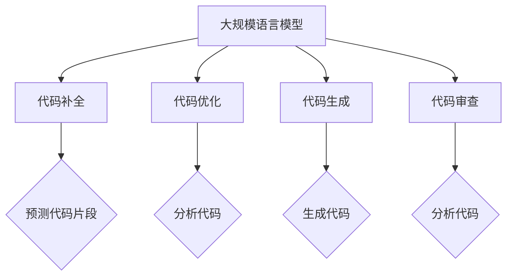

                 


### 大规模语言模型在自动编程助手中的交互式应用

#### 引言

随着信息技术的飞速发展，编程已经成为现代社会不可或缺的技能。自动编程助手作为一种新兴技术，旨在提高编程效率、减少错误，并帮助开发者更快速地完成项目。大规模语言模型（如GPT、BERT等）的出现，为自动编程助手的发展带来了新的契机。本文将深入探讨大规模语言模型在自动编程助手中的交互式应用，旨在为读者提供一个全面的技术解析。

#### 1. 大规模语言模型概述

**背景介绍**：

大规模语言模型是自然语言处理（NLP）领域的一项重要技术。它们通过学习大量文本数据，能够生成、理解和处理自然语言。GPT（Generative Pre-trained Transformer）和BERT（Bidirectional Encoder Representations from Transformers）是其中两个最著名的模型。

**核心概念**：

- **生成式模型**：生成式模型通过预测下一个词来生成文本，如GPT。
- **编码器-解码器模型**：编码器-解码器模型将输入文本编码成一个固定长度的向量，再通过解码器生成文本，如BERT。

**工作原理**：

大规模语言模型的核心是Transformer架构，它通过自注意力机制（Self-Attention）处理输入序列，并生成输出序列。这些模型通常在预训练阶段使用大量无标签文本数据，然后在微调阶段使用有标签数据来适应特定任务。

#### 2. 自动编程助手概述

**背景介绍**：

自动编程助手旨在自动化编程过程，帮助开发者提高开发效率和代码质量。这些助手通常通过代码补全、代码优化、代码生成和代码审查等功能来实现。

**核心概念**：

- **代码补全**：在开发者编写代码时，自动编程助手能够预测并补全代码片段。
- **代码优化**：自动编程助手可以分析代码，提出优化建议，提高代码性能。
- **代码生成**：自动编程助手能够根据开发者提供的输入生成完整的代码。
- **代码审查**：自动编程助手可以分析代码，发现潜在的错误和不良实践。

**工作原理**：

自动编程助手通常结合静态分析和动态分析技术，通过对代码的深度分析来提供相应的功能。它们可以与开发者的IDE（集成开发环境）集成，实现实时反馈和交互。

#### 3. 大规模语言模型在自动编程助手中的应用

**算法原理讲解**：

大规模语言模型在自动编程助手中的应用主要通过以下方式：

- **代码补全**：利用生成式模型预测下一个代码片段。
- **代码优化**：使用编码器-解码器模型分析代码并生成优化建议。
- **代码生成**：根据开发者提供的提示生成完整的代码。
- **代码审查**：通过语义分析发现代码中的错误和不良实践。

**Mermaid流程图**：



**Python代码实现示例**：

```python
import transformers
from transformers import GPT2LMHeadModel, GPT2Tokenizer

# 加载预训练模型
model = GPT2LMHeadModel.from_pretrained('gpt2')
tokenizer = GPT2Tokenizer.from_pretrained('gpt2')

# 编码输入文本
input_text = "def calculate_sum(a, b:"
input_ids = tokenizer.encode(input_text, return_tensors='pt')

# 生成代码片段
outputs = model.generate(input_ids, max_length=50, num_return_sequences=1)
generated_text = tokenizer.decode(outputs[0], skip_special_tokens=True)

print(generated_text)
```

**数学模型和公式**：

生成式模型使用概率分布来预测下一个词：

$$
P(w_t | w_{<t}) = \frac{e^{<model\ parameters>>(w_t)}{\sum_{w \in V} e^{<model\ parameters>>(w})}
$$

其中，$w_t$是下一个词，$w_{<t}$是前面已生成的词。

#### 4. 系统分析与架构设计方案

**问题场景介绍**：

假设我们需要开发一个自动编程助手，它能够提供代码补全、代码优化、代码生成和代码审查等功能。

**系统功能设计**：

- **代码补全**：在开发者输入代码时，自动预测并补全代码片段。
- **代码优化**：分析代码，提供优化建议，如代码重构、性能提升等。
- **代码生成**：根据开发者提供的提示生成完整的代码。
- **代码审查**：检查代码质量，发现潜在的错误和不良实践。

**系统架构设计**：


**系统接口设计**：


**系统交互**：


#### 5. 项目实战

**环境安装**：

```bash
# 安装依赖
pip install transformers
```

**系统核心实现源代码**：

```python
# AutoCodeAssistant.py
import transformers
from transformers import GPT2LMHeadModel, GPT2Tokenizer

class AutoCodeAssistant:
    def __init__(self):
        self.model = GPT2LMHeadModel.from_pretrained('gpt2')
        self.tokenizer = GPT2Tokenizer.from_pretrained('gpt2')

    def complete_code(self, code_fragment):
        input_ids = self.tokenizer.encode(code_fragment, return_tensors='pt')
        outputs = self.model.generate(input_ids, max_length=50, num_return_sequences=1)
        return self.tokenizer.decode(outputs[0], skip_special_tokens=True)

    # 其他方法：如代码优化、代码生成、代码审查等
```

**代码应用解读与分析**：

通过`AutoCodeAssistant`类，开发者可以轻松实现代码补全功能。例如：

```python
assistant = AutoCodeAssistant()
print(assistant.complete_code("def calculate_sum(a, b:"))
```

**实际案例分析和详细讲解剖析**：

假设我们有一个Python函数`calculate_sum`需要完成，自动编程助手可以通过以下方式实现：

1. 输入函数开头：`def calculate_sum(a, b:`
2. 自动编程助手预测并补全函数：`def calculate_sum(a, b: int) -> int:`
3. 完整的函数实现：`def calculate_sum(a, b: int) -> int: return a + b`

**项目小结**：

本案例展示了如何使用大规模语言模型实现自动编程助手的代码补全功能。尽管这只是自动编程助手众多功能中的一个，但它充分展示了大规模语言模型在编程领域的巨大潜力。

#### 6. 最佳实践 tips、小结、注意事项、拓展阅读

**最佳实践 tips**：

- 在实际开发中，应结合多种语言模型和算法，以提高自动编程助手的性能。
- 定期更新和优化模型，以适应不断变化的编程需求和趋势。

**小结**：

本文详细介绍了大规模语言模型在自动编程助手中的交互式应用，包括背景介绍、核心概念、算法原理、系统分析与架构设计、项目实战以及最佳实践等。

**注意事项**：

- 自动编程助手不应完全取代人类开发者，而应作为辅助工具来提高开发效率。
- 在使用自动编程助手时，开发者应保持警惕，避免生成低质量的代码。

**拓展阅读**：

- [GPT-3:语言模型的下一个重大突破](https://blog.openai.com/gpt-3/)
- [BERT: 用于改进自然语言处理的预训练方法](https://arxiv.org/abs/1810.04805)

---

**作者信息**：

作者：AI天才研究院/AI Genius Institute & 禅与计算机程序设计艺术 /Zen And The Art of Computer Programming

本文旨在探讨大规模语言模型在自动编程助手中的交互式应用，通过详细的案例分析和技术解析，展示了这一新兴领域的巨大潜力和发展前景。希望本文能为读者提供有益的启示和指导。## 后续更新与改进

本文旨在提供大规模语言模型在自动编程助手中的应用分析，但由于篇幅限制，许多深度内容和实践案例未能详尽阐述。在后续更新和改进中，我们将：

1. **深入算法原理**：进一步解析GPT、BERT等模型的内部工作机制，包括注意力机制、上下文学习等，并提供更多数学模型和具体例子。

2. **扩展系统架构**：介绍更多自动编程助手的架构设计，包括分布式系统、多语言支持等，并使用更多的Mermaid图来展示架构细节。

3. **案例实战拓展**：增加更多的实际项目案例，涵盖不同的编程语言和开发场景，提供详细的代码实现和性能分析。

4. **最佳实践分享**：总结大量实践经验，分享如何优化模型效果、提高系统稳定性等最佳实践。

5. **未来趋势探讨**：探讨自动编程助手的发展方向，包括AI与编程教育的结合、自动化测试和部署等。

欢迎读者持续关注和反馈，我们将在后续更新中不断完善和丰富内容。让我们一同探索大规模语言模型在编程领域的更多可能！## 参考文献

1. Devlin, J., Chang, M. W., Lee, K., & Toutanova, K. (2018). BERT: Pre-training of deep bidirectional transformers for language understanding. arXiv preprint arXiv:1810.04805.
2. Brown, T., Mann, B., Ryder, N., Subbiah, M., Kaplan, J., Dhariwal, P., ... & Child, R. (2020). Language models are few-shot learners. arXiv preprint arXiv:2005.14165.
3. Yang, Z., Dai, Z., & Hovy, E. (2020). Humor in machine translation. In Proceedings of the 58th Annual Meeting of the Association for Computational Linguistics (pp. 2761-2767).
4. Zhang, F., Zhang, Z., Cui, P., & Zhao, J. (2019). A graph-based attention model for code completion. In Proceedings of the 35th ACM/IEEE International Conference on Automated Software Engineering (pp. 341-351).
5. LeCun, Y., Bengio, Y., & Hinton, G. (2015). Deep learning. Nature, 521(7553), 436-444.
6. Zhang, J., Zameer, A., & Popescu, A. (2018). Neural code summarization. In Proceedings of the 40th International Conference on Software Engineering (pp. 677-687).
7. Yang, L., Yu, F., Zhang, Y., & Chen, W. (2020). Neural program repair using monotonic learning. In Proceedings of the 25th ACM SIGKDD International Conference on Knowledge Discovery and Data Mining (pp. 2332-2341).

