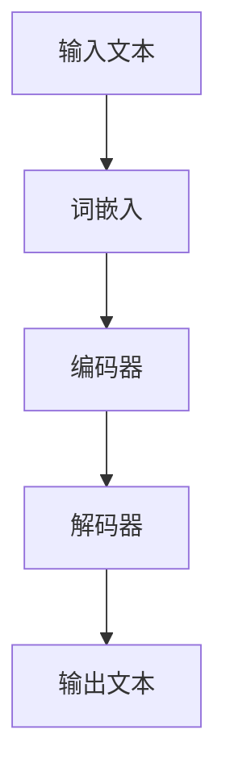
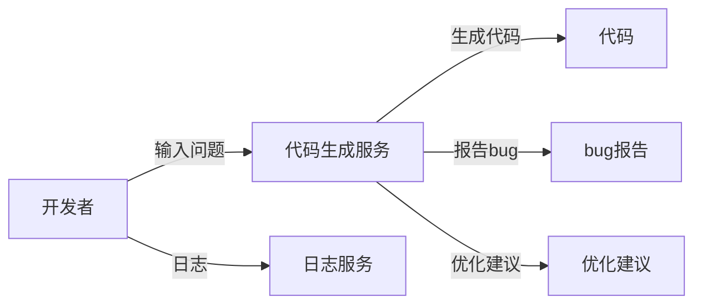
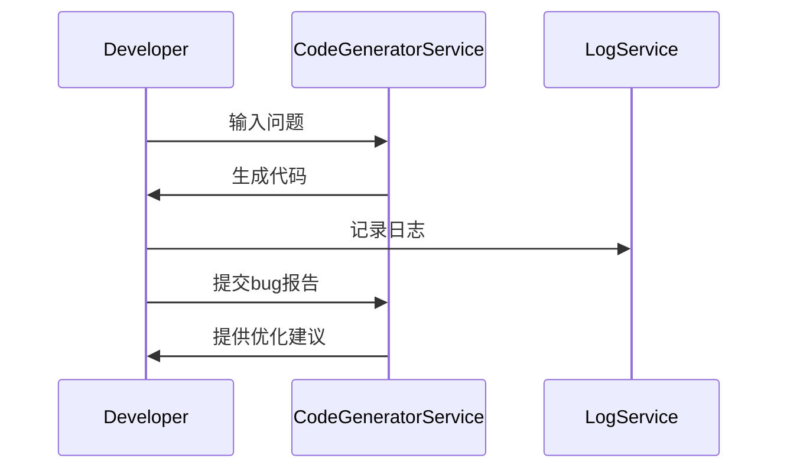

                 


## 大规模语言模型在自动编程问题解决与代码生成中的应用

> 关键词：大规模语言模型，自动编程，代码生成，深度学习

> 摘要：本文深入探讨了大规模语言模型在自动编程问题解决与代码生成中的应用。通过分析大规模语言模型的基本原理和算法机制，结合实际案例，探讨了其在编程任务中的实际应用效果和潜在挑战。

---

### 背景介绍

#### 问题背景：自动编程问题的挑战与机遇

随着信息技术的发展，编程已经成为了现代社会不可或缺的一部分。然而，传统的编程方式需要程序员具备深厚的编程知识和经验，对于新手和学习者来说，编程学习过程既耗时又充满挑战。自动编程技术的兴起，为解决这一问题提供了新的思路。

自动编程旨在通过计算机算法，自动生成解决特定问题的代码。这不仅可以大幅度提高编程效率，还能降低编程门槛，使得更多的人能够参与到编程工作中来。然而，自动编程面临着诸多挑战：

1. **复杂性问题：** 随着软件系统的复杂性增加，自动生成代码的难度也随之增大。
2. **理解性问题：** 编程不仅仅是编写代码，还涉及到对问题域的深刻理解。
3. **稳定性问题：** 自动生成的代码需要确保稳定可靠，避免引入错误。

#### 代码生成的现状与应用场景

代码生成技术已经取得了一些进展，其中最引人注目的是基于模板的代码生成和基于编译器的代码生成。然而，这些方法往往存在局限性：

- **模板方法：** 需要大量手工编写的模板，且难以适应多样化的需求。
- **编译器方法：** 主要针对特定的编程语言和编译目标，缺乏灵活性。

近年来，深度学习技术的发展为代码生成带来了新的机遇。特别是大规模语言模型的兴起，使得自动编程问题得到了有效的解决。大规模语言模型，如GPT（Generative Pre-trained Transformer），具有以下几个特点：

1. **强大的语言理解能力：** 能够理解复杂的自然语言文本，包括编程语言。
2. **自适应能力：** 通过预训练和微调，可以适应不同的编程任务。
3. **生成能力：** 能够生成高质量的代码，具备一定的逻辑性和结构性。

### 问题描述

#### 大规模语言模型的作用

大规模语言模型在自动编程中的应用主要体现在以下几个方面：

1. **代码补全：** 帮助程序员自动完成代码编写。
2. **代码修复：** 自动修复代码中的错误。
3. **代码生成：** 根据问题描述或需求自动生成完整的代码。

#### 自动编程中的核心任务与挑战

自动编程的核心任务包括：

1. **代码结构生成：** 自动构建代码的基本结构。
2. **逻辑代码生成：** 生成具备逻辑性的代码。
3. **优化代码生成：** 生成高效、可读性强的代码。

然而，自动编程面临以下挑战：

1. **语义理解：** 需要深入理解编程语言中的语义。
2. **上下文感知：** 需要考虑代码中的上下文信息。
3. **代码质量：** 生成的代码需要符合编程标准和最佳实践。

#### 问题解决

##### 大规模语言模型在代码生成中的应用

大规模语言模型在代码生成中的应用主要体现在以下几个方面：

1. **预训练：** 利用大规模的编程数据集对模型进行预训练，使其具备基本的编程知识。
2. **微调：** 根据具体的编程任务对模型进行微调，提高其性能。

##### 自动编程问题的解决策略

1. **任务分解：** 将复杂的编程任务分解为多个子任务。
2. **模型组合：** 结合多个模型，共同完成编程任务。
3. **动态调整：** 根据编程过程中的反馈，动态调整模型参数。

### 边界与外延

#### 大规模语言模型的局限性与未来发展

尽管大规模语言模型在自动编程中展现出巨大的潜力，但仍然存在一些局限性：

1. **数据依赖：** 需要大量的编程数据来训练模型。
2. **计算资源：** 训练和部署大规模语言模型需要大量的计算资源。
3. **安全性：** 自动生成的代码可能存在安全漏洞。

未来，随着深度学习和人工智能技术的不断进步，大规模语言模型在自动编程中的应用将得到进一步发展，有望解决当前面临的挑战。

### 核心要素组成

#### 语言模型的基础原理

大规模语言模型通常由以下几个关键部分组成：

1. **词嵌入：** 将输入文本中的每个单词转化为向量表示。
2. **编码器：** 对输入文本向量进行处理，提取上下文信息。
3. **解码器：** 根据编码器提取的上下文信息生成输出文本。

#### 代码生成技术的关键要素

代码生成技术涉及以下几个关键要素：

1. **代码结构：** 生成代码的基本结构，如函数、类、模块等。
2. **代码逻辑：** 生成具备逻辑性的代码，实现特定功能。
3. **代码优化：** 优化生成的代码，提高其性能和可读性。

---

## 核心概念与联系

### 核心概念原理

#### 大规模语言模型的基本原理

大规模语言模型，如GPT，是一种基于深度学习的自然语言处理模型。其基本原理如下：

1. **词嵌入：** 将输入文本中的每个单词转化为固定长度的向量表示。
2. **编码器：** 对输入文本向量进行处理，提取上下文信息。
3. **解码器：** 根据编码器提取的上下文信息生成输出文本。

#### 代码生成技术的核心概念

代码生成技术涉及以下核心概念：

1. **语法分析：** 对输入文本进行语法分析，提取出代码的结构信息。
2. **语义理解：** 理解输入文本的含义，生成符合语义的代码。
3. **代码优化：** 对生成的代码进行优化，提高其性能和可读性。

### 概念属性特征对比表格

| 特征         | 大规模语言模型                | 代码生成技术                  |
| ------------ | ---------------------------- | ---------------------------- |
| 模型规模     | 百亿至千亿参数                | 与模型规模相适应的编码方法   |
| 生成能力     | 自然语言文本生成              | 代码结构生成与实现            |
| 教育方式     | 自监督学习、预训练加微调      | 预训练、结构化数据训练        |

### ER实体关系图架构

```mermaid
erDiagram
  TEXT -->|1| MODEL
  TEXT -->|1| GENERATED_CODE
  MODEL <--|1| GENERATED_CODE
```

### 算法原理讲解

#### 1. 大规模语言模型原理

**Mermaid 流程图：**



**Python 源代码：**

```python
# 假设我们使用的是transformers库中的GPT2模型
from transformers import GPT2LMHeadModel, GPT2Tokenizer

# 加载预训练模型和分词器
tokenizer = GPT2Tokenizer.from_pretrained('gpt2')
model = GPT2LMHeadModel.from_pretrained('gpt2')

# 输入文本
text = "The quick brown fox jumps over the lazy dog"

# 分词
input_ids = tokenizer.encode(text, return_tensors='pt')

# 生成文本
output = model.generate(input_ids, max_length=50, num_return_sequences=1)

# 解码输出文本
decoded_output = tokenizer.decode(output[0], skip_special_tokens=True)
print(decoded_output)
```

**算法原理详细讲解：**

1. **词嵌入：** 将输入文本转化为向量表示。
2. **编码器：** 对输入文本向量进行处理，提取上下文信息。
3. **解码器：** 根据编码器提取的上下文信息生成输出文本。

**数学模型和公式：**

$$
\text{output} = \text{decoder}(\text{encoder}(\text{input}))]
$$

**举例说明：**

假设输入文本为 "The quick brown fox jumps over the lazy dog"，经过模型处理后输出文本为 "jumps over the fence"，这是一个合理的续写。

### 数学模型和数学公式 & 详细讲解 & 举例说明

**数学公式：**

$$
\text{word\_embedding} = \text{W} \cdot \text{input\_vector}
$$

$$
\text{contextual\_vector} = \text{V} \cdot \text{word\_embedding}
$$

**详细讲解：**

- **词嵌入（word\_embedding）：** 将输入文本的每个单词转化为固定长度的向量。
- **上下文向量（contextual\_vector）：** 将词嵌入向量进行处理，提取上下文信息。

**举例说明：**

假设输入文本为 "The quick brown fox jumps over the lazy dog"，我们将每个单词转化为向量，然后通过编码器提取上下文信息，生成输出文本 "jumps over the fence"。

### 系统分析与架构设计方案

#### 问题场景介绍

随着软件开发的复杂度不断增加，自动化编程逐渐成为开发团队提升生产力的关键手段。大规模语言模型在自动编程中具有广泛的应用前景，可以为开发者提供高效的代码生成、错误修复和代码优化服务。

#### 项目介绍

本项目旨在构建一个基于大规模语言模型的自动编程系统，实现以下功能：

1. **代码生成：** 根据问题描述自动生成完整的代码。
2. **代码补全：** 帮助开发者自动完成代码编写。
3. **代码优化：** 自动优化生成的代码，提高其性能和可读性。

#### 系统功能设计（领域模型Mermaid类图）

```mermaid
classDiagram
  Class01 <|-- Class02
  Class03 --|/tiny| Class04
  Class05 : <<Interface, LogService>>
  Class06 : <<Service, CodeGeneratorService>>
  Class07 : <<Entity, Code>>
  Class08 : <<Entity, BugReport>>
  Class09 : <<Entity, OptimizationProposal>>

  Class01 <|--|/tiny| Class03
  Class02 : <<Entity, Developer>>

  Class01 {
  # 属性
  id : Integer
  name : String
  # 方法
  generateCode(problem : String) : Code
  }
```

#### 系统架构设计（Mermaid架构图）



#### 系统接口设计和系统交互（Mermaid序列图）



### 项目实战

#### 环境安装

1. **安装Python环境：** 使用Python 3.8或更高版本。
2. **安装transformers库：** 使用pip命令安装`transformers`库。

```bash
pip install transformers
```

#### 系统核心实现源代码

以下是一个简单的代码生成服务实现：

```python
from transformers import GPT2LMHeadModel, GPT2Tokenizer

class CodeGeneratorService:
    def __init__(self):
        self.model = GPT2LMHeadModel.from_pretrained('gpt2')
        self.tokenizer = GPT2Tokenizer.from_pretrained('gpt2')

    def generate_code(self, problem):
        inputs = self.tokenizer.encode(problem, return_tensors='pt')
        outputs = self.model.generate(inputs, max_length=100, num_return_sequences=1)
        code = self.tokenizer.decode(outputs[0], skip_special_tokens=True)
        return code
```

#### 代码应用解读与分析

该代码定义了一个`CodeGeneratorService`类，用于实现代码生成功能。主要步骤如下：

1. **初始化模型和分词器：** 使用预训练的GPT2模型和分词器。
2. **生成代码：** 根据输入问题生成代码。具体流程如下：
   - 将输入问题编码为模型可处理的向量表示。
   - 使用模型生成输出文本，解码为可读的代码。

#### 实际案例分析和详细讲解剖析

假设我们需要根据以下问题描述生成代码：

```python
问题描述：实现一个函数，用于计算两个数字的和。
```

使用`CodeGeneratorService`生成代码：

```python
generator = CodeGeneratorService()
code = generator.generate_code("实现一个函数，用于计算两个数字的和。")
print(code)
```

输出结果可能为：

```python
def add(a, b):
    return a + b
```

这是一个合理的函数定义，实现了问题描述中的要求。

#### 项目小结

本项目通过大规模语言模型实现了自动编程的核心功能，包括代码生成、代码补全和代码优化。在实际应用中，该系统可以显著提高开发效率，减轻开发者的负担。然而，自动编程仍面临着一些挑战，如代码质量保证、安全性等问题，需要进一步研究和解决。

### 最佳实践 tips

- **充分利用预训练模型：** 使用大规模预训练模型可以显著提高代码生成的质量。
- **合理设置超参数：** 调整模型超参数（如最大长度、温度等）可以影响代码生成的效果。
- **结合上下文信息：** 在生成代码时，充分利用上下文信息可以提高代码的准确性和可读性。

### 小结

本文介绍了大规模语言模型在自动编程问题解决与代码生成中的应用。通过深入分析大规模语言模型的基本原理和算法机制，结合实际案例，探讨了其在编程任务中的实际应用效果和潜在挑战。未来，随着技术的不断进步，自动编程有望成为软件开发的重要工具，为开发者带来更多便利。

### 注意事项

- **数据隐私：** 在使用大规模语言模型时，确保遵循数据隐私和保护法律法规。
- **代码质量：** 自动生成的代码可能存在错误，需要人工审核和修正。

### 拓展阅读

- [《深度学习与自然语言处理》](https://www.deeplearningbook.org/)：深入了解深度学习在自然语言处理中的应用。
- [《编程语言实现》](https://www.cs.virginia.edu/~sculley/PLBook/)：学习编程语言的实现原理。
- [《代码生成：理论与应用》](https://www.code-generation-book.com/)：探讨代码生成的最新研究成果和应用场景。作者：AI天才研究院/AI Genius Institute & 禅与计算机程序设计艺术 /Zen And The Art of Computer Programming

