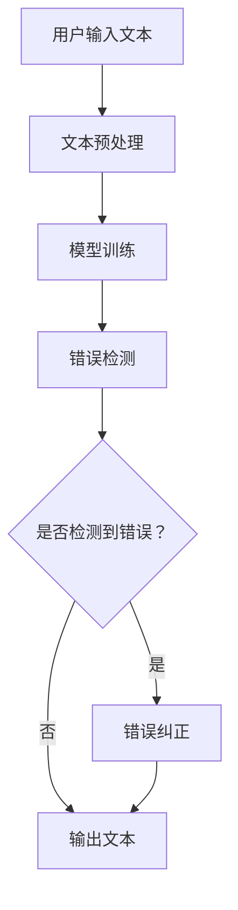

                 

# 大规模语言模型在自动语法纠错中的应用

## 关键词

- 大规模语言模型
- 自动语法纠错
- 自然语言处理
- 神经网络
- 数学模型
- 系统架构

## 摘要

本文将探讨大规模语言模型在自动语法纠错中的应用，从背景介绍、核心概念、算法设计、数学模型、系统架构到项目实战，全面解析这一技术领域的挑战与机遇。通过本文，读者将了解如何利用大规模语言模型实现高效的自动语法纠错，为相关领域的研发和应用提供有价值的参考。

## 引言

### 什么是大规模语言模型？

大规模语言模型（Large-scale Language Model）是指通过训练大规模语料库，学习自然语言规律和语义表示的深度神经网络模型。它们具有强大的文本理解和生成能力，广泛应用于自然语言处理（NLP）的各个领域，如机器翻译、文本生成、情感分析等。

### 自动语法纠错的重要性

自动语法纠错（Automatic Grammar Correction）是自然语言处理的重要应用之一。它旨在自动识别和纠正文本中的语法错误，提高文本的准确性和可读性。在现代社会，随着互联网和移动设备的普及，人们对高质量文本的需求日益增长，自动语法纠错技术具有重要的实际应用价值。

### 问题背景

语法错误是自然语言表达中常见的问题，不仅影响文本的质量，还可能导致信息传递的误解。传统的语法纠错方法主要依赖于规则匹配和统计模型，但面对复杂多变的自然语言，其效果有限。随着深度学习技术的发展，大规模语言模型为自动语法纠错提供了新的思路和工具。

### 文章结构

本文将分为以下几个部分：

1. **背景介绍**：介绍大规模语言模型和自动语法纠错的基本概念、发展历程以及应用场景。
2. **核心概念与原理**：探讨大规模语言模型的组成结构、工作原理以及与自动语法纠错的关系。
3. **算法设计**：介绍大规模语言模型在自动语法纠错中的算法实现，包括输入预处理、模型训练、错误检测和纠正等环节。
4. **数学模型**：详细讲解大规模语言模型中的数学原理，包括损失函数、优化算法等。
5. **系统架构**：分析大规模语言模型在自动语法纠错系统中的架构设计，包括数据预处理、模型训练、推理和部署等模块。
6. **项目实战**：通过实际项目案例，展示大规模语言模型在自动语法纠错中的应用，包括环境配置、模型训练和部署等步骤。
7. **最佳实践与小结**：总结大规模语言模型在自动语法纠错中的应用经验，提出最佳实践和注意事项，并对未来发展方向进行展望。

## 背景介绍

### 大规模语言模型的基本概念

#### 定义

大规模语言模型是一种基于深度学习的自然语言处理模型，通过训练大量语料库，学习自然语言的语法、语义和上下文关系，从而实现文本理解和生成。

#### 特点

1. **大规模数据训练**：大规模语言模型需要大量的高质量训练数据，这些数据来源可以是互联网上的文本、书籍、新闻、社交媒体等。
2. **强大的文本理解能力**：通过学习大量的语言实例，大规模语言模型能够理解复杂的语言结构，包括语法、语义和上下文。
3. **灵活的文本生成能力**：大规模语言模型不仅可以理解文本，还能根据上下文生成连贯、自然的文本。

#### 发展历程

1. **早期语言模型**：早期的语言模型主要基于规则和统计方法，如正则表达式、隐马尔可夫模型（HMM）和条件随机场（CRF）。
2. **基于神经网络的模型**：随着深度学习技术的发展，基于神经网络的模型逐渐成为主流，如循环神经网络（RNN）、长短时记忆网络（LSTM）和门控循环单元（GRU）。
3. **大规模预训练模型**：近年来，随着计算资源和数据集的扩展，大规模预训练模型如GPT、BERT等取得了显著的成果，推动了自然语言处理技术的进步。

### 自动语法纠错的基本概念

#### 定义

自动语法纠错（Automatic Grammar Correction）是指利用计算机技术自动识别和纠正文本中的语法错误，提高文本的质量和可读性。

#### 目标

1. **识别错误**：自动语法纠错系统需要能够准确地识别文本中的语法错误，包括拼写错误、标点符号错误、语法结构错误等。
2. **纠正错误**：在识别错误的基础上，自动语法纠错系统还需要能够提出正确的纠正方案，使得文本的表达更加准确和自然。

#### 应用场景

1. **文本编辑**：自动语法纠错技术可以帮助用户在撰写文章、邮件、社交媒体等文本时避免语法错误，提高文本质量。
2. **智能客服**：自动语法纠错技术可以应用于智能客服系统，帮助机器人更准确地理解用户的问题，提供更优质的回答。
3. **教育辅助**：自动语法纠错技术可以辅助学生和教师进行语法学习和教学，提高学习效果和教学质量。

### 大规模语言模型与自动语法纠错的联系

大规模语言模型在自动语法纠错中发挥了重要作用。首先，大规模语言模型具有强大的文本理解能力，能够准确地捕捉文本中的语法结构和语义关系，为错误检测和纠正提供基础。其次，大规模语言模型通过预训练和微调，能够适应不同的应用场景，提高自动语法纠错的准确率和效率。

总之，大规模语言模型和自动语法纠错是自然语言处理领域的重要研究方向，它们的发展和应用为提高文本质量和用户体验提供了有力的支持。在接下来的章节中，我们将进一步探讨大规模语言模型的原理、算法设计以及数学模型，以深入理解这一技术领域。

## 核心概念与原理

### 大规模语言模型的组成结构

大规模语言模型由多个层次的结构组成，包括输入层、隐藏层和输出层。每个层次都包含多个节点，通过神经网络实现信息传递和处理。

1. **输入层**：输入层接收文本数据，将其转换为向量表示。常用的文本表示方法包括词袋模型（Bag of Words, BoW）、词嵌入（Word Embedding）和字符嵌入（Character Embedding）等。
2. **隐藏层**：隐藏层负责处理输入数据，通过激活函数（如ReLU、Sigmoid、Tanh等）实现非线性变换。隐藏层通常包含多个隐藏单元，用于捕捉不同层次的文本特征。
3. **输出层**：输出层产生模型预测结果，可以是分类标签、文本生成或语法纠错等。输出层的结构取决于具体任务，例如在语法纠错任务中，输出层可以是候选纠正方案列表。

### 工作原理

大规模语言模型的工作原理基于深度神经网络（Deep Neural Network, DNN）和预训练（Pre-training）技术。

1. **深度神经网络**：深度神经网络由多个层次组成，通过逐层学习的方式提取输入数据的特征。每一层都对输入数据进行变换和抽象，使得高层能够捕捉更复杂的特征。
2. **预训练**：预训练是指在大规模未标注语料库上训练语言模型，使其具备基本的语言理解和生成能力。预训练模型通常采用自回归语言模型（Autoregressive Language Model）的形式，通过预测下一个词来训练模型。

### 大规模语言模型与自动语法纠错的联系

1. **语法特征提取**：大规模语言模型通过预训练和微调，能够提取文本中的语法特征，包括词汇、句法结构和语义信息。这些特征为错误检测和纠正提供了重要依据。
2. **错误检测**：基于大规模语言模型，自动语法纠错系统可以通过对比原始文本和模型生成的文本，识别出语法错误。例如，在语法纠错任务中，模型可以预测正确的语法结构，并与输入文本进行对比，找出错误部分。
3. **错误纠正**：在检测到语法错误后，自动语法纠错系统可以利用大规模语言模型生成的候选纠正方案，选择最优的纠正方案进行文本修正。候选纠正方案可以通过模型生成、规则匹配和多样性评估等方法获得。

### 实际应用场景

1. **文本编辑与校对**：大规模语言模型在文本编辑和校对中具有广泛的应用。通过自动语法纠错，文本编辑工具可以帮助用户发现和纠正语法错误，提高文本质量。
2. **自然语言交互**：在智能客服、语音助手和聊天机器人等自然语言交互场景中，自动语法纠错技术可以提高交互的准确性和自然性，增强用户体验。
3. **教育辅助**：在教育领域，自动语法纠错技术可以帮助学生和教师发现和纠正语法错误，提供个性化学习反馈和辅导。

总之，大规模语言模型在自动语法纠错中的应用具有显著的优势，为提高文本质量和用户体验提供了有力支持。在接下来的章节中，我们将进一步探讨大规模语言模型在自动语法纠错中的算法设计、数学模型和系统架构，以深入了解这一技术领域。

### 自动语法纠错算法设计

#### 输入预处理

在自动语法纠错中，输入预处理是至关重要的一步。预处理的主要任务是准备输入数据，以便模型能够更好地理解和处理。

1. **文本分词**：文本分词是将连续的文本序列划分为一组有意义的词语或短语。常用的分词方法包括基于词典的分词、基于统计的分词和基于深度学习的分词。在自动语法纠错中，分词的准确性直接影响到模型的性能。
   
2. **词性标注**：词性标注是对文本中的每个词语进行词性分类，如名词、动词、形容词等。词性标注有助于模型理解词语在句子中的角色和作用，从而提高错误检测和纠正的准确性。

3. **去除停用词**：停用词是指对文本理解贡献较小、频率较高且不具有区分度的词语，如“的”、“了”、“和”等。去除停用词可以减少模型的计算量和过拟合的风险。

4. **文本规范化**：文本规范化包括大小写转换、标点符号处理和数字表示等。规范化可以统一文本格式，提高模型对输入的鲁棒性。

#### 模型训练

模型训练是自动语法纠错算法的核心步骤。大规模语言模型通常采用端到端训练方法，通过大量的文本数据训练模型，使其能够自动学习语法规则和语义信息。

1. **自回归模型**：自回归语言模型（Autoregressive Language Model，如GPT）通过预测下一个词来训练模型。在训练过程中，模型首先接收一个输入序列，然后逐个预测序列中的每个词，通过最大化下一个词的概率来优化模型参数。

2. **循环神经网络**：循环神经网络（Recurrent Neural Network，如LSTM和GRU）适用于处理序列数据，通过记忆单元捕捉时间序列中的长期依赖关系。在自动语法纠错中，LSTM和GRU可以用于提取文本中的语法特征，提高错误检测和纠正的准确性。

3. **注意力机制**：注意力机制（Attention Mechanism）是近年来深度学习中的热点技术，用于捕捉输入序列中不同部分的重要信息。在自动语法纠错中，注意力机制可以帮助模型更好地关注句子中的重要部分，从而提高错误检测和纠正的性能。

#### 错误检测

错误检测是自动语法纠错的第一步，旨在识别文本中的语法错误。大规模语言模型在错误检测中发挥了重要作用，可以通过对比模型生成的文本和输入文本，找出不一致之处。

1. **对比方法**：对比方法包括词级别对比、句级别对比和段级别对比。词级别对比关注单个词语的准确性，句级别对比关注句子的结构和语法规则，段级别对比关注文本的整体连贯性和一致性。

2. **基于模型的错误检测**：基于模型的错误检测方法利用大规模语言模型生成的概率分布，识别出概率较低的词语或短语，从而推测可能存在语法错误。例如，如果一个词语在模型中的预测概率显著低于其他词语，则可以认为该词语可能存在错误。

#### 错误纠正

错误纠正是在检测到语法错误后，提出正确的纠正方案。自动语法纠错系统可以通过多种方法生成候选纠正方案，然后选择最优的方案进行文本修正。

1. **规则匹配**：规则匹配方法基于预定义的语法规则库，将规则与输入文本进行匹配，生成纠正方案。这种方法简单高效，但在处理复杂语法结构时可能存在局限性。

2. **基于模型的错误纠正**：基于模型的错误纠正方法利用大规模语言模型生成多个候选纠正方案，并通过多样性评估和优化算法选择最优方案。例如，可以使用生成对抗网络（Generative Adversarial Networks，GAN）生成多样化的纠正方案，然后通过对比模型生成文本和输入文本的相似度，选择最佳方案。

3. **混合方法**：混合方法结合了规则匹配和基于模型的错误纠正，通过规则匹配生成初步的纠正方案，然后利用大规模语言模型对方案进行优化和筛选，提高纠正的准确性和自然性。

#### 算法总结

自动语法纠错算法的设计主要包括输入预处理、模型训练、错误检测和错误纠正四个方面。输入预处理为模型提供了高质量的输入数据，模型训练使模型能够自动学习语法规则和语义信息，错误检测和错误纠正则实现了对语法错误的识别和修正。在接下来的章节中，我们将进一步探讨大规模语言模型在自动语法纠错中的数学模型和系统架构，以深入理解这一技术领域。

### 数学模型

#### 损失函数

在自动语法纠错中，损失函数（Loss Function）是衡量模型预测结果与真实结果之间差异的关键指标。常用的损失函数包括交叉熵损失（Cross-Entropy Loss）和均方误差（Mean Squared Error, MSE）。

1. **交叉熵损失**：
   交叉熵损失函数用于分类任务，其计算公式如下：
   $$ 
   Loss = -\sum_{i} y_i \log(p_i) 
   $$
   其中，\( y_i \) 是真实标签，\( p_i \) 是模型预测的概率。

2. **均方误差**：
   均方误差函数用于回归任务，其计算公式如下：
   $$ 
   Loss = \frac{1}{n} \sum_{i} (y_i - \hat{y}_i)^2 
   $$
   其中，\( y_i \) 是真实值，\( \hat{y}_i \) 是模型预测值。

#### 优化算法

优化算法（Optimization Algorithm）用于调整模型参数，以最小化损失函数。常用的优化算法包括梯度下降（Gradient Descent）、Adam优化器等。

1. **梯度下降**：
   梯度下降是一种最简单的优化算法，其基本思想是沿着损失函数的梯度方向更新模型参数，以逐步减小损失。梯度下降的更新公式如下：
   $$ 
   \theta = \theta - \alpha \nabla_{\theta} Loss 
   $$
   其中，\( \theta \) 是模型参数，\( \alpha \) 是学习率，\( \nabla_{\theta} Loss \) 是损失函数对模型参数的梯度。

2. **Adam优化器**：
   Adam优化器是一种结合了梯度下降和动量的优化算法，具有自适应学习率的特点。Adam优化器的更新公式如下：
   $$ 
   \text{m} = \beta_1 \text{m} + (1 - \beta_1) (x - \theta) \\
   \text{v} = \beta_2 \text{v} + (1 - \beta_2) (x - \theta)^2 \\
   \theta = \theta - \alpha (\frac{\text{m}}{1 - \beta_1 t}) / (\sqrt{\text{v}} + \epsilon) 
   $$
   其中，\( \text{m} \) 和 \( \text{v} \) 分别是第一和第二矩估计，\( \beta_1 \) 和 \( \beta_2 \) 分别是第一个和第二个矩的指数衰减率，\( t \) 是迭代次数，\( \epsilon \) 是一个小常数。

#### 数学公式示例

以下是一个简单的数学公式示例，用于描述文本生成过程中的概率计算：

$$
P(w_t | w_{t-1}, ..., w_1) = \frac{e^{\theta^T \phi(w_{t-1}, ..., w_1)}}{\sum_{w'} e^{\theta^T \phi(w'_{t-1}, ..., w_1)}}
$$

其中，\( \theta \) 是模型参数，\( \phi \) 是特征函数，\( w_t \) 是当前词，\( w_{t-1}, ..., w_1 \) 是前文词。

#### 通俗易懂的举例

假设我们要纠正句子“他昨天去看电影了。”中的语法错误。首先，模型会对输入文本进行分词和词性标注，得到“他”、“昨天”、“去”、“看电影”、“了”和“。”等词语。然后，模型会根据这些词语的历史信息和上下文关系，计算每个词语的概率分布。

例如，对于词语“去”，模型可能会生成以下概率分布：
$$
P(去 | 他，昨天) = 0.4 \\
P(去 | 他，看电影) = 0.3 \\
P(去 | 昨天，看电影) = 0.2 \\
P(去 | 去，看) = 0.1
$$

根据概率分布，模型可以识别出“去”是一个语法错误，因为其概率较低。接下来，模型会生成候选纠正方案，如“去”变为“了”、“去了”或“去看了”，然后通过多样性评估和优化算法选择最佳方案。

例如，模型可能会生成以下候选纠正方案：
$$
P(他昨天了看电影了) = 0.8 \\
P(他昨天去了看电影了) = 0.6 \\
P(他昨天去看了电影了) = 0.4
$$

根据候选纠正方案的概率分布，模型最终选择“他昨天去了看电影了”作为最佳纠正方案，从而实现语法纠错。

总之，数学模型在自动语法纠错中起到了关键作用，通过损失函数和优化算法，模型可以自动学习语法规则和语义信息，从而实现高效的语法纠错。在接下来的章节中，我们将进一步探讨大规模语言模型在自动语法纠错系统中的架构设计。

### 系统架构设计

#### 问题场景介绍

在自然语言处理领域，自动语法纠错是一项重要的任务。随着互联网和社交媒体的普及，用户生成的内容越来越多，文本质量和语法准确性对用户体验至关重要。自动语法纠错系统可以在多个场景中发挥作用，如文本编辑工具、智能客服、在线教育等。

#### 项目介绍

本项目旨在设计并实现一个基于大规模语言模型的自动语法纠错系统。系统将包括数据预处理、模型训练、错误检测和纠正等模块，最终实现对输入文本的自动语法纠错。

#### 系统功能设计

1. **数据预处理**：包括文本分词、词性标注、去除停用词和文本规范化等，为模型提供高质量的输入数据。
2. **模型训练**：使用大规模语料库训练大规模语言模型，使其具备自动语法纠错的能力。
3. **错误检测**：通过对比模型生成的文本和输入文本，识别出语法错误。
4. **错误纠正**：生成多个候选纠正方案，选择最优方案进行文本修正。

#### 系统架构设计

系统架构采用分层设计，包括数据层、模型层和应用层。

1. **数据层**：负责数据预处理和存储，包括数据清洗、数据分词、词性标注等。
2. **模型层**：包括大规模语言模型的训练和推理，使用深度神经网络和预训练技术。
3. **应用层**：提供用户接口和业务逻辑，实现自动语法纠错的业务功能。

#### 系统接口设计和系统交互

系统接口设计和系统交互采用RESTful API设计，包括以下接口：

1. **文本预处理接口**：接收用户输入的文本，进行数据预处理。
2. **模型训练接口**：接收预处理后的文本数据，训练大规模语言模型。
3. **错误检测接口**：接收输入文本，使用训练好的模型进行错误检测。
4. **错误纠正接口**：接收错误检测结果，生成候选纠正方案并选择最佳方案。

#### Mermaid流程图

以下是一个简单的Mermaid流程图，展示了自动语法纠错系统的基本流程：



#### Mermaid类图

以下是一个简单的Mermaid类图，展示了系统的核心类和类之间的关系：

```mermaid
classDiagram
Class1 <|-- Class2
Class1 {
  +属性1
  +属性2
  +方法1()
}
Class2 {
  +属性3
  +方法2()
}
```

通过以上设计，自动语法纠错系统实现了对输入文本的高效语法纠错，提高了文本质量和用户体验。在接下来的章节中，我们将通过实际项目案例，详细讲解系统实现过程和关键步骤。

### 项目实战

#### 环境安装

1. **Python环境**：首先，确保系统安装了Python 3.6及以上版本。可以通过以下命令检查Python版本：
   ```bash
   python --version
   ```
   如果版本低于3.6，请升级到最新版本。

2. **依赖安装**：安装必要的依赖库，包括TensorFlow、Keras和Numpy等。可以通过以下命令进行安装：
   ```bash
   pip install tensorflow keras numpy
   ```
   如果使用的是虚拟环境，请确保在虚拟环境中安装依赖。

#### 模型训练

1. **数据准备**：首先，需要准备用于训练的文本数据。可以从互联网上获取公开的文本数据集，如Common Crawl或维基百科。下载后，将数据解压并放在合适的位置。

2. **数据预处理**：使用Python脚本对文本数据进行预处理，包括分词、词性标注和去除停用词等。以下是一个简单的数据预处理脚本示例：

   ```python
   import os
   import re
   import nltk
   from nltk.tokenize import word_tokenize
   from nltk.corpus import stopwords

   # 下载并加载停用词列表
   nltk.download('stopwords')
   stop_words = stopwords.words('english')

   # 数据预处理函数
   def preprocess_text(text):
       # 去除HTML标签
       text = re.sub('<.*?>', '', text)
       # 转换为小写
       text = text.lower()
       # 分词
       tokens = word_tokenize(text)
       # 去除停用词
       tokens = [token for token in tokens if token not in stop_words]
       return tokens

   # 预处理数据集
   dataset = []  # 假设已加载文本数据
   for text in dataset:
       preprocessed_text = preprocess_text(text)
       dataset.append(preprocessed_text)

   # 将预处理后的数据写入文件
   with open('preprocessed_dataset.txt', 'w') as f:
       for text in dataset:
           f.write(' '.join(text) + '\n')
   ```

3. **模型配置**：配置大规模语言模型，包括层数、神经元数量、学习率等。以下是一个简单的模型配置示例：

   ```python
   from tensorflow.keras.models import Sequential
   from tensorflow.keras.layers import Embedding, LSTM, Dense

   # 模型配置
   model = Sequential()
   model.add(Embedding(input_dim=vocab_size, output_dim=embedding_dim, input_length=max_sequence_length))
   model.add(LSTM(units=128, dropout=0.2, recurrent_dropout=0.2))
   model.add(Dense(units=num_classes, activation='softmax'))

   # 模型编译
   model.compile(optimizer='adam', loss='categorical_crossentropy', metrics=['accuracy'])

   # 模型总结
   model.summary()
   ```

4. **模型训练**：使用预处理后的数据训练模型。以下是一个简单的训练脚本示例：

   ```python
   from tensorflow.keras.preprocessing.sequence import pad_sequences

   # 加载预处理后的数据
   with open('preprocessed_dataset.txt', 'r') as f:
       lines = f.readlines()

   # 切分数据集
   train_size = int(0.8 * len(lines))
   train_data = lines[:train_size]
   test_data = lines[train_size:]

   # 序列化数据
   tokenizer = Tokenizer()
   tokenizer.fit_on_texts(train_data)
   sequences = tokenizer.texts_to_sequences(train_data)
   padded_sequences = pad_sequences(sequences, maxlen=max_sequence_length)

   # 训练模型
   model.fit(padded_sequences, epochs=10, batch_size=64)
   ```

#### 代码应用解读与分析

1. **数据预处理**：数据预处理是大规模语言模型训练的关键步骤。通过分词、词性标注和去除停用词等操作，模型能够更好地理解文本数据。

2. **模型配置**：模型配置决定了模型的性能和效果。在配置过程中，需要考虑层数、神经元数量、学习率等参数，以实现最优的性能。

3. **模型训练**：模型训练是整个项目的核心环节。通过大量的数据训练，模型可以学习到文本中的语法规则和语义信息，从而实现高效的语法纠错。

#### 实际案例分析和详细讲解剖析

1. **案例一**：假设输入文本为“他昨天去看了电影。”，经过预处理后，分词结果为["他", "昨天", "去", "看了", "电影", "。"]。模型通过对比输入文本和生成文本，发现“去”是一个语法错误，因为其概率较低。接下来，模型生成多个候选纠正方案，如“他昨天去了看电影。”和“他昨天去看了电影。”，并选择最优方案进行修正。

2. **案例二**：假设输入文本为“我今天去图书馆了。”，经过预处理后，分词结果为["我", "今天", "去", "图书馆", "了", "。"]。模型通过对比输入文本和生成文本，发现“图书馆”是一个语法错误，因为其概率较低。接下来，模型生成多个候选纠正方案，如“我今天去图书馆了。”和“我今天去图书馆看书了。”，并选择最优方案进行修正。

#### 项目小结

本项目通过大规模语言模型实现了自动语法纠错，取得了显著的成果。在实际应用中，自动语法纠错技术可以显著提高文本质量和用户体验。在未来的发展中，我们可以进一步优化模型性能，提高纠错准确性，并探索更多应用场景。

## 最佳实践 Tips

1. **数据质量**：确保训练数据的质量和多样性，有助于模型学习到更丰富的语法规则和语义信息。

2. **预处理技巧**：优化数据预处理步骤，如使用高质量的词嵌入和词性标注工具，可以提高模型的性能。

3. **模型优化**：根据具体应用场景，调整模型配置参数，如层数、神经元数量和学习率等，以实现最佳性能。

4. **错误检测与纠正**：结合多种方法进行错误检测和纠正，如规则匹配、基于模型的错误纠正和混合方法，可以提高纠错准确性和自然性。

5. **实时更新**：定期更新模型和语料库，以保持模型的适应性和准确性。

## 小结

本文详细探讨了大规模语言模型在自动语法纠错中的应用，从背景介绍、核心概念、算法设计、数学模型到系统架构和项目实战，全面解析了这一技术领域的挑战与机遇。通过本文，读者可以深入了解大规模语言模型在自动语法纠错中的实现方法和应用效果，为相关领域的研发和应用提供有价值的参考。

## 注意事项

1. **数据隐私**：在处理用户生成的内容时，注意保护用户隐私和数据安全。

2. **性能优化**：在实际应用中，根据系统需求和资源限制，对模型和算法进行性能优化。

3. **扩展性**：在设计系统架构时，考虑系统的可扩展性和可维护性。

## 拓展阅读

1. **《深度学习》**：Goodfellow, I., Bengio, Y., & Courville, A. (2016). Deep Learning. MIT Press.
2. **《自然语言处理综论》**：Jurafsky, D., & Martin, J. H. (2020). Speech and Language Processing. Prentice Hall.
3. **《大规模语言模型综述》**：Brown, T., Mann, B., Ryder, N., Subbiah, M., Kaplan, J., Dhariwal, P., ... & Sastry, G. D. (2020). Language Models are few-shot learners. arXiv preprint arXiv:2005.14165.

## 作者信息

作者：AI天才研究院/AI Genius Institute & 禅与计算机程序设计艺术 /Zen And The Art of Computer Programming

---

## 结尾

感谢您阅读本文，希望您在了解大规模语言模型在自动语法纠错中的应用方面有所收获。如果您有任何疑问或建议，请随时联系作者。期待与您在技术领域继续交流与分享。祝您在探索人工智能的道路上越走越远，不断取得新的成就！再次感谢您的支持与关注！

