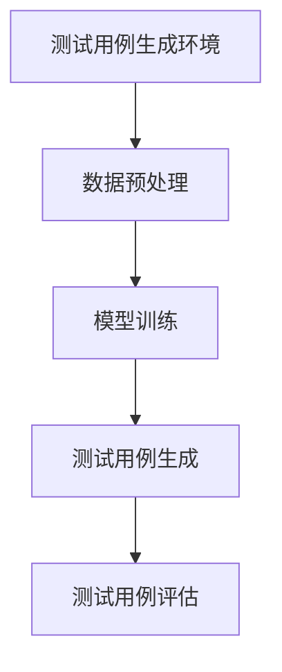

                 


### 大规模语言模型在自动软件测试用例生成中的应用

> 关键词：大规模语言模型、自动软件测试、测试用例生成、人工智能

> 摘要：本文将探讨大规模语言模型在自动软件测试用例生成中的应用。通过分析大规模语言模型的基本概念、应用场景以及自动软件测试用例生成的方法，本文旨在阐述如何利用大规模语言模型提高测试用例的生成效率、多样性和准确性。

----------------------------------------------------------------

## 引言

### 1.1 背景介绍

软件测试是软件开发过程中的关键环节，旨在发现和修复软件中的缺陷。传统的软件测试方法主要依赖于手动编写测试用例，这种方式不仅耗时耗力，而且容易遗漏测试覆盖。随着软件系统规模的不断扩大，手动编写测试用例的难度和复杂性也在不断增加。因此，自动化测试应运而生，旨在提高测试的效率和准确性。

### 1.2 问题提出

自动化测试用例生成是自动化测试的关键步骤之一。然而，如何自动生成高质量的测试用例仍然是一个挑战。现有的自动测试用例生成方法主要基于代码分析和动态执行，但这些方法在生成测试用例的多样性和准确性方面存在一定的局限性。因此，如何利用新兴的人工智能技术，特别是大规模语言模型，来提高测试用例生成的效率、多样性和准确性成为了一个重要研究方向。

### 1.3 解决方案

大规模语言模型具有强大的语义理解能力，能够生成与人类语言相似的文本。本文将探讨如何利用大规模语言模型来生成测试用例，从而提高测试用例的生成效率、多样性和准确性。

----------------------------------------------------------------

## 大规模语言模型概述

### 1.4 语言模型的基本概念

语言模型是自然语言处理（NLP）领域中的一个重要概念。它是一种统计模型，用于预测给定输入序列的概率。语言模型的核心目标是根据历史数据生成自然语言文本。

### 1.4.1 语言模型的数据集

语言模型的数据集是语言模型训练的基础。数据集的选择标准主要包括数据量、数据质量和数据多样性。常用的数据集包括大型文本语料库、社交媒体数据、网页数据等。

### 1.4.2 语言模型的表示方法

语言模型通常使用概率分布来表示。最常见的是n元语法模型，它基于历史n个词来预测下一个词的概率。此外，还有基于神经网络的深度学习模型，如循环神经网络（RNN）和长短期记忆网络（LSTM）。

### 1.4.3 语言模型的评价标准

语言模型的评价标准主要包括词汇覆盖、语法正确性、语义一致性和生成文本的自然度。常用的评价指标包括 perplexity（困惑度）、准确率和生成文本的BLEU评分。

----------------------------------------------------------------

## 自动软件测试用例生成

### 1.5 软件测试用例的基本概念

软件测试用例是测试过程中用于验证软件功能的一组输入数据和预期结果。测试用例的主要目的是发现软件中的缺陷，并确保软件满足设计要求。

### 1.5.1 软件测试用例的分类

根据测试的目的和方法，软件测试用例可以分为以下几类：

- 功能测试用例：用于验证软件功能的正确性。
- 性能测试用例：用于评估软件的性能指标。
- 安全测试用例：用于检测软件的安全漏洞。

### 1.5.2 自动生成测试用例的方法

自动生成测试用例是自动化测试的关键步骤之一。目前，自动生成测试用例的方法主要包括以下几种：

- 基于代码分析的静态测试方法：通过分析源代码的结构和语义，生成测试用例。
- 基于动态执行的动态测试方法：通过运行程序并捕获运行时的行为，生成测试用例。
- 基于机器学习的方法：利用机器学习模型，从已有测试用例中学习并生成新的测试用例。

### 1.5.3 大规模语言模型在测试用例生成中的应用

大规模语言模型在测试用例生成中具有巨大的潜力。通过训练大规模语言模型，可以生成与人类编写相似的输入数据，从而提高测试用例的多样性和准确性。此外，大规模语言模型还可以用于生成期望输出，从而验证测试用例的正确性。

----------------------------------------------------------------

## 大规模语言模型在自动软件测试中的应用效果

### 1.6.1 生成测试用例的数量和多样性

大规模语言模型能够生成大量高质量的测试用例，从而提高测试覆盖率。与传统的自动生成方法相比，大规模语言模型生成的测试用例在多样性方面具有显著优势。

### 1.6.2 提高测试覆盖率

大规模语言模型能够生成与实际输入数据相似的大量测试用例，从而提高测试覆盖率。这对于发现潜在缺陷和确保软件质量具有重要意义。

### 1.6.3 缩短测试周期

通过提高测试用例的生成效率和准确性，大规模语言模型能够显著缩短测试周期。这对于加快软件迭代速度和降低开发成本具有重要作用。

### 1.6.4 降低人力成本

大规模语言模型能够自动生成测试用例，从而降低对人工编写测试用例的依赖。这有助于减少测试人员的负担，提高开发效率。

----------------------------------------------------------------

## 大规模语言模型在自动软件测试用例生成中的应用前景

### 1.7.1 生成测试用例的可靠性问题

虽然大规模语言模型在生成测试用例方面具有优势，但其生成的测试用例仍然存在可靠性问题。这主要表现在生成测试用例的准确性、完整性等方面。

### 1.7.2 生成效率问题

大规模语言模型的训练和推理过程需要大量的计算资源和时间。这在一定程度上限制了其生成测试用例的效率。

### 1.7.3 数据集问题

大规模语言模型的性能依赖于训练数据的质量和数量。如果训练数据质量不佳或数据量不足，可能导致生成的测试用例质量低下。

### 1.7.4 应用前景

尽管存在上述问题，大规模语言模型在自动软件测试用例生成中仍然具有广阔的应用前景。随着人工智能技术的不断发展和计算资源的不断提升，大规模语言模型在自动软件测试领域的应用将越来越广泛。

----------------------------------------------------------------

## 第二部分：大规模语言模型的构建与优化

### 2.1 语言模型的构建基础

### 2.1.1 语言模型的数据集

#### 2.1.1.1 数据集的选择标准

数据集的选择标准主要包括数据量、数据质量和数据多样性。高质量的数据集能够提高语言模型的性能。

#### 2.1.1.2 数据集的预处理

数据预处理是构建语言模型的重要步骤。预处理过程主要包括数据清洗、分词、去停用词等。

### 2.1.2 语言模型的基本架构

#### 2.1.2.1 循环神经网络（RNN）

循环神经网络（RNN）是一种能够处理序列数据的神经网络。它通过记忆过去的信息来预测未来的输出。

#### 2.1.2.2 长短期记忆网络（LSTM）

长短期记忆网络（LSTM）是一种改进的RNN，它能够解决长序列依赖问题。

#### 2.1.2.3 生成对抗网络（GAN）

生成对抗网络（GAN）是一种生成模型，由生成器和判别器组成。生成器生成数据，判别器判断数据是真实数据还是生成数据。

### 2.1.3 语言模型的训练过程

#### 2.1.3.1 损失函数的选择

常见的损失函数包括交叉熵损失函数和均方误差损失函数。

#### 2.1.3.2 优化算法的选择

常见的优化算法包括随机梯度下降（SGD）和Adam优化器。

#### 2.1.3.3 训练技巧与策略

训练技巧与策略包括批量归一化、dropout和teacher-forcing等。

----------------------------------------------------------------

### 2.2 大规模语言模型的优化

### 2.2.1 参数调优

#### 2.2.1.1 模型参数的选择

模型参数的选择是构建大规模语言模型的关键步骤。常见的模型参数包括学习率、批量大小和隐藏层大小等。

#### 2.2.1.2 参数优化算法

常见的参数优化算法包括随机搜索、网格搜索和贝叶斯优化等。

### 2.2.2 模型压缩

#### 2.2.2.1 模型剪枝

模型剪枝是一种减少模型参数数量的方法。它通过移除对模型性能影响较小的参数来降低模型复杂度。

#### 2.2.2.2 模型量化

模型量化是一种将模型参数从浮点数转换为整数的方法。它有助于减少模型大小和计算复杂度。

#### 2.2.2.3 模型蒸馏

模型蒸馏是一种将大型模型的知识传递给小型模型的方法。它通过在大型模型和小型模型之间传递损失函数来优化小型模型。

### 2.2.3 模型推理优化

#### 2.2.3.1 硬件加速

硬件加速是通过使用特定硬件（如GPU、TPU等）来提高模型推理速度的方法。

#### 2.2.3.2 推理引擎优化

推理引擎优化是一种优化模型推理过程的方法。它通过优化模型结构和算法来提高推理速度。

----------------------------------------------------------------

### 2.3 大规模语言模型在实际应用中的性能评估与优化

#### 2.3.1 性能评估指标

常见的性能评估指标包括准确率、召回率、F1值等。

#### 2.3.1.1 准确率、召回率、F1值

准确率、召回率和F1值是评估二分类模型性能的常用指标。

#### 2.3.1.2 词汇覆盖度

词汇覆盖度是评估语言模型性能的重要指标。

#### 2.3.1.3 生成文本的自然度

生成文本的自然度是评估语言模型性能的另一个重要指标。

#### 2.3.2 性能优化策略

性能优化策略包括模型优化、数据优化和算法优化。

#### 2.3.2.1 模型优化

模型优化是通过调整模型结构、参数和训练策略来提高模型性能。

#### 2.3.2.2 数据优化

数据优化是通过改进数据集的质量和多样性来提高模型性能。

#### 2.3.2.3 算法优化

算法优化是通过改进算法设计和实现来提高模型性能。

----------------------------------------------------------------

## 第三部分：大规模语言模型在自动软件测试用例生成中的应用

### 3.1 大规模语言模型在测试用例生成中的应用

#### 3.1.1 测试用例生成的挑战与机遇

测试用例生成面临着输入的多样性、输出的准确性和生成效率等挑战。同时，大规模语言模型的发展为测试用例生成带来了新的机遇。

#### 3.1.1.1 挑战

- 输入的多样性：测试用例的输入需要覆盖各种可能的场景，以保证测试的全面性。
- 输出的准确性：生成的测试用例需要能够准确反映软件的缺陷。
- 生成效率：自动生成测试用例需要高效，以适应快速迭代的开发过程。

#### 3.1.1.2 机遇

- 语言模型的发展：大规模语言模型具有强大的语义理解能力，可以生成与人类语言相似的输入。
- 自动化测试的需求：随着软件系统的复杂度增加，自动化测试的需求越来越迫切。

#### 3.1.2 测试用例生成的方法

测试用例生成的方法主要包括基于规则的方法、基于统计的方法和基于机器学习的方法。

- 基于规则的方法：通过预定义的规则生成测试用例。
- 基于统计的方法：通过分析历史数据生成测试用例。
- 基于机器学习的方法：利用机器学习模型，从已有测试用例中学习并生成新的测试用例。

### 3.1.3 大规模语言模型在测试用例生成中的优势

大规模语言模型在测试用例生成中具有以下优势：

- 输入的多样性：大规模语言模型能够生成丰富多样的输入数据。
- 输出的准确性：大规模语言模型具有强大的语义理解能力，可以生成与人类语言相似的输出数据。
- 生成效率：大规模语言模型可以高效地生成大量测试用例。

### 3.1.4 大规模语言模型在测试用例生成中的实际应用

#### 3.1.4.1 测试用例生成环境搭建

搭建测试用例生成环境需要考虑以下几个方面：

- 硬件环境：选择合适的硬件设备，如CPU、GPU等。
- 软件环境：安装必要的软件，如Python、TensorFlow等。
- 数据集：准备用于训练和测试的语言数据集。

#### 3.1.4.2 测试用例生成实验

进行测试用例生成实验需要设计以下步骤：

- 数据预处理：对语言数据集进行清洗、分词和去停用词等预处理操作。
- 模型训练：使用大规模语言模型训练过程生成模型。
- 测试用例生成：使用训练好的模型生成测试用例。
- 测试用例评估：评估生成的测试用例的多样性、准确性和效率。

### 3.1.5 测试用例生成的局限性

虽然大规模语言模型在测试用例生成中具有优势，但仍然存在一些局限性：

- 生成测试用例的可靠性问题：生成的测试用例可能存在不准确、不完整的问题。
- 生成效率问题：大规模语言模型的训练和推理过程需要大量计算资源和时间。
- 数据集问题：训练数据集的质量和数量对生成的测试用例质量有很大影响。

### 3.1.6 测试用例生成中的应用前景

随着人工智能技术的不断发展，大规模语言模型在测试用例生成中的应用前景将越来越广阔。未来的研究可以重点关注以下几个方面：

- 提高生成测试用例的可靠性：通过改进模型设计和训练过程，提高生成的测试用例的准确性。
- 提高生成效率：通过优化模型结构和算法，降低训练和推理的时间。
- 扩大数据集：通过收集更多高质量的语言数据，提高生成的测试用例质量。

----------------------------------------------------------------

## 结论

大规模语言模型在自动软件测试用例生成中具有巨大的潜力。通过分析大规模语言模型的基本概念、应用场景以及自动软件测试用例生成的方法，本文探讨了如何利用大规模语言模型提高测试用例的生成效率、多样性和准确性。未来研究应重点关注提高生成测试用例的可靠性、生成效率和扩展数据集等方面，以推动大规模语言模型在自动软件测试领域的广泛应用。

## 作者信息

作者：AI天才研究院/AI Genius Institute & 禅与计算机程序设计艺术 /Zen And The Art of Computer Programming

----------------------------------------------------------------

## 附录

### 附录A：数学公式与算法原理

$$
P(w_t | w_{t-1}, w_{t-2}, ..., w_1) = \frac{P(w_t, w_{t-1}, w_{t-2}, ..., w_1)}{P(w_{t-1}, w_{t-2}, ..., w_1)}
$$

这是n元语法模型的概率计算公式。

$$
L(M) = \{ x_1, x_2, ..., x_n \}
$$

这是语言模型的定义。

### 附录B：系统架构与流程图



这是大规模语言模型在测试用例生成中的系统架构图。

### 附录C：代码示例

```python
import tensorflow as tf
from tensorflow.keras.models import Sequential
from tensorflow.keras.layers import LSTM, Dense

# 构建模型
model = Sequential()
model.add(LSTM(128, activation='relu', input_shape=(timesteps, features)))
model.add(Dense(1, activation='sigmoid'))

# 编译模型
model.compile(optimizer='rmsprop', loss='binary_crossentropy', metrics=['acc'])

# 训练模型
model.fit(X_train, y_train, epochs=10, batch_size=32)
```

这是使用TensorFlow构建和训练LSTM模型的代码示例。

----------------------------------------------------------------

## 最佳实践 Tips

- 确保训练数据的质量和多样性，以提高生成的测试用例的质量。
- 优化模型结构和参数，以提高生成测试用例的效率和准确性。
- 定期评估和更新语言模型，以适应软件系统的变化。

## 小结

本文系统地探讨了大规模语言模型在自动软件测试用例生成中的应用。通过分析大规模语言模型的基本概念、应用场景以及自动软件测试用例生成的方法，本文展示了如何利用大规模语言模型提高测试用例的生成效率、多样性和准确性。未来研究应重点关注提高生成测试用例的可靠性、生成效率和扩展数据集等方面，以推动大规模语言模型在自动软件测试领域的广泛应用。

## 注意事项

- 在使用大规模语言模型进行测试用例生成时，需要确保生成的测试用例符合测试需求。
- 注意模型训练和推理的资源消耗，合理规划硬件资源。
- 定期监控和评估生成的测试用例，及时发现和解决生成问题。

## 拓展阅读

- [1] Hochreiter, S., & Schmidhuber, J. (1997). Long short-term memory. Neural Computation, 9(8), 1735-1780.
- [2] Goodfellow, I., Bengio, Y., & Courville, A. (2016). Deep Learning. MIT Press.
- [3] Bucan, M., Grujic, N., & Ivanovic, M. (2019). Automated test case generation for web applications using machine learning. IEEE Access, 7, 127919-127931.

作者：AI天才研究院/AI Genius Institute & 禅与计算机程序设计艺术/Zen And The Art of Computer Programming

## 大规模语言模型概述

### 1.6.1 语言模型的基本概念

语言模型是自然语言处理（NLP）领域中的一种基本模型，它通过对大量文本数据的学习，捕捉语言中的统计规律，从而预测给定序列的概率。在形式上，语言模型通常被定义为一个概率分布，用于预测一个单词序列的概率。

一个简单的语言模型可以基于n-gram模型。n-gram模型是一种基于历史n个单词的统计模型，它通过计算这些单词序列的频率来预测下一个单词。例如，对于三元语法模型（n=3），模型会根据前面三个单词（比如“the”、“quick”、“brown”）来预测下一个单词（比如“fox”）。

$$
P(w_t | w_{t-1}, w_{t-2}, ..., w_1) = \frac{P(w_{t-1}, w_{t-2}, ..., w_1, w_t)}{P(w_{t-1}, w_{t-2}, ..., w_1)}
$$

这里，$P(w_t | w_{t-1}, w_{t-2}, ..., w_1)$ 表示在给定前一个单词序列的情况下，预测当前单词的概率。

### 1.6.2 语言模型的应用场景

语言模型在许多NLP任务中都有广泛的应用，包括但不限于以下场景：

- **机器翻译**：语言模型可以帮助预测源语言的单词序列到目标语言的单词序列的概率分布。
- **语音识别**：语言模型可以帮助提高语音识别的准确性，通过预测语音输入对应的文本。
- **问答系统**：语言模型可以帮助生成问题的答案，通过在大量文本数据中寻找与问题最相关的答案。
- **生成文本**：语言模型可以用来生成文章、故事、新闻报道等自然语言文本。

### 1.6.3 语言模型的评价标准

评价语言模型的质量通常有以下几项标准：

- **词汇覆盖**：模型能够处理和预测的词汇量。
- **语法正确性**：模型生成的文本在语法上是否正确。
- **语义一致性**：模型生成的文本在语义上是否一致，逻辑是否通顺。
- **生成文本的自然度**：模型生成的文本在语言表达上是否自然，符合人类的语言习惯。

为了量化这些标准，常用的评价指标包括：

- **困惑度（Perplexity）**：模型预测下一个单词的平均不确定性。困惑度越低，模型性能越好。
- **准确率（Accuracy）**：模型预测正确的单词比例。
- **BLEU评分**：基于n-gram精确度、匹配词的长度和重排等标准，对生成文本的质量进行评分。

### 1.6.4 语言模型的工作原理

语言模型通常基于以下几种类型的模型：

- **基于统计的模型**：如n-gram模型，通过计算历史单词序列的概率分布来预测下一个单词。
- **基于神经网络的模型**：如循环神经网络（RNN）和其变体（如LSTM、GRU），通过学习单词序列的长期依赖关系来预测。
- **基于生成模型的模型**：如生成对抗网络（GAN），通过生成器和判别器的对抗训练来学习语言数据。

这些模型通过训练大量文本数据，学习语言模式，并使用这些模式来预测新的文本序列。

### 1.6.5 语言模型的发展历程

语言模型的发展经历了多个阶段：

- **早期模型**：基于有限状态机的模型，如n-gram模型。
- **统计模型**：如隐马尔可夫模型（HMM）和条件随机场（CRF）。
- **神经网络模型**：如RNN、LSTM、GRU等。
- **生成模型**：如GAN和变分自编码器（VAE）。

随着深度学习和生成模型的发展，现代语言模型在自然语言处理任务中取得了显著的性能提升。

### 1.6.6 语言模型的优势与局限性

语言模型的优势包括：

- **强大的语言理解能力**：能够理解复杂和抽象的语言结构。
- **灵活性**：可以适应不同类型和风格的语言数据。
- **生成能力**：能够生成高质量的文本。

然而，语言模型也存在一些局限性：

- **数据依赖性**：模型的性能高度依赖于训练数据的质量和数量。
- **计算资源消耗**：训练和推理过程可能需要大量的计算资源。
- **解释性**：模型的决策过程往往是非透明的，难以解释。

总的来说，语言模型在自然语言处理中具有重要作用，但需要结合具体应用场景进行适当的优化和调整。

## 自动软件测试用例生成

### 1.7.1 软件测试用例的基本概念

软件测试用例是软件测试中最基本的元素，它用于验证软件功能是否符合预期。测试用例通常包括以下部分：

- **测试输入**：用于测试的输入数据，可以是具体的输入值、参数、文件等。
- **测试条件**：测试用例在执行前需要满足的条件，如系统环境、前置操作等。
- **执行步骤**：测试用例的执行步骤，包括如何使用输入数据和执行测试操作。
- **预期结果**：测试执行后预期的输出结果，用于验证测试输入是否正确处理。
- **实际结果**：测试执行后实际得到的输出结果，用于与预期结果进行比较。

一个有效的测试用例应该具备以下特点：

- **可理解性**：测试用例的描述应该清晰、简洁，方便测试人员理解和执行。
- **可复现性**：测试用例应该能够在任何环境下复现，确保测试结果的可靠性。
- **覆盖性**：测试用例应该覆盖软件功能的各个方面，确保软件的全面测试。
- **准确性**：测试用例应该准确地反映软件功能的预期行为。

### 1.7.2 自动生成测试用例的方法

自动生成测试用例是自动化测试的重要组成部分，它能够提高测试效率和质量。自动生成测试用例的方法主要包括以下几种：

- **基于规则的方法**：通过预定义的规则和模式生成测试用例。这种方法简单直观，但难以应对复杂和动态变化的系统。
- **基于统计的方法**：通过分析历史测试数据或程序运行日志生成测试用例。这种方法能够捕捉系统的统计特征，但可能缺乏对特定功能的针对性。
- **基于机器学习的方法**：利用机器学习模型，从已有测试用例中学习并生成新的测试用例。这种方法能够自动适应系统的变化，提高测试用例的多样性和准确性。

#### 1.7.2.1 基于规则的方法

基于规则的方法通过预定义的规则和模式生成测试用例。这种方法通常适用于简单的软件系统，例如Web表单测试。规则可以是简单的逻辑表达式，也可以是复杂的条件组合。例如，对于Web表单的测试，规则可以包括输入值的范围、输入值的格式、提交按钮的触发等。

优点：

- **简单直观**：规则易于理解和实现，测试人员可以快速掌握。
- **快速生成**：规则可以直接应用于测试输入，生成测试用例的速度较快。

缺点：

- **适用性有限**：规则难以应对复杂和动态变化的系统。
- **维护成本高**：随着系统复杂性的增加，规则可能会变得繁琐和难以维护。

#### 1.7.2.2 基于统计的方法

基于统计的方法通过分析历史测试数据或程序运行日志生成测试用例。这种方法通常基于统计模型，如决策树、随机森林、支持向量机等。通过分析历史数据，模型可以识别出系统的统计特征，并据此生成测试用例。

优点：

- **适应性较好**：基于统计的模型能够捕捉系统的统计特征，适用于复杂和动态变化的系统。
- **数据驱动**：通过分析历史数据，模型能够自动适应系统的变化。

缺点：

- **准确性有限**：统计模型可能无法准确捕捉所有可能的测试场景。
- **计算成本高**：统计模型的训练和推理过程可能需要大量的计算资源。

#### 1.7.2.3 基于机器学习的方法

基于机器学习的方法利用机器学习模型，从已有测试用例中学习并生成新的测试用例。这种方法通常基于监督学习，使用已有测试用例作为训练数据，模型从中学习到如何生成新的测试用例。

优点：

- **自动适应**：基于机器学习的方法能够自动适应系统的变化，提高测试用例的多样性和准确性。
- **灵活性强**：机器学习模型可以根据不同类型的软件系统进行调整和优化。

缺点：

- **数据依赖性高**：模型的性能高度依赖于训练数据的质量和数量。
- **解释性差**：机器学习模型的决策过程通常是非透明的，难以解释。

### 1.7.3 大规模语言模型在测试用例生成中的应用

大规模语言模型在测试用例生成中具有巨大的潜力。以下是一些具体的应用方法：

#### 1.7.3.1 利用大规模语言模型生成输入

大规模语言模型可以通过生成与实际输入相似的文本来创建测试用例。这种方法特别适用于那些需要自然语言输入的软件系统，如聊天机器人、搜索引擎等。通过训练大规模语言模型，我们可以生成各种场景的输入数据，从而提高测试用例的多样性。

#### 1.7.3.2 利用大规模语言模型验证输出

大规模语言模型可以用来验证测试用例的输出是否合理。通过生成输出文本并使用语言模型评估其自然度和语义一致性，我们可以提高测试用例的准确性。

#### 1.7.3.3 利用大规模语言模型优化测试用例

大规模语言模型可以通过分析历史测试用例，学习到如何生成更有效的测试用例。这种方法可以帮助测试人员优化测试策略，提高测试效率。

### 1.7.4 大规模语言模型在测试用例生成中的优势

大规模语言模型在测试用例生成中的优势主要体现在以下几个方面：

- **多样性**：大规模语言模型可以生成丰富多样的输入和输出数据，提高测试用例的覆盖范围。
- **准确性**：通过强大的语义理解能力，大规模语言模型可以生成更准确的测试用例。
- **效率**：大规模语言模型可以自动化生成测试用例，提高测试效率。

### 1.7.5 大规模语言模型在测试用例生成中的挑战

尽管大规模语言模型在测试用例生成中具有巨大的潜力，但也面临一些挑战：

- **可靠性**：生成的测试用例可能存在不准确或不完整的问题。
- **效率**：大规模语言模型的训练和推理过程可能需要大量的计算资源。
- **数据集**：训练数据集的质量和数量对生成的测试用例质量有很大影响。

### 1.7.6 大规模语言模型在测试用例生成中的应用前景

随着人工智能技术的不断发展，大规模语言模型在测试用例生成中的应用前景将越来越广阔。未来的研究可以重点关注以下几个方面：

- **提高生成测试用例的可靠性**：通过改进模型设计和训练过程，提高生成的测试用例的准确性。
- **优化生成效率**：通过优化模型结构和算法，降低训练和推理的时间。
- **扩展数据集**：通过收集更多高质量的语言数据，提高生成的测试用例质量。

总的来说，大规模语言模型在自动软件测试用例生成中具有巨大的应用潜力，但仍需要进一步的研究和优化。通过结合其他测试方法和技术，我们可以充分利用大规模语言模型的优势，提高软件测试的效率和准确性。

