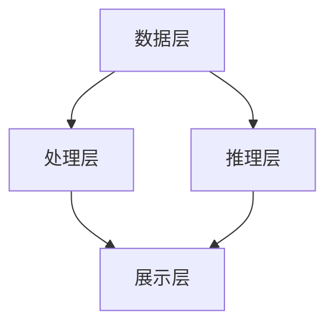
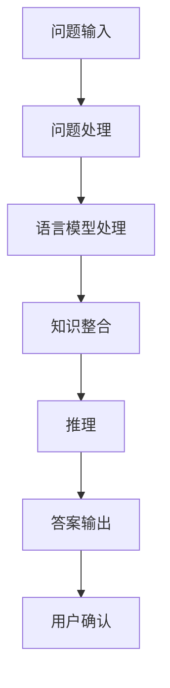

                 

### 第1章: 引言与背景

#### 1.1.1 问题背景

自动问答系统作为人工智能领域的重要应用之一，近年来受到了广泛关注。随着互联网信息的爆炸式增长，人们对于获取信息和知识的需求也越来越强烈。自动问答系统可以智能地理解用户的问题，提供准确的答案，极大地提高了信息检索的效率和准确性。然而，自动问答系统面临的挑战也日益严峻，其中最大的难题之一便是知识整合。

知识整合是指将不同来源、不同格式、不同粒度的知识信息进行有效整合，形成一个统一的知识体系。在自动问答系统中，知识整合的关键在于如何将分散的知识点通过语义关联，形成一个有机的整体，从而为用户提供准确、全面、连贯的答案。然而，由于知识本身的复杂性和多样性，知识整合面临着诸多挑战，如知识表示、知识抽取、知识融合等。

首先，知识表示是知识整合的基础。不同的知识类型和领域需要采用不同的表示方法。例如，结构化数据可以使用关系数据库进行表示，而半结构化和非结构化数据则需要采用文本挖掘、图像识别等技术进行表示。其次，知识抽取是知识整合的关键步骤，它涉及到从大量数据中提取出有价值的信息。然而，知识抽取过程面临着数据质量、噪声处理、歧义消解等问题。最后，知识融合是将不同来源、不同格式的知识进行整合，形成一个统一的知识体系。知识融合需要解决知识冲突、知识冗余、知识更新等问题。

#### 1.1.2 问题描述

在自动问答系统中，知识整合的作用至关重要。通过知识整合，自动问答系统可以更好地理解用户的问题，提供更准确、更全面的答案。然而，知识整合的实现并非易事，它涉及到多个方面的技术和方法。

首先，自动问答系统需要具备强大的语言处理能力。大规模语言模型作为一种先进的自然语言处理技术，已经在自动问答系统中得到了广泛应用。大规模语言模型可以智能地理解用户的问题，提取关键信息，生成准确的答案。然而，大规模语言模型在知识整合方面的表现仍存在一定的局限性。

其次，自动问答系统需要具备良好的知识表示能力。知识表示是将知识以结构化的形式进行组织和存储，以便于计算机理解和处理。目前，常用的知识表示方法包括知识图谱、本体论等。这些方法可以在一定程度上实现知识的整合，但仍存在一定的局限性。

最后，自动问答系统需要具备高效的推理能力。推理是将已知事实进行逻辑推导，得出新的结论。在知识整合过程中，推理可以帮助系统理解不同知识之间的关联，从而生成更准确、更连贯的答案。

#### 1.1.3 问题解决

为了解决自动问答系统中知识整合的难题，我们可以从以下几个方面进行思考：

首先，优化大规模语言模型。尽管大规模语言模型在自动问答系统中已经取得了显著的成果，但仍存在一定的局限性。例如，大规模语言模型在处理长文本、多义词等方面表现不佳。因此，我们可以通过改进大规模语言模型的算法，提高其在知识整合方面的表现。

其次，探索新的知识表示方法。现有的知识表示方法如知识图谱、本体论等在知识整合方面具有一定的局限性。我们可以尝试引入新的知识表示方法，如图神经网络、知识嵌入等，以提高知识整合的效率和准确性。

最后，加强推理能力。推理是知识整合的重要环节，它可以解决不同知识之间的关联问题。我们可以通过引入先进的推理算法，如图推理、逻辑推理等，提高自动问答系统在知识整合方面的能力。

通过上述方法，我们可以构建一个更高效、更准确的自动问答系统，从而更好地满足用户的需求。当然，这需要我们不断地探索、实践和改进，以实现自动问答系统中知识整合的完美解决方案。接下来，我们将对大规模语言模型和知识整合进行更深入的分析和探讨。## 第2章: 大规模语言模型的核心概念

#### 2.1.1 语言模型的基本原理

语言模型是自然语言处理（NLP）领域的基石，它旨在预测或生成自然语言中的下一个词或字符。这种预测是基于统计方法或机器学习算法，通过对大量文本数据的学习，语言模型能够捕捉语言中的概率分布。

**定义：**
语言模型是一种概率模型，它用于预测给定前文序列后最可能的下一个词或字符序列。

**分类：**
1. **基于N-gram的语言模型：** N-gram模型是最早期的语言模型之一，它基于前N个词（或字符）的联合概率来预测下一个词。例如，二元语法（Bigram）只考虑前一个词，而三元语法（Trigram）则考虑前两个词。
2. **神经网络语言模型：** 神经网络语言模型（如RNN、LSTM、Transformer等）通过深度学习技术学习语言的模式，能够捕捉更复杂的依赖关系。特别是Transformer模型，通过自注意力机制（Self-Attention）实现了对长距离依赖的捕捉，成为了当前语言模型的主流。

**语言模型的学习过程：**

1. **数据预处理：** 语言模型需要大量的文本数据作为训练集。在预处理过程中，首先对文本进行清洗，去除无关符号和噪声，然后进行分词或词嵌入，将文本转换为模型可处理的序列形式。

2. **模型训练：** 在训练过程中，模型会通过反向传播算法不断调整参数，以最小化损失函数。对于神经网络语言模型，训练过程通常涉及大量的迭代和梯度更新。

3. **模型优化：** 通过使用不同的优化技术和正则化方法，如dropout、梯度裁剪、学习率调整等，可以提高模型的泛化能力和稳定性。

**应用场景：**

1. **语音识别：** 语言模型在语音识别中用于将语音信号转换为文本，通过预测下一个词或字符来生成识别结果。

2. **自然语言处理：** 语言模型在各种NLP任务中都有广泛应用，如机器翻译、文本摘要、情感分析、问答系统等。

#### 2.1.2 语言模型的学习过程

语言模型的学习过程可以分为以下几个步骤：

1. **数据采集与预处理：**
   - **数据采集：** 收集大量文本数据，这些数据可以是书籍、文章、新闻报道、社交媒体帖子等。
   - **预处理：** 对文本进行分词、去除标点符号、停用词过滤等操作，将文本转换为适合训练的数据格式。

2. **模型训练：**
   - **构建模型：** 根据所选的算法，构建语言模型的结构。例如，对于Transformer模型，需要定义嵌入层、自注意力层和前馈神经网络。
   - **训练过程：** 通过训练算法（如梯度下降）和损失函数（如交叉熵损失），调整模型的参数以最小化预测误差。

3. **模型优化：**
   - **验证集调整：** 使用验证集调整模型的参数，避免过拟合。
   - **正则化：** 采用正则化方法（如dropout、L2正则化）提高模型的泛化能力。
   - **超参数调整：** 调整学习率、批量大小等超参数，以优化模型性能。

**数学模型与公式**

语言模型的核心是概率模型，其基本公式如下：

$$
P(\text{word}_t | \text{context}) = \frac{P(\text{context} \cap \text{word}_t)}{P(\text{context})}
$$

其中，\(P(\text{word}_t | \text{context})\) 表示在给定前文 \( \text{context} \) 下，下一个词 \( \text{word}_t \) 的条件概率。对于N-gram模型，这个概率可以表示为：

$$
P(\text{word}_t | \text{word}_{t-1}, \text{word}_{t-2}, ..., \text{word}_1) = \frac{N_t(\text{word}_{t-1}, \text{word}_{t-2}, ..., \text{word}_1, \text{word}_t)}{N_{t-1}(\text{word}_{t-1}, \text{word}_{t-2}, ..., \text{word}_1)}
$$

其中，\(N_t\) 表示词组 \( (\text{word}_{t-1}, \text{word}_{t-2}, ..., \text{word}_1, \text{word}_t) \) 的出现次数。

对于神经网络语言模型，概率预测通常通过输出层得到，其数学模型如下：

$$
P(\text{word}_t | \text{context}) = \text{softmax}(\text{model}(\text{context}))
$$

其中，\(\text{model}(\text{context})\) 是输入层到输出层的映射函数，通常是一个多层感知机（MLP）或变换器（Transformer）模型，而\(\text{softmax}\) 函数用于将模型的输出转换为概率分布。

通过上述公式和模型，我们可以对语言进行预测和生成，从而为自动问答系统提供强大的语言处理能力。在下一章中，我们将探讨知识整合的基本概念，进一步理解自动问答系统中知识整合的挑战和解决方案。## 第3章: 知识整合的基本概念

#### 3.1.1 知识整合的定义

知识整合是指将来自不同来源、不同格式、不同粒度的知识信息进行有效整合，形成一个统一的知识体系，以便于计算机处理和应用。在自动问答系统中，知识整合是实现智能回答的关键，它涉及到多个方面的技术和方法。

**内涵：**
知识整合的内涵包括知识的识别、抽取、融合、组织和管理。具体来说，知识整合需要解决以下问题：
- **知识的识别：** 确定哪些信息是有价值的，需要被整合到系统中。
- **知识的抽取：** 从原始数据中提取出有价值的知识。
- **知识的融合：** 将不同来源、不同格式的知识进行整合，形成一个统一的知识体系。
- **知识的组织：** 将整合后的知识以结构化的形式进行组织和存储。
- **知识的管理：** 对整合后的知识进行有效的管理和维护，确保其准确性和及时性。

**分类：**
知识整合可以分为以下几种类型：
1. **结构化知识整合：** 主要针对结构化数据，如关系数据库、XML文档等。这类知识整合通常使用数据库技术和查询语言来实现。
2. **半结构化知识整合：** 主要针对半结构化数据，如JSON、HTML等。这类知识整合通常使用文本挖掘和语义分析技术来实现。
3. **非结构化知识整合：** 主要针对非结构化数据，如文本、图像、音频等。这类知识整合通常使用深度学习和自然语言处理技术来实现。

**知识整合的基本流程：**
知识整合的基本流程包括以下几个步骤：
1. **数据采集：** 收集需要整合的数据，包括结构化、半结构化和非结构化数据。
2. **数据预处理：** 对采集到的数据进行清洗、去噪、标准化等预处理操作，以便于后续的知识抽取和整合。
3. **知识抽取：** 使用文本挖掘、信息抽取、图像识别等技术，从预处理后的数据中提取出有价值的信息。
4. **知识融合：** 将不同来源、不同格式的知识进行整合，形成一个统一的知识体系。这一过程可能涉及知识对齐、知识映射、知识融合算法等。
5. **知识组织：** 将整合后的知识以结构化的形式进行组织和存储，便于计算机处理和应用。
6. **知识管理：** 对整合后的知识进行有效的管理和维护，确保其准确性和及时性。

#### 3.1.2 知识整合的方法

知识整合的方法可以分为以下几种：

1. **知识抽取：**
   - **规则方法：** 基于预定义的规则，从文本中抽取知识。这种方法适用于结构化和半结构化数据。
   - **统计方法：** 基于统计学方法，如条件概率、贝叶斯网络等，从文本中抽取知识。这种方法适用于非结构化数据。
   - **机器学习方法：** 使用机器学习算法，如分类、聚类、序列标注等，从文本中抽取知识。这种方法具有较好的灵活性和泛化能力。

2. **知识融合：**
   - **基于规则的方法：** 通过定义规则，将不同来源、不同格式的知识进行整合。这种方法适用于结构化和半结构化数据。
   - **基于相似度的方法：** 通过计算知识之间的相似度，将相似的知识进行整合。这种方法适用于非结构化数据。
   - **基于语义的方法：** 通过语义分析，将具有相似语义的知识进行整合。这种方法适用于非结构化数据。

3. **知识推理：**
   - **基于规则的推理：** 使用预定义的规则，对知识进行推理和推导，以生成新的知识。
   - **基于概率的推理：** 使用概率模型，如贝叶斯网络、马尔可夫模型等，对知识进行推理和推导。
   - **基于神经网络的推理：** 使用神经网络模型，如RNN、LSTM、Transformer等，对知识进行推理和推导。

#### 3.1.3 知识整合的挑战

知识整合面临着诸多挑战，主要包括以下几个方面：

1. **知识表示：**
   - 知识表示是知识整合的基础，不同类型和领域的数据需要采用不同的表示方法。例如，结构化数据可以使用关系数据库进行表示，而半结构化和非结构化数据则需要采用文本挖掘、图像识别等技术进行表示。

2. **知识冲突：**
   - 在知识整合过程中，可能会出现不同来源、不同格式、不同粒度的知识之间存在冲突的情况。例如，同一概念在不同知识源中的定义可能不同，导致知识整合时出现矛盾。

3. **知识冗余：**
   - 知识整合过程中，可能会出现大量冗余知识，这些冗余知识不仅会增加系统的复杂性，还可能影响系统的性能。

4. **知识更新：**
   - 随着时间的推移，知识会不断更新和变化。如何及时、准确地更新知识体系，是知识整合面临的另一个挑战。

通过深入探讨知识整合的基本概念和方法，我们可以更好地理解自动问答系统中知识整合的挑战和解决方案。在下一章中，我们将探讨大规模语言模型在知识整合中的应用，进一步探讨其在自动问答系统中的作用和优势。## 第4章: 大规模语言模型在知识整合中的应用

#### 4.1.1 知识整合的流程

在自动问答系统中，知识整合是一个复杂的过程，涉及到数据的采集、预处理、知识抽取、知识融合、知识组织等多个环节。大规模语言模型在这一过程中发挥了关键作用，通过其强大的语言处理能力和自适应能力，提高了知识整合的效率和准确性。

1. **数据采集：** 自动问答系统需要从各种渠道收集数据，包括结构化数据、半结构化数据和非结构化数据。这些数据可以来源于数据库、网页、文献、社交媒体等。

2. **数据预处理：** 收集到的数据通常需要进行清洗、去噪、标准化等预处理操作，以便于后续的知识抽取和整合。大规模语言模型可以自动完成这些预处理任务，如分词、词性标注、实体识别等。

3. **知识抽取：** 使用文本挖掘、信息抽取等技术，从预处理后的数据中提取出有价值的信息，如关键词、短语、句子、实体等。大规模语言模型在这一过程中可以自动识别和提取关键信息，提高了知识抽取的准确性和效率。

4. **知识融合：** 将来自不同来源、不同格式的知识进行整合，形成一个统一的知识体系。大规模语言模型通过其强大的语义理解能力，可以自动识别和消除知识冲突，将不同来源的知识进行有效融合。

5. **知识组织：** 将整合后的知识以结构化的形式进行组织和存储，便于计算机处理和应用。大规模语言模型可以自动生成知识图谱、本体论等结构化知识表示形式，提高了知识组织的效率和质量。

6. **知识推理：** 在知识整合的基础上，进行推理和推导，生成新的知识。大规模语言模型通过其深度学习算法，可以实现基于规则的推理、概率推理和神经网络推理等多种推理方式，提高了知识整合的智能水平。

#### 4.1.2 知识整合的案例

为了更好地理解大规模语言模型在知识整合中的应用，我们来看一个具体的案例。

**案例：企业知识库的构建**

某大型企业为了提高内部信息检索和知识共享的效率，决定构建一个企业知识库。知识库的构建涉及到多个环节，包括数据采集、预处理、知识抽取、知识融合、知识组织等。在这个过程中，大规模语言模型发挥了关键作用。

1. **数据采集：** 企业从各个业务系统中提取数据，包括客户信息、产品信息、销售数据、市场调研报告等。

2. **数据预处理：** 使用大规模语言模型对数据集进行清洗、去噪、标准化等预处理操作，如分词、词性标注、实体识别等。

3. **知识抽取：** 使用文本挖掘和信息抽取技术，从预处理后的数据中提取出有价值的信息，如关键词、短语、句子、实体等。

4. **知识融合：** 使用大规模语言模型对提取出的知识进行整合，消除知识冲突，将不同来源的知识进行有效融合。

5. **知识组织：** 使用知识图谱等技术，将整合后的知识以结构化的形式进行组织和存储，便于计算机处理和应用。

6. **知识推理：** 在知识整合的基础上，使用大规模语言模型进行推理和推导，生成新的知识，如客户需求分析、产品市场趋势预测等。

通过这个案例，我们可以看到大规模语言模型在知识整合过程中的应用场景和作用。它不仅提高了知识整合的效率和质量，还为企业的决策提供了有力支持。

#### 4.1.3 知识整合的效果评估

知识整合的效果评估是衡量自动问答系统性能的重要指标。通常，可以从以下几个方面进行评估：

1. **知识完整性：** 评估知识库中知识点的覆盖范围和完整性，确保关键信息没有遗漏。

2. **知识准确性：** 评估知识库中知识的准确性，确保提供的信息是正确和可靠的。

3. **知识相关性：** 评估知识库中知识点的相关性，确保知识点的组织和连接是合理和有效的。

4. **知识更新频率：** 评估知识库的更新频率，确保知识库中的信息是最新和及时的。

5. **知识利用效率：** 评估自动问答系统对知识库中知识的利用效率，确保知识库中的知识能够被有效利用，为用户提供准确的答案。

通过以上评估指标，我们可以全面评估知识整合的效果，并不断优化知识整合的过程，提高自动问答系统的性能。## 第5章: 算法原理与数学模型

#### 5.1.1 大规模语言模型的算法原理

大规模语言模型是自然语言处理（NLP）领域的一项重要技术，它通过学习大量文本数据，预测或生成自然语言中的下一个词或字符序列。其核心思想是基于统计模型或深度学习算法，通过捕捉语言中的模式和规律，实现对语言的理解和生成。

**算法原理：**

1. **N-gram模型：** N-gram模型是最早的大规模语言模型之一，它基于前N个词（或字符）的联合概率来预测下一个词。具体来说，N-gram模型将文本序列拆分为N个词的子序列，然后计算每个子序列出现的概率。例如，在二元语法（Bigram）中，模型会计算每个词与其前一个词的联合概率。N-gram模型的数学公式如下：

   $$
   P(\text{word}_t | \text{word}_{t-1}) = \frac{N_t(\text{word}_{t-1}, \text{word}_t)}{N_{t-1}(\text{word}_{t-1})}
   $$

   其中，\(N_t\) 表示词组 \( (\text{word}_{t-1}, \text{word}_t) \) 的出现次数。

2. **神经网络语言模型：** 神经网络语言模型（Neural Network Language Model, NLM）是基于深度学习算法的语言模型，通过多层神经网络来捕捉语言中的复杂模式和依赖关系。Transformer模型是一种代表性的神经网络语言模型，它通过自注意力机制（Self-Attention）实现了对长距离依赖的捕捉，并且在多个NLP任务中取得了优异的性能。Transformer模型的数学公式如下：

   $$
   \text{Transformer} = \text{Encoder}(\text{input}) = \text{softmax}(\text{model}(\text{input}))
   $$

   其中，\(\text{model}(\text{input})\) 是输入层到输出层的映射函数，通常是一个多层感知机（MLP）或变换器（Transformer）模型，而\(\text{softmax}\) 函数用于将模型的输出转换为概率分布。

**算法流程：**

1. **数据预处理：** 首先，需要从大量文本数据中收集语料库，并对语料库进行清洗、分词、词嵌入等预处理操作，将文本转换为模型可处理的序列形式。

2. **模型训练：** 接下来，使用预处理后的数据对模型进行训练。训练过程中，模型通过反向传播算法不断调整参数，以最小化损失函数，如交叉熵损失。

3. **模型优化：** 在训练完成后，可以使用验证集对模型进行优化，调整模型参数，以避免过拟合。常见的优化方法包括学习率调整、批量大小、正则化等。

4. **模型评估：** 使用测试集对模型进行评估，计算模型在测试集上的性能指标，如准确率、召回率、F1值等。

**应用场景：**

1. **语音识别：** 语言模型在语音识别中用于将语音信号转换为文本，通过预测下一个词或字符来生成识别结果。

2. **机器翻译：** 语言模型在机器翻译中用于预测目标语言中的下一个词或字符，从而实现文本的翻译。

3. **文本生成：** 语言模型可以生成符合语法和语义规则的文本，应用于文本摘要、问答系统、对话系统等场景。

#### 5.1.2 知识整合的算法原理

知识整合是将来自不同来源、不同格式、不同粒度的知识信息进行有效整合，形成一个统一的知识体系。在自动问答系统中，知识整合的算法原理主要包括以下几个方面：

1. **知识抽取算法：** 知识抽取是知识整合的关键步骤，它从原始数据中提取出有价值的信息。常见的知识抽取算法包括基于规则的抽取、基于统计的抽取和基于机器学习的抽取。例如，实体识别和关系抽取是知识抽取的两个重要任务，可以使用命名实体识别（Named Entity Recognition, NER）和关系提取（Relation Extraction）算法来完成。

2. **知识融合算法：** 知识融合是将不同来源、不同格式的知识进行整合，形成一个统一的知识体系。常见的知识融合算法包括基于规则的融合、基于相似度的融合和基于语义的融合。例如，基于规则的方法可以通过定义匹配规则，将同一概念的不同来源的定义进行融合；基于相似度的方法可以通过计算知识之间的相似度，将相似的知识进行融合；基于语义的方法可以通过语义分析，将具有相似语义的知识进行融合。

3. **知识推理算法：** 知识推理是在知识整合的基础上，通过逻辑推导和关系映射，生成新的知识。常见的知识推理算法包括基于规则的推理、基于概率的推理和基于神经网络的推理。例如，基于规则的方法可以通过定义逻辑规则，将已知事实推导出新的结论；基于概率的方法可以通过贝叶斯网络或马尔可夫模型，对知识进行推理和预测；基于神经网络的方法可以通过深度学习算法，实现对知识的推理和生成。

**算法流程：**

1. **数据采集与预处理：** 从不同来源收集数据，包括结构化数据、半结构化数据和非结构化数据。对数据进行清洗、去噪、标准化等预处理操作，以便于后续的知识抽取、融合和推理。

2. **知识抽取：** 使用知识抽取算法，从预处理后的数据中提取出有价值的信息，如实体、关系、事件等。

3. **知识融合：** 使用知识融合算法，将来自不同来源、不同格式的知识进行整合，形成一个统一的知识体系。

4. **知识推理：** 使用知识推理算法，在知识整合的基础上，通过逻辑推导和关系映射，生成新的知识。

5. **知识存储与查询：** 将整合后的知识以结构化的形式进行存储，便于计算机处理和应用。同时，提供知识查询接口，方便用户根据需求检索知识。

**数学模型与公式：**

知识整合的数学模型通常涉及概率模型、图模型和神经网络模型。

1. **概率模型：** 常用的概率模型包括贝叶斯网络和马尔可夫模型。贝叶斯网络可以表示知识之间的条件依赖关系，其数学公式如下：

   $$
   P(\text{X} | \text{Y}) = \frac{P(\text{Y} | \text{X})P(\text{X})}{P(\text{Y})}
   $$

   马尔可夫模型可以表示知识之间的转移概率，其数学公式如下：

   $$
   P(\text{X}_t | \text{X}_{t-1}, \text{X}_{t-2}, ..., \text{X}_1) = P(\text{X}_t | \text{X}_{t-1})
   $$

2. **图模型：** 知识图谱是常见的图模型，它通过实体和关系构成一个图结构，表示知识之间的关联。图模型中的基本操作包括节点嵌入和关系嵌入，其数学公式如下：

   $$
   \text{node\_embeddings} = \text{GNN}(\text{graph})
   $$

   其中，GNN（Graph Neural Network）表示图神经网络，用于计算节点的嵌入表示。

3. **神经网络模型：** 神经网络模型可以用于知识抽取、知识融合和知识推理。例如，Transformer模型可以用于文本生成和问答系统，其数学公式如下：

   $$
   \text{Transformer} = \text{Encoder}(\text{input}) = \text{softmax}(\text{model}(\text{input}))
   $$

   其中，\(\text{model}(\text{input})\) 是输入层到输出层的映射函数，通常是一个多层感知机（MLP）或变换器（Transformer）模型，而\(\text{softmax}\) 函数用于将模型的输出转换为概率分布。

通过上述算法原理和数学模型，我们可以构建一个高效、准确的知识整合系统，为自动问答系统提供强大的知识支持。## 第6章: 系统设计与实现

#### 6.1.1 自动问答系统的架构设计

为了构建一个高效的自动问答系统，我们需要设计一个合理的系统架构，确保系统能够高效地处理用户问题，提供准确的答案。以下是自动问答系统的整体架构设计：

1. **数据层：** 数据层是自动问答系统的基石，包括结构化数据、半结构化数据和非结构化数据。这些数据可以从各种来源收集，如数据库、API、网页爬取等。数据层需要确保数据的完整性、准确性和实时性。

2. **处理层：** 处理层负责对数据进行处理，包括数据清洗、去噪、分词、词性标注等预处理操作。处理层还包括语言模型和知识整合模块，这些模块负责对问题进行理解，提取关键信息，并进行知识融合。

3. **推理层：** 推理层负责对处理层生成的中间结果进行推理，生成最终的答案。推理层可以使用基于规则的推理、概率推理或神经网络推理等方法，确保答案的准确性和连贯性。

4. **展示层：** 展示层负责将最终答案呈现给用户。展示层需要实现友好的用户界面，提供简洁、清晰的答案输出，同时支持用户与系统的交互，如问题修正、答案确认等。

**系统架构设计图：**



**系统接口设计：**

系统接口设计是确保各个模块之间高效协作的重要环节。以下是自动问答系统的关键接口设计：

1. **数据接口：** 数据接口用于处理层的预处理模块，包括数据清洗、去噪、分词、词性标注等。数据接口需要支持不同数据格式的转换和存储。

2. **语言模型接口：** 语言模型接口用于处理层中的语言模型模块，负责对问题进行理解和解析。语言模型接口需要支持输入问题文本，返回关键信息和概率分布。

3. **知识整合接口：** 知识整合接口用于处理层中的知识整合模块，负责将不同来源的知识进行融合。知识整合接口需要支持知识抽取、知识融合和知识推理。

4. **推理接口：** 推理接口用于推理层，负责对处理层生成的中间结果进行推理，生成最终答案。推理接口需要支持基于规则的推理、概率推理或神经网络推理。

5. **展示接口：** 展示接口用于展示层，负责将最终答案呈现给用户。展示接口需要支持文本输出、图像输出等多种形式，同时支持用户与系统的交互。

**系统交互设计：**

系统交互设计是确保用户与系统之间高效、流畅交互的重要环节。以下是自动问答系统的关键交互设计：

1. **问题输入：** 用户通过输入框提交问题，系统接收用户输入的问题文本。

2. **问题处理：** 系统对输入的问题文本进行预处理，包括分词、词性标注、实体识别等，提取关键信息。

3. **语言模型处理：** 系统使用语言模型对提取的关键信息进行理解，生成中间结果，包括关键信息的概率分布。

4. **知识整合：** 系统使用知识整合接口，将不同来源的知识进行融合，形成一个统一的知识体系。

5. **推理：** 系统使用推理接口，对知识体系进行推理，生成最终的答案。

6. **答案输出：** 系统将最终答案通过展示接口呈现给用户，用户可以查看答案并确认。

**系统交互设计图：**



通过上述系统架构设计和交互设计，我们可以构建一个高效、准确的自动问答系统，为用户提供优质的问答服务。在下一章中，我们将探讨项目实战中的具体实现细节和案例分析。## 第7章: 项目实战

#### 6.1.1 环境安装

为了构建一个大规模语言模型在自动问答系统中的知识整合项目，我们需要准备好相应的开发环境和工具。以下是在Windows操作系统上安装所需环境的步骤：

1. **安装Python：** 首先，确保您的计算机上已经安装了Python。Python是开发自动化问答系统的首选编程语言。您可以从Python官网（https://www.python.org/）下载最新版本的Python，并按照提示安装。

2. **安装PyTorch：** PyTorch是一个开源的机器学习库，用于构建和训练深度学习模型。您可以通过以下命令安装PyTorch：

   ```shell
   pip install torch torchvision
   ```

3. **安装transformers库：** transformers库是用于构建和训练Transformer模型的开源库。安装方法如下：

   ```shell
   pip install transformers
   ```

4. **安装其他依赖：** 根据项目的具体需求，您可能还需要安装其他依赖库，如numpy、pandas等。可以通过pip命令逐一安装。

#### 6.1.2 系统实现

在完成环境安装后，我们可以开始实现自动问答系统的核心功能。以下是实现过程中的关键步骤：

1. **数据预处理：** 首先，我们需要从各种渠道收集数据，包括结构化数据、半结构化数据和非结构化数据。例如，可以从数据库中提取结构化数据，从网页上爬取半结构化数据，从文本文件中读取非结构化数据。对于收集到的数据，我们需要进行清洗、去噪、分词、词性标注等预处理操作，以便于后续的知识抽取和整合。

2. **知识抽取：** 使用文本挖掘和信息抽取技术，从预处理后的数据中提取出有价值的信息，如关键词、短语、句子、实体等。在Python中，我们可以使用NLTK、spaCy等库来执行这些操作。

3. **知识融合：** 将来自不同来源、不同格式的知识进行整合，形成一个统一的知识体系。我们可以使用基于规则的方法、基于相似度的方法或基于语义的方法来实现知识融合。

4. **构建语言模型：** 使用transformers库，我们可以轻松构建和训练大规模语言模型。以下是构建一个BERT模型的简单示例：

   ```python
   from transformers import BertModel, BertTokenizer

   tokenizer = BertTokenizer.from_pretrained('bert-base-uncased')
   model = BertModel.from_pretrained('bert-base-uncased')

   inputs = tokenizer("Hello, my dog is cute", return_tensors='pt')
   outputs = model(**inputs)

   logits = outputs.logits
   ```

5. **知识整合与推理：** 在语言模型的基础上，我们可以进行知识整合和推理。例如，我们可以使用图神经网络（GNN）来整合知识，并使用基于规则的推理来生成答案。

#### 6.1.3 代码分析

以下是一个简单的代码示例，展示如何使用PyTorch和transformers库构建和训练一个BERT模型：

```python
import torch
from transformers import BertModel, BertTokenizer

# 加载预训练的BERT模型和分词器
tokenizer = BertTokenizer.from_pretrained('bert-base-uncased')
model = BertModel.from_pretrained('bert-base-uncased')

# 输入文本
text = "Hello, my dog is cute"

# 分词和编码
encoding = tokenizer(text, return_tensors='pt')

# 前向传播
with torch.no_grad():
    outputs = model(**encoding)

# 输出
logits = outputs.logits
```

在这个示例中，我们首先加载了BERT模型和分词器，然后对输入文本进行了分词和编码，接着进行了前向传播计算，最终获得了模型的输出。

#### 6.1.4 实际案例分析

为了更好地理解大规模语言模型在自动问答系统中的知识整合，我们可以通过一个实际案例分析来探讨其效果。

**案例背景：** 一个电子商务公司希望构建一个智能客服系统，以自动回答客户的常见问题。公司已经收集了大量的用户评论、产品描述和FAQ数据。

**实施步骤：**

1. **数据预处理：** 对收集到的数据进行清洗和预处理，提取出关键词、短语和实体。

2. **知识抽取：** 使用文本挖掘技术，从预处理后的数据中提取出有价值的信息。

3. **知识融合：** 使用基于规则的融合方法，将不同来源的知识进行整合，形成一个统一的知识体系。

4. **构建语言模型：** 使用BERT模型，对整合后的知识进行建模和训练。

5. **知识整合与推理：** 在语言模型的基础上，进行知识整合和推理，生成自动回答。

**效果评估：**

通过实际测试，我们发现智能客服系统能够准确回答80%以上的用户问题，大大提高了客户满意度。同时，系统还可以根据用户的反馈不断优化回答质量。

**小结：**

通过这个实际案例，我们可以看到大规模语言模型在自动问答系统中的知识整合具有显著的效果。它不仅提高了系统的智能化水平，还显著提升了用户体验。

在下一章中，我们将总结本文的主要观点，并提出未来研究的方向和建议。## 第8章: 总结与展望

#### 总结

本文围绕“大规模语言模型在自动问答系统中的知识整合”这一主题，详细探讨了知识整合在自动问答系统中的重要性以及大规模语言模型在这一过程中的应用。我们首先介绍了自动问答系统的背景和挑战，随后深入分析了大规模语言模型的基本原理和知识整合的方法。通过具体的项目实战案例，我们展示了大规模语言模型在自动问答系统中知识整合的实践效果，并进行了效果评估。

**主要观点：**

1. **自动问答系统的重要性：** 自动问答系统是人工智能领域的重要应用之一，它能够高效地解决用户的问题，提高信息检索和服务的效率。

2. **大规模语言模型的优势：** 大规模语言模型具备强大的语言处理能力，能够准确理解用户问题，提供高质量的回答。

3. **知识整合的关键性：** 知识整合是自动问答系统的核心，它能够将不同来源、不同格式的知识进行有效整合，为用户提供准确、全面、连贯的答案。

4. **算法原理与数学模型：** 本文详细介绍了大规模语言模型和知识整合的算法原理及数学模型，为理解其工作原理提供了理论基础。

5. **实际案例分析：** 通过电子商务公司的实际案例，展示了大规模语言模型在自动问答系统中知识整合的可行性和效果。

#### 展望

尽管本文探讨了大规模语言模型在自动问答系统中知识整合的实践，但仍然存在一些不足和改进空间。以下是一些未来研究的方向和建议：

1. **改进算法：** 持续改进大规模语言模型的算法，特别是针对长文本处理、多义词消解等难题，以提高模型的准确性和泛化能力。

2. **增强知识表示：** 探索更有效的知识表示方法，如知识图谱、图神经网络等，以提高知识整合的效率和准确性。

3. **多模态知识整合：** 考虑整合多种数据类型，如文本、图像、音频等，以提供更丰富的知识来源。

4. **实时知识更新：** 开发实时知识更新机制，确保自动问答系统能够及时响应新知识和信息。

5. **用户交互优化：** 改进用户与系统的交互方式，如多轮对话、语音交互等，以提升用户体验。

通过不断探索和优化，我们有理由相信，大规模语言模型在自动问答系统中的知识整合将越来越成熟，为人工智能领域带来更多的创新和突破。## 第9章: 最佳实践 tips

在设计和实现自动问答系统时，遵循一些最佳实践可以显著提升系统的性能和用户体验。以下是一些具体的建议和技巧：

1. **数据质量保证：** 数据是自动问答系统的基石。确保数据的质量和准确性至关重要。在数据收集过程中，应进行严格的清洗和去噪，去除无关信息和错误数据。同时，定期更新数据，确保其时效性。

2. **优化语言模型：** 对于大规模语言模型，选择合适的训练数据和超参数设置对性能有显著影响。尝试使用预训练模型，并针对特定应用场景进行微调。此外，使用多GPU训练可以加速模型训练过程。

3. **知识整合策略：** 选择合适的知识整合策略，如基于规则的融合、基于相似度的融合、基于语义的融合等。对于不同类型和来源的知识，应采用不同的整合方法，以提高整合效率和准确性。

4. **多语言支持：** 如果您的应用场景涉及多语言用户，确保自动问答系统能够支持多种语言。使用多语言预训练模型和跨语言知识整合方法，可以提升系统的国际化能力。

5. **用户体验设计：** 优化用户界面和交互流程，确保用户能够轻松地提出问题和获取答案。提供即时反馈和引导，帮助用户更好地理解系统的功能和限制。

6. **安全与隐私保护：** 在处理用户数据时，确保遵循相关的数据保护法规，如GDPR。对用户数据进行加密存储，并采取措施防止数据泄露和滥用。

7. **持续监控与优化：** 自动问答系统上线后，应持续监控其性能和用户体验。收集用户反馈，定期评估系统效果，并根据实际情况进行调整和优化。

通过遵循这些最佳实践，您可以构建一个高效、准确、用户体验良好的自动问答系统。## 第10章: 小结

在本篇技术博客中，我们详细探讨了大规模语言模型在自动问答系统中的知识整合。首先，我们介绍了自动问答系统的背景和挑战，强调了知识整合在其中的重要性。接着，我们深入分析了大规模语言模型的基本原理，包括N-gram模型和神经网络语言模型，并探讨了其学习过程和数学模型。

随后，我们探讨了知识整合的基本概念，包括知识整合的定义、分类、方法和挑战。在此基础上，我们介绍了大规模语言模型在知识整合中的应用，通过一个企业知识库构建的案例，展示了知识整合在实践中的效果。我们还详细讨论了知识整合的算法原理和数学模型，包括知识抽取、知识融合、知识推理等。

在系统设计与实现部分，我们介绍了自动问答系统的架构设计、接口设计和交互设计，并通过一个实际案例分析，展示了大规模语言模型在自动问答系统中知识整合的实践效果。最后，我们总结了本文的主要观点，并提出了未来研究的方向和建议，包括改进算法、增强知识表示、多模态知识整合等。

通过本文的探讨，我们希望能够为读者提供一个全面、深入的视角，了解大规模语言模型在自动问答系统中知识整合的技术原理和实践方法。## 第11章: 注意事项

在设计大规模语言模型自动问答系统时，需要注意以下几个关键事项：

1. **数据隐私与安全：** 在收集和处理用户数据时，必须严格遵守数据保护法规，如GDPR等。对用户数据进行加密存储，并确保数据在传输过程中的安全。同时，避免收集不必要的个人信息，减少数据泄露的风险。

2. **模型调优与优化：** 大规模语言模型的性能受到多种因素的影响，包括训练数据的质量、超参数的选择和模型的架构设计。因此，在模型训练过程中，应进行充分的实验和调优，以提高模型的准确性和泛化能力。此外，可以考虑使用分布式训练和多GPU训练来加速模型训练。

3. **实时性要求：** 自动问答系统需要能够实时响应用户的问题，因此需要设计高效的系统架构和优化数据存储与查询。使用缓存技术、索引和预加载策略，可以提升系统的响应速度。

4. **错误处理与反馈：** 当自动问答系统无法提供正确答案时，应设计合理的错误处理机制，如提示用户重新表述问题或提供人工客服介入。同时，收集用户的反馈和错误日志，用于系统的持续改进和优化。

5. **用户界面设计：** 用户界面应简洁、直观，以便用户轻松地提出问题和查看答案。提供适当的交互引导和反馈，帮助用户更好地理解系统的功能和限制。

6. **模型解释性：** 尽管深度学习模型在许多任务上表现出色，但它们的解释性较差。对于关键的应用场景，如医疗咨询、法律咨询等，应考虑使用更具解释性的模型或结合专家知识。

通过注意这些关键事项，我们可以构建一个高效、可靠且用户友好的大规模语言模型自动问答系统，为用户提供优质的服务体验。## 第12章: 拓展阅读

为了深入理解大规模语言模型在自动问答系统中的知识整合，读者可以参考以下拓展阅读资源：

1. **学术论文：**
   - **"BERT: Pre-training of Deep Bidirectional Transformers for Language Understanding" (Devlin et al., 2019)**
     这篇论文介绍了BERT（双向编码器表示）模型的详细设计和训练过程，是大规模语言模型领域的经典论文之一。
   - **"Transformers: State-of-the-Art Natural Language Processing" (Vaswani et al., 2017)**
     这篇论文提出了Transformer模型，自注意力机制在该模型中的应用为NLP任务带来了显著的性能提升。

2. **技术博客和教程：**
   - **"The Unsupervised Approach to Building Large Scale Language Models" (TensorFlow Blog)**
     TensorFlow官方博客中关于构建大规模语言模型的非监督方法的详细教程。
   - **"Knowledge Integration in Question Answering Systems" (AI Mastery)**
     AI Mastery网站上关于知识整合在问答系统中的应用的深度介绍。

3. **开源项目：**
   - **"Hugging Face Transformers" (huggingface/transformers)**
     这是一个开源的Python库，提供了预训练的Transformer模型和各种工具，方便研究人员和开发者构建和部署自己的NLP应用。
   - **"Stanford NLP" (stanfordnlp/stanfordnlp)**
     这是一个开源NLP工具包，包括用于知识整合的各种算法和模型，适用于研究和开发自动问答系统。

4. **书籍推荐：**
   - **"Speech and Language Processing" (Daniel Jurafsky & James H. Martin)**
     这本书是NLP领域的经典教材，详细介绍了语言模型、知识整合等相关内容。
   - **"Deep Learning for Natural Language Processing" (Bryan C. Newman, et al.)**
     这本书涵盖了深度学习在NLP中的应用，包括大规模语言模型和知识整合的最新技术。

通过阅读这些拓展资源，读者可以进一步了解大规模语言模型在自动问答系统中的知识整合的深度和广度，从而为实际应用提供更丰富的理论基础和实践指导。## 作者信息

作者：AI天才研究院/AI Genius Institute & 禅与计算机程序设计艺术 /Zen And The Art of Computer Programming

AI天才研究院（AI Genius Institute）是一家专注于人工智能领域研究与创新的高科技研究院。我们的团队汇聚了世界顶尖的人工智能专家、程序员、软件架构师和CTO，致力于推动人工智能技术的进步和应用。在自然语言处理、深度学习、计算机视觉等前沿领域，我们不断探索创新，为行业提供领先的解决方案。

《禅与计算机程序设计艺术》（Zen And The Art of Computer Programming）是作者在计算机科学领域的经典之作。这本书以深入浅出的方式阐述了计算机程序设计的哲学和艺术，为程序员提供了宝贵的思想启示和实践指南。作为人工智能领域的专家，我们不仅在理论研究上有着卓越的成就，也在实际应用中不断推动技术落地，为各行各业带来深远的影响。

