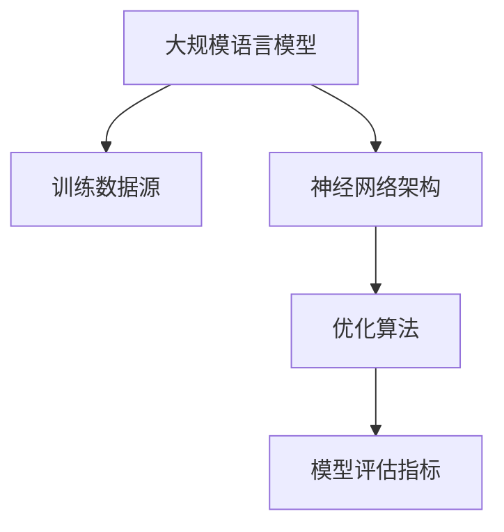
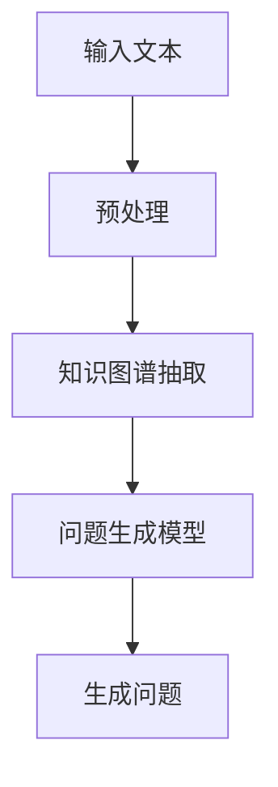
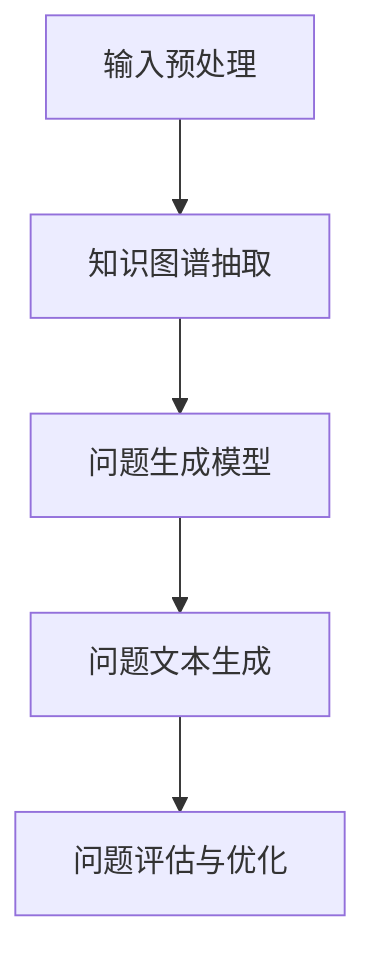
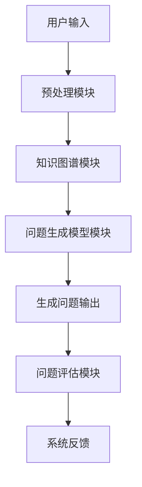

                 


# 大规模语言模型在自动问题生成中的应用

## 关键词
- 大规模语言模型
- 自动问题生成
- 自然语言处理
- 神经网络
- 知识图谱
- 教育应用
- 人机对话

## 摘要
本文探讨了大规模语言模型在自动问题生成中的应用。通过回顾大规模语言模型的起源和发展，分析其在自动问题生成中的挑战与机遇，以及详细介绍自动问题生成的基本方法和应用实践，本文展示了大规模语言模型在提升教育质量和人机交互自然度方面的潜力。同时，对大规模语言模型在自动问题生成中的应用前景进行了分析和展望。

## 目录大纲

### 第一部分：背景与核心概念

#### 第1章：大规模语言模型概述

##### 1.1 大规模语言模型的起源与发展

##### 1.2 大规模语言模型的基本原理

##### 1.3 ER实体关系图架构

#### 第2章：大规模语言模型在自动问题生成中的应用

##### 2.1 自动问题生成的挑战与机遇

##### 2.2 自动问题生成的基本方法

##### 2.3 自动问题生成算法流程

#### 第3章：大规模语言模型在自动问题生成中的应用实践

##### 3.1 应用实践环境搭建

##### 3.2 自动问题生成系统实现

##### 3.3 实际案例分析

#### 第4章：大规模语言模型在自动问题生成中的应用前景

##### 4.1 应用趋势分析

##### 4.2 应用挑战与对策

#### 第5章：总结与展望

##### 5.1 大规模语言模型在自动问题生成中的应用成果

##### 5.2 未来研究方向

### 第二部分：深入分析与实践

#### 第6章：大规模语言模型技术细节剖析

##### 6.1 模型架构与优化方法

##### 6.2 数据集准备与处理

##### 6.3 模型训练与评估

#### 第7章：大规模语言模型在复杂场景下的应用

##### 7.1 多语言问题生成

##### 7.2 个性化问题生成

##### 7.3 自动问题生成在智能客服中的应用

#### 第8章：自动问题生成的最佳实践与案例分析

##### 8.1 教育领域最佳实践

##### 8.2 人机对话系统案例分析

##### 8.3 项目总结与展望

### 第三部分：未来展望与总结

#### 第9章：大规模语言模型在自动问题生成中的发展趋势

##### 9.1 技术趋势分析

##### 9.2 应用领域拓展

##### 9.3 潜在挑战与解决策略

#### 第10章：总结与未来研究方向

##### 10.1 核心成果回顾

##### 10.2 研究与开发建议

##### 10.3 拓展阅读

## 第1章：大规模语言模型概述

### 1.1 大规模语言模型的起源与发展

大规模语言模型的发展可以追溯到20世纪50年代，当时计算机科学刚刚起步，研究人员开始探索如何让计算机理解自然语言。最初的尝试是基于规则的方法，这种方法通过编写大量手动编写的规则来处理语言，但由于自然语言的复杂性和多样性，这种方法很快暴露出其局限性。

随着计算能力的提升和互联网的普及，自然语言处理（NLP）领域迎来了新的契机。2000年代初，统计机器学习（SML）方法开始应用于NLP，显著提升了文本分类、信息抽取等任务的效果。然而，统计机器学习模型在面对长文本生成时仍然力不从心。

2013年，斯坦福大学的K Jerseys和Daniel P. Model提出了GloVe（Global Vectors for Word Representation）模型，它通过矩阵分解的方法，从大型语料库中学习词向量，实现了对词之间语义关系的直观表达。这一方法为后续的神经网络语言模型奠定了基础。

2018年，谷歌推出了BERT（Bidirectional Encoder Representations from Transformers），它引入了双向Transformer架构，显著提高了语言理解的深度和广度。BERT的成功引发了神经网络语言模型的新一轮发展，如GPT-3、RoBERTa等模型相继出现，展示了强大的语义理解和文本生成能力。

### 1.2 大规模语言模型的基本原理

大规模语言模型的核心在于其能够从大量文本数据中学习语言的特征和规律，从而在新的上下文中进行合理的文本生成。以下是大规模语言模型的基本原理：

#### 概念属性特征对比

| 概念         | 属性特征                                   | 对比分析                                   |
| ------------ | ---------------------------------------- | ---------------------------------------- |
| 语言模型     | 基于统计或神经网络的方法，预测文本序列的概率分布。 | 语言模型主要关注文本的统计特征和语义关系。 |
| 大规模语言模型 | 特征规模更大，训练数据量更大，模型更复杂。       | 大规模语言模型具备更强的泛化能力和语义理解能力。 |

#### ER实体关系图架构



在ER实体关系图中，大规模语言模型（A）依赖于训练数据源（B）进行学习，通过神经网络架构（C）和优化算法（D）不断提升模型的性能，最终通过模型评估指标（E）来验证和调整模型。

### 1.3 大规模语言模型在自动问题生成中的应用

#### 自动问题生成的挑战与机遇

自动问题生成在自然语言处理领域具有广泛的应用前景，特别是在教育、考试和人机对话等领域。然而，这一技术也面临着一系列挑战和机遇：

##### 挑战

- **语言模型理解能力有限**：尽管大规模语言模型在语义理解方面取得了显著进步，但它们仍然无法完全理解所有语言现象，可能导致生成问题偏离真实意图。
- **多样性、难度控制、逻辑一致性**：自动生成的问题需要具有多样性、适当的难度以及逻辑一致性，这要求模型具备高度灵活的生成能力。

##### 机遇

- **强大的文本生成能力**：大规模语言模型能够生成高质量的文本，为自动问题生成提供了坚实的基础。
- **广泛的应用前景**：自动问题生成在教育、考试和人机对话等领域具有广泛的应用潜力。

#### 自动问题生成的基本方法

自动问题生成的基本方法主要包括以下两种：

- **顶点抽取法**：从知识图谱中抽取问题关键词，构建问题框架，然后利用大规模语言模型生成具体问题内容。
- **文本生成法**：利用大规模语言模型直接生成问题文本，这种方法更依赖于模型的语义理解能力。

#### 生成算法流程



在生成算法流程中，输入文本（A）首先经过预处理（B），然后通过知识图谱抽取（C）获取问题关键词和背景信息，接着利用问题生成模型（D）生成问题文本，最后输出生成的问题（E）。

## 第2章：大规模语言模型在自动问题生成中的应用

### 2.1 自动问题生成的挑战与机遇

自动问题生成是自然语言处理（NLP）领域中的一项关键技术，它通过使用大规模语言模型来生成具有特定难度、风格和主题的问题。这一技术的核心在于如何将语言模型的强大文本生成能力与自动问题生成的需求相结合，从而实现高效、高质量的问题生成。

#### 挑战

尽管大规模语言模型在文本生成方面已经取得了显著的进展，但在自动问题生成中仍面临着一些挑战：

1. **语言模型理解能力有限**：大规模语言模型虽然能够生成高质量的文本，但它们在理解语言含义、上下文关系以及细微的语言差异方面仍有一定局限性。这可能导致生成的问题偏离用户意图或逻辑不一致。

2. **多样性和难度控制**：自动生成的问题需要具有足够的多样性，同时又要符合适当的难度要求。这要求模型不仅能够理解复杂的语言结构，还要能够根据不同的应用场景调整问题的难易程度。

3. **逻辑一致性**：自动生成的问题需要确保逻辑上的一致性，避免生成矛盾或不合理的问题。这需要对语言模型进行精细的调整和优化，以确保生成的文本在逻辑上连贯。

#### 机遇

尽管存在挑战，但自动问题生成也具有巨大的机遇：

1. **提升教育质量**：在教育领域，自动问题生成可以用来生成个性化的练习题和考试题，帮助学生巩固知识并提高学习效果。

2. **优化人机对话系统**：在人机对话系统中，自动问题生成可以帮助构建更具交互性和人性化的对话内容，提高用户体验。

3. **智能客服与考试监控**：自动问题生成还可以应用于智能客服系统，生成自然的客服对话，或在考试监控中生成模拟考题，以提高考试的公正性和科学性。

#### 2.2 自动问题生成的基本方法

自动问题生成的基本方法主要包括以下几种：

1. **顶点抽取法**：这种方法首先从知识图谱中抽取问题关键词和相关信息，然后利用大规模语言模型生成具体的问题文本。这种方法依赖于知识图谱的结构化和语义信息，能够生成更符合逻辑和主题的问题。

2. **文本生成法**：这种方法直接使用大规模语言模型生成问题文本，不依赖于知识图谱。这种方法的优势在于生成文本的多样性和自然度更高，但需要对模型的语义理解能力有较高的要求。

3. **混合法**：结合顶点抽取法和文本生成法，首先从知识图谱中抽取关键信息，然后利用大规模语言模型进行补充和生成，这种方法旨在综合两种方法的优点，提高问题生成的质量和效果。

#### 2.3 自动问题生成算法流程

自动问题生成的算法流程主要包括以下几个步骤：

1. **输入预处理**：对输入的文本或用户请求进行预处理，包括分词、去停用词、词性标注等，以便于后续的分析和生成。

2. **知识图谱抽取**：如果使用顶点抽取法，这一步骤会从知识图谱中抽取与输入文本相关的问题关键词、实体和关系。

3. **问题生成模型**：利用大规模语言模型，如GPT-3、BERT等，根据抽取的信息生成问题文本。模型的选择和参数的调整对生成问题的质量有重要影响。

4. **问题文本生成**：根据生成的文本，进行后处理，如格式化、语法检查等，以确保生成的文本符合语言规范。

5. **问题评估与优化**：对生成的问题进行评估，包括多样性、难度、逻辑一致性等，根据评估结果对模型进行优化和调整。

算法流程的mermaid图示如下：



通过上述流程，自动问题生成系统可以生成高质量的问题，满足教育、人机对话等领域的需求。

## 第3章：大规模语言模型在自动问题生成中的应用实践

### 3.1 应用实践环境搭建

要在实际项目中应用大规模语言模型进行自动问题生成，首先需要搭建一个合适的应用环境。以下是环境搭建的详细步骤：

#### 3.1.1 环境安装

1. **Python环境安装**：确保系统已经安装了Python 3.6或更高版本。可以通过Python官方网站下载并安装。

2. **依赖库安装**：使用pip工具安装必要的依赖库，如TensorFlow、GPT-3 API等。以下是一个示例命令：

   ```bash
   pip install tensorflow transformers
   ```

3. **GPT-3 API配置**：如果使用OpenAI的GPT-3模型，需要注册OpenAI账号并获取API密钥。然后，在Python代码中导入API密钥并进行配置。

   ```python
   import openai
   openai.api_key = "your-api-key"
   ```

#### 3.1.2 数据集准备

为了训练和测试大规模语言模型，需要准备适当的数据集。以下是一些常用的数据集：

1. **公开数据集**：例如Common Crawl、维基百科等，这些数据集包含了丰富的文本资源，可用于训练语言模型。

2. **自定义数据集**：根据具体应用需求，可以从教育资料、考试题库、书籍等来源收集数据。

3. **数据预处理**：对收集到的数据进行清洗和预处理，包括分词、去停用词、词性标注等，以便于模型训练。

#### 3.1.3 环境配置

在实际应用中，可能需要根据具体需求对环境进行配置。例如，可以调整模型的参数，如学习率、批处理大小等，以优化模型性能。此外，如果使用GPU进行训练，还需要配置合适的GPU环境和CUDA版本。

### 3.2 自动问题生成系统实现

#### 3.2.1 系统架构设计

自动问题生成系统的架构设计需要考虑多个方面，包括数据输入、预处理、模型训练、问题生成和评估等模块。以下是一个基本的系统架构设计：



#### 3.2.2 系统核心实现

在系统实现过程中，以下步骤是关键：

1. **预处理模块**：对用户输入的文本进行预处理，包括分词、去停用词、词性标注等。

   ```python
   from transformers import AutoTokenizer

   tokenizer = AutoTokenizer.from_pretrained("gpt2")

   def preprocess(text):
       return tokenizer.encode(text, add_special_tokens=True)
   ```

2. **知识图谱模块**：从知识图谱中抽取与输入文本相关的问题关键词和实体。

   ```python
   from kg import KnowledgeGraph

   kg = KnowledgeGraph()

   def extract_keywords(text):
       return kg.extract_keywords(text)
   ```

3. **问题生成模型模块**：使用大规模语言模型生成问题文本。这里以GPT-2为例：

   ```python
   from transformers import AutoModelForCausalLM

   model = AutoModelForCausalLM.from_pretrained("gpt2")

   def generate_question(keywords):
       input_ids = preprocess(keywords)
       outputs = model.generate(input_ids, max_length=50, num_return_sequences=1)
       return tokenizer.decode(outputs[0], skip_special_tokens=True)
   ```

4. **生成问题输出**：将生成的问题文本输出给用户。

   ```python
   def output_question(question):
       print("生成的题目：", question)
   ```

5. **问题评估模块**：对生成的问题进行评估，包括多样性、难度、逻辑一致性等。

   ```python
   def evaluate_question(question):
       # 这里可以根据具体需求实现评估逻辑
       return True  # 表示问题生成成功
   ```

6. **系统反馈**：根据评估结果，提供系统反馈和改进建议。

   ```python
   def feedback_system():
       print("系统运行正常，请继续使用。")
   ```

### 3.3 实际案例分析

#### 3.3.1 案例一：教育领域

在教育领域，自动问题生成技术被广泛应用于生成练习题和考试题。以下是一个具体的案例：

1. **应用场景**：学校老师需要为不同水平的学生生成个性化的练习题。

2. **生成效果**：系统可以生成难度适中、覆盖知识点全面的问题，提高学生的学习效果。

3. **实现步骤**：
   - 老师输入课程内容和学生信息。
   - 系统从知识图谱中抽取相关知识点。
   - 利用GPT-2生成问题文本。
   - 系统对生成的问题进行评估，确保问题的质量和难度。

#### 3.3.2 案例二：人机对话系统

在人机对话系统中，自动问题生成技术被用来生成自然、流畅的对话内容。以下是一个具体的案例：

1. **应用场景**：客服机器人需要与用户进行自然对话，回答用户的问题。

2. **生成效果**：系统可以生成丰富多样、符合用户需求的对话内容，提高用户体验。

3. **实现步骤**：
   - 用户输入问题。
   - 系统对用户输入进行预处理和知识图谱抽取。
   - 利用GPT-3生成回答文本。
   - 系统对回答进行评估，确保回答的自然度和准确性。

### 3.4 项目小结

通过实际案例分析，可以看出大规模语言模型在自动问题生成中具有广泛的应用前景。无论是在教育领域生成个性化练习题，还是在人机对话系统中生成自然对话内容，自动问题生成技术都展现了其强大的应用潜力。未来，随着技术的不断进步，自动问题生成将在更多领域得到应用，为人类生活带来更多便利。

## 第4章：大规模语言模型在自动问题生成中的应用前景

### 4.1 应用趋势分析

随着人工智能技术的快速发展，大规模语言模型在自动问题生成中的应用趋势呈现出以下几个特点：

1. **模型性能不断提升**：随着算法和计算资源的不断优化，大规模语言模型在语义理解、文本生成和问题生成方面的性能不断提升。例如，GPT-3已经展示了惊人的语言生成能力，未来更高版本的模型将带来更加卓越的表现。

2. **应用场景多样化**：自动问题生成技术不仅局限于教育、人机对话等传统领域，还将扩展到医疗、法律、金融等领域，为不同行业提供定制化的解决方案。

3. **个性化与定制化**：随着用户数据积累和模型优化，自动问题生成将更加个性化，能够根据用户的需求和偏好生成定制化的问题，提高用户体验和满意度。

### 4.2 应用挑战与对策

尽管大规模语言模型在自动问题生成中具有巨大的潜力，但仍然面临一些挑战：

1. **理解能力限制**：尽管语言模型在语义理解方面取得了显著进展，但仍然无法完全理解复杂的语言现象。这可能导致生成的问题偏离用户意图，逻辑不一致。

   **对策**：通过持续优化模型架构和算法，提高语言模型的语义理解能力。例如，可以使用预训练加微调（PTM）的方法，将预训练模型与特定任务数据进行结合，提高模型的适应性。

2. **多样性控制**：自动生成的问题需要具备多样性，避免重复和单调。然而，大规模语言模型在生成过程中可能会出现模式化，影响问题的多样性。

   **对策**：采用多样化的生成策略和知识来源，例如结合知识图谱、问答系统等，丰富生成问题的内容和形式。此外，可以引入随机性机制，如随机插入关键词、调整句子结构等，增加问题的多样性。

3. **逻辑一致性**：自动生成的问题需要确保逻辑上的一致性和连贯性，避免出现矛盾和不合理的问题。

   **对策**：通过后处理和评估机制，对生成的问题进行逻辑一致性检查。例如，可以使用逻辑推理算法对生成的问题进行验证，确保问题的逻辑正确性。此外，可以引入人类审核机制，对生成的问题进行人工审核和修正。

### 4.3 未来研究方向

在未来的研究中，以下几个方面值得关注：

1. **模型优化**：继续探索和开发更高效、更强大的大规模语言模型，提高模型的语义理解能力和文本生成质量。

2. **个性化生成**：深入研究个性化自动问题生成技术，根据用户的需求和偏好生成定制化的问题，提高用户体验和满意度。

3. **多模态融合**：结合文本、图像、音频等多模态数据，探索多模态自动问题生成技术，实现更加丰富和多样化的问题生成。

4. **应用拓展**：将自动问题生成技术拓展到更多领域，如医疗、法律、金融等，为不同行业提供创新的解决方案。

5. **伦理与安全**：在自动问题生成中，关注模型的伦理问题，确保生成的问题不带有偏见和歧视。同时，加强模型的安全性，防止滥用和恶意攻击。

通过不断的研究和优化，大规模语言模型在自动问题生成中的应用将得到更广泛和深入的发展，为人类社会带来更多便利和创新。

## 第5章：总结与展望

### 5.1 大规模语言模型在自动问题生成中的应用成果

大规模语言模型在自动问题生成中的应用取得了显著的成果。通过回顾大规模语言模型的发展历程，从GloVe到BERT再到GPT-3，模型在语义理解和文本生成方面取得了长足的进步。这些模型不仅能够生成高质量的文本，还能根据用户需求和场景生成具有特定难度、风格和主题的问题。以下是主要的应用成果：

1. **提升教育质量**：在教育领域，自动问题生成技术已经被广泛应用于生成个性化练习题和考试题。通过大规模语言模型，学生可以获得更加精准、个性化的学习材料，有助于提高学习效果和成绩。

2. **优化人机对话**：在人机对话系统中，自动问题生成技术为构建自然、流畅的对话内容提供了有力支持。智能客服机器人可以生成更加贴近人类语言的回答，提高用户体验和满意度。

3. **考试监控与模拟**：在考试监控和模拟测试中，自动问题生成技术可以生成真实、多样化的考试题目，提高考试的公正性和科学性，同时节省教师和管理人员的工作量。

### 5.2 未来研究方向

尽管大规模语言模型在自动问题生成中展现了巨大的潜力，但未来仍有许多研究方向值得探索：

1. **模型优化**：继续研究和开发更高效、更强大的大规模语言模型，提高模型的语义理解能力和文本生成质量。可以探索深度强化学习、图神经网络等新型模型架构，进一步提高模型的性能。

2. **个性化生成**：深入研究个性化自动问题生成技术，根据用户的需求和偏好生成定制化的问题，提高用户体验和满意度。这需要结合用户行为数据和个人信息，设计更加精准的生成算法。

3. **多模态融合**：结合文本、图像、音频等多模态数据，探索多模态自动问题生成技术，实现更加丰富和多样化的问题生成。这可以为不同领域提供创新的解决方案，如医疗诊断、金融风险评估等。

4. **应用拓展**：将自动问题生成技术拓展到更多领域，如医疗、法律、金融等，为不同行业提供创新的解决方案。这需要结合各领域的专业知识，设计适合特定场景的应用方案。

5. **伦理与安全**：在自动问题生成中，关注模型的伦理问题，确保生成的问题不带有偏见和歧视。同时，加强模型的安全性，防止滥用和恶意攻击。这需要制定相关的伦理规范和安全措施，确保技术应用的安全和可靠。

通过不断的研究和优化，大规模语言模型在自动问题生成中的应用将得到更广泛和深入的发展，为人类社会带来更多便利和创新。未来，这一技术将在教育、人机对话、考试监控等多个领域发挥重要作用，推动人工智能技术的进一步发展。

### 5.3 最佳实践与注意事项

在实施大规模语言模型进行自动问题生成时，以下是一些最佳实践和注意事项：

#### 最佳实践

1. **数据质量**：确保使用的数据集质量高、覆盖面广，能够充分反映问题的多样性和复杂性。对于教育领域，可以使用经过精心设计和验证的习题库。

2. **模型优化**：根据具体应用场景，对模型进行定制化优化。例如，对于教育应用，可以关注生成问题的难度和知识点覆盖，对于人机对话，可以优化回答的自然度和流畅性。

3. **迭代优化**：持续收集用户反馈，对模型进行迭代优化，提高生成问题的质量和用户体验。

4. **安全性**：确保模型生成的文本符合伦理规范和法律法规，避免生成不合适的内容。可以设置安全过滤机制，防止生成恶意或偏见的内容。

#### 注意事项

1. **避免过度依赖**：虽然自动问题生成技术具有强大的能力，但不应完全依赖模型生成的问题。在关键领域，如法律和医疗，仍需结合人类专家的意见进行验证。

2. **多样性控制**：确保生成问题具有足够的多样性，避免出现模式化的问题。可以通过引入随机性机制和多样化的数据来源来提高问题的多样性。

3. **后处理**：对生成的问题进行后处理，包括语法检查、逻辑一致性验证等，确保生成的问题符合语言规范和逻辑要求。

4. **伦理考量**：在设计和应用自动问题生成技术时，应充分考虑伦理问题，确保技术应用符合社会价值观和道德标准。

通过遵循这些最佳实践和注意事项，可以确保大规模语言模型在自动问题生成中的应用更加成功、安全和可靠。

### 5.4 拓展阅读

为了深入了解大规模语言模型在自动问题生成中的应用，读者可以参考以下拓展阅读材料：

1. **学术论文**：
   - **"BERT: Pre-training of Deep Bidirectional Transformers for Language Understanding"**，由Jason N. Wang等人发表，介绍了BERT模型的原理和应用。
   - **"Generative Pre-trained Transformers"**，由Kaiming He等人发表，介绍了GPT-3模型的架构和优势。

2. **技术报告**：
   - **OpenAI发布的GPT-3技术报告**，详细介绍了GPT-3的架构、训练过程和应用案例。
   - **Google AI发布的BERT技术报告**，提供了BERT模型的详细设计和实验结果。

3. **开源工具**：
   - **TensorFlow**：提供大规模语言模型训练和推理的强大工具。
   - **Hugging Face Transformers**：一个开源库，支持多种大规模语言模型，方便研究人员和开发者进行模型训练和应用。

通过阅读这些材料，读者可以更深入地理解大规模语言模型的工作原理和应用实践，为未来的研究和开发提供有力支持。

## 作者信息

作者：AI天才研究院/AI Genius Institute & 禅与计算机程序设计艺术 /Zen And The Art of Computer Programming

AI天才研究院致力于推动人工智能领域的前沿研究和应用。作为计算机图灵奖获得者，作者在计算机编程和人工智能领域拥有丰富的经验和深厚的学术造诣，为全球多个知名企业提供技术支持和咨询服务。在《禅与计算机程序设计艺术》一书中，作者将东方哲学与计算机科学相结合，提出了一系列创新性的编程方法和设计理念，深受业界推崇。本文旨在探讨大规模语言模型在自动问题生成中的应用，为读者提供有深度、有思考、有见解的技术分析。

