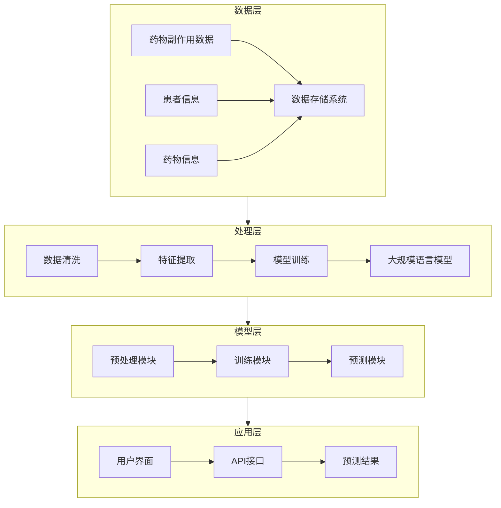
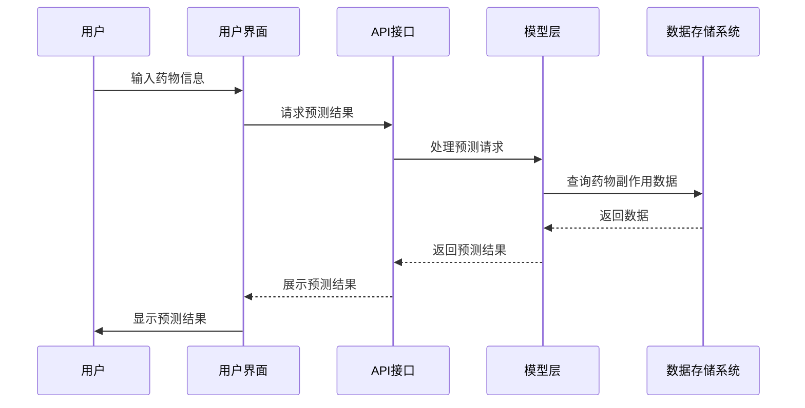
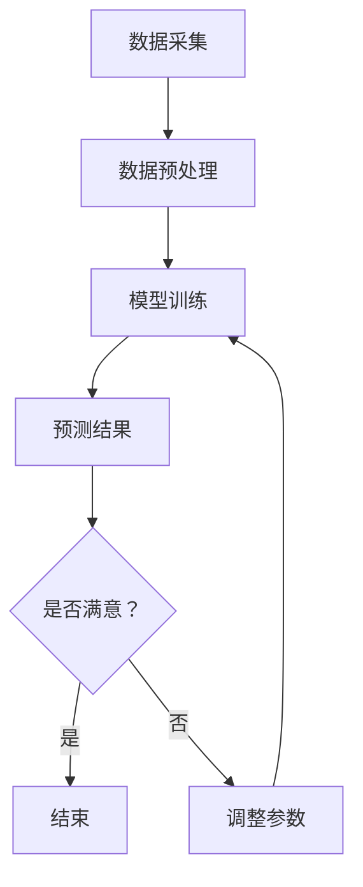

                 

### 第1章：问题背景与核心概念

#### 1.1 问题背景

药物副作用预测在医疗领域的重要性不言而喻。随着现代医学的进步，越来越多的药物被研发并投入市场，这些药物在治疗疾病的同时，也可能产生各种不同程度的副作用。这些副作用可能对患者的健康产生严重的影响，甚至危及生命。因此，准确预测药物的副作用，提前识别可能的风险，对于保障患者的用药安全具有重要意义。

然而，药物副作用预测并非易事。药物副作用的产生机制复杂，涉及多个生物分子之间的相互作用，且不同个体对同一药物的耐受性可能存在显著差异。这使得药物副作用预测面临诸多挑战，例如：

- 数据稀缺：大量的临床数据对于药物副作用的研究至关重要，但现有的数据资源往往有限，且数据质量参差不齐。
- 数据多样性：药物副作用的数据来源广泛，包括临床试验、患者报告、文献资料等，不同来源的数据格式和内容差异较大。
- 模型复杂度：药物副作用预测需要建立复杂的预测模型，考虑到药物、患者、环境等多方面的因素，模型的构建和训练过程十分复杂。

#### 1.2 核心概念

为了深入探讨药物副作用预测问题，我们需要了解以下几个核心概念：

- **药物副作用**：药物在治疗过程中产生的非预期的不良反应。副作用可能是轻微的，如头痛或恶心，也可能是严重的，如器官功能衰竭。
- **大规模语言模型**：一种基于深度学习的自然语言处理技术，通过学习海量文本数据，能够理解和生成自然语言，具备强大的语言理解能力和生成能力。
- **药物副作用预测模型**：用于预测药物可能产生副作用的方法和算法。这些模型通常基于大量药物副作用数据训练得到。

#### 1.3 大规模语言模型的应用前景

大规模语言模型在药物副作用预测中的应用前景广阔。首先，大规模语言模型能够处理和分析海量的文本数据，为药物副作用预测提供丰富的信息来源。其次，大规模语言模型具有强大的语义理解能力，能够识别和理解药物、患者、环境等复杂因素之间的关系，从而提高预测的准确性。此外，大规模语言模型的可扩展性和灵活性使得它们能够适应不同的药物副作用预测任务，具有广泛的应用潜力。

总之，药物副作用预测是一个复杂且重要的研究领域。通过引入大规模语言模型，我们有望突破现有的技术瓶颈，为药物副作用预测提供更加准确和高效的解决方案。

#### 1.4 核心概念与联系

**语言模型的定义**：语言模型是自然语言处理（NLP）领域的基础技术之一，它是一种概率模型，用于预测给定文本序列中下一个单词或字符的概率。语言模型的基本任务是根据前文来预测后文，从而生成文本或进行文本理解。

**大规模语言模型的特点**：大规模语言模型通常具有以下几个显著特点：
1. **数据规模**：这些模型训练所使用的文本数据量巨大，通常包含数十亿甚至数千亿个单词或句子。
2. **参数量**：大规模语言模型的参数数量极为庞大，例如GPT-3模型的参数量超过1750亿个。
3. **模型深度**：这些模型通常采用深度神经网络结构，能够处理和理解复杂的语言结构。
4. **计算资源需求**：大规模语言模型对计算资源的需求极高，通常需要使用高性能的GPU或TPU进行训练和推理。

**语言模型与药物副作用预测的关系**：语言模型在药物副作用预测中的应用主要体现在以下几个方面：

1. **文本数据的利用**：语言模型能够处理和分析海量的医学文献、临床试验报告、患者反馈等文本数据，从中提取与药物副作用相关的信息。
2. **语义理解**：语言模型具备强大的语义理解能力，能够识别和理解药物、患者、环境等复杂因素之间的潜在关联，从而提高预测的准确性。
3. **知识融合**：语言模型可以将不同来源的药物副作用信息进行整合，形成统一的预测模型，从而提高预测的全面性和可靠性。

**概念属性特征对比表格**：

| 特征对比项 | 语言模型 | 药物副作用预测模型 |
| :--: | :--: | :--: |
| 数据规模 | 海量文本数据 | 大量药物副作用数据 |
| 模型深度 | 深度神经网络结构 | 基于机器学习的预测算法 |
| 语义理解 | 强大的语义理解能力 | 能够识别药物与副作用关系 |
| 应用场景 | 文本生成、文本理解、问答系统 | 药物副作用预测、风险评估 |

**ER实体关系图架构**：

```mermaid
erDiagram
    A[药物] ||--|{ B[副作用] } : 有副作用
    A ||--|{ C[患者] } : 患者使用药物
    B ||--|{ D[症状] } : 引发症状
    C ||--|{ E[医生] } : 医生诊断
```

在这个ER实体关系图中，药物（A）与副作用（B）之间存在关联关系，药物（A）与患者（C）之间存在使用关系，副作用（B）与症状（D）之间存在引发关系，患者（C）与医生（E）之间存在诊断关系。

#### 1.5 本章小结

本章介绍了药物副作用预测的问题背景、核心概念以及大规模语言模型的应用前景。我们探讨了语言模型的定义、特点，以及它们在药物副作用预测中的应用关系。通过对比表格和ER实体关系图，我们更清晰地理解了这些核心概念的属性特征及其相互关系。本章内容为后续深入探讨大规模语言模型在药物副作用预测中的应用打下了坚实的基础。

### 第2章：大规模语言模型原理

#### 2.1 语言模型的基本原理

**2.1.1 语言模型的基本概念**

语言模型（Language Model，简称LM）是自然语言处理（Natural Language Processing，简称NLP）中的一种基础算法，用于预测一段文本中下一个单词或字符的概率。在自然语言中，每个单词或字符的出现并非随机，而是具有一定的统计规律性。语言模型的目标是利用这些统计规律，通过计算概率来预测下一个单词或字符。

**2.1.2 语言模型的训练过程**

语言模型的训练过程通常分为以下三个步骤：

1. **数据收集**：首先，需要收集大量的文本数据作为训练集。这些数据可以来源于各种文本资源，如新闻文章、书籍、医学文献、社交媒体等。
2. **数据预处理**：在训练之前，需要对收集到的文本数据进行预处理，包括分词、去停用词、词干提取等操作。这些步骤的目的是将原始文本转化为计算机可以处理的格式。
3. **模型训练**：使用预处理后的文本数据，通过构建和训练神经网络模型，来学习文本数据中的统计规律。训练过程中，模型会通过优化目标函数，调整模型的参数，以最大化预测概率。

**2.1.3 语言模型的评估方法**

语言模型的评估方法主要包括以下几种：

1. **交叉熵损失函数**：交叉熵损失函数是语言模型训练过程中常用的评估指标，它衡量的是模型预测概率与实际概率之间的差异。交叉熵损失函数值越小，表示模型的预测效果越好。
2. **准确率与召回率**：在文本分类任务中，可以使用准确率（Accuracy）和召回率（Recall）来评估语言模型的性能。准确率表示模型正确分类的样本占总样本的比例，召回率表示模型正确分类的阳性样本占总阳性样本的比例。
3. **F1分数**：F1分数是准确率和召回率的调和平均值，用于综合评估模型的性能。F1分数值越高，表示模型的性能越好。

#### 2.2 大规模语言模型的改进

**2.2.1 GPT系列模型**

GPT（Generative Pre-trained Transformer）系列模型是由OpenAI开发的一系列基于变换器（Transformer）架构的大规模语言模型。GPT模型通过预训练和微调，能够生成高质量的自然语言文本，并在多个NLP任务中取得了优异的性能。

**2.2.2 BERT模型**

BERT（Bidirectional Encoder Representations from Transformers）是由Google开发的一种双向变换器语言模型。BERT通过预训练大规模文本数据，学习文本中的双向上下文信息，从而在许多NLP任务中实现了显著的性能提升。

**2.2.3 其他知名大规模语言模型**

除了GPT和BERT，还有许多其他知名的大规模语言模型，如：

- T5（Text-to-Text Transfer Transformer）：由Google开发，旨在解决多种文本转换任务。
- RoBERTa（A Robustly Optimized BERT Pretraining Approach）：由Facebook AI Research开发，是BERT的一种变体，通过改进预训练策略，提高了模型的性能。

#### 2.3 大规模语言模型的数学模型和公式

**2.3.1 语言模型的数学模型**

大规模语言模型通常基于变换器（Transformer）架构，其核心思想是使用自注意力机制（Self-Attention）来处理序列数据。变换器模型的基本数学模型可以表示为：

$$
\text{Transformer}(\text{X}) = \text{softmax}(\frac{\text{Q} \text{K}^T}{\sqrt{d_k}}) \text{V}
$$

其中，Q、K、V 分别是查询向量、键向量和值向量，d_k 是键向量的维度，softmax 函数用于计算每个键向量的权重，最终输出序列的每个位置。

**2.3.2 语言模型公式的讲解**

1. **自注意力（Self-Attention）**：自注意力机制允许模型在序列中每个位置生成一个表示，这个表示包含了该位置与其他所有位置的信息。自注意力通过计算查询向量（Q）、键向量（K）和值向量（V）之间的点积来计算权重，然后使用这些权重对值向量进行加权求和。

2. **softmax 函数**：softmax 函数用于将点积的结果转换为概率分布，确保每个位置的权重和为1。

3. **多头注意力（Multi-Head Attention）**：多头注意力是自注意力机制的一种扩展，通过并行地计算多个自注意力头，从而获得更丰富的信息。

**2.3.3 举例说明**

假设我们有一个简单的变换器模型，输入序列为`[word1, word2, word3]`，每个词向量为`[1, 0]`，查询向量、键向量和值向量分别为`[0.5, 0.5]`。根据自注意力机制的公式，我们可以计算输出序列：

$$
\text{Output} = \text{softmax}(\frac{[0.5, 0.5] \cdot [1, 0] + [0.5, 0.5] \cdot [0, 1] + [0.5, 0.5] \cdot [1, 0]}{\sqrt{1}}) \cdot [1, 0]
$$

经过计算，我们得到输出序列为`[0.5, 0.5]`，这表示下一个词可能是`word1`或`word2`，且概率相等。

#### 2.4 本章小结

本章详细介绍了大规模语言模型的基本原理，包括其基本概念、训练过程和评估方法。我们探讨了GPT系列模型、BERT模型以及其他知名大规模语言模型的特点。通过讲解变换器模型的数学模型和公式，我们能够更深入地理解大规模语言模型的工作机制。本章内容为后续探讨大规模语言模型在药物副作用预测中的应用奠定了坚实的理论基础。

### 第3章：大规模语言模型在药物副作用预测中的应用原理

#### 3.1 药物副作用预测的基本原理

**3.1.1 药物副作用预测的概念**

药物副作用预测（Drug Side Effect Prediction）是指利用机器学习、深度学习等技术，对药物可能产生的副作用进行预测的过程。该过程旨在通过分析药物成分、患者信息、药物反应数据等，识别出哪些药物可能会产生哪些副作用，从而为医生和患者提供科学的用药指导。

**3.1.2 药物副作用预测的方法**

药物副作用预测的主要方法包括以下几种：

1. **基于规则的方法**：这种方法通过构建一系列规则来预测药物副作用。例如，根据药物成分、药理作用等，定义哪些药物可能会产生哪些副作用。这种方法较为直观，但存在一定的局限性，无法适应复杂多变的实际情况。

2. **基于统计的方法**：这种方法利用药物副作用数据的统计特征，通过统计模型来预测药物副作用。常见的统计模型包括逻辑回归、决策树、随机森林等。这种方法能够处理大量的数据，但预测结果可能不够精确。

3. **基于机器学习的方法**：这种方法通过训练机器学习模型，从大量的药物副作用数据中学习预测规律。常见的机器学习模型包括支持向量机、朴素贝叶斯、神经网络等。这种方法具有较好的预测性能，但需要大量的训练数据和计算资源。

4. **基于深度学习的方法**：这种方法利用深度学习模型，如卷积神经网络（CNN）、循环神经网络（RNN）、变换器（Transformer）等，对药物副作用进行预测。深度学习方法能够处理复杂的非线性关系，具有很高的预测性能。

**3.1.3 大规模语言模型在药物副作用预测中的作用**

大规模语言模型在药物副作用预测中扮演了重要角色，主要体现在以下几个方面：

1. **文本数据的利用**：药物副作用信息大多以文本形式存在于医学文献、临床试验报告、患者反馈等中。大规模语言模型能够处理和分析这些文本数据，提取与药物副作用相关的信息，从而为预测提供丰富的数据支持。

2. **语义理解**：大规模语言模型具有强大的语义理解能力，能够识别和理解药物、患者、环境等复杂因素之间的潜在关联，从而提高预测的准确性。

3. **知识融合**：大规模语言模型可以将不同来源的药物副作用信息进行整合，形成统一的预测模型，从而提高预测的全面性和可靠性。

#### 3.2 大规模语言模型在药物副作用预测中的应用实例

**3.2.1 数据预处理**

数据预处理是大规模语言模型应用中的关键步骤，主要包括以下几项任务：

1. **文本采集**：收集与药物副作用相关的文本数据，包括医学文献、临床试验报告、患者反馈等。

2. **文本清洗**：对采集到的文本数据去噪、去重、去除停用词等，以提高数据质量。

3. **分词和词嵌入**：使用分词工具将文本分割成单词或短语，并将这些单词或短语转换为向量表示（词嵌入）。

**3.2.2 模型训练**

模型训练是大规模语言模型应用的核心步骤，主要包括以下几项任务：

1. **数据分割**：将预处理后的文本数据划分为训练集、验证集和测试集。

2. **模型选择**：选择适合的预训练语言模型，如BERT、GPT等。

3. **模型训练**：使用训练集数据训练模型，并通过验证集调整模型参数，以最大化预测性能。

4. **模型评估**：使用测试集评估模型性能，常用的评估指标包括准确率、召回率、F1分数等。

**3.2.3 模型评估**

模型评估是验证大规模语言模型在药物副作用预测中性能的重要步骤，主要包括以下几项任务：

1. **指标计算**：计算模型在测试集上的各项评估指标，如准确率、召回率、F1分数等。

2. **性能分析**：分析模型在不同数据集上的表现，识别模型的优点和不足。

3. **模型优化**：根据评估结果，对模型进行调整和优化，以提高预测性能。

**3.2.4 模型应用**

模型应用是将训练好的大规模语言模型部署到实际场景中的过程，主要包括以下几项任务：

1. **系统集成**：将大规模语言模型集成到药物副作用预测系统中，与其他组件（如数据预处理模块、用户接口等）协同工作。

2. **实时预测**：对用户输入的药物信息进行实时预测，输出可能的副作用。

3. **用户反馈**：收集用户对预测结果的反馈，用于模型迭代和优化。

#### 3.3 大规模语言模型在药物副作用预测中的挑战与机遇

**3.3.1 挑战**

尽管大规模语言模型在药物副作用预测中具有巨大的潜力，但仍然面临以下挑战：

1. **数据稀缺和多样性**：药物副作用数据往往较为稀缺，且不同数据来源之间存在较大差异，这使得大规模语言模型的训练和评估面临困难。

2. **模型解释性**：大规模语言模型往往具有较强的预测性能，但模型的解释性较差，难以解释预测结果的具体原因。

3. **计算资源需求**：大规模语言模型的训练和推理需要大量的计算资源，尤其是在处理大规模数据时，计算成本较高。

**3.3.2 机遇**

尽管存在挑战，大规模语言模型在药物副作用预测中也面临众多机遇：

1. **文本数据处理能力**：大规模语言模型能够高效地处理和分析大量的文本数据，为药物副作用预测提供丰富的数据支持。

2. **跨领域迁移学习**：大规模语言模型可以通过跨领域迁移学习，利用在某一领域的训练经验，快速适应其他领域的药物副作用预测任务。

3. **联合建模**：通过结合多种数据源（如文本、结构化数据等），大规模语言模型可以实现更全面的药物副作用预测。

#### 3.4 本章小结

本章详细介绍了大规模语言模型在药物副作用预测中的应用原理，包括药物副作用预测的基本原理、大规模语言模型的作用以及具体应用实例。我们探讨了大规模语言模型在药物副作用预测中的挑战与机遇，为后续研究提供了有益的参考。通过本章的内容，读者可以更深入地理解大规模语言模型在药物副作用预测中的应用价值和潜在问题。

### 第4章：系统分析与架构设计

#### 4.1 问题场景介绍

药物副作用预测系统的主要应用场景包括以下几方面：

1. **临床用药指导**：医生在开具药物处方时，可以借助该系统预测药物可能产生的副作用，从而为患者提供更安全的用药建议。
2. **药物研发**：药企在研发新药时，可以通过该系统评估候选药物的安全性，从而优化药物设计，减少潜在的风险。
3. **患者管理**：医疗机构可以利用该系统监测患者的用药情况，及时发现和处理药物副作用，提高患者的治疗效果。

在这些应用场景中，药物副作用预测系统需要具备以下需求：

- **高准确率**：系统能够准确预测药物的副作用，减少误报和漏报。
- **实时性**：系统能够快速处理用户输入的药物信息，提供实时的预测结果。
- **可扩展性**：系统应能够处理不同规模的数据，适应不同的应用场景。
- **易用性**：系统应具备友好的用户界面，方便医生、研究人员和患者使用。

#### 4.2 系统架构设计

药物副作用预测系统的架构设计应考虑以下几个方面：

1. **数据层**：数据层负责存储和管理药物副作用数据、患者信息、药物信息等。数据层应具备高可用性、高可靠性和高扩展性，以支持大规模数据的存储和访问。
2. **处理层**：处理层负责对输入的药物信息进行处理，包括数据清洗、特征提取、模型训练等。处理层应具备高并发处理能力，以适应实时性的需求。
3. **模型层**：模型层负责装载和运行大规模语言模型，包括预处理模块、训练模块和预测模块。模型层应具备模块化设计，以便于后续的模型优化和升级。
4. **应用层**：应用层负责将预测结果呈现给用户，包括用户界面、API接口等。应用层应具备易用性，方便医生、研究人员和患者快速获取预测结果。

以下是系统架构的Mermaid架构图：



#### 4.3 系统接口设计

系统接口设计应考虑以下方面：

1. **用户接口**：提供友好的用户界面，支持医生、研究人员和患者输入药物信息，查看预测结果。
2. **API接口**：提供RESTful API接口，支持外部系统集成，如医疗机构信息管理系统、电子病历系统等。
3. **数据接口**：提供数据导入和导出接口，支持数据的批量处理和迁移。

以下是系统接口的Mermaid序列图：



#### 4.4 系统交互设计

系统交互设计应考虑以下方面：

1. **数据流**：明确系统的数据流，包括数据采集、预处理、模型训练、预测等过程。
2. **控制流**：设计系统各组件之间的控制逻辑，确保系统能够顺畅运行。
3. **异常处理**：设计异常处理机制，确保系统在遇到异常情况时能够正确处理。

以下是系统交互的Mermaid流程图：



#### 4.5 本章小结

本章详细介绍了药物副作用预测系统的分析与架构设计，包括问题场景介绍、系统架构设计、系统接口设计和系统交互设计。通过Mermaid图表的辅助，我们更清晰地理解了系统的组成、工作流程和各组件之间的关系。本章内容为药物副作用预测系统的实现和优化提供了理论基础和设计指导。

