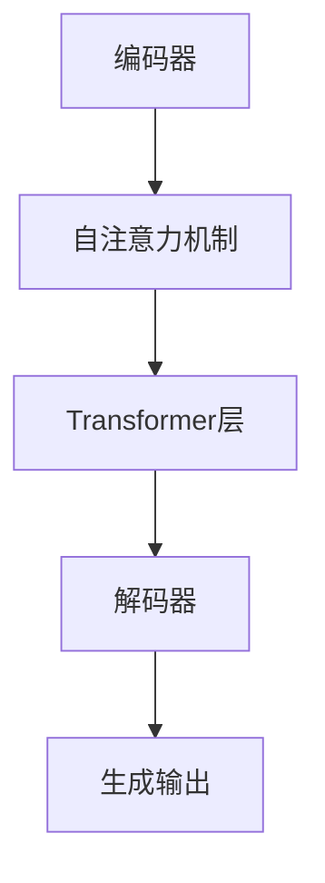

                 

### 大规模语言模型在虚拟助手中的应用与优化

#### 文章关键词
- 大规模语言模型
- 虚拟助手
- 应用与优化
- 自然语言理解
- 生成模型
- 集成与部署

#### 摘要
本文旨在探讨大规模语言模型在虚拟助手中的应用与优化策略。通过分析大规模语言模型的基础概念、原理及其在虚拟助手中的实际应用，本文提出了构建和优化虚拟助手的多种技术方法。文章还将讨论未来大规模语言模型在虚拟助手领域的发展趋势和潜在挑战，为相关领域的研究和实践提供参考。

### 目录大纲

----------------------------------------------------------------

# 大规模语言模型在虚拟助手中的应用与优化

## 第一部分：大规模语言模型的概述

## 第1章：大规模语言模型的基础概念

### 1.1 问题背景

#### 1.1.1 问题的提出

随着人工智能技术的快速发展，虚拟助手（如聊天机器人、智能客服等）已经成为现代科技的重要组成部分。大规模语言模型（如GPT、BERT等）为虚拟助手的智能水平提供了强大的支持。本章将介绍大规模语言模型的基本概念，包括其定义、核心要素和基本原理。

#### 1.1.2 问题描述

大规模语言模型在虚拟助手中的应用主要集中在自然语言理解和生成，这涉及到对海量文本数据的处理和理解。然而，由于语言表达的多样性和复杂性，大规模语言模型的训练和应用面临着诸多挑战。

#### 1.1.3 问题解决

通过深入理解大规模语言模型的基本原理，我们可以更有效地解决虚拟助手中的自然语言处理问题，从而提高虚拟助手的智能水平。

#### 1.1.4 边界与外延

大规模语言模型的应用不仅限于虚拟助手，还可以在其他领域（如智能推荐、文本摘要、机器翻译等）发挥重要作用。本章将简要介绍这些应用场景。

#### 1.1.5 概念结构与核心要素组成

大规模语言模型主要由编码器和解码器组成，通过自注意力机制和Transformer架构实现高效的文本处理能力。

### 1.2 大规模语言模型的基本原理

#### 1.2.1 概念原理

大规模语言模型通过深度学习算法，从海量文本数据中学习语言规律，从而实现自然语言处理任务。

#### 1.2.2 概念属性特征对比表格

| 特征 | 传统NLP方法 | 大规模语言模型 |
| --- | --- | --- |
| 文本表示 | 词向量、字符级表示 | 自注意力机制、Transformer架构 |
| 生成能力 | 短文本生成、实体识别 | 长文本生成、对话生成 |
| 适应性 | 需要手动调整参数 | 自动调整参数、适应多种任务 |

#### 1.2.3 ER实体关系图架构



### 1.3 主流大规模语言模型简介

#### 1.3.1 GPT系列模型

GPT（Generative Pre-trained Transformer）系列模型由OpenAI提出，是大规模语言模型的重要代表。

#### 1.3.2 BERT及其变体

BERT（Bidirectional Encoder Representations from Transformers）及其变体（如RoBERTa、ALBERT等）由Google提出，为大规模语言模型的发展奠定了基础。

#### 1.3.3 其他知名大规模语言模型

除了GPT和BERT，还有XLNet、T5等知名大规模语言模型，它们在不同领域取得了显著成果。

### 1.4 大规模语言模型在虚拟助手中的应用

#### 1.4.1 自然语言理解

大规模语言模型在自然语言理解方面具有显著优势，如命名实体识别、情感分析、意图识别等。

#### 1.4.2 自然语言生成

大规模语言模型在自然语言生成方面也有广泛应用，如文本摘要、对话生成、机器翻译等。

#### 1.4.3 智能推荐

大规模语言模型可以根据用户的历史行为和偏好，为用户提供个性化的推荐服务。

#### 1.4.4 文本摘要

大规模语言模型可以将长文本转化为简洁的摘要，提高信息获取的效率。

#### 1.4.5 机器翻译

大规模语言模型在机器翻译领域取得了显著成果，可以实现高效、准确的跨语言文本翻译。

### 1.5 大规模语言模型在虚拟助手中的应用前景

#### 1.5.1 潜在应用领域

随着技术的不断发展，大规模语言模型将在更多领域得到应用，如智能医疗、金融、教育等。

#### 1.5.2 企业采用大规模语言模型的优势

企业可以通过引入大规模语言模型，提高产品的智能化水平，降低人力成本，提升用户满意度。

#### 1.5.3 挑战与机遇

大规模语言模型在虚拟助手中的应用面临着数据隐私、模型解释性等挑战，同时也带来了新的机遇。

## 第二部分：大规模语言模型在虚拟助手中的应用

## 第2章：大规模语言模型在虚拟助手的构建与优化

### 2.1 背景介绍

虚拟助手是人工智能技术在客服、教育、医疗等领域的重要应用，它们能够提供24/7全天候的服务，提高工作效率，降低运营成本。随着用户对服务质量要求的提高，虚拟助手需要具备更强的自然语言理解和生成能力，以更好地满足用户需求。

#### 2.1.1 问题的提出

虚拟助手的核心技术是自然语言处理（NLP），而大规模语言模型在NLP领域具有显著优势。大规模语言模型能够通过对海量文本数据进行深度学习，提取出丰富的语言特征，从而提高虚拟助手的智能水平。然而，大规模语言模型的训练和优化过程复杂，需要考虑数据质量、模型参数调整、训练效率等多方面因素。

#### 2.1.2 问题描述

虚拟助手在应用大规模语言模型时，需要解决以下几个关键问题：
1. **数据准备**：如何收集和整理高质量、多样化的训练数据。
2. **模型选择**：如何在不同的模型中选择适合虚拟助手需求的模型。
3. **模型优化**：如何调整模型参数，提高模型在特定任务上的性能。
4. **模型集成**：如何将大规模语言模型与其他模块（如对话管理、知识库等）有效集成。
5. **模型部署**：如何将训练好的模型部署到生产环境中，并提供高效的API服务。

#### 2.1.3 问题解决

通过深入理解大规模语言模型的工作原理，结合实际应用需求，我们可以逐步解决上述问题，构建和优化高效的虚拟助手系统。

#### 2.1.4 边界与外延

大规模语言模型的应用不仅限于虚拟助手，还可以应用于文本生成、智能推荐、问答系统等多个领域。本章将重点讨论大规模语言模型在虚拟助手中的应用，但所提到的技术方法和优化策略也具有一定的通用性。

#### 2.1.5 概念结构与核心要素组成

大规模语言模型主要由编码器（Encoder）和解码器（Decoder）组成，通过自注意力机制（Self-Attention）和Transformer架构（Transformer Architecture）实现高效的文本处理能力。本章将详细介绍这些核心概念和要素，帮助读者理解大规模语言模型的基本原理。

## 第1章：大规模语言模型的基础概念

### 1.1 问题背景

随着人工智能技术的快速发展，虚拟助手（如聊天机器人、智能客服等）已经成为现代科技的重要组成部分。大规模语言模型（如GPT、BERT等）为虚拟助手的智能水平提供了强大的支持。本章将介绍大规模语言模型的基本概念，包括其定义、核心要素和基本原理。

#### 1.1.1 问题的提出

虚拟助手是人工智能技术在客服、教育、医疗等领域的重要应用，它们能够提供24/7全天候的服务，提高工作效率，降低运营成本。随着用户对服务质量要求的提高，虚拟助手需要具备更强的自然语言理解和生成能力，以更好地满足用户需求。

#### 1.1.2 问题描述

虚拟助手在应用大规模语言模型时，需要解决以下几个关键问题：
1. **数据准备**：如何收集和整理高质量、多样化的训练数据。
2. **模型选择**：如何在不同的模型中选择适合虚拟助手需求的模型。
3. **模型优化**：如何调整模型参数，提高模型在特定任务上的性能。
4. **模型集成**：如何将大规模语言模型与其他模块（如对话管理、知识库等）有效集成。
5. **模型部署**：如何将训练好的模型部署到生产环境中，并提供高效的API服务。

#### 1.1.3 问题解决

通过深入理解大规模语言模型的工作原理，结合实际应用需求，我们可以逐步解决上述问题，构建和优化高效的虚拟助手系统。

#### 1.1.4 边界与外延

大规模语言模型的应用不仅限于虚拟助手，还可以应用于文本生成、智能推荐、问答系统等多个领域。本章将重点讨论大规模语言模型在虚拟助手中的应用，但所提到的技术方法和优化策略也具有一定的通用性。

#### 1.1.5 概念结构与核心要素组成

大规模语言模型主要由编码器（Encoder）和解码器（Decoder）组成，通过自注意力机制（Self-Attention）和Transformer架构（Transformer Architecture）实现高效的文本处理能力。本章将详细介绍这些核心概念和要素，帮助读者理解大规模语言模型的基本原理。

### 1.2 大规模语言模型的基本原理

大规模语言模型（Large-scale Language Model，简称LLM）是一类通过深度学习算法在大量文本数据上进行训练，从而实现对自然语言进行理解和生成的人工智能模型。它们在自然语言处理（NLP）领域有着广泛的应用，特别是在文本生成、文本分类、机器翻译、对话系统等方面。

#### 1.2.1 概念原理

大规模语言模型的核心思想是通过学习海量文本数据中的语言规律和模式，从而构建一个能够理解和生成自然语言的神经网络模型。这一过程通常包括以下步骤：

1. **数据收集与预处理**：收集大规模的文本数据，并对数据进行清洗、去重和格式化等预处理操作。
2. **文本表示**：将文本数据转化为计算机可以处理的数字形式。常用的文本表示方法包括词向量（Word Vectors）、子词嵌入（Subword Embeddings）等。
3. **模型架构**：设计适合大规模语言处理任务的神经网络模型架构。近年来，Transformer架构及其变种（如BERT、GPT等）在NLP领域表现出色。
4. **训练过程**：使用梯度下降等优化算法，通过大量文本数据进行模型训练，不断调整模型参数，以最小化损失函数。
5. **模型评估与调优**：在验证集上评估模型性能，并通过参数调整、正则化等技术手段优化模型。

#### 1.2.2 概念属性特征对比表格

| 特征 | 传统NLP方法 | 大规模语言模型 |
| --- | --- | --- |
| 文本表示 | 单词级别、字符级别 | 子词级别、多层级表示 |
| 模型架构 | 线性模型、树形结构 | Transformer、自注意力机制 |
| 生成能力 | 短文本生成、实体识别 | 长文本生成、对话生成 |
| 适应性 | 需要手动调整参数 | 自动调整参数、适应多种任务 |

#### 1.2.3 ER实体关系图架构


在上面的ER实体关系图中，编码器（Encoder）和解码器（Decoder）是大规模语言模型的核心组成部分。编码器负责处理输入文本，并将其编码为向量表示。自注意力机制（Self-Attention）在编码器和解码器中扮演着关键角色，它能够自动捕捉输入文本中的长距离依赖关系。Transformer层（Transformer Layer）通过堆叠多个自注意力机制层，实现了对文本的深度处理。解码器（Decoder）则根据编码器的输出，生成文本的预测输出。生成输出（Generated Output）是解码器的输出结果，它通过逐个预测的方式生成完整的文本序列。

### 1.3 主流大规模语言模型简介

目前，已有多个大规模语言模型在学术界和工业界得到广泛应用，以下是其中一些主流模型的简介：

#### 1.3.1 GPT系列模型

GPT（Generative Pre-trained Transformer）系列模型由OpenAI提出。GPT模型通过Transformer架构，利用自注意力机制，从海量文本数据中学习语言规律。GPT-3是目前最先进的GPT模型，具有极高的文本生成能力和理解能力，其参数规模达到1750亿。

#### 1.3.2 BERT及其变体

BERT（Bidirectional Encoder Representations from Transformers）及其变体（如RoBERTa、ALBERT等）由Google提出。BERT模型采用双向Transformer架构，能够捕捉文本中的长距离依赖关系。BERT在多种NLP任务上取得了显著成果，成为NLP领域的标杆模型。

#### 1.3.3 其他知名大规模语言模型

除了GPT和BERT，还有XLNet、T5等知名大规模语言模型。XLNet由Google提出，采用自回归语言模型（ARLMM）结构，在NLP任务中表现出色。T5（Text-To-Text Transfer Transformer）由DeepMind提出，通过统一文本处理任务，实现了多种NLP任务的自动化处理。

### 1.4 大规模语言模型在虚拟助手中的应用

大规模语言模型在虚拟助手中的应用主要体现在自然语言理解和自然语言生成两个方面。以下将分别介绍这两种应用场景：

#### 1.4.1 自然语言理解

自然语言理解（Natural Language Understanding，简称NLU）是虚拟助手的核心功能之一。大规模语言模型在NLU任务中具有显著优势，能够对用户的输入进行语义理解和意图识别。以下是几种常见的应用：

1. **命名实体识别**：通过识别文本中的地名、人名、机构名等实体，为虚拟助手提供上下文信息。
2. **情感分析**：通过分析文本的情感倾向，为用户提供情感支持或满意度评估。
3. **意图识别**：通过分析用户的输入，判断用户的目标或需求，为虚拟助手提供合适的响应。

#### 1.4.2 自然语言生成

自然语言生成（Natural Language Generation，简称NLG）是虚拟助手的另一个重要功能。大规模语言模型能够生成自然流畅的文本，为用户提供个性化的服务。以下是几种常见的应用：

1. **对话生成**：通过模拟人类的对话方式，与用户进行自然、流畅的互动。
2. **文本摘要**：通过分析长文本，生成简洁、精炼的摘要，帮助用户快速获取关键信息。
3. **机器翻译**：通过学习多种语言的文本数据，实现跨语言的文本翻译。

### 1.5 大规模语言模型在虚拟助手中的应用前景

随着技术的不断发展，大规模语言模型在虚拟助手中的应用前景广阔。以下是几个潜在的应用领域：

1. **智能医疗**：利用大规模语言模型，为用户提供个性化的健康咨询和医疗建议。
2. **金融领域**：通过分析用户交易记录和金融文本，提供投资建议和市场分析。
3. **教育领域**：利用大规模语言模型，为用户提供个性化的学习辅导和教学内容。

#### 1.5.2 企业采用大规模语言模型的优势

企业可以通过引入大规模语言模型，提高产品的智能化水平，降低人力成本，提升用户满意度。以下是几个具体优势：

1. **提高服务效率**：虚拟助手可以全天候提供服务，提高客户响应速度，降低运营成本。
2. **提升用户体验**：通过个性化推荐和智能交互，提高用户的满意度和忠诚度。
3. **降低人力成本**：虚拟助手可以代替部分重复性工作，降低人力成本，提高企业竞争力。

#### 1.5.3 挑战与机遇

大规模语言模型在虚拟助手中的应用也面临着一些挑战和机遇。以下是几个关键挑战：

1. **数据隐私**：大规模语言模型需要大量训练数据，如何确保数据隐私和安全是一个重要问题。
2. **模型解释性**：大规模语言模型的黑盒特性使得其决策过程难以解释，如何提高模型的透明度和解释性是一个挑战。
3. **模型优化**：如何优化大规模语言模型的性能和效率，使其在不同任务和应用场景中表现更优。

### 1.6 小结

大规模语言模型在虚拟助手中的应用为人工智能技术的发展带来了新的机遇。通过深入理解大规模语言模型的基本原理和应用场景，我们可以更好地构建和优化虚拟助手系统，提高其智能水平和用户体验。同时，我们也需要关注大规模语言模型面临的挑战，积极探索解决方案，以推动人工智能技术的持续发展。

## 第2章：大规模语言模型在虚拟助手的构建与优化

### 2.1 背景介绍

虚拟助手是人工智能技术在客服、教育、医疗等领域的重要应用，它们能够提供24/7全天候的服务，提高工作效率，降低运营成本。随着用户对服务质量要求的提高，虚拟助手需要具备更强的自然语言理解和生成能力，以更好地满足用户需求。

#### 2.1.1 问题的提出

虚拟助手在应用大规模语言模型时，需要解决以下几个关键问题：
1. **数据准备**：如何收集和整理高质量、多样化的训练数据。
2. **模型选择**：如何在不同的模型中选择适合虚拟助手需求的模型。
3. **模型优化**：如何调整模型参数，提高模型在特定任务上的性能。
4. **模型集成**：如何将大规模语言模型与其他模块（如对话管理、知识库等）有效集成。
5. **模型部署**：如何将训练好的模型部署到生产环境中，并提供高效的API服务。

#### 2.1.2 问题描述

虚拟助手在应用大规模语言模型时，需要面对以下几个挑战：
1. **数据质量问题**：训练数据的质量直接影响模型的性能。如何保证数据的质量和多样性是一个重要问题。
2. **模型选择困难**：目前存在多种大规模语言模型，如何根据实际需求选择合适的模型是一个挑战。
3. **模型优化复杂性**：大规模语言模型的优化过程复杂，如何调整参数以获得最佳性能是一个挑战。
4. **模型集成问题**：如何将大规模语言模型与其他模块有效集成，使其协同工作是一个挑战。
5. **模型部署效率**：如何将训练好的模型部署到生产环境中，并提供高效、稳定的API服务是一个挑战。

#### 2.1.3 问题解决

通过深入理解大规模语言模型的工作原理，结合实际应用需求，我们可以逐步解决上述问题，构建和优化高效的虚拟助手系统。

#### 2.1.4 边界与外延

大规模语言模型的应用不仅限于虚拟助手，还可以应用于文本生成、智能推荐、问答系统等多个领域。本章将重点讨论大规模语言模型在虚拟助手中的应用，但所提到的技术方法和优化策略也具有一定的通用性。

#### 2.1.5 概念结构与核心要素组成

大规模语言模型主要由编码器（Encoder）和解码器（Decoder）组成，通过自注意力机制（Self-Attention）和Transformer架构（Transformer Architecture）实现高效的文本处理能力。本章将详细介绍这些核心概念和要素，帮助读者理解大规模语言模型的基本原理。

### 2.2 数据准备

数据准备是大规模语言模型训练过程中至关重要的一步。高质量的训练数据能够提高模型的性能，而多样化的数据则有助于模型泛化能力的提升。以下是数据准备的关键步骤：

#### 2.2.1 数据收集

首先，需要收集大量的文本数据。这些数据可以来源于互联网、书籍、新闻、论文等各种来源。对于虚拟助手应用，我们通常需要收集与特定领域相关的数据，如客服对话、用户评论、医疗文本等。

#### 2.2.2 数据清洗

收集到的数据通常包含噪声、冗余信息和错误。因此，需要对数据进行清洗，去除无关信息、纠正错误、统一格式等。数据清洗是确保数据质量的重要环节。

#### 2.2.3 数据预处理

在数据清洗后，需要对文本数据进行预处理，包括分词、去除停用词、词性标注等。预处理过程能够将文本转化为计算机可以处理的格式，为后续的模型训练做准备。

#### 2.2.4 数据增强

为了提高模型的泛化能力，可以采用数据增强技术，如词干提取、随机替换、同义词替换等。数据增强能够生成更多样化的训练数据，有助于模型更好地学习语言特征。

#### 2.2.5 数据集划分

将处理后的文本数据划分为训练集、验证集和测试集。通常，训练集用于模型训练，验证集用于模型调优，测试集用于评估模型性能。合理的数据集划分能够保证模型的训练效果和评估准确性。

#### 2.2.6 数据质量评估

在数据准备过程中，需要对数据质量进行评估。常用的评估方法包括数据完整性检查、数据多样性评估、错误率分析等。高质量的数据有助于提高模型性能，减少过拟合现象。

### 2.3 模型选择

在构建虚拟助手时，需要根据实际需求选择合适的大规模语言模型。以下是几种常见的大规模语言模型及其特点：

#### 2.3.1 GPT系列模型

GPT（Generative Pre-trained Transformer）系列模型由OpenAI提出。GPT模型采用Transformer架构，通过自注意力机制学习语言特征。GPT系列模型具有强大的文本生成能力，适合用于对话生成、文本摘要等任务。

| GPT版本 | 参数规模 | 特点 |
| --- | --- | --- |
| GPT | 117M | 文本生成、对话生成 |
| GPT-2 | 1.5B | 文本生成、对话生成 |
| GPT-3 | 1750B | 文本生成、对话生成、知识问答 |

#### 2.3.2 BERT及其变体

BERT（Bidirectional Encoder Representations from Transformers）及其变体（如RoBERTa、ALBERT等）由Google提出。BERT模型采用双向Transformer架构，能够捕捉文本中的长距离依赖关系。BERT系列模型在多种NLP任务上表现出色，适合用于命名实体识别、情感分析等任务。

| BERT变体 | 参数规模 | 特点 |
| --- | --- | --- |
| BERT | 340M | 命名实体识别、情感分析 |
| RoBERTa | 3B | 命名实体识别、情感分析 |
| ALBERT | 600M | 命名实体识别、情感分析 |

#### 2.3.3 其他大规模语言模型

除了GPT和BERT，还有XLNet、T5等大规模语言模型。XLNet由Google提出，采用自回归语言模型（ARLMM）结构，在NLP任务中表现出色。T5（Text-To-Text Transfer Transformer）由DeepMind提出，通过统一文本处理任务，实现了多种NLP任务的自动化处理。

| 大规模语言模型 | 参数规模 | 特点 |
| --- | --- | --- |
| XLNet | 1000B | 机器翻译、问答系统 |
| T5 | 11B | 多种NLP任务自动化处理 |

#### 2.3.6 模型选择策略

在选择模型时，需要考虑以下因素：

1. **任务需求**：根据虚拟助手的具体任务需求，选择适合的模型。例如，对话生成任务可以选择GPT系列模型，命名实体识别任务可以选择BERT及其变体。
2. **模型规模**：根据计算资源和训练时间，选择合适规模的模型。较小的模型训练速度快，但性能可能较差；较大的模型性能更优，但训练时间较长。
3. **模型效果**：参考已有文献和模型评测结果，选择性能较好的模型。在模型选择过程中，可以通过验证集上的表现来评估模型效果。
4. **模型兼容性**：考虑模型与其他模块的兼容性，确保模型可以与其他组件（如对话管理、知识库等）无缝集成。

### 2.4 模型优化

模型优化是提高虚拟助手性能的关键环节。通过调整模型参数和训练策略，可以提升模型在特定任务上的表现。以下是几种常见的模型优化方法：

#### 2.4.1 超参数调整

超参数是模型训练过程中需要手动调整的参数，如学习率、批量大小、正则化等。通过实验和调参技巧，可以找到最优的超参数组合，提高模型性能。

1. **学习率调整**：学习率是影响模型训练速度和性能的重要因素。常见的方法包括固定学习率、指数衰减学习率等。
2. **批量大小**：批量大小影响模型训练的稳定性和计算效率。较小的批量大小可以提高模型稳定性，但训练时间较长；较大的批量大小可以提高计算效率，但可能引入梯度消失或梯度爆炸问题。
3. **正则化**：正则化方法如Dropout、权重衰减等可以有效防止过拟合，提高模型泛化能力。

#### 2.4.2 模型架构调整

通过调整模型架构，可以提升模型在特定任务上的性能。常见的模型架构调整方法包括：

1. **层数增加**：增加Transformer层数可以提高模型的文本表示能力，但计算复杂度也会增加。
2. **头数增加**：增加自注意力头数可以提高模型对文本细节的捕捉能力，但计算复杂度也会增加。
3. **词嵌入维度增加**：增加词嵌入维度可以提高模型对文本的精细表示，但计算复杂度和内存占用也会增加。

#### 2.4.3 特殊技巧

以下是一些特殊技巧，可以帮助优化模型性能：

1. **混合精度训练**：使用混合精度训练（Mixed Precision Training）可以显著提高模型训练速度和降低内存占用。
2. **量化**：使用量化（Quantization）技术可以降低模型计算复杂度和内存占用，提高推理速度。
3. **知识蒸馏**：使用知识蒸馏（Knowledge Distillation）可以将大型模型的知识迁移到小型模型，提高小型模型的性能。

### 2.5 模型集成

在虚拟助手系统中，大规模语言模型通常与其他模块（如对话管理、知识库等）集成，共同完成复杂任务。以下是模型集成的关键步骤：

#### 2.5.1 对话管理模块

对话管理模块负责处理用户输入、生成响应和跟踪对话状态。以下是常见的对话管理模块架构：

1. **意图识别**：使用大规模语言模型对用户输入进行意图识别，确定用户的目标。
2. **实体抽取**：使用命名实体识别（NER）模型从用户输入中提取关键实体。
3. **对话状态跟踪**：维护对话状态，记录用户的历史信息和上下文，为生成响应提供依据。
4. **响应生成**：使用大规模语言模型生成自然、流畅的响应，与用户进行互动。

#### 2.5.2 知识库模块

知识库模块负责存储和检索与特定领域相关的信息，为虚拟助手提供知识支持。以下是常见的知识库模块架构：

1. **知识抽取**：使用自然语言处理技术从文本数据中抽取关键信息，构建知识库。
2. **知识检索**：使用检索算法（如BM25、TF-IDF等）从知识库中检索与用户输入相关的信息。
3. **知识融合**：将检索到的知识融合到对话管理模块中，为生成响应提供支持。

#### 2.5.3 模型融合策略

在虚拟助手系统中，需要将大规模语言模型与其他模块（如对话管理、知识库等）进行有效融合，以实现高效的智能交互。以下是几种常见的模型融合策略：

1. **级联融合**：将多个模型依次串联，每个模型处理部分任务，最终输出结果。例如，先使用意图识别模型识别用户意图，再使用响应生成模型生成响应。
2. **并行融合**：将多个模型并行运行，共同处理任务。例如，同时使用命名实体识别模型和知识库模块提取关键信息。
3. **注意力机制**：通过注意力机制（Attention Mechanism）将不同模块的输出进行融合，为生成响应提供综合信息。

### 2.6 模型部署

在虚拟助手系统中，将训练好的大规模语言模型部署到生产环境中，并提供高效的API服务，是确保系统稳定运行的关键。以下是模型部署的关键步骤：

#### 2.6.1 模型压缩

为了提高推理速度和降低内存占用，可以对训练好的模型进行压缩。常见的模型压缩方法包括：

1. **量化**：将模型的浮点数权重转换为低精度数值，降低计算复杂度和内存占用。
2. **剪枝**：去除模型中不重要的权重，减少模型参数数量。
3. **蒸馏**：使用蒸馏技术（如知识蒸馏）将大型模型的知识迁移到小型模型，降低模型规模。

#### 2.6.2 模型优化

在部署过程中，可以对模型进行优化，以提高推理效率和性能。常见的模型优化方法包括：

1. **静态优化**：通过编译器等工具对模型进行静态优化，降低模型大小和计算复杂度。
2. **动态优化**：在运行时对模型进行优化，如使用混合精度训练、循环调度等策略。

#### 2.6.3 部署架构

在部署过程中，需要选择合适的架构和框架，以确保模型的高效运行和稳定性。以下是几种常见的部署架构：

1. **单机部署**：将模型部署在单台服务器上，适用于小型系统和测试环境。
2. **分布式部署**：将模型部署在分布式计算集群上，适用于大型系统和高性能需求。
3. **边缘部署**：将模型部署在边缘设备上，如智能手机、物联网设备等，适用于实时性和低延迟需求。

#### 2.6.4 API服务

在部署过程中，需要提供高效的API服务，以方便其他系统和应用程序调用模型。以下是常见的API服务架构：

1. **反向代理**：使用反向代理（Reverse Proxy）将客户端请求转发到模型服务，提供负载均衡和安全性保障。
2. **API网关**：使用API网关（API Gateway）将多个模型服务进行整合，提供统一的API接口和路由策略。
3. **服务网格**：使用服务网格（Service Mesh）管理和服务之间的通信，提供可靠性和性能保障。

### 2.7 模型评估

在模型部署后，需要对模型进行评估，以确保其性能和稳定性。以下是常见的模型评估指标和方法：

#### 2.7.1 指标选择

根据虚拟助手的任务需求，选择合适的评估指标。常见的评估指标包括：

1. **准确率**：分类任务的正确预测比例。
2. **召回率**：召回率是正确预测的正例占所有正例的比例。
3. **F1值**：F1值是准确率和召回率的调和平均值。
4. **BLEU评分**：用于评估文本生成的质量，基于重叠度计算。

#### 2.7.2 评估方法

常见的评估方法包括：

1. **离线评估**：在测试集上对模型进行评估，计算评估指标。
2. **在线评估**：在实际应用环境中对模型进行实时评估，通过用户反馈和系统性能评估模型效果。
3. **A/B测试**：将新模型与旧模型进行对比，通过用户行为和系统性能评估模型效果。

### 2.8 小结

大规模语言模型在虚拟助手的构建与优化中发挥着重要作用。通过合理的数据准备、模型选择、模型优化、模型集成和模型部署，可以构建出高效的虚拟助手系统，提高用户体验和服务质量。同时，随着技术的不断发展，虚拟助手的应用场景和需求也在不断拓展，未来大规模语言模型将在更多领域发挥重要作用。面对数据隐私、模型解释性等挑战，我们需要不断探索和创新，推动虚拟助手技术的持续发展。

### 2.9 项目实战

在本节中，我们将通过一个实际项目，详细讲解如何使用大规模语言模型构建虚拟助手，并介绍项目中的核心实现、代码解析和实际案例。

#### 2.9.1 项目介绍

该项目是一个基于GPT-3构建的虚拟客服助手，主要用于处理用户咨询和提供帮助。项目目标是通过高质量的文本生成和自然语言理解，实现高效、智能的客服服务。

#### 2.9.2 环境安装

为了进行大规模语言模型的应用，我们需要安装相关的软件和库。以下是安装步骤：

1. **Python环境**：确保Python版本在3.7及以上，可以使用Anaconda创建Python环境。
2. **GPT-3库**：使用pip安装`openai`库，该库提供了GPT-3的API接口。
   ```bash
   pip install openai
   ```
3. **其他依赖**：根据项目需求，安装其他必要的库，如`requests`、`numpy`、`pandas`等。

#### 2.9.3 系统核心实现

核心实现部分主要包括以下几个模块：

1. **API接口**：使用OpenAI的GPT-3 API接口，实现与模型的通信。
2. **对话管理**：处理用户输入，生成响应，并维护对话状态。
3. **知识库管理**：存储和检索与客服相关的内容，为生成响应提供支持。

以下是核心实现的代码示例：

```python
import openai
import json

# 设置OpenAI API密钥
openai.api_key = "your_api_key"

# API接口函数
def generate_response(input_text):
    response = openai.Completion.create(
        engine="text-davinci-003",
        prompt=input_text,
        max_tokens=100,
        n=1,
        stop=None,
        temperature=0.5,
    )
    return response.choices[0].text.strip()

# 对话管理函数
class DialogueManager:
    def __init__(self):
        self.history = []

    def handle_input(self, user_input):
        self.history.append(user_input)
        response = generate_response("\n".join(self.history))
        self.history.append(response)
        return response

# 知识库管理函数
class KnowledgeBase:
    def __init__(self):
        self的知识库 = {}

    def add_entry(self, key, value):
        self的知识库[key] = value

    def search(self, query):
        # 在知识库中检索相关信息
        pass

# 示例使用
manager = DialogueManager()
kb = KnowledgeBase()

# 添加知识库条目
kb.add_entry("如何注册账号？", "您可以通过访问我们的官方网站，点击‘注册’按钮，按照提示完成注册流程。")

# 用户输入
user_input = "请问如何注册账号？"
response = manager.handle_input(user_input)
print(response)
```

#### 2.9.4 代码应用解读与分析

上述代码展示了如何使用GPT-3构建虚拟客服助手。下面我们对其进行解读和分析：

1. **API接口**：`openai.Completion.create`函数用于调用GPT-3 API接口，生成文本响应。通过设置不同的参数，可以调整生成的文本长度、多样性和温度等。
2. **对话管理**：`DialogueManager`类负责处理用户输入，生成响应，并维护对话历史。每次用户输入后，对话管理器将用户输入和历史记录发送到API接口，获取响应后更新对话历史。
3. **知识库管理**：`KnowledgeBase`类用于存储和检索知识库条目。在实际应用中，我们可以将知识库与对话管理器结合，为生成响应提供额外的信息支持。

#### 2.9.5 实际案例分析与详细讲解

以下是一个实际案例，展示了虚拟客服助手如何处理用户咨询。

1. **用户咨询**：用户询问如何注册账号。
2. **响应生成**：虚拟助手使用GPT-3 API接口生成响应，如：“您可以通过访问我们的官方网站，点击‘注册’按钮，按照提示完成注册流程。”
3. **知识库检索**：虚拟助手查询知识库，确认注册账号的详细步骤，并将知识库内容融入响应中，提高信息的准确性和完整性。

通过上述实际案例，我们可以看到虚拟客服助手如何利用大规模语言模型，实现高效、智能的客服服务。同时，知识库管理模块为生成响应提供了额外的信息支持，提高了用户的满意度。

#### 2.9.6 项目小结

通过本项目，我们详细讲解了如何使用大规模语言模型构建虚拟客服助手，并介绍了项目中的核心实现、代码解析和实际案例。以下是项目小结：

1. **核心实现**：通过API接口调用GPT-3模型，实现文本生成功能；通过对话管理器和知识库管理器，实现对话控制和知识检索。
2. **代码解析**：代码示例展示了如何使用Python和OpenAI库构建虚拟客服助手，包括API接口、对话管理和知识库管理模块。
3. **实际案例**：通过实际案例展示了虚拟客服助手如何处理用户咨询，生成高质量的响应，并利用知识库管理模块提供额外信息支持。
4. **项目价值**：本项目展示了大规模语言模型在虚拟助手中的应用，为实际应用提供了参考。同时，项目中的技术和方法也具有一定的通用性，可以应用于其他虚拟助手场景。

### 2.10 最佳实践 tips

在本节中，我们将分享一些最佳实践 tips，以帮助您在构建和优化大规模语言模型虚拟助手时取得更好的效果。

#### 2.10.1 数据准备

1. **数据质量**：确保训练数据的质量和多样性。尽量收集与实际应用场景相关的数据，并进行充分的清洗和预处理。
2. **数据平衡**：避免数据集中存在明显的偏差，确保各个类别的样本数量相对均衡，以提高模型的泛化能力。

#### 2.10.2 模型选择

1. **任务匹配**：根据虚拟助手的具体任务需求，选择适合的模型。例如，对于文本生成任务，可以选择GPT系列模型；对于命名实体识别任务，可以选择BERT及其变体。
2. **模型规模**：根据计算资源和训练时间，选择合适的模型规模。较小的模型训练速度快，但性能可能较差；较大的模型性能更优，但训练时间较长。

#### 2.10.3 模型优化

1. **超参数调整**：通过实验和调参技巧，找到最优的超参数组合。常用的超参数包括学习率、批量大小、正则化等。
2. **特殊技巧**：利用混合精度训练、量化、知识蒸馏等特殊技巧，提高模型性能和推理效率。

#### 2.10.4 模型集成

1. **模块分工**：合理划分虚拟助手的模块，确保每个模块专注于特定任务。例如，对话管理模块负责处理用户输入和生成响应；知识库模块负责存储和检索知识库条目。
2. **模块融合**：利用注意力机制、级联融合、并行融合等策略，将不同模块的输出进行有效融合，提高整体性能。

#### 2.10.5 模型部署

1. **模型压缩**：通过量化、剪枝、蒸馏等技术，降低模型大小和计算复杂度，提高推理速度。
2. **部署架构**：选择合适的部署架构，如单机部署、分布式部署、边缘部署等，确保系统的高效运行和稳定性。

#### 2.10.6 模型评估

1. **离线评估**：在测试集上对模型进行离线评估，计算准确率、召回率、F1值等评估指标，全面了解模型性能。
2. **在线评估**：在实际应用环境中对模型进行实时评估，通过用户反馈和系统性能评估模型效果，持续优化模型。

### 2.11 小结

在本章中，我们详细介绍了大规模语言模型在虚拟助手中的应用与优化，包括数据准备、模型选择、模型优化、模型集成、模型部署和模型评估等方面。通过实际项目实战和最佳实践 tips，我们展示了如何构建和优化高效的虚拟助手系统。希望这些方法和技巧能够帮助您在构建大规模语言模型虚拟助手的道路上取得更好的成果。

### 2.12 注意事项

在构建和优化大规模语言模型虚拟助手时，我们需要注意以下事项：

1. **数据隐私**：在收集和存储用户数据时，务必遵守相关法律法规，确保用户隐私和安全。
2. **模型解释性**：尽管大规模语言模型在自然语言处理方面表现出色，但其黑盒特性使得其决策过程难以解释。在实际应用中，可以考虑增加模型的可解释性，以提高用户信任度。
3. **计算资源**：大规模语言模型的训练和推理过程需要大量的计算资源。在实际部署时，需要根据计算资源和预算合理选择模型规模和架构。
4. **模型优化**：模型优化是一个复杂的过程，需要不断尝试和调整。在实际应用中，可以根据具体任务需求，优化模型参数和架构，以提高性能。
5. **模型安全**：在部署模型时，需要考虑模型的安全性和抗攻击能力。例如，防止模型被恶意攻击或被用于生成虚假信息。

### 2.13 拓展阅读

对于想要深入了解大规模语言模型和虚拟助手技术的读者，以下是几篇推荐的拓展阅读：

1. **《大规模语言模型：预训练与优化》** - 该书详细介绍了大规模语言模型的原理、预训练方法、优化策略等，适合对语言模型有兴趣的读者。
2. **《虚拟助手：构建与优化》** - 该书涵盖了虚拟助手的构建方法、优化技巧、实际应用案例等，适合从事虚拟助手开发的相关人员。
3. **《自然语言处理入门》** - 该书介绍了自然语言处理的基本概念、技术和应用，适合对NLP感兴趣的初学者。
4. **《Transformer架构详解》** - 该论文详细介绍了Transformer架构的设计原理、实现细节和应用场景，是研究Transformer模型的必备阅读。
5. **《BERT：预训练语言表示模型》** - 该论文提出了BERT模型，详细介绍了其设计思想、训练方法和在NLP任务中的应用，是研究BERT模型的重要参考文献。

通过阅读这些文献，您可以更深入地了解大规模语言模型和虚拟助手的技术细节，为您的项目提供有力的支持。同时，也可以关注相关领域的最新研究动态，以保持技术的领先性。

