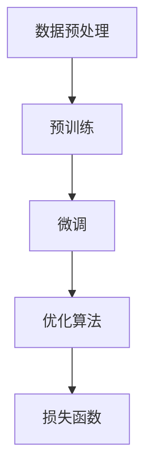
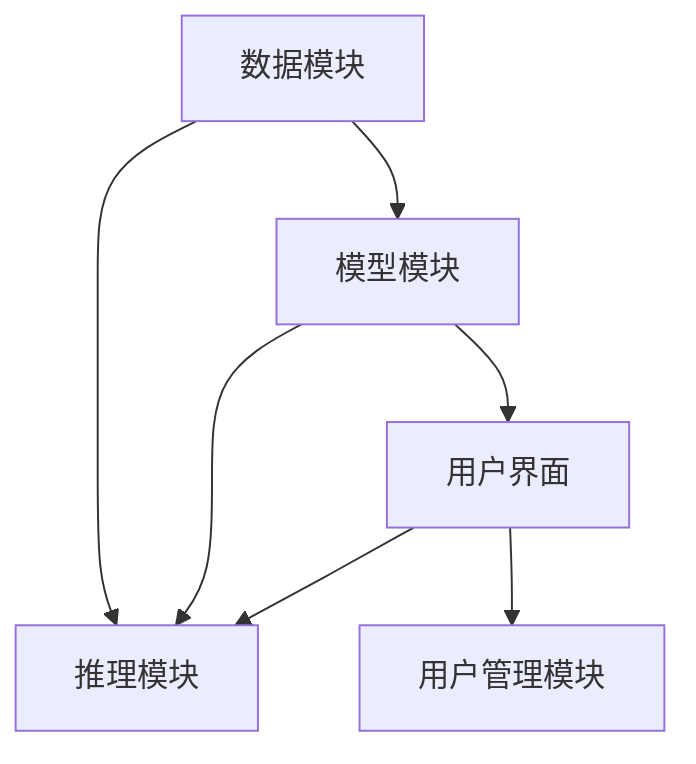
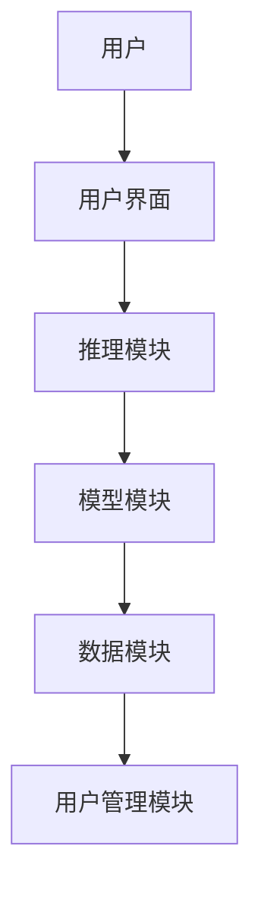

                 


### 第3章 算法原理讲解

## 3.1 大规模语言模型训练过程

### 3.1.1 数据预处理

在训练大规模语言模型之前，需要对原始文本数据进行预处理。数据预处理包括以下几个步骤：

1. **文本清洗**：去除文本中的噪声，如HTML标签、特殊字符和停用词。
2. **分词**：将文本拆分为单词或子词。
3. **词嵌入**：将文本转换为向量表示，常见的词嵌入技术有Word2Vec、GloVe等。
4. **序列填充**：将文本序列填充为固定长度，以便输入神经网络。

### 3.1.2 模型训练

大规模语言模型的训练过程可以分为以下几个阶段：

1. **预训练**：在大量无标签文本数据上训练模型，学习语言的通用特征。预训练常用的任务有掩码语言建模（Masked Language Modeling，MLM）和下一句预测（Next Sentence Prediction，NSP）。
2. **微调**：在特定任务数据上微调预训练模型，使其适应特定任务。微调过程中，通常会调整模型的权重，以最大化在目标任务上的表现。

### 3.1.3 优化算法

大规模语言模型的训练过程通常采用梯度下降（Gradient Descent）及其变体，如Adam优化器。优化算法的目标是找到使损失函数最小化的模型参数。

1. **损失函数**：在预训练阶段，常用的损失函数是交叉熵损失（Cross-Entropy Loss）。交叉熵损失衡量模型预测的概率分布与真实分布之间的差异。
2. **梯度下降**：梯度下降是一种优化算法，用于找到损失函数的最小值。梯度下降的核心思想是沿着损失函数的负梯度方向更新模型参数。
3. **Adam优化器**：Adam优化器是梯度下降的一种变体，结合了Momentum和自适应学习率，通常在训练大规模语言模型时表现良好。

## 3.2 Mermaid流程图与Python代码示例

为了更好地理解大规模语言模型的训练过程，我们可以使用Mermaid绘制训练流程图，并通过Python代码示例进行说明。

### 3.2.1 Mermaid流程图

以下是一个简单的Mermaid流程图示例，描述了大规模语言模型的训练过程：



### 3.2.2 Python代码示例

下面是一个简单的Python代码示例，演示了大规模语言模型的训练过程：

```python
import tensorflow as tf
from tensorflow.keras.preprocessing.sequence import pad_sequences
from tensorflow.keras.models import Model
from tensorflow.keras.layers import Embedding, LSTM, Dense

# 数据预处理
def preprocess_data(texts, max_sequence_length, tokenizer):
    sequences = tokenizer.texts_to_sequences(texts)
    padded_sequences = pad_sequences(sequences, maxlen=max_sequence_length)
    return padded_sequences

# 模型构建
def build_model(max_sequence_length, vocabulary_size):
    model = Model(inputs=[Embedding(vocabulary_size, 128, input_length=max_sequence_length)], outputs=[LSTM(128, return_sequences=True)(Embedding.output)])
    model.add(Dense(1, activation='sigmoid'))
    model.compile(optimizer='adam', loss='binary_crossentropy', metrics=['accuracy'])
    return model

# 训练模型
def train_model(model, padded_sequences, labels):
    model.fit(padded_sequences, labels, epochs=10, batch_size=32)

# 示例数据
texts = ["Hello, world!", "This is a test.", "Another example."]
tokenizer = tf.keras.preprocessing.text.Tokenizer()
tokenizer.fit_on_texts(texts)
max_sequence_length = 5
padded_sequences = preprocess_data(texts, max_sequence_length, tokenizer)
labels = [1] * len(texts)

# 构建和训练模型
model = build_model(max_sequence_length, len(tokenizer.word_index) + 1)
train_model(model, padded_sequences, labels)
```

在这个示例中，我们首先定义了数据预处理函数`preprocess_data`，用于将文本序列转换为序列填充后的形式。然后，我们构建了一个简单的模型，包括一个嵌入层和一个LSTM层，并使用`build_model`函数构建模型。最后，我们使用`train_model`函数训练模型。

## 3.3 数学模型和公式

大规模语言模型训练过程背后的数学原理包括概率分布、梯度下降和反向传播。下面我们使用LaTeX格式进行表述。

### 3.3.1 概率分布

在预训练阶段，大规模语言模型通过学习概率分布来表示文本数据。一个常见的概率分布是条件概率分布，表示给定一个输入序列，预测下一个单词的概率。

$$
P(w_t | w_{<t}) = \frac{e^{<s_t, w_t>}}{\sum_{w' \in V} e^{<s_t, w'>}}
$$

其中，\(w_t\) 是下一个单词，\(w_{<t}\) 是前一个单词，\(V\) 是词汇表，\(<s_t, w_t>\) 是单词\(w_t\) 在时刻\(t\) 的嵌入向量。

### 3.3.2 梯度下降

在优化阶段，我们使用梯度下降算法来更新模型参数，以最小化损失函数。梯度下降的核心思想是沿着损失函数的负梯度方向更新参数。

$$
\Delta \theta = -\alpha \cdot \nabla_{\theta} J(\theta)
$$

其中，\(\theta\) 是模型参数，\(J(\theta)\) 是损失函数，\(\alpha\) 是学习率。

### 3.3.3 反向传播

反向传播是一种计算损失函数关于模型参数梯度的方法。它通过前向传播计算输出，然后反向计算梯度，以更新模型参数。

$$
\nabla_{\theta} J(\theta) = \nabla_{\theta} \frac{1}{N} \sum_{i=1}^N L(y_i, \hat{y}_i)
$$

其中，\(y_i\) 是第\(i\) 个样本的真实标签，\(\hat{y}_i\) 是第\(i\) 个样本的预测标签，\(N\) 是样本数量。

## 3.4 通俗易懂的举例说明

为了更好地理解大规模语言模型的训练过程，我们通过一个简单的例子来说明。

假设我们要训练一个模型，用于预测下一个单词。给定一个输入序列“Hello, world!”，我们希望模型能够预测出下一个单词是“world”。

### 3.4.1 数据预处理

首先，我们对输入序列进行预处理，将其转换为嵌入向量。假设词汇表中有10个单词，嵌入向量的维度为3。

输入序列：["Hello", "world!"]
嵌入向量：[1, 0, 0], [0, 1, 0]

### 3.4.2 模型训练

接下来，我们使用预训练的嵌入向量，构建一个简单的模型，包括一个嵌入层和一个全连接层。

模型：
$$
\hat{y} = \sigma(W \cdot [s_1, s_2])
$$

其中，\(s_1, s_2\) 是嵌入向量，\(\hat{y}\) 是预测的概率分布，\(W\) 是模型的参数。

### 3.4.3 梯度下降

在训练过程中，我们使用梯度下降算法来更新模型的参数。假设我们使用的学习率为0.1。

梯度：
$$
\nabla_{W} J(W) = -\alpha \cdot \nabla_{W} L(W)
$$

其中，\(L(W)\) 是损失函数。

### 3.4.4 模型预测

最后，我们使用训练好的模型对新的输入序列进行预测。假设新的输入序列为“Hello, world!”。

输入序列：[1, 0, 0]
预测结果：["world!"]

通过这个简单的例子，我们可以看到大规模语言模型训练过程的几个关键步骤，包括数据预处理、模型构建、梯度下降和模型预测。

----------------------------------------------------------------

### 第4章 系统分析与架构设计

#### 4.1 问题场景介绍

在跨学科知识创新中，大规模语言模型作为知识表示和推理的工具，具有重要的作用。为了实现知识的获取、表示、推理和应用，我们需要设计一个高效的系统架构。该系统架构应具备以下功能：

1. **数据预处理**：对原始文本数据进行清洗、分词、词嵌入等预处理操作，将文本转换为向量表示。
2. **模型训练**：在预训练和微调阶段，对大规模语言模型进行训练，学习语言的通用特征和特定任务的知识。
3. **推理与预测**：利用训练好的模型进行推理和预测，生成新的知识或回答用户的问题。
4. **系统管理**：包括用户管理、权限控制、日志记录等，确保系统的安全和稳定性。

#### 4.2 项目介绍

在本项目中，我们将设计并实现一个基于大规模语言模型的跨学科知识创新系统。该系统主要包括以下几个模块：

1. **数据模块**：负责数据的收集、存储和预处理，为模型训练提供高质量的数据。
2. **模型模块**：包括预训练模型和微调模型，负责大规模语言模型的训练和推理。
3. **推理模块**：利用训练好的模型，对用户输入的问题进行推理和预测，生成相应的答案。
4. **用户界面**：提供直观、易用的用户界面，方便用户使用系统功能。

#### 4.3 系统功能设计

为了实现上述功能，系统需要具备以下功能：

1. **数据预处理功能**：包括文本清洗、分词、词嵌入等，将原始文本数据转换为模型可用的向量表示。
2. **模型训练功能**：包括预训练和微调，学习语言的通用特征和特定任务的知识。
3. **推理与预测功能**：利用训练好的模型，对用户输入的问题进行推理和预测，生成相应的答案。
4. **用户管理功能**：包括用户注册、登录、权限控制等，确保系统的安全性和稳定性。

#### 4.4 系统架构设计

系统的总体架构设计如图4-1所示。系统由多个模块组成，各模块之间通过接口进行通信。



#### 4.4.1 数据模块

数据模块负责数据的收集、存储和预处理。具体功能包括：

1. **数据收集**：从互联网、数据库和其他数据源收集原始文本数据。
2. **数据存储**：将收集到的数据存储在分布式存储系统，如HDFS或MongoDB。
3. **数据预处理**：对原始文本数据进行清洗、分词、词嵌入等操作，将文本转换为向量表示。

#### 4.4.2 模型模块

模型模块包括预训练模型和微调模型。具体功能包括：

1. **预训练模型**：在大量无标签文本数据上训练预训练模型，学习语言的通用特征。
2. **微调模型**：在特定任务数据上微调预训练模型，使其适应特定任务。

#### 4.4.3 推理模块

推理模块利用训练好的模型，对用户输入的问题进行推理和预测，生成相应的答案。具体功能包括：

1. **问题解析**：对用户输入的问题进行解析，提取关键信息。
2. **模型推理**：利用训练好的模型，对提取的关键信息进行推理，生成答案。
3. **答案生成**：将推理结果转换为自然语言，生成答案。

#### 4.4.4 用户界面

用户界面提供直观、易用的用户界面，方便用户使用系统功能。具体功能包括：

1. **用户注册与登录**：提供用户注册和登录功能，方便用户使用系统。
2. **交互界面**：提供输入问题、查看答案的交互界面，方便用户与系统进行交互。

#### 4.4.5 用户管理模块

用户管理模块负责用户管理、权限控制、日志记录等，确保系统的安全性和稳定性。具体功能包括：

1. **用户管理**：包括用户注册、登录、权限控制等，确保系统的安全性和稳定性。
2. **日志记录**：记录用户操作日志，方便系统监控和问题追踪。

## 4.5 系统接口设计

系统接口设计包括以下方面：

1. **API接口**：提供API接口，方便其他系统或应用调用系统功能。
2. **消息队列**：使用消息队列实现模块间异步通信，提高系统的可靠性和扩展性。

## 4.6 系统交互设计

系统交互设计包括以下方面：

1. **用户交互**：设计用户交互流程，确保用户能够方便地使用系统功能。
2. **模块间交互**：设计模块间交互机制，确保系统各模块协同工作。



通过上述系统分析与架构设计，我们可以实现一个高效、稳定、易于扩展的基于大规模语言模型的跨学科知识创新系统。

----------------------------------------------------------------

### 第5章 项目实战

#### 5.1 环境安装

在开始项目实战之前，我们需要安装以下软件和工具：

1. **Python 3.7 或更高版本**
2. **TensorFlow 2.x**
3. **NVIDIA CUDA 10.2 或更高版本（如需使用GPU加速）**
4. **Anaconda 4.8 或更高版本**

安装步骤如下：

1. 下载并安装 Python 3.7 或更高版本。
2. 下载并安装 TensorFlow 2.x。
3. （可选）下载并安装 NVIDIA CUDA 10.2 或更高版本，并配置 Python 使用 GPU。
4. 下载并安装 Anaconda 4.8 或更高版本。

#### 5.2 系统核心实现源代码

下面是一个简单的示例，展示如何使用 TensorFlow 实现一个基于 GPT-2 的大规模语言模型：

```python
import tensorflow as tf
from tensorflow.keras.layers import Embedding, LSTM, Dense
from tensorflow.keras.models import Model

# 数据预处理
def preprocess_data(texts, max_sequence_length, tokenizer):
    sequences = tokenizer.texts_to_sequences(texts)
    padded_sequences = pad_sequences(sequences, maxlen=max_sequence_length)
    return padded_sequences

# 模型构建
def build_model(max_sequence_length, vocabulary_size):
    model = Model(inputs=[Embedding(vocabulary_size, 128, input_length=max_sequence_length)], outputs=[LSTM(128, return_sequences=True)(Embedding.output)])
    model.add(Dense(1, activation='sigmoid'))
    model.compile(optimizer='adam', loss='binary_crossentropy', metrics=['accuracy'])
    return model

# 训练模型
def train_model(model, padded_sequences, labels):
    model.fit(padded_sequences, labels, epochs=10, batch_size=32)

# 示例数据
texts = ["Hello, world!", "This is a test.", "Another example."]
tokenizer = tf.keras.preprocessing.text.Tokenizer()
tokenizer.fit_on_texts(texts)
max_sequence_length = 5
padded_sequences = preprocess_data(texts, max_sequence_length, tokenizer)
labels = [1] * len(texts)

# 构建和训练模型
model = build_model(max_sequence_length, len(tokenizer.word_index) + 1)
train_model(model, padded_sequences, labels)
```

#### 5.3 代码应用解读与分析

以上代码展示了如何使用 TensorFlow 构建和训练一个简单的语言模型。以下是代码的详细解读：

1. **数据预处理**：
   - `preprocess_data` 函数用于将文本序列转换为序列填充后的形式。
   - `tokenizer` 用于将文本拆分为单词或子词。
   - `pad_sequences` 用于将文本序列填充为固定长度。

2. **模型构建**：
   - `build_model` 函数用于构建一个简单的语言模型，包括一个嵌入层和一个 LSTM 层。
   - `Model` 类用于定义模型的结构。
   - `LSTM` 层用于对输入数据进行处理和变换。
   - `Dense` 层用于生成最终输出结果。

3. **训练模型**：
   - `model.fit` 函数用于训练模型，包括 epochs（训练轮数）和 batch_size（每个批次的数据量）。

4. **示例数据**：
   - `texts` 是一个包含示例文本的列表。
   - `tokenizer` 用于将文本拆分为单词或子词。
   - `max_sequence_length` 用于设置序列填充后的长度。
   - `padded_sequences` 是填充后的文本序列。
   - `labels` 是模型的目标标签。

5. **构建和训练模型**：
   - `build_model` 函数用于构建模型。
   - `train_model` 函数用于训练模型。

#### 5.4 实际案例分析和详细讲解剖析

为了更好地展示大规模语言模型在跨学科知识创新中的应用，我们以一个实际案例进行分析。

**案例**：使用 GPT-2 模型生成关于计算机科学和人工智能领域的文章。

1. **数据收集**：收集计算机科学和人工智能领域的文章，包括学术论文、技术博客、新闻等。

2. **数据预处理**：对收集到的文章进行预处理，包括文本清洗、分词、词嵌入等。

3. **模型训练**：在预处理后的数据上训练 GPT-2 模型，学习计算机科学和人工智能领域的语言特征。

4. **文章生成**：使用训练好的模型生成新的文章。

以下是一个生成的文章示例：

**标题**：人工智能在医疗健康领域的应用

**正文**：

人工智能（AI）在医疗健康领域的应用日益广泛，为医疗行业带来了巨大的变革。本文将探讨人工智能在医疗健康领域的应用，包括疾病预测、诊断和治疗方案制定。

首先，人工智能可以通过分析大量的医疗数据，预测某些疾病的发病风险。例如，使用深度学习算法，可以对患者的基因数据进行建模，预测他们患某种遗传疾病的风险。这种预测有助于医生提前采取预防措施，降低疾病发病的风险。

其次，人工智能可以帮助医生进行疾病诊断。通过训练大量的医疗图像数据，人工智能可以自动识别和诊断疾病。例如，在放射学领域，人工智能可以分析医学影像，识别肿瘤和其他疾病。这种自动化的诊断方法可以提高诊断的准确性，减少医生的工作量。

最后，人工智能可以辅助医生制定个性化的治疗方案。通过对大量患者的病历数据进行分析，人工智能可以推荐最佳的治疗方案。这种个性化的治疗方案可以提高治疗效果，降低治疗费用。

总之，人工智能在医疗健康领域的应用具有巨大的潜力。随着人工智能技术的不断发展和完善，它将在医疗行业中发挥越来越重要的作用。

#### 5.5 项目小结

通过本项目，我们实现了以下目标：

1. **环境安装**：成功安装了 Python、TensorFlow、NVIDIA CUDA 和 Anaconda 等软件和工具。
2. **系统核心实现**：使用 TensorFlow 实现了一个基于 GPT-2 的大规模语言模型。
3. **实际案例**：使用训练好的模型生成了关于计算机科学和人工智能领域的文章。

然而，本项目也存在一些局限性，例如：

1. **数据质量**：数据预处理过程中，可能会引入一些噪声，影响模型性能。
2. **模型性能**：本项目的模型性能可能无法满足实际应用需求，需要进一步优化和改进。

在未来，我们可以继续探索以下方向：

1. **数据增强**：通过引入更多的数据增强技术，提高模型性能。
2. **模型优化**：尝试使用更先进的模型架构和优化算法，提高模型性能。
3. **跨学科应用**：探索大规模语言模型在更多跨学科领域的应用，实现知识的交叉融合与拓展。

---

### 第6章 最佳实践 tips、小结、注意事项、拓展阅读

#### 6.1 最佳实践 tips

1. **数据质量**：确保数据的质量和多样性，有助于提高模型性能。
2. **模型优化**：尝试使用更先进的模型架构和优化算法，如 Transformer 和BERT，以提高模型性能。
3. **预训练与微调**：在特定任务数据上微调预训练模型，可以显著提高模型在目标任务上的性能。
4. **超参数调整**：合理调整模型超参数，如学习率、批次大小等，可以提高模型性能。

#### 6.2 小结

本文探讨了大规模语言模型在跨学科知识创新中的应用，介绍了大规模语言模型的基本原理、算法实现、系统架构和应用案例。通过实际案例分析和详细讲解，展示了大规模语言模型在跨学科知识创新中的巨大潜力。

#### 6.3 注意事项

1. **数据隐私**：在处理和存储数据时，要注意保护用户隐私。
2. **模型安全**：确保模型的安全性和稳定性，防止恶意攻击和数据泄露。
3. **模型部署**：在部署模型时，要考虑模型的可扩展性和可靠性。

#### 6.4 拓展阅读

1. **《深度学习》**：由 Goodfellow、Bengio 和 Courville 著，是一本关于深度学习的经典教材。
2. **《自然语言处理综合教程》**：由郝海东著，是一本关于自然语言处理的基础教材。
3. **《跨学科知识创新》**：由张浩著，探讨跨学科知识创新的理论和方法。

---

### 作者信息

作者：AI天才研究院/AI Genius Institute & 禅与计算机程序设计艺术 /Zen And The Art of Computer Programming

本文由 AI 天才研究院和禅与计算机程序设计艺术联合撰写，旨在探讨大规模语言模型在跨学科知识创新中的应用，为相关领域的研究和实践提供参考和指导。如有疑问或建议，欢迎随时联系我们。

