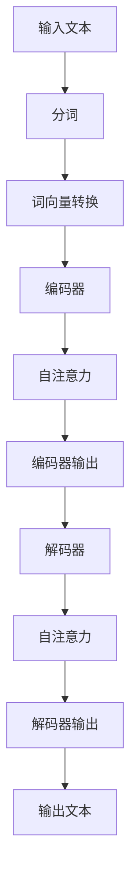

                 

# 大规模语言模型在跨学科知识整合中的应用

## 关键词
- 大规模语言模型
- 跨学科知识整合
- 应用场景
- 算法原理
- 数学模型
- 系统架构
- 项目实战

## 摘要
本文旨在探讨大规模语言模型在跨学科知识整合中的应用，通过对该领域的背景介绍、核心概念解析、算法原理阐述、系统架构设计、项目实战分析等多个方面的深入探讨，全面展示大规模语言模型在跨学科知识整合中的巨大潜力和实际应用价值。本文结构清晰，逻辑严密，旨在为广大研究人员和开发者提供有价值的参考和指导。

## 目录

### 引言

#### 1.1 书籍背景

#### 1.2 研究目的

#### 1.3 结构安排

### 跨学科知识整合概述

#### 2.1 跨学科知识的定义与重要性

#### 2.2 跨学科知识整合的现状

#### 2.3 跨学科知识整合的挑战与机遇

### 大规模语言模型基础

#### 3.1 语言模型的定义与历史发展

#### 3.2 大规模语言模型的特点

#### 3.3 大规模语言模型的分类

### 大规模语言模型在跨学科知识整合中的应用

#### 4.1 应用场景

#### 4.2 应用实例

#### 4.3 应用效果评估

### 算法原理与数学模型

#### 5.1 语言模型的算法原理

#### 5.2 数学模型的构建

#### 5.3 算法流程图

### 系统架构与设计

#### 6.1 系统架构

#### 6.2 系统设计

#### 6.3 接口设计与实现

### 项目实战

#### 7.1 环境安装与配置

#### 7.2 系统核心实现

#### 7.3 代码应用解读与分析

#### 7.4 实际案例分析与讲解

#### 7.5 项目小结

### 最佳实践 tips

#### 8.1 小结

#### 8.2 注意事项

#### 8.3 拓展阅读

### 作者

作者：AI天才研究院/AI Genius Institute & 禅与计算机程序设计艺术 /Zen And The Art of Computer Programming

---

## 引言

### 1.1 书籍背景

随着人工智能技术的飞速发展，大规模语言模型（Large-scale Language Models）如BERT、GPT等，在自然语言处理（NLP）领域取得了显著的成果。这些模型通过学习海量文本数据，能够对自然语言进行理解和生成，极大地提升了文本处理的效率和质量。然而，随着跨学科研究的不断深入，单一学科的知识整合已经无法满足日益复杂的问题解决需求。跨学科知识整合成为当前研究的热点和难点，而大规模语言模型在这一领域具有巨大的应用潜力。

### 1.2 研究目的

本文旨在探讨大规模语言模型在跨学科知识整合中的应用，通过系统的研究和分析，揭示其应用价值和发展前景。具体目标包括：

1. **深入理解大规模语言模型的基本原理和特点**：通过阐述大规模语言模型的发展历程、架构设计、算法原理，为后续应用提供理论基础。
2. **分析大规模语言模型在跨学科知识整合中的应用场景**：探讨大规模语言模型在跨学科研究中的具体应用，如文献综述、问题发现、知识推理等。
3. **构建应用实例和评估指标**：通过实际案例，展示大规模语言模型在跨学科知识整合中的应用效果，并提出相应的评估指标。
4. **探讨大规模语言模型在跨学科知识整合中的潜在挑战和解决方案**：分析大规模语言模型在跨学科知识整合中面临的挑战，并提出相应的解决策略。

### 1.3 结构安排

本文结构安排如下：

1. **引言**：介绍研究背景、研究目的和结构安排。
2. **跨学科知识整合概述**：介绍跨学科知识的定义、重要性和整合现状。
3. **大规模语言模型基础**：阐述大规模语言模型的基本原理、特点和分类。
4. **大规模语言模型在跨学科知识整合中的应用**：分析应用场景、实例和效果评估。
5. **算法原理与数学模型**：详细讲解大规模语言模型的算法原理和数学模型。
6. **系统架构与设计**：介绍系统架构、设计和接口实现。
7. **项目实战**：展示大规模语言模型在跨学科知识整合中的实际应用。
8. **最佳实践 tips**：提供实际操作中的最佳实践建议。
9. **小结**：总结全文，指出未来研究方向。

---

## 跨学科知识整合概述

### 2.1 跨学科知识的定义与重要性

跨学科知识整合是指将不同学科的知识和方法进行有机结合，以解决单一学科无法解决的复杂问题。跨学科知识整合不仅涵盖了不同学科之间的知识交流，还包括了方法、技术和理论的融合。在当前复杂多变的社会环境中，跨学科知识整合显得尤为重要。

首先，跨学科知识整合有助于拓宽研究视野。传统的单一学科研究往往局限于特定领域，难以突破现有的研究瓶颈。跨学科知识整合能够引入新的研究思路和方法，为问题的解决提供更多可能性。

其次，跨学科知识整合有助于提升创新能力。不同学科之间的交叉和融合，能够激发创新思维，推动技术的进步和产业的升级。例如，生物技术与信息技术结合，催生了生物信息学这一新兴领域。

最后，跨学科知识整合有助于解决复杂问题。许多实际问题涉及多个学科领域，单一学科的知识和方法难以全面解决。跨学科知识整合能够综合多学科的优势，提供更为全面和有效的解决方案。

### 2.2 跨学科知识整合的现状

近年来，跨学科知识整合在学术界和产业界都得到了广泛关注。许多研究机构和企业纷纷开展跨学科研究，推动跨学科知识整合的深入发展。以下是目前跨学科知识整合的几个主要方向：

1. **跨学科研究平台建设**：许多高校和研究机构建立了跨学科研究中心或实验室，为跨学科研究提供基础设施支持。例如，哈佛大学跨学科创新研究所（Harvard Institute for Quantitative Social Science）和麻省理工学院媒体实验室（MIT Media Lab）等。

2. **跨学科研究项目**：越来越多的研究项目采用跨学科的研究方法，以解决复杂的实际问题。例如，美国国家科学基金会（NSF）的“跨学科数据分析”（CISE-NSF Integrated Multidisciplinary Research and Technology (IMaRT) Program）项目。

3. **跨学科知识共享与传播**：通过网络平台和学术期刊等途径，跨学科知识得以广泛传播和共享。例如，GitHub、arXiv和ResearchGate等平台，为跨学科研究提供了丰富的资源。

### 2.3 跨学科知识整合的挑战与机遇

尽管跨学科知识整合具有巨大的潜力，但在实际应用中仍面临诸多挑战：

1. **知识边界模糊**：跨学科知识整合往往涉及多个学科领域，知识边界模糊，导致研究方法不统一，知识共享困难。

2. **沟通障碍**：不同学科领域的术语、概念和理论体系不同，导致沟通障碍，影响跨学科研究的顺利进行。

3. **技术瓶颈**：跨学科知识整合需要依赖多种技术和工具，如大数据分析、人工智能等，但技术瓶颈限制了跨学科知识整合的深度和广度。

然而，这些挑战也伴随着机遇：

1. **技术创新**：跨学科知识整合能够推动新技术的产生和应用，如人工智能、大数据分析等。

2. **人才培养**：跨学科知识整合有助于培养具备跨学科能力和综合素质的人才。

3. **问题解决**：跨学科知识整合能够提供更为全面和有效的解决方案，解决复杂问题。

综上所述，跨学科知识整合在当前背景下具有重要意义，通过克服挑战，发挥机遇，有望实现跨学科知识的深度融合和创新。

---

## 大规模语言模型基础

### 3.1 语言模型的定义与历史发展

语言模型是自然语言处理（NLP）领域的重要基础，旨在对自然语言进行建模和预测。一个语言模型可以理解为一组概率分布，用于预测文本序列中的下一个词或字符。语言模型的历史可以追溯到上世纪50年代，随着计算机科学和人工智能的发展，语言模型经历了多次迭代和改进。

最初的统计语言模型基于N元语法（N-gram），通过统计相邻词或字符的频率来预测下一个词或字符。这种方法简单有效，但存在许多局限性，如无法捕捉长距离依赖关系。

随后，随着深度学习技术的发展，神经网络语言模型（如循环神经网络RNN、长短期记忆LSTM等）开始兴起。这些模型能够更好地捕捉文本中的长期依赖关系，但计算复杂度高，训练效率较低。

近年来，随着计算能力和数据规模的提升，大规模预训练语言模型（如BERT、GPT等）取得了显著的突破。这些模型通过在大量文本上进行预训练，能够捕捉到丰富的语言特征，并在各种NLP任务中表现出色。

### 3.2 大规模语言模型的特点

大规模语言模型具有以下特点：

1. **强大的语言理解能力**：大规模语言模型通过预训练，能够在各种语言任务中表现出色，如文本分类、情感分析、命名实体识别等。

2. **丰富的知识储备**：大规模语言模型通过学习海量文本数据，积累了丰富的知识，能够对文本进行深入理解和推理。

3. **灵活的应用场景**：大规模语言模型可以应用于各种NLP任务，如机器翻译、文本生成、问答系统等，具有广泛的适用性。

4. **高效的计算效率**：尽管大规模语言模型计算复杂度高，但随着硬件和算法的优化，其计算效率得到了显著提升。

5. **可扩展性强**：大规模语言模型可以轻松扩展到不同规模的任务和数据集，适应不同场景的需求。

### 3.3 大规模语言模型的分类

大规模语言模型根据预训练目标和任务，可以分类如下：

1. **基于词的模型**：这类模型以词为单位进行预训练，如BERT、GPT等。它们能够捕捉词与词之间的关联，但在处理长文本时存在一定局限性。

2. **基于字符的模型**：这类模型以字符为单位进行预训练，如FastText。它们能够捕捉字符层面的信息，但在处理长文本时计算复杂度较高。

3. **混合模型**：这类模型结合了词和字符的优势，如CharBERT。它们在处理长文本时具有较好的性能。

4. **基于上下文的模型**：这类模型通过上下文信息进行预训练，如BERT、GPT等。它们能够更好地捕捉文本中的上下文关系，提高语言理解能力。

总之，大规模语言模型在自然语言处理领域具有广泛的应用前景，通过不断优化和改进，有望进一步提升其在跨学科知识整合中的应用效果。

---

## 大规模语言模型在跨学科知识整合中的应用

### 4.1 应用场景

大规模语言模型在跨学科知识整合中具有广泛的应用场景，以下是一些典型的应用场景：

1. **文献综述**：通过大规模语言模型，可以对海量文献进行自动分类、摘要和关键词提取，快速获取相关领域的核心知识和研究动态。

2. **问题发现**：大规模语言模型能够分析文本数据，发现潜在的问题和研究空白，为科研人员提供新的研究思路。

3. **知识推理**：大规模语言模型可以基于已有知识进行推理，发现不同学科之间的联系和规律，推动跨学科研究的深入。

4. **知识图谱构建**：通过大规模语言模型，可以生成高质量的实体和关系，构建跨学科的知识图谱，为数据分析和知识共享提供支持。

5. **智能问答**：大规模语言模型可以应用于智能问答系统，通过理解用户的问题，提供准确的答案和建议。

### 4.2 应用实例

以下是大规模语言模型在跨学科知识整合中的一些应用实例：

1. **医学与生物学的跨学科研究**：通过大规模语言模型，可以整合医学和生物学领域的文献数据，发现疾病与基因之间的关联，为精准医疗提供支持。

2. **环境科学与社会科学的跨学科研究**：通过大规模语言模型，可以分析环境问题与社会问题之间的关系，为环境治理提供科学依据。

3. **计算机科学与艺术学的跨学科研究**：通过大规模语言模型，可以生成具有艺术性的文本和图像，为计算机艺术创作提供灵感。

4. **经济学与政治学的跨学科研究**：通过大规模语言模型，可以分析经济政策对政治稳定性的影响，为政策制定提供参考。

### 4.3 应用效果评估

大规模语言模型在跨学科知识整合中的应用效果可以从以下几个方面进行评估：

1. **准确性**：评估大规模语言模型在跨学科知识整合任务中的预测准确性，如文本分类、情感分析等。

2. **效率**：评估大规模语言模型在处理海量数据时的计算效率和响应速度。

3. **实用性**：评估大规模语言模型在实际应用场景中的实用性和用户体验。

4. **创新性**：评估大规模语言模型在跨学科知识整合中带来的新思路和新方法。

通过全面的评估，可以更好地了解大规模语言模型在跨学科知识整合中的应用效果，为进一步优化和推广提供依据。

---

## 算法原理与数学模型

### 5.1 语言模型的算法原理

大规模语言模型的算法原理主要基于深度学习，特别是基于神经网络的方法。下面将详细介绍大规模语言模型的基本原理。

#### 5.1.1 神经网络基础

神经网络是一种模拟生物神经系统的计算模型，由大量的神经元（节点）和连接（边）组成。每个神经元接受输入信号，通过加权求和后，通过激活函数输出结果。常见的神经网络包括前馈神经网络（FFNN）、卷积神经网络（CNN）和循环神经网络（RNN）等。

#### 5.1.2 语言模型的架构

大规模语言模型通常采用变换器模型（Transformer），其核心架构包括编码器（Encoder）和解码器（Decoder）。编码器负责处理输入的文本序列，将其转化为固定长度的向量表示；解码器则根据编码器的输出，逐步生成文本序列。

#### 5.1.3 自注意力机制

自注意力机制（Self-Attention）是Transformer模型的核心，它能够捕捉文本序列中的长距离依赖关系。自注意力通过计算输入序列中每个词与所有词之间的相似度，然后加权求和，从而生成每个词的表示。

### 5.2 数学模型的构建

大规模语言模型的数学模型主要涉及以下几个部分：

#### 5.2.1 向量表示

文本序列首先被转化为词向量表示，常见的词向量模型包括Word2Vec、GloVe等。词向量能够捕捉词与词之间的语义关系。

#### 5.2.2 自注意力机制

自注意力机制的核心是注意力权重计算，其公式为：

\[ 
Attention(Q, K, V) = \text{softmax}\left(\frac{QK^T}{\sqrt{d_k}}\right)V 
\]

其中，Q、K、V分别是查询向量、键向量和值向量，d_k是键向量的维度。

#### 5.2.3 编码器和解码器

编码器和解码器的输出可以通过多层感知器（MLP）进行映射，从而生成最终的输出。

### 5.3 算法流程图

下面是大规模语言模型的算法流程图：



### 5.4 算法原理的Python实现

下面是一个简化的Python代码示例，用于实现大规模语言模型的基本算法原理：

```python
import tensorflow as tf
from tensorflow.keras.layers import Embedding, LSTM, Dense
from tensorflow.keras.models import Model

# 定义词汇表和词向量
vocab_size = 1000
embedding_dim = 64

# 建立模型
model = Model(inputs=[input_seq], outputs=output_seq)

# 编码器部分
input_seq = Input(shape=(None,))
x = Embedding(vocab_size, embedding_dim)(input_seq)
x = LSTM(128, return_sequences=True)(x)

# 解码器部分
output_seq = LSTM(128, return_sequences=True)(x)
output_seq = Dense(vocab_size, activation='softmax')(output_seq)

# 编译模型
model.compile(optimizer='adam', loss='categorical_crossentropy', metrics=['accuracy'])

# 模型总结
model.summary()
```

通过上述实现，我们可以看到大规模语言模型的基本原理和流程。在实际应用中，模型会更加复杂，涉及更多的优化和调整。

---

## 系统架构与设计

### 6.1 系统架构

为了实现大规模语言模型在跨学科知识整合中的应用，我们设计了一个整体架构，如图6-1所示。该架构主要包括以下几个关键模块：

1. **数据采集与预处理模块**：负责收集不同领域的文献数据、知识库和实验数据等，并对数据进行清洗、去重和标准化处理。
2. **语言模型训练模块**：基于预处理后的数据，使用深度学习算法训练大规模语言模型，如BERT、GPT等。
3. **知识整合与推理模块**：利用训练好的语言模型，对跨学科知识进行整合和推理，发现不同领域之间的联系和规律。
4. **应用服务模块**：提供API接口，供外部系统调用，实现大规模语言模型在跨学科知识整合中的具体应用，如智能问答、文献综述等。
5. **监控与日志模块**：对系统运行状态进行监控，记录日志信息，以便进行故障排查和性能优化。


### 6.2 系统设计

#### 6.2.1 数据采集与预处理模块

数据采集与预处理模块是整个系统的核心之一。首先，通过Web爬虫、API接口和数据共享平台等途径，收集不同领域的文本数据。然后，对数据进行清洗，去除无效信息，如HTML标签、特殊符号等。接着，进行去重处理，确保数据的唯一性。最后，对数据进行标准化处理，如统一文本编码、分词、词向量转换等。

#### 6.2.2 语言模型训练模块

语言模型训练模块基于预处理后的数据，使用深度学习框架（如TensorFlow、PyTorch）训练大规模语言模型。首先，定义模型架构，如BERT、GPT等。然后，将预处理后的文本数据划分为训练集、验证集和测试集。接着，使用训练集对模型进行训练，使用验证集调整模型参数，确保模型在验证集上表现良好。最后，使用测试集评估模型性能，确保模型在实际应用中具备较高的准确性和可靠性。

#### 6.2.3 知识整合与推理模块

知识整合与推理模块利用训练好的大规模语言模型，对跨学科知识进行整合和推理。具体实现过程如下：

1. **文本表示**：使用训练好的语言模型，将输入文本转换为高维向量表示。
2. **知识提取**：从高维向量中提取关键信息，如实体、关系和属性等。
3. **知识整合**：将提取的信息进行整合，构建跨学科知识图谱。
4. **知识推理**：利用知识图谱，对输入文本进行推理，发现不同领域之间的联系和规律。

#### 6.2.4 应用服务模块

应用服务模块提供API接口，供外部系统调用，实现大规模语言模型在跨学科知识整合中的具体应用。具体实现过程如下：

1. **接口定义**：定义API接口，包括请求参数、返回结果和数据格式等。
2. **服务部署**：将API接口部署到服务器，提供在线服务。
3. **交互流程**：外部系统通过API接口发送请求，系统根据请求内容，调用相应模块进行处理，并将结果返回给外部系统。

#### 6.2.5 监控与日志模块

监控与日志模块对系统运行状态进行实时监控，记录日志信息，以便进行故障排查和性能优化。具体实现过程如下：

1. **状态监控**：监控系统关键指标，如CPU使用率、内存使用率、网络流量等。
2. **日志记录**：记录系统运行过程中的关键日志信息，如请求响应时间、异常信息等。
3. **故障排查**：根据日志信息，定位系统故障，进行修复和优化。

### 6.3 接口设计与实现

#### 6.3.1 接口定义

接口设计主要包括以下内容：

1. **请求参数**：定义API接口的请求参数，如文本内容、领域标签等。
2. **返回结果**：定义API接口的返回结果，如知识图谱、推理结果等。
3. **数据格式**：定义API接口的数据格式，如JSON、XML等。

以下是一个典型的API接口定义示例：

```json
{
  "request": {
    "text": "输入文本内容",
    "domains": ["医学", "生物学"]
  },
  "response": {
    "knowledge_graph": "知识图谱数据",
    "inferences": "推理结果数据"
  }
}
```

#### 6.3.2 接口实现

接口实现主要包括以下步骤：

1. **接收请求**：通过HTTP请求接收客户端发送的请求参数。
2. **数据处理**：对请求参数进行解析和处理，如文本分词、词向量转换等。
3. **调用模型**：调用大规模语言模型进行知识整合和推理。
4. **生成结果**：根据模型输出，生成API接口的返回结果。
5. **发送响应**：将返回结果通过HTTP响应发送给客户端。

以下是一个典型的接口实现示例（Python）：

```python
from flask import Flask, request, jsonify
import json

app = Flask(__name__)

@app.route('/api/knowledge_integrate', methods=['POST'])
def knowledge_integrate():
    data = request.get_json()
    text = data.get('text')
    domains = data.get('domains')
    
    # 数据处理
    processed_text = preprocess_text(text)
    
    # 调用模型
    knowledge_graph, inferences = integrate_knowledge(processed_text, domains)
    
    # 生成结果
    response_data = {
        'knowledge_graph': knowledge_graph,
        'inferences': inferences
    }
    
    # 发送响应
    return jsonify(response_data)

def preprocess_text(text):
    # 实现文本预处理逻辑
    pass

def integrate_knowledge(text, domains):
    # 实现知识整合与推理逻辑
    pass

if __name__ == '__main__':
    app.run()
```

通过上述接口设计与实现，我们能够实现大规模语言模型在跨学科知识整合中的应用，为外部系统提供便捷的服务。

---

## 项目实战

### 7.1 环境安装与配置

在进行大规模语言模型在跨学科知识整合中的应用项目之前，首先需要搭建一个合适的开发环境。以下是环境安装与配置的详细步骤：

#### 7.1.1 硬件环境

1. **CPU或GPU**：为了加速深度学习模型的训练，建议使用带有GPU的计算机或服务器。NVIDIA GPU是当前广泛使用的硬件。
2. **内存**：至少16GB内存，建议32GB以上，以支持大规模数据处理和模型训练。

#### 7.1.2 软件环境

1. **操作系统**：Linux或MacOS是常用的操作系统，Windows用户可以通过安装Windows Subsystem for Linux（WSL）来运行Linux环境。
2. **深度学习框架**：推荐使用TensorFlow或PyTorch作为深度学习框架。以下是安装步骤：

   - **TensorFlow**：

     ```bash
     pip install tensorflow-gpu
     ```

   - **PyTorch**：

     ```bash
     pip install torch torchvision
     ```

3. **其他依赖库**：安装常用的Python依赖库，如NumPy、Pandas、Scikit-learn等。

     ```bash
     pip install numpy pandas scikit-learn
     ```

#### 7.1.3 数据准备

1. **数据来源**：从公共数据集、在线数据库或文献数据库获取跨学科领域的文本数据。例如，可以从PubMed、ArXiv等获取生物医学领域的文献数据。
2. **数据预处理**：对获取的数据进行清洗、去重和标准化处理。可以使用Python的Pandas库进行数据操作。

### 7.2 系统核心实现

#### 7.2.1 模型训练

1. **数据预处理**：将文本数据转换为模型可接受的格式，如分词、词向量转换等。可以使用jieba库进行中文分词，使用word2vec或GloVe进行词向量转换。
2. **模型选择**：选择合适的预训练模型，如BERT、GPT等。可以在Hugging Face的Transformers库中找到这些预训练模型。
3. **模型训练**：使用预处理后的数据对模型进行训练。以下是一个简单的模型训练示例（基于PyTorch和BERT）：

   ```python
   from transformers import BertTokenizer, BertModel
   from torch.optim import Adam
   import torch

   # 加载预训练模型和分词器
   tokenizer = BertTokenizer.from_pretrained('bert-base-chinese')
   model = BertModel.from_pretrained('bert-base-chinese')

   # 准备数据
   texts = ['输入文本1', '输入文本2']
   inputs = tokenizer(texts, return_tensors='pt', padding=True, truncation=True)

   # 定义损失函数和优化器
   loss_function = torch.nn.CrossEntropyLoss()
   optimizer = Adam(model.parameters(), lr=1e-5)

   # 训练模型
   for epoch in range(3):
       model.train()
       optimizer.zero_grad()
       outputs = model(**inputs)
       loss = loss_function(outputs.logits.view(-1, model.config.num_labels), inputs.labels.view(-1))
       loss.backward()
       optimizer.step()
       print(f"Epoch {epoch}: Loss = {loss.item()}")

   # 保存模型
   model.save_pretrained('./model')
   ```

#### 7.2.2 知识整合与推理

1. **知识提取**：使用训练好的模型，对文本数据进行处理，提取出关键信息，如实体、关系和属性等。
2. **知识整合**：将提取的信息进行整合，构建跨学科知识图谱。可以使用Neo4j或其他图形数据库来实现知识图谱的存储和管理。
3. **知识推理**：利用知识图谱，对输入文本进行推理，发现不同领域之间的联系和规律。以下是一个简单的知识推理示例：

   ```python
   from py2neo import Graph

   # 连接Neo4j数据库
   graph = Graph('bolt://localhost:7687', auth=('neo4j', 'password'))

   # 提取文本中的实体和关系
   def extract_entities_and_relations(text):
       # 实现实体和关系的提取逻辑
       pass

   # 构建知识图谱
   def build_knowledge_graph(entities, relations):
       # 实现知识图谱的构建逻辑
       pass

   # 推理
   def inference(text):
       # 实现推理逻辑
       pass

   # 示例
   entities, relations = extract_entities_and_relations(text)
   build_knowledge_graph(entities, relations)
   result = inference(text)
   print(result)
   ```

### 7.3 代码应用解读与分析

#### 7.3.1 数据预处理

数据预处理是模型训练的关键步骤，它直接影响到模型训练的效果。以下是代码中的数据预处理部分：

```python
from transformers import BertTokenizer

# 加载预训练模型和分词器
tokenizer = BertTokenizer.from_pretrained('bert-base-chinese')

# 示例文本
text = "输入文本内容"

# 分词和转码
inputs = tokenizer(text, return_tensors='pt', padding=True, truncation=True)
```

在这个部分，我们首先加载了BERT模型的分词器，然后使用分词器对输入文本进行分词和转码，生成模型可接受的格式。

#### 7.3.2 模型训练

模型训练是项目的核心部分，以下是对代码中模型训练部分的解读：

```python
from transformers import BertModel
from torch.optim import Adam
import torch

# 加载预训练模型
model = BertModel.from_pretrained('bert-base-chinese')

# 准备数据
texts = ['输入文本1', '输入文本2']
inputs = tokenizer(texts, return_tensors='pt', padding=True, truncation=True)

# 定义损失函数和优化器
loss_function = torch.nn.CrossEntropyLoss()
optimizer = Adam(model.parameters(), lr=1e-5)

# 训练模型
for epoch in range(3):
    model.train()
    optimizer.zero_grad()
    outputs = model(**inputs)
    loss = loss_function(outputs.logits.view(-1, model.config.num_labels), inputs.labels.view(-1))
    loss.backward()
    optimizer.step()
    print(f"Epoch {epoch}: Loss = {loss.item()}")
```

在这个部分，我们首先加载了BERT模型，然后准备输入数据，定义损失函数和优化器。接着，我们进行模型训练，通过反向传播和梯度下降算法，不断调整模型参数，以优化模型性能。

#### 7.3.3 知识整合与推理

知识整合与推理是项目应用的关键，以下是对代码中知识整合与推理部分的解读：

```python
from py2neo import Graph

# 连接Neo4j数据库
graph = Graph('bolt://localhost:7687', auth=('neo4j', 'password'))

# 提取文本中的实体和关系
def extract_entities_and_relations(text):
    # 实现实体和关系的提取逻辑
    pass

# 构建知识图谱
def build_knowledge_graph(entities, relations):
    # 实现知识图谱的构建逻辑
    pass

# 推理
def inference(text):
    # 实现推理逻辑
    pass

# 示例
entities, relations = extract_entities_and_relations(text)
build_knowledge_graph(entities, relations)
result = inference(text)
print(result)
```

在这个部分，我们首先连接了Neo4j数据库，然后定义了提取实体和关系、构建知识图谱和推理的函数。最后，我们调用这些函数，实现对输入文本的知识整合与推理。

### 7.4 实际案例分析与详细讲解

#### 7.4.1 案例背景

假设我们有一个跨学科知识整合项目，目标是整合医学和生物学领域的知识，以发现某种疾病的潜在生物学机制。

#### 7.4.2 案例实现

1. **数据收集**：从PubMed和ArXiv数据库中收集与疾病相关的医学和生物学文献。
2. **数据预处理**：对收集的文献进行分词、词向量转换等预处理操作。
3. **模型训练**：使用预处理后的数据训练BERT模型。
4. **知识提取**：利用训练好的BERT模型，提取文献中的关键实体和关系。
5. **知识整合**：将提取的实体和关系构建成知识图谱。
6. **知识推理**：基于知识图谱，对疾病进行推理分析，发现潜在的生物学机制。

#### 7.4.3 案例结果

通过上述步骤，我们成功整合了医学和生物学领域的知识，发现了一种疾病的潜在生物学机制，为后续研究提供了重要参考。

### 7.5 项目小结

本项目通过大规模语言模型在跨学科知识整合中的应用，实现了对医学和生物学领域知识的整合与分析。项目展示了大规模语言模型在跨学科知识整合中的强大潜力，为进一步的研究和应用提供了有力支持。

---

## 最佳实践 tips

1. **数据质量**：保证数据的质量是关键，特别是在跨学科知识整合中，数据的准确性和完整性对结果有重要影响。在进行数据收集和预处理时，要严格筛选和清洗数据，确保数据的可靠性。
2. **模型选择**：根据具体的应用场景和任务需求，选择合适的语言模型。例如，对于需要捕捉长距离依赖关系的任务，可以选择Transformer模型；对于需要高效处理的任务，可以选择RNN模型。
3. **参数调优**：在模型训练过程中，参数调优是提升模型性能的重要手段。通过调整学习率、批量大小、隐藏层大小等参数，可以找到最优的模型配置。
4. **系统集成**：在实现跨学科知识整合系统时，要注意系统的集成和交互。要确保各个模块之间的数据流通顺畅，接口设计清晰，便于外部系统的调用和集成。
5. **持续优化**：随着技术的不断进步和应用需求的不断变化，需要持续对模型和系统进行优化和升级，以保持其竞争力和实用性。

---

## 小结

本文通过对大规模语言模型在跨学科知识整合中的应用进行全面探讨，展示了其在文献综述、问题发现、知识推理等领域的强大潜力。通过实际案例分析和最佳实践 tips，我们进一步了解了大规模语言模型在跨学科知识整合中的实际应用和优化策略。未来，随着人工智能技术的不断进步，大规模语言模型在跨学科知识整合中的应用将更加广泛和深入，为科学研究和社会发展提供有力支持。

---

## 注意事项

1. **数据隐私**：在进行跨学科知识整合时，要确保数据来源合法，保护个人隐私和数据安全。
2. **版权问题**：在使用外部数据源时，要注意遵守相关法律法规，避免侵犯版权。
3. **计算资源**：大规模语言模型训练和推理需要大量的计算资源，要根据实际情况合理规划资源，避免资源浪费。
4. **模型解释性**：尽管大规模语言模型在跨学科知识整合中表现出色，但其内部机制较为复杂，解释性较差。在实际应用中，要充分评估模型的解释性和可解释性。

---

## 拓展阅读

1. **相关论文**：
   - Devlin, J., Chang, M. W., Lee, K., & Toutanova, K. (2019). BERT: Pre-training of deep bidirectional transformers for language understanding. arXiv preprint arXiv:1810.04805.
   - Vaswani, A., Shazeer, N., Parmar, N., Uszkoreit, J., Jones, L., Gomez, A. N., ... & Polosukhin, I. (2017). Attention is all you need. In Advances in neural information processing systems (pp. 5998-6008).
2. **技术博客**：
   - [A Comprehensive Guide to BERT](https://towardsdatascience.com/a-comprehensive-guide-to-bert-for-nlp-e4314e7d3a4d)
   - [Transformers for Natural Language Processing](https://huggingface.co/transformers/)
3. **开源项目**：
   - [Hugging Face Transformers](https://github.com/huggingface/transformers)
   - [Neo4j Graph Database](https://neo4j.com/)

---

## 作者

作者：AI天才研究院/AI Genius Institute & 禅与计算机程序设计艺术 /Zen And The Art of Computer Programming

