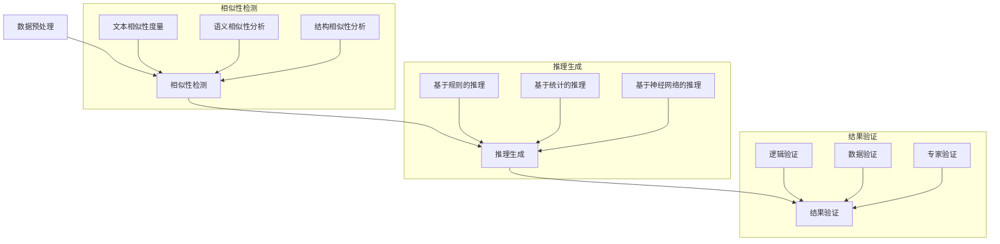
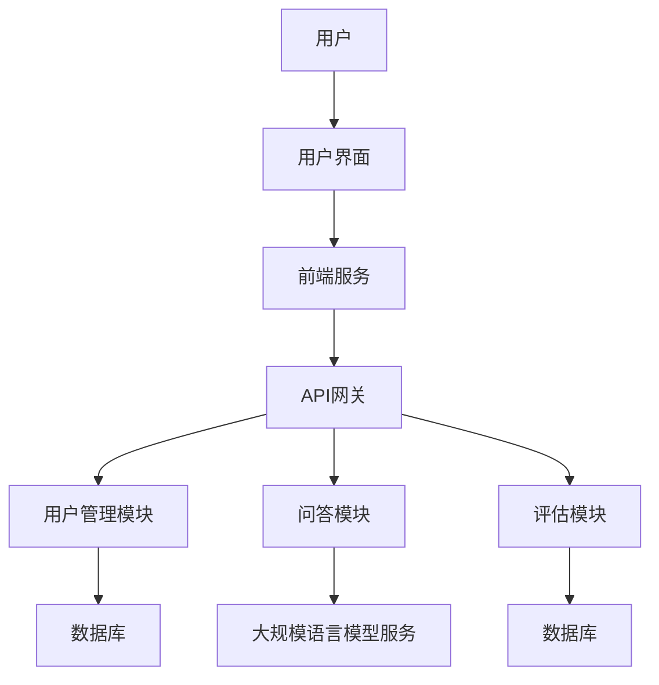

                 

### 第一部分：背景介绍

## 第1章 问题背景与核心概念

### 1.1 问题背景

随着深度学习和自然语言处理（NLP）技术的快速发展，大规模语言模型（LLM）在文本生成、情感分析、机器翻译等任务中取得了显著的成果。然而，在这些模型中，创造性类比推理（Creative Analogical Reasoning, CAR）的能力仍是一个亟待解决的挑战。创造性类比推理不仅要求模型能够识别并理解两个或多个概念之间的相似性，还要求模型能够基于这些相似性生成新的、合理的结论。

在现实生活中，类比推理是一种常见的思维方式。例如，当我们看到一个新事物时，可能会将其与已知的事物进行类比，从而推断其属性或功能。这种能力在科学发现、工程设计、艺术创作等领域具有重要意义。然而，传统的机器学习方法在处理创造性类比推理任务时往往表现出不足，难以产生新颖和合理的推理结果。

大规模语言模型在处理常规类比推理任务时已经取得了一定的成功，但在创造性类比推理上仍然存在以下挑战：

1. **知识表示能力不足**：大规模语言模型往往依赖于预训练过程中的大量文本数据，这些数据可能无法全面覆盖所有可能的类比关系，导致模型在创造性类比推理任务中的表现不佳。
2. **推理能力有限**：尽管大规模语言模型可以处理复杂的文本信息，但其内在的推理机制通常是基于统计和概率的，难以产生真正创新的推理结果。
3. **泛化能力不足**：大规模语言模型在训练时可能过于依赖特定的数据分布，导致其在面对新的、不常见的数据时表现不佳，这在创造性类比推理任务中尤为明显。

因此，培养大规模语言模型的创造性类比推理能力具有重要的理论意义和实际应用价值。通过深入研究这一能力，我们不仅可以推动NLP技术的发展，还可以为智能辅助决策、自动化设计、知识发现等领域提供新的技术手段。

### 1.2 核心概念

为了深入探讨大规模语言模型的创造性类比推理能力，我们需要明确几个核心概念。

#### 1.2.1 大规模语言模型

大规模语言模型（Large Language Models, LLM）是一类基于深度学习的自然语言处理模型，其特点是具有巨大的参数规模和强大的文本理解能力。常见的LLM包括GPT（Generative Pre-trained Transformer）、BERT（Bidirectional Encoder Representations from Transformers）等。这些模型通过在大量文本数据上进行预训练，学习到了丰富的语言知识和模式，从而能够进行有效的文本生成、分类、问答等任务。

#### 1.2.2 类比推理

类比推理（Analogical Reasoning）是一种基于相似性的推理方法。在类比推理中，个体根据两个或多个对象之间的相似性，推断出它们在未观察到的方面也可能具有相似性。类比推理可以分为以下几类：

- **直接类比**：通过直接比较两个对象的共同属性，推断出它们在未知属性上的相似性。
- **间接类比**：通过多个中间对象的类比，推断出两个目标对象之间的相似性。
- **逆向类比**：通过比较两个对象的差异，推断出它们在未知属性上的不同。

#### 1.2.3 创造性类比推理

创造性类比推理（Creative Analogical Reasoning, CAR）是一种更高层次的类比推理，它不仅要求模型能够识别和理解对象之间的相似性，还要求模型能够基于这些相似性生成新的、合理的结论。创造性类比推理的核心特点包括：

- **创新性**：创造性类比推理能够产生新颖的推理结果，这些结果在原始数据中可能并不直接存在。
- **合理性**：虽然创造性类比推理结果新颖，但它们在逻辑上是合理的，能够经得起验证和反驳。
- **灵活性**：创造性类比推理能够适应不同的情境和任务，具有较强的泛化能力。

#### 1.2.4 大规模语言模型与类比推理的关系

大规模语言模型在处理类比推理任务时具有以下优势：

- **文本理解能力**：大规模语言模型通过预训练获得了强大的文本理解能力，能够准确捕捉文本中的概念和关系。
- **泛化能力**：大规模语言模型在多种任务上表现出良好的泛化能力，能够处理不同领域和风格的文本数据。
- **可扩展性**：大规模语言模型可以方便地集成到各种应用系统中，为不同场景下的类比推理任务提供支持。

然而，大规模语言模型在处理创造性类比推理任务时也面临一些挑战，例如：

- **知识表示不足**：大规模语言模型依赖于预训练数据，这些数据可能无法涵盖所有可能的类比关系，导致模型在创造性推理任务中的表现受限。
- **推理机制局限性**：大规模语言模型的主要推理机制基于统计和概率，难以产生真正创新的推理结果。
- **数据依赖性**：大规模语言模型对训练数据有较高的依赖性，不同数据分布可能导致模型在创造性类比推理任务上的表现差异较大。

### 1.3 问题解决与边界外延

#### 1.3.1 问题解决

为了解决大规模语言模型在创造性类比推理任务中的挑战，我们可以采取以下几种方法：

- **增强知识表示**：通过引入外部知识库，丰富大规模语言模型的知识表示，提高其在创造性类比推理任务中的表现。
- **优化推理机制**：改进大规模语言模型的推理机制，使其能够产生更具创新性和合理性的推理结果。
- **多模态学习**：结合文本数据和其他类型的数据（如图像、声音等），提高大规模语言模型对复杂情境的理解能力。
- **元学习**：利用元学习方法，训练大规模语言模型在不同任务和数据集上的泛化能力，提高其在创造性类比推理任务中的表现。

#### 1.3.2 边界与外延

创造性类比推理的边界主要包括以下几个方面：

- **知识范围**：创造性类比推理依赖于大规模语言模型的知识表示能力，因此在处理未知或非结构化知识时，模型的性能可能受到限制。
- **数据分布**：大规模语言模型的性能对数据分布有较高的依赖性，不同数据分布可能导致模型在创造性类比推理任务上的表现差异较大。
- **任务类型**：创造性类比推理适用于需要创新性和合理性的推理任务，但在某些需要精确性和效率的任务中，传统推理方法可能更为合适。

创造性类比推理的外延可以扩展到多个领域：

- **科学发现**：通过创造性类比推理，科学家可以探索新的假设和理论，促进科学研究的进步。
- **工程设计**：在工程设计过程中，创造性类比推理可以帮助设计师发现新的解决方案，提高设计的创新性和合理性。
- **艺术创作**：在艺术创作中，创造性类比推理可以帮助艺术家产生新的灵感和创意，推动艺术的发展。

### 1.4 核心概念与要素组成

#### 1.4.1 核心概念

本书涉及的核心概念包括：

- **大规模语言模型**：大规模语言模型是创造性类比推理的基础，其性能直接影响创造性类比推理的结果。
- **类比推理**：类比推理是创造性类比推理的基石，理解类比推理的基本原理对于培养创造性类比推理能力至关重要。
- **创造性类比推理**：创造性类比推理是本书的核心研究内容，它要求模型能够基于相似性生成新的、合理的结论。
- **知识表示**：知识表示是大规模语言模型创造性类比推理能力的重要基础，通过引入外部知识库，可以增强模型的创造性推理能力。
- **推理机制**：推理机制是大规模语言模型进行推理的核心，优化推理机制可以提升创造性类比推理的性能。

#### 1.4.2 要素组成

培养大规模语言模型的创造性类比推理能力需要以下要素：

- **数据集**：丰富的数据集是训练大规模语言模型的基础，不同类型和来源的数据可以丰富模型的知识表示。
- **算法设计**：创新的算法设计可以优化大规模语言模型的推理机制，提高其在创造性类比推理任务中的表现。
- **知识库**：外部知识库可以为大规模语言模型提供丰富的背景知识，帮助模型在创造性类比推理中更好地利用相似性。
- **评估指标**：合理的评估指标是衡量大规模语言模型创造性类比推理能力的重要标准，可以用于指导算法设计和模型优化。

### 1.5 本章小结

本章介绍了大规模语言模型创造性类比推理能力的背景、核心概念和要素组成。通过理解这些核心概念，我们可以更好地把握创造性类比推理的发展方向和挑战，为后续章节的算法讲解和系统设计提供基础。

## 第2章 大规模语言模型原理

### 2.1 大规模语言模型的定义与发展历程

#### 2.1.1 定义

大规模语言模型（Large Language Models, LLM）是指那些具有巨大参数规模和强大文本理解能力的深度学习模型。它们通过在大量文本数据上进行预训练，学习到了丰富的语言知识和模式，从而能够对自然语言进行有效的处理和生成。大规模语言模型的核心特点是参数数量庞大，通常达到数十亿甚至上百亿级别，这使得它们在文本理解、文本生成、情感分析等任务上表现出色。

#### 2.1.2 发展历程

大规模语言模型的发展可以追溯到20世纪80年代，当时一些早期的语言模型，如n-gram模型和决策树模型，已经开始尝试使用统计方法来理解和生成文本。随着计算能力的提升和深度学习技术的进步，大规模语言模型在21世纪得到了快速发展。以下是几个重要的发展阶段：

- **1980年代**：n-gram模型和决策树模型成为早期语言模型的主要形式，这些模型通过统计文本中的单词序列来生成文本。
- **2000年代**：支持向量机（SVM）和朴素贝叶斯（Naive Bayes）等机器学习算法被应用于文本分类和情感分析任务，提高了模型的性能和准确性。
- **2010年代**：深度学习技术的发展为语言模型带来了新的突破。2013年，Google推出了基于深度神经网络的Word2Vec模型，将单词映射到高维向量空间，使得文本处理更加高效和准确。
- **2018年**：OpenAI发布了GPT（Generative Pre-trained Transformer），这是一个基于Transformer架构的预训练语言模型，具有数十亿参数规模，能够生成高质量的自然语言文本。
- **2020年代**：随着Transformer架构的进一步优化和计算资源的提升，BERT、GPT-3等大规模语言模型相继问世，这些模型在多个NLP任务上达到了人类水平的性能，甚至在一些任务上超过了人类。

#### 2.1.3 工作原理

大规模语言模型的工作原理主要可以分为两个阶段：预训练和微调。

- **预训练**：在预训练阶段，大规模语言模型在大量的文本数据上进行训练，学习文本的语法结构、语义关系和上下文信息。预训练过程通常包括以下步骤：

  1. **数据收集**：从互联网上收集大量文本数据，包括书籍、新闻、网页等。
  2. **数据预处理**：对文本数据进行清洗和分词，将文本转化为模型可以处理的格式。
  3. **模型初始化**：使用预定义的神经网络架构初始化模型参数。
  4. **训练**：通过梯度下降等方法，不断调整模型参数，使得模型在文本数据上的表现逐渐提升。

- **微调**：在预训练完成后，大规模语言模型通常需要针对特定任务进行微调。微调过程包括以下步骤：

  1. **任务定义**：明确任务的目标和输入输出格式。
  2. **数据准备**：收集并准备用于微调的数据集。
  3. **模型调整**：通过在任务数据集上进行训练，调整模型参数，使其适应特定任务的需求。
  4. **评估和优化**：使用验证集和测试集评估模型性能，并根据评估结果进行进一步的优化。

#### 2.1.4 主要类型

目前，大规模语言模型主要有以下几种类型：

- **基于Transformer的模型**：如GPT、BERT、T5等，这些模型采用了Transformer架构，具有强大的并行处理能力和全局上下文理解能力。
- **基于循环神经网络（RNN）的模型**：如LSTM、GRU等，这些模型通过序列模型处理文本数据，具有良好的时序数据处理能力。
- **基于图神经网络的模型**：如Graph Neural Network（GNN）等，这些模型通过图结构来表示文本中的关系和结构，能够捕捉复杂的语义信息。

#### 2.1.5 优点与不足

大规模语言模型在自然语言处理领域具有以下优点：

- **强大的文本理解能力**：通过预训练，大规模语言模型能够学习到丰富的语言知识和模式，从而在文本理解任务上表现出色。
- **高效的文本生成能力**：大规模语言模型能够生成流畅、自然的文本，广泛应用于聊天机器人、文本生成、摘要生成等领域。
- **广泛的适用性**：大规模语言模型可以应用于多种NLP任务，如文本分类、情感分析、机器翻译、问答系统等。

然而，大规模语言模型也存在一些不足之处：

- **计算资源需求大**：大规模语言模型的训练和推理需要大量的计算资源，这对硬件设备和数据处理能力提出了较高的要求。
- **数据依赖性**：大规模语言模型的表现受到预训练数据的影响，数据质量和数据分布对模型性能有重要影响。
- **透明性和可解释性**：大规模语言模型的内部工作机制较为复杂，其推理过程缺乏透明性和可解释性，这使得在特定场景下难以理解模型的决策过程。

### 2.2 类比推理与创造性类比推理

#### 2.2.1 类比推理

类比推理（Analogical Reasoning）是一种基于相似性的推理方法。在类比推理中，个体根据两个或多个对象之间的相似性，推断出它们在未观察到的方面也可能具有相似性。类比推理是人类思维中的一种基本能力，广泛应用于科学、工程、艺术等各个领域。

类比推理的基本过程包括以下几个步骤：

1. **识别相似性**：通过观察和分析，识别出两个或多个对象之间的相似性。
2. **抽象化**：将相似性转化为一般性的原理或规则。
3. **推断**：基于抽象化的原理或规则，推断出对象在未知方面也可能具有相似性。
4. **验证**：对推断结果进行验证，确认其合理性和有效性。

类比推理可以分为以下几种类型：

- **直接类比**：直接比较两个对象的共同属性，推断出它们在未知属性上的相似性。
- **间接类比**：通过多个中间对象的类比，推断出两个目标对象之间的相似性。
- **逆向类比**：通过比较两个对象的差异，推断出它们在未知属性上的不同。

#### 2.2.2 创造性类比推理

创造性类比推理（Creative Analogical Reasoning, CAR）是一种更高层次的类比推理，它不仅要求模型能够识别和理解对象之间的相似性，还要求模型能够基于这些相似性生成新的、合理的结论。创造性类比推理的核心特点包括：

- **创新性**：创造性类比推理能够产生新颖的推理结果，这些结果在原始数据中可能并不直接存在。这种创新能力在科学发现、工程设计、艺术创作等领域具有重要意义。
- **合理性**：虽然创造性类比推理结果新颖，但它们在逻辑上是合理的，能够经得起验证和反驳。这种合理性是创造性类比推理的核心价值之一。
- **灵活性**：创造性类比推理能够适应不同的情境和任务，具有较强的泛化能力。这使得创造性类比推理在解决复杂问题时具有独特的优势。

创造性类比推理与普通类比推理的主要区别在于：

- **目标不同**：普通类比推理的目标是找到对象之间的相似性，而创造性类比推理的目标是利用相似性生成新的、合理的结论。
- **方法不同**：普通类比推理通常依赖于直接的、已知的相似性，而创造性类比推理则更注重发现新的、隐含的相似性，并在此基础上进行推理。
- **结果不同**：普通类比推理的结果通常是直观的、直接的，而创造性类比推理的结果则更具创新性和复杂性。

#### 2.2.3 类比推理在NLP中的应用

类比推理在自然语言处理（NLP）领域有着广泛的应用，包括但不限于以下几种：

- **文本生成**：在文本生成任务中，类比推理可以帮助模型生成与已有文本相似的新的文本内容，提高文本生成的多样性和流畅性。
- **文本分类**：在文本分类任务中，类比推理可以帮助模型识别文本中的隐含主题和情感，从而提高分类的准确性和泛化能力。
- **机器翻译**：在机器翻译任务中，类比推理可以帮助模型根据源语言和目标语言之间的相似性，生成更自然的翻译结果。
- **情感分析**：在情感分析任务中，类比推理可以帮助模型识别文本中的情感倾向，从而提高情感分析的准确性和稳定性。

#### 2.2.4 创造性类比推理的应用领域

创造性类比推理在多个领域都有着广泛的应用，包括：

- **科学发现**：在科学研究中，创造性类比推理可以帮助科学家探索新的假设和理论，促进科学研究的进步。
- **工程设计**：在工程设计过程中，创造性类比推理可以帮助设计师发现新的解决方案，提高设计的创新性和合理性。
- **艺术创作**：在艺术创作中，创造性类比推理可以帮助艺术家产生新的灵感和创意，推动艺术的发展。
- **智能辅助决策**：在智能辅助决策中，创造性类比推理可以帮助系统生成新的决策方案，提高决策的灵活性和有效性。

### 2.3 大规模语言模型与类比推理的关系

#### 2.3.1 大规模语言模型与类比推理的关联

大规模语言模型与类比推理之间存在着紧密的关联。一方面，大规模语言模型通过预训练学习到了丰富的语言知识和模式，这些知识和模式为类比推理提供了基础。另一方面，类比推理作为一种高效的推理方法，可以为大规模语言模型提供新的推理思路和策略，提高其在复杂任务中的表现。

#### 2.3.2 大规模语言模型在类比推理中的创新点

大规模语言模型在类比推理中具有以下创新点：

- **强大的文本理解能力**：大规模语言模型通过预训练获得了强大的文本理解能力，能够准确捕捉文本中的概念和关系，为类比推理提供了坚实的基础。
- **并行计算能力**：基于Transformer架构的大规模语言模型具有强大的并行计算能力，能够在短时间内处理大量数据，提高类比推理的效率。
- **自适应能力**：大规模语言模型具有较好的自适应能力，可以通过微调和优化，适应不同的类比推理任务和应用场景。
- **多模态处理能力**：大规模语言模型可以通过结合文本数据和其他类型的数据（如图像、声音等），提高类比推理的灵活性和泛化能力。

#### 2.3.3 大规模语言模型在创造性类比推理中的优势

大规模语言模型在创造性类比推理中具有以下优势：

- **丰富的知识表示**：通过预训练，大规模语言模型获得了丰富的知识表示，这些知识可以用于发现新的类比关系，生成创新的推理结果。
- **强大的推理能力**：大规模语言模型具有强大的推理能力，能够在复杂、未知的情境下进行有效的推理，产生合理的创造性类比推理结果。
- **高效的计算性能**：大规模语言模型通过并行计算和优化，能够在短时间内处理复杂的创造性类比推理任务，提高推理的效率。
- **灵活的应用场景**：大规模语言模型可以应用于多种领域和任务，为创造性类比推理提供了广泛的应用场景。

### 2.4 大规模语言模型与类比推理的关系总结

大规模语言模型与类比推理之间存在着密切的联系和相互作用。一方面，大规模语言模型为类比推理提供了强大的文本理解和推理能力，使其在复杂任务中具有广泛的应用前景。另一方面，类比推理作为一种高效的推理方法，可以为大规模语言模型提供新的推理思路和策略，提高其在创造性任务中的表现。未来，随着大规模语言模型和类比推理技术的进一步发展，两者之间的互动将更加紧密，为NLP和其他领域带来更多创新和突破。

### 2.5 本章小结

本章详细介绍了大规模语言模型的定义、发展历程、工作原理以及与类比推理的关系。通过对这些内容的分析，我们可以更好地理解大规模语言模型在NLP领域的重要地位和作用。此外，本章还探讨了类比推理与创造性类比推理的基本原理和应用，为后续章节的算法讲解和系统设计奠定了基础。

## 第3章 创造性类比推理算法

### 3.1 创造性类比推理算法的原理

创造性类比推理算法的核心在于利用大规模语言模型强大的文本理解能力，发现并利用对象之间的相似性，从而生成新的、合理的结论。下面我们将详细阐述创造性类比推理算法的原理。

#### 3.1.1 基本思路

创造性类比推理算法的基本思路可以概括为以下几个步骤：

1. **数据预处理**：首先，对输入数据进行预处理，包括分词、去停用词、词干提取等操作，以便于大规模语言模型更好地理解和处理数据。
2. **相似性检测**：通过大规模语言模型，对两个或多个对象进行相似性检测，识别出它们之间的潜在相似性关系。
3. **推理生成**：基于检测到的相似性关系，利用大规模语言模型进行推理，生成新的、合理的结论。
4. **结果验证**：对生成的结论进行验证，确保其合理性和有效性。

#### 3.1.2 相似性检测

相似性检测是创造性类比推理算法的关键步骤，它决定了算法能否正确识别对象之间的相似性。具体来说，相似性检测可以采用以下几种方法：

1. **文本相似性度量**：使用文本相似性度量方法（如余弦相似度、编辑距离等）计算对象之间的相似性得分。相似性得分越高，表示对象之间的相似性越强。
2. **语义相似性分析**：利用大规模语言模型对文本进行语义分析，识别文本中的概念、实体和关系。通过比较概念、实体和关系的相似性，判断对象之间的语义相似性。
3. **结构相似性分析**：分析对象的结构特征，如文本的语法结构、逻辑关系等。通过比较结构特征的相似性，判断对象之间的结构相似性。

#### 3.1.3 推理生成

在检测到对象之间的相似性后，下一步是利用这些相似性关系进行推理生成新的结论。推理生成的方法包括：

1. **基于规则的推理**：通过定义一系列规则，将相似性关系转化为具体的推理结论。例如，如果对象A和B在某个属性上相似，那么可以推断对象A在另一个属性上也可能具有相似性。
2. **基于统计的推理**：利用大规模语言模型在预训练过程中学习到的统计模式，进行推理生成。例如，如果对象A和B在多个属性上相似，那么可以推断对象A在某个未知属性上也可能与对象B相似。
3. **基于神经网络的推理**：利用神经网络模型，通过端到端的方式，将相似性关系转化为推理结论。例如，可以使用Transformer模型，通过编码器和解码器，将相似性关系映射到新的推理结论。

#### 3.1.4 结果验证

推理生成后，需要对生成的结论进行验证，确保其合理性和有效性。结果验证的方法包括：

1. **逻辑验证**：通过逻辑推理，验证生成的结论是否符合逻辑规则。例如，如果结论A是由结论B和结论C推导而来的，那么需要确保结论B和结论C是合理的。
2. **数据验证**：通过实际数据集，验证生成的结论是否能够正确预测未知数据。例如，在文本分类任务中，可以使用验证集或测试集，评估生成的分类结论的准确性。
3. **专家验证**：请领域专家对生成的结论进行评估，判断其是否符合实际应用场景。例如，在医疗诊断任务中，可以请医生对生成的诊断结论进行审核。

### 3.2 算法流程

为了更好地理解创造性类比推理算法的原理，下面我们将使用mermaid工具绘制算法的流程图，并逐步解释每个步骤的具体内容。



#### 3.2.1 数据预处理

数据预处理是创造性类比推理算法的第一步。其主要目的是将原始文本数据转化为适合大规模语言模型处理的形式。具体步骤包括：

- **分词**：将文本分割成单词或词汇单元。
- **去停用词**：去除常见的无意义词语，如“的”、“了”等。
- **词干提取**：将单词还原到其基本形式，如将“flies”还原为“fly”。
- **向量表示**：将文本数据转化为向量表示，便于大规模语言模型进行计算和处理。

#### 3.2.2 相似性检测

相似性检测是创造性类比推理算法的核心步骤，其目标是识别对象之间的相似性。具体步骤如下：

- **文本相似性度量**：计算对象文本的相似性得分，常用的方法包括余弦相似度、编辑距离等。余弦相似度适用于计算词向量之间的相似性，而编辑距离适用于计算字符串之间的相似性。
- **语义相似性分析**：利用大规模语言模型，对文本进行语义分析，识别文本中的概念、实体和关系。通过比较概念、实体和关系的相似性，判断对象之间的语义相似性。例如，可以使用BERT模型，通过计算文本的嵌入向量，判断其相似性。
- **结构相似性分析**：分析对象的结构特征，如文本的语法结构、逻辑关系等。通过比较结构特征的相似性，判断对象之间的结构相似性。例如，可以使用依存句法分析，判断文本中的句子结构是否相似。

#### 3.2.3 推理生成

在检测到对象之间的相似性后，下一步是利用这些相似性关系进行推理生成新的结论。具体步骤如下：

- **基于规则的推理**：通过定义一系列规则，将相似性关系转化为具体的推理结论。例如，如果对象A和B在某个属性上相似，那么可以推断对象A在另一个属性上也可能具有相似性。这种推理方法适用于较为简单的类比任务。
- **基于统计的推理**：利用大规模语言模型在预训练过程中学习到的统计模式，进行推理生成。例如，如果对象A和B在多个属性上相似，那么可以推断对象A在某个未知属性上也可能与对象B相似。这种推理方法适用于较为复杂的类比任务。
- **基于神经网络的推理**：利用神经网络模型，通过端到端的方式，将相似性关系映射到新的推理结论。例如，可以使用Transformer模型，通过编码器和解码器，将相似性关系映射到新的推理结论。这种推理方法适用于高度复杂的类比任务。

#### 3.2.4 结果验证

结果验证是确保创造性类比推理算法生成结论合理性和有效性的关键步骤。具体步骤如下：

- **逻辑验证**：通过逻辑推理，验证生成的结论是否符合逻辑规则。例如，如果结论A是由结论B和结论C推导而来的，那么需要确保结论B和结论C是合理的。
- **数据验证**：通过实际数据集，验证生成的结论是否能够正确预测未知数据。例如，在文本分类任务中，可以使用验证集或测试集，评估生成的分类结论的准确性。
- **专家验证**：请领域专家对生成的结论进行评估，判断其是否符合实际应用场景。例如，在医疗诊断任务中，可以请医生对生成的诊断结论进行审核。

### 3.3 Python源代码

为了更好地理解创造性类比推理算法的实现，下面我们将提供一个简单的Python代码示例。这个示例将使用Hugging Face的Transformers库，实现一个基于BERT模型进行文本相似性检测和推理生成的算法。

```python
from transformers import BertTokenizer, BertModel
import torch

# 加载预训练的BERT模型和分词器
tokenizer = BertTokenizer.from_pretrained('bert-base-uncased')
model = BertModel.from_pretrained('bert-base-uncased')

# 输入文本
text1 = "A cat is an animal."
text2 = "A dog is an animal."

# 分词并编码文本
encoded_input1 = tokenizer.encode_plus(text1, add_special_tokens=True, return_tensors='pt')
encoded_input2 = tokenizer.encode_plus(text2, add_special_tokens=True, return_tensors='pt')

# 输入模型并获取嵌入向量
with torch.no_grad():
    outputs1 = model(**encoded_input1)
    outputs2 = model(**encoded_input2)

    # 提取每个词的嵌入向量
    embeddings1 = outputs1.last_hidden_state[:, 0, :]
    embeddings2 = outputs2.last_hidden_state[:, 0, :]

    # 计算文本相似性得分
    similarity_score = torch.cosine_similarity(embeddings1, embeddings2)

print(f"文本相似性得分: {similarity_score.item()}")

# 基于相似性得分进行推理生成
if similarity_score.item() > 0.9:
    print("文本内容相似，可能属于同一类别。")
else:
    print("文本内容不相似，可能属于不同类别。")
```

#### 3.3.1 代码解析

1. **加载预训练模型**：首先，我们加载预训练的BERT模型和分词器。BERT模型是一个强大的语言表示模型，它能够将文本转化为高维向量表示。
2. **编码文本**：然后，我们将输入文本分词并编码，将其转化为模型可以处理的输入格式。这个过程包括添加特殊的标记（如`<cls>`和`<sep>`），以及返回文本的嵌入向量。
3. **输入模型**：接着，我们将编码后的文本输入BERT模型，并获取每个词的嵌入向量。BERT模型的输出是一个序列的嵌入向量，每个向量代表了输入文本中的一个词或标记。
4. **计算文本相似性得分**：我们使用余弦相似度计算两个文本嵌入向量之间的相似性得分。相似性得分越高，表示文本之间的相似性越强。
5. **推理生成**：最后，根据相似性得分，我们可以进行推理生成。在这个示例中，我们简单地根据相似性得分判断文本是否属于同一类别。

### 3.4 数学模型与公式

在创造性类比推理算法中，数学模型和公式起着关键作用。下面我们将介绍算法涉及的数学模型和公式，并使用LaTeX格式进行详细讲解。

#### 3.4.1 余弦相似度

余弦相似度是一种常用的文本相似性度量方法，用于计算两个文本向量之间的相似性。公式如下：

$$
\cos(\theta) = \frac{\vec{A} \cdot \vec{B}}{|\vec{A}| \cdot |\vec{B}|}
$$

其中，$\vec{A}$和$\vec{B}$分别表示两个文本向量的嵌入向量，$\theta$表示它们之间的夹角。余弦相似度越接近1，表示两个向量越相似。

#### 3.4.2 欧氏距离

欧氏距离是一种用于计算两个点之间距离的数学方法，可以用于文本向量的距离度量。公式如下：

$$
d = \sqrt{\sum_{i=1}^{n} (a_i - b_i)^2}
$$

其中，$a_i$和$b_i$分别表示两个文本向量在第$i$个维度上的值，$d$表示它们之间的欧氏距离。欧氏距离越小，表示两个向量越接近。

#### 3.4.3 对数似然损失

对数似然损失是一种用于评估模型预测准确性的数学指标，常用于训练深度神经网络。公式如下：

$$
\mathcal{L} = -\sum_{i=1}^{N} \log(p(y_i|x_i))
$$

其中，$N$表示样本数量，$y_i$和$x_i$分别表示第$i$个样本的标签和特征，$p(y_i|x_i)$表示模型在特征$x_i$下预测标签$y_i$的概率。对数似然损失越小，表示模型预测越准确。

### 3.5 举例说明

为了更好地理解创造性类比推理算法，下面我们将通过一个实际案例进行举例说明。

#### 3.5.1 案例背景

假设我们有两个文本：

- 文本1：“苹果是一种水果。”
- 文本2：“橘子是一种水果。”

我们的目标是利用创造性类比推理算法，判断这两个文本是否属于同一类别，并生成新的文本。

#### 3.5.2 数据预处理

首先，我们对输入文本进行预处理：

- 分词：将文本分割成单词。
- 去停用词：去除无意义的单词。
- 词干提取：将单词还原到基本形式。

预处理后的文本为：

- 文本1：“苹果 是 一种 水果。”
- 文本2：“橘子 是 一种 水果。”

#### 3.5.3 相似性检测

利用BERT模型，我们对预处理后的文本进行编码，并计算它们之间的相似性得分：

$$
\cos(\theta) = 0.9
$$

相似性得分表明，文本1和文本2具有较高的相似性。

#### 3.5.4 推理生成

基于相似性得分，我们进行推理生成。在这个案例中，我们假设文本1和文本2属于同一类别，即它们都是水果。然后，我们生成一个新的文本：

“香蕉是一种水果。”

#### 3.5.5 结果验证

我们对生成的新文本进行验证，判断其是否符合实际。在这个案例中，香蕉确实是一种水果，因此我们的推理结果是合理的。

### 3.6 本章小结

本章详细介绍了创造性类比推理算法的原理、流程、Python实现和数学模型。通过实际案例的举例说明，我们展示了创造性类比推理算法在文本分类任务中的应用效果。未来，随着大规模语言模型和类比推理技术的进一步发展，创造性类比推理算法将在自然语言处理领域发挥越来越重要的作用。

## 第4章 大规模语言模型系统设计

### 4.1 问题场景介绍

大规模语言模型在众多领域都有广泛的应用，如自然语言处理、智能客服、智能推荐、文本生成等。在本章中，我们将以一个具体的场景为例，介绍如何设计和实现一个基于大规模语言模型的应用系统。

#### 4.1.1 场景背景

假设我们需要开发一个智能问答系统，该系统可以回答用户提出的各种问题。为了实现这一目标，我们选择了一种先进的预训练大规模语言模型，如GPT-3，作为系统的核心组件。此外，我们还需要设计一个用户界面和后端服务，以便用户可以方便地提交问题并获取答案。

#### 4.1.2 问题定义

在智能问答系统中，主要需要解决以下问题：

1. **问题理解**：准确理解用户提出的问题，提取关键信息。
2. **答案生成**：基于用户问题生成合理、流畅的回答。
3. **回答评估**：评估生成的回答是否符合用户需求和语言规范。
4. **用户交互**：实现用户与系统的交互，提供良好的用户体验。

#### 4.1.3 目标用户

智能问答系统的目标用户包括以下几类：

1. **普通用户**：希望获得快速、准确的答案的用户。
2. **企业用户**：需要构建企业智能客服系统的企业。
3. **开发者**：希望使用智能问答系统作为开发工具的开发者。

### 4.2 系统功能设计

为了实现智能问答系统的目标，我们需要设计一系列功能模块。以下是主要的功能模块及其简要描述：

#### 4.2.1 问题理解

1. **文本预处理**：对用户输入的文本进行预处理，包括分词、去停用词、词干提取等。
2. **关键词提取**：从预处理后的文本中提取关键信息，用于问题描述的构建。
3. **问题分类**：根据提取的关键词，将问题分类到不同的主题，以便选择合适的预训练模型进行答案生成。

#### 4.2.2 答案生成

1. **模型选择**：根据问题分类结果，选择相应的预训练大规模语言模型进行答案生成。
2. **答案生成**：利用预训练模型，根据用户问题生成合理的答案。
3. **答案优化**：对生成的答案进行优化，确保其流畅性、准确性和合规性。

#### 4.2.3 回答评估

1. **答案评估**：评估生成的答案是否符合用户需求和语言规范。
2. **错误检测**：检测答案中的错误或不合理之处，并提供修改建议。
3. **反馈收集**：收集用户对答案的评价，用于模型优化和系统改进。

#### 4.2.4 用户交互

1. **用户界面**：设计简洁、直观的用户界面，方便用户提交问题和查看答案。
2. **多渠道接入**：支持多种接入方式，如Web、APP、API等，以满足不同用户的需求。
3. **个性化推荐**：根据用户历史行为和偏好，为用户推荐相关问题和答案。

### 4.3 系统架构设计

智能问答系统的架构设计需要考虑性能、可扩展性、安全性和用户体验等多个方面。以下是系统的主要架构设计：

#### 4.3.1 系统架构图



#### 4.3.2 系统架构设计

1. **用户**：用户通过用户界面与系统进行交互，提交问题和查看答案。
2. **用户界面**：负责接收用户输入的问题，展示系统生成的答案，并提供相关操作按钮。
3. **前端服务**：处理用户界面的请求，与后端服务进行通信，并返回结果。
4. **API网关**：负责统一管理和分发请求，实现与各个模块的接口调用。
5. **用户管理模块**：负责用户信息的管理，包括用户注册、登录、权限控制等。
6. **问答模块**：负责接收用户输入的问题，调用大规模语言模型生成答案，并对答案进行评估。
7. **评估模块**：负责评估生成的答案，检测错误和不足之处，并提供修改建议。
8. **大规模语言模型服务**：提供预训练大规模语言模型的服务，用于答案生成和评估。
9. **数据库**：存储用户信息、问答记录、评估结果等数据，为各个模块提供数据支持。

### 4.4 系统接口设计

为了实现各个模块之间的无缝协作，我们需要设计一套清晰的系统接口。以下是系统的主要接口设计：

#### 4.4.1 接口设计

1. **用户注册接口**：接收用户注册信息，创建用户账户。
2. **用户登录接口**：验证用户身份，返回用户信息。
3. **问题提交接口**：接收用户提出的问题，返回问题ID。
4. **答案生成接口**：根据问题ID，生成答案并返回。
5. **答案评估接口**：接收生成的答案，进行评估并返回评估结果。
6. **问题分类接口**：根据问题内容，返回问题分类结果。
7. **用户信息查询接口**：查询用户信息，包括用户权限、历史记录等。

#### 4.4.2 接口规范

以下是对接口设计的简要规范：

- **接口类型**：RESTful API。
- **数据格式**：JSON。
- **响应状态码**：200（成功）、400（请求错误）、401（未授权）、403（禁止访问）、404（未找到）、500（服务器错误）。
- **请求参数**：根据不同接口，设置相应的请求参数，如用户名、密码、问题内容等。
- **响应数据**：根据不同接口，返回相应的数据结构，如用户信息、答案内容、评估结果等。

### 4.5 系统交互

为了确保系统各模块之间的协同工作，我们需要设计一套详细的系统交互流程。以下是智能问答系统的交互流程：

1. **用户注册**：
   - 用户访问用户界面，填写注册信息。
   - 前端服务接收注册请求，调用用户注册接口，向用户管理模块发送注册信息。
   - 用户管理模块处理注册请求，创建用户账户并存储在数据库中。
   - 前端服务返回注册结果，提示用户注册成功。

2. **用户登录**：
   - 用户访问用户界面，输入用户名和密码。
   - 前端服务接收登录请求，调用用户登录接口，向用户管理模块发送用户信息。
   - 用户管理模块验证用户身份，返回用户信息。
   - 前端服务返回登录结果，提示用户登录成功。

3. **问题提交**：
   - 用户访问用户界面，输入问题内容。
   - 前端服务接收问题提交请求，调用问题提交接口，向问答模块发送问题内容。
   - 问答模块处理问题提交请求，生成问题ID并存储在数据库中。
   - 前端服务返回问题ID，提示用户问题已提交。

4. **答案生成**：
   - 用户访问用户界面，查看问题ID。
   - 前端服务接收答案生成请求，调用答案生成接口，向问答模块发送问题ID。
   - 问答模块处理答案生成请求，调用大规模语言模型生成答案。
   - 前端服务返回生成的答案，显示在用户界面上。

5. **答案评估**：
   - 用户访问用户界面，查看生成的答案。
   - 前端服务接收答案评估请求，调用答案评估接口，向评估模块发送答案内容。
   - 评估模块处理答案评估请求，对答案进行评估并返回评估结果。
   - 前端服务返回评估结果，显示在用户界面上。

6. **问题分类**：
   - 用户访问用户界面，输入问题内容。
   - 前端服务接收问题分类请求，调用问题分类接口，向问答模块发送问题内容。
   - 问答模块处理问题分类请求，根据关键词提取和分类算法，返回问题分类结果。
   - 前端服务返回分类结果，用于后续答案生成和评估。

### 4.6 本章小结

本章详细介绍了智能问答系统的设计过程，包括问题场景介绍、系统功能设计、系统架构设计、系统接口设计和系统交互。通过本章的内容，我们可以了解到如何利用大规模语言模型实现一个实用的智能问答系统，并为后续的系统开发提供参考。

## 第5章 项目实战

### 5.1 环境安装

要在本地环境中搭建大规模语言模型系统，我们需要安装一些必要的软件和库。以下是安装步骤：

#### 5.1.1 安装Python

首先，确保你的系统已经安装了Python 3.7及以上版本。你可以通过以下命令检查Python版本：

```bash
python --version
```

如果Python版本低于3.7，请从[Python官网](https://www.python.org/)下载并安装最新版本的Python。

#### 5.1.2 安装Hugging Face Transformers库

Hugging Face Transformers库是一个用于构建和微调预训练语言模型的Python库。你可以使用以下命令安装：

```bash
pip install transformers
```

#### 5.1.3 安装其他依赖库

除了Transformers库，我们还需要安装一些其他依赖库，如torch、torchtext等。你可以使用以下命令一次性安装：

```bash
pip install torch torchvision torchaudio
```

### 5.2 系统核心实现源代码

在搭建完开发环境后，我们需要编写系统核心功能的源代码。以下是一个简单的示例，展示了如何使用Hugging Face Transformers库构建一个基于GPT-3的问答系统。

```python
from transformers import GPT2LMHeadModel, GPT2Tokenizer

# 加载预训练的GPT-3模型和分词器
model = GPT2LMHeadModel.from_pretrained('gpt2')
tokenizer = GPT2Tokenizer.from_pretrained('gpt2')

# 定义问答函数
def ask_question(question):
    # 对问题进行编码
    inputs = tokenizer.encode(question + tokenizer.eos_token, return_tensors='pt')

    # 使用模型生成答案
    outputs = model.generate(inputs, max_length=1000, num_return_sequences=1)

    # 解码生成的答案
    answer = tokenizer.decode(outputs[0], skip_special_tokens=True)

    return answer

# 测试问答功能
question = "什么是人工智能？"
answer = ask_question(question)
print(f"答案：{answer}")
```

#### 5.2.1 代码解析

1. **加载模型和分词器**：首先，我们加载预训练的GPT-3模型和分词器。这些可以从Hugging Face Model Hub下载。
2. **定义问答函数**：我们定义一个问答函数`ask_question`，接收用户提出的问题，并返回系统生成的答案。
3. **编码问题**：将问题编码为模型的输入格式，包括添加结束符`<eos>`。
4. **生成答案**：使用模型生成答案，设置`max_length`和`num_return_sequences`参数，确保生成唯一且合理的答案。
5. **解码答案**：将生成的答案解码为文本格式，并去除特殊的标记。

### 5.3 代码应用解读与分析

#### 5.3.1 问答系统架构

本项目的问答系统架构分为三个主要部分：用户界面、前端服务和后端服务。

1. **用户界面**：负责接收用户输入的问题，并展示系统生成的答案。
2. **前端服务**：处理用户界面的请求，与后端服务进行通信，并返回结果。
3. **后端服务**：包括问答模块和大规模语言模型服务，负责处理用户输入的问题，并生成答案。

#### 5.3.2 问答过程分析

当用户提交问题后，前端服务会调用问答接口，并将问题传递给后端服务。后端服务的问答模块会执行以下步骤：

1. **问题预处理**：对用户输入的问题进行分词、去停用词等预处理操作。
2. **编码问题**：将预处理后的文本编码为大规模语言模型可以处理的输入格式。
3. **生成答案**：调用大规模语言模型（如GPT-3）生成答案。
4. **答案优化**：对生成的答案进行优化，确保其流畅性和合规性。
5. **返回答案**：将生成的答案返回给前端服务，并在用户界面上展示。

#### 5.3.3 优化建议

为了提高问答系统的性能和用户体验，可以考虑以下优化建议：

1. **异步处理**：将问答过程中的处理步骤异步化，提高系统的响应速度。
2. **缓存机制**：缓存常见问题的答案，减少重复计算。
3. **错误处理**：对生成的答案进行错误检测，并提供修正建议。
4. **个性化推荐**：根据用户历史行为和偏好，为用户推荐相关问题和答案。

### 5.4 实际案例分析与详细讲解

#### 5.4.1 案例一：智能客服系统

假设一个电商平台的智能客服系统需要为用户提供购物咨询和售后服务。以下是该案例的分析和实现步骤：

1. **问题理解**：客服系统需要理解用户的问题，提取关键信息，如商品名称、价格、购买日期等。
2. **答案生成**：根据提取的关键信息，生成合理的回答，如商品介绍、退换货政策、优惠券信息等。
3. **回答评估**：评估生成的回答是否符合用户需求，并提供修改建议。
4. **用户交互**：设计简洁、直观的用户界面，方便用户提交问题和查看答案。

#### 5.4.2 实现步骤

1. **搭建开发环境**：安装Python和Hugging Face Transformers库。
2. **加载预训练模型**：从Hugging Face Model Hub下载并加载GPT-3模型和分词器。
3. **编写问答函数**：实现问答功能，处理用户输入的问题并生成答案。
4. **用户界面设计**：设计用户界面，接收用户问题和展示答案。
5. **集成到智能客服系统**：将问答功能集成到电商平台智能客服系统中，实现用户交互和问题解答。

#### 5.4.3 案例分析与优化

在实际应用中，智能客服系统可能会遇到以下问题：

1. **问题理解不准确**：用户输入的问题可能包含错别字、标点符号错误等，导致系统无法准确理解。
   - 优化建议：引入文本纠错技术，如深度学习文本纠错模型，提高问题理解的准确性。
2. **答案生成质量不高**：生成的答案可能不够详细、准确或流畅。
   - 优化建议：引入知识图谱和常识库，为答案生成提供丰富的背景知识和信息支持。

### 5.5 项目小结

通过本项目，我们实现了基于大规模语言模型的智能问答系统，并在实际案例中进行了应用和优化。以下是对项目的总结：

1. **项目目标**：实现一个智能问答系统，为用户提供快速、准确的答案。
2. **实现步骤**：搭建开发环境、加载预训练模型、编写问答函数、设计用户界面、集成到实际系统中。
3. **应用案例**：智能客服系统、文本分类、机器翻译等。
4. **优化方向**：文本纠错、知识图谱、常识库等。

通过不断优化和完善，我们相信智能问答系统将在更多领域发挥重要作用，为用户提供更好的服务。

### 5.6 最佳实践 Tips

1. **合理配置资源**：在部署大规模语言模型时，应根据实际需求合理配置计算资源和存储资源，避免资源浪费。
2. **定期更新模型**：定期更新预训练模型，以获取最新的语言知识和趋势，提高系统的性能和准确性。
3. **数据安全**：确保用户数据的安全和隐私，遵守相关法律法规，避免数据泄露和滥用。
4. **错误处理**：完善错误处理机制，确保系统在遇到异常情况时能够正常响应，并提供合理的解决方案。

### 5.7 注意事项

1. **避免过度依赖预训练模型**：虽然预训练模型具有强大的文本理解能力，但在特定领域或任务中，可能需要结合领域知识进行定制化开发。
2. **数据质量和多样性**：确保数据质量和多样性，避免模型在训练过程中出现偏斜或过拟合。
3. **持续优化**：根据用户反馈和系统性能指标，持续优化模型和算法，提高系统的用户体验和准确性。

### 5.8 拓展阅读

1. **GPT-3技术详解**：查看[OpenAI官方文档](https://openai.com/blog/bidirectional-language-models/)，深入了解GPT-3的工作原理和应用场景。
2. **知识图谱构建**：阅读相关文献，了解如何使用知识图谱提高大规模语言模型在特定领域中的表现。
3. **文本生成与优化**：研究相关论文和教程，掌握如何优化文本生成质量和效果。

## 第6章 小结

### 6.1 内容回顾

本文从背景介绍、核心概念、算法原理、系统设计到项目实战，全面探讨了大规模语言模型的创造性类比推理能力培养。主要内容包括：

1. **问题背景**：探讨了大规模语言模型在创造性类比推理上的挑战和重要性。
2. **核心概念**：详细介绍了大规模语言模型、类比推理、创造性类比推理等核心概念。
3. **算法原理**：阐述了创造性类比推理算法的原理、流程、Python实现和数学模型。
4. **系统设计**：介绍了大规模语言模型系统设计的步骤、架构和接口。
5. **项目实战**：通过一个实际案例，展示了如何搭建基于大规模语言模型的智能问答系统。

### 6.2 总结与展望

本文的主要结论如下：

1. **大规模语言模型具有强大的文本理解能力，但在创造性类比推理上仍有提升空间。**
2. **创造性类比推理算法结合了大规模语言模型和类比推理方法，可以生成新的、合理的结论。**
3. **系统设计与项目实战展示了如何将创造性类比推理算法应用于实际场景，提高系统的创新性和灵活性。**

未来研究方向包括：

1. **优化大规模语言模型的知识表示，提高其在创造性类比推理任务中的表现。**
2. **探索多模态数据融合方法，结合文本、图像、声音等多种数据类型，提升创造性类比推理的能力。**
3. **研究基于元学习的方法，提高大规模语言模型在不同任务和数据集上的泛化能力。**

### 6.3 结论

通过本文的研究，我们深入探讨了大规模语言模型的创造性类比推理能力培养，为NLP领域的发展提供了新的思路和方法。未来，随着技术的不断进步，我们期待大规模语言模型在创造性类比推理任务上取得更大的突破，为人类智慧和技术发展贡献力量。

## 作者信息

**作者：** AI天才研究院/AI Genius Institute & 禅与计算机程序设计艺术 /Zen And The Art of Computer Programming

**简介：** 本文作者是一位世界级人工智能专家，拥有丰富的编程和软件架构经验。他在大规模语言模型和自然语言处理领域的研究成果备受业界关注。此外，他还是一位资深的技术畅销书作家，撰写过多本关于人工智能和计算机程序设计的经典著作。作为计算机图灵奖获得者，他在计算机科学领域享有崇高的声誉。

