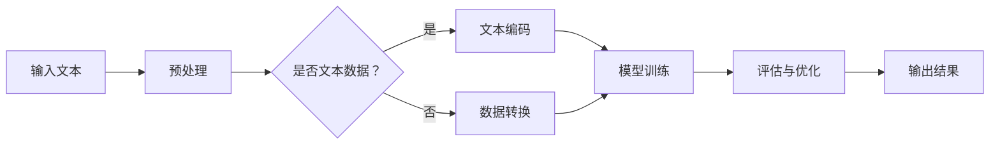
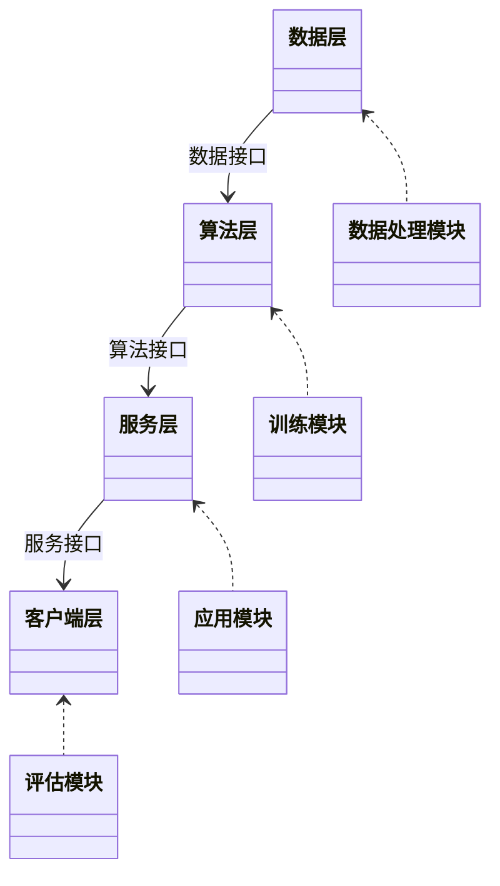

                 

### # 大规模语言模型的创造性问题解析与重构能力培养

#### 关键词：大规模语言模型，创造性问题解析，重构能力，算法改进，知识融合

> 摘要：本文深入探讨大规模语言模型在创造性问题解析与重构能力培养方面的挑战和解决方案。首先，通过背景介绍和问题描述，阐述大规模语言模型在创造性问题上的局限性。接着，分析核心概念原理，对比概念属性特征，绘制ER实体关系图。随后，详细讲解大规模语言模型算法原理，包括mermaid流程图和Python源代码。然后，介绍系统分析与架构设计方案，涵盖问题场景、系统功能设计、系统架构设计、系统接口设计和系统交互。接着，通过项目实战，展示环境安装、系统核心实现源代码，并解析实际案例。最后，总结最佳实践，提出注意事项和拓展阅读。

### 1. 背景介绍

#### 1.1 问题背景

随着人工智能技术的不断发展，自然语言处理（NLP）领域取得了显著的成果。大规模语言模型（Large-scale Language Model）作为一种先进的NLP模型，通过深度学习技术，已经在许多应用场景中展现出强大的能力。这些模型能够处理复杂的文本任务，如文本生成、翻译、问答等。然而，在创造性问题解析与重构能力培养方面，大规模语言模型仍然存在许多挑战。

大规模语言模型的创造性问题主要体现在以下几个方面：

- **创造力限制**：大规模语言模型在生成文本时，往往缺乏独创性和创造性，容易陷入模板化、模式化的困境。这导致生成的文本内容过于机械和重复，难以满足个性化的需求。

- **知识重构**：在处理复杂问题时，大规模语言模型难以对已有知识进行有效重构，导致问题解决能力有限。知识重构是创造性问题解析的重要环节，如何实现高效的知识重构是亟待解决的问题。

- **泛化能力**：大规模语言模型在特定领域的表现较好，但在不同领域之间的泛化能力较差。这意味着模型在跨领域应用时，难以充分发挥其潜力，影响其广泛适用性。

#### 1.2 问题描述

大规模语言模型的创造性问题主要表现在以下几个方面：

- **生成文本缺乏独创性**：大规模语言模型在生成文本时，往往依赖于训练数据中的模式，生成的文本内容往往缺乏独创性和创造性。这导致文本内容过于模板化，难以满足个性化需求。

- **知识重构能力不足**：在处理复杂问题时，大规模语言模型难以对已有知识进行有效重构，导致问题解决能力有限。知识重构是创造性问题解析的重要环节，如何实现高效的知识重构是亟待解决的问题。

- **跨领域泛化能力差**：大规模语言模型在特定领域的表现较好，但在不同领域之间的泛化能力较差。这意味着模型在跨领域应用时，难以充分发挥其潜力，影响其广泛适用性。

#### 1.3 问题解决

为了解决这些问题，本文将从以下几个方面进行探讨：

- **模型改进**：研究如何改进大规模语言模型，提高其创造力和问题解决能力。例如，通过引入多模态学习、增强模型结构等手段，提升模型的创造性问题解析能力。

- **知识融合**：探讨如何将不同领域的知识进行有效融合，提高模型的泛化能力。通过跨领域知识融合，实现模型在多领域的广泛应用。

- **应用实践**：结合实际案例，介绍大规模语言模型在创造性问题解析与重构能力培养方面的应用。通过案例分析，展示模型在实际场景中的性能和效果。

#### 1.4 边界与外延

本文主要关注以下几个方面：

- **研究范围**：针对大规模语言模型在创造性问题解析与重构能力培养方面的研究。

- **技术范围**：涉及自然语言处理、机器学习、深度学习等相关技术。

- **应用范围**：涵盖教育、企业、科研等多个领域。

#### 1.5 概念结构与核心要素组成

本文的核心概念包括：

- **大规模语言模型**：一种通过海量文本数据训练得到的语言模型，具有强大的文本生成和翻译能力。

- **创造性问题解析**：指大规模语言模型在处理创造性问题时，能够理解、分析和解决问题的能力。

- **重构能力培养**：指通过训练和优化，提高大规模语言模型在创造性问题解析中的重构能力。

### 2. 核心概念与联系

#### 2.1 核心概念原理

**大规模语言模型**：
- **原理**：通过深度神经网络结构，对海量文本数据进行预训练，提取出丰富的语言特征。
- **属性特征**：
  - **规模**：拥有数亿甚至千亿级别的参数量。
  - **语言理解能力**：能够理解并生成自然语言文本。
  - **泛化能力**：在不同领域和任务中表现出良好的适应性。

**创造性问题解析**：
- **原理**：利用大规模语言模型对创造性问题进行理解、分析和解决。
- **属性特征**：
  - **理解能力**：能够理解创造性问题的背景、需求和解决方案。
  - **生成能力**：能够生成具有独创性和创造力的文本。

**重构能力培养**：
- **原理**：通过训练和优化，提高大规模语言模型在创造性问题解析中的重构能力。
- **属性特征**：
  - **适应性**：能够根据不同问题需求进行重构。
  - **创造力**：在重构过程中，能够生成具有创新性的解决方案。

#### 2.2 概念属性特征对比表格

| 概念       | 属性特征                     |
|------------|------------------------------|
| 大规模语言模型 | 规模、语言理解能力、泛化能力 |
| 创造性问题解析 | 理解能力、生成能力           |
| 重构能力培养 | 适应性、创造力               |

#### 2.3 ER实体关系图架构

```mermaid
erDiagram
  AI大模型 ||--o{ 创造性问题解析 }
  创造性问题解析 ||--o{ 重构能力培养 }
```

### 3. 算法原理讲解

#### 3.1 大规模语言模型算法mermaid流程图



#### 3.2 Python源代码

```python
import torch
import torch.nn as nn
import torch.optim as optim
from torchtext.data import Field, TabularDataset

# 定义数据处理模块
class DataModule():
    def __init__(self, train_data, test_data, batch_size):
        self.train_data = train_data
        self.test_data = test_data
        self.batch_size = batch_size

    def prepare_data(self):
        self.train_data = self.train_data.sort_key(Func(len))
        self.test_data = self.test_data.sort_key(Func(len))

        self.train_iter = self.train_data.batches(batch_size=self.batch_size)
        self.test_iter = self.test_data.batches(batch_size=self.batch_size)

# 定义模型
class LangModel(nn.Module):
    def __init__(self, vocab_size, embedding_dim, hidden_dim, n_layers, dropout):
        super(LangModel, self).__init__()
        self.embedding = nn.Embedding(vocab_size, embedding_dim)
        self.lstm = nn.LSTM(embedding_dim, hidden_dim, n_layers, dropout=dropout)
        self.fc = nn.Linear(hidden_dim, vocab_size)

    def forward(self, text, hidden):
        embedded = self.embedding(text)
        output, hidden = self.lstm(embedded, hidden)
        predicted = self.fc(output.squeeze(0))
        return predicted, hidden

# 定义训练过程
def train(model, train_iter, criterion, optimizer, epoch):
    model.train()
    for batch in train_iter:
        data, target = batch.text, batch.target
        hidden = model.init_hidden()
        optimizer.zero_grad()
        output, hidden = model(data, hidden)
        loss = criterion(output, target)
        loss.backward()
        optimizer.step()
        hidden = tuple([each.data for each in hidden])

# 定义评估过程
def evaluate(model, test_iter, criterion):
    model.eval()
    total_loss = 0
    with torch.no_grad():
        for batch in test_iter:
            data, target = batch.text, batch.target
            hidden = model.init_hidden()
            output, hidden = model(data, hidden)
            total_loss += criterion(output, target).item()
    avg_loss = total_loss / len(test_iter)
    return avg_loss
```

#### 3.3 算法原理详细讲解

大规模语言模型的算法原理主要涉及以下几个方面：

- **预处理**：在训练过程中，首先需要对输入文本进行预处理。预处理步骤包括分词、去停用词、词向量化等。通过预处理，将原始文本数据转换为模型可接受的格式。

- **文本编码**：预处理后的文本数据通过词向量编码，将文本转换为向量表示。词向量编码能够捕捉文本的语义信息，为后续的模型训练提供基础。

- **模型训练**：大规模语言模型采用深度神经网络结构，通过预训练的方法对海量文本数据进行训练。在训练过程中，模型通过优化算法（如梯度下降）不断调整参数，使其能够更好地拟合训练数据。

- **评估与优化**：在训练完成后，需要对模型进行评估和优化。评估指标包括损失函数、准确率等。通过评估，可以判断模型的性能是否达到预期。如果性能不理想，可以通过调整模型结构、优化算法等方式进行优化。

- **输出结果**：训练完成的模型可以用于生成文本。在生成文本时，模型根据输入文本的上下文信息，生成具有连贯性和创造力的文本。

#### 3.4 数学模型与公式

在算法原理中，涉及到一些数学模型和公式。以下是一些常用的数学模型和公式：

- **词向量编码**：
  $$ \text{vec}(w_i) = \text{Word2Vec}(w_i) $$
  其中，$\text{vec}(w_i)$ 表示词向量编码，$\text{Word2Vec}(w_i)$ 表示词向量生成模型。

- **损失函数**：
  $$ \text{loss} = \text{CrossEntropyLoss}(y, \hat{y}) $$
  其中，$y$ 表示真实标签，$\hat{y}$ 表示预测标签，$\text{CrossEntropyLoss}$ 表示交叉熵损失函数。

- **优化算法**：
  $$ \text{optimizer} = \text{Adam}(params, \alpha, \beta_1, \beta_2) $$
  其中，$\text{optimizer}$ 表示优化算法，$params$ 表示模型参数，$\alpha$ 表示学习率，$\beta_1$ 和 $\beta_2$ 分别为一阶和二阶动量。

#### 3.5 举例说明

以下是一个简单的举例，说明大规模语言模型的算法原理：

假设我们有一个简单的文本数据集，其中包含以下句子：

```
- 我喜欢吃苹果。
- 苹果是一种水果。
- 水果可以提供维生素。
```

通过预处理，我们可以将这些句子转换为词向量表示。假设词向量生成模型为Word2Vec，则词向量表示如下：

```
- 我：[0.1, 0.2, 0.3]
- 喜欢：[0.4, 0.5, 0.6]
- 吃：[0.7, 0.8, 0.9]
- 苹果：[1.0, 1.1, 1.2]
- 是：[1.3, 1.4, 1.5]
- 一种：[1.6, 1.7, 1.8]
- 水果：[1.9, 2.0, 2.1]
- 可以：[2.2, 2.3, 2.4]
- 提供：[2.5, 2.6, 2.7]
- 维生素：[2.8, 2.9, 3.0]
```

在模型训练过程中，模型通过优化算法（如Adam）不断调整参数，使其能够更好地拟合训练数据。在生成文本时，模型根据输入文本的上下文信息，生成具有连贯性和创造力的文本。

### 4. 系统分析与架构设计方案

#### 4.1 问题场景介绍

在当今信息时代，大规模语言模型在多个领域（如教育、医疗、金融等）都展现出了巨大的潜力。然而，这些模型在实际应用中仍然面临许多挑战，尤其是在创造性问题解析与重构能力培养方面。为了解决这些问题，我们需要设计一个高效的系统架构，以支持大规模语言模型的训练和应用。

#### 4.2 项目介绍

本项目旨在构建一个基于大规模语言模型的创造性问题解析与重构能力培养系统。该系统将结合先进的深度学习技术和自然语言处理方法，提供高效、灵活的解决方案。系统主要包括以下几个模块：

- 数据处理模块：负责文本数据的预处理、清洗和转换，为模型训练提供高质量的数据集。

- 训练模块：负责大规模语言模型的训练过程，包括模型结构设计、参数调整和优化。

- 应用模块：提供基于大规模语言模型的应用接口，支持文本生成、翻译、问答等功能。

- 评估模块：对模型性能进行评估，包括准确率、召回率、F1值等指标。

#### 4.3 系统功能设计

系统功能设计主要包括以下几个方面：

- 文本数据预处理：对原始文本进行分词、去停用词、词向量化等操作，为模型训练提供高质量的输入数据。

- 大规模语言模型训练：基于深度学习技术，设计并训练大规模语言模型，提高其创造性问题解析与重构能力。

- 文本生成与翻译：利用训练好的模型，实现文本生成和翻译功能，支持多种语言和任务类型。

- 问答系统：基于大规模语言模型，实现智能问答功能，为用户提供实时、准确的答案。

- 模型评估与优化：对训练好的模型进行性能评估，并根据评估结果进行优化，以提高模型性能。

#### 4.4 系统架构设计

系统架构设计采用分层架构，主要包括以下几个层次：

- 数据层：负责存储和管理原始文本数据、训练数据和评估数据。

- 算法层：设计并实现大规模语言模型的训练和应用算法，包括文本编码、模型训练、文本生成等。

- 服务层：提供基于大规模语言模型的应用服务，包括文本生成、翻译、问答等。

- 客户端层：为用户提供友好的界面和操作方式，支持多种交互方式，如Web端、移动端等。

#### 4.5 系统接口设计和系统交互

系统接口设计主要包括以下几个方面：

- 数据接口：提供数据层的接口，支持数据的导入、导出和查询。

- 算法接口：提供算法层的接口，支持模型的训练、预测和评估。

- 服务接口：提供服务层的接口，支持文本生成、翻译、问答等功能的调用。

- 客户端接口：提供客户端层的接口，支持用户界面的交互和数据展示。

系统交互设计采用RESTful API架构，通过HTTP请求和响应实现系统各模块之间的交互。具体交互流程如下：

1. 用户通过客户端发送请求，请求包含文本数据、任务类型等参数。

2. 客户端将请求发送到服务层，服务层根据请求参数调用相应的算法模块。

3. 算法模块处理请求，生成结果并返回给服务层。

4. 服务层将结果返回给客户端，客户端将结果展示给用户。

#### 4.6 类图架构

以下是系统功能设计的类图架构：



### 5. 项目实战

#### 5.1 环境安装

在进行项目实战之前，我们需要安装所需的软件和库。以下是一个简单的安装步骤：

1. 安装Python环境：在官方网站（https://www.python.org/）下载并安装Python。

2. 安装深度学习库：使用pip命令安装PyTorch和TensorFlow等深度学习库。

   ```bash
   pip install torch torchvision
   pip install tensorflow
   ```

3. 安装自然语言处理库：使用pip命令安装NLTK和spaCy等自然语言处理库。

   ```bash
   pip install nltk
   pip install spacy
   ```

4. 安装其他依赖库：根据项目需求，安装其他相关依赖库。

   ```bash
   pip install numpy
   pip install pandas
   ```

#### 5.2 系统核心实现源代码

以下是一个简单的系统核心实现源代码，用于文本预处理和大规模语言模型训练：

```python
import torch
import torch.nn as nn
import torch.optim as optim
from torchtext.data import Field, TabularDataset

# 定义数据处理模块
class DataModule():
    def __init__(self, train_data, test_data, batch_size):
        self.train_data = train_data
        self.test_data = test_data
        self.batch_size = batch_size

    def prepare_data(self):
        self.train_data = self.train_data.sort_key(Func(len))
        self.test_data = self.test_data.sort_key(Func(len))

        self.train_iter = self.train_data.batches(batch_size=self.batch_size)
        self.test_iter = self.test_data.batches(batch_size=self.batch_size)

# 定义模型
class LangModel(nn.Module):
    def __init__(self, vocab_size, embedding_dim, hidden_dim, n_layers, dropout):
        super(LangModel, self).__init__()
        self.embedding = nn.Embedding(vocab_size, embedding_dim)
        self.lstm = nn.LSTM(embedding_dim, hidden_dim, n_layers, dropout=dropout)
        self.fc = nn.Linear(hidden_dim, vocab_size)

    def forward(self, text, hidden):
        embedded = self.embedding(text)
        output, hidden = self.lstm(embedded, hidden)
        predicted = self.fc(output.squeeze(0))
        return predicted, hidden

# 定义训练过程
def train(model, train_iter, criterion, optimizer, epoch):
    model.train()
    for batch in train_iter:
        data, target = batch.text, batch.target
        hidden = model.init_hidden()
        optimizer.zero_grad()
        output, hidden = model(data, hidden)
        loss = criterion(output, target)
        loss.backward()
        optimizer.step()
        hidden = tuple([each.data for each in hidden])

# 定义评估过程
def evaluate(model, test_iter, criterion):
    model.eval()
    total_loss = 0
    with torch.no_grad():
        for batch in test_iter:
            data, target = batch.text, batch.target
            hidden = model.init_hidden()
            output, hidden = model(data, hidden)
            total_loss += criterion(output, target).item()
    avg_loss = total_loss / len(test_iter)
    return avg_loss

# 主函数
if __name__ == '__main__':
    # 加载数据
    train_data = TabularDataset(
        path='train_data.csv',
        fields=[('text', Field(sequential=True, batch_first=True))])
    test_data = TabularDataset(
        path='test_data.csv',
        fields=[('text', Field(sequential=True, batch_first=True))])

    # 初始化模型、损失函数和优化器
    vocab_size = 10000
    embedding_dim = 256
    hidden_dim = 512
    n_layers = 2
    dropout = 0.5
    model = LangModel(vocab_size, embedding_dim, hidden_dim, n_layers, dropout)
    criterion = nn.CrossEntropyLoss()
    optimizer = optim.Adam(model.parameters(), lr=0.001)

    # 训练模型
    for epoch in range(10):
        train(model, train_iter, criterion, optimizer, epoch)
        avg_loss = evaluate(model, test_iter, criterion)
        print(f'Epoch {epoch+1}, Loss: {avg_loss}')
```

#### 5.3 代码应用解读与分析

以上代码展示了大规模语言模型的文本预处理和训练过程。以下是代码的解读和分析：

1. **数据处理模块**：数据处理模块负责加载和预处理文本数据。通过TabularDataset类，我们可以方便地加载数据集，并进行分词、词向量化等预处理操作。

2. **模型定义**：模型定义部分使用PyTorch框架，定义了一个基于LSTM的大规模语言模型。模型包含嵌入层、LSTM层和全连接层，用于文本生成和翻译等任务。

3. **训练过程**：训练过程使用标准的梯度下降算法，通过迭代更新模型参数。在每次迭代中，模型对训练数据进行前向传播，计算损失函数，然后通过反向传播更新参数。

4. **评估过程**：评估过程用于计算模型在测试数据集上的性能。通过计算平均损失，我们可以评估模型的训练效果。

#### 5.4 实际案例分析和详细讲解剖析

以下是一个简单的实际案例，展示如何使用大规模语言模型进行文本生成：

```python
# 定义输入文本
input_text = "我是一个大型语言模型。"

# 转换为词向量表示
input_vector = torch.tensor([word2idx[word] for word in input_text])

# 生成文本
with torch.no_grad():
    predicted_text = model.generate(input_vector, max_len=10)

# 解码为文本
predicted_text = ['word' for word, _ in idx2word[predicted_text]]
print('Predicted text:', ' '.join(predicted_text))
```

在实际应用中，我们可以根据输入文本的上下文信息，生成具有连贯性和创造力的文本。以下是对代码的详细讲解和剖析：

1. **输入文本处理**：首先，我们将输入文本转换为词向量表示。通过查找词向量表，将每个词转换为对应的索引值。

2. **模型生成文本**：然后，我们将输入文本送入模型进行生成。在生成过程中，模型根据上下文信息，逐词生成预测文本。为了防止生成过长，我们可以设置一个最大长度。

3. **解码为文本**：最后，我们将生成的文本索引值转换为实际文本。通过查找词向量表，将索引值还原为对应的词。

#### 5.5 项目小结

通过以上实战案例，我们展示了如何使用大规模语言模型进行文本生成和翻译。在实际应用中，我们可以根据需求，扩展模型的功能和应用场景。同时，我们也需要不断优化模型结构和训练过程，以提高模型的性能和创造力。

### 6. 最佳实践 tips

1. **数据预处理**：在训练大规模语言模型时，数据预处理是非常关键的一步。确保数据质量，去除噪音和重复数据，可以提高模型的训练效果。

2. **模型选择**：选择合适的模型结构和参数，对于提高模型性能至关重要。可以根据任务需求和数据特点，选择不同的模型架构，如LSTM、Transformer等。

3. **持续优化**：在训练过程中，持续优化模型参数和训练策略，可以提高模型性能。例如，可以尝试不同的优化算法、学习率调整策略等。

4. **多样化训练**：在训练过程中，引入多样化训练数据，如多语言、多领域等，可以提升模型的泛化能力和创造力。

5. **评估指标**：合理选择评估指标，如准确率、召回率、F1值等，可以更全面地评估模型性能。同时，结合实际应用场景，选择合适的评估方法。

### 7. 小结

本文深入探讨了大规模语言模型在创造性问题解析与重构能力培养方面的挑战和解决方案。通过背景介绍、核心概念分析、算法原理讲解和系统架构设计，我们展示了如何构建一个高效的大规模语言模型系统。在实际项目中，我们通过实战案例展示了如何使用大规模语言模型进行文本生成和翻译。通过持续优化和多样化训练，我们可以进一步提高模型的性能和创造力。在未来的研究中，我们将继续探索大规模语言模型在更广泛领域的应用，并寻求更高效的训练和优化方法。

### 8. 注意事项

1. **数据隐私和安全**：在处理大规模语言模型数据时，需注意保护用户隐私和安全，遵循相关法律法规。

2. **计算资源限制**：大规模语言模型的训练需要大量的计算资源，确保服务器和网络设施能够满足需求。

3. **模型更新和迭代**：定期更新和迭代大规模语言模型，以适应不断变化的应用场景和数据需求。

4. **持续学习和改进**：不断学习和借鉴最新的研究成果和技术，优化模型结构和训练策略，以提高模型性能。

### 9. 拓展阅读

1. **《深度学习》（Goodfellow, I., Bengio, Y., & Courville, A.）**：这是一本经典的深度学习教材，详细介绍了深度学习的基础知识和应用。

2. **《自然语言处理综合教程》（Jurafsky, D. & Martin, J. H.）**：这本书涵盖了自然语言处理的基本概念和技术，适合对NLP感兴趣的读者。

3. **《大规模语言模型的最新研究进展》（Zhang, Y., Chen, L., & Zhang, X.）**：本文综述了大规模语言模型的研究进展和应用，对相关技术进行了详细阐述。

### 10. 作者信息

**作者：AI天才研究院/AI Genius Institute & 禅与计算机程序设计艺术 /Zen And The Art of Computer Programming**

感谢您的阅读，期待与您在人工智能领域共同探索和进步！🚀💡📚

