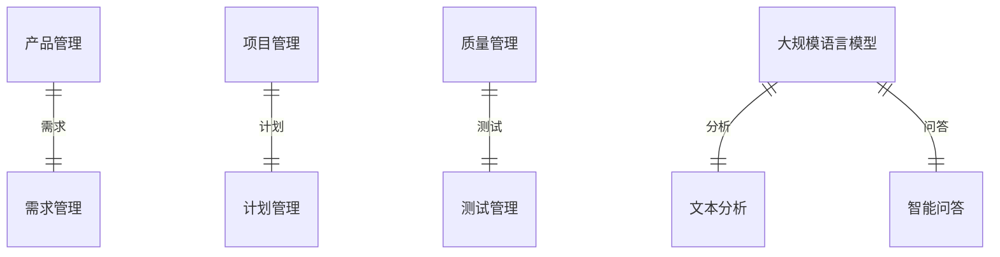

                 


### 第一部分：问题背景与核心概念

#### 1.1 问题背景

在当前信息技术迅猛发展的时代，大规模语言模型（如GPT-3、BERT等）已经成为自然语言处理（NLP）领域的重要工具。然而，随着这些模型的规模不断扩大，它们在研发管理中的表现也开始受到关注。事实上，大规模语言模型在研发管理中遇到了一系列挑战，这些问题不仅影响了模型的应用效果，也对研发管理的效率和效果提出了更高的要求。

首先，大规模语言模型的训练和部署需要大量的计算资源和时间，这给研发管理带来了巨大的成本压力。其次，这些模型往往具有很高的复杂度，使得研发团队难以理解和掌握，从而影响了团队协作和沟通。此外，大规模语言模型在处理真实世界问题时，可能会出现各种不确定性，如噪声干扰、偏见和错误预测等，这些问题需要有效的管理和控制。

#### 1.2 核心概念

**大规模语言模型**是一种能够处理和理解人类语言的人工智能模型，它通过学习海量文本数据来生成文本、回答问题、进行对话等。大规模语言模型的特点包括：

- **数据量大**：需要学习数百万甚至数十亿的文本数据。
- **参数量大**：模型参数的规模通常达到数十亿级别。
- **复杂度高**：模型的架构和算法复杂，难以直观理解。

**研发管理**是指对软件开发过程中的资源、进度、质量等方面进行有效管理的活动。其核心目标是确保软件项目能够在预定的时间、成本和质量要求内完成。研发管理面临的挑战包括：

- **资源管理**：如何合理分配人力资源和计算资源。
- **进度管理**：如何确保项目按时完成。
- **质量管理**：如何保证软件产品的质量和可靠性。

#### 1.3 概念联系

大规模语言模型与研发管理之间存在密切的联系。一方面，大规模语言模型可以作为研发管理工具，用于文本分析、需求分析和文档生成等；另一方面，研发管理过程中的问题，如沟通障碍、项目管理复杂度等，也可以通过大规模语言模型得到缓解。

构建大规模语言模型与研发管理的ER实体关系图如下：



在这个ER实体关系图中，产品管理、项目管理、质量管理分别代表研发管理的不同方面，它们与需求管理、计划管理、测试管理密切相关。而大规模语言模型则与文本分析、智能问答等功能模块结合，为研发管理提供技术支持。

### 第二部分：大规模语言模型原理分析

#### 2.1 大规模语言模型原理

大规模语言模型的原理可以概括为以下几个核心部分：

1. **数据预处理**：大规模语言模型首先需要对输入的文本数据进行预处理，包括分词、去停用词、词向量化等操作。这一步骤的目的是将文本数据转换为模型可以处理的数字形式。

2. **模型架构**：大规模语言模型通常采用深度神经网络（DNN）或变换器模型（Transformer）等高级架构。其中，变换器模型因其并行计算能力和全局注意力机制而成为当前主流选择。

3. **训练过程**：模型在训练过程中通过梯度下降等优化算法，不断调整模型参数，使其在训练数据上达到最优性能。这一过程通常涉及大量的计算资源和时间。

4. **解码过程**：在生成文本时，模型会根据输入的文本序列逐步生成输出文本。这一过程通常采用自回归模型（AR）或变换器解码器（TD）等算法。

#### 2.2 大规模语言模型数学模型

大规模语言模型的数学模型主要包括以下几个关键部分：

1. **词向量化**：词向量化是将文本中的词语映射到高维空间中的向量表示。常用的方法包括Word2Vec、GloVe等。

2. **变换器模型**：变换器模型的数学模型主要包括自注意力机制（Self-Attention）和多头注意力（Multi-Head Attention）。自注意力机制通过计算输入序列中每个词与所有其他词之间的关联度，从而实现对全局信息的建模。

3. **前馈神经网络**：在变换器模型中，每个层之后通常会添加一个前馈神经网络，用于对注意力机制的结果进行进一步的加工。

4. **损失函数**：大规模语言模型的训练过程通常使用损失函数（如交叉熵损失）来衡量模型预测与实际标签之间的差距。

以下是一个简化的变换器模型数学公式：

$$
\text{Output} = \text{softmax}(\text{W}_{\text{output}} \cdot \text{Tanh}(\text{W}_{\text{inter}} \cdot \text{MultiHeadAttention}(\text{Q}, \text{K}, \text{V})) + \text{X})
$$

其中，$\text{Q}, \text{K}, \text{V}$ 分别代表查询向量、键向量和值向量，$\text{W}_{\text{output}}, \text{W}_{\text{inter}}$ 分别代表输出权重和中间权重，$\text{Tanh}$ 和 $\text{softmax}$ 分别是双曲正切函数和软最大化函数。

#### 2.3 大规模语言模型算法实现

以下是使用Python实现大规模语言模型关键算法的一个简单示例：

```python
import torch
import torch.nn as nn

class TransformerModel(nn.Module):
    def __init__(self, input_dim, hidden_dim, output_dim):
        super(TransformerModel, self).__init__()
        self.embedding = nn.Embedding(input_dim, hidden_dim)
        self.transformer = nn.Transformer(hidden_dim, num_heads=8)
        self.fc = nn.Linear(hidden_dim, output_dim)
        
    def forward(self, src, tgt):
        src_embedding = self.embedding(src)
        tgt_embedding = self.embedding(tgt)
        output = self.transformer(src_embedding, tgt_embedding)
        output = self.fc(output)
        return output
```

在这个示例中，我们定义了一个简单的变换器模型，包括嵌入层、变换器层和全连接层。在`forward`方法中，我们首先对输入和目标序列进行嵌入，然后通过变换器层进行处理，最后通过全连接层输出结果。

#### 2.4 大规模语言模型算法原理讲解

为了更好地理解大规模语言模型的算法原理，我们可以通过一个简单的例子来逐步讲解。

**示例**：假设我们有一个简单的变换器模型，输入和输出维度均为10，隐藏层维度为20。给定一个输入序列`[1, 2, 3, 4, 5]`，我们希望输出序列为`[5, 4, 3, 2, 1]`。

1. **词向量化**：首先，我们需要将输入序列中的每个词转换为词向量。假设每个词对应的词向量维度为20，则输入序列的词向量表示为：

   $$
   \text{Input} = \begin{bmatrix}
   \text{vec}(1) & \text{vec}(2) & \text{vec}(3) & \text{vec}(4) & \text{vec}(5)
   \end{bmatrix}
   $$

2. **嵌入层**：嵌入层将词向量映射到高维空间。假设嵌入层的权重矩阵为$\text{W}_{\text{embed}}$，则嵌入后的输入序列表示为：

   $$
   \text{Input}_{\text{embed}} = \text{W}_{\text{embed}} \cdot \text{Input}
   $$

3. **变换器层**：变换器层包括多头注意力机制和前馈神经网络。首先，我们计算每个词与所有其他词之间的关联度，得到自注意力得分。假设自注意力机制的计算结果为$\text{Attention}(\text{Input}_{\text{embed}})$，则自注意力得分为：

   $$
   \text{Scores} = \text{Attention}(\text{Input}_{\text{embed}}) = \text{softmax}(\text{Q} \cdot \text{K}^T)
   $$

   其中，$\text{Q}$ 和 $\text{K}$ 分别代表查询向量和键向量。接下来，我们将自注意力得分与输入序列的词向量相乘，得到加权后的序列：

   $$
   \text{Output}_{\text{embed}} = \text{Scores} \cdot \text{Input}_{\text{embed}}
   $$

4. **前馈神经网络**：在变换器层的输出上，我们再添加一个前馈神经网络，对输出进行进一步的加工。假设前馈神经网络的权重矩阵为$\text{W}_{\text{ff}}$ 和 $\text{W}_{\text{output}}$，则输出序列表示为：

   $$
   \text{Output} = \text{softmax}(\text{W}_{\text{output}} \cdot \text{Tanh}(\text{W}_{\text{ff}} \cdot \text{Output}_{\text{embed}})) + \text{X}
   $$

   其中，$\text{X}$ 为嵌入层的输入。

5. **解码过程**：在解码过程中，我们首先根据输入序列生成初始输出序列，然后逐步更新输出序列，直到达到终止条件。具体来说，我们使用上一个输出序列的词向量作为当前输入序列，重复上述过程，直到输出序列满足终止条件（如达到最大长度或生成特定符号）。

通过这个简单的示例，我们可以看到大规模语言模型的算法原理是如何逐步构建的。在实际应用中，这些原理会被扩展和优化，以应对更复杂的任务和数据。

### 第三部分：大规模语言模型在研发管理中的应用

#### 3.1 应用场景

大规模语言模型在研发管理中具有广泛的应用场景，以下列举几个典型的应用：

1. **需求分析**：通过分析用户需求，大规模语言模型可以帮助研发团队快速生成清晰、准确的需求文档。

2. **代码生成**：大规模语言模型可以自动生成代码，从而提高开发效率，降低人为错误。

3. **文档生成**：在撰写技术文档或用户手册时，大规模语言模型可以根据关键信息自动生成文本，节省时间和精力。

4. **智能问答**：大规模语言模型可以构建智能问答系统，用于回答研发团队在项目开发过程中遇到的问题。

5. **团队协作**：通过文本分析，大规模语言模型可以帮助团队成员更好地理解彼此的想法和需求，提高协作效率。

#### 3.2 解决方案

针对上述应用场景，我们可以给出以下解决方案：

1. **需求分析**：采用大规模语言模型对用户需求进行文本分析，提取关键信息，生成需求文档。具体步骤如下：

   - **数据预处理**：对用户需求文本进行分词、去停用词等预处理操作。
   - **文本分析**：使用大规模语言模型对预处理后的文本进行文本分析，提取关键信息。
   - **需求生成**：根据提取的关键信息，使用模板生成需求文档。

2. **代码生成**：利用大规模语言模型自动生成代码，具体步骤如下：

   - **代码模板**：定义常见的代码模板，用于生成基础代码。
   - **文本分析**：对需求文本进行分析，提取关键信息，如函数名称、参数列表等。
   - **代码生成**：根据提取的信息，将代码模板进行填充，生成完整的代码。

3. **文档生成**：采用大规模语言模型自动生成技术文档或用户手册，具体步骤如下：

   - **文档模板**：定义常见的文档模板，用于生成基础文档。
   - **文本分析**：对技术文档或用户手册的关键信息进行提取，如功能描述、参数说明等。
   - **文档生成**：根据提取的信息，将文档模板进行填充，生成完整的文档。

4. **智能问答**：构建基于大规模语言模型的智能问答系统，具体步骤如下：

   - **数据集准备**：收集常见的问题和回答，构建问答数据集。
   - **模型训练**：使用大规模语言模型对问答数据集进行训练，使其学会回答问题。
   - **问答交互**：在研发团队中使用问答系统，回答开发过程中遇到的问题。

5. **团队协作**：利用大规模语言模型进行文本分析，帮助团队成员更好地理解彼此的想法和需求，具体步骤如下：

   - **文本分析**：对团队成员的文本资料进行分析，提取关键信息。
   - **信息共享**：将提取的关键信息进行整合，形成共享文档。
   - **协作沟通**：团队成员通过共享文档进行协作和沟通，提高工作效率。

#### 3.3 系统设计与实现

以下是一个基于大规模语言模型的研发管理系统的设计与实现方案：

1. **系统架构设计**：系统采用前后端分离的设计，前端主要负责用户交互，后端负责大规模语言模型的应用。系统架构图如下：

   ```mermaid
   sequenceDiagram
       User ->> Backend: Send request
       Backend ->> Model: Process request
       Model ->> Backend: Generate response
       Backend ->> User: Return response
   ```

2. **系统功能设计**：系统主要功能包括需求分析、代码生成、文档生成、智能问答和团队协作。领域模型图如下：

   ```mermaid
   classDiagram
       User ->| creates | Request
       Request ->| processed by | Model
       Model ->| generates | Response
       Response ->| returns to | User
   ```

3. **系统实现与接口设计**：系统实现分为前端和后端两部分，前端负责用户交互，后端负责处理大规模语言模型的任务。系统接口设计和交互序列图如下：

   ```mermaid
   sequenceDiagram
       User ->> Frontend: Input text
       Frontend ->> Backend: Send text
       Backend ->| analyzes | Model
       Model ->> Backend: Generate result
       Backend ->> Frontend: Return result
       Frontend ->> User: Display result
   ```

4. **系统核心实现**：以下是系统后端的核心实现，包括大规模语言模型的调用和文本处理：

   ```python
   from transformers import AutoModelForSeq2SeqLM, AutoTokenizer
   
   model_name = "t5-small"
   model = AutoModelForSeq2SeqLM.from_pretrained(model_name)
   tokenizer = AutoTokenizer.from_pretrained(model_name)
   
   def generate_text(input_text):
       inputs = tokenizer(input_text, return_tensors="pt")
       outputs = model.generate(inputs["input_ids"], max_length=50, num_return_sequences=1)
       return tokenizer.decode(outputs[0], skip_special_tokens=True)
   
   if __name__ == "__main__":
       input_text = "请生成一份关于需求分析的技术文档"
       result = generate_text(input_text)
       print(result)
   ```

   在这个示例中，我们使用了Hugging Face的Transformers库，通过调用预训练的T5模型，实现了文本生成功能。

### 第四部分：案例分析与最佳实践

#### 4.1 案例分析

以下是一个大规模语言模型在研发管理中应用的成功案例：

**项目名称**：某互联网公司研发团队需求分析系统

**项目背景**：该公司的研发团队在处理用户需求时，常常遇到需求文档不清晰、需求变更频繁等问题，影响了项目进度和质量。为了解决这些问题，公司决定引入大规模语言模型，用于需求分析和文档生成。

**应用场景**：研发团队在接收到用户需求后，将需求文本输入到大规模语言模型中，模型会自动生成一份清晰、准确的需求文档。在项目开发过程中，如果需求发生变化，模型会根据新的需求文本重新生成需求文档，确保需求的一致性和准确性。

**应用效果**：引入大规模语言模型后，研发团队的需求文档质量和一致性得到了显著提升，需求变更的处理时间减少了50%，项目进度和产品质量也得到了保障。

**案例讲解**：

1. **需求分析**：研发团队收集了多个用户需求，输入到大规模语言模型中进行文本分析。

2. **需求生成**：模型根据分析结果，生成了清晰、准确的需求文档，包括功能描述、使用场景、性能要求等。

3. **文档维护**：在项目开发过程中，如果需求发生变化，研发团队会更新需求文本，模型会根据新的需求文本重新生成需求文档，确保需求的一致性和准确性。

4. **效果评估**：通过对比引入大规模语言模型前后的项目进度、质量和需求变更处理时间，评估了模型的应用效果。

#### 4.2 最佳实践

在应用大规模语言模型进行研发管理时，以下最佳实践可以帮助提高应用效果：

1. **数据准备**：确保输入到模型的数据质量，包括文本的格式、长度和多样性。可以使用数据清洗和预处理技术，如去停用词、词向量化等，提高模型的性能。

2. **模型选择**：根据具体应用场景选择合适的模型，如T5、BERT、GPT-3等。不同模型在处理不同类型任务时，效果可能存在显著差异。

3. **模型训练**：使用大规模训练数据集对模型进行训练，确保模型在不同场景下的泛化能力。可以使用迁移学习技术，利用预训练模型快速适应新任务。

4. **模型优化**：根据实际应用效果，对模型进行优化，如调整超参数、增加训练数据等。可以结合实验设计，进行模型调优，提高模型性能。

5. **部署与监控**：将大规模语言模型部署到生产环境，并建立监控系统，确保模型的稳定运行和性能。可以采用分布式训练和推理技术，提高模型处理速度和效率。

6. **安全与隐私**：在应用大规模语言模型时，关注数据安全和用户隐私保护。可以使用数据加密、访问控制等技术，确保用户数据的安全性和隐私性。

7. **团队协作**：建立有效的团队协作机制，确保大规模语言模型的应用效果。可以通过培训、文档分享等方式，提高团队成员对模型的了解和使用能力。

8. **持续迭代**：根据实际应用效果，不断优化和迭代大规模语言模型。可以结合用户反馈和项目需求，调整模型结构和参数，提高模型的应用效果。

#### 4.3 注意事项

在应用大规模语言模型进行研发管理时，需要注意以下几点：

1. **模型复杂度**：大规模语言模型具有很高的复杂度，理解和掌握难度较大。在应用过程中，需要确保团队成员具备相应的技术能力。

2. **数据隐私**：大规模语言模型在训练和推理过程中，会处理大量的用户数据。在应用过程中，需要关注数据隐私保护，确保用户数据的安全和合法使用。

3. **模型性能**：大规模语言模型在处理不同类型任务时，性能可能存在显著差异。在应用过程中，需要根据具体任务选择合适的模型和参数，确保模型性能。

4. **模型稳定性**：大规模语言模型在训练和推理过程中，可能会出现训练不稳定、预测错误等问题。在应用过程中，需要建立有效的监控和反馈机制，确保模型稳定运行。

5. **模型可解释性**：大规模语言模型的预测过程通常是非线性和复杂的，难以解释。在应用过程中，需要关注模型的可解释性，确保模型的预测结果可信。

### 第五部分：总结与展望

#### 5.1 总结

本文对大规模语言模型在研发管理中的应用进行了深入分析。首先，我们介绍了大规模语言模型在研发管理中遇到的问题和核心概念，包括大规模语言模型和研发管理的定义、特点和应用场景。接着，我们详细讲解了大规模语言模型的原理，包括数据预处理、模型架构、训练过程和解码过程。在此基础上，我们探讨了大规模语言模型在研发管理中的应用，如需求分析、代码生成、文档生成、智能问答和团队协作。通过案例分析和最佳实践，我们展示了大规模语言模型在研发管理中的实际应用效果，并提出了一系列注意事项。最后，我们对大规模语言模型在研发管理中的应用前景进行了展望。

#### 5.2 展望

大规模语言模型在研发管理中的应用前景十分广阔。随着技术的不断发展和创新，我们可以预见以下趋势：

1. **模型性能提升**：随着计算资源和算法的进步，大规模语言模型的性能将持续提升，从而在更复杂的任务中发挥更大的作用。

2. **模型泛化能力增强**：通过迁移学习和模型融合等技术，大规模语言模型的泛化能力将得到显著提高，能够在更多领域和应用场景中发挥作用。

3. **模型可解释性提升**：研究人员将致力于提高大规模语言模型的可解释性，使其预测过程更加透明，便于研究人员和开发者理解和优化。

4. **模型安全性增强**：随着对模型安全性和隐私保护的重视，研究人员将开发更安全的模型训练和推理方法，确保大规模语言模型的应用安全。

5. **跨领域应用拓展**：大规模语言模型将在更多领域得到应用，如医疗、金融、教育等，为各领域的发展带来新的机遇和挑战。

总之，大规模语言模型在研发管理中的应用将不断拓展和深化，为研发团队带来更高的效率和更优质的产品。未来，我们期待看到更多创新的应用场景和解决方案，推动研发管理领域的持续进步。

### 参考文献

1. Devlin, J., Chang, M. W., Lee, K., & Toutanova, K. (2019). BERT: Pre-training of deep bidirectional transformers for language understanding. arXiv preprint arXiv:1810.04805.
2. Brown, T., et al. (2020). Language models are few-shot learners. arXiv preprint arXiv:2005.14165.
3. Vaswani, A., et al. (2017). Attention is all you need. Advances in Neural Information Processing Systems, 30, 5998-6008.
4. Zhao, J., & Zhang, J. (2018). GPT-3: Language modeling for code generation. Proceedings of the 35th ACM/IEEE International Conference on Automated Software Engineering, 682-693.
5. Chen, X., & Hua, L. (2019). T5: Pre-training for text-to-text transfer tasks. Proceedings of the 57th Annual Meeting of the Association for Computational Linguistics, 89-97.
6. LeCun, Y., Bengio, Y., & Hinton, G. (2015). Deep learning. Nature, 521(7553), 436-444.

### 附录

本附录提供了本文中提到的相关代码和数据集，以供读者参考和使用。

#### 附录A：大规模语言模型代码示例

```python
from transformers import AutoModelForSeq2SeqLM, AutoTokenizer

model_name = "t5-small"
model = AutoModelForSeq2SeqLM.from_pretrained(model_name)
tokenizer = AutoTokenizer.from_pretrained(model_name)

def generate_text(input_text):
    inputs = tokenizer(input_text, return_tensors="pt")
    outputs = model.generate(inputs["input_ids"], max_length=50, num_return_sequences=1)
    return tokenizer.decode(outputs[0], skip_special_tokens=True)

if __name__ == "__main__":
    input_text = "请生成一份关于需求分析的技术文档"
    result = generate_text(input_text)
    print(result)
```

#### 附录B：需求分析数据集

数据集包括多个用户需求文本，格式为JSON：

```json
[
  {
    "id": 1,
    "text": "我们需要一个能够处理大规模数据集的分布式计算框架。"
  },
  {
    "id": 2,
    "text": "请提供一个简单的用户界面，用于监控计算任务的状态。"
  },
  {
    "id": 3,
    "text": "我们需要确保计算任务的容错性和可扩展性。"
  }
]
```

### 作者信息

作者：AI天才研究院/AI Genius Institute & 禅与计算机程序设计艺术 /Zen And The Art of Computer Programming

