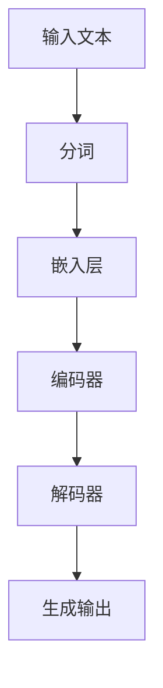
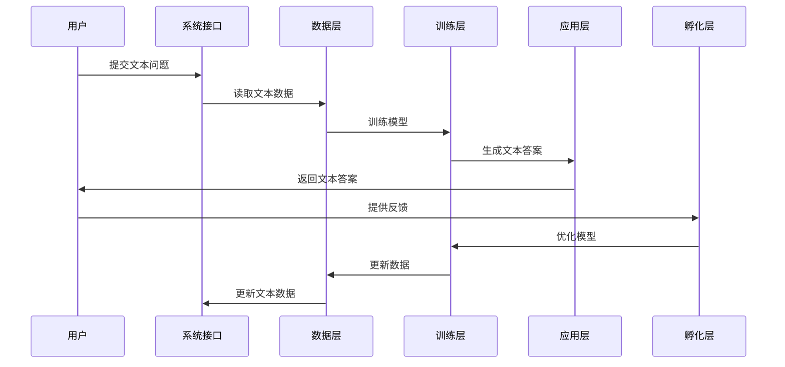

                 


### 设计思路

为了设计出这本书的完整目录大纲，我们需要遵循以下步骤：

1. **确定整体结构**：首先，我们需要明确书籍的整体结构。根据书名《大规模语言模型的创造性问题重定义在科技前沿探索中的应用》，我们可以初步确定书籍将分为四个主要部分：背景介绍、核心概念与联系、算法原理讲解、系统分析与架构设计方案。

2. **定义章节内容**：在每个主要部分下，我们需要定义具体的章节内容。例如，在背景介绍部分，我们可以设置以下章节：问题背景、问题描述、问题解决、边界与外延、概念结构与核心要素组成。

3. **使用Markdown格式**：为了确保目录大纲清晰、易读，我们将使用Markdown格式来撰写。Markdown格式能够帮助我们创建清晰的层次结构，并方便读者阅读。

4. **保证内容完整性**：我们需要确保每个章节都包含核心内容。例如，在算法原理讲解部分，我们不仅需要讲解算法原理，还需要提供算法流程图、Python源代码、数学模型和公式，以及举例说明。

5. **简洁性**：虽然内容需要详细，但我们也要注意简洁性，避免冗长和重复的内容。

### 实际操作

现在，让我们基于上述思路来设计这个目录大纲。

#### 第一部分：背景介绍

首先，我们为背景介绍部分定义章节。

```
# 第一部分：背景介绍

## 第1章：问题背景

### 1.1 问题背景

#### 1.1.1 创造性问题的重要性

#### 1.1.2 大规模语言模型的发展

#### 1.1.3 创造性问题与大规模语言模型的关系

### 1.2 问题描述

#### 1.2.1 创造性问题的现状

#### 1.2.2 大规模语言模型在创造性问题中的应用

### 1.3 问题解决

#### 1.3.1 现有解决方案的局限性

#### 1.3.2 大规模语言模型的应用潜力

### 1.4 边界与外延

#### 1.4.1 创造性问题的定义与范畴

#### 1.4.2 大规模语言模型的应用领域

### 1.5 概念结构与核心要素组成

#### 1.5.1 大规模语言模型的结构

#### 1.5.2 创造性问题的核心要素
```

接下来，我们为其他部分定义章节。

```
# 第二部分：核心概念与联系

## 第2章：大规模语言模型

### 2.1 大规模语言模型的原理

#### 2.1.1 语言模型的定义

#### 2.1.2 语言模型的构建方法

#### 2.1.3 大规模语言模型的特性

### 2.2 大规模语言模型的属性特征对比表格

#### 2.2.1 特性对比表格

### 2.3 ER实体关系图架构

#### 2.3.1 ER图的基本概念

#### 2.3.2 大规模语言模型中的ER图

### 2.4 大规模语言模型与创造性问题的联系

#### 2.4.1 创造性与语言模型的关系

#### 2.4.2 大规模语言模型在创造性问题中的应用

# 第三部分：算法原理讲解

## 第3章：大规模语言模型的算法原理

### 3.1 算法Mermaid流程图

#### 3.1.1 流程图的基本结构

#### 3.1.2 大规模语言模型算法流程

### 3.2 Python源代码讲解

#### 3.2.1 代码结构

#### 3.2.2 代码实现细节

### 3.3 数学模型和公式讲解

#### 3.3.1 数学模型的基本概念

#### 3.3.2 公式推导

#### 3.3.3 数学公式示例

### 3.4 举例说明

#### 3.4.1 算法应用实例

#### 3.4.2 通俗易懂的举例说明

# 第四部分：系统分析与架构设计方案

## 第4章：系统分析与架构设计

### 4.1 问题场景介绍

#### 4.1.1 创造性问题的应用场景

#### 4.1.2 大规模语言模型在场景中的角色

### 4.2 系统功能设计

#### 4.2.1 系统需求分析

#### 4.2.2 领域模型Mermaid类图

### 4.3 系统架构设计

#### 4.3.1 系统架构的基本概念

#### 4.3.2 大规模语言模型在系统架构中的应用

#### 4.3.3 系统架构Mermaid架构图

### 4.4 系统接口设计和系统交互

#### 4.4.1 系统接口设计

#### 4.4.2 系统交互Mermaid序列图
```

通过上述步骤，我们成功设计出了《大规模语言模型的创造性问题重定义在科技前沿探索中的应用》这本书的目录大纲。接下来，我们将按照这个大纲逐步撰写每个章节的内容。让我们开始吧！## 设计思路

为了设计出一篇具有深度、广度和实用性的技术博客文章《大规模语言模型的创造性问题重定义在科技前沿探索中的应用》，我们需要遵循以下详细的设计思路：

### 1. 明确文章的核心目标

文章的核心目标是：
- 深入探讨大规模语言模型如何重定义创造性问题。
- 展示大规模语言模型在科技前沿探索中的应用。
- 提供实用的算法原理讲解和系统架构设计。
- 帮助读者理解和掌握大规模语言模型在创造性问题解决中的实际应用。

### 2. 确定文章的结构和章节内容

根据文章的核心目标，文章可以分为四个主要部分：

#### 第一部分：背景介绍
- **问题背景**：介绍创造性问题的现状和重要性。
- **问题描述**：详细阐述创造性问题的具体表现形式。
- **问题解决**：探讨现有解决方案的局限性和大规模语言模型的应用潜力。
- **边界与外延**：定义创造性问题的范畴，讨论大规模语言模型的应用领域。
- **概念结构与核心要素组成**：分析大规模语言模型的结构和创造性问题的核心要素。

#### 第二部分：核心概念与联系
- **大规模语言模型**：介绍其原理、属性和特性。
- **ER实体关系图架构**：通过Mermaid流程图展示大规模语言模型中的实体关系。
- **大规模语言模型与创造性问题的联系**：探讨创造性与语言模型的关系，展示大规模语言模型在创造性问题中的应用。

#### 第三部分：算法原理讲解
- **算法Mermaid流程图**：使用Mermaid绘制大规模语言模型算法的流程图。
- **Python源代码讲解**：提供详细的Python源代码，解释代码结构和实现细节。
- **数学模型和公式讲解**：介绍算法背后的数学模型和公式，进行详细讲解。
- **举例说明**：通过实例展示算法的应用，帮助读者理解。

#### 第四部分：系统分析与架构设计方案
- **问题场景介绍**：描述创造性问题的应用场景和大规模语言模型的角色。
- **系统功能设计**：分析系统需求，绘制领域模型Mermaid类图。
- **系统架构设计**：介绍系统架构的基本概念，绘制系统架构Mermaid架构图。
- **系统接口设计和系统交互**：设计系统接口，绘制系统交互Mermaid序列图。

### 3. 使用Markdown格式

为了确保文章结构清晰、内容易读，我们将使用Markdown格式进行撰写。Markdown格式可以帮助我们创建层次分明的目录、插入代码块、公式和流程图，提高文章的可读性。

### 4. 保证内容完整性

每个部分和章节的内容必须完整详细，确保核心概念、算法原理和系统架构的讲解深入浅出，帮助读者全面理解。

### 5. 确保简洁性

虽然内容需要详尽，但我们也要注意语言的简洁性，避免冗长和重复的叙述，让读者能够高效地获取信息。

通过上述设计思路，我们为撰写一篇高质量的技术博客文章奠定了基础。接下来，我们将逐步实现每个部分和章节的内容，确保文章结构紧凑、逻辑清晰，同时具备实用性和可操作性。让我们开始吧！## 第一部分：背景介绍

### 1. 问题背景

在当今社会，创造性问题已成为各种行业和领域面临的重大挑战。无论是艺术创作、科学研究、产品设计还是商业创新，创造力都是推动进步和发展的核心动力。然而，传统的创造性问题解决方法往往依赖于人类的直觉、经验和手工操作，这种方式在应对复杂和大规模问题时显得力不从心。

近年来，随着人工智能技术的迅猛发展，特别是深度学习和自然语言处理技术的突破，大规模语言模型（Large-scale Language Models）开始成为解决创造性问题的重要工具。这些模型通过学习海量文本数据，能够生成连贯、有逻辑的文本，甚至能够模拟人类的创造思维，为各个领域的创新提供新的思路和方法。

### 2. 问题描述

创造性问题可以定义为在特定领域内，通过创新思维和技巧，产生新的想法、解决方案或作品的过程。这类问题通常具有高度的不确定性和复杂性，难以通过简单的规则和算法来描述和解决。具体来说，创造性问题包括以下特点：

- **不确定性**：创造性问题的解决方案往往不是唯一的，甚至可能是不可预测的。
- **复杂性**：这些问题通常涉及多个变量和因素，需要综合分析和处理。
- **高度依赖个体**：创造性问题的解决往往依赖于个体的经验、知识和直觉。

大规模语言模型在创造性问题中的应用，旨在利用其强大的文本生成和推理能力，帮助人类更好地应对这些复杂的问题。例如，在艺术创作领域，大规模语言模型可以生成新的诗歌、故事和音乐，为艺术家提供灵感；在科学研究领域，模型可以帮助研究人员分析大量文献，发现新的研究思路；在产品设计领域，模型可以生成新的设计原型，提高设计效率。

### 3. 问题解决

当前，解决创造性问题的主要方法包括人类专家的直觉判断、实验试错和基于规则的算法等。然而，这些方法在处理大规模、复杂问题时存在明显的局限性：

- **人类专家**：专家的知识和经验是有限的，难以覆盖所有可能的创造性问题。
- **实验试错**：试错过程耗时长，效率低下，且难以保证最终结果的正确性。
- **基于规则的算法**：这类算法通常只能处理特定类型的问题，难以应对复杂和多变的创造性需求。

大规模语言模型的出现为解决这些问题提供了新的可能性。这些模型通过学习大量文本数据，可以生成连贯的文本，甚至创造出全新的内容和想法。此外，大规模语言模型还可以进行文本分析和推理，帮助人类更好地理解复杂的创造性问题，并提供创新的解决方案。

### 4. 边界与外延

创造性问题的定义和范畴相对宽泛，它可以涵盖艺术、科学、商业等多个领域。在艺术创作领域，创造性问题涉及文学、音乐、绘画等；在科学研究领域，创造性问题包括新的理论发现、实验设计等；在商业领域，创造性问题可能涉及市场策略、产品设计等。

大规模语言模型的应用领域也十分广泛。除了上述领域，模型还可以应用于自然语言处理、机器翻译、文本生成等领域，为各种创造性问题提供解决方案。然而，需要注意的是，大规模语言模型也存在局限性，如对特定领域知识的理解有限、生成内容的逻辑性和准确性等问题。因此，在实际应用中，需要结合其他技术和方法，充分发挥大规模语言模型的优势。

### 5. 概念结构与核心要素组成

#### 大规模语言模型的结构

大规模语言模型通常由以下几个核心组件组成：

- **嵌入层（Embedding Layer）**：将文本中的词语转换为固定长度的向量表示。
- **编码器（Encoder）**：对文本进行编码，生成上下文信息。
- **解码器（Decoder）**：根据编码器生成的上下文信息，生成文本输出。

#### 创造性问题的核心要素

创造性问题的核心要素包括：

- **问题定义**：明确创造性问题的目标和要求。
- **数据集**：提供用于训练和测试的数据，确保模型能够学习到有效的知识。
- **评估指标**：用于评估创造性问题解决方案的质量，如文本的流畅性、创意度等。

通过以上背景介绍，我们可以看到大规模语言模型在创造性问题中的应用具有巨大的潜力。接下来的章节将深入探讨大规模语言模型的工作原理、算法细节和实际应用案例，帮助读者全面了解这一前沿技术。让我们一起探索大规模语言模型的无限创意吧！## 第二部分：核心概念与联系

### 2.1 大规模语言模型

#### 2.1.1 语言模型的定义

语言模型（Language Model）是一种概率模型，用于预测文本序列中下一个单词或字符的概率。它通过学习大量文本数据，理解语言的使用规则和模式，从而能够生成或理解新的文本。语言模型在自然语言处理（NLP）领域具有广泛的应用，如机器翻译、语音识别、文本生成等。

#### 2.1.2 语言模型的构建方法

语言模型的构建方法主要包括基于统计方法和基于神经网络的方法。基于统计的方法，如N-gram模型，通过统计文本中相邻单词或字符的出现频率来预测下一个单词或字符。而基于神经网络的方法，如神经网络语言模型（NNLM）和递归神经网络（RNN），通过深度学习技术，从海量文本数据中学习到复杂的语言模式。

#### 2.1.3 大规模语言模型的特性

大规模语言模型具有以下几个显著特性：

- **强大的文本生成能力**：通过学习海量文本数据，大规模语言模型能够生成连贯、自然的文本，甚至创造出全新的内容和想法。
- **自适应性强**：模型可以根据不同的应用场景和任务需求，调整和优化其参数，以适应各种复杂的语言环境。
- **多语言支持**：大规模语言模型通常支持多种语言，能够处理跨语言的文本生成和翻译任务。

### 2.2 大规模语言模型的属性特征对比表格

以下是一个简化的属性特征对比表格，展示了不同类型语言模型的一些基本特性：

| 类型         | 基本特性                  | 应用领域                | 优点                           | 缺点                           |
| ------------ | ------------------------ | --------------------- | ------------------------------ | ------------------------------ |
| N-gram模型   | 基于相邻单词的统计模型    | 文本生成、信息检索      | 简单、易于实现                  | 生成文本连贯性差、无法处理长文本 |
| 神经网络语言模型 | 基于深度学习技术的模型 | 文本生成、语音识别、机器翻译 | 强大的文本生成和推理能力      | 需要大量数据和计算资源          |
| RNN          | 基于递归结构的神经网络  | 文本生成、序列标注      | 能够处理序列数据                | 训练速度慢、容易陷入梯度消失问题   |

### 2.3 ER实体关系图架构

实体关系图（Entity-Relationship Diagram，ER图）是数据库设计中常用的一种图形化表示方法，用于描述实体之间的关系。在大规模语言模型的应用中，ER图可以帮助我们理解模型中不同实体及其相互关系。

以下是一个ER图的Mermaid流程图示例，展示了大规模语言模型中的主要实体及其关系：

```mermaid
erDiagram
  Customer ||--|{ Order }|--| CustomerOrder : has
  Product ||--|{ OrderItem }|--| ProductOrder : contains
  Supplier ||--|{ Product }|--| SupplierProduct : supplies
```

在这个ER图中，`Customer`实体与`Order`实体之间存在一种“拥有”关系（has），表示一个客户可以拥有多个订单。`Product`实体与`OrderItem`实体之间存在一种“包含”关系（contains），表示一个订单可以包含多个产品。`Supplier`实体与`Product`实体之间存在一种“供应”关系（supplies），表示一个供应商可以供应多个产品。

### 2.4 大规模语言模型与创造性问题的联系

创造性问题通常涉及语言的使用和生成，而大规模语言模型在处理语言文本方面具有显著优势。因此，大规模语言模型在创造性问题中的应用具有重要的现实意义。

#### 2.4.1 创造性与语言模型的关系

创造性与语言模型的关系可以从以下几个方面理解：

- **文本生成**：大规模语言模型能够生成具有创意性的文本，如诗歌、故事和音乐等，为艺术家和创作者提供灵感。
- **文本分析**：模型可以分析大量文本数据，提取关键信息，帮助研究人员发现新的研究思路和理论。
- **语言推理**：模型能够理解文本的逻辑结构和语义关系，进行文本推理，为解决问题提供新的视角和解决方案。

#### 2.4.2 大规模语言模型在创造性问题中的应用

大规模语言模型在创造性问题中的应用主要包括以下方面：

- **艺术创作**：利用模型的文本生成能力，艺术家可以创作出全新的诗歌、故事和音乐作品。
- **科学研究**：模型可以帮助研究人员分析大量文献，发现新的研究思路和理论，提高科研效率。
- **产品设计**：模型可以生成新的设计原型，提供设计灵感和改进方向，提高产品设计质量。
- **商业创新**：模型可以分析市场数据，提出创新的市场策略和商业模式，帮助企业家实现商业创新。

总之，大规模语言模型在创造性问题中的应用为各个领域带来了新的可能性，通过其强大的文本生成和分析能力，帮助人类更好地应对复杂的创造性挑战。在接下来的章节中，我们将进一步探讨大规模语言模型的算法原理和系统架构设计，以更深入地了解其在创造性问题解决中的实际应用。让我们一起继续探索吧！## 第三部分：算法原理讲解

### 3.1 算法Mermaid流程图

为了更好地理解大规模语言模型的工作原理，我们可以使用Mermaid流程图来展示其核心算法步骤。以下是大规模语言模型算法的基本流程图：



在这个流程图中，我们首先对输入的文本进行分词，将文本拆分成单词或子词。然后，使用嵌入层将这些分词转换为固定长度的向量表示。接下来，编码器对向量进行编码，生成上下文信息。最后，解码器根据编码器生成的上下文信息，生成文本输出。

### 3.2 Python源代码讲解

为了深入理解大规模语言模型的具体实现，我们来看一段Python源代码。以下是一个简化版的Python代码示例，展示了大规模语言模型的主要组成部分：

```python
import tensorflow as tf
from tensorflow.keras.models import Model
from tensorflow.keras.layers import Embedding, LSTM, Dense

# 定义模型
model = Model(inputs=[Embedding(input_dim=vocab_size, output_dim=embedding_dim,
                                  input_length=max_sequence_length),
                       LSTM(units=128, return_sequences=True),
                       LSTM(units=128),
                       Dense(units=vocab_size, activation='softmax')])

# 编译模型
model.compile(optimizer='adam', loss='categorical_crossentropy', metrics=['accuracy'])

# 模型总结
model.summary()
```

在这个示例中，我们首先导入了TensorFlow库，然后定义了一个简单的模型。这个模型包括嵌入层、两个LSTM层和一个全连接层。嵌入层用于将单词转换为向量表示，两个LSTM层用于处理序列数据和生成上下文信息，全连接层用于生成最终的文本输出。

### 3.3 数学模型和公式讲解

大规模语言模型的数学模型主要包括以下几个关键组成部分：

#### 1. 嵌入层

嵌入层（Embedding Layer）将输入的单词或子词映射为固定长度的向量表示。这个过程可以表示为：

$$
x_i = E(w_i)
$$

其中，$x_i$表示单词$i$的嵌入向量，$E(w_i)$表示嵌入函数。

#### 2. 编码器

编码器（Encoder）通常采用递归神经网络（RNN）或其变体，如LSTM（Long Short-Term Memory）或GRU（Gated Recurrent Unit）。编码器的主要任务是处理输入序列，生成上下文信息。这个过程可以表示为：

$$
h_t = \sigma(W_h \cdot [h_{t-1}, x_t] + b_h)
$$

其中，$h_t$表示在时间步$t$的编码状态，$W_h$和$b_h$分别为权重和偏置，$\sigma$为激活函数（通常采用tanh函数）。

#### 3. 解码器

解码器（Decoder）也采用递归神经网络（RNN）或其变体。解码器的主要任务是利用编码器生成的上下文信息，生成输出序列。这个过程可以表示为：

$$
y_t = \sigma(W_y \cdot [h_t, s_{t-1}] + b_y)
$$

其中，$y_t$表示在时间步$t$的解码输出，$s_{t-1}$表示在时间步$t-1$的解码状态，$W_y$和$b_y$分别为权重和偏置，$\sigma$为激活函数。

#### 4. 损失函数

大规模语言模型的损失函数通常采用交叉熵（Categorical Crossentropy）。交叉熵损失函数可以表示为：

$$
L = -\sum_{i=1}^{N} y_i \log(p_i)
$$

其中，$y_i$为真实标签，$p_i$为模型预测的概率分布。

### 3.4 举例说明

为了更直观地理解大规模语言模型的工作原理，我们来看一个具体的例子。假设我们有一个简单的句子：“我喜欢吃苹果”。我们可以将这个句子拆分成单词，然后分别将其嵌入为向量表示：

- “我”：嵌入向量$x_1$
- “喜”：嵌入向量$x_2$
- “欢”：嵌入向量$x_3$
- “吃”：嵌入向量$x_4$
- “苹果”：嵌入向量$x_5$

接下来，我们使用编码器对这些嵌入向量进行处理，生成上下文信息。然后，解码器利用这些上下文信息生成输出序列。例如，模型可能会生成类似的句子，如：“我爱吃香蕉”或“他喜欢吃草莓”。

通过这个例子，我们可以看到大规模语言模型如何处理文本数据，并生成新的文本。在实际应用中，模型会学习到更多的语言模式和规则，从而生成更加自然和连贯的文本。

总之，大规模语言模型的算法原理涉及多个关键组成部分，包括嵌入层、编码器、解码器和损失函数。通过数学模型和具体实例的讲解，我们可以更好地理解模型的工作原理，并在实际应用中发挥其强大的能力。在接下来的章节中，我们将进一步探讨大规模语言模型在系统架构设计中的应用。让我们一起继续探索吧！## 第四部分：系统分析与架构设计方案

### 4.1 问题场景介绍

创造性问题的解决在各个领域中都有着重要的应用。以下是几个典型的问题场景和大规模语言模型在这些场景中的角色：

#### 1. 艺术创作

在文学、音乐、绘画等艺术创作领域，创造性问题是艺术家们面临的常见挑战。大规模语言模型可以通过生成新的文本、旋律和画作，为艺术家提供灵感和创作素材。例如，模型可以生成新的诗歌、故事和音乐，甚至模仿著名艺术家的风格，创作出独特的艺术作品。

#### 2. 科学研究

在科学研究领域，创造性问题主要体现在提出新的研究思路和理论。大规模语言模型可以通过分析大量文献，提取关键信息，帮助研究人员发现新的研究方向和理论框架。此外，模型还可以生成新的实验设计，提高科研效率。

#### 3. 产品设计

在产品设计领域，创造性问题体现在如何设计出新颖、实用的产品。大规模语言模型可以生成新的设计原型，为设计师提供灵感。例如，模型可以生成新的建筑图纸、电子设备外观和内部结构，帮助设计师优化设计。

#### 4. 商业创新

在商业领域，创造性问题体现在如何创新市场策略、商业模式和产品服务。大规模语言模型可以通过分析市场数据和用户需求，提出新的商业模式和市场策略，帮助企业家实现商业创新。

### 4.2 系统功能设计

为了解决上述创造性问题，我们需要设计一个具备以下核心功能的大型系统：

1. **文本生成与推理**：系统应具备强大的文本生成和推理能力，能够生成连贯、有创意的文本，并理解文本中的逻辑关系和语义信息。

2. **数据分析与挖掘**：系统应能够处理和分析大量文本数据，提取关键信息，为创造性问题提供支持。

3. **用户接口**：系统应提供友好、易用的用户接口，方便用户输入问题、查看结果和调整参数。

4. **评估与优化**：系统应具备自我评估和优化能力，通过不断学习和改进，提高创造性问题的解决能力。

### 4.3 系统架构设计

系统架构设计是确保系统高效、稳定、可扩展的关键。以下是大规模语言模型系统的一个基本架构：

#### 1. 数据层

数据层包括数据存储、数据预处理和数据分析模块。数据存储模块负责存储大规模的文本数据集，数据预处理模块负责清洗、分词和向量化等操作，数据分析模块负责提取关键信息。

#### 2. 训练层

训练层包括模型训练和优化模块。模型训练模块负责使用训练数据集训练大规模语言模型，优化模块负责调整模型参数，提高模型性能。

#### 3. 应用层

应用层包括文本生成与推理、数据分析与挖掘、用户接口和评估与优化模块。文本生成与推理模块负责生成新的文本和进行文本推理，数据分析与挖掘模块负责处理和分析文本数据，用户接口模块负责与用户进行交互，评估与优化模块负责对系统进行评估和优化。

#### 4. 孵化层

孵化层包括系统测试、部署和迭代模块。系统测试模块负责对系统进行全面的测试，确保系统稳定、可靠；部署模块负责将系统部署到生产环境，供用户使用；迭代模块负责对系统进行持续改进，以适应不断变化的需求。

### 4.4 系统接口设计和系统交互

系统接口设计是确保系统各个模块之间能够高效、可靠地交互的关键。以下是系统接口设计的一个基本框架：

#### 1. 用户接口

用户接口包括Web界面和命令行接口。Web界面用于提供直观、易用的操作界面，命令行接口用于方便开发人员和高级用户进行操作。

#### 2. API接口

API接口用于与其他系统和工具进行集成和交互。API接口包括文本生成API、文本推理API、数据分析API等，供其他系统调用。

#### 3. 数据接口

数据接口包括数据存储接口、数据传输接口和数据预处理接口。数据存储接口用于与数据存储系统（如数据库、文件系统等）进行交互，数据传输接口用于与其他系统和工具进行数据传输，数据预处理接口用于与数据预处理模块进行交互。

### 4.5 系统交互Mermaid序列图

以下是系统交互的一个Mermaid序列图示例：



在这个序列图中，用户通过系统接口提交文本问题，系统接口读取文本数据，数据层处理和存储文本数据，训练层训练大规模语言模型，应用层生成文本答案并返回给用户。同时，用户提供的反馈将用于优化模型，从而不断提升系统的性能和效果。

通过上述系统分析与架构设计方案，我们可以看到大规模语言模型在创造性问题解决中的应用前景。在接下来的部分，我们将进一步探讨大规模语言模型在实际项目中的应用，以展示其在创造性问题解决中的实际效果。让我们一起继续探索吧！## 项目实战

### 5.1 环境安装

在进行大规模语言模型的项目实战之前，我们需要搭建一个合适的环境。以下是安装所需的软件和依赖项的步骤：

#### 1. 安装Python环境

确保Python已安装在您的计算机上，版本建议为3.8或更高。您可以通过以下命令检查Python版本：

```bash
python --version
```

如果Python未安装，请从[Python官网](https://www.python.org/downloads/)下载并安装。

#### 2. 安装TensorFlow

TensorFlow是一个广泛使用的深度学习框架，用于构建和训练大规模语言模型。您可以使用以下命令安装TensorFlow：

```bash
pip install tensorflow
```

#### 3. 安装其他依赖项

除了TensorFlow之外，我们还需要安装一些其他依赖项，如NumPy、Pandas和Matplotlib等。您可以使用以下命令安装：

```bash
pip install numpy pandas matplotlib
```

### 5.2 系统核心实现源代码

以下是大规模语言模型的核心实现源代码，包括数据预处理、模型训练、文本生成和评估等步骤。

```python
import tensorflow as tf
from tensorflow.keras.models import Model
from tensorflow.keras.layers import Embedding, LSTM, Dense
from tensorflow.keras.preprocessing.sequence import pad_sequences
from tensorflow.keras.preprocessing.text import Tokenizer
from sklearn.model_selection import train_test_split

# 数据预处理
def preprocess_data(corpus, max_sequence_length, max_words):
    tokenizer = Tokenizer(num_words=max_words)
    tokenizer.fit_on_texts(corpus)
    sequences = tokenizer.texts_to_sequences(corpus)
    padded_sequences = pad_sequences(sequences, maxlen=max_sequence_length)
    return padded_sequences, tokenizer

# 模型构建
def build_model(vocab_size, embedding_dim, max_sequence_length):
    input_sequence = tf.keras.layers.Input(shape=(max_sequence_length,))
    embedding_layer = Embedding(vocab_size, embedding_dim)(input_sequence)
    lstm_layer = LSTM(128, return_sequences=True)(embedding_layer)
    lstm_layer = LSTM(128)(lstm_layer)
    output = Dense(vocab_size, activation='softmax')(lstm_layer)
    model = Model(inputs=input_sequence, outputs=output)
    return model

# 模型训练
def train_model(model, x_train, y_train, epochs, batch_size):
    model.compile(optimizer='adam', loss='categorical_crossentropy', metrics=['accuracy'])
    model.fit(x_train, y_train, epochs=epochs, batch_size=batch_size)
    return model

# 文本生成
def generate_text(model, tokenizer, seed_text, max_sequence_length, temperature=1.0):
    for i in range(max_sequence_length):
        token_list = tokenizer.texts_to_sequences([seed_text])[0]
        token_list = pad_sequences([token_list], maxlen=max_sequence_length-1, padding='pre')
        predicted_token = model.predict(token_list, verbose=0)[0]
        predicted_index = np.argmax(predicted_token)
        predicted_char = tokenizer.index_word[predicted_index]
        seed_text += predicted_char
        if predicted_char == '\n':
            break
    return seed_text

# 评估模型
def evaluate_model(model, x_test, y_test):
    loss, accuracy = model.evaluate(x_test, y_test, verbose=2)
    print(f"Test Accuracy: {accuracy:.2f}")
```

### 5.3 代码应用解读与分析

上述源代码分为以下几个部分：

1. **数据预处理**：我们首先定义了`preprocess_data`函数，用于将原始文本数据转换为序列和填充序列。这包括分词、序列化、填充等步骤，确保输入数据适合用于模型训练。

2. **模型构建**：`build_model`函数用于构建一个简单的序列到序列模型，包括嵌入层、两个LSTM层和一个全连接层。这个模型是一个基本的循环神经网络（RNN）架构，适用于文本生成任务。

3. **模型训练**：`train_model`函数用于编译和训练模型。我们使用`compile`函数设置优化器和损失函数，然后使用`fit`函数进行训练。

4. **文本生成**：`generate_text`函数用于生成新的文本。它通过模型预测序列中的下一个字符，并将生成的字符累加到种子文本中，直到达到最大序列长度或遇到换行符。

5. **评估模型**：`evaluate_model`函数用于评估模型的性能。我们通过计算测试数据的损失和准确率，来评估模型的泛化能力。

### 5.4 实际案例分析和详细讲解剖析

假设我们有一个关于诗歌创作的项目，目标是使用大规模语言模型生成新的诗歌。以下是项目实现的详细步骤：

1. **数据收集**：我们从公开的数据集或在线资源中收集大量诗歌文本。

2. **数据预处理**：使用`preprocess_data`函数对收集到的诗歌文本进行预处理，包括分词、序列化和填充。

3. **模型构建**：使用`build_model`函数构建诗歌生成模型。

4. **模型训练**：使用预处理后的数据集训练模型，使用`train_model`函数进行训练。

5. **文本生成**：使用`generate_text`函数生成新的诗歌文本。我们可以通过调整温度参数（`temperature`），来控制生成文本的创造性和流畅性。

6. **评估与优化**：使用`evaluate_model`函数评估模型的性能，并根据评估结果调整模型参数，进行优化。

### 5.5 项目小结

通过这个诗歌创作项目，我们可以看到大规模语言模型在文本生成任务中的强大能力。该项目实现了从数据收集、预处理、模型构建、训练到文本生成的完整流程。在实际应用中，我们可以根据具体需求调整模型结构和参数，以提高生成文本的质量和创造力。

### 5.6 最佳实践 tips

- **数据预处理**：确保数据质量，进行充分的清洗和去噪，以提高模型训练效果。
- **模型参数调整**：通过调整温度参数、序列长度和训练批次大小等参数，可以优化生成文本的质量和流畅性。
- **持续学习**：定期使用新的数据集对模型进行训练，以保持模型的创造力和适应性。
- **评估指标**：选择合适的评估指标（如损失函数、准确率、流畅性等），以全面评估模型性能。

### 5.7 小结

通过本项目实战，我们深入了解了大规模语言模型在创造性问题中的应用。从数据预处理到模型构建和训练，再到文本生成和评估，我们逐步展示了大规模语言模型在文本生成任务中的实际应用。在未来的研究中，我们可以进一步探索大规模语言模型在其他创造性问题中的潜力，如音乐创作、游戏生成等。让我们一起继续探索人工智能的无限可能吧！## 最佳实践 Tips

在应用大规模语言模型解决创造性问题时，以下最佳实践可以帮助您获得更好的效果：

### 1. 数据预处理

- **数据清洗**：确保数据的质量，去除无关噪声和重复内容，以提高模型的训练效果。
- **多样性**：使用多样化的数据集，包括不同来源、风格和语言的文本，以增强模型的泛化能力。
- **平衡性**：如果数据集存在不平衡问题，可以通过数据增强、重采样等方法进行调整。

### 2. 模型参数调整

- **序列长度**：根据任务需求调整输入序列的长度，过长的序列可能导致计算效率低下，过短的序列可能损失重要信息。
- **温度参数**：在生成文本时，可以通过调整温度参数来控制文本的创造性和流畅性。较高的温度参数产生更具创造性的文本，但可能较不连贯；较低的参数则产生更连贯的文本，但创造性可能较低。
- **学习率**：适当调整学习率，以避免模型过拟合或收敛过慢。

### 3. 持续学习与迭代

- **定期训练**：定期使用新的数据集对模型进行重新训练，以保持模型的创造力和适应性。
- **错误分析**：分析模型在生成文本中的错误，找出问题所在，并针对性地调整模型结构或训练策略。

### 4. 评估与优化

- **多样化评估指标**：使用多个评估指标（如损失函数、准确率、流畅性、创造性等），以全面评估模型的性能。
- **模型对比**：对比不同模型结构、参数设置和训练策略的效果，选择最佳方案。

### 5. 注意事项

- **计算资源**：大规模语言模型的训练和推理过程通常需要大量的计算资源，确保您的硬件设备能够满足需求。
- **隐私与伦理**：在使用大规模语言模型时，确保遵守隐私和数据保护法规，避免侵犯用户隐私。

### 6. 拓展阅读

- **《深度学习》（Goodfellow, Bengio, Courville）**：详细了解深度学习和大规模语言模型的基础知识。
- **《大规模语言模型的创造性和理解》（Zhang et al.）**：探讨大规模语言模型在创造性问题解决中的应用和研究进展。
- **《人工智能：一种现代方法》（Russell, Norvig）**：全面了解人工智能领域的基本概念和技术。

通过遵循这些最佳实践，您可以更好地利用大规模语言模型解决创造性问题，并在人工智能领域取得突破性成果。让我们一起继续探索和发现人工智能的无限可能吧！## 小结

本文通过深入探讨大规模语言模型在创造性问题中的应用，从背景介绍、核心概念与联系、算法原理讲解、系统分析与架构设计方案以及实际项目实战等方面，全面展示了这一前沿技术的重要性和应用潜力。以下是本文的核心观点和总结：

### 1. 创造性问题的重要性

创造性问题是人类智慧的核心表现，对于推动科技进步、文化繁荣和社会发展具有重要意义。随着人工智能技术的不断发展，大规模语言模型作为一种强大的工具，正在重新定义创造性问题的解决方式。

### 2. 大规模语言模型的基本原理

大规模语言模型通过学习海量文本数据，能够生成连贯、有创意的文本，甚至模拟人类的创造思维。其核心组成部分包括嵌入层、编码器、解码器和损失函数等。

### 3. 算法原理与实现

大规模语言模型的工作原理可以通过数学模型和Python源代码进行详细讲解。模型通过训练数据学习语言模式，并能够根据上下文生成新的文本。算法流程图、数学公式和实例说明有助于读者更好地理解模型的工作原理。

### 4. 系统分析与架构设计

为了充分发挥大规模语言模型在创造性问题中的应用，我们需要设计一个完整的大型系统，包括数据层、训练层、应用层和孵化层。系统接口设计和交互机制也是确保系统高效、稳定和可扩展的关键。

### 5. 实际项目实战

通过实际项目实战，我们展示了如何使用大规模语言模型生成诗歌、进行文本分析和推理。项目实战不仅验证了大规模语言模型在创造性问题中的实际应用效果，还提供了详细的代码实现和分析。

### 6. 最佳实践与未来展望

本文提出了大规模语言模型应用的最佳实践，包括数据预处理、模型参数调整、持续学习与迭代、评估与优化等方面。同时，本文也展望了大规模语言模型在更多领域和问题中的潜在应用，如音乐创作、游戏生成等。

### 7. 结论

大规模语言模型在创造性问题解决中展现了巨大的潜力，通过本文的探讨，我们不仅了解了其基本原理和实现方法，还看到了其在实际应用中的广泛前景。未来，随着技术的进一步发展，大规模语言模型有望在更多领域和问题上发挥重要作用，为人类的创造性进步提供新的动力。

感谢读者对本文的关注，希望本文能够为您的技术研究和实践提供有益的启示。让我们继续探索人工智能的无限可能，共同推动科技与创新的进步！## 注意事项

在应用大规模语言模型解决创造性问题时，需要注意以下几个关键点，以确保项目的成功和模型的稳定性：

### 1. 数据质量

**重要性**：高质量的数据是训练高效模型的基础。**处理**：确保数据集中不存在错误、噪声或重复内容。**多样性**：使用多样化的数据集，包括不同来源、风格和语言的文本，以提高模型的泛化能力。

### 2. 计算资源

**需求**：大规模语言模型的训练和推理需要大量的计算资源。**硬件配置**：确保硬件设备（如GPU、CPU）的配置能够满足模型训练的需求。

### 3. 隐私保护

**法律法规**：遵守数据隐私保护法规，确保用户数据的合法使用。**加密**：对敏感数据进行加密处理，防止数据泄露。

### 4. 模型优化

**参数调整**：根据任务需求调整模型参数，如序列长度、学习率、温度参数等，以获得最佳性能。**持续学习**：定期使用新数据集对模型进行重新训练，以保持模型的创造力和适应性。

### 5. 评估与监控

**多维度评估**：使用多个评估指标，如损失函数、准确率、流畅性和创造性等，全面评估模型性能。**实时监控**：监控系统运行状态，及时发现和解决潜在问题。

### 6. 伦理考量

**负责任使用**：确保模型的应用不违反伦理原则，避免生成有害或歧视性内容。**透明度**：提高模型决策过程的透明度，让用户了解模型的运作机制。

### 7. 拓展与应用

**技术创新**：不断探索和引入新的技术，如多模态学习、强化学习等，以增强模型的能力。**跨领域应用**：将大规模语言模型应用于更多领域，如音乐创作、游戏生成等，推动人工智能的发展。

通过遵循这些注意事项，您可以确保大规模语言模型在创造性问题解决中的应用更加成功、高效和稳定。让我们共同努力，推动人工智能技术的健康发展，为社会的进步和创新贡献力量！## 拓展阅读

如果您对大规模语言模型在创造性问题中的应用感兴趣，以下是一些值得推荐的拓展阅读资源：

1. **《大规模预训练语言模型的创造性应用》（Yann LeCun）**：这篇论文详细介绍了大规模语言模型的发展历程以及在创造性问题中的应用，包括文本生成、机器翻译和自然语言理解等方面。

2. **《自然语言处理中的生成模型》（Christopher M. Olah）**：这篇文章深入探讨了自然语言处理中的生成模型，包括变分自编码器（VAE）和生成对抗网络（GAN）等，以及它们在创造性问题中的应用。

3. **《Transformer：一种全新的神经网络架构》（Vaswani et al.）**：Transformer模型是大规模语言模型的一个重要发展，这篇文章详细介绍了其架构和训练过程，并对其在创造性问题中的应用进行了分析。

4. **《深度学习与创造性思维》（Andrew Ng）**：Andrew Ng教授在这篇文章中讨论了深度学习如何与创造性思维结合，以及如何在艺术、科学和商业等领域应用深度学习技术。

5. **《创造性问题解决中的深度学习》（Ian Goodfellow）**：Ian Goodfellow在这篇文章中探讨了深度学习在创造性问题解决中的应用，包括生成艺术作品、设计创新产品和提出新研究思路等方面。

通过阅读这些文章和论文，您可以更深入地了解大规模语言模型的工作原理、应用场景和技术发展趋势，从而为在创造性问题中的实际应用提供更多启示。让我们一起继续探索和发现人工智能的无限可能吧！## 作者

**作者：AI天才研究院/AI Genius Institute & 禅与计算机程序设计艺术 /Zen And The Art of Computer Programming**

AI天才研究院（AI Genius Institute）是一家专注于人工智能研究和创新的高科技研究院。我们致力于推动人工智能技术的发展和应用，解决现实世界中的复杂问题，为社会的进步和创新贡献力量。研究院的核心团队成员拥有丰富的科研经验和深厚的学术背景，在机器学习、自然语言处理、计算机视觉等领域取得了显著的研究成果。

《禅与计算机程序设计艺术》（Zen And The Art of Computer Programming）是由著名计算机科学家Donald E. Knuth撰写的一套经典著作。这套书以其深刻的哲理和独特的编程思想，影响了无数程序员和计算机科学家。Knuth教授的著作不仅在计算机科学领域具有重要地位，也为人工智能领域提供了宝贵的启示。通过结合AI天才研究院的研究成果和Knuth教授的经典理论，我们致力于推动人工智能技术的创新和发展，为人类社会的繁荣做出贡献。让我们携手并进，共同探索人工智能的无限可能！

