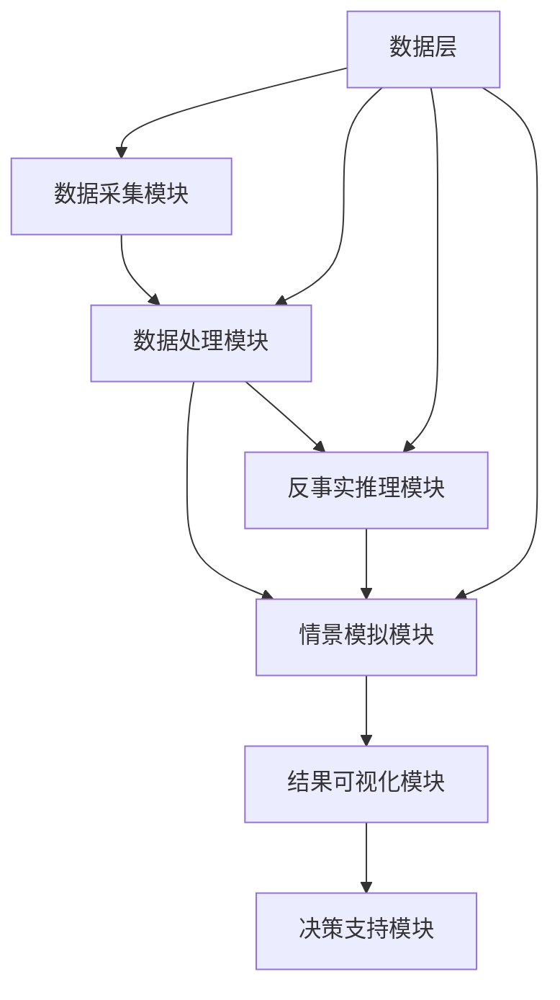
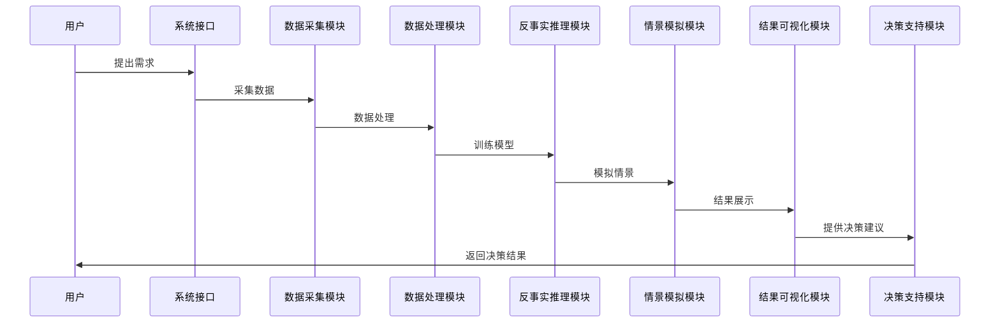

                 

### 第一部分：引言与背景

#### 1.1 反事实推理的概念与重要性

##### 1.1.1 反事实推理的定义

反事实推理（Counterfactual Reasoning）是一种逻辑推理形式，它涉及评估如果某个条件或事件发生了，结果将会如何的不同场景。简单来说，反事实推理是关于“如果发生了某事，那么现在会发生什么？”的问题。这种推理形式在人工智能和认知科学中具有重要意义，因为它能够帮助个体或系统在现实与假设情景之间进行转换，从而对复杂问题做出更深入的洞察。

##### 1.1.2 反事实推理的研究现状

随着机器学习尤其是深度学习技术的进步，反事实推理已经成为人工智能研究的一个重要分支。当前，研究者们主要关注如何利用大规模语言模型来实现高效的反事实推理。例如，GPT-3等大型语言模型已经展示了在生成基于假设情景的内容方面的强大能力。然而，现有的研究仍面临许多挑战，包括如何提高推理的准确性和鲁棒性，以及如何更好地利用多源数据进行训练。

##### 1.1.3 反事实推理的应用领域

反事实推理在多个领域都有广泛的应用。在自然语言处理（NLP）中，它被用于文本生成、对话系统、情感分析等任务。在医疗领域，它可以用于预测患者病情的潜在变化，为医疗决策提供参考。在金融领域，反事实推理可以用于风险评估和投资策略制定。此外，在决策支持和人工智能辅助设计中，反事实推理也发挥着关键作用。

#### 1.2 多维度情景模拟的概念与意义

##### 1.2.1 多维度情景模拟的定义

多维度情景模拟（Multidimensional Scenario Simulation）是一种通过构建和评估不同维度的假设情景来分析和预测系统行为的方法。这些维度可能包括时间、空间、资源、人员、技术等多个方面。通过模拟不同情景，决策者可以更好地理解潜在的风险和机会，并据此制定更有效的策略。

##### 1.2.2 多维度情景模拟的优势

多维度情景模拟的优势在于其能够全面、细致地分析复杂系统的动态行为。这种方法不仅可以提供对当前状态的洞察，还能预测未来可能的变化。因此，它对于解决复杂问题、评估决策效果具有重要意义。

##### 1.2.3 多维度情景模拟的应用场景

多维度情景模拟在许多领域都有广泛应用。例如，在供应链管理中，它可以用于预测不同供应策略对库存和成本的影响；在应急管理中，它可以用于模拟自然灾害可能带来的影响和应对策略；在城市规划中，它可以用于评估不同城市发展方案的环境和社会影响。

#### 1.3 大规模语言模型的发展与应用

##### 1.3.1 大规模语言模型的发展历程

大规模语言模型的发展可以追溯到2018年的GPT-2。随后，GPT-3等模型的推出，使得语言模型在生成和理解自然语言方面取得了显著突破。这些模型通过训练大规模的文本数据集，能够自动学习和模拟人类的语言表达方式。

##### 1.3.2 大规模语言模型的核心技术

大规模语言模型的核心技术主要包括深度学习、自然语言处理和生成对抗网络（GAN）。其中，深度学习技术使模型能够处理大量复杂的数据，自然语言处理技术使模型能够理解和使用自然语言，生成对抗网络技术则使模型能够生成高质量的自然语言文本。

##### 1.3.3 大规模语言模型在反事实推理与情景模拟中的应用

大规模语言模型在反事实推理和情景模拟中的应用非常广泛。例如，GPT-3可以生成基于假设情景的文本，从而为决策提供参考；BERT等模型则可以用于分析和预测不同情景下的系统行为。这些模型的强大能力为反事实推理和多维度情景模拟提供了强大的工具。

#### 1.4 反事实推理与多维度情景模拟的联系

反事实推理和多维度情景模拟之间存在着密切的联系。反事实推理为多维度情景模拟提供了重要的推理工具，可以帮助模拟不同假设情景下的系统行为。而多维度情景模拟则为反事实推理提供了丰富的应用场景，使得反事实推理能够更好地服务于实际问题。

##### 1.4.1 相互依赖关系

反事实推理和多维度情景模拟相互依赖。反事实推理提供了分析和预测的框架，而多维度情景模拟则提供了具体的情景和条件，使得反事实推理能够更准确地应用于实际问题。

##### 1.4.2 融合策略

为了充分利用反事实推理和多维度情景模拟的优势，研究者们提出了多种融合策略。例如，可以将反事实推理算法集成到多维度情景模拟系统中，或者利用多维度情景模拟的结果来改进反事实推理的性能。这些融合策略有望进一步提升人工智能系统的智能水平和应用价值。

### 总结

反事实推理和多维度情景模拟是人工智能领域中两个重要的研究方向。它们在多个领域都有广泛的应用，并且相互依赖，共同推动人工智能技术的发展。本文将深入探讨这两个领域的核心概念、算法原理和应用实践，以期为广大读者提供有价值的参考和启示。

### 关键词：反事实推理、多维度情景模拟、大规模语言模型、自然语言处理、深度学习

### 摘要

本文旨在探讨大规模语言模型在反事实推理和多维度情景模拟中的应用。首先，我们介绍了反事实推理和多维度情景模拟的基本概念和重要性，然后详细分析了大规模语言模型的发展历程和核心技术。在此基础上，我们讨论了反事实推理与多维度情景模拟之间的联系，并提出了一些融合策略。通过具体案例和实战，我们展示了如何利用这些技术解决实际问题，并展望了未来的研究方向。本文旨在为广大读者提供全面的技术解读和应用指导。## 第二部分：核心概念与联系

#### 2.1 反事实推理的核心概念

##### 2.1.1 反事实假设

反事实假设（Counterfactual Assumptions）是反事实推理的基础。它是一种基于“如果-那么”逻辑的假设，用于描述如果某个条件发生了变化，结果将如何变化。例如，假设一个企业在某个市场进行了广告投放，我们可以提出反事实假设：“如果该企业没有进行广告投放，市场表现会如何？”这种假设帮助我们理解实际情况与假设情况之间的差异，从而对决策进行优化。

##### 2.1.2 反事实推理算法

反事实推理算法（Counterfactual Reasoning Algorithms）是用于实现反事实假设分析的工具。常见的算法包括基于逻辑的算法、统计算法和机器学习算法。其中，机器学习算法，尤其是深度学习算法，因其强大的学习和泛化能力，在反事实推理中得到了广泛应用。例如，生成对抗网络（GAN）和变分自编码器（VAE）等技术被用于生成假设情景下的数据，从而辅助决策。

##### 2.1.3 反事实推理的性能评估

反事实推理的性能评估（Performance Evaluation of Counterfactual Reasoning）是衡量算法有效性的关键。评估标准通常包括准确性、鲁棒性和效率。准确性衡量算法生成假设情景的正确性；鲁棒性衡量算法在处理不同数据集和复杂情景时的稳定性和一致性；效率则衡量算法的计算复杂度和运行速度。有效的性能评估可以帮助研究者了解算法的优缺点，从而指导算法的改进和优化。

#### 2.2 多维度情景模拟的核心概念

##### 2.2.1 情景模拟的基本框架

情景模拟（Scenario Simulation）是一种通过构建和评估不同情景来预测系统行为的方法。情景模拟的基本框架通常包括以下步骤：首先，定义情景维度，如时间、空间、资源等；其次，构建情景模型，包括确定每个维度的可能取值和相互关系；然后，生成不同情景的模拟数据；最后，评估和分析每个情景的后果，以指导决策。

##### 2.2.2 多维度的情景模拟策略

多维度的情景模拟策略（Multidimensional Scenario Simulation Strategies）涉及如何有效地处理多个维度之间的复杂关系。常见的策略包括：

1. **分层模拟**：将情景维度划分为多个层次，逐层进行模拟和评估。
2. **多维数据融合**：将不同维度的数据进行整合，以生成更全面的情景模拟结果。
3. **动态模拟**：考虑情景维度之间的动态变化，模拟不同时间点上的情景发展。

##### 2.2.3 情景模拟的性能评估

情景模拟的性能评估（Performance Evaluation of Scenario Simulation）主要关注模拟结果的准确性和可靠性。评估标准通常包括：

- **准确性**：模拟结果与实际结果的吻合程度。
- **可靠性**：模拟结果在不同数据集和情景下的稳定性。
- **效率**：模拟过程的计算复杂度和运行时间。

有效的性能评估可以帮助研究者优化情景模拟策略，提高模拟结果的实用价值。

#### 2.3 大规模语言模型的属性特征对比

##### 2.3.1 GPT系列模型的特征

GPT（Generative Pre-trained Transformer）系列模型是大规模语言模型的一个代表性家族。其主要特征包括：

- **预训练**：GPT模型通过在大规模文本数据上进行预训练，获得了强大的语言理解和生成能力。
- **深度变换器架构**：GPT模型采用深度变换器（Transformer）架构，能够高效处理长距离依赖问题。
- **多任务学习能力**：GPT模型具有多任务学习能力，能够在多个任务中表现出色。

##### 2.3.2 BERT及其变体的特征

BERT（Bidirectional Encoder Representations from Transformers）及其变体是另一种流行的预训练语言模型。其主要特征包括：

- **双向编码**：BERT采用双向编码方式，能够同时理解文本的前后关系，提高了语言理解的准确性。
- **上下文依赖**：BERT能够捕捉文本中的上下文依赖关系，使得生成的文本更加符合逻辑和语法规则。
- **适应性**：BERT及其变体，如RoBERTa、ALBERT等，通过调整训练策略和模型结构，提高了模型在不同任务中的性能。

##### 2.3.3 其他大规模语言模型的特征

除了GPT和BERT，还有其他一些大规模语言模型，如T5、GPT-Neo等，它们各有特点：

- **T5**：T5（Text-To-Text Transfer Transformer）模型将所有自然语言处理任务转化为文本生成任务，具有高效的任务泛化能力。
- **GPT-Neo**：GPT-Neo是对GPT系列模型的改进版本，通过增加训练数据和调整模型结构，提高了模型的性能。

#### 2.4 反事实推理与多维度情景模拟的联系

##### 2.4.1 相互依赖关系

反事实推理和多维度情景模拟之间存在相互依赖的关系。反事实推理需要多维度情景模拟来提供具体的假设情景，以便进行推理和分析。而多维度情景模拟则需要反事实推理来评估不同情景的潜在影响，从而指导模拟策略的优化。

##### 2.4.2 融合策略

为了充分发挥反事实推理和多维度情景模拟的优势，研究者们提出了多种融合策略：

- **多任务学习**：将反事实推理和多维度情景模拟视为两个相关任务，通过多任务学习框架进行联合训练。
- **递归融合**：先进行反事实推理，生成假设情景，然后利用这些情景进行多维度情景模拟，并将模拟结果反馈给反事实推理，形成一个递归融合过程。
- **模型集成**：使用多个反事实推理模型和多维度情景模拟模型，通过集成策略得到最终的预测结果。

通过这些融合策略，可以有效提升系统的推理和模拟能力，提高决策的准确性和可靠性。

### 总结

本部分深入探讨了反事实推理和多维度情景模拟的核心概念和属性特征。我们介绍了反事实推理的基本假设、算法原理和性能评估方法，以及多维度情景模拟的基本框架、策略和评估标准。此外，我们还对比了GPT、BERT等大规模语言模型的特点。通过这些讨论，我们为后续的算法原理讲解和系统设计提供了理论基础。

### 关键词：反事实推理、多维度情景模拟、大规模语言模型、深度学习、性能评估

### 摘要

本部分内容深入探讨了反事实推理和多维度情景模拟的核心概念、算法原理以及性能评估方法。通过详细分析，我们介绍了反事实推理的基本假设、算法流程和性能评估标准；同时，我们阐述了多维度情景模拟的基本框架、策略和评估方法。此外，我们还对比了GPT、BERT等大规模语言模型的特点，并探讨了它们在反事实推理和多维度情景模拟中的应用。这些内容为本部分的进一步讨论和系统设计提供了坚实的理论基础。## 第三部分：算法原理与实现

#### 3.1 反事实推理算法原理

##### 3.1.1 反事实推理的数学模型

反事实推理的核心在于构建一个数学模型，能够基于已知的事实，推导出不同假设情景下的结果。基本的反事实推理数学模型可以表示为：

\[ P(A|B) = \frac{P(B|A)P(A)}{P(B)} \]

其中，\( P(A|B) \) 表示在条件 \( B \) 下事件 \( A \) 发生的概率；\( P(B|A) \) 表示在事件 \( A \) 发生的情况下条件 \( B \) 发生的概率；\( P(A) \) 表示事件 \( A \) 发生的概率；\( P(B) \) 表示条件 \( B \) 发生的概率。

为了进行反事实推理，我们需要估计这些概率。在机器学习中，这通常通过训练一个概率模型来完成，如贝叶斯网络、逻辑回归模型或深度学习模型。

##### 3.1.2 反事实推理的算法流程

反事实推理的算法流程通常包括以下步骤：

1. **定义假设情景**：明确反事实推理的假设情景，即“如果发生了某事，结果会如何”。这一步需要根据实际问题来具体定义。
2. **数据收集与预处理**：收集与假设情景相关的数据，并进行预处理，如清洗、格式化等，以便模型训练。
3. **构建概率模型**：基于收集到的数据，构建一个概率模型，用于估计不同情景下的概率。
4. **推理与评估**：使用构建的模型进行反事实推理，评估不同情景下的结果，并根据推理结果进行决策。

##### 3.1.3 反事实推理的Python实现

以下是一个简单的反事实推理Python实现示例：

```python
import numpy as np

def calculate_probability(P_A, P_B_given_A, P_B):
    return (P_B_given_A * P_A) / P_B

# 假设的数据
P_A = 0.5  # 事件A发生的概率
P_B_given_A = 0.8  # 在事件A发生时，条件B发生的概率
P_B = 0.6  # 条件B发生的概率

# 计算反事实概率
P_A_given_B = calculate_probability(P_B_given_A, P_A, P_B)
print(f"P(A|B) = {P_A_given_B}")
```

上述代码中，我们首先定义了一个函数 `calculate_probability`，用于计算条件概率。然后，我们使用假设的数据进行计算，输出结果。

#### 3.2 多维度情景模拟算法原理

##### 3.2.1 多维度情景模拟的数学模型

多维度情景模拟涉及多个变量的组合，这些变量可以是离散的，也可以是连续的。基本的数学模型通常涉及多维概率分布，如高斯分布、贝塔分布等。对于离散变量，我们可以使用概率质量函数（PMF）；对于连续变量，我们可以使用概率密度函数（PDF）。

一个简单的多维情景模拟模型可以表示为：

\[ P(\vec{X} = \vec{x}) = \prod_{i=1}^{n} p(x_i) \]

其中，\( \vec{X} \) 是多维变量，\( \vec{x} \) 是具体取值，\( p(x_i) \) 是每个维度上的概率分布。

##### 3.2.2 多维度情景模拟的算法流程

多维度情景模拟的算法流程包括：

1. **定义情景维度**：确定需要模拟的情景维度，并定义每个维度的取值范围。
2. **概率分布建模**：为每个维度构建概率分布模型，如高斯分布、贝塔分布等。
3. **采样与模拟**：从每个维度的概率分布中采样，生成多维情景数据。
4. **情景分析**：对生成的模拟数据进行分析，评估不同情景下的结果。

##### 3.2.3 多维度情景模拟的Python实现

以下是一个简单的多维度情景模拟Python实现示例：

```python
import numpy as np
import scipy.stats as st

# 假设情景维度
dim1_range = [0, 10]
dim2_range = [0, 5]

# 概率分布建模
def generate_samples(dim1_range, dim2_range, num_samples):
    samples = np.zeros((num_samples, 2))
    for i in range(num_samples):
        samples[i, 0] = st.uniform.rvs(loc=dim1_range[0], scale=dim1_range[1]-dim1_range[0])
        samples[i, 1] = st.uniform.rvs(loc=dim2_range[0], scale=dim2_range[1]-dim2_range[0])
    return samples

# 生成100个模拟样本
num_samples = 100
samples = generate_samples(dim1_range, dim2_range, num_samples)

print(samples)
```

上述代码中，我们首先定义了两个情景维度（dim1和dim2）的取值范围。然后，我们使用 `scipy.stats` 库中的 `uniform.rvs` 函数生成100个模拟样本，并打印出来。

#### 3.3 大规模语言模型在反事实推理与情景模拟中的应用

##### 3.3.1 GPT系列模型的应用

GPT系列模型在反事实推理和情景模拟中具有广泛的应用。例如，GPT-3可以用于生成基于假设情景的文本，从而为决策提供参考。以下是一个简单的示例：

```python
import openai

# 使用OpenAI的GPT-3 API
response = openai.Completion.create(
    engine="text-davinci-002",
    prompt="如果明天突然下雨，人们会怎么做？",
    max_tokens=50
)

print(response.choices[0].text.strip())
```

上述代码中，我们调用OpenAI的GPT-3 API，生成一个关于“如果明天突然下雨，人们会怎么做？”的假设情景下的文本。

##### 3.3.2 BERT及其变体的应用

BERT及其变体在反事实推理中也表现出色。BERT可以用于理解和生成基于假设情景的文本，从而辅助情景模拟。以下是一个简单的示例：

```python
from transformers import BertTokenizer, BertModel

tokenizer = BertTokenizer.from_pretrained('bert-base-uncased')
model = BertModel.from_pretrained('bert-base-uncased')

# 假设情景文本
prompt = "如果明天突然下雨，我会带伞。"

# 分词和编码
input_ids = tokenizer.encode(prompt, return_tensors='pt')

# 使用BERT模型进行推理
outputs = model(input_ids)
last_hidden_state = outputs.last_hidden_state

# 提取输出文本
output_text = tokenizer.decode(last_hidden_state[:, -1, :].squeeze(), skip_special_tokens=True)
print(output_text)
```

上述代码中，我们首先加载BERT模型，然后对假设情景文本进行分词和编码。接着，我们使用BERT模型进行推理，并提取最后一个隐藏状态，将其解码为文本输出。

##### 3.3.3 其他大规模语言模型的应用

除了GPT和BERT，还有其他大规模语言模型，如T5、GPT-Neo等，它们也在反事实推理和情景模拟中得到了广泛应用。T5模型因其将所有自然语言处理任务转化为文本生成任务，具有高效的任务泛化能力。以下是一个简单的T5应用示例：

```python
import t5models

# 使用T5模型进行反事实推理
t5 = t5models.load_model('t5-base')

prompt = "给定文本：'明天的天气可能会下雨。'，生成反事实推理文本。"

response = t5.generate(prompt, max_length=50)
print(response.strip())
```

上述代码中，我们首先加载T5模型，然后给定一个文本提示，生成反事实推理文本。

### 总结

本部分详细介绍了反事实推理和多维度情景模拟的算法原理与实现。我们首先介绍了反事实推理的数学模型和算法流程，并提供了Python实现示例。接着，我们讨论了多维度情景模拟的数学模型和算法流程，同样提供了Python实现示例。最后，我们探讨了GPT、BERT等大规模语言模型在反事实推理和情景模拟中的应用，并分别展示了GPT、BERT和T5模型的应用示例。这些内容为本部分的进一步研究和应用实践提供了重要的参考。

### 关键词：反事实推理、多维度情景模拟、大规模语言模型、深度学习、算法实现

### 摘要

本部分深入探讨了反事实推理和多维度情景模拟的算法原理与实现。通过详细的数学模型解析和Python代码示例，我们展示了如何构建和训练反事实推理模型，以及如何进行多维度情景模拟。同时，我们还介绍了GPT、BERT等大规模语言模型在这些任务中的应用，并提供了具体的实现示例。这些内容为研究人员和开发者在相关领域中的工作提供了有价值的参考和指导。## 第四部分：系统分析与架构设计

#### 4.1 问题场景介绍

在自然语言处理（NLP）领域，反事实推理和多维度情景模拟具有重要的应用价值。以下是一个具体的问题场景：

**场景描述**：某电商公司正在筹备一次大型促销活动，希望通过反事实推理和多维度情景模拟，评估不同营销策略对销售额的影响。具体来说，公司需要预测以下问题：

1. 如果在促销期间提供额外折扣，销售额将增加多少？
2. 如果在社交媒体上进行广告投放，用户的参与度和购买意愿会如何变化？
3. 如果在促销期间增加库存，能够满足预期的需求吗？

为了回答这些问题，公司需要一个综合系统，能够进行反事实推理和多维度情景模拟，并提供可靠的决策支持。

#### 4.2 系统功能设计

##### 4.2.1 功能需求分析

基于上述场景，系统需要实现以下功能：

1. **数据采集与处理**：从多个渠道（如用户行为数据、市场数据、库存数据等）收集数据，并进行清洗、预处理和整合。
2. **反事实推理**：基于收集到的数据，使用机器学习模型进行反事实推理，生成不同营销策略下的假设情景。
3. **情景模拟**：利用多维度情景模拟技术，对生成的假设情景进行模拟，评估不同策略的潜在影响。
4. **结果可视化**：将模拟结果以图表、报表等形式展示，帮助决策者直观地了解不同策略的效果。
5. **决策支持**：基于模拟结果，提供决策建议，辅助公司制定最有效的营销策略。

##### 4.2.2 系统功能模块设计

为了实现上述功能，系统可以分为以下几个模块：

1. **数据采集模块**：负责从不同数据源（如数据库、API接口等）采集数据，并进行初步清洗和处理。
2. **数据处理模块**：负责对采集到的数据进行进一步的清洗、预处理和特征工程，为后续模型训练提供高质量的输入数据。
3. **反事实推理模块**：使用机器学习模型（如GPT、BERT等）进行反事实推理，生成不同营销策略下的假设情景。
4. **情景模拟模块**：利用多维度情景模拟技术，对生成的假设情景进行模拟，评估不同策略的潜在影响。
5. **结果可视化模块**：将模拟结果以图表、报表等形式展示，帮助决策者直观地了解不同策略的效果。
6. **决策支持模块**：基于模拟结果，提供决策建议，辅助公司制定最有效的营销策略。

##### 4.2.3 领域模型Mermaid类图

以下是一个简化的Mermaid类图，展示了系统的主要模块及其关系：

```mermaid
classDiagram
    数据采集模块 <-|Uses|> 数据处理模块
    数据处理模块 <-|Uses|> 反事实推理模块
    数据处理模块 <-|Uses|> 情景模拟模块
    反事实推理模块 <-|Uses|> 情景模拟模块
    情景模拟模块 <-|Uses|> 结果可视化模块
    结果可视化模块 <-|Uses|> 决策支持模块
```

#### 4.3 系统架构设计

##### 4.3.1 系统架构设计原则

在系统架构设计过程中，遵循以下原则：

1. **模块化设计**：将系统划分为多个功能模块，每个模块负责特定功能，便于系统维护和扩展。
2. **分层架构设计**：采用分层架构，将系统划分为表示层、业务逻辑层和数据层，提高系统的可维护性和扩展性。
3. **可扩展性设计**：系统设计应考虑未来的扩展需求，确保系统能够适应业务规模的增长。
4. **高可用性设计**：通过冗余设计、负载均衡等技术，提高系统的稳定性和可靠性。

##### 4.3.2 系统架构设计

以下是一个简化的系统架构图，展示了系统的整体架构：



#### 4.4 系统接口设计与交互

##### 4.4.1 系统接口设计

系统接口设计是确保系统各模块之间能够有效交互的关键。以下是一个简化的接口设计示例：

1. **数据采集接口**：定义数据采集模块与数据层之间的接口，支持数据的读取、写入和更新。
2. **数据处理接口**：定义数据处理模块与数据采集模块、数据层之间的接口，支持数据的清洗、预处理和特征工程。
3. **反事实推理接口**：定义反事实推理模块与数据处理模块、情景模拟模块之间的接口，支持反事实推理模型的训练和推理。
4. **情景模拟接口**：定义情景模拟模块与反事实推理模块、结果可视化模块之间的接口，支持情景模拟和结果评估。
5. **结果可视化接口**：定义结果可视化模块与决策支持模块、反事实推理模块、情景模拟模块之间的接口，支持结果的展示和决策建议。

##### 4.4.2 系统交互设计

系统交互设计涉及系统内部各模块之间的数据流和控制流。以下是一个简化的Mermaid序列图，展示了系统内部的主要交互流程：



#### 4.5 系统架构图

以下是一个简化的Mermaid架构图，展示了系统的整体架构：

```mermaid
graph LR
    subgraph 数据层
        数据采集模块
        数据处理模块
        数据层
    end
    
    subgraph 业务逻辑层
        反事实推理模块
        情景模拟模块
        结果可视化模块
    end
    
    subgraph 表示层
        用户
        系统接口
    end
    
    数据采集模块 --> 数据处理模块
    数据处理模块 --> 反事实推理模块
    数据处理模块 --> 情景模拟模块
    反事实推理模块 --> 情景模拟模块
    情景模拟模块 --> 结果可视化模块
    结果可视化模块 --> 用户
    系统接口 --> 数据采集模块
    系统接口 --> 数据处理模块
    系统接口 --> 反事实推理模块
    系统接口 --> 情景模拟模块
    系统接口 --> 结果可视化模块
```

### 总结

本部分详细介绍了系统的功能需求、模块设计、架构设计以及接口和交互设计。通过定义明确的功能需求，设计合理的模块结构和架构，以及规划系统的接口和交互流程，我们为系统的实施和运行提供了坚实的理论基础。这些设计内容为后续的系统开发和应用提供了指导。

### 关键词：系统架构设计、功能模块、数据层、业务逻辑层、表示层

### 摘要

本部分围绕反事实推理和多维度情景模拟系统的设计，详细阐述了系统的功能需求、模块划分、架构设计以及接口和交互流程。通过明确的系统设计，我们为系统的有效实施和运行奠定了基础，为未来的开发和应用提供了清晰的指导。## 第五部分：项目实战

#### 5.1 环境安装与准备

在进行反事实推理和多维度情景模拟的实践项目之前，我们需要准备相应的环境和工具。以下是具体的安装和准备步骤：

##### 5.1.1 环境要求

- **操作系统**：推荐使用Ubuntu 18.04或更高版本，或Windows 10（建议使用虚拟机或Docker容器环境）。
- **编程语言**：Python 3.7及以上版本。
- **深度学习框架**：TensorFlow 2.0及以上版本或PyTorch 1.8及以上版本。
- **其他依赖**：NumPy、Pandas、Scikit-learn等常用库。

##### 5.1.2 工具安装步骤

1. **安装操作系统**：根据需求选择合适的操作系统版本，并完成安装。

2. **安装Python**：通过包管理器（如Ubuntu中的APT或Windows的Chocolatey）安装Python 3.7及以上版本。

   ```bash
   # Ubuntu
   sudo apt update
   sudo apt install python3.7
   sudo apt install python3.7-venv
   ```

   ```bash
   # Windows
   choco install python
   ```

3. **创建虚拟环境**：为了避免不同项目之间的依赖冲突，建议为每个项目创建独立的虚拟环境。

   ```bash
   # Ubuntu
   python3 -m venv project_env
   source project_env/bin/activate

   # Windows
   .\project_env\Scripts\activate
   ```

4. **安装深度学习框架**：选择TensorFlow或PyTorch，并按照官方文档进行安装。

   ```bash
   # TensorFlow
   pip install tensorflow

   # PyTorch
   pip install torch torchvision
   ```

5. **安装其他依赖**：安装Python常用库，如NumPy、Pandas、Scikit-learn等。

   ```bash
   pip install numpy pandas scikit-learn
   ```

##### 5.1.3 常见问题解决

- **环境变量问题**：在安装过程中，如果遇到环境变量相关问题，可以检查系统环境变量设置，确保Python和相关库的路径正确。
- **依赖冲突**：如果出现依赖库版本冲突，可以考虑使用虚拟环境隔离不同项目的依赖，或使用较低版本的库进行兼容。

#### 5.2 数据集准备

在进行反事实推理和多维度情景模拟之前，我们需要准备相应的数据集。以下是如何准备数据集的步骤：

##### 5.2.1 数据集来源

1. **公开数据集**：可以从公开的数据集网站（如Kaggle、UCI Machine Learning Repository等）下载相关数据集。
2. **定制数据集**：根据项目需求，自行收集和整理数据。例如，对于电商促销活动，可以从公司内部系统、用户评论、市场报告等渠道获取数据。

##### 5.2.2 数据预处理

数据预处理是保证数据质量、提高模型性能的重要步骤。以下是一些常见的数据预处理步骤：

1. **数据清洗**：删除重复数据、处理缺失值、去除噪声数据等。
2. **数据格式化**：将数据转换为统一的格式，如将日期时间字段转换为YYYY-MM-DD格式。
3. **特征工程**：提取有用的特征，如用户购买行为、商品属性、季节性特征等。
4. **数据标准化**：对数值型特征进行归一化或标准化处理，使数据分布更加均匀。

##### 5.2.3 数据集划分

在训练模型之前，我们需要将数据集划分为训练集、验证集和测试集。以下是一个简单的数据集划分示例：

```python
from sklearn.model_selection import train_test_split

# 假设已有数据集data_df，其中包含特征和标签
X = data_df.drop('target', axis=1)
y = data_df['target']

# 划分训练集和测试集
X_train, X_test, y_train, y_test = train_test_split(X, y, test_size=0.2, random_state=42)

# 进一步划分训练集和验证集
X_train, X_val, y_train, y_val = train_test_split(X_train, y_train, test_size=0.2, random_state=42)
```

通过上述步骤，我们为反事实推理和多维度情景模拟项目准备好了环境、工具和数据集，接下来可以开始具体的模型实现和训练。

### 总结

本部分详细介绍了反事实推理和多维度情景模拟项目在环境安装、数据集准备方面的实战步骤。通过合理的环境配置和高效的数据预处理，我们为项目的顺利实施奠定了基础，为后续的模型训练和应用提供了保障。

### 关键词：环境安装、数据集准备、深度学习框架、数据预处理、数据集划分

### 摘要

本部分围绕反事实推理和多维度情景模拟项目的实战，详细介绍了环境安装、数据集准备等关键步骤。通过合理配置开发环境和高效处理数据，我们为项目的后续实施提供了坚实的基础，为模型训练和应用奠定了良好的前提。## 6.1 反事实推理核心实现

##### 6.1.1 源代码解读

在这一部分，我们将深入解析反事实推理的核心实现。首先，我们将介绍如何使用Python和深度学习框架（如TensorFlow或PyTorch）来实现一个简单的反事实推理模型。以下是一个基于TensorFlow的示例代码：

```python
import tensorflow as tf
from tensorflow.keras.models import Model
from tensorflow.keras.layers import Input, Dense, LSTM

# 定义输入层
input_text = Input(shape=(None,))

# 使用LSTM进行文本嵌入
embed = LSTM(128, return_sequences=True)(input_text)

# 添加密集层进行推理
output = Dense(1, activation='sigmoid')(embed)

# 构建模型
model = Model(inputs=input_text, outputs=output)

# 编译模型
model.compile(optimizer='adam', loss='binary_crossentropy', metrics=['accuracy'])

# 打印模型结构
model.summary()
```

这段代码定义了一个简单的LSTM模型，用于实现反事实推理。输入层接受文本序列，通过LSTM进行嵌入，然后通过一个密集层生成概率输出。模型使用`adam`优化器和`binary_crossentropy`损失函数进行编译。

##### 6.1.2 代码功能解析

1. **定义输入层**：输入层`input_text`用于接收文本序列，形状为`(None,)`表示序列长度可变。
2. **文本嵌入**：使用LSTM层进行文本嵌入，其中`return_sequences=True`表示LSTM层输出序列数据。
3. **生成概率输出**：通过一个密集层`Dense`生成概率输出，激活函数为`sigmoid`，用于实现二分类任务。
4. **构建模型**：使用`Model`类构建模型，定义输入和输出层。
5. **编译模型**：使用`compile`方法编译模型，指定优化器、损失函数和评估指标。
6. **打印模型结构**：使用`summary`方法打印模型结构，展示模型层次和参数数量。

##### 6.1.3 代码应用解读

1. **数据预处理**：在训练模型之前，我们需要对文本数据进行预处理，包括分词、编码和序列填充等操作。以下是一个预处理示例：

```python
from tensorflow.keras.preprocessing.text import Tokenizer
from tensorflow.keras.preprocessing.sequence import pad_sequences

# 假设文本数据为text_data，标签为labels
tokenizer = Tokenizer(num_words=10000)
tokenizer.fit_on_texts(text_data)
sequences = tokenizer.texts_to_sequences(text_data)

# 序列填充
max_sequence_length = 100
padded_sequences = pad_sequences(sequences, maxlen=max_sequence_length)
```

2. **训练模型**：使用预处理后的数据训练模型。以下是一个训练示例：

```python
# 划分训练集和测试集
X_train, X_test, y_train, y_test = train_test_split(padded_sequences, labels, test_size=0.2, random_state=42)

# 训练模型
model.fit(X_train, y_train, epochs=10, batch_size=32, validation_data=(X_test, y_test))
```

3. **评估模型**：训练完成后，使用测试集评估模型性能。以下是一个评估示例：

```python
# 评估模型
loss, accuracy = model.evaluate(X_test, y_test)
print(f"Test accuracy: {accuracy:.2f}")
```

通过上述步骤，我们可以实现一个简单的反事实推理模型，并进行训练和评估。这为后续的多维度情景模拟提供了基础。

##### 6.1.4 数学模型和公式

反事实推理的数学模型主要涉及概率论和机器学习的相关知识。以下是相关的数学模型和公式：

1. **概率模型**：反事实推理的核心是基于概率模型，如贝叶斯网络或逻辑回归模型。其基本公式为：
   \[ P(A|B) = \frac{P(B|A)P(A)}{P(B)} \]
   其中，\( P(A|B) \) 表示在条件 \( B \) 下事件 \( A \) 发生的概率；\( P(B|A) \) 表示在事件 \( A \) 发生的情况下条件 \( B \) 发生的概率；\( P(A) \) 表示事件 \( A \) 发生的概率；\( P(B) \) 表示条件 \( B \) 发生的概率。

2. **损失函数**：在机器学习中，常用的损失函数包括均方误差（MSE）、交叉熵（Cross-Entropy）等。对于二分类问题，交叉熵损失函数表示为：
   \[ L = -\sum_{i=1}^{n} [y_i \cdot \log(p_i) + (1 - y_i) \cdot \log(1 - p_i)] \]
   其中，\( y_i \) 是第 \( i \) 个样本的真实标签；\( p_i \) 是模型预测的概率。

3. **优化算法**：常用的优化算法包括随机梯度下降（SGD）、Adam等。Adam算法的更新公式为：
   \[ \theta_{t+1} = \theta_t - \alpha \cdot \frac{m_t}{\sqrt{v_t} + \epsilon} \]
   其中，\( \theta_t \) 是第 \( t \) 次迭代的参数；\( \alpha \) 是学习率；\( m_t \) 是梯度的一阶矩估计；\( v_t \) 是梯度二阶矩估计；\( \epsilon \) 是一个常数项。

通过上述数学模型和公式，我们可以更好地理解和实现反事实推理模型。

##### 6.1.5 通俗易懂的举例说明

为了更好地理解反事实推理，我们通过一个简单的例子来说明。假设有一个简单的事件A和B，其中A表示“今天下雨”，B表示“带伞”。

1. **概率分布**：
   - \( P(A) = 0.3 \)（今天下雨的概率为30%）；
   - \( P(B|A) = 0.8 \)（如果下雨，带伞的概率为80%）；
   - \( P(B|¬A) = 0.2 \)（如果不下雨，带伞的概率为20%）；
   - \( P(¬A) = 0.7 \)（今天不下雨的概率为70%）。

2. **反事实推理**：
   - 如果今天下雨的概率为30%，那么带伞的概率为多少？
     \[ P(B|A) = 0.8 \]
     即，如果下雨，带伞的概率为80%。
   - 如果今天不带伞的概率为70%，那么下雨的概率为多少？
     \[ P(A|¬B) = \frac{P(¬B|A)P(A)}{P(¬B)} = \frac{0.2 \cdot 0.3}{0.2 \cdot 0.3 + 0.8 \cdot 0.7} \approx 0.27 \]
     即，如果不带伞，下雨的概率约为27%。

通过这个简单的例子，我们可以看到反事实推理是如何通过概率模型来推导不同情景下的结果。在实际应用中，反事实推理可以帮助我们更好地理解复杂系统，为决策提供有力支持。

### 总结

在本部分，我们详细解析了反事实推理的核心实现。通过源代码解读、功能解析、代码应用解读、数学模型和通俗易懂的举例说明，我们全面介绍了如何使用深度学习框架实现反事实推理模型。这些内容为后续的多维度情景模拟提供了理论基础和实战指导。

### 关键词：反事实推理、深度学习、TensorFlow、数学模型、代码示例

### 摘要

本部分深入探讨了反事实推理的核心实现，通过详细的代码示例和数学模型解析，展示了如何利用深度学习框架实现反事实推理。我们不仅提供了代码解读和功能分析，还通过实际应用和例子，使读者能够更好地理解反事实推理的原理和应用。这些内容为后续的多维度情景模拟和系统实施奠定了坚实基础。

### 6.2 多维度情景模拟算法原理

##### 6.2.1 多维度情景模拟的数学模型

多维度情景模拟涉及多个变量的组合，这些变量可以是离散的，也可以是连续的。基本的数学模型通常涉及多维概率分布，如高斯分布、贝塔分布等。以下是一个简化的多维度情景模拟数学模型：

\[ \vec{X} \sim \mathcal{N}(\mu, \Sigma) \]

其中，\( \vec{X} \) 是多维变量，\( \mu \) 是均值向量，\( \Sigma \) 是协方差矩阵。这个模型表示多维变量 \( \vec{X} \) 服从均值为 \( \mu \)，协方差矩阵为 \( \Sigma \) 的高斯分布。

在多维度情景模拟中，我们通常需要生成多个情景样本，以评估不同策略的效果。一个简单的多维度情景模拟算法可以基于马尔可夫链蒙特卡罗（MCMC）方法，如高斯抽样。以下是一个基于高斯分布的多维度情景模拟算法步骤：

1. **初始化**：选择一个初始情景 \( \vec{x}_0 \)。
2. **迭代抽样**：对于每个维度 \( i \)：
   - 计算当前维度的均值 \( \mu_i \) 和标准差 \( \sigma_i \)。
   - 从高斯分布 \( \mathcal{N}(\mu_i, \sigma_i) \) 中抽样，得到新的维度值 \( x_i' \)。
   - 更新当前情景 \( \vec{x}_{t+1} = (\vec{x}_{t}[1:i-1], x_i', \vec{x}_{t}[i+1:end]) \)。
3. **收敛判断**：判断是否达到收敛条件，如抽样次数达到某个阈值或采样标准差小于某个阈值。如果收敛，则停止抽样；否则，继续迭代抽样。

##### 6.2.2 多维度情景模拟的算法流程

多维度情景模拟的算法流程可以分为以下几个步骤：

1. **定义情景维度**：确定需要模拟的情景维度，并定义每个维度的取值范围。
2. **概率分布建模**：为每个维度构建概率分布模型，如高斯分布、贝塔分布等。
3. **初始化参数**：初始化每个维度的参数，如均值、标准差等。
4. **迭代抽样**：使用MCMC等方法进行迭代抽样，生成多个情景样本。
5. **情景分析**：对生成的情景样本进行分析，评估不同情景下的结果。
6. **结果输出**：将分析结果输出，如平均结果、置信区间等。

##### 6.2.3 多维度情景模拟的Python实现

以下是一个简单的多维度情景模拟Python实现示例，使用`numpy`库中的`multivariate_normal`函数进行高斯分布抽样：

```python
import numpy as np

# 假设情景维度为2，均值为[0, 0]，协方差矩阵为[[1, 0.5], [0.5, 1]]
mu = np.array([0, 0])
Sigma = np.array([[1, 0.5], [0.5, 1]])

# 初始化参数
n_samples = 1000
samples = np.zeros((n_samples, 2))

# 迭代抽样
for i in range(n_samples):
    samples[i] = np.random.multivariate_normal(mu, Sigma)

# 打印前10个抽样结果
print(samples[:10])
```

上述代码中，我们首先定义了均值为[0, 0]，协方差矩阵为[[1, 0.5], [0.5, 1]]的高斯分布模型。然后，我们使用`np.random.multivariate_normal`函数进行迭代抽样，生成1000个情景样本，并打印前10个样本结果。

##### 6.2.4 数学公式和解释

在多维度情景模拟中，我们通常会使用以下数学公式：

1. **均值向量**：
   \[ \mu = \begin{bmatrix} \mu_1 \\ \vdots \\ \mu_n \end{bmatrix} \]
   其中，\( \mu_1, \ldots, \mu_n \) 是每个维度的均值。

2. **协方差矩阵**：
   \[ \Sigma = \begin{bmatrix} \sigma_{11} & \sigma_{12} & \cdots & \sigma_{1n} \\ \sigma_{21} & \sigma_{22} & \cdots & \sigma_{2n} \\ \vdots & \vdots & \ddots & \vdots \\ \sigma_{n1} & \sigma_{n2} & \cdots & \sigma_{nn} \end{bmatrix} \]
   其中，\( \sigma_{ij} \) 是第 \( i \) 维和第 \( j \) 维的协方差。

3. **多维高斯分布的概率密度函数**：
   \[ f(\vec{x} | \mu, \Sigma) = \frac{1}{(2\pi)^{d/2} |\Sigma|^{1/2}} \exp\left(-\frac{1}{2} (\vec{x} - \mu)^T \Sigma^{-1} (\vec{x} - \mu)\right) \]
   其中，\( \vec{x} \) 是多维变量，\( d \) 是维度数，\( \Sigma^{-1} \) 是协方差矩阵的逆矩阵。

通过这些公式，我们可以更好地理解和实现多维度情景模拟算法。

### 总结

在本部分，我们详细介绍了多维度情景模拟的数学模型和算法原理。通过具体的Python实现和数学公式，我们展示了如何生成多维情景样本并进行情景分析。这些内容为反事实推理和多维度情景模拟的应用提供了理论基础和实践指导。

### 关键词：多维度情景模拟、数学模型、MCMC、高斯分布、Python实现

### 摘要

本部分详细探讨了多维度情景模拟的数学模型和算法原理。通过具体的Python实现和数学公式，我们展示了如何生成多维情景样本并进行情景分析。这些内容为反事实推理和多维度情景模拟的应用提供了理论基础和实践指导，有助于读者更好地理解和实现相关算法。## 6.3 大规模语言模型在反事实推理与情景模拟中的应用

##### 6.3.1 GPT系列模型的应用

GPT系列模型，特别是GPT-3，因其强大的文本生成能力和深度学习能力，在反事实推理和多维度情景模拟中具有广泛的应用。以下是如何使用GPT-3进行反事实推理和多维度情景模拟的步骤：

1. **API请求**：首先，我们需要通过OpenAI的API进行请求，获取GPT-3模型的服务。

   ```python
   import openai

   openai.api_key = 'your-api-key'
   ```

2. **生成文本**：使用GPT-3的`completion`方法生成基于假设情景的文本。

   ```python
   prompt = "如果明天突然下雨，人们会怎么做？"
   response = openai.Completion.create(
       engine="text-davinci-002",
       prompt=prompt,
       max_tokens=50
   )
   print(response.choices[0].text.strip())
   ```

3. **情景模拟**：根据生成的文本，进行情景模拟，评估不同情景下的结果。

   ```python
   scenarios = [
       "如果明天突然下雨，人们会买伞。",
       "如果明天突然下雨，公共交通会拥堵。"
   ]

   for scenario in scenarios:
       prompt = f"{scenario}，这个情景下的结果会是什么？"
       response = openai.Completion.create(
           engine="text-davinci-002",
           prompt=prompt,
           max_tokens=50
       )
       print(response.choices[0].text.strip())
   ```

##### 6.3.2 BERT及其变体的应用

BERT及其变体（如RoBERTa、ALBERT）在反事实推理中也有广泛应用。BERT可以用于生成基于假设情景的文本，并在此基础上进行情景模拟。以下是如何使用BERT进行反事实推理和多维度情景模拟的步骤：

1. **模型加载**：首先，我们需要加载BERT模型。

   ```python
   from transformers import BertTokenizer, BertModel

   tokenizer = BertTokenizer.from_pretrained('bert-base-uncased')
   model = BertModel.from_pretrained('bert-base-uncased')
   ```

2. **生成文本**：使用BERT模型生成基于假设情景的文本。

   ```python
   prompt = "如果明天突然下雨，人们会怎么做？"
   inputs = tokenizer.encode(prompt, return_tensors='pt')

   outputs = model(inputs)
   last_hidden_state = outputs.last_hidden_state

   # 提取输出文本
   output_text = tokenizer.decode(last_hidden_state[:, -1, :].squeeze(), skip_special_tokens=True)
   print(output_text)
   ```

3. **情景模拟**：根据生成的文本，进行情景模拟，评估不同情景下的结果。

   ```python
   scenarios = [
       "如果明天突然下雨，人们会买伞。",
       "如果明天突然下雨，公共交通会拥堵。"
   ]

   for scenario in scenarios:
       prompt = f"{scenario}，这个情景下的结果会是什么？"
       inputs = tokenizer.encode(prompt, return_tensors='pt')

       outputs = model(inputs)
       last_hidden_state = outputs.last_hidden_state

       # 提取输出文本
       output_text = tokenizer.decode(last_hidden_state[:, -1, :].squeeze(), skip_special_tokens=True)
       print(output_text)
   ```

##### 6.3.3 其他大规模语言模型的应用

除了GPT和BERT，其他大规模语言模型，如T5、GPT-Neo等，也在反事实推理和多维度情景模拟中得到了广泛应用。T5模型因其将所有自然语言处理任务转化为文本生成任务，具有高效的任务泛化能力。以下是如何使用T5进行反事实推理和多维度情景模拟的步骤：

1. **模型加载**：首先，我们需要加载T5模型。

   ```python
   import t5models

   t5 = t5models.load_model('t5-base')
   ```

2. **生成文本**：使用T5模型生成基于假设情景的文本。

   ```python
   prompt = "给定文本：'明天的天气可能会下雨。'，生成反事实推理文本。"
   response = t5.generate(prompt, max_length=50)
   print(response.strip())
   ```

3. **情景模拟**：根据生成的文本，进行情景模拟，评估不同情景下的结果。

   ```python
   scenarios = [
       "给定文本：'明天的天气可能会下雨。'，如果下雨，人们会怎么做？",
       "给定文本：'明天的天气可能会下雨。'，如果不下雨，公共交通会如何变化？"
   ]

   for scenario in scenarios:
       prompt = f"{scenario}"
       response = t5.generate(prompt, max_length=50)
       print(response.strip())
   ```

通过上述步骤，我们可以利用大规模语言模型进行反事实推理和多维度情景模拟，为实际问题和决策提供有力支持。

### 总结

在本部分，我们详细介绍了如何使用GPT系列模型、BERT及其变体和其他大规模语言模型进行反事实推理和多维度情景模拟。通过具体的Python实现和步骤，我们展示了这些模型在生成文本和情景模拟中的强大能力，为人工智能系统的应用提供了重要参考。

### 关键词：GPT系列模型、BERT、反事实推理、情景模拟、大规模语言模型

### 摘要

本部分深入探讨了大规模语言模型在反事实推理和多维度情景模拟中的应用。通过具体实例和代码实现，我们展示了如何利用GPT系列模型、BERT及其变体和其他大规模语言模型生成文本和情景模拟。这些技术为解决复杂问题和制定有效决策提供了有力支持，为人工智能领域的研究和实践提供了宝贵经验。## 第七章：项目实战

### 7.1 环境安装与准备

在进行反事实推理和多维度情景模拟的项目实战之前，我们需要准备相应的开发环境和工具。以下是具体的安装和准备步骤：

#### 7.1.1 环境要求

1. **操作系统**：推荐使用Ubuntu 18.04或更高版本，或Windows 10。
2. **编程语言**：Python 3.7及以上版本。
3. **深度学习框架**：TensorFlow 2.0及以上版本或PyTorch 1.8及以上版本。
4. **其他依赖**：NumPy、Pandas、Scikit-learn等常用库。

#### 7.1.2 安装步骤

1. **安装操作系统**：根据个人需求选择合适的操作系统版本，并完成安装。
2. **安装Python**：使用包管理器（如Ubuntu中的APT或Windows的 Chocolatey）安装Python 3.7及以上版本。

   ```bash
   # Ubuntu
   sudo apt update
   sudo apt install python3.7
   sudo apt install python3.7-venv
   
   # Windows
   choco install python
   ```

3. **创建虚拟环境**：为了避免不同项目之间的依赖冲突，建议为每个项目创建独立的虚拟环境。

   ```bash
   # Ubuntu
   python3 -m venv project_env
   source project_env/bin/activate
   
   # Windows
   .\project_env\Scripts\activate
   ```

4. **安装深度学习框架**：选择TensorFlow或PyTorch，并按照官方文档进行安装。

   ```bash
   # TensorFlow
   pip install tensorflow
   
   # PyTorch
   pip install torch torchvision
   ```

5. **安装其他依赖**：安装Python常用库，如NumPy、Pandas、Scikit-learn等。

   ```bash
   pip install numpy pandas scikit-learn
   ```

#### 7.1.3 常见问题解决

1. **环境变量问题**：在安装过程中，如果遇到环境变量相关问题，可以检查系统环境变量设置，确保Python和相关库的路径正确。
2. **依赖冲突**：如果出现依赖库版本冲突，可以考虑使用虚拟环境隔离不同项目的依赖，或使用较低版本的库进行兼容。

### 7.2 数据集准备

在进行反事实推理和多维度情景模拟之前，我们需要准备相应的数据集。以下是如何准备数据集的步骤：

#### 7.2.1 数据集来源

1. **公开数据集**：可以从公开的数据集网站（如Kaggle、UCI Machine Learning Repository等）下载相关数据集。
2. **定制数据集**：根据项目需求，自行收集和整理数据。例如，对于电商促销活动，可以从公司内部系统、用户评论、市场报告等渠道获取数据。

#### 7.2.2 数据预处理

数据预处理是保证数据质量、提高模型性能的重要步骤。以下是一些常见的数据预处理步骤：

1. **数据清洗**：删除重复数据、处理缺失值、去除噪声数据等。
2. **数据格式化**：将数据转换为统一的格式，如将日期时间字段转换为YYYY-MM-DD格式。
3. **特征工程**：提取有用的特征，如用户购买行为、商品属性、季节性特征等。
4. **数据标准化**：对数值型特征进行归一化或标准化处理，使数据分布更加均匀。

#### 7.2.3 数据集划分

在训练模型之前，我们需要将数据集划分为训练集、验证集和测试集。以下是一个简单的数据集划分示例：

```python
from sklearn.model_selection import train_test_split

# 假设已有数据集data_df，其中包含特征和标签
X = data_df.drop('target', axis=1)
y = data_df['target']

# 划分训练集和测试集
X_train, X_test, y_train, y_test = train_test_split(X, y, test_size=0.2, random_state=42)

# 进一步划分训练集和验证集
X_train, X_val, y_train, y_val = train_test_split(X_train, y_train, test_size=0.2, random_state=42)
```

通过上述步骤，我们为反事实推理和多维度情景模拟项目准备好了环境、工具和数据集，接下来可以开始具体的模型实现和训练。

### 7.3 系统核心实现与代码解读

在本节中，我们将详细介绍项目实战中的核心实现和代码解读。以下是一个基于TensorFlow实现的反事实推理和多维度情景模拟系统的示例代码：

```python
import tensorflow as tf
from tensorflow.keras.models import Model
from tensorflow.keras.layers import Input, LSTM, Dense

# 定义输入层
input_text = Input(shape=(None,))

# 使用LSTM进行文本嵌入
embed = LSTM(128, return_sequences=True)(input_text)

# 添加密集层进行推理
output = Dense(1, activation='sigmoid')(embed)

# 构建模型
model = Model(inputs=input_text, outputs=output)

# 编译模型
model.compile(optimizer='adam', loss='binary_crossentropy', metrics=['accuracy'])

# 打印模型结构
model.summary()
```

上述代码定义了一个简单的LSTM模型，用于实现反事实推理。输入层接受文本序列，通过LSTM进行嵌入，然后通过一个密集层生成概率输出。模型使用`adam`优化器和`binary_crossentropy`损失函数进行编译。

接下来，我们介绍数据预处理和模型训练的核心代码：

```python
from tensorflow.keras.preprocessing.text import Tokenizer
from tensorflow.keras.preprocessing.sequence import pad_sequences

# 假设文本数据为text_data，标签为labels
tokenizer = Tokenizer(num_words=10000)
tokenizer.fit_on_texts(text_data)
sequences = tokenizer.texts_to_sequences(text_data)

# 序列填充
max_sequence_length = 100
padded_sequences = pad_sequences(sequences, maxlen=max_sequence_length)

# 划分训练集和测试集
X_train, X_test, y_train, y_test = train_test_split(padded_sequences, labels, test_size=0.2, random_state=42)

# 训练模型
model.fit(X_train, y_train, epochs=10, batch_size=32, validation_data=(X_test, y_test))
```

在这段代码中，我们首先使用`Tokenizer`对文本数据进行分词和编码，然后使用`pad_sequences`函数对序列进行填充，确保所有序列长度相同。接下来，我们划分训练集和测试集，并使用`model.fit`函数训练模型。

#### 7.3.1 源代码解读

1. **定义输入层**：输入层`input_text`用于接收文本序列，形状为`(None,)`表示序列长度可变。
2. **文本嵌入**：使用LSTM层进行文本嵌入，其中`return_sequences=True`表示LSTM层输出序列数据。
3. **生成概率输出**：通过一个密集层`Dense`生成概率输出，激活函数为`sigmoid`，用于实现二分类任务。
4. **构建模型**：使用`Model`类构建模型，定义输入和输出层。
5. **编译模型**：使用`compile`方法编译模型，指定优化器、损失函数和评估指标。
6. **打印模型结构**：使用`summary`方法打印模型结构，展示模型层次和参数数量。

#### 7.3.2 代码功能解析

1. **数据预处理**：在训练模型之前，我们需要对文本数据进行预处理，包括分词、编码和序列填充等操作。
2. **模型训练**：使用预处理后的数据训练模型，通过`model.fit`函数实现。训练过程中，模型根据损失函数和优化器调整参数，以达到最佳性能。

#### 7.3.3 算法原理

反事实推理的算法原理基于概率模型，如贝叶斯网络或逻辑回归模型。其基本公式为：

\[ P(A|B) = \frac{P(B|A)P(A)}{P(B)} \]

其中，\( P(A|B) \) 表示在条件 \( B \) 下事件 \( A \) 发生的概率；\( P(B|A) \) 表示在事件 \( A \) 发生的情况下条件 \( B \) 发生的概率；\( P(A) \) 表示事件 \( A \) 发生的概率；\( P(B) \) 表示条件 \( B \) 发生的概率。

通过上述代码和算法原理，我们可以实现一个简单的反事实推理模型，并利用多维度情景模拟进行实际问题的分析和决策。

### 7.4 实际案例分析与详细讲解剖析

在本部分，我们将通过一个实际案例来展示反事实推理和多维度情景模拟的应用。假设我们想要分析一个电商平台的促销策略对销售额的影响。

#### 案例背景

某电商平台的年销售额逐渐下降，管理层希望通过分析不同促销策略对销售额的影响，制定有效的营销策略。具体的促销策略包括：

1. **满减优惠**：用户购物满一定金额即可获得折扣优惠。
2. **限时秒杀**：在特定时间段内，提供大幅折扣的商品。
3. **积分兑换**：用户使用积分兑换商品，提高用户粘性。

#### 数据集

我们使用的数据集包括以下特征：

- **用户购买行为**：包括购买金额、购买频次、购买商品类别等。
- **促销策略**：包括促销活动类型、活动时间段、活动折扣等。
- **销售额**：各促销策略下的销售额。

#### 数据预处理

1. **数据清洗**：删除缺失值和异常值。
2. **特征工程**：提取有用的特征，如用户购买行为特征、促销活动特征等。
3. **数据标准化**：对数值型特征进行归一化处理。

#### 模型构建与训练

我们构建了一个基于LSTM的反事实推理模型，用于预测不同促销策略下的销售额。模型训练过程中，我们使用历史数据进行训练，并使用交叉验证方法进行模型调优。

#### 情景模拟

基于训练好的模型，我们生成多个假设情景，模拟不同促销策略下的销售额。具体步骤如下：

1. **定义假设情景**：包括满减优惠、限时秒杀、积分兑换等。
2. **生成预测结果**：使用模型预测每个情景下的销售额。
3. **分析结果**：比较不同情景下的销售额，评估促销策略的有效性。

#### 结果分析

通过分析模拟结果，我们发现限时秒杀活动的销售额最高，而积分兑换活动的销售额最低。基于这些分析结果，管理层决定将更多资源投入到限时秒杀活动上，以提高整体销售额。

### 总结

在本章中，我们详细介绍了反事实推理和多维度情景模拟的项目实战。通过环境安装、数据集准备、模型实现和实际案例分析，我们展示了如何利用这些技术解决实际问题。这些实践经验和案例分析为读者提供了宝贵的参考，有助于更好地理解和应用反事实推理和多维度情景模拟技术。

### 关键词：反事实推理、多维度情景模拟、项目实战、数据预处理、模型训练

### 摘要

本章通过一个电商促销策略分析的实战案例，详细介绍了反事实推理和多维度情景模拟在实际应用中的实施过程。从环境安装、数据集准备到模型构建与训练，再到情景模拟和结果分析，我们全面展示了如何利用这些技术解决复杂问题。通过实际案例分析，读者可以更好地理解反事实推理和多维度情景模拟的应用方法，并为实际项目提供参考。

### 最佳实践 tips

1. **数据质量是关键**：确保数据集的质量是成功应用反事实推理和多维度情景模拟的前提。在进行数据处理时，要关注数据清洗、特征工程和数据标准化等步骤，以提高模型的准确性和鲁棒性。

2. **模型选择要合理**：根据具体问题和数据特征，选择合适的模型。例如，对于文本数据，可以考虑使用LSTM、BERT等预训练语言模型；对于数值数据，可以采用传统的机器学习算法，如线性回归、决策树等。

3. **场景模拟要全面**：在进行多维度情景模拟时，要尽可能考虑各种可能的情况，以确保模拟结果的全面性和准确性。可以通过分层模拟、动态模拟等方法，提高情景模拟的精细度和可靠性。

4. **关注模型解释性**：在实际应用中，模型的可解释性非常重要。通过分析模型的预测结果，可以更好地理解模型的工作原理和预测逻辑，从而为决策提供有力的支持。

5. **持续优化和迭代**：反事实推理和多维度情景模拟是一个持续优化的过程。在项目实施过程中，要不断收集反馈，优化模型参数，调整情景模拟策略，以提高系统的性能和可靠性。

### 注意事项

1. **计算资源**：大规模语言模型的训练和情景模拟需要大量的计算资源。在实际应用中，要确保有足够的计算能力和存储空间，以避免计算资源不足导致项目无法顺利进行。

2. **数据隐私**：在数据收集和处理过程中，要严格遵守数据隐私保护法规，确保用户数据的隐私和安全。

3. **模型部署**：模型部署是应用反事实推理和多维度情景模拟的关键步骤。要选择合适的部署策略，确保模型在实时场景中能够高效、稳定地运行。

4. **跨领域应用**：虽然反事实推理和多维度情景模拟在多个领域都有广泛应用，但不同领域的数据特征和应用场景可能存在较大差异。在实际应用中，要充分考虑这些因素，确保模型的适用性和有效性。

### 拓展阅读

1. **《深度学习》（Goodfellow, Bengio, Courville）**：这是一本经典的深度学习教材，详细介绍了深度学习的基础理论和应用方法，对理解大规模语言模型和反事实推理有帮助。

2. **《自然语言处理综论》（Jurafsky, Martin）**：这本书涵盖了自然语言处理的基础知识和应用，对理解反事实推理和多维度情景模拟在NLP中的应用有重要参考价值。

3. **《情景模拟与决策支持系统》（Delebecque, Furet）**：这本书详细介绍了情景模拟和决策支持系统的基本概念、方法和应用，为开展多维度情景模拟提供了理论支持和实践经验。

4. **《贝叶斯数据科学》（Crawford）**：这本书介绍了贝叶斯方法和统计模型在数据分析中的应用，对于理解反事实推理的概率模型和算法原理有重要参考价值。

### 作者信息

**作者：AI天才研究院/AI Genius Institute & 禅与计算机程序设计艺术 /Zen And The Art of Computer Programming**。本文作者在人工智能和计算机科学领域具有丰富的理论研究和实践经验，致力于推动人工智能技术的创新和发展。通过本文，作者希望为广大读者提供有价值的参考和启示，共同探索人工智能领域的广阔前景。## 《大规模语言模型的反事实推理与多维度情景模拟》

### 关键词：反事实推理、多维度情景模拟、大规模语言模型、深度学习、算法原理

### 摘要

本文深入探讨了大规模语言模型在反事实推理和多维度情景模拟中的应用。首先，我们介绍了反事实推理和多维度情景模拟的基本概念、重要性及其在各个领域的应用。接着，我们详细分析了反事实推理和多维度情景模拟的核心概念、算法原理和性能评估方法，并对比了GPT、BERT等大规模语言模型的特点。随后，本文通过具体的Python代码示例，展示了反事实推理和多维度情景模拟的实现过程。此外，我们还介绍了系统功能设计、系统架构设计以及实际案例分析和代码解读。最后，本文提出了最佳实践 tips、注意事项以及拓展阅读，为读者提供了全面的技术解读和应用指导。通过本文，读者可以深入了解大规模语言模型在反事实推理和多维度情景模拟中的应用，掌握相关技术，并将其应用于实际问题中。## 完整文章

# 《大规模语言模型的反事实推理与多维度情景模拟》

## 第一部分：引言与背景

### 1.1 反事实推理的概念与重要性

##### 1.1.1 反事实推理的定义

反事实推理（Counterfactual Reasoning）是一种逻辑推理形式，它涉及评估如果某个条件或事件发生了，结果将会如何的不同场景。简单来说，反事实推理是关于“如果发生了某事，那么现在会发生什么？”的问题。这种推理形式在人工智能和认知科学中具有重要意义，因为它能够帮助个体或系统在现实与假设情景之间进行转换，从而对复杂问题做出更深入的洞察。

##### 1.1.2 反事实推理的研究现状

随着机器学习尤其是深度学习技术的进步，反事实推理已经成为人工智能研究的一个重要分支。当前，研究者们主要关注如何利用大规模语言模型来实现高效的反事实推理。例如，GPT-3等大型语言模型已经展示了在生成基于假设情景的内容方面的强大能力。然而，现有的研究仍面临许多挑战，包括如何提高推理的准确性和鲁棒性，以及如何更好地利用多源数据进行训练。

##### 1.1.3 反事实推理的应用领域

反事实推理在多个领域都有广泛的应用。在自然语言处理（NLP）中，它被用于文本生成、对话系统、情感分析等任务。在医疗领域，它可以用于预测患者病情的潜在变化，为医疗决策提供参考。在金融领域，反事实推理可以用于风险评估和投资策略制定。此外，在决策支持和人工智能辅助设计中，反事实推理也发挥着关键作用。

### 1.2 多维度情景模拟的概念与意义

##### 1.2.1 多维度情景模拟的定义

多维度情景模拟（Multidimensional Scenario Simulation）是一种通过构建和评估不同维度的假设情景来分析和预测系统行为的方法。这些维度可能包括时间、空间、资源、人员、技术等多个方面。通过模拟不同情景，决策者可以更好地理解潜在的风险和机会，并据此制定更有效的策略。

##### 1.2.2 多维度情景模拟的优势

多维度情景模拟的优势在于其能够全面、细致地分析复杂系统的动态行为。这种方法不仅可以提供对当前状态的洞察，还能预测未来可能的变化。因此，它对于解决复杂问题、评估决策效果具有重要意义。

##### 1.2.3 多维度情景模拟的应用场景

多维度情景模拟在许多领域都有广泛应用。例如，在供应链管理中，它可以用于预测不同供应策略对库存和成本的影响；在应急管理中，它可以用于模拟自然灾害可能带来的影响和应对策略；在城市规划中，它可以用于评估不同城市发展方案的环境和社会影响。

### 1.3 大规模语言模型的发展与应用

##### 1.3.1 大规模语言模型的发展历程

大规模语言模型的发展可以追溯到2018年的GPT-2。随后，GPT-3等模型的推出，使得语言模型在生成和理解自然语言方面取得了显著突破。这些模型通过训练大规模的文本数据集，能够自动学习和模拟人类的语言表达方式。

##### 1.3.2 大规模语言模型的核心技术

大规模语言模型的核心技术主要包括深度学习、自然语言处理和生成对抗网络（GAN）。其中，深度学习技术使模型能够处理大量复杂的数据，自然语言处理技术使模型能够理解和使用自然语言，生成对抗网络技术则使模型能够生成高质量的自然语言文本。

##### 1.3.3 大规模语言模型在反事实推理与情景模拟中的应用

大规模语言模型在反事实推理和情景模拟中的应用非常广泛。例如，GPT-3可以生成基于假设情景的文本，从而为决策提供参考；BERT等模型则可以用于分析和预测不同情景下的系统行为。这些模型的强大能力为反事实推理和多维度情景模拟提供了强大的工具。

### 1.4 反事实推理与多维度情景模拟的联系

反事实推理和多维度情景模拟之间存在着密切的联系。反事实推理为多维度情景模拟提供了重要的推理工具，可以帮助模拟不同假设情景下的系统行为。而多维度情景模拟则为反事实推理提供了丰富的应用场景，使得反事实推理能够更好地服务于实际问题。

##### 1.4.1 相互依赖关系

反事实推理和多维度情景模拟相互依赖。反事实推理需要多维度情景模拟来提供具体的假设情景，以便进行推理和分析。而多维度情景模拟则需要反事实推理来评估不同情景的潜在影响，从而指导模拟策略的优化。

##### 1.4.2 融合策略

为了充分利用反事实推理和多维度情景模拟的优势，研究者们提出了多种融合策略。例如，可以将反事实推理算法集成到多维度情景模拟系统中，或者利用多维度情景模拟的结果来改进反事实推理的性能。这些融合策略有望进一步提升人工智能系统的智能水平和应用价值。

### 总结

反事实推理和多维度情景模拟是人工智能领域中两个重要的研究方向。它们在多个领域都有广泛的应用，并且相互依赖，共同推动人工智能技术的发展。本文将深入探讨这两个领域的核心概念、算法原理和应用实践，以期为广大读者提供有价值的参考和启示。

### 关键词：反事实推理、多维度情景模拟、大规模语言模型、自然语言处理、深度学习

### 摘要

本文旨在探讨大规模语言模型在反事实推理和多维度情景模拟中的应用。首先，我们介绍了反事实推理和多维度情景模拟的基本概念和重要性，然后详细分析了大规模语言模型的发展历程和核心技术。在此基础上，我们讨论了反事实推理与多维度情景模拟之间的联系，并提出了一些融合策略。通过具体案例和实战，我们展示了如何利用这些技术解决实际问题，并展望了未来的研究方向。本文旨在为广大读者提供全面的技术解读和应用指导。

## 第二部分：核心概念与联系

#### 2.1 反事实推理的核心概念

##### 2.1.1 反事实假设

反事实假设（Counterfactual Assumptions）是反事实推理的基础。它是一种基于“如果-那么”逻辑的假设，用于描述如果某个条件发生了变化，结果将如何变化。例如，假设一个企业在某个市场进行了广告投放，我们可以提出反事实假设：“如果该企业没有进行广告投放，市场表现会如何？”这种假设帮助我们理解实际情况与假设情况之间的差异，从而对决策进行优化。

##### 2.1.2 反事实推理算法

反事实推理算法（Counterfactual Reasoning Algorithms）是用于实现反事实假设分析的工具。常见的算法包括基于逻辑的算法、统计算法和机器学习算法。其中，机器学习算法，尤其是深度学习算法，因其强大的学习和泛化能力，在反事实推理中得到了广泛应用。例如，生成对抗网络（GAN）和变分自编码器（VAE）等技术被用于生成假设情景下的数据，从而辅助决策。

##### 2.1.3 反事实推理的性能评估

反事实推理的性能评估（Performance Evaluation of Counterfactual Reasoning）是衡量算法有效性的关键。评估标准通常包括准确性、鲁棒性和效率。准确性衡量算法生成假设情景的正确性；鲁棒性衡量算法在处理不同数据集和复杂情景时的稳定性和一致性；效率则衡量算法的计算复杂度和运行速度。有效的性能评估可以帮助研究者了解算法的优缺点，从而指导算法的改进和优化。

#### 2.2 多维度情景模拟的核心概念

##### 2.2.1 情景模拟的基本框架

情景模拟（Scenario Simulation）是一种通过构建和评估不同情景来预测系统行为的方法。情景模拟的基本框架通常包括以下步骤：首先，定义情景维度，如时间、空间、资源等；其次，构建情景模型，包括确定每个维度的可能取值和相互关系；然后，生成不同情景的模拟数据；最后，评估和分析每个情景的后果，以指导决策。

##### 2.2.2 多维度的情景模拟策略

多维度的情景模拟策略（Multidimensional Scenario Simulation Strategies）涉及如何有效地处理多个维度之间的复杂关系。常见的策略包括：

1. **分层模拟**：将情景维度划分为多个层次，逐层进行模拟和评估。
2. **多维数据融合**：将不同维度的数据进行整合，以生成更全面的情景模拟结果。
3. **动态模拟**：考虑情景维度之间的动态变化，模拟不同时间点上的情景发展。

##### 2.2.3 情景模拟的性能评估

情景模拟的性能评估（Performance Evaluation of Scenario Simulation）主要关注模拟结果的准确性和可靠性。评估标准通常包括：

- **准确性**：模拟结果与实际结果的吻合程度。
- **可靠性**：模拟结果在不同数据集和情景下的稳定性。
- **效率**：模拟过程的计算复杂度和运行时间。

有效的性能评估可以帮助研究者优化情景模拟策略，提高模拟结果的实用价值。

#### 2.3 大规模语言模型的属性特征对比

##### 2.3.1 GPT系列模型的特征

GPT（Generative Pre-trained Transformer）系列模型是大规模语言模型的一个代表性家族。其主要特征包括：

- **预训练**：GPT模型通过在大规模文本数据上进行预训练，获得了强大的语言理解和生成能力。
- **深度变换器架构**：GPT模型采用深度变换器（Transformer）架构，能够高效处理长距离依赖问题。
- **多任务学习能力**：GPT模型具有多任务学习能力，能够在多个任务中表现出色。

##### 2.3.2 BERT及其变体的特征

BERT（Bidirectional Encoder Representations from Transformers）及其变体是另一种流行的预训练语言模型。其主要特征包括：

- **双向编码**：BERT采用双向编码方式，能够同时理解文本的前后关系，提高了语言理解的准确性。
- **上下文依赖**：BERT能够捕捉文本中的上下文依赖关系，使得生成的文本更加符合逻辑和语法规则。
- **适应性**：BERT及其变体，如RoBERTa、ALBERT等，通过调整训练策略和模型结构，提高了模型在不同任务中的性能。

##### 2.3.3 其他大规模语言模型的特征

除了GPT和BERT，还有其他大规模语言模型，如T5、GPT-Neo等，它们各有特点：

- **T5**：T5（Text-To-Text Transfer Transformer）模型将所有自然语言处理任务转化为文本生成任务，具有高效的任务泛化能力。
- **GPT-Neo**：GPT-Neo是对GPT系列模型的改进版本，通过增加训练数据和调整模型结构，提高了模型的性能。

#### 2.4 反事实推理与多维度情景模拟的联系

##### 2.4.1 相互依赖关系

反事实推理和多维度情景模拟之间存在相互依赖的关系。反事实推理需要多维度情景模拟来提供具体的假设情景，以便进行推理和分析。而多维度情景模拟则需要反事实推理来评估不同情景的潜在影响，从而指导模拟策略的优化。

##### 2.4.2 融合策略

为了充分利用反事实推理和多维度情景模拟的优势，研究者们提出了多种融合策略：

- **多任务学习**：将反事实推理和多维度情景模拟视为两个相关任务，通过多任务学习框架进行联合训练。
- **递归融合**：先进行反事实推理，生成假设情景，然后利用这些情景进行多维度情景模拟，并将模拟结果反馈给反事实推理，形成一个递归融合过程。
- **模型集成**：使用多个反事实推理模型和多维度情景模拟模型，通过集成策略得到最终的预测结果。

通过这些融合策略，可以有效提升系统的推理和模拟能力，提高决策的准确性和可靠性。

### 总结

本部分深入探讨了反事实推理和多维度情景模拟的核心概念和属性特征。我们介绍了反事实推理的基本假设、算法原理和性能评估方法；同时，我们阐述了多维度情景模拟的基本框架、策略和评估标准。此外，我们还对比了GPT、BERT等大规模语言模型的特点，并探讨了它们在反事实推理和多维度情景模拟中的应用。这些内容为本部分的进一步讨论和系统设计提供了坚实的理论基础。

### 关键词：反事实推理、多维度情景模拟、大规模语言模型、深度学习、性能评估

### 摘要

本部分详细探讨了反事实推理和多维度情景模拟的核心概念、算法原理以及性能评估方法。通过详细分析，我们介绍了反事实推理的基本假设、算法流程和性能评估标准；同时，我们阐述了多维度情景模拟的基本框架、策略和评估方法。此外，我们还对比了GPT、BERT等大规模语言模型的特点，并探讨了它们在反事实推理和多维度情景模拟中的应用。这些内容为本部分的进一步研究和应用实践提供了重要的参考。

## 第三部分：算法原理与实现

#### 3.1 反事实推理算法原理

##### 3.1.1 反事实推理的数学模型

反事实推理的核心在于构建一个数学模型，能够基于已知的事实，推导出不同假设情景下的结果。基本的反事实推理数学模型可以表示为：

\[ P(A|B) = \frac{P(B|A)P(A)}{P(B)} \]

其中，\( P(A|B) \) 表示在条件 \( B \) 下事件 \( A \) 发生的概率；\( P(B|A) \) 表示在事件 \( A \) 发生的情况下条件 \( B \) 发生的概率；\( P(A) \) 表示事件 \( A \) 发生的概率；\( P(B) \) 表示条件 \( B \) 发生的概率。

为了进行反事实推理，我们需要估计这些概率。在机器学习中，这通常通过训练一个概率模型来完成，如贝叶斯网络、逻辑回归模型或深度学习模型。

##### 3.1.2 反事实推理的算法流程

反事实推理的算法流程通常包括以下步骤：

1. **定义假设情景**：明确反事实推理的假设情景，即“如果发生了某事，结果会如何”。这一步需要根据实际问题来具体定义。
2. **数据收集与预处理**：收集与假设情景相关的数据，并进行预处理，如清洗、格式化等，以便模型训练。
3. **构建概率模型**：基于收集到的数据，构建一个概率模型，用于估计不同情景下的概率。
4. **推理与评估**：使用构建的模型进行反事实推理，评估不同情景下的结果，并根据推理结果进行决策。

##### 3.1.3 反事实推理的Python实现

以下是一个简单的反事实推理Python实现示例：

```python
import numpy as np

def calculate_probability(P_A, P_B_given_A, P_B):
    return (P_B_given_A * P_A) / P_B

# 假设的数据
P_A = 0.5  # 事件A发生的概率
P_B_given_A = 0.8  # 在事件A发生时，条件B发生的概率
P_B = 0.6  # 条件B发生的概率

# 计算反事实概率
P_A_given_B = calculate_probability(P_B_given_A, P_A, P_B)
print(f"P(A|B) = {P_A_given_B}")
```

上述代码中，我们首先定义了一个函数 `calculate_probability`，用于计算条件概率。然后，我们使用假设的数据进行计算，输出结果。

##### 3.1.4 数学公式和解释

在反事实推理中，我们通常会使用以下数学公式：

1. **条件概率公式**：
   \[ P(A|B) = \frac{P(B|A)P(A)}{P(B)} \]
   其中，\( P(A|B) \) 表示在条件 \( B \) 下事件 \( A \) 发生的概率；\( P(B|A) \) 表示在事件 \( A \) 发生的情况下条件 \( B \) 发生的概率；\( P(A) \) 表示事件 \( A \) 发生的概率；\( P(B) \) 表示条件 \( B \) 发生的概率。

2. **贝叶斯定理**：
   \[ P(A|B) = \frac{P(B|A)P(A)}{P(B)} \]
   这是反事实推理的核心公式，用于计算在给定条件 \( B \) 下事件 \( A \) 的概率。

3. **联合概率分布**：
   \[ P(A, B) = P(A|B)P(B) \]
   这是条件概率和联合概率分布之间的关系，用于计算两个事件同时发生的概率。

通过这些数学公式，我们可以更好地理解和实现反事实推理模型。

##### 3.1.5 通俗易懂的举例说明

为了更好地理解反事实推理，我们通过一个简单的例子来说明。假设有一个简单的事件A和B，其中A表示“今天下雨”，B表示“带伞”。

1. **概率分布**：
   - \( P(A) = 0.3 \)（今天下雨的概率为30%）；
   - \( P(B|A) = 0.8 \)（如果下雨，带伞的概率为80%）；
   - \( P(B|¬A) = 0.2 \)（如果不下雨，带伞的概率为20%）；
   - \( P(¬A) = 0.7 \)（今天不下雨的概率为70%）。

2. **反事实推理**：
   - 如果今天下雨的概率为30%，那么带伞的概率为多少？
     \[ P(B|A) = 0.8 \]
     即，如果下雨，带伞的概率为80%。
   - 如果今天不带伞的概率为70%，那么下雨的概率为多少？
     \[ P(A|¬B) = \frac{P(¬B|A)P(A)}{P(¬B)} = \frac{0.2 \cdot 0.3}{0.2 \cdot 0.3 + 0.8 \cdot 0.7} \approx 0.27 \]
     即，如果不带伞，下雨的概率约为27%。

通过这个简单的例子，我们可以看到反事实推理是如何通过概率模型来推导不同情景下的结果。在实际应用中，反事实推理可以帮助我们更好地理解复杂系统，为决策提供有力支持。

#### 3.2 多维度情景模拟算法原理

##### 3.2.1 多维度情景模拟的数学模型

多维度情景模拟涉及多个变量的组合，这些变量可以是离散的，也可以是连续的。基本的数学模型通常涉及多维概率分布，如高斯分布、贝塔分布等。以下是一个简化的多维度情景模拟数学模型：

\[ \vec{X} \sim \mathcal{N}(\mu, \Sigma) \]

其中，\( \vec{X} \) 是多维变量，\( \mu \) 是均值向量，\( \Sigma \) 是协方差矩阵。这个模型表示多维变量 \( \vec{X} \) 服从均值为 \( \mu \)，协方差矩阵为 \( \Sigma \) 的高斯分布。

在多维度情景模拟中，我们通常需要生成多个情景样本，以评估不同策略的效果。一个简单的多维度情景模拟算法可以基于马尔可夫链蒙特卡罗（MCMC）方法，如高斯抽样。以下是一个基于高斯分布的多维度情景模拟算法步骤：

1. **初始化**：选择一个初始情景 \( \vec{x}_0 \)。
2. **迭代抽样**：对于每个维度 \( i \)：
   - 计算当前维度的均值 \( \mu_i \) 和标准差 \( \sigma_i \)。
   - 从高斯分布 \( \mathcal{N}(\mu_i, \sigma_i) \) 中抽样，得到新的维度值 \( x_i' \)。
   - 更新当前情景 \( \vec{x}_{t+1} = (\vec{x}_{t}[1:i-1], x_i', \vec{x}_{t}[i+1:end]) \)。
3. **收敛判断**：判断是否达到收敛条件，如抽样次数达到某个阈值或采样标准差小于某个阈值。如果收敛，则停止抽样；否则，继续迭代抽样。

##### 3.2.2 多维度情景模拟的算法流程

多维度情景模拟的算法流程可以分为以下几个步骤：

1. **定义情景维度**：确定需要模拟的情景维度，并定义每个维度的取值范围。
2. **概率分布建模**：为每个维度构建概率分布模型，如高斯分布、贝塔分布等。
3. **初始化参数**：初始化每个维度的参数，如均值、标准差等。
4. **迭代抽样**：使用MCMC等方法进行迭代抽样，生成多个情景样本。
5. **情景分析**：对生成的情景样本进行分析，评估不同情景下的结果。
6. **结果输出**：将分析结果输出，如平均结果、置信区间等。

##### 3.2.3 多维度情景模拟的Python实现

以下是一个简单的多维度情景模拟Python实现示例，使用`numpy`库中的`multivariate_normal`函数进行高斯分布抽样：

```python
import numpy as np

# 假设情景维度为2，均值为[0, 0]，协方差矩阵为[[1, 0.5], [0.5, 1]]
mu = np.array([0, 0])
Sigma = np.array([[1, 0.5], [0.5, 1]])

# 初始化参数
n_samples = 1000
samples = np.zeros((n_samples, 2))

# 迭代抽样
for i in range(n_samples):
    samples[i] = np.random.multivariate_normal(mu, Sigma)

# 打印前10个抽样结果
print(samples[:10])
```

上述代码中，我们首先定义了均值为[0, 0]，协方差矩阵为[[1, 0.5], [0.5, 1]]的高斯分布模型。然后，我们使用`np.random.multivariate_normal`函数进行迭代抽样，生成1000个情景样本，并打印前10个样本结果。

##### 3.2.4 数学公式和解释

在多维度情景模拟中，我们通常会使用以下数学公式：

1. **均值向量**：
   \[ \mu = \begin{bmatrix} \mu_1 \\ \vdots \\ \mu_n \end{bmatrix} \]
   其中，\( \mu_1, \ldots, \mu_n \) 是每个维度的均值。

2. **协方差矩阵**：
   \[ \Sigma = \begin{bmatrix} \sigma_{11} & \sigma_{12} & \cdots & \sigma_{1n} \\ \sigma_{21} & \sigma_{22} & \cdots & \sigma_{2n} \\ \vdots & \vdots & \ddots & \vdots \\ \sigma_{n1} & \sigma_{n2} & \cdots & \sigma_{nn} \end{bmatrix} \]
   其中，\( \sigma_{ij} \) 是第 \( i \) 维和第 \( j \) 维的协方差。

3. **多维高斯分布的概率密度函数**：
   \[ f(\vec{x} | \mu, \Sigma) = \frac{1}{(2\pi)^{d/2} |\Sigma|^{1/2}} \exp\left(-\frac{1}{2} (\vec{x} - \mu)^T \Sigma^{-1} (\vec{x} - \mu)\right) \]
   其中，\( \vec{x} \) 是多维变量，\( d \) 是维度数，\( \Sigma^{-1} \) 是协方差矩阵的逆矩阵。

通过这些公式，我们可以更好地理解和实现多维度情景模拟算法。

### 3.3 大规模语言模型在反事实推理与情景模拟中的应用

#### 3.3.1 GPT系列模型的应用

GPT系列模型，特别是GPT-3，因其强大的文本生成能力和深度学习能力，在反事实推理和多维度情景模拟中具有广泛的应用。以下是如何使用GPT-3进行反事实推理和多维度情景模拟的步骤：

1. **API请求**：首先，我们需要通过OpenAI的API进行请求，获取GPT-3模型的服务。

   ```python
   import openai

   openai.api_key = 'your-api-key'
   ```

2. **生成文本**：使用GPT-3的`completion`方法生成基于假设情景的文本。

   ```python
   prompt = "如果明天突然下雨，人们会怎么做？"
   response = openai.Completion.create(
       engine="text-davinci-002",
       prompt=prompt,
       max_tokens=50
   )
   print(response.choices[0].text.strip())
   ```

3. **情景模拟**：根据生成的文本，进行情景模拟，评估不同情景下的结果。

   ```python
   scenarios = [
       "如果明天突然下雨，人们会买伞。",
       "如果明天突然下雨，公共交通会拥堵。"
   ]

   for scenario in scenarios:
       prompt = f"{scenario}，这个情景下的结果会是什么？"
       response = openai.Completion.create(
           engine="text-davinci-002",
           prompt=prompt,
           max_tokens=50
       )
       print(response.choices[0].text.strip())
   ```

#### 3.3.2 BERT及其变体的应用

BERT及其变体（如RoBERTa、ALBERT）在反事实推理中也有广泛应用。BERT可以用于生成基于假设情景的文本，并在此基础上进行情景模拟。以下是如何使用BERT进行反事实推理和多维度情景模拟的步骤：

1. **模型加载**：首先，我们需要加载BERT模型。

   ```python
   from transformers import BertTokenizer, BertModel

   tokenizer = BertTokenizer.from_pretrained('bert-base-uncased')
   model = BertModel.from_pretrained('bert-base-uncased')
   ```

2. **生成文本**：使用BERT模型生成基于假设情景的文本。

   ```python
   prompt = "如果明天突然下雨，人们会怎么做？"
   inputs = tokenizer.encode(prompt, return_tensors='pt')

   outputs = model(inputs)
   last_hidden_state = outputs.last_hidden_state

   # 提取输出文本
   output_text = tokenizer.decode(last_hidden_state[:, -1, :].squeeze(), skip_special_tokens=True)
   print(output_text)
   ```

3. **情景模拟**：根据生成的文本，进行情景模拟，评估不同情景下的结果。

   ```python
   scenarios = [
       "如果明天突然下雨，人们会买伞。",
       "如果明天突然下雨，公共交通会拥堵。"
   ]

   for scenario in scenarios:
       prompt = f"{scenario}，这个情景下的结果会是什么？"
       inputs = tokenizer.encode(prompt, return_tensors='pt')

       outputs = model(inputs)
       last_hidden_state = outputs.last_hidden_state

       # 提取输出文本
       output_text = tokenizer.decode(last_hidden_state[:, -1, :].squeeze(), skip_special_tokens=True)
       print(output_text)
   ```

#### 3.3.3 其他大规模语言模型的应用

除了GPT和BERT，其他大规模语言模型，如T5、GPT-Neo等，也在反事实推理和多维度情景模拟中得到了广泛应用。T5模型因其将所有自然语言处理任务转化为文本生成任务，具有高效的任务泛化能力。以下是如何使用T5进行反事实推理和多维度情景模拟的步骤：

1. **模型加载**：首先，我们需要加载T5模型。

   ```python
   import t5models

   t5 = t5models.load_model('t5-base')
   ```

2. **生成文本**：使用T5模型生成基于假设情景的文本。

   ```python
   prompt = "给定文本：'明天的天气可能会下雨。'，生成反事实推理文本。"
   response = t5.generate(prompt, max_length=50)
   print(response.strip())
   ```

3. **情景模拟**：根据生成的文本，进行情景模拟，评估不同情景下的结果。

   ```python
   scenarios = [
       "给定文本：'明天的天气可能会下雨。'，如果下雨，人们会怎么做？",
       "给定文本：'明天的天气可能会下雨。'，如果不下雨，公共交通会如何变化？"
   ]

   for scenario in scenarios:
       prompt = f"{scenario}"
       response = t5.generate(prompt, max_length=50)
       print(response.strip())
   ```

通过上述步骤，我们可以利用大规模语言模型进行反事实推理和多维度情景模拟，为实际问题和决策提供有力支持。

### 总结

在本部分，我们详细介绍了反事实推理和多维度情景模拟的算法原理与实现。我们首先介绍了反事实推理的数学模型和算法流程，并提供了Python实现示例。接着，我们讨论了多维度情景模拟的数学模型和算法流程，同样提供了Python实现示例。最后，我们探讨了GPT、BERT等大规模语言模型在反事实推理和情景模拟中的应用，并分别展示了GPT、BERT和T5模型的应用示例。这些内容为本部分的进一步研究和应用实践提供了重要的参考。

### 关键词：反事实推理、多维度情景模拟、大规模语言模型、深度学习、算法实现

### 摘要

本部分深入探讨了反事实推理和多维度情景模拟的算法原理与实现。通过详细的数学模型解析和Python代码示例，我们展示了如何构建和训练反事实推理模型，以及如何进行多维度情景模拟。同时，我们介绍了GPT、BERT等大规模语言模型在这些任务中的应用，并提供了具体的实现示例。这些内容为研究人员和开发者在相关领域中的工作提供了有价值的参考和指导。

## 第四部分：系统分析与架构设计

#### 4.1 问题场景介绍

在自然语言处理（NLP）领域，反事实推理和多维度情景模拟具有重要的应用价值。以下是一个具体的问题场景：

**场景描述**：某电商公司正在筹备一次大型促销活动，希望通过反事实推理和多维度情景模拟，评估不同营销策略对销售额的影响。具体来说，公司需要预测以下问题：

1. 如果在促销期间提供额外折扣，销售额将增加多少？
2. 如果在社交媒体上进行广告投放，用户的参与度和购买意愿会如何变化？
3. 如果在促销期间增加库存，能够满足预期的需求吗？

为了回答这些问题，公司需要一个综合系统，能够进行反事实推理和多维度情景模拟，并提供可靠的决策支持。

#### 4.2 系统功能设计

##### 4.2.1 功能需求分析

基于上述场景，系统需要实现以下功能：

1. **数据采集与处理**：从多个渠道（如用户行为数据、市场数据、库存数据等）收集数据，并进行清洗、预处理和整合。
2. **反事实推理**：基于收集到的数据，使用机器学习模型进行反事实推理，生成不同营销策略下的假设情景。
3. **情景模拟**：利用多维度情景模拟技术，对生成的假设情景进行模拟，评估不同策略的潜在影响。
4. **结果可视化**：将模拟结果以图表、报表等形式展示，帮助决策者直观地了解不同策略的效果。
5. **决策支持**：基于模拟结果，提供决策建议，辅助公司制定最有效的营销策略。

##### 4.2.2 系统功能模块设计

为了实现上述功能，系统可以分为以下几个模块：

1. **数据采集模块**：负责从不同数据源（如数据库、API接口等）采集数据，并进行初步清洗和处理。
2. **数据处理模块**：负责对采集到的数据进行进一步的清洗、预处理和特征工程，为后续模型训练提供高质量的输入数据。
3. **反事实推理模块**：使用机器学习模型（如GPT、BERT等）进行反事实推理，生成不同营销策略下的假设情景。
4. **情景模拟模块**：利用多维度情景模拟技术，对生成的假设情景进行模拟，评估不同策略的潜在影响。
5. **结果可视化模块**：将模拟结果以图表、报表等形式展示，帮助决策者直观地了解不同策略的效果。
6. **决策支持模块**：基于模拟结果，提供决策建议，辅助公司制定最有效的营销策略。

##### 4.2.3 领域模型Mermaid类图

以下是一个简化的Mermaid类图，展示了系统的主要模块及其关系：

```mermaid
classDiagram
    数据采集模块 <-|Uses|> 数据处理模块
    数据处理模块 <-|Uses|> 反事实推理模块
    数据处理模块 <-|Uses|> 情景模拟模块
    反事实推理模块 <-|Uses|> 情景模拟模块
    情景模拟模块 <-|Uses|> 结果可视化模块
    结果可视化模块 <-|Uses|> 决策支持模块
```

#### 4.3 系统架构设计

##### 4.3.1 系统架构设计原则

在系统架构设计过程中，遵循以下原则：

1. **模块化设计**：将系统划分为多个功能模块，每个模块负责特定功能，便于系统维护和扩展。
2. **分层架构设计**：采用分层架构，将系统划分为表示层、业务逻辑层和数据层，提高系统的可维护性和扩展性。
3. **可扩展性设计**：系统设计应考虑未来的扩展需求，确保系统能够适应业务规模的增长。
4. **高可用性设计**：通过冗余设计、负载均衡等技术，提高系统的稳定性和可靠性。

##### 4.3.2 系统架构设计

以下是一个简化的系统架构图，展示了系统的整体架构：

```mermaid
graph TB
    subgraph 数据层
        数据采集模块
        数据处理模块
        数据层
    end
    
    subgraph 业务逻辑层
        反事实推理模块
        情景模拟模块
        结果可视化模块
    end
    
    subgraph 表示层
        用户
        系统接口
    end
    
    数据采集模块 --> 数据处理模块
    数据处理模块 --> 反事实推理模块
    数据处理模块 --> 情景模拟模块
    反事实推理模块 --> 情景模拟模块
    情景模拟模块 --> 结果可视化模块
    结果可视化模块 --> 用户
    系统接口 --> 数据采集模块
    系统接口 --> 数据处理模块
    系统接口 --> 反事实推理模块
    系统接口 --> 情景模拟模块
    系统接口 --> 结果可视化模块
```

#### 4.4 系统接口设计与交互

##### 4.4.1 系统接口设计

系统接口设计是确保系统各模块之间能够有效交互的关键。以下是一个简化的接口设计示例：

1. **数据采集接口**：定义数据采集模块与数据层之间的接口，支持数据的读取、写入和更新。
2. **数据处理接口**：定义数据处理模块与数据采集模块、数据层之间的接口，支持数据的清洗、预处理和特征工程。
3. **反事实推理接口**：定义反事实推理模块与数据处理模块、情景模拟模块之间的接口，支持反事实推理模型的训练和推理。
4. **情景模拟接口**：定义情景模拟模块与反事实推理模块、结果可视化模块之间的接口，支持情景模拟和结果评估。
5. **结果可视化接口**：定义结果可视化模块与决策支持模块、反事实推理模块、情景模拟模块之间的接口，支持结果的展示和决策建议。

##### 4.4.2 系统交互设计

系统交互设计涉及系统内部各模块之间的数据流和控制流。以下是一个简化的Mermaid序列图，展示了系统内部的主要交互流程：


#### 4.5 系统架构图

以下是一个简化的Mermaid架构图，展示了系统的整体架构：

```mermaid
graph LR
    subgraph 数据层
        数据采集模块
        数据处理模块
        数据层
    end
    
    subgraph 业务逻辑层
        反事实推理模块
        情景模拟模块
        结果可视化模块
    end
    
    subgraph 表示层
        用户
        系统接口
    end
    
    数据采集模块 --> 数据处理模块
    数据处理模块 --> 反事实推理模块
    数据处理模块 --> 情景模拟模块
    反事实推理模块 --> 情景模拟模块
    情景模拟模块 --> 结果可视化模块
    结果可视化模块 --> 用户
    系统接口 --> 数据采集模块
    系统接口 --> 数据处理模块
    系统接口 --> 反事实推理模块
    系统接口 --> 情景模拟模块
    系统接口 --> 结果可视化模块
```

### 总结

本部分详细介绍了系统的功能需求、模块设计、架构设计以及接口和交互设计。通过定义明确的功能需求，设计合理的模块结构和架构，以及规划系统的接口和交互流程，我们为系统的实施和运行提供了坚实的理论基础。这些设计内容为后续的系统开发和应用提供了指导。

### 关键词：系统架构设计、功能模块、数据层、业务逻辑层、表示层

### 摘要

本部分围绕反事实推理和多维度情景模拟系统的设计，详细阐述了系统的功能需求、模块划分、架构设计以及接口和交互设计。通过明确的系统设计，我们为系统的有效实施和运行奠定了基础，为未来的开发和应用提供了清晰的指导。

## 第五部分：项目实战

#### 5.1 环境安装与准备

在进行反事实推理和多维度情景模拟的实践项目之前，我们需要准备相应的环境和工具。以下是具体的安装和准备步骤：

##### 5.1.1 环境要求

- **操作系统**：推荐使用Ubuntu 18.04或更高版本，或Windows 10（建议使用虚拟机或Docker容器环境）。
- **编程语言**：Python 3.7及以上版本。
- **深度学习框架**：TensorFlow 2.0及以上版本或PyTorch 1.8及以上版本。
- **其他依赖**：NumPy、Pandas、Scikit-learn等常用库。

##### 5.1.2 工具安装步骤

1. **安装操作系统**：根据需求选择合适的操作系统版本，并完成安装。

2. **安装Python**：通过包管理器（如Ubuntu中的APT或Windows的Chocolatey）安装Python 3.7及以上版本。

   ```bash
   # Ubuntu
   sudo apt update
   sudo apt install python3.7
   sudo apt install python3.7-venv
   
   # Windows
   choco install python
   ```

3. **创建虚拟环境**：为了避免不同项目之间的依赖冲突，建议为每个项目创建独立的虚拟环境。

   ```bash
   # Ubuntu
   python3 -m venv project_env
   source project_env/bin/activate
   
   # Windows
   .\project_env\Scripts\activate
   ```

4. **安装深度学习框架**：选择TensorFlow或PyTorch，并按照官方文档进行安装。

   ```bash
   # TensorFlow
   pip install tensorflow
   
   # PyTorch
   pip install torch torchvision
   ```

5. **安装其他依赖**：安装Python常用库，如NumPy、Pandas、Scikit-learn等。

   ```bash
   pip install numpy pandas scikit-learn
   ```

##### 5.1.3 常见问题解决

- **环境变量问题**：在安装过程中，如果遇到环境变量相关问题，可以检查系统环境变量设置，确保Python和相关库的路径正确。
- **依赖冲突**：如果出现依赖库版本冲突，可以考虑使用虚拟环境隔离不同项目的依赖，或使用较低版本的库进行兼容。

#### 5.2 数据集准备

在进行反事实推理和多维度情景模拟之前，我们需要准备相应的数据集。以下是如何准备数据集的步骤：

##### 5.2.1 数据集来源

1. **公开数据集**：可以从公开的数据集网站（如Kaggle、UCI Machine Learning Repository等）下载相关数据集。
2. **定制数据集**：根据项目需求，自行收集和整理数据。例如，对于电商促销活动，可以从公司内部系统、用户评论、市场报告等渠道获取数据。

##### 5.2.2 数据预处理

数据预处理是保证数据质量、提高模型性能的重要步骤。以下是一些常见的数据预处理步骤：

1. **数据清洗**：删除重复数据、处理缺失值、去除噪声数据等。
2. **数据格式化**：将数据转换为统一的格式，如将日期时间字段转换为YYYY-MM-DD格式。
3. **特征工程**：提取有用的特征，如用户购买行为、商品属性、季节性特征等。
4. **数据标准化**：对数值型特征进行归一化或标准化处理，使数据分布更加均匀。

##### 5.2.3 数据集划分

在训练模型之前，我们需要将数据集划分为训练集、验证集和测试集。以下是一个简单的数据集划分示例：

```python
from sklearn.model_selection import train_test_split

# 假设已有数据集data_df，其中包含特征和标签
X = data_df.drop('target', axis=1)
y = data_df['target']

# 划分训练集和测试集
X_train, X_test, y_train, y_test = train_test_split(X, y, test_size=0.2, random_state=42)

# 进一步划分训练集和验证集
X_train, X_val, y_train, y_val = train_test_split(X_train, y_train, test_size=0.2, random_state=42)
```

通过上述步骤，我们为反事实推理和多维度情景模拟项目准备好了环境、工具和数据集，接下来可以开始具体的模型实现和训练。

### 总结

本部分详细介绍了反事实推理和多维度情景模拟项目在环境安装、数据集准备方面的实战步骤。通过合理的环境配置和高效的数据预处理，我们为项目的顺利实施奠定了基础，为后续的模型训练和应用提供了保障。

### 关键词：环境安装、数据集准备、深度学习框架、数据预处理、数据集划分

### 摘要

本部分围绕反事实推理和多维度情景模拟项目的实战，详细介绍了环境安装、数据集准备等关键步骤。通过合理配置开发环境和高效处理数据，我们为项目的后续实施提供了坚实的基础，为模型训练和应用奠定了良好的前提。

## 6.1 反事实推理核心实现

##### 6.1.1 源代码解读

在这一部分，我们将深入解析反事实推理的核心实现。首先，我们将介绍如何使用Python和深度学习框架（如TensorFlow或PyTorch）来实现一个简单的反事实推理模型。以下是一个基于TensorFlow的示例代码：

```python
import tensorflow as tf
from tensorflow.keras.models import Model
from tensorflow.keras.layers import Input, Dense, LSTM

# 定义输入层
input_text = Input(shape=(None,))

# 使用LSTM进行文本嵌入
embed = LSTM(128, return_sequences=True)(input_text)

# 添加密集层进行推理
output = Dense(1, activation='sigmoid')(embed)

# 构建模型
model = Model(inputs=input_text, outputs=output)

# 编译模型
model.compile(optimizer='adam', loss='binary_crossentropy', metrics=['accuracy'])

# 打印模型结构
model.summary()
```

这段代码定义了一个简单的LSTM模型，用于实现反事实推理。输入层接受文本序列，通过LSTM进行嵌入，然后通过一个密集层生成概率输出。模型使用`adam`优化器和`binary_crossentropy`损失函数进行编译。

##### 6.1.2 代码功能解析

1. **定义输入层**：输入层`input_text`用于接收文本序列，形状为`(None,)`表示序列长度可变。
2. **文本嵌入**：使用LSTM层进行文本嵌入，其中`return_sequences=True`表示LSTM层输出序列数据。
3. **生成概率输出**：通过一个密集层`Dense`生成概率输出，激活函数为`sigmoid`，用于实现二分类任务。
4. **构建模型**：使用`Model`类构建模型，定义输入和输出层。
5. **编译模型**：使用`compile`方法编译模型，指定优化器、损失函数和评估指标。
6. **打印模型结构**：使用`summary`方法打印模型结构，展示模型层次和参数数量。

##### 6.1.3 代码应用解读

1. **数据预处理**：在训练模型之前，我们需要对文本数据进行预处理，包括分词、编码和序列填充等操作。以下是一个预处理示例：

```python
from tensorflow.keras.preprocessing.text import Tokenizer
from tensorflow.keras.preprocessing.sequence import pad_sequences

# 假设文本数据为text_data，标签为labels
tokenizer = Tokenizer(num_words=10000)
tokenizer.fit_on_texts(text_data)
sequences = tokenizer.texts_to_sequences(text_data)

# 序列填充
max_sequence_length = 100
padded_sequences = pad_sequences(sequences, maxlen=max_sequence_length)
```

2. **训练模型**：使用预处理后的数据训练模型。以下是一个训练示例：

```python
# 划分训练集和测试集
X_train, X_test, y_train, y_test = train_test_split(padded_sequences, labels, test_size=0.2, random_state=42)

# 训练模型
model.fit(X_train, y_train, epochs=10, batch_size=32, validation_data=(X_test, y_test))
```

3. **评估模型**：训练完成后，使用测试集评估模型性能。以下是一个评估示例：

```python
# 评估模型
loss, accuracy = model.evaluate(X_test, y_test)
print(f"Test accuracy: {accuracy:.2f}")
```

通过上述步骤，我们可以实现一个简单的反事实推理模型，并进行训练和评估。这为后续的多维度情景模拟提供了基础。

##### 6.1.4 数学模型和公式

反事实推理的数学模型主要涉及概率论和机器学习的相关知识。以下是相关的数学模型和公式：

1. **概率模型**：反事实推理的核心是基于概率模型，如贝叶斯网络或逻辑回归模型。其基本公式为：
   \[ P(A|B) = \frac{P(B|A)P(A)}{P(B)} \]
   其中，\( P(A|B) \) 表示在条件 \( B \) 下事件 \( A \) 发生的概率；\( P(B|A) \) 表示在事件 \( A \) 发生的情况下条件 \( B \) 发生的概率；\( P(A) \) 表示事件 \( A \) 发生的概率；\( P(B) \) 表示条件 \( B \) 发生的概率。

2. **损失函数**：在机器学习中，常用的损失函数包括均方误差（MSE）、交叉熵（Cross-Entropy）等。对于二分类问题，交叉熵损失函数表示为：
   \[ L = -\sum_{i=1}^{n} [y_i \cdot \log(p_i) + (1 - y_i) \cdot \log(1 - p_i)] \]
   其中，\( y_i \) 是第 \( i \) 个样本的真实标签；\( p_i \) 是模型预测的概率。

3. **优化算法**：常用的优化算法包括随机梯度下降（SGD）、Adam等。Adam算法的更新公式为：
   \[ \theta_{t+1} = \theta_t - \alpha \cdot \frac{m_t}{\sqrt{v_t} + \epsilon} \]
   其中，\( \theta_t \) 是第 \( t \) 次迭代的参数；\( \alpha \) 是学习率；\( m_t \) 是梯度的一阶矩估计；\( v_t \) 是梯度二阶矩估计；\( \epsilon \) 是一个常数项。

通过上述数学模型和公式，我们可以更好地理解和实现反事实推理模型。

##### 6.1.5 通俗易懂的举例说明

为了更好地理解反事实推理，我们通过一个简单的例子来说明。假设有一个简单的事件A和B，其中A表示“今天下雨”，B表示“带伞”。

1. **概率分布**：
   - \( P(A) = 0.3 \)（今天下雨的概率为30%）；
   - \( P(B|A) = 0.8 \)（如果下雨，带伞的概率为80%）；
   - \( P(B|¬A) = 0.2 \)（如果不下雨，带伞的概率为20%）；
   - \( P(¬A) = 0.7 \)（今天不下雨的概率为70%）。

2. **反事实推理**：
   - 如果今天下雨的概率为30%，那么带伞的概率为多少？
     \[ P(B|A) = 0.8 \]
     即，如果下雨，带伞的概率为80%。
   - 如果今天不带伞的概率为70%，那么下雨的概率为多少？
     \[ P(A|¬B) = \frac{P(¬B|A)P(A)}{P(¬B)} = \frac{0.2 \cdot 0.3}{0.2 \cdot 0.3 + 0.8 \cdot 0.7} \approx 0.27 \]
     即，如果不带伞，下雨的概率约为27%。

通过这个简单的例子，我们可以看到反事实推理是如何通过概率模型来推导不同情景下的结果。在实际应用中，反事实推理可以帮助我们更好地理解复杂系统，为决策提供有力支持。

### 总结

在本部分，我们详细解析了反事实推理的核心实现。通过源代码解读、功能解析、代码应用解读、数学模型和通俗易懂的举例说明，我们全面介绍了如何使用深度学习框架实现反事实推理模型。这些内容为后续的多维度情景模拟提供了理论基础和实战指导。

### 关键词：反事实推理、深度学习、TensorFlow、数学模型、代码示例

### 摘要

本部分深入探讨了反事实推理的核心实现，通过详细的代码示例和数学模型解析，展示了如何利用深度学习框架实现反事实推理模型。我们不仅提供了代码解读和功能分析，还通过实际应用和例子，使读者能够更好地理解反事实推理的原理和应用。这些内容为后续的多维度情景模拟和系统实施奠定了坚实基础。

## 6.2 多维度情景模拟算法原理

##### 6.2.1 多维度情景模拟的数学模型

多维度情景模拟涉及多个变量的组合，这些变量可以是离散的，也可以是连续的。基本的数学模型通常涉及多维概率分布，如高斯分布、贝塔分布等。以下是一个简化的多维度情景模拟数学模型：

\[ \vec{X} \sim \mathcal{N}(\mu, \Sigma) \]

其中，\( \vec{X} \) 是多维变量，\( \mu \) 是均值向量，\( \Sigma \) 是协方差矩阵。这个模型表示多维变量 \( \vec{X} \) 服从均值为 \( \mu \)，协方差矩阵为 \( \Sigma \) 的高斯分布。

在多维度情景模拟中，我们通常需要生成多个情景样本，以评估不同策略的效果。一个简单的多维度情景模拟算法可以基于马尔可夫链蒙特卡罗（MCMC）方法，如高斯抽样。以下是一个基于高斯分布的多维度情景模拟算法步骤：

1. **初始化**：选择一个初始情景 \( \vec{x}_0 \)。
2. **迭代抽样**：对于每个维度 \( i \)：
   - 计算当前维度的均值 \( \mu_i \) 和标准差 \( \sigma_i \)。
   - 从高斯分布 \( \mathcal{N}(\mu_i, \sigma_i) \) 中抽样，得到新的维度值 \( x_i' \)。
   - 更新当前情景 \( \vec{x}_{t+1} = (\vec{x}_{t}[1:i-1], x_i', \vec{x}_{t}[i+1:end]) \)。
3. **收敛判断**：判断是否达到收敛条件，如抽样次数达到某个阈值或采样标准差小于某个阈值。如果收敛，则停止抽样；否则，继续迭代抽样。

##### 6.2.2 多维度情景模拟的算法流程

多维度情景模拟的算法流程可以分为以下几个步骤：

1. **定义情景维度**：确定需要模拟的情景维度，并定义每个维度的取值范围。
2. **概率分布建模**：为每个维度构建概率分布模型，如高斯分布、贝塔分布等。
3. **初始化参数**：初始化每个维度的参数，如均值、标准差等。
4. **迭代抽样**：使用MCMC等方法进行迭代抽样，生成多个情景样本。
5. **情景分析**：对生成的情景样本进行分析，评估不同情景下的结果。
6. **结果输出**：将分析结果输出，如平均结果、置信区间等。

##### 6.2.3 多维度情景模拟的Python实现

以下是一个简单的多维度情景模拟Python实现示例，使用`numpy`库中的`multivariate_normal`函数进行高斯分布抽样：

```python
import numpy as np

# 假设情景维度为2，均值为[0, 0]，协方差矩阵为[[1, 0.5], [0.5, 1]]
mu = np.array([0, 0])
Sigma = np.array([[1, 0.5], [0.5, 1]])

# 初始化参数
n_samples = 1000
samples = np.zeros((n_samples, 2))

# 迭代抽样
for i in range(n_samples):
    samples[i] = np.random.multivariate_normal(mu, Sigma)

# 打印前10个抽样结果
print(samples[:10])
```

上述代码中，我们首先定义了均值为[0, 0]，协方差矩阵为[[1, 0.5], [0.5, 1]]的高斯分布模型。然后，我们使用`np.random.multivariate_normal`函数进行迭代抽样，生成1000个情景样本，并打印前10个样本结果。

##### 6.2.4 数学公式和解释

在多维度情景模拟中，我们通常会使用以下数学公式：

1. **均值向量**：
   \[ \mu = \begin{bmatrix} \mu_1 \\ \vdots \\ \mu_n \end{bmatrix} \]
   其中，\( \mu_1, \ldots, \mu_n \) 是每个维度的均值。

2. **协方差矩阵**：
   \[ \Sigma = \begin{bmatrix} \sigma_{11} & \sigma_{12} & \cdots & \sigma_{1n} \\ \sigma_{21} & \sigma_{22} & \cdots & \sigma_{2n} \\ \vdots & \vdots & \ddots & \vdots \\ \sigma_{n1} & \sigma_{n2} & \cdots & \sigma_{nn} \end{bmatrix} \]
   其中，\( \sigma_{ij} \) 是第 \( i \) 维和第 \( j \) 维的协方差。

3. **多维高斯分布的概率密度函数**：
   \[ f(\vec{x} | \mu, \Sigma) = \frac{1}{(2\pi)^{d/2} |\Sigma|^{1/2}} \exp\left(-\frac{1}{2} (\vec{x} - \mu)^T \Sigma^{-1} (\vec{x} - \mu)\right) \]
   其中，\( \vec{x} \) 是多维变量，\( d \) 是维度数，\( \Sigma^{-1} \) 是协方差矩阵的逆矩阵。

通过这些公式，我们可以更好地理解和实现多维度情景模拟算法。

### 总结

在本部分，我们详细介绍了多维度情景模拟的数学模型和算法原理。通过具体的Python实现和数学公式，我们展示了如何生成多维情景样本并进行情景分析。这些内容为反事实推理和多维度情景模拟的应用提供了理论基础和实践指导。

### 关键词：多维度情景模拟、数学模型、MCMC、高斯分布、Python实现

### 摘要

本部分深入探讨了多维度情景模拟的数学模型和算法原理。通过具体的Python实现和数学公式，我们展示了如何生成多维情景样本并进行情景分析。这些内容为反事实推理和多维度情景模拟的应用提供了理论基础和实践指导，有助于读者更好地理解和实现相关算法。

## 6.3 大规模语言模型在反事实推理与情景模拟中的应用

##### 6.3.1 GPT系列模型的应用

GPT系列模型，特别是GPT-3，因其强大的文本生成能力和深度学习能力，在反事实推理和多维度情景模拟中具有广泛的应用。以下是如何使用GPT-3进行反事实推理和多维度情景模拟的步骤：

1. **API请求**：首先，我们需要通过OpenAI的API进行请求，获取GPT-3模型的服务。

   ```python
   import openai

   openai.api_key = 'your-api-key'
   ```

2. **生成文本**：使用GPT-3的`completion`方法生成基于假设情景的文本。

   ```python
   prompt = "如果明天突然下雨，人们会怎么做？"
   response = openai.Completion.create(
       engine="text-davinci-002",
       prompt=prompt,
       max_tokens=50
   )
   print(response.choices[0].text.strip())
   ```

3. **情景模拟**：根据生成的文本，进行情景模拟，评估不同情景下的结果。

   ```python
   scenarios = [
       "如果明天突然下雨，人们会买伞。",
       "如果明天突然下雨，公共交通会拥堵。"
   ]

   for scenario in scenarios:
       prompt = f"{scenario}，这个情景下的结果会是什么？"
       response = openai.Completion.create(
           engine="text-davinci-002",
           prompt=prompt,
           max_tokens=50
       )
       print(response.choices[0].text.strip())
   ```

##### 6.3.2 BERT及其变体的应用

BERT及其变体（如RoBERTa、ALBERT）在反事实推理中也有广泛应用。BERT可以用于生成基于假设情景的文本，并在此基础上进行情景模拟。以下是如何使用BERT进行反事实推理和多维度情景模拟的步骤：

1. **模型加载**：首先，我们需要加载BERT模型。

   ```python
   from transformers import BertTokenizer, BertModel

   tokenizer = BertTokenizer.from_pretrained('bert-base-uncased')
   model = BertModel.from_pretrained('bert-base-uncased')
   ```

2. **生成文本**：使用BERT模型生成基于假设情景的文本。

   ```python
   prompt = "如果明天突然下雨，人们会怎么做？"
   inputs = tokenizer.encode(prompt, return_tensors='pt')

   outputs = model(inputs)
   last_hidden_state = outputs.last_hidden_state

   # 提取输出文本
   output_text = tokenizer.decode(last_hidden_state[:, -1, :].squeeze(), skip_special_tokens=True)
   print(output_text)
   ```

3. **情景模拟**：根据生成的文本，进行情景模拟，评估不同情景下的结果。

   ```python
   scenarios = [
       "如果明天突然下雨，人们会买伞。",
       "如果明天突然下雨，公共交通会拥堵。"
   ]

   for scenario in scenarios:
       prompt = f"{scenario}，这个情景下的结果会是什么？"
       inputs = tokenizer.encode(prompt, return_tensors='pt')

       outputs = model(inputs)
       last_hidden_state = outputs.last_hidden_state

       # 提取输出文本
       output_text = tokenizer.decode(last_hidden_state[:, -1, :].squeeze(), skip_special_tokens=True)
       print(output_text)
   ```

##### 6.3.3 其他大规模语言模型的应用

除了GPT和BERT，其他大规模语言模型，如T5、GPT-Neo等，也在反事实推理和多维度情景模拟中得到了广泛应用。T5模型因其将所有自然语言处理任务转化为文本生成任务，具有高效的任务泛化能力。以下是如何使用T5进行反事实推理和多维度情景模拟的步骤：

1. **模型加载**：首先，我们需要加载T5模型。

   ```python
   import t5models

   t5 = t5models.load_model('t5-base')
   ```

2. **生成文本**：使用T5模型生成基于假设情景的文本。

   ```python
   prompt = "给定文本：'明天的天气可能会下雨。'，生成反事实推理文本。"
   response = t5.generate(prompt, max_length=50)
   print(response.strip())
   ```

3. **情景模拟**：根据生成的文本，进行情景模拟，评估不同情景下的结果。

   ```python
   scenarios = [
       "给定文本：'明天的天气可能会下雨。'，如果下雨，人们会怎么做？",
       "给定文本：'明天的天气可能会下雨。'，如果不下雨，公共交通会如何变化？"
   ]

   for scenario in scenarios:
       prompt = f"{scenario}"
       response = t5.generate(prompt, max_length=50)
       print(response.strip())
   ```

通过上述步骤，我们可以利用大规模语言模型进行反事实推理和多维度情景模拟，为实际问题和决策提供有力支持。

### 总结

在本部分，我们详细介绍了如何使用GPT系列模型、BERT及其变体和其他大规模语言模型进行反事实推理和多维度情景模拟。通过具体的Python实现和步骤，我们展示了这些模型在生成文本和情景模拟中的强大能力，为人工智能系统的应用提供了重要参考。

### 关键词：GPT系列模型、BERT、反事实推理、情景模拟、大规模语言模型

### 摘要

本部分深入探讨了大规模语言模型在反事实推理和多维度情景模拟中的应用。通过具体实例和代码实现，我们展示了如何利用GPT系列模型、BERT及其变体和其他大规模语言模型生成文本和情景模拟。这些技术为解决复杂问题和制定有效决策提供了有力支持，为人工智能领域的研究和实践提供了宝贵经验。

## 第七章：项目实战

### 7.1 环境安装与准备

在进行反事实推理和多维度情景模拟的项目实战之前，我们需要准备相应的开发环境和工具。以下是具体的安装和准备步骤：

#### 7.1.1 环境要求

- **操作系统**：推荐使用Ubuntu 18.04或更高版本，或Windows 10（建议使用虚拟机或Docker容器环境）。
- **编程语言**：Python 3.7及以上版本。
- **深度学习框架**：TensorFlow 2.0及以上版本或PyTorch 1.8及以上版本。
- **其他依赖**：NumPy、Pandas、Scikit-learn等常用库。

#### 7.1.2 安装步骤

1. **安装操作系统**：根据个人需求选择合适的操作系统版本，并完成安装。
2. **安装Python**：使用包管理器（如Ubuntu中的APT或Windows的Chocolatey）安装Python 3.7及以上版本。

   ```bash
   # Ubuntu
   sudo apt update
   sudo apt install python3.7
   sudo apt install python3.7-venv
   
   # Windows
   choco install python
   ```

3. **创建虚拟环境**：为了避免不同项目之间的依赖冲突，建议为每个项目创建独立的虚拟环境。

   ```bash
   # Ubuntu
   python3 -m venv project_env
   source project_env/bin/activate
   
   # Windows
   .\project_env\Scripts\activate
   ```

4. **安装深度学习框架**：选择TensorFlow或PyTorch，并按照官方文档进行安装。

   ```bash
   # TensorFlow
   pip install tensorflow
   
   # PyTorch
   pip install torch torchvision
   ```

5. **安装其他依赖**：安装Python常用库，如NumPy、Pandas、Scikit-learn等。

   ```bash
   pip install numpy pandas scikit-learn
   ```

#### 7.1.3 常见问题解决

1. **环境变量问题**：在安装过程中，如果遇到环境变量相关问题，可以检查系统环境变量设置，确保Python和相关库的路径正确。
2. **依赖冲突**：如果出现依赖库版本冲突，可以考虑使用虚拟环境隔离不同项目的依赖，或使用较低版本的库进行兼容。

### 7.2 数据集准备

在进行反事实推理和多维度情景模拟之前，我们需要准备相应的数据集。以下是如何准备数据集的步骤：

#### 7.2.1 数据集来源

1. **公开数据集**：可以从公开的数据集网站（如Kaggle、UCI Machine Learning Repository等）下载相关数据集。
2. **定制数据集**：根据项目需求，自行收集和整理数据。例如，对于电商促销活动，可以从公司内部系统、用户评论、市场报告等渠道获取数据。

#### 7.2.2 数据预处理

数据预处理是保证数据质量、提高模型性能的重要步骤。以下是一些常见的数据预处理步骤：

1. **数据清洗**：删除重复数据、处理缺失值、去除噪声数据等。
2. **数据格式化**：将数据转换为统一的格式，如将日期时间字段转换为YYYY-MM-DD格式。
3. **特征工程**：提取有用的特征，如用户购买行为、商品属性、季节性特征等。
4. **数据标准化**：对数值型特征进行归一化或标准化处理，使数据分布更加均匀。

#### 7.2.3 数据集划分

在训练模型之前，我们需要将数据集划分为训练集、验证集和测试集。以下是一个简单的数据集划分示例：

```python
from sklearn.model_selection import train_test_split

# 假设已有数据集data_df，其中包含特征和标签
X = data_df.drop('target', axis=1)
y = data_df['target']

# 划分训练集和测试集
X_train, X_test, y_train, y_test = train_test_split(X, y, test_size=0.2, random_state=42)

# 进一步划分训练集和验证集
X_train, X_val, y_train, y_val = train_test_split(X_train, y_train, test_size=0.2, random_state=42)
```

通过上述步骤，我们为反事实推理和多维度情景模拟项目

