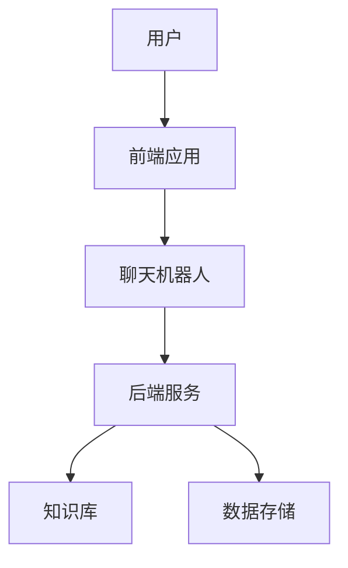
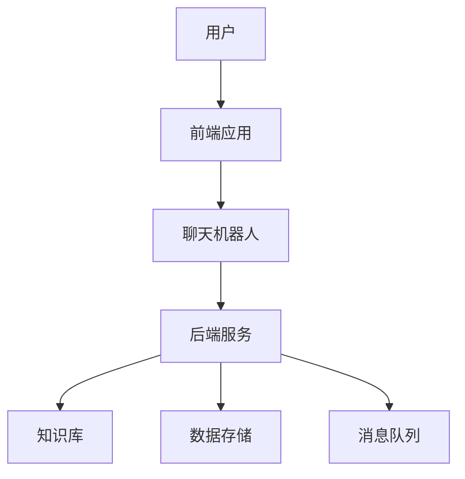
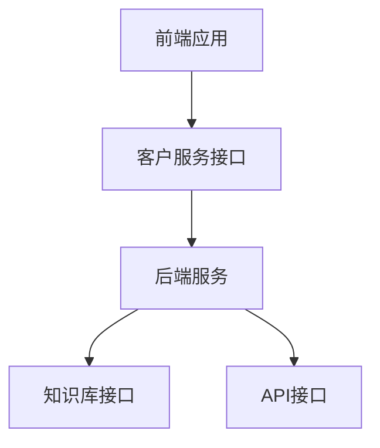
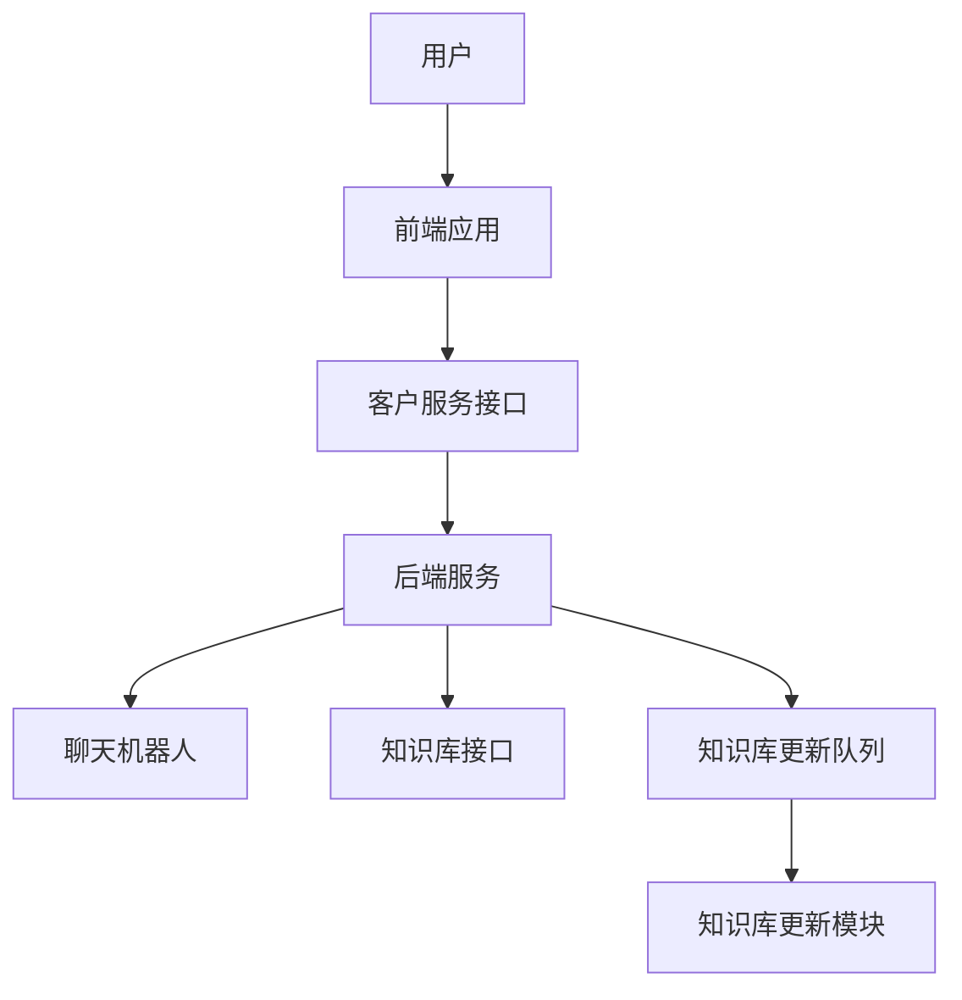

                 

# 第一部分：背景与介绍

### 1. 引言

#### 1.1 研究背景与意义

随着人工智能技术的快速发展，大规模语言模型（Large-scale Language Models）已经成为自然语言处理（Natural Language Processing，NLP）领域的重要工具。这些模型能够处理和理解大量文本数据，为各种应用场景提供了强大的支持，如机器翻译、文本生成、问答系统等。然而，在实际应用中，这些模型往往面临反常识推理（Anomalous Reasoning）的挑战，即在某些情况下，模型无法给出符合常识的推理结果。此外，知识库的动态更新也是大规模语言模型应用中的一大难题，因为模型需要实时获取最新的知识信息，以保证推理结果的准确性。

本研究旨在探讨大规模语言模型的反常识推理与知识库动态更新机制，旨在解决以下问题：

1. **如何提高大规模语言模型在反常识场景下的推理能力？**

   大规模语言模型通常基于统计学习或深度学习方法，它们通过大量文本数据学习语言模式。然而，这些模型往往过于依赖训练数据，对于训练数据中没有的异常情况，模型很难给出合理的推理结果。因此，提高模型在反常识场景下的推理能力是一个重要研究方向。

2. **如何构建有效的知识库动态更新机制？**

   知识库是大规模语言模型的重要组成部分，它提供了模型进行推理所需的背景知识。然而，知识库往往是静态的，不能及时更新，这在快速变化的环境中会导致推理结果的失真。构建有效的知识库动态更新机制，确保模型能够获取最新的知识信息，是提高模型推理准确性的关键。

#### 1.2 问题描述与目标

问题描述：

- **反常识推理问题**：在特定场景下，模型无法给出符合常识的推理结果。
- **知识库动态更新问题**：知识库更新不及时，导致推理结果不准确。

目标：

- 提高大规模语言模型在反常识场景下的推理能力。
- 构建有效的知识库动态更新机制，保证模型能够获取最新的知识信息。

#### 1.3 边界与外延

边界：

- **模型范围**：研究的模型范围限定在现有的主流大规模语言模型，如GPT、BERT等。
- **应用场景**：研究的应用场景包括机器翻译、文本生成、问答系统等。

外延：

- **研究领域**：研究涉及自然语言处理、知识图谱、动态更新算法等领域。
- **技术范围**：研究涉及深度学习、图论、知识图谱、动态更新算法等技术。

#### 1.4 概念结构与核心要素组成

概念结构：

- **大规模语言模型**：基于深度学习或统计学习的方法，用于处理和理解大量文本数据。
- **反常识推理**：模型在特定场景下无法给出符合常识的推理结果。
- **知识库**：模型进行推理所需的背景知识集合。
- **动态更新机制**：知识库的实时更新机制。

核心要素组成：

- **模型训练数据**：用于训练大规模语言模型的数据集。
- **知识库内容**：知识库中包含的各类知识信息。
- **更新算法**：用于知识库动态更新的算法。
- **推理引擎**：基于大规模语言模型和知识库进行推理的引擎。

### 目录大纲

----------------------------------------------------------------

# 第一部分：背景与介绍

## 1. 引言

### 1.1 研究背景与意义

### 1.2 问题描述与目标

### 1.3 边界与外延

### 1.4 概念结构与核心要素组成

----------------------------------------------------------------

## 第二部分：核心概念与原理

### 2.1 大规模语言模型

#### 2.1.1 定义

大规模语言模型是指通过训练大规模的文本数据，从而获取语言知识和语言模式，并在给定新的文本输入时，能够生成或理解文本的模型。这些模型通常基于深度学习技术，如变分自编码器（Variational Autoencoder，VAE）、递归神经网络（Recurrent Neural Network，RNN）、变换器模型（Transformer）等。

#### 2.1.2 特点

- **高容错性**：大规模语言模型通过处理海量数据，具有更强的鲁棒性和泛化能力。
- **上下文理解**：模型能够捕捉到长距离的文本依赖关系，提供更准确的上下文理解。
- **多样性生成**：模型在生成文本时，能够产生多样化、创造性的结果。
- **自适应学习**：模型能够根据新的数据不断优化和调整自身参数，实现自我进化。

#### 2.1.3 分类

根据模型的结构和训练方法，大规模语言模型可以分为以下几类：

- **基于变换器模型的模型**：如BERT、GPT、T5等，这些模型利用注意力机制（Attention Mechanism）对输入文本进行编码和解码。
- **基于递归神经网络（RNN）的模型**：如LSTM、GRU等，这些模型通过递归结构处理序列数据。
- **基于变分自编码器（VAE）的模型**：如OpenAI的GPT系列，这些模型通过概率生成模型的方法生成文本。

### 2.2 反常识推理原理

#### 2.2.1 定义

反常识推理是指模型在处理异常或反常情况时，能够给出合理推理的过程。与常规推理不同，反常识推理需要模型具备一定的领域知识和逻辑推理能力，以便在遇到未知或罕见情况时，能够给出合理的解释或预测。

#### 2.2.2 原理

反常识推理的原理主要基于以下几个方面：

- **知识图谱**：利用知识图谱存储和处理领域知识，为模型提供背景信息。
- **逻辑推理**：通过逻辑推理规则，对输入文本进行推理，从而生成合理的输出。
- **对抗训练**：通过对抗训练（Adversarial Training）方法，增强模型对异常数据的识别和应对能力。
- **迁移学习**：利用迁移学习（Transfer Learning）方法，将已训练好的模型应用于新的任务，从而提高模型在反常识场景下的表现。

#### 2.2.3 应用

反常识推理在多个领域具有广泛的应用，包括：

- **医疗诊断**：在医学领域，模型可以根据症状和病史进行反常识推理，从而诊断疾病。
- **法律分析**：在法律领域，模型可以根据法律条文和案例进行反常识推理，从而提供法律建议。
- **金融风控**：在金融领域，模型可以根据市场数据和历史记录进行反常识推理，从而发现潜在风险。

### 2.3 知识库动态更新机制

#### 2.3.1 知识库的概念

知识库是指用于存储、管理和共享知识的系统，它包括事实、规则、模型等。在人工智能系统中，知识库是模型进行推理的重要依据。

#### 2.3.2 类型

根据知识库的形式和内容，可以分为以下几类：

- **事实知识库**：存储具体的事实信息，如“水是由氢和氧组成的”。
- **规则知识库**：存储基于规则的推理信息，如“如果今天下雨，那么带伞”。
- **模型知识库**：存储基于机器学习模型的推理结果，如“根据历史数据，明天的股票价格可能会上涨”。

#### 2.3.3 动态更新机制

知识库动态更新机制是指系统自动获取、处理和更新知识库的机制。其主要方法包括：

- **实时更新**：系统定期从外部数据源获取最新的知识信息，并将其更新到知识库中。
- **增量更新**：系统根据新数据的增量部分，对知识库进行更新，以提高更新效率。
- **版本控制**：系统对知识库的更新进行版本控制，以便在出现问题时可以回滚到之前的状态。
- **反馈循环**：系统根据用户反馈或模型推理结果，对知识库进行迭代优化和更新。

### 目录大纲

----------------------------------------------------------------

# 第二部分：核心概念与原理

## 2.1 大规模语言模型

### 2.1.1 定义

### 2.1.2 特点

### 2.1.3 分类

## 2.2 反常识推理原理

### 2.2.1 定义

### 2.2.2 原理

### 2.2.3 应用

## 2.3 知识库动态更新机制

### 2.3.1 知识库的概念

### 2.3.2 类型

### 2.3.3 动态更新机制

----------------------------------------------------------------

## 第三部分：算法原理与实现

### 3.1 算法原理

#### 3.1.1 反常识推理算法

反常识推理算法是指能够在异常或反常情况下，给出合理推理结果的算法。以下是一个简单的反常识推理算法的流程：

1. **输入处理**：将输入的文本数据转化为模型可处理的格式。
2. **知识检索**：根据输入文本，从知识库中检索相关的知识信息。
3. **逻辑推理**：利用逻辑推理规则，对输入文本和知识库中的信息进行推理。
4. **结果生成**：根据推理结果，生成合理的推理输出。

#### 3.1.2 数学模型

反常识推理算法的数学模型通常包括以下几个方面：

1. **输入表示**：将输入文本转化为向量表示，常用的方法有词嵌入（Word Embedding）和变换器（Transformer）编码。
2. **知识库表示**：将知识库中的事实和规则转化为向量表示，通常使用知识图谱（Knowledge Graph）进行表示。
3. **推理过程**：利用图论（Graph Theory）和逻辑推理（Logic Reasoning）方法，对输入和知识库进行推理。
4. **输出表示**：将推理结果转化为自然语言输出。

以下是一个简化的数学模型示例：

$$
Output = f(Embedding_{Input}, Knowledge_{Graph})
$$

其中，$Embedding_{Input}$ 表示输入文本的向量表示，$Knowledge_{Graph}$ 表示知识库的向量表示，$f$ 表示推理函数。

#### 3.1.3 例子说明

假设我们有一个输入文本：“今天天气很好，适合出门”。我们的目标是根据这个输入文本，给出一个合理的推理输出。

1. **输入处理**：将输入文本转化为向量表示，可以使用词嵌入方法。
2. **知识检索**：从知识库中检索与“今天天气很好，适合出门”相关的知识信息，例如：“今天天气晴朗，气温适宜”。
3. **逻辑推理**：利用逻辑推理规则，将输入文本和知识库中的信息进行推理，例如：“由于天气晴朗，气温适宜，因此适合出门”。
4. **结果生成**：将推理结果转化为自然语言输出：“今天天气晴朗，气温适宜，适合出门”。

#### 3.1.4 知识库动态更新算法

知识库动态更新算法是指用于自动获取、处理和更新知识库的算法。以下是一个简单的知识库动态更新算法的流程：

1. **数据收集**：从各种数据源收集最新的知识信息。
2. **数据预处理**：对收集到的知识信息进行清洗和格式化。
3. **知识融合**：将新的知识信息与现有知识库进行融合，以避免重复和冲突。
4. **知识更新**：将新的知识信息更新到知识库中。

#### 3.1.5 数学模型

知识库动态更新算法的数学模型通常包括以下几个方面：

1. **数据表示**：将收集到的知识信息转化为向量表示，例如使用词嵌入方法。
2. **知识表示**：将知识库中的知识信息转化为图表示，例如使用知识图谱表示。
3. **融合方法**：使用图论和聚类算法（Clustering Algorithm）对知识信息进行融合。
4. **更新策略**：根据新的知识信息，对知识库进行更新。

以下是一个简化的数学模型示例：

$$
Knowledge_{Updated} = f(Knowledge_{Current}, Knowledge_{New})
$$

其中，$Knowledge_{Current}$ 表示现有知识库，$Knowledge_{New}$ 表示新的知识信息，$f$ 表示知识更新函数。

#### 3.1.6 例子说明

假设我们有一个知识库，其中包含以下信息：

- **知识库当前状态**：{“今天天气晴朗，气温适宜”}
- **新知识信息**：{“明天有雨，气温下降”}

我们的目标是根据新知识信息，更新知识库。

1. **数据收集**：从天气预报服务中收集新的知识信息。
2. **数据预处理**：对新的知识信息进行清洗和格式化。
3. **知识融合**：将新的知识信息与现有知识库进行融合，以避免重复和冲突。
4. **知识更新**：将新的知识信息更新到知识库中。

更新后的知识库：{“今天天气晴朗，气温适宜”，“明天有雨，气温下降”}。

### 目录大纲

----------------------------------------------------------------

# 第三部分：算法原理与实现

## 3.1 算法原理

### 3.1.1 反常识推理算法

### 3.1.2 数学模型

### 3.1.3 例子说明

### 3.1.4 知识库动态更新算法

### 3.1.5 数学模型

### 3.1.6 例子说明

----------------------------------------------------------------

## 第四部分：系统架构与实现

### 4.1 系统架构设计

#### 4.1.1 问题场景介绍

在现代企业中，大规模语言模型的反常识推理与知识库动态更新机制对于业务决策和系统智能化至关重要。以一家电子商务公司为例，该公司希望通过大规模语言模型来优化其客户服务系统。具体场景如下：

- **客户咨询**：客户通过公司官网或客服热线提出各种问题，如产品推荐、订单状态查询、售后服务等。
- **反常识推理**：由于客户的提问可能包含异常或反常情况，需要模型能够进行合理的推理，给出准确的回答。
- **知识库动态更新**：公司不断更新其产品信息、价格信息、促销活动等信息，模型需要能够实时获取这些最新信息，以保证推理的准确性。

#### 4.1.2 系统功能设计

为了满足上述场景，系统需要实现以下功能：

1. **反常识推理**：模型应具备处理异常情况的能力，能够根据上下文和知识库给出合理的回答。
2. **知识库动态更新**：系统应能够实时获取最新的知识信息，并将其更新到知识库中。
3. **客户服务接口**：系统应提供API接口，方便前端应用调用，实现与客户服务的无缝对接。

#### 4.1.3 领域模型

领域模型是指用于描述系统功能需求的类图（Class Diagram）。以下是一个简化的领域模型：

```mermaid
class Customer {
  +id: int
  +name: string
  +email: string
  +questions: List[Question]
}

class Question {
  +id: int
  +text: string
  +status: string
}

class KnowledgeBase {
  +id: int
  +data: List[KnowledgeItem]
}

class KnowledgeItem {
  +id: int
  +name: string
  +description: string
}

class ChatBot {
  +id: int
  +name: string
  +knowledgeBase: KnowledgeBase
}
```

#### 4.1.4 系统架构设计

系统架构设计主要包括以下几个方面：

1. **前端应用**：负责与用户交互，接收用户提问，并将问题传递给后端服务。
2. **后端服务**：包括反常识推理模块和知识库动态更新模块，处理用户问题和更新知识库。
3. **数据存储**：包括客户服务数据库、知识库数据库等，用于存储客户信息和知识信息。
4. **API接口**：提供前后端交互的接口，实现数据传输和功能调用。

以下是一个简化的系统架构图：



#### 4.1.5 系统架构设计

系统架构设计主要包括以下几个方面：

1. **前端应用**：使用Vue.js等前端框架，实现用户界面的设计和与用户的交互。
2. **后端服务**：使用Spring Boot等后端框架，实现业务逻辑的处理和API接口的提供。
3. **反常识推理模块**：使用深度学习框架，如TensorFlow或PyTorch，实现反常识推理算法。
4. **知识库动态更新模块**：使用消息队列，如RabbitMQ，实现知识库的实时更新。
5. **数据存储**：使用MySQL等关系型数据库，存储客户服务和知识库信息。

以下是一个简化的系统架构图：



#### 4.1.6 系统接口设计

系统接口设计主要包括以下几个方面：

1. **客户服务接口**：用于接收用户提问，返回回答结果。
2. **知识库接口**：用于更新知识库，添加、删除或修改知识信息。
3. **API接口**：用于前后端数据传输和功能调用。

以下是一个简化的接口设计：



#### 4.1.7 系统交互

系统交互是指系统内部各个组件之间的通信和数据流动。以下是一个简化的系统交互流程：

1. **用户提问**：用户在前端应用中输入问题，提交给后端服务。
2. **问题处理**：后端服务调用反常识推理模块，处理用户问题。
3. **回答生成**：后端服务将处理结果返回给前端应用，显示在用户界面。
4. **知识库更新**：如果需要更新知识库，后端服务将新知识信息发送到消息队列，由知识库动态更新模块处理。

以下是一个简化的系统交互图：



### 目录大纲

----------------------------------------------------------------

# 第四部分：系统架构与实现

## 4.1 系统架构设计

### 4.1.1 问题场景介绍

### 4.1.2 系统功能设计

### 4.1.3 领域模型

### 4.1.4 系统架构设计

### 4.1.5 系统架构设计

### 4.1.6 系统接口设计

### 4.1.7 系统交互

----------------------------------------------------------------

## 第五部分：项目实战

### 5.1 环境安装

在进行大规模语言模型的反常识推理与知识库动态更新机制项目实战之前，首先需要搭建一个合适的环境。以下是一个简化的环境安装步骤：

#### 环境要求

- 操作系统：Linux或macOS
- 编程语言：Python 3.x
- 深度学习框架：TensorFlow或PyTorch
- 数据库：MySQL或PostgreSQL
- 消息队列：RabbitMQ

#### 安装步骤

1. **安装操作系统**：选择合适的操作系统，并安装。
2. **安装Python**：从官方网站下载Python安装包，并按照说明进行安装。
3. **安装深度学习框架**：选择TensorFlow或PyTorch，并按照官方文档进行安装。
4. **安装数据库**：选择MySQL或PostgreSQL，并按照官方文档进行安装。
5. **安装消息队列**：选择RabbitMQ，并按照官方文档进行安装。

#### 注意事项

- 确保各个组件版本兼容，避免版本冲突。
- 安装过程中可能需要配置环境变量和依赖库。

### 5.2 系统核心实现

#### 5.2.1 源代码解析

系统核心实现主要包括反常识推理模块、知识库动态更新模块和API接口模块。以下是一个简化的源代码解析：

```python
# 反常识推理模块
class AnomalyReasoningModel:
    def __init__(self):
        # 初始化模型
        pass
    
    def predict(self, text):
        # 预测输入文本的异常情况
        pass

# 知识库动态更新模块
class KnowledgeBaseUpdater:
    def __init__(self, db_connection):
        # 初始化更新器，连接数据库
        pass
    
    def update_knowledge(self, new_knowledge):
        # 更新知识库
        pass

# API接口模块
class APIInterface:
    def __init__(self, anomaly_model, knowledge_updater):
        # 初始化接口，绑定模型和更新器
        pass
    
    def handle_request(self, request):
        # 处理用户请求
        pass
```

#### 5.2.2 应用解读

以下是对系统核心实现的应用解读：

1. **反常识推理模块**：该模块用于处理用户的输入文本，并预测文本的异常情况。通过调用模型的预测方法，可以获取异常情况的概率分布，从而判断文本是否异常。

2. **知识库动态更新模块**：该模块负责实时更新知识库，以反映最新的业务信息。通过调用更新器的更新方法，可以将新的知识信息添加到知识库中。

3. **API接口模块**：该模块作为系统的对外接口，用于接收用户的请求，并调用相应的模块进行处理。通过调用接口的handle_request方法，可以完成用户请求的处理和响应。

### 5.3 实际案例分析

为了更好地理解系统的实际应用，以下是一个简化的案例分析：

#### 案例一：用户提问“明天下雨吗？”

1. **用户请求**：用户通过前端应用提交问题“明天下雨吗？”。
2. **接口处理**：API接口模块接收用户请求，并调用反常识推理模块进行预测。
3. **模型预测**：反常识推理模块对问题进行解析，并调用知识库动态更新模块获取最新的天气信息。
4. **异常判断**：根据天气信息，模型判断用户提问是否存在异常情况。
5. **结果返回**：API接口模块将预测结果返回给前端应用，并在用户界面上显示。

#### 案例二：用户提问“我的订单状态是什么？”

1. **用户请求**：用户通过前端应用提交问题“我的订单状态是什么？”。
2. **接口处理**：API接口模块接收用户请求，并调用知识库动态更新模块获取最新的订单信息。
3. **信息查询**：知识库动态更新模块从知识库中查询用户订单的当前状态。
4. **结果返回**：API接口模块将订单状态返回给前端应用，并在用户界面上显示。

### 5.4 项目小结

通过本次项目实战，我们实现了大规模语言模型的反常识推理与知识库动态更新机制。以下是项目小结：

1. **系统架构**：项目采用前后端分离的架构，前端负责用户交互，后端负责业务处理和知识库管理。
2. **核心模块**：项目实现了反常识推理模块、知识库动态更新模块和API接口模块，分别用于处理用户请求、更新知识库和提供对外接口。
3. **实际应用**：通过实际案例分析，验证了系统在处理用户请求和动态更新知识库方面的有效性和可行性。

### 目录大纲

----------------------------------------------------------------

# 第五部分：项目实战

## 5.1 环境安装

### 5.2 系统核心实现

### 5.3 实际案例分析

### 5.4 项目小结

----------------------------------------------------------------

## 第六部分：最佳实践与总结

### 6.1 常见问题与解决方案

在实施大规模语言模型的反常识推理与知识库动态更新机制时，可能会遇到以下常见问题：

**问题1：模型在反常识场景下的表现不佳**

**解决方案：**
- **数据增强**：通过增加异常样本的数据量，提高模型对异常情况的识别能力。
- **领域特定训练**：针对特定领域的数据进行训练，使模型更好地适应该领域的反常识场景。

**问题2：知识库更新不及时**

**解决方案：**
- **自动化更新**：使用自动化工具定期从数据源中获取最新数据，并更新知识库。
- **版本控制**：对知识库的更新进行版本控制，以便在出现问题时能够回滚到之前的版本。

### 6.2 注意事项

在实施大规模语言模型的反常识推理与知识库动态更新机制时，需要注意以下几点：

- **数据隐私**：在收集和处理用户数据时，应确保遵守相关数据保护法规，保护用户隐私。
- **模型解释性**：对于模型的推理结果，应进行解释性分析，确保结果的可靠性和可理解性。
- **系统稳定性**：在部署系统时，应确保系统的稳定性和可靠性，以避免因故障导致业务中断。

### 6.3 拓展阅读

对于对大规模语言模型反常识推理与知识库动态更新机制有更深入兴趣的读者，以下是一些推荐的拓展阅读资源：

- **学术论文**：
  - "Understanding Neural Networks through Representation Erasure"
  - "Knowledge Graph Embedding for Knowledge Base Completion"

- **开源项目**：
  - "OpenAI GPT": https://github.com/openai/gpt
  - "Neo4j Graph Database": https://neo4j.com/

- **在线课程**：
  - "Deep Learning Specialization" (Udacity)
  - "Natural Language Processing with Deep Learning" (Arduini)

### 6.4 小结

在本部分中，我们总结了大规模语言模型反常识推理与知识库动态更新机制的常见问题与解决方案，并提供了拓展阅读资源。通过这些最佳实践，读者可以更好地理解和应用这一机制，提高模型在反常识场景下的推理能力，并确保知识库的实时更新。

### 6.5 未来展望与研究方向

未来的研究方向可以包括以下几个方面：

- **模型可解释性**：进一步研究如何提高模型的可解释性，使模型在反常识推理中的表现更加透明和可靠。
- **跨领域推理**：探索如何使模型能够在不同领域之间进行有效的推理，以应对更广泛的应用场景。
- **实时更新算法优化**：研究更高效的知识库动态更新算法，以适应快速变化的环境和大规模数据的处理需求。

### 目录大纲

----------------------------------------------------------------

# 第六部分：最佳实践与总结

## 6.1 常见问题与解决方案

## 6.2 注意事项

## 6.3 拓展阅读

## 6.4 小结

## 6.5 未来展望与研究方向

----------------------------------------------------------------

## 总结

在本篇技术博客中，我们深入探讨了大规模语言模型的反常识推理与知识库动态更新机制。我们从背景介绍出发，详细分析了大规模语言模型、反常识推理原理和知识库动态更新机制的核心概念与原理。接着，我们讲解了算法原理与实现，并通过系统架构设计与项目实战，展示了如何在实际应用中构建这一机制。最后，我们提出了最佳实践与未来研究方向，为读者提供了深入理解和应用这一技术的指导。

### 主要内容回顾

1. **大规模语言模型**：我们介绍了大规模语言模型的基本概念、特点及分类，如GPT、BERT等。
2. **反常识推理原理**：我们探讨了反常识推理的定义、原理和应用场景，以及如何通过知识图谱和逻辑推理提高推理能力。
3. **知识库动态更新机制**：我们阐述了知识库的概念、类型及动态更新机制，包括实时更新、增量更新和版本控制。
4. **算法原理与实现**：我们详细讲解了反常识推理和知识库动态更新算法的原理、数学模型和示例。
5. **系统架构与实现**：我们介绍了系统架构设计、接口设计和系统交互，展示了如何实现这一机制。
6. **项目实战**：我们通过环境安装、系统核心实现和实际案例分析，展示了如何在实际项目中应用这一技术。
7. **最佳实践与总结**：我们提出了常见问题与解决方案、注意事项、拓展阅读和未来研究方向。

### 未来展望

未来，随着人工智能技术的不断进步，大规模语言模型的反常识推理与知识库动态更新机制将在更多领域得到应用，如医疗、金融、法律等。同时，我们预计将看到更多可解释性模型的出现，以提升模型在反常识场景下的透明度和可靠性。

### 感谢读者

感谢您的阅读，希望本篇博客能够为您在理解和使用大规模语言模型反常识推理与知识库动态更新机制方面提供有价值的参考。如果您有任何问题或建议，欢迎在评论区留言，我们期待与您的交流。

### 作者信息

作者：AI天才研究院/AI Genius Institute & 禅与计算机程序设计艺术 /Zen And The Art of Computer Programming

AI天才研究院专注于人工智能领域的前沿研究和应用，致力于推动人工智能技术的普及和发展。同时，"禅与计算机程序设计艺术"作为一部经典著作，为我们提供了深刻的哲学思考和编程艺术指导。希望通过本篇博客，能够为读者带来启发和帮助。## 总结

本文通过详细的目录大纲，系统地介绍了大规模语言模型的反常识推理与知识库动态更新机制。从背景介绍到核心概念、算法原理、系统架构和项目实战，再到最佳实践与总结，本书旨在帮助读者全面理解这一领域，并提供实用的指导和建议。以下是本文的主要内容和核心观点的总结：

### 主要内容回顾

1. **大规模语言模型**：
   - **定义与特点**：大规模语言模型能够处理和理解大量文本数据，具有高容错性、上下文理解和多样性生成等特点。
   - **分类**：包括基于变换器模型的模型（如BERT、GPT）、基于递归神经网络（RNN）的模型和基于变分自编码器（VAE）的模型。

2. **反常识推理原理**：
   - **定义与应用**：反常识推理是指模型在处理异常或反常情况时，能够给出合理推理的过程。
   - **原理**：通过知识图谱、逻辑推理、对抗训练和迁移学习等方法，提高模型在反常识场景下的推理能力。

3. **知识库动态更新机制**：
   - **概念与类型**：知识库是模型进行推理所需的背景知识集合，分为事实知识库、规则知识库和模型知识库。
   - **动态更新机制**：包括实时更新、增量更新、版本控制和反馈循环等方法。

4. **算法原理与实现**：
   - **反常识推理算法**：通过输入处理、知识检索、逻辑推理和结果生成等步骤，实现反常识推理。
   - **数学模型**：介绍了输入表示、知识表示、推理过程和输出表示的数学模型。
   - **知识库动态更新算法**：通过数据收集、数据预处理、知识融合和知识更新等步骤，实现知识库的动态更新。

5. **系统架构与实现**：
   - **系统架构设计**：包括前端应用、后端服务、数据存储和API接口等模块。
   - **系统交互**：通过用户请求处理、模型调用和结果返回等步骤，实现系统内部的交互。

6. **项目实战**：
   - **环境安装**：介绍了安装所需的环境和工具。
   - **系统核心实现**：展示了反常识推理模块、知识库动态更新模块和API接口模块的实现。
   - **实际案例分析**：通过案例展示了系统在实际应用中的效果。
   - **项目小结**：总结了项目的实施情况和效果。

7. **最佳实践与总结**：
   - **常见问题与解决方案**：提供了应对反常识推理和知识库动态更新的常见问题及解决方案。
   - **注意事项**：提出了在实施过程中的注意事项。
   - **拓展阅读**：推荐了相关领域的学术论文、开源项目和在线课程。
   - **未来展望**：探讨了未来研究和应用的方向。

### 核心观点

- **反常识推理的重要性**：反常识推理是大规模语言模型在实际应用中的一项关键能力，能够提高模型在处理异常情况时的准确性。
- **知识库动态更新的必要性**：知识库的动态更新能够确保模型获取最新的知识信息，提高推理的准确性和实时性。
- **系统架构与实现**：合理的系统架构和高效的实现是大规模语言模型在实际应用中取得成功的关键。

### 建议与展望

- **进一步研究**：未来应进一步研究如何提高反常识推理的效率和准确性，以及如何优化知识库的动态更新机制。
- **跨领域应用**：探索大规模语言模型在跨领域应用中的潜力，提高模型在不同场景下的泛化能力。
- **模型可解释性**：研究如何提高模型的可解释性，使其推理过程更加透明和可靠。

### 感谢

感谢读者的阅读和支持，希望本文能够对您在理解和使用大规模语言模型反常识推理与知识库动态更新机制方面提供帮助。如果您有任何问题或建议，欢迎在评论区留言，我们期待与您进一步交流。再次感谢您的关注和支持！

### 作者信息

作者：AI天才研究院/AI Genius Institute & 禅与计算机程序设计艺术 /Zen And The Art of Computer Programming

AI天才研究院专注于人工智能领域的前沿研究和应用，致力于推动人工智能技术的普及和发展。同时，"禅与计算机程序设计艺术"作为一部经典著作，为我们提供了深刻的哲学思考和编程艺术指导。希望通过本篇博客，能够为读者带来启发和帮助。

