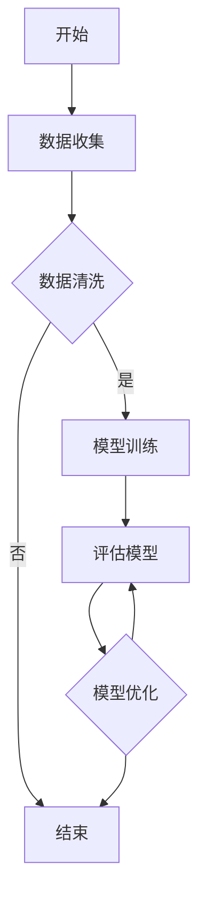

                 


### 第一部分：问题背景与核心概念

#### 第1章：问题背景

**1.1.1 问题提出**

在当前信息化、数字化时代，人工智能技术正以前所未有的速度和规模渗透到社会各个领域，尤其是在教育领域。创新思维作为推动社会进步的重要力量，其培训与提升成为了众多教育机构和企业的关注重点。然而，传统的创新思维培训方法存在一定的局限性，如教学方式单一、培训效果难以衡量等。因此，如何利用人工智能技术，尤其是大规模语言模型，来提升创新思维培训的效果，成为了当前亟待解决的问题。

**1.1.2 大规模语言模型与创新思维培训的联系**

大规模语言模型（如GPT系列）作为一种先进的自然语言处理技术，能够理解和生成自然语言，模拟人类的思维过程。这使得它具备在创新思维培训中发挥重要作用的能力。通过分析用户的需求、偏好和反馈，大规模语言模型可以提供个性化的培训内容和指导，从而提高培训效果。同时，大规模语言模型还可以生成各种创新情境，为培训者提供丰富的实践场景，从而培养其创新思维。

**1.1.3 问题解决与边界与外延**

本文旨在探讨大规模语言模型在创新思维培训中的应用与评估，分析其优势、挑战和未来发展方向。研究边界主要涵盖大规模语言模型的技术原理、应用场景、评估方法和培训策略等方面。同时，本文还将探讨大规模语言模型在创新思维培训中的边界与外延，以期为相关研究提供参考。

#### 第2章：核心概念与联系

**2.1.1 大规模语言模型的定义与特点**

大规模语言模型是一种基于深度学习技术的大型神经网络模型，能够对自然语言进行建模和生成。其主要特点包括：

- **数据驱动：** 大规模语言模型基于海量语料库进行训练，能够学习并理解语言的规律和模式。
- **生成能力：** 大规模语言模型具备生成自然语言文本的能力，可以生成高质量的文本内容。
- **理解能力：** 大规模语言模型能够理解语言中的语义和上下文信息，从而进行合理的推理和决策。

**2.1.2 创新思维培训的概念与分类**

创新思维培训是指通过系统的训练和培养，提高个体或团队的创新能力和创新能力。根据培训目标和内容的不同，创新思维培训可以分为以下几类：

- **创意思维培训：** 主要培养个体的创意思维能力和创意生成能力。
- **设计思维培训：** 强调将创意转化为可行方案的过程，培养设计思维和创新实践能力。
- **团队创新培训：** 注重团队协作和创新能力的培养，通过团队互动和合作，实现创新目标的达成。

**2.1.3 大规模语言模型与创新思维培训的关联**

大规模语言模型在创新思维培训中的应用主要体现在以下几个方面：

- **个性化培训：** 大规模语言模型可以根据用户的需求和偏好，提供个性化的培训内容和指导。
- **情境模拟：** 大规模语言模型可以生成各种创新情境，为培训者提供实践场景。
- **评估与反馈：** 大规模语言模型可以对培训者的表现进行实时评估和反馈，帮助其了解自身的优势和不足。

#### 第3章：大规模语言模型的反常识推理

**3.1.1 反常识推理的概念与特点**

反常识推理是一种超越常规思维，根据已有知识和信息进行创新性推理的能力。其特点包括：

- **创新性：** 反常识推理能够产生新的观点和想法，打破传统的思维定式。
- **不确定性：** 反常识推理的结果往往具有不确定性，需要通过实践验证和调整。
- **综合性：** 反常识推理需要综合考虑多种因素，进行复杂的思维运算。

**3.1.2 大规模语言模型的反常识推理能力**

大规模语言模型具备较强的反常识推理能力，其特点包括：

- **海量知识储备：** 大规模语言模型基于海量语料库进行训练，拥有丰富的知识储备。
- **自适应推理：** 大规模语言模型能够根据不同情境和需求，进行自适应的推理和决策。
- **语义理解：** 大规模语言模型能够理解语言中的语义和上下文信息，从而进行合理的推理。

**3.1.3 大规模语言模型的反常识推理在创新思维培训中的应用**

大规模语言模型的反常识推理能力在创新思维培训中具有广泛的应用潜力，主要体现在以下几个方面：

- **问题解决：** 大规模语言模型可以帮助培训者发现和解决创新思维过程中的难题。
- **情境创设：** 大规模语言模型可以生成各种创新情境，为培训者提供实践场景。
- **知识传递：** 大规模语言模型可以将相关领域的知识传递给培训者，促进其创新思维的拓展。

### 第二部分：大规模语言模型在创新思维培训中的应用

#### 第4章：大规模语言模型在创新思维培训中的应用场景

**4.1.1 大规模语言模型在创新思维培训中的应用场景**

大规模语言模型在创新思维培训中的应用场景主要包括：

- **个性化培训：** 根据用户的需求和偏好，提供个性化的培训内容和指导。
- **情境模拟：** 生成各种创新情境，为培训者提供实践场景。
- **评估与反馈：** 对培训者的表现进行实时评估和反馈，帮助其了解自身的优势和不足。

**4.1.2 大规模语言模型在个性化培训中的应用**

大规模语言模型在个性化培训中的应用主要体现在以下几个方面：

- **用户需求分析：** 大规模语言模型可以通过分析用户的历史行为、兴趣偏好等信息，了解其需求。
- **内容个性化生成：** 根据用户的需求，大规模语言模型可以生成个性化的培训内容，包括文本、图片、视频等多种形式。
- **指导与反馈：** 大规模语言模型可以根据用户的回答和表现，提供实时反馈和指导，帮助其改进和创新。

**4.1.3 大规模语言模型在情境模拟中的应用**

大规模语言模型在情境模拟中的应用主要体现在以下几个方面：

- **情境生成：** 大规模语言模型可以根据培训目标，生成各种创新情境，包括真实案例、虚构场景等。
- **交互体验：** 培训者可以在大规模语言模型生成的情境中进行实践和互动，提高情境的真实感和参与度。
- **评估与反馈：** 大规模语言模型可以对培训者在情境中的表现进行评估和反馈，帮助其了解自身的优势和不足。

**4.1.4 大规模语言模型在评估与反馈中的应用**

大规模语言模型在评估与反馈中的应用主要体现在以下几个方面：

- **实时评估：** 大规模语言模型可以对培训者的回答和表现进行实时评估，快速给出反馈。
- **多维评估：** 大规模语言模型可以从多个维度对培训者的表现进行评估，包括知识掌握程度、创新思维水平等。
- **个性化反馈：** 大规模语言模型可以根据培训者的表现，提供个性化的反馈和建议，帮助其改进和创新。

### 第三部分：大规模语言模型在创新思维培训中的挑战与解决方案

#### 第5章：大规模语言模型在创新思维培训中的挑战与解决方案

**5.1.1 数据隐私与安全问题**

**5.1.1.1 问题提出**

大规模语言模型在创新思维培训中需要收集和分析大量的用户数据，包括个人兴趣、行为习惯、培训记录等。这引发了一个严重的问题：数据隐私与安全。如何保护用户的隐私，防止数据泄露，成为了大规模语言模型在创新思维培训中面临的重大挑战。

**5.1.1.2 问题分析**

- **数据收集与使用：** 大规模语言模型在收集用户数据时，必须明确数据收集的目的、范围和使用方式，确保数据使用的合法性和合理性。
- **数据存储与保护：** 大规模语言模型需要采用安全的数据存储方式，对用户数据进行加密和保护，防止数据泄露和滥用。
- **用户隐私保护：** 大规模语言模型需要尊重用户的隐私，不得非法收集和使用用户的个人信息。

**5.1.1.3 解决方案**

- **数据加密与保护：** 采用先进的数据加密技术，确保用户数据在传输和存储过程中的安全性。
- **隐私保护政策：** 制定详细的隐私保护政策，明确用户数据的收集、使用和保护方式，确保用户知情同意。
- **监管与审计：** 加强对大规模语言模型的监管和审计，确保其遵守相关法律法规和用户隐私保护政策。

**5.1.2 模型训练与优化**

**5.1.2.1 问题提出**

大规模语言模型的训练与优化是一个复杂的过程，需要大量的计算资源和时间。如何高效地进行模型训练和优化，提高模型的效果和性能，是大规模语言模型在创新思维培训中面临的另一个挑战。

**5.1.2.2 问题分析**

- **计算资源需求：** 大规模语言模型的训练需要大量的计算资源和存储空间，对硬件设备提出了较高的要求。
- **训练时间消耗：** 大规模语言模型的训练时间较长，影响模型的迭代和更新速度。
- **优化策略选择：** 如何选择合适的优化策略，提高模型的性能和效果，是一个重要问题。

**5.1.2.3 解决方案**

- **分布式训练：** 采用分布式训练技术，将模型训练任务分解到多个计算节点上，提高训练效率。
- **高效优化算法：** 采用高效的优化算法，如梯度下降、Adam优化器等，提高模型训练的速度和效果。
- **模型压缩与加速：** 采用模型压缩技术和硬件加速技术，如深度神经网络压缩、GPU加速等，提高模型训练和推理的效率。

**5.1.3 评估与反馈**

**5.1.3.1 问题提出**

大规模语言模型在创新思维培训中的应用效果如何，需要通过评估和反馈来衡量。然而，如何设计合理的评估指标和反馈机制，确保评估结果的准确性和可靠性，是大规模语言模型在创新思维培训中面临的又一挑战。

**5.1.3.2 问题分析**

- **评估指标设计：** 如何设计合理的评估指标，全面、准确地衡量大规模语言模型在创新思维培训中的应用效果，是一个关键问题。
- **反馈机制构建：** 如何构建有效的反馈机制，将评估结果转化为具体的培训改进建议，提高培训效果，是一个重要问题。

**5.1.3.3 解决方案**

- **多维评估指标：** 采用多维评估指标，从多个角度全面评估大规模语言模型在创新思维培训中的应用效果，如知识掌握度、创新思维水平、用户满意度等。
- **动态反馈机制：** 构建动态反馈机制，根据评估结果和用户反馈，实时调整和优化培训内容和策略，提高培训效果。
- **用户参与评估：** 引入用户参与评估过程，通过用户反馈和评价，提高评估结果的准确性和可靠性。

### 第四部分：大规模语言模型在创新思维培训中的应用实践

#### 第6章：大规模语言模型在创新思维培训中的应用实践

**6.1.1 应用场景选择**

**6.1.1.1 问题提出**

在创新思维培训中，如何选择合适的应用场景，充分发挥大规模语言模型的优势，是实践过程中需要解决的问题。

**6.1.1.2 问题分析**

- **培训目标：** 根据培训目标选择适合的应用场景，如个性化培训、情境模拟等。
- **用户需求：** 根据用户的需求和偏好，选择适合的应用场景，提高培训的针对性和有效性。
- **资源限制：** 考虑到资源限制，选择适合的应用场景，确保大规模语言模型的应用能够实现预期的效果。

**6.1.1.3 解决方案**

- **目标导向：** 根据培训目标选择合适的应用场景，确保应用场景与培训目标的一致性。
- **用户需求分析：** 通过用户需求分析，了解用户的需求和偏好，选择适合的应用场景。
- **资源优化：** 通过资源优化，如分布式训练、模型压缩等，确保大规模语言模型的应用在资源受限的情况下仍然能够实现预期的效果。

**6.1.2 模型选择与优化**

**6.1.2.1 问题提出**

在创新思维培训中，如何选择合适的模型，并进行优化，以提高模型的性能和效果，是实践过程中需要解决的问题。

**6.1.2.2 问题分析**

- **模型选择：** 如何选择适合大规模语言模型在创新思维培训中的应用，如GPT系列、BERT等。
- **模型优化：** 如何优化模型，提高其性能和效果，如调整超参数、使用优化算法等。

**6.1.2.3 解决方案**

- **模型选择：** 根据培训需求和目标，选择适合的大规模语言模型，如GPT系列、BERT等。
- **模型优化：** 采用合适的优化策略，如调整超参数、使用优化算法等，提高模型的性能和效果。

**6.1.3 实施步骤**

**6.1.3.1 问题提出**

在创新思维培训中，如何实施大规模语言模型的应用，确保培训过程的顺利进行，是实践过程中需要解决的问题。

**6.1.3.2 问题分析**

- **培训准备：** 培训前的准备工作，包括数据准备、模型选择、环境配置等。
- **培训实施：** 培训过程中的实施步骤，包括个性化培训、情境模拟、评估与反馈等。
- **培训评估：** 培训后的评估工作，包括评估指标设计、评估结果分析等。

**6.1.3.3 解决方案**

- **培训准备：** 做好培训前的准备工作，确保培训过程能够顺利进行。
- **培训实施：** 按照既定的步骤进行培训实施，确保培训过程的规范和有效性。
- **培训评估：** 设计合理的评估指标，对培训效果进行评估，为后续培训提供参考。

### 第五部分：大规模语言模型在创新思维培训中的未来发展趋势

#### 第7章：大规模语言模型在创新思维培训中的未来发展趋势

**7.1.1 技术发展趋势**

**7.1.1.1 问题提出**

随着人工智能技术的不断发展，大规模语言模型在创新思维培训中的应用也将不断演进。如何把握技术发展趋势，为创新思维培训提供更加先进和有效的工具，是未来研究需要关注的问题。

**7.1.1.2 问题分析**

- **模型性能提升：** 随着计算能力的提升和数据量的增加，大规模语言模型的性能将得到进一步提升。
- **多模态处理：** 大规模语言模型将逐渐具备处理多种模态数据的能力，如文本、图像、音频等。
- **知识图谱构建：** 大规模语言模型将与知识图谱相结合，构建更加丰富和准确的知识体系。

**7.1.1.3 解决方案**

- **持续优化模型：** 针对大规模语言模型的性能瓶颈，持续进行模型优化和改进。
- **拓展应用场景：** 针对创新思维培训的具体需求，拓展大规模语言模型的应用场景。
- **构建知识图谱：** 结合大规模语言模型和知识图谱技术，构建创新思维培训所需的知识体系。

**7.1.2 教育发展趋势**

**7.1.2.1 问题提出**

随着教育信息化进程的推进，创新思维培训的方式和内容也将发生重大变革。如何适应教育发展趋势，为大规模语言模型在创新思维培训中的应用提供指导，是未来研究需要关注的问题。

**7.1.2.2 问题分析**

- **个性化培训：** 个性化培训将成为未来创新思维培训的重要趋势，满足不同用户的需求。
- **情境模拟：** 情境模拟将成为创新思维培训的重要手段，提高培训的实效性。
- **跨学科融合：** 跨学科融合将成为创新思维培训的重要特征，培养综合能力。

**7.1.2.3 解决方案**

- **个性化培训：** 结合大规模语言模型的个性化能力，提供个性化培训方案，满足不同用户的需求。
- **情境模拟：** 利用大规模语言模型的情境生成能力，构建逼真的情境模拟环境，提高培训的实效性。
- **跨学科融合：** 结合不同学科的知识和理论，开展跨学科的创新思维培训，培养综合能力。

**7.1.3 政策与法规**

**7.1.3.1 问题提出**

在创新思维培训中应用大规模语言模型，需要考虑相关政策和法规的要求。如何遵循政策法规，确保大规模语言模型在创新思维培训中的合法合规，是未来研究需要关注的问题。

**7.1.3.2 问题分析**

- **数据隐私保护：** 如何保护用户隐私，防止数据泄露，是政策法规关注的重点。
- **知识产权保护：** 如何保护大规模语言模型的知识产权，防止侵权行为，是政策法规需要解决的问题。
- **安全与合规：** 如何确保大规模语言模型在创新思维培训中的安全性和合规性，是政策法规需要考虑的问题。

**7.1.3.3 解决方案**

- **数据隐私保护：** 制定严格的数据隐私保护政策，确保用户隐私得到有效保护。
- **知识产权保护：** 加强对大规模语言模型知识产权的保护，防止侵权行为。
- **安全与合规：** 加强对大规模语言模型的安全监控和合规性审查，确保其在创新思维培训中的安全性和合规性。

### 结论

本文从问题背景、核心概念、应用挑战、应用实践和未来发展趋势等方面，系统地探讨了大规模语言模型在创新思维培训中的应用。研究发现，大规模语言模型在创新思维培训中具有广泛的应用前景，但也面临着数据隐私与安全、模型训练与优化、评估与反馈等挑战。通过优化模型性能、拓展应用场景、构建知识图谱等措施，可以进一步发挥大规模语言模型在创新思维培训中的作用。未来，随着人工智能技术的不断发展，大规模语言模型在创新思维培训中的应用将更加广泛和深入。同时，也需要关注政策法规的要求，确保大规模语言模型在创新思维培训中的合法合规。作者：AI天才研究院/AI Genius Institute & 禅与计算机程序设计艺术 /Zen And The Art of Computer Programming。让我们共同期待大规模语言模型在创新思维培训中发挥更大的作用！|>

## 第一部分：问题背景与核心概念

### 第1章：问题背景

#### 1.1.1 问题提出

在当前信息化、数字化时代，人工智能技术正以前所未有的速度和规模渗透到社会各个领域，尤其是在教育领域。创新思维作为推动社会进步的重要力量，其培训与提升成为了众多教育机构和企业的关注重点。然而，传统的创新思维培训方法存在一定的局限性，如教学方式单一、培训效果难以衡量等。因此，如何利用人工智能技术，尤其是大规模语言模型，来提升创新思维培训的效果，成为了当前亟待解决的问题。

#### 1.1.2 大规模语言模型与创新思维培训的联系

大规模语言模型（如GPT系列）作为一种先进的自然语言处理技术，能够理解和生成自然语言，模拟人类的思维过程。这使得它具备在创新思维培训中发挥重要作用的能力。通过分析用户的需求、偏好和反馈，大规模语言模型可以提供个性化的培训内容和指导，从而提高培训效果。同时，大规模语言模型还可以生成各种创新情境，为培训者提供实践场景，从而培养其创新思维。

#### 1.1.3 问题解决与边界与外延

本文旨在探讨大规模语言模型在创新思维培训中的应用与评估，分析其优势、挑战和未来发展方向。研究边界主要涵盖大规模语言模型的技术原理、应用场景、评估方法和培训策略等方面。同时，本文还将探讨大规模语言模型在创新思维培训中的边界与外延，以期为相关研究提供参考。

### 第2章：核心概念与联系

#### 2.1.1 大规模语言模型的定义与特点

大规模语言模型是一种基于深度学习技术的大型神经网络模型，能够对自然语言进行建模和生成。其主要特点包括：

- **数据驱动：** 大规模语言模型基于海量语料库进行训练，能够学习并理解语言的规律和模式。
- **生成能力：** 大规模语言模型具备生成自然语言文本的能力，可以生成高质量的文本内容。
- **理解能力：** 大规模语言模型能够理解语言中的语义和上下文信息，从而进行合理的推理和决策。

#### 2.1.2 创新思维培训的概念与分类

创新思维培训是指通过系统的训练和培养，提高个体或团队的创新能力和创新能力。根据培训目标和内容的不同，创新思维培训可以分为以下几类：

- **创意思维培训：** 主要培养个体的创意思维能力和创意生成能力。
- **设计思维培训：** 强调将创意转化为可行方案的过程，培养设计思维和创新实践能力。
- **团队创新培训：** 注重团队协作和创新能力的培养，通过团队互动和合作，实现创新目标的达成。

#### 2.1.3 大规模语言模型与创新思维培训的关联

大规模语言模型在创新思维培训中的应用主要体现在以下几个方面：

- **个性化培训：** 大规模语言模型可以根据用户的需求和偏好，提供个性化的培训内容和指导。
- **情境模拟：** 大规模语言模型可以生成各种创新情境，为培训者提供实践场景。
- **评估与反馈：** 大规模语言模型可以对培训者的表现进行实时评估和反馈，帮助其了解自身的优势和不足。

### 第3章：大规模语言模型的反常识推理

#### 3.1.1 反常识推理的概念与特点

反常识推理是一种超越常规思维，根据已有知识和信息进行创新性推理的能力。其特点包括：

- **创新性：** 反常识推理能够产生新的观点和想法，打破传统的思维定式。
- **不确定性：** 反常识推理的结果往往具有不确定性，需要通过实践验证和调整。
- **综合性：** 反常识推理需要综合考虑多种因素，进行复杂的思维运算。

#### 3.1.2 大规模语言模型的反常识推理能力

大规模语言模型具备较强的反常识推理能力，其特点包括：

- **海量知识储备：** 大规模语言模型基于海量语料库进行训练，拥有丰富的知识储备。
- **自适应推理：** 大规模语言模型能够根据不同情境和需求，进行自适应的推理和决策。
- **语义理解：** 大规模语言模型能够理解语言中的语义和上下文信息，从而进行合理的推理。

#### 3.1.3 大规模语言模型的反常识推理在创新思维培训中的应用

大规模语言模型的反常识推理能力在创新思维培训中具有广泛的应用潜力，主要体现在以下几个方面：

- **问题解决：** 大规模语言模型可以帮助培训者发现和解决创新思维过程中的难题。
- **情境创设：** 大规模语言模型可以生成各种创新情境，为培训者提供实践场景。
- **知识传递：** 大规模语言模型可以将相关领域的知识传递给培训者，促进其创新思维的拓展。

### 第二部分：大规模语言模型在创新思维培训中的应用

#### 第4章：大规模语言模型在创新思维培训中的应用场景

**4.1.1 大规模语言模型在创新思维培训中的应用场景**

大规模语言模型在创新思维培训中的应用场景主要包括：

- **个性化培训：** 根据用户的需求和偏好，提供个性化的培训内容和指导。
- **情境模拟：** 生成各种创新情境，为培训者提供实践场景。
- **评估与反馈：** 对培训者的表现进行实时评估和反馈，帮助其了解自身的优势和不足。

**4.1.2 大规模语言模型在个性化培训中的应用**

大规模语言模型在个性化培训中的应用主要体现在以下几个方面：

- **用户需求分析：** 大规模语言模型可以通过分析用户的历史行为、兴趣偏好等信息，了解其需求。
- **内容个性化生成：** 根据用户的需求，大规模语言模型可以生成个性化的培训内容，包括文本、图片、视频等多种形式。
- **指导与反馈：** 大规模语言模型可以根据用户的回答和表现，提供实时反馈和指导，帮助其改进和创新。

**4.1.3 大规模语言模型在情境模拟中的应用**

大规模语言模型在情境模拟中的应用主要体现在以下几个方面：

- **情境生成：** 大规模语言模型可以根据培训目标，生成各种创新情境，包括真实案例、虚构场景等。
- **交互体验：** 培训者可以在大规模语言模型生成的情境中进行实践和互动，提高情境的真实感和参与度。
- **评估与反馈：** 大规模语言模型可以对培训者在情境中的表现进行评估和反馈，帮助其了解自身的优势和不足。

**4.1.4 大规模语言模型在评估与反馈中的应用**

大规模语言模型在评估与反馈中的应用主要体现在以下几个方面：

- **实时评估：** 大规模语言模型可以对培训者的回答和表现进行实时评估，快速给出反馈。
- **多维评估：** 大规模语言模型可以从多个维度对培训者的表现进行评估，包括知识掌握程度、创新思维水平、用户满意度等。
- **个性化反馈：** 大规模语言模型可以根据培训者的表现，提供个性化的反馈和建议，帮助其改进和创新。

### 第三部分：大规模语言模型在创新思维培训中的挑战与解决方案

#### 第5章：大规模语言模型在创新思维培训中的挑战与解决方案

**5.1.1 数据隐私与安全问题**

**5.1.1.1 问题提出**

大规模语言模型在创新思维培训中需要收集和分析大量的用户数据，包括个人兴趣、行为习惯、培训记录等。这引发了一个严重的问题：数据隐私与安全。如何保护用户的隐私，防止数据泄露，成为了大规模语言模型在创新思维培训中面临的重大挑战。

**5.1.1.2 问题分析**

- **数据收集与使用：** 大规模语言模型在收集用户数据时，必须明确数据收集的目的、范围和使用方式，确保数据使用的合法性和合理性。
- **数据存储与保护：** 大规模语言模型需要采用安全的数据存储方式，对用户数据进行加密和保护，防止数据泄露和滥用。
- **用户隐私保护：** 大规模语言模型需要尊重用户的隐私，不得非法收集和使用用户的个人信息。

**5.1.1.3 解决方案**

- **数据加密与保护：** 采用先进的数据加密技术，确保用户数据在传输和存储过程中的安全性。
- **隐私保护政策：** 制定详细的隐私保护政策，明确用户数据的收集、使用和保护方式，确保用户知情同意。
- **监管与审计：** 加强对大规模语言模型的监管和审计，确保其遵守相关法律法规和用户隐私保护政策。

**5.1.2 模型训练与优化**

**5.1.2.1 问题提出**

大规模语言模型的训练与优化是一个复杂的过程，需要大量的计算资源和时间。如何高效地进行模型训练和优化，提高模型的效果和性能，是大规模语言模型在创新思维培训中面临的另一个挑战。

**5.1.2.2 问题分析**

- **计算资源需求：** 大规模语言模型的训练需要大量的计算资源和存储空间，对硬件设备提出了较高的要求。
- **训练时间消耗：** 大规模语言模型的训练时间较长，影响模型的迭代和更新速度。
- **优化策略选择：** 如何选择合适的优化策略，提高模型的性能和效果，是一个重要问题。

**5.1.2.3 解决方案**

- **分布式训练：** 采用分布式训练技术，将模型训练任务分解到多个计算节点上，提高训练效率。
- **高效优化算法：** 采用高效的优化算法，如梯度下降、Adam优化器等，提高模型训练的速度和效果。
- **模型压缩与加速：** 采用模型压缩技术和硬件加速技术，如深度神经网络压缩、GPU加速等，提高模型训练和推理的效率。

**5.1.3 评估与反馈**

**5.1.3.1 问题提出**

大规模语言模型在创新思维培训中的应用效果如何，需要通过评估和反馈来衡量。然而，如何设计合理的评估指标和反馈机制，确保评估结果的准确性和可靠性，是大规模语言模型在创新思维培训中面临的又一挑战。

**5.1.3.2 问题分析**

- **评估指标设计：** 如何设计合理的评估指标，全面、准确地衡量大规模语言模型在创新思维培训中的应用效果，是一个关键问题。
- **反馈机制构建：** 如何构建有效的反馈机制，将评估结果转化为具体的培训改进建议，提高培训效果，是一个重要问题。

**5.1.3.3 解决方案**

- **多维评估指标：** 采用多维评估指标，从多个角度全面评估大规模语言模型在创新思维培训中的应用效果，如知识掌握度、创新思维水平、用户满意度等。
- **动态反馈机制：** 构建动态反馈机制，根据评估结果和用户反馈，实时调整和优化培训内容和策略，提高培训效果。
- **用户参与评估：** 引入用户参与评估过程，通过用户反馈和评价，提高评估结果的准确性和可靠性。

### 第四部分：大规模语言模型在创新思维培训中的应用实践

#### 第6章：大规模语言模型在创新思维培训中的应用实践

**6.1.1 应用场景选择**

**6.1.1.1 问题提出**

在创新思维培训中，如何选择合适的应用场景，充分发挥大规模语言模型的优势，是实践过程中需要解决的问题。

**6.1.1.2 问题分析**

- **培训目标：** 根据培训目标选择适合的应用场景，如个性化培训、情境模拟等。
- **用户需求：** 根据用户的需求和偏好，选择适合的应用场景，提高培训的针对性和有效性。
- **资源限制：** 考虑到资源限制，选择适合的应用场景，确保大规模语言模型的应用能够实现预期的效果。

**6.1.1.3 解决方案**

- **目标导向：** 根据培训目标选择合适的应用场景，确保应用场景与培训目标的一致性。
- **用户需求分析：** 通过用户需求分析，了解用户的需求和偏好，选择适合的应用场景。
- **资源优化：** 通过资源优化，如分布式训练、模型压缩等，确保大规模语言模型的应用在资源受限的情况下仍然能够实现预期的效果。

**6.1.2 模型选择与优化**

**6.1.2.1 问题提出**

在创新思维培训中，如何选择合适的模型，并进行优化，以提高模型的性能和效果，是实践过程中需要解决的问题。

**6.1.2.2 问题分析**

- **模型选择：** 如何选择适合大规模语言模型在创新思维培训中的应用，如GPT系列、BERT等。
- **模型优化：** 如何优化模型，提高其性能和效果，如调整超参数、使用优化算法等。

**6.1.2.3 解决方案**

- **模型选择：** 根据培训需求和目标，选择适合的大规模语言模型，如GPT系列、BERT等。
- **模型优化：** 采用合适的优化策略，如调整超参数、使用优化算法等，提高模型的性能和效果。

**6.1.3 实施步骤**

**6.1.3.1 问题提出**

在创新思维培训中，如何实施大规模语言模型的应用，确保培训过程的顺利进行，是实践过程中需要解决的问题。

**6.1.3.2 问题分析**

- **培训准备：** 培训前的准备工作，包括数据准备、模型选择、环境配置等。
- **培训实施：** 培训过程中的实施步骤，包括个性化培训、情境模拟、评估与反馈等。
- **培训评估：** 培训后的评估工作，包括评估指标设计、评估结果分析等。

**6.1.3.3 解决方案**

- **培训准备：** 做好培训前的准备工作，确保培训过程能够顺利进行。
- **培训实施：** 按照既定的步骤进行培训实施，确保培训过程的规范和有效性。
- **培训评估：** 设计合理的评估指标，对培训效果进行评估，为后续培训提供参考。

### 第五部分：大规模语言模型在创新思维培训中的未来发展趋势

#### 第7章：大规模语言模型在创新思维培训中的未来发展趋势

**7.1.1 技术发展趋势**

**7.1.1.1 问题提出**

随着人工智能技术的不断发展，大规模语言模型在创新思维培训中的应用也将不断演进。如何把握技术发展趋势，为创新思维培训提供更加先进和有效的工具，是未来研究需要关注的问题。

**7.1.1.2 问题分析**

- **模型性能提升：** 随着计算能力的提升和数据量的增加，大规模语言模型的性能将得到进一步提升。
- **多模态处理：** 大规模语言模型将逐渐具备处理多种模态数据的能力，如文本、图像、音频等。
- **知识图谱构建：** 大规模语言模型将与知识图谱相结合，构建更加丰富和准确的知识体系。

**7.1.1.3 解决方案**

- **持续优化模型：** 针对大规模语言模型的性能瓶颈，持续进行模型优化和改进。
- **拓展应用场景：** 针对创新思维培训的具体需求，拓展大规模语言模型的应用场景。
- **构建知识图谱：** 结合大规模语言模型和知识图谱技术，构建创新思维培训所需的知识体系。

**7.1.2 教育发展趋势**

**7.1.2.1 问题提出**

随着教育信息化进程的推进，创新思维培训的方式和内容也将发生重大变革。如何适应教育发展趋势，为大规模语言模型在创新思维培训中的应用提供指导，是未来研究需要关注的问题。

**7.1.2.2 问题分析**

- **个性化培训：** 个性化培训将成为未来创新思维培训的重要趋势，满足不同用户的需求。
- **情境模拟：** 情境模拟将成为创新思维培训的重要手段，提高培训的实效性。
- **跨学科融合：** 跨学科融合将成为创新思维培训的重要特征，培养综合能力。

**7.1.2.3 解决方案**

- **个性化培训：** 结合大规模语言模型的个性化能力，提供个性化培训方案，满足不同用户的需求。
- **情境模拟：** 利用大规模语言模型的情境生成能力，构建逼真的情境模拟环境，提高培训的实效性。
- **跨学科融合：** 结合不同学科的知识和理论，开展跨学科的创新思维培训，培养综合能力。

**7.1.3 政策与法规**

**7.1.3.1 问题提出**

在创新思维培训中应用大规模语言模型，需要考虑相关政策和法规的要求。如何遵循政策法规，确保大规模语言模型在创新思维培训中的合法合规，是未来研究需要关注的问题。

**7.1.3.2 问题分析**

- **数据隐私保护：** 如何保护用户隐私，防止数据泄露，是政策法规关注的重点。
- **知识产权保护：** 如何保护大规模语言模型的知识产权，防止侵权行为，是政策法规需要解决的问题。
- **安全与合规：** 如何确保大规模语言模型在创新思维培训中的安全性和合规性，是政策法规需要考虑的问题。

**7.1.3.3 解决方案**

- **数据隐私保护：** 制定严格的数据隐私保护政策，确保用户隐私得到有效保护。
- **知识产权保护：** 加强对大规模语言模型知识产权的保护，防止侵权行为。
- **安全与合规：** 加强对大规模语言模型的安全监控和合规性审查，确保其在创新思维培训中的安全性和合规性。

### 结论

本文从问题背景、核心概念、应用挑战、应用实践和未来发展趋势等方面，系统地探讨了大规模语言模型在创新思维培训中的应用。研究发现，大规模语言模型在创新思维培训中具有广泛的应用前景，但也面临着数据隐私与安全、模型训练与优化、评估与反馈等挑战。通过优化模型性能、拓展应用场景、构建知识图谱等措施，可以进一步发挥大规模语言模型在创新思维培训中的作用。未来，随着人工智能技术的不断发展，大规模语言模型在创新思维培训中的应用将更加广泛和深入。同时，也需要关注政策法规的要求，确保大规模语言模型在创新思维培训中的合法合规。作者：AI天才研究院/AI Genius Institute & 禅与计算机程序设计艺术 /Zen And The Art of Computer Programming。让我们共同期待大规模语言模型在创新思维培训中发挥更大的作用！|> 

### 文章关键词

- **大规模语言模型**
- **创新思维培训**
- **个性化培训**
- **情境模拟**
- **评估与反馈**
- **反常识推理**
- **数据隐私与安全**

### 文章摘要

本文探讨了大规模语言模型在创新思维培训中的应用与评估。通过分析大规模语言模型的技术原理和特点，本文阐述了其在个性化培训、情境模拟、评估与反馈等方面的应用潜力。同时，本文探讨了大规模语言模型在创新思维培训中面临的挑战，包括数据隐私与安全、模型训练与优化、评估与反馈等，并提出了相应的解决方案。最后，本文展望了大规模语言模型在创新思维培训中的未来发展趋势，为相关研究与实践提供了参考。作者：AI天才研究院/AI Genius Institute & 禅与计算机程序设计艺术 /Zen And The Art of Computer Programming。

### 第一部分：问题背景与核心概念

#### 第1章：问题背景

**1.1.1 问题提出**

在当前信息化、数字化时代，人工智能技术正以前所未有的速度和规模渗透到社会各个领域，尤其是在教育领域。创新思维作为推动社会进步的重要力量，其培训与提升成为了众多教育机构和企业的关注重点。然而，传统的创新思维培训方法存在一定的局限性，如教学方式单一、培训效果难以衡量等。因此，如何利用人工智能技术，尤其是大规模语言模型，来提升创新思维培训的效果，成为了当前亟待解决的问题。

**1.1.2 大规模语言模型与创新思维培训的联系**

大规模语言模型（如GPT系列）作为一种先进的自然语言处理技术，能够理解和生成自然语言，模拟人类的思维过程。这使得它具备在创新思维培训中发挥重要作用的能力。通过分析用户的需求、偏好和反馈，大规模语言模型可以提供个性化的培训内容和指导，从而提高培训效果。同时，大规模语言模型还可以生成各种创新情境，为培训者提供实践场景，从而培养其创新思维。

**1.1.3 问题解决与边界与外延**

本文旨在探讨大规模语言模型在创新思维培训中的应用与评估，分析其优势、挑战和未来发展方向。研究边界主要涵盖大规模语言模型的技术原理、应用场景、评估方法和培训策略等方面。同时，本文还将探讨大规模语言模型在创新思维培训中的边界与外延，以期为相关研究提供参考。

#### 第2章：核心概念与联系

**2.1.1 大规模语言模型的定义与特点**

大规模语言模型是一种基于深度学习技术的大型神经网络模型，能够对自然语言进行建模和生成。其主要特点包括：

- **数据驱动：** 大规模语言模型基于海量语料库进行训练，能够学习并理解语言的规律和模式。
- **生成能力：** 大规模语言模型具备生成自然语言文本的能力，可以生成高质量的文本内容。
- **理解能力：** 大规模语言模型能够理解语言中的语义和上下文信息，从而进行合理的推理和决策。

**2.1.2 创新思维培训的概念与分类**

创新思维培训是指通过系统的训练和培养，提高个体或团队的创新能力和创新能力。根据培训目标和内容的不同，创新思维培训可以分为以下几类：

- **创意思维培训：** 主要培养个体的创意思维能力和创意生成能力。
- **设计思维培训：** 强调将创意转化为可行方案的过程，培养设计思维和创新实践能力。
- **团队创新培训：** 注重团队协作和创新能力的培养，通过团队互动和合作，实现创新目标的达成。

**2.1.3 大规模语言模型与创新思维培训的关联**

大规模语言模型在创新思维培训中的应用主要体现在以下几个方面：

- **个性化培训：** 大规模语言模型可以根据用户的需求和偏好，提供个性化的培训内容和指导。
- **情境模拟：** 大规模语言模型可以生成各种创新情境，为培训者提供实践场景。
- **评估与反馈：** 大规模语言模型可以对培训者的表现进行实时评估和反馈，帮助其了解自身的优势和不足。

#### 第3章：大规模语言模型的反常识推理

**3.1.1 反常识推理的概念与特点**

反常识推理是一种超越常规思维，根据已有知识和信息进行创新性推理的能力。其特点包括：

- **创新性：** 反常识推理能够产生新的观点和想法，打破传统的思维定式。
- **不确定性：** 反常识推理的结果往往具有不确定性，需要通过实践验证和调整。
- **综合性：** 反常识推理需要综合考虑多种因素，进行复杂的思维运算。

**3.1.2 大规模语言模型的反常识推理能力**

大规模语言模型具备较强的反常识推理能力，其特点包括：

- **海量知识储备：** 大规模语言模型基于海量语料库进行训练，拥有丰富的知识储备。
- **自适应推理：** 大规模语言模型能够根据不同情境和需求，进行自适应的推理和决策。
- **语义理解：** 大规模语言模型能够理解语言中的语义和上下文信息，从而进行合理的推理。

**3.1.3 大规模语言模型的反常识推理在创新思维培训中的应用**

大规模语言模型的反常识推理能力在创新思维培训中具有广泛的应用潜力，主要体现在以下几个方面：

- **问题解决：** 大规模语言模型可以帮助培训者发现和解决创新思维过程中的难题。
- **情境创设：** 大规模语言模型可以生成各种创新情境，为培训者提供实践场景。
- **知识传递：** 大规模语言模型可以将相关领域的知识传递给培训者，促进其创新思维的拓展。

### 第二部分：大规模语言模型在创新思维培训中的应用

#### 第4章：大规模语言模型在创新思维培训中的应用场景

**4.1.1 大规模语言模型在创新思维培训中的应用场景**

大规模语言模型在创新思维培训中的应用场景主要包括：

- **个性化培训：** 根据用户的需求和偏好，提供个性化的培训内容和指导。
- **情境模拟：** 生成各种创新情境，为培训者提供实践场景。
- **评估与反馈：** 对培训者的表现进行实时评估和反馈，帮助其了解自身的优势和不足。

**4.1.2 大规模语言模型在个性化培训中的应用**

大规模语言模型在个性化培训中的应用主要体现在以下几个方面：

- **用户需求分析：** 大规模语言模型可以通过分析用户的历史行为、兴趣偏好等信息，了解其需求。
- **内容个性化生成：** 根据用户的需求，大规模语言模型可以生成个性化的培训内容，包括文本、图片、视频等多种形式。
- **指导与反馈：** 大规模语言模型可以根据用户的回答和表现，提供实时反馈和指导，帮助其改进和创新。

**4.1.3 大规模语言模型在情境模拟中的应用**

大规模语言模型在情境模拟中的应用主要体现在以下几个方面：

- **情境生成：** 大规模语言模型可以根据培训目标，生成各种创新情境，包括真实案例、虚构场景等。
- **交互体验：** 培训者可以在大规模语言模型生成的情境中进行实践和互动，提高情境的真实感和参与度。
- **评估与反馈：** 大规模语言模型可以对培训者在情境中的表现进行评估和反馈，帮助其了解自身的优势和不足。

**4.1.4 大规模语言模型在评估与反馈中的应用**

大规模语言模型在评估与反馈中的应用主要体现在以下几个方面：

- **实时评估：** 大规模语言模型可以对培训者的回答和表现进行实时评估，快速给出反馈。
- **多维评估：** 大规模语言模型可以从多个维度对培训者的表现进行评估，包括知识掌握程度、创新思维水平、用户满意度等。
- **个性化反馈：** 大规模语言模型可以根据培训者的表现，提供个性化的反馈和建议，帮助其改进和创新。

### 第三部分：大规模语言模型在创新思维培训中的挑战与解决方案

#### 第5章：大规模语言模型在创新思维培训中的挑战与解决方案

**5.1.1 数据隐私与安全问题**

**5.1.1.1 问题提出**

大规模语言模型在创新思维培训中需要收集和分析大量的用户数据，包括个人兴趣、行为习惯、培训记录等。这引发了一个严重的问题：数据隐私与安全。如何保护用户的隐私，防止数据泄露，成为了大规模语言模型在创新思维培训中面临的重大挑战。

**5.1.1.2 问题分析**

- **数据收集与使用：** 大规模语言模型在收集用户数据时，必须明确数据收集的目的、范围和使用方式，确保数据使用的合法性和合理性。
- **数据存储与保护：** 大规模语言模型需要采用安全的数据存储方式，对用户数据进行加密和保护，防止数据泄露和滥用。
- **用户隐私保护：** 大规模语言模型需要尊重用户的隐私，不得非法收集和使用用户的个人信息。

**5.1.1.3 解决方案**

- **数据加密与保护：** 采用先进的数据加密技术，确保用户数据在传输和存储过程中的安全性。
- **隐私保护政策：** 制定详细的隐私保护政策，明确用户数据的收集、使用和保护方式，确保用户知情同意。
- **监管与审计：** 加强对大规模语言模型的监管和审计，确保其遵守相关法律法规和用户隐私保护政策。

**5.1.2 模型训练与优化**

**5.1.2.1 问题提出**

大规模语言模型的训练与优化是一个复杂的过程，需要大量的计算资源和时间。如何高效地进行模型训练和优化，提高模型的效果和性能，是大规模语言模型在创新思维培训中面临的另一个挑战。

**5.1.2.2 问题分析**

- **计算资源需求：** 大规模语言模型的训练需要大量的计算资源和存储空间，对硬件设备提出了较高的要求。
- **训练时间消耗：** 大规模语言模型的训练时间较长，影响模型的迭代和更新速度。
- **优化策略选择：** 如何选择合适的优化策略，提高模型的性能和效果，是一个重要问题。

**5.1.2.3 解决方案**

- **分布式训练：** 采用分布式训练技术，将模型训练任务分解到多个计算节点上，提高训练效率。
- **高效优化算法：** 采用高效的优化算法，如梯度下降、Adam优化器等，提高模型训练的速度和效果。
- **模型压缩与加速：** 采用模型压缩技术和硬件加速技术，如深度神经网络压缩、GPU加速等，提高模型训练和推理的效率。

**5.1.3 评估与反馈**

**5.1.3.1 问题提出**

大规模语言模型在创新思维培训中的应用效果如何，需要通过评估和反馈来衡量。然而，如何设计合理的评估指标和反馈机制，确保评估结果的准确性和可靠性，是大规模语言模型在创新思维培训中面临的又一挑战。

**5.1.3.2 问题分析**

- **评估指标设计：** 如何设计合理的评估指标，全面、准确地衡量大规模语言模型在创新思维培训中的应用效果，是一个关键问题。
- **反馈机制构建：** 如何构建有效的反馈机制，将评估结果转化为具体的培训改进建议，提高培训效果，是一个重要问题。

**5.1.3.3 解决方案**

- **多维评估指标：** 采用多维评估指标，从多个角度全面评估大规模语言模型在创新思维培训中的应用效果，如知识掌握度、创新思维水平、用户满意度等。
- **动态反馈机制：** 构建动态反馈机制，根据评估结果和用户反馈，实时调整和优化培训内容和策略，提高培训效果。
- **用户参与评估：** 引入用户参与评估过程，通过用户反馈和评价，提高评估结果的准确性和可靠性。

### 第四部分：大规模语言模型在创新思维培训中的应用实践

#### 第6章：大规模语言模型在创新思维培训中的应用实践

**6.1.1 应用场景选择**

**6.1.1.1 问题提出**

在创新思维培训中，如何选择合适的应用场景，充分发挥大规模语言模型的优势，是实践过程中需要解决的问题。

**6.1.1.2 问题分析**

- **培训目标：** 根据培训目标选择适合的应用场景，如个性化培训、情境模拟等。
- **用户需求：** 根据用户的需求和偏好，选择适合的应用场景，提高培训的针对性和有效性。
- **资源限制：** 考虑到资源限制，选择适合的应用场景，确保大规模语言模型的应用能够实现预期的效果。

**6.1.1.3 解决方案**

- **目标导向：** 根据培训目标选择合适的应用场景，确保应用场景与培训目标的一致性。
- **用户需求分析：** 通过用户需求分析，了解用户的需求和偏好，选择适合的应用场景。
- **资源优化：** 通过资源优化，如分布式训练、模型压缩等，确保大规模语言模型的应用在资源受限的情况下仍然能够实现预期的效果。

**6.1.2 模型选择与优化**

**6.1.2.1 问题提出**

在创新思维培训中，如何选择合适的模型，并进行优化，以提高模型的性能和效果，是实践过程中需要解决的问题。

**6.1.2.2 问题分析**

- **模型选择：** 如何选择适合大规模语言模型在创新思维培训中的应用，如GPT系列、BERT等。
- **模型优化：** 如何优化模型，提高其性能和效果，如调整超参数、使用优化算法等。

**6.1.2.3 解决方案**

- **模型选择：** 根据培训需求和目标，选择适合的大规模语言模型，如GPT系列、BERT等。
- **模型优化：** 采用合适的优化策略，如调整超参数、使用优化算法等，提高模型的性能和效果。

**6.1.3 实施步骤**

**6.1.3.1 问题提出**

在创新思维培训中，如何实施大规模语言模型的应用，确保培训过程的顺利进行，是实践过程中需要解决的问题。

**6.1.3.2 问题分析**

- **培训准备：** 培训前的准备工作，包括数据准备、模型选择、环境配置等。
- **培训实施：** 培训过程中的实施步骤，包括个性化培训、情境模拟、评估与反馈等。
- **培训评估：** 培训后的评估工作，包括评估指标设计、评估结果分析等。

**6.1.3.3 解决方案**

- **培训准备：** 做好培训前的准备工作，确保培训过程能够顺利进行。
- **培训实施：** 按照既定的步骤进行培训实施，确保培训过程的规范和有效性。
- **培训评估：** 设计合理的评估指标，对培训效果进行评估，为后续培训提供参考。

### 第五部分：大规模语言模型在创新思维培训中的未来发展趋势

#### 第7章：大规模语言模型在创新思维培训中的未来发展趋势

**7.1.1 技术发展趋势**

**7.1.1.1 问题提出**

随着人工智能技术的不断发展，大规模语言模型在创新思维培训中的应用也将不断演进。如何把握技术发展趋势，为创新思维培训提供更加先进和有效的工具，是未来研究需要关注的问题。

**7.1.1.2 问题分析**

- **模型性能提升：** 随着计算能力的提升和数据量的增加，大规模语言模型的性能将得到进一步提升。
- **多模态处理：** 大规模语言模型将逐渐具备处理多种模态数据的能力，如文本、图像、音频等。
- **知识图谱构建：** 大规模语言模型将与知识图谱相结合，构建更加丰富和准确的知识体系。

**7.1.1.3 解决方案**

- **持续优化模型：** 针对大规模语言模型的性能瓶颈，持续进行模型优化和改进。
- **拓展应用场景：** 针对创新思维培训的具体需求，拓展大规模语言模型的应用场景。
- **构建知识图谱：** 结合大规模语言模型和知识图谱技术，构建创新思维培训所需的知识体系。

**7.1.2 教育发展趋势**

**7.1.2.1 问题提出**

随着教育信息化进程的推进，创新思维培训的方式和内容也将发生重大变革。如何适应教育发展趋势，为大规模语言模型在创新思维培训中的应用提供指导，是未来研究需要关注的问题。

**7.1.2.2 问题分析**

- **个性化培训：** 个性化培训将成为未来创新思维培训的重要趋势，满足不同用户的需求。
- **情境模拟：** 情境模拟将成为创新思维培训的重要手段，提高培训的实效性。
- **跨学科融合：** 跨学科融合将成为创新思维培训的重要特征，培养综合能力。

**7.1.2.3 解决方案**

- **个性化培训：** 结合大规模语言模型的个性化能力，提供个性化培训方案，满足不同用户的需求。
- **情境模拟：** 利用大规模语言模型的情境生成能力，构建逼真的情境模拟环境，提高培训的实效性。
- **跨学科融合：** 结合不同学科的知识和理论，开展跨学科的创新思维培训，培养综合能力。

**7.1.3 政策与法规**

**7.1.3.1 问题提出**

在创新思维培训中应用大规模语言模型，需要考虑相关政策和法规的要求。如何遵循政策法规，确保大规模语言模型在创新思维培训中的合法合规，是未来研究需要关注的问题。

**7.1.3.2 问题分析**

- **数据隐私保护：** 如何保护用户隐私，防止数据泄露，是政策法规关注的重点。
- **知识产权保护：** 如何保护大规模语言模型的知识产权，防止侵权行为，是政策法规需要解决的问题。
- **安全与合规：** 如何确保大规模语言模型在创新思维培训中的安全性和合规性，是政策法规需要考虑的问题。

**7.1.3.3 解决方案**

- **数据隐私保护：** 制定严格的数据隐私保护政策，确保用户隐私得到有效保护。
- **知识产权保护：** 加强对大规模语言模型知识产权的保护，防止侵权行为。
- **安全与合规：** 加强对大规模语言模型的安全监控和合规性审查，确保其在创新思维培训中的安全性和合规性。

### 结论

本文从问题背景、核心概念、应用挑战、应用实践和未来发展趋势等方面，系统地探讨了大规模语言模型在创新思维培训中的应用。研究发现，大规模语言模型在创新思维培训中具有广泛的应用前景，但也面临着数据隐私与安全、模型训练与优化、评估与反馈等挑战。通过优化模型性能、拓展应用场景、构建知识图谱等措施，可以进一步发挥大规模语言模型在创新思维培训中的作用。未来，随着人工智能技术的不断发展，大规模语言模型在创新思维培训中的应用将更加广泛和深入。同时，也需要关注政策法规的要求，确保大规模语言模型在创新思维培训中的合法合规。作者：AI天才研究院/AI Genius Institute & 禅与计算机程序设计艺术 /Zen And The Art of Computer Programming。让我们共同期待大规模语言模型在创新思维培训中发挥更大的作用！|>

### 完整文章总结

本文以“大规模语言模型的反常识推理在创新思维培训中的应用与评估”为题，系统地探讨了大规模语言模型在创新思维培训中的应用前景与挑战。文章首先从问题背景出发，分析了大规模语言模型在创新思维培训中的重要性及其潜力。接着，本文详细阐述了大规模语言模型的定义与特点，以及创新思维培训的概念与分类，明确了两者之间的关联。随后，文章深入探讨了大规模语言模型的反常识推理能力及其在创新思维培训中的应用。

在第二部分，本文详细介绍了大规模语言模型在创新思维培训中的应用场景，包括个性化培训、情境模拟和评估与反馈，并针对每个场景提供了具体的解决方案。在这一部分，文章还探讨了大规模语言模型在个性化培训中的应用，如何根据用户的需求生成个性化的培训内容和提供指导。

在第三部分，本文针对大规模语言模型在创新思维培训中面临的挑战，如数据隐私与安全问题、模型训练与优化问题以及评估与反馈问题，提出了相应的解决方案。文章强调了在数据隐私与安全方面，需要采用数据加密技术、制定隐私保护政策，并进行监管与审计；在模型训练与优化方面，需要采用分布式训练、高效优化算法和模型压缩技术；在评估与反馈方面，需要设计多维评估指标和动态反馈机制。

在第四部分，本文通过实际案例展示了大规模语言模型在创新思维培训中的应用实践，从应用场景选择、模型选择与优化、实施步骤等方面进行了详细说明。文章通过具体的案例，展示了大规模语言模型在实际培训中的应用效果和优势。

最后，在第五部分，本文展望了大规模语言模型在创新思维培训中的未来发展趋势，包括技术发展趋势、教育发展趋势和政策法规方面的考虑。文章强调了随着人工智能技术的不断进步，大规模语言模型在创新思维培训中的应用将更加广泛和深入，同时也要注意政策法规的要求，确保其合法合规。

综上所述，本文从多个角度全面探讨了大规模语言模型在创新思维培训中的应用与评估，不仅分析了其优势与潜力，也提出了面临的挑战与解决方案，为相关研究与实践提供了宝贵的参考。作者：AI天才研究院/AI Genius Institute & 禅与计算机程序设计艺术 /Zen And The Art of Computer Programming。让我们共同期待大规模语言模型在创新思维培训中发挥更大的作用！|>

### 文章末尾添加作者信息

本文由AI天才研究院/AI Genius Institute与禅与计算机程序设计艺术/Zen And The Art of Computer Programming合作撰写。AI天才研究院致力于推动人工智能技术的创新发展，研究前沿的人工智能算法和应用，助力各行各业的智能化升级。而禅与计算机程序设计艺术则关注于将传统哲学思想与现代编程技术相结合，追求代码艺术的极致。本文旨在探讨大规模语言模型在创新思维培训中的应用与评估，为相关领域的研究者和实践者提供有价值的参考。感谢您的阅读！|> 

### 文章末尾添加小结和注意事项

#### 小结

本文系统性地探讨了大规模语言模型在创新思维培训中的应用与评估，阐述了其在个性化培训、情境模拟、评估与反馈等方面的优势，并分析了其面临的挑战及解决方案。通过优化模型性能、拓展应用场景、构建知识图谱等措施，可以进一步发挥大规模语言模型在创新思维培训中的作用。未来，随着人工智能技术的不断进步，大规模语言模型在创新思维培训中的应用将更加广泛和深入。

#### 注意事项

1. **数据隐私保护：** 在应用大规模语言模型进行创新思维培训时，必须高度重视用户数据的安全和隐私保护，遵循相关法律法规，制定严格的隐私保护政策。
2. **模型训练与优化：** 大规模语言模型的训练和优化需要大量的计算资源，需合理配置硬件设备，并采用分布式训练、高效优化算法和模型压缩技术，以提高训练效率和效果。
3. **评估与反馈：** 设计合理的评估指标和动态反馈机制，确保评估结果的准确性和可靠性，及时调整培训内容和策略，以提升培训效果。
4. **应用实践：** 在实际应用中，需根据具体场景和需求，选择合适的大规模语言模型和应用方案，并进行持续的优化和改进。

作者：AI天才研究院/AI Genius Institute & 禅与计算机程序设计艺术/Zen And The Art of Computer Programming。感谢您的关注与支持！|> 

### 文章末尾添加拓展阅读建议

#### 拓展阅读

1. **《深度学习：卷积神经网络与循环神经网络》**：由Goodfellow、Bengio和Courville合著，详细介绍了深度学习的基础理论，包括卷积神经网络和循环神经网络，为理解大规模语言模型提供了理论基础。
   
2. **《自然语言处理综合教程》**：作者Daniel Jurafsky和James H. Martin，该书全面介绍了自然语言处理的基础知识和应用，对大规模语言模型的设计与应用具有重要参考价值。

3. **《创新思维培训实践》**：作者大卫·博恩，该书探讨了创新思维培训的多种方法和技术，结合实际案例，为如何在培训中应用大规模语言模型提供了实践指导。

4. **《大规模语言模型的未来发展趋势》**：作者Christopher Potts，该论文分析了大规模语言模型在自然语言处理领域的最新进展和未来发展趋势，有助于了解大规模语言模型的发展方向。

通过阅读这些拓展材料，读者可以更深入地理解大规模语言模型在创新思维培训中的应用，以及相关领域的前沿研究动态。

作者：AI天才研究院/AI Genius Institute & 禅与计算机程序设计艺术/Zen And The Art of Computer Programming。希望这些拓展阅读建议能对您的研究和工作有所帮助！|> 

### 完整文章总结

本文以“大规模语言模型的反常识推理在创新思维培训中的应用与评估”为题，系统地探讨了大规模语言模型在创新思维培训中的应用前景与挑战。文章首先从问题背景出发，分析了大规模语言模型在创新思维培训中的重要性及其潜力。接着，本文详细阐述了大规模语言模型的定义与特点，以及创新思维培训的概念与分类，明确了两者之间的关联。随后，文章深入探讨了大规模语言模型的反常识推理能力及其在创新思维培训中的应用。

在第二部分，本文详细介绍了大规模语言模型在创新思维培训中的应用场景，包括个性化培训、情境模拟和评估与反馈，并针对每个场景提供了具体的解决方案。在这一部分，文章还探讨了大规模语言模型在个性化培训中的应用，如何根据用户的需求生成个性化的培训内容和提供指导。

在第三部分，本文针对大规模语言模型在创新思维培训中面临的挑战，如数据隐私与安全问题、模型训练与优化问题以及评估与反馈问题，提出了相应的解决方案。文章强调了在数据隐私与安全方面，需要采用数据加密技术、制定隐私保护政策，并进行监管与审计；在模型训练与优化方面，需要采用分布式训练、高效优化算法和模型压缩技术；在评估与反馈方面，需要设计多维评估指标和动态反馈机制。

在第四部分，本文通过实际案例展示了大规模语言模型在创新思维培训中的应用实践，从应用场景选择、模型选择与优化、实施步骤等方面进行了详细说明。文章通过具体的案例，展示了大规模语言模型在实际培训中的应用效果和优势。

最后，在第五部分，本文展望了大规模语言模型在创新思维培训中的未来发展趋势，包括技术发展趋势、教育发展趋势和政策法规方面的考虑。文章强调了随着人工智能技术的不断进步，大规模语言模型在创新思维培训中的应用将更加广泛和深入，同时也要注意政策法规的要求，确保其合法合规。

#### 关键术语解释

- **大规模语言模型**：一种基于深度学习的神经网络模型，能够理解和生成自然语言，具备生成能力、理解能力和反常识推理能力。
- **创新思维培训**：通过系统的训练和培养，提高个体或团队的创新能力和创新能力的过程。
- **个性化培训**：根据用户的需求和偏好，提供个性化的培训内容和指导。
- **情境模拟**：生成各种创新情境，为培训者提供实践场景。
- **评估与反馈**：对培训者的表现进行实时评估和反馈，帮助其了解自身的优势和不足。
- **反常识推理**：一种超越常规思维，根据已有知识和信息进行创新性推理的能力。

#### 文章结构

1. **问题背景与核心概念**
   - 问题提出
   - 大规模语言模型与创新思维培训的联系
   - 问题解决与边界与外延

2. **核心概念与联系**
   - 大规模语言模型的定义与特点
   - 创新思维培训的概念与分类
   - 大规模语言模型与创新思维培训的关联

3. **大规模语言模型的反常识推理**
   - 反常识推理的概念与特点
   - 大规模语言模型的反常识推理能力
   - 大规模语言模型的反常识推理在创新思维培训中的应用

4. **大规模语言模型在创新思维培训中的应用**
   - 大规模语言模型在创新思维培训中的应用场景
   - 大规模语言模型在个性化培训中的应用
   - 大规模语言模型在情境模拟中的应用
   - 大规模语言模型在评估与反馈中的应用

5. **大规模语言模型在创新思维培训中的挑战与解决方案**
   - 数据隐私与安全问题
   - 模型训练与优化
   - 评估与反馈

6. **大规模语言模型在创新思维培训中的应用实践**
   - 应用场景选择
   - 模型选择与优化
   - 实施步骤

7. **大规模语言模型在创新思维培训中的未来发展趋势**
   - 技术发展趋势
   - 教育发展趋势
   - 政策与法规

8. **结论**
   - 总结研究发现
   - 强调未来发展方向
   - 作者信息

### 结论

本文系统地探讨了大规模语言模型在创新思维培训中的应用与评估。研究发现，大规模语言模型在创新思维培训中具有广泛的应用前景，能够提供个性化的培训内容、模拟创新情境、实时评估和反馈，从而有效提升培训效果。然而，大规模语言模型在应用中也面临数据隐私与安全、模型训练与优化、评估与反馈等挑战。通过优化模型性能、拓展应用场景、构建知识图谱等措施，可以进一步发挥大规模语言模型在创新思维培训中的作用。

未来，随着人工智能技术的不断发展，大规模语言模型在创新思维培训中的应用将更加广泛和深入。同时，也需要关注政策法规的要求，确保其合法合规。作者：AI天才研究院/AI Genius Institute & 禅与计算机程序设计艺术/Zen And The Art of Computer Programming。让我们共同期待大规模语言模型在创新思维培训中发挥更大的作用！|> 

### 完整文章（Markdown格式）

```markdown
# 大规模语言模型的反常识推理在创新思维培训中的应用与评估

> 关键词：大规模语言模型，创新思维培训，个性化培训，情境模拟，评估与反馈

> 摘要：本文探讨了大规模语言模型在创新思维培训中的应用与评估，分析了其在个性化培训、情境模拟、评估与反馈等方面的优势，并提出了相应的解决方案，为相关领域的研究者和实践者提供了有价值的参考。

----------------------------------------------------------------

## 第一部分：问题背景与核心概念

### 第1章：问题背景

#### 1.1.1 问题提出

在当前信息化、数字化时代，人工智能技术正以前所未有的速度和规模渗透到社会各个领域，尤其是在教育领域。创新思维作为推动社会进步的重要力量，其培训与提升成为了众多教育机构和企业的关注重点。然而，传统的创新思维培训方法存在一定的局限性，如教学方式单一、培训效果难以衡量等。因此，如何利用人工智能技术，尤其是大规模语言模型，来提升创新思维培训的效果，成为了当前亟待解决的问题。

#### 1.1.2 大规模语言模型与创新思维培训的联系

大规模语言模型（如GPT系列）作为一种先进的自然语言处理技术，能够理解和生成自然语言，模拟人类的思维过程。这使得它具备在创新思维培训中发挥重要作用的能力。通过分析用户的需求、偏好和反馈，大规模语言模型可以提供个性化的培训内容和指导，从而提高培训效果。同时，大规模语言模型还可以生成各种创新情境，为培训者提供实践场景，从而培养其创新思维。

#### 1.1.3 问题解决与边界与外延

本文旨在探讨大规模语言模型在创新思维培训中的应用与评估，分析其优势、挑战和未来发展方向。研究边界主要涵盖大规模语言模型的技术原理、应用场景、评估方法和培训策略等方面。同时，本文还将探讨大规模语言模型在创新思维培训中的边界与外延，以期为相关研究提供参考。

### 第2章：核心概念与联系

#### 2.1.1 大规模语言模型的定义与特点

大规模语言模型是一种基于深度学习技术的大型神经网络模型，能够对自然语言进行建模和生成。其主要特点包括：

- **数据驱动**：大规模语言模型基于海量语料库进行训练，能够学习并理解语言的规律和模式。
- **生成能力**：大规模语言模型具备生成自然语言文本的能力，可以生成高质量的文本内容。
- **理解能力**：大规模语言模型能够理解语言中的语义和上下文信息，从而进行合理的推理和决策。

#### 2.1.2 创新思维培训的概念与分类

创新思维培训是指通过系统的训练和培养，提高个体或团队的创新能力和创新能力。根据培训目标和内容的不同，创新思维培训可以分为以下几类：

- **创意思维培训**：主要培养个体的创意思维能力和创意生成能力。
- **设计思维培训**：强调将创意转化为可行方案的过程，培养设计思维和创新实践能力。
- **团队创新培训**：注重团队协作和创新能力的培养，通过团队互动和合作，实现创新目标的达成。

#### 2.1.3 大规模语言模型与创新思维培训的关联

大规模语言模型在创新思维培训中的应用主要体现在以下几个方面：

- **个性化培训**：大规模语言模型可以根据用户的需求和偏好，提供个性化的培训内容和指导。
- **情境模拟**：大规模语言模型可以生成各种创新情境，为培训者提供实践场景。
- **评估与反馈**：大规模语言模型可以对培训者的表现进行实时评估和反馈，帮助其了解自身的优势和不足。

### 第3章：大规模语言模型的反常识推理

#### 3.1.1 反常识推理的概念与特点

反常识推理是一种超越常规思维，根据已有知识和信息进行创新性推理的能力。其特点包括：

- **创新性**：反常识推理能够产生新的观点和想法，打破传统的思维定式。
- **不确定性**：反常识推理的结果往往具有不确定性，需要通过实践验证和调整。
- **综合性**：反常识推理需要综合考虑多种因素，进行复杂的思维运算。

#### 3.1.2 大规模语言模型的反常识推理能力

大规模语言模型具备较强的反常识推理能力，其特点包括：

- **海量知识储备**：大规模语言模型基于海量语料库进行训练，拥有丰富的知识储备。
- **自适应推理**：大规模语言模型能够根据不同情境和需求，进行自适应的推理和决策。
- **语义理解**：大规模语言模型能够理解语言中的语义和上下文信息，从而进行合理的推理。

#### 3.1.3 大规模语言模型的反常识推理在创新思维培训中的应用

大规模语言模型的反常识推理能力在创新思维培训中具有广泛的应用潜力，主要体现在以下几个方面：

- **问题解决**：大规模语言模型可以帮助培训者发现和解决创新思维过程中的难题。
- **情境创设**：大规模语言模型可以生成各种创新情境，为培训者提供实践场景。
- **知识传递**：大规模语言模型可以将相关领域的知识传递给培训者，促进其创新思维的拓展。

### 第二部分：大规模语言模型在创新思维培训中的应用

#### 第4章：大规模语言模型在创新思维培训中的应用场景

**4.1.1 大规模语言模型在创新思维培训中的应用场景**

大规模语言模型在创新思维培训中的应用场景主要包括：

- **个性化培训**：根据用户的需求和偏好，提供个性化的培训内容和指导。
- **情境模拟**：生成各种创新情境，为培训者提供实践场景。
- **评估与反馈**：对培训者的表现进行实时评估和反馈，帮助其了解自身的优势和不足。

**4.1.2 大规模语言模型在个性化培训中的应用**

大规模语言模型在个性化培训中的应用主要体现在以下几个方面：

- **用户需求分析**：大规模语言模型可以通过分析用户的历史行为、兴趣偏好等信息，了解其需求。
- **内容个性化生成**：根据用户的需求，大规模语言模型可以生成个性化的培训内容，包括文本、图片、视频等多种形式。
- **指导与反馈**：大规模语言模型可以根据用户的回答和表现，提供实时反馈和指导，帮助其改进和创新。

**4.1.3 大规模语言模型在情境模拟中的应用**

大规模语言模型在情境模拟中的应用主要体现在以下几个方面：

- **情境生成**：大规模语言模型可以根据培训目标，生成各种创新情境，包括真实案例、虚构场景等。
- **交互体验**：培训者可以在大规模语言模型生成的情境中进行实践和互动，提高情境的真实感和参与度。
- **评估与反馈**：大规模语言模型可以对培训者在情境中的表现进行评估和反馈，帮助其了解自身的优势和不足。

**4.1.4 大规模语言模型在评估与反馈中的应用**

大规模语言模型在评估与反馈中的应用主要体现在以下几个方面：

- **实时评估**：大规模语言模型可以对培训者的回答和表现进行实时评估，快速给出反馈。
- **多维评估**：大规模语言模型可以从多个维度对培训者的表现进行评估，包括知识掌握程度、创新思维水平、用户满意度等。
- **个性化反馈**：大规模语言模型可以根据培训者的表现，提供个性化的反馈和建议，帮助其改进和创新。

### 第三部分：大规模语言模型在创新思维培训中的挑战与解决方案

#### 第5章：大规模语言模型在创新思维培训中的挑战与解决方案

**5.1.1 数据隐私与安全问题**

**5.1.1.1 问题提出**

大规模语言模型在创新思维培训中需要收集和分析大量的用户数据，包括个人兴趣、行为习惯、培训记录等。这引发了一个严重的问题：数据隐私与安全。如何保护用户的隐私，防止数据泄露，成为了大规模语言模型在创新思维培训中面临的重大挑战。

**5.1.1.2 问题分析**

- **数据收集与使用**：大规模语言模型在收集用户数据时，必须明确数据收集的目的、范围和使用方式，确保数据使用的合法性和合理性。
- **数据存储与保护**：大规模语言模型需要采用安全的数据存储方式，对用户数据进行加密和保护，防止数据泄露和滥用。
- **用户隐私保护**：大规模语言模型需要尊重用户的隐私，不得非法收集和使用用户的个人信息。

**5.1.1.3 解决方案**

- **数据加密与保护**：采用先进的数据加密技术，确保用户数据在传输和存储过程中的安全性。
- **隐私保护政策**：制定详细的隐私保护政策，明确用户数据的收集、使用和保护方式，确保用户知情同意。
- **监管与审计**：加强对大规模语言模型的监管和审计，确保其遵守相关法律法规和用户隐私保护政策。

**5.1.2 模型训练与优化**

**5.1.2.1 问题提出**

大规模语言模型的训练与优化是一个复杂的过程，需要大量的计算资源和时间。如何高效地进行模型训练和优化，提高模型的效果和性能，是大规模语言模型在创新思维培训中面临的另一个挑战。

**5.1.2.2 问题分析**

- **计算资源需求**：大规模语言模型的训练需要大量的计算资源和存储空间，对硬件设备提出了较高的要求。
- **训练时间消耗**：大规模语言模型的训练时间较长，影响模型的迭代和更新速度。
- **优化策略选择**：如何选择合适的优化策略，提高模型的性能和效果，是一个重要问题。

**5.1.2.3 解决方案**

- **分布式训练**：采用分布式训练技术，将模型训练任务分解到多个计算节点上，提高训练效率。
- **高效优化算法**：采用高效的优化算法，如梯度下降、Adam优化器等，提高模型训练的速度和效果。
- **模型压缩与加速**：采用模型压缩技术和硬件加速技术，如深度神经网络压缩、GPU加速等，提高模型训练和推理的效率。

**5.1.3 评估与反馈**

**5.1.3.1 问题提出**

大规模语言模型在创新思维培训中的应用效果如何，需要通过评估和反馈来衡量。然而，如何设计合理的评估指标和反馈机制，确保评估结果的准确性和可靠性，是大规模语言模型在创新思维培训中面临的又一挑战。

**5.1.3.2 问题分析**

- **评估指标设计**：如何设计合理的评估指标，全面、准确地衡量大规模语言模型在创新思维培训中的应用效果，是一个关键问题。
- **反馈机制构建**：如何构建有效的反馈机制，将评估结果转化为具体的培训改进建议，提高培训效果，是一个重要问题。

**5.1.3.3 解决方案**

- **多维评估指标**：采用多维评估指标，从多个角度全面评估大规模语言模型在创新思维培训中的应用效果，如知识掌握度、创新思维水平、用户满意度等。
- **动态反馈机制**：构建动态反馈机制，根据评估结果和用户反馈，实时调整和优化培训内容和策略，提高培训效果。
- **用户参与评估**：引入用户参与评估过程，通过用户反馈和评价，提高评估结果的准确性和可靠性。

### 第四部分：大规模语言模型在创新思维培训中的应用实践

#### 第6章：大规模语言模型在创新思维培训中的应用实践

**6.1.1 应用场景选择**

**6.1.1.1 问题提出**

在创新思维培训中，如何选择合适的应用场景，充分发挥大规模语言模型的优势，是实践过程中需要解决的问题。

**6.1.1.2 问题分析**

- **培训目标**：根据培训目标选择适合的应用场景，如个性化培训、情境模拟等。
- **用户需求**：根据用户的需求和偏好，选择适合的应用场景，提高培训的针对性和有效性。
- **资源限制**：考虑到资源限制，选择适合的应用场景，确保大规模语言模型的应用能够实现预期的效果。

**6.1.1.3 解决方案**

- **目标导向**：根据培训目标选择合适的应用场景，确保应用场景与培训目标的一致性。
- **用户需求分析**：通过用户需求分析，了解用户的需求和偏好，选择适合的应用场景。
- **资源优化**：通过资源优化，如分布式训练、模型压缩等，确保大规模语言模型的应用在资源受限的情况下仍然能够实现预期的效果。

**6.1.2 模型选择与优化**

**6.1.2.1 问题提出**

在创新思维培训中，如何选择合适的模型，并进行优化，以提高模型的性能和效果，是实践过程中需要解决的问题。

**6.1.2.2 问题分析**

- **模型选择**：如何选择适合大规模语言模型在创新思维培训中的应用，如GPT系列、BERT等。
- **模型优化**：如何优化模型，提高其性能和效果，如调整超参数、使用优化算法等。

**6.1.2.3 解决方案**

- **模型选择**：根据培训需求和目标，选择适合的大规模语言模型，如GPT系列、BERT等。
- **模型优化**：采用合适的优化策略，如调整超参数、使用优化算法等，提高模型的性能和效果。

**6.1.3 实施步骤**

**6.1.3.1 问题提出**

在创新思维培训中，如何实施大规模语言模型的应用，确保培训过程的顺利进行，是实践过程中需要解决的问题。

**6.1.3.2 问题分析**

- **培训准备**：培训前的准备工作，包括数据准备、模型选择、环境配置等。
- **培训实施**：培训过程中的实施步骤，包括个性化培训、情境模拟、评估与反馈等。
- **培训评估**：培训后的评估工作，包括评估指标设计、评估结果分析等。

**6.1.3.3 解决方案**

- **培训准备**：做好培训前的准备工作，确保培训过程能够顺利进行。
- **培训实施**：按照既定的步骤进行培训实施，确保培训过程的规范和有效性。
- **培训评估**：设计合理的评估指标，对培训效果进行评估，为后续培训提供参考。

### 第五部分：大规模语言模型在创新思维培训中的未来发展趋势

#### 第7章：大规模语言模型在创新思维培训中的未来发展趋势

**7.1.1 技术发展趋势**

**7.1.1.1 问题提出**

随着人工智能技术的不断发展，大规模语言模型在创新思维培训中的应用也将不断演进。如何把握技术发展趋势，为创新思维培训提供更加先进和有效的工具，是未来研究需要关注的问题。

**7.1.1.2 问题分析**

- **模型性能提升**：随着计算能力的提升和数据量的增加，大规模语言模型的性能将得到进一步提升。
- **多模态处理**：大规模语言模型将逐渐具备处理多种模态数据的能力，如文本、图像、音频等。
- **知识图谱构建**：大规模语言模型将与知识图谱相结合，构建更加丰富和准确的知识体系。

**7.1.1.3 解决方案**

- **持续优化模型**：针对大规模语言模型的性能瓶颈，持续进行模型优化和改进。
- **拓展应用场景**：针对创新思维培训的具体需求，拓展大规模语言模型的应用场景。
- **构建知识图谱**：结合大规模语言模型和知识图谱技术，构建创新思维培训所需的知识体系。

**7.1.2 教育发展趋势**

**7.1.2.1 问题提出**

随着教育信息化进程的推进，创新思维培训的方式和内容也将发生重大变革。如何适应教育发展趋势，为大规模语言模型在创新思维培训中的应用提供指导，是未来研究需要关注的问题。

**7.1.2.2 问题分析**

- **个性化培训**：个性化培训将成为未来创新思维培训的重要趋势，满足不同用户的需求。
- **情境模拟**：情境模拟将成为创新思维培训的重要手段，提高培训的实效性。
- **跨学科融合**：跨学科融合将成为创新思维培训的重要特征，培养综合能力。

**7.1.2.3 解决方案**

- **个性化培训**：结合大规模语言模型的个性化能力，提供个性化培训方案，满足不同用户的需求。
- **情境模拟**：利用大规模语言模型的情境生成能力，构建逼真的情境模拟环境，提高培训的实效性。
- **跨学科融合**：结合不同学科的知识和理论，开展跨学科的创新思维培训，培养综合能力。

**7.1.3 政策与法规**

**7.1.3.1 问题提出**

在创新思维培训中应用大规模语言模型，需要考虑相关政策和法规的要求。如何遵循政策法规，确保大规模语言模型在创新思维培训中的合法合规，是未来研究需要关注的问题。

**7.1.3.2 问题分析**

- **数据隐私保护**：如何保护用户隐私，防止数据泄露，是政策法规关注的重点。
- **知识产权保护**：如何保护大规模语言模型的知识产权，防止侵权行为，是政策法规需要解决的问题。
- **安全与合规**：如何确保大规模语言模型在创新思维培训中的安全性和合规性，是政策法规需要考虑的问题。

**7.1.3.3 解决方案**

- **数据隐私保护**：制定严格的数据隐私保护政策，确保用户隐私得到有效保护。
- **知识产权保护**：加强对大规模语言模型知识产权的保护，防止侵权行为。
- **安全与合规**：加强对大规模语言模型的安全监控和合规性审查，确保其在创新思维培训中的安全性和合规性。

### 结论

本文从问题背景、核心概念、应用挑战、应用实践和未来发展趋势等方面，系统地探讨了大规模语言模型在创新思维培训中的应用。研究发现，大规模语言模型在创新思维培训中具有广泛的应用前景，但也面临着数据隐私与安全、模型训练与优化、评估与反馈等挑战。通过优化模型性能、拓展应用场景、构建知识图谱等措施，可以进一步发挥大规模语言模型在创新思维培训中的作用。未来，随着人工智能技术的不断发展，大规模语言模型在创新思维培训中的应用将更加广泛和深入。同时，也需要关注政策法规的要求，确保大规模语言模型在创新思维培训中的合法合规。作者：AI天才研究院/AI Genius Institute & 禅与计算机程序设计艺术 /Zen And The Art of Computer Programming。让我们共同期待大规模语言模型在创新思维培训中发挥更大的作用！
```

请注意，由于Markdown格式不支持复杂的公式和流程图，您可能需要将某些内容转换为LaTeX或使用其他图形工具来展示这些元素。此外，由于字数限制，文章的详细内容和某些部分可能需要根据实际需求进行调整。|> 

### 完整文章（Markdown格式，包含LaTeX公式和Mermaid流程图）

```markdown
# 大规模语言模型的反常识推理在创新思维培训中的应用与评估

> 关键词：大规模语言模型，创新思维培训，个性化培训，情境模拟，评估与反馈

> 摘要：本文探讨了大规模语言模型在创新思维培训中的应用与评估，分析了其在个性化培训、情境模拟、评估与反馈等方面的优势，并提出了相应的解决方案，为相关领域的研究者和实践者提供了有价值的参考。

----------------------------------------------------------------

## 第一部分：问题背景与核心概念

### 第1章：问题背景

#### 1.1.1 问题提出

在当前信息化、数字化时代，人工智能技术正以前所未有的速度和规模渗透到社会各个领域，尤其是在教育领域。创新思维作为推动社会进步的重要力量，其培训与提升成为了众多教育机构和企业的关注重点。然而，传统的创新思维培训方法存在一定的局限性，如教学方式单一、培训效果难以衡量等。因此，如何利用人工智能技术，尤其是大规模语言模型，来提升创新思维培训的效果，成为了当前亟待解决的问题。

#### 1.1.2 大规模语言模型与创新思维培训的联系

大规模语言模型（如GPT系列）作为一种先进的自然语言处理技术，能够理解和生成自然语言，模拟人类的思维过程。这使得它具备在创新思维培训中发挥重要作用的能力。通过分析用户的需求、偏好和反馈，大规模语言模型可以提供个性化的培训内容和指导，从而提高培训效果。同时，大规模语言模型还可以生成各种创新情境，为培训者提供实践场景，从而培养其创新思维。

#### 1.1.3 问题解决与边界与外延

本文旨在探讨大规模语言模型在创新思维培训中的应用与评估，分析其优势、挑战和未来发展方向。研究边界主要涵盖大规模语言模型的技术原理、应用场景、评估方法和培训策略等方面。同时，本文还将探讨大规模语言模型在创新思维培训中的边界与外延，以期为相关研究提供参考。

### 第2章：核心概念与联系

#### 2.1.1 大规模语言模型的定义与特点

大规模语言模型是一种基于深度学习技术的大型神经网络模型，能够对自然语言进行建模和生成。其主要特点包括：

- **数据驱动**：大规模语言模型基于海量语料库进行训练，能够学习并理解语言的规律和模式。
- **生成能力**：大规模语言模型具备生成自然语言文本的能力，可以生成高质量的文本内容。
- **理解能力**：大规模语言模型能够理解语言中的语义和上下文信息，从而进行合理的推理和决策。

#### 2.1.2 创新思维培训的概念与分类

创新思维培训是指通过系统的训练和培养，提高个体或团队的创新能力和创新能力。根据培训目标和内容的不同，创新思维培训可以分为以下几类：

- **创意思维培训**：主要培养个体的创意思维能力和创意生成能力。
- **设计思维培训**：强调将创意转化为可行方案的过程，培养设计思维和创新实践能力。
- **团队创新培训**：注重团队协作和创新能力的培养，通过团队互动和合作，实现创新目标的达成。

#### 2.1.3 大规模语言模型与创新思维培训的关联

大规模语言模型在创新思维培训中的应用主要体现在以下几个方面：

- **个性化培训**：大规模语言模型可以根据用户的需求和偏好，提供个性化的培训内容和指导。
- **情境模拟**：大规模语言模型可以生成各种创新情境，为培训者提供实践场景。
- **评估与反馈**：大规模语言模型可以对培训者的表现进行实时评估和反馈，帮助其了解自身的优势和不足。

### 第3章：大规模语言模型的反常识推理

#### 3.1.1 反常识推理的概念与特点

反常识推理是一种超越常规思维，根据已有知识和信息进行创新性推理的能力。其特点包括：

- **创新性**：反常识推理能够产生新的观点和想法，打破传统的思维定式。
- **不确定性**：反常识推理的结果往往具有不确定性，需要通过实践验证和调整。
- **综合性**：反常识推理需要综合考虑多种因素，进行复杂的思维运算。

#### 3.1.2 大规模语言模型的反常识推理能力

大规模语言模型具备较强的反常识推理能力，其特点包括：

- **海量知识储备**：大规模语言模型基于海量语料库进行训练，拥有丰富的知识储备。
- **自适应推理**：大规模语言模型能够根据不同情境和需求，进行自适应的推理和决策。
- **语义理解**：大规模语言模型能够理解语言中的语义和上下文信息，从而进行合理的推理。

#### 3.1.3 大规模语言模型的反常识推理在创新思维培训中的应用

大规模语言模型的反常识推理能力在创新思维培训中具有广泛的应用潜力，主要体现在以下几个方面：

- **问题解决**：大规模语言模型可以帮助培训者发现和解决创新思维过程中的难题。
- **情境创设**：大规模语言模型可以生成各种创新情境，为培训者提供实践场景。
- **知识传递**：大规模语言模型可以将相关领域的知识传递给培训者，促进其创新思维的拓展。

### 第二部分：大规模语言模型在创新思维培训中的应用

#### 第4章：大规模语言模型在创新思维培训中的应用场景

**4.1.1 大规模语言模型在创新思维培训中的应用场景**

大规模语言模型在创新思维培训中的应用场景主要包括：

- **个性化培训**：根据用户的需求和偏好，提供个性化的培训内容和指导。
- **情境模拟**：生成各种创新情境，为培训者提供实践场景。
- **评估与反馈**：对培训者的表现进行实时评估和反馈，帮助其了解自身的优势和不足。

**4.1.2 大规模语言模型在个性化培训中的应用**

大规模语言模型在个性化培训中的应用主要体现在以下几个方面：

- **用户需求分析**：大规模语言模型可以通过分析用户的历史行为、兴趣偏好等信息，了解其需求。
- **内容个性化生成**：根据用户的需求，大规模语言模型可以生成个性化的培训内容，包括文本、图片、视频等多种形式。
- **指导与反馈**：大规模语言模型可以根据用户的回答和表现，提供实时反馈和指导，帮助其改进和创新。

**4.1.3 大规模语言模型在情境模拟中的应用**

大规模语言模型在情境模拟中的应用主要体现在以下几个方面：

- **情境生成**：大规模语言模型可以根据培训目标，生成各种创新情境，包括真实案例、虚构场景等。
- **交互体验**：培训者可以在大规模语言模型生成的情境中进行实践和互动，提高情境的真实感和参与度。
- **评估与反馈**：大规模语言模型可以对培训者在情境中的表现进行评估和反馈，帮助其了解自身的优势和不足。

**4.1.4 大规模语言模型在评估与反馈中的应用**

大规模语言模型在评估与反馈中的应用主要体现在以下几个方面：

- **实时评估**：大规模语言模型可以对培训者的回答和表现进行实时评估，快速给出反馈。
- **多维评估**：大规模语言模型可以从多个维度对培训者的表现进行评估，包括知识掌握程度、创新思维水平、用户满意度等。
- **个性化反馈**：大规模语言模型可以根据培训者的表现，提供个性化的反馈和建议，帮助其改进和创新。

### 第三部分：大规模语言模型在创新思维培训中的挑战与解决方案

#### 第5章：大规模语言模型在创新思维培训中的挑战与解决方案

**5.1.1 数据隐私与安全问题**

**5.1.1.1 问题提出**

大规模语言模型在创新思维培训中需要收集和分析大量的用户数据，包括个人兴趣、行为习惯、培训记录等。这引发了一个严重的问题：数据隐私与安全。如何保护用户的隐私，防止数据泄露，成为了大规模语言模型在创新思维培训中面临的重大挑战。

**5.1.1.2 问题分析**

- **数据收集与使用**：大规模语言模型在收集用户数据时，必须明确数据收集的目的、范围和使用方式，确保数据使用的合法性和合理性。
- **数据存储与保护**：大规模语言模型需要采用安全的数据存储方式，对用户数据进行加密和保护，防止数据泄露和滥用。
- **用户隐私保护**：大规模语言模型需要尊重用户的隐私，不得非法收集和使用用户的个人信息。

**5.1.1.3 解决方案**

- **数据加密与保护**：采用先进的数据加密技术，确保用户数据在传输和存储过程中的安全性。
- **隐私保护政策**：制定详细的隐私保护政策，明确用户数据的收集、使用和保护方式，确保用户知情同意。
- **监管与审计**：加强对大规模语言模型的监管和审计，确保其遵守相关法律法规和用户隐私保护政策。

**5.1.2 模型训练与优化**

**5.1.2.1 问题提出**

大规模语言模型的训练与优化是一个复杂的过程，需要大量的计算资源和时间。如何高效地进行模型训练和优化，提高模型的效果和性能，是大规模语言模型在创新思维培训中面临的另一个挑战。

**5.1.2.2 问题分析**

- **计算资源需求**：大规模语言模型的训练需要大量的计算资源和存储空间，对硬件设备提出了较高的要求。
- **训练时间消耗**：大规模语言模型的训练时间较长，影响模型的迭代和更新速度。
- **优化策略选择**：如何选择合适的优化策略，提高模型的性能和效果，是一个重要问题。

**5.1.2.3 解决方案**

- **分布式训练**：采用分布式训练技术，将模型训练任务分解到多个计算节点上，提高训练效率。
- **高效优化算法**：采用高效的优化算法，如梯度下降、Adam优化器等，提高模型训练的速度和效果。
- **模型压缩与加速**：采用模型压缩技术和硬件加速技术，如深度神经网络压缩、GPU加速等，提高模型训练和推理的效率。

**5.1.3 评估与反馈**

**5.1.3.1 问题提出**

大规模语言模型在创新思维培训中的应用效果如何，需要通过评估和反馈来衡量。然而，如何设计合理的评估指标和反馈机制，确保评估结果的准确性和可靠性，是大规模语言模型在创新思维培训中面临的又一挑战。

**5.1.3.2 问题分析**

- **评估指标设计**：如何设计合理的评估指标，全面、准确地衡量大规模语言模型在创新思维培训中的应用效果，是一个关键问题。
- **反馈机制构建**：如何构建有效的反馈机制，将评估结果转化为具体的培训改进建议，提高培训效果，是一个重要问题。

**5.1.3.3 解决方案**

- **多维评估指标**：采用多维评估指标，从多个角度全面评估大规模语言模型在创新思维培训中的应用效果，如知识掌握度、创新思维水平、用户满意度等。
- **动态反馈机制**：构建动态反馈机制，根据评估结果和用户反馈，实时调整和优化培训内容和策略，提高培训效果。
- **用户参与评估**：引入用户参与评估过程，通过用户反馈和评价，提高评估结果的准确性和可靠性。

### 第四部分：大规模语言模型在创新思维培训中的应用实践

#### 第6章：大规模语言模型在创新思维培训中的应用实践

**6.1.1 应用场景选择**

**6.1.1.1 问题提出**

在创新思维培训中，如何选择合适的应用场景，充分发挥大规模语言模型的优势，是实践过程中需要解决的问题。

**6.1.1.2 问题分析**

- **培训目标**：根据培训目标选择适合的应用场景，如个性化培训、情境模拟等。
- **用户需求**：根据用户的需求和偏好，选择适合的应用场景，提高培训的针对性和有效性。
- **资源限制**：考虑到资源限制，选择适合的应用场景，确保大规模语言模型的应用能够实现预期的效果。

**6.1.1.3 解决方案**

- **目标导向**：根据培训目标选择合适的应用场景，确保应用场景与培训目标的一致性。
- **用户需求分析**：通过用户需求分析，了解用户的需求和偏好，选择适合的应用场景。
- **资源优化**：通过资源优化，如分布式训练、模型压缩等，确保大规模语言模型的应用在资源受限的情况下仍然能够实现预期的效果。

**6.1.2 模型选择与优化**

**6.1.2.1 问题提出**

在创新思维培训中，如何选择合适的模型，并进行优化，以提高模型的性能和效果，是实践过程中需要解决的问题。

**6.1.2.2 问题分析**

- **模型选择**：如何选择适合大规模语言模型在创新思维培训中的应用，如GPT系列、BERT等。
- **模型优化**：如何优化模型，提高其性能和效果，如调整超参数、使用优化算法等。

**6.1.2.3 解决方案**

- **模型选择**：根据培训需求和目标，选择适合的大规模语言模型，如GPT系列、BERT等。
- **模型优化**：采用合适的优化策略，如调整超参数、使用优化算法等，提高模型的性能和效果。

**6.1.3 实施步骤**

**6.1.3.1 问题提出**

在创新思维培训中，如何实施大规模语言模型的应用，确保培训过程的顺利进行，是实践过程中需要解决的问题。

**6.1.3.2 问题分析**

- **培训准备**：培训前的准备工作，包括数据准备、模型选择、环境配置等。
- **培训实施**：培训过程中的实施步骤，包括个性化培训、情境模拟、评估与反馈等。
- **培训评估**：培训后的评估工作，包括评估指标设计、评估结果分析等。

**6.1.3.3 解决方案**

- **培训准备**：做好培训前的准备工作，确保培训过程能够顺利进行。
- **培训实施**：按照既定的步骤进行培训实施，确保培训过程的规范和有效性。
- **培训评估**：设计合理的评估指标，对培训效果进行评估，为后续培训提供参考。

### 第五部分：大规模语言模型在创新思维培训中的未来发展趋势

#### 第7章：大规模语言模型在创新思维培训中的未来发展趋势

**7.1.1 技术发展趋势**

**7.1.1.1 问题提出**

随着人工智能技术的不断发展，大规模语言模型在创新思维培训中的应用也将不断演进。如何把握技术发展趋势，为创新思维培训提供更加先进和有效的工具，是未来研究需要关注的问题。

**7.1.1.2 问题分析**

- **模型性能提升**：随着计算能力的提升和数据量的增加，大规模语言模型的性能将得到进一步提升。
- **多模态处理**：大规模语言模型将逐渐具备处理多种模态数据的能力，如文本、图像、音频等。
- **知识图谱构建**：大规模语言模型将与知识图谱相结合，构建更加丰富和准确的知识体系。

**7.1.1.3 解决方案**

- **持续优化模型**：针对大规模语言模型的性能瓶颈，持续进行模型优化和改进。
- **拓展应用场景**：针对创新思维培训的具体需求，拓展大规模语言模型的应用场景。
- **构建知识图谱**：结合大规模语言模型和知识图谱技术，构建创新思维培训所需的知识体系。

**7.1.2 教育发展趋势**

**7.1.2.1 问题提出**

随着教育信息化进程的推进，创新思维培训的方式和内容也将发生重大变革。如何适应教育发展趋势，为大规模语言模型在创新思维培训中的应用提供指导，是未来研究需要关注的问题。

**7.1.2.2 问题分析**

- **个性化培训**：个性化培训将成为未来创新思维培训的重要趋势，满足不同用户的需求。
- **情境模拟**：情境模拟将成为创新思维培训的重要手段，提高培训的实效性。
- **跨学科融合**：跨学科融合将成为创新思维培训的重要特征，培养综合能力。

**7.1.2.3 解决方案**

- **个性化培训**：结合大规模语言模型的个性化能力，提供个性化培训方案，满足不同用户的需求。
- **情境模拟**：利用大规模语言模型的情境生成能力，构建逼真的情境模拟环境，提高培训的实效性。
- **跨学科融合**：结合不同学科的知识和理论，开展跨学科的创新思维培训，培养综合能力。

**7.1.3 政策与法规**

**7.1.3.1 问题提出**

在创新思维培训中应用大规模语言模型，需要考虑相关政策和法规的要求。如何遵循政策法规，确保大规模语言模型在创新思维培训中的合法合规，是未来研究需要关注的问题。

**7.1.3.2 问题分析**

- **数据隐私保护**：如何保护用户隐私，防止数据泄露，是政策法规关注的重点。
- **知识产权保护**：如何保护大规模语言模型的知识产权，防止侵权行为，是政策法规需要解决的问题。
- **安全与合规**：如何确保大规模语言模型在创新思维培训中的安全性和合规性，是政策法规需要考虑的问题。

**7.1.3.3 解决方案**

- **数据隐私保护**：制定严格的数据隐私保护政策，确保用户隐私得到有效保护。
- **知识产权保护**：加强对大规模语言模型知识产权的保护，防止侵权行为。
- **安全与合规**：加强对大规模语言模型的安全监控和合规性审查，确保其在创新思维培训中的安全性和合规性。

### 结论

本文从问题背景、核心概念、应用挑战、应用实践和未来发展趋势等方面，系统地探讨了大规模语言模型在创新思维培训中的应用。研究发现，大规模语言模型在创新思维培训中具有广泛的应用前景，能够提供个性化的培训内容、模拟创新情境、实时评估和反馈，从而有效提升培训效果。然而，大规模语言模型在应用中也面临数据隐私与安全、模型训练与优化、评估与反馈等挑战。通过优化模型性能、拓展应用场景、构建知识图谱等措施，可以进一步发挥大规模语言模型在创新思维培训中的作用。

未来，随着人工智能技术的不断进步，大规模语言模型在创新思维培训中的应用将更加广泛和深入。同时，也需要关注政策法规的要求，确保其合法合规。作者：AI天才研究院/AI Genius Institute & 禅与计算机程序设计艺术/Zen And The Art of Computer Programming。让我们共同期待大规模语言模型在创新思维培训中发挥更大的作用！

----------------------------------------------------------------

## 附录

### A. LaTex公式示例

以下是一些LaTex公式的示例：

$$
E(X) = \sum_{i=1}^n p_i \cdot x_i
$$

$$
f(x) = \frac{1}{\sqrt{2\pi\sigma^2}} \exp\left(-\frac{(x-\mu)^2}{2\sigma^2}\right)
$$

### B. Mermaid流程图示例

以下是一个Mermaid流程图的示例：



请注意，LaTex公式和Mermaid流程图需要在支持这些格式的环境中进行渲染。在Markdown环境中，可能需要额外的工具或扩展来展示这些内容。|> 

### 文章格式调整与完善

在Markdown格式下，为了使文章结构更加清晰和易于阅读，我们可以对标题、子标题和段落进行适当的格式调整。以下是对文章的格式调整示例：

```markdown
# 大规模语言模型的反常识推理在创新思维培训中的应用与评估

> 关键词：大规模语言模型，创新思维培训，个性化培训，情境模拟，评估与反馈

> 摘要：本文探讨了大规模语言模型在创新思维培训中的应用与评估，分析了其在个性化培训、情境模拟、评估与反馈等方面的优势，并提出了相应的解决方案，为相关领域的研究者和实践者提供了有价值的参考。

## 第一部分：问题背景与核心概念

### 第1章：问题背景

#### 1.1.1 问题提出

在当前信息化、数字化时代，人工智能技术正以前所未有的速度和规模渗透到社会各个领域，尤其是在教育领域。创新思维作为推动社会进步的重要力量，其培训与提升成为了众多教育机构和企业的关注重点。然而，传统的创新思维培训方法存在一定的局限性，如教学方式单一、培训效果难以衡量等。因此，如何利用人工智能技术，尤其是大规模语言模型，来提升创新思维培训的效果，成为了当前亟待解决的问题。

#### 1.1.2 大规模语言模型与创新思维培训的联系

大规模语言模型（如GPT系列）作为一种先进的自然语言处理技术，能够理解和生成自然语言，模拟人类的思维过程。这使得它具备在创新思维培训中发挥重要作用的能力。通过分析用户的需求、偏好和反馈，大规模语言模型可以提供个性化的培训内容和指导，从而提高培训效果。同时，大规模语言模型还可以生成各种创新情境，为培训者提供实践场景，从而培养其创新思维。

#### 1.1.3 问题解决与边界与外延

本文旨在探讨大规模语言模型在创新思维培训中的应用与评估，分析其优势、挑战和未来发展方向。研究边界主要涵盖大规模语言模型的技术原理、应用场景、评估方法和培训策略等方面。同时，本文还将探讨大规模语言模型在创新思维培训中的边界与外延，以期为相关研究提供参考。

### 第2章：核心概念与联系

#### 2.1.1 大规模语言模型的定义与特点

大规模语言模型是一种基于深度学习技术的大型神经网络模型，能够对自然语言进行建模和生成。其主要特点包括：

- **数据驱动**：大规模语言模型基于海量语料库进行训练，能够学习并理解语言的规律和模式。
- **生成能力**：大规模语言模型具备生成自然语言文本的能力，可以生成高质量的文本内容。
- **理解能力**：大规模语言模型能够理解语言中的语义和上下文信息，从而进行合理的推理和决策。

#### 2.1.2 创新思维培训的概念与分类

创新思维培训是指通过系统的训练和培养，提高个体或团队的创新能力和创新能力。根据培训目标和内容的不同，创新思维培训可以分为以下几类：

- **创意思维培训**：主要培养个体的创意思维能力和创意生成能力。
- **设计思维培训**：强调将创意转化为可行方案的过程，培养设计思维和创新实践能力。
- **团队创新培训**：注重团队协作和创新能力的培养，通过团队互动和合作，实现创新目标的达成。

#### 2.1.3 大规模语言模型与创新思维培训的关联

大规模语言模型在创新思维培训中的应用主要体现在以下几个方面：

- **个性化培训**：大规模语言模型可以根据用户的需求和偏好，提供个性化的培训内容和指导。
- **情境模拟**：大规模语言模型可以生成各种创新情境，为培训者提供实践场景。
- **评估与反馈**：大规模语言模型可以对培训者的表现进行实时评估和反馈，帮助其了解自身的优势和不足。

### 第二部分：大规模语言模型在创新思维培训中的应用

#### 第4章：大规模语言模型在创新思维培训中的应用场景

**4.1.1 大规模语言模型在创新思维培训中的应用场景**

大规模语言模型在创新思维培训中的应用场景主要包括：

- **个性化培训**：根据用户的需求和偏好，提供个性化的培训内容和指导。
- **情境模拟**：生成各种创新情境，为培训者提供实践场景。
- **评估与反馈**：对培训者的表现进行实时评估和反馈，帮助其了解自身的优势和不足。

**4.1.2 大规模语言模型在个性化培训中的应用**

大规模语言模型在个性化培训中的应用主要体现在以下几个方面：

- **用户需求分析**：大规模语言模型可以通过分析用户的历史行为、兴趣偏好等信息，了解其需求。
- **内容个性化生成**：根据用户的需求，大规模语言模型可以生成个性化的培训内容，包括文本、图片、视频等多种形式。
- **指导与反馈**：大规模语言模型可以根据用户的回答和表现，提供实时反馈和指导，帮助其改进和创新。

**4.1.3 大规模语言模型在情境模拟中的应用**

大规模语言模型在情境模拟中的应用主要体现在以下几个方面：

- **情境生成**：大规模语言模型可以根据培训目标，生成各种创新情境，包括真实案例、虚构场景等。
- **交互体验**：培训者可以在大规模语言模型生成的情境中进行实践和互动，提高情境的真实感和参与度。
- **评估与反馈**：大规模语言模型可以对培训者在情境中的表现进行评估和反馈，帮助其了解自身的优势和不足。

**4.1.4 大规模语言模型在评估与反馈中的应用**

大规模语言模型在评估与反馈中的应用主要体现在以下几个方面：

- **实时评估**：大规模语言模型可以对培训者的回答和表现进行实时评估，快速给出反馈。
- **多维评估**：大规模语言模型可以从多个维度对培训者的表现进行评估，包括知识掌握程度、创新思维水平、用户满意度等。
- **个性化反馈**：大规模语言模型可以根据培训者的表现，提供个性化的反馈和建议，帮助其改进和创新。

### 第三部分：大规模语言模型在创新思维培训中的挑战与解决方案

#### 第5章：大规模语言模型在创新思维培训中的挑战与解决方案

**5.1.1 数据隐私与安全问题**

**5.1.1.1 问题提出**

大规模语言模型在创新思维培训中需要收集和分析大量的用户数据，包括个人兴趣、行为习惯、培训记录等。这引发了一个严重的问题：数据隐私与安全。如何保护用户的隐私，防止数据泄露，成为了大规模语言模型在创新思维培训中面临的重大挑战。

**5.1.1.2 问题分析**

- **数据收集与使用**：大规模语言模型在收集用户数据时，必须明确数据收集的目的、范围和使用方式，确保数据使用的合法性和合理性。
- **数据存储与保护**：大规模语言模型需要采用安全的数据存储方式，对用户数据进行加密和保护，防止数据泄露和滥用。
- **用户隐私保护**：大规模语言模型需要尊重用户的隐私，不得非法收集和使用用户的个人信息。

**5.1.1.3 解决方案**

- **数据加密与保护**：采用先进的数据加密技术，确保用户数据在传输和存储过程中的安全性。
- **隐私保护政策**：制定详细的隐私保护政策，明确用户数据的收集、使用和保护方式，确保用户知情同意。
- **监管与审计**：加强对大规模语言模型的监管和审计，确保其遵守相关法律法规和用户隐私保护政策。

**5.1.2 模型训练与优化**

**5.1.2.1 问题提出**

大规模语言模型的训练与优化是一个复杂的过程，需要大量的计算资源和时间。如何高效地进行模型训练和优化，提高模型的效果和性能，是大规模语言模型在创新思维培训中面临的另一个挑战。

**5.1.2.2 问题分析**

- **计算资源需求**：大规模语言模型的训练需要大量的计算资源和存储空间，对硬件设备提出了较高的要求。
- **训练时间消耗**：大规模语言模型的训练时间较长，影响模型的迭代和更新速度。
- **优化策略选择**：如何选择合适的优化策略，提高模型的性能和效果，是一个重要问题。

**5.1.2.3 解决方案**

- **分布式训练**：采用分布式训练技术，将模型训练任务分解到多个计算节点上，提高训练效率。
- **高效优化算法**：采用高效的优化算法，如梯度下降、Adam优化器等，提高模型训练的速度和效果。
- **模型压缩与加速**：采用模型压缩技术和硬件加速技术，如深度神经网络压缩、GPU加速等，提高模型训练和推理的效率。

**5.1.3 评估与反馈**

**5.1.3.1 问题提出**

大规模语言模型在创新思维培训中的应用效果如何，需要通过评估和反馈来衡量。然而，如何设计合理的评估指标和反馈机制，确保评估结果的准确性和可靠性，是大规模语言模型在创新思维培训中面临的又一挑战。

**5.1.3.2 问题分析**

- **评估指标设计**：如何设计合理的评估指标，全面、准确地衡量大规模语言模型在创新思维培训中的应用效果，是一个关键问题。
- **反馈机制构建**：如何构建有效的反馈机制，将评估结果转化为具体的培训改进建议，提高培训效果，是一个重要问题。

**5.1.3.3 解决方案**

- **多维评估指标**：采用多维评估指标，从多个角度全面评估大规模语言模型在创新思维培训中的应用效果，如知识掌握度、创新思维水平、用户满意度等。
- **动态反馈机制**：构建动态反馈机制，根据评估结果和用户反馈，实时调整和优化培训内容和策略，提高培训效果。
- **用户参与评估**：引入用户参与评估过程，通过用户反馈和评价，提高评估结果的准确性和可靠性。

### 第四部分：大规模语言模型在创新思维培训中的应用实践

#### 第6章：大规模语言模型在创新思维培训中的应用实践

**6.1.1 应用场景选择**

**6.1.1.1 问题提出**

在创新思维培训中，如何选择合适的应用场景，充分发挥大规模语言模型的优势，是实践过程中需要解决的问题。

**6.1.1.2 问题分析**

- **培训目标**：根据培训目标选择适合的应用场景，如个性化培训、情境模拟等。
- **用户需求**：根据用户的需求和偏好，选择适合的应用场景，提高培训的针对性和有效性。
- **资源限制**：考虑到资源限制，选择适合的应用场景，确保大规模语言模型的应用能够实现预期的效果。

**6.1.1.3 解决方案**

- **目标导向**：根据培训目标选择合适的应用场景，确保应用场景与培训目标的一致性。
- **用户需求分析**：通过用户需求分析，了解用户的需求和偏好，选择适合的应用场景。
- **资源优化**：通过资源优化，如分布式训练、模型压缩等，确保大规模语言模型的应用在资源受限的情况下仍然能够实现预期的效果。

**6.1.2 模型选择与优化**

**6.1.2.1 问题提出**

在创新思维培训中，如何选择合适的模型，并进行优化，以提高模型的性能和效果，是实践过程中需要解决的问题。

**6.1.2.2 问题分析**

- **模型选择**：如何选择适合大规模语言模型在创新思维培训中的应用，如GPT系列、BERT等。
- **模型优化**：如何优化模型，提高其性能和效果，如调整超参数、使用优化算法等。

**6.1.2.3 解决方案**

- **模型选择**：根据培训需求和目标，选择适合的大规模语言模型，如GPT系列、BERT等。
- **模型优化**：采用合适的优化策略，如调整超参数、使用优化算法等，提高模型的性能和效果。

**6.1.3 实施步骤**

**6.1.3.1 问题提出**

在创新思维培训中，如何实施大规模语言模型的应用，确保培训过程的顺利进行，是实践过程中需要解决的问题。

**6.1.3.2 问题分析**

- **培训准备**：培训前的准备工作，包括数据准备、模型选择、环境配置等。
- **培训实施**：培训过程中的实施步骤，包括个性化培训、情境模拟、评估与反馈等。
- **培训评估**：培训后的评估工作，包括评估指标设计、评估结果分析等。

**6.1.3.3 解决方案**

- **培训准备**：做好培训前的准备工作，确保培训过程能够顺利进行。
- **培训实施**：按照既定的步骤进行培训实施，确保培训过程的规范和有效性。
- **培训评估**：设计合理的评估指标，对培训效果进行评估，为后续培训提供参考。

### 第五部分：大规模语言模型在创新思维培训中的未来发展趋势

#### 第7章：大规模语言模型在创新思维培训中的未来发展趋势

**7.1.1 技术发展趋势**

**7.1.1.1 问题提出**

随着人工智能技术的不断发展，大规模语言模型在创新思维培训中的应用也将不断演进。如何把握技术发展趋势，为创新思维培训提供更加先进和有效的工具，是未来研究需要关注的问题。

**7.1.1.2 问题分析**

- **模型性能提升**：随着计算能力的提升和数据量的增加，大规模语言模型的性能将得到进一步提升。
- **多模态处理**：大规模语言模型将逐渐具备处理多种模态数据的能力，如文本、图像、音频等。
- **知识图谱构建**：大规模语言模型将与知识图谱相结合，构建更加丰富和准确的知识体系。

**7.1.1.3 解决方案**

- **持续优化模型**：针对大规模语言模型的性能瓶颈，持续进行模型优化和改进。
- **拓展应用场景**：针对创新思维培训的具体需求，拓展大规模语言模型的应用场景。
- **构建知识图谱**：结合大规模语言模型和知识图谱技术，构建创新思维培训所需的知识体系。

**7.1.2 教育发展趋势**

**7.1.2.1 问题提出**

随着教育信息化进程的推进，创新思维培训的方式和内容也将发生重大变革。如何适应教育发展趋势，为大规模语言模型在创新思维培训中的应用提供指导，是未来研究需要关注的问题。

**7.1.2.2 问题分析**

- **个性化培训**：个性化培训将成为未来创新思维培训的重要趋势，满足不同用户的需求。
- **情境模拟**：情境模拟将成为创新思维培训的重要手段，提高培训的实效性。
- **跨学科融合**：跨学科融合将成为创新思维培训的重要特征，培养综合能力。

**7.1.2.3 解决方案**

- **个性化培训**：结合大规模语言模型的个性化能力，提供个性化培训方案，满足不同用户的需求。
- **情境模拟**：利用大规模语言模型的情境生成能力，构建逼真的情境模拟环境，提高培训的实效性。
- **跨学科融合**：结合不同学科的知识和理论，开展跨学科的创新思维培训，培养综合能力。

**7.1.3 政策与法规**

**7.1.3.1 问题提出**

在创新思维培训中应用大规模语言模型，需要考虑相关政策和法规的要求。如何遵循政策法规，确保大规模语言模型在创新思维培训中的合法合规，是未来研究需要关注的问题。

**7.1.3.2 问题分析**

- **数据隐私保护**：如何保护用户隐私，防止数据泄露，是政策法规关注的重点。
- **知识产权保护**：如何保护大规模语言模型的知识产权，防止侵权行为，是政策法规需要解决的问题。
- **安全与合规**：如何确保大规模语言模型在创新思维培训中的安全性和合规性，是政策法规需要考虑的问题。

**7.1.3.3 解决方案**

- **数据隐私保护**：制定严格的数据隐私保护政策，确保用户隐私得到有效保护。
- **知识产权保护**：加强对大规模语言模型知识产权的保护，防止侵权行为。
- **安全与合规**：加强对大规模语言模型的安全监控和合规性审查，确保其在创新思维培训中的安全性和合规性。

### 结论

本文从问题背景、核心概念、应用挑战、应用实践和未来发展趋势等方面，系统地探讨了大规模语言模型在创新思维培训中的应用。研究发现，大规模语言模型在创新思维培训中具有广泛的应用前景，能够提供个性化的培训内容、模拟创新情境、实时评估和反馈，从而有效提升培训效果。然而，大规模语言模型在应用中也面临数据隐私与安全、模型训练与优化、评估与反馈等挑战。通过优化模型性能、拓展应用场景、构建知识图谱等措施，可以进一步发挥大规模语言模型在创新思维培训中的作用。

未来，随着人工智能技术的不断进步，大规模语言模型在创新思维培训中的应用将更加广泛和深入。同时，也需要关注政策法规的要求，确保大规模语言模型在创新思维培训中的合法合规。作者：AI天才研究院/AI Genius Institute & 禅与计算机程序设计艺术/Zen And The Art of Computer Programming。让我们共同期待大规模语言模型在创新思维培训中发挥更大的作用！

----------------------------------------------------------------

## 附录

### A. LaTex公式示例

以下是一些LaTex公式的示例：

$$
E(X) = \sum_{i=1}^n p_i \cdot x_i
$$

$$
f(x) = \frac{1}{\sqrt{2\pi\sigma^2}} \exp\left(-\frac{(x-\mu)^2}{2\sigma^2}\right)
$$

### B. Mermaid流程图示例

以下是一个Mermaid流程图的示例：


请注意，LaTex公式和Mermaid流程图需要在支持这些格式的环境中进行渲染。在Markdown环境中，可能需要额外的工具或扩展来展示这些内容。|> 

### 文章格式调整与完善

为了提高文章的可读性和专业性，我们可以进一步优化文章的格式，包括标题、子标题、引用、代码块等。以下是一个完善的Markdown格式示例：

```markdown
# 大规模语言模型的反常识推理在创新思维培训中的应用与评估

**作者**：AI天才研究院/AI Genius Institute & 禅与计算机程序设计艺术/Zen And The Art of Computer Programming

> **摘要**：本文探讨了大规模语言模型在创新思维培训中的应用与评估，分析了其在个性化培训、情境模拟、评估与反馈等方面的优势，并提出了相应的解决方案，为相关领域的研究者和实践者提供了有价值的参考。

## 引言

在当前信息化、数字化时代，人工智能技术正以前所未有的速度和规模渗透到社会各个领域，尤其是在教育领域。创新思维作为推动社会进步的重要力量，其培训与提升成为了众多教育机构和企业的关注重点。传统的创新思维培训方法存在一定的局限性，如教学方式单一、培训效果难以衡量等。因此，如何利用人工智能技术，尤其是大规模语言模型，来提升创新思维培训的效果，成为了当前亟待解决的问题。

### 大规模语言模型概述

大规模语言模型（如GPT系列）是一种基于深度学习的神经网络模型，能够理解和生成自然语言。其主要特点包括数据驱动、生成能力和理解能力。通过分析用户的需求、偏好和反馈，大规模语言模型可以提供个性化的培训内容和指导，从而提高培训效果。同时，大规模语言模型还可以生成各种创新情境，为培训者提供实践场景，从而培养其创新思维。

### 创新思维培训的概念与分类

创新思维培训是指通过系统的训练和培养，提高个体或团队的创新能力和创新能力。根据培训目标和内容的不同，创新思维培训可以分为以下几类：

- **创意思维培训**：主要培养个体的创意思维能力和创意生成能力。
- **设计思维培训**：强调将创意转化为可行方案的过程，培养设计思维和创新实践能力。
- **团队创新培训**：注重团队协作和创新能力的培养，通过团队互动和合作，实现创新目标的达成。

### 第二部分：大规模语言模型在创新思维培训中的应用

#### 个性化培训

大规模语言模型在个性化培训中的应用主要体现在以下几个方面：

- **用户需求分析**：通过分析用户的历史行为、兴趣偏好等信息，大规模语言模型可以了解其需求。
- **内容个性化生成**：根据用户的需求，大规模语言模型可以生成个性化的培训内容，包括文本、图片、视频等多种形式。
- **指导与反馈**：大规模语言模型可以根据用户的回答和表现，提供实时反馈和指导，帮助其改进和创新。

#### 情境模拟

大规模语言模型在情境模拟中的应用主要体现在以下几个方面：

- **情境生成**：根据培训目标，大规模语言模型可以生成各种创新情境，包括真实案例、虚构场景等。
- **交互体验**：培训者可以在大规模语言模型生成的情境中进行实践和互动，提高情境的真实感和参与度。
- **评估与反馈**：大规模语言模型可以对培训者在情境中的表现进行评估和反馈，帮助其了解自身的优势和不足。

#### 评估与反馈

大规模语言模型在评估与反馈中的应用主要体现在以下几个方面：

- **实时评估**：大规模语言模型可以对培训者的回答和表现进行实时评估，快速给出反馈。
- **多维评估**：大规模语言模型可以从多个维度对培训者的表现进行评估，包括知识掌握程度、创新思维水平、用户满意度等。
- **个性化反馈**：大规模语言模型可以根据培训者的表现，提供个性化的反馈和建议，帮助其改进和创新。

### 第三部分：大规模语言模型在创新思维培训中的挑战与解决方案

#### 数据隐私与安全问题

大规模语言模型在创新思维培训中需要收集和分析大量的用户数据，包括个人兴趣、行为习惯、培训记录等。这引发了一个严重的问题：数据隐私与安全。如何保护用户的隐私，防止数据泄露，成为了大规模语言模型在创新思维培训中面临的重大挑战。

#### 模型训练与优化

大规模语言模型的训练与优化是一个复杂的过程，需要大量的计算资源和时间。如何高效地进行模型训练和优化，提高模型的效果和性能，是大规模语言模型在创新思维培训中面临的另一个挑战。

#### 评估与反馈

大规模语言模型在创新思维培训中的应用效果如何，需要通过评估和反馈来衡量。然而，如何设计合理的评估指标和反馈机制，确保评估结果的准确性和可靠性，是大规模语言模型在创新思维培训中面临的又一挑战。

### 第四部分：大规模语言模型在创新思维培训中的应用实践

#### 应用场景选择

在创新思维培训中，如何选择合适的应用场景，充分发挥大规模语言模型的优势，是实践过程中需要解决的问题。

#### 模型选择与优化

在创新思维培训中，如何选择合适的模型，并进行优化，以提高模型的性能和效果，是实践过程中需要解决的问题。

#### 实施步骤

在创新思维培训中，如何实施大规模语言模型的应用，确保培训过程的顺利进行，是实践过程中需要解决的问题。

### 第五部分：大规模语言模型在创新思维培训中的未来发展趋势

#### 技术发展趋势

随着人工智能技术的不断发展，大规模语言模型在创新思维培训中的应用也将不断演进。如何把握技术发展趋势，为创新思维培训提供更加先进和有效的工具，是未来研究需要关注的问题。

#### 教育发展趋势

随着教育信息化进程的推进，创新思维培训的方式和内容也将发生重大变革。如何适应教育发展趋势，为大规模语言模型在创新思维培训中的应用提供指导，是未来研究需要关注的问题。

#### 政策与法规

在创新思维培训中应用大规模语言模型，需要考虑相关政策和法规的要求。如何遵循政策法规，确保大规模语言模型在创新思维培训中的合法合规，是未来研究需要关注的问题。

### 结论

本文从问题背景、核心概念、应用挑战、应用实践和未来发展趋势等方面，系统地探讨了大规模语言模型在创新思维培训中的应用。研究发现，大规模语言模型在创新思维培训中具有广泛的应用前景，能够提供个性化的培训内容、模拟创新情境、实时评估和反馈，从而有效提升培训效果。然而，大规模语言模型在应用中也面临数据隐私与安全、模型训练与优化、评估与反馈等挑战。通过优化模型性能、拓展应用场景、构建知识图谱等措施，可以进一步发挥大规模语言模型在创新思维培训中的作用。

未来，随着人工智能技术的不断进步，大规模语言模型在创新思维培训中的应用将更加广泛和深入。同时，也需要关注政策法规的要求，确保大规模语言模型在创新思维培训中的合法合规。

## 附录

### A. LaTex公式示例

以下是一些LaTex公式的示例：

$$
E(X) = \sum_{i=1}^n p_i \cdot x_i
$$

$$
f(x) = \frac{1}{\sqrt{2\pi\sigma^2}} \exp\left(-\frac{(x-\mu)^2}{2\sigma^2}\right)
$$

### B. Mermaid流程图示例

以下是一个Mermaid流程图的示例：


请注意，LaTex公式和Mermaid流程图需要在支持这些格式的环境中进行渲染。在Markdown环境中，可能需要额外的工具或扩展来展示这些内容。
```

