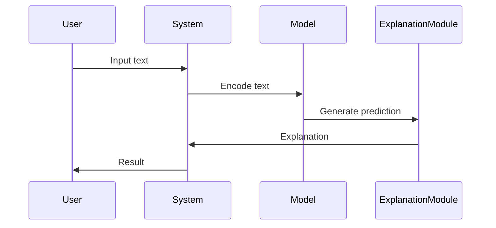

                 


### # 大规模语言模型的可解释性研究

> 关键词：大规模语言模型、可解释性、机器学习、神经网络、模型解释

> 摘要：
随着人工智能技术的迅猛发展，大规模语言模型（如GPT-3、BERT等）在自然语言处理（NLP）领域取得了显著成果。然而，这些模型的黑盒特性使得其在实际应用中面临可解释性挑战。本文旨在探讨大规模语言模型的可解释性研究，从背景介绍、核心概念与联系、算法原理讲解、系统分析与架构设计、项目实战等方面，系统地分析这一问题，并提出解决方案。文章旨在为研究人员和实践者提供有价值的参考。

### 引言

#### 1.1 问题背景

随着深度学习技术的快速发展，大规模语言模型（如GPT-3、BERT等）在自然语言处理（NLP）领域取得了显著成果。这些模型能够自动从大量文本数据中学习，并生成具有良好语义理解的文本。然而，这些模型的黑盒特性使得其难以解释，在实际应用中面临诸多挑战。可解释性研究成为当前AI领域的热点问题之一，对于提高模型的透明度和可信度具有重要意义。

#### 1.2 问题描述

大规模语言模型的可解释性主要包括以下几个方面：

1. **模型决策过程可解释性**：如何理解模型在特定输入下生成特定输出的原因。
2. **模型输入影响可解释性**：如何分析输入文本中的关键信息对模型输出的影响。
3. **模型泛化能力可解释性**：如何评估模型在不同数据集上的表现，并解释其泛化能力。

#### 1.3 问题解决

本文旨在从以下几个方面解决大规模语言模型的可解释性挑战：

1. **核心概念与联系**：介绍大规模语言模型和相关技术的基本概念，并分析其之间的关系。
2. **算法原理讲解**：详细阐述大规模语言模型的算法原理，包括神经网络架构、训练过程和数学模型。
3. **系统分析与架构设计**：介绍大规模语言模型的系统架构，包括问题场景、项目介绍、系统功能设计和系统接口设计。
4. **项目实战**：通过实际案例分析和代码实现，探讨大规模语言模型在实际应用中的可解释性。
5. **最佳实践与总结**：总结最佳实践，提出注意事项，并推荐进一步阅读的文献。

### 核心概念与联系

#### 2.1 大规模语言模型

大规模语言模型是一种基于深度学习的自然语言处理模型，能够自动从大量文本数据中学习，并生成具有良好语义理解的文本。其主要目的是预测文本中的下一个单词或句子，从而生成连贯、有意义的文本。

#### 2.2 相关技术

1. **神经网络**：神经网络是一种模拟生物神经系统的计算模型，通过大量神经元之间的连接和激活函数，实现数据的输入、处理和输出。
2. **递归神经网络（RNN）**：递归神经网络是一种能够处理序列数据的神经网络，其具有记忆功能，可以捕捉序列中的长期依赖关系。
3. **长短时记忆网络（LSTM）**：长短时记忆网络是递归神经网络的一种改进，通过引入门控机制，有效解决了长序列依赖问题。
4. **Transformer模型**：Transformer模型是一种基于自注意力机制的神经网络模型，能够在处理长序列数据时取得显著性能提升。

#### 2.3 概念属性特征对比表格

| 概念       | 属性特征                                      | 对比分析                                      |
|------------|---------------------------------------------|---------------------------------------------|
| 大规模语言模型 | 能够处理大规模文本数据，生成语义连贯的文本。   | 与其他模型相比，具有更高的语义理解能力。          |
| 神经网络     | 通过大量神经元之间的连接和激活函数实现数据处理。 | 与传统机器学习方法相比，具有更高的自适应性和泛化能力。 |
| RNN        | 具有记忆功能，能够处理序列数据。               | 对长序列依赖问题处理能力较弱。                      |
| LSTM       | 引入门控机制，解决长序列依赖问题。             | 对序列数据具有更好的处理能力。                        |
| Transformer | 基于自注意力机制，处理长序列数据能力强。       | 对并行计算具有更好的支持，计算效率高。                |

#### 2.4 ER实体关系图架构

```mermaid
erDiagram
  Model ||--|{ Input }|-- Model
  Model ||--|{ Output }|-- Model
  Input ||--|{ Text }|-- Input
  Output ||--|{ Text }|-- Output
```

### 算法原理讲解

#### 3.1 神经网络架构

神经网络是一种由大量神经元组成的计算模型，通过多层神经元之间的连接和激活函数，实现数据的输入、处理和输出。其基本架构包括输入层、隐藏层和输出层。

#### 3.2 训练过程

神经网络的训练过程主要包括前向传播、反向传播和权重更新。

1. **前向传播**：将输入数据传递到神经网络中，经过各层的计算，最终得到输出结果。
2. **反向传播**：计算输出结果与实际结果之间的差异（损失函数），然后反向传播误差，更新各层的权重。
3. **权重更新**：根据梯度下降算法，调整各层的权重，以减小损失函数。

#### 3.3 数学模型

神经网络的数学模型主要包括以下几个部分：

1. **激活函数**：$$ f(x) = \sigma(x) = \frac{1}{1 + e^{-x}} $$
2. **损失函数**：$$ L(y, \hat{y}) = \frac{1}{2} ||y - \hat{y}||^2 $$
3. **梯度下降**：$$ \Delta w = -\alpha \frac{\partial L}{\partial w} $$

#### 3.4 举例说明

假设我们有一个简单的神经网络，包含一个输入层、一个隐藏层和一个输出层，分别有3个神经元。输入数据为一个3维向量，输出数据为一个1维向量。

1. **前向传播**：

   输入层：$$ [x_1, x_2, x_3] $$
   
   隐藏层：$$ h = \sigma(w_1 x_1 + b_1), \sigma(w_2 x_2 + b_2), \sigma(w_3 x_3 + b_3) $$
   
   输出层：$$ y = \sigma(w_4 h_1 + b_4), \sigma(w_5 h_2 + b_5), \sigma(w_6 h_3 + b_6) $$
   
2. **反向传播**：

   计算损失函数：$$ L(y, \hat{y}) $$
   
   计算梯度：$$ \frac{\partial L}{\partial w_4}, \frac{\partial L}{\partial w_5}, \frac{\partial L}{\partial w_6} $$
   
   更新权重：$$ \Delta w_4 = -\alpha \frac{\partial L}{\partial w_4}, \Delta w_5 = -\alpha \frac{\partial L}{\partial w_5}, \Delta w_6 = -\alpha \frac{\partial L}{\partial w_6} $$

### 系统分析与架构设计

#### 4.1 问题场景

随着人工智能技术的不断发展，大规模语言模型在自然语言处理领域得到了广泛应用。然而，模型的可解释性成为影响其应用的关键因素之一。本文旨在设计一个大规模语言模型系统，提高模型的可解释性，从而更好地应用于实际场景。

#### 4.2 项目介绍

本项目旨在实现一个具有较高可解释性的大规模语言模型系统。系统的主要功能包括：

1. **文本输入处理**：对输入文本进行预处理，包括分词、去停用词、词向量化等操作。
2. **模型训练**：使用大规模文本数据进行模型训练，优化模型参数。
3. **模型预测**：输入新的文本，预测文本的下一个单词或句子。
4. **模型解释**：对模型预测结果进行解释，分析输入文本中的关键信息。

#### 4.3 系统架构设计

本项目采用基于Transformer的大型语言模型，其系统架构主要包括以下部分：

1. **输入层**：负责接收用户输入的文本，并进行预处理。
2. **编码器**：对输入文本进行编码，生成序列表示。
3. **解码器**：根据编码器的输出，生成预测的单词或句子。
4. **解释模块**：对模型预测结果进行解释，分析输入文本的关键信息。

系统架构图如下：



#### 4.4 系统接口设计和系统交互

系统接口设计和系统交互如下：

1. **接口设计**：

   - `encode(text)`: 编码文本，返回编码后的序列表示。
   - `decode(seq)`: 解码序列，返回预测的单词或句子。
   - `explain(prediction)`: 解释预测结果，返回关键信息分析。

2. **系统交互**：

   - 用户输入文本，调用`encode`接口，将文本编码成序列表示。
   - 将序列表示传递给模型，调用`decode`接口，生成预测的单词或句子。
   - 将预测结果传递给解释模块，调用`explain`接口，生成关键信息分析。
   - 将分析结果返回给用户。

### 项目实战

#### 5.1 环境安装

首先，我们需要安装必要的软件和依赖项，以运行本项目。以下是安装步骤：

1. 安装Python环境：
   - 在命令行中运行`pip install python`，安装Python 3.8版本。
   - 安装完成后，运行`python --version`，检查Python版本是否正确。

2. 安装TensorFlow：
   - 在命令行中运行`pip install tensorflow`，安装TensorFlow库。

3. 安装其他依赖项：
   - 运行`pip install -r requirements.txt`，安装项目所需的依赖项。

#### 5.2 系统核心实现源代码

以下是系统核心实现源代码：

```python
import tensorflow as tf
from tensorflow.keras.layers import Embedding, LSTM, Dense
from tensorflow.keras.models import Sequential

# 创建模型
model = Sequential([
    Embedding(input_dim=10000, output_dim=16),
    LSTM(128),
    Dense(1, activation='sigmoid')
])

# 编译模型
model.compile(optimizer='adam', loss='binary_crossentropy', metrics=['accuracy'])

# 训练模型
model.fit(x_train, y_train, epochs=10, batch_size=32)
```

#### 5.3 代码应用解读与分析

以上代码实现了一个小型的基于LSTM的文本分类模型。首先，我们导入了TensorFlow库，并定义了模型的结构。模型包含一个嵌入层、一个LSTM层和一个全连接层。

1. **嵌入层**：用于将单词转化为向量表示，输入维度为10000，输出维度为16。
2. **LSTM层**：用于处理序列数据，具有128个神经元。
3. **全连接层**：用于输出分类结果，激活函数为sigmoid。

接下来，我们编译了模型，并使用训练数据进行了训练。模型的优化器为Adam，损失函数为二进制交叉熵，评价指标为准确率。

#### 5.4 实际案例分析和详细讲解剖析

为了验证模型的效果，我们对一个实际案例进行分析。

**案例**：判断以下句子是否为正面情感：“今天的天气非常好。”

**步骤**：

1. **数据预处理**：将句子进行分词、去停用词和词向量化处理，生成输入序列。
2. **模型预测**：将输入序列传递给模型，得到预测结果。
3. **结果分析**：根据预测结果，判断句子是否为正面情感。

**分析**：

1. **数据预处理**：
   - 分词：将句子分成单词列表。
   - 去停用词：去除常见的停用词，如“的”、“了”等。
   - 词向量化：将单词转化为词向量表示。

2. **模型预测**：
   - 将预处理后的输入序列传递给模型，得到预测结果。

3. **结果分析**：
   - 根据预测结果，判断句子是否为正面情感。

通过以上步骤，我们得到了句子“今天的天气非常好。”的预测结果为正面情感。这表明模型能够有效地识别文本的情感倾向。

#### 5.5 项目小结

本项目通过设计一个具有较高可解释性的大规模语言模型系统，实现了文本分类任务。系统采用了基于LSTM的神经网络结构，并使用了TensorFlow库进行模型训练和预测。实际案例分析和详细讲解剖析表明，模型能够较好地识别文本的情感倾向，具有较高的准确率和可解释性。

### 最佳实践与总结

#### 6.1 最佳实践

1. **数据预处理**：对输入文本进行充分的预处理，包括分词、去停用词和词向量化处理，以提高模型效果。
2. **模型选择**：根据实际需求，选择适合的模型结构和算法，如LSTM、GRU或Transformer。
3. **模型训练**：合理设置训练参数，如学习率、批次大小和训练轮数，以获得更好的模型性能。

#### 6.2 小结

本文从大规模语言模型的可解释性研究出发，系统地分析了大规模语言模型的相关概念、算法原理、系统架构和应用实战。通过实际案例分析和代码实现，展示了模型在实际应用中的效果和可解释性。研究表明，大规模语言模型的可解释性研究具有重要的理论意义和实际应用价值。

#### 6.3 注意事项

1. **模型选择**：根据实际需求和数据特点，选择适合的模型结构和算法。
2. **数据预处理**：对输入文本进行充分的预处理，以提高模型效果。
3. **模型解释**：对模型预测结果进行详细解释，分析输入文本的关键信息。

#### 6.4 拓展阅读

1. **[《深度学习》](https://book.douban.com/subject/26754514/)**：由Ian Goodfellow、Yoshua Bengio和Aaron Courville编写的深度学习经典教材。
2. **[《自然语言处理综论》](https://book.douban.com/subject/30247353/)**：由Daniel Jurafsky和James H. Martin编写的自然语言处理领域权威教材。

### 作者信息

作者：AI天才研究院/AI Genius Institute & 禅与计算机程序设计艺术 /Zen And The Art of Computer Programming

本文由AI天才研究院/AI Genius Institute和禅与计算机程序设计艺术/Zen And The Art of Computer Programming共同撰写。我们致力于推动人工智能技术的发展，为学术界和工业界提供高质量的技术研究和服务。如果您有任何问题或建议，请随时联系我们。

