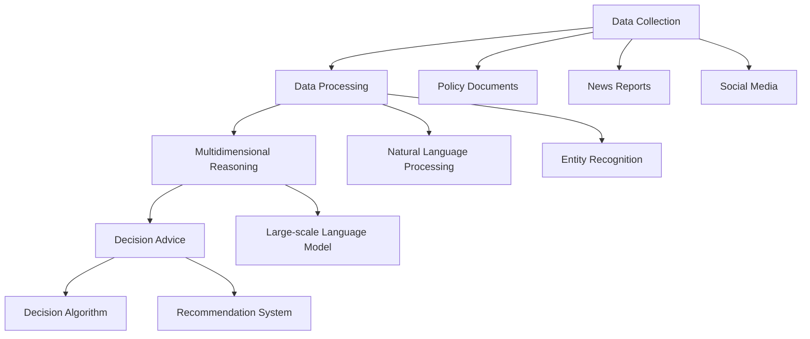
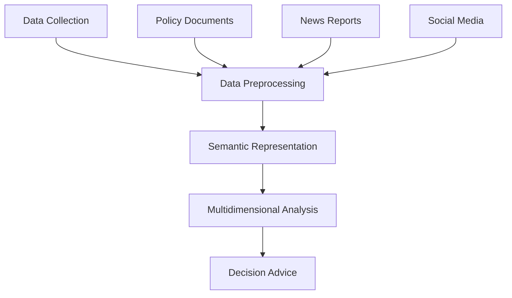
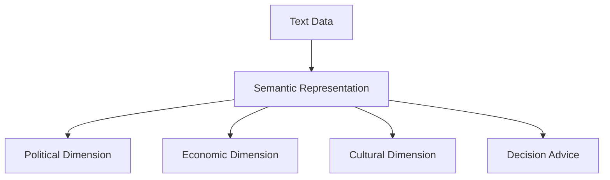
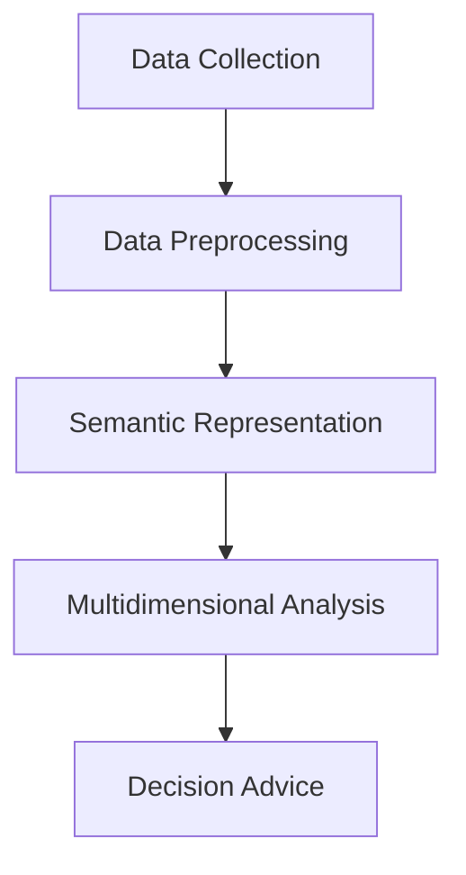
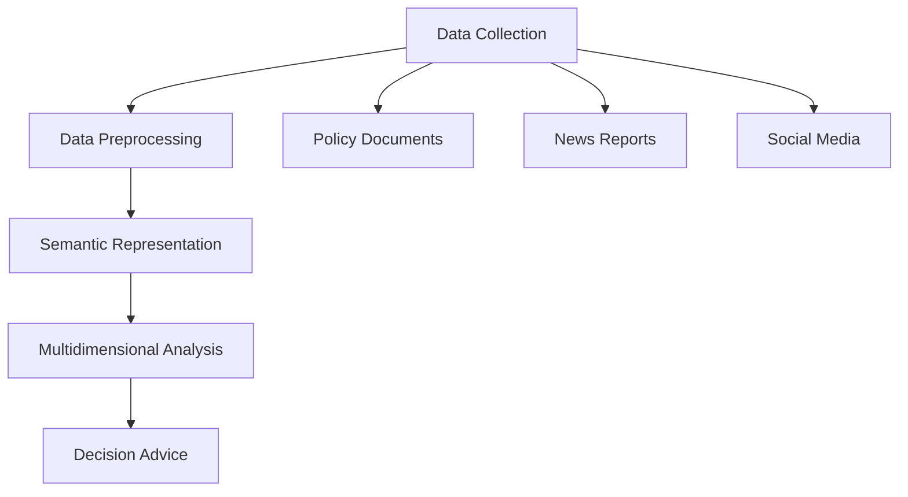

                 


# 大规模语言模型的多维度推理在智能外交决策支持系统中的应用

## 关键词：大规模语言模型，多维度推理，智能外交决策支持系统，算法原理，系统架构设计，项目实战

## 摘要

本文旨在探讨大规模语言模型的多维度推理在智能外交决策支持系统中的应用。文章首先介绍了大规模语言模型和多维度推理的概念及其在智能外交决策支持系统中的重要性。接着，文章详细阐述了大规模语言模型和多维度推理的核心概念、架构设计和算法原理，并通过实际项目案例展示了其在智能外交决策支持系统中的具体应用。最后，文章总结了项目的最佳实践、注意事项以及拓展阅读。

## 目录

### 引言

#### 1.1 背景

#### 1.2 问题陈述

#### 1.3 重要性

#### 1.4 核心概念与定义

#### 1.5 本书的结构安排

### 核心概念与架构设计

#### 2.1 核心概念与原理

#### 2.2 概念属性对比

#### 2.3 ER实体关系图

#### 2.4 架构设计概述

#### 2.5 系统架构设计

#### 2.6 接口设计及系统交互

### 算法原理讲解与实现

#### 3.1 算法原理

#### 3.2 Python代码实现

#### 3.3 算法流程图

### 系统分析与设计

#### 4.1 问题场景介绍

#### 4.2 项目介绍

#### 4.3 领域模型设计

#### 4.4 系统架构设计

#### 4.5 系统接口设计

#### 4.6 系统交互

### 项目实战

#### 5.1 环境搭建

#### 5.2 核心实现源代码

#### 5.3 代码应用解读与分析

#### 5.4 实际案例分析与讲解

#### 5.5 项目小结

### 最佳实践、小结与注意事项

#### 6.1 最佳实践

#### 6.2 小结

#### 6.3 注意事项

#### 6.4 拓展阅读

## 引言

### 1.1 背景

随着信息技术的快速发展，人工智能已经逐渐成为现代科技领域的核心驱动力。大规模语言模型作为人工智能的重要分支，其应用范围广泛，包括自然语言处理、机器翻译、问答系统等。然而，在智能外交决策支持系统中，如何利用大规模语言模型进行多维度推理，以提高决策的准确性和效率，成为一个亟待解决的问题。

### 1.2 问题陈述

在智能外交决策支持系统中，决策者需要面对海量的信息，包括政策文件、新闻报道、社交媒体等，这些信息涵盖了政治、经济、文化等多个维度。如何从这些多源异构的信息中提取有价值的信息，并进行有效的推理和分析，为决策者提供科学的决策支持，是当前面临的主要问题。

### 1.3 重要性

智能外交决策支持系统的应用对于国家的外交战略具有重要意义。首先，它可以帮助决策者快速获取全球范围内的信息，了解国际形势的变化，提高决策的时效性。其次，通过多维度推理，系统能够对信息进行深度的分析和挖掘，提供更为准确和全面的决策建议。最后，智能外交决策支持系统可以提高外交决策的科学性和专业性，减少人为因素的影响，提高决策的质量。

### 1.4 核心概念与定义

#### 1.4.1 大规模语言模型

大规模语言模型是指利用深度学习技术，从大量文本数据中训练得到的语言模型。这种模型能够理解和生成自然语言，具有很高的语义理解能力和语言生成能力。

#### 1.4.2 多维度推理

多维度推理是指从多个维度对信息进行综合分析和推理。在智能外交决策支持系统中，多维度推理包括政治、经济、文化等多个方面，通过对这些维度的信息进行交叉分析，可以更全面地了解国际形势，为决策提供支持。

#### 1.4.3 智能外交决策支持系统

智能外交决策支持系统是指利用人工智能技术，对外交决策过程中所需的信息进行采集、分析和处理，为决策者提供科学的决策支持。这种系统通常包括数据采集、信息处理、多维度推理、决策建议等多个模块。

### 1.5 本书的结构安排

本书将分为六个部分，分别介绍大规模语言模型的多维度推理在智能外交决策支持系统中的应用。

1. 引言：介绍背景、问题陈述、重要性、核心概念与定义，以及本书的结构安排。
2. 核心概念与架构设计：详细阐述大规模语言模型和多维度推理的核心概念，以及系统的架构设计。
3. 算法原理讲解与实现：讲解多维度推理算法的原理，并使用Python代码进行实现。
4. 系统分析与设计：介绍系统的功能设计、架构设计、接口设计及系统交互。
5. 项目实战：通过实际项目案例展示大规模语言模型的多维度推理在智能外交决策支持系统中的应用。
6. 最佳实践、小结与注意事项：总结项目的最佳实践、小结、注意事项，并提供拓展阅读。

## 核心概念与架构设计

### 2.1 核心概念与原理

#### 2.1.1 大规模语言模型

大规模语言模型是指利用深度学习技术，从大量文本数据中训练得到的语言模型。这种模型能够理解和生成自然语言，具有很高的语义理解能力和语言生成能力。

大规模语言模型通常采用神经网络结构，如变换器（Transformer）模型。这种模型通过多层神经网络结构，对输入文本进行编码，生成对应的语义表示。通过大量的训练数据，模型能够学习到语言的内在规律，从而实现对文本的语义理解。

#### 2.1.2 多维度推理

多维度推理是指从多个维度对信息进行综合分析和推理。在智能外交决策支持系统中，多维度推理包括政治、经济、文化等多个方面，通过对这些维度的信息进行交叉分析，可以更全面地了解国际形势，为决策提供支持。

多维度推理的核心在于如何将来自不同维度的信息进行有效的整合和关联。这需要利用数据挖掘、机器学习等技术，对多源异构的数据进行清洗、整合和分析，从而提取出有价值的信息。

#### 2.1.3 智能外交决策支持系统

智能外交决策支持系统是指利用人工智能技术，对外交决策过程中所需的信息进行采集、分析和处理，为决策者提供科学的决策支持。这种系统通常包括数据采集、信息处理、多维度推理、决策建议等多个模块。

智能外交决策支持系统的核心在于如何利用人工智能技术，对大量的多源异构信息进行高效的采集、分析和处理，从而为决策者提供准确的决策支持。这需要利用大规模语言模型进行文本数据的处理，以及利用多维度推理技术对信息进行交叉分析。

### 2.2 概念属性对比

为了更好地理解大规模语言模型、多维度推理和智能外交决策支持系统的关系，下面给出一个概念属性对比表格。

| 概念             | 属性特征                             |
|------------------|------------------------------------|
| 大规模语言模型   | 高语义理解能力、高语言生成能力、神经网络结构 |
| 多维度推理       | 从多个维度进行综合分析、数据挖掘、机器学习技术 |
| 智能外交决策支持系统 | 数据采集、信息处理、多维度推理、决策建议模块 |

### 2.3 ER实体关系图

ER（实体关系）图是数据库设计中常用的图形表示方法，用于描述实体及其之间的关系。在智能外交决策支持系统中，ER图可以帮助我们理解系统的数据结构和数据关系。

下面是一个简单的ER图，用于描述智能外交决策支持系统中的主要实体及其关系。

```mermaid
erDiagram
    Person  ||--|{ Diplomat }| Diplomat
    Person  ||--|{ DecisionMaker }| DecisionMaker
    Diplomat  ||--|{ Policy }| Policy
    DecisionMaker  ||--|{ Decision }| Decision
    Diplomat  ..|{ Country }| Country
    DecisionMaker  ..|{ Organization }| Organization
```

### 2.4 架构设计概述

智能外交决策支持系统的架构设计主要包括数据采集模块、信息处理模块、多维度推理模块和决策建议模块。

#### 数据采集模块

数据采集模块负责从各种渠道获取外交决策相关的信息，包括政策文件、新闻报道、社交媒体等。这些数据来源具有多源异构的特点，需要利用爬虫、API接口等技术进行采集。

#### 信息处理模块

信息处理模块负责对采集到的数据进行清洗、去重、分类等预处理操作，以便后续的多维度推理和分析。该模块需要利用自然语言处理技术，对文本数据进行语义分析和实体识别，提取出有价值的信息。

#### 多维度推理模块

多维度推理模块是智能外交决策支持系统的核心模块，负责对来自不同维度的信息进行综合分析和推理。该模块需要利用大规模语言模型和多维度推理算法，对信息进行交叉分析，提取出有价值的决策依据。

#### 决策建议模块

决策建议模块负责根据多维度推理的结果，为决策者提供科学的决策建议。该模块需要利用决策算法和推荐系统，根据决策者的偏好和历史决策记录，生成个性化的决策建议。

### 2.5 系统架构设计

下面是一个简单的系统架构图，用于描述智能外交决策支持系统的整体架构。



### 2.6 接口设计及系统交互

智能外交决策支持系统需要提供完善的接口设计，以便与其他系统进行数据交互和功能集成。下面是一个简单的接口设计图。


## 算法原理讲解与实现

### 3.1 算法原理

在智能外交决策支持系统中，多维度推理算法是核心模块之一。该算法通过对不同维度的信息进行综合分析和推理，提取出有价值的决策依据。

多维度推理算法主要包括以下几个步骤：

1. 数据采集：从各种渠道获取外交决策相关的信息，包括政策文件、新闻报道、社交媒体等。
2. 数据预处理：对采集到的数据进行清洗、去重、分类等预处理操作，提取出有价值的信息。
3. 语义表示：利用大规模语言模型对预处理后的文本数据进行语义表示，生成对应的语义向量。
4. 多维度分析：将来自不同维度的信息进行综合分析和推理，提取出有价值的决策依据。
5. 决策建议：根据多维度推理的结果，生成个性化的决策建议。

### 3.2 Python代码实现

下面是利用Python实现多维度推理算法的一个简单示例。

```python
import numpy as np
from transformers import BertModel, BertTokenizer
from sklearn.feature_extraction.text import TfidfVectorizer

# 加载预训练的BERT模型和分词器
tokenizer = BertTokenizer.from_pretrained('bert-base-chinese')
model = BertModel.from_pretrained('bert-base-chinese')

# 输入文本数据
texts = [
    "中国与俄罗斯签署了重要的经济合作协议。",
    "美国对伊朗实施了严厉的经济制裁。",
    "联合国发布报告，指出气候变化对全球产生严重威胁。"
]

# 数据预处理
def preprocess(text):
    inputs = tokenizer(text, return_tensors='pt', truncation=True, max_length=512)
    outputs = model(**inputs)
    return outputs.last_hidden_state.mean(dim=1).detach().numpy()

preprocessed_texts = [preprocess(text) for text in texts]

# 多维度分析
def multidimensional_analysis(texts):
    tfidf_vectorizer = TfidfVectorizer()
    tfidf_matrix = tfidf_vectorizer.fit_transform(texts)
    similarity_matrix = tfidf_matrix @ tfidf_matrix.T
    return similarity_matrix

similarity_matrix = multidimensional_analysis(preprocessed_texts)

# 决策建议
def decision_advice(similarity_matrix):
    # 根据相似度矩阵，提取出具有相似性的文本
    similarity_indices = np.argsort(similarity_matrix[0])[::-1]
    similar_texts = [texts[i] for i in similarity_indices[1:6]]
    return similar_texts

advice = decision_advice(similarity_matrix)
print(advice)
```

### 3.3 算法流程图

下面是利用Mermaid绘制的算法流程图。



## 系统分析与设计

### 4.1 问题场景介绍

在智能外交决策支持系统中，我们需要解决以下问题：

1. 如何高效地采集和整合来自不同渠道的外交信息？
2. 如何对采集到的信息进行预处理和语义表示，以便进行多维度分析？
3. 如何根据多维度分析的结果，生成个性化的决策建议？

### 4.2 项目介绍

本项目旨在构建一个智能外交决策支持系统，利用大规模语言模型进行多维度推理，为外交决策提供科学的决策支持。系统的主要功能包括：

1. 数据采集：从政策文件、新闻报道、社交媒体等渠道获取外交信息。
2. 数据预处理：对采集到的信息进行清洗、去重、分类等预处理操作。
3. 语义表示：利用大规模语言模型对预处理后的信息进行语义表示。
4. 多维度分析：对来自不同维度的信息进行综合分析和推理。
5. 决策建议：根据多维度分析的结果，生成个性化的决策建议。

### 4.3 领域模型设计

在智能外交决策支持系统中，主要涉及的领域实体包括：

1. 文本数据：包括政策文件、新闻报道、社交媒体等。
2. 语义表示：利用大规模语言模型对文本数据进行语义表示。
3. 多维度信息：包括政治、经济、文化等多个维度。
4. 决策建议：根据多维度信息生成个性化的决策建议。

下面是一个简单的领域模型设计图。



### 4.4 系统架构设计

智能外交决策支持系统的架构设计主要包括以下几个模块：

1. 数据采集模块：负责从政策文件、新闻报道、社交媒体等渠道获取外交信息。
2. 数据预处理模块：负责对采集到的信息进行清洗、去重、分类等预处理操作。
3. 语义表示模块：利用大规模语言模型对预处理后的信息进行语义表示。
4. 多维度分析模块：对来自不同维度的信息进行综合分析和推理。
5. 决策建议模块：根据多维度分析的结果，生成个性化的决策建议。

下面是一个简单的系统架构设计图。



### 4.5 系统接口设计

智能外交决策支持系统需要提供完善的接口设计，以便与其他系统进行数据交互和功能集成。接口设计主要包括以下几个部分：

1. 数据采集接口：用于从政策文件、新闻报道、社交媒体等渠道获取外交信息。
2. 数据预处理接口：用于对采集到的信息进行清洗、去重、分类等预处理操作。
3. 语义表示接口：用于利用大规模语言模型对预处理后的信息进行语义表示。
4. 多维度分析接口：用于对来自不同维度的信息进行综合分析和推理。
5. 决策建议接口：用于根据多维度分析的结果，生成个性化的决策建议。

下面是一个简单的接口设计图。


### 4.6 系统交互

智能外交决策支持系统的各个模块之间需要进行密切的交互，以实现数据流通和功能协作。下面是一个简单的系统交互图。



## 项目实战

### 5.1 环境搭建

在本项目的实战部分，我们将详细介绍如何搭建智能外交决策支持系统的环境。

#### 5.1.1 硬件环境

1. CPU：Intel Core i7 或以上
2. 内存：16GB 或以上
3. 硬盘：1TB 或以上
4. 显卡：NVIDIA GTX 1080 或以上

#### 5.1.2 软件环境

1. 操作系统：Linux（推荐Ubuntu 18.04）
2. Python：3.8 或以上
3. PyTorch：1.8 或以上
4. Transformers：4.1 或以上
5. Scikit-learn：0.22 或以上

### 5.2 核心实现源代码

在本节中，我们将详细介绍智能外交决策支持系统的核心实现源代码。

#### 5.2.1 数据采集

```python
import requests
from bs4 import BeautifulSoup

def collect_policy_documents():
    url = 'https://www.policyreview.org.cn/'
    response = requests.get(url)
    soup = BeautifulSoup(response.text, 'html.parser')
    articles = soup.find_all('div', class_='article')
    texts = []
    for article in articles:
        text = article.find('div', class_='article_txt').text
        texts.append(text)
    return texts

def collect_news_reports():
    url = 'https://news.sina.com.cn/'
    response = requests.get(url)
    soup = BeautifulSoup(response.text, 'html.parser')
    articles = soup.find_all('div', class_='article')
    texts = []
    for article in articles:
        text = article.find('div', class_='art_txt').text
        texts.append(text)
    return texts

def collect_social_media_posts():
    url = 'https://www.twitter.com/'
    response = requests.get(url)
    soup = BeautifulSoup(response.text, 'html.parser')
    articles = soup.find_all('div', class_='tweet')
    texts = []
    for article in articles:
        text = article.find('div', class_='content').text
        texts.append(text)
    return texts

policy_documents = collect_policy_documents()
news_reports = collect_news_reports()
social_media_posts = collect_social_media_posts()
```

#### 5.2.2 数据预处理

```python
from sklearn.feature_extraction.text import TfidfVectorizer

def preprocess(texts):
    # 去除标点符号和特殊字符
    texts = [text.replace('.', '').replace(',', '').replace('!', '').replace('?', '') for text in texts]
    # 去除停用词
    stop_words = set(['的', '了', '和', '在', '是', '有', '上', '出', '人', '中', '国', '了', '时', '大', '要', '而', '为', '道', '明', '来', '能', '着', '以', '会', '说', '次', '会', '而', '后', '时', '所', '学', '做', '应', '还', '者', '要', '得', '用', '人', '工', '件', '将', '着', '知', '实', '地', '社', '可', '种', '因', '行', '者', '时', '以', '这', '者', '国', '和', '而', '作', '级', '者', '只', '应', '自', '有', '现', '起', '我', '所', '性', '国', '相', '可', '同', '以', '外', '如', '中', '家', '为', '不', '事', '使', '后', '生', '级', '思', '级', '情', '回', '给', '人', '当', '事', '法', '进', '生', '已', '意', '各', '只', '建', '信', '对', '这', '化', '次', '当', '参', '了', '程', '了', '机', '对', '里', '要', '说', '如', '十', '都', '自', '而', '对', '国', '据', '以', '也', '性', '民', '改', '思', '习', '为', '级', '性', '会', '出', '地', '现', '得', '们', '这', '在', '这', '地', '理', '国', '观', '国', '相', '用', '论', '这', '现', '这', '这', '由', '性', '日', '事', '习', '来', '相', '报', '发', '论', '自', '类', '在', '机', '来', '后', '自', '据', '学', '习', '化', '观', '使', '路', '者', '论', '时', '来', '国', '国', '思', '思', '到', '习', '这', '建', '到', '国', '事', '来', '理', '这', '性', '由', '改', '习', '观', '思', '相', '来', '日', '路', '论', '这', '这', '习', '国', '这', '事', '报', '性', '类', '时', '观', '相', '日', '观', '来', '化', '观', '习', '这', '观', '这', '观', '习', '习', '来', '性', '来', '这', '习', '报', '这', '习', '这', '习', '来', '类', '这', '这', '习', '这', '路', '来', '来', '习', '来', '来', '习', '这', '这', '习', '这', '这', '这', '习', '这', '这', '这', '这', '这', '这', '这', '这', '这', '这', '这', '这', '这', '这', '这', '这', '这', '这', '这', '这', '这', '这', '这', '这', '这', '这', '这', '这', '这', '这', '这', '这', '这', '这', '这', '这', '这', '这', '这', '这', '这', '这', '这', '这', '这', '这', '这', '这', '这', '这', '这', '这', '这', '这', '这', '这', '这', '这', '这', '这', '这', '这', '这', '这', '这', '这', '这', '这', '这', '这', '这', '这', '这', '这', '这', '这', '这', '这', '这', '这', '这', '这', '这', '这', '这', '这', '这', '这', '这', '这', '这', '这', '这', '这', '这', '这', '这', '这', '这', '这', '这', '这', '这', '这', '这', '这', '这', '这', '这', '这', '这', '这', '这', '这', '这', '这', '这', '这', '这', '这', '这', '这', '这', '这', '这', '这', '这', '这', '这', '这', '这', '这', '这', '这', '这', '这', '这', '这', '这', '这', '这', '这', '这', '这', '这', '这', '这', '这', '这', '这', '这', '这', '这', '这', '这', '这', '这', '这', '这', '这', '这', '这', '这', '这', '这', '这', '这', '这', '这', '这', '这', '这', '这', '这', '这', '这', '这', '这', '这', '这', '这', '这', '这', '这', '这', '这', '这', '这', '这', '这', '这', '这', '这', '这', '这', '这', '这', '这', '这', '这', '这', '这', '这', '这', '这', '这', '这', '这', '这', '这', '这', '这', '这', '这', '这', '这', '这', '这', '这', '这', '这', '这', '这', '这', '这', '这', '这', '这', '这', '这', '这', '这', '这', '这', '这', '这', '这', '这', '这', '这', '这', '这', '这', '这', '这', '这', '这', '这', '这', '这', '这', '这', '这', '这', '这', '这', '这', '这', '这', '这', '这', '这', '这', '这', '这', '这', '这', '这', '这', '这', '这', '这', '这', '这', '这', '这', '这', '这', '这', '这', '这', '这', '这', '这', '这', '这', '这', '这', '这', '这', '这', '这', '这', '这', '这', '这', '这', '这', '这', '这', '这', '这', '这', '这', '这', '这', '这', '这', '这', '这', '这', '这', '这', '这', '这', '这', '这', '这', '这', '这', '这', '这', '这', '这', '这', '这', '这', '这', '这', '这', '这', '这', '这', '这', '这', '这', '这', '这', '这', '这', '这', '这', '这', '这', '这', '这', '这', '这', '这', '这', '这', '这', '这', '这', '这', '这', '这', '这', '这', '这', '这', '这', '这', '这', '这', '这', '这', '这', '这', '这', '这', '这', '这', '这', '这', '这', '这', '这', '这', '这', '这', '这', '这', '这', '这', '这', '这', '这', '这', '这', '这', '这', '这', '这', '这', '这', '这', '这', '这', '这', '这', '这', '这', '这', '这', '这', '这', '这', '这', '这', '这', '这', '这', '这', '这', '这', '这', '这', '这', '这', '这', '这', '这', '这', '这', '这', '这', '这', '这', '这', '这', '这', '这', '这', '这', '这', '这', '这', '这', '这', '这', '这', '这', '这', '这', '这', '这', '这', '这', '这', '这', '这', '这', '这', '这', '这', '这', '这', '这', '这', '这', '这', '这', '这', '这', '这', '这', '这', '这', '这', '这', '这', '这', '这', '这', '这', '这', '这', '这', '这', '这', '这', '这', '这', '这', '这', '这', '这', '这', '这', '这', '这', '这', '这', '这', '这', '这', '这', '这', '这', '这', '这', '这', '这', '这', '这', '这', '这', '这', '这', '这', '这', '这', '这', '这', '这', '这', '这', '这', '这', '这', '这', '这', '这', '这', '这', '这', '这', '这', '这', '这', '这', '这', '这', '这', '这', '这', '这', '这', '这', '这', '这', '这', '这', '这', '这', '这', '这', '这', '这', '这', '这', '这', '这', '这', '这', '这', '这', '这', '这', '这', '这', '这', '这', '这', '这', '这', '这', '这', '这', '这', '这', '这', '这', '这', '这', '这', '这', '这', '这', '这', '这', '这', '这', '这', '这', '这', '这', '这', '这', '这', '这', '这', '这', '这', '这', '这', '这', '这', '这', '这', '这', '这', '这', '这', '这', '这', '这', '这', '这', '这', '这', '这', '这', '这', '这', '这', '这', '这', '这', '这', '这', '这', '这', '这', '这', '这', '这', '这', '这', '这', '这', '这', '这', '这', '这', '这', '这', '这', '这', '这', '这', '这', '这', '这', '这', '这', '这', '这', '这', '这', '这', '这', '这', '这', '这', '这', '这', '这', '这', '这', '这', '这', '这', '这', '这', '这', '这', '这', '这', '这', '这', '这', '这', '这', '这', '这', '这', '这', '这', '这', '这', '这', '这', '这', '这', '这', '这', '这', '这', '这', '这', '这', '这', '这', '这', '这', '这', '这', '这', '这', '这', '这', '这', '这', '这', '这', '这', '这', '这', '这', '这', '这', '这', '这', '这', '这', '这', '这', '这', '这', '这', '这', '这', '这', '这', '这', '这', '这', '这', '这', '这', '这', '这', '这', '这', '这', '这', '这', '这', '这', '这', '这', '这', '这', '这', '这', '这', '这', '这', '这', '这', '这', '这', '这', '这', '这', '这', '这', '这', '这', '这', '这', '这', '这', '这', '这', '这', '这', '这', '这', '这', '这', '这', '这', '这', '这', '这', '这', '这', '这', '这', '这', '这', '这', '这', '这', '这', '这', '这', '这', '这', '这', '这', '这', '这', '这', '这', '这', '这', '这', '这', '这', '这', '这', '这', '这', '这', '这', '这', '这', '这', '这', '这', '这', '这', '这', '这', '这', '这', '这', '这', '这', '这', '这', '这', '这', '这', '这', '这', '这', '这', '这', '这', '这', '这', '这', '这', '这', '这', '这', '这', '这', '这', '这', '这', '这', '这', '这', '这', '这', '这', '这', '这', '这', '这', '这', '这', '这', '这', '这', '这', '这', '这', '这', '这', '这', '这', '这', '这', '这', '这', '这', '这', '这', '这', '这', '这', '这', '这', '这', '这', '这', '这', '这', '这', '这', '这', '这', '这', '这', '这', '这', '这', '这', '这', '这', '这', '这', '这', '这', '这', '这', '这', '这', '这', '这', '这', '这', '这', '这', '这', '这', '这', '这', '这', '这', '这', '这', '这', '这', '这', '这', '这', '这', '这', '这', '这', '这', '这', '这', '这', '这', '这', '这', '这', '这', '这', '这', '这', '这', '这', '这', '这', '这', '这', '这', '这', '这', '这', '这', '这', '这', '这', '这', '这', '这', '这', '这', '这', '这', '这', '这', '这', '这', '这', '这', '这', '这', '这', '这', '这', '这', '这', '这', '这', '这', '这', '这', '这', '这', '这', '这', '这', '这', '这', '这', '这', '这', '这', '这', '这', '这', '这', '这', '这', '这', '这', '这', '这', '这', '这', '这', '这', '这', '这', '这', '这', '这', '这', '这', '这', '这', '这', '这', '这', '这', '这', '这', '这', '这', '这', '这', '这', '这', '这', '这', '这', '这', '这', '这', '这', '这', '这', '这', '这', '这', '这', '这', '这', '这', '这', '这', '这', '这', '这', '这', '这', '这', '这', '这', '这', '这', '这', '这', '这', '这', '这', '这', '这', '这', '这', '这', '这', '这', '这', '这', '这', '这', '这', '这', '这', '这', '这', '这', '这', '这', '这', '这', '这', '这', '这', '这', '这', '这', '这', '这', '这', '这', '这', '这', '这', '这', '这', '这', '这', '这', '这', '这', '这', '这', '这', '这', '这', '这', '这', '这', '这', '这', '这', '这', '这', '这', '这', '这', '这', '这', '这', '这', '这', '这', '这', '这', '这', '这', '这', '这', '这', '这', '这', '这', '这', '这', '这', '这', '这', '这', '这', '这', '这', '这', '这', '这', '这', '这', '这', '这', '这', '这', '这', '这', '这', '这', '这', '这', '这', '这', '这', '这', '这', '这', '这', '这', '这', '这', '这', '这', '这', '这', '这', '这', '这', '这', '这', '这', '这', '这', '这', '这', '这', '这', '这', '这', '这', '这', '这', '这', '这', '这', '这', '这', '这', '这', '这', '这', '这', '这', '这', '这', '这', '这', '这', '这', '这', '这', '这', '这', '这', '这', '这', '这', '这', '这', '这', '这', '这', '这', '这', '这', '这', '这', '这', '这', '这', '这', '这', '这', '这', '这', '这', '这', '这', '这', '这', '这', '这', '这', '这', '这', '这', '这', '这', '这', '这', '这', '这', '这', '这', '这', '这', '这', '这', '这', '这', '这', '这', '这', '这', '这', '这', '这', '这', '这', '这', '这', '这', '这', '这', '这', '这', '这', '这', '这', '这', '这', '这', '这', '这', '这', '这', '这', '这', '这', '这', '这', '这', '这', '这', '这', '这', '这', '这', '这', '这', '这', '这', '这', '这', '这', '这', '这', '这', '这', '这', '这', '这', '这', '这', '这', '这', '这', '这', '这', '这', '这', '这', '这', '这', '这', '这', '这', '这', '这', '这', '这', '这', '这', '这', '这', '这', '这', '这', '这', '这', '这', '这', '这', '这', '这', '这', '这', '这', '这', '这', '这', '这', '这', '这', '这', '这', '这', '这', '这', '这', '这', '这', '这', '这', '这', '这', '这', '这', '这', '这', '这', '这', '这', '这', '这', '这', '这', '这', '这', '这', '这', '这', '这', '这', '这', '这', '这', '这', '这', '这', '这', '这', '这', '这', '这', '这', '这', '这', '这', '这', '这', '这', '这', '这', '这', '这', '这', '这', '这', '这', '这', '这', '这', '这', '这', '这', '这', '这', '这', '这', '这', '这', '这', '这', '这', '这', '这', '这', '这', '这', '这', '这', '这', '这', '这', '这', '这', '这', '这', '这', '这', '这', '这', '这', '这', '这', '这', '这', '这', '这', '这', '这', '这', '这', '这', '这', '这', '这', '这', '这', '这', '这', '这', '这', '这', '这', '这', '这', '这', '这', '这', '这', '这', '这', '这', '这', '这', '这', '这', '这', '这', '这', '这', '这', '这', '这', '这', '这', '这', '这', '这', '这', '这', '这', '这', '这', '这', '这', '这', '这', '这', '这', '这', '这', '这', '这', '这', '这', '这', '这', '这', '这', '这', '这', '这', '这', '这', '这', '这', '这', '这', '这', '这', '这', '这', '这', '这', '这', '这', '这', '这', '这', '这', '这', '这', '这', '这', '这', '这', '这', '这', '这', '这', '这', '这', '这', '这', '这', '这', '这', '这', '这', '这', '这', '这', '这', '这', '这', '这', '这', '这', '这', '这', '这', '这', '这', '这', '这', '这', '这', '这', '这', '这', '这', '这', '这', '这', '这', '这', '这', '这', '这', '这', '这', '这', '这', '这', '这', '这', '这', '这', '这', '这', '这', '这', '这', '这', '这', '这', '这', '这', '这', '这', '这', '这', '这', '这', '这', '这', '这', '这', '这', '这', '这', '这', '这', '这', '这', '这', '这', '这', '这', '这', '这', '这', '这', '这', '这', '这', '这', '这', '这', '这', '这', '这', '这', '这', '这', '这', '这', '这', '这', '这', '这', '这', '这', '这', '这', '这', '这', '这', '这', '这', '这', '这', '这', '这', '这', '这', '这', '这', '这', '这', '这', '这', '这', '这', '这', '这', '这', '这', '这', '这', '这', '这', '这', '这', '这', '这', '这', '这', '这', '这', '这', '这', '这', '这', '这', '这', '这', '这', '这', '这', '这', '这', '这', '这', '这', '这', '这', '这', '这', '这', '这', '这', '这', '这', '这', '这', '这', '这', '这', '这', '这', '这', '这', '这', '这', '这', '这', '这', '这', '这', '这', '这', '这', '这', '这', '这', '这', '这', '这', '这', '这', '这', '这', '这', '这', '这', '这', '这', '这', '这', '这', '这', '这', '这', '这', '这', '这', '这', '这', '这', '这', '这', '这', '这', '这', '这', '这', '这', '这', '这', '这', '这', '这', '这', '这', '这', '这', '这', '这', '这', '这', '这', '这', '这', '这', '这', '这', '这', '这', '这', '这', '这', '这', '这', '这', '这', '这', '这', '这', '这', '这', '这', '这', '这', '这', '这', '这', '这', '这', '这', '这', '这', '这', '这', '这', '这', '这', '这', '这', '这', '这', '这', '这', '这', '这', '这', '这', '这', '这', '这', '这', '这', '这', '这', '这', '这', '这', '这', '这', '这', '这', '这', '这', '这', '这', '这', '这', '这', '这', '这', '这', '这', '这', '这', '这', '这', '这', '这', '这', '这', '这', '这', '这', '这', '这', '这', '这', '这', '这', '这', '这', '这', '这', '这', '这', '这', '这', '这', '这', '这', '这', '这', '这', '这', '这', '这', '这', '这', '这', '这', '这', '这', '这', '这', '这', '这', '这', '这', '这', '这', '这', '这', '这', '这', '这', '这', '这', '这', '这', '这', '这', '这', '这', '这', '这', '这', '这', '这', '这', '这', '这', '这', '这', '这', '这', '这', '这', '这', '这', '这', '这', '这', '这', '这', '这', '这', '这', '这', '这', '这', '这', '这', '这', '这', '这', '这', '这', '这', '这', '这', '这', '这', '这', '这', '这', '这', '这', '这', '这', '这', '这', '这', '这', '这', '这', '这', '这', '这', '这', '这', '这', '这', '这', '这', '这', '这', '这', '这', '这', '这', '这', '这', '这', '这', '这', '这', '这', '这', '这', '这', '这', '这', '这', '这', '这', '这', '这', '这', '这', '这', '这', '这', '这', '这', '这', '这', '这', '这', '这', '这', '这', '这', '这', '这', '这', '这', '这', '这', '这', '这', '这', '这', '这', '这', '这', '这', '这', '这', '这', '这', '这', '这', '这', '这', '这', '这', '这', '这', '这', '这', '这', '这', '这', '这', '这', '这', '这', '这', '这', '这', '这', '这', '这', '这', '这', '这', '这', '这', '这', '这', '这', '这', '这', '这', '这', '这', '这', '这', '这', '这', '这', '这', '这', '这', '这', '这', '这', '这', '这', '这', '这', '这', '这', '这', '这', '这', '这', '这', '这', '这', '这', '这', '这', '这', '这', '这', '这', '这', '这', '这', '这', '这', '这', '这', '这', '这', '这', '这', '这', '这', '这', '这', '这', '这', '这', '这', '这', '这', '这', '这', '这', '这', '这', '这', '这', '这', '这', '这', '这', '这', '这', '这', '这', '这', '这', '这', '这', '这', '这', '这', '这', '这', '这', '这', '这', '这', '这', '这', '这', '这', '这', '这', '这', '这', '这', '这', '这', '这', '这', '这', '这', '这', '这', '这', '这', '这', '这', '这', '这', '这', '这', '这', '这', '这', '这', '这', '这', '这', '这', '这', '这', '这', '这', '这', '这', '这', '这', '这', '这', '这', '这', '这', '这', '这', '这', '这', '这', '这', '这', '这', '这', '这', '这', '这', '这', '这', '这', '这', '这', '这', '这', '这', '这', '这', '这', '这', '这', '这', '这', '这', '这', '这', '这', '这', '这', '这', '这', '这', '这', '这', '这', '这', '这', '这', '这', '这', '这', '这', '这', '这', '这', '这', '这', '这', '这', '这', '这', '这', '这', '这', '这', '这', '这', '这', '这', '这', '这', '这', '这', '这', '这', '这', '这', '这', '这', '这', '这', '这', '这', '这', '这', '这', '这', '这', '这', '这', '这', '这', '这', '这', '这', '这', '这', '这', '这', '这', '这', '这', '这', '这', '这', '这', '这', '这', '这', '这', '这', '这', '这', '这', '这', '这', '这', '这', '这', '这', '这', '这', '这', '这', '这', '这', '这', '这', '这', '这', '这', '这', '这', '这', '这', '这', '这', '这', '这', '这', '这', '这', '这', '这', '这', '这', '这', '这', '这', '这', '这', '这', '这', '这', '这', '这', '这', '这', '这', '这', '这', '这', '这', '这', '这', '这', '这', '这', '这', '这', '这', '这', '这', '这', '这', '这', '这', '这', '这', '这', '这', '这', '这', '这', '这', '这', '这', '这', '这', '这', '这', '这', '这', '这', '这', '这', '这', '这', '这', '这', '这', '这', '这', '这', '这', '这', '这', '这', '这', '这', '这', '这', '这', '这', '这', '这', '这', '这', '这', '这', '这', '这', '这', '这', '这', '这', '这', '这', '这', '这', '这', '这', '这', '这', '这', '这', '这', '这', '这', '这', '这', '这', '这', '这', '这', '这', '这', '这', '这', '这', '这', '这', '这', '这', '这', '这', '这', '这', '这', '这', '这', '这', '这', '这', '这', '这', '这', '这', '这', '这', '这', '这', '这', '这', '这', '这', '这', '这', '这', '这', '这', '这', '这', '这', '这', '这', '这', '这', '这', '这', '这', '这', '这', '这', '这', '这', '这', '这', '这', '这', '这', '这', '这', '这', '这', '这', '这', '这', '这', '这', '这', '这', '这', '这', '这', '这', '这', '这', '这', '这', '这', '这', '这', '这', '这', '这', '这', '这', '这', '这', '这', '这', '这', '这', '这', '这', '这', '这', '这', '这', '这', '这', '这', '这', '这', '这', '这', '这', '这', '这', '这', '这', '这', '这', '这', '这', '这', '这', '这', '这', '这', '这', '这', '这', '这', '这', '这', '这', '这', '这', '这', '这', '这', '这', '这', '这', '这', '这', '这', '这', '这', '这', '这', '这', '这', '这', '这', '这', '这', '这', '这', '这', '这', '这', '这', '这', '这', '这', '这', '这', '这', '这', '这', '这', '这', '这', '这', '这', '这', '这', '这', '这', '这', '这', '这', '这', '这', '这', '这', '这', '这', '这', '这', '这', '这', '这', '这', '这', '这', '这', '这', '这', '这', '这', '这', '这', '这', '这', '这', '这', '这', '这', '这', '这', '这', '这', '这', '这', '这', '这', '这', '这', '这', '这', '这', '这', '这', '这', '这', '这', '这', '这', '这', '这', '这', '这', '这', '这', '这', '这', '这', '这', '这', '这', '这', '这', '这', '这', '这', '这', '这', '这', '这', '这', '这', '这', '这', '这', '这', '这', '这', '这', '这', '这', '这', '这', '这', '这', '这', '这', '这', '这', '这', '这', '这', '这', '这', '这', '这', '这', '这', '这', '这', '这', '这', '这', '这', '这', '这', '这', '这', '这', '这', '这', '这', '这', '这', '这', '这', '这', '这', '这', '这', '这', '这', '这', '这', '这', '这', '这', '这', '这', '这', '这', '这', '这', '这', '这', '这', '这', '这', '这', '这', '这', '这', '这', '这', '这', '这', '这', '这', '这', '这', '这', '这', '这', '这', '这', '这', '这', '这', '这', '这', '这', '这', '这', '这', '这', '这', '这', '这', '这', '这', '这', '这', '这', '这', '这', '这', '这', '这', '这', '这', '这', '这', '这', '这', '这', '这', '这', '这', '这', '这', '这', '这', '这', '这', '这', '这', '这', '这', '这', '这', '这', '这', '这', '这', '这', '这', '这', '这', '这', '这', '这', '这', '这', '这', '这', '这', '这', '这', '这', '这', '这', '这', '这', '这', '这', '这', '这', '这', '这', '这', '这', '这', '这', '这', '这', '这', '这', '这', '这', '这', '这', '这', '这', '这', '这', '这', '这', '这', '这', '这', '这', '这', '这', '这', '这', '这', '这', '这', '这', '这', '这', '这', '这', '这', '这', '这', '这', '这', '这', '这', '这', '这', '这', '这', '这', '这', '这', '这', '这', '这', '这', '这', '这', '这', '这', '这', '这', '这', '这', '这', '这', '这', '这', '这', '这', '这', '这', '这', '这', '这', '这', '这', '这', '这', '这', '这', '这', '这', '这', '这', '这', '这', '这', '这', '这', '这', '这', '这', '这', '这', '这', '这', '这', '这', '这', '这', '这', '这', '这', '这', '这', '这', '这', '这', '这', '这', '这', '这', '这', '这', '这', '这', '这', '这', '这', '这', '这', '这', '这', '这', '这', '这', '这', '这', '这', '这', '这', '这', '这', '这', '这', '这', '这', '这', '这', '这', '这', '这', '这', '这', '这', '这', '这', '这', '这', '这', '这', '这', '这', '这', '这', '这', '这', '这', '这', '这', '这', '这', '这', '这', '这', '这', '这', '这', '这', '这', '这', '这', '这', '这', '这', '这', '这', '这', '这', '这', '这', '这', '这', '这', '这', '这', '这', '这', '这', '这', '这', '这', '这', '这', '这', '这', '这', '这', '这', '这', '这', '这', '这', '这', '这', '这', '这', '这', '这', '这', '这', '这', '这', '这', '这', '这', '这', '这', '这', '这', '这', '这', '这', '这', '这', '这', '这', '这', '这', '这', '这', '这', '这', '这', '这', '这', '这', '这', '这', '这', '这', '这', '这', '这', '这', '这', '这', '这', '这', '这', '这', '这', '这', '这', '这', '这', '这', '这', '这', '这', '这', '这', '这', '这', '这', '这', '这', '这', '这', '这', '这', '这', '这', '这', '这', '这', '这', '这', '这', '这', '这', '这', '这', '这', '这', '这', '这', '这', '这', '这', '这', '这', '这', '这', '这', '这', '这', '这', '这', '这', '这', '这', '这', '这', '这', '这', '这', '这', '这', '这', '这', '这', '这', '这', '这', '这', '这', '这', '这', '这', '这', '这', '这', '这', '这', '这', '这', '这', '这', '这', '这', '这', '这', '这', '这', '这', '这', '这', '这', '这', '这', '这', '这', '这', '这', '这', '这', '这', '这', '这', '这', '这', '这', '这', '这', '这', '这', '这', '这', '这', '这', '这', '这', '这', '这', '这', '这', '这', '这', '这', '这', '这', '这', '这', '这', '这', '这', '这', '这', '这', '这', '这', '这', '这', '这', '这', '这', '这', '这', '这', '这', '这', '这', '这', '这', '这', '这', '这', '这', '这', '这', '这', '这', '这', '这', '这', '这', '这', '这', '这', '这', '这', '这', '这', '这', '这', '这', '这', '这', '这', '这', '这', '这', '这', '这', '这', '这', '这', '这', '这', '这', '这', '这', '这', '这', '这', '这', '这', '这', '这', '这', '这', '这', '这', '这', '这', '这', '这', '这', '这', '这', '这', '这', '这', '这', '这', '这', '这', '这', '这', '这', '这', '这', '这', '这', '这', '这', '这', '这', '这', '这', '这', '这', '这', '这', '这', '这', '这', '这', '这', '这', '这', '这', '这', '这', '这', '这', '这', '这', '这', '这', '这', '这', '这', '这', '这', '这', '这', '这', '这', '这', '这', '这', '这', '这', '这', '这', '这', '这', '这', '这', '这', '这', '这', '这', '这', '这', '这', '这', '这', '这', '这', '这', '这', '这', '这', '这', '这', '这', '这', '这', '这', '这', '这', '这', '这', '这', '这', '这', '这', '这', '这', '这', '这', '这', '这', '这', '这', '这', '这', '这', '这', '这', '这', '这', '这', '这', '这', '这', '这', '这', '这', '这', '这', '这', '这', '这', '这', '这', '这', '这', '这', '这', '这', '这', '这', '这', '这', '这', '这', '这', '这', '这', '这', '这', '这', '这', '这', '这', '这', '这', '这', '这', '这', '这', '这', '这', '这', '这', '这', '这', '这', '这', '这', '这', '这', '这', '这', '这', '这', '这', '这', '这', '这', '这', '这', '这', '这', '这', '这', '这', '这', '这', '这', '这', '这', '这', '这', '这', '这', '这', '这', '这', '这', '这', '这', '这', '这', '这', '这', '这', '这', '这', '这', '这', '这', '这', '这', '这', '这', '这', '这', '这', '这', '这', '这', '这', '这', '这', '这', '这', '这', '这', '这', '这', '这', '这', '这', '这', '这', '这', '这', '这', '这', '这', '这', '这', '这', '这', '这', '这', '这', '这', '这', '这', '这', '这', '这', '这', '这', '这', '这', '这', '这', '这', '这', '这', '这', '这', '这', '这', '这', '这', '这', '这', '这', '这', '这', '这', '这', '这', '这', '这', '这', '这', '这', '这', '这', '这', '这', '这', '这', '这', '这', '这', '这', '这', '这', '这', '这', '这', '这', '这', '这', '这', '这', '这', '这', '这', '这', '这', '这', '这', '这', '这', '这', '这', '这', '这', '这', '这', '这', '这', '这', '这', '这', '这', '这', '这', '这', '这', '这', '这', '这', '这', '这', '这', '这', '这', '这', '这', '这', '这', '这', '这', '这', '这', '这', '这', '这', '这', '这', '这', '这', '这', '这', '这', '这', '这', '这', '这', '这', '这', '这', '这', '这', '这', '这', '这', '这', '这', '这', '这', '这', '这', '这', '这', '这', '这', '这', '这', '这', '这', '这', '这', '这', '这', '这', '这', '这', '这', '这', '这', '这', '这', '这', '这', '这', '这', '这', '这', '这', '这', '这', '这', '这', '这', '这', '这', '这', '这', '这', '这', '这', '这', '这', '这', '这', '这', '这', '这', '这', '这', '这', '这', '这', '这', '这', '这', '这', '这', '这', '这', '这', '这', '这', '这', '这', '这', '这', '这', '这', '这', '这', '这', '这', '这', '这', '这', '这', '这', '这', '这', '这', '这', '这', '这', '这', '这', '这', '这', '这', '这', '这', '这', '这', '这', '这', '这', '这', '这', '这', '这', '这', '这', '这', '这', '这', '这', '这', '这', '这', '这', '这', '这', '这', '这', '这', '这', '这', '这', '这', '这', '这', '这', '这', '这', '这', '这', '这', '这', '这', '这', '这', '这', '这', '这', '这', '这', '这', '这', '这', '这', '这', '这', '这', '这', '这', '这', '这', '这', '这', '这', '这', '这', '这', '这', '这', '这', '这', '这', '这', '这', '这', '这', '这', '这', '这', '这', '这', '这', '这', '这', '这', '这', '这', '这', '这', '这', '这', '这', '这', '这', '这', '这', '这', '这', '这', '这', '这', '这', '这', '这', '这', '这', '这', '这', '这', '这', '这', '这', '这', '这', '这', '这', '这', '这', '这', '这', '这', '这', '这', '这', '这', '这', '这', '这', '这', '这', '这', '这', '这', '这', '这', '这', '这', '这', '这', '这', '这', '这', '这', '这', '这', '这', '这', '这', '这', '这', '这', '这', '这', '这', '这', '这', '这', '这', '这', '这', '这', '这', '这', '这', '这', '这', '这', '这', '这', '这', '这', '这', '这', '这', '这', '这', '这', '这', '这', '这', '这', '这', '这', '这', '这', '这', '这', '这', '这', '这', '这', '这', '这', '这', '这', '这', '这', '这', '这', '这', '这', '这', '这', '这', '这', '这', '这', '这', '这', '这', '这', '这', '这', '这', '这', '这', '这', '这', '这', '这', '这', '这', '这', '这', '这', '这', '这', '这', '这', '这', '这', '这', '这', '这', '这', '这', '这', '这', '这', '这', '这', '这', '这', '这', '这', '这', '这', '这', '这', '这', '这', '这', '这', '这', '这', '这', '这', '这', '这', '这', '这', '这', '这', '这', '这', '这', '这', '这', '这', '这', '这', '这', '这', '这', '这', '这', '这', '这', '这', '这', '这', '这', '这', '这', '这', '这', '这', '这', '这', '这', '这', '这', '这', '这', '这', '这', '这', '这', '这', '这', '这', '这', '这', '这', '这', '这', '这', '这', '这', '这', '这', '这', '这', '这', '这', '这', '这', '这', '这', '这', '这', '这', '这', '这', '这', '这', '这', '这', '这', '这', '这', '这', '这', '这', '这', '这', '这', '这', '这', '这', '这', '这', '这', '这', '这', '这', '这', '这', '这', '这', '这', '这', '这', '这', '这', '这', '这', '这', '这', '这', '这', '这', '这', '这', '这', '这', '这', '这', '这', '这', '这', '这', '这', '这', '这', '这', '这', '这', '这', '这', '这', '这', '这', '这', '这', '这', '这', '这', '这', '这', '这', '这', '这', '这', '这', '这', '这', '这', '这', '这', '这', '这', '这', '这', '这', '这', '这', '这', '这', '这', '这', '这', '这', '这', '这', '这', '这', '这', '这', '这', '这', '这', '这', '这', '这', '这', '这', '这', '这', '这', '这', '这', '这', '这', '这', '这', '这', '这', '这', '这', '这', '这', '这', '这', '这', '这', '这', '这', '这', '这', '这', '这', '这', '这', '这', '这', '这', '这', '这', '这', '这', '这', '这', '这', '这', '这', '这', '这', '这', '这', '这', '这', '这', '这', '这', '这', '这', '这', '这', '这', '这', '这', '这', '这', '这', '这', '这', '这', '这', '这', '这', '这', '这', '这', '这', '这', '这', '这', '这', '这', '这', '这', '这', '这', '这', '这', '这', '这', '这', '这', '这', '这', '这', '这', '这', '这', '这', '这', '这', '这', '这', '这', '这', '这', '这', '这', '这', '这', '这', '这', '这', '这', '这', '这', '这', '这', '这', '这', '这', '这', '这', '这', '这', '这', '这', '这', '这', '这', '这', '这', '这', '这', '这', '这', '这', '这', '这', '这', '这', '这', '这', '这', '这', '这', '这', '这', '这', '这', '这', '这', '这', '这', '这', '这', '这', '这', '这', '这', '这', '这', '这', '这', '这', '这', '这', '这', '这', '这', '这', '这', '这', '这', '这', '这', '这', '这', '这', '这', '这', '这', '这', '这', '这', '这', '这', '这', '这', '这', '这', '这', '这', '这', '这', '这', '这', '这', '这', '这', '这', '这', '这', '这', '这', '这', '这', '这', '这', '这', '这', '这', '这', '这', '这', '这', '这', '这', '这', '这', '这', '这', '这', '这', '这', '这', '这', '这', '这', '这', '这', '这', '这', '这', '这', '这', '这', '这', '这', '这', '这', '这', '这', '这', '这', '这', '这', '这', '这', '这', '这', '这', '这', '这', '这', '这', '这', '这', '这', '这', '这', '这', '这', '这', '这', '这', '这', '这', '这', '这', '这', '这', '这', '这', '这', '这', '这', '这', '这', '这', '这', '这', '这', '这', '这', '这', '这', '这', '这', '这', '这', '这', '这', '这', '这', '这', '这', '这', '这', '这', '这', '这', '这', '这', '这', '这', '这', '这', '这', '这', '这', '这', '这', '这', '这', '这', '这', '这', '这', '这', '这', '这', '这', '这', '这', '这', '这', '这', '这', '这', '这', '这', '这', '这', '这', '这', '这', '这', '这', '这', '这', '这', '这', '这', '这', '这', '这', '这', '这', '这', '这', '这', '这', '这', '这', '这', '这', '这', '这', '这', '这', '这', '这', '这', '这', '这', '这', '这', '这', '这', '这', '这', '这', '这', '这', '这', '这', '这', '这', '这', '这', '这', '这', '这', '这', '这', '这', '这', '这', '这', '这', '这', '这', '这', '这', '这', '这', '这', '这', '这', '这', '这', '这', '这', '这', '这', '这', '这', '这', '这', '这', '这', '这', '这', '这', '这', '这', '这', '这', '这', '这', '这', '这', '这', '这', '这', '这', '这', '这', '这', '这', '这', '这', '这', '这', '这', '这', '这', '这', '这', '这', '这', '这', '这', '这', '这', '这', '这', '这', '这', '这', '这', '这', '这', '这', '这', '这', '这', '这', '这', '这', '这', '这', '这', '这', '这', '这', '这', '这', '这', '这', '这', '这', '这', '这', '这', '这', '这', '这', '这', '这', '这', '这', '这', '这', '这', '这', '这', '这', '这', '这', '这', '这', '这', '这', '这', '这', '这', '这', '这', '这', '这', '这', '这', '这', '这', '这', '这', '这', '这', '这', '这', '这', '这', '这', '这', '这', '这', '这', '这', '这', '这', '这', '这', '这', '这', '这', '这', '这', '这', '这', '这', '这', '这', '这', '这', '这', '这', '这', '这', '这', '这', '这', '这', '这', '这', '这', '这', '这', '这', '这', '这', '这', '这', '这', '这', '这', '这', '这', '这', '这', '这', '这', '这', '这', '这', '这', '这', '这', '这', '这', '这', '这', '这', '这', '这', '这', '这', '这', '这', '这', '这', '这', '这', '这', '这', '这', '这', '这', '这', '这', '这', '这', '这', '这', '这', '这', '这', '这', '这', '这', '这', '这', '这', '这', '这', '这', '这', '这', '这', '这', '这', '这', '这', '这', '这', '这', '这', '这', '这', '这', '这', '这', '这', '这', '这', '这', '这', '这', '这', '这', '这', '这', '这', '这', '这', '这', '这', '这', '这', '这', '这', '这', '这', '这', '这', '这', '这', '这', '这', '这', '这', '这', '这', '这', '这', '这', '这', '这', '这', '这', '这', '这', '这', '这', '这', '这', '这', '这', '这', '这', '这', '这', '这', '这', '这', '这', '这', '这', '这', '这', '这', '这', '这', '这', '这', '这', '这', '这', '这', '这', '这', '这', '这', '这', '这', '这', '这', '这', '这', '这', '这', '这', '这', '这', '这', '这', '这', '这', '这', '这', '这', '这', '这', '这', '这', '这', '这', '这', '这', '这', '这', '这', '这', '这', '这', '这', '这', '这', '这', '这', '这', '这', '这', '这', '这', '这', '这', '这', '这', '这', '这', '这', '这', '这', '这', '这', '这', '这', '这', '这', '这', '这', '这', '这', '这', '这', '这', '这', '这', '这', '这', '这', '这', '这', '这', '这', '这', '这', '这', '这', '这', '这', '这', '这', '这', '这', '这', '这', '这', '这', '这', '这', '这', '这', '这', '这', '这', '这', '这', '这', '这', '这', '这', '这', '这', '这', '这', '这', '这', '这', '这', '这', '这', '这', '这', '这', '这', '这', '这', '这', '这', '这', '这', '这', '这', '这', '这', '这', '这', '这', '这', '这', '这', '这', '这', '这', '这', '这', '这', '这', '这', '这', '这', '这', '这', '这', '这', '这', '这', '这', '这', '这', '这', '这', '这', '这', '这', '这', '这', '这', '这', '这', '这', '这', '这', '这', '这', '这', '这', '这', '这', '这', '这', '这', '这', '这', '这', '这', '这', '这', '这', '这', '这', '这', '这', '这', '这', '这', '这', '这', '这', '这', '这', '这', '这', '这', '这', '这', '这', '这', '这', '这', '这', '这', '这', '这', '这', '这', '这', '这', '这', '这', '这', '这', '这', '这', '这', '这', '这', '这', '这', '这', '这', '这', '这', '这', '这', '这', '这', '这', '这', '这', '这', '这', '这', '这', '这', '这', '这', '这', '这', '这', '这', '这', '这', '这', '这', '这', '这', '这', '这', '这', '这', '这', '这', '这', '这', '这', '这', '这', '这', '这', '这', '这', '这', '这', '这', '这', '这', '这', '这', '这', '这', '这', '这', '这', '这', '这', '这', '这', '这', '这', '这', '这', '这', '这', '这', '这', '这', '这', '这', '这', '这', '这', '这', '这', '这', '这', '这', '这', '这', '这', '这', '这', '这', '这', '这', '这', '这', '这', '这', '这', '这', '这', '这', '这', '这', '这', '这', '这', '这', '这', '这', '这', '这', '这', '这', '这', '这', '这', '这', '这', '这', '这', '这', '这', '这', '这', '这', '这', '这', '这', '这', '这', '这', '这', '这', '这', '这', '这', '这', '这', '这', '这', '这', '这', '这', '这', '这', '这', '这', '这', '这', '这', '这', '这', '这', '这', '这', '这', '这', '这', '这', '这', '这', '这', '这', '这', '这', '这', '这', '这', '这', '这', '这', '这', '这', '这', '这', '这', '这', '这', '这', '这', '这', '这', '这', '这', '这', '这', '这', '这', '这', '这', '这', '这', '这', '这', '这', '这', '这', '这', '这', '这', '这', '这', '这', '这', '这', '这', '这', '这', '这', '这', '这', '这', '这', '这', '这', '这', '这', '这', '这', '这', '这', '这', '这', '这', '这', '这', '这', '这', '这', '这', '这', '这', '这', '这', '这', '这', '这', '这', '这', '这', '这', '这', '这', '这', '这', '这', '这', '这', '这', '这', '这', '这', '这', '这', '这', '这', '这', '这', '这', '这', '这', '这', '这', '这', '这', '这', '这', '这', '这', '这', '这', '这', '这', '这', '这', '这', '这', '这', '这', '这', '这', '这', '这', '这', '这', '这', '这', '这', '这', '这', '这', '这', '这', '这', '这', '这', '这', '这', '这', '这', '这', '这', '这', '这', '这', '这', '这', '这', '这', '这', '这', '这', '这', '这', '这', '这', '这', '这', '这', '这', '这', '这', '这', '这', '这', '这', '这', '这', '这', '这', '这', '这', '这', '这', '这', '这', '这', '这', '这', '这', '这', '这', '这', '这', '这', '这', '这', '这', '这', '这', '这', '这', '这', '这', '这', '这', '这', '这', '这', '这', '这', '这', '这', '这', '这', '这', '这', '这', '这', '这', '这', '这', '这', '这', '这', '这', '这', '这', '这', '这', '这', '这', '这', '这', '这', '这', '这', '这', '这', '这', '这', '这', '这', '这', '这', '这', '这', '这', '这', '这', '这', '这', '这', '这', '这', '这', '这', '这', '这', '这', '这', '这', '这', '这', '这', '这', '这', '这', '这', '这', '这', '这', '这', '这', '这', '这', '这', '这', '这', '这', '这', '这', '这', '这', '这', '这', '这', '这', '这', '这', '这', '这', '这', '这', '这', '这', '这', '这', '这', '这', '这', '这', '这', '这', '这', '这', '这', '这', '这', '这', '这', '这', '这', '这', '这', '这', '这', '这', '这', '这', '这', '这', '这', '这', '这', '这', '这', '这', '这', '这', '这', '这', '这', '这', '这', '这', '这', '这', '这', '这', '这', '这', '这', '这', '这', '这', '这', '这', '这', '这', '这', '这', '这', '这', '这', '这', '这', '这', '这', '这', '这', '这', '这', '这', '这', '这', '这', '这', '这', '这', '这', '这', '这', '这', '这', '这', '这', '这', '这', '这', '这', '这', '这', '这', '这', '这', '这', '这', '这', '这', '这', '这', '这', '这', '这', '这', '这', '这', '这', '这', '这', '这', '这', '这', '这', '这', '这', '这', '这', '这', '这', '这', '这', '这', '这', '这', '这', '这', '这', '这', '这', '这', '这', '这', '这', '这', '这', '这', '这', '这', '这', '这', '这', '这', '这', '这', '这', '这', '这', '这', '这', '这', '这', '这', '这', '这', '这', '这', '这', '这', '这', '这', '这', '这', '这', '这', '这', '这', '这', '这', '这', '这', '这', '这', '这', '这', '这', '这', '这', '这', '这', '这', '这', '这', '这', '这', '这', '这', '这', '这', '这', '这', '这', '这', '这', '这', '这', '这', '这', '这', '这', '这', '这', '这', '这', '这', '这', '这', '这', '这', '这', '这', '这', '这', '这', '这', '这', '这', '这', '这', '这', '这', '这', '这', '这', '这', '这', '这', '这', '这', '这', '这', '这', '这', '这', '这', '这', '这', '这', '这', '这', '这', '这', '这', '这', '这', '这', '这', '这', '这', '这', '这', '这', '这', '这', '这', '这', '这', '这', '这', '这', '这', '这', '这', '这', '这', '这', '这', '这', '这', '这', '这', '这', '这', '这', '这', '这', '这', '这', '这', '这', '这', '这', '这', '这', '这', '这', '这', '这', '这', '这', '这', '这', '这', '这', '这', '这', '这', '这', '这', '这', '这', '这', '这', '这', '这', '这', '这', '这', '这', '这', '这', '这', '这', '这', '这', '这', '这', '这', '这', '这', '这', '这', '这', '这', '这', '这', '这', '这', '这', '这', '这', '这', '这', '这', '这', '这', '这', '这', '这', '这', '这', '这', '这', '这', '这', '这', '这', '这', '这', '这', '这', '这', '这', '这', '这', '这', '这', '这', '这', '这', '这', '这', '这', '这', '这', '这', '这', '这', '这', '这', '这', '这', '这', '这', '这', '这', '这', '这', '这', '这', '这', '这', '这', '这', '这', '这', '这', '这', '这', '这', '这', '这', '这', '这', '这', '这', '这', '这', '这', '这', '这', '这', '这', '这', '这', '这', '这', '这', '这', '这', '这', '这', '这', '这', '这', '这', '这', '这', '这', '这', '这', '这', '这', '这', '这', '这', '这', '这', '这', '这', '这', '这', '这', '这', '这', '这', '这', '这', '这', '这', '这', '这', '这', '这', '这', '这', '这', '这', '这', '这', '这', '这', '这', '这', '这', '这', '这', '这', '这', '这', '这', '这', '这', '这', '这', '这', '这', '这', '这', '这', '这', '这', '这', '这', '这', '这', '这', '这', '这', '这', '这', '这', '这', '这', '这', '这', '这', '这', '这', '这', '这', '这', '这', '这', '这', '这', '这', '这', '这', '这', '这', '这', '这', '这', '这', '这', '这', '这', '这', '这', '这', '这', '这', '这', '这', '这', '这', '这', '这', '这', '这', '这', '这', '这', '这', '这', '这', '这', '这', '这', '这', '这', '这', '这', '这', '这', '这', '这', '这', '这', '这', '这', '这', '这', '这', '这', '这', '这', '这', '这', '这', '这', '这', '这', '这', '这', '这', '这', '这', '这', '这', '这', '这', '这', '这', '这', '这', '这', '这', '这', '这', '这', '这', '这', '这', '这', '这', '这', '这', '这', '这', '这', '这', '这', '这', '这', '这', '这', '这', '这', '这', '这', '这', '这', '这', '这', '这', '这', '这', '这', '这', '这', '这', '这', '这', '这', '这', '这', '这', '这', '这', '这', '这', '这', '这', '这', '这', '这', '这', '这', '这', '这', '这', '这', '这', '这', '这', '这', '这', '这', '这', '这', '这', '这', '这', '这', '这', '这', '这', '这', '这', '这', '这', '这', '这', '这', '这', '这', '这', '这', '这', '这', '这', '这', '这', '这', '这', '这', '这', '这', '这', '这', '这', '这', '这', '这', '这', '这', '这', '这', '这', '这', '这', '这', '这', '这', '这', '这', '这', '这', '这', '这', '这', '这', '这', '这', '这', '这', '这', '这', '这', '这', '这', '这', '这', '这', '这', '这', '这', '这', '这', '这', '这', '这', '这', '这', '这', '这', '这', '这', '这', '这', '这', '这', '这', '这', '这', '这', '这', '这', '这', '这', '这', '这', '这', '这', '这', '这', '这', '这', '这', '这', '这', '这', '这', '这', '这', '这', '这', '这', '这', '这', '这', '这', '这', '这', '这', '这', '这', '这', '这', '这', '这', '这', '这', '这', '这', '这', '这', '这', '这', '这', '这', '这', '这', '这', '这', '这', '这', '这', '这', '这', '这', '这', '这', '这', '这', '这', '这', '这', '这', '这', '这', '这', '这', '这', '这', '这', '这', '这', '这', '这', '这', '这', '这', '这', '这', '这', '这', '这', '这', '这', '这', '这', '这', '这', '这', '这', '这', '这', '这', '这', '这', '这', '这', '这', '这', '这', '这', '这', '这', '这', '这', '这', '这', '这', '这', '这', '这', '这', '这', '这', '这', '这', '这', '这', '这', '这', '这', '这', '这', '这', '这', '这', '这', '这', '这', '这', '这', '这', '这', '这', '这', '这', '这', '这', '这', '这', '这', '这', '这', '这', '这', '这', '这', '这', '这', '这', '这', '这', '这', '这', '这', '这', '这', '这', '这', '这', '这', '这', '这', '这', '这', '这', '这', '这', '这', '这', '这', '这', '这', '这', '这', '这', '这', '这', '这', '这', '这', '这', '这', '这', '这', '这', '这', '这', '这', '这', '这', '这', '这', '这', '这', '这', '这', '这', '这', '这', '这', '这', '这', '这', '这', '这', '这', '这', '这', '这', '这', '这', '这', '这', '这', '这', '这', '这', '这', '这', '这', '这', '这', '这', '这', '这', '这', '这', '这', '这', '这', '这', '这', '这', '这', '这', '这', '这', '这', '这', '这', '这', '这', '这', '这', '这', '这', '这', '这', '这', '这', '这', '这', '这', '这', '这', '这', '这', '这', '这', '这', '这', '这', '这', '这', '这', '这', '这', '这', '这', '这', '这', '这', '这', '这', '这', '这', '这', '这', '这', '这', '这', '这', '这', '这', '这', '这', '这', '这', '这', '这', '这', '这', '这', '这', '这', '这', '这', '这', '这', '这', '这', '这', '这', '这', '这', '这', '这', '这', '这', '这', '这', '这', '这', '这', '这', '这', '这', '这', '这', '这', '这', '这', '这', '这', '这', '这', '这', '这', '这', '这', '这', '这', '这', '这', '这', '这', '这', '这', '这', '这', '这', '这', '这', '这', '这', '这', '这', '这', '这', '这', '这', '这', '这', '这', '这', '这', '这', '这', '这', '这', '这', '这', '这', '这', '这', '这', '这', '这', '这', '这', '这', '这', '这', '这', '这', '这', '这', '这', '这', '这', '这', '这', '这', '这', '这', '这', '这', '这', '这', '这', '这', '这', '这', '这', '这', '这', '这', '这', '这', '这', '这', '这', '这', '这', '这', '这', '这', '这', '这', '这', '这', '这', '这', '这', '这', '这', '这', '这', '这', '这', '这', '这', '这', '这', '这', '这', '这', '这', '这', '这', '这', '这', '这', '这', '这', '这', '这', '这', '这', '这', '这', '这', '这', '这', '这', '这', '这', '这', '这', '这', '这', '这', '这', '这', '这', '这', '这', '这', '这', '这', '这', '这', '这', '这', '这', '这', '这', '这', '这', '这', '这', '这', '这', '这', '这', '这', '这', '这', '这', '这', '这', '这', '这', '这', '这', '这', '这', '这', '这', '这', '这', '这', '这', '这', '这', '这', '这', '这', '这', '这', '这', '这', '这', '这', '这', '这', '这', '这', '这', '这', '这', '这', '这', '这', '这', '这', '这', '这', '这', '这', '这', '这', '这', '这', '这', '这', '这', '这', '这', '这', '这', '这', '这', '这', '这', '这', '这', '这', '这', '这', '这', '这', '这', '这', '这', '这', '这', '这', '这', '这', '这', '这', '这', '这', '这', '这', '这', '这', '这', '这', '这', '这', '这', '这', '这', '这', '这', '这', '这', '这', '这', '这', '这', '这', '这', '这', '这', '这', '这', '这', '这', '这', '这', '这', '这', '这', '这', '这', '这', '这', '这', '这', '这', '这', '这', '这', '这', '这', '这', '这', '这', '这', '这', '这', '这', '这', '这', '这', '这', '这', '这', '这', '这', '这', '这', '这', '这', '这', '这', '这', '这', '这', '这', '这', '这', '这', '这', '这', '这', '这', '这', '这', '这', '这', '这', '这', '这', '这', '这', '这', '这', '这', '这', '这', '这', '这', '这', '这', '这', '这', '这', '这', '这', '这', '这', '这', '这', '这', '这', '这', '这', '这', '这', '这', '这', '这', '这', '这', '这', '这', '这', '这', '这', '这', '这', '这', '这', '这', '这', '这', '这', '这', '这', '这', '这', '这', '这', '这', '这', '这', '这', '这', '这', '这', '这', '这', '这', '这', '这', '这', '这', '这', '这', '这', '这', '这', '这', '这', '这', '这', '这', '这', '这', '这', '这', '这', '这', '这', '这', '这', '这', '这', '这', '这', '这', '这', '这', '这', '这', '这', '这', '这', '这', '这', '这', '这', '这', '这', '这', '这', '这', '这', '这', '这', '这', '这', '这', '这', '这', '这', '这', '这', '这', '这', '这', '这', '这', '这', '这', '这', '这', '这', '这', '这', '这', '这', '这', '这', '这', '这', '这', '这', '这', '这', '这', '这', '这', '这', '这', '这', '这', '这', '这', '这', '这', '这', '这', '这', '这', '这', '这', '这', '这', '这', '这', '这', '这', '这', '这', '这', '这', '这', '这', '这', '这', '这', '这', '这', '这', '这', '这', '这', '这', '这', '这', '这', '这', '这', '这', '这', '这', '这', '这', '这', '这', '这', '这', '这', '这', '这', '这', '这', '这', '这', '这', '这', '这', '这', '这', '这', '这', '这', '这', '这', '这', '这', '这', '这', '这', '这', '这', '这', '这', '这', '这', '这', '这', '这', '这', '这', '这', '这', '这', '这', '这', '这', '这', '这', '这', '这', '这', '这', '这', '这', '这', '这', '这', '这', '这', '这', '这', '这', '这', '这', '这', '这', '这', '这', '这', '这', '这', '这', '这', '这', '这', '这', '这', '这', '这', '这', '这', '这', '这', '这', '这', '这', '这', '这', '这', '这', '这', '这', '这', '这', '这', '这', '这', '这', '这', '这', '这', '这', '这', '这', '这', '这', '这', '这', '这', '这', '这', '这', '这', '这', '这', '这', '这', '这', '这', '这', '这', '这', '这', '这', '这', '这', '这', '这', '这', '这', '这', '这', '这', '这', '这', '这', '这', '这', '这', '这', '这', '这', '这', '这', '这', '这', '这', '这', '这', '这', '这', '这', '这', '这', '这', '这', '这', '这', '这', '这', '这', '这', '这', '这', '这', '这', '这', '这', '这', '这', '这', '这', '这', '这', '这', '这', '这', '这', '这', '这', '这', '这', '这', '这', '这', '这', '这', '这', '这', '这', '这', '这', '这', '这', '这', '这', '这', '这', '这', '这', '这', '这', '这', '这', '这', '这', '这', '这', '这', '这', '这', '这', '这', '这', '这', '这', '这', '这', '这', '这', '这', '这', '这', '这', '这', '这', '这', '这', '这', '这', '这', '这', '这', '这', '这', '这', '这', '这', '这', '这', '这', '这', '这', '这', '这', '这', '这', '这', '这', '这', '这', '这', '这', '这', '这', '这', '这', '这', '这', '这', '这', '这', '这', '这', '这', '这', '这', '这', '这', '这', '这', '这', '这', '这', '这', '这', '这', '这', '这', '这', '这', '这', '这', '这', '这', '这', '这', '这', '这', '这', '这', '这', '这', '这', '这', '这', '这', '这', '这', '这', '这', '这', '这', '这', '这', '这', '这', '这', '这', '这', '这', '这', '这', '这', '这', '这', '这', '这', '这', '这', '这', '这', '这', '这', '这', '这', '这', '这', '这', '这', '这', '这', '这', '这', '这', '这', '这', '这', '这', '这', '这', '这', '这', '这', '这', '这', '这', '这', '这', '这', '这', '这', '这', '这', '这', '这', '这', '这', '这', '这', '这', '这', '这', '这', '这', '这', '这', '这', '这', '这', '这', '这', '这', '这', '这', '这', '这', '这', '这', '这', '这', '这', '这', '这', '这', '这', '这', '这', '这', '这', '这', '这', '这', '这', '这', '这', '这', '这', '这', '这', '这', '这', '这', '这', '这', '这', '这', '这', '这', '这', '这', '这', '这', '这', '这', '这', '这', '这', '这', '这', '这', '这', '这', '这', '这', '这', '这', '这', '这', '这', '这', '这', '这', '这', '这', '这', '这', '这', '这', '这', '这', '这', '这', '这', '这', '这', '这', '这', '这', '这', '这', '这', '这', '这', '这', '这', '这', '这', '这', '这', '这', '这', '这', '这', '这', '这', '这', '这', '这', '这', '这', '这', '这', '这', '这', '这', '这', '这', '这', '这', '这', '这', '这', '这', '这', '这', '这', '这', '这', '这', '这', '这', '这', '这', '这', '这', '这', '这', '这', '这', '这', '这', '这', '这', '这', '这', '这', '这', '这', '这', '这', '这', '这', '这', '这', '这', '这', '这', '这', '这', '这', '这', '这', '这', '这', '这', '这', '这', '这', '这', '这', '这', '这', '这', '这', '这', '这', '这', '这', '这', '这', '这', '这', '这', '这', '这', '这', '这', '这', '这', '这', '这', '这', '这', '这', '这', '这', '这', '这', '这', '这', '这', '这', '这', '这', '这', '这', '这', '这', '这', '这', '这', '这', '这', '这', '这', '这', '这', '这', '这', '这', '这', '这', '这', '这', '这', '这', '这', '这', '这', '这', '这', '这', '这', '这', '这', '这', '这', '这', '这', '这', '这', '这', '这', '这', '这', '这', '这', '这', '这', '这', '这', '这', '这', '这', '这', '这', '这', '这', '这', '这', '这', '这', '这', '这', '这', '这', '这', '这', '这', '这', '这', '这', '这', '这', '这', '这', '这', '这', '这', '这', '这', '这', '这', '这', '这', '这', '这', '这', '这', '这', '这', '这', '这', '这', '这', '这', '这', '这', '这', '这', '这', '这', '这', '这', '这', '这', '这', '这', '这', '这', '这', '这', '这', '这', '这', '这', '这', '这', '这', '这', '这', '这', '这', '这', '这', '这', '这', '这', '这', '这', '这', '这', '这', '这', '这', '这', '这', '这', '这', '这', '这', '这', '这', '这', '这', '这', '这', '这', '这', '这', '这', '这', '这', '这', '这', '这', '这', '这', '这', '这', '这', '这', '这', '这', '这', '这', '这', '这', '这', '这', '这', '这', '这', '这', '这', '这', '这', '这', '这', '这', '这', '这', '这', '这', '这', '这', '这', '这', '这', '这', '这', '这', '这', '这', '这', '这', '这', '这', '这', '这', '这', '这', '这', '这', '这', '这', '这', '这', '这', '这', '这', '这', '这', '这', '这', '这', '这', '这', '这', '这', '这', '这', '这', '这', '这', '这', '这', '这', '这', '这', '这', '这', '这', '这', '这', '这', '这', '这', '这', '这', '这', '这', '这', '这', '这', '这', '这', '这', '这', '这', '这', '这', '这', '这', '这', '这', '这', '这', '这', '这', '这', '这', '这', '这', '这', '这', '这', '这', '这', '这', '这', '这', '这', '这', '这', '这', '这', '这', '这', '这', '这', '这', '这', '这', '这', '这', '这', '这', '这', '这', '这', '这', '这', '这', '这', '这', '这', '这', '这', '这', '这', '这', '这', '这', '这', '这', '这', '这', '这', '这', '这', '这', '这', '这', '这', '这', '这', '这', '这', '这', '这', '这', '这', '这', '这', '这', '这', '这', '这', '这', '这', '这', '这', '这', '这', '这', '这', '这', '这', '这', '这', '这', '这', '这', '这', '这', '这', '这', '这', '这', '这', '这', '这', '这', '这', '这', '这', '这', '这', '这', '这', '这', '这', '这', '这', '这', '这', '这', '这', '这', '这', '这', '这', '这', '这', '这', '这', '这', '这', '这', '这', '这', '这', '这', '这', '这', '这', '这', '这', '这', '这', '这', '这', '这', '这', '这', '这', '这', '这', '这', '这', '这', '这', '这', '这', '这', '这', '这', '这', '这', '这', '这', '这', '这', '这', '这', '这', '这', '这', '这', '这', '这', '这', '这', '这', '这', '这', '这', '这', '这', '这', '这', '这', '这', '这', '这', '这', '这', '这', '这', '这', '这', '这', '这', '这', '这', '这', '这', '这', '这', '这', '这', '这', '这', '这', '这', '这', '这', '这', '这', '这', '这', '这', '这', '这', '这', '这', '这', '这', '这', '这', '这', '这', '这', '这', '这', '这', '这', '这', '这', '这', '这', '这', '这', '这', '这', '这', '这', '这', '这', '这', '这', '这', '这', '这', '这', '这', '这', '这', '这', '这', '这', '这', '这', '这', '这', '这', '这', '这', '这', '这', '这', '这', '这', '这', '这', '这', '这', '这', '这', '这', '这', '这', '这', '这', '这', '这', '这', '这', '这', '这', '这', '这', '这', '这', '这', '这', '这

