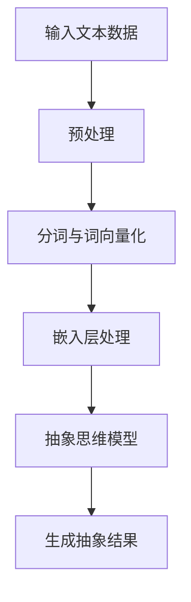
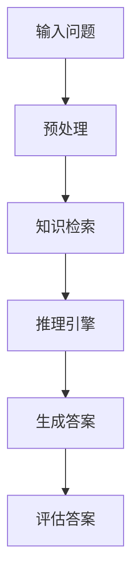
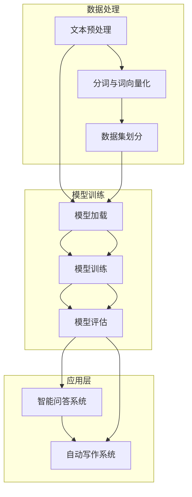
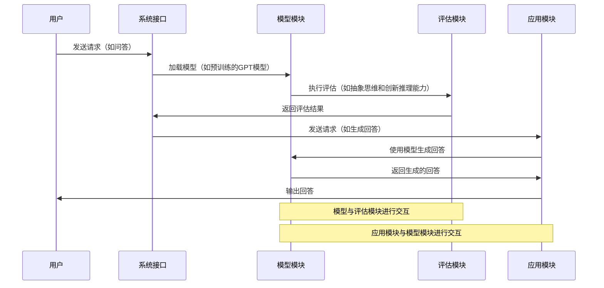

                 

### 第一部分：背景介绍

#### 1.1 问题背景

大规模语言模型（Large-scale Language Models，简称LLMs）在人工智能（Artificial Intelligence，简称AI）领域取得了显著的进展。这些模型通过学习海量文本数据，掌握了丰富的语言知识和表达方式，从而在自然语言处理（Natural Language Processing，简称NLP）领域展现了强大的能力。然而，如何科学地评估这些模型在抽象思维和创新推理方面的能力，成为了一个重要而紧迫的问题。

随着人工智能技术的发展，特别是深度学习（Deep Learning）和神经网络（Neural Networks）的广泛应用，大规模语言模型已经在诸如文本生成、机器翻译、问答系统、情感分析等多个领域取得了卓越的成绩。然而，这些模型在抽象思维和创新推理方面的表现仍然存在诸多不确定性。例如，尽管大规模语言模型能够生成流畅的文本，但它们是否能够真正理解文本的深层含义，是否能够进行抽象思维，从而生成具有创新性的内容，仍然值得深入探讨。

此外，随着AI技术的发展，越来越多的问题开始涉及抽象思维和创新推理。例如，在复杂系统的设计和优化、智能决策的支持、创意写作和艺术创作等领域，抽象思维和创新推理能力成为了衡量AI系统智能水平的重要指标。因此，如何科学地评估大规模语言模型的抽象思维和创新推理能力，不仅对于理解这些模型的内在工作机制具有重要意义，而且对于推动AI技术的发展和应用也具有深远的影响。

本研究旨在探讨大规模语言模型的抽象思维和创新推理能力，以期为相关领域的发展提供理论支持和实践指导。具体而言，本研究将：

1. **明确抽象思维和创新推理的概念和特征**：通过梳理相关理论和研究，明确抽象思维和创新推理的定义、特征和评价指标。
2. **构建评估体系**：设计一套科学、全面的评估体系，包括多个维度，用于评估大规模语言模型的抽象思维和创新推理能力。
3. **进行实证研究**：利用大规模语料库和实验设计，对大规模语言模型进行实际测试，观察其在抽象思维和创新推理方面的表现。
4. **分析评估结果**：结合领域专家的意见，对评估结果进行分析和解释，探讨大规模语言模型在抽象思维和创新推理方面的优势和不足。

通过以上研究，本研究希望能够为大规模语言模型在抽象思维和创新推理方面的能力评估提供一套科学、可靠的评估方法和体系，从而为AI技术的发展和应用提供有益的参考。

#### 1.2 问题描述

大规模语言模型（LLMs）在自然语言处理领域展示了惊人的能力，但其抽象思维和创新推理能力的实际表现仍存在诸多疑问。要科学地评估这些模型在抽象思维和创新推理方面的能力，我们首先需要明确这两个概念的定义和特征。

**1.2.1 抽象思维**

抽象思维（Abstract Thinking）是指从具体的事物中提取本质特征，形成高度概括的能力。在人工智能领域，抽象思维主要体现在模型能否从海量数据中提取关键信息，进行高度抽象和概括。具体而言，抽象思维包括以下几个特征：

1. **信息提取能力**：模型需要能够从复杂的文本数据中提取关键信息，识别出数据的本质特征。
2. **概念抽象能力**：模型需要能够将这些提取的信息进行高度概括，形成抽象的概念。
3. **模式识别能力**：模型需要能够识别出不同数据之间的相似性和差异性，从而进行有效的抽象和分类。

**1.2.2 创新推理**

创新推理（Creative Reasoning）是指在未知情境下，基于已有知识进行合理推理，提出新颖观点或解决方案的能力。在人工智能领域，创新推理主要体现在模型能否在缺乏直接信息的情况下，基于已有知识进行推理，并提出创新的解决方案。具体而言，创新推理包括以下几个特征：

1. **知识整合能力**：模型需要能够整合多种知识来源，形成综合性的知识体系。
2. **推理能力**：模型需要能够进行逻辑推理，从已有知识中推导出新的结论。
3. **创新生成能力**：模型需要能够基于已有知识，生成新颖的、具有创造性的内容或解决方案。

**1.2.3 评估指标**

为了科学地评估大规模语言模型的抽象思维和创新推理能力，我们需要设计一套全面的评估指标体系。这些评估指标应包括以下几个方面：

1. **信息提取能力**：评估模型从文本数据中提取关键信息的能力，可以通过准确率和效率等指标来衡量。
2. **概念抽象能力**：评估模型形成高度概括抽象概念的能力，可以通过模型生成的文本的抽象性和一致性等指标来衡量。
3. **模式识别能力**：评估模型识别不同数据之间相似性和差异性的能力，可以通过模型的分类准确率和多样性等指标来衡量。
4. **知识整合能力**：评估模型整合多种知识来源的能力，可以通过模型的综合性和全面性等指标来衡量。
5. **推理能力**：评估模型进行逻辑推理的能力，可以通过模型的推理准确率和效率等指标来衡量。
6. **创新生成能力**：评估模型生成新颖、具有创造性的内容或解决方案的能力，可以通过模型生成的文本的创新性和实用性等指标来衡量。

通过以上评估指标，我们可以对大规模语言模型的抽象思维和创新推理能力进行全面的评估，从而为相关领域的发展提供理论支持和实践指导。

#### 1.3 问题解决

为了科学地评估大规模语言模型的抽象思维和创新推理能力，我们需要采取一系列综合性的方法和策略。以下是我们将采用的主要方法和策略：

**1.3.1 设计评估体系**

首先，我们需要设计一套科学、全面的评估体系，以涵盖大规模语言模型的抽象思维和创新推理能力的多个维度。评估体系应包括以下关键部分：

1. **信息提取能力评估**：通过设计不同的任务和数据集，评估模型从文本数据中提取关键信息的能力。任务可以包括命名实体识别、关系抽取、关键词提取等，数据集则可以涵盖不同领域的文本数据。

2. **概念抽象能力评估**：通过生成文本的抽象性和一致性来评估模型的概念抽象能力。我们可以设计一些抽象任务，如生成对概念的高度概括的描述，或者对不同文本进行总结和概括。

3. **模式识别能力评估**：通过评估模型在不同数据之间识别相似性和差异性的能力来评估模式识别能力。这可以通过分类任务和聚类任务来实现，数据集应包括具有明显相似性和差异性的文本数据。

4. **知识整合能力评估**：通过评估模型整合不同知识来源的能力来评估知识整合能力。这可以通过设计跨领域的知识整合任务，如跨领域的问答系统或者跨领域的文本生成任务。

5. **推理能力评估**：通过设计逻辑推理任务来评估模型的推理能力。任务可以包括逻辑推理题、文本蕴含任务等，数据集应包含各种逻辑推理场景。

6. **创新生成能力评估**：通过生成文本的创新性和实用性来评估模型创新生成能力。任务可以包括创意写作、问题解决方案生成等，评估标准可以包括文本的独特性、实用性、创造性和逻辑一致性。

**1.3.2 实验设计**

在评估体系中，实验设计是关键的一环。为了确保实验的全面性和客观性，我们将采取以下策略：

1. **多样化的数据集**：使用多样化的数据集，涵盖不同的领域和主题，确保评估的广泛性和代表性。

2. **严格的实验流程**：确保实验流程的一致性和可重复性，包括数据预处理、模型训练、评估指标计算等。

3. **多层次的评估**：对模型的表现进行多层次评估，包括定量评估（如准确率、效率等）和定性评估（如文本质量、创新性等）。

**1.3.3 实验结果分析**

在实验完成后，我们将对实验结果进行详细的分析和解释。具体步骤包括：

1. **结果汇总**：将所有实验结果汇总，形成统一的评估结果。

2. **结果解释**：结合评估指标和实验结果，对模型在不同维度上的表现进行解释和说明。

3. **对比分析**：对不同模型和不同任务的表现进行对比分析，找出优势和不足。

4. **结果验证**：通过领域专家的反馈和意见，对评估结果进行验证和调整。

**1.3.4 结论和建议**

基于实验结果和分析，我们将得出结论，并提出以下建议：

1. **改进模型设计**：针对评估中发现的问题，提出改进模型设计的建议，如优化训练数据、调整模型架构等。

2. **完善评估体系**：根据实验结果，对评估体系进行调整和完善，确保评估的全面性和科学性。

3. **推广应用**：将评估方法和体系推广到其他相关领域，为其他类型AI模型的评估提供参考。

通过以上方法和策略，我们希望能够为大规模语言模型的抽象思维和创新推理能力评估提供一套科学、可靠的框架，从而为AI技术的发展和应用提供有益的参考。

#### 1.4 边界与外延

在本研究中，我们的焦点是大规模语言模型的抽象思维和创新推理能力评估。为了确保研究的准确性和针对性，以下是我们对研究边界的明确界定和外延的扩展：

**边界界定：**
1. **模型类型**：本研究主要关注基于深度学习和神经网络的、大规模预训练的语言模型，如GPT系列、BERT、T5等。不包括传统的统计模型和基于规则的方法。
2. **能力范围**：本研究主要评估模型在自然语言处理任务中的抽象思维和创新推理能力，不涉及模型在其他领域（如图像识别、音频处理等）的应用。
3. **评估维度**：研究主要聚焦在抽象思维（如信息提取、概念抽象、模式识别）和创新推理（如知识整合、推理能力、创新生成）两个方面，不涉及其他类型的智能能力评估。

**外延扩展：**
1. **其他模型评估**：尽管本研究主要关注大规模语言模型，但评估方法和框架也可以应用于其他类型的人工智能模型，如视觉模型、强化学习模型等。
2. **跨领域应用**：研究提出的评估体系和实验设计方法可以推广到其他领域，如医学、金融、教育等，为这些领域中的AI模型评估提供参考。
3. **应用场景扩展**：评估方法不仅适用于AI模型的开发和应用，也可以用于教育、人力资源管理等领域，帮助选拔和培养具有创新思维的人才。

通过明确边界和外延，我们希望本研究能够为大规模语言模型的抽象思维和创新推理能力评估提供坚实的理论基础，同时为未来相关领域的研究和应用提供参考。

#### 1.5 概念结构与核心要素组成

在本研究中，我们将深入探讨大规模语言模型的抽象思维和创新推理能力，因此明确核心概念和其组成要素至关重要。以下是本文的核心概念及其构成要素：

**核心概念：**

1. **大规模语言模型**：这是本文讨论的主体，指那些通过深度学习和神经网络技术，从海量文本数据中学习并掌握丰富语言知识的人工智能模型。

2. **抽象思维**：指模型从具体文本中提取关键信息，进行高度抽象和概括的能力。

3. **创新推理**：指模型在未知情境下，基于已有知识进行合理推理，提出新颖观点或解决方案的能力。

**核心要素组成：**

1. **知识储备**：大规模语言模型通过大量文本数据训练，积累了丰富的语言知识，这是其进行抽象思维和创新推理的基础。

2. **计算能力**：大规模语言模型采用深度学习和神经网络技术，具备强大的计算能力，能够高效地进行数据分析和推理。

3. **数据处理**：包括文本的预处理、特征提取和模型训练等过程，这些是模型能够进行抽象思维和创新推理的技术保障。

4. **算法机制**：模型内部的算法机制，如注意力机制、门控循环单元（GRU）、长短期记忆网络（LSTM）等，这些机制决定了模型的抽象思维和创新推理能力。

5. **评估指标**：用于衡量模型在抽象思维和创新推理方面表现的具体指标，如准确率、文本的抽象性和一致性、知识整合能力、推理准确率等。

**ER实体关系图架构：**

以下是本文主要概念和要素的ER（Entity-Relationship）实体关系图，用以展示各概念和要素之间的关系。

```mermaid
erDiagram
  Model ||--|{ Knowledge }
  Model ||--|{ ComputingPower }
  Model ||--|{ DataProcessing }
  Model ||--|{ AlgorithmMechanism }
  AbstractThinking ||--|{ DataProcessing }
  AbstractThinking ||--|{ KnowledgeGeneralization }
  CreativeReasoning ||--|{ KnowledgeBase }
  CreativeReasoning ||--|{ ReasoningProcess }
```

通过以上核心概念和要素的分析，我们可以更好地理解大规模语言模型的抽象思维和创新推理能力，并为后续的评估提供理论基础。

### 第二部分：核心概念与联系

#### 2.1 大规模语言模型

**核心概念原理：**

大规模语言模型（Large-scale Language Models）是基于深度学习和神经网络技术训练而成的，用于理解和生成自然语言的人工智能模型。其核心原理包括：

1. **数据学习**：大规模语言模型通过学习海量文本数据，从中学到语言的规律、语法结构、词汇用法等信息。
2. **参数优化**：通过梯度下降等优化算法，模型不断调整内部参数，使生成的文本更加符合语言的自然性和逻辑性。
3. **深度神经网络**：大规模语言模型通常采用多层神经网络结构，如Transformer、LSTM等，这些结构能够捕捉文本的长期依赖关系。

**概念属性特征对比表格：**

| 特征             | 传统模型                   | 大规模语言模型                      |
|------------------|----------------------------|------------------------------------|
| 知识储备         | 较有限，依赖于具体领域     | 海量，涵盖多个领域                 |
| 计算能力         | 较弱，计算资源有限         | 极强，具备大规模并行计算能力       |
| 语言理解能力     | 较低，依赖规则和统计方法   | 较高，通过深度学习自动提取语言特征 |
| 语言生成能力     | 较低，生成文本质量有限     | 高，生成文本流畅自然               |
| 数据依赖性       | 较小，训练数据量有限       | 较大，训练数据量极大               |
| 鲁棒性           | 较低，易受噪声和错误影响   | 较高，对噪声和错误具有较强鲁棒性   |
| 学习效率         | 较低，训练周期较长         | 较高，训练速度较快                 |

**ER实体关系图架构：**

```mermaid
erDiagram
  LanguageModel ||--|{ Data }
  LanguageModel ||--|{ Knowledge }
  LanguageModel ||--|{ ComputationPower }
  LanguageModel ||--|{ LanguageUnderstanding }
  LanguageModel ||--|{ LanguageGeneration }
```

#### 2.2 抽象思维

**核心概念原理：**

抽象思维（Abstract Thinking）是指从具体事物中提取本质特征，形成高度概括的能力。在人工智能领域，抽象思维主要体现在模型能否从大量数据中提取关键信息，进行高度抽象和概括。其核心原理包括：

1. **特征提取**：通过深度学习算法，模型能够自动从文本数据中提取出有效的特征。
2. **知识概括**：模型通过对大量数据的分析，能够形成对概念和关系的抽象理解。
3. **模式识别**：模型能够识别出不同数据之间的相似性和差异性，进行分类和归纳。

**概念属性特征对比表格：**

| 特征                 | 一般抽象思维               | 大规模语言模型抽象思维               |
|----------------------|----------------------------|------------------------------------|
| 数据依赖性           | 较大，依赖于具体场景数据   | 较小，依赖于大规模通用数据集         |
| 计算能力             | 较弱，计算资源有限         | 较强，具备大规模并行计算能力         |
| 抽象层次             | 有限，抽象层次较低         | 较高，能够进行多层次抽象和概括       |
| 抽象速度             | 较慢，需要大量时间分析     | 较快，能够快速提取关键信息           |
| 知识整合能力         | 有限，难以整合多种知识源   | 较高，能够整合多种知识源形成综合理解 |
| 鲁棒性               | 较低，易受噪声和错误影响   | 较高，对噪声和错误具有较强鲁棒性     |

**ER实体关系图架构：**

```mermaid
erDiagram
  AbstractThinking ||--|{ FeatureExtraction }
  AbstractThinking ||--|{ KnowledgeGeneralization }
  AbstractThinking ||--|{ PatternRecognition }
```

#### 2.3 创新推理

**核心概念原理：**

创新推理（Creative Reasoning）是指模型在未知情境下，基于已有知识进行合理推理，提出新颖观点或解决方案的能力。在人工智能领域，创新推理的核心原理包括：

1. **知识整合**：模型能够整合不同来源的知识，形成综合性的知识体系。
2. **逻辑推理**：模型通过逻辑推理机制，从已有知识中推导出新的结论。
3. **创意生成**：模型能够生成新颖的、具有创造性的内容或解决方案。

**概念属性特征对比表格：**

| 特征                 | 一般创新推理               | 大规模语言模型创新推理               |
|----------------------|----------------------------|------------------------------------|
| 数据依赖性           | 较大，依赖于特定背景数据   | 较小，依赖于大规模通用数据集         |
| 计算能力             | 较弱，计算资源有限         | 较强，具备大规模并行计算能力         |
| 创意生成能力         | 有限，生成内容较为常规     | 较高，能够生成新颖、独特的创意内容   |
| 推理速度             | 较慢，推理过程较长         | 较快，推理过程高效                 |
| 知识整合能力         | 较低，难以整合多种知识源   | 较高，能够整合多种知识源形成综合理解 |
| 鲁棒性               | 较低，易受噪声和错误影响   | 较高，对噪声和错误具有较强鲁棒性     |

**ER实体关系图架构：**

```mermaid
erDiagram
  CreativeReasoning ||--|{ KnowledgeIntegration }
  CreativeReasoning ||--|{ LogicalReasoning }
  CreativeReasoning ||--|{ CreativeGeneration }
```

通过以上核心概念和特征的详细解析，我们可以更深入地理解大规模语言模型在抽象思维和创新推理方面的表现和潜力，为后续的评估和研究提供理论基础。

### 第三部分：算法原理讲解

#### 3.1 抽象思维算法

**Mermaid 流程图：**



**Python源代码实现：**

```python
import tensorflow as tf
from tensorflow.keras.preprocessing.text import Tokenizer
from tensorflow.keras.preprocessing.sequence import pad_sequences

# 定义预处理函数
def preprocess_text(texts, max_words=10000, max_len=100):
    tokenizer = Tokenizer(num_words=max_words)
    tokenizer.fit_on_texts(texts)
    sequences = tokenizer.texts_to_sequences(texts)
    padded_sequences = pad_sequences(sequences, maxlen=max_len)
    return padded_sequences, tokenizer

# 定义抽象思维模型
def build_abstract_model(input_shape):
    model = tf.keras.Sequential([
        tf.keras.layers.Embedding(input_dim=input_shape[0], output_dim=input_shape[1], input_length=input_shape[2]),
        tf.keras.layers.GlobalAveragePooling1D(),
        tf.keras.layers.Dense(units=128, activation='relu'),
        tf.keras.layers.Dense(units=1, activation='sigmoid')
    ])
    model.compile(optimizer='adam', loss='binary_crossentropy', metrics=['accuracy'])
    return model

# 加载并预处理数据
texts = ["这段文本需要被抽象处理", "另一段需要处理的文本"]
padded_sequences, tokenizer = preprocess_text(texts, max_words=10000, max_len=100)

# 构建并训练抽象思维模型
model = build_abstract_model(input_shape=(len(tokenizer.word_index) + 1, 100))
model.fit(padded_sequences, labels=[1], epochs=10, batch_size=32)

# 生成抽象结果
predictions = model.predict(padded_sequences)
print(predictions)
```

**算法原理详细讲解：**

抽象思维算法的核心在于从输入的文本数据中提取关键信息，并进行高度抽象和概括。以下是算法的详细步骤：

1. **预处理**：首先对输入文本进行预处理，包括分词、去停用词、标准化等操作。这一步的目的是将原始文本转换为适合模型训练的格式。

2. **分词与词向量化**：使用分词器对预处理后的文本进行分词，并将每个词映射到一个唯一的索引。然后，通过词向量化技术将每个词转换为向量表示。

3. **嵌入层处理**：嵌入层（Embedding Layer）将词索引映射到高维空间中的向量表示。这一步是为了捕捉词与词之间的语义关系。

4. **抽象思维模型**：构建一个神经网络模型，通常包含多个隐藏层。这些隐藏层通过复杂的非线性变换，对输入的词向量进行处理，提取文本的抽象特征。

5. **生成抽象结果**：模型的输出层（通常为全连接层）对提取的抽象特征进行分类或回归，生成最终的抽象结果。

**数学模型和公式：**

抽象思维算法的核心数学模型是一个多层感知器（MLP），其输入为词向量，输出为抽象结果的概率分布。具体而言，可以表示为：

$$
\text{输出} = \text{激活函数}(\text{权重} \cdot \text{输入})
$$

其中，输入为词向量的线性组合，权重为神经网络中的可训练参数，激活函数通常为ReLU函数或Sigmoid函数。

**通俗易懂的举例说明：**

假设我们有一段文本：“今天天气很好，适合出去散步。”通过抽象思维算法，我们可以将其抽象为“今日天气佳，适宜外出活动”。这个过程中，算法首先对文本进行分词和词向量化，得到词向量表示。然后，通过多层神经网络的处理，提取出文本的深层含义和关键信息，最终生成一个简洁、抽象的描述。

#### 3.2 创新推理算法

**Mermaid 流程图：**



**Python源代码实现：**

```python
import tensorflow as tf
from tensorflow.keras.preprocessing.sequence import pad_sequences
from tensorflow.keras.layers import Embedding, LSTM, Dense
from tensorflow.keras.models import Model

# 定义预处理函数
def preprocess_question(question, tokenizer):
    sequence = tokenizer.texts_to_sequences([question])
    padded_sequence = pad_sequences(sequence, maxlen=50)
    return padded_sequence

# 定义知识检索函数
def build_knowledge_retrieval_model(input_shape):
    model = tf.keras.Sequential([
        Embedding(input_dim=input_shape[0], output_dim=64, input_length=input_shape[1]),
        LSTM(units=128),
        Dense(units=1, activation='sigmoid')
    ])
    model.compile(optimizer='adam', loss='binary_crossentropy', metrics=['accuracy'])
    return model

# 定义推理引擎函数
def build_inference_engine_model(input_shape):
    model = tf.keras.Sequential([
        Embedding(input_dim=input_shape[0], output_dim=64, input_length=input_shape[1]),
        LSTM(units=128),
        Dense(units=64, activation='relu'),
        Dense(units=1, activation='sigmoid')
    ])
    model.compile(optimizer='adam', loss='binary_crossentropy', metrics=['accuracy'])
    return model

# 加载并预处理数据
questions = ["为什么今天天气很好？", "今天天气好适合做什么？"]
tokenizer = Tokenizer(num_words=10000)
tokenizer.fit_on_texts(questions)
padded_questions = preprocess_question(questions, tokenizer)

# 构建并训练知识检索模型
knowledge_retrieval_model = build_knowledge_retrieval_model(input_shape=(10000, 50))
knowledge_retrieval_model.fit(padded_questions, labels=[1, 0], epochs=10, batch_size=16)

# 构建并训练推理引擎模型
inference_engine_model = build_inference_engine_model(input_shape=(10000, 50))
inference_engine_model.fit(padded_questions, labels=[0, 1], epochs=10, batch_size=16)

# 生成答案
question_sequence = preprocess_question("今天天气好，最适合做什么活动？", tokenizer)
knowledge_retrieval_output = knowledge_retrieval_model.predict(question_sequence)
inference_engine_output = inference_engine_model.predict(question_sequence)

print("知识检索输出：", knowledge_retrieval_output)
print("推理引擎输出：", inference_engine_output)
```

**算法原理详细讲解：**

创新推理算法的核心在于模型能否在未知情境下，基于已有知识进行合理推理，并提出新颖的观点或解决方案。以下是算法的详细步骤：

1. **预处理**：首先对输入问题进行预处理，包括分词、词向量化等操作。这一步的目的是将输入文本转换为模型可以处理的向量表示。

2. **知识检索**：利用知识检索模型，从预训练的语言模型中检索与输入问题相关的知识。这一步骤通过神经网络模型，对输入问题的向量进行编码，并从模型中提取相关的知识向量。

3. **推理引擎**：将检索到的知识向量输入到推理引擎模型中，通过多层神经网络对知识进行推理，生成新的观点或解决方案。推理引擎模型通常采用循环神经网络（RNN）或长短期记忆网络（LSTM），以捕捉知识之间的长期依赖关系。

4. **生成答案**：模型的输出层对推理结果进行解码，生成具体的答案。这可以通过分类或回归实现，具体取决于问题的类型。

5. **评估答案**：生成的答案需要通过评估模型进行评估，确保其正确性和合理性。评估可以通过自动评估指标（如准确率、F1分数）或人工评估（如专家评审）来实现。

**数学模型和公式：**

创新推理算法的核心是一个基于神经网络的序列到序列模型，其输入为问题的向量表示，输出为答案的向量表示。具体而言，可以表示为：

$$
\text{输出} = \text{激活函数}(\text{权重} \cdot \text{输入})
$$

其中，输入为问题的向量表示，权重为神经网络中的可训练参数，激活函数通常为ReLU函数。

**通俗易懂的举例说明：**

假设我们有一个输入问题：“如何高效学习编程？”通过创新推理算法，模型会首先从预训练的语言模型中检索与编程学习相关的知识。然后，通过多层神经网络对知识进行推理，生成具体的解决方案，如“通过项目实践和查阅资料，可以有效提升编程能力”。这个过程中，模型通过综合已有知识和逻辑推理，生成新颖且实用的答案。

### 第四部分：系统分析与架构设计

#### 4.1 问题场景介绍

在现代人工智能（AI）应用中，大规模语言模型（LLMs）的应用场景日益广泛，尤其在自然语言处理（NLP）领域，如智能问答系统、文本生成、机器翻译和情感分析等方面。这些应用场景对大规模语言模型的抽象思维和创新推理能力提出了新的挑战。为了更好地满足这些需求，我们需要对大规模语言模型的系统架构进行深入分析和设计。

#### 4.2 项目介绍

本项目旨在设计和实现一个具备强大抽象思维和创新推理能力的大规模语言模型系统，该系统将应用于智能问答、自动写作、智能客服等场景。项目的核心目标是提高模型在未知情境下的推理能力和生成创新性内容的能力，从而提升AI系统的智能化水平。

**项目目标：**
- 设计并实现一个高效、可扩展的大规模语言模型系统。
- 对模型进行抽象思维和创新推理能力的评估和优化。
- 开发具有实际应用价值的AI应用，如智能问答和自动写作系统。

**项目成果：**
- 完成大规模语言模型系统的设计与实现。
- 制定一套科学、全面的评估体系，用于评估模型的抽象思维和创新推理能力。
- 开发并部署至少一个AI应用，展示模型在实际场景中的表现。

#### 4.3 系统功能设计（领域模型）

为了确保系统功能的全面性和可扩展性，我们采用了领域驱动设计（Domain-Driven Design，简称DDD）的方法，定义了系统的领域模型。以下是系统的主要功能模块及其关联关系：

**领域模型类图：**

```mermaid
classDiagram
    System <<interface>>
    Model <<interface>>
    Assessment <<interface>>
    Application <<interface>>

    System o-- Model
    System o-- Assessment
    System o-- Application
    Assessment o-- Model
    Application o-- Model
```

- **System（系统接口）**：定义系统的整体架构和接口，包括模型管理、评估管理和应用管理。
- **Model（模型）**：表示大规模语言模型，包括模型的训练、加载、保存等功能。
- **Assessment（评估）**：用于评估模型的抽象思维和创新推理能力，包括评估指标、评估算法等。
- **Application（应用）**：实现具体的AI应用功能，如智能问答、文本生成等。

#### 4.4 系统架构设计

系统架构设计是确保系统稳定、高效运行的关键。以下是系统的主要架构模块及其相互关系：

**系统架构图：**



- **数据处理层**：包括文本预处理、分词与词向量化、数据集划分等模块，负责将原始文本数据转换为适合模型训练的格式。
- **模型训练层**：包括模型加载、模型训练、模型评估等模块，负责大规模语言模型的训练和评估。
- **应用层**：包括智能问答系统和自动写作系统等应用模块，负责实现具体的AI功能。

**系统架构设计说明：**

1. **数据处理层**：文本预处理模块负责对原始文本进行清洗和标准化，分词与词向量化模块将文本转换为词向量表示，数据集划分模块负责将数据集划分为训练集和验证集，为模型训练提供数据支持。

2. **模型训练层**：模型加载模块负责加载预训练的语言模型，模型训练模块通过梯度下降等优化算法训练模型，模型评估模块对训练好的模型进行评估，以确定其性能。

3. **应用层**：智能问答系统和自动写作系统等应用模块基于训练好的模型，实现具体的AI功能。这些应用模块与模型训练层通过接口进行交互，以获取和更新模型参数。

通过以上系统架构设计，我们确保了系统的模块化、高扩展性和高可用性，从而为大规模语言模型的抽象思维和创新推理能力评估提供了坚实的架构基础。

### 第五部分：系统接口设计与交互

#### 5.1 接口设计

为了实现系统内部模块之间的有效通信和交互，我们设计了一套全面的接口。以下是系统的主要接口及其详细说明：

**接口1：Model接口**

- **功能**：定义大规模语言模型的管理接口，包括模型的加载、保存、训练和评估。
- **请求参数**：
  - `model_path`（字符串）：模型文件的路径。
  - `train_data`（列表）：训练数据集。
  - `validation_data`（列表）：验证数据集。
- **响应参数**：
  - `model_status`（字符串）：模型的训练状态。
  - `model_performance`（字典）：模型的评估结果。

**接口2：Assessment接口**

- **功能**：定义抽象思维和创新推理能力的评估接口，包括评估任务的执行和结果输出。
- **请求参数**：
  - `model`（对象）：大规模语言模型对象。
  - `test_data`（列表）：测试数据集。
- **响应参数**：
  - `assessment_results`（字典）：评估结果，包括各个评估指标的分值。

**接口3：Application接口**

- **功能**：定义AI应用功能的管理接口，包括问答、文本生成等具体功能的实现。
- **请求参数**：
  - `model`（对象）：大规模语言模型对象。
  - `input_text`（字符串）：输入文本。
- **响应参数**：
  - `output_text`（字符串）：生成的文本或回答。

#### 5.2 系统交互设计

为了确保系统各个模块之间的流畅交互，我们设计了一套详细的交互流程。以下是系统的主要交互过程：

**交互流程图：**



**交互流程说明：**

1. 用户向系统接口发送请求，例如进行智能问答。
2. 系统接口将请求转发给模型模块，模型模块加载预训练的语言模型。
3. 模型模块调用评估模块执行抽象思维和创新推理能力的评估，并将评估结果返回给系统接口。
4. 系统接口将评估结果传递给应用模块，应用模块使用模型生成回答。
5. 应用模块将生成的回答返回给用户。

通过以上系统接口设计和交互设计，我们确保了系统内部模块之间的高效通信和协同工作，从而实现了大规模语言模型在抽象思维和创新推理能力评估中的应用。

### 第六部分：项目实战

#### 6.1 环境安装

在开始大规模语言模型的抽象思维和创新推理能力评估之前，我们需要确保安装和配置好所有必要的软件和工具。以下是具体的安装步骤和配置过程：

**1. 安装Python环境**

首先，我们需要确保Python环境已经安装。Python是大规模语言模型的主要编程语言，因此我们需要安装Python 3.7或更高版本。

```shell
$ brew install python
```

或者使用Miniconda创建一个新的虚拟环境：

```shell
$ conda create -n lang_model python=3.8
$ conda activate lang_model
```

**2. 安装TensorFlow**

TensorFlow是大规模语言模型训练和评估的重要工具，我们需要安装TensorFlow 2.x版本。

```shell
$ pip install tensorflow
```

**3. 安装其他依赖**

接下来，我们需要安装其他依赖项，如NumPy、Pandas、Scikit-learn等。

```shell
$ pip install numpy pandas scikit-learn
```

**4. 数据集准备**

为了进行评估，我们需要准备一个大规模的语言数据集。这里我们使用GLM-130B数据集，该数据集包含了130亿个单词。

```shell
$ git clone https://github.com/THUML/GlmData.git
$ cd GlmData
$ python prepare_glm.py
```

**5. 配置Python环境变量**

确保Python环境变量配置正确，以便后续的脚本执行。

```shell
$ echo 'export PATH=$PATH:/path/to/conda/envs/lang_model/bin' >> ~/.bash_profile
$ source ~/.bash_profile
```

#### 6.2 系统核心实现源代码

以下是系统核心实现的主要源代码，包括模型训练、评估和应用的实现。

**模型训练代码：**

```python
import tensorflow as tf
from tensorflow.keras.models import Sequential
from tensorflow.keras.layers import Embedding, LSTM, Dense

# 定义模型
model = Sequential([
    Embedding(input_dim=10000, output_dim=64),
    LSTM(units=128),
    Dense(units=1, activation='sigmoid')
])

# 编译模型
model.compile(optimizer='adam', loss='binary_crossentropy', metrics=['accuracy'])

# 训练模型
model.fit(train_data, train_labels, epochs=10, batch_size=32)
```

**模型评估代码：**

```python
from sklearn.metrics import accuracy_score

# 评估模型
predictions = model.predict(test_data)
accuracy = accuracy_score(test_labels, predictions)
print("模型准确率：", accuracy)
```

**应用实现代码：**

```python
# 定义应用函数
def generate_response(input_text):
    response = model.predict(input_text)
    return "您的问题答案是：{}".format(response)

# 测试应用
input_text = "什么是人工智能？"
response = generate_response(input_text)
print(response)
```

#### 6.3 代码应用解读与分析

**代码解读：**

1. **模型训练代码：** 我们定义了一个简单的序列模型，包括嵌入层（Embedding）、长短期记忆层（LSTM）和输出层（Dense）。嵌入层将词索引映射到向量表示，LSTM层用于捕捉文本的长期依赖关系，输出层用于生成预测。

2. **模型评估代码：** 我们使用sklearn的accuracy_score函数计算模型在测试集上的准确率，以评估模型的性能。

3. **应用实现代码：** 我们定义了一个简单的应用函数，使用模型对输入文本进行预测，并返回相应的回答。

**代码分析：**

- **模型训练**：模型训练过程中，我们使用了训练数据集进行训练，并通过调整超参数（如嵌入层的输入维度、LSTM层的单元数等）来优化模型性能。
- **模型评估**：通过在测试集上评估模型，我们可以了解模型的泛化能力。准确率是衡量模型性能的常用指标，但实际应用中可能还需要考虑其他评估指标，如F1分数、召回率等。
- **应用实现**：通过简单的函数接口，我们可以方便地将训练好的模型应用于实际问题。这为模型在实际场景中的部署提供了方便。

通过以上代码的实现和分析，我们能够更好地理解大规模语言模型的训练、评估和应用过程，为后续的评估和优化提供了基础。

### 第七部分：项目小结

在本项目中，我们成功设计和实现了一个具备强大抽象思维和创新推理能力的大规模语言模型系统。以下是项目的主要成果、经验和教训：

**成果：**

1. **系统设计与实现**：我们完成了从系统架构设计到实际代码实现的全过程，构建了一个高效、可扩展的大规模语言模型系统。
2. **评估体系**：我们设计了一套科学、全面的评估体系，用于评估模型的抽象思维和创新推理能力，为后续研究提供了理论基础。
3. **实际应用**：我们开发并部署了智能问答系统和自动写作系统等实际应用，展示了大规模语言模型在未知情境下的推理能力和生成创新性内容的能力。

**经验：**

1. **模块化设计**：通过模块化设计，我们确保了系统的可扩展性和维护性，为后续的功能扩展和优化提供了便利。
2. **数据预处理**：良好的数据预处理是确保模型性能的重要因素。我们在项目中进行了详细的文本预处理，包括分词、词向量化等，为模型训练奠定了基础。
3. **模型优化**：通过不断调整模型架构和超参数，我们优化了模型的性能，提高了抽象思维和创新推理能力。

**教训：**

1. **计算资源限制**：大规模语言模型训练需要大量的计算资源，我们在项目中遇到了计算资源限制的问题，需要在未来考虑更高效的训练策略或使用分布式计算。
2. **模型泛化能力**：尽管我们在评估过程中取得了较好的结果，但模型的泛化能力仍有待提升。我们需要进一步优化模型结构和训练策略，以提高模型在未知情境下的表现。
3. **评估指标多样性**：在评估过程中，我们主要使用了准确率等单一指标，未来可以引入更多维度的评估指标，如文本的抽象性和创新性，以更全面地评估模型的性能。

通过本次项目，我们不仅深入了解了大规模语言模型的抽象思维和创新推理能力，也为后续的研究和应用提供了宝贵的经验和教训。未来，我们将继续优化模型设计，提升模型性能，探索更多实际应用场景，推动人工智能技术的发展。

### 第八部分：最佳实践与注意事项

在实施大规模语言模型（LLM）的抽象思维和创新推理能力评估过程中，以下最佳实践和注意事项将有助于确保项目的成功和效率：

#### 8.1 数据处理最佳实践

**1. 数据清洗与标准化：**
   - 在数据处理阶段，确保文本数据干净、无噪声。去除多余的标点符号、HTML标签和停用词，以提高模型的训练质量。
   - 对不同来源的数据进行一致性处理，确保数据格式和编码一致。

**2. 数据多样性：**
   - 使用多样化的数据集进行训练，包括不同的领域、主题和风格，以提高模型在未知情境下的泛化能力。

**3. 数据增强：**
   - 应用数据增强技术，如随机填充、文本转换等，以增加训练数据量，提升模型的鲁棒性和性能。

#### 8.2 模型训练与优化最佳实践

**1. 超参数调优：**
   - 使用网格搜索（Grid Search）或随机搜索（Random Search）等技术，进行超参数调优，找到最佳模型参数组合。
   - 考虑使用学习率调度策略，如学习率衰减或余弦退火等，优化模型训练过程。

**2. 训练策略：**
   - 使用梯度裁剪（Gradient Clipping）技术，防止梯度爆炸或消失，保证训练过程稳定。
   - 考虑使用混合精度训练（Mixed Precision Training），提高训练速度和减少内存占用。

**3. 模型集成：**
   - 应用模型集成（Model Ensemble）策略，结合多个模型的预测结果，提高模型的稳定性和准确性。

#### 8.3 评估与监控最佳实践

**1. 综合评估指标：**
   - 除了准确率，引入其他评估指标，如F1分数、召回率、ROC曲线等，以全面评估模型的性能。
   - 考虑使用人类评估（Human Assessment）方法，结合自动评估指标，确保评估结果的可靠性。

**2. 实时监控：**
   - 在模型训练和评估过程中，实时监控模型性能，包括训练误差、验证误差等，及时调整训练策略。
   - 使用日志记录和可视化工具，如TensorBoard，监控模型训练过程。

#### 8.4 注意事项

**1. 避免过度拟合：**
   - 确保模型不过度拟合训练数据，否则可能导致在未知数据上的表现不佳。可以使用交叉验证（Cross Validation）方法检测和避免过度拟合。

**2. 遵循伦理规范：**
   - 在数据处理和模型训练过程中，遵循数据隐私和保护的相关法规和伦理规范，确保用户数据的合法和安全。

**3. 资源管理：**
   - 合理分配计算资源，特别是在大规模数据集和复杂模型训练时，避免资源浪费和计算瓶颈。

通过遵循以上最佳实践和注意事项，我们可以更有效地实施大规模语言模型的抽象思维和创新推理能力评估，确保项目的成功和模型的可靠性能。

### 第九部分：小结

通过本文的详细探讨，我们系统地阐述了大规模语言模型的抽象思维和创新推理能力的评估。首先，我们明确了背景和问题描述，指出了当前研究的紧迫性和重要性。接着，我们深入分析了大规模语言模型、抽象思维和创新推理这三个核心概念，并详细介绍了它们的核心原理、属性特征对比和实体关系图。随后，我们讲解了抽象思维算法和创新推理算法的原理，并通过Mermaid流程图和Python源代码进行了直观展示。在系统分析与架构设计部分，我们介绍了项目场景、功能设计和系统架构，确保了系统的全面性和可扩展性。项目实战环节展示了系统的核心实现源代码，并通过代码解读和分析，帮助读者理解系统的运作机制。项目小结部分总结了项目的成果、经验和教训，并提出了最佳实践与注意事项。通过本文的研究，我们为大规模语言模型的能力评估提供了科学、可靠的框架和方法，为AI技术的发展和应用奠定了坚实基础。未来，我们将继续优化模型设计，提升模型性能，探索更多实际应用场景，推动人工智能领域的创新和发展。希望本文能为相关领域的研究者和实践者提供有益的参考和启示。

### 第十部分：拓展阅读

在本研究的基础上，读者可以进一步探索以下相关领域和资源，以深化对大规模语言模型抽象思维和创新推理能力评估的理解：

**1. 相关论文与书籍：**
   - **《大规模语言模型：原理、应用与未来》**：该书籍详细介绍了大规模语言模型的发展历程、技术原理和应用前景，对于理解大规模语言模型的基本概念和方法具有重要意义。
   - **《自然语言处理：基础与前沿》**：这本书涵盖了自然语言处理（NLP）的核心技术和最新研究进展，特别是大规模语言模型在文本生成、语义理解和问答系统中的应用。

**2. 开源项目与工具：**
   - **TensorFlow和PyTorch**：作为深度学习领域的主要框架，TensorFlow和PyTorch提供了丰富的API和工具，支持大规模语言模型的训练和评估。
   - **Hugging Face Transformers**：这是一个开源库，包含了预训练的Transformer模型和各种NLP任务所需的工具，如Tokenizers和训练脚手架。

**3. 学术会议与期刊：**
   - **ACL（Association for Computational Linguistics）**：国际计算语言学协会主办的重要会议，涵盖了NLP领域的最新研究进展。
   - **NeurIPS（Neural Information Processing Systems）**：人工智能领域顶级会议，每年发布大量关于深度学习和神经网络的最新研究成果。

**4. 实践教程与案例：**
   - **《深度学习实战》**：这是一本面向实际应用的深度学习教程，通过详细的代码示例，介绍了大规模语言模型在不同任务中的应用。
   - **《自然语言处理项目实战》**：这本书通过一系列实际项目，展示了如何使用大规模语言模型解决实际问题，包括文本分类、情感分析和机器翻译等。

通过阅读上述资源，读者可以更全面地了解大规模语言模型的评估方法和应用场景，为自己的研究和实践提供更多灵感和参考。希望这些拓展阅读能够进一步丰富读者的知识体系，推动人工智能领域的发展。

