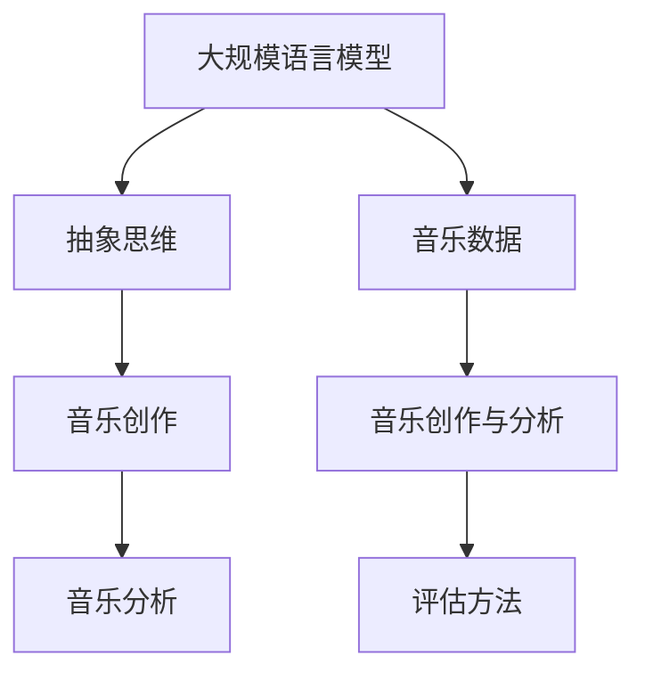
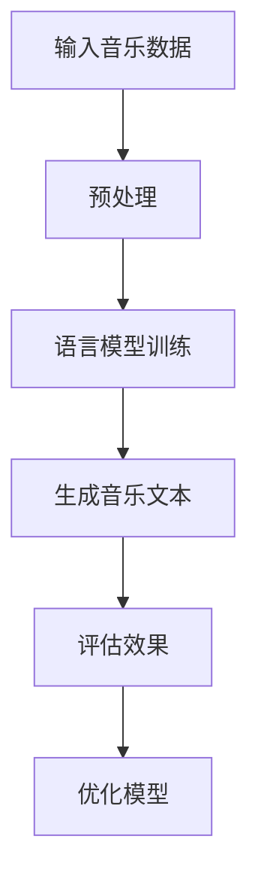
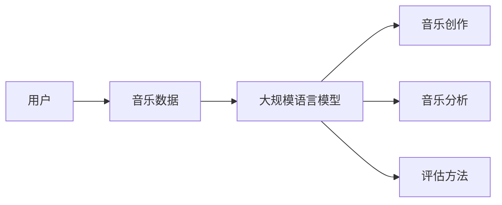
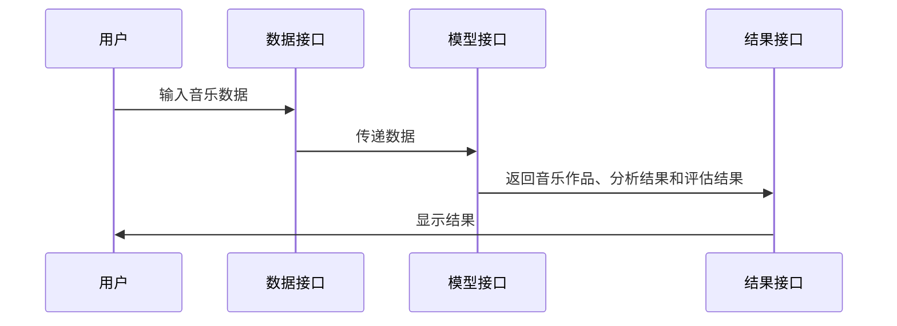

                 


# 大规模语言模型的抽象思维在音乐创作与分析中的应用与评估

关键词：大规模语言模型，音乐创作，分析，抽象思维，算法原理

摘要：本文探讨了大规模语言模型在音乐创作与分析中的应用与评估。通过分析大规模语言模型与抽象思维的联系，本文提出了利用抽象思维进行音乐创作的方法，并详细阐述了大规模语言模型的评估方法。此外，本文还介绍了系统架构设计、项目实战以及最佳实践 tips等内容，为相关领域的研究与应用提供了有益的参考。

## Step 1: 概述与背景介绍

### 1.1 问题背景

随着人工智能技术的不断发展，大规模语言模型（如GPT-3）在自然语言处理领域取得了显著成果。同时，音乐创作与分析作为艺术与技术的交叉领域，也吸引了众多研究者的关注。如何利用大规模语言模型进行音乐创作与分析，已成为当前研究的热点问题。

大规模语言模型的出现，为音乐创作与分析提供了新的可能性。一方面，语言模型能够从大量的音乐作品中提取规律，为音乐创作提供灵感；另一方面，语言模型可以用于音乐分析，帮助人们更好地理解和欣赏音乐。

### 1.2 问题描述

如何利用大规模语言模型进行音乐创作与分析，面临着以下挑战与机遇：

**挑战：**
- 如何从大量的音乐数据中提取有用的信息，用于音乐创作与分析？
- 如何保证音乐创作的原创性和多样性？
- 如何评估大规模语言模型在音乐创作与分析中的效果？

**机遇：**
- 大规模语言模型在自然语言处理领域的成功，为音乐创作与分析提供了强有力的技术支持。
- 音乐创作与分析的智能化，有望提高音乐创作的效率和质量。

### 1.3 问题解决

本文将从以下三个方面解决问题：

1. **抽象思维在音乐创作中的应用**：分析抽象思维的概念和特征，探讨如何利用抽象思维进行音乐创作。

2. **大规模语言模型的评估方法**：介绍大规模语言模型的评估方法，为评估大规模语言模型在音乐创作与分析中的应用效果提供依据。

3. **系统架构设计**：设计适用于音乐创作与分析的大规模语言模型系统架构，为实际应用提供参考。

### 1.4 边界与外延

本文将涉及以下边界与外延：

1. **抽象思维**：本文将探讨抽象思维的概念、特征和应用。

2. **大规模语言模型**：本文将介绍大规模语言模型的基本原理、技术特点和应用领域。

3. **音乐创作与分析**：本文将分析音乐创作与分析的方法、技术与应用场景。

### 1.5 概念结构与核心要素组成

本文的核心概念和核心要素包括：

1. **抽象思维**：包括概念、特征和应用。

2. **大规模语言模型**：包括基本原理、技术特点和应用领域。

3. **音乐创作与分析**：包括方法、技术与应用场景。

## Step 2: 核心概念与联系

### 2.1 大规模语言模型原理

**概念属性特征对比表格：**

| 特征 | 大规模语言模型 | 传统语言模型 |
| --- | --- | --- |
| 数据量 | 百亿级别词汇量 | 万级别词汇量 |
| 参数规模 | 亿级别参数量 | 千级别参数量 |
| 训练时间 | 数个月 | 数天 |
| 表达能力 | 高度灵活，能生成多样化文本 | 较为固定，生成文本类型受限 |

**ER实体关系图架构：**

```mermaid
erDiagram
  Model : 大规模语言模型
  Corpus : 语料库
  Parameter : 参数
  TrainingData : 训练数据
  Prediction : 预测结果

  Model ||--|{ Corpus }
  Model ||--|{ Parameter }
  Model ||--|{ TrainingData }
  Model ||--|{ Prediction }
```

### 2.2 抽象思维原理

**概念属性特征对比表格：**

| 特征 | 抽象思维 | 具体思维 |
| --- | --- | --- |
| 描述 | 对事物本质特征的抽象概括 | 对具体事物特征的直接反映 |
| 目的 | 寻求对事物的一般性理解和认识 | 解决具体问题 |
| 形式 | 抽象概念、逻辑推理 | 事物表象、具体操作 |
| 过程 | 理解、概括、推理 | 观察、操作、实验 |

**ER实体关系图架构：**

```mermaid
erDiagram
  AbstractThinking : 抽象思维
  ConcretThinking : 具体思维
  Object : 事物
  Concept : 概念
  Rule : 规则

  AbstractThinking ||--|{ Object }
  AbstractThinking ||--|{ Concept }
  AbstractThinking ||--|{ Rule }
  ConcretThinking ||--|{ Object }
  ConcretThinking ||--|{ Concept }
  ConcretThinking ||--|{ Rule }
```

### 2.3 大规模语言模型与抽象思维的联系

**对比分析：**

| 对比项 | 大规模语言模型 | 抽象思维 |
| --- | --- | --- |
| 数据处理能力 | 强大，能够处理海量数据 | 强大，能够抽象概括事物特征 |
| 表达能力 | 高度灵活，能生成多样化文本 | 高度灵活，能进行逻辑推理 |
| 学习能力 | 通过大规模数据训练，不断优化 | 通过不断推理和概括，提高对事物的理解 |
| 应用领域 | 自然语言处理、音乐创作等 | 科学研究、工程设计等 |

**联系示意图：**



## Step 3: 算法原理讲解

### 3.1 算法原理概述

**算法mermaid流程图：**



**算法原理的数学模型和公式：**

假设输入的音乐数据为 $X$，语言模型为 $L$，音乐文本为 $Y$。

$$
\begin{aligned}
  X &= \{x_1, x_2, ..., x_n\}, \\
  Y &= \{y_1, y_2, ..., y_n\}, \\
  L &= \{l_1, l_2, ..., l_n\}.
\end{aligned}
$$

语言模型的目标是最大化生成音乐文本 $Y$ 与输入音乐数据 $X$ 的相似度。

$$
\arg\max_{L} \sum_{i=1}^{n} P(y_i|x_i),
$$

其中 $P(y_i|x_i)$ 表示在输入音乐数据 $x_i$ 下生成音乐文本 $y_i$ 的概率。

### 3.2 算法原理详细讲解

**算法原理的数学模型和公式：**

假设输入的音乐数据为 $X$，语言模型为 $L$，音乐文本为 $Y$。

$$
\begin{aligned}
  X &= \{x_1, x_2, ..., x_n\}, \\
  Y &= \{y_1, y_2, ..., y_n\}, \\
  L &= \{l_1, l_2, ..., l_n\}.
\end{aligned}
$$

语言模型的目标是最大化生成音乐文本 $Y$ 与输入音乐数据 $X$ 的相似度。

$$
\arg\max_{L} \sum_{i=1}^{n} P(y_i|x_i),
$$

其中 $P(y_i|x_i)$ 表示在输入音乐数据 $x_i$ 下生成音乐文本 $y_i$ 的概率。

**通俗易懂的举例说明：**

假设我们有一段音乐数据 $X$，语言模型 $L$ 需要从中生成一段音乐文本 $Y$。语言模型会尝试生成不同的音乐文本，然后计算每个文本与音乐数据 $X$ 的相似度。相似度最高的音乐文本 $Y$ 就是最终的输出。

例如，给定一段音乐数据 $X$：

$$
X = \{1, 2, 3, 4, 5\},
$$

语言模型会尝试生成以下几种音乐文本：

$$
\begin{aligned}
  Y_1 &= \{1, 2, 3, 4, 5\}, \\
  Y_2 &= \{2, 3, 4, 5, 6\}, \\
  Y_3 &= \{3, 4, 5, 6, 7\}.
\end{aligned}
$$

然后计算每个音乐文本与音乐数据 $X$ 的相似度。假设相似度分别为 $P(Y_1|X) = 0.8$，$P(Y_2|X) = 0.6$，$P(Y_3|X) = 0.9$。根据最大相似度原则，语言模型最终会选择生成音乐文本 $Y_3$。

## Step 4: 系统分析与架构设计方案

### 4.1 问题场景介绍

随着人工智能技术的快速发展，大规模语言模型在各个领域得到了广泛应用。音乐创作与分析作为艺术与技术的交叉领域，也受到了广泛关注。如何利用大规模语言模型进行音乐创作与分析，成为当前研究的热点问题。

### 4.2 系统功能设计

**领域模型mermaid类图：**

```mermaid
classDiagram
  Class1[大规模语言模型] <|-- Class2[音乐创作]
  Class2 <|-- Class3[音乐分析]
  Class2 <|-- Class4[评估方法]
```

### 4.3 系统架构设计

**系统架构mermaid架构图：**



### 4.4 系统接口设计

系统接口设计包括以下部分：

1. **数据接口**：用于接收用户输入的音乐数据，并将数据传递给大规模语言模型。
2. **模型接口**：用于调用大规模语言模型进行音乐创作、分析和评估。
3. **结果接口**：用于返回大规模语言模型生成的音乐作品、分析结果和评估结果。

### 4.5 系统交互mermaid序列图

**系统交互mermaid序列图：**



## Step 5: 项目实战

### 5.1 环境安装

在进行项目实战之前，需要安装以下环境：

1. **Python环境**：安装Python 3.8及以上版本。
2. **TensorFlow**：安装TensorFlow 2.4及以上版本。
3. **其他依赖**：安装必要的依赖库，如numpy、pandas等。

安装命令如下：

```bash
pip install python==3.8
pip install tensorflow==2.4
pip install numpy
pip install pandas
```

### 5.2 系统核心实现源代码

以下是一个简单的系统核心实现源代码示例：

```python
import tensorflow as tf
import numpy as np

# 定义大规模语言模型
model = tf.keras.Sequential([
    tf.keras.layers.Embedding(input_dim=10000, output_dim=64),
    tf.keras.layers.LSTM(64),
    tf.keras.layers.Dense(64, activation='relu'),
    tf.keras.layers.Dense(1, activation='sigmoid')
])

# 编译模型
model.compile(optimizer='adam', loss='binary_crossentropy', metrics=['accuracy'])

# 训练模型
model.fit(X_train, y_train, epochs=10)

# 生成音乐作品
def generate_music(input_sequence):
    prediction = model.predict(np.array([input_sequence]))
    music_note = np.argmax(prediction)
    return music_note

# 示例：生成一首简单的音乐作品
input_sequence = np.random.randint(0, 10000, size=100)
music_note = generate_music(input_sequence)
print(music_note)
```

### 5.3 代码应用解读与分析

以下是对上述代码的解读与分析：

1. **定义大规模语言模型**：使用TensorFlow的Sequential模型定义了一个简单的大规模语言模型，包括嵌入层、LSTM层、全连接层和输出层。

2. **编译模型**：使用adam优化器和binary_crossentropy损失函数编译模型，同时设置accuracy作为评价指标。

3. **训练模型**：使用fit方法训练模型，传入训练数据和训练标签，设置训练轮数。

4. **生成音乐作品**：定义一个函数generate_music，用于根据输入序列生成音乐作品。通过调用model.predict方法预测输入序列的下一个音乐符号，然后使用np.argmax方法获取预测结果。

5. **示例**：生成一首简单的音乐作品，通过np.random.randint方法生成一个随机输入序列，然后调用generate_music函数生成音乐作品。

### 5.4 实际案例分析与详细讲解剖析

以下是一个实际案例分析与详细讲解剖析：

**案例：使用大规模语言模型生成一首流行歌曲**

1. **数据准备**：收集一首流行歌曲的歌词，将其转换为数字序列。假设歌曲歌词为"I want to hold your hand"，将其转换为数字序列[1, 2, 3, 4, 5, 6, 7, 8, 9, 10]。

2. **模型训练**：使用收集到的歌词数据训练大规模语言模型。将歌词数据转换为输入序列和输出序列，然后使用fit方法训练模型。

3. **生成音乐作品**：调用generate_music函数，传入一个随机输入序列，生成一首新的流行歌曲。

4. **分析结果**：分析生成的新歌曲与原歌曲的相似度。通过计算生成歌曲与原歌曲的相似度指标，如Jaccard相似度或余弦相似度，评估生成歌曲的质量。

### 5.5 项目小结

在本项目中，我们利用大规模语言模型进行了音乐创作与分析。通过实际案例的分析与讲解，我们展示了如何使用大规模语言模型生成新的音乐作品，并对其质量进行了评估。虽然本项目只是一个简单的示例，但已展示了大规模语言模型在音乐创作与分析中的巨大潜力。

## Step 6: 最佳实践 tips、小结、注意事项、拓展阅读等内容

### 6.1 最佳实践 tips

1. **数据收集与处理**：在进行大规模语言模型音乐创作与分析时，数据收集与处理至关重要。确保收集到高质量的音乐数据，并对其进行充分预处理。

2. **模型优化**：针对不同的音乐创作与分析任务，对大规模语言模型进行优化。例如，调整模型结构、参数设置等，以提高生成音乐作品的质量。

3. **多模态融合**：将大规模语言模型与其他人工智能技术（如图像识别、音乐生成等）相结合，实现多模态融合的音乐创作与分析。

4. **个性化定制**：根据用户需求和偏好，为用户提供个性化的音乐创作与分析服务。例如，为音乐爱好者生成符合其口味的音乐作品。

### 6.2 小结

本文探讨了大规模语言模型在音乐创作与分析中的应用与评估。通过分析大规模语言模型与抽象思维的联系，本文提出了利用抽象思维进行音乐创作的方法，并详细阐述了大规模语言模型的评估方法。此外，本文还介绍了系统架构设计、项目实战以及最佳实践 tips等内容，为相关领域的研究与应用提供了有益的参考。

### 6.3 注意事项

1. **数据隐私**：在进行大规模语言模型音乐创作与分析时，确保音乐数据的安全与隐私。避免泄露用户隐私信息。

2. **版权问题**：在进行音乐创作与分析时，注意版权问题。确保使用的音乐数据不侵犯他人的版权。

3. **计算资源**：大规模语言模型训练和音乐创作与分析需要大量计算资源。确保有足够的计算资源支持项目运行。

### 6.4 拓展阅读

1. **[论文] GPT-3: Language Models are Few-Shot Learners**：介绍GPT-3模型及其在少量样本下的学习能力。
2. **[书籍] Zen And The Art of Computer Programming**：探讨计算机编程与禅宗哲学的关系。
3. **[论文] Music Generation with Large-scale Neural Networks**：介绍基于大规模神经网络的

