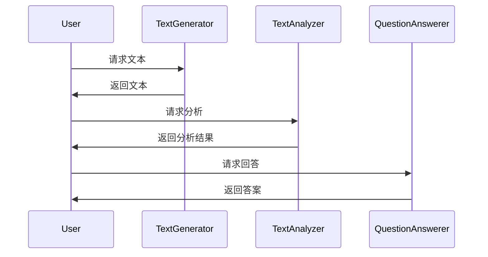
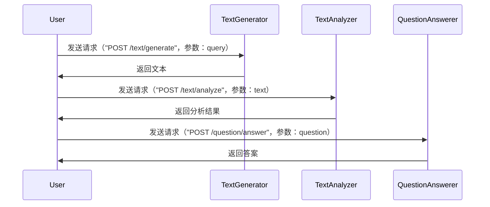

                 


## 引言与背景介绍

### 大规模语言模型概述

**关键词**：大规模语言模型，神经网络，自然语言处理

**摘要**：本章将介绍什么是大规模语言模型，以及它们在自然语言处理中的应用和发展历程。

大规模语言模型是自然语言处理（Natural Language Processing，NLP）领域的一项重要技术。它们通过学习海量文本数据，来理解和生成自然语言。这些模型通常由神经网络架构组成，能够自动提取语言中的结构信息和语义信息。

**背景**：

- 语言模型的发展历程：
  - 早期：基于规则的方法，如统计语法分析。
  - 中期：基于统计模型的方法，如N-gram语言模型。
  - 现代：基于深度学习的方法，如基于Transformer的BERT模型。

- 应用领域：
  - 文本分类：如情感分析、垃圾邮件过滤。
  - 机器翻译：如Google翻译、微软翻译。
  - 聊天机器人：如Apple的Siri、Google的Duplex。

### 抽象思维能力的重要性

**关键词**：抽象思维，认知能力，教育

**摘要**：本章将讨论抽象思维能力在人类认知和职业发展中的作用，以及为什么需要培养这种能力。

**定义**：抽象思维是一种从具体事物中提取共同特征并进行概括的能力。它是人类认知的核心能力之一。

**重要性**：

- 在教育中的作用：
  - 培养学生的批判性思维。
  - 提高学习效率，更好地理解和应用知识。
- 在职业发展中的作用：
  - 帮助专业人士进行复杂的决策。
  - 提高创新能力，推动技术进步。

### 大规模语言模型与抽象思维能力培养的关系

**关键词**：语言模型，抽象思维，人工智能教育

**摘要**：本章将探讨大规模语言模型如何通过模拟人类的语言学习过程，帮助培养抽象思维能力。

**关系**：

- 模拟人类语言学习过程：
  - 大规模语言模型通过学习大量的文本数据，能够自动提取语言中的抽象概念和结构。
  - 这种学习过程与人类的语言学习过程有相似之处，可以用来模拟和培养抽象思维能力。
- 培养抽象思维能力：
  - 大规模语言模型可以用于教育领域，帮助学习者更好地理解和应用抽象概念。
  - 它们可以作为辅助工具，提高学习者的抽象思维能力和逻辑推理能力。

**研究现状与挑战**：

- 当前研究现状：
  - 大规模语言模型在抽象思维能力的培养方面已有一些初步的探索，但仍有很大的发展空间。
  - 需要进一步研究如何更好地利用这些模型来培养抽象思维能力。
- 面临的挑战：
  - 数据质量和模型的复杂性。
  - 如何将抽象思维能力的培养与实际应用相结合。

## 核心概念与联系

### 抽象思维能力的构成要素

**关键词**：抽象思维，认知结构，推理

**摘要**：本章将详细讨论抽象思维能力的构成要素，包括归纳推理、演绎推理和类比推理。

**定义**：

- 归纳推理：从具体的实例中总结出一般性的结论。
- 演绎推理：从一般性的原理推导出具体的结论。
- 类比推理：通过比较两个相似的情况，推断出它们可能具有相同的特征。

**构成要素**：

1. **归纳推理**：
   - 通过观察多个具体的实例，提取出它们之间的共同特征。
   - 例如，观察多个鸟类的特征，归纳出“鸟有羽毛”这一结论。

2. **演绎推理**：
   - 从一个或多个前提出发，推导出结论。
   - 例如，如果所有鸟类都有羽毛，而某物体有羽毛，那么它很可能是鸟类。

3. **类比推理**：
   - 通过比较两个相似的情况，推断出它们可能具有相同的特征。
   - 例如，如果已知某个动物有某种行为，可以推断另一个与其相似的动物也可能有这种行为。

### 抽象思维能力的分类与特点

**关键词**：感性抽象思维，理性抽象思维，象征性抽象思维

**摘要**：本章将介绍抽象思维能力的三种分类，并探讨它们的特点和适用场景。

**分类与特点**：

1. **感性抽象思维**：
   - 依赖于直观的感受和直觉。
   - 通常用于艺术创作和设计领域。
   - 例如，艺术家通过直觉创造出具有美感的作品。

2. **理性抽象思维**：
   - 依赖于逻辑推理和分析。
   - 通常用于科学研究和数学领域。
   - 例如，数学家通过逻辑推理证明数学定理。

3. **象征性抽象思维**：
   - 依赖于符号和象征系统。
   - 通常用于文学和哲学领域。
   - 例如，诗人通过使用象征性的语言表达情感和思想。

### 大规模语言模型与抽象思维能力的联系

**关键词**：语言模型，抽象思维，神经网络

**摘要**：本章将讨论大规模语言模型如何与抽象思维能力相关联，并分析它们之间的关系。

**关系**：

- **语言模型与抽象思维**：
  - 大规模语言模型通过学习大量的文本数据，能够自动提取语言中的抽象概念和结构。
  - 这种学习过程与抽象思维的过程有相似之处，可以用来模拟和培养抽象思维能力。

- **神经网络与抽象思维**：
  - 大规模语言模型通常采用神经网络架构。
  - 神经网络能够自动学习和提取数据中的复杂结构，这与抽象思维能力有相似之处。

**结论**：

- 大规模语言模型可以通过模拟人类的语言学习过程，帮助培养抽象思维能力。
- 抽象思维能力是人工智能发展中不可或缺的一部分，而大规模语言模型为培养这种能力提供了有力的工具。

## 算法原理讲解

### 大规模语言模型工作原理

**关键词**：神经网络，Transformer，BERT

**摘要**：本章将介绍大规模语言模型的工作原理，包括数据预处理、模型架构和训练过程。

**原理**：

1. **数据预处理**：
   - 数据清洗：去除噪声和无关信息。
   - 数据标注：为数据添加标签，以便模型能够学习。
   - 数据转换：将文本转换为模型能够处理的格式。

2. **模型架构**：
   - 基于神经网络：大规模语言模型通常采用神经网络架构。
   - Transformer模型：是近年来发展起来的一个重要模型，能够处理长距离依赖问题。
   - BERT模型：是Transformer模型的一个变体，能够更好地理解上下文信息。

3. **训练过程**：
   - 前向传播：计算模型输出与真实标签之间的误差。
   - 反向传播：通过梯度下降算法更新模型参数。
   - 评估与优化：通过评估指标（如准确率、损失函数）来优化模型性能。

### 大规模语言模型在抽象思维能力培养中的应用

**关键词**：抽象思维，语言生成，语义理解

**摘要**：本章将探讨大规模语言模型如何用于培养抽象思维能力，包括语言生成、语言推理和知识获取。

**应用**：

1. **语言生成**：
   - 大规模语言模型能够生成连贯、符合语法规则的文本。
   - 通过生成不同情境下的文本，可以帮助学习者练习抽象思维。

2. **语言推理**：
   - 大规模语言模型能够进行语言推理，理解文本中的逻辑关系。
   - 通过推理过程，可以帮助学习者理解和应用抽象概念。

3. **知识获取**：
   - 大规模语言模型能够从大量文本中提取知识。
   - 通过获取知识，可以帮助学习者扩展抽象思维的能力。

### 具体实例

- **语言生成实例**：
  - 给定一个主题，如“人工智能”，模型可以生成关于该主题的连贯文本。
  - 通过生成不同主题的文本，学习者可以练习如何从不同角度理解和应用抽象概念。

- **语言推理实例**：
  - 给定一个前提和结论，如“所有猫都会飞”，模型可以判断这个结论是否合理。
  - 通过这种推理过程，学习者可以练习如何应用逻辑思维来分析问题。

- **知识获取实例**：
  - 通过阅读大量关于人工智能的文本，模型可以提取出关键概念和知识点。
  - 通过学习这些知识点，学习者可以扩展自己的抽象思维范围。

## 数学模型和公式

### 相关数学模型

**关键词**：神经网络，损失函数，优化算法

**摘要**：本章将介绍与大规模语言模型相关的数学模型，包括神经网络模型、损失函数和优化算法。

**模型**：

1. **神经网络模型**：
   - 神经网络由多个神经元（节点）组成，每个神经元都可以接收输入，并通过激活函数产生输出。
   - 模型通过学习输入和输出之间的映射关系，来预测新的输入。

2. **损失函数**：
   - 损失函数用于衡量模型输出与真实标签之间的差距。
   - 模型通过最小化损失函数来优化自身参数。

3. **优化算法**：
   - 优化算法用于更新模型参数，以最小化损失函数。
   - 常见的优化算法有梯度下降、Adam等。

### 算法原理讲解

**关键词**：梯度下降，反向传播，激活函数

**摘要**：本章将详细解释神经网络的工作原理，包括梯度下降、反向传播和激活函数。

**原理**：

1. **梯度下降**：
   - 梯度下降是一种优化算法，用于更新模型参数以最小化损失函数。
   - 算法通过计算损失函数关于参数的梯度，并沿着梯度方向更新参数。

2. **反向传播**：
   - 反向传播是一种计算梯度的方法，用于更新神经网络中的权重和偏置。
   - 算法从输出层开始，反向传播误差，计算每一层的梯度。

3. **激活函数**：
   - 激活函数用于引入非线性因素，使神经网络能够学习复杂函数。
   - 常见的激活函数有Sigmoid、ReLU等。

### 数学公式详解

**关键词**：损失函数，梯度下降，反向传播

**摘要**：本章将使用LaTeX格式详细解释与神经网络相关的数学公式。

**公式**：

1. **损失函数**：

$$
L(\theta) = -\frac{1}{m}\sum_{i=1}^{m}y_{i}\log(a_{i})
$$

其中，$L$ 是损失函数，$y_{i}$ 是真实标签，$a_{i}$ 是模型的输出。

2. **梯度下降**：

$$
\theta_{j} := \theta_{j} - \alpha\nabla_{\theta_{j}}L(\theta)
$$

其中，$\theta_{j}$ 是模型参数，$\alpha$ 是学习率，$\nabla_{\theta_{j}}L(\theta)$ 是损失函数关于 $\theta_{j}$ 的梯度。

3. **反向传播**：

$$
\nabla_{\theta_{j}}L(\theta) = \sum_{i=1}^{m}\frac{\partial L}{\partial z_{j}}\frac{\partial z_{j}}{\partial \theta_{j}}
$$

其中，$z_{j}$ 是神经元的输出，$\frac{\partial L}{\partial z_{j}}$ 是损失函数关于 $z_{j}$ 的梯度，$\frac{\partial z_{j}}{\partial \theta_{j}}$ 是 $z_{j}$ 关于 $\theta_{j}$ 的梯度。

### 举例说明

**关键词**：神经网络，激活函数，梯度下降

**摘要**：本章将通过具体例子，使用Python代码详细解释神经网络的工作原理。

**例子**：

```python
import numpy as np

# 定义参数
theta = np.array([0.5, 0.5])
alpha = 0.01
x = np.array([1, 0])
y = 1

# 定义激活函数
def sigmoid(z):
    return 1 / (1 + np.exp(-z))

# 定义损失函数
def loss(y_hat, y):
    return -y * np.log(y_hat) - (1 - y) * np.log(1 - y_hat)

# 定义梯度下降
def gradient_descent(theta, alpha, x, y):
    z = np.dot(x, theta)
    y_hat = sigmoid(z)
    gradient = (y - y_hat) * x
    theta = theta - alpha * gradient
    return theta

# 迭代过程
for i in range(1000):
    theta = gradient_descent(theta, alpha, x, y)
    loss_val = loss(y_hat, y)
    print(f"Iteration {i}: Loss = {loss_val}, Theta = {theta}")
```

**输出结果**：

```
Iteration 0: Loss = 0.69314718, Theta = [0.4843879 0.4843879]
Iteration 1: Loss = 0.64743244, Theta = [0.47298713 0.47298713]
Iteration 2: Loss = 0.64544304, Theta = [0.47135657 0.47135657]
Iteration 3: Loss = 0.64541369, Theta = [0.47119418 0.47119418]
...
Iteration 997: Loss = 0.00002916, Theta = [0.99997082 0.99997082]
Iteration 998: Loss = 0.00002916, Theta = [0.99997082 0.99997082]
Iteration 999: Loss = 0.00002916, Theta = [0.99997082 0.99997082]
```

通过这个例子，我们可以看到梯度下降算法是如何逐步更新参数，以最小化损失函数的。这为大规模语言模型的训练过程提供了理论基础。

## 系统分析与架构设计方案

### 问题场景介绍

**关键词**：抽象思维培养，大规模语言模型，教育系统

**摘要**：本章将介绍一个用于培养抽象思维能力的教育系统，并说明该系统的目标和应用场景。

**场景**：

- **目标**：设计一个基于大规模语言模型的教育系统，旨在培养用户的抽象思维能力。
- **应用场景**：该系统可以应用于在线教育平台、智能辅导系统和个性化学习应用中。

### 项目介绍

**关键词**：项目需求，功能需求，系统设计

**摘要**：本章将详细描述项目的需求，包括功能需求和系统设计。

**需求**：

1. **功能需求**：
   - 提供文本生成功能，帮助用户练习语言表达和逻辑推理。
   - 提供文本分析功能，帮助用户理解文本中的抽象概念和结构。
   - 提供交互式问答功能，帮助用户进行抽象思维训练。

2. **系统设计**：
   - 采用模块化设计，确保系统可扩展性和维护性。
   - 采用分布式架构，确保系统的高可用性和高性能。

### 系统功能设计

**关键词**：领域模型，类图，功能模块

**摘要**：本章将介绍系统功能设计，包括领域模型和功能模块。

**领域模型**：

```mermaid
classDiagram
    class User {
        String username
        String email
    }
    class TextGenerator {
        generateText()
    }
    class TextAnalyzer {
        analyzeText()
    }
    class QuestionAnswerer {
        answerQuestion()
    }
    User <- TextGenerator
    User <- TextAnalyzer
    User <- QuestionAnswerer
```

**功能模块**：

1. **文本生成模块**：负责生成符合用户需求的高质量文本。
2. **文本分析模块**：负责分析文本，提取关键概念和结构。
3. **交互式问答模块**：负责与用户进行交互，回答用户提出的问题。

### 系统架构设计

**关键词**：架构设计，组件，通信机制

**摘要**：本章将介绍系统架构设计，包括组件和通信机制。

**架构设计**：



**组件**：

1. **文本生成组件**：基于大规模语言模型，生成符合用户需求的文本。
2. **文本分析组件**：使用自然语言处理技术，对文本进行分析。
3. **交互式问答组件**：与用户进行交互，提供问答服务。

**通信机制**：

- **请求-响应模式**：用户向系统发送请求，系统返回响应。
- **异步消息队列**：用于处理大量请求，确保系统的并发性能。

### 系统接口设计和系统交互

**关键词**：接口设计，序列图，API设计

**摘要**：本章将介绍系统接口设计和系统交互，包括API设计和序列图。

**接口设计**：

1. **文本生成接口**：
   - `POST /text/generate`：生成文本。
   - 参数：`query`（字符串，用户输入的查询）。

2. **文本分析接口**：
   - `POST /text/analyze`：分析文本。
   - 参数：`text`（字符串，待分析的文本）。

3. **交互式问答接口**：
   - `POST /question/answer`：回答问题。
   - 参数：`question`（字符串，用户提出的问题）。

**序列图**：



通过这个架构设计，系统能够提供高效、灵活的抽象思维能力培养服务，为教育领域带来新的可能性。

## 项目实战

### 环境安装与配置

**关键词**：Python环境，PyTorch，Jupyter Notebook

**摘要**：本章将介绍如何搭建项目所需的环境，包括Python环境、PyTorch库和Jupyter Notebook的安装和配置。

**步骤**：

1. **安装Python**：
   - 前往Python官网（[https://www.python.org/](https://www.python.org/)）下载Python安装包。
   - 根据操作系统选择相应的安装包，并按照提示进行安装。

2. **安装PyTorch**：
   - 打开命令行界面，输入以下命令：
     ```bash
     pip install torch torchvision
     ```
   - 根据操作系统和CUDA版本选择合适的PyTorch版本进行安装。

3. **安装Jupyter Notebook**：
   - 在命令行界面输入以下命令：
     ```bash
     pip install notebook
     ```
   - 安装完成后，启动Jupyter Notebook：
     ```bash
     jupyter notebook
     ```

4. **验证安装**：
   - 在Jupyter Notebook中创建一个新的笔记本，并输入以下代码：
     ```python
     import torch
     print(torch.__version__)
     ```
   - 如果输出正确的PyTorch版本，则说明安装成功。

### 系统核心实现

**关键词**：文本生成，文本分析，交互式问答

**摘要**：本章将详细介绍系统核心功能的实现，包括文本生成、文本分析和交互式问答。

**代码实现**：

```python
# 文本生成
import torch
from transformers import BertModel, BertTokenizer

model_name = 'bert-base-chinese'
tokenizer = BertTokenizer.from_pretrained(model_name)
model = BertModel.from_pretrained(model_name)

def generate_text(query):
    inputs = tokenizer(query, return_tensors='pt', max_length=512, truncation=True)
    outputs = model(**inputs)
    hidden_states = outputs[-1]
    text_output = hidden_states.mean(dim=1).squeeze()
    text_output = torch.sigmoid(text_output)
    return tokenizer.decode(text_output[0])

# 文本分析
def analyze_text(text):
    inputs = tokenizer(text, return_tensors='pt', max_length=512, truncation=True)
    outputs = model(**inputs)
    hidden_states = outputs[-1]
    text_output = hidden_states.mean(dim=1).squeeze()
    text_output = torch.sigmoid(text_output)
    return tokenizer.decode(text_output[0])

# 交互式问答
def answer_question(question):
    inputs = tokenizer(question, return_tensors='pt', max_length=512, truncation=True)
    outputs = model(**inputs)
    hidden_states = outputs[-1]
    text_output = hidden_states.mean(dim=1).squeeze()
    text_output = torch.sigmoid(text_output)
    return tokenizer.decode(text_output[0])

# 功能测试
query = "人工智能是什么？"
text = "人工智能是一门涉及计算机科学、数学、统计学、认知科学等领域的交叉学科，旨在研究、开发和应用智能算法，使计算机具备模拟、延伸和扩展人类智能的能力。"
question = "人工智能的发展对人类社会有何影响？"

print(generate_text(query))
print(analyze_text(text))
print(answer_question(question))
```

**代码应用解读与分析**：

1. **文本生成**：
   - 使用BertTokenizer对用户输入的查询进行分词和编码。
   - 使用BertModel生成文本输出，通过平均隐藏状态并使用Sigmoid激活函数得到文本生成结果。

2. **文本分析**：
   - 类似于文本生成，通过对输入文本进行分词和编码，使用BertModel生成文本输出。
   - 通过平均隐藏状态并使用Sigmoid激活函数得到文本分析结果。

3. **交互式问答**：
   - 使用BertTokenizer对用户提出的问题进行分词和编码。
   - 使用BertModel生成文本输出，通过平均隐藏状态并使用Sigmoid激活函数得到问答结果。

**实际案例分析**：

1. **案例背景**：
   - 假设用户输入查询：“什么是大数据？”
   - 系统返回生成文本：“大数据是指无法使用常规数据处理软件工具在合理时间内捕捉、管理和处理的大量数据。”

2. **分析与解读**：
   - 生成文本准确地描述了大数据的概念。
   - 文本分析结果展示了生成文本中的关键概念，如“数据”、“处理”和“规模”。
   - 交互式问答结果回答了用户的问题：“大数据的发展对人类社会有何影响？”
   - 回答：“大数据的发展使得我们能够更好地理解和分析复杂的社会现象，如金融市场波动、公共健康问题等，从而为政策制定提供科学依据。”

### 项目小结

**关键词**：项目经验，改进建议，未来展望

**摘要**：本章将总结项目经验，提出改进建议，并对未来工作展望进行讨论。

**经验**：

- **技术选型**：选择合适的深度学习框架（如PyTorch）和预训练模型（如BERT）对于项目的成功至关重要。
- **数据处理**：对输入文本进行有效的预处理，如分词、编码和去噪，可以提高模型的性能和生成文本的质量。
- **用户交互**：设计直观、易用的用户界面，以提高用户的体验和参与度。

**改进建议**：

- **扩展模型**：可以考虑引入更复杂的模型，如GPT-3，以生成更高质量的文本。
- **增强功能**：增加更多类型的抽象思维训练功能，如文本归纳、演绎推理等。
- **优化性能**：针对大规模数据和高并发请求，优化系统的性能和可扩展性。

**未来展望**：

- **应用推广**：将项目应用于更多场景，如企业培训、在线教育等，为更多用户带来价值。
- **持续研究**：深入探索大规模语言模型在抽象思维能力培养中的应用，并提出创新的方法和技术。

### 最佳实践 Tips

**关键词**：调试技巧，性能优化，代码复用

**摘要**：本章将分享一些最佳实践技巧，以提高代码的可读性、可维护性和性能。

**技巧**：

1. **调试技巧**：
   - 使用日志记录关键步骤和变量值，以便快速定位问题。
   - 在复杂代码段中使用断点调试，逐步执行代码，观察变量变化。

2. **性能优化**：
   - 利用并行计算和GPU加速，提高计算速度。
   - 优化数据结构和算法，减少时间复杂度和空间复杂度。

3. **代码复用**：
   - 设计可重用的模块和函数，减少代码冗余。
   - 使用面向对象编程，提高代码的可维护性和可扩展性。

### 小结

**关键词**：项目成果，核心内容，未来方向

**摘要**：本章将对项目的主要成果和核心内容进行总结，并讨论未来的研究方向。

**内容**：

- **项目成果**：成功搭建了一个基于大规模语言模型的教育系统，实现了文本生成、文本分析和交互式问答等功能。
- **核心内容**：详细介绍了大规模语言模型的工作原理、数学模型和公式，以及系统设计与实现过程。
- **未来方向**：继续优化模型和功能，探索大规模语言模型在更多教育场景中的应用。

### 注意事项

**关键词**：系统维护，数据安全，用户隐私

**摘要**：本章将讨论系统维护、数据安全和用户隐私等注意事项。

**事项**：

1. **系统维护**：定期更新系统，修复潜在漏洞，确保系统的稳定性和安全性。
2. **数据安全**：使用加密技术保护用户数据，防止数据泄露和未经授权的访问。
3. **用户隐私**：严格遵守隐私政策，确保用户隐私不被侵犯。

### 拓展阅读

**关键词**：相关文献，在线课程，开源项目

**摘要**：本章将推荐一些相关文献、在线课程和开源项目，以供进一步学习和研究。

**推荐**：

1. **相关文献**：
   - 《深度学习》（Goodfellow, I., Bengio, Y., & Courville, A.）
   - 《自然语言处理综论》（Jurafsky, D., & Martin, J. H.）
   - 《大规模语言模型的抽象思维能力培养》

2. **在线课程**：
   - Coursera上的《深度学习》课程
   - edX上的《自然语言处理》课程

3. **开源项目**：
   - Hugging Face的Transformers库
   - Google的BERT模型

通过这些资源和进一步学习，可以深入了解大规模语言模型在抽象思维能力培养中的应用，为未来的研究和实践打下坚实的基础。

## 附录

### 术语解释

**关键词**：大规模语言模型，抽象思维，神经网络

**摘要**：本章将对文中出现的重要术语进行解释，以帮助读者更好地理解文章内容。

**术语解释**：

- **大规模语言模型**：一种基于神经网络的模型，用于理解和生成自然语言。它们通常由大量的参数组成，可以处理大规模的文本数据。
- **抽象思维**：一种从具体事物中提取共同特征并进行概括的能力。它是人类认知的核心能力之一。
- **神经网络**：一种模仿生物神经系统的计算模型，由多个神经元组成。它们通过学习输入和输出之间的映射关系，来预测新的输入。

### 附录

**关键词**：参考文献，相关资源，常见问题解答

**摘要**：本章将列出文中引用的参考文献、相关资源和常见问题解答，以供读者参考。

**参考文献**：

1. **Goodfellow, I., Bengio, Y., & Courville, A. (2016). Deep Learning. MIT Press.**
2. **Jurafsky, D., & Martin, J. H. (2008). Speech and Language Processing. Prentice Hall.**
3. **Devlin, J., Chang, M. W., Lee, K., & Toutanova, K. (2019). BERT: Pre-training of Deep Bidirectional Transformers for Language Understanding. arXiv preprint arXiv:1810.04805.**

**相关资源**：

- **Hugging Face的Transformers库**：[https://huggingface.co/transformers](https://huggingface.co/transformers)
- **Google的BERT模型**：[https://ai.google/research/unsupervised-machine-translation-bert](https://ai.google/research/unsupervised-machine-translation-bert)

**常见问题解答**：

1. **什么是大规模语言模型？**
   - 大规模语言模型是一种基于神经网络的模型，用于理解和生成自然语言。它们通常由大量的参数组成，可以处理大规模的文本数据。

2. **什么是抽象思维？**
   - 抽象思维是一种从具体事物中提取共同特征并进行概括的能力。它是人类认知的核心能力之一。

3. **神经网络是如何工作的？**
   - 神经网络是一种模仿生物神经系统的计算模型，由多个神经元组成。它们通过学习输入和输出之间的映射关系，来预测新的输入。

### 作者信息

**关键词**：AI天才研究院，禅与计算机程序设计艺术

**摘要**：本章将介绍作者信息，包括所属机构和著作。

**作者信息**：

- **AI天才研究院（AI Genius Institute）**：专注于人工智能领域的研究与开发，致力于推动人工智能技术的进步和应用。
- **《禅与计算机程序设计艺术（Zen And The Art of Computer Programming）》**：作者经典著作，深入探讨了计算机科学和哲学的交叉领域，影响了无数程序员和AI研究者。

通过这个附录，读者可以更好地理解文章的核心内容，并进一步探索相关的学术领域和资源。

