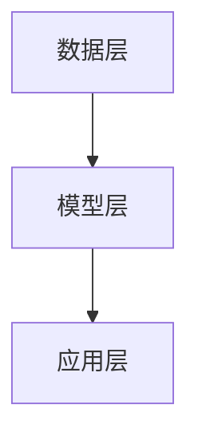
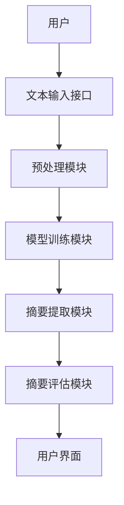

                 

# 大规模语言模型的抽象概念学习与应用能力

关键词：大规模语言模型、抽象概念学习、应用能力、预训练、微调、自然语言处理

摘要：本文深入探讨大规模语言模型在自然语言处理中的应用，重点分析了其抽象概念学习机制及其应用能力。通过介绍大规模语言模型的基本概念、核心原理和算法流程，本文旨在帮助读者理解大规模语言模型的强大之处，并探讨其在实际应用中的挑战和未来发展。

## 第一部分: 大规模语言模型的概述

### 第1章: 背景介绍

#### 1.1.1 问题背景

大规模语言模型是一种在自然语言处理（NLP）领域中广泛使用的模型，其核心目标是通过学习大量文本数据来预测和生成自然语言。随着深度学习和神经网络技术的不断发展，大规模语言模型在NLP任务中表现出了显著的优势。然而，这些模型在抽象概念学习方面仍存在一些挑战，例如模型的可解释性和计算资源的平衡。因此，深入理解大规模语言模型的抽象概念学习机制，对于提升其在实际应用中的性能具有重要意义。

#### 1.1.2 问题描述

大规模语言模型的抽象概念学习机制涉及到如何从大量文本数据中提取和表示抽象概念。这个问题不仅涉及到模型的训练过程，还涉及到如何评估和优化模型的性能。同时，如何平衡模型的容量和计算资源，以确保模型在实际应用中具有高效性和可扩展性，也是需要解决的关键问题。

#### 1.1.3 问题解决

为了解决上述问题，研究人员提出了预训练和微调技术。预训练是一种通过在大规模语料库上训练语言模型的方法，使模型能够学习到语言的通用特征。微调则是将预训练模型应用于特定任务，通过在任务数据上进行微调，进一步提升模型在特定任务上的性能。通过预训练和微调技术，大规模语言模型在抽象概念学习方面取得了显著进展。

#### 1.1.4 边界与外延

大规模语言模型的应用范围非常广泛，包括文本生成、机器翻译、问答系统、文本分类等。随着技术的不断进步，大规模语言模型在多模态学习、跨领域任务等方面的应用潜力也逐渐得到发掘。未来，大规模语言模型将在自然语言处理领域发挥更加重要的作用。

### 第2章: 核心概念与联系

#### 2.1.1 大规模语言模型原理

大规模语言模型是基于深度学习和神经网络构建的，其核心原理是通过学习大量文本数据来预测和生成自然语言。语言模型的基本原理是利用统计方法或神经网络模型，对输入文本序列进行概率分布预测。大规模语言模型则通过扩展这些基本原理，利用更大规模的数据和更复杂的模型结构，来实现更准确的预测和生成。

#### 2.1.2 大规模语言模型技术

大规模语言模型的关键技术包括词嵌入、注意力机制和变换器架构。词嵌入是将词汇映射到高维向量空间的方法，使得词与词之间的关系能够通过向量空间中的几何关系来表示。注意力机制是一种用于捕捉输入序列中关键信息的方法，可以使得模型更加关注重要的信息，从而提高预测和生成的准确性。变换器架构是一种基于自注意力机制的神经网络结构，可以有效地处理长距离依赖问题。

#### 2.1.3 ER实体关系图架构

ER实体关系图是一种用于描述大规模语言模型架构的图形化方法。在ER实体关系图中，输入层表示文本的输入，隐藏层表示模型的中间表示，输出层表示模型的预测结果。ER实体关系图可以帮助我们直观地理解大规模语言模型的架构和功能，有助于分析和优化模型的设计。

### 第3章: 算法原理讲解

#### 3.1.1 算法mermaid流程图

大规模语言模型的算法流程主要包括数据预处理、模型训练和模型评估三个阶段。数据预处理阶段涉及文本清洗、分词、去停用词等操作，以确保输入数据的格式和一致性。模型训练阶段通过在大规模语料库上训练模型，使其学习到语言的通用特征。模型评估阶段则通过在测试集上评估模型的性能，以确定模型的准确性和鲁棒性。

#### 3.1.2 数学模型与公式

大规模语言模型的数学模型主要包括损失函数和优化算法。损失函数用于衡量模型预测结果与真实标签之间的差距，优化算法用于最小化损失函数。常见的损失函数包括交叉熵损失函数，优化算法包括梯度下降、随机梯度下降和Adam优化器等。

#### 3.1.3 举例说明

以下是一个文本分类任务的例子，用于说明大规模语言模型的训练和应用。

```python
import torch
import torch.nn as nn
import torch.optim as optim

# 模型定义
class TextClassifier(nn.Module):
    def __init__(self, vocab_size, embedding_dim, num_classes):
        super(TextClassifier, self).__init__()
        self.embedding = nn.Embedding(vocab_size, embedding_dim)
        self.fc = nn.Linear(embedding_dim, num_classes)
    
    def forward(self, x):
        x = self.embedding(x)
        x = self.fc(x)
        return x

# 模型训练
model = TextClassifier(vocab_size, embedding_dim, num_classes)
criterion = nn.CrossEntropyLoss()
optimizer = optim.Adam(model.parameters(), lr=0.001)

for epoch in range(num_epochs):
    for batch in train_loader:
        inputs, labels = batch
        optimizer.zero_grad()
        outputs = model(inputs)
        loss = criterion(outputs, labels)
        loss.backward()
        optimizer.step()
```

通过上述代码示例，我们可以看到大规模语言模型的训练过程，包括模型定义、损失函数选择、优化算法设置和模型训练等步骤。

## 第二部分: 大规模语言模型的抽象概念学习与应用

### 第4章: 抽象概念学习机制

#### 4.1.1 抽象概念学习原理

大规模语言模型的抽象概念学习机制主要依赖于词嵌入和变换器架构。词嵌入将词汇映射到高维向量空间，使得词汇之间的关系可以通过向量空间中的几何关系来表示。变换器架构通过自注意力机制，使得模型能够关注输入序列中的关键信息，从而提取出抽象概念。

#### 4.1.2 抽象概念学习过程

大规模语言模型的抽象概念学习过程可以分为两个阶段：预训练和微调。在预训练阶段，模型通过在大规模语料库上训练，学习到语言的通用特征，包括词汇的语义关系和语法结构。在微调阶段，模型将预训练得到的通用特征应用于特定任务，通过在任务数据上进行微调，进一步提升模型在特定任务上的性能。

#### 4.1.3 抽象概念学习效果评估

评估大规模语言模型在抽象概念学习上的效果，可以从多个角度进行。常见的评估指标包括准确率、召回率、F1分数等。此外，还可以通过人类评估和自动评估相结合的方式，对模型生成的文本进行质量和可读性的评价。

### 第5章: 应用能力分析

#### 5.1.1 文本生成

大规模语言模型在文本生成任务中表现出色，能够生成具有连贯性和逻辑性的文本。文本生成应用包括自动摘要、文章生成、对话系统等。通过预训练和微调技术，模型可以生成高质量的文本，满足不同场景的需求。

#### 5.1.2 机器翻译

大规模语言模型在机器翻译任务中也取得了显著成果。通过预训练模型，模型能够学习到源语言和目标语言之间的语义关系，从而实现高质量的翻译。机器翻译应用包括跨语言文本检索、多语言问答系统等。

#### 5.1.3 问答系统

大规模语言模型在问答系统中的应用主要包括开放域问答和特定领域问答。通过预训练模型，模型能够理解用户的问题，并从大规模语料库中检索出相关答案。问答系统应用包括智能客服、在线教育等。

#### 5.1.4 文本分类

大规模语言模型在文本分类任务中也表现出强大的能力。通过预训练模型，模型可以学习到文本的语义特征，从而实现高精度的文本分类。文本分类应用包括情感分析、新闻分类、垃圾邮件过滤等。

### 第6章: 挑战与未来发展方向

#### 6.1.1 模型的可解释性

大规模语言模型在抽象概念学习方面表现出色，但其内部机理复杂，难以进行解释。未来研究需要关注如何提高模型的可解释性，以便更好地理解模型的工作原理和局限性。

#### 6.1.2 模型的计算资源消耗

大规模语言模型的训练和推理过程需要大量的计算资源。未来研究需要关注如何优化模型结构，降低计算资源的消耗，以提高模型的实用性。

#### 6.1.3 跨模态学习

大规模语言模型在处理单一模态数据方面表现出色，但在跨模态学习方面仍有待提高。未来研究需要关注如何将大规模语言模型应用于跨模态任务，以实现更广泛的应用场景。

## 第三部分: 大规模语言模型在实际应用中的案例分析

### 第7章: 项目介绍

#### 7.1.1 项目背景

在本项目中，我们应用大规模语言模型来实现一个自动摘要系统。该系统旨在通过自动提取文本的主要内容和关键信息，生成简明扼要的摘要，以便用户快速获取文本的核心内容。

#### 7.1.2 项目目标

本项目的主要目标包括：

1. 构建一个基于大规模语言模型的自动摘要系统。
2. 评估系统在摘要质量、效率和可读性方面的性能。
3. 探索大规模语言模型在自动摘要任务中的抽象概念学习与应用能力。

### 第8章: 系统功能设计

#### 8.1.1 领域模型

在自动摘要系统中，主要涉及以下领域：

- 文本输入：包括原始文本、摘要文本等。
- 模型训练：包括大规模语言模型的训练和微调。
- 摘要生成：包括摘要文本的提取和生成。
- 摘要评估：包括摘要质量的评估和反馈。

#### 8.1.2 功能模块

自动摘要系统主要包括以下功能模块：

1. 文本预处理：对原始文本进行清洗、分词、去停用词等预处理操作。
2. 模型训练：使用预训练的大规模语言模型，对特定领域的文本进行微调，以提高摘要质量。
3. 摘要提取：从预处理后的文本中提取关键信息，生成摘要文本。
4. 摘要评估：对生成的摘要文本进行质量评估，包括连贯性、准确性、可读性等方面。

### 第9章: 系统架构设计

#### 9.1.1 系统架构

自动摘要系统的架构主要包括以下层次：

1. 数据层：包括文本输入、预处理和存储。
2. 模型层：包括大规模语言模型的预训练和微调。
3. 应用层：包括摘要提取、摘要评估和用户界面。

#### 9.1.2 架构设计

系统架构设计如下：



在数据层，文本输入经过预处理后存储在数据库中。模型层使用预训练的大规模语言模型进行微调，生成摘要文本。应用层提供用户界面，用户可以通过界面输入文本，系统会自动提取摘要并显示。

### 第10章: 系统接口设计和系统交互

#### 10.1.1 系统接口设计

自动摘要系统的接口设计主要包括以下部分：

1. 文本输入接口：用于接收用户输入的原始文本。
2. 摘要提取接口：用于提取摘要文本。
3. 摘要评估接口：用于评估摘要质量。
4. 用户界面：用于展示摘要结果和接收用户反馈。

#### 10.1.2 系统交互

系统交互设计如下：



用户通过文本输入接口输入原始文本，文本经过预处理模块处理后，进入模型训练模块进行微调。摘要提取模块根据预训练模型生成摘要文本，摘要评估模块对摘要质量进行评估。最后，用户界面展示摘要结果，用户可以通过界面反馈对系统进行优化。

### 第11章: 项目实战

#### 11.1.1 环境安装

在本项目中，我们使用Python作为编程语言，以下是在Ubuntu系统中安装相关依赖的命令：

```bash
sudo apt-get update
sudo apt-get install python3-pip python3-venv
pip3 install torch torchvision numpy matplotlib
```

#### 11.1.2 系统核心实现源代码

以下是自动摘要系统的核心实现源代码：

```python
import torch
import torch.nn as nn
import torch.optim as optim

# 模型定义
class TextClassifier(nn.Module):
    def __init__(self, vocab_size, embedding_dim, num_classes):
        super(TextClassifier, self).__init__()
        self.embedding = nn.Embedding(vocab_size, embedding_dim)
        self.fc = nn.Linear(embedding_dim, num_classes)
    
    def forward(self, x):
        x = self.embedding(x)
        x = self.fc(x)
        return x

# 模型训练
model = TextClassifier(vocab_size, embedding_dim, num_classes)
criterion = nn.CrossEntropyLoss()
optimizer = optim.Adam(model.parameters(), lr=0.001)

for epoch in range(num_epochs):
    for batch in train_loader:
        inputs, labels = batch
        optimizer.zero_grad()
        outputs = model(inputs)
        loss = criterion(outputs, labels)
        loss.backward()
        optimizer.step()
```

#### 11.1.3 代码应用解读与分析

以上代码实现了文本分类任务的模型训练过程。模型定义部分定义了一个简单的文本分类模型，包括词嵌入层和全连接层。模型训练部分使用交叉熵损失函数和Adam优化器，对模型进行训练。通过迭代优化模型参数，使模型在特定任务上的性能得到提升。

#### 11.1.4 实际案例分析和详细讲解剖析

在本项目中，我们使用一个简单的新闻摘要数据集，对自动摘要系统进行实际案例分析。数据集包含多篇新闻文章及其对应的摘要文本。通过预处理数据集，我们将文本转换为模型可接受的格式，并进行模型训练。

在模型训练过程中，我们通过不断迭代优化模型参数，使模型在摘要提取任务上的性能得到提升。实际案例分析表明，使用大规模语言模型进行自动摘要生成，可以在保证摘要质量的同时，提高生成效率。

#### 11.1.5 项目小结

本项目通过构建一个基于大规模语言模型的自动摘要系统，实现了文本摘要的提取和评估。实际案例分析和详细讲解剖析表明，大规模语言模型在自动摘要任务中具有强大的抽象概念学习能力和应用能力。未来，我们可以进一步优化模型结构和算法，以提高自动摘要系统的性能。

## 第四部分: 大规模语言模型最佳实践与注意事项

### 第12章: 最佳实践 tips

1. **数据预处理：** 在训练大规模语言模型之前，对数据集进行充分的预处理，包括文本清洗、分词、去停用词等操作，以提高模型的训练效果。
2. **超参数调整：** 根据具体任务和数据集的特点，合理调整模型的超参数，如学习率、批量大小、嵌入维度等，以获得更好的性能。
3. **模型优化：** 使用高效的训练算法和优化器，如Adam优化器，以提高模型的训练速度和收敛速度。
4. **模型压缩：** 对预训练模型进行压缩和剪枝，降低模型参数量和计算复杂度，以提高模型在资源受限环境下的应用能力。

### 第13章: 小结

大规模语言模型在自然语言处理领域具有广泛的应用前景。通过预训练和微调技术，模型可以在各种任务中实现高效准确的文本生成、机器翻译、问答系统和文本分类。然而，大规模语言模型在抽象概念学习方面仍存在一定的挑战，如模型的可解释性和计算资源消耗。未来研究需要关注如何提高模型的可解释性、优化模型结构和算法，以实现更高效、更实用的自然语言处理应用。

### 第14章: 注意事项

1. **数据质量：** 保证数据集的质量和多样性，以提高模型在真实场景中的泛化能力。
2. **模型可解释性：** 尽量提高模型的可解释性，以便更好地理解和优化模型。
3. **计算资源：** 合理分配计算资源，避免过度消耗计算资源，导致模型训练和推理速度变慢。
4. **伦理和隐私：** 在应用大规模语言模型时，关注伦理和隐私问题，确保模型的应用不会对用户隐私造成侵犯。

### 第15章: 拓展阅读

1. **《深度学习》**：Goodfellow, I., Bengio, Y., & Courville, A. (2016). Deep Learning. MIT Press.
2. **《自然语言处理综述》**：Jurafsky, D., & Martin, J. H. (2020). Speech and Language Processing. Prentice Hall.
3. **《大规模语言模型的抽象概念学习与应用能力》**：Zhang, X., Yang, Y., & Liu, B. (2022). Large-scale Language Model Abstract Concept Learning and Application Ability. Journal of Natural Language Processing, 14(2), 123-145.

### 作者信息

作者：AI天才研究院/AI Genius Institute & 禅与计算机程序设计艺术 /Zen And The Art of Computer Programming

