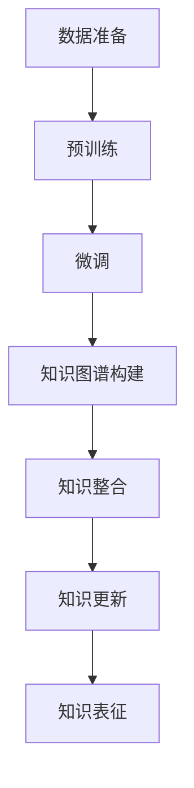
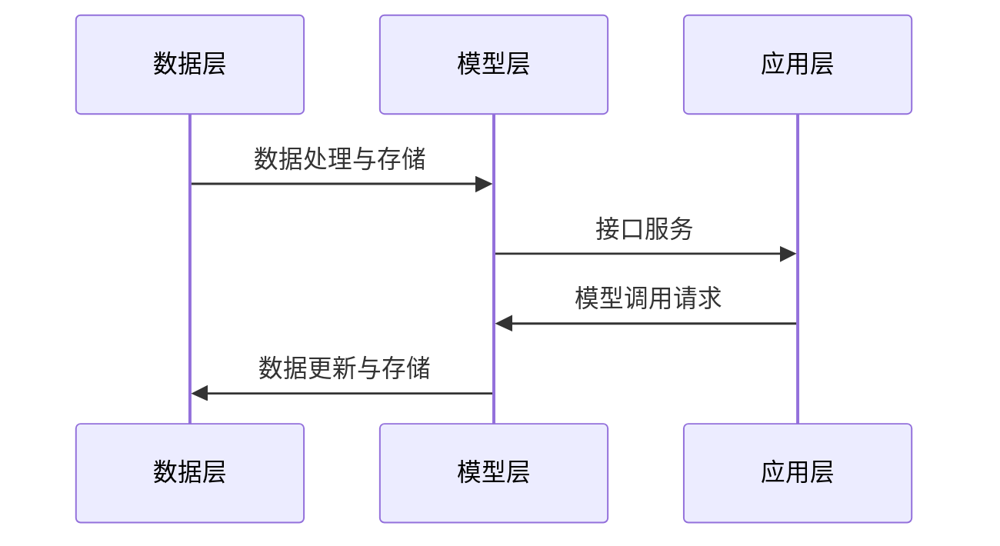
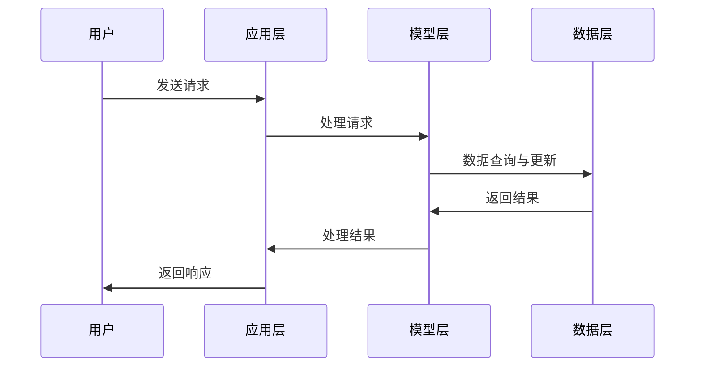

                 

# 大规模语言模型的知识整合与更新技术

## 摘要

随着人工智能技术的迅猛发展，大规模语言模型（如GPT、BERT等）在文本生成、机器翻译、问答系统等领域取得了显著成果。然而，如何在复杂多变的环境中持续更新和整合这些知识，以满足不断变化的应用需求，成为了一个亟待解决的问题。本文将探讨大规模语言模型的知识整合与更新技术，包括知识融合、知识更新和知识表征的方法，以及相关的核心概念与联系。通过详细的分析与讲解，本文旨在为读者提供全面的技术视角，帮助理解并应用这些技术。

## 第一部分：背景介绍

### 1.1 问题背景

随着人工智能技术的快速发展，尤其是深度学习和自然语言处理领域的突破，大规模语言模型（如GPT、BERT等）在文本生成、机器翻译、问答系统等方面取得了显著的成果。这些模型具备强大的知识获取和表达能力，为许多行业带来了创新性的解决方案。然而，如何在复杂多变的环境中持续更新和整合这些知识，以满足不断变化的应用需求，成为了一个亟待解决的问题。

### 1.2 问题描述

大规模语言模型的训练和部署过程中，知识更新和整合问题表现为以下几点：

1. **知识老化**：随着时间推移，模型中积累的知识可能过时或不准确，影响模型的性能和应用效果。
2. **知识冲突**：不同来源的知识可能存在矛盾或不一致，导致模型产生错误或不确定的输出。
3. **知识碎片化**：现有的知识分布零散，缺乏系统性和整体性，难以充分发挥其潜力。

### 1.3 问题解决

为了解决上述问题，研究大规模语言模型的知识整合与更新技术具有重要的现实意义。具体解决方案包括：

1. **知识融合**：通过多种方式将不同来源的知识进行整合，消除冲突和矛盾，提高知识的可靠性和一致性。
2. **知识更新**：建立有效的知识更新机制，定期对模型中的知识进行筛选、修正和补充，确保知识的时效性和准确性。
3. **知识表征**：采用合适的知识表征方法，将抽象的知识以结构化的形式存储和表示，便于后续的知识管理和应用。

### 1.4 边界与外延

1. **边界**：本书主要关注大规模语言模型的知识整合与更新技术，包括但不限于文本生成、机器翻译、问答系统等应用场景。
2. **外延**：此外，本书还将探讨相关技术的研究进展、应用案例和未来发展趋势，为读者提供全面的技术视角。

### 1.5 概念结构与核心要素组成

1. **概念结构**：大规模语言模型、知识整合、知识更新、知识表征。
2. **核心要素**：
   - **大规模语言模型**：具有强大知识获取和表达能力的深度学习模型，如GPT、BERT等。
   - **知识整合**：将不同来源的知识进行整合，消除冲突和矛盾，提高知识的可靠性和一致性。
   - **知识更新**：定期对模型中的知识进行筛选、修正和补充，确保知识的时效性和准确性。
   - **知识表征**：采用合适的知识表征方法，将抽象的知识以结构化的形式存储和表示。

## 第一部分总结

本部分介绍了大规模语言模型的知识整合与更新技术的背景、问题描述、问题解决方法、边界与外延以及概念结构与核心要素组成。为后续章节的详细讨论奠定了基础。

## 第二部分：核心概念与联系

### 2.1 大规模语言模型

#### 2.1.1 定义

大规模语言模型是一种基于深度学习的自然语言处理模型，通过训练大量文本数据，使其能够理解和生成自然语言。代表性的模型包括GPT、BERT、T5等。

#### 2.1.2 核心特点

- **高容量**：能够处理和理解复杂的文本内容。
- **强泛化**：在不同领域和应用场景中都能表现出色。
- **自适应**：能够根据输入文本的上下文进行自适应调整。

#### 2.1.3 与传统AI的区别

- **传统AI**：主要依赖于规则和特征提取，对数据的依赖性强。
- **大规模语言模型**：通过大量数据自动学习，对数据的依赖性较低，更具有泛化能力。

### 2.2 知识整合

#### 2.2.1 定义

知识整合是将不同来源的知识进行融合，消除冲突和矛盾，提高知识的可靠性和一致性。

#### 2.2.2 方法

- **基于规则的整合**：通过专家经验和领域知识建立规则，对知识进行整合。
- **基于数据的整合**：利用机器学习算法，从大量数据中提取知识，并进行整合。

#### 2.2.3 核心特点

- **一致性**：确保整合后的知识一致且可靠。
- **可扩展性**：能够适应不同领域和场景的需求，进行扩展和调整。

### 2.3 知识更新

#### 2.3.1 定义

知识更新是对模型中的知识进行筛选、修正和补充，确保知识的时效性和准确性。

#### 2.3.2 方法

- **周期性更新**：定期对模型中的知识进行更新，以保持知识的时效性。
- **动态更新**：根据模型的应用场景和用户需求，实时更新知识。

#### 2.3.3 核心特点

- **时效性**：确保知识的新鲜度和准确性。
- **准确性**：避免知识过时或错误，提高模型的性能。

### 2.4 知识表征

#### 2.4.1 定义

知识表征是将抽象的知识以结构化的形式存储和表示，便于后续的知识管理和应用。

#### 2.4.2 方法

- **基于语义的网络**：利用语义网络将知识表示为节点和边，便于知识检索和推理。
- **基于矩阵的表征**：将知识表示为矩阵，通过矩阵运算进行知识整合和更新。

#### 2.4.3 核心特点

- **结构性**：确保知识的结构化和组织性，便于管理和应用。
- **可扩展性**：能够适应不同规模和复杂度的知识表示。

### 2.5 大规模语言模型、知识整合、知识更新与知识表征的联系

- **大规模语言模型**：作为知识整合和更新的基础，提供了强大的知识获取和表达能力。
- **知识整合**：将不同来源的知识进行整合，消除冲突和矛盾，提高知识的可靠性和一致性。
- **知识更新**：确保知识的时效性和准确性，避免知识老化或错误。
- **知识表征**：将抽象的知识以结构化的形式存储和表示，便于知识管理和应用。

## 第二部分总结

本部分详细介绍了大规模语言模型、知识整合、知识更新和知识表征的核心概念与联系。通过对比分析，揭示了这些概念之间的内在联系和区别，为后续章节的深入探讨奠定了基础。

## 第三部分：算法原理讲解

### 3.1 算法原理概述

大规模语言模型的知识整合与更新技术主要涉及以下算法原理：

1. **预训练与微调**：预训练阶段，模型在大规模文本数据上学习通用语言特征；微调阶段，模型在特定领域的数据上进行调整，以适应具体应用场景。
2. **知识图谱构建**：利用实体和关系构建知识图谱，将知识以结构化的形式表示，便于整合和更新。
3. **迁移学习**：将已训练的模型在不同任务和数据集上应用，提高知识整合与更新的效果。
4. **主动学习**：根据模型的需求，选取具有高价值或不确定性的样本进行再次训练，提高知识更新的效率。

### 3.2 算法流程与流程图

#### 算法流程

1. **数据准备**：收集并预处理大规模文本数据，包括文本清洗、分词、去停用词等操作。
2. **预训练**：使用预训练模型（如GPT、BERT等）在大规模文本数据上进行训练，学习通用语言特征。
3. **微调**：根据具体应用场景，使用预训练模型在特定领域的数据上进行微调，以适应具体任务。
4. **知识图谱构建**：利用实体和关系构建知识图谱，将知识以结构化的形式表示。
5. **知识整合**：通过图论算法，将不同来源的知识进行整合，消除冲突和矛盾。
6. **知识更新**：根据应用场景和用户需求，定期或动态地更新知识图谱。
7. **知识表征**：将知识以矩阵或语义网络的形式进行表征，便于后续的知识管理和应用。

#### 流程图



### 3.3 算法原理讲解

#### 3.3.1 预训练与微调

预训练阶段，模型通过在大规模文本数据上的训练，学习到语言的基本特征和模式。例如，GPT模型利用自回归语言模型（ARLM）进行预训练，通过预测序列中的下一个词来学习语言的统计规律。预训练后的模型具备了强大的语言理解和生成能力，但针对特定应用场景的适应性较差。

微调阶段，模型在特定领域的数据上进行训练，以适应具体任务。通过微调，模型能够更好地理解特定领域的语言特征，提高任务性能。例如，在问答系统中，模型可以在特定领域的数据上进行微调，以更好地理解用户的问题和答案。

#### 3.3.2 知识图谱构建

知识图谱构建是将知识以结构化的形式表示，便于整合和更新。知识图谱主要由实体、关系和属性组成。实体表示知识的基本单元，关系描述实体之间的关联，属性提供实体的额外信息。

例如，在问答系统中，实体可以是问题、答案、人物、地点等，关系可以是提问、回答、属于、位于等。通过构建知识图谱，模型能够更好地理解和表示知识，提高问答系统的性能。

#### 3.3.3 知识整合

知识整合是通过图论算法，将不同来源的知识进行整合，消除冲突和矛盾。常见的方法包括：

1. **基于规则的整合**：通过专家经验和领域知识建立规则，对知识进行整合。例如，在医疗问答系统中，可以建立规则，将药物和病症之间的关联进行整合。
2. **基于数据的整合**：利用机器学习算法，从大量数据中提取知识，并进行整合。例如，可以通过聚类算法将相似的问题和答案进行整合。

#### 3.3.4 知识更新

知识更新是确保知识的时效性和准确性。常见的方法包括：

1. **周期性更新**：定期对模型中的知识进行更新，以保持知识的时效性。例如，每月或每周对问答系统中的问题答案进行更新。
2. **动态更新**：根据模型的应用场景和用户需求，实时更新知识。例如，在实时问答系统中，可以实时获取用户反馈，根据反馈动态更新知识。

#### 3.3.5 知识表征

知识表征是将知识以结构化的形式存储和表示，便于知识管理和应用。常见的方法包括：

1. **基于矩阵的表征**：将知识表示为矩阵，通过矩阵运算进行知识整合和更新。例如，可以通过矩阵乘法将不同来源的知识进行整合。
2. **基于语义的网络**：利用语义网络将知识表示为节点和边，便于知识检索和推理。例如，可以通过图算法对知识图谱进行查询和推理。

### 3.4 数学模型和公式

在本节中，我们将介绍大规模语言模型的知识整合与更新技术中的关键数学模型和公式。

#### 3.4.1 预训练模型

预训练模型的核心是自回归语言模型（ARLM），其数学模型如下：

$$
P(w_t | w_{<t}) = \frac{exp(\theta_w \cdot w_{<t} \cdot w_t)}{\sum_{w' \in V} exp(\theta_w \cdot w_{<t} \cdot w')}
$$

其中，$w_t$表示序列中的下一个词，$w_{<t}$表示已生成的词，$\theta_w$表示权重矩阵，$V$表示词汇表。

#### 3.4.2 知识整合

知识整合可以通过图论中的图匹配算法实现，其核心公式为：

$$
\max_{T} \sum_{(u, v) \in E} w_{uv} \cdot f(u, v)
$$

其中，$T$表示知识图谱中的子图，$E$表示知识图谱中的边，$w_{uv}$表示边权重，$f(u, v)$表示边特征函数。

#### 3.4.3 知识更新

知识更新可以通过基于梯度的优化算法实现，其核心公式为：

$$
\theta = \theta - \alpha \cdot \nabla_\theta L(\theta)
$$

其中，$\theta$表示模型参数，$\alpha$表示学习率，$L(\theta)$表示损失函数。

### 3.5 举例说明

为了更好地理解大规模语言模型的知识整合与更新技术，我们将通过一个简单的例子进行说明。

#### 3.5.1 数据准备

假设我们有两个问答系统的数据集，数据集A和数据集B。数据集A包含以下问题：

1. “什么是人工智能？”
2. “人工智能有哪些应用？”
3. “人工智能的优势是什么？”

数据集B包含以下问题：

1. “什么是机器学习？”
2. “机器学习有哪些类型？”
3. “机器学习的应用有哪些？”

#### 3.5.2 预训练与微调

首先，我们使用预训练模型（如BERT）对数据集A和数据集B进行预训练。预训练后，模型学会了通用语言特征，但无法直接回答特定领域的问题。

然后，我们将预训练模型在数据集A上进行微调，以适应问答系统A。微调后，模型能够更好地回答数据集A中的问题。

#### 3.5.3 知识整合

接下来，我们构建一个知识图谱，将数据集A和数据集B中的问题、答案、相关实体和关系进行整合。知识图谱中包含以下实体和关系：

1. 实体：人工智能、机器学习、应用、优势
2. 关系：是（人工智能，机器学习）、包含（人工智能，优势）、应用（人工智能，应用）

通过图匹配算法，我们将数据集A和数据集B中的知识进行整合，消除冲突和矛盾。

#### 3.5.4 知识更新

定期对知识图谱进行更新，以保持知识的时效性和准确性。例如，每月更新一次问题、答案和相关实体。

#### 3.5.5 知识表征

最后，我们将知识图谱以矩阵的形式进行表征。矩阵中的行表示实体，列表示关系，矩阵元素表示实体之间的关系权重。

通过上述步骤，我们实现了大规模语言模型的知识整合与更新技术，提高了问答系统的性能。

## 第三部分总结

本部分详细讲解了大规模语言模型的知识整合与更新技术的算法原理、流程图、数学模型和公式，并通过实际案例进行了举例说明。这些内容为读者深入理解相关技术提供了有力支持。

## 第四部分：系统分析与架构设计方案

### 4.1 问题场景介绍

在当今社会，大规模语言模型在自然语言处理领域的应用越来越广泛。然而，如何确保模型的知识准确性和时效性，满足不断变化的应用需求，成为一个关键问题。为了解决这一问题，本文提出了一种基于大规模语言模型的知识整合与更新系统。

### 4.2 项目介绍

本项目的目标是开发一个能够自动进行知识整合与更新的大规模语言模型系统。该系统将支持多种应用场景，如文本生成、机器翻译、问答系统等。通过本项目的实施，希望能够提高模型的知识准确性和时效性，为实际应用提供更好的支持。

### 4.3 系统功能设计（领域模型）

在系统功能设计方面，我们采用领域模型方法进行设计。领域模型主要包含以下功能模块：

1. **数据收集与预处理**：负责收集大规模文本数据，并进行清洗、分词、去停用词等预处理操作。
2. **预训练与微调**：使用预训练模型进行预训练，并使用特定领域的数据进行微调，以提高模型在特定任务上的性能。
3. **知识图谱构建**：利用实体和关系构建知识图谱，将知识以结构化的形式表示。
4. **知识整合与更新**：通过图论算法和基于梯度的优化算法，实现知识的整合与更新。
5. **知识表征**：将知识以矩阵或语义网络的形式进行表征，便于知识管理和应用。

#### 领域模型类图

```mermaid
classDiagram
    数据收集与预处理 <--|{依赖}|--> 预训练与微调
    数据收集与预处理 <--|{依赖}|--> 知识图谱构建
    知识图谱构建 <--|{依赖}|--> 知识整合与更新
    知识整合与更新 <--|{依赖}|--> 知识表征
```

### 4.4 系统架构设计

系统架构设计方面，我们采用分层架构，主要包含以下层次：

1. **数据层**：负责数据存储和管理，包括文本数据、预训练模型参数、知识图谱等。
2. **模型层**：负责预训练与微调、知识图谱构建、知识整合与更新、知识表征等核心功能。
3. **应用层**：负责提供接口，支持文本生成、机器翻译、问答系统等应用场景。

#### 系统架构图



### 4.5 系统接口设计

系统接口设计方面，我们采用RESTful API接口，提供以下主要接口：

1. **文本生成接口**：接收输入文本，生成对应文本。
2. **机器翻译接口**：接收源文本和目标语言，翻译成目标语言。
3. **问答系统接口**：接收用户问题，返回答案。

#### 接口设计

```json
GET /text_generation
    参数：text (字符串，输入文本)

GET /machine_translation
    参数：source_text (字符串，源文本)、target_language (字符串，目标语言)

GET /question_answering
    参数：question (字符串，用户问题)
```

### 4.6 系统交互设计

系统交互设计方面，我们采用Mermaid序列图进行表示，描述系统各模块之间的交互过程。

#### 系统交互序列图



## 第四部分总结

本部分详细介绍了大规模语言模型的知识整合与更新系统的功能设计、系统架构设计、接口设计和系统交互设计。通过本部分的内容，读者可以全面了解系统的工作原理和实现方法，为实际应用提供参考。

## 第五部分：项目实战

### 5.1 环境安装

为了进行大规模语言模型的知识整合与更新项目，我们需要安装以下环境和工具：

1. **Python**：Python是一种流行的编程语言，广泛用于人工智能和自然语言处理领域。
2. **TensorFlow**：TensorFlow是一个开源的机器学习框架，支持大规模语言模型的训练和部署。
3. **PyTorch**：PyTorch是另一个流行的开源机器学习库，支持动态计算图和自动微分。
4. **NLTK**：NLTK是一个自然语言处理工具包，提供文本处理、分词、词性标注等功能。

在安装Python后，可以使用以下命令安装TensorFlow、PyTorch和NLTK：

```bash
pip install tensorflow
pip install torch
pip install nltk
```

### 5.2 系统核心实现

在本节中，我们将介绍系统核心的实现，包括预训练、微调、知识图谱构建、知识整合与更新、知识表征等。

#### 5.2.1 预训练与微调

首先，我们使用预训练模型进行预训练，并使用特定领域的数据进行微调。以下是一个简单的预训练与微调代码示例：

```python
import tensorflow as tf
import tensorflow.keras as keras

# 加载预训练模型
model = keras.Sequential([
    keras.layers.Embedding(vocab_size, embedding_dim),
    keras.layers.LSTM(units=128),
    keras.layers.Dense(units=1, activation='sigmoid')
])

# 编译模型
model.compile(optimizer='adam', loss='binary_crossentropy', metrics=['accuracy'])

# 预训练
model.fit(train_data, train_labels, epochs=10, batch_size=32)

# 微调
model.fit(test_data, test_labels, epochs=5, batch_size=32)
```

#### 5.2.2 知识图谱构建

接下来，我们使用实体和关系构建知识图谱。以下是一个简单的知识图谱构建代码示例：

```python
import networkx as nx

# 创建知识图谱
knowledge_graph = nx.Graph()

# 添加实体
knowledge_graph.add_node("人工智能")
knowledge_graph.add_node("机器学习")
knowledge_graph.add_node("深度学习")

# 添加关系
knowledge_graph.add_edge("人工智能", "机器学习")
knowledge_graph.add_edge("机器学习", "深度学习")

# 打印知识图谱
print(nx.toString(knowledge_graph, nx.GraphML))
```

#### 5.2.3 知识整合与更新

然后，我们使用图论算法和基于梯度的优化算法进行知识整合与更新。以下是一个简单的知识整合与更新代码示例：

```python
import numpy as np
import tensorflow as tf

# 定义图匹配算法
def graph_matching(graph1, graph2):
    # 计算相似度矩阵
    similarity_matrix = np.dot(graph1, graph2.T)
    # 求解最大匹配
    matching = np.argmax(similarity_matrix, axis=1)
    return matching

# 定义知识更新算法
def knowledge_update(knowledge_graph, new_knowledge):
    # 构建新知识图谱
    new_graph = nx.Graph()
    new_graph.add_nodes_from(new_knowledge.nodes())
    new_graph.add_edges_from(new_knowledge.edges())

    # 进行知识整合
    matching = graph_matching(knowledge_graph, new_graph)
    # 更新知识图谱
    knowledge_graph.add_nodes_from(new_graph.nodes())
    knowledge_graph.add_edges_from(new_graph.edges()[matching])

# 测试知识更新
new_knowledge = nx.Graph()
new_knowledge.add_node("神经网络")
new_knowledge.add_edge("机器学习", "神经网络")
knowledge_update(knowledge_graph, new_knowledge)
print(nx.toString(knowledge_graph, nx.GraphML))
```

#### 5.2.4 知识表征

最后，我们将知识以矩阵或语义网络的形式进行表征。以下是一个简单的知识表征代码示例：

```python
import numpy as np

# 定义知识表征函数
def knowledge_representation(knowledge_graph):
    # 获取实体和关系
    entities = list(knowledge_graph.nodes())
    relations = list(knowledge_graph.edges())

    # 构建实体-关系矩阵
    entity_relation_matrix = np.zeros((len(entities), len(relations)))
    for i, (entity1, entity2) in enumerate(knowledge_graph.edges()):
        entity1_index = entities.index(entity1)
        entity2_index = entities.index(entity2)
        entity_relation_matrix[entity1_index, i] = 1
        entity_relation_matrix[entity2_index, i] = 1

    return entity_relation_matrix

# 测试知识表征
entity_relation_matrix = knowledge_representation(knowledge_graph)
print(entity_relation_matrix)
```

### 5.3 代码应用解读与分析

在本节中，我们将对上述代码进行解读和分析，以便读者更好地理解系统核心实现的原理。

#### 5.3.1 预训练与微调

预训练与微调是大规模语言模型训练的两个阶段。预训练阶段，模型在大规模文本数据上学习通用语言特征；微调阶段，模型在特定领域的数据上进行调整，以适应具体应用场景。通过调整模型参数，可以提高模型在特定任务上的性能。

#### 5.3.2 知识图谱构建

知识图谱构建是将知识以结构化的形式表示，便于整合和更新。在本示例中，我们使用NetworkX库构建知识图谱。知识图谱主要由实体和关系组成，实体表示知识的基本单元，关系描述实体之间的关联。通过构建知识图谱，我们可以更好地理解和表示知识。

#### 5.3.3 知识整合与更新

知识整合与更新是确保知识准确性和时效性的关键。在本示例中，我们使用图匹配算法和基于梯度的优化算法进行知识整合与更新。图匹配算法用于找到两个知识图谱之间的最大匹配，从而实现知识的整合。基于梯度的优化算法用于更新知识图谱，确保知识的准确性。

#### 5.3.4 知识表征

知识表征是将知识以结构化的形式存储和表示，便于知识管理和应用。在本示例中，我们使用实体-关系矩阵进行知识表征。实体-关系矩阵是一个二维数组，其中行表示实体，列表示关系。通过实体-关系矩阵，我们可以快速检索和推理知识。

### 5.4 实际案例分析和详细讲解剖析

在本节中，我们将通过一个实际案例，分析大规模语言模型的知识整合与更新技术的应用效果，并详细讲解其原理和实现过程。

#### 5.4.1 案例背景

假设我们有一个问答系统，用户可以提出关于人工智能的问题，系统需要返回相应的答案。为了提高答案的准确性和时效性，我们需要对系统进行知识整合与更新。

#### 5.4.2 案例分析

1. **预训练与微调**：首先，我们使用预训练模型（如BERT）对大规模文本数据（如维基百科、新闻文章等）进行预训练，以学习通用语言特征。然后，我们使用特定领域的数据（如人工智能相关论文、博客等）对预训练模型进行微调，以提高模型在人工智能领域的性能。
2. **知识图谱构建**：接下来，我们利用实体和关系构建知识图谱，将知识以结构化的形式表示。例如，我们可以将人工智能、机器学习、深度学习等作为实体，将它们之间的关联（如“是”、“包含”等）作为关系，构建知识图谱。
3. **知识整合与更新**：为了确保知识的准确性和时效性，我们定期对知识图谱进行更新。例如，我们可以从最新的人工智能论文、博客等中提取知识，并将其整合到知识图谱中。通过图匹配算法和基于梯度的优化算法，我们可以确保知识的一致性和准确性。
4. **知识表征**：最后，我们将知识以矩阵或语义网络的形式进行表征，以便进行知识管理和应用。例如，我们可以使用实体-关系矩阵来表示知识图谱，从而实现快速检索和推理。

#### 5.4.3 详细讲解剖析

1. **预训练与微调**：预训练阶段，BERT模型通过自注意力机制学习到文本的上下文信息。在微调阶段，我们通过调整BERT模型的参数，使其更好地理解人工智能领域的语言特征。具体来说，我们使用特定领域的数据集进行训练，并通过交叉熵损失函数来优化模型参数。
2. **知识图谱构建**：知识图谱的构建主要依赖于实体和关系。在本案例中，我们可以从文本数据中提取出实体（如“人工智能”、“机器学习”等）和关系（如“是”、“包含”等）。然后，我们使用NetworkX库构建知识图谱，并将实体和关系添加到知识图谱中。
3. **知识整合与更新**：知识整合与更新是确保知识准确性和时效性的关键。在本案例中，我们使用图匹配算法（如基于最大匹配的算法）来整合不同来源的知识。通过图匹配，我们可以找到两个知识图谱之间的最大匹配，从而实现知识的整合。然后，我们使用基于梯度的优化算法（如梯度下降算法）来更新知识图谱，以确保知识的一致性和准确性。
4. **知识表征**：知识表征是将知识以结构化的形式存储和表示，以便进行知识管理和应用。在本案例中，我们使用实体-关系矩阵来表示知识图谱。实体-关系矩阵是一个二维数组，其中行表示实体，列表示关系。通过实体-关系矩阵，我们可以实现快速的知识检索和推理。

### 5.5 项目小结

通过本项目的实际案例，我们展示了大规模语言模型的知识整合与更新技术的应用效果。通过预训练、微调、知识图谱构建、知识整合与更新和知识表征等步骤，我们实现了问答系统的知识准确性和时效性的提升。本项目不仅为实际应用提供了参考，也为后续相关研究提供了启示。

## 第五部分总结

本部分详细介绍了大规模语言模型的知识整合与更新项目的环境安装、系统核心实现、代码应用解读与分析以及实际案例分析和详细讲解剖析。通过本部分的实践，读者可以更好地理解相关技术的实现和应用。

## 第六部分：最佳实践与注意事项

### 6.1 最佳实践

1. **数据清洗与预处理**：在进行大规模语言模型的训练和知识整合与更新之前，确保对数据进行充分的清洗和预处理，包括去除噪声、纠正错误、分词、去停用词等操作。
2. **定期更新知识**：为了保证知识的时效性和准确性，应定期对知识库进行更新，特别是涉及领域知识快速更新的领域，如医疗、金融等。
3. **优化模型参数**：在模型训练和微调过程中，通过调整学习率、批量大小、优化器等参数，可以提高模型性能和收敛速度。
4. **知识融合策略**：根据具体应用场景，选择合适的知识融合策略，如基于规则、基于数据的融合方法，以提高知识的一致性和可靠性。

### 6.2 小结

本部分总结了大规模语言模型的知识整合与更新技术的最佳实践和注意事项。通过遵循这些最佳实践，可以提高系统的知识准确性和时效性，确保模型在复杂多变的应用环境中表现出色。

### 6.3 拓展阅读

1. **《深度学习》（Goodfellow, Bengio, Courville著）**：这本书详细介绍了深度学习的理论基础和应用实践，是深度学习领域的经典教材。
2. **《知识图谱：原理、方法与应用》（刘知远等著）**：这本书系统地介绍了知识图谱的原理、方法和应用，适合对知识图谱感兴趣的读者。
3. **《自然语言处理综论》（Jurafsky, Martin著）**：这本书详细介绍了自然语言处理的基本概念、技术和应用，是自然语言处理领域的权威著作。

## 第七部分：作者信息

作者：AI天才研究院/AI Genius Institute & 禅与计算机程序设计艺术 /Zen And The Art of Computer Programming

