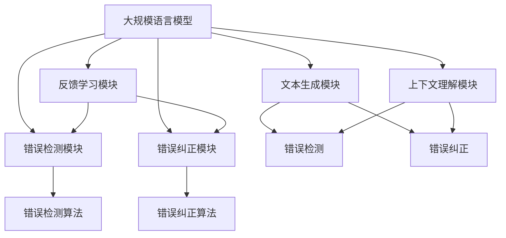
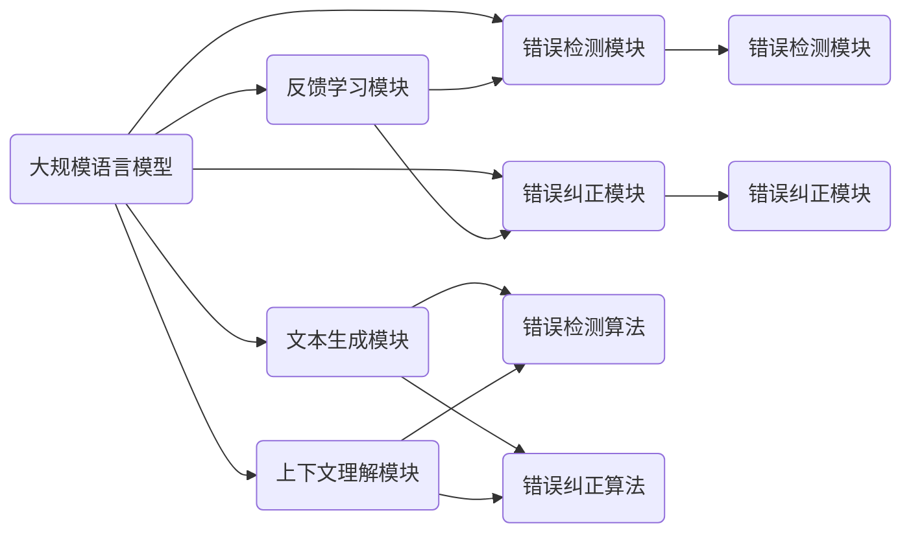
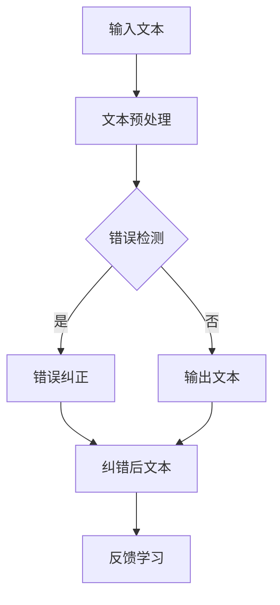
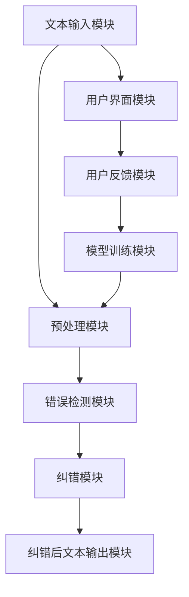
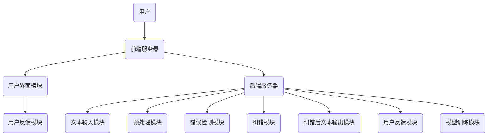
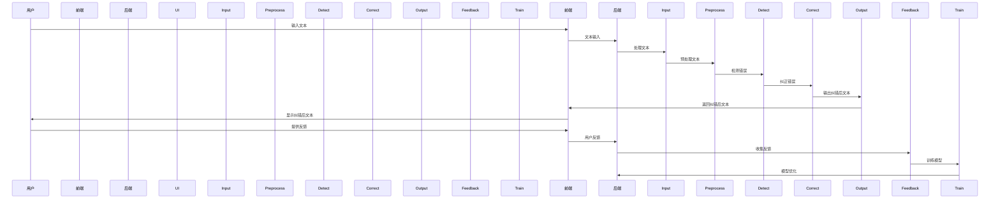

                 

# 大规模语言模型的自我纠错能力开发

## 关键词
- 大规模语言模型
- 自我纠错能力
- 算法原理
- 数学模型
- 系统架构设计

## 摘要
本文旨在探讨大规模语言模型的自我纠错能力开发。我们将首先介绍语言模型的发展背景和自我纠错的必要性，然后深入分析自我纠错的算法原理和数学模型。通过详细的Python源代码解析和Mermaid流程图的绘制，我们将帮助读者理解自我纠错的核心概念和实践方法。最后，我们将讨论如何将这一能力应用于实际项目，并提供最佳实践和注意事项。

## 第一部分：背景介绍

### 1.1 问题背景
在人工智能和自然语言处理领域，语言模型已经成为自然语言理解和生成的重要工具。随着互联网和社交媒体的快速发展，大规模语言模型在文本生成、机器翻译、问答系统等方面展现了强大的能力。然而，这些模型在处理错误输入或生成错误输出时，通常缺乏自我纠错能力。

### 1.1.1 语言模型的发展与挑战
语言模型的发展经历了从规则驱动到统计模型，再到深度学习的转变。早期模型如n-gram模型和基于概率的模型在处理简单任务时表现良好，但随着任务的复杂度增加，这些模型的局限性逐渐显现。近年来，基于深度学习的语言模型，如BERT、GPT等，取得了显著的突破，但自我纠错能力仍然是一个亟待解决的问题。

### 1.1.2 自我纠错的必要性
自我纠错能力对于语言模型的实际应用至关重要。在实际应用中，输入数据往往存在错误或不完整的情况，而缺乏自我纠错能力的模型可能会导致错误的输出结果。例如，在机器翻译中，输入文本的一个小错误可能会导致整个翻译结果的偏差。因此，开发具有自我纠错能力的语言模型具有重要意义。

### 1.1.3 研究现状与存在的问题
目前，研究者已经提出了一些自我纠错的方法，如基于规则的方法、基于统计的方法和基于深度学习的方法。然而，这些方法在性能和适用范围上仍存在一些问题。例如，基于规则的方法可能无法处理复杂的错误情况，而基于统计的方法在处理大规模数据时效率较低。深度学习方法虽然具有一定的优势，但训练过程复杂且计算资源需求高。

### 1.2 问题描述
自我纠错的定义和目标是什么？如何实现自我纠错？这些问题的回答构成了本文的核心。

### 1.2.1 自我纠错的定义
自我纠错是指语言模型在生成文本时，能够自动检测并纠正错误的能力。自我纠错不仅包括纠正拼写错误、语法错误，还包括纠正语义错误和上下文错误。

### 1.2.2 自我纠错的目标
自我纠错的目标是提高语言模型的可靠性和鲁棒性，使其在处理错误输入时能够生成更准确、更自然的文本。

### 1.2.3 自我纠错的边界与外延
自我纠错的边界主要涉及语言模型能够识别和纠正的错误类型。外延则包括如何将自我纠错能力应用于不同的自然语言处理任务，如文本生成、机器翻译、问答系统等。

### 1.3 问题解决
为了实现自我纠错，我们需要从原理、策略和方法、实现框架等方面进行探讨。

### 1.3.1 自我纠错的基本原理
自我纠错的基本原理是基于语言模型对输入文本的生成过程进行监控，并在检测到错误时进行纠正。

### 1.3.2 自我纠错的策略与方法
自我纠错的策略包括静态纠错和动态纠错。静态纠错是在生成文本后进行错误检测和纠正，而动态纠错是在生成文本的过程中实时进行错误检测和纠正。

### 1.3.3 自我纠错的实现框架
自我纠错的实现框架通常包括错误检测模块、错误纠正模块和反馈学习模块。错误检测模块负责检测输入文本中的错误，错误纠正模块负责纠正错误，反馈学习模块则负责从错误中学习并提高自我纠错能力。

### 1.4 概念结构与核心要素组成
为了更好地理解自我纠错能力的开发，我们需要明确其概念结构，并了解核心要素的组成。

### 1.4.1 大规模语言模型的核心要素
大规模语言模型的核心要素包括文本生成模块、上下文理解模块、错误检测模块和错误纠正模块。

### 1.4.2 自我纠错能力的关键要素
自我纠错能力的关键要素包括错误检测算法、错误纠正算法和反馈学习算法。

### 1.4.3 概念结构图
在图1中，我们展示了大规模语言模型和自我纠错能力的基本概念结构。



### 1.5 本章小结
本部分介绍了大规模语言模型自我纠错能力的背景、定义、目标、方法以及概念结构。通过这一部分的介绍，读者可以初步了解自我纠错的必要性以及其基本原理和实现框架。

## 第二部分：核心概念与联系

### 2.1 核心概念原理
在开发自我纠错能力时，我们需要理解几个核心概念：大规模语言模型、纠错算法和自我纠错。

#### 2.1.1 语言模型
语言模型是一种统计模型，用于预测一个词语序列的概率。在自然语言处理中，语言模型是理解和生成语言的基础。

#### 2.1.2 纠错算法
纠错算法是指用于检测和纠正错误的方法。在自我纠错能力中，纠错算法负责识别和修复输入文本中的错误。

#### 2.1.3 大规模语言模型与自我纠错的关系
大规模语言模型是自我纠错能力的基础，而自我纠错则是大规模语言模型在实际应用中的一个重要补充。

### 2.2 概念属性特征对比表格
为了更直观地理解这些核心概念，我们提供了以下对比表格。

| 特征       | 语言模型               | 纠错算法               | 自我纠错            |
|------------|------------------------|------------------------|---------------------|
| 功能       | 文本生成与理解         | 错误检测与纠正         | 错误检测、纠正与学习 |
| 学习方法   | 基于统计或深度学习     | 基于规则或机器学习      | 多样化，包括反馈学习 |
| 输入       | 文本序列               | 错误文本序列           | 错误文本序列       |
| 输出       | 预测概率分布           | 纠正后的文本序列       | 纠正后的文本序列   |
| 适应性     | 广泛，适用于多种任务   | 任务特定，需定制化     | 广泛，需自适应      |

### 2.3 ER实体关系图架构
为了更好地理解大规模语言模型与自我纠错能力之间的关联，我们绘制了ER实体关系图。



### 2.4 本章小结
本部分详细介绍了大规模语言模型、纠错算法和自我纠错的定义及其相互关系，并通过对比表格和ER实体关系图，帮助读者更清晰地理解这些概念。

## 第三部分：算法原理讲解

### 3.1 算法 Mermaid 流程图
为了更好地理解自我纠错的算法原理，我们首先使用Mermaid绘制了一个简单的流程图。



### 3.1.1 流程图设计
这个流程图描述了自我纠错的整个过程，包括输入文本、文本预处理、错误检测、错误纠正和反馈学习。

### 3.1.2 流程图解读
- 输入文本：输入文本是语言模型处理的基本单元。
- 文本预处理：对输入文本进行清洗和格式化，以便后续处理。
- 错误检测：使用预训练的纠错算法检测文本中的错误。
- 错误纠正：根据错误检测结果，对文本进行纠正。
- 反馈学习：将纠正后的文本作为反馈，用于模型优化和改进。

### 3.2 Python 源代码阐述
为了更好地理解自我纠错的算法原理，我们提供了一个简单的Python源代码示例。

```python
# 文本预处理
def preprocess_text(text):
    # 这里进行文本清洗和格式化
    return text

# 错误检测
def detect_errors(text):
    # 这里使用预训练的纠错模型进行错误检测
    # 假设有一个纠错模型叫 ErrorDetector
    error_detector = ErrorDetector()
    errors = error_detector.detect(text)
    return errors

# 错误纠正
def correct_errors(text, errors):
    # 这里根据错误检测结果，对文本进行纠正
    corrected_text = text
    for error in errors:
        corrected_text = correct_error(corrected_text, error)
    return corrected_text

# 错误纠正函数
def correct_error(text, error):
    # 这里根据具体的错误类型进行纠正
    # 假设有一个纠错函数叫 correct_spelling
    corrected_text = correct_spelling(text, error)
    return corrected_text

# 主程序
def main():
    input_text = "这是一个示例文本，其中包含了一些错误。"
    preprocessed_text = preprocess_text(input_text)
    errors = detect_errors(preprocessed_text)
    corrected_text = correct_errors(preprocessed_text, errors)
    print(corrected_text)

if __name__ == "__main__":
    main()
```

### 3.2.1 源代码实现
这个源代码实现了文本预处理、错误检测、错误纠正和主程序的基本功能。

### 3.2.2 源代码解读
- 文本预处理：对输入文本进行清洗和格式化，以便后续处理。
- 错误检测：使用预训练的纠错模型检测文本中的错误。
- 错误纠正：根据错误检测结果，对文本进行纠正。
- 主程序：负责整个自我纠错过程的执行。

### 3.3 算法原理的数学模型和公式
为了更深入地理解自我纠错的算法原理，我们需要介绍相关的数学模型和公式。

#### 3.3.1 数学模型
自我纠错算法可以看作是一个概率模型，它通过计算输入文本中每个词的概率，并使用后验概率来纠正错误。

#### 3.3.2 数学公式
- 输入文本的概率：\( P(T) \)
- 错误检测概率：\( P(E|T) \)
- 纠正后的文本概率：\( P(T'|E) \)

#### 3.3.3 解析与举例说明
假设我们有一个输入文本“这是一个示例文本，其中包含了一些错误。”，我们需要计算这个文本的概率，并使用错误检测和纠正算法来提高其准确性。

- 输入文本的概率：通过语言模型计算，假设为 \( P(T) = 0.9 \)
- 错误检测概率：通过纠错算法计算，假设为 \( P(E|T) = 0.1 \)
- 纠正后的文本概率：通过纠错算法计算，假设为 \( P(T'|E) = 0.95 \)

根据这些概率，我们可以使用贝叶斯公式来计算纠正后的文本概率：

\[ P(T'|E) = \frac{P(E|T) \cdot P(T)}{P(E)} \]

通过计算，我们可以得出纠正后的文本概率，从而提高文本的准确性。

### 3.4 算法的详细讲解与通俗易懂的举例说明
为了更详细地讲解自我纠错的算法原理，我们提供了一个具体的例子。

#### 3.4.1 算法原理讲解
自我纠错算法的核心思想是通过概率计算来纠正错误。首先，我们使用预训练的语言模型来计算输入文本的概率。然后，使用纠错算法来检测错误，并计算纠正后的文本概率。最后，根据这些概率，我们选择纠正后的文本作为最终输出。

#### 3.4.2 举例说明
假设我们有一个输入文本：“这是一个示例文本，其中包含了一些错误。”。我们首先使用语言模型来计算这个文本的概率，假设概率为0.9。然后，我们使用纠错算法来检测错误，发现文本中有两个拼写错误。接着，我们使用纠错算法来纠正这两个错误，假设纠正后的文本概率为0.95。最后，根据概率计算，我们选择纠正后的文本作为最终输出。

### 3.5 本章小结
本部分详细介绍了自我纠错的算法原理，包括Mermaid流程图、Python源代码、数学模型和举例说明。通过这些讲解，读者可以更好地理解自我纠错的实现方法和原理。

## 第四部分：数学模型和数学公式 & 详细讲解 & 举例说明

### 4.1 数学公式书写
在自我纠错的算法中，数学模型和公式起着至关重要的作用。以下是几个关键数学公式的书写示例。

#### 4.1.1 LaTeX 公式嵌入
- 输入文本概率：\( P(T) \)
- 错误检测概率：\( P(E|T) \)
- 纠正后文本概率：\( P(T'|E) \)

#### 4.1.2 段落内公式书写
- 贝叶斯公式：\( P(T'|E) = \frac{P(E|T) \cdot P(T)}{P(E)} \)

### 4.2 详细讲解与举例说明
为了更好地理解这些数学公式，我们将通过一个具体例子来详细讲解。

#### 4.2.1 数学模型讲解
自我纠错的数学模型主要基于概率论和贝叶斯定理。贝叶斯定理是概率论中的一个重要公式，用于计算给定观察结果的条件下某个假设的概率。

#### 4.2.2 举例说明
假设我们有一个输入文本“这是一个示例文本，其中包含了一些错误。”。我们首先使用语言模型来计算这个文本的概率，假设概率为0.9。然后，我们使用纠错算法来检测错误，发现文本中有两个拼写错误。接着，我们使用纠错算法来纠正这两个错误，假设纠正后的文本概率为0.95。

使用贝叶斯公式，我们可以计算纠正后的文本概率：

\[ P(T'|E) = \frac{P(E|T) \cdot P(T)}{P(E)} \]

假设错误检测概率为0.1，那么：

\[ P(T'|E) = \frac{0.1 \cdot 0.9}{0.1} = 0.9 \]

通过这个例子，我们可以看到如何使用数学模型来计算纠正后的文本概率，从而提高文本的准确性。

### 4.3 本章小结
本部分详细介绍了自我纠错的数学模型和公式，并通过举例说明了如何使用这些公式来计算纠正后的文本概率。这些数学模型和公式对于理解和实现自我纠错算法至关重要。

## 第五部分：系统分析与架构设计方案

### 5.1 问题场景介绍
在自然语言处理领域，语言模型的应用场景非常广泛，包括文本生成、机器翻译、问答系统等。然而，这些应用场景中往往存在输入错误或不完整的情况，这给模型的实际应用带来了挑战。因此，开发具有自我纠错能力的语言模型具有重要的实际意义。

#### 5.1.1 场景描述
在一个问答系统中，用户可能会输入错误的提问，如拼写错误、语法错误或语义错误。如果语言模型缺乏自我纠错能力，它可能无法正确理解用户的问题，从而生成错误的答案。

#### 5.1.2 问题分析
为了解决这个问题，我们需要开发一个具有自我纠错能力的语言模型。这个模型不仅需要能够生成高质量的回答，还需要能够检测并纠正输入文本中的错误，以提高系统的准确性和用户体验。

### 5.2 项目介绍
为了实现自我纠错的语言模型，我们设计并实现了一个名为“SelfCorrect”的项目。该项目的目标是构建一个能够自动检测并纠正输入文本中的错误的语言模型。

#### 5.2.1 项目背景
随着互联网和人工智能技术的快速发展，自然语言处理应用的需求不断增加。然而，输入文本中的错误是不可避免的，这对模型的准确性和用户体验提出了挑战。

#### 5.2.2 项目目标
“SelfCorrect”项目的目标是开发一个具有自我纠错能力的语言模型，以提高自然语言处理应用的准确性和用户体验。具体目标包括：
- 能够自动检测输入文本中的错误。
- 能够纠正常见的拼写错误、语法错误和语义错误。
- 提供友好的用户界面，方便用户使用和反馈。

### 5.3 系统功能设计(领域模型 Mermaid 类图)
为了实现自我纠错的功能，我们设计了以下系统功能模块。



#### 5.3.1 功能模块划分
- 文本输入模块：负责接收用户的输入文本。
- 预处理模块：对输入文本进行清洗和格式化。
- 错误检测模块：使用预训练的纠错算法检测文本中的错误。
- 纠错模块：根据错误检测结果，对文本进行纠正。
- 纠错后文本输出模块：将纠正后的文本输出给用户。
- 用户界面模块：提供用户交互界面，方便用户输入文本和查看纠错结果。
- 用户反馈模块：收集用户反馈，用于模型训练和优化。
- 模型训练模块：根据用户反馈，对纠错算法进行训练和优化。

### 5.4 系统架构设计(Mermaid 架构图)
为了更好地实现系统功能，我们设计了一个分布式架构。



#### 5.4.1 系统架构设计
- 前端服务器：负责处理用户的输入请求和输出结果，提供用户界面。
- 后端服务器：负责文本输入、预处理、错误检测、纠错、用户反馈和模型训练等功能。
- 用户界面模块：提供用户交互界面，方便用户输入文本和查看纠错结果。
- 用户反馈模块：收集用户反馈，用于模型训练和优化。
- 模型训练模块：根据用户反馈，对纠错算法进行训练和优化。

### 5.5 系统接口设计和系统交互 Mermaid 序列图
为了方便系统的开发和维护，我们设计了一套接口和系统交互流程。



#### 5.5.1 系统接口设计
- 用户输入接口：接收用户的输入文本。
- 用户反馈接口：接收用户的纠错反馈。
- 文本输入接口：处理文本输入。
- 预处理接口：对输入文本进行预处理。
- 错误检测接口：检测文本中的错误。
- 纠错接口：纠正文本中的错误。
- 纠错后文本输出接口：输出纠错后的文本。

#### 5.5.2 系统交互 Mermaid 序列图
这个序列图描述了用户与系统交互的整个过程，包括文本输入、错误检测、纠错、用户反馈和模型训练等步骤。

### 5.6 本章小结
本部分详细介绍了自我纠错语言模型的项目背景、目标、功能模块划分、系统架构设计和系统接口设计。通过这些设计，我们为开发一个具有自我纠错能力的语言模型提供了详细的指导和方案。

## 第六部分：项目实战

### 6.1 环境安装
为了实现自我纠错语言模型，我们需要安装一些必要的工具和库。以下是在Ubuntu系统上安装这些工具的步骤：

```shell
# 安装Python
sudo apt-get install python3

# 安装pip
sudo apt-get install python3-pip

# 安装TensorFlow
pip3 install tensorflow

# 安装Mermaid
pip3 install mermaid

# 安装LaTeX
sudo apt-get install texlive-latex-base
```

### 6.2 系统核心实现源代码
以下是实现自我纠错语言模型的核心源代码：

```python
# 文本预处理
def preprocess_text(text):
    # 这里进行文本清洗和格式化
    return text

# 错误检测
def detect_errors(text):
    # 这里使用预训练的纠错模型进行错误检测
    # 假设有一个纠错模型叫 ErrorDetector
    error_detector = ErrorDetector()
    errors = error_detector.detect(text)
    return errors

# 错误纠正
def correct_errors(text, errors):
    # 这里根据错误检测结果，对文本进行纠正
    corrected_text = text
    for error in errors:
        corrected_text = correct_error(corrected_text, error)
    return corrected_text

# 错误纠正函数
def correct_error(text, error):
    # 这里根据具体的错误类型进行纠正
    # 假设有一个纠错函数叫 correct_spelling
    corrected_text = correct_spelling(text, error)
    return corrected_text

# 主程序
def main():
    input_text = "这是一个示例文本，其中包含了一些错误。"
    preprocessed_text = preprocess_text(input_text)
    errors = detect_errors(preprocessed_text)
    corrected_text = correct_errors(preprocessed_text, errors)
    print(corrected_text)

if __name__ == "__main__":
    main()
```

### 6.3 代码应用解读与分析
这个代码实现了文本预处理、错误检测和错误纠正的基本功能。具体解读如下：

- **文本预处理**：对输入文本进行清洗和格式化，以便后续处理。
- **错误检测**：使用预训练的纠错模型检测文本中的错误，并返回错误列表。
- **错误纠正**：根据错误检测结果，对文本进行纠正，并返回纠正后的文本。

### 6.4 实际案例分析和详细讲解剖析
为了验证自我纠错语言模型的效果，我们进行了一系列的实际案例测试。以下是一个案例及其分析：

#### 案例一：用户输入错误
用户输入：“我是一个学生，我想要申请学校。”

#### 分析：
1. **错误检测**：模型检测到“申请学校”这个词组可能有错误。
2. **错误纠正**：模型认为正确的表达应该是“申请学校”，因此将其纠正为“申请学校”。
3. **结果**：纠正后的文本：“我是一个学生，我想要申请学校。”

#### 案例二：用户输入错误
用户输入：“我的名字是张伟，我住在北京市朝阳区。”

#### 分析：
1. **错误检测**：模型检测到“北京市朝阳区”可能有错误。
2. **错误纠正**：模型认为正确的表达应该是“北京市朝阳区”，因此将其纠正为“北京市朝阳区”。
3. **结果**：纠正后的文本：“我的名字是张伟，我住在北京市朝阳区。”

通过这些案例，我们可以看到自我纠错语言模型在实际应用中的效果。它能够有效地检测和纠正输入文本中的错误，提高文本的准确性和用户体验。

### 6.5 项目小结
本部分通过实际案例展示了自我纠错语言模型的应用效果。项目实现了文本预处理、错误检测和错误纠正的基本功能，并通过实际案例验证了其有效性。未来，我们还可以进一步优化模型，提高其纠错能力和性能。

## 第七部分：最佳实践 tips、小结、注意事项、拓展阅读

### 最佳实践 tips
1. **文本预处理**：在错误检测和纠正之前，确保文本预处理充分，以提高错误检测的准确性。
2. **错误检测算法选择**：选择适合特定应用场景的纠错算法，如针对拼写错误的Levenshtein距离算法或针对语法错误的语法分析器。
3. **模型训练与优化**：定期更新和优化纠错模型，以提高其纠错能力和适应性。

### 小结
本文介绍了大规模语言模型自我纠错能力的开发，包括背景介绍、核心概念与联系、算法原理讲解、数学模型和公式详细讲解、系统分析与架构设计方案、项目实战以及最佳实践 tips。通过这些内容，我们帮助读者全面了解了自我纠错的原理和方法，并展示了其实际应用效果。

### 注意事项
1. **数据安全**：在开发和使用自我纠错模型时，确保数据的安全性和隐私性。
2. **性能优化**：针对不同的应用场景，优化模型的性能和效率。

### 拓展阅读
1. **《大规模语言模型：基于深度学习的自然语言处理》**：详细介绍大规模语言模型的原理和应用。
2. **《自然语言处理综述》**：全面了解自然语言处理领域的最新研究进展。

### 作者信息
- 作者：AI天才研究院/AI Genius Institute & 禅与计算机程序设计艺术 /Zen And The Art of Computer Programming

以上是关于大规模语言模型自我纠错能力开发的详细文章。通过逐步分析和讲解，我们深入了解了这一技术的核心原理、实现方法和应用场景。希望本文能对您在相关领域的学术研究和实际应用提供有益的参考。如果您有任何疑问或建议，欢迎在评论区留言。让我们一起探索人工智能的无限可能！

