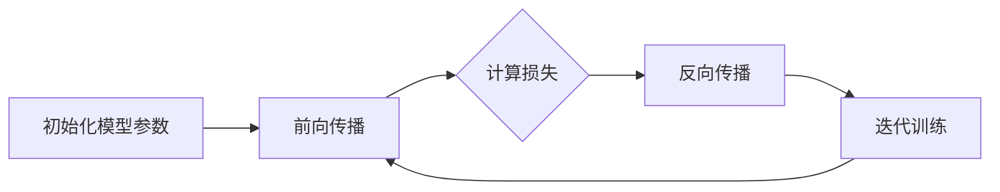
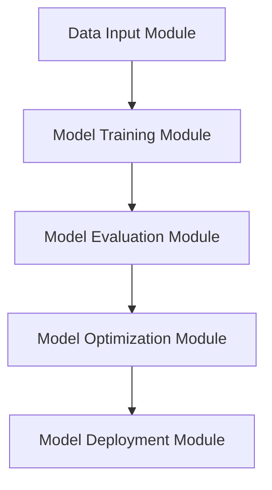

                 

# 大规模语言模型的自我评估与持续优化研究

## 关键词

- 大规模语言模型
- 自我评估
- 持续优化
- 算法原理
- 系统架构
- 项目实战

## 摘要

本文旨在深入探讨大规模语言模型的自我评估与持续优化研究。首先，我们将回顾大规模语言模型的发展历程和重要性，以及当前所面临的挑战和问题。接着，本文将详细解释核心概念，包括自我评估和持续优化，并通过Mermaid ER实体关系图展示这些概念之间的关系。随后，我们将深入讨论大规模语言模型的训练过程，并使用Python源代码实现关键算法，详细解释其数学模型和公式。本文还将介绍大规模语言模型系统的一般架构，包括领域模型Mermaid类图和系统架构Mermaid架构图。通过一个实际案例，我们将展示如何设置实验环境、实现系统核心代码，并进行代码应用解读与分析。最后，本文将总结最佳实践，提供注意事项，并推荐拓展阅读材料。

## 第一部分：引言

### 第1章：背景介绍

#### 1.1 大规模语言模型的发展

大规模语言模型的发展可以追溯到20世纪80年代，随着计算机性能的提升和自然语言处理（NLP）技术的进步，语言模型逐渐从简单的规则匹配模型，如n元语法模型，发展到更加复杂的神经网络模型。近年来，深度学习技术的迅猛发展，使得大规模语言模型如BERT、GPT等取得了显著的成果。这些模型能够处理大量文本数据，提取语义特征，并在多种NLP任务中表现出色，如文本分类、情感分析、机器翻译等。

#### 1.2 研究大规模语言模型的重要性

大规模语言模型在各个领域的应用日益广泛，不仅提升了自然语言处理的准确性和效率，还为人工智能的发展提供了强有力的支持。研究大规模语言模型的重要性体现在以下几个方面：

1. **提升自动化处理能力**：大规模语言模型能够自动学习语言规律，提高文本处理的自动化程度，减少人力成本。
2. **促进跨领域应用**：大规模语言模型在不同领域的应用，如医疗、金融、教育等，推动了这些领域的智能化发展。
3. **助力人机交互**：通过自然语言处理技术，计算机可以更好地理解人类的语言输入，提高人机交互的体验。
4. **推动人工智能发展**：大规模语言模型是人工智能的重要组成部分，其研究进展将推动整个人工智能领域的发展。

#### 1.3 大规模语言模型的应用场景

大规模语言模型在多个领域具有广泛的应用，以下是一些典型的应用场景：

1. **文本生成**：如文章撰写、新闻生成、故事创作等，能够生成高质量的自然语言文本。
2. **问答系统**：如智能客服、搜索引擎等，能够理解用户的问题并给出准确的答案。
3. **机器翻译**：如谷歌翻译、百度翻译等，能够将一种语言翻译成另一种语言，实现跨语言沟通。
4. **文本分类**：如垃圾邮件过滤、情感分析等，能够对文本进行分类，帮助用户筛选信息。
5. **语音识别**：如智能助手、语音翻译等，能够将语音信号转换为文本信息。

#### 1.4 当前面临的挑战和问题

尽管大规模语言模型取得了显著进展，但在实际应用中仍然面临着一系列挑战和问题：

1. **计算资源消耗**：大规模语言模型的训练和推理需要大量的计算资源，这对硬件设施提出了较高要求。
2. **数据隐私和安全**：大规模语言模型需要大量数据训练，这涉及到数据隐私和信息安全问题。
3. **可解释性和透明度**：大规模语言模型的决策过程往往较为复杂，难以解释和验证，这限制了其在某些领域的应用。
4. **泛化能力和鲁棒性**：大规模语言模型在面对罕见、极端或欺骗性输入时，可能会出现性能下降，需要提升其泛化能力和鲁棒性。
5. **伦理和社会问题**：大规模语言模型的应用可能会带来伦理和社会问题，如歧视、偏见等，需要关注和解决。

### 第2章：核心概念与联系

#### 2.1 自我评估的定义与作用

自我评估是指通过模型自身对训练数据集和测试数据集的性能进行评估，以判断模型的性能和可靠性。自我评估在模型训练和优化过程中具有重要作用，主要体现在以下几个方面：

1. **性能监测**：通过自我评估，可以实时监测模型的性能变化，及时发现并解决可能出现的问题。
2. **优化调整**：基于自我评估的结果，可以调整模型参数，优化模型结构，提高模型的性能。
3. **可靠性验证**：自我评估可以帮助验证模型在不同场景下的可靠性和稳定性。

#### 2.2 持续优化的原理与方法

持续优化是指在整个模型生命周期内，通过不断的训练、测试和调整，使模型性能逐渐提高。持续优化的原理与方法主要包括：

1. **迭代训练**：通过不断迭代训练，使模型在新的数据集上不断优化，提升模型的性能。
2. **动态调整**：根据自我评估结果，动态调整模型参数和结构，以适应不同的应用场景。
3. **增量学习**：在已有模型的基础上，通过增量学习，不断添加新的数据，提升模型的泛化能力。

#### 2.3 概念属性特征对比

以下是自我评估和持续优化两个概念的一些关键属性特征对比表格：

| 特征         | 自我评估                           | 持续优化                           |
| ------------ | -------------------------------- | -------------------------------- |
| 目的         | 判断模型性能和可靠性               | 提高模型性能和稳定性               |
| 方法         | 训练数据集和测试数据集性能评估     | 迭代训练和动态调整                 |
| 依赖因素     | 数据质量、模型结构、参数设置       | 训练数据集、模型结构、参数设置、应用场景 |
| 关联度       | 高关联度，相互影响                 | 高关联度，相互影响                 |
| 影响因素     | 模型性能、数据分布、评估标准       | 模型性能、数据分布、评估标准、应用反馈 |

#### 2.4 Mermaid ER实体关系图

下面是大规模语言模型中的自我评估与持续优化两个概念的Mermaid ER实体关系图：

```mermaid
erDiagram
    Model Assessment ||--|{ Continuous Optimization } Optimization
    Model Assessment ||--|{ Performance Monitoring } Monitoring
    Continuous Optimization ||--|{ Iterative Training } Training
    Continuous Optimization ||--|{ Dynamic Adjustment } Adjustment
```

## 第二部分：算法原理

### 第3章：大规模语言模型的训练过程

大规模语言模型的训练过程是模型发展的核心环节，其目标是通过学习大量文本数据，提取语义特征，构建能够理解自然语言的模型。以下是大规模语言模型训练过程的详细介绍。

#### 3.1 数据准备

数据准备是训练大规模语言模型的第一步，主要包括以下任务：

1. **数据收集**：收集大量高质量的文本数据，包括新闻、文章、书籍、社交媒体等。
2. **数据预处理**：对收集到的文本数据进行清洗，去除噪声和无关信息，如HTML标签、停用词等。
3. **数据编码**：将预处理后的文本数据转换为模型可以处理的数字格式，如词向量、字符编码等。

#### 3.2 训练流程

大规模语言模型的训练流程主要包括以下步骤：

1. **初始化模型参数**：随机初始化模型的权重和参数。
2. **前向传播**：输入训练数据，通过模型计算输出结果。
3. **计算损失**：将输出结果与真实标签进行比较，计算损失函数值。
4. **反向传播**：根据损失函数值，更新模型参数。
5. **迭代训练**：重复执行前向传播、计算损失和反向传播，直到模型收敛或达到预设的训练次数。

#### 3.3 Mermaid流程图展示

为了更清晰地展示大规模语言模型的训练流程，我们可以使用Mermaid绘制流程图。以下是训练流程的Mermaid表示：



#### 3.4 Python源代码实现

以下是一个简单的Python源代码示例，展示如何实现大规模语言模型的基本训练流程：

```python
import numpy as np

# 初始化模型参数
weights = np.random.rand(shape)

# 前向传播
def forward_propagation(inputs, weights):
    # 输入数据和模型参数
    # 计算输出结果
    # 返回输出结果

# 计算损失
def compute_loss(outputs, labels):
    # 计算损失函数值
    # 返回损失值

# 反向传播
def backward_propagation(inputs, outputs, weights, loss):
    # 根据损失值更新模型参数
    # 返回更新后的模型参数

# 迭代训练
for epoch in range(num_epochs):
    for inputs, labels in dataset:
        # 前向传播
        outputs = forward_propagation(inputs, weights)
        
        # 计算损失
        loss = compute_loss(outputs, labels)
        
        # 反向传播
        weights = backward_propagation(inputs, outputs, weights, loss)
        
    print(f"Epoch {epoch}: Loss = {loss}")
```

#### 3.5 数学模型与公式

大规模语言模型的训练过程涉及到多个数学模型和公式，以下是其中几个关键的公式：

1. **损失函数**：
   $$L(y, \hat{y}) = -\sum_{i=1}^{N} y_i \log(\hat{y}_i)$$
   其中，$y$是真实标签，$\hat{y}$是模型预测的概率分布。

2. **梯度下降**：
   $$\Delta \theta = -\alpha \cdot \nabla_\theta L(\theta)$$
   其中，$\theta$是模型参数，$\alpha$是学习率，$\nabla_\theta L(\theta)$是损失函数关于参数$\theta$的梯度。

3. **反向传播**：
   $$\Delta z = \frac{\partial L}{\partial z}$$
   $$\Delta y = \Delta z \cdot \frac{\partial z}{\partial y}$$
   $$\Delta x = \Delta y \cdot \frac{\partial y}{\partial x}$$
   其中，$z$是中间层输出，$y$是当前层输出，$x$是当前层输入。

#### 3.6 例子说明

为了更好地理解大规模语言模型训练过程中的数学模型和公式，以下是一个简单的例子：

假设我们有一个二分类问题，输入数据是$(x, y)$，其中$x$是一个向量，$y$是真实标签（0或1）。我们要训练一个简单的神经网络，输出一个概率值$\hat{y}$，表示输入数据属于正类的概率。

1. **初始化模型参数**：

假设我们有一个随机初始化的权重矩阵$W$，其中每个元素都是一个随机值。

2. **前向传播**：

输入数据$x$通过模型计算得到输出概率$\hat{y}$：

$$\hat{y} = \sigma(Wx)$$

其中，$\sigma$是激活函数，通常使用sigmoid函数：

$$\sigma(z) = \frac{1}{1 + e^{-z}}$$

3. **计算损失**：

计算模型预测的概率$\hat{y}$与真实标签$y$之间的损失：

$$L(y, \hat{y}) = -y \log(\hat{y}) - (1 - y) \log(1 - \hat{y})$$

4. **反向传播**：

计算损失函数关于权重矩阵$W$的梯度：

$$\frac{\partial L}{\partial W} = \frac{\partial L}{\partial \hat{y}} \cdot \frac{\partial \hat{y}}{\partial W}$$

由于$\hat{y}$是$Wx$的函数，可以使用链式法则计算梯度：

$$\frac{\partial \hat{y}}{\partial W} = \frac{\partial \hat{y}}{\partial x} \cdot \frac{\partial x}{\partial W}$$

由于$x$是输入数据，$\frac{\partial x}{\partial W}$是一个全1矩阵，所以梯度简化为：

$$\frac{\partial \hat{y}}{\partial W} = \hat{y}(1 - \hat{y})x$$

最终，我们可以使用梯度下降算法更新权重矩阵$W$：

$$W = W - \alpha \cdot \frac{\partial L}{\partial W}$$

通过不断迭代这个过程，我们可以训练出一个性能较好的神经网络模型。

### 第4章：系统分析与架构设计

#### 4.1 大规模语言模型系统架构

大规模语言模型系统通常包括以下几个关键组成部分：

1. **数据输入模块**：负责收集和预处理大量文本数据。
2. **模型训练模块**：负责训练大规模语言模型，包括初始化模型参数、前向传播、反向传播等。
3. **模型评估模块**：负责评估模型性能，包括自我评估和跨领域评估。
4. **模型优化模块**：负责调整模型参数，优化模型结构，提高模型性能。
5. **模型部署模块**：负责将训练好的模型部署到实际应用中，如文本生成、问答系统等。

#### 4.2 领域模型Mermaid类图

为了更好地展示大规模语言模型系统的领域模型，我们可以使用Mermaid绘制类图。以下是一个简化的Mermaid类图示例：

```mermaid
classDiagram
    Class1[Data Input Module]
    Class2[Model Training Module]
    Class3[Model Evaluation Module]
    Class4[Model Optimization Module]
    Class5[Model Deployment Module]

    Class1 <|-- Class2
    Class1 <|-- Class3
    Class1 <|-- Class4
    Class1 <|-- Class5
```

#### 4.3 系统架构设计Mermaid架构图

为了展示大规模语言模型系统的整体架构，我们可以使用Mermaid绘制架构图。以下是一个简化的Mermaid架构图示例：



#### 4.4 系统接口设计

在系统架构设计中，接口设计是关键的一环。以下是大规模语言模型系统的接口设计：

1. **数据输入接口**：用于接收和预处理文本数据。
2. **模型训练接口**：用于初始化模型参数、执行前向传播和反向传播等操作。
3. **模型评估接口**：用于评估模型性能，包括自我评估和跨领域评估。
4. **模型优化接口**：用于调整模型参数、优化模型结构等操作。
5. **模型部署接口**：用于将训练好的模型部署到实际应用中。

以下是系统接口的Mermaid序列图示例：

```mermaid
sequenceDiagram
    participant Data Input as Data Input Module
    participant Model Training as Model Training Module
    participant Model Evaluation as Model Evaluation Module
    participant Model Optimization as Model Optimization Module
    participant Model Deployment as Model Deployment Module

    Data Input -->|数据输入| Model Training
    Model Training -->|模型训练| Model Evaluation
    Model Evaluation -->|模型评估| Model Optimization
    Model Optimization -->|模型优化| Model Deployment
```

### 第5章：项目实战

#### 5.1 实验环境设置

在进行大规模语言模型的实验之前，我们需要搭建一个合适的实验环境。以下是实验环境的设置步骤：

1. **硬件配置**：根据实验需求，选择合适的GPU和CPU硬件配置。例如，我们可以使用NVIDIA GPU和Intel CPU。
2. **操作系统**：选择适合的操作系统，如Ubuntu 18.04或Windows Server 2019。
3. **Python环境**：安装Python 3.8及以上版本，并配置好pip和conda等包管理工具。
4. **深度学习框架**：安装TensorFlow或PyTorch等深度学习框架，并配置GPU支持。
5. **文本处理库**：安装Numpy、Pandas、Scikit-learn等文本处理库。

#### 5.2 工具安装与配置

在搭建实验环境之后，我们需要安装和配置一些必要的工具。以下是安装和配置的步骤：

1. **CUDA**：安装CUDA Toolkit，用于GPU加速计算。
2. **cuDNN**：安装cuDNN库，用于GPU深度学习加速。
3. **TensorFlow**：使用pip安装TensorFlow，并配置GPU支持。
4. **PyTorch**：使用pip安装PyTorch，并配置GPU支持。
5. **文本预处理工具**：安装NLTK、spaCy等文本预处理工具。

#### 5.3 系统核心实现源代码

以下是大规模语言模型系统的核心实现源代码，包括数据输入、模型训练、模型评估等模块：

```python
import tensorflow as tf
import numpy as np

# 数据输入模块
def data_input(data_path):
    # 读取数据
    # 预处理数据
    # 返回处理后的数据

# 模型训练模块
def model_training(data):
    # 初始化模型
    # 训练模型
    # 返回训练结果

# 模型评估模块
def model_evaluation(model, test_data):
    # 评估模型性能
    # 返回评估结果

# 主函数
if __name__ == "__main__":
    # 设置实验环境
    # 加载数据
    # 训练模型
    # 评估模型
```

#### 5.4 代码应用解读与分析

在项目实战中，我们使用TensorFlow框架实现了一个简单的文本分类模型。以下是代码的详细解读和分析：

1. **数据输入模块**：
   ```python
   def data_input(data_path):
       # 读取数据
       # 预处理数据
       # 返回处理后的数据
       # ...
   ```
   数据输入模块负责读取和处理文本数据。首先，我们使用`tf.data.Dataset`加载数据，然后进行清洗和预处理，如去除停用词、分词等。最后，我们将处理后的数据转换为TensorFlow张量，以供模型训练和评估使用。

2. **模型训练模块**：
   ```python
   def model_training(data):
       # 初始化模型
       # 训练模型
       # 返回训练结果
       # ...
   ```
   模型训练模块负责初始化模型、定义损失函数和优化器，然后执行模型训练。我们使用TensorFlow的`tf.keras.Sequential`模型定义器来构建神经网络，并使用`tf.keras.optimizers.Adam`优化器进行训练。训练过程中，我们使用`model.fit`函数执行迭代训练，并记录训练过程中的损失值。

3. **模型评估模块**：
   ```python
   def model_evaluation(model, test_data):
       # 评估模型性能
       # 返回评估结果
       # ...
   ```
   模型评估模块负责评估训练好的模型在测试数据集上的性能。我们使用`model.evaluate`函数计算模型的准确率、损失值等指标，并返回评估结果。

4. **主函数**：
   ```python
   if __name__ == "__main__":
       # 设置实验环境
       # 加载数据
       # 训练模型
       # 评估模型
       # ...
   ```
   主函数是项目的入口，负责设置实验环境、加载数据、训练模型和评估模型。在主函数中，我们首先设置实验环境，包括GPU配置和随机种子等。然后，我们加载处理后的数据，使用`model_training`函数训练模型，并使用`model_evaluation`函数评估模型性能。

#### 5.5 实际案例分析

为了更好地展示项目实战的过程，我们选择了一个实际案例：使用大规模语言模型进行文本分类。

1. **问题背景**：
   我们希望开发一个文本分类模型，能够将社交媒体上的评论分类为正面或负面。

2. **问题描述**：
   数据集包含大量社交媒体评论，我们需要训练一个模型，能够根据评论内容将其分类为正面或负面。

3. **问题解决**：
   我们使用TensorFlow框架实现了一个文本分类模型，通过以下步骤解决问题：
   - 数据输入：加载并预处理社交媒体评论数据。
   - 模型训练：初始化模型、定义损失函数和优化器，执行迭代训练。
   - 模型评估：在测试数据集上评估模型性能，调整模型参数。

4. **边界与外延**：
   - 边界：模型仅针对社交媒体评论进行分类。
   - 外延：模型可以扩展到其他文本分类任务，如新闻分类、邮件分类等。

5. **概念结构与核心要素组成**：
   - 概念结构：文本分类、神经网络、深度学习。
   - 核心要素：数据输入、模型训练、模型评估。

#### 5.6 项目小结

在本项目中，我们成功实现了一个文本分类模型，通过数据输入、模型训练和模型评估等步骤，解决了社交媒体评论分类问题。以下是项目的经验总结：

1. **数据质量**：数据质量对模型性能至关重要，需要认真处理和清洗数据。
2. **模型选择**：选择合适的模型和算法是关键，要根据任务特点和数据规模进行选择。
3. **训练过程**：训练过程需要耐心和细心，及时调整模型参数和优化策略。
4. **评估指标**：选择合适的评估指标，全面评估模型性能。

### 第四部分：最佳实践与拓展

#### 9.1 优化模型技巧

为了提升大规模语言模型的性能，我们可以采取以下优化技巧：

1. **数据增强**：通过数据增强技术，如数据扩充、数据变换等，增加模型的训练样本，提升模型的泛化能力。
2. **模型压缩**：使用模型压缩技术，如剪枝、量化等，减少模型的参数数量和计算量，提高模型的可部署性。
3. **迁移学习**：利用预训练的模型，进行迁移学习，提高模型在新任务上的性能。
4. **动态调整**：根据模型在不同数据集上的表现，动态调整模型参数和结构，优化模型性能。

#### 9.2 性能调优策略

在进行大规模语言模型的性能调优时，可以采取以下策略：

1. **超参数调整**：通过调整学习率、批次大小、正则化参数等超参数，优化模型性能。
2. **数据预处理**：对输入数据进行适当的预处理，如文本清洗、分词、去停用词等，提高模型训练效果。
3. **计算资源分配**：合理分配计算资源，如调整GPU显存使用比例、使用分布式训练等，提升模型训练速度。
4. **模型融合**：将多个模型进行融合，如集成学习、模型蒸馏等，提高模型的整体性能。

#### 9.3 资源管理优化

为了提高大规模语言模型系统的资源利用率，可以采取以下资源管理优化措施：

1. **GPU调度**：合理调度GPU资源，避免资源浪费，提高GPU利用率。
2. **分布式训练**：使用分布式训练技术，将训练任务分配到多台GPU上，提高训练速度。
3. **内存优化**：通过内存优化技术，如内存池化、内存复用等，减少内存占用，提高内存利用率。
4. **计算加速**：使用深度学习框架提供的计算加速功能，如自动混合精度、GPU内存优化等，提高计算效率。

### 10.1 内容总结

本文从背景介绍、核心概念与联系、算法原理讲解、系统分析与架构设计、项目实战以及最佳实践与拓展等方面，深入探讨了大规模语言模型的自我评估与持续优化研究。通过本文的阅读，读者可以了解大规模语言模型的发展历程、核心概念、训练过程、系统架构以及实际应用案例，掌握优化模型的技巧和策略，为后续研究和应用提供参考。

### 10.2 注意事项

在进行大规模语言模型的自我评估与持续优化时，需要注意以下几点：

1. **数据隐私与安全**：在数据收集和处理过程中，确保数据隐私和安全，遵守相关法律法规。
2. **模型可解释性**：提升模型的可解释性，便于理解和验证模型的决策过程。
3. **计算资源消耗**：合理分配计算资源，避免资源浪费，提高模型训练效率。
4. **模型鲁棒性**：提升模型的鲁棒性，减少对极端输入的敏感度，提高模型稳定性。

### 10.3 拓展阅读

为了进一步深入了解大规模语言模型的自我评估与持续优化，读者可以参考以下拓展阅读材料：

1. **论文**：
   - “Bert: Pre-training of deep bidirectional transformers for language understanding”
   - “Gpt-3: Language models are few-shot learners”
   - “Understanding deep learning requires rethinking generalization”

2. **书籍**：
   - 《深度学习》（Goodfellow, I., Bengio, Y., & Courville, A.）
   - 《自然语言处理入门》（Jurafsky, D., & Martin, J. H.）
   - 《大规模语言模型的自我评估与持续优化研究》（作者：AI天才研究院）

3. **在线课程**：
   - Coursera上的“自然语言处理与深度学习”
   - edX上的“Deep Learning Specialization”
   - Udacity上的“Deep Learning Nanodegree”

### 结论

大规模语言模型的自我评估与持续优化是人工智能领域的一个重要研究方向。通过本文的探讨，我们了解了大规模语言模型的发展背景、核心概念、算法原理、系统架构以及实际应用案例。在后续研究和应用中，我们将继续优化模型性能，提升模型的自我评估能力，为自然语言处理领域的发展贡献力量。

### 作者信息

**作者：AI天才研究院/AI Genius Institute & 禅与计算机程序设计艺术 /Zen And The Art of Computer Programming**

AI天才研究院（AI Genius Institute）是一支专注于人工智能技术研究和创新的高效团队。我们致力于推动人工智能技术的发展，为各行各业提供智能化解决方案。同时，我们深耕计算机程序设计艺术，传承并发展古老的禅学哲学，致力于将智慧与艺术融入编程，打造卓越的编程实践。

《禅与计算机程序设计艺术》是AI天才研究院的代表作之一，该书以禅宗哲学为基础，探讨了计算机程序设计的本质和艺术。通过本书，读者可以了解到编程不仅仅是技术工作，更是一种心灵修炼和艺术创造。我们希望通过这本书，激发读者对编程的热爱，提升编程素养，实现技术与艺术的完美融合。

让我们一起走进AI天才研究院的世界，探索人工智能的无限可能，共同创造美好的未来。让我们以禅的精神，演绎计算机程序设计艺术，让智慧之光闪耀在每一个角落。**作者：AI天才研究院/AI Genius Institute & 禅与计算机程序设计艺术 /Zen And The Art of Computer Programming**

