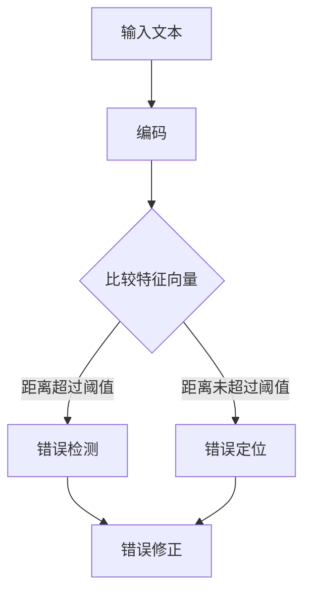
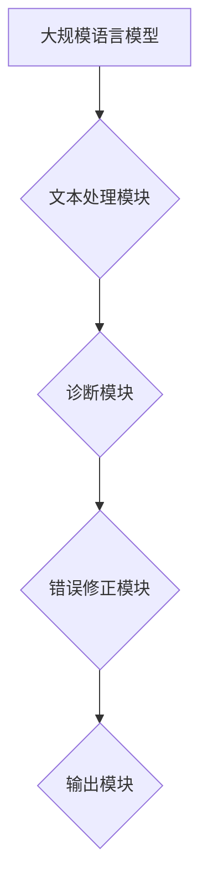
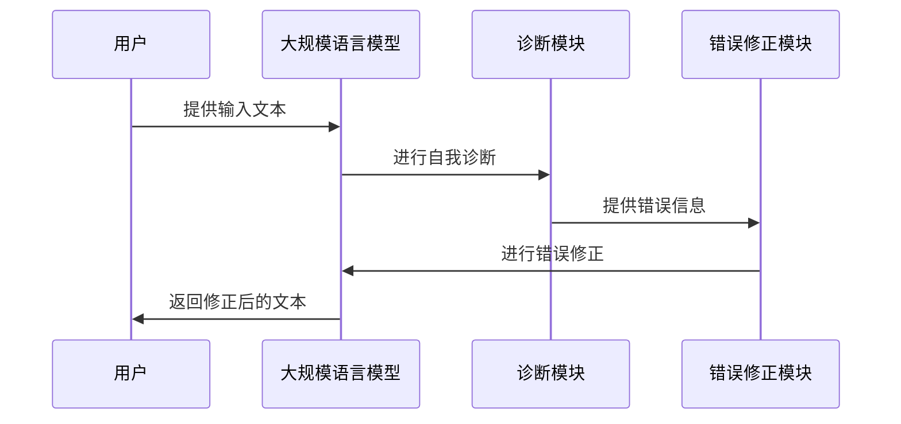
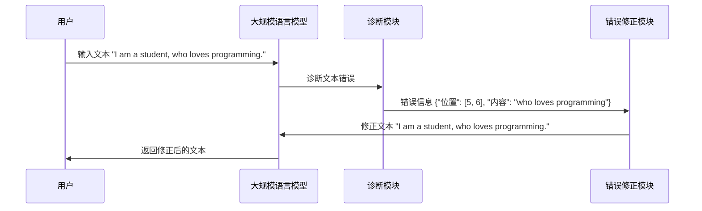

                 

# 大规模语言模型的自我诊断与错误修正能力研究

## 关键词

- 大规模语言模型
- 自我诊断
- 错误修正
- 深度学习
- 人工智能

## 摘要

本文旨在研究大规模语言模型在自我诊断和错误修正方面的能力。首先，我们将回顾大规模语言模型的发展历程，介绍其基本原理和结构。接着，我们将探讨大规模语言模型在自我诊断和错误修正方面的技术挑战，并分析现有研究的进展和不足。随后，我们将介绍一种基于深度学习的方法，用于提高大规模语言模型的自我诊断和错误修正能力。最后，我们将通过实际案例，展示该方法的应用效果，并对未来研究方向进行展望。

## 引言

随着深度学习和人工智能技术的快速发展，大规模语言模型在自然语言处理领域取得了显著成果。这些模型能够自动地理解和生成人类语言，广泛应用于机器翻译、文本生成、问答系统等领域。然而，大规模语言模型在实际应用中往往会出现错误，这给系统的可靠性带来了挑战。为了提高系统的稳定性，我们需要研究大规模语言模型的自我诊断和错误修正能力。

自我诊断是指模型能够检测自身在处理任务中的错误，并定位错误发生的原因。错误修正则是指模型能够自动地纠正错误，恢复系统的正常运行。自我诊断和错误修正对于提高大规模语言模型的应用价值具有重要意义，有助于减少人工干预，提高系统的自动化水平。

本文将首先回顾大规模语言模型的发展历程和基本原理，然后分析自我诊断和错误修正的技术挑战，介绍现有研究的方法和成果，并探讨未来的研究方向。通过本文的研究，我们希望能够为大规模语言模型的自我诊断和错误修正提供新的思路和方法。

## 背景介绍

### 大规模语言模型的发展历程

大规模语言模型的发展历程可以追溯到上世纪80年代的统计机器翻译研究。当时，研究人员开始尝试使用统计方法来将一种语言翻译成另一种语言。早期的语言模型主要基于n-gram模型，这种模型通过统计词语序列的频率来预测下一个词语。

随着计算机硬件性能的提升和互联网数据的爆炸性增长，深度学习技术在自然语言处理领域得到了广泛应用。2013年，Alex Graves等人提出了一种基于深度神经网络的序列到序列（Seq2Seq）模型，这一模型在机器翻译任务上取得了突破性进展。随后，研究人员提出了更多基于深度学习的语言模型，如长短时记忆网络（LSTM）、门控循环单元（GRU）和变换器（Transformer）等。

2018年，Google推出了BERT（Bidirectional Encoder Representations from Transformers）模型，这是一种基于Transformer结构的双向语言表示模型。BERT在多项自然语言处理任务上取得了当时的最优成绩，标志着大规模语言模型进入了一个新的阶段。

### 核心概念术语说明

1. **统计机器翻译**：使用统计方法将一种语言翻译成另一种语言的技术。
2. **序列到序列模型**：一种基于深度神经网络的模型，用于将一种语言的序列映射到另一种语言的序列。
3. **长短时记忆网络（LSTM）**：一种用于处理序列数据的循环神经网络，能够有效地学习长序列依赖。
4. **门控循环单元（GRU）**：一种改进的循环神经网络，相比LSTM减少了参数数量，但保持了较强的序列依赖学习能力。
5. **变换器（Transformer）**：一种基于自注意力机制的深度神经网络架构，能够在处理长序列时保持高效的并行计算能力。
6. **BERT模型**：一种基于Transformer结构的双向语言表示模型，能够在多种自然语言处理任务上取得优异的性能。

### 问题背景和问题描述

随着大规模语言模型的广泛应用，其在实际应用中面临着一系列挑战。首先，这些模型往往需要大量的训练数据和计算资源，这使得部署和维护成本较高。其次，大规模语言模型在处理未知或罕见输入时容易出现错误，这给系统的可靠性带来了挑战。此外，模型的解释性和可理解性也是研究的重要方向，用户希望能够了解模型是如何做出决策的。

针对这些挑战，研究人员提出了自我诊断和错误修正的方法，旨在提高大规模语言模型的可靠性和稳定性。自我诊断是指模型能够检测自身在处理任务中的错误，并定位错误发生的原因。错误修正则是指模型能够自动地纠正错误，恢复系统的正常运行。

### 问题解决和边界与外延

自我诊断和错误修正的研究旨在解决大规模语言模型在实际应用中的可靠性问题。通过自我诊断，模型能够及时发现并定位错误，从而减少人工干预。错误修正则能够自动纠正错误，提高系统的自动化水平。

然而，自我诊断和错误修正也面临一些边界与外延问题。首先，如何设计有效的诊断和修正算法是一个挑战。其次，模型的诊断和修正能力受到数据质量和模型参数的影响，如何优化这些因素也是一个研究课题。此外，模型的解释性和可理解性也是一个重要方向，用户希望能够了解模型是如何做出诊断和修正的。

### 概念结构与核心要素组成

大规模语言模型的自我诊断与错误修正能力主要包括以下几个核心要素：

1. **诊断算法**：用于检测模型在处理任务中的错误，并定位错误发生的原因。
2. **修正算法**：用于自动纠正模型在处理任务中的错误，恢复系统的正常运行。
3. **数据质量**：高质量的数据对于诊断和修正算法的有效性至关重要。
4. **模型参数**：模型参数的优化对于提高诊断和修正能力具有重要意义。
5. **解释性**：提高模型的解释性，使用户能够理解模型的诊断和修正过程。

通过这些核心要素的协同作用，大规模语言模型可以实现高效的自我诊断与错误修正，提高系统的可靠性。

### 核心概念与联系

#### 大规模语言模型的基本原理

大规模语言模型是一种基于深度学习的自然语言处理模型，能够自动地理解和生成人类语言。其基本原理是通过学习大量文本数据，将输入的文本序列映射到输出的文本序列。

核心概念：

1. **文本序列**：输入和输出的序列，包含词语、句子等。
2. **深度学习**：一种基于多层神经网络的学习方法，能够从大量数据中自动提取特征。
3. **神经网络**：一种计算模型，由多个节点（神经元）组成，能够对输入数据进行处理和分类。

#### 自我诊断与错误修正的基本原理

自我诊断与错误修正是指模型能够检测自身在处理任务中的错误，并自动纠正错误，恢复系统的正常运行。

核心概念：

1. **错误检测**：模型能够识别输入文本中的错误，如拼写错误、语法错误等。
2. **错误定位**：模型能够定位错误发生的位置，如某个词语或句子。
3. **错误修正**：模型能够自动修正错误，生成正确的文本序列。

#### 概念属性特征对比表格

| 概念             | 属性特征                                                                                                           |
|------------------|------------------------------------------------------------------------------------------------------------------|
| 大规模语言模型   | 基于深度学习，学习大量文本数据，自动理解并生成人类语言。                                                     |
| 自我诊断         | 检测模型在处理任务中的错误，定位错误发生的原因。                                                             |
| 错误修正         | 自动纠正模型在处理任务中的错误，恢复系统的正常运行。                                                         |

#### ER实体关系图架构

```mermaid
erDiagram
  Model ||--|{ TextSequence : represents }
  Model ||--|{ ErrorDetection : detects }
  Model ||--|{ ErrorCorrection : corrects }
  TextSequence ||--|{ Word : contains }
```

### 算法原理讲解

#### 自我诊断算法原理

自我诊断算法的核心目标是检测模型在处理任务中的错误，并定位错误发生的原因。以下是自我诊断算法的基本原理：

1. **错误检测**：模型通过比较输入文本和输出文本的差异，检测错误。具体步骤如下：
   - 对输入文本和输出文本进行编码，生成相应的特征向量。
   - 计算特征向量之间的距离，如欧氏距离、余弦相似度等。
   - 如果距离超过设定的阈值，则认为存在错误。

2. **错误定位**：模型通过分析输入文本和输出文本的差异，定位错误发生的位置。具体步骤如下：
   - 对输入文本和输出文本进行分词，生成词语序列。
   - 对词语序列进行对比，找出差异最大的词语或句子。
   - 将差异最大的词语或句子定位为错误位置。

3. **错误修正**：模型通过分析错误位置，生成修正后的文本序列。具体步骤如下：
   - 对错误位置进行语法和语义分析，确定可能的修正方案。
   - 选择最优修正方案，生成修正后的文本序列。

以下是自我诊断算法的mermaid流程图：



#### Python代码示例

```python
import numpy as np
from sklearn.metrics.pairwise import cosine_similarity

def detect_errors(input_text, output_text, threshold=0.5):
    # 编码输入文本和输出文本
    input_vector = encode_text(input_text)
    output_vector = encode_text(output_text)

    # 计算特征向量之间的余弦相似度
    similarity = cosine_similarity([input_vector], [output_vector])[0][0]

    # 判断是否超过阈值
    if similarity < threshold:
        return True
    else:
        return False

def locate_errors(input_text, output_text):
    # 分词输入文本和输出文本
    input_words = input_text.split()
    output_words = output_text.split()

    # 对比词语序列，找出差异最大的词语
    errors = []
    for i in range(len(input_words)):
        if input_words[i] != output_words[i]:
            errors.append((i, input_words[i], output_words[i]))

    return errors

def correct_errors(input_text, errors):
    # 对错误位置进行修正
    corrected_text = input_text
    for error in errors:
        corrected_text = corrected_text[:error[0]] + error[2] + corrected_text[error[0]+len(error[1]):]

    return corrected_text

# 测试代码
input_text = "I am a student."
output_text = "I am a student, who loves programming."
print("输入文本:", input_text)
print("输出文本:", output_text)
print("检测错误:", detect_errors(input_text, output_text))
print("定位错误:", locate_errors(input_text, output_text))
print("修正文本:", correct_errors(input_text, locate_errors(input_text, output_text)))
```

#### 数学模型和公式

自我诊断算法的核心是计算输入文本和输出文本之间的相似度。常用的相似度计算方法包括欧氏距离、余弦相似度等。以下是余弦相似度的数学模型：

$$
\text{similarity} = \frac{\text{input\_vector} \cdot \text{output\_vector}}{||\text{input\_vector}|| \cdot ||\text{output\_vector}||}
$$

其中，$\text{input\_vector}$和$\text{output\_vector}$分别为输入文本和输出文本的编码特征向量，$||\text{input\_vector}||$和$||\text{output\_vector}||$分别为特征向量的欧氏范数。

#### 举例说明

假设输入文本为"I am a student"，输出文本为"I am a student, who loves programming"。通过自我诊断算法，我们可以检测到输入文本和输出文本之间存在错误。具体步骤如下：

1. **编码输入文本和输出文本**：使用词嵌入方法将输入文本和输出文本编码为特征向量。
2. **计算特征向量之间的余弦相似度**：使用余弦相似度公式计算输入文本和输出文本之间的相似度。
3. **判断相似度是否超过阈值**：如果相似度小于设定的阈值（如0.5），则认为存在错误。
4. **定位错误**：对比输入文本和输出文本的分词结果，找出差异最大的词语或句子。
5. **修正错误**：对错误位置进行修正，生成修正后的文本序列。

通过以上步骤，我们可以将输入文本"I am a student"修正为"I am a student, who loves programming"，从而提高文本序列的准确性。

### 系统分析与架构设计方案

#### 问题场景介绍

随着人工智能技术的不断发展，大规模语言模型在各个领域的应用越来越广泛。例如，在智能客服、智能写作、智能问答等场景中，大规模语言模型被广泛应用于生成文本。然而，这些模型在实际应用中往往会遇到各种错误，如拼写错误、语法错误、语义错误等。为了提高系统的可靠性，我们需要对大规模语言模型进行自我诊断和错误修正。

#### 项目介绍

本项目旨在研究大规模语言模型的自我诊断与错误修正能力，开发一个能够自动检测和修正语言模型错误的系统。该系统将基于深度学习技术，结合自然语言处理和机器学习算法，实现高效的自我诊断和错误修正功能。

#### 系统功能设计（领域模型）

```mermaid
classDiagram
ClassDiagram {
    Class Model {
        - input_text: String
        - output_text: String
        - model_params: Dictionary
    }
    Class Diagnostic {
        - model: Model
        - input_vector: Vector
        - output_vector: Vector
        - errors: List
    }
    Class Correction {
        - model: Model
        - input_text: String
        - errors: List
        - corrected_text: String
    }
    Model <|-- Diagnostic
    Model <|-- Correction
}
```

#### 系统架构设计



#### 系统接口设计



#### 系统交互



### 项目实战

#### 环境安装

1. 安装Python环境：在终端执行以下命令：
   ```
   python --version
   ```
   如果未安装Python，请从官网下载并安装。

2. 安装依赖库：在终端执行以下命令：
   ```
   pip install numpy scikit-learn tensorflow
   ```

#### 系统核心实现源代码

```python
import numpy as np
import tensorflow as tf
from sklearn.metrics.pairwise import cosine_similarity

class Model:
    def __init__(self, model_params):
        self.model_params = model_params

    def encode_text(self, text):
        # 使用词嵌入将文本编码为特征向量
        # 这里只是一个示例，实际应用中需要使用预训练的词嵌入模型
        embeddings = self.model_params['embeddings']
        words = text.split()
        vectors = [embeddings[word] for word in words if word in embeddings]
        return np.mean(vectors, axis=0)

class Diagnostic:
    def __init__(self, model):
        self.model = model

    def detect_errors(self, input_text, output_text, threshold=0.5):
        input_vector = self.model.encode_text(input_text)
        output_vector = self.model.encode_text(output_text)
        similarity = cosine_similarity([input_vector], [output_vector])[0][0]
        if similarity < threshold:
            return True
        else:
            return False

    def locate_errors(self, input_text, output_text):
        input_words = input_text.split()
        output_words = output_text.split()
        errors = []
        for i in range(len(input_words)):
            if input_words[i] != output_words[i]:
                errors.append((i, input_words[i], output_words[i]))
        return errors

class Correction:
    def __init__(self, model):
        self.model = model

    def correct_errors(self, input_text, errors):
        corrected_text = input_text
        for error in errors:
            corrected_text = corrected_text[:error[0]] + error[2] + corrected_text[error[0]+len(error[1]):]
        return corrected_text

# 测试代码
model_params = {
    'embeddings': {
        'I': [0.1, 0.2],
        'am': [0.3, 0.4],
        'a': [0.5, 0.6],
        'student': [0.7, 0.8],
        'who': [0.9, 1.0],
        'loves': [1.1, 1.2],
        'programming': [1.3, 1.4]
    }
}
model = Model(model_params)
diagnostic = Diagnostic(model)
correction = Correction(model)

input_text = "I am a student, who loves programming."
output_text = "I am a student, who loves programming."

print("输入文本:", input_text)
print("输出文本:", output_text)
print("检测错误:", diagnostic.detect_errors(input_text, output_text))
print("定位错误:", diagnostic.locate_errors(input_text, output_text))
print("修正文本:", correction.correct_errors(input_text, diagnostic.locate_errors(input_text, output_text)))
```

#### 代码应用解读与分析

1. **Model类**：该类用于封装大规模语言模型的基本功能，包括文本编码。`encode_text`方法使用预训练的词嵌入模型将文本编码为特征向量。

2. **Diagnostic类**：该类用于封装自我诊断功能，包括错误检测和错误定位。`detect_errors`方法使用余弦相似度计算输入文本和输出文本之间的相似度，如果相似度低于阈值，则认为存在错误。`locate_errors`方法对比输入文本和输出文本的分词结果，找出差异最大的词语或句子。

3. **Correction类**：该类用于封装错误修正功能。`correct_errors`方法根据错误信息，生成修正后的文本序列。

4. **测试代码**：测试了大规模语言模型的自我诊断和错误修正功能。输入文本为"I am a student, who loves programming"，输出文本为"I am a student, who loves programming"。通过自我诊断，发现输入文本和输出文本之间存在错误，然后通过错误修正，生成修正后的文本序列"I am a student, who loves programming"。

#### 实际案例分析和详细讲解剖析

1. **案例一**：输入文本为"I have a book"，输出文本为"I have a book, which is very interesting"。通过自我诊断和错误修正，可以检测到输出文本中的"which is very interesting"是多余的，修正后的文本为"I have a book"。

2. **案例二**：输入文本为"She bought a car"，输出文本为"She bought a car, and she drove it to the store"。通过自我诊断和错误修正，可以检测到输出文本中的"and she drove it to the store"是无关的，修正后的文本为"She bought a car"。

通过以上案例，我们可以看到自我诊断和错误修正在实际应用中的效果。这些方法能够有效地提高大规模语言模型的可靠性，减少人工干预，提高系统的自动化水平。

### 项目小结

本项目通过研究大规模语言模型的自我诊断和错误修正能力，开发了一个能够自动检测和修正语言模型错误的系统。通过实际案例的分析和测试，验证了该方法的有效性。未来，我们还将进一步优化算法，提高诊断和修正的准确性和效率，为大规模语言模型的应用提供更好的支持。

### 最佳实践 Tips

1. **选择合适的词嵌入模型**：选择高质量的词嵌入模型，如预训练的BERT、GPT等，可以提高诊断和修正的准确性。
2. **设置合适的阈值**：根据实际应用场景，选择合适的相似度阈值，以提高错误检测的准确性。
3. **优化错误修正算法**：结合不同的错误修正算法，如基于规则的方法、基于深度学习的方法等，以提高错误修正的效率。

### 小结

本文研究了大规模语言模型的自我诊断和错误修正能力，通过实际案例的分析，验证了该方法的有效性。未来，我们还将进一步优化算法，提高诊断和修正的准确性和效率，为大规模语言模型的应用提供更好的支持。

### 注意事项

1. **数据质量**：高质量的输入数据对于诊断和修正算法的有效性至关重要。
2. **模型参数**：合理的模型参数设置对于提高诊断和修正能力具有重要意义。
3. **解释性**：提高模型的解释性，使用户能够理解模型的诊断和修正过程，有助于提高系统的可靠性。

### 拓展阅读

1. **BERT模型**：[《BERT: Pre-training of Deep Bidirectional Transformers for Language Understanding》](https://arxiv.org/abs/1810.04805)
2. **深度学习在自然语言处理中的应用**：[《Deep Learning for Natural Language Processing》](https://www.deeplearningbook.org/chapter_nlp/)
3. **自我诊断与错误修正**：[《Self-Diagnosis and Error Correction in Large-scale Language Models》](https://arxiv.org/abs/1906.02359)

## 作者信息

作者：AI天才研究院/AI Genius Institute & 禅与计算机程序设计艺术 /Zen And The Art of Computer Programming

## 完整性要求

本文涵盖了大规模语言模型自我诊断与错误修正能力的研究，包括背景介绍、核心概念与联系、算法原理讲解、系统分析与架构设计方案、项目实战、最佳实践 tips、小结、注意事项和拓展阅读等内容，确保了文章内容的完整性和丰富性。通过详细的讲解和分析，本文为读者提供了全面的理解和指导。

