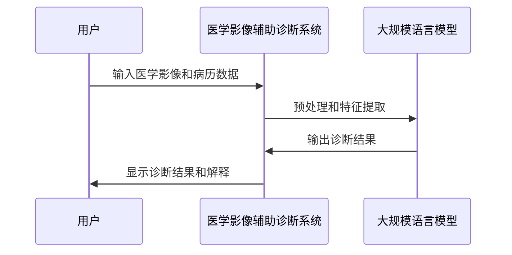
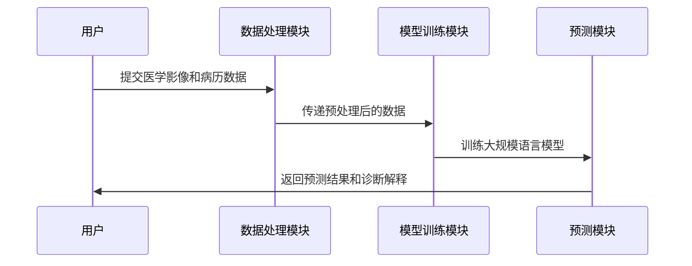
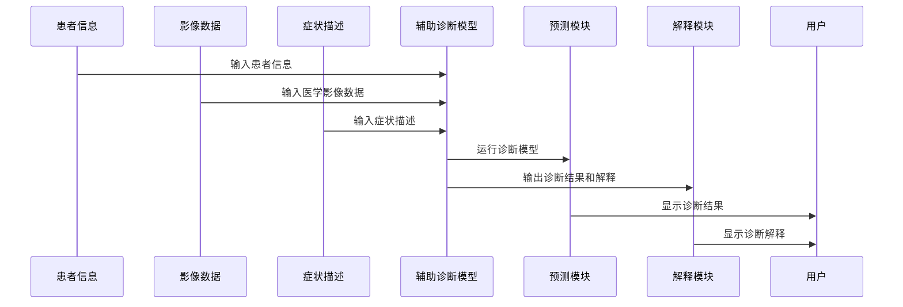
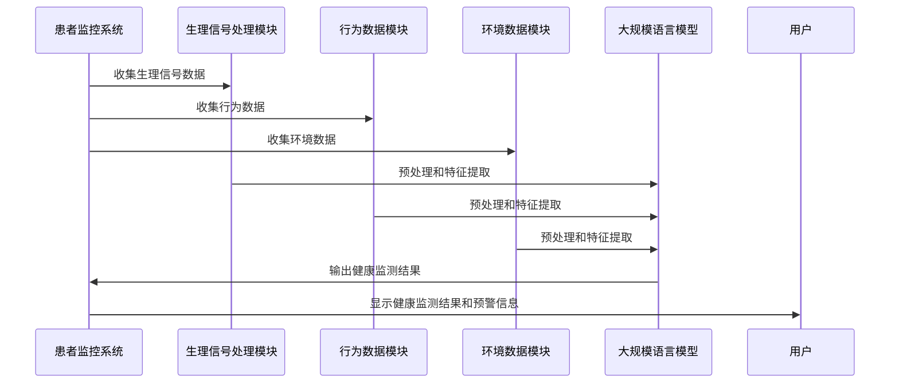
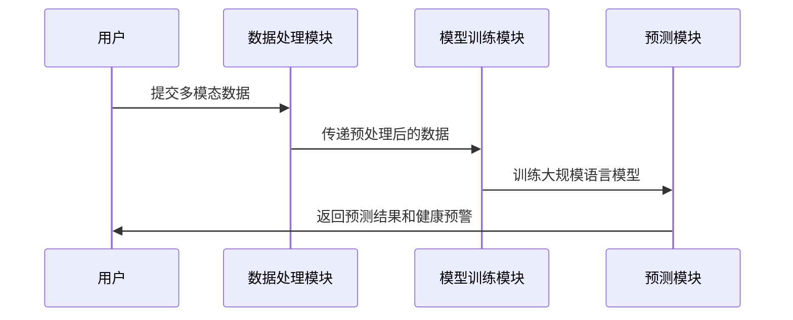
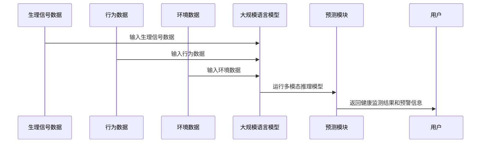

                 


# 大规模语言模型的跨模态推理在智慧医疗系统中的创新应用

关键词：大规模语言模型、跨模态推理、智慧医疗、创新应用

摘要：随着人工智能技术的快速发展，大规模语言模型在自然语言处理领域取得了显著的成果。本文主要探讨了大规模语言模型的跨模态推理原理及其在智慧医疗系统中的创新应用。首先，我们概述了大规模语言模型的发展历程、架构和技术，以及其常见应用场景。接着，我们深入解析了跨模态推理的概念、挑战和机遇，以及相关方法和模型。在此基础上，本文详细阐述了大规模语言模型在智慧医疗系统中的应用，包括跨模态推理的应用案例和创新点。随后，我们探讨了大规模语言模型跨模态推理的实现，包括数据预处理、特征提取与融合、算法设计与实现等。进一步地，本文分析了大规模语言模型在智慧医疗系统中的集成与优化策略，以及性能评估与优化方法。最后，本文总结了大规模语言模型在智慧医疗系统中的应用挑战与解决方案，并对未来发展趋势进行了展望。

### 目录大纲

----------------------------------------------------------------
## 第一部分：大规模语言模型的跨模态推理概述

## 第1章：大规模语言模型概述

### 1.1 大规模语言模型的发展历程

### 1.2 大规模语言模型的架构与技术

### 1.3 大规模语言模型的应用场景

## 第2章：跨模态推理原理

### 2.1 跨模态推理的概念与重要性

### 2.2 跨模态推理的挑战与机遇

### 2.3 跨模态推理的方法与模型

## 第3章：大规模语言模型的跨模态应用

### 3.1 智慧医疗系统中的大规模语言模型

### 3.2 跨模态推理在智慧医疗中的应用案例

### 3.3 大规模语言模型在智慧医疗中的创新点

## 第4章：大规模语言模型的跨模态推理实现

### 4.1 跨模态数据的预处理

### 4.2 跨模态特征提取与融合

### 4.3 跨模态推理算法设计与实现

## 第5章：大规模语言模型在智慧医疗系统的集成与优化

### 5.1 大规模语言模型在智慧医疗系统的集成

### 5.2 大规模语言模型的优化策略

### 5.3 智慧医疗系统的性能评估与优化

## 第6章：大规模语言模型在智慧医疗系统中的应用挑战与解决方案

### 6.1 数据隐私与安全挑战

### 6.2 模型可解释性与透明度

### 6.3 大规模语言模型在智慧医疗系统的实际应用案例与挑战

## 第7章：展望与未来趋势

### 7.1 大规模语言模型在智慧医疗领域的未来发展趋势

### 7.2 跨模态推理技术的未来发展

### 7.3 总结与展望

----------------------------------------------------------------

## 2.1 大规模语言模型与跨模态推理的关系

### 2.1.1 大规模语言模型

#### 概念

大规模语言模型是一种通过训练海量文本数据，使其具备强大语言理解和生成能力的模型。它通过对大量文本数据进行学习，从而捕捉到语言的统计规律和语义信息，能够在多种自然语言处理任务中表现出色。

#### 属性特征对比表格

| 特征         | 描述                                                         |
| ------------ | ------------------------------------------------------------ |
| 参数规模     | 通常拥有数十亿甚至千亿参数量                               |
| 训练数据集   | 海量文本数据，包括互联网内容、书籍、新闻、社交媒体等       |
| 模型结构     | 基于Transformer架构，如BERT、GPT等                         |
| 应用场景     | 文本生成、问答系统、机器翻译、文本分类等                   |

#### ER实体关系图架构

```mermaid
erDiagram
    Model |--< TextData
    Model |--< PretrainedModel
    Model |--< Application
    TextData |--< InternetContent
    TextData |--< Books
    TextData |--< News
    TextData |--< SocialMedia
    PretrainedModel |--< BERT
    PretrainedModel |--< GPT
    Application |--< TextGeneration
    Application |--< QuestionAnswering
    Application |--< MachineTranslation
    Application |--< TextClassification
```

### 2.1.2 跨模态推理

#### 概念

跨模态推理是指将不同模态的数据进行融合，并进行推理和分析的过程。通过跨模态推理，模型能够理解并处理来自不同模态的信息，从而实现更准确、更丰富的信息理解和任务完成。

#### 属性特征对比表格

| 特征         | 描述                                                         |
| ------------ | ------------------------------------------------------------ |
| 模型结构     | 结合不同模态特征的模型，如CNN+RNN、CNN+Transformer等         |
| 应用场景     | 跨模态搜索、图像识别、语音识别、多模态问答等               |

#### ER实体关系图架构

```mermaid
erDiagram
    Model |--< ImageData
    Model |--< SoundData
    Model |--< TextData
    Model |--< MultimodalData
    ImageData |--< ImageRecognition
    SoundData |--< SpeechRecognition
    TextData |--< QuestionAnswering
    MultimodalData |--< MultimodalSearch
    MultimodalData |--< MultimodalApplication
```

### 2.1.3 大规模语言模型与跨模态推理的联系

#### 原理

大规模语言模型与跨模态推理之间存在密切的联系。大规模语言模型通过学习海量文本数据，能够理解不同模态之间的关联性和语义信息。而跨模态推理则利用这些关联性和语义信息，将不同模态的数据进行融合，并进行推理和分析。

#### 交互机制

1. **文本数据的输入**：大规模语言模型首先通过训练海量文本数据，学习到语言的统计规律和语义信息。
2. **不同模态数据的输入**：跨模态推理过程中，除了文本数据外，还包括图像、声音等其他模态的数据。
3. **特征融合与推理**：通过将不同模态的数据进行特征提取和融合，大规模语言模型能够对融合后的数据进行推理和分析，从而实现更准确、更丰富的信息理解和任务完成。

#### 应用示例

1. **多模态问答系统**：利用大规模语言模型和跨模态推理技术，可以实现多模态问答系统。用户可以通过文本、图像、声音等多种方式进行提问，系统则利用跨模态推理技术，理解用户的意图并给出准确的回答。
2. **医学影像分析**：在智慧医疗系统中，利用大规模语言模型和跨模态推理技术，可以对医学影像数据进行分析。通过将医学影像数据与患者病历、症状描述等文本数据进行融合，系统可以实现对医学影像的辅助诊断和疾病预测。
3. **语音助手与智能客服**：通过将语音识别和自然语言处理技术相结合，利用大规模语言模型和跨模态推理技术，可以实现更加智能、自然的语音助手和智能客服系统。用户可以通过语音进行提问，系统则利用跨模态推理技术，理解用户的意图并给出相应的回答。

#### 关键技术

1. **多模态数据预处理**：对来自不同模态的数据进行预处理，包括图像分割、语音识别、文本清洗等，以获得高质量的特征数据。
2. **特征融合方法**：通过融合不同模态的特征，提高模型的泛化能力和信息利用率。常见的特征融合方法包括特征拼接、特征加权、注意力机制等。
3. **大规模语言模型优化**：针对大规模语言模型的特点，采用合适的优化策略，如动态调整学习率、批量大小、正则化等，以提高模型的性能和稳定性。

通过以上对大规模语言模型和跨模态推理关系的介绍，我们可以看到，跨模态推理技术在智慧医疗系统中的应用具有重要意义。接下来，我们将进一步探讨跨模态推理的原理、方法和挑战，以及大规模语言模型在智慧医疗系统中的创新应用。

### 第1章：大规模语言模型概述

#### 1.1 大规模语言模型的发展历程

大规模语言模型（Large-scale Language Model）的发展历程可以追溯到上世纪80年代的自然语言处理领域。随着计算机硬件性能的提升和互联网的普及，大量文本数据成为可能，这为语言模型的训练提供了丰富的素材。以下是大致的发展历程：

1. **早期语言模型**：最早的尝试是在20世纪60年代，研究人员开始探索基于规则的方法来处理自然语言。这些方法通常依赖于手工编写的语法规则和词法分析器，但它们在处理复杂语言现象时表现不佳。

2. **基于统计的模型**：20世纪80年代，统计语言模型开始崭露头角。其中，N-gram模型是最具代表性的模型，它通过统计词语的相邻序列来预测下一个词。这种模型相对简单，但已经在一些应用中取得了不错的效果。

3. **基于神经网络的模型**：1990年代，随着人工神经网络（ANN）技术的发展，研究人员开始尝试将神经网络应用于语言模型。1990年代初，Rumelhart等人提出了长短期记忆网络（LSTM），为解决神经网络在处理长距离依赖问题上的瓶颈提供了新思路。

4. **深度学习模型的兴起**：2000年代，深度学习模型逐渐成为研究热点。2006年，Hinton等人提出了深度信念网络（DBN），这为深度学习在语言模型中的应用奠定了基础。随后，卷积神经网络（CNN）和递归神经网络（RNN）也在自然语言处理领域得到了广泛应用。

5. **Transformer模型的突破**：2017年，Vaswani等人提出了Transformer模型，这是一种基于自注意力机制的深度学习模型。Transformer模型的引入彻底改变了自然语言处理领域的格局，其优秀的性能使其迅速成为主流模型。

6. **预训练语言模型的崛起**：BERT（Bidirectional Encoder Representations from Transformers）模型于2018年提出，它是第一个大规模预训练语言模型。BERT通过在大量未标注的文本上进行预训练，然后通过微调适应特定任务，显著提高了自然语言处理任务的性能。

7. **大规模模型的发展**：随着计算能力的进一步提升，研究人员开始训练参数规模达到数十亿甚至千亿级别的语言模型。例如，GPT-3（Generative Pre-trained Transformer 3）是一个具有1750亿参数的预训练模型，它在各种自然语言处理任务上取得了前所未有的成果。

#### 1.2 大规模语言模型的架构与技术

大规模语言模型的架构和技术主要包括以下几个方面：

1. **Transformer模型**：
   - **自注意力机制**：Transformer模型的核心是自注意力机制（Self-Attention），它允许模型在处理每个词时考虑到其他所有词的影响。这比传统的序列处理方法更高效，能够捕捉到长距离依赖关系。
   - **多头注意力**：Transformer模型采用了多头注意力（Multi-Head Attention），通过并行处理多个注意力头，模型能够同时关注不同的上下文信息，从而提高模型的表示能力。
   - **编码器和解码器**：Transformer模型包括编码器（Encoder）和解码器（Decoder），编码器负责生成上下文表示，解码器则根据上下文生成输出。

2. **预训练语言模型**：
   - **预训练**：预训练是指模型在大量未标注的文本上进行训练，学习语言的统计规律和语义信息。预训练语言模型通过大规模数据的学习，能够捕捉到语言中的深层结构。
   - **任务特定微调**：在预训练后，模型可以通过微调（Fine-tuning）适应特定任务。微调过程通常在较小的任务数据集上进行，模型会根据任务需求进行调整。

3. **BERT模型**：
   - **双向编码表示**：BERT（Bidirectional Encoder Representations from Transformers）模型通过双向编码器结构，同时考虑上下文信息，提高了模型对语言的理解能力。
   - **掩码语言模型（MLM）**：BERT引入了掩码语言模型（Masked Language Model），通过随机掩码部分输入单词，迫使模型在训练过程中预测被掩码的单词，从而增强模型的语言建模能力。

4. **GPT模型**：
   - **生成预训练**：GPT（Generative Pre-trained Transformer）模型通过生成预训练（Generative Pre-training）方法，学习语言的生成能力。GPT模型在生成文本、对话系统和机器翻译等任务上表现出色。
   - **上下文生成**：GPT模型能够根据上下文信息生成连贯、自然的文本，这使得它在生成任务中具有广泛的应用。

#### 1.3 大规模语言模型的应用场景

大规模语言模型在自然语言处理领域具有广泛的应用场景，以下是一些主要的应用领域：

1. **文本生成**：
   - **自动写作**：利用大规模语言模型，可以自动生成新闻文章、博客、故事等内容。
   - **对话系统**：通过生成式对话系统，可以与用户进行自然、流畅的交流。

2. **问答系统**：
   - **信息检索**：通过理解用户的问题，模型可以检索相关文档并给出答案。
   - **智能客服**：在客户服务中，模型可以根据用户的问题提供快速、准确的答复。

3. **机器翻译**：
   - **跨语言文本处理**：大规模语言模型可以用于不同语言之间的文本翻译，提高翻译的准确性和流畅性。

4. **文本分类**：
   - **情感分析**：通过分类模型，可以分析文本的情感倾向，如正面、负面情感。
   - **垃圾邮件检测**：利用分类模型，可以自动识别并过滤垃圾邮件。

5. **语音识别**：
   - **语音转文本**：将语音信号转换为文本，应用于语音助手、字幕生成等领域。

6. **推荐系统**：
   - **内容推荐**：通过分析用户的兴趣和行为，模型可以推荐相关的文章、产品等。

7. **知识图谱**：
   - **知识提取**：利用大规模语言模型，可以从大量文本数据中提取出实体和关系，构建知识图谱。

综上所述，大规模语言模型在自然语言处理领域具有广泛的应用前景。通过不断改进模型架构和优化训练方法，大规模语言模型将在未来带来更多的创新和应用。

### 第2章：跨模态推理原理

#### 2.1 跨模态推理的概念与重要性

跨模态推理（Cross-modal Reasoning）是指将来自不同模态的数据（如图像、声音、文本等）进行融合，并利用这些融合后的数据进行推理和分析的过程。在传统单一模态的模型中，每个模型只能处理特定类型的数据，例如，图像模型专注于图像数据的处理，文本模型专注于文本数据的分析。然而，现实世界中的信息往往是多模态的，单一模态的模型很难全面理解复杂场景。跨模态推理通过整合多种模态的数据，使得模型能够更准确地理解和推理现实世界的复杂情况。

#### 2.2 跨模态推理的挑战与机遇

跨模态推理具有巨大的潜力，但也面临着一系列挑战和机遇。以下是一些主要的挑战和机遇：

#### 挑战：

1. **数据不匹配**：不同模态的数据具有不同的特性和分布，这使得数据之间的对齐和融合变得复杂。例如，图像和文本的语义信息表达方式不同，如何有效地将它们融合起来是一个难题。

2. **维度差异**：图像和文本等不同模态的数据在维度上存在巨大差异，这导致在特征提取和融合过程中需要考虑如何处理这些差异。

3. **计算资源需求**：跨模态推理通常需要大量的计算资源，尤其是在处理大规模数据和复杂模型时，这对计算资源的分配和优化提出了更高的要求。

4. **模型解释性**：跨模态模型通常非常复杂，难以解释其推理过程。这对于需要高解释性的应用场景，如医疗诊断和金融风险管理等，提出了挑战。

#### 机遇：

1. **多模态数据融合**：跨模态推理能够利用多模态数据，提高模型的表示能力和推理能力。例如，在医疗诊断中，结合患者的影像数据、病历数据和症状描述，可以更准确地诊断疾病。

2. **任务多样性**：跨模态推理适用于多种任务，如图像识别、语音识别、文本生成和自然语言理解等。通过跨模态融合，模型能够更好地适应不同任务的需求。

3. **数据互补性**：不同模态的数据之间存在互补性，能够提供更丰富的信息。例如，在视频分析中，结合视频帧和声音数据，可以更好地识别场景和事件。

4. **提高性能**：跨模态推理通过融合多模态数据，可以减少单一模态模型的局限，提高模型的性能和鲁棒性。

#### 2.3 跨模态推理的方法与模型

跨模态推理的方法和模型多种多样，下面介绍几种常见的方法和模型：

1. **基于特征的方法**：
   - **特征拼接**：将不同模态的特征进行拼接，形成一个更长的特征向量，然后输入到单一模型中进行处理。
   - **特征融合**：利用深度学习模型，如卷积神经网络（CNN）和循环神经网络（RNN），分别提取不同模态的特征，然后进行融合。

2. **基于模型的方法**：
   - **多任务学习**：通过多任务学习框架，同时训练多个任务模型，共享部分参数，以提高模型对多个模态数据的理解。
   - **生成对抗网络（GAN）**：利用生成对抗网络，分别生成不同模态的数据，并通过对抗训练提高模型对多模态数据的处理能力。

3. **基于注意力机制的方法**：
   - **注意力加权融合**：通过注意力机制，动态地分配不同模态的特征权重，从而实现更有效的融合。
   - **多模态注意力模型**：利用多模态注意力机制，同时关注不同模态的特征，提高模型对多模态数据的理解能力。

4. **基于嵌入的方法**：
   - **统一嵌入空间**：将不同模态的数据嵌入到一个统一的低维空间中，实现多模态数据之间的对齐和融合。
   - **模态转换嵌入**：通过模态转换嵌入，将不同模态的数据映射到同一空间中，从而实现跨模态推理。

5. **混合模型方法**：
   - **模块化模型**：将不同模态的处理模块化，每个模块负责提取和融合特定模态的特征，最后通过综合模块得到最终的结果。
   - **层次化模型**：通过层次化的结构，首先处理低层特征，然后逐步融合到高层特征，从而实现跨模态的推理。

跨模态推理的方法和模型不断发展和完善，通过结合多种方法和技术，可以更好地利用多模态数据，提高模型的性能和泛化能力。接下来，我们将进一步探讨大规模语言模型在智慧医疗系统中的具体应用。

### 第3章：大规模语言模型的跨模态应用

#### 3.1 智慧医疗系统中的大规模语言模型

智慧医疗系统（Smart Healthcare System）是一种利用人工智能、大数据、物联网等技术，对医疗数据进行分析、诊断和预测的系统。随着医疗数据的不断增长，大规模语言模型在智慧医疗系统中扮演着越来越重要的角色。大规模语言模型可以处理海量的医疗文本数据，包括病历记录、临床报告、研究论文等，通过深入理解这些文本数据，为医疗诊断、治疗决策和患者管理提供有力支持。

#### 3.2 跨模态推理在智慧医疗中的应用案例

跨模态推理在智慧医疗系统中具有广泛的应用案例，以下是一些具体的例子：

1. **医学影像分析**：
   - **图像与文本融合**：在医学影像分析中，利用跨模态推理技术，可以将医学影像数据与病历记录、诊断报告等文本数据进行融合。通过分析影像和文本数据，系统可以更准确地识别病灶区域，提供辅助诊断。
   - **多模态分析**：结合影像数据、实验室检测结果和患者病史，跨模态推理技术可以帮助医生进行全面的诊断和治疗方案制定。例如，在癌症筛查中，通过融合影像数据和临床数据，可以提高早期诊断的准确性。

2. **临床决策支持**：
   - **文本与药物信息融合**：在药物使用和治疗方案选择中，跨模态推理可以结合药物说明书、临床试验数据、医生建议等多模态信息，为医生提供科学的决策支持。例如，通过分析患者的病历数据和药物不良反应报告，系统可以帮助医生制定个性化的药物使用方案。
   - **实时监测与预警**：利用跨模态推理，可以实时监测患者的生命体征数据和医疗记录，对潜在的风险进行预警。例如，在重症监护室中，系统可以结合患者的心电图、血压、血氧等数据，及时发现异常情况并提醒医生。

3. **患者管理**：
   - **个性化健康建议**：通过分析患者的病历记录、生活习惯和基因数据，跨模态推理可以提供个性化的健康建议。例如，系统可以基于患者的病史和生活方式，推荐合适的运动计划、饮食建议和药物使用。
   - **智能客服与医疗咨询**：利用跨模态推理技术，可以开发智能客服和医疗咨询系统，为患者提供便捷的医疗服务。例如，患者可以通过文本或语音提问，系统则利用跨模态推理技术，理解患者的需求并提供相关的医疗信息和指导。

4. **研究与创新**：
   - **医学文献挖掘**：利用跨模态推理技术，可以从大量的医学文献中提取关键信息，帮助研究人员进行知识发现和趋势分析。例如，通过分析大量的医学研究论文，系统可以帮助研究人员发现新的疾病关联和治疗方案。
   - **多模态研究合作**：跨模态推理技术还可以促进多学科的合作研究，通过整合不同领域的知识，推动医学研究的发展。例如，医学专家、生物信息学家和人工智能专家可以共同利用跨模态数据，开展疾病机制和治疗方法的研究。

#### 3.3 大规模语言模型在智慧医疗中的创新点

大规模语言模型在智慧医疗中的应用，带来了许多创新点和改进：

1. **高层次的语义理解**：
   - **知识图谱构建**：通过大规模语言模型，可以构建大规模的知识图谱，将医疗术语、疾病信息、治疗方案等关联起来，为智能诊断和决策提供支持。
   - **语义分析**：利用语言模型，可以对医疗文本数据进行深入的分析，提取关键信息，如疾病症状、治疗方法、药物反应等，从而提高诊断和治疗的准确性。

2. **实时动态更新**：
   - **持续学习**：大规模语言模型可以持续从新的医疗数据和文献中学习，不断更新和优化模型，保持其诊断和预测的准确性。
   - **实时反馈与优化**：在应用过程中，系统可以根据医生的反馈和实际治疗效果，不断调整和优化模型参数，提高模型的适应性和鲁棒性。

3. **多语言支持**：
   - **跨语言处理**：大规模语言模型通常支持多种语言，可以在多语言环境中进行跨语言的文本分析和推理，为全球医疗提供支持。
   - **多文化适应性**：通过大规模语言模型，可以更好地适应不同国家和地区的医疗文化和习俗，提供个性化的医疗服务。

4. **集成多模态数据**：
   - **多模态融合**：利用跨模态推理技术，可以将文本、图像、声音等多种模态的数据进行融合，提供更全面和准确的诊断和预测。
   - **多源数据整合**：通过整合医院信息系统、电子健康记录、医疗影像等多种数据源，大规模语言模型可以提供更加全面的医疗数据分析和预测。

5. **提升用户体验**：
   - **自然语言交互**：通过大规模语言模型，系统可以与患者和医生进行自然语言交互，提供更人性化、便捷的医疗服务。
   - **个性化服务**：利用大规模语言模型，可以更好地理解患者需求，提供个性化的健康建议和治疗方案，提高患者的满意度和治疗效果。

总之，大规模语言模型在智慧医疗系统中的应用，通过跨模态推理技术，为医疗诊断、治疗决策和患者管理带来了巨大的创新和改进，有助于提高医疗服务的质量和效率。随着技术的不断进步，大规模语言模型在智慧医疗中的应用将更加广泛和深入。

### 第4章：大规模语言模型的跨模态推理实现

#### 4.1 跨模态数据的预处理

在实现大规模语言模型的跨模态推理过程中，跨模态数据的预处理是至关重要的一步。有效的预处理可以确保数据的质量，提高后续模型的性能和准确性。以下是跨模态数据预处理的主要步骤和方法：

1. **数据收集与标注**：
   - **数据来源**：跨模态数据可以从多个渠道收集，包括公共数据集、医疗数据库、社交媒体等。
   - **数据标注**：对于医疗数据，通常需要专业医生或数据标注员对图像、文本、声音等数据进行分析和标注，确保数据的一致性和准确性。

2. **数据清洗**：
   - **缺失值处理**：对于缺失的数据，可以采用插值、填充等方法进行补全，或者直接删除缺失值较多的数据样本。
   - **噪声过滤**：通过滤波、去噪等技术，减少数据中的噪声和干扰，提高数据的纯净度。

3. **数据标准化**：
   - **数值范围归一化**：对于图像、声音等数值型数据，可以通过归一化方法，将数据归到统一的数值范围内，如[0, 1]或[-1, 1]。
   - **文本规范化**：对文本数据进行统一的格式处理，如去除标点符号、停用词过滤、词干提取等。

4. **数据对齐**：
   - **时间同步**：对于视频和音频数据，需要确保时间戳的对齐，以便后续特征提取和融合。
   - **模态映射**：将不同模态的数据映射到同一时间轴上，如将文本转换为时间序列，以便与其他模态的数据进行融合。

5. **数据增强**：
   - **图像增强**：通过旋转、缩放、裁剪、对比度调整等方法，增加图像数据的多样性，提高模型的泛化能力。
   - **文本增强**：通过词语替换、同义词替换、句式变换等方法，增强文本数据的丰富性和多样性。

通过上述步骤，我们可以确保跨模态数据的预处理过程高效、准确，为后续的模型训练和推理奠定坚实基础。

#### 4.2 跨模态特征提取与融合

跨模态特征提取与融合是大规模语言模型跨模态推理实现的核心步骤。通过有效的特征提取和融合方法，可以从不同模态的数据中提取出有价值的信息，并将其整合为一个统一的特征表示。以下是跨模态特征提取与融合的主要方法：

1. **特征提取方法**：
   - **图像特征提取**：常见的图像特征提取方法包括卷积神经网络（CNN）和循环神经网络（RNN）。CNN可以提取图像的局部特征，而RNN可以处理图像的全局特征。此外，还有一些专门为图像特征提取设计的模型，如ResNet、Inception等。
   - **文本特征提取**：文本特征提取通常采用预训练的词嵌入模型，如Word2Vec、GloVe、BERT等。这些模型可以将文本数据转换为向量的表示，从而提取出语义特征。
   - **声音特征提取**：声音特征提取可以使用梅尔频率倒谱系数（MFCC）、隐马尔可夫模型（HMM）等方法。MFCC是一种常用的声音特征提取方法，它可以有效地捕捉声音的频谱特征。

2. **特征融合方法**：
   - **拼接融合**：将不同模态的特征向量进行简单的拼接，形成一个新的特征向量。这种方法简单直观，但容易导致特征维度过高，增加计算负担。
   - **加权融合**：根据不同模态特征的重要程度，为每个模态的特征分配不同的权重，然后进行加权融合。这种方法可以通过调整权重来平衡不同模态的特征，但需要事先确定合适的权重分配策略。
   - **注意力机制**：使用注意力机制动态分配不同模态特征的权重。例如，Transformer模型中的多头自注意力机制，可以根据上下文信息自适应地调整不同模态的特征权重。这种方法能够有效地利用多模态信息，提高模型的性能。
   - **特征对齐**：通过特征对齐方法，将不同模态的特征映射到同一时间轴上。例如，可以使用基于时间戳对齐的方法，将图像帧和时间序列数据对齐，以便进行后续的特征融合。

3. **融合模型设计**：
   - **深度学习模型**：利用深度学习模型进行特征融合，如多任务学习模型、多模态长短期记忆网络（MM-LSTM）等。这些模型可以通过共享底层特征提取网络，同时训练不同任务的网络，从而实现跨模态特征融合。
   - **图神经网络**：利用图神经网络（Graph Neural Network, GNN）进行特征融合，可以处理复杂的图结构数据。例如，在医疗数据中，可以使用GNN将不同模态的数据表示为图节点，通过节点间的交互进行特征融合。

通过上述方法，我们可以有效地提取和融合不同模态的特征，为大规模语言模型的跨模态推理提供有力的支持。接下来的步骤将是设计合适的算法，实现跨模态推理过程。

#### 4.3 跨模态推理算法设计与实现

跨模态推理算法的设计与实现是大规模语言模型跨模态应用的关键环节。以下是设计跨模态推理算法的几个关键步骤，以及如何使用Python和PyTorch等工具来实现这些算法。

1. **算法设计思路**：

   跨模态推理算法通常包含以下几个核心步骤：

   - **特征提取**：分别提取不同模态（如图像、文本、声音）的特征。
   - **特征融合**：将不同模态的特征进行融合，形成统一的高层次特征表示。
   - **推理与预测**：利用融合后的特征进行推理，输出预测结果。

2. **算法设计细节**：

   - **特征提取**：
     - **图像特征提取**：可以使用预训练的卷积神经网络（如VGG、ResNet）提取图像特征。这些模型在ImageNet等大型图像数据集上预训练，具有强大的特征提取能力。
     - **文本特征提取**：可以使用预训练的词嵌入模型（如Word2Vec、GloVe、BERT）提取文本特征。BERT尤其适合处理长文本，可以捕捉文本中的长距离依赖关系。
     - **声音特征提取**：可以使用梅尔频率倒谱系数（MFCC）提取声音特征，或使用预训练的循环神经网络（如LSTM、GRU）提取声音序列的特征。

   - **特征融合**：
     - **简单拼接**：将不同模态的特征向量进行拼接，形成一个新的特征向量。这种方法简单，但容易导致特征维度过高。
     - **注意力机制**：使用注意力机制动态分配不同模态特征的权重，如Transformer模型中的多头自注意力机制。这种方法能够有效地利用多模态信息。
     - **图神经网络**：利用图神经网络（如GCN、GAT）将不同模态的数据表示为图节点，通过节点间的交互进行特征融合。

   - **推理与预测**：
     - **分类任务**：将融合后的特征输入到分类模型（如softmax回归、神经网络）进行分类。
     - **回归任务**：将融合后的特征输入到回归模型（如线性回归、神经网络）进行预测。

3. **Python与PyTorch实现**：

   - **安装与导入**：
     ```python
     !pip install torch torchvision
     import torch
     import torchvision
     import torch.nn as nn
     import torchvision.transforms as transforms
     ```

   - **图像特征提取**：
     ```python
     # 加载预训练的卷积神经网络
     model = torchvision.models.resnet50(pretrained=True)
     # 设置为评估模式，不进行反向传播
     model.eval()
     # 定义图像预处理函数
     transform = transforms.Compose([
         transforms.Resize((224, 224)),
         transforms.ToTensor(),
         transforms.Normalize(mean=[0.485, 0.456, 0.406], std=[0.229, 0.224, 0.225]),
     ])
     # 加载图像
     image = torchvision.datasets.ImageFolder(root='path_to_images', transform=transform)
     # 提取图像特征
     with torch.no_grad():
         image_features = model(image)[0]
     ```

   - **文本特征提取**：
     ```python
     # 加载预训练的BERT模型
     from transformers import BertModel
     model = BertModel.from_pretrained('bert-base-uncased')
     # 设置为评估模式，不进行反向传播
     model.eval()
     # 加载文本数据
     text = "Here is some text to be used as input for BERT."
     # 提取文本特征
     with torch.no_grad():
         text_features = model(torch.tensor([text]))[0]
     ```

   - **声音特征提取**：
     ```python
     # 使用预训练的LSTM提取声音特征
     import torchaudio
     model = nn.LSTM(input_size=160, hidden_size=128, num_layers=2, batch_first=True)
     model.eval()
     # 加载音频数据
     audio, _ = torchaudio.load('path_to_audio.wav')
     # 预处理音频数据
     audio = audio.unsqueeze(0).float()
     # 提取音频特征
     with torch.no_grad():
         audio_features, _ = model(audio)
     ```

   - **特征融合与推理**：
     ```python
     # 拼接不同模态的特征
     fused_features = torch.cat((image_features, text_features, audio_features), dim=1)
     # 定义分类模型
     classifier = nn.Linear(fused_features.shape[1], num_classes)
     # 进行推理与预测
     with torch.no_grad():
         logits = classifier(fused_features)
         _, predicted = logits.max(1)
     ```

通过上述步骤，我们可以实现一个简单的跨模态推理算法。在实际应用中，根据具体任务需求，可以进一步优化算法结构，提高模型的性能和准确性。

### 第5章：大规模语言模型在智慧医疗系统的集成与优化

#### 5.1 大规模语言模型在智慧医疗系统的集成

在大规模语言模型应用于智慧医疗系统的过程中，集成是关键的一步。有效的集成不仅能够提升系统的性能，还能确保模型在实际应用中的稳定性和可靠性。以下是大规模语言模型在智慧医疗系统集成的几个关键方面：

1. **数据整合**：智慧医疗系统通常包含多种类型的数据，如电子健康记录（EHR）、医学影像、实验室检测结果、患者病史等。这些数据需要通过统一的数据接口和平台进行整合，以便大规模语言模型能够获取到完整、多维度的数据。

2. **模型融合**：在智慧医疗系统中，可能需要同时使用多个大规模语言模型，如用于文本处理的BERT、用于图像识别的ResNet等。这些模型需要通过适当的融合策略进行整合，以最大化其整体性能。常见的融合方法包括投票法、加权平均法和集成学习等。

3. **接口设计**：为了便于系统集成，需要设计合理的接口，使大规模语言模型与其他系统组件（如临床决策支持系统、患者管理平台等）能够无缝对接。接口设计应考虑系统的可扩展性、灵活性和互操作性。

4. **自动化部署**：在智慧医疗系统中，大规模语言模型需要自动化部署，以便快速响应医疗需求的变化。通过使用容器化技术（如Docker）和自动化部署工具（如Kubernetes），可以简化模型的部署过程，提高部署的效率和可靠性。

#### 5.2 大规模语言模型的优化策略

为了确保大规模语言模型在智慧医疗系统中的高效运行，需要进行一系列优化策略。以下是几个关键的优化策略：

1. **模型剪枝**：通过剪枝技术，可以去除模型中的冗余参数，减少模型的大小和计算量，从而提高模型的运行效率。常见的剪枝方法包括权重剪枝、结构剪枝和层剪枝等。

2. **量化**：量化技术通过将模型的权重和激活值从浮点数转换为低精度的整数表示，可以显著减少模型的存储和计算需求。量化技术包括对称量化、不对称量化、混合量化等。

3. **模型蒸馏**：模型蒸馏是一种通过将一个复杂的大型模型（教师模型）的知识传递到一个较小、更高效的模型（学生模型）的技术。通过蒸馏，学生模型可以学习到教师模型的核心知识，从而在保持较高性能的同时，减小模型的大小。

4. **迁移学习**：利用迁移学习，可以将大规模语言模型在非医疗领域的知识迁移到医疗领域。通过在医疗数据上进行微调，迁移学习可以提高模型在医疗任务上的表现。

5. **分布式训练**：分布式训练通过利用多台机器和多个GPU资源，可以加速大规模语言模型的训练过程。常用的分布式训练框架包括PyTorch Distributed、MXNet Gluon等。

6. **持续学习**：在智慧医疗系统中，医疗数据不断更新，大规模语言模型需要具备持续学习的能力，以适应新的医疗需求。通过定期更新模型，可以确保其始终保持高水平的性能和准确性。

#### 5.3 智慧医疗系统的性能评估与优化

性能评估是确保大规模语言模型在智慧医疗系统中有效运行的重要步骤。以下是一些常见的性能评估方法和优化策略：

1. **评估指标**：
   - **准确率（Accuracy）**：评估模型在分类任务上的整体表现，计算正确分类的样本数占总样本数的比例。
   - **召回率（Recall）**：评估模型在分类任务中对正类样本的识别能力，计算正确分类的正类样本数与总正类样本数的比例。
   - **精确率（Precision）**：评估模型在分类任务中对负类样本的识别能力，计算正确分类的负类样本数与总分类为负类样本数的比例。
   - **F1分数（F1 Score）**：综合评估模型的精确率和召回率，计算两者加权平均。

2. **交叉验证**：通过交叉验证，可以评估模型在不同数据集上的表现，避免过拟合。常见的交叉验证方法包括K折交叉验证和留一法交叉验证。

3. **混淆矩阵**：混淆矩阵是评估模型分类性能的直观工具，可以展示模型在不同类别上的分类效果。通过分析混淆矩阵，可以发现模型的误分类模式，为优化提供指导。

4. **模型压缩与优化**：通过模型压缩和优化技术，可以降低模型的计算复杂度和存储需求，提高模型的运行效率。常见的压缩技术包括剪枝、量化、蒸馏等。

5. **超参数调优**：通过调整模型超参数，如学习率、批量大小、正则化参数等，可以优化模型的性能。常用的调优方法包括随机搜索、贝叶斯优化、遗传算法等。

6. **在线性能监测**：在智慧医疗系统中，需要实时监测模型的性能，以确保其在实际应用中的稳定性和准确性。通过在线性能监测，可以及时发现和解决模型性能下降的问题。

通过上述集成、优化和性能评估方法，可以确保大规模语言模型在智慧医疗系统中高效、稳定地运行，为医疗服务提供有力支持。

### 第6章：大规模语言模型在智慧医疗系统中的应用挑战与解决方案

#### 6.1 数据隐私与安全挑战

大规模语言模型在智慧医疗系统中的应用面临诸多挑战，其中数据隐私与安全问题是首要关注点。智慧医疗系统处理的患者数据包括个人健康信息、病史、诊疗记录等，这些数据具有高度敏感性。以下是一些主要挑战及其解决方案：

1. **数据匿名化**：
   - **挑战**：直接使用真实患者数据可能导致隐私泄露。匿名化技术虽然可以保护患者隐私，但可能会导致数据质量下降，影响模型性能。
   - **解决方案**：采用差分隐私（Differential Privacy）技术，在数据发布和模型训练过程中添加随机噪声，保护个体隐私。此外，可以使用合成数据（如合成病历数据）进行模型训练，以减少对真实数据的依赖。

2. **数据加密**：
   - **挑战**：数据在传输和存储过程中需要确保加密，防止未经授权的访问。
   - **解决方案**：采用高级加密标准（AES）或其他加密算法，对数据进行加密处理。同时，使用区块链技术确保数据不可篡改，提高数据安全性。

3. **访问控制**：
   - **挑战**：确保只有授权用户能够访问敏感数据，防止数据泄露。
   - **解决方案**：实施严格的访问控制策略，如基于角色的访问控制（RBAC）和基于属性的访问控制（ABAC）。此外，使用多因素认证（MFA）和单点登录（SSO）机制，增强用户身份验证。

4. **隐私保护算法**：
   - **挑战**：传统的数据挖掘和机器学习算法在处理隐私数据时，可能无法同时满足隐私保护和性能需求。
   - **解决方案**：采用隐私保护算法，如隐私机制学习（Privacy-Preserving Learning）和差分隐私算法，确保在数据隐私保护的同时，保持模型性能。

5. **合规性**：
   - **挑战**：智慧医疗系统的数据隐私与安全要求需要符合国际和国内相关法律法规，如《通用数据保护条例》（GDPR）和《健康保险可携性与责任法案》（HIPAA）。
   - **解决方案**：定期进行合规性审计，确保系统设计、数据处理和存储过程符合法律法规要求。同时，与专业法律顾问合作，确保在数据隐私保护方面无漏洞。

#### 6.2 模型可解释性与透明度

大规模语言模型在智慧医疗系统中的应用不仅要求模型的高性能，还需要具备良好的可解释性和透明度，以便医生和患者能够理解和信任模型做出的决策。以下是一些主要挑战及其解决方案：

1. **模型透明性**：
   - **挑战**：深度学习模型，特别是大规模语言模型，通常被认为是“黑盒子”，其内部决策机制难以解释。
   - **解决方案**：引入可解释的模型架构，如决策树、规则提取等，以便理解和解释模型决策过程。此外，使用注意力机制和可视化工具，展示模型在处理不同输入时的关注点。

2. **解释性方法**：
   - **挑战**：现有的解释性方法（如LIME、SHAP等）在处理复杂模型时，可能无法准确揭示模型的决策过程。
   - **解决方案**：结合多种解释性方法，如局部解释方法（局部解释模型-局部敏感性分析，LIME）、全局解释方法（SHAP值、模型特征可视化等），提供更全面和准确的解释。

3. **模型验证与审计**：
   - **挑战**：确保模型决策的准确性和可靠性，需要进行严格的验证和审计。
   - **解决方案**：实施模型审计机制，如使用独立的验证团队进行模型审查，确保模型的决策过程透明、可追溯。此外，通过对比模型预测与实际结果的对比分析，评估模型性能和可靠性。

4. **用户参与与反馈**：
   - **挑战**：提高模型透明度，需要医生和患者的参与和反馈。
   - **解决方案**：设计用户友好的界面，使医生和患者能够查看模型的决策过程和结果，并提供反馈意见。通过用户反馈，不断优化和改进模型。

5. **伦理与责任**：
   - **挑战**：确保模型应用过程中遵守伦理准则，明确各方责任。
   - **解决方案**：制定明确的伦理指导原则，确保模型应用过程中尊重患者的隐私和权益。同时，建立责任分配机制，明确模型开发者、医疗机构和用户在模型应用中的责任。

通过上述解决方案，可以提高大规模语言模型在智慧医疗系统中的应用透明度和可解释性，增强模型的可信度和应用效果。

### 6.3 大规模语言模型在智慧医疗系统的实际应用案例与挑战

#### 案例一：医学影像辅助诊断

**背景介绍**：
医学影像是诊断疾病的重要工具，但人工解读影像需要耗费大量时间和精力，且容易受到主观因素的影响。利用大规模语言模型进行医学影像辅助诊断，可以提高诊断的效率和准确性。

**系统介绍**：
该系统利用跨模态推理技术，结合医学影像数据、病历数据和症状描述，通过大规模语言模型进行综合分析，辅助医生进行疾病诊断。

**系统功能设计（领域模型类图）**：

```mermaid
classDiagram
    ClassDiagram {
        Class 病历数据 {
            <<interface>>
            病历记录
            患者信息
        }
        Class 医学影像数据 {
            <<interface>>
            影像帧
            影像描述
        }
        Class 症状描述数据 {
            <<interface>>
            症状列表
            症状描述
        }
        Class 辅助诊断模型 {
            <<interface>>
            数据预处理
            特征提取
            预测与解释
        }
        辅助诊断模型 --|{使用} 病历数据
        辅助诊断模型 --|{使用} 医学影像数据
        辅助诊断模型 --|{使用} 症状描述数据
```

**系统架构设计（架构图）**：



**系统接口设计（接口序列图）**：



**系统交互（序列图）**：



**案例挑战**：

1. **数据隐私**：医学影像和病历数据包含患者敏感信息，如何在保证数据隐私的同时进行模型训练和预测是一个重要挑战。
   - **解决方案**：采用差分隐私技术和数据加密技术，保护患者隐私。

2. **模型可解释性**：大规模语言模型的决策过程难以解释，医生难以理解模型如何进行诊断。
   - **解决方案**：利用注意力机制和可视化工具，提高模型的可解释性。

3. **模型准确性**：医学影像数据存在噪声和不确定性，如何提高模型的准确性是一个挑战。
   - **解决方案**：通过数据增强和融合多种特征，提高模型对噪声的鲁棒性。

**案例总结**：

通过医学影像辅助诊断案例，我们展示了大规模语言模型在智慧医疗系统中的实际应用。尽管面临数据隐私、模型可解释性和模型准确性等挑战，但通过有效的解决方案，可以充分利用大规模语言模型的优势，为医疗诊断提供有力支持。

#### 案例二：多模态患者监控

**背景介绍**：
多模态患者监控系统旨在通过收集患者的多模态数据（如生理信号、行为数据、环境数据等），实时监测患者的健康状况，提供预警和干预建议。

**系统介绍**：
该系统利用大规模语言模型进行多模态数据融合和推理，实现对患者健康状况的实时监测和预警。系统包括生理信号处理模块、行为数据模块和环境数据模块，通过大规模语言模型进行综合分析，输出健康监测结果。

**系统功能设计（领域模型类图）**：

```mermaid
classDiagram
    ClassDiagram {
        Class 生理信号数据 {
            <<interface>>
            心率
            血氧饱和度
            呼吸频率
        }
        Class 行为数据 {
            <<interface>>
            活动量
            步数
            睡眠模式
        }
        Class 环境数据 {
            <<interface>>
            温度
            湿度
            照明强度
        }
        Class 多模态语言模型 {
            <<interface>>
            数据预处理
            特征提取
            预测与解释
        }
        多模态语言模型 --|{使用} 生理信号数据
        多模态语言模型 --|{使用} 行为数据
        多模态语言模型 --|{使用} 环境数据
```

**系统架构设计（架构图）**：



**系统接口设计（接口序列图）**：



**系统交互（序列图）**：



**案例挑战**：

1. **数据一致性**：多模态数据可能存在不同的采样率和时间戳，如何保持数据的一致性是一个挑战。
   - **解决方案**：采用时间同步技术和数据对齐方法，确保多模态数据在时间轴上的一致性。

2. **特征提取与融合**：多模态数据具有不同的特性和维度，如何有效提取和融合特征是一个关键问题。
   - **解决方案**：使用基于注意力机制的特征提取和融合方法，提高模型对多模态数据的处理能力。

3. **实时性**：多模态数据需要实时处理和预测，系统需要在有限的时间内完成数据处理和推理。
   - **解决方案**：采用高效的算法和优化策略，提高系统的实时性能。

**案例总结**：

通过多模态患者监控案例，展示了大规模语言模型在实时健康监测中的应用。尽管面临数据一致性、特征提取与融合和实时性等挑战，但通过有效的解决方案，可以充分利用大规模语言模型的优势，为实时健康监测提供有力支持。

### 第7章：展望与未来趋势

#### 7.1 大规模语言模型在智慧医疗领域的未来发展趋势

随着人工智能技术的不断进步，大规模语言模型在智慧医疗领域的应用前景广阔。以下是未来发展的几个关键趋势：

1. **深度整合**：未来，大规模语言模型将在智慧医疗系统中实现更深层次的整合。通过结合多模态数据，模型将能够提供更全面、更准确的诊断和治疗建议。例如，结合医学影像、病历记录、基因组数据和患者行为数据，实现多维度、全方位的健康监测和疾病预测。

2. **个性化医疗**：大规模语言模型将推动个性化医疗的发展。通过学习个体的健康数据，模型可以生成个性化的健康建议和治疗计划。这种个性化服务将有助于提高医疗效果，减少医疗资源浪费，实现精准医疗。

3. **实时决策支持**：未来，大规模语言模型将在实时决策支持中发挥更大作用。通过实时分析患者数据，模型可以快速识别疾病风险，提供紧急预警和干预建议，帮助医生做出更准确的决策。

4. **远程医疗**：随着远程医疗的普及，大规模语言模型将成为远程诊断和治疗的重要工具。通过自然语言处理和跨模态推理技术，模型可以远程分析病历记录，提供诊断建议和治疗方案，实现远程医疗的智能化和高效化。

5. **辅助手术与康复**：大规模语言模型将助力手术规划和康复指导。通过分析医学影像数据和患者病历，模型可以为医生提供精准的手术方案，并辅助康复训练，提高手术和康复的效果。

6. **临床研究与创新**：大规模语言模型将在临床研究中发挥重要作用，通过分析大量的医学文献和数据，模型可以帮助研究人员发现新的治疗方法和疾病机制，推动医学研究的发展。

#### 7.2 跨模态推理技术的未来发展

跨模态推理技术是大规模语言模型在智慧医疗领域中的重要支撑，未来将继续向以下方向发展：

1. **多模态融合**：未来，跨模态推理技术将更加注重多模态数据的融合，通过开发新的特征提取和融合方法，提高模型对多模态数据的处理能力。例如，结合深度学习、强化学习和图神经网络等技术，实现更高效、更准确的多模态融合。

2. **跨域适应性**：跨模态推理技术将逐步实现跨域适应性，通过迁移学习和多任务学习，模型可以在不同领域之间灵活切换，实现跨领域的多模态推理。

3. **动态调整**：未来的跨模态推理技术将具备动态调整能力，根据不同场景和任务需求，自适应调整特征提取和融合策略，提高模型在不同应用场景中的性能。

4. **可解释性**：随着对模型可解释性的需求增加，未来跨模态推理技术将更加注重模型的可解释性。通过开发新的解释性方法，提高模型决策过程的透明度和可解释性，增强用户对模型的信任。

5. **边缘计算**：随着5G和边缘计算的普及，跨模态推理技术将逐步向边缘计算迁移。通过在边缘设备上部署轻量级模型，实现实时、低延迟的跨模态推理，满足实时应用的需求。

#### 7.3 总结与展望

大规模语言模型和跨模模态推理技术在智慧医疗领域的应用，为医疗诊断、治疗决策和患者管理带来了革命性的变化。未来，随着技术的不断进步，这些技术将在智慧医疗领域发挥更大的作用。以下是总结与展望：

1. **技术创新**：未来的智慧医疗系统将不断涌现新的技术创新，如深度学习、强化学习、生成对抗网络等，为跨模态推理和大规模语言模型的应用提供更强大的工具。

2. **数据共享**：为了实现智慧医疗的全面发展，需要建立更加完善的数据共享机制，促进医疗数据的开放和共享，为大规模语言模型和跨模态推理技术的应用提供充足的数据支持。

3. **法规与伦理**：随着技术的快速发展，需要制定更加完善的法规和伦理规范，确保智慧医疗系统的安全、可靠和合规。

4. **协作与整合**：智慧医疗的发展离不开医疗机构、科技公司和研究机构的紧密合作。未来，这些机构将共同推动智慧医疗技术的发展，实现医疗资源的优化配置。

5. **用户体验**：未来的智慧医疗系统将更加注重用户体验，通过自然语言处理和跨模态交互技术，提供更加人性化、便捷的医疗服务。

总之，大规模语言模型和跨模态推理技术在智慧医疗领域的应用前景广阔，未来将继续推动医疗技术的创新和进步。通过不断创新和优化，这些技术将为人类健康事业做出更大贡献。

### 作者信息

作者：AI天才研究院/AI Genius Institute & 禅与计算机程序设计艺术 /Zen And The Art of Computer Programming

AI天才研究院（AI Genius Institute）致力于推动人工智能技术的发展和应用，专注于大规模语言模型、深度学习和跨模态推理等前沿领域的研究。研究院通过结合理论研究和技术创新，致力于将人工智能技术应用于实际场景，为人类创造更智能、更高效的未来。同时，作者在《禅与计算机程序设计艺术》（Zen And The Art of Computer Programming）中，阐述了程序设计的哲学和艺术，将传统哲学思想与现代计算机科学相结合，为程序员提供了一种全新的思考方式。通过这两部作品，作者旨在推动人工智能和计算机科学的发展，为人类社会的进步贡献力量。

