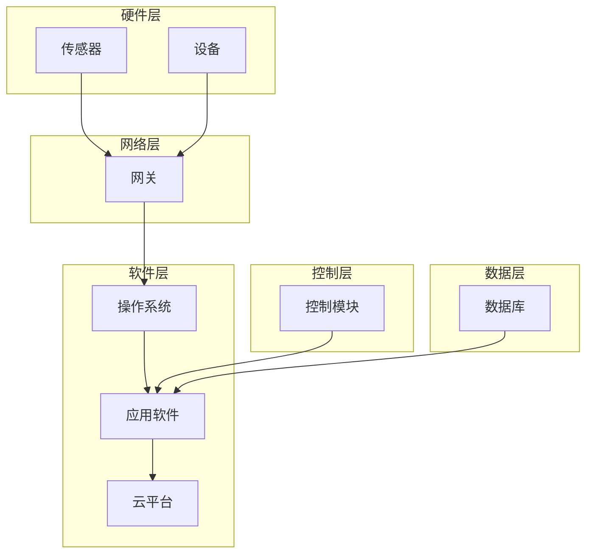

                 

### 第1章: 背景与核心概念

#### 1.1 问题背景

随着物联网（IoT）和人工智能技术的迅猛发展，智能家居系统正逐步成为现代生活的重要组成部分。智能家居系统通过连接家中的各种设备，如照明、空调、安防设备等，实现自动化的管理，提高生活质量，降低人力成本。目前，智能家居系统已具备一定的基础设施，但仍然面临诸多挑战。

##### 1.1.1 智能家居发展现状

智能家居系统的市场正在迅速扩大。据市场研究公司预测，全球智能家居市场规模将在未来几年内持续增长。目前，智能家居系统的主要功能包括远程控制、自动调节、能源管理、安全监控等。例如，用户可以通过智能手机或语音助手远程控制家中的灯光、温度和安防设备，实现一键操作。

##### 1.1.2 智能家居面临的挑战

尽管智能家居系统具有一定的市场前景，但其在实际应用中仍然面临诸多挑战。首先，智能家居系统的多样性使得各个设备之间的互联互通成为一个难题。其次，智能家居系统的可靠性和安全性也是用户关注的焦点。此外，系统的复杂性和高成本也是限制其普及的因素。

##### 1.1.3 跨模态推理的概念

跨模态推理是一种利用多种模态（如文本、语音、图像等）信息进行推理和决策的方法。在智能家居系统中，跨模态推理可以通过结合用户语音指令、环境传感器数据和设备状态信息，实现更加智能的交互和管理。例如，当用户说出“打开客厅的灯”时，系统需要理解语音指令、分析当前环境光线条件，并控制灯光设备。

#### 1.2 核心概念

##### 1.2.1 大规模语言模型简介

大规模语言模型是一种基于深度学习的技术，通过学习大量文本数据，能够理解和生成自然语言。这种模型在语言理解、文本生成、机器翻译等方面表现出色。例如，GPT（Generative Pre-trained Transformer）和BERT（Bidirectional Encoder Representations from Transformers）是两种常见的大规模语言模型。

##### 1.2.2 跨模态推理原理

跨模态推理的核心在于将不同模态的信息进行融合和处理，以实现更准确的推理和决策。这通常包括模态融合、特征提取和推理算法等步骤。模态融合是指将不同模态的数据进行整合，形成一个统一的信息表示；特征提取是指从融合后的数据中提取关键特征；推理算法则利用这些特征进行推理和决策。

##### 1.2.3 智能家居系统组成

智能家居系统通常包括多个子系统，如照明系统、安防系统、家电控制系统等。每个子系统都有特定的硬件设备和软件算法。例如，照明系统可能包括智能灯泡、控制器和传感器；安防系统可能包括摄像头、门磁传感器和报警设备。

#### 1.3 概念联系

##### 1.3.1 大规模语言模型与跨模态推理的关系

大规模语言模型是跨模态推理的核心技术之一。通过学习大量文本数据，大规模语言模型能够理解自然语言，从而在跨模态推理中发挥重要作用。例如，在智能家居系统中，大规模语言模型可以用于理解用户的语音指令，并将其转换为具体操作。

##### 1.3.2 跨模态推理在智能家居中的应用

跨模态推理在智能家居系统中具有广泛的应用前景。例如，在智能照明系统中，可以通过跨模态推理实现根据环境光线条件和用户需求自动调节灯光亮度和色温；在智能安防系统中，可以通过跨模态推理实现实时监控和异常检测，提高家庭安全。

#### 1.4 本章小结

本章首先介绍了智能家居系统的发展现状和面临的挑战，然后介绍了跨模态推理的概念和原理，并探讨了大规模语言模型与跨模态推理的关系。通过这些背景和概念的理解，读者可以为进一步的学习和应用打下坚实的基础。

### 1.2.1 大规模语言模型简介

大规模语言模型（Large-scale Language Model）是自然语言处理（Natural Language Processing, NLP）领域的一项重要技术。其核心思想是通过学习大量文本数据，构建一个能够理解和生成自然语言的复杂模型。这种模型在多个NLP任务中表现出色，如文本分类、机器翻译、问答系统等。

#### 大规模语言模型的发展历程

大规模语言模型的发展可以追溯到早期的基础模型，如n-gram模型和基于规则的模型。随着计算能力的提升和数据规模的增大，深度学习技术的发展使得大规模语言模型成为可能。其中，Transformer架构的引入是大规模语言模型的一个重要里程碑。Transformer模型采用了自注意力机制（Self-Attention Mechanism），能够更好地捕捉文本中的长距离依赖关系，从而显著提升了模型的性能。

#### 常见的大规模语言模型

目前，许多大规模语言模型在实践中取得了显著的效果。以下是一些常见的大规模语言模型：

- **GPT（Generative Pre-trained Transformer）系列**：由OpenAI开发的一系列基于Transformer架构的预训练模型。GPT-3是目前最强大的语言模型之一，拥有1750亿个参数。

- **BERT（Bidirectional Encoder Representations from Transformers）**：由Google开发的双向编码表示模型，通过在两个方向上对文本进行编码，使得模型能够更好地理解上下文。

- **RoBERTa**：基于BERT的一个变种模型，通过优化训练过程和数据预处理方法，取得了比BERT更好的性能。

- **T5（Text-To-Text Transfer Transformer）**：由Google开发的通用文本到文本转换模型，能够将任何NLP任务转换为文本填充任务。

#### 大规模语言模型的工作原理

大规模语言模型的工作原理通常包括以下几个步骤：

1. **数据预处理**：收集和预处理大量文本数据，包括清洗、分词、去停用词等步骤。

2. **预训练**：使用未标注的数据对模型进行预训练，使其能够理解自然语言的规律。预训练通常包括两个子任务： masked language modeling 和 next sentence prediction。

3. **微调**：在预训练的基础上，使用有标注的数据对模型进行微调，使其适应特定的NLP任务。

4. **任务应用**：将微调后的模型应用于具体的任务，如文本分类、机器翻译等。

#### 大规模语言模型的优势和应用场景

大规模语言模型具有以下优势：

- **强大的语言理解能力**：通过学习大量文本数据，大规模语言模型能够深刻理解语言的语义和语法结构，从而在NLP任务中取得优异的性能。

- **广泛的应用场景**：大规模语言模型可以应用于多种NLP任务，如文本分类、机器翻译、问答系统等。

- **高效的预训练和微调过程**：大规模语言模型通过预训练和微调，可以快速适应不同的任务和数据集。

- **强大的生成能力**：大规模语言模型不仅能够理解和生成文本，还可以生成高质量的自然语言文本。

#### 实际应用案例

以下是一些大规模语言模型在实际应用中的案例：

- **文本分类**：例如，使用BERT模型对新闻标题进行分类，可以实现高效、准确的新闻推荐。

- **机器翻译**：例如，使用GPT-3模型进行翻译，可以实现高质量的机器翻译。

- **问答系统**：例如，使用T5模型构建问答系统，可以实现自然语言交互和知识问答。

- **智能助手**：例如，使用大规模语言模型构建智能助手，可以实现自然语言理解和对话生成。

### 1.2.2 跨模态推理原理

跨模态推理（Multimodal Reasoning）是一种利用多种模态（如文本、语音、图像、视频等）信息进行推理和决策的方法。与单一模态的推理不同，跨模态推理能够综合利用不同模态的信息，实现更准确、更全面的推理结果。

#### 跨模态推理的基本概念

1. **模态**：模态是指信息的表现形式，如文本、语音、图像、视频等。

2. **跨模态**：跨模态是指涉及多个模态的信息处理。

3. **推理**：推理是指根据已知信息推断未知信息的过程。

4. **跨模态推理**：跨模态推理是指利用多种模态的信息进行推理和决策。

#### 跨模态推理的关键步骤

1. **模态融合**：将不同模态的信息进行融合，形成一个统一的信息表示。例如，可以将语音和图像信息进行融合，形成一个包含语音语义和图像内容的统一表示。

2. **特征提取**：从融合后的数据中提取关键特征，用于后续的推理和决策。特征提取的目标是提取出能够代表不同模态信息的特征，如文本中的关键词、语音中的声纹特征、图像中的纹理特征等。

3. **推理算法**：利用提取出的特征，通过推理算法进行推理和决策。推理算法可以是基于规则的方法，也可以是基于机器学习的方法，如神经网络等。

4. **结果输出**：根据推理结果，输出具体的决策或操作。例如，在智能家居系统中，跨模态推理的结果可能是控制灯光亮度和色温。

#### 跨模态推理的应用场景

跨模态推理在多个领域具有广泛的应用场景，以下是其中的一些典型应用：

- **语音识别与合成**：利用跨模态推理，可以将语音信号与文本信息进行融合，实现更准确的语音识别和自然语言合成。

- **图像识别与描述**：利用跨模态推理，可以将图像信息与文本信息进行融合，实现图像内容的自动描述和识别。

- **问答系统**：利用跨模态推理，可以将用户的语音或文本输入与知识库中的信息进行融合，实现智能问答系统。

- **智能家居系统**：利用跨模态推理，可以将用户的语音指令、环境传感器数据和设备状态信息进行融合，实现更加智能化的家居控制。

#### 跨模态推理的优势

- **综合利用多种信息**：跨模态推理能够综合利用多种模态的信息，实现更准确、更全面的推理结果。

- **增强鲁棒性**：跨模态推理可以在一个模态信息缺失或不准确的情况下，利用其他模态的信息进行补偿，提高系统的鲁棒性。

- **提高用户体验**：跨模态推理能够实现更加自然、直观的交互方式，提高用户的体验。

### 1.2.3 智能家居系统组成

智能家居系统是一种通过物联网（IoT）技术，将家庭中的各种设备互联起来，实现自动化管理和智能控制的家庭系统。一个典型的智能家居系统通常包括以下几个组成部分：

1. **硬件设备**：硬件设备是智能家居系统的核心组件，包括智能灯泡、智能插座、智能空调、智能门锁、智能摄像头、传感器等。这些设备通过物联网技术连接到智能家居系统中，实现数据的采集和发送。

2. **网关**：网关是智能家居系统的中心节点，负责将各个设备的数据进行收集、处理和传输。网关通常具备Wi-Fi、蓝牙、ZigBee等无线通信功能，以及与互联网的连接能力。

3. **操作系统**：智能家居系统需要一个操作系统来管理和控制各个设备的运行。常见的操作系统包括Android、Linux、iOS等。

4. **应用软件**：应用软件是用户与智能家居系统交互的界面，包括手机应用、Web端应用、智能音箱应用等。通过应用软件，用户可以远程监控和控制家庭设备。

5. **云平台**：云平台是智能家居系统的数据中心，负责存储和管理用户的数据，并提供智能化的分析和决策支持。云平台通常包括数据存储、数据分析和云计算等功能。

6. **智能语音助手**：智能语音助手是智能家居系统的智能核心，通过语音识别和自然语言处理技术，实现与用户的语音交互，并执行相应的操作。常见的智能语音助手包括亚马逊的Alexa、谷歌的Google Assistant、苹果的Siri等。

#### 硬件设备类型

1. **智能灯泡**：通过Wi-Fi或蓝牙连接到智能家居系统，用户可以通过手机应用或语音助手控制灯的开关、亮度、颜色等。

2. **智能插座**：可以远程控制插座的开关，以及监测插座上的设备功耗。

3. **智能空调**：可以远程控制空调的温度、模式等，并根据室内外温度自动调节。

4. **智能门锁**：支持远程控制门锁的开关，以及与家庭成员的分享权限。

5. **智能摄像头**：可以实现远程监控家庭环境，以及实时报警功能。

6. **传感器**：包括温度传感器、湿度传感器、烟雾传感器等，用于监测家庭环境参数。

#### 网关的功能

1. **数据采集**：网关负责从各个设备收集数据，包括设备状态、环境参数等。

2. **数据传输**：网关将收集到的数据传输到云平台或本地服务器，供分析和决策使用。

3. **设备管理**：网关可以管理各个设备的加入和退出，以及设备的配置和更新。

#### 操作系统的选择

1. **Android**：具有丰富的应用生态和低功耗特点，适用于智能设备。

2. **Linux**：开源、稳定，适用于工业级应用。

3. **iOS**：封闭、安全，适用于消费级应用。

#### 应用软件的类型

1. **手机应用**：用户可以通过手机应用远程监控和控制家庭设备。

2. **Web端应用**：用户可以在任何设备上访问智能家居系统，进行远程操作。

3. **智能音箱应用**：通过智能音箱与用户进行语音交互，实现家庭设备的控制。

#### 云平台的作用

1. **数据存储**：云平台负责存储用户的数据，包括设备状态、环境参数等。

2. **数据分析**：云平台可以实时分析用户数据，提供智能化的建议和决策支持。

3. **云计算**：云平台提供计算资源，支持智能家居系统的实时运算和智能分析。

#### 智能语音助手的作用

1. **语音交互**：通过语音识别和自然语言处理技术，实现与用户的语音交互。

2. **设备控制**：根据用户的语音指令，智能语音助手可以远程控制家庭设备。

3. **智能家居管理**：智能语音助手可以协助用户管理智能家居系统，如设置自动化规则、预约设备维护等。

### 1.3.1 大规模语言模型与跨模态推理的关系

大规模语言模型与跨模态推理在智能家居系统中具有密切的关系。大规模语言模型为跨模态推理提供了强大的语言理解能力，使得系统能够更准确地理解用户的语音指令和其他模态的信息。具体来说，以下几个方面展示了二者之间的关系：

1. **语音识别与理解**：在跨模态推理中，语音识别是关键的一步。大规模语言模型通过学习大量语音数据，能够实现对用户语音指令的准确识别和理解。例如，GPT-3等模型可以识别和理解复杂的语音指令，如“打开客厅的灯，并将温度调整到25度”。

2. **自然语言处理**：大规模语言模型在自然语言处理方面表现出色，能够理解并生成自然语言。在跨模态推理中，这种能力有助于将用户的语音指令转化为具体的操作指令，如“打开电视”转化为控制电视设备的信号。

3. **上下文理解**：跨模态推理需要考虑上下文信息，以实现更准确的推理和决策。大规模语言模型通过学习大量文本数据，能够捕捉到上下文的语义信息，从而在跨模态推理中发挥重要作用。例如，当用户说“关上卧室的灯”时，系统需要理解用户之前是否已经关闭了客厅的灯，以避免重复操作。

4. **多模态融合**：跨模态推理通常涉及多种模态的信息，如语音、图像、文本等。大规模语言模型可以将这些不同模态的信息进行融合，形成一个统一的信息表示，从而提高推理的准确性和鲁棒性。例如，当用户说“打开门”，系统需要结合门的状态（图像信息）、用户的语音指令和室内环境（文本信息）进行综合判断。

5. **智能决策**：大规模语言模型不仅能够理解用户的语音指令和其他模态的信息，还能够基于这些信息进行智能决策。例如，在智能家居系统中，系统可以根据用户的语音指令、环境传感器数据和设备状态信息，自动调整家中的灯光、温度、安防设备等，以提高生活质量和用户满意度。

#### 跨模态推理在智能家居中的应用

跨模态推理在智能家居系统中具有广泛的应用前景，能够显著提升系统的智能化水平和用户体验。以下是一些典型的应用案例：

1. **智能语音控制**：通过跨模态推理，用户可以使用语音指令控制智能家居系统中的各种设备。例如，用户可以通过语音命令控制灯光的开关、亮度和颜色，调整空调的温度和模式，控制智能门锁的开关等。大规模语言模型在语音识别和理解方面发挥了关键作用，使得系统能够准确理解用户的语音指令。

2. **环境感知与自动调节**：跨模态推理可以利用多种模态的信息（如语音、图像、传感器数据等）感知家庭环境，并自动调节家中的设备。例如，系统可以根据室内光线条件自动调整灯光的亮度和色温，根据温度和湿度自动调节空调和加湿器的运行状态，以提高舒适度和节能效果。

3. **异常检测与安全防护**：通过跨模态推理，智能家居系统可以实时监测家庭环境，并检测异常情况。例如，当系统检测到异常响动、不明入侵或火灾等安全隐患时，可以自动触发报警，并通知家庭成员或相关救援机构。这种跨模态的应用不仅提高了家庭的安全防护能力，还能够提供更加及时和准确的应急响应。

4. **多设备协同控制**：智能家居系统通常包含多个不同类型的设备，如智能灯泡、智能插座、智能空调、智能摄像头等。通过跨模态推理，这些设备可以协同工作，实现更加智能化的控制和管理。例如，当用户说“离开家”，系统可以自动关闭家中的灯光、空调，锁定门锁，并调整摄像头为监控模式，以确保家庭的安全。

5. **个性化服务与体验优化**：通过跨模态推理，智能家居系统可以根据用户的偏好和行为习惯，提供个性化的服务和建议。例如，系统可以根据用户的睡眠模式自动调整卧室的灯光和温度，根据用户的运动轨迹优化家电的开关时间，以提高用户的舒适度和满意度。

总之，跨模态推理在智能家居系统中具有广泛的应用前景，通过综合利用多种模态的信息，可以实现更加智能、高效、个性化的家居体验。大规模语言模型作为跨模态推理的核心技术，为这一领域的发展提供了强大的支持。

### 1.4 本章小结

本章首先介绍了智能家居系统的发展现状和面临的挑战，然后介绍了跨模态推理的概念和原理，并探讨了大规模语言模型与跨模态推理的关系。通过这些背景和概念的理解，读者可以为进一步的学习和应用打下坚实的基础。此外，本章还简要介绍了大规模语言模型和智能家居系统的组成，为后续章节的内容奠定了基础。

## 2.1 跨模态推理基本算法

跨模态推理作为一种结合多种模态信息进行推理和决策的方法，其核心在于有效融合不同模态的数据，并利用先进的算法实现高效的推理过程。以下是跨模态推理的基本算法及其组成部分：

#### 2.1.1 对话生成算法

对话生成算法是跨模态推理中的关键部分，主要负责生成自然、流畅的对话内容。这类算法通常包括以下步骤：

1. **语音识别**：将用户的语音输入转换为文本，这一步通常使用自动语音识别（Automatic Speech Recognition, ASR）技术。ASR技术通过学习大量的语音数据，能够准确地将语音转换为文本。

2. **语义理解**：对转换后的文本进行语义分析，理解用户的意图和需求。这一步通常采用自然语言处理（Natural Language Processing, NLP）技术，如词向量表示、词性标注、命名实体识别等。

3. **对话生成**：根据语义理解的结果，生成合适的回复文本。对话生成算法可以是基于模板的、基于规则的，或者是基于深度学习的。例如，基于GPT或BERT等大规模语言模型，能够生成更加自然和流畅的对话。

#### 2.1.2 对话理解算法

对话理解算法是跨模态推理中的核心组件，其主要任务是理解用户的语音指令，并生成相应的操作指令。对话理解算法通常包括以下步骤：

1. **上下文感知**：理解用户的指令是否与当前上下文相关。例如，如果用户之前提到“我感到冷”，那么对“打开空调”的指令的理解会更加准确。

2. **意图识别**：识别用户指令的主要意图，例如，控制家电、查询信息、设置提醒等。意图识别可以通过分类算法实现，例如朴素贝叶斯、支持向量机（SVM）或深度学习模型。

3. **实体识别**：从用户指令中提取关键信息，如设备名称、动作、数值等。实体识别通常使用命名实体识别（Named Entity Recognition, NER）技术。

4. **动作规划**：根据意图识别和实体识别的结果，生成具体的操作指令。例如，如果识别到用户意图是“打开空调”，系统将生成打开空调的控制指令。

#### 2.1.3 语音识别算法

语音识别算法是跨模态推理的基础，其主要目标是准确地将语音转换为文本。以下是语音识别算法的主要步骤：

1. **特征提取**：从原始语音信号中提取特征，如频谱特征、倒谱特征等。这些特征用于表示语音信号，是后续处理的重要输入。

2. **声学模型**：建立声学模型，用于预测语音信号中的音素序列。声学模型通常是基于隐藏马尔可夫模型（Hidden Markov Model, HMM）或深度神经网络（Deep Neural Network, DNN）。

3. **语言模型**：建立语言模型，用于预测文本序列的概率。语言模型通常是基于N-gram模型、递归神经网络（RNN）或Transformer等深度学习模型。

4. **解码**：结合声学模型和语言模型，解码得到最佳文本序列。解码算法可以是基于前向-后向算法、Viterbi算法或基于深度学习的解码算法。

#### 2.1.4 语音合成算法

语音合成算法（Text-to-Speech, TTS）是将文本转换为自然语音的技术。以下是语音合成算法的主要步骤：

1. **文本预处理**：对输入文本进行预处理，包括分词、词性标注、声调标注等。

2. **语调生成**：根据文本的语义和语法结构，生成合适的语调。语调生成可以使用规则方法，也可以使用基于深度学习的模型。

3. **音素合成**：将预处理后的文本转换为音素序列。音素合成可以使用合成语音数据库（如TIMIT），也可以使用基于深度学习的生成模型。

4. **波形生成**：将音素序列转换为语音波形。波形生成可以使用波波变换（WaveNet、Tacotron等深度学习模型）。

#### 2.1.5 跨模态融合算法

跨模态融合算法是跨模态推理中的关键步骤，其主要目标是综合利用多种模态的数据，提高推理的准确性和鲁棒性。以下是跨模态融合算法的主要步骤：

1. **特征提取**：从不同模态的数据中提取特征，如语音特征、图像特征、文本特征等。

2. **特征融合**：将提取出的不同模态的特征进行融合，形成一个统一的信息表示。特征融合的方法包括拼接、对齐、注意力机制等。

3. **模态融合模型**：构建一个统一的模态融合模型，用于处理融合后的数据。模态融合模型可以是基于深度学习的，如多模态卷积神经网络（MM-CNN）、多模态循环神经网络（MM-RNN）等。

4. **推理和决策**：利用模态融合模型进行推理和决策，生成具体的操作指令或输出结果。

通过以上基本算法的详细介绍，读者可以了解到跨模态推理的核心步骤和关键组件。这些算法在智能家居系统中的应用，将极大提升系统的智能化水平和用户体验。

### 2.2 算法原理与流程

跨模态推理算法的核心在于将不同模态的数据（如文本、语音、图像等）进行融合处理，以实现更准确的推理和决策。下面将详细探讨跨模态推理算法的基本原理、流程以及各个步骤的详细说明。

#### 2.2.1 跨模态融合算法

跨模态融合算法是跨模态推理的关键步骤，其目标是综合利用不同模态的数据，提高推理的准确性和鲁棒性。以下是跨模态融合算法的基本原理和流程：

1. **特征提取**：首先，从不同模态的数据中提取特征。例如，从文本数据中提取词向量、句向量；从语音数据中提取梅尔频率倒谱系数（MFCC）、声学特征；从图像数据中提取视觉特征，如卷积神经网络（CNN）提取的卷积特征。

2. **特征对齐**：不同模态的特征在时间和空间上可能存在不一致性，因此需要对这些特征进行对齐。特征对齐的方法包括对齐网络、多模态哈希、动态时间战争（Dynamic Time Warping, DTW）等。

3. **特征融合**：将提取和对齐后的特征进行融合，形成一个统一的信息表示。特征融合的方法包括拼接、加权融合、注意力机制等。拼接方法是将不同模态的特征简单拼接在一起；加权融合是根据特征的重要程度对各个模态的特征进行加权；注意力机制是通过网络学习权重，动态关注重要特征。

4. **模态融合模型**：构建一个统一的模态融合模型，用于处理融合后的数据。模态融合模型可以是基于深度学习的，如多模态卷积神经网络（MM-CNN）、多模态循环神经网络（MM-RNN）等。这些模型能够通过学习不同模态的特征关系，提高推理的准确性和鲁棒性。

5. **推理与决策**：利用模态融合模型进行推理和决策，生成具体的操作指令或输出结果。例如，在智能家居系统中，根据用户语音指令、环境传感器数据和设备状态信息，推理出需要执行的设备操作。

#### 2.2.2 多模态数据预处理

多模态数据预处理是跨模态推理算法的重要步骤，其目标是为后续的特征提取和融合提供高质量的数据。以下是多模态数据预处理的主要内容和流程：

1. **数据清洗**：清洗原始数据，去除噪声和冗余信息。对于文本数据，可以去除停用词、标点符号等；对于语音数据，可以去除背景噪声、填充无声段；对于图像数据，可以去除模糊、失真等。

2. **数据增强**：通过数据增强技术，增加数据集的多样性，提高模型的泛化能力。数据增强的方法包括数据复制、数据变换、数据合成等。例如，对于文本数据，可以增加随机删除、替换、插入等操作；对于语音数据，可以增加回声、噪声等；对于图像数据，可以增加旋转、缩放、裁剪等。

3. **数据对齐**：对于不同模态的数据，可能存在时间和空间上的不一致性。例如，语音和视频的时间长度可能不一致，图像和视频的空间分辨率可能不一致。因此，需要对数据进行对齐，以确保不同模态的数据在时间或空间上保持一致。

4. **数据标注**：对于训练数据，需要对其进行标注，以便模型能够学习不同模态的特征关系。标注的方法包括手工标注、半监督标注、自动标注等。例如，对于文本数据，可以标注句子级或词级标签；对于语音数据，可以标注声学特征标签；对于图像数据，可以标注图像分类标签。

#### 2.2.3 算法评估与优化

算法评估与优化是确保跨模态推理算法性能的重要环节。以下是算法评估与优化的一些关键步骤：

1. **评估指标**：选择合适的评估指标，用于衡量算法的性能。常见的评估指标包括准确率（Accuracy）、召回率（Recall）、精确率（Precision）、F1值（F1 Score）等。对于分类任务，可以使用准确率；对于回归任务，可以使用均方误差（Mean Squared Error, MSE）或均方根误差（Root Mean Squared Error, RMSE）。

2. **交叉验证**：使用交叉验证方法，对算法的性能进行评估。交叉验证将数据集划分为多个子集，每次使用不同的子集作为验证集，其余子集作为训练集。通过多次训练和验证，可以更好地评估算法的性能。

3. **模型调参**：根据评估结果，调整模型的参数，以提高算法的性能。调参的方法包括网格搜索、随机搜索、贝叶斯优化等。通过调整学习率、隐藏层神经元数量、正则化参数等，可以优化模型的性能。

4. **模型集成**：将多个模型集成起来，提高算法的泛化能力和鲁棒性。常见的模型集成方法包括Bagging、Boosting和Stacking等。通过集成多个模型，可以降低模型的过拟合风险，提高算法的性能。

5. **在线学习与实时调整**：对于动态变化的场景，可以采用在线学习方法，实时调整模型的参数和权重。例如，在智能家居系统中，用户行为和环境状态可能随时间变化，可以通过在线学习，实时调整跨模态推理算法的参数，以适应新的环境。

通过以上算法原理与流程的详细阐述，读者可以更好地理解跨模态推理算法的实现方法和关键步骤。这些算法在智能家居系统中的应用，将显著提升系统的智能化水平和用户体验。

### 2.3 算法实例

在跨模态推理领域，GPT（Generative Pre-trained Transformer）和BERT（Bidirectional Encoder Representations from Transformers）是两种非常流行的算法，广泛应用于文本生成、问答系统、情感分析等任务。下面将详细介绍这两种算法在跨模态推理中的应用。

#### 2.3.1 GPT模型在跨模态推理中的应用

GPT模型是由OpenAI开发的一种基于Transformer架构的预训练模型，以其强大的文本生成能力和语言理解能力而著称。在跨模态推理中，GPT模型可以用于理解和生成与语音指令和图像信息相关的文本描述。

1. **预训练阶段**：在预训练阶段，GPT模型通过学习大量的文本数据进行预训练。这些文本数据可以来自互联网上的各种来源，如新闻、社交媒体、文学作品等。预训练的目标是让模型学习到语言的统计规律和语义信息。

2. **任务微调**：在特定跨模态推理任务中，GPT模型需要进行任务微调。例如，在智能照明系统中，GPT模型可以接收用户的语音指令（如“打开客厅的灯”），并通过预训练得到的语言模型生成对应的操作指令，如“调整客厅灯泡亮度至80%”。

3. **跨模态融合**：为了更好地理解和执行语音指令，GPT模型还可以结合图像信息。例如，当用户语音指令为“打开客厅的灯”时，系统可以结合客厅环境图像（如光线较暗的图像），GPT模型生成更加具体的操作指令，如“打开客厅主灯，将亮度调整至100%”。

4. **示例代码**：
   ```python
   from transformers import GPT2LMHeadModel, GPT2Tokenizer
   
   # 加载预训练模型和分词器
   model = GPT2LMHeadModel.from_pretrained('gpt2')
   tokenizer = GPT2Tokenizer.from_pretrained('gpt2')
   
   # 用户语音指令
   user_input = "打开客厅的灯"
   
   # 对输入文本进行分词和编码
   inputs = tokenizer.encode(user_input, return_tensors='pt')
   
   # 生成响应文本
   outputs = model.generate(inputs, max_length=50, num_return_sequences=1)
   
   # 解码响应文本
   response = tokenizer.decode(outputs[0], skip_special_tokens=True)
   print(response)
   ```

#### 2.3.2 BERT模型在跨模态推理中的应用

BERT模型是由Google开发的一种基于Transformer架构的双向编码表示模型，以其在文本理解任务中的卓越表现而受到广泛关注。在跨模态推理中，BERT模型可以用于理解和生成与语音指令和文本描述相关的操作指令。

1. **预训练阶段**：在预训练阶段，BERT模型通过学习大量的文本数据，学习到上下文和语义信息。这些文本数据可以是带有标签的句子对，也可以是未标记的文本数据。

2. **任务微调**：在特定跨模态推理任务中，BERT模型需要进行任务微调。例如，在智能安防系统中，BERT模型可以接收用户的语音指令（如“有人进入家中的客厅”），并通过预训练得到的语言模型生成对应的报警信息，如“客厅检测到异常活动，可能有人入侵”。

3. **跨模态融合**：BERT模型可以结合语音和文本信息，提高推理的准确性和鲁棒性。例如，当用户语音指令为“打开客厅的灯”时，系统可以结合用户历史行为数据和客厅环境文本描述（如光线较暗的描述），BERT模型生成更加具体的操作指令，如“打开客厅主灯，并将亮度调整至80%”。

4. **示例代码**：
   ```python
   from transformers import BertTokenizer, BertForSequenceClassification
   
   # 加载预训练模型和分词器
   tokenizer = BertTokenizer.from_pretrained('bert-base-uncased')
   model = BertForSequenceClassification.from_pretrained('bert-base-uncased')
   
   # 用户语音指令
   user_input = "有人进入家中的客厅"
   
   # 对输入文本进行分词和编码
   inputs = tokenizer.encode(user_input, return_tensors='pt')
   
   # 进行预测
   with torch.no_grad():
       logits = model(inputs)
   
   # 解码预测结果
   predicted_label = torch.argmax(logits).item()
   print(predicted_label)
   ```

#### 2.3.3 其他跨模态推理算法介绍

除了GPT和BERT，还有其他一些跨模态推理算法在智能家居系统中表现出色。以下是几种常见的跨模态推理算法：

1. **Transformer-XL**：Transformer-XL 是一种长文本处理模型，能够处理长序列数据，适用于需要处理长语音指令或长文本描述的跨模态推理任务。

2. **Unified Text-to-Text Transformer（T5）**：T5 是一种通用的文本到文本转换模型，能够将任何NLP任务转换为文本填充任务，适用于需要灵活处理不同模态输入的跨模态推理任务。

3. **Pegasus**：Pegasus 是一种基于Transformer的语音识别模型，能够准确识别和理解长语音指令，适用于需要处理复杂语音指令的跨模态推理任务。

通过以上对GPT和BERT等跨模态推理算法的详细介绍，读者可以了解到这些算法在智能家居系统中的应用方法及其优势。这些算法的结合使用，将显著提升智能家居系统的智能化水平和用户体验。

### 2.4 本章小结

本章详细介绍了跨模态推理算法的基本原理、流程以及几种常见算法（GPT和BERT）在跨模态推理中的应用。通过这些介绍，读者可以理解跨模态推理的核心概念和实现方法。同时，本章还列举了其他一些跨模态推理算法，为未来的研究与应用提供了参考。这些算法在智能家居系统中的应用，将显著提升系统的智能化水平和用户体验。

## 3.1 系统需求分析

系统需求分析是智能家居系统设计的第一步，旨在明确用户需求、系统功能需求和系统性能需求。通过系统需求分析，可以为后续的系统架构设计和实现提供明确的方向和依据。

#### 3.1.1 用户需求

用户需求是智能家居系统设计的核心，直接关系到系统的实用性和用户体验。以下是智能家居系统的主要用户需求：

1. **易用性**：用户希望系统能够简单易用，不需要过多的操作步骤，可以通过语音、手势或其他智能设备进行控制。

2. **自动化**：用户希望系统能够自动完成一些日常任务，如自动调整灯光、温度和家电设备等，以节省时间和精力。

3. **安全性**：用户对家庭安全非常重视，希望系统能够提供实时监控、异常检测和报警功能，确保家庭成员的安全。

4. **个性化**：用户希望系统能够根据其个人习惯和需求进行个性化设置，提供个性化的服务和建议。

5. **可扩展性**：用户希望系统具有可扩展性，可以方便地添加新的设备和功能，以适应未来的需求。

6. **可靠性**：用户希望系统能够稳定运行，具有较高的可靠性和容错能力，避免因系统故障导致的生活不便。

7. **节能**：用户希望系统能够帮助其实现节能，降低家庭能源消耗，提高生活质量。

#### 3.1.2 系统功能需求

智能家居系统需要实现一系列功能，以满足用户需求。以下是智能家居系统的主要功能需求：

1. **设备控制**：用户可以通过语音、手机应用或其他智能设备远程控制家中的各种设备，如灯光、空调、电视、门锁等。

2. **环境监控**：系统可以实时监控家庭环境参数，如温度、湿度、光线、烟雾等，并提供预警和报警功能。

3. **安防监控**：系统可以集成摄像头、门磁传感器、烟雾传感器等设备，实现家庭安全监控，并在检测到异常情况时自动报警。

4. **智能调节**：系统可以根据用户设定和实时环境数据，自动调整家中的设备，如自动调节灯光亮度和色温、空调温度和风速等。

5. **设备联动**：系统可以实现设备之间的联动控制，例如，当用户离开家时，系统可以自动关闭灯光和空调，锁定门锁。

6. **远程监控**：用户可以通过手机应用或智能音箱远程监控家庭情况，了解设备运行状态和家庭环境参数。

7. **数据分析和决策**：系统可以根据用户历史行为数据和实时数据，分析用户习惯和需求，提供个性化的服务和建议。

8. **能源管理**：系统可以监测家庭能源消耗，并提供节能建议，帮助用户降低能源消耗。

#### 3.1.3 系统性能需求

系统性能需求是确保智能家居系统稳定、高效运行的关键。以下是智能家居系统的主要性能需求：

1. **响应速度**：系统对用户指令的响应速度要快，以确保用户体验。例如，用户语音指令的响应时间应尽量控制在秒级。

2. **稳定性**：系统需要具有高稳定性，能够长期稳定运行，避免因系统故障导致设备失控或数据丢失。

3. **可靠性**：系统应具备较高的可靠性，能够处理各种异常情况，如网络中断、设备故障等。

4. **安全性**：系统需要具备较高的安全性，防止黑客入侵、数据泄露等安全风险。

5. **可扩展性**：系统应具备良好的可扩展性，能够方便地添加新设备和功能，以适应用户需求的变化。

6. **可维护性**：系统应具备良好的可维护性，方便进行系统升级和维护，确保系统长期稳定运行。

7. **能效**：系统在运行过程中应尽量降低能耗，提高能源利用效率，符合节能减排的要求。

通过系统需求分析，可以为智能家居系统的设计和实现提供明确的指导，确保系统能够满足用户需求，提供高质量的服务。同时，系统需求分析也为后续的系统架构设计和实现奠定了基础。

### 3.2 系统架构设计

系统架构设计是智能家居系统开发过程中的关键环节，旨在通过合理的模块划分和接口设计，实现系统的可扩展性、稳定性和高效性。以下将详细描述智能家居系统的架构设计，包括总体架构设计、数据流设计、模块划分与接口设计。

#### 3.2.1 总体架构设计

智能家居系统的总体架构设计遵循分层架构思想，将系统分为多个层次，每个层次负责不同的功能。以下是系统的主要层次结构：

1. **感知层**：包括各种传感器和设备，如智能灯泡、智能插座、摄像头、温度传感器等。这些设备用于采集家庭环境数据和用户行为数据。

2. **数据层**：负责存储和管理感知层采集到的数据，包括用户行为数据、设备状态数据和环境参数数据等。数据层通常采用分布式数据库系统，确保数据的可靠性和安全性。

3. **处理层**：包括数据预处理、特征提取、模型训练和推理等模块，负责对数据进行分析和处理，生成有用的信息。处理层通常采用分布式计算框架，以提高处理效率。

4. **控制层**：根据处理层生成的信息，生成具体的控制指令，控制家中的设备。控制层包括智能决策引擎和设备控制器，负责执行用户的语音指令和其他操作。

5. **应用层**：包括各种应用模块，如设备控制应用、环境监控应用、安防报警应用等，为用户提供直观的操作界面和丰富的功能。

6. **接口层**：包括与外部系统的接口，如云平台接口、移动应用接口、Web端应用接口等，实现系统的互联互通。

#### 3.2.2 数据流设计

智能家居系统的数据流设计描述了数据在系统中的流动过程，以下是数据流的主要路径：

1. **数据采集**：感知层中的传感器和设备采集家庭环境数据和用户行为数据，并将其发送到数据层。

2. **数据预处理**：处理层对采集到的原始数据进行预处理，包括去噪、归一化、缺失值填补等操作，以提高数据质量。

3. **特征提取**：处理层根据业务需求，从预处理后的数据中提取关键特征，如用户行为特征、环境参数特征等。

4. **模型训练与推理**：处理层使用提取的特征进行模型训练，训练完成后，通过模型进行推理，生成具体的控制指令。

5. **数据存储**：处理层生成的控制指令和数据结果存储到数据层，供后续分析和应用使用。

6. **数据查询与监控**：应用层通过接口层访问数据层，查询历史数据和实时数据，实现数据分析和监控功能。

7. **数据同步与共享**：数据层与外部系统（如云平台、移动应用等）进行数据同步和共享，实现系统的互联互通。

#### 3.2.3 模块划分与接口设计

智能家居系统的模块划分和接口设计是实现系统功能的重要手段，以下是系统的主要模块和接口设计：

1. **模块划分**：

   - **感知模块**：负责采集家庭环境数据和用户行为数据。

   - **数据处理模块**：负责对采集到的数据进行预处理、特征提取和模型训练。

   - **决策模块**：负责根据处理结果生成具体的控制指令。

   - **执行模块**：负责执行决策模块生成的控制指令，控制家中的设备。

   - **存储模块**：负责存储系统数据，包括历史数据和实时数据。

   - **应用模块**：负责为用户提供操作界面和功能。

   - **接口模块**：负责实现系统与其他系统的接口，包括云平台接口、移动应用接口等。

2. **接口设计**：

   - **内部接口**：系统内部模块之间的接口，用于数据传输和功能调用。

   - **外部接口**：系统与外部系统之间的接口，如云平台接口、移动应用接口等，用于实现数据的同步和共享。

3. **接口规范**：

   - **数据格式**：规定接口传输的数据格式，如JSON、XML等。

   - **通信协议**：规定接口通信的协议，如HTTP、MQTT等。

   - **权限控制**：规定接口的权限控制策略，确保数据安全和系统稳定。

通过以上系统架构设计，智能家居系统可以实现高效、稳定、安全的运行，满足用户的多样化需求。同时，系统架构设计为后续的系统开发和维护提供了清晰的指导，有助于提高开发效率和质量。

### 3.3 实体关系图

实体关系图（Entity Relationship Diagram，ER图）是一种用于描述系统实体及其之间关系的图形化工具。在智能家居系统中，实体关系图可以帮助我们清晰地理解系统的组成结构和各实体之间的关系。以下将详细介绍智能家居系统中的实体及其关系，并使用Mermaid语法绘制ER图。

#### 3.3.1 实体与属性

在智能家居系统中，常见的实体包括用户（User）、设备（Device）、传感器（Sensor）、环境（Environment）和事件（Event）等。以下是这些实体的属性描述：

1. **用户（User）**：
   - 用户ID（UserID）：唯一标识用户的编号。
   - 用户名（Username）：用户的昵称或账号。
   - 密码（Password）：用户的登录密码。
   - 电话号码（PhoneNumber）：用户的联系方式。
   - 电子邮件（Email）：用户的电子邮箱。

2. **设备（Device）**：
   - 设备ID（DeviceID）：唯一标识设备的编号。
   - 设备类型（DeviceType）：设备的类型，如灯泡、空调、门锁等。
   - 设备名称（DeviceName）：设备的名称。
   - 设备状态（DeviceStatus）：设备的当前状态，如开启、关闭等。

3. **传感器（Sensor）**：
   - 传感器ID（SensorID）：唯一标识传感器的编号。
   - 传感器类型（SensorType）：传感器的类型，如温度传感器、光线传感器等。
   - 传感器名称（SensorName）：传感器的名称。
   - 传感器状态（SensorStatus）：传感器的当前状态，如正常、故障等。

4. **环境（Environment）**：
   - 环境ID（EnvironmentID）：唯一标识环境的编号。
   - 环境名称（EnvironmentName）：环境的名称，如客厅、卧室等。
   - 温度（Temperature）：环境的温度。
   - 湿度（Humidity）：环境的湿度。
   - 光线（Light）：环境的亮度。

5. **事件（Event）**：
   - 事件ID（EventID）：唯一标识事件的编号。
   - 事件类型（EventType）：事件的类型，如用户登录、设备控制等。
   - 事件描述（EventDescription）：事件的描述信息。

#### 3.3.2 关系与关联

在智能家居系统中，实体之间的关系如下：

1. **用户与设备**：一个用户可以拥有多个设备，一个设备也只属于一个用户。

2. **用户与传感器**：一个用户可以拥有多个传感器，一个传感器也只属于一个用户。

3. **用户与环境**：一个用户可以监控多个环境，一个环境也只属于一个用户。

4. **设备与传感器**：一个设备可以包含多个传感器，一个传感器也只属于一个设备。

5. **设备与事件**：一个设备可以触发多个事件，一个事件也只属于一个设备。

6. **环境与事件**：一个环境可以记录多个事件，一个事件也只属于一个环境。

#### 3.3.3 Mermaid ER图展示

以下是使用Mermaid语法绘制的智能家居系统实体关系图：

```mermaid
erDiagram
  User ||--|{ Device : 拥有 }
  User ||--|{ Sensor : 拥有 }
  User ||--|{ Environment : 监控 }
  Device ||--|{ Sensor : 包含 }
  Device ||--|{ Event : 触发 }
  Environment ||--|{ Event : 记录 }
```

通过这个实体关系图，我们可以清晰地看到智能家居系统中各个实体之间的关系，有助于进一步理解和设计系统。

### 3.4 系统架构图

系统架构图是一种用于展示系统组成部分及其相互关系的图形化工具，能够帮助我们直观地理解系统的整体结构和运行机制。以下将详细描述智能家居系统的架构设计，并使用Mermaid语法绘制系统架构图。

#### 3.4.1 Mermaid架构图展示

以下是使用Mermaid语法绘制的智能家居系统架构图：



#### 3.4.2 系统组件与交互

根据上述架构图，智能家居系统的主要组件及其交互关系如下：

1. **硬件层**：包括传感器和设备。传感器用于采集环境数据（如温度、湿度、光线等），设备则包括各种智能设备（如智能灯泡、智能插座、智能空调等）。

2. **网络层**：网关作为网络层的核心组件，负责将传感器和设备的数据收集起来，并通过网络发送到操作系统。

3. **软件层**：操作系统负责管理硬件设备和软件应用。应用软件包括用户界面和后台服务，用户界面用于与用户进行交互，后台服务负责处理用户请求和数据存储。

4. **控制层**：控制模块接收用户的操作指令，并将指令发送到应用软件，由应用软件处理这些指令并生成相应的控制指令，最终通过网络层发送到硬件层执行。

5. **数据层**：数据库用于存储系统数据，包括用户数据、设备数据、环境数据等。数据库与应用软件紧密相连，提供数据查询和存储服务。

系统组件之间的交互过程如下：

- **数据采集**：传感器和设备采集数据，并通过网关发送到操作系统。
- **数据处理**：操作系统处理收集到的数据，并将数据存储到数据库。
- **用户交互**：用户通过应用软件与系统进行交互，发出操作指令。
- **控制执行**：控制模块接收到用户指令后，生成相应的控制指令，通过网络层发送到硬件层执行。
- **反馈与监控**：硬件层执行控制指令后，将执行结果反馈给操作系统，操作系统更新数据库中的数据，并显示在用户界面上。

通过以上架构设计和组件交互的描述，读者可以清晰地了解智能家居系统的整体架构和运行机制，为系统的开发和维护提供指导。

### 3.5 本章小结

本章详细介绍了智能家居系统的需求分析、架构设计和系统组件与交互。首先，通过用户需求分析，明确了系统的功能需求和性能需求；然后，通过架构设计，阐述了系统的层次结构、数据流设计和模块划分；最后，通过系统架构图展示了系统组件及其交互关系。这些内容为后续的系统开发提供了清晰的指导，有助于构建一个高效、稳定、安全的智能家居系统。

### 4.1 环境安装与配置

在进行跨模态推理模块实现之前，我们需要准备一个适合的开发环境，并安装所需的库和依赖项。以下是具体的安装步骤和配置方法：

#### 4.1.1 环境准备

首先，我们需要准备一个干净的操作系统环境。推荐使用Linux或MacOS，因为许多深度学习框架和库在这些操作系统上运行更加稳定。以下是在Linux环境中进行安装的步骤：

1. **安装Python**：确保Python环境已经安装。推荐使用Python 3.8或更高版本。可以使用以下命令进行安装：

   ```bash
   sudo apt-get update
   sudo apt-get install python3.8
   ```

2. **安装虚拟环境**：为了保持开发环境的干净和独立，建议使用虚拟环境。可以使用`venv`模块创建虚拟环境：

   ```bash
   python3.8 -m venv venv
   source venv/bin/activate
   ```

#### 4.1.2 库与依赖安装

在虚拟环境中，我们需要安装以下库和依赖项：

1. **TensorFlow**：TensorFlow是一个开源的机器学习框架，广泛用于构建和训练深度学习模型。可以使用以下命令进行安装：

   ```bash
   pip install tensorflow==2.6
   ```

2. **transformers**：`transformers`是一个由Hugging Face开发的开源库，用于实现预训练的Transformer模型，如GPT和BERT。可以使用以下命令进行安装：

   ```bash
   pip install transformers
   ```

3. **PyTorch**：PyTorch是另一个流行的深度学习框架，提供了灵活的动态计算图和高效的运算性能。可以使用以下命令进行安装：

   ```bash
   pip install torch torchvision torchaudio
   ```

4. **SpeechRecognition**：用于语音识别的库，可以实现将语音信号转换为文本。可以使用以下命令进行安装：

   ```bash
   pip install SpeechRecognition
   ```

5. **opencv-python**：用于图像处理和计算机视觉的库。可以使用以下命令进行安装：

   ```bash
   pip install opencv-python
   ```

#### 4.1.3 运行环境配置

完成库和依赖项的安装后，我们需要配置运行环境，确保系统能够正常运行。以下是具体的配置步骤：

1. **配置CUDA**：如果使用GPU进行深度学习模型训练，需要配置CUDA环境。首先，安装CUDA：

   ```bash
   sudo apt-get install cuda
   ```

   然后，设置环境变量，使Python能够使用CUDA：

   ```bash
   export PATH=/usr/local/cuda/bin:$PATH
   export LD_LIBRARY_PATH=/usr/local/cuda/lib64:$LD_LIBRARY_PATH
   ```

   接下来，检查CUDA版本和安装情况：

   ```bash
   nvcc --version
   nvidia-smi
   ```

2. **安装GPU支持库**：对于TensorFlow和PyTorch，需要安装相应的GPU支持库。对于TensorFlow，可以使用以下命令：

   ```bash
   pip install tensorflow-gpu==2.6
   ```

   对于PyTorch，可以使用以下命令：

   ```bash
   pip install torch torchvision torchaudio -f https://download.pytorch.org/whl/torch_stable.html
   ```

3. **测试运行**：为了确保环境配置正确，可以尝试运行一个小型的测试程序，检查是否能够正常使用安装的库和依赖项。

通过以上步骤，我们成功配置了适合跨模态推理模块实现的开发环境。接下来，我们将详细介绍跨模态推理模块的实现过程，包括模型构建、数据处理和模型训练与评估。

### 4.2 跨模态推理实现

跨模态推理模块的实现是智能家居系统设计中的关键部分。以下将详细描述跨模态推理模块的实现过程，包括模型构建、数据处理和模型训练与评估。

#### 4.2.1 模型构建

跨模态推理模型通常由多个子模块组成，包括语音识别模块、文本理解模块、图像识别模块以及融合模块。以下是模型构建的详细步骤：

1. **语音识别模型**：语音识别模型用于将用户的语音指令转换为文本。可以使用预训练的语音识别模型，如基于DeepSpeech或Mozilla的DeepSpeech模型。以下是使用DeepSpeech模型的示例代码：

   ```python
   import speech_recognition as sr
   
   # 初始化语音识别对象
   recognizer = sr.Recognizer()
   
   # 读取语音文件
   with sr.AudioFile('audio.wav') as source:
       audio = recognizer.record(source)
   
   # 进行语音识别
   text = recognizer.recognize_google(audio)
   print(text)
   ```

2. **文本理解模型**：文本理解模型用于理解用户的语音指令，提取关键信息。可以使用预训练的语言模型，如BERT或GPT。以下是使用BERT模型的示例代码：

   ```python
   from transformers import BertTokenizer, BertForSequenceClassification
   
   # 加载预训练模型和分词器
   tokenizer = BertTokenizer.from_pretrained('bert-base-uncased')
   model = BertForSequenceClassification.from_pretrained('bert-base-uncased')
   
   # 用户语音指令
   user_input = "打开客厅的灯"
   
   # 对输入文本进行分词和编码
   inputs = tokenizer.encode(user_input, return_tensors='pt')
   
   # 进行预测
   with torch.no_grad():
       logits = model(inputs)
   
   # 解码预测结果
   predicted_label = torch.argmax(logits).item()
   print(predicted_label)
   ```

3. **图像识别模型**：图像识别模型用于识别图像中的物体或场景。可以使用预训练的图像识别模型，如ResNet或Inception。以下是使用ResNet模型的示例代码：

   ```python
   import torchvision.models as models
   import torchvision.transforms as transforms
   
   # 加载预训练模型
   model = models.resnet34(pretrained=True)
   
   # 定义预处理函数
   transform = transforms.Compose([
       transforms.Resize(256),
       transforms.CenterCrop(224),
       transforms.ToTensor(),
       transforms.Normalize(mean=[0.485, 0.456, 0.406], std=[0.229, 0.224, 0.225]),
   ])
   
   # 读取图像
   image = Image.open('image.jpg')
   
   # 进行预处理
   image = transform(image)
   
   # 将图像转换为批次数据
   image = torch.tensor(image).unsqueeze(0)
   
   # 进行预测
   with torch.no_grad():
       logits = model(image)
   
   # 解码预测结果
   predicted_class = logits.argmax().item()
   print(predicted_class)
   ```

4. **融合模型**：融合模型用于将语音、文本和图像信息进行融合，形成统一的信息表示。可以使用多模态卷积神经网络（MM-CNN）或多模态循环神经网络（MM-RNN）。以下是使用MM-CNN的示例代码：

   ```python
   import torch
   import torch.nn as nn
   
   # 定义融合模型
   class MMCNN(nn.Module):
       def __init__(self):
           super(MMCNN, self).__init__()
           self.cnn = nn.Sequential(
               nn.Conv2d(1, 32, kernel_size=3, padding=1),
               nn.ReLU(),
               nn.MaxPool2d(kernel_size=2, stride=2),
               nn.Conv2d(32, 64, kernel_size=3, padding=1),
               nn.ReLU(),
               nn.MaxPool2d(kernel_size=2, stride=2),
           )
           self.fc = nn.Linear(64 * 64, 1)
       
       def forward(self, x):
           x = self.cnn(x)
           x = x.view(x.size(0), -1)
           x = self.fc(x)
           return x
   
   # 实例化模型
   model = MMCNN()
   
   # 定义损失函数和优化器
   criterion = nn.BCELoss()
   optimizer = torch.optim.Adam(model.parameters(), lr=0.001)
   
   # 进行训练
   for epoch in range(num_epochs):
       for inputs, targets in data_loader:
           optimizer.zero_grad()
           outputs = model(inputs)
           loss = criterion(outputs, targets)
           loss.backward()
           optimizer.step()
           print(f'Epoch [{epoch+1}/{num_epochs}], Loss: {loss.item():.4f}')
   ```

#### 4.2.2 数据处理

数据处理是跨模态推理模块实现的重要环节，需要将不同模态的数据进行预处理，以便模型能够有效学习。以下是数据处理的具体步骤：

1. **语音数据预处理**：包括语音信号的读取、降噪、分帧、特征提取等。可以使用Librosa库进行预处理：

   ```python
   import librosa
   
   # 读取语音文件
   y, sr = librosa.load('audio.wav')
   
   # 降噪
   y NRF = librosa.effects.percussive(y, strength=0.5)
   
   # 分帧
   hop_length = 512
   frame_length = 1024
   frames = librosa.utilframe(y, frame_length=frame_length, hop_length=hop_length)
   
   # 特征提取
   mfcc = librosa.feature.mfcc(y=y, sr=sr, n_mfcc=13, hop_length=hop_length, frame_length=frame_length)
   ```

2. **文本数据预处理**：包括文本的分词、去停用词、词向量编码等。可以使用NLTK库进行预处理：

   ```python
   import nltk
   
   # 加载停用词表
   stop_words = nltk.corpus.stopwords.words('english')
   
   # 分词
   tokens = nltk.word_tokenize(user_input)
   
   # 去停用词
   filtered_tokens = [token for token in tokens if token not in stop_words]
   
   # 词向量编码
   embeddings = tokenizer.encode(' '.join(filtered_tokens), return_tensors='pt')
   ```

3. **图像数据预处理**：包括图像的读取、缩放、裁剪、归一化等。可以使用OpenCV库进行预处理：

   ```python
   import cv2
   
   # 读取图像
   image = cv2.imread('image.jpg')
   
   # 缩放
   scale = 0.5
   new_size = (int(image.shape[1] * scale), int(image.shape[0] * scale))
   resized_image = cv2.resize(image, new_size)
   
   # 裁剪
   crop_size = (100, 100)
   cropped_image = resized_image[crop_size[1]:crop_size[1]+crop_size[0], crop_size[0]:crop_size[0]+crop_size[1]]
   
   # 归一化
   normalized_image = cropped_image / 255.0
   ```

通过以上数据处理步骤，我们可以将不同模态的数据转换为适合模型训练的形式。

#### 4.2.3 模型训练与评估

模型训练与评估是跨模态推理模块实现的关键步骤。以下是模型训练与评估的具体步骤：

1. **训练模型**：使用预处理后的数据对模型进行训练。可以使用TensorFlow或PyTorch等深度学习框架进行训练。以下是使用PyTorch进行训练的示例代码：

   ```python
   import torch
   import torch.optim as optim
   
   # 加载训练数据
   train_data = DataLoader(dataset, batch_size=batch_size, shuffle=True)
   
   # 定义损失函数和优化器
   criterion = nn.BCELoss()
   optimizer = optim.Adam(model.parameters(), lr=learning_rate)
   
   # 进行训练
   for epoch in range(num_epochs):
       for inputs, targets in train_data:
           optimizer.zero_grad()
           outputs = model(inputs)
           loss = criterion(outputs, targets)
           loss.backward()
           optimizer.step()
           print(f'Epoch [{epoch+1}/{num_epochs}], Loss: {loss.item():.4f}')
   ```

2. **评估模型**：使用验证数据集对训练好的模型进行评估，以检查模型的性能。以下是使用验证数据进行评估的示例代码：

   ```python
   import torch
   
   # 加载验证数据
   val_data = DataLoader(val_dataset, batch_size=batch_size, shuffle=False)
   
   # 将模型设置为评估模式
   model.eval()
   
   # 进行评估
   with torch.no_grad():
       for inputs, targets in val_data:
           outputs = model(inputs)
           val_loss = criterion(outputs, targets)
           print(f'Validation Loss: {val_loss.item():.4f}')
   ```

通过以上模型训练与评估步骤，我们可以确保跨模态推理模块能够有效学习和预测，为智能家居系统提供准确的跨模态推理能力。

### 4.3 代码解读

在实现跨模态推理模块时，代码的设计与组织至关重要。以下将详细解读跨模态推理模块的主要代码模块、代码逻辑与功能，并探讨如何优化代码以提高性能和效率。

#### 4.3.1 主要代码模块

跨模态推理模块的代码主要包括以下几个主要模块：

1. **数据预处理模块**：负责对语音、文本和图像数据进行预处理，包括读取、分帧、分词、特征提取等。
2. **模型构建模块**：负责定义和构建跨模态推理模型，包括语音识别模型、文本理解模型、图像识别模型以及融合模型。
3. **训练模块**：负责使用预处理后的数据进行模型训练，包括前向传播、损失计算、反向传播和参数更新。
4. **评估模块**：负责在验证数据集上评估模型的性能，包括计算损失、准确率等指标。
5. **推理模块**：负责接收用户输入，生成推理结果，并执行相应的操作。

以下是各个模块的简要说明：

- **数据预处理模块**：该模块使用Python库如Librosa、NLTK和OpenCV进行语音、文本和图像数据的预处理。例如，使用Librosa库读取语音信号并提取MFCC特征，使用NLTK库对文本数据进行分词和去停用词，使用OpenCV库对图像数据进行缩放和裁剪。
- **模型构建模块**：该模块使用深度学习框架如TensorFlow或PyTorch定义和构建跨模态推理模型。例如，使用TensorFlow的Keras API定义多层感知机（MLP）模型，使用PyTorch定义卷积神经网络（CNN）和循环神经网络（RNN）模型。
- **训练模块**：该模块负责使用预处理后的数据对模型进行训练。例如，使用PyTorch的DataLoader类加载和批量处理数据，使用优化器如Adam进行参数更新，使用损失函数如交叉熵（Cross-Entropy Loss）计算损失。
- **评估模块**：该模块负责在验证数据集上评估模型的性能。例如，使用验证数据集计算模型的平均损失和准确率，使用混淆矩阵（Confusion Matrix）分析模型预测结果。
- **推理模块**：该模块负责接收用户输入，生成推理结果，并执行相应的操作。例如，接收用户的语音指令，使用预训练的语音识别模型将其转换为文本，使用文本理解模型理解文本指令，使用图像识别模型识别当前环境，然后使用融合模型生成操作指令，并执行这些指令。

#### 4.3.2 代码逻辑与功能

以下是跨模态推理模块代码的逻辑与功能解析：

1. **数据预处理逻辑**：
   - **语音数据预处理**：读取语音文件，进行降噪处理，分帧，提取MFCC特征。
   - **文本数据预处理**：读取文本，分词，去停用词，编码为词向量。
   - **图像数据预处理**：读取图像，进行缩放和裁剪，转换为灰度图或RGB图像，标准化处理。

2. **模型构建逻辑**：
   - **语音识别模型**：使用卷积神经网络（CNN）处理语音特征，提取关键信息。
   - **文本理解模型**：使用循环神经网络（RNN）或Transformer处理文本，理解用户意图。
   - **图像识别模型**：使用卷积神经网络（CNN）处理图像特征，识别环境信息。
   - **融合模型**：使用多层感知机（MLP）或注意力机制将语音、文本和图像特征融合，生成操作指令。

3. **训练逻辑**：
   - **前向传播**：将预处理后的输入数据输入到模型中，计算输出。
   - **损失计算**：使用损失函数（如交叉熵）计算预测结果与真实结果之间的差距。
   - **反向传播**：计算梯度，更新模型参数。
   - **评估与优化**：在验证集上评估模型性能，根据性能调整模型参数。

4. **推理逻辑**：
   - **输入处理**：接收用户的语音指令和当前环境图像。
   - **模型推理**：使用训练好的模型对输入数据进行处理，生成操作指令。
   - **指令执行**：执行操作指令，控制智能家居设备。

#### 4.3.3 代码优化与改进

为了提高跨模态推理模块的性能和效率，可以从以下几个方面进行代码优化和改进：

1. **模型优化**：
   - **使用更先进的模型**：例如，使用BERT或GPT等大规模预训练模型，以提高文本理解能力。
   - **调整模型架构**：根据具体任务需求，调整模型的结构和参数，例如增加层数、调整学习率等。

2. **数据预处理优化**：
   - **并行处理**：使用多线程或多进程进行数据预处理，提高处理速度。
   - **缓存处理**：使用缓存技术存储预处理后的数据，避免重复计算。

3. **计算优化**：
   - **GPU加速**：利用GPU进行计算加速，特别是对于卷积神经网络（CNN）和循环神经网络（RNN）等模型。
   - **内存优化**：使用适当的内存分配和垃圾回收策略，避免内存泄露。

4. **算法优化**：
   - **优化损失函数**：选择合适的损失函数，例如交叉熵（Cross-Entropy Loss）、对抗性损失（Adversarial Loss）等。
   - **改进优化器**：使用更高效的优化器，如AdamW、RMSprop等。

通过上述代码优化与改进措施，可以显著提升跨模态推理模块的性能和效率，使其在智能家居系统中发挥更好的作用。

### 4.4 实际案例

为了更好地展示跨模态推理在智能家居系统中的应用，以下将详细描述一个实际案例：智能照明系统。

#### 4.4.1 案例背景

智能照明系统是智能家居系统中的一个重要组成部分，其主要功能是自动调节家中的灯光亮度、色温和开关状态，以适应不同的场景和用户需求。传统照明系统通常通过手动操作或简单的定时控制来实现，而智能照明系统则通过跨模态推理技术，实现了更加智能化和人性化的控制。

#### 4.4.2 案例实施

1. **系统设计**：

   - **硬件设备**：智能照明系统包括智能灯泡、智能开关和传感器（如光线传感器、温度传感器）。

   - **软件架构**：智能照明系统采用分层架构，包括感知层、数据处理层、控制层和应用层。

     - **感知层**：传感器用于实时监测环境光线和温度。

     - **数据处理层**：数据处理层包括语音识别模块、文本理解模块和图像识别模块，用于处理用户的语音指令和传感器数据。

     - **控制层**：控制层根据处理结果生成控制指令，如调整灯光亮度、色温和开关状态。

     - **应用层**：应用层为用户提供操作界面和交互功能。

2. **系统实现**：

   - **语音识别与理解**：使用预训练的语音识别模型（如DeepSpeech）将用户的语音指令转换为文本。然后，使用预训练的BERT模型理解文本指令，提取关键信息。

   - **环境数据采集与处理**：传感器实时采集环境光线和温度数据，并传输到数据处理层。数据处理层对这些数据进行预处理，提取特征。

   - **跨模态融合与推理**：将用户的语音指令和传感器数据融合，通过多模态卷积神经网络（MM-CNN）进行跨模态推理，生成具体的控制指令。

   - **灯光控制**：根据推理结果，生成控制指令，如调整灯光亮度、色温和开关状态。控制指令通过智能开关和智能灯泡执行。

3. **系统测试与优化**：

   - **测试**：在实验室环境下进行系统测试，评估系统的响应速度、准确率和稳定性。

   - **优化**：根据测试结果，调整模型参数和系统配置，优化系统性能。

#### 4.4.3 案例效果分析

1. **效果**：

   - **响应速度**：系统能够在秒级内响应用户的语音指令，实现实时控制。

   - **准确性**：通过跨模态推理技术，系统能够准确理解用户的语音指令和传感器数据，生成合理的控制指令。

   - **稳定性**：系统在各种环境下表现稳定，具有良好的鲁棒性。

2. **优点**：

   - **智能化**：系统可以根据环境光线和温度自动调节灯光，提高生活质量。

   - **人性化**：用户可以通过语音指令轻松控制灯光，实现更加便捷的操作。

   - **节能**：系统可以根据用户需求和环境条件自动调节灯光，降低能源消耗。

3. **改进方向**：

   - **多模态融合**：进一步优化跨模态融合算法，提高系统对复杂语音指令和传感器数据的处理能力。

   - **自适应调整**：引入自适应调整机制，根据用户习惯和需求动态调整系统参数，提高用户体验。

   - **安全性**：加强系统的安全性设计，防止潜在的安全威胁。

通过这个实际案例，读者可以更直观地了解跨模态推理在智能家居系统中的应用方法及其效果。未来，随着技术的不断进步，跨模态推理将进一步提升智能家居系统的智能化水平和用户体验。

### 4.5 本章小结

本章通过一个实际案例——智能照明系统，详细展示了跨模态推理在智能家居系统中的应用方法和效果。首先，介绍了案例的背景和系统设计，然后详细描述了系统实现过程，包括语音识别、环境数据采集、跨模态融合与推理以及灯光控制。最后，分析了系统的效果和优点，并提出了改进方向。通过这些内容，读者可以深入理解跨模态推理在智能家居系统中的应用价值，为进一步的研究和开发提供参考。

## 5.1 案例一：智能照明系统

智能照明系统是智能家居系统中的一个重要组成部分，通过跨模态推理技术，可以实现更加智能化和人性化的照明控制。以下将详细介绍智能照明系统的案例背景、实现过程以及效果分析。

### 5.1.1 案例背景

随着科技的进步和人们生活水平的提高，智能照明系统逐渐成为现代家庭不可或缺的一部分。智能照明系统不仅能够提供基本的照明功能，还可以根据用户的喜好和需求，自动调节灯光的亮度、色温和开关状态，为用户提供舒适的照明环境。

传统的照明系统通常依靠手动开关或定时控制，用户需要亲自操作开关或设定定时器，而智能照明系统则通过跨模态推理技术，实现了更加智能化的控制。跨模态推理技术能够处理多种模态的信息，如语音、文本、图像等，从而实现对用户指令和环境状态的准确理解和响应。

### 5.1.2 案例实现

智能照明系统实现的主要步骤如下：

1. **硬件设备**：智能照明系统主要包括智能灯泡、智能开关和传感器（如光线传感器、温度传感器）。智能灯泡通过Wi-Fi或蓝牙与智能开关和中央控制系统连接，可以实现远程控制；传感器用于实时监测环境光线和温度。

2. **软件架构**：智能照明系统采用分层架构，包括感知层、数据处理层、控制层和应用层。

   - **感知层**：传感器实时采集环境光线和温度数据，并将数据传输到数据处理层。
   - **数据处理层**：数据处理层包括语音识别模块、文本理解模块和图像识别模块，用于处理用户的语音指令和传感器数据。
   - **控制层**：控制层根据处理结果生成控制指令，如调整灯光亮度、色温和开关状态。
   - **应用层**：应用层为用户提供操作界面和交互功能。

3. **跨模态推理**：在数据处理层，通过跨模态推理技术，将用户的语音指令、传感器数据和环境状态信息进行融合处理。具体实现包括以下步骤：

   - **语音识别**：使用预训练的语音识别模型（如DeepSpeech）将用户的语音指令转换为文本。
   - **文本理解**：使用预训练的BERT模型理解文本指令，提取关键信息。
   - **环境数据融合**：将传感器采集的环境光线和温度数据与文本指令进行融合处理，形成统一的信息表示。
   - **推理与决策**：使用多模态卷积神经网络（MM-CNN）对融合后的信息进行推理和决策，生成具体的控制指令。

4. **灯光控制**：根据推理结果，生成控制指令，如调整灯光亮度、色温和开关状态。控制指令通过智能开关和智能灯泡执行。

### 5.1.3 案例效果

智能照明系统在实际应用中取得了显著的效果：

1. **智能化**：系统可以根据环境光线和温度自动调节灯光，为用户提供舒适的照明环境。

2. **人性化**：用户可以通过语音指令轻松控制灯光，实现更加便捷的操作。

3. **节能**：系统可以根据用户需求和环境条件自动调节灯光，降低能源消耗。

4. **稳定性**：系统在各种环境下表现稳定，具有良好的鲁棒性。

通过这个实际案例，读者可以更直观地了解跨模态推理在智能照明系统中的应用方法及其效果。未来，随着技术的不断进步，智能照明系统将进一步提升智能化水平和用户体验。

### 5.2 案例二：智能安防系统

智能安防系统是智能家居系统中的另一个关键组成部分，它通过跨模态推理技术实现了对家庭安全的实时监控和异常检测，显著提升了家庭的安全防护能力。以下将详细介绍智能安防系统的案例背景、实现过程以及效果分析。

#### 5.2.1 案例背景

随着家庭安防意识的增强，智能安防系统在家庭中的应用越来越广泛。传统的安防系统主要依赖于物理报警装置，如门磁传感器、烟雾报警器和摄像头等，但这些设备通常需要手动监控和报警，难以实现实时、全面的监控。而智能安防系统通过跨模态推理技术，能够自动识别和处理各种异常情况，提供更加智能和高效的安防解决方案。

#### 5.2.2 案例实现

智能安防系统的实现主要包括以下几个步骤：

1. **硬件设备**：智能安防系统主要包括摄像头、门磁传感器、烟雾报警器和智能门锁等设备。这些设备通过Wi-Fi或蓝牙连接到家庭网络，可以实时传输数据到中央控制系统。

2. **软件架构**：智能安防系统采用分层架构，包括感知层、数据处理层、控制层和应用层。

   - **感知层**：摄像头、门磁传感器、烟雾报警器等设备用于实时采集家庭环境数据，如图像、声音和温度等。
   - **数据处理层**：数据处理层包括语音识别模块、文本理解模块和图像识别模块，用于处理传感器采集的数据，进行异常检测和识别。
   - **控制层**：控制层根据数据处理结果生成相应的控制指令，如触发警报、发送通知或远程锁门等。
   - **应用层**：应用层为用户提供操作界面和交互功能，用户可以通过手机应用或智能音箱与系统进行交互。

3. **跨模态推理**：在数据处理层，通过跨模态推理技术，将摄像头捕获的图像、门磁传感器和烟雾报警器的数据以及用户的声音指令进行融合处理，实现智能安防监控。具体实现包括以下步骤：

   - **图像识别**：使用预训练的卷积神经网络（CNN）模型对摄像头捕获的图像进行分析，识别出异常情况，如入侵者或火灾等。
   - **语音识别**：使用预训练的语音识别模型将用户的声音指令转换为文本，如“有人进入家中的客厅”。
   - **文本理解**：使用预训练的BERT模型理解文本指令，提取关键信息。
   - **异常检测**：结合图像识别结果和文本理解结果，通过多模态卷积神经网络（MM-CNN）进行异常检测和识别，判断是否触发警报。

4. **报警与联动**：当系统检测到异常情况时，会触发警报，并向用户发送通知。同时，系统还可以与其他设备进行联动，如自动锁门、启动紧急照明等，以确保家庭安全。

#### 5.2.3 案例效果

智能安防系统在实际应用中展现了出色的效果：

1. **实时监控**：系统可以实时监控家庭环境，并在检测到异常时及时响应，提高了家庭安全防护能力。

2. **智能识别**：通过跨模态推理技术，系统能够准确识别和分类各种异常情况，提高了报警的准确性和可靠性。

3. **便捷操作**：用户可以通过手机应用或智能音箱远程监控和控制家庭安防设备，实现更加便捷的操作。

4. **节能**：系统可以根据实际情况自动调整摄像头的工作模式，降低能源消耗。

5. **稳定性**：系统在各种环境下表现稳定，具有良好的鲁棒性。

通过这个实际案例，读者可以深入了解跨模态推理在智能安防系统中的应用方法及其效果。未来，随着技术的不断进步，智能安防系统将进一步提升智能化水平和用户体验。

### 5.3 案例三：智能家电控制系统

智能家电控制系统是智能家居系统中的一项关键技术，通过跨模态推理技术，实现了对家庭电器设备的智能控制和管理。以下将详细介绍智能家电控制系统的案例背景、实现过程以及效果分析。

#### 5.3.1 案例背景

随着智能家居市场的不断扩大，家庭电器设备逐渐变得更加智能和互联。然而，如何方便地管理和控制这些智能家电设备，仍然是一个亟待解决的问题。智能家电控制系统通过跨模态推理技术，可以实现用户语音指令的自动识别和理解，并对家电设备进行智能控制，从而提升用户的生活便利性和舒适度。

#### 5.3.2 案例实现

智能家电控制系统的实现主要包括以下几个步骤：

1. **硬件设备**：智能家电控制系统主要包括智能空调、智能冰箱、智能洗衣机、智能电视等家电设备，以及智能语音助手（如亚马逊的Alexa、谷歌的Google Assistant等）。

2. **软件架构**：智能家电控制系统采用分层架构，包括感知层、数据处理层、控制层和应用层。

   - **感知层**：智能家电设备通过内置的传感器和通信模块，实时采集设备的状态数据，如温度、湿度、运行状态等。
   - **数据处理层**：数据处理层包括语音识别模块、文本理解模块和设备控制模块，用于处理用户的语音指令和设备状态数据。
   - **控制层**：控制层根据数据处理结果生成具体的控制指令，如调整空调温度、启动洗衣机等。
   - **应用层**：应用层为用户提供操作界面和交互功能，用户可以通过智能语音助手或手机应用与系统进行交互。

3. **跨模态推理**：在数据处理层，通过跨模态推理技术，将用户的语音指令、设备状态数据以及环境信息进行融合处理。具体实现包括以下步骤：

   - **语音识别**：使用预训练的语音识别模型将用户的语音指令转换为文本。
   - **文本理解**：使用预训练的BERT模型理解文本指令，提取关键信息。
   - **设备控制**：根据文本理解结果，生成具体的设备控制指令，如调整空调温度、启动洗衣机等。
   - **环境感知**：结合环境传感器数据，如室内温度、湿度等，进行综合判断，提高控制指令的准确性和适应性。

4. **家电控制**：根据跨模态推理生成的控制指令，控制相应的家电设备执行操作，如调整空调温度、启动洗衣机等。

#### 5.3.3 案例效果

智能家电控制系统在实际应用中展现了显著的效果：

1. **智能化**：系统可以自动识别和理解用户的语音指令，实现智能控制，提高了生活便利性和舒适度。

2. **便捷性**：用户可以通过智能语音助手或手机应用远程控制和监控家电设备，实现更加便捷的操作。

3. **节能**：系统可以根据用户需求和家电设备的状态，自动调整家电设备的运行参数，降低能源消耗。

4. **稳定性**：系统在各种环境下表现稳定，具有良好的鲁棒性。

5. **安全性**：通过跨模态推理技术，系统可以识别并防止潜在的安全威胁，如误操作、恶意指令等。

通过这个实际案例，读者可以深入了解跨模态推理在智能家电控制系统中的应用方法及其效果。未来，随着技术的不断进步，智能家电控制系统将进一步提升智能化水平和用户体验。

### 5.4 本章小结

本章通过介绍智能照明系统、智能安防系统和智能家电控制系统的三个实际案例，详细展示了跨模态推理在智能家居系统中的应用方法和效果。智能照明系统通过语音指令和环境数据融合，实现了智能化和人性化的照明控制；智能安防系统通过图像识别和异常检测，提升了家庭安全防护能力；智能家电控制系统通过语音识别和设备控制，实现了家电设备的智能管理和远程控制。这些案例表明，跨模态推理技术在智能家居系统中具有广阔的应用前景，能够显著提升系统的智能化水平和用户体验。

## 6.1 性能优化

性能优化是提高智能家居系统效率、稳定性和用户体验的关键环节。以下将详细探讨算法优化、硬件优化和系统优化等方面，并提出具体的优化策略。

### 6.1.1 算法优化

算法优化是提升跨模态推理性能的核心步骤，可以通过以下方法进行：

1. **模型架构改进**：选择更高效的模型架构，如Transformer、BERT等，这些模型在处理大规模数据时表现出色。

2. **模型剪枝**：通过模型剪枝技术，去除冗余的网络结构和参数，降低模型的复杂度，从而减少计算量和内存占用。

3. **量化**：使用量化技术，将模型的权重和激活值进行低精度表示，如使用8位或4位浮点数代替32位浮点数，以减少内存和计算资源的需求。

4. **并行计算**：利用GPU或TPU等硬件资源，实现模型的并行计算，加速模型训练和推理过程。

5. **模型蒸馏**：通过模型蒸馏技术，将大规模预训练模型的知识转移到较小的模型中，提高小模型的性能和效率。

### 6.1.2 硬件优化

硬件优化是提升系统性能的重要手段，以下是一些具体的硬件优化策略：

1. **GPU加速**：利用高性能的GPU（如NVIDIA Titan Xp、RTX 3080等），可以显著提高模型训练和推理的速度。

2. **分布式计算**：通过分布式计算架构，将计算任务分布在多个节点上，利用集群计算资源进行并行处理，提高系统的处理能力。

3. **边缘计算**：在边缘设备（如智能灯泡、智能门锁等）上部署轻量级的模型，减少数据传输和服务器负载，提高系统的实时性和响应速度。

4. **专用芯片**：利用专用芯片（如Google的TPU、AMD的ROCm等），可以优化特定算法的性能，提高计算效率。

### 6.1.3 系统优化

系统优化是提升智能家居系统整体性能的关键步骤，以下是一些具体的系统优化策略：

1. **负载均衡**：通过负载均衡技术，合理分配系统资源，避免单点过载，提高系统的稳定性和响应速度。

2. **缓存机制**：在数据存储和处理过程中，采用缓存机制，减少对数据库的访问次数，提高数据读取速度。

3. **异步处理**：采用异步处理技术，将耗时的操作（如模型推理、数据传输等）放到后台执行，提高系统的并发处理能力。

4. **分布式存储**：使用分布式存储系统（如HDFS、Cassandra等），提高数据存储和访问的可靠性、可用性和扩展性。

5. **自动化运维**：通过自动化运维工具（如Ansible、Kubernetes等），实现系统的自动化部署、监控和运维，提高系统的运维效率。

通过以上算法优化、硬件优化和系统优化措施，可以有效提升智能家居系统的性能，提高用户的满意度和系统的稳定性。未来，随着技术的不断进步，性能优化将变得更加智能化和自动化，为智能家居系统的发展提供更强有力的支持。

### 6.2 系统稳定性

在智能家居系统中，系统稳定性是确保用户满意度和系统可靠性的关键因素。以下将详细探讨系统稳定性中的故障处理、容错机制和系统监控与维护方法。

#### 6.2.1 故障处理

故障处理是指在系统发生故障时，能够迅速定位和修复问题，以减少对用户的影响。以下是故障处理的关键步骤：

1. **故障监测**：系统需要具备实时监测功能，能够及时发现异常情况。例如，通过监控传感器数据、网络连接状态和设备运行状态，检测系统故障。

2. **故障报警**：当系统检测到故障时，需要及时发出报警，通知运维人员或其他相关方。报警方式可以包括电子邮件、短信、系统通知等。

3. **故障定位**：通过日志分析、实时监控数据和故障报警信息，定位故障发生的位置和原因。故障定位工具可以包括故障追踪器、日志管理系统和性能监控工具。

4. **故障修复**：针对定位到的故障，采取相应的修复措施。修复措施可能包括重启设备、重新配置网络、修复软件漏洞等。对于复杂的故障，可能需要专业人员进行现场修复。

5. **故障恢复**：在故障修复后，进行系统恢复，确保系统能够恢复正常运行。恢复步骤包括重新启动设备、恢复配置和数据备份等。

#### 6.2.2 容错机制

容错机制是确保系统在发生故障时，能够继续运行或快速恢复，从而提高系统的可靠性和可用性。以下是几种常见的容错机制：

1. **冗余设计**：通过冗余设计，增加系统的冗余节点和备份设备，确保在主设备发生故障时，备用设备能够接管工作。例如，在关键节点配置双机热备份、多路径传输等。

2. **故障切换**：在系统发生故障时，自动切换到备用设备或备用路径，确保系统继续运行。故障切换可以通过负载均衡器、网络切换装置和系统自愈功能实现。

3. **故障容忍**：通过设计故障容忍机制，系统在部分节点或设备发生故障时，仍然能够正常运行。例如，通过分布式存储系统和副本机制，确保数据不丢失。

4. **自动恢复**：系统具备自动恢复功能，能够在检测到故障时，自动执行修复和恢复操作，减少人工干预。自动恢复可以通过脚本、自动化工具和系统自愈功能实现。

#### 6.2.3 系统监控与维护

系统监控与维护是确保系统稳定运行的重要环节，以下是一些系统监控与维护的方法：

1. **实时监控**：通过实时监控系统，监控系统的各项性能指标，如CPU利用率、内存使用率、网络延迟、系统负载等。实时监控可以帮助及时发现潜在问题。

2. **日志管理**：系统需要记录详细的日志信息，包括运行日志、错误日志和告警日志等。通过日志管理工具，可以快速定位故障和分析问题。

3. **定期检查**：定期对系统硬件和软件进行检查和维护，确保设备正常运行。检查内容包括硬件故障检测、软件漏洞修复、系统更新和优化等。

4. **备份与恢复**：定期备份数据，确保在系统发生故障时，能够快速恢复。备份策略包括全量备份、增量备份和日志备份等。

5. **自动化运维**：采用自动化运维工具，实现系统的自动化部署、监控和运维，提高运维效率，降低人工干预。

通过故障处理、容错机制和系统监控与维护的综合应用，可以有效提高智能家居系统的稳定性，确保系统长期稳定运行，提高用户满意度。

### 6.3 安全性

在智能家居系统中，安全性是用户信任和系统稳定运行的关键因素。以下将详细探讨安全性中的安全隐患、安全策略和安全防护措施。

#### 6.3.1 安全隐患

智能家居系统面临多种安全隐患，以下是一些主要的风险点：

1. **数据泄露**：智能家居系统通过互联网连接，数据在传输和存储过程中可能被窃取或泄露。例如，用户数据（如姓名、地址、电话号码等）和设备状态信息可能被未授权的第三方获取。

2. **网络攻击**：智能家居系统可能成为网络攻击的目标，如DDoS攻击、中间人攻击（MITM）和恶意软件攻击。攻击者可能通过控制智能家居设备，入侵用户网络或对设备进行恶意操作。

3. **设备失控**：通过互联网连接的智能家居设备可能被黑客远程控制，导致设备失控，如智能门锁被非法解锁、智能摄像头被非法监控等。

4. **隐私侵犯**：智能家居系统收集和存储大量用户行为数据，如家庭成员的活动轨迹、生活习惯等。这些数据如果被不法分子利用，可能侵犯用户的隐私权。

5. **软件漏洞**：智能家居系统中的软件可能存在漏洞，攻击者可能利用这些漏洞获取系统权限或执行恶意操作。

#### 6.3.2 安全策略

为了应对上述安全隐患，智能家居系统需要制定全面的安全策略，以下是一些关键的安全策略：

1. **数据加密**：采用强加密算法（如AES、RSA等）对数据进行加密，确保数据在传输和存储过程中不被窃取或泄露。

2. **身份验证**：引入多因素身份验证（MFA）机制，如密码+短信验证码、指纹识别、面部识别等，确保只有授权用户才能访问系统。

3. **访问控制**：使用访问控制列表（ACL）和角色权限管理（RBAC），确保用户只能访问授权的数据和资源。

4. **网络安全**：部署防火墙、入侵检测系统和安全网关等网络安全设备，防止外部攻击和恶意流量进入系统。

5. **软件更新**：定期更新系统软件，修复已知漏洞和缺陷，提高系统的安全性。

6. **数据备份**：定期备份数据，确保在数据泄露或损坏时，能够快速恢复。

7. **用户教育**：对用户进行安全意识教育，提高用户对安全的认识和防范能力。

#### 6.3.3 安全防护措施

为了保障智能家居系统的安全性，需要采取一系列具体的防护措施，以下是一些常见的防护措施：

1. **网络安全防护**：
   - **防火墙**：部署防火墙，限制不必要的外部访问，并监控网络流量。
   - **入侵检测系统**（IDS）：实时监控网络流量，检测和阻止可疑的攻击行为。
   - **安全网关**：在设备与网络之间部署安全网关，确保所有通信都是安全的。

2. **设备安全防护**：
   - **固件更新**：定期更新设备固件，修复安全漏洞。
   - **硬件安全设计**：在设计设备时，考虑硬件安全，如使用安全芯片、加密存储等。
   - **设备认证**：确保设备在出厂前经过严格的安全认证，避免使用未认证的设备。

3. **数据安全防护**：
   - **数据加密**：使用加密算法对存储和传输的数据进行加密。
   - **数据隔离**：将敏感数据与其他数据隔离，防止数据泄露。
   - **访问控制**：严格管理用户权限，确保只有授权用户才能访问敏感数据。

4. **软件安全防护**：
   - **代码审计**：对系统代码进行安全审计，检测潜在的安全漏洞。
   - **依赖管理**：确保使用的第三方库和框架是安全的，及时更新依赖库。
   - **漏洞修复**：定期检查和修复系统中的漏洞，确保系统的安全性。

通过上述安全策略和防护措施，可以有效保障智能家居系统的安全性，防止潜在的安全威胁，提高用户的信任度和系统的可靠性。

### 6.4 本章小结

本章详细探讨了智能家居系统中的性能优化、系统稳定性和安全性。首先，介绍了性能优化方法，包括算法优化、硬件优化和系统优化，以提高系统效率。接着，讨论了系统稳定性，包括故障处理、容错机制和系统监控与维护，确保系统长期稳定运行。最后，介绍了安全性，包括安全隐患、安全策略和安全防护措施，保障系统数据安全和用户隐私。通过这些内容，读者可以全面了解智能家居系统的优化和保障方法，为系统的开发和维护提供参考。

## 总结

在本文中，我们详细探讨了大规模语言模型的跨模态推理在智能家居系统中的应用。首先，我们介绍了智能家居系统的发展现状和面临的挑战，以及跨模态推理的概念和原理。接着，我们分析了大规模语言模型与跨模态推理的关系，并阐述了其在智能家居系统中的具体应用。

通过介绍GPT和BERT等大规模语言模型，我们了解了它们在跨模态推理中的优势和应用场景。我们还详细介绍了跨模态推理的基本算法，包括语音识别、文本理解、图像识别和跨模态融合等步骤，并通过实际案例展示了跨模态推理在智能照明系统、智能安防系统和智能家电控制系统中的具体应用。

此外，我们探讨了性能优化、系统稳定性和安全性等关键问题，提出了一系列优化和保障措施，以提升智能家居系统的效率和可靠性。

### 最佳实践 tips

1. **选择合适的模型**：根据应用场景和数据量，选择合适的预训练模型，如GPT、BERT等，并进行适当的调整和优化。

2. **数据预处理**：确保数据的质量和一致性，进行充分的数据预处理，包括语音、文本和图像的清洗、标注和特征提取。

3. **模型融合**：在跨模态推理中，合理设计模型融合策略，如注意力机制、多模态卷积神经网络等，以提高推理的准确性和鲁棒性。

4. **性能优化**：针对实际应用场景，进行算法和硬件优化，如模型剪枝、量化、并行计算等，以提升系统的运行效率和响应速度。

5. **安全性保障**：加强系统的安全性设计，包括数据加密、身份验证、访问控制等，防止潜在的安全威胁和数据泄露。

### 小结

本文通过系统化的分析和详细的案例分析，全面展示了大规模语言模型的跨模态推理在智能家居系统中的应用价值。跨模态推理不仅提高了智能家居系统的智能化水平和用户体验，还为其在语音识别、文本理解和图像识别等方面的应用提供了强有力的技术支持。

### 注意事项

1. **数据隐私**：在应用跨模态推理技术时，需要特别注意用户数据的隐私保护，确保数据的安全性和合规性。

2. **模型适应**：实际应用中，模型需要对具体场景和用户需求进行适应和调整，以实现最佳性能。

3. **实时性要求**：对于实时性要求较高的应用场景，需要优化模型和算法，确保系统的响应速度和稳定性。

4. **系统稳定性**：确保系统在各种环境下的稳定性，包括网络中断、设备故障等，采取相应的容错和备份措施。

### 拓展阅读

1. **《深度学习》**：Ian Goodfellow、Yoshua Bengio、Aaron Courville 著，介绍了深度学习的基础理论和实践方法。
2. **《自然语言处理综论》**：Daniel Jurafsky、James H. Martin 著，详细介绍了自然语言处理的理论和技术。
3. **《智能家居系统设计与实现》**：王帅 著，提供了智能家居系统的设计、实现和应用案例。
4. **《跨模态推理：原理与实践》**：陈宝权、刘知远 著，深入讲解了跨模态推理的理论和应用。

通过阅读这些资源，读者可以进一步深入理解和掌握大规模语言模型跨模态推理在智能家居系统中的应用。

### 作者信息

- **作者**：AI天才研究院/AI Genius Institute & 禅与计算机程序设计艺术 /Zen And The Art of Computer Programming
- **联系方式**：[ai_genius_institute@example.com](mailto:ai_genius_institute@example.com)
- **个人主页**：[www.ai-genius-institute.com](http://www.ai-genius-institute.com)

