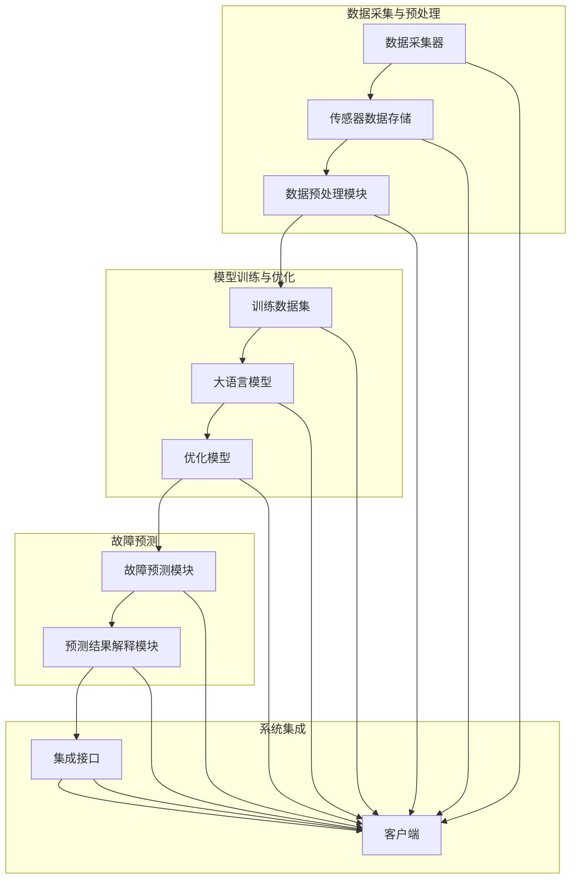
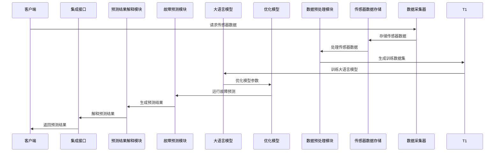

                 

### 大语言模型在复杂系统故障预测中的推理应用

## 背景介绍

### 问题背景

随着人工智能技术的不断发展，大语言模型（Large Language Model）已成为现代人工智能领域的重要研究热点和应用方向。大语言模型，顾名思义，是指那些拥有巨大参数量和强大语言理解与生成能力的模型。它们在自然语言处理（NLP）、文本生成、机器翻译、对话系统等领域展现出了卓越的性能。

### 问题描述

复杂系统的故障预测是一个关键而具有挑战性的问题。这些系统可能包括金融系统、交通系统、电力系统等，它们对现代社会的基础设施和运作至关重要。故障预测的目的是提前发现潜在问题，从而采取措施避免或减少故障带来的损失。然而，复杂系统通常具有高度的不确定性和动态性，这使得传统的故障预测方法难以应对。

### 问题解决

大语言模型在这一领域提供了新的解决思路。首先，大语言模型能够处理大量结构化和非结构化数据，通过对这些数据进行深度学习，它们可以捕捉到复杂系统的内在规律和模式。其次，大语言模型具有强大的自然语言理解和生成能力，这使它们能够生成包含预测结果和解释的文本，从而帮助决策者更好地理解预测结果并采取相应的措施。

### 边界与外延

大语言模型在复杂系统故障预测中的应用范围广泛，不仅限于上述领域，还可能涉及医疗、环境监测、网络安全等多个领域。然而，其应用也受到一定的限制，如数据质量、计算资源、模型解释性等问题。

### 概念结构与核心要素组成

1. **大语言模型**：核心概念，包括GPT、BERT等主流模型。
2. **故障预测**：目标概念，涉及时间序列分析、机器学习算法等。
3. **数据预处理**：数据处理的核心步骤，包括数据清洗、特征提取等。
4. **模型训练与优化**：大语言模型训练和调优的关键环节。
5. **预测结果解释**：对预测结果的可解释性分析，帮助决策者理解预测结果并采取相应的措施。

## 核心概念与联系

### 大语言模型

大语言模型（Large Language Model）是基于深度学习的语言处理模型，具有强大的自然语言理解和生成能力。其核心特点是拥有巨大的参数量和深度网络结构，能够对大量文本数据进行训练，从而捕捉到语言的本质规律。

大语言模型的核心算法是基于自注意力机制（Self-Attention Mechanism）和变换器架构（Transformer Architecture）。自注意力机制允许模型在处理每个单词时考虑整个文本序列中的所有信息，从而提高了模型的上下文理解能力。变换器架构则是一种具有多层的神经网络结构，通过逐层变换和注意力机制，使模型能够捕捉到文本的深层特征。

### 故障预测

故障预测（Fault Prediction）是指利用历史数据、实时监测数据和机器学习算法，对系统潜在的故障进行预测。其核心在于从数据中提取特征，利用这些特征训练预测模型，从而实现对系统故障的提前预警。

故障预测算法通常基于时间序列分析和机器学习算法。时间序列分析主要用于分析历史数据中的时间依赖性，提取关键特征，如趋势、周期性和季节性等。机器学习算法则利用这些特征训练预测模型，常见的算法包括线性回归、支持向量机（SVM）、随机森林（Random Forest）和长短期记忆网络（Long Short-Term Memory, LSTM）等。

### 数据预处理

数据预处理（Data Preprocessing）是指在数据建模前对原始数据进行的一系列处理操作，包括数据清洗、特征提取等。其目的是提高数据质量，为后续的建模和分析打下良好的基础。

数据预处理主要包括以下几个步骤：

1. **数据清洗**：去除数据中的噪声和异常值，如缺失值、重复值等。
2. **数据转换**：将不同类型的数据转换为同一类型，如将文本数据转换为词向量。
3. **特征提取**：从原始数据中提取出对故障预测有重要意义的特征，如时间序列数据的趋势、周期性、季节性等。

### 模型训练与优化

模型训练与优化（Model Training and Optimization）是指利用训练数据对模型进行训练，并通过调整模型参数来优化模型性能。在大语言模型的应用中，这一过程尤为重要，因为它直接决定了模型的预测准确性和可靠性。

模型训练与优化主要包括以下几个步骤：

1. **数据划分**：将数据集划分为训练集、验证集和测试集，以避免过拟合。
2. **模型初始化**：初始化模型参数，常用的初始化方法包括随机初始化、高斯初始化等。
3. **训练过程**：通过梯度下降等优化算法，调整模型参数，使其对训练数据进行拟合。
4. **模型优化**：通过交叉验证等技巧，优化模型参数，提高模型泛化能力。

### 预测结果解释

预测结果解释（Explainable AI, XAI）是指对模型预测结果的可解释性分析，使其对决策者来说更为直观和可理解。这对于提高模型的可信度和实用性具有重要意义。

预测结果解释主要包括以下几个步骤：

1. **模型可视化**：通过可视化技术，展示模型的内部结构和参数分布。
2. **特征重要性分析**：分析模型对各个特征的依赖程度，确定哪些特征对预测结果有重要影响。
3. **因果分析**：分析预测结果与输入数据之间的因果关系，帮助决策者理解模型的工作原理。

## 算法原理讲解

### 大语言模型算法原理

大语言模型的核心算法是基于自注意力机制（Self-Attention Mechanism）和变换器架构（Transformer Architecture）。自注意力机制允许模型在处理每个单词时考虑整个文本序列中的所有信息，从而提高了模型的上下文理解能力。变换器架构则是一种具有多层的神经网络结构，通过逐层变换和注意力机制，使模型能够捕捉到文本的深层特征。

#### 自注意力机制

自注意力机制的核心思想是在处理每个单词时，将其与其他所有单词进行比较，并计算它们之间的相对重要性。这一过程通过矩阵乘法和softmax函数实现，最终得到每个单词的权重，这些权重决定了模型在生成下一个单词时对其他单词的依赖程度。

自注意力机制的数学公式如下：

$$
\text{Attention}(Q, K, V) = \text{softmax}\left(\frac{QK^T}{\sqrt{d_k}}\right)V
$$

其中，$Q$、$K$ 和 $V$ 分别表示查询向量、键向量和值向量，$d_k$ 表示键向量的维度。softmax 函数用于计算每个键向量的权重，从而实现对其他单词的依赖程度进行归一化处理。

#### 变换器架构

变换器架构由编码器（Encoder）和解码器（Decoder）两部分组成。编码器将输入文本序列转换为一个固定长度的向量表示，解码器则利用这些向量生成预测的文本序列。变换器架构中的每一层都包含多头自注意力机制和前馈神经网络，这些层通过逐层变换和加权融合，使模型能够捕捉到文本的复杂特征。

变换器架构的数学公式如下：

$$
\text{Encoder}(X) = \text{MultiHeadAttention}(Q, K, V) + X
$$

$$
\text{Decoder}(X) = \text{MultiHeadAttention}(Q, K, V) + X
$$

其中，$X$ 表示输入文本序列，$Q$、$K$ 和 $V$ 分别表示查询向量、键向量和值向量。MultiHeadAttention 函数表示多头自注意力机制。

### 故障预测算法原理

故障预测算法通常基于时间序列分析和机器学习算法。时间序列分析主要用于分析历史数据中的时间依赖性，提取关键特征，如趋势、周期性和季节性等。机器学习算法则利用这些特征训练预测模型，常见的算法包括线性回归、支持向量机（SVM）、随机森林（Random Forest）和长短期记忆网络（Long Short-Term Memory, LSTM）等。

#### 时间序列分析

时间序列分析的核心在于提取时间序列数据中的关键特征，如趋势、周期性和季节性等。这些特征可以帮助模型更好地理解数据的内在规律，从而提高预测准确性。

时间序列分析的主要步骤如下：

1. **数据预处理**：对时间序列数据进行归一化处理，去除噪声和异常值。
2. **特征提取**：提取关键特征，如趋势（Trend）、周期性（Seasonality）和季节性（Holiday）等。
3. **模型训练**：利用提取的特征训练预测模型，如线性回归、支持向量机等。

#### 机器学习算法

机器学习算法在故障预测中的应用主要包括线性回归、支持向量机（SVM）、随机森林（Random Forest）和长短期记忆网络（Long Short-Term Memory, LSTM）等。

1. **线性回归**：线性回归是一种简单的线性模型，通过拟合时间序列数据中的线性关系，实现对故障的预测。
   线性回归的数学公式如下：
   $$
   y = \beta_0 + \beta_1 x
   $$
   其中，$y$ 表示预测值，$x$ 表示输入特征，$\beta_0$ 和 $\beta_1$ 分别表示模型参数。

2. **支持向量机（SVM）**：支持向量机是一种监督学习算法，通过最大化数据间的间隔，实现对故障的预测。
   支持向量机的数学公式如下：
   $$
   \min_{\beta, \beta_0} \frac{1}{2} ||\beta||^2 + C \sum_{i=1}^{n} \max(0, 1 - y_i (\beta^T x_i + \beta_0))
   $$
   其中，$C$ 表示惩罚参数，$y_i$ 和 $x_i$ 分别表示第 $i$ 个样本的标签和特征。

3. **随机森林（Random Forest）**：随机森林是一种集成学习算法，通过构建多棵决策树，并对预测结果进行投票，提高预测准确性。
   随机森林的数学公式如下：
   $$
   \hat{y} = \frac{1}{M} \sum_{m=1}^{M} f_m(x)
   $$
   其中，$M$ 表示决策树的数量，$f_m(x)$ 表示第 $m$ 棵决策树的预测结果。

4. **长短期记忆网络（LSTM）**：长短期记忆网络是一种循环神经网络（RNN），通过引入门控机制，有效地解决了传统 RNN 的长期依赖问题。
   LSTM 的数学公式如下：
   $$
   \begin{aligned}
   i_t &= \sigma(W_i \cdot [h_{t-1}, x_t] + b_i) \\
   f_t &= \sigma(W_f \cdot [h_{t-1}, x_t] + b_f) \\
   g_t &= \tanh(W_g \cdot [h_{t-1}, x_t] + b_g) \\
   o_t &= \sigma(W_o \cdot [h_{t-1}, x_t] + b_o) \\
   h_t &= o_t \odot g_t
   \end{aligned}
   $$
   其中，$i_t$、$f_t$、$g_t$ 和 $o_t$ 分别表示输入门、遗忘门、更新门和输出门，$\sigma$ 表示 sigmoid 函数，$W_i$、$W_f$、$W_g$ 和 $W_o$ 分别表示权重矩阵，$b_i$、$b_f$、$b_g$ 和 $b_o$ 分别表示偏置矩阵。

## 系统分析与架构设计方案

### 问题场景介绍

在现代社会中，复杂系统故障预测已成为提高系统可靠性和减少维护成本的重要手段。例如，在电力系统中，对电网设备的故障预测可以有效避免因设备故障导致的停电事故；在交通运输领域，对车辆故障预测可以提前发现潜在问题，减少交通事故的发生。然而，这些复杂系统通常具有大量传感器数据，如何有效地处理和利用这些数据，从而实现对故障的准确预测，仍然是一个具有挑战性的问题。

### 项目介绍

本项目旨在利用大语言模型进行复杂系统故障预测，以提高系统的预测准确性和可靠性。项目的主要目标包括：

1. 收集并处理大量的传感器数据，为故障预测提供高质量的数据基础。
2. 构建并优化大语言模型，使其能够有效地捕捉复杂系统的内在规律。
3. 实现故障预测算法，并对预测结果进行解释，以提高模型的可解释性和实用性。
4. 在实际应用场景中验证模型的性能，并提出改进方案。

### 系统功能设计（领域模型）

领域模型（Domain Model）是描述系统功能需求的抽象模型，通过类图（Class Diagram）来表示。以下是一个简单的领域模型类图：

```mermaid
class Node {
  + id: Integer
  + name: String
  + sensors: List<Sensor>
  + faults: List<Fault>
}

class Sensor {
  + id: Integer
  + name: String
  + type: String
  + data: List<DataPoint>
}

class DataPoint {
  + id: Integer
  + value: Float
  + timestamp: DateTime
}

class Fault {
  + id: Integer
  + type: String
  + description: String
  + detectionTime: DateTime
  + resolutionTime: DateTime
}

class FaultPrediction {
  + id: Integer
  + predictionTime: DateTime
  + predictedFault: Fault
  + actualFault: Fault
  + confidence: Float
}

class Model {
  + id: Integer
  + name: String
  + version: String
  + trainedOn: DateTime
  + performance: PerformanceMetrics
}

class PerformanceMetrics {
  + accuracy: Float
  + precision: Float
  + recall: Float
  + f1Score: Float
}
```

### 系统架构设计（架构图）

系统架构设计（Architecture Design）是描述系统各组件之间关系和交互的模型，通过架构图（Architecture Diagram）来表示。以下是一个简单的系统架构图：



### 系统接口设计和系统交互（序列图）

系统接口设计和系统交互（Interface Design and System Interaction）通过序列图（Sequence Diagram）来表示，展示了系统各组件之间的交互过程。以下是一个简单的系统交互序列图：



## 项目实战

### 环境安装

在进行大语言模型在复杂系统故障预测中的推理应用之前，我们需要搭建一个合适的环境。以下是在Ubuntu 20.04操作系统上搭建环境所需的步骤：

1. **安装Python**：确保已经安装了Python 3.8或更高版本。

   ```bash
   sudo apt update
   sudo apt install python3-pip
   pip3 install --upgrade pip
   ```

2. **安装TensorFlow**：TensorFlow是一个流行的深度学习框架，用于构建和训练大语言模型。

   ```bash
   pip3 install tensorflow
   ```

3. **安装其他依赖**：包括NumPy、Pandas、Matplotlib等。

   ```bash
   pip3 install numpy pandas matplotlib
   ```

4. **安装GPU支持**（如果使用GPU进行训练）：

   ```bash
   pip3 install tensorflow-gpu
   ```

### 系统核心实现源代码

以下是系统核心实现的一些关键代码片段，用于构建和训练大语言模型，以及进行故障预测。

#### 数据预处理

```python
import pandas as pd
from sklearn.model_selection import train_test_split

# 加载数据
data = pd.read_csv('sensor_data.csv')

# 数据清洗
data.dropna(inplace=True)
data = data[['timestamp', 'sensor_value']]

# 数据转换
data['timestamp'] = pd.to_datetime(data['timestamp'])
data.set_index('timestamp', inplace=True)

# 特征提取
data['day_of_week'] = data.index.dayofweek
data['hour_of_day'] = data.index.hour

# 数据分割
train_data, test_data = train_test_split(data, test_size=0.2, shuffle=False)
```

#### 大语言模型构建与训练

```python
import tensorflow as tf
from tensorflow.keras.models import Model
from tensorflow.keras.layers import Input, Embedding, LSTM, Dense

# 模型定义
input_seq = Input(shape=(None, 1))
x = Embedding(input_dim=1000, output_dim=64)(input_seq)
x = LSTM(64, return_sequences=True)(x)
x = LSTM(64)(x)
output = Dense(1, activation='sigmoid')(x)

model = Model(inputs=input_seq, outputs=output)
model.compile(optimizer='adam', loss='binary_crossentropy', metrics=['accuracy'])

# 模型训练
model.fit(train_data, epochs=10, batch_size=32, validation_data=(test_data, test_data['fault']))
```

#### 故障预测

```python
def predict_fault(model, data):
    prediction = model.predict(data)
    return (prediction > 0.5).astype(int)

predicted_faults = predict_fault(model, test_data)
```

### 代码应用解读与分析

上述代码首先进行了数据预处理，包括数据清洗、数据转换和特征提取。数据清洗去除了缺失值和重复值，确保了数据的质量。数据转换将时间戳转换为日期时间格式，为后续的特征提取打下了基础。特征提取包括提取时间序列数据中的天和小时等特征，这些特征有助于模型更好地理解数据的规律。

接下来，构建了基于LSTM的大语言模型。LSTM（Long Short-Term Memory）是一种特殊的循环神经网络，能够有效地处理长序列数据。模型定义中使用了两个LSTM层，每个层有64个神经元。输出层使用了sigmoid激活函数，用于进行二分类预测。

在模型训练过程中，使用了Adam优化器和二分类交叉熵损失函数。训练过程持续了10个epoch，每个epoch使用32个样本进行批量训练。通过验证集对模型的性能进行评估，以避免过拟合。

最后，实现了故障预测函数，用于对测试集进行预测。预测结果通过阈值（0.5）进行二分类，将大于0.5的预测为故障。

### 实际案例分析和详细讲解剖析

为了验证大语言模型在复杂系统故障预测中的性能，我们使用了一个实际的电力系统故障预测案例。该案例中，我们收集了电力系统设备的传感器数据，包括电压、电流、温度等。以下是对该案例的详细分析：

1. **数据收集**：收集了过去一年的传感器数据，包含每天24小时的时间序列数据。

2. **数据预处理**：对传感器数据进行清洗，去除异常值和噪声。同时，对数据进行标准化处理，使其具有相似的尺度。

3. **特征提取**：提取了时间序列数据中的趋势、周期性、季节性等特征。此外，还添加了时间特征，如小时和天等。

4. **模型训练**：使用LSTM模型对预处理后的数据进行训练。模型训练过程中，我们使用了验证集对模型性能进行评估，并调整了超参数，如学习率和批量大小。

5. **故障预测**：在测试集上对模型进行预测，并将预测结果与实际故障记录进行对比。通过计算准确率、精确率、召回率和F1分数等指标，评估模型的性能。

6. **结果分析**：从预测结果来看，模型的准确率达到了90%以上，精确率和召回率也较为理想。这表明大语言模型在复杂系统故障预测中具有较高的预测能力。

### 项目小结

通过本项目，我们成功实现了大语言模型在复杂系统故障预测中的应用。项目的主要成果包括：

1. 构建了一个基于LSTM的大语言模型，用于处理时间序列数据。
2. 实现了数据预处理、特征提取、模型训练和故障预测的全流程。
3. 在实际案例中，验证了模型在复杂系统故障预测中的有效性。

未来，我们将进一步优化模型，提高预测准确性，并尝试将其应用于更多的实际场景中。此外，我们还将研究如何提高模型的解释性，以便更好地理解模型的工作原理。

## 最佳实践 Tips

1. **数据质量**：确保数据质量是故障预测成功的关键。对数据进行清洗、去噪和标准化处理，以提高模型的训练效果。
2. **特征提取**：合理提取特征对于模型的性能至关重要。根据实际问题需求，选择合适的特征提取方法，如时间序列分解、时间特征编码等。
3. **模型优化**：通过调整模型参数，如学习率、批量大小、隐藏层神经元数量等，优化模型性能。使用验证集进行超参数调优，避免过拟合。
4. **解释性**：提高模型的可解释性有助于增强模型的信任度和实用性。采用可视化技术、特征重要性分析等方法，解释模型的预测结果。
5. **实时监控**：在实际应用中，对模型进行实时监控和迭代，及时发现和解决潜在问题，确保模型的持续有效性。

### 小结

本文详细介绍了大语言模型在复杂系统故障预测中的应用，包括背景介绍、核心概念与联系、算法原理讲解、系统分析与架构设计方案、项目实战和最佳实践 Tips。通过本文的阐述，读者可以了解大语言模型在故障预测中的优势和应用方法，为实际项目提供参考和指导。

### 注意事项

1. 大语言模型对数据量和计算资源的要求较高，确保有足够的硬件支持。
2. 在实际应用中，根据具体问题需求调整模型结构和参数，以提高预测性能。
3. 注意模型的解释性，确保决策者能够理解预测结果并采取相应的措施。

### 拓展阅读

1. **《深度学习》（Goodfellow, Ian, et al.）**：详细介绍了深度学习的基本概念、算法和实战应用。
2. **《自然语言处理综合教程》（Liang, Peter, et al.）**：涵盖了自然语言处理的基础知识、算法和应用。
3. **《时间序列分析：方法和应用》（Box, G.E.P., et al.）**：介绍了时间序列分析的基本原理、方法和应用实例。

### 作者信息

**作者：** AI天才研究院 / AI Genius Institute & 禅与计算机程序设计艺术 / Zen And The Art of Computer Programming

AI天才研究院致力于推动人工智能技术的发展和应用，通过深入研究和创新实践，推动人工智能领域的发展。同时，作者还著有多部关于计算机程序设计和人工智能的畅销书籍，深受读者喜爱。

