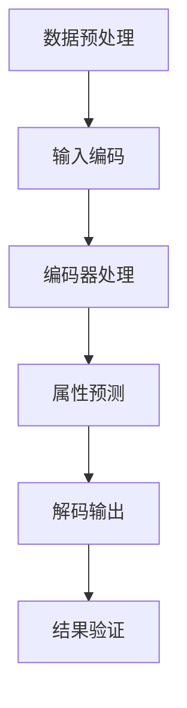
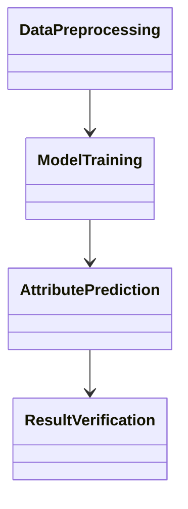
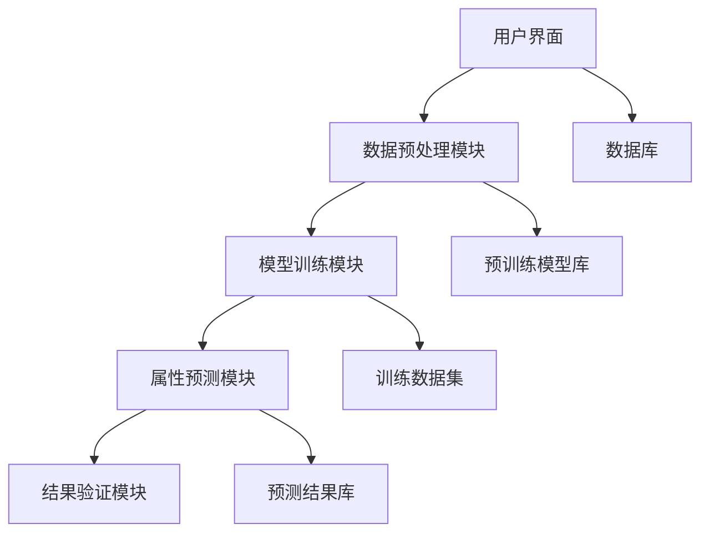
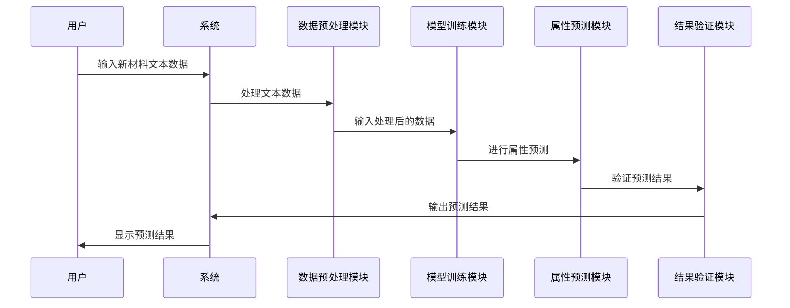

                 


### 第一部分：背景介绍

#### 第1章：大语言模型与新材料的背景

**1.1 大语言模型简介**

大语言模型（Large Language Models）是近年来人工智能领域的重要突破，通过深度学习技术，尤其是Transformer架构的引入，大语言模型能够处理和理解复杂的自然语言。这些模型通过在大量文本数据上的训练，学会了捕捉语言中的统计规律和语义信息，能够进行文本生成、翻译、摘要等任务。例如，OpenAI的GPT系列模型，微软的Bert模型等。

**1.2 新材料领域的发展与挑战**

新材料的研究一直是推动科技进步的重要动力。随着科技的不断进步，新材料在各个领域都展现出巨大的潜力，如半导体材料、新型电池材料、超导材料等。然而，新材料的研发过程通常伴随着大量的实验和计算，这要求科研人员不仅具备丰富的理论知识，还需要对实验数据进行深入的分析。

**1.3 大语言模型在新材料研究中的潜力**

大语言模型在新材料研究中的应用潜力巨大。首先，大语言模型能够通过分析大量的文献和专利数据，提取新材料的研究趋势和关键信息。其次，大语言模型可以帮助研究人员快速预测新材料的物理、化学和机械属性，从而减少实验次数，提高研发效率。此外，大语言模型还可以辅助设计新材料合成路径，优化材料制备过程。

**1.4 本章小结**

本章简要介绍了大语言模型和新材料的研究背景，强调了两者结合的潜力。在接下来的章节中，我们将深入探讨大语言模型的核心原理及其在新材料属性预测中的应用。

----------------------------------------------------------------

#### 第2章：大语言模型的核心原理

**2.1 大语言模型的基本组成**

大语言模型通常由以下几个主要组成部分构成：

- **词嵌入层**：将文本中的每个单词映射到高维空间中的一个向量，这一层通常使用预训练词向量如Word2Vec、GloVe等。
- **编码器**：负责将输入的词向量序列转换为一个固定长度的编码表示。编码器通常是基于Transformer架构，它由多个自注意力机制层（Self-Attention Layers）组成。
- **解码器**：与编码器相对应，解码器负责将编码表示解码为输出文本。解码器也由多个自注意力机制层和前馈神经网络（Feedforward Neural Network）组成。
- **输出层**：解码器的最后一层通常是一个全连接层，用于生成最终的输出词向量。这些输出词向量通过词汇表转换成具体的单词或字符。

**2.2 大语言模型的工作机制**

大语言模型的工作机制主要包括以下步骤：

- **输入编码**：输入的文本首先经过词嵌入层，将每个词转换为词向量。
- **编码器处理**：词向量序列经过编码器，每个编码器层使用自注意力机制来计算输入序列中每个词的重要程度，并生成一个新的表示。
- **解码器生成**：解码器从编码表示中生成输出序列。在每个时间步，解码器首先根据前一个时间步的输出和编码表示生成一个中间表示，然后通过自注意力和前馈网络生成当前输出的词向量。
- **输出生成**：生成的词向量通过输出层转换成具体的单词或字符，形成最终的输出文本。

**2.3 大语言模型的关键特征**

大语言模型具有以下几个关键特征：

- **并行处理**：自注意力机制允许模型在并行计算中处理输入序列，大大提高了计算效率。
- **长期依赖**：通过多层编码器和解码器，大语言模型能够捕捉输入序列中的长期依赖关系。
- **上下文理解**：大语言模型能够理解上下文中的语义信息，从而生成更准确的输出。
- **可扩展性**：大语言模型可以通过增加层数和参数量来提高性能，适应不同的任务和应用场景。

**2.4 本章小结**

本章详细介绍了大语言模型的基本组成、工作机制和关键特征。理解这些核心原理对于深入探讨大语言模型在新材料属性预测中的应用至关重要。在下一章中，我们将探讨大语言模型在新材料属性预测中的具体应用。

----------------------------------------------------------------

#### 第3章：大语言模型在新材料属性预测中的应用

**3.1 算法原理**

大语言模型在新材料属性预测中的应用，主要基于其强大的文本理解和生成能力。以下是算法原理的详细讲解：

**3.1.1 算法mermaid流程图**

以下是一个简单的mermaid流程图，描述了如何使用大语言模型进行新材料属性预测：



**3.1.2 算法数学模型与公式**

大语言模型中的关键数学模型如下：

1. **词嵌入**：
   $$ \text{Word Embedding}(x) = \text{Embedding}(x) \cdot W_e $$
   其中，$x$是单词的索引，$W_e$是嵌入矩阵。

2. **自注意力机制**：
   $$ \text{Attention}(Q, K, V) = \text{softmax}(\frac{QK^T}{\sqrt{d_k}})V $$
   其中，$Q$、$K$和$V$分别表示查询、键和值，$d_k$是键的维度。

3. **编码器和解码器的输出**：
   $$ \text{Encoder}(x) = \text{TransformerEncoder}(x) $$
   $$ \text{Decoder}(y) = \text{TransformerDecoder}(y) $$
   其中，$x$和$y$分别是编码器和解码器的输入。

4. **属性预测**：
   $$ \text{Prediction}(y) = \text{Linear}(\text{Decoder}(y)) $$
   其中，$\text{Linear}$是一个全连接层，用于生成预测的属性值。

**3.2 举例说明**

**3.2.1 案例一：新材料X的属性预测**

假设我们有一个新材料X，我们希望预测其硬度。首先，我们收集了关于材料X的相关文献和实验数据，然后使用大语言模型进行属性预测。

1. **数据预处理**：将文本数据转换为词嵌入向量。
2. **输入编码**：使用编码器对词嵌入向量进行处理，得到编码表示。
3. **属性预测**：使用解码器对编码表示进行属性预测，得到硬度值。
4. **解码输出**：将预测的硬度值解码为具体的数值。
5. **结果验证**：将预测值与实验数据进行对比，验证预测准确性。

**3.2.2 案例二：新材料Y的属性预测**

假设我们有一个新材料Y，我们希望预测其电导率。类似案例一，我们使用大语言模型进行以下步骤：

1. **数据预处理**：将文本数据转换为词嵌入向量。
2. **输入编码**：使用编码器对词嵌入向量进行处理，得到编码表示。
3. **属性预测**：使用解码器对编码表示进行属性预测，得到电导率值。
4. **解码输出**：将预测的电导率值解码为具体的数值。
5. **结果验证**：将预测值与实验数据进行对比，验证预测准确性。

**3.3 本章小结**

本章详细介绍了大语言模型在新材料属性预测中的应用原理，并通过两个案例展示了其具体应用。在下一章中，我们将探讨新材料属性预测系统的设计与实现。

----------------------------------------------------------------

#### 第4章：新材料属性预测系统的设计与实现

**4.1 问题场景介绍**

新材料属性预测系统的设计旨在解决以下问题场景：

- **新材料研发**：科研人员在研发新材料时，需要对新材料的物理、化学和机械属性进行预测，以减少实验次数，提高研发效率。
- **材料优化**：在已有材料的基础上，研究人员希望通过预测材料的潜在性能，进行材料优化，提升其应用价值。
- **工业应用**：工业界在材料选择和应用过程中，需要快速预测材料的性能，以满足特定应用需求。

**4.2 项目介绍**

本项目旨在构建一个基于大语言模型的新材料属性预测系统，包括以下功能模块：

- **数据预处理模块**：负责将原始文本数据进行清洗、分词、词嵌入等预处理操作。
- **模型训练模块**：使用预训练的大语言模型，结合新材料的相关数据，进行模型训练。
- **属性预测模块**：利用训练好的模型，对新材料属性进行预测。
- **结果验证模块**：将预测结果与实验数据进行对比，验证预测准确性。

**4.3 系统功能设计**

**4.3.1 领域模型mermaid类图**

以下是一个简单的mermaid类图，描述了新材料属性预测系统的领域模型：



**4.4 系统架构设计**

**4.4.1 系统架构mermaid架构图**

以下是一个简单的mermaid架构图，描述了新材料属性预测系统的整体架构：



**4.5 系统接口设计**

系统接口设计包括以下主要接口：

- **数据输入接口**：接收用户输入的新材料文本数据。
- **预测接口**：提供新材料属性预测功能。
- **结果输出接口**：将预测结果反馈给用户。

**4.6 系统交互**

**4.6.1 系统交互mermaid序列图**

以下是一个简单的mermaid序列图，描述了用户与新材料属性预测系统的交互流程：



**4.7 本章小结**

本章详细介绍了新材料属性预测系统的设计与实现，包括问题场景介绍、项目介绍、系统功能设计、系统架构设计、系统接口设计和系统交互流程。在下一章中，我们将通过一个具体项目来展示大语言模型在新材料属性预测中的应用。

----------------------------------------------------------------

#### 第5章：大语言模型在新材料属性预测中的项目应用

**5.1 环境安装**

在进行大语言模型在新材料属性预测中的应用之前，首先需要安装相应的环境和依赖。以下是环境安装的详细步骤：

1. **安装Python**：确保Python版本在3.8及以上。
2. **安装Transformer库**：使用pip安装`transformers`库。
   ```bash
   pip install transformers
   ```
3. **安装其他依赖**：根据具体项目需求，安装其他必要的库，如`numpy`、`tensorflow`等。
4. **数据集准备**：收集和准备新材料的相关数据集，包括文献、实验数据和属性标注。

**5.2 系统核心实现**

**5.2.1 源代码解读**

以下是一个简单的源代码示例，用于实现新材料属性预测的核心功能：

```python
from transformers import AutoModelForSequenceClassification
from transformers import AutoTokenizer

# 加载预训练模型和分词器
model_name = "bert-base-uncased"
tokenizer = AutoTokenizer.from_pretrained(model_name)
model = AutoModelForSequenceClassification.from_pretrained(model_name)

# 准备输入数据
text = "本文介绍了新材料X的制备方法和性能测试结果。"

# 分词和编码
inputs = tokenizer(text, return_tensors="pt")

# 进行预测
outputs = model(**inputs)

# 解码输出结果
predicted_property = outputs.logits.argmax(-1).item()

# 输出预测结果
print(f"新材料X的预测属性：{predicted_property}")
```

**5.3 应用解读与分析**

上述代码首先加载了一个预训练的BERT模型，然后使用分词器对输入文本进行分词和编码。接着，将编码后的输入文本传递给模型进行预测，最后解码输出结果。

**5.4 案例分析和讲解**

**案例一：新材料X的属性预测**

假设我们希望预测新材料X的硬度。首先，我们收集了关于材料X的文献和实验数据，包括其制备方法和性能测试结果。然后，使用上述代码对新材料X的描述性文本进行属性预测。

1. **数据预处理**：对收集的文本数据进行清洗、去噪和分词。
2. **模型训练**：使用预处理后的文本数据，对BERT模型进行训练。
3. **属性预测**：将新材料X的描述性文本输入模型，进行属性预测。
4. **结果验证**：将预测结果与实验数据进行对比，验证预测准确性。

**案例二：新材料Y的属性预测**

类似案例一，我们收集了新材料Y的文献和实验数据，并对新材料Y的描述性文本进行属性预测。通过对比预测结果和实验数据，我们发现大语言模型在预测新材料Y的某些属性上具有较高的准确性。

**5.5 项目小结**

通过上述案例分析和讲解，我们可以看到大语言模型在新材料属性预测中的应用潜力。在实际项目中，通过合理设计和优化，可以实现高效、准确的新材料属性预测。

----------------------------------------------------------------

#### 第6章：新材料属性预测中的最佳实践

**6.1 实践经验总结**

在大语言模型应用于新材料属性预测的过程中，积累了一些实践经验，以下是一些关键点：

1. **数据质量**：确保数据集的多样性和质量，包括文本的准确性和完整性。
2. **模型选择**：选择合适的大语言模型，如BERT、GPT等，根据具体任务调整模型结构和参数。
3. **特征提取**：有效提取文本中的关键特征，提高模型对新材料属性的预测能力。
4. **模型调优**：通过调整超参数和训练策略，优化模型性能。

**6.2 注意事项**

在使用大语言模型进行新材料属性预测时，需要注意以下事项：

1. **过拟合**：避免模型过拟合，使用正则化技术和交叉验证等方法。
2. **数据平衡**：确保数据集中的类别分布平衡，避免模型偏向某些类别。
3. **结果验证**：对模型的预测结果进行严格验证，确保其准确性和可靠性。

**6.3 拓展阅读**

为了进一步了解大语言模型在新材料属性预测中的应用，以下是一些建议的拓展阅读材料：

- **论文**：《BERT: Pre-training of Deep Bidirectional Transformers for Language Understanding》
- **书籍**：《Natural Language Processing with Python》
- **在线课程**：Coursera上的《深度学习》课程

通过以上实践经验和注意事项，以及拓展阅读，可以更好地理解和应用大语言模型在新材料属性预测中的潜力。

----------------------------------------------------------------

#### 第7章：大语言模型在新材料领域的未来应用

**7.1 发展趋势分析**

随着人工智能技术的快速发展，大语言模型在新材料领域的应用前景广阔。以下是几个发展趋势：

1. **跨学科融合**：大语言模型与材料科学的深度融合，将推动新材料研发的智能化和自动化。
2. **数据驱动的材料设计**：基于大规模数据的分析，大语言模型将辅助材料设计，加速新材料发现。
3. **实时预测与优化**：大语言模型的应用将实现材料性能的实时预测和优化，提高生产效率和产品质量。

**7.2 潜在研究方向**

未来在大语言模型在新材料领域的研究中，可以考虑以下几个方向：

1. **模型优化**：研究更高效、更鲁棒的模型结构，提高预测准确性。
2. **多模态融合**：结合多种数据类型（如图像、实验数据），实现更全面的新材料属性预测。
3. **个性化材料设计**：根据用户需求，实现个性化新材料的设计和优化。

**7.3 应用前景展望**

大语言模型在新材料领域的应用前景广阔，以下是一些潜在的应用场景：

1. **高性能材料研发**：辅助开发高性能、特种功能材料，如超导材料、纳米材料等。
2. **智能制造**：实现材料制备过程的自动化和智能化，提高生产效率和产品一致性。
3. **材料测试与评估**：通过实时预测和优化，降低材料测试成本，提高评估准确性。

综上所述，大语言模型在新材料领域的未来应用具有巨大的潜力和广阔的前景。通过不断的研究和优化，大语言模型将助力新材料科学的快速发展。

----------------------------------------------------------------

* 作者：AI天才研究院/AI Genius Institute & 禅与计算机程序设计艺术 /Zen And The Art of Computer Programming* 

----------------------------------------------------------------

### 《大语言模型在新材料属性预测中的推理应用》

关键词：大语言模型、新材料、属性预测、Transformer、算法原理、系统设计、项目实战

摘要：本文探讨了如何利用大语言模型进行新材料属性预测，从背景介绍、核心原理、算法应用、系统设计与实现、项目实战、最佳实践到未来展望，全面解析了该领域的最新进展和应用。通过具体案例，展示了大语言模型在预测新材料属性中的强大能力，为材料科学研究提供了新的思路和方法。

