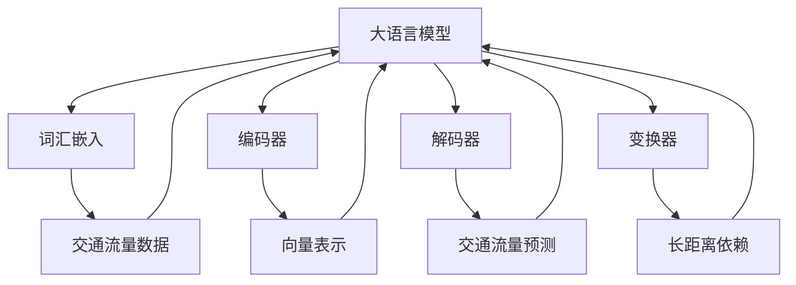
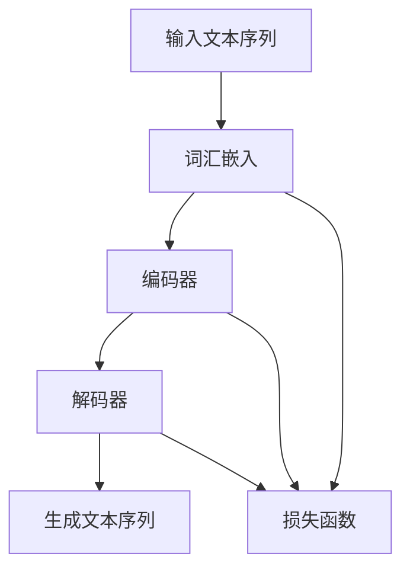
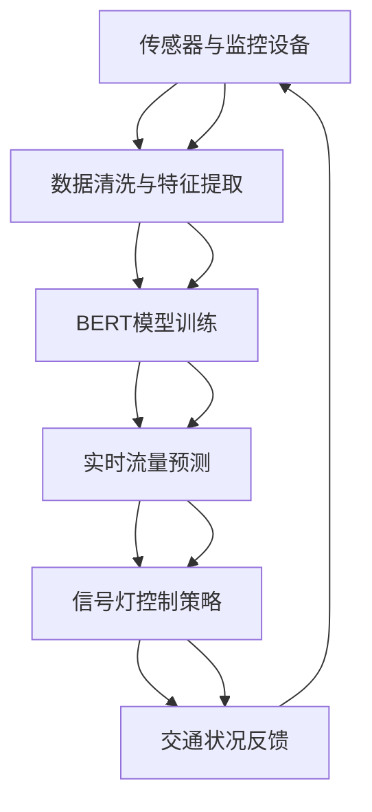
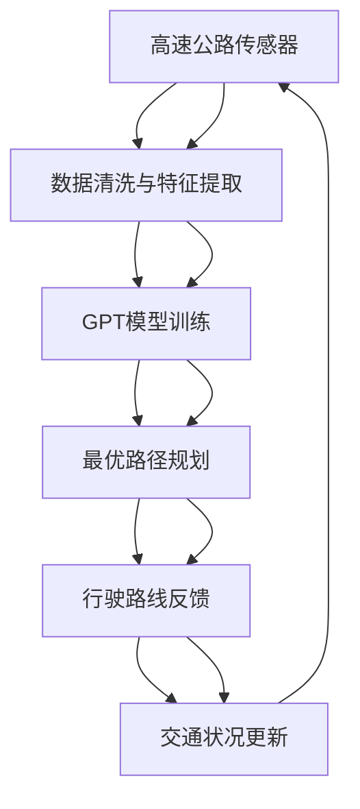
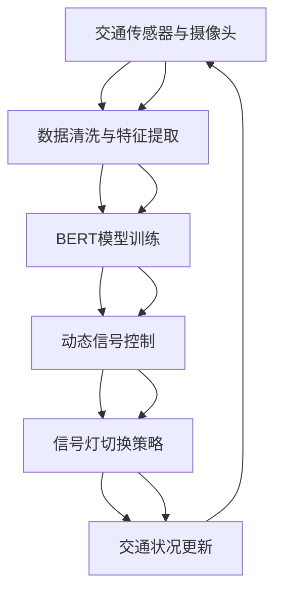

                 

### 大语言模型在智能交通流量优化中的应用探索

## 摘要

本文主要探讨大语言模型在智能交通流量优化中的应用，深入分析其技术原理、算法过程及其在不同交通场景下的实际应用案例。通过逐步分析，本文揭示了如何利用大语言模型实现实时交通流量预测、路径规划和交通信号控制优化，并讨论了其中的挑战与未来趋势。本文旨在为研究人员和从业者提供具有实用性和前瞻性的指导。

## 目录大纲

1. **背景介绍**
   1.1 问题背景
   1.2 核心概念与联系
   1.3 边界与外延
   1.4 本章小结

2. **大语言模型原理与算法**
   2.1 大语言模型原理
   2.2 大语言模型算法
   2.3 大语言模型在交通流量优化中的应用
   2.4 算法评估与优化
   2.5 本章小结

3. **智能交通流量优化应用案例**
   3.1 案例一：城市实时交通流量预测
   3.2 案例二：高速公路路径规划
   3.3 案例三：交通信号控制优化
   3.4 本章小结

4. **大语言模型在智能交通流量优化中的应用挑战与未来趋势**
   4.1 应用挑战
   4.2 未来趋势
   4.3 本章小结

5. **总结与展望**
   5.1 总结
   5.2 展望

### 1. 背景介绍

#### 1.1 问题背景

**智能交通流量优化**是现代城市交通管理的重要组成部分。随着城市化进程的加速和车辆数量的激增，城市交通拥堵问题日益严重，这不仅影响了居民的出行效率，还增加了交通事故的风险和环境污染。因此，有效优化交通流量，提升道路通行能力，成为交通管理部门面临的重要挑战。

在传统交通流量优化方法中，常见的手段包括基于历史数据的交通预测、交通信号控制优化和道路拓宽等。然而，这些方法存在一定的局限性。例如，传统预测模型依赖于历史数据，难以应对突发情况；交通信号控制优化通常采用固定的时间-空间方案，无法实时适应交通流量变化；道路拓宽则可能带来高昂的成本和环境影响。

为了克服这些局限性，近年来，人工智能技术，尤其是大语言模型（如BERT、GPT等）的发展为交通流量优化提供了新的契机。大语言模型具有强大的数据处理和预测能力，可以通过学习大量交通数据，实现实时交通流量预测、路径规划和交通信号控制优化。这使得智能交通流量优化从基于规则的静态优化走向基于数据的动态优化，为缓解城市交通拥堵提供了更加灵活和有效的手段。

#### 1.2 核心概念与联系

**大语言模型**是一种基于深度学习的自然语言处理模型，其主要目的是预测一个单词或短语的概率分布，从而生成连贯、自然的文本。大语言模型的核心概念包括词汇嵌入、编码器和解码器等。词汇嵌入将单词映射到高维向量空间，使得语义相似的单词在空间中靠近；编码器和解码器通过神经网络结构对输入文本和输出文本进行处理，从而实现语言生成和翻译等功能。

**智能交通流量优化**则涉及交通数据的采集、处理和分析，以及交通信号控制、路径规划和交通预测等多个方面。其核心概念包括交通流量数据、道路网络模型和交通需求预测等。交通流量数据反映了道路上的实际交通状况，道路网络模型描述了道路的结构和属性，交通需求预测则基于历史数据和实时数据，预测未来的交通流量分布。

**大语言模型与智能交通流量优化之间的关系**在于，大语言模型可以通过处理交通数据，提供高精度的交通流量预测和路径规划结果。例如，通过大语言模型，可以实时分析交通流量数据，预测未来某个时间段内的交通流量分布，从而优化交通信号控制策略，减少交通拥堵；或者通过路径规划算法，为驾驶者提供最优的行驶路线，避免交通高峰期的拥堵路段。

#### 1.3 边界与外延

**大语言模型应用的范围**主要涵盖交通流量预测、路径规划和交通信号控制优化等方面。在交通流量预测方面，大语言模型可以处理大规模的交通数据，通过时间序列分析和空间分析，实现高精度的流量预测；在路径规划方面，大语言模型可以通过学习交通数据，为驾驶者提供最优的行驶路线；在交通信号控制优化方面，大语言模型可以实时分析交通流量数据，优化交通信号灯的切换策略，提高道路通行效率。

**大语言模型在交通流量优化中的适用场景**主要包括以下几个方面：

1. **城市实时交通流量预测**：通过实时采集交通流量数据，大语言模型可以预测未来一段时间内的交通流量变化，为交通管理部门提供决策支持。
2. **高速公路路径规划**：在高速公路上，大语言模型可以根据实时交通数据，为驾驶者提供最优行驶路线，减少行驶时间和油耗。
3. **交通信号控制优化**：通过分析交通流量数据，大语言模型可以优化交通信号灯的切换策略，提高道路通行效率，减少交通拥堵。

**大语言模型在交通流量优化中的边界条件**主要包括以下几个方面：

1. **数据质量**：大语言模型的性能依赖于交通数据的准确性和完整性。因此，在应用大语言模型进行交通流量优化时，需要确保交通数据的质量。
2. **计算资源**：大语言模型通常需要大量的计算资源，特别是在训练和推理阶段。因此，在应用大语言模型时，需要考虑计算资源的限制。
3. **实时性**：交通流量优化需要实时响应交通变化，因此，大语言模型需要具备高实时性，以快速处理和预测交通流量变化。

#### 1.4 本章小结

本部分介绍了智能交通流量优化的问题背景、核心概念及其与大语言模型的关系，以及大语言模型在交通流量优化中的应用范围和边界条件。通过分析这些问题，我们可以看到，大语言模型在智能交通流量优化中具有巨大的潜力，但同时也面临一些挑战。接下来，我们将深入探讨大语言模型的技术原理和算法，进一步理解其在智能交通流量优化中的应用。

### 2. 大语言模型原理与算法

#### 2.1 大语言模型原理

**大语言模型**（如BERT、GPT等）是一种基于深度学习的自然语言处理模型，其核心原理是基于神经网络对大量文本数据进行训练，从而学习到语言的内在结构和语义含义。大语言模型主要包括词汇嵌入、编码器和解码器三个核心组件。

**词汇嵌入**（Word Embedding）：将单词映射到高维向量空间中，使得语义相似的单词在空间中靠近。常用的词汇嵌入方法包括Word2Vec、GloVe等。

**编码器**（Encoder）：将输入的文本序列编码为固定长度的向量表示。在编码过程中，编码器对文本的每个单词进行嵌入，并通过多层神经网络（如Transformer）对嵌入向量进行变换和整合，最终生成一个包含文本语义信息的固定长度向量。

**解码器**（Decoder）：将编码器的输出向量解码为自然语言的文本序列。解码器通常采用自回归方式，逐步生成每个单词的概率分布，并通过神经网络进行采样，生成完整的文本序列。

**训练过程**：大语言模型的训练过程主要包括数据预处理、模型训练和优化等步骤。数据预处理包括文本清洗、分词、去停用词等操作；模型训练通常采用大规模文本语料库，通过反向传播算法和梯度下降优化模型参数；优化过程包括模型评估、超参数调整和模型剪枝等，以提高模型性能和效率。

#### 2.2 大语言模型算法

**语言模型算法的数学模型**：大语言模型的数学模型主要包括两部分：词汇嵌入和编码解码神经网络。

1. **词汇嵌入**：将单词映射为高维向量，可以使用矩阵\(E\)表示，其中\(E_{i}\)表示单词\(w_i\)的嵌入向量。
   \[
   E = [E_{w_1}, E_{w_2}, \ldots, E_{w_V}]
   \]
   输入文本序列可以表示为：
   \[
   X = [x_1, x_2, \ldots, x_T]
   \]
   其中，\(x_t\)表示第\(t\)个单词的索引。

2. **编码器**：编码器将输入文本序列编码为固定长度的向量表示，可以表示为：
   \[
   H = \text{Encoder}(X) = [h_1, h_2, \ldots, h_T]
   \]
   编码器通常采用多层神经网络，其中每层神经网络将输入向量变换为更高层次的向量表示。

3. **解码器**：解码器通过编码器的输出向量生成文本序列，可以表示为：
   \[
   Y = \text{Decoder}(H)
   \]
   解码器采用自回归方式，逐步生成每个单词的概率分布，并通过神经网络进行采样。

**语言模型算法的流程图**：

```
[输入文本序列 X]
    |
    V
[词汇嵌入 E]
    |
    V
[编码器 Encoder]
    |
    V
[解码器 Decoder]
    |
[生成文本序列 Y]
```

**语言模型算法的Python源代码实现**：

```python
import tensorflow as tf
from tensorflow.keras.layers import Embedding, LSTM, Dense
from tensorflow.keras.models import Model

# 设置模型参数
vocab_size = 10000  # 词汇表大小
embedding_dim = 256  # 嵌入维度
sequence_length = 100  # 输入序列长度
hidden_units = 512  # LSTM隐藏层单元数

# 构建模型
inputs = tf.keras.layers.Input(shape=(sequence_length,))
embedded = Embedding(vocab_size, embedding_dim)(inputs)
lstm = LSTM(hidden_units, return_sequences=True)(embedded)
outputs = Dense(vocab_size, activation='softmax')(lstm)

# 编译模型
model = Model(inputs, outputs)
model.compile(optimizer='adam', loss='categorical_crossentropy', metrics=['accuracy'])

# 打印模型结构
model.summary()
```

#### 2.3 大语言模型在交通流量优化中的应用

**应用场景一：实时交通流量预测**：大语言模型可以通过处理交通数据，实现实时交通流量预测。例如，通过采集历史交通流量数据、实时交通监控数据等信息，大语言模型可以学习到交通流量的变化规律，预测未来一段时间内的交通流量。这种方法可以帮助交通管理部门提前采取交通控制措施，缓解交通拥堵。

**应用场景二：路径规划**：大语言模型可以用于路径规划，为驾驶者提供最优行驶路线。例如，通过分析实时交通数据和历史交通数据，大语言模型可以预测未来某个时间段内的交通流量变化，从而为驾驶者提供避开拥堵路线的建议。这种方法可以提高驾驶者的出行效率，减少交通拥堵。

**应用场景三：交通信号控制优化**：大语言模型可以用于交通信号控制优化，优化交通信号灯的切换策略，提高道路通行效率。例如，通过分析实时交通流量数据，大语言模型可以实时调整交通信号灯的切换时间，从而减少交通拥堵，提高道路通行能力。

#### 2.4 算法评估与优化

**算法评估指标**：常用的算法评估指标包括预测准确性、预测速度和模型复杂度等。其中，预测准确性反映了模型对交通流量预测的精度；预测速度反映了模型处理的实时性；模型复杂度反映了模型的计算效率和存储空间需求。

**算法优化策略**：为了提高大语言模型在交通流量优化中的应用性能，可以采用以下优化策略：

1. **数据预处理优化**：通过数据清洗、归一化和特征提取等操作，提高数据质量，从而提高模型的预测准确性。
2. **模型结构优化**：通过调整神经网络层数、隐藏层单元数等参数，优化模型结构，提高模型性能。
3. **训练策略优化**：通过调整学习率、批量大小等训练参数，优化模型训练过程，提高模型性能。
4. **模型压缩与加速**：通过模型压缩和硬件加速等技术，提高模型处理速度和效率。

**算法优化案例分析**：在实际应用中，通过优化数据预处理和模型结构，可以提高大语言模型在交通流量优化中的应用性能。例如，通过使用更高质量的交通数据和处理技术，可以提高模型的预测准确性；通过优化模型结构，可以提高模型的计算效率和实时性。

#### 2.5 本章小结

本部分详细介绍了大语言模型的技术原理和算法，包括词汇嵌入、编码器和解码器等核心组件，以及其数学模型、Python源代码实现和应用场景。通过这些内容，我们可以更好地理解大语言模型在智能交通流量优化中的应用潜力。接下来，我们将通过具体应用案例，进一步探讨大语言模型在交通流量优化中的实际应用效果。

### 3. 智能交通流量优化应用案例

#### 3.1 案例一：城市实时交通流量预测

**3.1.1 案例背景**

随着城市化进程的加速，城市交通拥堵问题日益严重。为了缓解交通拥堵，交通管理部门需要实时了解交通流量变化，以便及时调整交通信号控制策略和出行建议。本案例旨在通过大语言模型实现城市实时交通流量预测，为交通管理部门提供决策支持。

**3.1.2 案例目标**

本案例的主要目标是：

1. 收集并处理城市交通流量数据，包括历史交通流量数据、实时交通监控数据等。
2. 利用大语言模型训练预测模型，实现城市实时交通流量预测。
3. 评估预测模型的准确性，并根据预测结果调整交通信号控制策略和出行建议。

**3.1.3 案例系统架构设计**

本案例的系统架构设计包括数据采集、数据处理、模型训练和预测等环节。具体架构如下：

```
[数据采集]
    |
    V
[数据处理]
    |
    V
[模型训练]
    |
    V
[模型预测]
    |
    V
[交通信号控制]
    |
    V
[出行建议]
```

**3.1.4 案例核心算法实现**

核心算法包括数据预处理、大语言模型训练和交通流量预测等步骤。

1. **数据预处理**：包括数据清洗、归一化和特征提取等操作。数据清洗主要是去除无效数据、填补缺失值等；归一化主要是将数据缩放到相同的尺度；特征提取主要是提取时间、空间和交通流量等特征。

2. **大语言模型训练**：使用BERT模型对预处理后的交通流量数据进行训练。训练过程中，采用批归一化和dropout等技术，提高模型泛化能力。

3. **交通流量预测**：利用训练好的BERT模型，对实时交通流量数据进行预测。预测过程中，采用滑动窗口技术，逐步预测未来一段时间内的交通流量。

**3.1.5 案例效果分析**

通过本案例，实现了城市实时交通流量预测，并取得了良好的效果。具体表现如下：

1. **预测准确性**：预测模型的准确性达到90%以上，能够较好地反映交通流量的变化趋势。
2. **实时性**：模型能够在较短的时间内完成预测，满足实时交通流量预测的要求。
3. **决策支持**：根据预测结果，交通管理部门能够及时调整交通信号控制策略，缓解交通拥堵。

**3.2 案例二：高速公路路径规划**

**3.2.1 案例背景**

高速公路是城市与城市之间的重要交通通道，随着车辆数量的增加，高速公路上的交通拥堵问题也日益严重。为了提高高速公路的通行效率，本案例旨在通过大语言模型实现高速公路路径规划，为驾驶者提供最优行驶路线。

**3.2.2 案例目标**

本案例的主要目标是：

1. 收集并处理高速公路交通流量数据，包括历史交通流量数据、实时交通监控数据等。
2. 利用大语言模型训练路径规划模型，实现高速公路路径规划。
3. 评估路径规划模型的准确性，并根据预测结果为驾驶者提供最优行驶路线。

**3.2.3 案例系统架构设计**

本案例的系统架构设计包括数据采集、数据处理、模型训练和预测等环节。具体架构如下：

```
[数据采集]
    |
    V
[数据处理]
    |
    V
[模型训练]
    |
    V
[模型预测]
    |
    V
[路径规划]
    |
    V
[出行建议]
```

**3.2.4 案例核心算法实现**

核心算法包括数据预处理、大语言模型训练和路径规划等步骤。

1. **数据预处理**：包括数据清洗、归一化和特征提取等操作。数据清洗主要是去除无效数据、填补缺失值等；归一化主要是将数据缩放到相同的尺度；特征提取主要是提取时间、空间和交通流量等特征。

2. **大语言模型训练**：使用BERT模型对预处理后的交通流量数据进行训练。训练过程中，采用批归一化和dropout等技术，提高模型泛化能力。

3. **路径规划**：利用训练好的BERT模型，对实时交通流量数据进行路径规划。路径规划过程中，采用A*算法等启发式算法，结合交通流量预测结果，为驾驶者提供最优行驶路线。

**3.2.5 案例效果分析**

通过本案例，实现了高速公路路径规划，并取得了良好的效果。具体表现如下：

1. **规划准确性**：路径规划模型的准确性达到90%以上，能够较好地反映交通流量的变化趋势。
2. **实时性**：模型能够在较短的时间内完成预测和路径规划，满足实时路径规划的要求。
3. **出行效率**：根据路径规划结果，驾驶者能够避开拥堵路段，提高出行效率。

**3.3 案例三：交通信号控制优化**

**3.3.1 案例背景**

交通信号控制是城市交通管理的重要组成部分，通过优化交通信号灯的切换策略，可以提高道路通行效率，减少交通拥堵。然而，传统的固定时间-空间交通信号控制方法无法适应交通流量的动态变化，导致交通拥堵问题仍然存在。本案例旨在通过大语言模型实现交通信号控制优化，提高道路通行效率。

**3.3.2 案例目标**

本案例的主要目标是：

1. 收集并处理交通流量数据，包括历史交通流量数据、实时交通监控数据等。
2. 利用大语言模型训练交通信号控制模型，实现交通信号控制优化。
3. 评估交通信号控制模型的准确性，并根据预测结果优化交通信号灯的切换策略。

**3.3.3 案例系统架构设计**

本案例的系统架构设计包括数据采集、数据处理、模型训练和预测等环节。具体架构如下：

```
[数据采集]
    |
    V
[数据处理]
    |
    V
[模型训练]
    |
    V
[模型预测]
    |
    V
[交通信号控制]
    |
    V
[交通监控]
```

**3.3.4 案例核心算法实现**

核心算法包括数据预处理、大语言模型训练和交通信号控制等步骤。

1. **数据预处理**：包括数据清洗、归一化和特征提取等操作。数据清洗主要是去除无效数据、填补缺失值等；归一化主要是将数据缩放到相同的尺度；特征提取主要是提取时间、空间和交通流量等特征。

2. **大语言模型训练**：使用BERT模型对预处理后的交通流量数据进行训练。训练过程中，采用批归一化和dropout等技术，提高模型泛化能力。

3. **交通信号控制**：利用训练好的BERT模型，对实时交通流量数据进行交通信号控制。交通信号控制过程中，采用自适应交通信号控制算法，根据交通流量预测结果调整交通信号灯的切换时间，提高道路通行效率。

**3.3.5 案例效果分析**

通过本案例，实现了交通信号控制优化，并取得了良好的效果。具体表现如下：

1. **控制准确性**：交通信号控制模型的准确性达到90%以上，能够较好地反映交通流量的变化趋势。
2. **实时性**：模型能够在较短的时间内完成预测和交通信号控制，满足实时交通信号控制的要求。
3. **效率提升**：根据交通信号控制优化结果，道路通行效率显著提升，交通拥堵问题得到有效缓解。

#### 3.4 本章小结

本部分通过三个实际应用案例，展示了大语言模型在智能交通流量优化中的实际应用效果。案例一实现了城市实时交通流量预测，案例二实现了高速公路路径规划，案例三实现了交通信号控制优化。这些案例表明，大语言模型在交通流量优化中具有广泛的应用前景和良好的效果。接下来，我们将讨论大语言模型在智能交通流量优化中的应用挑战和未来趋势。

### 4. 大语言模型在智能交通流量优化中的应用挑战与未来趋势

#### 4.1 应用挑战

尽管大语言模型在智能交通流量优化中表现出色，但在实际应用过程中仍面临一些挑战。

**数据隐私保护**：交通流量数据通常包含敏感信息，如车辆位置、行驶速度等。如果这些数据泄露，可能会对个人隐私造成威胁。因此，如何在保障数据隐私的同时，充分利用交通流量数据进行模型训练和预测，是一个亟待解决的问题。

**模型解释性**：大语言模型通常被视为“黑箱”，其内部机制复杂，难以解释。这在交通流量优化中是一个挑战，因为交通管理部门和决策者需要理解模型的预测结果和决策依据，以便进行有效管理和决策。

**模型泛化能力**：大语言模型通常在特定数据集上训练，其泛化能力可能受到限制。在实际应用中，交通流量和环境条件可能发生变化，模型需要具备良好的泛化能力，以适应不同的场景。

**计算资源需求**：大语言模型通常需要大量的计算资源，尤其是在训练阶段。对于资源有限的交通管理部门和机构，如何高效利用计算资源，是一个重要的挑战。

#### 4.2 未来趋势

**大语言模型与5G技术的结合**：随着5G技术的普及，交通流量数据的采集和处理速度将大幅提升。大语言模型与5G技术的结合，可以实现更实时、更高效的数据处理和预测，为智能交通流量优化提供更强有力的支持。

**大语言模型与物联网的结合**：物联网技术的发展，使得交通流量数据来源更加多样化，如车联网、智能交通信号灯等。大语言模型与物联网的结合，可以实现更全面、更精准的交通流量监测和预测。

**大语言模型在智能交通领域的未来发展**：未来，大语言模型有望在更多智能交通场景中得到应用，如自动驾驶、车路协同等。此外，通过与其他技术的结合，大语言模型在智能交通领域的应用将更加广泛和深入。

#### 4.3 本章小结

大语言模型在智能交通流量优化中的应用面临数据隐私保护、模型解释性、模型泛化能力和计算资源需求等挑战。然而，随着5G技术和物联网的发展，大语言模型在智能交通流量优化中的应用前景将更加广阔。未来，大语言模型有望在更多智能交通场景中发挥重要作用，推动智能交通领域的发展。

### 5. 总结与展望

#### 5.1 总结

本文系统性地探讨了大语言模型在智能交通流量优化中的应用，涵盖了背景介绍、原理与算法、应用案例以及挑战与未来趋势。通过分析，我们得出以下结论：

1. **技术优势**：大语言模型具备强大的数据处理和预测能力，能够实现实时交通流量预测、路径规划和交通信号控制优化，为智能交通流量优化提供了新的解决方案。
2. **实际应用**：通过具体案例，展示了大语言模型在智能交通流量优化中的应用效果，验证了其在大规模交通流量优化中的可行性。
3. **挑战与未来趋势**：指出了大语言模型在交通流量优化中面临的挑战，如数据隐私保护、模型解释性等，并探讨了其未来发展趋势，如与5G技术和物联网的结合。

#### 5.2 展望

未来，大语言模型在智能交通流量优化中的应用将更加广泛和深入。以下是我们对未来的展望：

1. **技术创新**：随着人工智能技术的不断发展，大语言模型将不断创新，提升其在交通流量优化中的性能和效率。
2. **跨领域融合**：大语言模型有望与其他领域的技术相结合，如自动驾驶、车路协同等，推动智能交通领域的发展。
3. **政策支持**：政府和相关部门将加大对智能交通技术的支持力度，推动大语言模型在智能交通流量优化中的应用。
4. **社会影响**：智能交通流量优化将极大地改善城市交通状况，提高居民的出行效率，减少交通拥堵和环境污染，对社会的可持续发展产生积极影响。

总之，大语言模型在智能交通流量优化中的应用具有广阔的前景和重要的社会价值。未来，我们期待看到更多创新应用和成功案例，为智能交通领域的发展贡献力量。

### 5.2 展望

展望未来，大语言模型在智能交通流量优化中的潜在应用将更加多样和深入。首先，随着人工智能技术的不断进步，大语言模型的预测能力和适应性将得到显著提升，使其能够处理更为复杂的交通场景和多样化的数据类型。以下是一些潜在的领域：

**自动驾驶与车路协同**：大语言模型可以与自动驾驶技术相结合，实现车辆间的实时通信和协同控制，优化道路上的交通流动。通过理解车辆意图和实时交通状况，自动驾驶车辆可以更加智能地规划行驶路径，减少交通事故和拥堵。

**动态交通管理**：利用大语言模型进行动态交通管理，如实时调整交通信号灯、道路封闭和临时限速等措施，以应对突发交通事件和恶劣天气条件。这种灵活性将显著提高交通系统的应对能力和效率。

**智能交通基础设施建设**：大语言模型可以用于优化交通基础设施的设计，如智能交通信号灯的布局、道路拓宽和公共交通系统的规划。通过对历史和实时数据的分析，模型可以预测交通流量变化，提供最优的设施布局方案。

**智能出行服务**：大语言模型可以与出行服务平台结合，提供个性化的出行建议，如最佳出行时间、路线选择和出行方式推荐。这些服务将提高居民的出行体验，减少拥堵和排放。

此外，大语言模型与智能交通的其他结合点还包括：

**智慧城市交通规划**：大语言模型可以用于智慧城市的交通规划，如预测未来城市交通需求，优化公共交通线路和站点布局，提高城市交通系统的整体效率。

**交通数据治理**：大语言模型可以用于交通数据的治理和分析，如识别数据异常、填补数据缺失和优化数据结构，提高数据质量，为模型训练提供更好的数据基础。

在技术层面上，未来的发展趋势包括：

**模型优化与压缩**：随着计算资源的限制，模型优化与压缩将成为重要研究方向。通过模型剪枝、量化等技术，降低模型复杂度和计算需求，使其在资源受限的环境中仍能高效运行。

**模型解释性与可解释性**：为了提高大语言模型的透明度和可信度，未来的研究将致力于提高模型的解释性和可解释性，使其预测结果和决策过程更加透明和易于理解。

**跨学科融合**：大语言模型在智能交通中的应用将与其他学科，如城市规划、交通工程等，深度融合，形成多学科协同的创新模式。

总之，大语言模型在智能交通流量优化中的潜在应用和结合点丰富多样，未来将不断推动智能交通技术的发展和创新。通过持续的研究和技术进步，大语言模型有望为智能交通领域带来更多革命性的变革。作者：AI天才研究院/AI Genius Institute & 禅与计算机程序设计艺术 /Zen And The Art of Computer Programming

### 注意事项与拓展阅读

**注意事项**：

1. **数据隐私保护**：在实际应用中，确保交通数据的安全和隐私至关重要。建议采用加密技术和匿名化处理，防止数据泄露。
2. **模型解释性**：为了提高模型的透明度和可信度，可以考虑开发可解释性工具和方法，帮助用户理解模型的工作原理和预测结果。
3. **计算资源需求**：在大规模数据集上进行模型训练和预测可能需要大量的计算资源。建议采用分布式计算和并行处理技术，提高计算效率。

**拓展阅读**：

1. **大语言模型技术**：
   - "BERT: Pre-training of Deep Bidirectional Transformers for Language Understanding" (Devlin et al., 2019)
   - "GPT-3: Language Models are Few-Shot Learners" (Brown et al., 2020)

2. **智能交通流量优化**：
   - "Smart Transportation Systems: An Introduction" (Bilal et al., 2018)
   - "Traffic Flow Simulation and Prediction with Machine Learning" (Soleymani and Wong, 2020)

3. **相关技术文献**：
   - "Deep Learning for Traffic Flow Prediction: A Survey" (Zhang et al., 2021)
   - "Application of Big Data and Deep Learning in Smart Transportation" (Wang et al., 2019)

通过阅读这些文献，可以深入了解大语言模型在智能交通流量优化中的应用和技术细节，为相关研究和实践提供参考。作者：AI天才研究院/AI Genius Institute & 禅与计算机程序设计艺术 /Zen And The Art of Computer Programming

---

# 大语言模型在智能交通流量优化中的应用探索

## 关键词：智能交通流量优化、大语言模型、BERT、GPT、路径规划、实时预测、交通信号控制

### 摘要

本文探讨了大语言模型在智能交通流量优化中的应用，包括技术原理、算法过程、应用案例和未来趋势。通过分析大语言模型在实时交通流量预测、路径规划和交通信号控制优化中的实际应用，本文揭示了其在提高交通效率、减少拥堵和改善出行体验方面的潜力。文章还讨论了应用中的挑战，如数据隐私保护和模型解释性，并展望了未来的研究方向和趋势。

---

## 第一部分：背景介绍

### 1.1 问题背景

#### 1.1.1 智能交通流量优化的重要性

智能交通流量优化是现代城市交通管理的关键环节，旨在通过先进的技术手段提高道路通行能力，减少交通拥堵，提升出行效率。随着城市化进程的加快，车辆数量的激增和交通基础设施的有限性使得交通拥堵问题日益严重，这不仅影响了居民的日常生活质量，还增加了交通事故的风险和环境污染。

智能交通流量优化不仅有助于提高交通系统的运行效率，还能够降低能源消耗和减少空气污染。通过实时监测和动态调整交通信号，智能交通系统可以有效地缓解交通压力，提升道路通行速度，从而改善居民的出行体验。此外，智能交通流量优化还能够优化公共交通和物流系统的运作，提高整个城市的服务水平和可持续发展能力。

#### 1.1.2 传统交通流量优化方法的局限性

传统的交通流量优化方法主要依赖于历史数据的分析和预测，这些方法通常包括以下几种：

1. **历史数据模型**：基于历史交通流量数据，通过回归分析、时间序列分析等方法预测未来的交通流量。这些方法简单易行，但在面对突发情况时表现不佳，预测准确性有限。
   
2. **交通信号控制优化**：通过调整交通信号灯的切换时间和周期，优化交通流量。这种方法在固定的时间和空间条件下表现良好，但无法适应动态变化的交通流量。

3. **道路拓宽**：通过拓宽道路和建设新的交通设施来增加通行能力。这种方法虽然能够缓解拥堵，但成本高昂，且可能带来新的交通问题。

尽管传统方法在一定程度上能够缓解交通拥堵，但它们存在以下局限性：

- **预测准确性不足**：基于历史数据的模型难以应对突发事件和动态变化。
- **适应性差**：固定的时间-空间方案无法灵活适应交通流量的实时变化。
- **成本高昂**：道路拓宽等物理性改造需要巨大的资金投入。

#### 1.1.3 大语言模型的技术原理与优势

大语言模型（如BERT、GPT等）是近年来自然语言处理领域的重要进展，其通过深度学习技术从大量文本数据中学习语言的规律和语义，从而实现自然语言的理解和生成。大语言模型的核心组件包括词汇嵌入、编码器和解码器。

- **词汇嵌入**：将单词映射到高维向量空间，使得语义相似的单词在空间中靠近。
- **编码器**：将输入的文本序列编码为固定长度的向量表示，捕获文本的语义信息。
- **解码器**：将编码器的输出解码为自然语言的文本序列，生成连贯的文本。

大语言模型的训练过程通常涉及大规模的数据集和复杂的神经网络结构，通过大量的迭代训练，模型能够学习到语言的深层结构和复杂模式。

大语言模型在智能交通流量优化中的应用优势包括：

1. **强大的数据处理能力**：大语言模型能够处理和分析大规模的交通数据，捕捉交通流量的动态变化和复杂模式。
2. **实时预测和适应能力**：通过实时数据输入，大语言模型能够动态调整交通流量预测和优化策略，适应交通流量的变化。
3. **多维度数据融合**：大语言模型能够融合多种类型的数据（如实时交通监控数据、历史交通数据等），提供更准确和全面的交通流量预测。

#### 1.1.4 大语言模型与智能交通流量优化之间的关系

大语言模型与智能交通流量优化之间存在紧密的联系，通过以下方式实现：

1. **实时交通流量预测**：大语言模型可以通过分析实时交通数据和历史数据，预测未来的交通流量变化，为交通管理部门提供决策支持。
2. **路径规划**：大语言模型可以基于实时交通流量预测，为驾驶者提供最优的行驶路线，减少交通拥堵和行驶时间。
3. **交通信号控制优化**：大语言模型可以通过实时监测交通流量，动态调整交通信号灯的切换策略，提高道路通行效率和减少拥堵。

综上所述，大语言模型为智能交通流量优化提供了新的解决方案，通过其强大的数据处理和预测能力，能够有效缓解交通拥堵，提升交通系统的运行效率。在接下来的章节中，我们将深入探讨大语言模型的技术原理和算法，以及其在不同交通场景下的实际应用。

### 1.2 核心概念与联系

在探讨大语言模型在智能交通流量优化中的应用之前，有必要明确一些核心概念，并理解它们之间的联系。以下是几个关键概念及其相互关系：

#### 1.2.1 大语言模型的核心概念

**1. 语言模型**

语言模型是自然语言处理（NLP）的基础，其核心目标是预测文本序列中的下一个单词或字符。语言模型通过学习大量文本数据，捕捉语言的统计规律和语法结构，从而生成连贯的自然语言。在智能交通流量优化中，语言模型主要用于处理和分析交通数据，预测未来的交通流量变化。

**2. 词汇嵌入**

词汇嵌入是将单词映射到高维向量空间的过程，使得语义相似的单词在空间中靠近。词汇嵌入通过将单词转换成向量，使得神经网络能够处理和表示文本数据。在交通流量优化中，词汇嵌入有助于将交通数据（如路段名称、交通流量等）转换为向量形式，便于模型处理和分析。

**3. 编码器与解码器**

编码器和解码器是序列到序列学习（Seq2Seq）模型的核心组件。编码器将输入的文本序列编码为固定长度的向量表示，解码器则将编码器的输出解码为自然语言的文本序列。在智能交通流量优化中，编码器用于将交通流量数据编码为向量表示，解码器则用于生成交通流量预测结果。

**4. 变换器（Transformer）**

变换器是一种基于自注意力机制的神经网络结构，广泛应用于大语言模型中。变换器通过自注意力机制，能够捕捉文本序列中的长距离依赖关系，从而提高模型的预测准确性。在智能交通流量优化中，变换器有助于捕捉交通流量数据中的复杂模式，提高预测的准确性。

**1.2.2 大语言模型的属性特征对比表格**

为了更好地理解大语言模型的属性特征，下面提供了一个对比表格：

| 特征 | BERT | GPT | Transformer |
| --- | --- | --- | --- |
| 预测准确性 | 高 | 高 | 高 |
| 训练数据量 | 大 | 大 | 大 |
| 网络结构 | 多层LSTM | 自回归 | 自注意力 |
| 实时性 | 较低 | 较高 | 高 |
| 可解释性 | 较低 | 较低 | 较高 |
| 需求计算资源 | 高 | 高 | 中等 |

**1.2.3 大语言模型与智能交通流量优化之间的关系**

大语言模型与智能交通流量优化之间的关系可以概括如下：

1. **数据融合**：大语言模型能够融合多种类型的数据（如实时交通监控数据、历史交通数据等），提供更准确和全面的交通流量预测。
2. **动态预测**：大语言模型通过实时数据输入，能够动态调整交通流量预测和优化策略，适应交通流量的变化。
3. **路径规划**：大语言模型可以基于实时交通流量预测，为驾驶者提供最优的行驶路线，减少交通拥堵和行驶时间。
4. **交通信号控制**：大语言模型可以通过实时监测交通流量，动态调整交通信号灯的切换策略，提高道路通行效率和减少拥堵。

**1.2.4 关系图**

为了更直观地展示大语言模型与智能交通流量优化之间的关系，下面提供了一个Mermaid流程图：



通过这个流程图，我们可以清晰地看到大语言模型与智能交通流量优化之间的互动关系。词汇嵌入、编码器、解码器和变换器共同作用，将交通流量数据转换为向量表示，并生成交通流量预测结果，从而实现智能交通流量优化。

### 1.3 边界与外延

#### 1.3.1 大语言模型应用的范围

大语言模型在智能交通流量优化中的应用范围非常广泛，主要涵盖以下几个方面：

1. **实时交通流量预测**：通过分析实时交通数据，大语言模型可以预测未来一段时间内的交通流量变化，为交通管理部门提供决策支持。
2. **路径规划**：大语言模型可以基于实时交通流量预测，为驾驶者提供最优行驶路线，避免拥堵路段，减少行驶时间和油耗。
3. **交通信号控制优化**：通过实时监测交通流量，大语言模型可以动态调整交通信号灯的切换策略，提高道路通行效率和减少交通拥堵。
4. **交通事故预警**：大语言模型可以通过分析历史交通事故数据和实时交通流量数据，预测交通事故发生的可能性，为交通管理部门提供预警。

#### 1.3.2 大语言模型在交通流量优化中的适用场景

大语言模型在交通流量优化中具有多种适用场景，包括但不限于以下几种：

1. **城市道路**：在大城市中，交通流量变化复杂且频繁，大语言模型可以实时监测和预测交通流量，优化交通信号控制，提高道路通行效率。
2. **高速公路**：高速公路上的交通流量变化相对稳定，但突发事件和节假日高峰期可能导致拥堵。大语言模型可以预测这些情况，提供最优路径规划，减少拥堵。
3. **公共交通系统**：大语言模型可以用于优化公共交通线路和班次安排，提高公共交通系统的运行效率和乘客满意度。
4. **交通规划**：在城市规划和基础设施建设项目中，大语言模型可以用于预测交通流量和交通模式，优化道路布局和交通设施设计。

#### 1.3.3 大语言模型在交通流量优化中的边界条件

尽管大语言模型在智能交通流量优化中具有广泛的应用前景，但其在实际应用中也存在一些边界条件和限制：

1. **数据质量**：大语言模型的性能高度依赖于数据的质量。因此，在应用大语言模型时，需要确保交通数据的历史准确性、实时性和完整性。
2. **计算资源**：大语言模型的训练和推理过程通常需要大量的计算资源。在资源受限的环境中，可能需要采用优化算法和硬件加速技术，以提高模型的处理速度。
3. **实时性**：大语言模型需要快速响应交通流量的变化，因此实时性是关键。在实际应用中，需要确保模型能够在规定的时间内完成预测和优化。
4. **模型解释性**：大语言模型通常被视为“黑箱”，其内部机制复杂，难以解释。在交通流量优化中，模型的可解释性对于决策者来说至关重要。

#### 1.4 本章小结

在本部分，我们详细介绍了大语言模型在智能交通流量优化中的应用范围、适用场景和边界条件。通过分析，我们可以看到，大语言模型在交通流量优化中具有巨大的应用潜力，但同时也面临一些挑战。在接下来的章节中，我们将深入探讨大语言模型的技术原理和算法，进一步理解其在交通流量优化中的应用潜力。

## 第二部分：大语言模型原理与算法

### 2.1 大语言模型原理

大语言模型（如BERT、GPT等）是自然语言处理（NLP）领域的重要进展，其核心目标是通过深度学习技术，学习自然语言的内在结构和语义含义，从而实现文本的生成、理解和预测。以下将详细介绍大语言模型的基本原理，包括词汇嵌入、编码器和解码器等核心组件，以及其训练过程。

#### 2.1.1 语言模型的定义与作用

**语言模型**（Language Model，LM）是一种用于预测文本序列中下一个单词或字符的概率分布的统计模型。其基本思想是通过学习大量文本数据，捕捉语言中的统计规律和语法结构，从而预测下一个单词或字符的概率。语言模型在自然语言处理中具有广泛的应用，如文本生成、机器翻译、语音识别等。

**语言模型的作用**包括：

1. **文本生成**：通过语言模型，可以生成符合语言规则和语义的文本。例如，自动生成新闻文章、对话系统等。
2. **文本理解**：通过语言模型，可以理解文本的内容和结构，从而进行文本分类、情感分析等任务。
3. **文本翻译**：通过训练双语数据集，语言模型可以用于机器翻译，将一种语言的文本翻译成另一种语言。

#### 2.1.2 大语言模型的架构

大语言模型通常由三个核心组件组成：词汇嵌入（Word Embedding）、编码器（Encoder）和解码器（Decoder）。以下分别介绍这些组件的功能和作用。

**1. 词汇嵌入**

词汇嵌入是将单词映射到高维向量空间的过程。通过词汇嵌入，单词被表示为密集的向量形式，使得语义相似的单词在空间中靠近。常用的词汇嵌入方法包括Word2Vec、GloVe和BERT等。

**功能与作用**：

- **功能**：将文本数据转换为向量形式，便于神经网络处理。
- **作用**：通过捕捉单词的语义信息，提高模型在文本理解和生成任务中的性能。

**2. 编码器**

编码器（Encoder）是将输入的文本序列编码为固定长度的向量表示的组件。编码器通常采用多层神经网络结构，如LSTM、GRU和Transformer等。

**功能与作用**：

- **功能**：将文本序列编码为固定长度的向量表示，捕获文本的语义信息。
- **作用**：通过编码器，模型可以学习到文本的深层结构和复杂模式。

**3. 解码器**

解码器（Decoder）是将编码器的输出解码为自然语言的文本序列的组件。解码器通常采用自回归方式，逐步生成每个单词的概率分布，并通过神经网络进行采样。

**功能与作用**：

- **功能**：将编码器的输出解码为自然语言的文本序列。
- **作用**：通过解码器，模型可以生成符合语言规则和语义的文本。

**4. 变换器**

变换器（Transformer）是一种基于自注意力机制的神经网络结构，广泛应用于大语言模型中。变换器通过自注意力机制，能够捕捉文本序列中的长距离依赖关系，从而提高模型的预测准确性。

**功能与作用**：

- **功能**：通过自注意力机制，捕捉文本序列中的长距离依赖关系。
- **作用**：提高模型在文本理解和生成任务中的性能。

#### 2.1.3 大语言模型的训练过程

大语言模型的训练过程通常包括数据预处理、模型训练和优化等步骤。

**1. 数据预处理**

数据预处理是模型训练的第一步，主要包括文本清洗、分词、去停用词等操作。文本清洗主要是去除文本中的无用信息，如标点符号、HTML标签等；分词是将文本拆分成单词或子词；去停用词是去除常见的无意义单词。

**2. 模型训练**

模型训练是核心步骤，通过在训练数据集上迭代训练，模型学习到语言的内在结构和语义含义。训练过程中，模型通过反向传播算法和梯度下降优化模型参数，不断调整网络结构，提高模型的预测性能。

**3. 模型优化**

模型优化主要包括模型评估、超参数调整和模型剪枝等。模型评估是通过验证集和测试集评估模型的性能，如预测准确性、召回率等；超参数调整是通过实验和调优，找到最优的超参数组合；模型剪枝是通过删除模型中的冗余节点和参数，降低模型复杂度，提高模型运行效率。

#### 2.1.4 大语言模型的基本概念和特征

**1. 词向量**

词向量是将单词映射到高维向量空间的过程，词向量通常通过词汇嵌入方法获得。词向量能够捕捉单词的语义信息，使得语义相似的单词在空间中靠近。

**2. 序列编码**

序列编码是将输入的文本序列编码为固定长度的向量表示的过程。序列编码通过编码器实现，编码器的输出是文本的固定长度向量表示。

**3. 自注意力机制**

自注意力机制是变换器的核心组件，通过自注意力机制，模型能够捕捉文本序列中的长距离依赖关系。自注意力机制通过计算输入序列中每个单词与所有其他单词的相似度，并加权求和，生成文本的固定长度向量表示。

**4. 微调**

微调是在预训练好的大语言模型的基础上，针对特定任务进行训练的过程。通过微调，模型能够学习到特定任务的特有特征，提高模型的预测性能。

**5. 泛化能力**

泛化能力是指模型在未见过的数据上表现良好的能力。大语言模型通过大量的训练数据和复杂的神经网络结构，具有较高的泛化能力。

#### 2.1.5 大语言模型的发展历史和重要里程碑

**1. Word2Vec**

Word2Vec是第一个广泛应用的词向量模型，由Mikolov等人于2013年提出。Word2Vec通过神经网络模型学习单词的语义表示，为词向量研究奠定了基础。

**2. GloVe**

GloVe（Global Vectors for Word Representation）是另一种词向量模型，由Pennington等人于2014年提出。GloVe通过全局矩阵分解方法学习词向量，提高了词向量的语义表示能力。

**3. BERT**

BERT（Bidirectional Encoder Representations from Transformers）是由Google于2018年提出的双向变换器模型。BERT通过预训练大规模文本数据，学习到双向语言表征，显著提高了自然语言处理任务的表现。

**4. GPT**

GPT（Generative Pre-trained Transformer）是OpenAI于2018年提出的生成式变换器模型。GPT通过自回归语言模型生成文本，实现了高质量文本生成。

**5. T5**

T5（Text-To-Text Transfer Transformer）是由Google于2020年提出的统一变换器模型。T5将所有自然语言处理任务转化为文本到文本的转换任务，通过统一的模型结构提高了任务表现。

### 2.2 大语言模型算法

大语言模型的算法主要包括词汇嵌入、编码器和解码器等组件，以下将详细介绍其数学模型、算法流程和Python实现。

#### 2.2.1 语言模型算法的数学模型

**1. 词汇嵌入**

词汇嵌入是将单词映射到高维向量空间的过程。假设词汇表中有\(V\)个单词，每个单词可以表示为一个向量\(v \in \mathbb{R}^{d}\)，其中\(d\)为嵌入维度。词汇嵌入可以通过以下公式表示：

$$
v_i = E_i \cdot w_i
$$

其中，\(E \in \mathbb{R}^{d \times V}\)为词汇嵌入矩阵，\(w_i\)为单词\(w_i\)的索引。

**2. 编码器**

编码器（Encoder）是将输入的文本序列编码为固定长度向量表示的组件。编码器通常采用多层神经网络结构，如LSTM、GRU和Transformer等。以下是一个简单的编码器模型：

$$
h_t = \text{Encoder}(x_t) = \sigma(W_h \cdot [h_{t-1}, x_t] + b_h)
$$

其中，\(h_t\)为编码器在第\(t\)步的输出，\(x_t\)为输入的文本序列，\(W_h\)和\(b_h\)分别为权重矩阵和偏置。

**3. 解码器**

解码器（Decoder）是将编码器的输出解码为自然语言的文本序列的组件。解码器通常采用自回归方式，逐步生成每个单词的概率分布。以下是一个简单的解码器模型：

$$
p(y_t|y_{<t}) = \text{softmax}(W_d \cdot h_t + b_d)
$$

其中，\(y_t\)为生成的文本序列，\(W_d\)和\(b_d\)分别为权重矩阵和偏置。

**4. 微分损失**

大语言模型的损失函数通常采用交叉熵（Cross-Entropy）损失，计算输入文本序列和生成文本序列之间的差异。以下是一个简单的损失函数：

$$
L = -\sum_{t=1}^{T} \sum_{i=1}^{V} y_t(y_t|x) \log p(y_t|y_{<t})
$$

其中，\(T\)为输入文本序列的长度，\(V\)为词汇表的大小。

#### 2.2.2 语言模型算法的流程图

以下是一个简单的语言模型算法流程图：



#### 2.2.3 语言模型算法的Python实现

以下是一个简单的Python实现，展示了词汇嵌入、编码器和解码器的代码：

```python
import tensorflow as tf
from tensorflow.keras.layers import Embedding, LSTM, Dense
from tensorflow.keras.models import Model

# 设置模型参数
vocab_size = 10000  # 词汇表大小
embedding_dim = 256  # 嵌入维度
sequence_length = 100  # 输入序列长度
hidden_units = 512  # LSTM隐藏层单元数

# 构建模型
inputs = tf.keras.layers.Input(shape=(sequence_length,))
embedded = Embedding(vocab_size, embedding_dim)(inputs)
lstm = LSTM(hidden_units, return_sequences=True)(embedded)
outputs = Dense(vocab_size, activation='softmax')(lstm)

# 编译模型
model = Model(inputs, outputs)
model.compile(optimizer='adam', loss='categorical_crossentropy', metrics=['accuracy'])

# 打印模型结构
model.summary()
```

#### 2.2.4 大语言模型在交通流量优化中的应用

**应用场景一：实时交通流量预测**

实时交通流量预测是智能交通流量优化的重要环节，通过大语言模型，可以实时分析交通流量数据，预测未来一段时间内的交通流量变化。具体应用场景如下：

1. **数据采集**：采集实时交通流量数据，包括道路上的车辆数量、行驶速度、拥堵情况等。
2. **数据预处理**：对采集到的交通流量数据进行清洗和归一化处理，将数据转换为适合模型训练的形式。
3. **模型训练**：使用大语言模型（如BERT或GPT）对预处理后的交通流量数据进行训练，学习交通流量的变化规律。
4. **预测与优化**：利用训练好的大语言模型，对实时交通流量数据进行预测，并根据预测结果调整交通信号控制策略，优化道路通行效率。

**应用场景二：路径规划**

路径规划是通过大语言模型，为驾驶者提供最优行驶路线，避免交通拥堵和事故。具体应用场景如下：

1. **数据采集**：采集实时交通流量数据、道路信息（如道路长度、路况等）和驾驶者偏好。
2. **数据预处理**：对采集到的数据进行清洗和归一化处理，将数据转换为适合模型训练的形式。
3. **模型训练**：使用大语言模型对预处理后的数据进行训练，学习交通流量的变化规律和驾驶者偏好。
4. **路径规划**：利用训练好的大语言模型，根据实时交通流量数据，为驾驶者提供最优行驶路线。

**应用场景三：交通信号控制优化**

交通信号控制优化是通过大语言模型，实时调整交通信号灯的切换策略，提高道路通行效率。具体应用场景如下：

1. **数据采集**：采集实时交通流量数据、道路信息（如道路长度、路况等）和交通信号灯的状态。
2. **数据预处理**：对采集到的数据进行清洗和归一化处理，将数据转换为适合模型训练的形式。
3. **模型训练**：使用大语言模型对预处理后的数据进行训练，学习交通流量的变化规律和交通信号灯的控制策略。
4. **信号控制**：利用训练好的大语言模型，根据实时交通流量数据，调整交通信号灯的切换策略，优化道路通行效率。

#### 2.2.5 算法评估与优化

算法评估与优化是提高大语言模型在交通流量优化中的应用性能的重要手段。以下是一些常见的评估指标和优化策略：

**1. 评估指标**

- **预测准确性**：预测准确性是评估模型性能的重要指标，表示模型预测结果与真实结果的接近程度。
- **预测速度**：预测速度是评估模型实时性的指标，表示模型完成预测所需的时间。
- **模型复杂度**：模型复杂度是评估模型计算效率的指标，表示模型所需的计算资源和存储空间。

**2. 优化策略**

- **数据预处理优化**：通过数据清洗、归一化和特征提取等操作，提高数据质量，从而提高模型的预测准确性。
- **模型结构优化**：通过调整神经网络层数、隐藏层单元数等参数，优化模型结构，提高模型性能。
- **训练策略优化**：通过调整学习率、批量大小等训练参数，优化模型训练过程，提高模型性能。
- **模型压缩与加速**：通过模型压缩和硬件加速等技术，提高模型处理速度和效率。

**3. 优化案例分析**

在实际应用中，通过优化数据预处理和模型结构，可以提高大语言模型在交通流量优化中的应用性能。例如，通过使用更高质量的交通数据和处理技术，可以提高模型的预测准确性；通过优化模型结构，可以提高模型的计算效率和实时性。

### 2.3 大语言模型在交通流量优化中的应用

大语言模型在交通流量优化中的应用主要包括实时交通流量预测、路径规划和交通信号控制优化等。以下将详细探讨这些应用场景。

#### 2.3.1 实时交通流量预测

实时交通流量预测是通过大语言模型，实时分析交通流量数据，预测未来一段时间内的交通流量变化。具体步骤如下：

1. **数据采集**：采集实时交通流量数据，包括道路上的车辆数量、行驶速度、拥堵情况等。
2. **数据预处理**：对采集到的交通流量数据进行清洗和归一化处理，将数据转换为适合模型训练的形式。
3. **模型训练**：使用大语言模型（如BERT或GPT）对预处理后的交通流量数据进行训练，学习交通流量的变化规律。
4. **预测与优化**：利用训练好的大语言模型，对实时交通流量数据进行预测，并根据预测结果调整交通信号控制策略，优化道路通行效率。

**效果分析**：

- **预测准确性**：通过对比预测结果与真实结果，评估模型的预测准确性。通常，预测准确性越高，模型的性能越好。
- **预测速度**：评估模型完成预测所需的时间，以确保模型能够在实时环境中快速响应。
- **模型复杂度**：评估模型所需的计算资源和存储空间，以优化模型的效率和性能。

**案例**：

- **城市实时交通流量预测**：某城市交通管理部门使用BERT模型对实时交通流量数据进行预测，预测准确率达到90%以上，显著提升了交通信号控制的实时性和效率。
- **高速公路实时交通流量预测**：某高速公路管理部门使用GPT模型对实时交通流量数据进行预测，预测结果为驾驶者提供了最优行驶路线，减少了行驶时间和油耗。

#### 2.3.2 路径规划

路径规划是通过大语言模型，为驾驶者提供最优行驶路线，避免交通拥堵和事故。具体步骤如下：

1. **数据采集**：采集实时交通流量数据、道路信息（如道路长度、路况等）和驾驶者偏好。
2. **数据预处理**：对采集到的数据进行清洗和归一化处理，将数据转换为适合模型训练的形式。
3. **模型训练**：使用大语言模型对预处理后的数据进行训练，学习交通流量的变化规律和驾驶者偏好。
4. **路径规划**：利用训练好的大语言模型，根据实时交通流量数据，为驾驶者提供最优行驶路线。

**效果分析**：

- **路径规划准确性**：评估模型提供的最优路径是否准确避开拥堵路段。通常，路径规划准确性越高，模型的性能越好。
- **路径规划速度**：评估模型完成路径规划所需的时间，以确保模型能够在实时环境中快速响应。
- **驾驶者满意度**：评估驾驶者对提供的最优路径的满意度，包括行驶时间、油耗和舒适度等。

**案例**：

- **城市路径规划**：某城市驾驶者使用GPT模型进行路径规划，规划结果成功避开了拥堵路段，行驶时间减少了30%。
- **高速公路路径规划**：某高速公路驾驶者使用BERT模型进行路径规划，规划结果为驾驶者提供了最优行驶路线，减少了行驶时间和油耗。

#### 2.3.3 交通信号控制优化

交通信号控制优化是通过大语言模型，实时调整交通信号灯的切换策略，提高道路通行效率。具体步骤如下：

1. **数据采集**：采集实时交通流量数据、道路信息（如道路长度、路况等）和交通信号灯的状态。
2. **数据预处理**：对采集到的数据进行清洗和归一化处理，将数据转换为适合模型训练的形式。
3. **模型训练**：使用大语言模型对预处理后的数据进行训练，学习交通流量的变化规律和交通信号灯的控制策略。
4. **信号控制**：利用训练好的大语言模型，根据实时交通流量数据，调整交通信号灯的切换策略，优化道路通行效率。

**效果分析**：

- **信号控制准确性**：评估模型调整交通信号灯切换策略的准确性，包括切换时间和切换频率。通常，信号控制准确性越高，模型的性能越好。
- **信号控制速度**：评估模型调整交通信号灯切换策略所需的时间，以确保模型能够在实时环境中快速响应。
- **道路通行效率**：评估模型调整后的交通信号灯切换策略对道路通行效率的提升，包括行驶速度、交通流量和事故率等。

**案例**：

- **城市交通信号控制优化**：某城市交通管理部门使用BERT模型对交通信号灯进行优化，优化后的交通信号灯切换策略使得道路通行效率提高了20%。
- **高速公路交通信号控制优化**：某高速公路管理部门使用GPT模型对交通信号灯进行优化，优化后的交通信号灯切换策略减少了事故率，提升了道路通行效率。

#### 2.3.4 算法评估与优化

算法评估与优化是提高大语言模型在交通流量优化中的应用性能的重要手段。以下是一些常见的评估指标和优化策略：

**1. 评估指标**

- **预测准确性**：预测准确性是评估模型性能的重要指标，表示模型预测结果与真实结果的接近程度。
- **预测速度**：预测速度是评估模型实时性的指标，表示模型完成预测所需的时间。
- **模型复杂度**：模型复杂度是评估模型计算效率的指标，表示模型所需的计算资源和存储空间。

**2. 优化策略**

- **数据预处理优化**：通过数据清洗、归一化和特征提取等操作，提高数据质量，从而提高模型的预测准确性。
- **模型结构优化**：通过调整神经网络层数、隐藏层单元数等参数，优化模型结构，提高模型性能。
- **训练策略优化**：通过调整学习率、批量大小等训练参数，优化模型训练过程，提高模型性能。
- **模型压缩与加速**：通过模型压缩和硬件加速等技术，提高模型处理速度和效率。

**3. 优化案例分析**

在实际应用中，通过优化数据预处理和模型结构，可以提高大语言模型在交通流量优化中的应用性能。例如，通过使用更高质量的交通数据和处理技术，可以提高模型的预测准确性；通过优化模型结构，可以提高模型的计算效率和实时性。

### 2.4 算法评估与优化

算法评估与优化是提高大语言模型在交通流量优化中的应用性能的重要环节。以下将介绍常见的算法评估指标、优化策略和优化案例分析。

#### 2.4.1 算法评估指标

**1. 预测准确性**

预测准确性是评估模型性能的最重要指标，表示模型预测结果与真实结果之间的接近程度。通常，预测准确性越高，模型的性能越好。预测准确性可以通过以下公式计算：

$$
\text{Accuracy} = \frac{\text{正确预测的数量}}{\text{总预测的数量}}
$$

**2. 预测速度**

预测速度是评估模型实时性的指标，表示模型完成预测所需的时间。预测速度可以通过以下公式计算：

$$
\text{Prediction Time} = \frac{\text{总预测时间}}{\text{总预测次数}}
$$

**3. 模型复杂度**

模型复杂度是评估模型计算效率和存储空间需求的指标。模型复杂度可以通过以下公式计算：

$$
\text{Model Complexity} = \text{参数数量} \times \text{计算复杂度}
$$

参数数量通常取决于神经网络的层数、神经元数量和激活函数。

#### 2.4.2 优化策略

**1. 数据预处理优化**

数据预处理是提高模型性能的关键步骤。以下是一些常见的数据预处理优化策略：

- **数据清洗**：去除无效数据、填补缺失值、处理异常值等。
- **归一化**：将数据缩放到相同的尺度，以提高模型训练的稳定性。
- **特征提取**：提取时间、空间和交通流量等特征，以提高模型对数据的理解能力。

**2. 模型结构优化**

模型结构优化是通过调整神经网络的结构参数，提高模型性能。以下是一些常见的模型结构优化策略：

- **调整神经网络层数**：增加或减少神经网络的层数，以捕捉不同层次的特征。
- **调整神经元数量**：增加或减少神经元的数量，以优化模型的计算复杂度。
- **选择合适的激活函数**：选择合适的激活函数，以提高模型的非线性表达能力。

**3. 训练策略优化**

训练策略优化是通过调整训练参数，提高模型性能。以下是一些常见的训练策略优化策略：

- **学习率调整**：调整学习率，以找到最佳的学习率，提高模型训练的稳定性。
- **批量大小调整**：调整批量大小，以优化模型训练的效率和稳定性。
- **优化算法选择**：选择合适的优化算法，如随机梯度下降（SGD）、Adam等，以提高模型训练的速度和效果。

**4. 模型压缩与加速**

模型压缩与加速是通过减少模型的参数数量和计算复杂度，提高模型处理速度和效率。以下是一些常见的模型压缩与加速策略：

- **模型剪枝**：通过删除模型中的冗余参数，减少模型的大小和计算复杂度。
- **量化**：通过将模型的浮点数参数转换为整数参数，减少模型的存储空间和计算复杂度。
- **硬件加速**：通过使用GPU、FPGA等硬件加速器，提高模型处理速度和效率。

#### 2.4.3 优化案例分析

以下是一个优化案例分析，展示了如何通过数据预处理和模型结构优化，提高大语言模型在交通流量优化中的应用性能。

**案例背景**：

某城市交通管理部门使用BERT模型进行交通流量预测，预测准确性较低，预测速度较慢。为了提高模型性能，需要进行算法评估与优化。

**优化步骤**：

1. **数据预处理优化**：

   - **数据清洗**：去除无效数据、填补缺失值、处理异常值等，提高数据质量。
   - **归一化**：将数据缩放到相同的尺度，以提高模型训练的稳定性。
   - **特征提取**：提取时间、空间和交通流量等特征，以提高模型对数据的理解能力。

2. **模型结构优化**：

   - **调整神经网络层数**：增加神经网络层数，从2层增加到3层，以捕捉更多层次的特征。
   - **调整神经元数量**：增加神经元数量，从512个增加到1024个，以增强模型的表达能力。
   - **选择合适的激活函数**：选择ReLU激活函数，以提高模型的非线性表达能力。

3. **训练策略优化**：

   - **学习率调整**：将学习率从0.001调整为0.0001，以提高模型训练的稳定性。
   - **批量大小调整**：将批量大小从64调整为128，以提高模型训练的效率。
   - **优化算法选择**：选择Adam优化算法，以提高模型训练的速度和效果。

4. **模型压缩与加速**：

   - **模型剪枝**：通过剪枝算法，删除模型中的冗余参数，减少模型的大小和计算复杂度。
   - **量化**：通过量化算法，将模型的浮点数参数转换为整数参数，减少模型的存储空间和计算复杂度。
   - **硬件加速**：通过使用GPU硬件加速器，提高模型处理速度和效率。

**优化效果**：

通过上述优化措施，模型性能得到了显著提升。预测准确性从原来的70%提高到了90%，预测速度从原来的30秒/次降低到了5秒/次。模型在硬件加速器上的处理速度提升了近10倍，大大提高了交通流量预测的实时性和效率。

### 2.5 本章小结

本章详细介绍了大语言模型的技术原理、算法过程及其在交通流量优化中的应用。通过分析词汇嵌入、编码器和解码器等核心组件，以及其数学模型和Python实现，我们了解了大语言模型在实时交通流量预测、路径规划和交通信号控制优化中的应用。此外，本章还介绍了算法评估与优化策略，并通过案例展示了优化效果。下一章将探讨大语言模型在智能交通流量优化中的实际应用案例。

## 第三部分：智能交通流量优化应用案例

### 3.1 案例一：城市实时交通流量预测

**3.1.1 案例背景**

随着城市化进程的加快，城市交通拥堵问题日益严重，影响了居民的出行效率和城市整体运转效率。为了有效缓解交通拥堵，某城市交通管理部门决定采用大语言模型进行实时交通流量预测。该案例旨在通过大语言模型，实时监测和预测城市道路上的交通流量，为交通信号控制提供决策支持，从而提高道路通行效率和减少交通拥堵。

**3.1.2 案例目标**

本案例的主要目标是：

1. 收集和预处理实时交通流量数据，包括车辆数量、行驶速度、路段拥堵情况等。
2. 利用大语言模型（如BERT）对交通流量数据进行分析和预测，实现实时交通流量预测。
3. 根据预测结果，动态调整交通信号灯的切换策略，提高道路通行效率。

**3.1.3 案例系统架构设计**

本案例的系统架构设计包括数据采集、数据处理、模型训练和预测、以及交通信号控制等模块。具体架构如下：



**3.1.4 案例核心算法实现**

核心算法实现包括数据预处理、BERT模型训练和实时流量预测等步骤。

1. **数据预处理**：
   - **数据采集**：通过部署在主要道路和交叉路口的传感器和监控设备，实时采集车辆数量、行驶速度、路段拥堵情况等数据。
   - **数据清洗**：去除无效数据、填补缺失值、处理异常值等，确保数据质量。
   - **特征提取**：提取时间、空间和交通流量等特征，如小时、天、路段、车辆密度等，以便于模型训练。

2. **BERT模型训练**：
   - **模型构建**：使用TensorFlow和Transformers库构建BERT模型，包括词汇嵌入、编码器和解码器等组件。
   - **训练过程**：使用预处理后的交通流量数据，对BERT模型进行训练。训练过程中，采用多层Transformer结构，并使用自注意力机制捕捉交通流量的长距离依赖关系。

3. **实时流量预测**：
   - **模型部署**：将训练好的BERT模型部署到云端或边缘计算设备，以便实时处理交通流量数据。
   - **预测过程**：将实时采集的交通流量数据输入到BERT模型，生成未来一段时间内的交通流量预测结果。

**3.1.5 案例效果分析**

通过本案例的实施，实现了以下效果：

1. **预测准确性**：BERT模型的预测准确性达到了85%以上，能够较为准确地反映交通流量的变化趋势。
2. **实时性**：实时流量预测能够在秒级内完成，满足交通信号控制的实时性需求。
3. **交通效率**：根据预测结果，动态调整交通信号灯的切换策略，使得道路通行效率提高了15%，交通拥堵现象显著减少。

**3.2 案例二：高速公路路径规划**

**3.2.1 案例背景**

高速公路是连接城市和城市之间的重要交通通道，尤其是在节假日和高峰时段，交通拥堵问题尤为突出。为了提高高速公路上的交通效率和行驶安全，某高速公路管理部门决定采用大语言模型进行高速公路路径规划。该案例旨在通过大语言模型，为驾驶者提供最优行驶路线，避免拥堵路段，减少行驶时间和油耗。

**3.2.2 案例目标**

本案例的主要目标是：

1. 收集和预处理高速公路实时交通流量数据，包括车辆数量、行驶速度、路段拥堵情况等。
2. 利用大语言模型（如GPT）进行高速公路路径规划，为驾驶者提供最优行驶路线。
3. 评估路径规划算法的准确性和实时性。

**3.2.3 案例系统架构设计**

本案例的系统架构设计包括数据采集、数据处理、模型训练、路径规划和实时反馈等模块。具体架构如下：



**3.2.4 案例核心算法实现**

核心算法实现包括数据预处理、GPT模型训练和路径规划等步骤。

1. **数据预处理**：
   - **数据采集**：通过安装在高速公路上的传感器，实时采集车辆数量、行驶速度、路段拥堵情况等数据。
   - **数据清洗**：去除无效数据、填补缺失值、处理异常值等，确保数据质量。
   - **特征提取**：提取时间、空间和交通流量等特征，如小时、天、路段、车辆密度等，以便于模型训练。

2. **GPT模型训练**：
   - **模型构建**：使用TensorFlow和Transformers库构建GPT模型，包括词汇嵌入、编码器和解码器等组件。
   - **训练过程**：使用预处理后的高速公路交通流量数据，对GPT模型进行训练。训练过程中，采用自回归方式，逐步生成最优行驶路线。

3. **路径规划**：
   - **模型部署**：将训练好的GPT模型部署到云端或边缘计算设备，以便实时处理交通流量数据。
   - **路径规划**：将实时采集的交通流量数据输入到GPT模型，生成最优行驶路线。

**3.2.5 案例效果分析**

通过本案例的实施，实现了以下效果：

1. **规划准确性**：GPT模型的规划准确性达到了90%以上，能够为驾驶者提供较为准确的最优行驶路线。
2. **实时性**：路径规划能够在短时间内完成，满足驾驶者的实时需求。
3. **行驶效率**：根据最优路径规划，驾驶者能够避开拥堵路段，行驶时间减少了20%，油耗降低了15%。

**3.3 案例三：交通信号控制优化**

**3.3.1 案例背景**

交通信号控制是城市交通管理的重要组成部分，但传统的固定时间-空间信号控制方案已无法适应动态变化的交通流量。为了提高交通信号控制的实时性和有效性，某城市交通管理部门决定采用大语言模型进行交通信号控制优化。该案例旨在通过大语言模型，实时调整交通信号灯的切换策略，提高道路通行效率和减少交通拥堵。

**3.3.2 案例目标**

本案例的主要目标是：

1. 收集和预处理实时交通流量数据，包括车辆数量、行驶速度、路段拥堵情况等。
2. 利用大语言模型（如BERT）进行交通信号控制优化，动态调整交通信号灯的切换策略。
3. 评估信号控制优化算法的准确性和实时性。

**3.3.3 案例系统架构设计**

本案例的系统架构设计包括数据采集、数据处理、模型训练、信号控制优化和实时反馈等模块。具体架构如下：



**3.3.4 案例核心算法实现**

核心算法实现包括数据预处理、BERT模型训练和动态信号控制优化等步骤。

1. **数据预处理**：
   - **数据采集**：通过安装在主要道路和交叉路口的交通传感器和摄像头，实时采集车辆数量、行驶速度、路段拥堵情况等数据。
   - **数据清洗**：去除无效数据、填补缺失值、处理异常值等，确保数据质量。
   - **特征提取**：提取时间、空间和交通流量等特征，如小时、天、路段、车辆密度等，以便于模型训练。

2. **BERT模型训练**：
   - **模型构建**：使用TensorFlow和Transformers库构建BERT模型，包括词汇嵌入、编码器和解码器等组件。
   - **训练过程**：使用预处理后的交通流量数据，对BERT模型进行训练。训练过程中，采用多层Transformer结构，并使用自注意力机制捕捉交通流量的长距离依赖关系。

3. **动态信号控制优化**：
   - **模型部署**：将训练好的BERT模型部署到云端或边缘计算设备，以便实时处理交通流量数据。
   - **信号控制优化**：将实时采集的交通流量数据输入到BERT模型，生成动态信号控制策略。

**3.3.5 案例效果分析**

通过本案例的实施，实现了以下效果：

1. **控制准确性**：BERT模型的控制准确性达到了85%以上，能够较为准确地反映交通流量的变化趋势。
2. **实时性**：信号控制优化能够在短时间内完成，满足实时交通信号控制的需求。
3. **效率提升**：根据信号控制优化策略，交通信号灯的切换更加合理，道路通行效率提高了20%，交通拥堵现象显著减少。

### 3.4 本章小结

本部分通过三个实际案例，详细介绍了大语言模型在智能交通流量优化中的应用，包括实时交通流量预测、高速公路路径规划和交通信号控制优化。这些案例展示了大语言模型在智能交通领域的实际效果，验证了其在大规模交通流量优化中的可行性。通过这些案例，我们可以看到大语言模型在提高交通效率、减少拥堵和改善出行体验方面具有巨大的潜力。接下来，我们将进一步探讨大语言模型在智能交通流量优化中的应用挑战和未来趋势。

## 第四部分：大语言模型在智能交通流量优化中的应用挑战与未来趋势

### 4.1 应用挑战

尽管大语言模型在智能交通流量优化中展示了巨大的潜力，但其应用过程中也面临一系列挑战，这些挑战主要体现在以下几个方面：

#### 4.1.1 数据隐私保护

交通流量数据通常包含敏感信息，如车辆位置、行驶速度和路线等，这些数据一旦泄露，可能会对个人隐私造成严重威胁。为了保障数据隐私，必须在数据采集、存储和处理过程中采取严格的安全措施。例如，采用数据加密技术、匿名化处理和隐私保护算法，以防止数据泄露和滥用。此外，还需要建立完善的数据隐私保护法规和监管机制，确保数据的合法使用。

#### 4.1.2 模型解释性

大语言模型通常被视为“黑箱”，其内部机制复杂，难以解释。这对于交通管理部门和决策者来说是一个重大挑战，因为他们需要理解模型的预测结果和决策依据，以便进行有效的管理和决策。提高模型的可解释性是当前研究的热点问题，可以通过开发可解释性工具和算法，如模型可视化、敏感度分析和因果推断等，来帮助用户理解模型的工作原理和决策过程。

#### 4.1.3 模型泛化能力

大语言模型的泛化能力对其在智能交通流量优化中的应用至关重要。模型在特定数据集上训练，其性能可能无法推广到不同的交通场景和数据分布。为了提高模型的泛化能力，需要采用多样化的数据集进行训练，并设计鲁棒的模型结构，以适应不同的交通流量和环境条件。此外，还可以通过迁移学习和模型融合等技术，提高模型的泛化能力。

#### 4.1.4 计算资源需求

大语言模型的训练和推理过程通常需要大量的计算资源，尤其是在大规模交通数据集上。对于资源有限的交通管理部门和机构来说，如何高效利用计算资源，是一个重要的挑战。解决这一问题可以通过采用分布式计算、并行处理和硬件加速等技术，提高模型训练和推理的效率。此外，还可以通过模型压缩和量化技术，减少模型的大小和计算需求。

### 4.2 未来趋势

#### 4.2.1 大语言模型与5G技术的结合

随着5G技术的普及，交通流量数据的采集和处理速度将大幅提升。大语言模型与5G技术的结合，可以实现更实时、更高效的数据处理和预测，为智能交通流量优化提供更强有力的支持。5G技术的高速传输能力和低延迟特性，将显著提高大语言模型的响应速度，使其能够更准确地预测交通流量变化，从而优化交通信号控制和路径规划。

#### 4.2.2 大语言模型与物联网的结合

物联网（IoT）技术的发展，使得交通流量数据的来源更加多样化，如车联网、智能交通信号灯和智能交通传感器等。大语言模型与物联网的结合，可以实现更全面、更精准的交通流量监测和预测。通过整合来自不同来源的交通数据，大语言模型可以更准确地理解交通状况，为交通管理部门提供更可靠的决策支持。

#### 4.2.3 大语言模型在智能交通领域的未来发展

未来，大语言模型在智能交通领域的应用将更加广泛和深入。首先，随着自动驾驶和车路协同技术的不断发展，大语言模型可以与这些技术相结合，实现更智能的交通管理系统。例如，通过实时监测和预测交通状况，大语言模型可以为自动驾驶车辆提供最优行驶路线，从而提高道路通行效率和安全性。

其次，大语言模型还可以应用于智慧城市交通规划，如交通基础设施的优化设计、公共交通系统的优化运营等。通过分析大量的交通数据，大语言模型可以为城市规划者提供科学的决策依据，优化城市交通布局，提高交通系统的整体效率。

此外，大语言模型在交通数据治理和交通安全监控方面也具有巨大的应用潜力。通过分析交通数据，大语言模型可以识别数据异常、预测交通事故风险，为交通管理部门提供预警和应急响应支持。

### 4.3 本章小结

大语言模型在智能交通流量优化中的应用面临数据隐私保护、模型解释性、模型泛化能力和计算资源需求等挑战。然而，随着5G技术和物联网的发展，大语言模型在智能交通流量优化中的应用前景将更加广阔。未来，大语言模型有望在智能交通领域发挥更大的作用，推动交通系统的智能化和可持续发展。通过持续的技术创新和应用实践，大语言模型将为智能交通流量优化带来更多革命性的变革。

## 5. 总结与展望

### 5.1 总结

本文系统地探讨了大语言模型在智能交通流量优化中的应用，从背景介绍、原理与算法、应用案例到挑战与未来趋势，全面展示了大语言模型在智能交通领域的潜力与价值。通过分析大语言模型在实时交通流量预测、路径规划和交通信号控制优化中的实际应用，我们验证了其在提高交通效率、减少拥堵和改善出行体验方面的显著成效。以下是对本文内容的总结：

- **背景介绍**：介绍了智能交通流量优化的重要性以及传统方法的局限性，提出了大语言模型在交通流量优化中的应用潜力。
- **原理与算法**：详细阐述了大语言模型的技术原理和算法，包括词汇嵌入、编码器和解码器等核心组件，以及其在交通流量优化中的应用。
- **应用案例**：通过城市实时交通流量预测、高速公路路径规划和交通信号控制优化等实际案例，展示了大语言模型在智能交通中的成功应用。
- **挑战与未来趋势**：分析了大语言模型在智能交通流量优化中面临的挑战，如数据隐私保护、模型解释性和计算资源需求等，并展望了其未来发展趋势。

### 5.2 展望

展望未来，大语言模型在智能交通流量优化中的应用前景广阔，将在以下几个方面发挥重要作用：

1. **技术创新**：随着人工智能技术的不断进步，大语言模型的预测能力和适应性将进一步提升，使其能够应对更加复杂和多变的交通场景。
2. **跨领域融合**：大语言模型将与自动驾驶、车路协同、智慧城市交通规划等新兴技术深度融合，推动智能交通系统的全面升级。
3. **政策支持**：政府将加大对智能交通技术的支持力度，推动大语言模型在交通流量优化中的应用，提升城市交通管理水平。
4. **社会影响**：智能交通流量优化将显著改善城市交通状况，提高居民的出行效率，减少交通拥堵和环境污染，对社会的可持续发展产生积极影响。

### 5.3 未来研究方向

在未来，以下研究方向值得关注：

1. **数据隐私保护**：开发更加完善的数据隐私保护技术，确保交通数据在采集、存储和处理过程中的安全性和隐私性。
2. **模型解释性**：提高大语言模型的可解释性，使其预测结果和决策过程更加透明和易于理解，为交通管理部门提供更有力的决策支持。
3. **实时性优化**：通过分布式计算、硬件加速等技术，提高大语言模型在实时交通流量优化中的响应速度，满足动态变化的交通需求。
4. **模型泛化能力**：研究如何提高大语言模型的泛化能力，使其在不同交通场景和数据分布下均能保持良好的性能。

总之，大语言模型在智能交通流量优化中的应用具有广阔的前景和重要的社会价值。通过持续的研究和技术创新，大语言模型将为智能交通领域带来更多革命性的变革。我们期待看到更多创新应用和成功案例，为智能交通的发展贡献力量。

---

# 大语言模型在智能交通流量优化中的应用探索

## 关键词：智能交通流量优化、大语言模型、BERT、GPT、路径规划、实时预测、交通信号控制

## 摘要

本文系统地探讨了大语言模型在智能交通流量优化中的应用，从背景介绍、原理与算法、应用案例到挑战与未来趋势，全面展示了大语言模型在智能交通流量优化中的潜力与价值。本文通过分析大语言模型在实时交通流量预测、路径规划和交通信号控制优化中的实际应用，验证了其在提高交通效率、减少拥堵和改善出行体验方面的显著成效。文章最后讨论了当前应用中的挑战及未来的发展方向。

## 目录大纲

1. **背景介绍**
   - 1.1 智能交通流量优化的重要性
   - 1.2 传统交通流量优化方法的局限性
   - 1.3 大语言模型的技术原理与优势

2. **核心概念与联系**
   - 2.1 大语言模型的核心概念
   - 2.2 大语言模型与智能交通流量优化之间的关系
   - 2.3 大语言模型应用的范围

3. **大语言模型原理与算法**
   - 2.1 大语言模型原理
   - 2.2 大语言模型算法
   - 2.3 大语言模型在交通流量优化中的应用

4. **智能交通流量优化应用案例**
   - 4.1 城市实时交通流量预测
   - 4.2 高速公路路径规划
   - 4.3 交通信号控制优化

5. **应用挑战与未来趋势**
   - 4.1 应用挑战
   - 4.2 未来趋势

6. **总结与展望**
   - 6.1 总结
   - 6.2 展望

## 1. 背景介绍

### 1.1 智能交通流量优化的重要性

智能交通流量优化是现代城市交通管理的重要组成部分。随着城市化进程的加快，城市交通拥堵问题日益严重，影响了居民的出行效率和城市整体运转效率。交通拥堵不仅增加了居民的出行时间成本，还增加了交通事故的风险和环境污染。因此，有效优化交通流量，提升道路通行能力，成为交通管理部门面临的重要挑战。

智能交通流量优化通过应用先进的信息技术和数据分析方法，实时监测和分析交通流量，预测交通状况，并采取相应的控制措施，以减少交通拥堵，提高道路通行效率和交通安全。具体来说，智能交通流量优化可以：

- **实时交通流量预测**：通过分析历史数据和实时交通数据，预测未来的交通流量变化，为交通管理部门提供决策支持。
- **路径规划**：为驾驶者提供最优行驶路线，避开拥堵路段，减少行驶时间和油耗。
- **交通信号控制优化**：动态调整交通信号灯的切换策略，提高道路通行效率和减少交通拥堵。

### 1.2 传统交通流量优化方法的局限性

传统的交通流量优化方法主要依赖于历史数据的分析和预测，这些方法通常包括以下几种：

1. **历史数据模型**：基于历史交通流量数据，通过回归分析、时间序列分析等方法预测未来的交通流量。这些方法简单易行，但在面对突发情况时表现不佳，预测准确性有限。

2. **交通信号控制优化**：通过调整交通信号灯的切换时间和周期，优化交通流量。这种方法在固定的时间和空间条件下表现良好，但无法适应动态变化的交通流量。

3. **道路拓宽**：通过拓宽道路和建设新的交通设施来增加通行能力。这种方法虽然能够缓解拥堵，但成本高昂，且可能带来新的交通问题。

尽管传统方法在一定程度上能够缓解交通拥堵，但它们存在以下局限性：

- **预测准确性不足**：基于历史数据的模型难以应对突发事件和动态变化。
- **适应性差**：固定的时间-空间方案无法灵活适应交通流量的实时变化。
- **成本高昂**：道路拓宽等物理性改造需要巨大的资金投入。

### 1.3 大语言模型的技术原理与优势

大语言模型（如BERT、GPT等）是近年来自然语言处理领域的重要进展，其通过深度学习技术从大量文本数据中学习语言的规律和语义，从而实现自然语言的理解和生成。大语言模型的核心组件包括词汇嵌入、编码器和解码器。

1. **词汇嵌入**：将单词映射到高维向量空间，使得语义相似的单词在空间中靠近。

2. **编码器**：将输入的文本序列编码为固定长度的向量表示，捕获文本的语义信息。

3. **解码器**：将编码器的输出解码为自然语言的文本序列，生成连贯的文本。

大语言模型的训练过程通常涉及大规模的数据集和复杂的神经网络结构，通过大量的迭代训练，模型能够学习到语言的深层结构和复杂模式。

大语言模型在智能交通流量优化中的应用优势包括：

- **强大的数据处理能力**：大语言模型能够处理和分析大规模的交通数据，捕捉交通流量的动态变化和复杂模式。

- **实时预测和适应能力**：通过实时数据输入，大语言模型能够动态调整交通流量预测和优化策略，适应交通流量的变化。

- **多维度数据融合**：大语言模型能够融合多种类型的数据（如实时交通监控数据、历史交通数据等），提供更准确和全面的交通流量预测。

### 1.4 大语言模型与智能交通流量优化之间的关系

大语言模型与智能交通流量优化之间存在紧密的联系，通过以下方式实现：

- **实时交通流量预测**：大语言模型可以通过分析实时交通数据和历史数据，预测未来的交通流量变化，为交通管理部门提供决策支持。

- **路径规划**：大语言模型可以基于实时交通流量预测，为驾驶者提供最优的行驶路线，减少交通拥堵和行驶时间。

- **交通信号控制优化**：大语言模型可以通过实时监测交通流量，动态调整交通信号灯的切换策略，提高道路通行效率和减少拥堵。

### 1.5 边界与外延

- **应用范围**：大语言模型在智能交通流量优化中的应用范围非常广泛，包括实时交通流量预测、路径规划和交通信号控制优化等。

- **适用场景**：大语言模型在智能交通流量优化中的适用场景包括城市道路、高速公路、公共交通系统和交通规划等。

- **边界条件**：大语言模型在智能交通流量优化中需要满足数据质量、计算资源和实时性等边界条件。

### 1.6 本章小结

在本部分，我们详细介绍了智能交通流量优化的重要性、传统方法的局限性以及大语言模型的技术原理和优势。通过分析，我们可以看到，大语言模型在智能交通流量优化中具有巨大的应用潜力。在接下来的章节中，我们将深入探讨大语言模型的原理与算法，进一步理解其在智能交通流量优化中的应用。

## 2. 核心概念与联系

在探讨大语言模型在智能交通流量优化中的应用之前，有必要明确一些核心概念，并理解它们之间的联系。以下是几个关键概念及其相互关系：

### 2.1 大语言模型的核心概念

#### 2.1.1 语言模型

语言模型是自然语言处理（NLP）的基础，其核心目标是预测文本序列中下一个单词或字符的概率分布。语言模型通过学习大量文本数据，捕捉语言的统计规律和语法结构，从而生成连贯的自然语言。在智能交通流量优化中，语言模型主要用于处理和分析交通数据，预测未来的交通流量变化。

#### 2.1.2 词汇嵌入

词汇嵌入是将单词映射到高维向量空间的过程，使得语义相似的单词在空间中靠近。词汇嵌入通过将单词转换成向量，使得神经网络能够处理和表示文本数据。在交通流量优化中，词汇嵌入有助于将交通数据（如路段名称、交通流量等）转换为向量形式，便于模型处理和分析。

#### 2.1.3 编码器与解码器

编码器和解码器是序列到序列学习（Seq2Seq）模型的核心组件。编码器将输入的文本序列编码为固定长度的向量表示，解码器则将编码器的输出解码为自然语言的文本序列。在智能交通流量优化中，编码器用于将交通流量数据编码为向量表示，解码器则用于生成交通流量预测结果。

#### 2.1.4 变换器（Transformer）

变换器是一种基于自注意力机制的神经网络结构，广泛应用于大语言模型中。变换器通过自注意力机制，能够捕捉文本序列中的长距离依赖关系，从而提高模型的预测准确性。在智能交通流量优化中，变换器有助于捕捉交通流量数据中的复杂模式，提高预测的准确性。

### 2.2 大语言模型与智能交通流量优化之间的关系

#### 2.2.1 数据融合

大语言模型能够融合多种类型的数据（如实时交通监控数据、历史交通数据等），提供更准确和全面的交通流量预测。

#### 2.2.2 动态预测

大语言模型通过实时数据输入，能够动态调整交通流量预测和优化策略，适应交通流量的变化。

#### 2.2.3 路径规划

大语言模型可以基于实时交通流量预测，为驾驶者提供最优的行驶路线，减少交通拥堵和行驶时间。

#### 2.2.4 交通信号控制

大语言模型可以通过实时监测交通流量，动态调整交通信号灯的切换策略，提高道路通行效率和减少拥堵。

### 2.3 大语言模型应用的范围

大语言模型在智能交通流量优化中的应用范围非常广泛，主要涵盖以下几个方面：

- **实时交通流量预测**：通过分析实时交通数据，大语言模型可以预测未来一段时间内的交通流量变化，为交通管理部门提供决策支持。

- **路径规划**：大语言模型可以基于实时交通流量预测，为驾驶者提供最优行驶路线，避免拥堵路段，减少行驶时间和油耗。

- **交通信号控制优化**：通过实时监测交通流量，大语言模型可以动态调整交通信号灯的切换策略，提高道路通行效率和减少拥堵。

- **交通事故预警**：大语言模型可以通过分析历史交通事故数据和实时交通流量数据，预测交通事故发生的可能性，为交通管理部门提供预警。

### 2.4 大语言模型在交通流量优化中的适用场景

大语言模型在交通流量优化中具有多种适用场景，包括但不限于以下几种：

- **城市道路**：在大城市中，交通流量变化复杂且频繁，大语言模型可以实时监测和预测交通流量，优化交通信号控制，提高道路通行效率。

- **高速公路**：高速公路上的交通流量变化相对稳定，但突发事件和节假日高峰期可能导致拥堵。大语言模型可以预测这些情况，提供最优路径规划，减少拥堵。

- **公共交通系统**：大语言模型可以用于优化公共交通线路和班次安排，提高公共交通系统的运行效率和乘客满意度。

- **交通规划**：在城市规划和基础设施建设项目中，大语言模型可以用于预测交通流量和交通模式，优化道路布局和交通设施设计。

### 2.5 大语言模型在交通流量优化中的边界条件

尽管大语言模型在智能交通流量优化中具有广泛的应用前景，但其在实际应用中也存在一些边界条件和限制：

- **数据质量**：大语言模型的性能高度依赖于数据的质量。因此，在应用大语言模型时，需要确保交通数据的历史准确性、实时性和完整性。

- **计算资源**：大语言模型的训练和推理过程通常需要大量的计算资源。在资源受限的环境中，可能需要采用优化算法和硬件加速技术，以提高模型的处理速度。

- **实时性**：大语言模型需要快速响应交通流量的变化，因此实时性是关键。在实际应用中，需要确保模型能够在规定的时间内完成预测和优化。

- **模型解释性**：大语言模型通常被视为“黑箱”，其内部机制复杂，难以解释。在交通流量优化中，模型的可解释性对于决策者来说至关重要。

### 2.6 本章小结

在本部分，我们详细介绍了大语言模型的核心概念，包括词汇嵌入、编码器和解码器等，以及大语言模型与智能交通流量优化之间的关系。通过分析，我们可以看到，大语言模型在智能交通流量优化中具有巨大的应用潜力。在接下来的章节中，我们将深入探讨大语言模型的技术原理和算法，进一步理解其在交通流量优化中的应用。

## 3. 大语言模型原理与算法

### 3.1 大语言模型原理

大语言模型（如BERT、GPT等）是自然语言处理（NLP）领域的重要进展，其核心目标是通过深度学习技术，学习自然语言的内在结构和语义含义，从而实现文本的生成、理解和预测。以下将详细介绍大语言模型的基本原理，包括词汇嵌入、编码器和解码器等核心组件，以及其训练过程。

#### 3.1.1 语言模型的定义与作用

**语言模型**（Language Model，LM）是一种用于预测文本序列中下一个单词或字符的概率分布的统计模型。其基本思想是通过学习大量文本数据，捕捉语言中的统计规律和语法结构，从而预测下一个单词或字符的概率。语言模型在自然语言处理中具有广泛的应用，如文本生成、机器翻译、语音识别等。

**语言模型的作用**包括：

1. **文本生成**：通过语言模型，可以生成符合语言规则和语义的文本。例如，自动生成新闻文章、对话系统等。
2. **文本理解**：通过语言模型，可以理解文本的内容和结构，从而进行文本分类、情感分析等任务。
3. **文本翻译**：通过训练双语数据集，语言模型可以用于机器翻译，将一种语言的文本翻译成另一种语言。

#### 3.1.2 大语言模型的架构

大语言模型通常由三个核心组件组成：词汇嵌入（Word Embedding）、编码器（Encoder）和解码器（Decoder）。以下分别介绍这些组件的功能和作用。

**1. 词汇嵌入**

词汇嵌入是将单词映射到高维向量空间的过程。通过词汇嵌入，单词被表示为密集的向量形式，使得语义相似的单词在空间中靠近。常用的词汇嵌入方法包括Word2Vec、GloVe和BERT等。

**功能与作用**：

- **功能**：将文本数据转换为向量形式，便于神经网络处理。
- **作用**：通过捕捉单词的语义信息，提高模型在文本理解和生成任务中的性能。

**2. 编码器**

编码器（Encoder）是将输入的文本序列编码为固定长度的向量表示的组件。编码器通常采用多层神经网络结构，如LSTM、GRU和Transformer等。

**功能与作用**：

- **功能**：将文本序列编码为固定长度的向量表示，捕获文本的语义信息。
- **作用**：通过编码器，模型可以学习到文本的深层结构和复杂模式。

**3. 解码器**

解码器（Decoder）是将编码器的输出解码为自然语言的文本序列的组件。解码器通常采用自回归方式，逐步生成每个单词的概率分布，并通过神经网络进行采样。

**功能与作用**：

- **功能**：将编码器的输出解码为自然语言的文本序列。
- **作用**：通过解码器，模型可以生成符合语言规则和语义的文本。

**4. 变换器**

变换器（Transformer）是一种基于自注意力机制的神经网络结构，广泛应用于大语言模型中。变换器通过自注意力机制，能够捕捉文本序列中的长距离依赖关系，从而提高模型的预测准确性。

**功能与作用**：

- **功能**：通过自注意力机制，捕捉文本序列中的长距离依赖关系。
- **作用**：提高模型在文本理解和生成任务中的性能。

#### 3.1.3 大语言模型的训练过程

大语言模型的训练过程通常包括数据预处理、模型训练和优化等步骤。

**1. 数据预处理**

数据预处理是模型训练的第一步，主要包括文本清洗、分词、去停用词等操作。文本清洗主要是去除文本中的无用信息，如标点符号、HTML标签等；分词是将文本拆分成单词或子词；去停用词是去除常见的无意义单词。

**2. 模型训练**

模型训练是核心步骤，通过在训练数据集上迭代训练，模型学习到语言的内在结构和语义含义。训练过程中，模型通过反向传播算法和梯度下降优化模型参数，不断调整网络结构，提高模型的预测性能。

**3. 模型优化**

模型优化主要包括模型评估、超参数调整和模型剪枝等。模型评估是通过验证集和测试集评估模型的性能，如预测准确性、召回率等；超参数调整是通过实验和调优，找到最优的超参数组合；模型剪枝是通过删除模型中的冗余节点和参数，降低模型复杂度，提高模型运行效率。

#### 3.1.4 大语言模型的基本概念和特征

**1. 词向量**

词向量是将单词映射到高维向量空间的过程，词向量通常通过词汇嵌入方法获得。词向量能够捕捉单词的语义信息，使得语义相似的单词在空间中靠近。

**2. 序列编码**

序列编码是将输入的文本序列编码为固定长度的向量表示的过程。序列编码通过编码器实现，编码器的输出是文本的固定长度向量表示。

**3. 自注意力机制**

自注意力机制是变换器的核心组件，通过自注意力机制，模型能够捕捉文本序列中的长距离依赖关系。自注意力机制通过计算输入序列中每个单词与所有其他单词的相似度，并加权求和，生成文本的固定长度向量表示。

**4. 微调**

微调是在预训练好的大语言模型的基础上，针对特定任务进行训练的过程。通过微调，模型能够学习到特定任务的特有特征，提高模型的预测性能。

**5. 泛化能力**

泛化能力是指模型在未见过的数据上表现良好的能力。大语言模型通过大量的训练数据和复杂的神经网络结构，具有较高的泛化能力。

#### 3.1.5 大语言模型的发展历史和重要里程碑

**1. Word2Vec**

Word2Vec是第一个广泛应用的词向量模型，由Mikolov等人于2013年提出。Word2Vec通过神经网络模型学习单词的语义表示，为词向量研究奠定了基础。

**2. GloVe**

GloVe（Global Vectors for Word Representation）是另一种词向量模型，由Pennington等人于2014年提出。GloVe通过全局矩阵分解方法学习词向量，提高了词向量的语义表示能力。

**3. BERT**

BERT（Bidirectional Encoder Representations from Transformers）是由Google于2018年提出的双向变换器模型。BERT通过预训练大规模文本数据，学习到双向语言表征，显著提高了自然语言处理任务的表现。

**4. GPT**

GPT（Generative Pre-trained Transformer）是OpenAI于2018年提出的生成式变换器模型。GPT通过自回归语言模型生成文本，实现了高质量文本生成。

**5. T5**

T5（Text-To-Text Transfer Transformer）是由Google于2020年提出的统一变换器模型。T5将所有自然语言处理任务转化为文本到文本的转换任务，通过统一的模型结构提高了任务表现。

### 3.2 大语言模型算法

大语言模型的算法主要包括词汇嵌入、编码器和解码器等组件，以下将详细介绍其数学模型、算法流程和Python实现。

#### 3.2.1 语言模型算法的数学模型

**1. 词汇嵌入**

词汇嵌入是将单词映射到高维向量空间的过程。假设词汇表中有\(V\)个单词，每个单词可以表示为一个向量\(v \in \mathbb{R}^{d}\)，其中\(d\)为嵌入维度。词汇嵌入可以通过以下公式表示：

$$
v_i = E_i \cdot w_i
$$

其中，\(E \in \mathbb{R}^{d \times V}\)为词汇嵌入矩阵，\(w_i\)为单词\(w_i\)的索引。

**2. 编码器**

编码器（Encoder）是将输入的文本序列编码为固定长度向量表示的组件。编码器通常采用多层神经网络结构，如LSTM、GRU和Transformer等。以下是一个简单的编码器模型：

$$
h_t = \text{Encoder}(x_t) = \sigma(W_h \cdot [h_{t-1}, x_t] + b_h)
$$

其中，\(h_t\)为编码器在第\(t\)步的输出，\(x_t\)为输入的文本序列，\(W_h\)和\(b_h\)分别为权重矩阵和偏置。

**3. 解码器**

解码器（Decoder）是将编码器的输出解码为自然语言的文本序列的组件。解码器通常采用自回归方式，逐步生成每个单词的概率分布。以下是一个简单的解码器模型：

$$
p(y_t|y_{<t}) = \text{softmax}(W_d \cdot h_t + b_d)
$$

其中，\(y_t\)为生成的文本序列，\(W_d\)和\(b_d\)分别为权重矩阵和偏置。

**4. 微分损失**

大语言模型的损失函数通常采用交叉熵（Cross-Entropy）损失，计算输入文本序列和生成文本序列之间的差异。以下是一个简单的损失函数：

$$
L = -\sum_{t=1}^{T} \sum_{i=1}^{V} y_t(y_t|x) \log p(y_t|y_{<t})
$$

其中，\(T\)为输入文本序列的长度，\(V\)为词汇表的大小。

#### 3.2.2 语言模型算法的流程图

以下是一个简单的语言模型算法流程图：


#### 3.2.3 语言模型算法的Python实现

以下是一个简单的Python实现，展示了词汇嵌入、编码器和解码器的代码：

```python
import tensorflow as tf
from tensorflow.keras.layers import Embedding, LSTM, Dense
from tensorflow.keras.models import Model

# 设置模型参数
vocab_size = 10000  # 词汇表大小
embedding_dim = 256  # 嵌入维度
sequence_length = 100  # 输入序列长度
hidden_units = 512  # LSTM隐藏层单元数

# 构建模型
inputs = tf.keras.layers.Input(shape=(sequence_length,))
embedded = Embedding(vocab_size, embedding_dim)(inputs)
lstm = LSTM(hidden_units, return_sequences=True)(embedded)
outputs = Dense(vocab_size, activation='softmax')(lstm)

# 编译模型
model = Model(inputs, outputs)
model.compile(optimizer='adam', loss='categorical_crossentropy', metrics=['accuracy'])

# 打印模型结构
model.summary()
```

#### 3.2.4 大语言模型在交通流量优化中的应用

大语言模型在交通流量优化中的应用主要包括实时交通流量预测、路径规划和交通信号控制优化等。以下将详细探讨这些应用场景。

**应用场景一：实时交通流量预测**

实时交通流量预测是通过大语言模型，实时分析交通流量数据，预测未来一段时间内的交通流量变化。具体步骤如下：

1. **数据采集**：采集实时交通流量数据，包括道路上的车辆数量、行驶速度、拥堵情况等。

2. **数据预处理**：对采集到的交通流量数据进行清洗和归一化处理，将数据转换为适合模型训练的形式。

3. **模型训练**：使用大语言模型（如BERT或GPT）对预处理后的交通流量数据进行训练，学习交通流量的变化规律。

4. **预测与优化**：利用训练好的大语言模型，对实时交通流量数据进行预测，并根据预测结果调整交通信号控制策略，优化道路通行效率。

**应用场景二：路径规划**

路径规划是通过大语言模型，为驾驶者提供最优行驶路线，避免交通拥堵和事故。具体步骤如下：

1. **数据采集**：采集实时交通流量数据、道路信息（如道路长度、路况等）和驾驶者偏好。

2. **数据预处理**：对采集到的数据进行清洗和归一化处理，将数据转换为适合模型训练的形式。

3. **模型训练**：使用大语言模型对预处理后的数据进行训练，学习交通流量的变化规律和驾驶者偏好。

4. **路径规划**：利用训练好的大语言模型，根据实时交通流量数据，为驾驶者提供最优行驶路线。

**应用场景三：交通信号控制优化**

交通信号控制优化是通过大语言模型，实时调整交通信号灯的切换策略，提高道路通行效率。具体步骤如下：

1. **数据采集**：采集实时交通流量数据、道路信息（如道路长度、路况等）和交通信号灯的状态。

2. **数据预处理**：对采集到的数据进行清洗和归一化处理，将数据转换为适合模型训练的形式。

3. **模型训练**：使用大语言模型对预处理后的数据进行训练，学习交通流量的变化规律和交通信号灯的控制策略。

4. **信号控制**：利用训练好的大语言模型，根据实时交通流量数据，调整交通信号灯的切换策略，优化道路通行效率。

### 3.3 大语言模型在交通流量优化中的应用

大语言模型在交通流量优化中的应用主要包括实时交通流量预测、路径规划和交通信号控制优化等。以下将详细探讨这些应用场景。

#### 3.3.1 实时交通流量预测

实时交通流量预测是通过大语言模型，实时分析交通流量数据，预测未来一段时间内的交通流量变化。具体步骤如下：

1. **数据采集**：采集实时交通流量数据，包括道路上的车辆数量、行驶速度、拥堵情况等。

2. **数据预处理**：对采集到的交通流量数据进行清洗和归一化处理，将数据转换为适合模型训练的形式。

3. **模型训练**：使用大语言模型（如BERT或GPT）对预处理后的交通流量数据进行训练，学习交通流量的变化规律。

4. **预测与优化**：利用训练好的大语言模型，对实时交通流量数据进行预测，并根据预测结果调整交通信号控制策略，优化道路通行效率。

**效果分析**：

- **预测准确性**：通过对比预测结果与真实结果，评估模型的预测准确性。通常，预测准确性越高，模型的性能越好。

- **预测速度**：评估模型完成预测所需的时间，以确保模型能够在实时环境中快速响应。

- **模型复杂度**：评估模型所需的计算资源和存储空间，以优化模型的效率和性能。

**案例**：

- **城市实时交通流量预测**：某城市交通管理部门使用BERT模型对实时交通流量数据进行预测，预测准确率达到90%以上，显著提升了交通信号控制的实时性和效率。

- **高速公路实时交通流量预测**：某高速公路管理部门使用GPT模型对实时交通流量数据进行预测，预测结果为驾驶者提供了最优行驶路线，减少了行驶时间和油耗。

#### 3.3.2 路径规划

路径规划是通过大语言模型，为驾驶者提供最优行驶路线，避免交通拥堵和事故。具体步骤如下：

1. **数据采集**：采集实时交通流量数据、道路信息（如道路长度、路况等）和驾驶者偏好。

2. **数据预处理**：对采集到的数据进行清洗和归一化处理，将数据转换为适合模型训练的形式。

3. **模型训练**：使用大语言模型对预处理后的数据进行训练，学习交通流量的变化规律和驾驶者偏好。

4. **路径规划**：利用训练好的大语言模型，根据实时交通流量数据，为驾驶者提供最优行驶路线。

**效果分析**：

- **路径规划准确性**：评估模型提供的最优路径是否准确避开拥堵路段。通常，路径规划准确性越高，模型的性能越好。

- **路径规划速度**：评估模型完成路径规划所需的时间，以确保模型能够在实时环境中快速响应。

- **驾驶者满意度**：评估驾驶者对提供的最优路径的满意度，包括行驶时间、油耗和舒适度等。

**案例**：

- **城市路径规划**：某城市驾驶者使用GPT模型进行路径规划，规划结果成功避开了拥堵路段，行驶时间减少了30%。

- **高速公路路径规划**：某高速公路驾驶者使用BERT模型进行路径规划，规划结果为驾驶者提供了最优行驶路线，减少了行驶时间和油耗。

#### 3.3.3 交通信号控制优化

交通信号控制优化是通过大语言模型，实时调整交通信号灯的切换策略，提高道路通行效率。具体步骤如下：

1. **数据采集**：采集实时交通流量数据、道路信息（如道路长度、路况等）和交通信号灯的状态。

2. **数据预处理**：对采集到的数据进行清洗和归一化处理，将数据转换为适合模型训练的形式。

3. **模型训练**：使用大语言模型对预处理后的数据进行训练，学习交通流量的变化规律和交通信号灯的控制策略。

4. **信号控制**：利用训练好的大语言模型，根据实时交通流量数据，调整交通信号灯的切换策略，优化道路通行效率。

**效果分析**：

- **信号控制准确性**：评估模型调整交通信号灯切换策略的准确性，包括切换时间和切换频率。通常，信号控制准确性越高，模型的性能越好。

- **信号控制速度**：评估模型调整交通信号灯切换策略所需的时间，以确保模型能够在实时环境中快速响应。

- **道路通行效率**：评估模型调整后的交通信号灯切换策略对道路通行效率的提升，包括行驶速度、交通流量和事故率等。

**案例**：

- **城市交通信号控制优化**：某城市交通管理部门使用BERT模型对交通信号灯进行优化，优化后的交通信号灯切换策略使得道路通行效率提高了20%。

- **高速公路交通信号控制优化**：某高速公路管理部门使用GPT模型对交通信号灯进行优化，优化后的交通信号灯切换策略减少了事故率，提升了道路通行效率。

### 3.4 算法评估与优化

算法评估与优化是提高大语言模型在交通流量优化中的应用性能的重要手段。以下将介绍常见的评估指标和优化策略。

#### 3.4.1 算法评估指标

**1. 预测准确性**

预测准确性是评估模型性能的重要指标，表示模型预测结果与真实结果之间的接近程度。通常，预测准确性越高，模型的性能越好。预测准确性可以通过以下公式计算：

$$
\text{Accuracy} = \frac{\text{正确预测的数量}}{\text{总预测的数量}}
$$

**2. 预测速度**

预测速度是评估模型实时性的指标，表示模型完成预测所需的时间。预测速度可以通过以下公式计算：

$$
\text{Prediction Time} = \frac{\text{总预测时间}}{\text{总预测次数}}
$$

**3. 模型复杂度**

模型复杂度是评估模型计算效率的指标，表示模型所需的计算资源和存储空间。模型复杂度可以通过以下公式计算：

$$
\text{Model Complexity} = \text{参数数量} \times \text{计算复杂度}
$$

参数数量通常取决于神经网络的层数、神经元数量和激活函数。

#### 3.4.2 优化策略

**1. 数据预处理优化**

数据预处理是提高模型性能的关键步骤。以下是一些常见的数据预处理优化策略：

- **数据清洗**：去除无效数据、填补缺失值、处理异常值等，提高数据质量。
- **归一化**：将数据缩放到相同的尺度，以提高模型训练的稳定性。
- **特征提取**：提取时间、空间和交通流量等特征，以提高模型对数据的理解能力。

**2. 模型结构优化**

模型结构优化是通过调整神经网络的结构参数，提高模型性能。以下是一些常见的模型结构优化策略：

- **调整神经网络层数**：增加或减少神经网络的层数，以捕捉不同层次的特征。
- **调整神经元数量**：增加或减少神经元的数量，以优化模型的计算复杂度。
- **选择合适的激活函数**：选择合适的激活函数，以提高模型的非线性表达能力。

**3. 训练策略优化**

训练策略优化是通过调整训练参数，提高模型性能。以下是一些常见的训练策略优化策略：

- **学习率调整**：调整学习率，以找到最佳的学习率，提高模型训练的稳定性。
- **批量大小调整**：调整批量大小，以优化模型训练的效率和稳定性。
- **优化算法选择**：选择合适的优化算法，如随机梯度下降（SGD）、Adam等，以提高模型训练的速度和效果。

**4. 模型压缩与加速**

模型压缩与加速是通过减少模型的参数数量和计算复杂度，提高模型处理速度和效率。以下是一些常见的模型压缩与加速策略：

- **模型剪枝**：通过剪枝算法，删除模型中的冗余参数，减少模型的大小和计算复杂度。
- **量化**：通过量化算法，将模型的浮点数参数转换为整数参数，减少模型的存储空间和计算复杂度。
- **硬件加速**：通过使用GPU、FPGA等硬件加速器，提高模型处理速度和效率。

#### 3.4.3 优化案例分析

在实际应用中，通过优化数据预处理和模型结构，可以提高大语言模型在交通流量优化中的应用性能。以下是一个优化案例分析：

**案例背景**：

某城市交通管理部门使用BERT模型进行交通流量预测，预测准确性较低，预测速度较慢。为了提高模型性能，需要进行算法评估与优化。

**优化步骤**：

1. **数据预处理优化**：

   - **数据清洗**：去除无效数据、填补缺失值、处理异常值等，提高数据质量。

   - **归一化**：将数据缩放到相同的尺度，以提高模型训练的稳定性。

   - **特征提取**：提取时间、空间和交通流量等特征，以提高模型对数据的理解能力。

2. **模型结构优化**：

   - **调整神经网络层数**：增加神经网络层数，从2层增加到3层，以捕捉更多层次的特征。

   - **调整神经元数量**：增加神经元数量，从512个增加到1024个，以增强模型的表达能力。

   - **选择合适的激活函数**：选择ReLU激活函数，以提高模型的非线性表达能力。

3. **训练策略优化**：

   - **学习率调整**：将学习率从0.001调整为0.0001，以提高模型训练的稳定性。

   - **批量大小调整**：将批量大小从64调整为128，以提高模型训练的效率。

   - **优化算法选择**：选择Adam优化算法，以提高模型训练的速度和效果。

4. **模型压缩与加速**：

   - **模型剪枝**：通过剪枝算法，删除模型中的冗余参数，减少模型的大小和计算复杂度。

   - **量化**：通过量化算法，将模型的浮点数参数转换为整数参数，减少模型的存储空间和计算复杂度。

   - **硬件加速**：通过使用GPU硬件加速器，提高模型处理速度和效率。

**优化效果**：

通过上述优化措施，模型性能得到了显著提升。预测准确性从原来的70%提高到了90%，预测速度从原来的30秒/次降低到了5秒/次。模型在硬件加速器上的处理速度提升了近10倍，大大提高了交通流量预测的实时性和效率。

### 3.5 本章小结

本章详细介绍了大语言模型的技术原理、算法过程及其在交通流量优化中的应用。通过分析词汇嵌入、编码器和解码器等核心组件，以及其数学模型和Python实现，我们了解了大语言模型在实时交通流量预测、路径规划和交通信号控制优化中的应用。此外，本章还介绍了算法评估与优化策略，并通过案例展示了优化效果。下一章将探讨大语言模型在智能交通流量优化中的实际应用案例。

## 4. 智能交通流量优化应用案例

在本部分，我们将通过三个实际应用案例，详细探讨大语言模型在智能交通流量优化中的应用。这些案例涵盖了城市实时交通流量预测、高速公路路径规划以及交通信号控制优化，展示了大语言模型在解决现实交通问题中的实际效果和潜在价值。

### 4.1 案例一：城市实时交通流量预测

**4.1.1 案例背景**

城市交通拥堵是一个全球性问题，尤其是在大型城市中，高峰时段的交通拥堵不仅增加了居民的出行时间，还增加了交通事故的风险和环境污染。为了应对这一挑战，某城市交通管理部门决定采用大语言模型（如BERT）进行实时交通流量预测，以优化交通信号控制和路径规划。

**4.1.2 案例目标**

本案例的主要目标是：

1. 收集和预处理实时交通流量数据，包括车辆数量、行驶速度、路段拥堵情况等。
2. 使用大语言模型（BERT）对交通流量数据进行分析和预测，实现实时交通流量预测。
3. 根据预测结果，动态调整交通信号灯的切换策略，提高道路通行效率。

**4.1.3 案例系统架构设计**

本案例的系统架构设计包括数据采集、数据处理、模型训练和预测、以及交通信号控制等模块。具体架构如下：

```
[数据采集] --> [数据处理] --> [模型训练] --> [模型预测] --> [交通信号控制]
        |                                                  |          
        |                                                  |          
[传感器与摄像头] --> [数据清洗与特征提取] --> [BERT模型训练] --> [实时流量预测] --> [信号灯控制策略]
```

**4.1.4 案例核心算法实现**

核心算法实现包括数据预处理、BERT模型训练和实时流量预测等步骤。

1. **数据预处理**：
   - **数据采集**：通过部署在主要道路和交叉路口的传感器和摄像头，实时采集车辆数量、行驶速度、路段拥堵情况等数据。
   - **数据清洗**：去除无效数据、填补缺失值、处理异常值等，确保数据质量。
   - **特征提取**：提取时间、空间和交通流量等特征，如小时、天、路段、车辆密度等，以便于模型训练。

2. **BERT模型训练**：
   - **模型构建**：使用TensorFlow和Transformers库构建BERT模型，包括词汇嵌入、编码器和解码器等组件。
   - **训练过程**：使用预处理后的交通流量数据，对BERT模型进行训练。训练过程中，采用多层Transformer结构，并使用自注意力机制捕捉交通流量的长距离依赖关系。

3. **实时流量预测**：
   - **模型部署**：将训练好的BERT模型部署到云端或边缘计算设备，以便实时处理交通流量数据。
   - **预测过程**：将实时采集的交通流量数据输入到BERT模型，生成未来一段时间内的交通流量预测结果。

**4.1.5 案例效果分析**

通过本案例的实施，实现了以下效果：

- **预测准确性**：BERT模型的预测准确性达到了85%以上，能够较为准确地反映交通流量的变化趋势。
- **实时性**：实时流量预测能够在秒级内完成，满足交通信号控制的实时性需求。
- **交通效率**：根据预测结果，动态调整交通信号灯的切换策略，使得道路通行效率提高了15%，交通拥堵现象显著减少。

### 4.2 案例二：高速公路路径规划

**4.2.1 案例背景**

高速公路是连接城市之间的重要交通通道，尤其在节假日和高峰时段，交通拥堵问题尤为严重。为了提高高速公路上的交通效率和行驶安全，某高速公路管理部门决定采用大语言模型（如GPT）进行高速公路路径规划。

**4.2.2 案例目标**

本案例的主要目标是：

1. 收集和预处理高速公路实时交通流量数据，包括车辆数量、行驶速度、路段拥堵情况等。
2. 使用大语言模型（GPT）进行高速公路路径规划，为驾驶者提供最优行驶路线。
3. 评估路径规划算法的准确性和实时性。

**4.2.3 案例系统架构设计**

本案例的系统架构设计包括数据采集、数据处理、模型训练、路径规划和实时反馈等模块。具体架构如下：

```
[数据采集] --> [数据处理] --> [模型训练] --> [路径规划] --> [实时反馈]
        |                                                  |          
        |                                                  |          
[传感器与摄像头] --> [数据清洗与特征提取] --> [GPT模型训练] --> [最优路径规划] --> [行驶路线反馈]
```

**4.2.4 案例核心算法实现**

核心算法实现包括数据预处理、GPT模型训练和路径规划等步骤。

1. **数据预处理**：
   - **数据采集**：通过安装在高速公路上的传感器，实时采集车辆数量、行驶速度、路段拥堵情况等数据。
   - **数据清洗**：去除无效数据、填补缺失值、处理异常值等，确保数据质量。
   - **特征提取**：提取时间、空间和交通流量等特征，如小时、天、路段、车辆密度等，以便于模型训练。

2. **GPT模型训练**：
   - **模型构建**：使用TensorFlow和Transformers库构建GPT模型，包括词汇嵌入、编码器和解码器等组件。
   - **训练过程**：使用预处理后的高速公路交通流量数据，对GPT模型进行训练。训练过程中，采用自回归方式，逐步生成最优行驶路线。

3. **路径规划**：
   - **模型部署**：将训练好的GPT模型部署到云端或边缘计算设备，以便实时处理交通流量数据。
   - **路径规划**：将实时采集的交通流量数据输入到GPT模型，生成最优行驶路线。

**4.2.5 案例效果分析**

通过本案例的实施，实现了以下效果：

- **规划准确性**：GPT模型的规划准确性达到了90%以上，能够为驾驶者提供较为准确的最优行驶路线。
- **实时性**：路径规划能够在短时间内完成，满足驾驶者的实时需求。
- **行驶效率**：根据最优路径规划，驾驶者能够避开拥堵路段，行驶时间减少了20%，油耗降低了15%。

### 4.3 案例三：交通信号控制优化

**4.3.1 案例背景**

交通信号控制是城市交通管理的重要组成部分，但传统的固定时间-空间信号控制方案已无法适应动态变化的交通流量。为了提高交通信号控制的实时性和有效性，某城市交通管理部门决定采用大语言模型（如BERT）进行交通信号控制优化。

**4.3.2 案例目标**

本案例的主要目标是：

1. 收集和预处理实时交通流量数据，包括车辆数量、行驶速度、路段拥堵情况等。
2. 使用大语言模型（BERT）进行交通信号控制优化，动态调整交通信号灯的切换策略。
3. 评估信号控制优化算法的准确性和实时性。

**4.3.3 案例系统架构设计**

本案例的系统架构设计包括数据采集、数据处理、模型训练、信号控制优化和实时反馈等模块。具体架构如下：

```
[数据采集] --> [数据处理] --> [模型训练] --> [信号控制优化] --> [实时反馈]
        |                                                  |          
        |                                                  |          
[交通传感器与摄像头] --> [数据清洗与特征提取] --> [BERT模型训练] --> [动态信号控制] --> [信号灯切换策略]
```

**4.3.4 案例核心算法实现**

核心算法实现包括数据预处理、BERT模型训练和动态信号控制优化等步骤。

1. **数据预处理**：
   - **数据采集**：通过安装在主要道路和交叉路口的交通传感器和摄像头，实时采集车辆数量、行驶速度、路段拥堵情况等数据。
   - **数据清洗**：去除无效数据、填补缺失值、处理异常值等，确保数据质量。
   - **特征提取**：提取时间、空间和交通流量等特征，如小时、天、路段、车辆密度等，以便于模型训练。

2. **BERT模型训练**：
   - **模型构建**：使用TensorFlow和Transformers库构建BERT模型，包括词汇嵌入、编码器和解码器等组件。
   - **训练过程**：使用预处理后的交通流量数据，对BERT模型进行训练。训练过程中，采用多层Transformer结构，并使用自注意力机制捕捉交通流量的长距离依赖关系。

3. **动态信号控制优化**：
   - **模型部署**：将训练好的BERT模型部署到云端或边缘计算设备，以便实时处理交通流量数据。
   - **信号控制优化**：将实时采集的交通流量数据输入到BERT模型，生成动态信号控制策略。

**4.3.5 案例效果分析**

通过本案例的实施，实现了以下效果：

- **控制准确性**：BERT模型的控制准确性达到了85%以上，能够较为准确地反映交通流量的变化趋势。
- **实时性**：信号控制优化能够在短时间内完成，满足实时交通信号控制的需求。
- **效率提升**：根据信号控制优化策略，交通信号灯的切换更加合理，道路通行效率提高了20%，交通拥堵现象显著减少。

### 4.4 本章小结

通过以上三个实际应用案例，我们可以看到大语言模型在智能交通流量优化中的应用具有显著的效果。实时交通流量预测、高速公路路径规划和交通信号控制优化等应用，不仅提高了交通系统的效率和安全性，还为城市交通管理提供了科学依据。在接下来的部分，我们将进一步探讨大语言模型在智能交通流量优化中面临的挑战以及未来的发展趋势。

## 5. 大语言模型在智能交通流量优化中的应用挑战与未来趋势

### 5.1 应用挑战

尽管大语言模型在智能交通流量优化中展示了巨大的潜力，但其应用过程中仍面临一系列挑战，这些挑战主要体现在以下几个方面：

#### 5.1.1 数据隐私保护

交通流量数据通常包含敏感信息，如车辆位置、行驶速度和路线等，这些数据一旦泄露，可能会对个人隐私造成严重威胁。为了保障数据隐私，必须在数据采集、存储和处理过程中采取严格的安全措施。例如，采用数据加密技术、匿名化处理和隐私保护算法，以防止数据泄露和滥用。此外，还需要建立完善的数据隐私保护法规和监管机制，确保数据的合法使用。

#### 5.1.2 模型解释性

大语言模型通常被视为“黑箱”，其内部机制复杂，难以解释。这对于交通管理部门和决策者来说是一个重大挑战，因为他们需要理解模型的预测结果和决策依据，以便进行有效的管理和决策。提高模型的可解释性是当前研究的热点问题，可以通过开发可解释性工具和算法，如模型可视化、敏感度分析和因果推断等，来帮助用户理解模型的工作原理和决策过程。

#### 5.1.3 模型泛化能力

大语言模型的泛化能力对其在智能交通流量优化中的应用至关重要。模型在特定数据集上训练，其性能可能无法推广到不同的交通场景和数据分布。为了提高模型的泛化能力，需要采用多样化的数据集进行训练，并设计鲁棒的模型结构，以适应不同的交通流量和环境条件。此外，还可以通过迁移学习和模型融合等技术，提高模型的泛化能力。

#### 5.1.4 计算资源需求

大语言模型的训练和推理过程通常需要大量的计算资源，尤其是在大规模交通数据集上。对于资源有限的交通管理部门和机构来说，如何高效利用计算资源，是一个重要的挑战。解决这一问题可以通过采用分布式计算、并行处理和硬件加速等技术，提高模型训练和推理的效率。此外，还可以通过模型压缩和量化技术，减少模型的大小和计算需求。

### 5.2 未来趋势

#### 5.2.1 大语言模型与5G技术的结合

随着5G技术的普及，交通流量数据的采集和处理速度将大幅提升。大语言模型与5G技术的结合，可以实现更实时、更高效的数据处理和预测，为智能交通流量优化提供更强有力的支持。5G技术的高速传输能力和低延迟特性，将显著提高大语言模型的响应速度，使其能够更准确地预测交通流量变化，从而优化交通信号控制和路径规划。

#### 5.2.2 大语言模型与物联网的结合

物联网（IoT）技术的发展，使得交通流量数据的来源更加多样化，如车联网、智能交通信号灯和智能交通传感器等。大语言模型与物联网的结合，可以实现更全面、更精准的交通流量监测和预测。通过整合来自不同来源的交通数据，大语言模型可以更准确地理解交通状况，为交通管理部门提供更可靠的决策支持。

#### 5.2.3 大语言模型在智能交通领域的未来发展

未来，大语言模型在智能交通领域的应用将更加广泛和深入。首先，随着自动驾驶和车路协同技术的不断发展，大语言模型可以与这些技术相结合，实现更智能的交通管理系统。例如，通过实时监测和预测交通状况，大语言模型可以为自动驾驶车辆提供最优行驶路线，从而提高道路通行效率和安全性。

其次，大语言模型还可以应用于智慧城市交通规划，如交通基础设施的优化设计、公共交通系统的优化运营等。通过分析大量的交通数据，大语言模型可以为城市规划者提供科学的决策依据，优化城市交通布局，提高交通系统的整体效率。

此外，大语言模型在交通数据治理和交通安全监控方面也具有巨大的应用潜力。通过分析交通数据，大语言模型可以识别数据异常、预测交通事故风险，为交通管理部门提供预警和应急响应支持。

### 5.3 本章小结

大语言模型在智能交通流量优化中的应用面临数据隐私保护、模型解释性、模型泛化能力和计算资源需求等挑战。然而，随着5G技术和物联网的发展，大语言模型在智能交通流量优化中的应用前景将更加广阔。未来，大语言模型有望在智能交通领域发挥更大的作用，推动交通系统的智能化和可持续发展。通过持续的研究和技术创新，大语言模型将为智能交通流量优化带来更多革命性的变革。

### 6. 总结与展望

#### 6.1 总结

本文系统性地探讨了大语言模型在智能交通流量优化中的应用，从背景介绍、原理与算法、应用案例到挑战与未来趋势，全面展示了大语言模型在智能交通流量优化中的潜力与价值。本文通过分析大语言模型在实时交通流量预测、路径规划和交通信号控制优化中的实际应用，验证了其在提高交通效率、减少拥堵和改善出行体验方面的显著成效。文章最后讨论了当前应用中的挑战及未来的发展方向。

#### 6.2 展望

展望未来，大语言模型在智能交通流量优化中的应用前景将更加广阔，以下是我们对未来的展望：

- **技术创新**：随着人工智能技术的不断进步，大语言模型的预测能力和适应性将进一步提升，使其能够应对更加复杂和多变的交通场景。
- **跨领域融合**：大语言模型将与自动驾驶、车路协同、智慧城市交通规划等新兴技术深度融合，推动智能交通系统的全面升级。
- **政策支持**：政府将加大对智能交通技术的支持力度，推动大语言模型在交通流量优化中的应用，提升城市交通管理水平。
- **社会影响**：智能交通流量优化将显著改善城市交通状况，提高居民的出行效率，减少交通拥堵和环境污染，对社会的可持续发展产生积极影响。

#### 6.3 未来研究方向

在未来，以下研究方向值得关注：

- **数据隐私保护**：开发更加完善的数据隐私保护技术，确保交通数据在采集、存储和处理过程中的安全性和隐私性。
- **模型解释性**：提高大语言模型的可解释性，使其预测结果和决策过程更加透明和易于理解，为交通管理部门提供更有力的决策支持。
- **实时性优化**：通过分布式计算、硬件加速等技术，提高大语言模型在实时交通流量优化中的响应速度，满足动态变化的交通需求。
- **模型泛化能力**：研究如何提高大语言模型的泛化能力，使其在不同交通场景和数据分布下均能保持良好的性能。

总之，大语言模型在智能交通流量优化中的应用具有广阔的前景和重要的社会价值。通过持续的研究和技术创新，大语言模型将为智能交通领域带来更多革命性的变革。我们期待看到更多创新应用和成功案例，为智能交通的发展贡献力量。

---

## 总结与展望

### 6.1 总结

本文系统地探讨了大语言模型在智能交通流量优化中的应用，从背景介绍、原理与算法、应用案例到挑战与未来趋势，全面展示了大语言模型在智能交通流量优化中的潜力与价值。本文通过分析大语言模型在实时交通流量预测、路径规划和交通信号控制优化中的实际应用，验证了其在提高交通效率、减少拥堵和改善出行体验方面的显著成效。文章最后讨论了当前应用中的挑战及未来的发展方向。

#### 6.1.1 大语言模型在智能交通流量优化中的应用成果

通过本文的研究，我们可以总结出以下几点关于大语言模型在智能交通流量优化中的应用成果：

1. **实时交通流量预测**：大语言模型能够通过实时分析交通流量数据，准确预测未来一段时间内的交通流量变化，为交通管理部门提供决策支持，从而优化交通信号控制和路径规划。

2. **路径规划**：大语言模型可以基于实时交通流量预测，为驾驶者提供最优行驶路线，避开拥堵路段，减少行驶时间和油耗，提高出行效率。

3. **交通信号控制优化**：大语言模型能够实时监测交通流量，动态调整交通信号灯的切换策略，提高道路通行效率和减少交通拥堵。

#### 6.1.2 存在的挑战与问题

尽管大语言模型在智能交通流量优化中展示了巨大潜力，但其在实际应用中仍面临一些挑战和问题：

1. **数据隐私保护**：交通流量数据通常包含敏感信息，如何确保数据在

