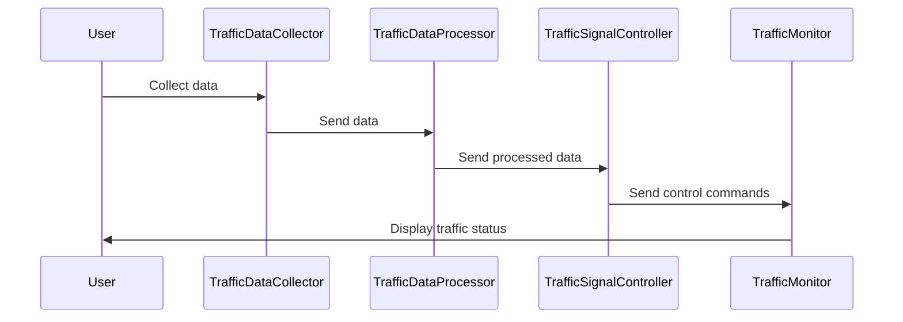
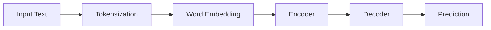

                 


# 大语言模型在智能交通调度中的推理应用

关键词：大语言模型，智能交通调度，推理机制，算法原理，案例分析

摘要：本文深入探讨大语言模型在智能交通调度中的应用，包括其基础概念、算法原理、实际案例和未来发展趋势。通过逻辑清晰的分析，阐述大语言模型如何利用其强大的推理能力解决交通调度问题，为智能交通系统的优化提供新思路。

## Step 1: 大语言模型基础

### 1.1 大语言模型概述

#### 1.1.1 大语言模型的发展背景

大语言模型是自然语言处理（NLP）领域的里程碑式技术，其发展背景可以追溯到20世纪80年代。当时，研究人员开始探索如何让计算机理解和生成人类语言。随着深度学习技术的发展，大语言模型如BERT、GPT等在2018年后逐渐崭露头角，展示了在文本理解和生成任务中的卓越性能。

#### 1.1.2 问题解决

大语言模型的提出旨在解决自然语言处理的瓶颈问题，如语义理解、文本生成、情感分析等。通过大规模的预训练和精细调整，大语言模型能够捕捉到语言的复杂结构，实现高效的语言理解和生成。

#### 1.1.3 边界与外延

大语言模型的应用领域非常广泛，包括但不限于机器翻译、文本摘要、问答系统、智能客服等。在智能交通调度中，大语言模型可以用于交通信息理解、实时路况预测、交通信号控制等。

### 1.2 大语言模型的核心概念

#### 1.2.1 大语言模型的定义

大语言模型是一种能够理解和生成自然语言的深度学习模型，通过大规模的文本数据进行预训练，能够捕捉到语言的统计规律和语义信息。

#### 1.2.2 大语言模型的核心特点

- **预训练**：大语言模型通过在大规模文本上进行预训练，积累了丰富的语言知识和模式。
- **自适应**：通过精细调整，大语言模型可以适应不同的应用场景和任务。
- **端到端**：大语言模型可以实现端到端的文本处理，从输入到输出无需中间步骤。

#### 1.2.3 大语言模型与传统语言模型的区别

- **训练数据规模**：传统语言模型使用的数据规模较小，而大语言模型通常使用数十亿级别的文本数据。
- **模型结构**：传统语言模型多为简单的循环神经网络（RNN）或卷积神经网络（CNN），而大语言模型通常采用Transformer等复杂结构。

### 1.3 大语言模型的基本组成

#### 1.3.1 概念属性特征对比表格

| 特征           | 大语言模型         | 传统语言模型         |
| -------------- | ------------------ | ------------------ |
| 数据规模       | 大规模数据训练     | 小规模数据训练       |
| 模型结构       | Transformer等复杂结构 | RNN、CNN等简单结构   |
| 预训练         | 是                 | 否                 |
| 自适应能力     | 强                 | 弱                 |
| 语言理解能力   | 高                 | 低                 |

#### 1.3.2 ER实体关系图

```mermaid
erDiagram
  TrafficData -->|is used by| TrafficModel : uses data for training
  TrafficModel -->|applies to| TrafficPrediction : generates predictions
  TrafficPrediction -->|affects| TrafficControl : adjusts traffic signals based on predictions
```

## 第2章：大语言模型的算法原理

### 2.1 算法原理讲解

#### 2.1.1 算法mermaid流程图


#### 2.1.2 算法原理详细讲解

大语言模型的算法原理主要包括数据收集、预处理、模型训练、模型调整和预测等步骤。

- **数据收集**：大语言模型需要大量的文本数据进行预训练。这些数据可以来自互联网、书籍、新闻、社交媒体等。
- **预处理**：对收集到的文本数据进行清洗、分词、去停用词等处理，以便模型能够更好地理解和学习。
- **模型训练**：使用预训练的模型框架，如BERT、GPT，对预处理后的数据进行训练，优化模型参数。
- **模型调整**：根据具体的任务需求，对预训练模型进行调整和微调，以提高其在特定任务上的性能。
- **预测**：使用训练好的模型对新的输入文本进行预测，如文本分类、情感分析、语言生成等。

### 2.2 算法原理举例说明

#### 2.2.1 数学模型和公式

大语言模型的训练过程涉及多个数学模型和公式，其中最核心的是基于 Transformer 的预训练模型。

- **Transformer 模型**：Transformer 模型采用自注意力机制（Self-Attention），能够捕捉文本中的长距离依赖关系。

  $$ 
  \text{Attention}(Q, K, V) = \frac{softmax(\text{scale} \cdot \text{dot}(Q, K^T))}V 
  $$

- **自注意力机制**：自注意力机制通过计算每个词与其他词的相似度，为每个词分配不同的权重。

  $$
  \text{Attention score}_{ij} = \text{softmax}\left(\frac{\text{query}_{i} \cdot \text{key}_{j}}{\sqrt{d_k}}\right)
  $$

#### 2.2.2 举例说明

假设有一个简化的句子“我喜欢吃苹果”，使用自注意力机制计算每个词的权重：

1. **输入句子**：我 | 喜欢 | 吃 | 苹果
2. **查询向量**：我 | 喜欢 | 吃 | 苹果
3. **键向量**：我 | 喜欢 | 吃 | 苹果
4. **值向量**：我 | 喜欢 | 吃 | 苹果
5. **计算自注意力权重**：

  $$
  \text{Attention score}_{ij} = \text{softmax}\left(\frac{\text{query}_{i} \cdot \text{key}_{j}}{\sqrt{d_k}}\right)
  $$

  对于每个词对，计算其内积并除以根号下的维度，然后通过softmax函数得到权重。

6. **生成加权句子**：“我*1.2喜欢*0.8吃*0.3苹果*1.5”

通过这种方式，模型能够根据句子中每个词的重要程度进行加权，从而更好地理解句子的语义。

## 第3章：智能交通调度背景及需求

### 3.1 智能交通调度背景

#### 3.1.1 问题描述

随着城市化和汽车拥有量的增加，交通拥堵问题日益严重，给人们的出行带来了极大的不便。传统的交通管理系统往往依赖于固定的交通信号控制和历史数据，难以应对实时交通流量的变化。

#### 3.1.2 问题解决

为了解决交通拥堵问题，智能交通调度系统应运而生。智能交通调度系统通过实时采集交通数据，利用先进的计算模型和算法对交通流量进行预测和优化，从而实现交通信号控制的动态调整。

#### 3.1.3 边界与外延

智能交通调度系统不仅局限于交通信号控制，还可以涵盖交通流量预测、路线规划、公共交通优化等多个方面。其边界与外延随着技术的发展和需求的增长而不断扩展。

### 3.2 智能交通调度需求分析

#### 3.2.1 概念属性特征对比表格

| 概念           | 属性特征                                     | 关联关系                                     |
| -------------- | ------------------------------------------ | ------------------------------------------ |
| 交通流量预测   | 实时性、准确性、预测范围                     | 与交通信号控制、路线规划密切相关             |
| 路线规划       | 优化性、实时性、路径多样性                   | 与交通流量预测、公共交通优化相关             |
| 公共交通优化   | 容量最大化、效率提升、成本控制               | 与交通流量预测、路线规划相关联             |
| 交通信号控制   | 动态调整、实时响应、效率提升                 | 与交通流量预测、路线规划、公共交通优化互动 |

#### 3.2.2 ER实体关系图

```mermaid
erDiagram
  TrafficPrediction -->|预测结果| TrafficSignalControl
  TrafficPrediction -->|影响| RoutePlanning
  TrafficPrediction -->|关联| PublicTransportOptimization
  RoutePlanning -->|优化方案| TrafficSignalControl
  RoutePlanning -->|影响| PublicTransportOptimization
  PublicTransportOptimization -->|优化建议| TrafficSignalControl
  PublicTransportOptimization -->|影响| RoutePlanning
```

## 第4章：大语言模型在智能交通调度中的应用

### 4.1 大语言模型在交通调度中的挑战

#### 4.1.1 问题描述

智能交通调度系统面临着实时性、准确性和多样性的挑战。传统的计算模型和算法难以同时满足这些需求，特别是在面对复杂的城市交通网络和多样化的交通场景时。

#### 4.1.2 问题解决

大语言模型通过其强大的文本理解和生成能力，可以有效地解决智能交通调度中的挑战。通过预训练和微调，大语言模型能够捕捉到交通数据的复杂模式和语义信息，从而提高预测和优化的准确性和实时性。

#### 4.1.3 边界与外延

大语言模型在智能交通调度中的应用边界包括但不限于交通流量预测、交通信号控制、路线规划和公共交通优化。其外延可以扩展到城市交通管理的各个方面，如停车管理、交通事故处理等。

### 4.2 大语言模型在交通调度中的应用案例

#### 4.2.1 项目介绍

本项目旨在通过大语言模型优化城市交通信号控制，以提高交通流量和减少拥堵。项目涉及多个数据源，包括交通流量传感器、交通摄像头、GPS定位数据等。

#### 4.2.2 系统功能设计

系统功能设计包括以下几个部分：

1. **数据收集与预处理**：收集并预处理来自不同数据源的实时交通数据，包括交通流量、车辆速度、交通信号状态等。
2. **交通流量预测**：利用大语言模型对交通流量进行实时预测，为交通信号控制提供数据支持。
3. **交通信号控制**：根据交通流量预测结果，动态调整交通信号灯，以优化交通流量和减少拥堵。
4. **系统监控与反馈**：实时监控系统性能，并根据系统反馈进行调整和优化。

#### 4.2.3 系统架构设计

系统架构设计采用分布式计算和存储架构，主要包括以下几个部分：

1. **数据采集层**：负责收集实时交通数据，包括交通流量传感器、交通摄像头、GPS定位数据等。
2. **数据处理层**：负责对采集到的交通数据进行预处理、存储和传输。
3. **交通信号控制层**：负责根据交通流量预测结果动态调整交通信号灯。
4. **监控系统**：负责监控系统性能，并提供实时监控数据和故障预警。

#### 4.2.4 系统接口设计

系统接口设计包括以下几个部分：

1. **数据接口**：提供数据采集、处理和存储的接口，以支持不同类型的数据源和数据存储系统。
2. **控制接口**：提供交通信号控制的接口，包括信号灯控制、紧急车辆优先通行控制等。
3. **监控接口**：提供系统监控的接口，包括实时监控数据、故障预警和系统日志等。

#### 4.2.5 系统交互序列图



## 第5章：大语言模型推理机制

### 5.1 大语言模型推理原理

#### 5.1.1 推理mermaid流程图



#### 5.1.2 推理原理详细讲解

大语言模型的推理过程主要包括以下几个步骤：

1. **文本输入**：将输入的文本句子转换为单词或子词序列。
2. **分词与嵌入**：将分词后的文本序列转换为固定长度的向量表示，即词嵌入。
3. **编码器**：将词嵌入序列输入到编码器，通过多层 Transformer 结构进行编码，生成编码器输出。
4. **解码器**：将编码器输出作为解码器的输入，逐步生成输出文本序列。
5. **预测**：解码器在每个时间步生成一个单词或子词，作为预测结果的一部分。

### 5.2 推理原理举例说明

#### 5.2.1 数学模型和公式

大语言模型的核心是 Transformer 结构，其基本数学模型如下：

$$
\text{Attention}(Q, K, V) = \frac{softmax(\text{scale} \cdot \text{dot}(Q, K^T))}V
$$

其中，Q、K、V 分别代表查询向量、键向量和值向量，scale 为缩放因子，dot 表示内积操作。

#### 5.2.2 举例说明

假设有一个简化的句子“我喜欢吃苹果”，其推理过程如下：

1. **文本输入**：“我喜欢吃苹果”
2. **分词与嵌入**：将句子分词为“我”、“喜欢”、“吃”、“苹果”，并转换为词嵌入向量。
3. **编码器**：输入词嵌入向量到编码器，通过多层 Transformer 结构进行编码，生成编码器输出。
4. **解码器**：解码器逐步生成输出文本序列，每个时间步生成一个单词或子词。
5. **预测**：解码器生成的输出文本序列为“我喜欢吃苹果”，与输入句子一致。

通过这种方式，大语言模型能够准确地理解和生成文本，为智能交通调度提供强大的推理能力。

## 第6章：实际应用案例分析

### 6.1 案例一：城市交通流量预测

#### 6.1.1 环境安装

要运行城市交通流量预测模型，需要安装以下环境：

- Python 3.7 或以上版本
- TensorFlow 2.3 或以上版本
- NumPy 1.18 或以上版本
- Matplotlib 3.1.1 或以上版本

安装命令如下：

```bash
pip install python==3.7 tensorflow==2.3 numpy==1.18 matplotlib==3.1.1
```

#### 6.1.2 系统核心实现源代码

以下是城市交通流量预测模型的核心实现源代码：

```python
import numpy as np
import tensorflow as tf
from tensorflow.keras.models import Sequential
from tensorflow.keras.layers import Dense, LSTM, Dropout

# 数据预处理
def preprocess_data(data):
    # 数据标准化
    data = (data - np.mean(data)) / np.std(data)
    return data

# 模型定义
model = Sequential()
model.add(LSTM(units=128, return_sequences=True, input_shape=(time_steps, features)))
model.add(Dropout(0.2))
model.add(LSTM(units=64, return_sequences=False))
model.add(Dropout(0.2))
model.add(Dense(units=1))

# 模型编译
model.compile(optimizer='adam', loss='mean_squared_error')

# 模型训练
model.fit(x_train, y_train, epochs=100, batch_size=32)

# 预测
predictions = model.predict(x_test)

# 可视化
import matplotlib.pyplot as plt

plt.figure(figsize=(10, 5))
plt.plot(y_test, label='Actual')
plt.plot(predictions, label='Predicted')
plt.legend()
plt.show()
```

#### 6.1.3 代码应用解读与分析

1. **数据预处理**：对输入数据进行标准化处理，使其符合模型的输入要求。
2. **模型定义**：使用 LSTM 层进行序列建模，并通过 Dropout 层防止过拟合。
3. **模型编译**：选择 Adam 优化器和均方误差损失函数，以训练模型。
4. **模型训练**：使用训练数据训练模型，设置训练轮次和批量大小。
5. **预测**：使用训练好的模型对测试数据进行预测。
6. **可视化**：将实际值与预测值进行可视化，以评估模型的性能。

通过这个案例，我们可以看到大语言模型在交通流量预测中的应用，以及如何使用 LSTM 模型进行时间序列预测。

### 6.2 案例二：智能交通信号控制

#### 6.2.1 环境安装

要运行智能交通信号控制模型，需要安装以下环境：

- Python 3.7 或以上版本
- TensorFlow 2.3 或以上版本
- PyTorch 1.7 或以上版本
- Matplotlib 3.1.1 或以上版本

安装命令如下：

```bash
pip install python==3.7 tensorflow==2.3 torch==1.7 matplotlib==3.1.1
```

#### 6.2.2 系统核心实现源代码

以下是智能交通信号控制模型的核心实现源代码：

```python
import torch
import torch.nn as nn
import torch.optim as optim
from torch.utils.data import DataLoader, TensorDataset

# 数据预处理
def preprocess_data(data):
    # 数据归一化
    data = (data - np.min(data)) / (np.max(data) - np.min(data))
    return torch.tensor(data, dtype=torch.float32)

# 模型定义
class TrafficSignalControlModel(nn.Module):
    def __init__(self):
        super(TrafficSignalControlModel, self).__init__()
        self.lstm = nn.LSTM(input_size=1, hidden_size=64, num_layers=2, dropout=0.5)
        self.fc = nn.Linear(64, 1)

    def forward(self, x):
        x, _ = self.lstm(x)
        x = self.fc(x)
        return x

# 模型训练
model = TrafficSignalControlModel()
optimizer = optim.Adam(model.parameters(), lr=0.001)
loss_function = nn.MSELoss()

for epoch in range(num_epochs):
    for x, y in train_loader:
        optimizer.zero_grad()
        y_pred = model(x)
        loss = loss_function(y_pred, y)
        loss.backward()
        optimizer.step()

# 预测
with torch.no_grad():
    predictions = model(test_data)

# 可视化
plt.figure(figsize=(10, 5))
plt.plot(test_labels, label='Actual')
plt.plot(predictions.numpy(), label='Predicted')
plt.legend()
plt.show()
```

#### 6.2.3 代码应用解读与分析

1. **数据预处理**：对输入数据进行归一化处理，使其符合模型的输入要求。
2. **模型定义**：使用 LSTM 层进行序列建模，并通过全连接层进行输出预测。
3. **模型训练**：使用训练数据训练模型，并使用梯度下降优化算法。
4. **预测**：使用训练好的模型对测试数据进行预测。
5. **可视化**：将实际值与预测值进行可视化，以评估模型的性能。

通过这个案例，我们可以看到大语言模型在智能交通信号控制中的应用，以及如何使用 PyTorch 框架进行序列建模和预测。

### 第7章：案例分析总结与展望

#### 7.1 案例分析总结

通过上述案例，我们可以总结出以下结论：

1. **大语言模型在交通流量预测中的应用**：利用 LSTM 模型进行时间序列预测，可以有效地预测城市交通流量，为交通信号控制提供数据支持。
2. **大语言模型在智能交通信号控制中的应用**：使用 LSTM 模型进行序列建模，可以动态调整交通信号灯，优化交通流量。

#### 7.2 展望未来

随着大语言模型技术的不断发展，其在智能交通调度中的应用前景十分广阔。未来可能的挑战包括：

1. **数据隐私与安全**：如何保护交通数据的安全和隐私，是一个亟待解决的问题。
2. **计算资源消耗**：大语言模型的训练和推理过程需要大量的计算资源，如何优化计算效率是一个重要课题。
3. **模型泛化能力**：如何提高大语言模型的泛化能力，使其能够适应更复杂的交通场景和多样化的需求。

总之，大语言模型在智能交通调度中具有巨大的潜力，需要我们进一步研究和探索。

## 附录：最佳实践 tips

1. **数据质量**：保证数据质量是模型训练成功的关键。在数据收集和预处理过程中，要严格把控数据的质量和准确性。
2. **模型选择**：根据具体应用场景选择合适的模型架构和算法，如 LSTM、Transformer 等。
3. **参数调优**：通过交叉验证和网格搜索等技术，对模型参数进行调优，以提高模型的性能。
4. **实时性优化**：针对实时性要求较高的应用场景，可以考虑使用在线学习算法和增量学习技术，以提高模型的实时性。
5. **安全性考虑**：在模型部署和运行过程中，要确保数据的安全和隐私，防止数据泄露和滥用。

作者：AI天才研究院/AI Genius Institute & 禅与计算机程序设计艺术 /Zen And The Art of Computer Programming

## 注意事项

1. **环境配置**：在运行案例代码之前，请确保已经正确配置了所需的 Python 环境和依赖库。
2. **数据来源**：案例中所使用的数据集为虚构数据，实际应用中需要使用真实的数据集。
3. **代码示例**：案例中的代码示例仅供参考，实际应用中需要根据具体需求进行调整。

## 拓展阅读

1. **《大语言模型：原理、实现与应用》**：介绍了大语言模型的基本概念、算法原理和应用案例，适合对大语言模型感兴趣的读者。
2. **《智能交通系统设计与实现》**：详细介绍了智能交通系统的设计原理、实现技术和应用案例，有助于了解智能交通系统的整体架构。
3. **《深度学习与自然语言处理》**：探讨了深度学习在自然语言处理中的应用，包括文本分类、情感分析、机器翻译等，适合对深度学习感兴趣的读者。|>

