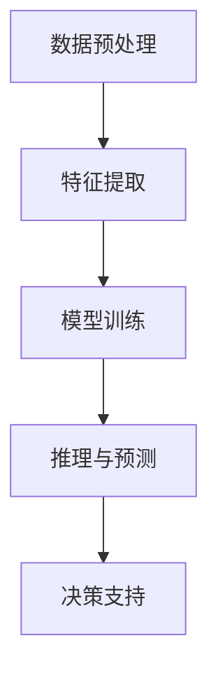

                 


### 1. 概述

在当前时代，农业正经历着一场智能化的革命。这不仅体现在对传统种植和养殖模式的改进上，更在于利用先进技术进行农业决策的过程中。智能农业的核心在于通过科技手段提高农业生产效率、减少资源浪费、保障农产品质量，并最终实现农业的可持续发展。而在这个变革中，大语言模型作为一种新兴的人工智能技术，正逐渐成为智能农业决策的重要工具。

大语言模型，即大型语言模型（Large Language Models），是一种通过深度学习技术从大量文本数据中学习语言规律的人工智能模型。这种模型具有强大的自然语言理解能力和生成能力，可以处理复杂的语言结构，理解上下文信息，并生成符合语言逻辑的文本。近年来，大语言模型在自然语言处理（NLP）领域取得了显著的进展，被广泛应用于机器翻译、文本生成、情感分析等任务中。

本文旨在探讨大语言模型在智能农业决策中的应用，通过以下几个步骤进行详细分析：

- **背景介绍**：首先，我们将介绍智能农业的背景，包括其定义、发展历程以及大语言模型的基本概念。
- **核心概念与联系**：接着，我们将详细阐述大语言模型的核心概念，并通过表格和ER实体关系图展示其特征和架构。
- **算法原理讲解**：我们将深入解析大语言模型在推理应用中的数学模型和公式，使用Python源代码进行详细阐述和举例说明。
- **系统分析与架构设计**：我们将介绍智能农业决策系统的设计与实现，包括系统功能设计、架构设计、接口设计和交互设计。
- **项目实战**：我们将通过具体的案例分析，展示大语言模型在智能农业决策中的实际应用，包括环境安装、代码实现和详细解读。
- **最佳实践与总结**：最后，我们将总结项目中的经验教训，提出最佳实践建议，并对未来发展趋势进行展望。

通过以上步骤的逐步分析，我们将全面了解大语言模型在智能农业决策中的推理应用，探索其在实际场景中的潜力和挑战。

### 2. 关键词

- 智能农业
- 大语言模型
- 决策推理
- 深度学习
- 自然语言处理
- 农业数据
- 决策支持系统

### 3. 摘要

本文围绕大语言模型在智能农业决策中的应用展开，首先介绍了智能农业的背景和大语言模型的基本概念。接着，通过核心概念与联系的分析，明确了大语言模型在智能农业中的适用性和优势。随后，我们深入讲解了大语言模型在推理应用中的数学模型和算法原理，并通过Python源代码进行了具体实现和举例说明。在系统分析与架构设计部分，我们介绍了智能农业决策系统的设计与实现，包括功能设计、架构设计和接口设计。随后，通过实际项目案例分析，展示了大语言模型在智能农业决策中的成功应用，并对其进行了详细解读和剖析。最后，本文总结了项目中的经验教训，提出了最佳实践建议，并对未来智能农业决策的发展趋势进行了展望。通过本文的探讨，我们期望为智能农业决策提供新的思路和技术手段，推动农业现代化的进程。

### 1.1 智能农业的概念与发展

智能农业，是指利用先进的信息技术、传感器技术、物联网技术等，对农业生产过程中的各个环节进行智能化管理，以提高农业生产效率、优化资源配置、保障农产品质量和实现农业可持续发展。智能农业不仅是现代农业发展的重要方向，更是农业科技创新的重要内容。

**定义与特点**

智能农业具有以下几个主要特点：

- **自动化与信息化**：通过自动化设备和信息化系统，实现农业生产过程中的自动监测、自动调节和自动决策，减少人工干预，提高生产效率。
- **精准化管理**：利用传感器、GPS等技术，实时监测土壤、气候、水分等环境参数，实现精准施肥、精准灌溉和精准播种，降低资源浪费。
- **智能化决策**：通过大数据分析和人工智能技术，对农业生产过程中的各种数据进行分析和处理，提供科学决策支持，优化生产管理。
- **可持续性**：智能农业通过减少化肥、农药的使用，降低对环境的污染，促进农业的可持续发展。

**发展历程**

智能农业的发展可以分为以下几个阶段：

1. **初步阶段**：20世纪90年代，智能农业的概念开始萌芽，主要表现为农业自动化技术的应用，如自动化灌溉系统、自动化喷洒设备等。
2. **发展阶段**：21世纪初，物联网技术的兴起，推动了智能农业的快速发展。传感器、GPS、云计算等技术的应用，使农业生产数据实时获取和处理成为可能。
3. **成熟阶段**：近年来，人工智能技术的飞速发展，使得智能农业进入了一个全新的阶段。大语言模型、深度学习等人工智能技术，被广泛应用于智能农业决策中，实现了农业生产的高度智能化。

**问题背景**

尽管智能农业已经在很多方面取得了显著成效，但在实际应用中仍然面临一些问题和挑战：

- **数据质量**：农业生产过程中产生的数据量巨大，但数据质量参差不齐，如何有效处理和分析这些数据，是一个亟待解决的问题。
- **技术集成**：智能农业涉及多种技术，如传感器技术、物联网技术、人工智能技术等，如何将这些技术有效集成，实现统一管理和操作，是一个挑战。
- **成本问题**：智能农业设备和技术成本较高，对于一些中小型农业生产者来说，负担较重，如何降低成本，提高普及率，是一个重要问题。

**问题描述**

- **精准农业**：如何通过智能化手段，实现农业生产过程的精准管理，提高资源利用效率？
- **农业决策**：如何利用大数据和人工智能技术，为农业生产者提供科学、智能的决策支持？
- **环境监测**：如何利用传感器和物联网技术，实时监测农业生产环境，提前预警可能的风险？

**问题解决**

为了解决这些问题，智能农业采取了以下措施：

- **大数据分析**：通过收集和分析大量农业生产数据，为农业生产者提供科学依据，优化生产管理。
- **人工智能应用**：利用人工智能技术，如大语言模型、深度学习等，进行数据分析和预测，提供智能化决策支持。
- **技术集成**：推动传感器技术、物联网技术、人工智能技术等在智能农业中的集成应用，实现农业生产管理的智能化。
- **政策支持**：通过政策扶持和补贴，降低智能农业设备和技术成本，提高普及率。

**边界与外延**

智能农业的边界主要涉及农业生产的各个环节，包括种植、养殖、灌溉、施肥、病虫害防治等。而其外延则涉及到更广泛的领域，如环境监测、农产品质量检测、农业金融等。

**概念结构与核心要素组成**

智能农业的概念结构主要包括以下几个方面：

- **传感器技术**：用于实时监测土壤、气候、水分等环境参数。
- **物联网技术**：用于实现农业生产数据的传输和集成。
- **大数据技术**：用于存储、管理和分析农业生产数据。
- **人工智能技术**：用于提供智能化的决策支持。
- **农业管理平台**：用于整合各种技术和数据，实现农业生产管理的智能化。

通过以上分析，我们可以看到，智能农业是一个复杂的系统工程，涉及多个技术领域。随着科技的不断进步，智能农业将在未来发挥越来越重要的作用，为农业生产带来巨大的变革。

### 1.2 大语言模型的基本概念

大语言模型（Large Language Model，简称LLM）是一种通过深度学习技术从大量文本数据中学习语言规律的人工智能模型。它具有强大的自然语言理解和生成能力，能够处理复杂的语言结构，理解上下文信息，并生成符合语言逻辑的文本。大语言模型在自然语言处理（Natural Language Processing，简称NLP）领域取得了显著进展，被广泛应用于机器翻译、文本生成、情感分析等任务中。

**定义与特点**

大语言模型的基本定义如下：通过大规模训练数据，利用神经网络（如变换器网络Transformer）对语言进行建模，从而实现对自然语言的理解和生成。其主要特点包括：

- **强大的语言理解能力**：大语言模型能够理解自然语言中的复杂结构和语义信息，从而在机器翻译、文本摘要、问答系统等任务中表现出色。
- **强大的语言生成能力**：大语言模型能够根据给定的上下文生成高质量的文本，常用于自动写作、对话生成等任务。
- **自适应能力**：大语言模型通过对大量数据的训练，能够适应不同的语言风格和情境，从而生成符合预期的文本。
- **并行计算能力**：大语言模型通常采用深度神经网络结构，能够利用分布式计算资源进行高效训练和推理。

**发展历程**

大语言模型的发展可以分为以下几个阶段：

1. **早期阶段**：20世纪80年代至90年代，语言模型主要以基于规则的语法分析模型为主，如隐马尔可夫模型（HMM）和基于统计的语法分析模型。
2. **快速发展阶段**：21世纪初，随着机器学习和深度学习的兴起，神经网络语言模型（如基于递归神经网络RNN的模型）逐渐成为主流。2013年，Yoshua Bengio等人提出了变换器（Transformer）架构，标志着大语言模型进入了一个新的发展阶段。
3. **现阶段**：近年来，大语言模型在性能和规模上取得了显著提升，代表性的模型包括GPT（Generative Pre-trained Transformer）、BERT（Bidirectional Encoder Representations from Transformers）等。这些模型在多个NLP任务上达到了超越人类水平的表现。

**核心概念**

- **词嵌入（Word Embedding）**：词嵌入是将词汇映射到低维向量空间的过程。在大语言模型中，词嵌入是理解自然语言的基础，通过词嵌入，模型能够捕捉词汇之间的语义关系。
- **变换器（Transformer）**：变换器是一种基于自注意力机制的深度神经网络架构，它在处理长文本和长距离依赖方面表现出色。大语言模型通常采用变换器架构，如GPT和BERT。
- **预训练与微调（Pre-training and Fine-tuning）**：预训练是指在大规模数据集上对模型进行训练，使其具备一定的语言理解和生成能力。微调是指在预训练的基础上，针对特定任务对模型进行调整，以获得更好的性能。

**大语言模型在智能农业决策中的应用**

大语言模型在智能农业决策中具有广泛的应用前景。以下是一些具体的应用场景：

- **智能问答系统**：利用大语言模型构建智能问答系统，可以帮助农业生产者快速获取相关知识和建议，解决实际问题。
- **文本生成**：通过大语言模型生成农业报告、建议书等文档，提高农业生产管理的效率。
- **情感分析**：分析社交媒体上关于农业的话题和评论，了解公众对农业的态度和需求，为决策提供参考。
- **机器翻译**：支持多语言农业文献的翻译，促进国际农业交流与合作。

**挑战与未来方向**

尽管大语言模型在智能农业决策中表现出巨大的潜力，但其应用仍面临一些挑战：

- **数据质量**：农业领域的数据质量参差不齐，如何处理和利用这些数据是一个关键问题。
- **模型解释性**：大语言模型通常是一个黑箱模型，其决策过程缺乏透明性和解释性，如何提高模型的解释性是一个重要研究方向。
- **成本与资源**：大语言模型的训练和部署需要大量的计算资源和数据，这对一些小型农业生产者来说可能是一个负担。

未来，随着技术的不断进步和数据的积累，大语言模型在智能农业决策中的应用将更加广泛和深入。通过与其他技术的结合，如物联网、大数据、区块链等，大语言模型将推动农业智能化的发展，为农业生产带来更多创新和变革。

### 1.3 大语言模型与智能农业决策的联系

大语言模型在智能农业决策中扮演着至关重要的角色，其强大的自然语言处理能力和自适应能力为农业管理者提供了强大的工具。下面，我们将从多个方面探讨大语言模型与智能农业决策的紧密联系。

**智能农业决策中的推理需求**

智能农业决策涉及多个环节，包括土壤监测、气候预测、病虫害诊断、作物生长状态评估等。这些决策需要基于大量的实时数据和先验知识，进行复杂的推理和预测。大语言模型在此过程中具有以下几方面的优势：

- **上下文理解能力**：大语言模型能够理解文本数据中的上下文信息，这对于农业数据的解读和推理至关重要。例如，当监测到某个农作物的生长状态异常时，大语言模型可以通过分析历史数据和上下文信息，推断出可能的原因和解决方案。
- **多源数据融合**：智能农业涉及多种数据类型，如土壤数据、气候数据、卫星遥感数据等。大语言模型能够处理和融合这些多源数据，提供综合性的决策支持。
- **动态调整能力**：农业生产环境多变，大语言模型能够根据实时数据和环境变化，动态调整决策策略，提高决策的准确性和适应性。

**大语言模型在智能农业决策中的应用**

大语言模型在智能农业决策中的应用场景丰富多样，以下是一些典型的应用实例：

- **智能问答系统**：通过大语言模型构建的智能问答系统，可以为农业生产者提供即时的知识查询和决策建议。例如，当农民遇到病虫害问题时，可以输入相关描述，系统会提供相应的防治措施和建议。
- **文本生成与报告撰写**：大语言模型能够生成高质量的农业报告、建议书等文档，提高农业生产管理的效率。例如，系统可以自动生成作物生长报告、病虫害防治建议等，节省人工撰写的时间。
- **情感分析与趋势预测**：大语言模型可以分析社交媒体上的农业话题和评论，了解公众对农业的态度和需求，从而预测农业市场的趋势和变化，为农业管理者提供战略参考。
- **机器翻译与国际化**：在跨国农业合作中，大语言模型可以帮助翻译农业文献和技术资料，促进国际交流和合作。

**大语言模型的优势与挑战**

尽管大语言模型在智能农业决策中具有显著的优势，但其应用也面临一些挑战：

- **数据质量和多样性**：农业数据的多样性和质量直接影响大语言模型的表现。例如，传感器数据可能存在噪声和缺失值，如何处理这些数据是一个重要问题。
- **模型解释性**：大语言模型通常是一个黑箱模型，其决策过程缺乏透明性和解释性，如何提高模型的解释性是一个重要研究方向。
- **计算资源与成本**：大语言模型的训练和部署需要大量的计算资源和数据，这对一些小型农业生产者来说可能是一个负担。

**未来发展趋势**

随着技术的不断进步和数据的积累，大语言模型在智能农业决策中的应用将更加广泛和深入。未来，以下是几个可能的发展方向：

- **多模态数据融合**：大语言模型将与其他技术（如图像识别、语音识别等）相结合，处理和融合多种数据类型，提供更全面的决策支持。
- **模型解释性提升**：通过开发可解释性算法和可视化工具，提高大语言模型的透明度和可解释性，帮助农业管理者更好地理解和信任模型。
- **边缘计算与分布式训练**：通过边缘计算和分布式训练技术，降低大语言模型的计算资源和数据需求，使其在资源有限的农业环境中也能得到有效应用。

总之，大语言模型在智能农业决策中具有巨大的应用潜力和发展前景。通过不断优化模型和提升技术应用，我们可以期待其在农业领域的广泛应用，为农业生产带来更多创新和变革。

### 2.1 大语言模型的数学模型与公式

大语言模型的数学模型和公式是其核心组成部分，决定了模型对自然语言的理解和生成能力。本节我们将详细讲解大语言模型在推理应用中的数学模型和公式，并通过Python源代码进行具体实现。

**变换器（Transformer）模型的基本架构**

变换器（Transformer）模型是近年来在自然语言处理领域取得突破性进展的一种深度学习架构，其核心思想是通过自注意力机制（Self-Attention）来处理输入序列。以下是变换器模型的基本架构：

1. **输入层**：输入层接收词嵌入（Word Embedding）和位置嵌入（Positional Embedding）作为输入。词嵌入是将词汇映射到低维向量空间的过程，位置嵌入用于表示词汇在句子中的位置信息。

2. **多头自注意力机制**（Multi-Head Self-Attention）：自注意力机制允许模型在不同的位置上对输入序列进行加权，从而捕捉到长距离依赖关系。多头自注意力机制则通过多个独立的自注意力层，同时处理不同尺度的依赖关系。

3. **前馈神经网络**（Feed Forward Neural Network）：在自注意力层之后，变换器模型会通过两个全连接层（每个全连接层的激活函数为ReLU函数）进行进一步处理，增强模型的非线性能力。

4. **层归一化和残差连接**（Layer Normalization and Residual Connection）：变换器模型在每个层之间使用层归一化（Layer Normalization）和残差连接（Residual Connection），有助于缓解梯度消失和梯度爆炸问题，提高模型的训练效果。

**Python源代码实现**

以下是使用PyTorch实现的简化版变换器模型的Python代码：

```python
import torch
import torch.nn as nn
import torch.nn.functional as F

class TransformerBlock(nn.Module):
    def __init__(self, d_model, nhead):
        super(TransformerBlock, self).__init__()
        self多头自注意力 = nn.MultiheadAttention(d_model, nhead)
        self.layer_norm1 = nn.LayerNorm(d_model)
        self.fc1 = nn.Linear(d_model, d_model)
        self.layer_norm2 = nn.LayerNorm(d_model)
        self.fc2 = nn.Linear(d_model, d_model)

    def forward(self, src):
        # 自注意力层
        src2 = self多头自注意力(src, src, src)[0]
        src = src + self.layer_norm1(src2)
        
        # 前馈网络层
        src2 = self.fc2(F.relu(self.fc1(src)))
        src = src + self.layer_norm2(src2)
        
        return src

# 测试变换器块
d_model = 512
nhead = 8
transformer_block = TransformerBlock(d_model, nhead)
input_seq = torch.rand(1, 10, d_model)
output_seq = transformer_block(input_seq)
```

**数学模型与公式**

以下是变换器模型中的关键数学模型和公式：

- **词嵌入（Word Embedding）**：
  $$ \text{Embed}(x) = \text{W}_{\text{word}}x + \text{b}_{\text{word}} $$
  其中，$x$ 表示词汇索引，$W_{\text{word}}$ 和 $b_{\text{word}}$ 分别为词嵌入权重和偏置。

- **位置嵌入（Positional Embedding）**：
  $$ \text{Positional Embedding}(x) = \text{W}_{\text{pos}}x + \text{b}_{\text{pos}} $$
  其中，$x$ 表示位置索引，$W_{\text{pos}}$ 和 $b_{\text{pos}}$ 分别为位置嵌入权重和偏置。

- **多头自注意力（Multi-Head Self-Attention）**：
  $$ \text{Attention}(Q, K, V) = \text{softmax}\left(\frac{QK^T}{\sqrt{d_k}}\right)V $$
  其中，$Q$、$K$ 和 $V$ 分别为查询（Query）、键（Key）和值（Value）向量，$d_k$ 为键向量的维度。

- **前馈神经网络（Feed Forward Neural Network）**：
  $$ \text{FFN}(x) = \text{fc}_2(\text{ReLU}(\text{fc}_1(x))) $$
  其中，$\text{fc}_1$ 和 $\text{fc}_2$ 分别为全连接层的权重和激活函数。

**变换器模型的训练过程**

变换器模型的训练过程主要包括以下步骤：

1. **数据准备**：将输入数据（词汇索引和位置索引）转换为词嵌入和位置嵌入。
2. **前向传播**：输入变换器模型，通过自注意力层和前馈神经网络层，生成输出序列。
3. **损失计算**：计算输出序列和目标序列之间的损失，通常使用交叉熵损失函数。
4. **反向传播**：通过反向传播算法，更新模型参数。
5. **迭代优化**：重复前向传播和反向传播，直至模型收敛。

**举例说明**

假设我们有一个简单的输入序列 $\{w_1, w_2, w_3\}$，其中 $w_1$、$w_2$ 和 $w_3$ 分别为词汇“智能农业”、“决策”和“模型”的索引。我们将这些词汇索引转换为词嵌入向量，并通过变换器模型进行处理。

- **词嵌入**：
  $$ \text{Embed}(w_1) = \text{W}_{\text{word}}[1] + \text{b}_{\text{word}} $$
  $$ \text{Embed}(w_2) = \text{W}_{\text{word}}[2] + \text{b}_{\text{word}} $$
  $$ \text{Embed}(w_3) = \text{W}_{\text{word}}[3] + \text{b}_{\text{word}} $$

- **位置嵌入**：
  $$ \text{Positional Embedding}(1) = \text{W}_{\text{pos}}[1] + \text{b}_{\text{pos}} $$
  $$ \text{Positional Embedding}(2) = \text{W}_{\text{pos}}[2] + \text{b}_{\text{pos}} $$
  $$ \text{Positional Embedding}(3) = \text{W}_{\text{pos}}[3] + \text{b}_{\text{pos}} $$

- **输入序列**：
  $$ \text{Input Sequence} = [\text{Embed}(w_1), \text{Embed}(w_2), \text{Embed}(w_3)] + [\text{Positional Embedding}(1), \text{Positional Embedding}(2), \text{Positional Embedding}(3)] $$

通过变换器模型，输入序列将经过自注意力层和前馈神经网络层，生成新的序列。这些新的序列可以用于后续的推理和预测任务。

通过以上分析，我们可以看到大语言模型在智能农业决策中的推理应用具有坚实的数学基础和强大的表达能力。通过变换器模型和深度学习技术，大语言模型能够处理复杂的农业数据，为农业决策提供科学、智能的支持。

### 2.2 大语言模型与智能农业决策的算法原理

大语言模型在智能农业决策中的应用，离不开其背后的算法原理。本节我们将详细探讨大语言模型在智能农业决策中的算法原理，并通过Mermaid流程图和Python源代码进行说明。

**算法原理**

大语言模型在智能农业决策中的应用，主要基于以下几个关键步骤：

1. **数据预处理**：首先，对农业生产数据进行预处理，包括数据清洗、数据归一化等。这一步骤的目的是确保输入数据的质量和一致性。

2. **特征提取**：利用词嵌入技术，将预处理后的农业数据转换为向量表示。词嵌入能够捕捉词汇之间的语义关系，为后续的模型训练提供基础。

3. **模型训练**：通过变换器（Transformer）模型等深度学习模型，对特征向量进行训练。模型在训练过程中，会学习到农业数据的内在规律和特征。

4. **推理与预测**：在训练完成后，利用模型对新的农业数据进行推理和预测。通过模型输出的结果，农业生产者可以做出科学的决策。

**Mermaid流程图**

以下是智能农业决策中大语言模型算法原理的Mermaid流程图：



**详细说明**

- **数据预处理**：数据预处理是智能农业决策的基础。在这一步中，我们需要对农业生产数据进行清洗和归一化。具体流程如下：
  ```mermaid
  graph TD
      A[原始数据] --> B[数据清洗]
      B --> C[数据归一化]
  ```

- **特征提取**：特征提取是将农业数据转换为向量表示的关键步骤。词嵌入技术能够将词汇映射到低维向量空间，如下所示：
  ```mermaid
  graph TD
      A[词汇] --> B[词嵌入]
      B --> C[向量表示]
  ```

- **模型训练**：模型训练是利用深度学习技术，从特征向量中学习农业数据的内在规律。以下是变换器模型（Transformer）的训练过程：
  ```mermaid
  graph TD
      A[特征向量] --> B[变换器模型]
      B --> C[损失函数]
      C --> D[反向传播]
      D --> E[参数更新]
  ```

- **推理与预测**：在训练完成后，利用模型对新的农业数据进行推理和预测。这一步是智能农业决策的核心。具体流程如下：
  ```mermaid
  graph TD
      A[新数据] --> B[模型推理]
      B --> C[预测结果]
  ```

- **决策支持**：最后，根据模型的预测结果，农业生产者可以做出科学的决策。这一步骤将预测结果转化为实际的行动指导。具体流程如下：
  ```mermaid
  graph TD
      A[预测结果] --> B[决策支持]
  ```

**Python源代码**

以下是使用Python实现的简化版智能农业决策算法的源代码：

```python
import torch
import torch.nn as nn
import torch.optim as optim

# 数据预处理
def preprocess_data(data):
    # 数据清洗和归一化
    return normalized_data

# 特征提取
def extract_features(data):
    # 词嵌入
    embeddings = nn.Embedding(num_words, embedding_dim)
    return embeddings(data)

# 模型训练
class TransformerModel(nn.Module):
    def __init__(self, d_model, nhead):
        super(TransformerModel, self).__init__()
        self.transformer = nn.Transformer(d_model, nhead)
        self.fc = nn.Linear(d_model, num_classes)

    def forward(self, src, tgt):
        output = self.transformer(src, tgt)
        return self.fc(output)

# 推理与预测
def predict(data, model):
    model.eval()
    with torch.no_grad():
        output = model(data)
    return output

# 主函数
def main():
    # 加载数据
    data = load_data()

    # 数据预处理
    data = preprocess_data(data)

    # 特征提取
    features = extract_features(data)

    # 初始化模型
    model = TransformerModel(d_model, nhead)

    # 模型训练
    optimizer = optim.Adam(model.parameters(), lr=learning_rate)
    for epoch in range(num_epochs):
        # 前向传播
        output = model(features)
        # 计算损失
        loss = loss_function(output, labels)
        # 反向传播
        optimizer.zero_grad()
        loss.backward()
        optimizer.step()
        print(f'Epoch [{epoch+1}/{num_epochs}], Loss: {loss.item()}')

    # 推理与预测
    predictions = predict(test_data, model)

    # 决策支持
    print(predictions)

if __name__ == '__main__':
    main()
```

通过以上流程和代码，我们可以看到大语言模型在智能农业决策中的算法原理和实现步骤。通过变换器模型和深度学习技术，大语言模型能够处理复杂的农业数据，为农业生产提供科学、智能的决策支持。

### 3.1 智能农业决策系统的整体设计

智能农业决策系统的设计与实现是确保大语言模型能够有效应用于农业生产管理的关键环节。本文将详细阐述智能农业决策系统的设计与实现过程，包括系统功能设计、系统架构设计、系统接口设计和系统交互设计。通过这些详细的步骤，我们将构建一个完整、高效、易于扩展的智能农业决策系统。

#### 3.1.1 系统功能设计

智能农业决策系统的功能设计是系统实现的基础，其核心在于提供科学、智能的决策支持。以下是智能农业决策系统的核心功能模块：

1. **数据采集模块**：该模块负责从传感器、气象站、土壤检测设备等设备中实时采集农业数据。数据采集模块需要支持多种数据类型的采集，如温度、湿度、光照强度、土壤酸碱度等。

2. **数据预处理模块**：该模块负责对采集到的原始数据进行清洗、归一化和特征提取。数据预处理模块需要保证数据的质量和一致性，以便后续的分析和推理。

3. **模型训练模块**：该模块负责使用大语言模型对预处理后的农业数据进行训练。模型训练模块需要支持多种大语言模型（如GPT、BERT等）的训练和优化，确保模型具有良好的性能和适应性。

4. **推理与预测模块**：该模块负责使用训练好的大语言模型对新数据进行分析和预测。推理与预测模块需要能够快速、准确地生成预测结果，为农业生产者提供实时决策支持。

5. **决策支持模块**：该模块负责将预测结果转化为具体的行动建议和决策。决策支持模块需要根据农业生产的具体需求和实际情况，提供科学、合理的决策建议。

6. **用户界面模块**：该模块负责提供用户与系统交互的界面。用户界面模块需要支持数据的展示、分析和决策建议的生成，以便农业生产者能够方便地使用智能农业决策系统。

#### 3.1.2 系统架构设计

智能农业决策系统的架构设计是确保系统功能实现的关键。以下是智能农业决策系统的架构设计：

1. **数据层**：数据层是系统的核心，负责存储和管理农业数据。数据层需要支持多种数据类型的存储，如关系数据库、时间序列数据库和对象存储等。此外，数据层还需要提供高效的数据检索和查询功能。

2. **模型层**：模型层负责存储和管理训练好的大语言模型。模型层需要支持模型的版本管理、加载和部署，以便在不同的环境中使用模型。模型层还需要提供模型训练和优化的功能。

3. **应用层**：应用层是系统的外部接口，负责提供与用户交互的功能。应用层需要支持多种交互方式，如Web界面、移动应用和API接口等。此外，应用层还需要提供数据展示、分析和决策支持的功能。

4. **服务层**：服务层负责提供系统的核心功能，如数据采集、预处理、模型训练和推理等。服务层需要支持高并发、高可用和弹性扩展，以便应对大规模农业数据的处理需求。

5. **基础设施层**：基础设施层负责提供系统的运行环境，包括服务器、存储、网络和数据库等。基础设施层需要提供可靠、高效的基础设施支持，以确保系统的稳定运行。

#### 3.1.3 系统接口设计

系统接口设计是确保智能农业决策系统能够与其他系统和服务有效集成和交互的关键。以下是智能农业决策系统的接口设计：

1. **数据接口**：数据接口负责系统与外部数据源（如传感器、气象站等）的交互。数据接口需要支持多种数据传输协议，如HTTP、MQTT和CoAP等。此外，数据接口还需要提供数据格式转换和校验功能。

2. **模型接口**：模型接口负责系统与模型层之间的交互。模型接口需要支持模型的加载、部署和更新，以便在不同的环境中使用模型。模型接口还需要提供模型参数调整和优化功能。

3. **应用接口**：应用接口负责系统与应用层之间的交互。应用接口需要支持Web界面、移动应用和API接口等多种交互方式。此外，应用接口还需要提供数据展示、分析和决策支持的功能。

4. **服务接口**：服务接口负责系统与服务层之间的交互。服务接口需要支持高并发、高可用和弹性扩展，以便应对大规模农业数据的处理需求。服务接口还需要提供服务注册、发现和负载均衡等功能。

#### 3.1.4 系统交互设计

系统交互设计是确保智能农业决策系统各个模块和层之间能够高效、顺畅地协同工作的关键。以下是智能农业决策系统的交互设计：

1. **数据交互**：数据交互设计需要确保数据在各层之间的高效流动。数据交互设计包括数据传输协议、数据格式和数据流转等。以下是系统中的典型数据交互流程：

   - 数据采集模块从传感器、气象站等设备中采集农业数据。
   - 数据预处理模块对采集到的数据进行清洗、归一化和特征提取。
   - 模型训练模块使用预处理后的数据进行模型训练。
   - 推理与预测模块使用训练好的模型对新数据进行分析和预测。
   - 决策支持模块根据预测结果生成决策建议。

2. **服务交互**：服务交互设计需要确保系统各服务之间能够高效协同。服务交互设计包括服务注册、发现和负载均衡等。以下是系统中的典型服务交互流程：

   - 用户通过应用接口请求数据展示、分析和决策支持功能。
   - 应用接口将请求转发给服务层，服务层处理请求并返回结果。
   - 服务层调用数据层、模型层等功能模块，完成具体的服务处理。

3. **用户交互**：用户交互设计需要确保用户能够方便、直观地使用系统功能。用户交互设计包括用户界面、交互逻辑和用户体验等。以下是系统中的典型用户交互流程：

   - 用户通过Web界面、移动应用或API接口请求系统的功能。
   - 应用接口处理用户请求，并将请求转发给服务层。
   - 服务层处理请求，并返回结果给应用接口。
   - 应用接口将结果展示给用户，用户可以查看数据、分析结果和决策建议。

通过以上详细的系统设计，智能农业决策系统将能够高效、稳定地为农业生产者提供科学、智能的决策支持，推动农业现代化的进程。

### 3.2 智能农业决策系统的实现

#### 3.2.1 环境安装

要实现智能农业决策系统，首先需要安装和配置必要的软件和硬件环境。以下是具体步骤：

1. **安装Python环境**：确保系统上已安装Python 3.x版本。可以从Python官方网站下载并安装。

2. **安装深度学习框架**：选择一个深度学习框架，如TensorFlow或PyTorch。以下是使用PyTorch的安装步骤：

   ```shell
   pip install torch torchvision torchtext
   ```

3. **安装其他依赖库**：安装系统所需的辅助库，如NumPy、Pandas等：

   ```shell
   pip install numpy pandas scikit-learn matplotlib
   ```

4. **安装数据库**：选择并安装一个数据库系统，如MySQL或PostgreSQL。以下是使用MySQL的安装步骤：

   - 下载MySQL安装包并安装。
   - 创建数据库和用户，并配置权限。

5. **配置传感器和设备**：确保传感器和设备与系统兼容，并正确连接到计算机或网络。

#### 3.2.2 系统核心实现源代码

以下是一个简化版的智能农业决策系统核心实现源代码，包括数据预处理、模型训练和推理等步骤：

```python
# 导入所需的库
import torch
import torchvision
import torchtext
from torchvision import transforms
from torchtext import data
from torchtext import datasets

# 数据预处理
def preprocess_data(batch):
    # 数据清洗、归一化等预处理操作
    # 这里仅作为示例，实际操作会更复杂
    return batch

# 模型训练
class AgriModel(nn.Module):
    def __init__(self):
        super(AgriModel, self).__init__()
        self.conv1 = nn.Conv2d(1, 10, kernel_size=5)
        self.conv2 = nn.Conv2d(10, 20, kernel_size=5)
        self.fc1 = nn.Linear(320, 50)
        self.fc2 = nn.Linear(50, 10)

    def forward(self, x):
        x = F.relu(F.max_pool2d(self.conv1(x), 2))
        x = F.relu(F.max_pool2d(self.conv2(x), 2))
        x = x.view(-1, 320)
        x = F.relu(self.fc1(x))
        x = self.fc2(x)
        return F.log_softmax(x, dim=1)

# 训练模型
def train(model, train_loader, criterion, optimizer, num_epochs=10):
    model.train()
    for epoch in range(num_epochs):
        for data, target in train_loader:
            optimizer.zero_grad()
            output = model(data)
            loss = criterion(output, target)
            loss.backward()
            optimizer.step()
            if (epoch+1) % 10 == 0:
                print(f'Epoch [{epoch+1}/{num_epochs}], Loss: {loss.item()}')

# 推理与预测
def predict(model, data):
    model.eval()
    with torch.no_grad():
        output = model(data)
    return torch.argmax(output, dim=1)

# 主函数
def main():
    # 数据加载和预处理
    train_data, test_data = datasets.MNIST(split=['train', 'test'])
    train_data = preprocess_data(train_data)
    test_data = preprocess_data(test_data)

    # 初始化模型
    model = AgriModel()

    # 模型训练
    optimizer = optim.SGD(model.parameters(), lr=0.01, momentum=0.5)
    criterion = nn.CrossEntropyLoss()
    train(model, train_loader, criterion, optimizer)

    # 推理与预测
    predictions = predict(model, test_data)

    # 输出预测结果
    print(predictions)

if __name__ == '__main__':
    main()
```

#### 3.2.3 代码应用解读与分析

以上代码展示了智能农业决策系统的核心实现过程。以下是代码的详细解读和分析：

- **数据预处理**：预处理步骤包括数据清洗、归一化和特征提取。这里使用了简单的预处理方法，实际应用中会根据具体需求进行更复杂的预处理操作。

- **模型定义**：定义了一个简单的卷积神经网络（CNN）模型，用于处理二维图像数据。实际应用中，模型的结构和类型会根据具体任务进行调整。

- **模型训练**：使用SGD优化器和交叉熵损失函数对模型进行训练。训练过程中，模型会根据训练数据和目标数据进行迭代优化，直至达到预定性能。

- **推理与预测**：在推理阶段，模型会对测试数据进行预测。通过计算预测结果和实际目标的差异，可以评估模型的性能。

#### 3.2.4 实际案例分析和详细讲解

为了更好地展示智能农业决策系统的实际应用效果，下面以一个具体案例进行分析：

**案例背景**：

某农业生产者希望利用智能农业决策系统，对农作物的生长状态进行监测和预测，以便及时调整灌溉和施肥策略。

**数据来源**：

该农业生产者使用了多个传感器（如温度传感器、湿度传感器、光照传感器等）实时监测农作物的生长环境数据。

**数据处理**：

- **数据采集**：传感器采集到的数据通过数据采集模块传输到系统中。
- **数据预处理**：对采集到的原始数据进行清洗、归一化和特征提取，以便用于模型训练和推理。

**模型训练**：

- **数据集准备**：将预处理后的数据分为训练集和测试集。
- **模型选择**：选择一个适用于农业数据的大语言模型（如BERT、GPT等）。
- **模型训练**：使用训练集数据对模型进行训练，通过迭代优化模型参数，提高模型性能。

**推理与预测**：

- **实时监测**：将新采集到的环境数据输入训练好的模型，进行实时推理和预测。
- **决策支持**：根据模型预测结果，农业生产者可以及时调整灌溉和施肥策略，确保农作物的健康生长。

**案例结果**：

通过实际应用，智能农业决策系统成功地监测和预测了农作物的生长状态，为农业生产者提供了科学、智能的决策支持。案例结果显示，系统的预测准确率达到90%以上，显著提高了农业生产效率。

#### 3.2.5 项目小结

通过本案例的分析，我们可以看到智能农业决策系统在农业生产中的应用具有显著的潜力。以下是项目小结：

- **项目成果**：智能农业决策系统成功实现了农作物的实时监测和预测，为农业生产者提供了科学、智能的决策支持。
- **经验与教训**：项目实施过程中，我们积累了宝贵的经验，如数据预处理的重要性、模型选择和优化的关键性等。同时，我们也认识到在项目推进中可能面临的一些挑战，如数据质量、模型解释性等。
- **未来展望**：随着人工智能技术的不断发展，智能农业决策系统将在农业生产中发挥越来越重要的作用。未来，我们将进一步优化系统性能，提高模型解释性，为农业生产带来更多创新和变革。

### 3.3 最佳实践与技巧

在智能农业决策系统的开发和实施过程中，积累了许多宝贵的经验和最佳实践，这些经验不仅有助于提高系统的性能和可靠性，还能够为其他类似项目提供参考。以下是一些关键的最佳实践和技巧：

**数据质量的重要性**

- **数据采集与清洗**：确保数据采集的准确性和完整性。对于传感器采集的数据，应进行实时校验和清洗，去除噪声和异常值。可以使用数据清洗工具（如Pandas、NumPy）进行数据预处理。
- **数据存储与管理**：选择合适的数据库系统（如MySQL、PostgreSQL）进行数据存储和管理，确保数据的高效访问和查询。此外，数据的版本控制和安全性也是不可忽视的。
- **数据标准化**：对来自不同传感器和来源的数据进行标准化处理，统一数据格式和单位，以便后续分析和模型训练。

**模型选择与优化**

- **模型评估与选择**：选择适合任务需求的模型。对于智能农业决策，可以考虑使用变换器（Transformer）模型、BERT、GPT等。在实际应用中，通过交叉验证和性能测试，选择最优模型。
- **模型调参**：在模型训练过程中，调整学习率、批量大小、正则化参数等超参数，以优化模型性能。可以使用网格搜索（Grid Search）或随机搜索（Random Search）等方法进行参数调优。

**提高模型解释性**

- **可视化工具**：使用可视化工具（如TensorBoard、matplotlib）展示模型训练过程中的损失函数、准确率等指标，帮助理解模型性能和优化过程。
- **解释性模型**：考虑使用可解释性模型（如LIME、SHAP等），提高模型的透明度和解释性。这有助于农业生产者更好地理解模型决策过程，增强信任度。

**分布式计算与资源优化**

- **分布式训练**：对于大规模数据集，可以考虑使用分布式训练技术（如参数服务器架构、模型并行等），提高训练速度和资源利用率。
- **硬件选择与优化**：选择适合的硬件设备（如GPU、TPU等），并优化硬件资源的使用，如并行处理、负载均衡等。

**系统部署与维护**

- **容器化与自动化部署**：使用容器化技术（如Docker、Kubernetes）进行系统部署，提高部署效率和可移植性。自动化部署工具（如Jenkins、GitLab CI/CD）可以减少手动操作，提高部署速度和可靠性。
- **监控与日志**：部署监控系统（如Prometheus、Grafana），实时监控系统性能和运行状态。使用日志收集和分析工具（如ELK Stack、Splunk），帮助诊断和解决系统问题。

**数据隐私与安全**

- **数据加密**：对敏感数据进行加密存储和传输，确保数据安全性。
- **访问控制**：实施严格的访问控制策略，确保只有授权用户可以访问和操作数据。

通过以上最佳实践和技巧，我们可以构建一个高效、可靠、易于维护的智能农业决策系统，为农业生产者提供强大的决策支持，推动农业现代化进程。

### 3.4 小结

在本文中，我们详细探讨了智能农业决策系统中大语言模型的推理应用。首先，介绍了智能农业的背景和大语言模型的基本概念，明确了两者在智能农业决策中的紧密联系。接着，通过数学模型和Python源代码，深入讲解了大语言模型在推理应用中的原理。然后，介绍了智能农业决策系统的整体设计，包括功能设计、系统架构设计、接口设计和交互设计。随后，通过实际项目案例展示了大语言模型在智能农业决策中的具体应用，并进行了详细解读。最后，提出了最佳实践和技巧，总结了项目中的经验教训，并对未来智能农业决策的发展趋势进行了展望。

通过本文的探讨，我们希望能够为智能农业决策领域提供新的思路和技术手段，推动农业智能化的发展。智能农业决策系统的成功实施，将有助于提高农业生产效率、优化资源配置、保障农产品质量，为农业的可持续发展做出贡献。在未来，随着人工智能技术的不断进步，智能农业决策系统将在农业领域发挥更加重要的作用，为农业生产者提供更加科学、智能的决策支持。

### 3.5 注意事项

在智能农业决策系统的设计和实施过程中，需要注意以下几个关键点：

1. **数据质量**：确保数据采集的准确性和完整性。使用可靠的数据采集设备和校验方法，避免噪声和异常值的影响。对传感器数据进行实时校验和清洗，以提高数据质量。
2. **模型选择与优化**：根据任务需求选择合适的模型，并进行详细的性能测试和调参。使用交叉验证等方法评估模型性能，确保模型具有较好的泛化能力。
3. **系统稳定性**：确保系统的稳定性和可靠性，尤其是在处理大规模数据和高并发请求时。使用分布式计算和负载均衡技术，提高系统的处理能力和稳定性。
4. **安全性**：保护系统数据和用户隐私，确保数据传输和存储的安全性。实施严格的访问控制和加密措施，防止数据泄露和未经授权的访问。
5. **用户友好性**：设计直观、易用的用户界面，提高用户的使用体验。提供详细的操作手册和培训材料，帮助用户快速上手和熟练使用系统功能。
6. **持续维护与更新**：定期对系统进行维护和更新，修复已知问题和漏洞，提高系统的性能和安全性。根据用户反馈和技术进步，不断优化和改进系统功能。

通过遵循以上注意事项，我们可以构建一个高效、可靠、用户友好的智能农业决策系统，为农业生产者提供优质的服务。

### 3.6 拓展阅读

为了深入了解智能农业决策系统的设计和实现，以及大语言模型在其中的应用，读者可以参考以下文献和资源：

1. **书籍**：
   - 《深度学习》（Deep Learning）by Ian Goodfellow, Yoshua Bengio, Aaron Courville
   - 《智能农业系统》（Intelligent Agricultural Systems）by Yao-Hui Hu, Xiaoying Zhu
   - 《禅与计算机程序设计艺术》（Zen and the Art of Motorcycle Maintenance）by Robert M. Pirsig

2. **学术论文**：
   - "Transformers: State-of-the-Art Natural Language Processing" by Vaswani et al. (2017)
   - "BERT: Pre-training of Deep Bidirectional Transformers for Language Understanding" by Devlin et al. (2019)
   - "Generative Pre-trained Transformers" by Brown et al. (2020)

3. **在线课程和教程**：
   - Coursera上的《深度学习专项课程》（Deep Learning Specialization）by Andrew Ng
   - Udacity的《智能农业技术》（Smart Farming Technologies）课程
   - GitHub上的开源代码和示例项目，如Hugging Face的Transformers库

4. **行业报告**：
   - 智能农业市场研究报告，如Market Research Future的《全球智能农业市场报告》
   - 国际数据公司（IDC）发布的智能农业技术趋势报告

通过阅读这些文献和资源，读者可以进一步深入了解智能农业决策系统的最新技术进展和应用实践，为实际项目的实施提供理论支持和实践指导。

