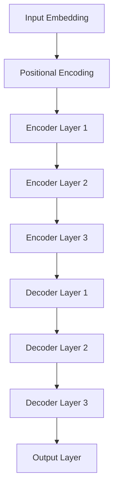

                 

## 第一部分：引言

### 第1章: 问题背景与核心概念

在当今全球数字化转型的浪潮中，智能制造作为工业4.0的核心，正逐渐改变着制造业的生产方式。智能制造通过高度集成的自动化、数据分析和人工智能技术，实现了生产过程的智能化优化，从而提高了生产效率、产品质量和资源利用率。然而，随着制造过程的复杂化，如何实现有效的优化成为了一个亟待解决的问题。

本章节将深入探讨智能制造中的一些核心问题和概念。首先，我们将介绍智能制造的基本背景，包括其发展的历史背景和当前的应用状况。接着，我们将讨论智能制造优化中的主要挑战，如生产过程的复杂性、数据的高维性和不确定性等。这些挑战对传统的优化方法提出了新的要求。

随后，我们将介绍大语言模型这一核心概念，并解释其在智能制造优化中的应用潜力。大语言模型是一种基于深度学习的技术，能够对大量文本数据进行处理和生成，具有强大的语义理解和推理能力。在大语言模型的框架下，我们将探讨其在智能制造优化中的各种应用场景，如预测与规划、质量检测与故障诊断、供应链管理和优化控制与自动化等。

最后，我们将讨论大语言模型的基本概念和其应用边界，并分析其与其他AI模型的关系，从而为后续章节的内容打下坚实的基础。

### 1.1.1 问题背景

智能制造是工业革命4.0的标志性技术，代表着制造领域从机械化、自动化向智能化转型的重要步骤。智能制造融合了物联网（IoT）、大数据分析、云计算、人工智能（AI）和区块链等多种先进技术，通过构建高度互联、自适应和智能化的生产系统，实现了生产过程的自动化、智能化和优化。

智能制造的发展历史可以追溯到20世纪末和21世纪初。随着计算机技术的飞速发展，生产自动化逐渐普及。进入21世纪，互联网和物联网技术的出现，使得设备之间能够实现实时数据交换和协同工作。随后，大数据和人工智能技术的引入，使得生产过程能够基于实时数据进行分析和优化，从而实现了真正的智能制造。

当前，智能制造在全球范围内得到了广泛应用，尤其是在制造业高度发达的国家和地区，如美国、德国、日本和中国。智能制造技术的应用，不仅提升了制造业的效率，还显著改善了产品质量和降低了生产成本。例如，通过采用工业机器人、自动化生产线和智能传感器，企业能够实现24/7不间断生产，减少了人为干预和错误率。同时，大数据分析使得生产过程的数据透明度提高，有助于快速识别和解决问题。

然而，智能制造的优化仍然面临许多挑战。首先，生产过程的复杂性增加，使得传统优化方法难以应对。生产流程中的各种变量相互作用，形成了复杂的多维系统，难以通过简单的数学模型进行描述。其次，数据的高维性也是一大挑战。智能制造过程中产生的数据量巨大，且数据维度多样，如何有效地处理和分析这些数据，是当前研究的热点问题。最后，不确定性是制造过程中普遍存在的现象，如设备故障、原材料质量波动和市场需求变化等，这些不确定性因素给智能制造的优化带来了极大的挑战。

面对这些挑战，传统的优化方法已经显得力不从心。因此，如何利用先进的人工智能技术，特别是大语言模型，来提高智能制造的优化效果，成为了一个亟待解决的问题。大语言模型具有强大的语义理解和推理能力，能够处理复杂、高维的数据，并在不同应用场景下进行自适应优化。因此，研究大语言模型在智能制造优化中的应用，有望为智能制造领域带来新的突破。

### 1.1.2 智能制造优化中的挑战

在智能制造领域，实现生产过程的优化面临着一系列复杂而严峻的挑战。这些挑战不仅影响了生产效率和产品质量，也对企业的竞争力产生了深远的影响。以下是智能制造优化中主要面临的几个挑战：

1. **生产过程的复杂性**：
   智能制造系统通常由多个相互关联的子系统组成，包括生产线、机器人、传感器、执行器等。这些子系统之间存在复杂的交互和耦合关系，使得生产过程的复杂性大幅增加。传统优化方法往往依赖于简化模型和线性假设，难以准确描述复杂系统的行为。因此，如何有效地建模和模拟复杂的生产过程，成为智能制造优化的一大难题。

2. **数据的高维性**：
   智能制造过程中会产生大量多维数据，包括传感器数据、设备运行数据、产品质量数据等。这些数据维度多样，且数据量巨大，传统的数据处理方法难以应对。如何从高维数据中提取有价值的信息，并利用这些信息进行优化决策，是智能制造优化中需要解决的核心问题。

3. **不确定性**：
   智能制造过程中存在多种不确定性因素，如设备故障、原材料质量波动、市场需求变化等。这些不确定性因素可能导致生产过程的波动和异常，影响生产效率和产品质量。如何应对这些不确定性，实现鲁棒优化，是智能制造优化的重要挑战。

4. **实时性**：
   智能制造系统需要具备实时响应能力，以适应不断变化的生产环境和需求。优化算法需要在短时间内完成数据处理、模型更新和决策生成，这对算法的计算效率和实时性提出了高要求。传统的优化方法往往计算复杂度高，难以满足实时性需求。

5. **系统集成与协同**：
   智能制造系统通常涉及多种技术，包括物联网、大数据、人工智能等。如何实现这些技术的有效集成和协同，构建统一、高效的智能制造系统，是智能制造优化中需要解决的关键问题。

6. **数据隐私与安全**：
   在智能制造过程中，大量的数据被采集、传输和处理，这涉及到数据隐私和安全问题。如何确保数据的安全性和隐私性，防止数据泄露和滥用，是智能制造优化中不可忽视的问题。

面对这些挑战，传统的优化方法已经显得力不从心。因此，研究利用先进的人工智能技术，特别是大语言模型，来提高智能制造的优化效果，显得尤为迫切和重要。大语言模型具备强大的语义理解和推理能力，能够在复杂、高维的数据环境中进行自适应优化，有望为智能制造领域带来新的突破。

### 1.1.3 大语言模型的基本概念

大语言模型（Large Language Model，简称LLM）是人工智能领域中的一项重要技术，它通过深度学习算法，对大量文本数据进行分析和处理，从而实现语言的生成和推理。大语言模型的核心在于其大规模的训练数据和复杂的神经网络结构，这使得它们能够在理解语义、生成文本和推理上下文中表现出色。

首先，大语言模型的工作原理是基于深度神经网络（DNN）和自注意力机制（Self-Attention）。在训练过程中，大语言模型通过不断调整神经网络中的参数，使其能够捕捉到文本数据中的潜在结构和语义信息。具体来说，模型首先输入一段文本数据，然后通过编码器（Encoder）将文本转化为高维向量表示，接着利用自注意力机制对向量进行加权，从而提取出文本中的重要信息。最后，通过解码器（Decoder）生成相应的输出文本。

大语言模型的训练数据通常来自于大量的互联网文本，如新闻文章、社交媒体帖子、电子书等。这些数据来源广泛，涵盖了各种主题和语境，使得大语言模型具有丰富的知识和广泛的语义理解能力。在训练过程中，模型会通过反向传播算法不断调整参数，以最小化预测误差。随着训练数据的增加和训练时间的延长，大语言模型的性能逐渐提升，能够生成更加准确和自然的文本。

大语言模型的主要优势在于其强大的语义理解和生成能力。首先，大语言模型能够理解文本中的隐含意义和上下文信息，这使得它们在生成文本时能够保持连贯性和合理性。例如，在问答系统中，大语言模型能够根据用户的问题生成相关且合理的回答。其次，大语言模型具有自适应学习能力，能够根据新的数据不断更新和优化自己的模型，从而适应不断变化的应用场景。

大语言模型在智能制造优化中的应用潜力巨大。首先，大语言模型能够处理和分析大量的文本数据，如设备日志、操作手册和质量报告等，从而提取出有价值的信息。这些信息可以为智能制造系统的优化提供重要的决策支持。例如，通过分析设备日志数据，大语言模型可以预测设备的故障，提前进行维护，减少停机时间和维护成本。其次，大语言模型能够在生产过程中生成自适应的优化策略，以适应不断变化的生产环境和需求。例如，在供应链管理中，大语言模型可以根据市场需求和库存信息，动态调整生产计划，优化资源配置，提高生产效率。

总的来说，大语言模型作为一种先进的人工智能技术，具备强大的语义理解和推理能力，能够在智能制造优化中发挥重要作用。通过深入研究和应用大语言模型，有望为智能制造领域带来新的突破，推动制造业的智能化和优化发展。

### 1.1.4 大语言模型的应用边界

虽然大语言模型在智能制造优化中展现出巨大的潜力，但它的应用也受到一定的边界限制。这些边界主要受限于数据质量、计算资源和实际应用场景。

首先，数据质量是大语言模型应用的关键因素之一。大语言模型的性能高度依赖于训练数据的质量，包括数据的一致性、准确性和多样性。在智能制造领域，数据质量往往受到设备精度、传感器可靠性和数据采集方法等多种因素的影响。例如，设备日志数据可能存在噪声、缺失值和异常值，这些都会影响大语言模型的训练效果和预测准确性。因此，确保数据质量是应用大语言模型的基础，需要进行数据清洗、预处理和增强。

其次，计算资源也是大语言模型应用的一个重要限制因素。大语言模型通常需要大量的计算资源和存储空间，尤其是训练阶段。随着模型规模和训练数据量的增加，所需的计算资源呈指数级增长。在实际应用中，许多企业可能无法承担高昂的硬件设备和运维成本。此外，实时性要求高的应用场景，如生产过程中的实时优化，需要大语言模型具备快速响应能力，这也对计算资源提出了更高要求。因此，如何优化模型结构、减少计算资源需求，是当前研究的重要方向。

最后，实际应用场景也决定了大语言模型的有效性。智能制造涉及多种复杂场景，如设备维护、生产调度、质量控制等。不同场景对大语言模型的需求和效果有所不同。例如，在设备维护中，大语言模型可以通过分析设备日志和故障数据，预测设备故障并提供维护建议；而在生产调度中，大语言模型需要处理实时生产数据和市场信息，动态调整生产计划。因此，针对具体应用场景进行定制化设计，是提升大语言模型应用效果的关键。

总的来说，大语言模型在智能制造优化中的应用边界受限于数据质量、计算资源及应用场景。通过提升数据质量、优化计算资源和定制化设计，可以更好地发挥大语言模型的优势，实现智能制造的优化目标。

### 1.1.5 核心概念及其关系

在探讨大语言模型在智能制造优化中的应用之前，有必要深入理解几个核心概念及其相互关系。这些核心概念包括深度学习、自然语言处理（NLP）、自动化优化和智能制造。

首先，深度学习是构建大语言模型的基础技术。深度学习通过多层神经网络，自动从大量数据中提取特征，实现复杂的模式识别和预测任务。大语言模型作为深度学习的应用，通过自注意力机制和Transformer架构，能够捕捉到文本数据中的长程依赖和语义关系，从而实现强大的语义理解和生成能力。

其次，自然语言处理（NLP）是使大语言模型能够处理和理解自然语言的关键技术。NLP涉及文本预处理、词向量表示、语义分析、情感分析和文本生成等多个子领域。在大语言模型中，NLP技术被用于将自然语言文本转换为机器可理解的向量表示，进而用于训练和推理。通过NLP技术，大语言模型能够生成连贯且合理的文本，应用于问答系统、机器翻译和文本摘要等任务。

自动化优化是智能制造的核心目标之一，它通过优化算法和智能决策，提高生产过程的效率和质量。在智能制造优化中，自动化优化涉及生产调度、资源分配、质量控制和设备维护等多个方面。大语言模型通过处理和分析大量的文本数据，如设备日志、操作记录和质量管理报告，能够为自动化优化提供关键的数据支持和决策依据。

智能制造则是将上述技术综合运用于制造业，实现生产过程的智能化和优化。智能制造通过物联网（IoT）、大数据、云计算和人工智能等技术，构建高度互联、自适应和智能化的生产系统。大语言模型在智能制造中的应用，主要体现在以下几个方面：

1. **预测与规划**：大语言模型能够分析历史数据和市场信息，预测生产需求，优化生产计划。通过生成和推理文本，模型可以为生产过程提供动态的调整策略。

2. **质量检测与故障诊断**：大语言模型可以通过文本分析和自然语言理解，识别生产过程中的异常现象和潜在故障，提供及时的检测和诊断报告。

3. **供应链管理**：大语言模型能够分析供应链中的各种文本数据，如订单信息、库存数据和运输记录，优化供应链流程，提高供应链的透明度和响应速度。

4. **优化控制与自动化**：大语言模型可以通过自然语言生成技术，自动生成优化控制策略和自动化脚本，实现生产过程的智能控制和自动化。

综上所述，大语言模型在智能制造优化中的应用，依赖于深度学习、自然语言处理和自动化优化等核心技术。通过深入理解这些核心概念及其关系，我们可以更好地把握大语言模型在智能制造优化中的发展方向和应用潜力。

### 第2章：大语言模型的原理与特点

#### 2.1 大语言模型原理

大语言模型（Large Language Model，简称LLM）是基于深度学习技术构建的，旨在通过对大规模文本数据进行训练，实现对语言的理解和生成。其核心原理包括深度神经网络（DNN）和自注意力机制（Self-Attention）。

首先，大语言模型采用多层神经网络结构，通过逐层提取文本数据中的特征，实现复杂的语义理解。每一层神经网络都会对输入数据进行加权处理，并通过激活函数将数据映射到高维特征空间中。随着层数的增加，模型的抽象能力和表达能力也显著提升。

其次，自注意力机制是大语言模型中的关键组件，它能够动态地计算输入文本中各个词之间的依赖关系。具体来说，自注意力机制通过计算每个词与所有其他词之间的相似度，然后对这些相似度进行加权求和，从而生成一个表示整个文本的向量。这种机制使得模型能够捕捉到文本中的长程依赖和上下文信息，从而实现更加准确和自然的文本生成。

在训练过程中，大语言模型通过大量的文本数据进行学习，不断调整网络中的参数，以最小化预测误差。训练数据通常来自互联网上的各种文本，如新闻文章、社交媒体帖子、电子书等，这些数据来源广泛，涵盖了多种主题和语境，使得模型具有丰富的语义知识。

#### 2.2 特点与优势

大语言模型具有以下主要特点与优势：

1. **强大的语义理解能力**：大语言模型通过自注意力机制和多层神经网络结构，能够深入理解文本数据中的语义关系和上下文信息。这使得模型在文本生成、问答系统和机器翻译等任务中表现出色。

2. **高效的文本生成能力**：大语言模型能够根据输入的文本生成连贯、自然的文本输出。通过自注意力机制，模型能够捕捉到文本中的潜在结构和逻辑关系，从而生成高质量的文本。

3. **自适应学习能力**：大语言模型具有强大的自适应学习能力，能够根据新的数据不断更新和优化自己的模型。这种特性使得模型能够适应不同的应用场景和需求，提高模型的泛化能力和实用性。

4. **多语言支持**：大语言模型支持多种语言，可以通过训练不同语言的文本数据，实现跨语言的文本理解和生成。这使得模型在全球化应用中具有广泛的适用性。

5. **处理复杂任务的能力**：大语言模型能够处理复杂的文本任务，如文本分类、情感分析、信息抽取等。通过多层神经网络和自注意力机制，模型能够提取文本中的关键信息，实现高精度的任务结果。

6. **可解释性和可控性**：大语言模型在生成文本时具有一定的可解释性和可控性。通过分析模型的结构和参数，可以理解文本生成过程中的关键因素和决策过程，从而提高模型的应用效果和可靠性。

#### 2.3 大语言模型与传统AI模型的对比

大语言模型与传统AI模型在架构、原理和应用方面存在显著差异：

1. **架构差异**：
   - 传统AI模型：如决策树、支持向量机（SVM）和神经网络（NN）等，通常采用单一的网络结构，通过手工设计特征和算法来实现特定任务。
   - 大语言模型：采用多层神经网络和自注意力机制，具有复杂的网络结构和高度自动化的特征提取能力。

2. **原理差异**：
   - 传统AI模型：主要依赖于手动设计特征和规则，通过简单的数学模型进行决策。其性能和适用范围受到特征工程和算法选择的影响。
   - 大语言模型：通过自注意力机制和深度学习算法，能够自动从大量文本数据中提取特征，实现复杂的语义理解和生成。

3. **应用差异**：
   - 传统AI模型：广泛应用于图像识别、分类和回归任务，但难以处理自然语言文本的高维性和复杂性。
   - 大语言模型：适用于自然语言处理（NLP）领域的各种任务，如文本生成、机器翻译、问答系统和信息抽取等，具有广泛的应用前景。

总的来说，大语言模型与传统AI模型相比，在语义理解、文本生成和自适应学习等方面具有显著优势，能够更好地应对自然语言处理领域的复杂任务。然而，大语言模型在计算资源需求、数据质量和应用场景方面也存在一定的限制，需要针对具体应用进行优化和调整。

### 第3章：大语言模型的数学模型与算法流程

#### 3.1 数学模型介绍

大语言模型的数学模型是理解其工作原理和实现过程的基础。在深度学习中，大语言模型主要基于多层神经网络（MLP）和自注意力机制（Self-Attention）。以下是大语言模型的基本数学模型介绍：

首先，大语言模型采用的多层神经网络可以表示为：
\[ f(x) = \sigma(W_n \cdot \sigma(...\sigma(W_2 \cdot \sigma(W_1 \cdot x) + b_1) + b_2)... + b_n) \]
其中，\( x \)是输入向量，\( W_1, W_2, ..., W_n \)是神经网络中的权重矩阵，\( b_1, b_2, ..., b_n \)是偏置项，\( \sigma \)是激活函数，通常采用ReLU（Rectified Linear Unit）函数。

自注意力机制则是通过计算输入序列中每个词与其他词之间的相似度来实现特征提取。自注意力机制可以表示为：
\[ \text{Attention}(Q, K, V) = \text{softmax}(\frac{QK^T}{\sqrt{d_k}})V \]
其中，\( Q, K, V \)分别是查询（Query）、键（Key）和值（Value）向量，\( d_k \)是键向量的维度。自注意力机制通过计算查询向量与所有键向量的点积，然后利用softmax函数进行归一化，得到权重向量，最后与值向量相乘，实现特征提取。

在大语言模型中，自注意力机制通常与多层神经网络结合使用，形成Transformer模型。Transformer模型的基本架构包括编码器（Encoder）和解码器（Decoder）两部分。编码器用于将输入文本编码为向量表示，解码器则用于生成文本输出。以下是一个简化的Transformer模型架构：

```
Encoder:
- 输入嵌入层（Input Embedding）
- 多层自注意力层（Multi-head Self-Attention Layer）
- 位置编码层（Positional Encoding）
- 全连接层（Fully Connected Layer）

Decoder:
- 输入嵌入层（Input Embedding）
- 多层自注意力层（Multi-head Self-Attention Layer）
- 位置编码层（Positional Encoding）
- 自注意力层（Self-Attention Layer）
- 全连接层（Fully Connected Layer）
- 输出层（Output Layer）
```

通过上述架构，大语言模型能够处理和生成高质量的文本。

#### 3.2 算法流程图

为了更直观地理解大语言模型的算法流程，我们使用Mermaid绘制了一个简化的算法流程图：



在这个流程图中，输入文本首先经过输入嵌入层和位置编码层，然后进入编码器（Encoder）的多个自注意力层和全连接层。编码器的输出随后传递到解码器（Decoder），在解码器的自注意力层、编码器-解码器注意力层和全连接层中处理，最后由输出层生成文本输出。

#### 3.3 算法原理详细讲解

大语言模型的核心算法原理主要包括输入嵌入、位置编码、编码器、解码器和输出层。以下将逐一进行详细讲解：

1. **输入嵌入**：
   输入嵌入层将输入文本中的每个单词或字符转换为向量表示。具体过程如下：
   - 将文本划分为单词或子词。
   - 为每个单词或子词分配一个唯一的索引。
   - 使用预训练的词向量或随机初始化的向量表示每个单词或子词。

2. **位置编码**：
   位置编码用于为输入序列中的每个单词或子词提供位置信息，使其在模型中能够区分不同的序列顺序。常用的位置编码方法包括绝对位置编码和相对位置编码：
   - **绝对位置编码**：通过嵌入向量添加位置信息，例如在输入向量前添加一个位置向量。
   - **相对位置编码**：通过计算序列中相邻单词或子词的相对位置，生成位置向量。

3. **编码器**：
   编码器是模型的核心部分，负责将输入文本编码为上下文向量表示。编码器通常包含多个自注意力层和全连接层：
   - **自注意力层**：通过计算输入序列中每个词与所有其他词的相似度，生成加权向量，实现特征提取。
   - **全连接层**：在自注意力层的基础上，进一步提取和融合上下文信息。

4. **解码器**：
   解码器负责生成文本输出。解码器的工作流程与编码器类似，也包含多个自注意力层和全连接层，但加入了一个额外的编码器-解码器注意力层：
   - **编码器-解码器注意力层**：通过编码器的输出和当前解码器输出之间的相似度，为解码器提供上下文信息。
   - **自注意力层**：在编码器-解码器注意力层的基础上，进一步提取和融合上下文信息。

5. **输出层**：
   输出层通常是一个全连接层，用于将编码器和解码器的输出映射到目标文本的词向量。具体步骤如下：
   - 对编码器和解码器的输出进行拼接。
   - 通过softmax函数进行概率分布计算，选择概率最高的词作为输出。
   - 更新解码器输出，重复上述过程，直到生成完整的文本输出。

通过上述算法流程，大语言模型能够对输入文本进行编码和生成，实现文本的理解和生成。

#### 3.4 通俗易懂的举例说明

为了更好地理解大语言模型的算法原理，我们通过一个简单的例子进行说明。

假设我们有一个简单的文本序列：“我 喜欢 吃 饼干”。首先，我们将每个单词转换为向量表示，例如：
- 我: [1, 0, 0, 0]
- 喜欢的: [0, 1, 0, 0]
- 吃的: [0, 0, 1, 0]
- 饼干: [0, 0, 0, 1]

接下来，我们将这些向量输入到大语言模型中进行处理。

1. **输入嵌入**：
   - 将每个单词转换为向量表示。
   - 添加位置编码，例如：
     我: [1, 0, 0, 0, 0, 0]
     喜欢的: [0, 1, 0, 0, 1, 0]
     吃的: [0, 0, 1, 0, 2, 0]
     饼干: [0, 0, 0, 1, 3, 0]

2. **编码器**：
   - 经过自注意力层，计算每个单词与其他单词的相似度，生成加权向量。例如，"我"和"喜欢"的相似度较高，而"我"和"饼干"的相似度较低。
   - 经过全连接层，提取和融合上下文信息。

3. **解码器**：
   - 解码器的输入为编码器的输出和目标词向量（例如"我"）。
   - 经过编码器-解码器注意力层，计算编码器输出与当前解码器输入的相似度，为解码器提供上下文信息。
   - 经过自注意力层，进一步提取和融合上下文信息。
   - 经过全连接层，生成新的单词向量。

4. **输出层**：
   - 对解码器的输出进行拼接，得到所有单词的向量表示。
   - 通过softmax函数进行概率分布计算，选择概率最高的词作为输出。
   - 更新解码器输入，重复上述过程，直到生成完整的文本输出。

最终，大语言模型将输入文本序列“我 喜欢 吃 饼干”转换为向量表示，并通过解码器生成输出文本序列，实现了文本的理解和生成。

通过这个简单的例子，我们可以看到大语言模型的算法原理是如何在实际中运作的。尽管实际模型更为复杂，但上述流程为我们提供了一个直观的理解基础。

### 第4章：大语言模型在预测与规划中的应用

#### 4.1 应用场景

大语言模型在预测与规划中的应用场景广泛，主要涉及以下几个方面：

1. **生产需求预测**：通过对历史销售数据、市场需求趋势和供应链信息进行分析，大语言模型可以预测未来的生产需求，帮助企业制定科学的生产计划和库存策略。

2. **生产调度优化**：在制造业中，生产调度的优化是确保生产效率和生产资源合理利用的关键。大语言模型可以通过分析设备运行数据、物料库存和生产订单，预测生产过程中可能出现的问题，并自动生成最优的生产调度方案。

3. **设备维护预测**：通过分析设备日志数据，大语言模型可以预测设备的故障，提前进行维护，减少设备故障对生产过程的干扰，提高生产连续性和设备利用率。

4. **供应链管理**：大语言模型可以分析供应链中的各种文本数据，如订单信息、库存数据和物流信息，预测供应链中的瓶颈和风险，优化供应链流程，提高供应链的透明度和响应速度。

#### 4.2 系统架构设计

为了实现大语言模型在预测与规划中的应用，系统架构设计需要充分考虑数据处理、模型训练、预测分析和决策生成等关键模块。以下是系统架构的详细设计：

1. **数据收集与预处理模块**：
   - 数据收集：从生产管理系统、物流系统、销售系统和设备监控系统中收集相关的文本数据，如订单记录、设备日志、生产计划和物料库存等。
   - 数据预处理：对收集到的文本数据进行分析和清洗，去除噪声数据、缺失值和异常值，并进行数据标准化和维度压缩，以提高模型训练的效率和准确性。

2. **数据存储与管理模块**：
   - 数据存储：使用分布式数据库或数据湖来存储和处理大量的文本数据，确保数据的高可用性和扩展性。
   - 数据管理：建立数据元数据管理平台，对数据进行分类、标签和管理，以便快速查询和检索。

3. **模型训练与优化模块**：
   - 模型训练：使用大规模的预训练语言模型，如GPT-3或BERT，对收集到的文本数据进行训练，使其具备强大的语义理解和生成能力。
   - 模型优化：通过调整模型参数和训练策略，优化模型的性能和泛化能力，使其在不同应用场景下表现出最佳效果。

4. **预测与规划模块**：
   - 生产需求预测：基于历史销售数据和市场需求趋势，大语言模型可以预测未来的生产需求，生成需求预测报告。
   - 生产调度优化：通过对设备运行数据、物料库存和生产订单的分析，大语言模型可以生成最优的生产调度方案，提高生产效率。
   - 设备维护预测：通过分析设备日志数据，大语言模型可以预测设备故障，生成维护计划和建议。
   - 供应链管理：大语言模型可以分析供应链中的各种文本数据，预测供应链中的瓶颈和风险，优化供应链流程。

5. **决策生成与执行模块**：
   - 决策生成：根据预测和优化结果，系统可以生成一系列决策建议，如生产计划、调度方案、维护计划和供应链优化策略。
   - 决策执行：通过与企业ERP系统、MES系统和其他生产管理系统进行集成，将决策建议转化为实际的操作指令，确保生产过程的高效执行。

#### 4.3 推理算法实现

在实现大语言模型在预测与规划中的应用时，推理算法的构建至关重要。以下是推理算法的实现过程：

1. **输入数据处理**：
   - 对输入的文本数据（如销售记录、设备日志、订单信息等）进行预处理，包括分词、词性标注和实体识别等，将其转换为模型可接受的向量表示。
   - 使用预训练的文本嵌入层（如Word2Vec、BERT等）将文本数据转换为高维向量表示。

2. **模型推理流程**：
   - **编码器推理**：输入预处理后的文本数据，通过编码器（Encoder）进行编码，生成上下文向量表示。编码器通常包含多层自注意力层和全连接层，通过自注意力机制捕捉文本数据中的语义关系。
   - **解码器推理**：在编码器输出基础上，解码器（Decoder）生成预测结果。解码器包括多层自注意力层、编码器-解码器注意力层和全连接层，通过解码器生成文本输出，实现预测与规划的推理过程。

3. **预测与规划**：
   - **生产需求预测**：利用编码器输出和当前销售数据，解码器生成未来生产需求预测报告。具体步骤如下：
     - 输入历史销售数据和市场需求趋势文本数据。
     - 通过编码器生成上下文向量表示。
     - 解码器生成需求预测报告，包括未来一段时间内的需求量、需求变化趋势等。

   - **生产调度优化**：通过对设备运行数据、物料库存和生产订单文本数据的分析，解码器生成最优的生产调度方案。具体步骤如下：
     - 输入设备日志、物料库存和生产订单文本数据。
     - 通过编码器生成上下文向量表示。
     - 解码器生成生产调度方案，包括设备运行计划、物料调配计划和订单执行顺序等。

   - **设备维护预测**：分析设备日志数据，解码器生成设备故障预测报告和维护计划。具体步骤如下：
     - 输入设备日志文本数据。
     - 通过编码器生成上下文向量表示。
     - 解码器生成故障预测报告和维护计划，包括故障类型、故障时间和维护措施等。

   - **供应链管理**：通过对供应链中的各种文本数据进行分析，解码器生成供应链优化策略，包括订单处理优先级、物流路径优化和库存管理策略等。具体步骤如下：
     - 输入订单信息、库存数据和物流信息文本数据。
     - 通过编码器生成上下文向量表示。
     - 解码器生成供应链优化策略，提高供应链的透明度和响应速度。

4. **决策生成与执行**：
   - 根据预测与规划结果，系统生成一系列决策建议，如生产计划、调度方案、维护计划和供应链优化策略。
   - 通过与企业ERP系统、MES系统和其他生产管理系统进行集成，将决策建议转化为实际的操作指令，确保生产过程的高效执行。

#### 4.4 数学模型与公式

在大语言模型应用于预测与规划时，涉及的数学模型主要包括编码器和解码器的输入输出变换、自注意力机制和损失函数。以下是这些数学模型的详细描述：

1. **编码器输入输出变换**：
   - **输入向量表示**：设输入文本序列为\( X = [x_1, x_2, ..., x_n] \)，其中\( x_i \)为第\( i \)个单词或子词的向量表示。输入向量表示为：
     \[ X \in \mathbb{R}^{n \times d} \]
     其中，\( d \)为词向量的维度。

   - **编码器输出**：编码器通过多层自注意力层和全连接层生成编码向量表示。设编码器的输出为\( C = [c_1, c_2, ..., c_n] \)，其中\( c_i \)为第\( i \)个单词的编码向量。编码输出为：
     \[ C \in \mathbb{R}^{n \times d_c} \]
     其中，\( d_c \)为编码向量的维度。

2. **解码器输入输出变换**：
   - **输入向量表示**：解码器输入包括编码器的输出和当前解码器输入的向量表示。设解码器输入为\( Y = [y_1, y_2, ..., y_n] \)，其中\( y_i \)为第\( i \)个单词或子词的向量表示。输入向量表示为：
     \[ Y \in \mathbb{R}^{n \times d} \]

   - **解码器输出**：解码器生成预测的单词向量表示。设解码器的输出为\( \hat{Y} = [\hat{y}_1, \hat{y}_2, ..., \hat{y}_n] \)，其中\( \hat{y}_i \)为第\( i \)个单词的预测向量表示。输出向量表示为：
     \[ \hat{Y} \in \mathbb{R}^{n \times d'} \]
     其中，\( d' \)为输出向量的维度。

3. **自注意力机制**：
   - **自注意力权重计算**：自注意力机制通过计算每个单词与其余单词的相似度，生成权重向量。设相似度计算为\( \sigma \)，权重向量为\( W \)，则有：
     \[ W = \text{softmax}\left(\frac{QK^T}{\sqrt{d_k}}\right)V \]
     其中，\( Q \)为查询向量，\( K \)为键向量，\( V \)为值向量，\( d_k \)为键向量的维度。

4. **损失函数**：
   - **交叉熵损失函数**：在大语言模型中，常用的损失函数为交叉熵损失函数。设预测的单词分布为\( \hat{p} \)，真实的单词分布为\( p \)，则有：
     \[ L = -\sum_{i=1}^{n} p_i \log(\hat{p}_i) \]
     其中，\( p_i \)和\( \hat{p}_i \)分别为第\( i \)个单词的真实概率和预测概率。

通过上述数学模型和公式，大语言模型能够实现输入文本数据的编码和解码，生成预测结果和优化策略，应用于智能制造的预测与规划。

### 第5章：大语言模型在质量检测与故障诊断中的应用

#### 5.1 应用场景

大语言模型在质量检测与故障诊断中的应用场景非常广泛，主要包括以下几个方面：

1. **产品质量检测**：通过对生产过程中的数据进行分析，大语言模型可以识别出产品的质量异常，如尺寸偏差、材料缺陷等，从而帮助工厂及时采取措施，确保产品质量。

2. **故障诊断**：通过分析设备运行日志、传感器数据和报警记录，大语言模型能够识别设备的故障类型，预测故障发生的时间，并提供相应的维修建议。

3. **异常检测**：大语言模型能够实时监测生产线中的各种异常情况，如设备异常、原材料异常和生产流程异常等，及时发出警报，避免生产中断。

4. **过程优化**：通过分析生产过程中的数据，大语言模型可以识别出生产过程中的瓶颈和问题，提出优化建议，以提高生产效率和产品质量。

#### 5.2 系统架构设计

为了实现大语言模型在质量检测与故障诊断中的应用，系统架构设计需要涵盖数据采集、模型训练、推理分析和决策生成等关键模块。以下是系统架构的详细设计：

1. **数据采集模块**：
   - 数据采集：从生产管理系统、设备监控系统、质量检测设备和传感器中收集相关的文本数据，如生产日志、设备日志、质量检测报告和传感器数据等。
   - 数据预处理：对收集到的文本数据进行分析和清洗，去除噪声数据、缺失值和异常值，并进行数据标准化和维度压缩，以提高模型训练的效率和准确性。

2. **数据存储与管理模块**：
   - 数据存储：使用分布式数据库或数据湖来存储和处理大量的文本数据，确保数据的高可用性和扩展性。
   - 数据管理：建立数据元数据管理平台，对数据进行分类、标签和管理，以便快速查询和检索。

3. **模型训练与优化模块**：
   - 模型训练：使用大规模的预训练语言模型，如GPT-3或BERT，对收集到的文本数据进行训练，使其具备强大的语义理解和生成能力。
   - 模型优化：通过调整模型参数和训练策略，优化模型的性能和泛化能力，使其在不同应用场景下表现出最佳效果。

4. **推理与诊断模块**：
   - **质量检测**：通过对生产过程中的数据进行分析，大语言模型可以识别出产品的质量异常，如尺寸偏差、材料缺陷等，并提供相应的诊断报告。
   - **故障诊断**：通过分析设备运行日志、传感器数据和报警记录，大语言模型能够识别设备的故障类型，预测故障发生的时间，并提供相应的维修建议。
   - **异常检测**：大语言模型能够实时监测生产线中的各种异常情况，如设备异常、原材料异常和生产流程异常等，及时发出警报，避免生产中断。
   - **过程优化**：通过分析生产过程中的数据，大语言模型可以识别出生产过程中的瓶颈和问题，提出优化建议，以提高生产效率和产品质量。

5. **决策生成与执行模块**：
   - **决策生成**：根据质量检测、故障诊断和异常检测结果，系统生成一系列决策建议，如调整生产参数、更换设备部件和优化生产流程等。
   - **决策执行**：通过与企业ERP系统、MES系统和其他生产管理系统进行集成，将决策建议转化为实际的操作指令，确保生产过程的高效执行。

#### 5.3 推理算法实现

在实现大语言模型在质量检测与故障诊断中的应用时，推理算法的构建至关重要。以下是推理算法的实现过程：

1. **输入数据处理**：
   - 对输入的文本数据（如生产日志、设备日志、质量检测报告等）进行预处理，包括分词、词性标注和实体识别等，将其转换为模型可接受的向量表示。
   - 使用预训练的文本嵌入层（如Word2Vec、BERT等）将文本数据转换为高维向量表示。

2. **模型推理流程**：
   - **编码器推理**：输入预处理后的文本数据，通过编码器（Encoder）进行编码，生成上下文向量表示。编码器通常包含多层自注意力层和全连接层，通过自注意力机制捕捉文本数据中的语义关系。
   - **解码器推理**：在编码器输出基础上，解码器（Decoder）生成推理结果。解码器包括多层自注意力层、编码器-解码器注意力层和全连接层，通过解码器生成文本输出，实现质量检测和故障诊断的推理过程。

3. **质量检测与故障诊断**：
   - **质量检测**：利用编码器输出和当前生产数据，解码器生成质量检测报告，识别产品的质量异常。具体步骤如下：
     - 输入生产日志、质量检测报告和传感器数据文本数据。
     - 通过编码器生成上下文向量表示。
     - 解码器生成质量检测报告，包括产品尺寸偏差、材料缺陷等信息。

   - **故障诊断**：通过分析设备日志数据，解码器生成故障诊断报告，识别设备的故障类型和原因。具体步骤如下：
     - 输入设备日志、传感器数据和报警记录文本数据。
     - 通过编码器生成上下文向量表示。
     - 解码器生成故障诊断报告，包括故障类型、故障原因和维修建议等。

4. **异常检测与过程优化**：
   - **异常检测**：利用编码器输出和当前生产数据，解码器生成异常检测报告，识别生产线中的异常情况。具体步骤如下：
     - 输入生产日志、设备日志和传感器数据文本数据。
     - 通过编码器生成上下文向量表示。
     - 解码器生成异常检测报告，包括设备异常、原材料异常和生产流程异常等信息。

   - **过程优化**：通过分析生产过程中的数据，解码器生成过程优化建议，调整生产参数和优化生产流程。具体步骤如下：
     - 输入生产日志、设备日志和传感器数据文本数据。
     - 通过编码器生成上下文向量表示。
     - 解码器生成过程优化建议，包括生产参数调整、设备维护计划和流程优化策略等。

5. **决策生成与执行**：
   - 根据质量检测、故障诊断和异常检测结果，系统生成一系列决策建议，如调整生产参数、更换设备部件和优化生产流程等。
   - 通过与企业ERP系统、MES系统和其他生产管理系统进行集成，将决策建议转化为实际的操作指令，确保生产过程的高效执行。

#### 5.4 数学模型与公式

在大语言模型应用于质量检测与故障诊断时，涉及的数学模型主要包括编码器和解码器的输入输出变换、自注意力机制和损失函数。以下是这些数学模型的详细描述：

1. **编码器输入输出变换**：
   - **输入向量表示**：设输入文本序列为\( X = [x_1, x_2, ..., x_n] \)，其中\( x_i \)为第\( i \)个单词或子词的向量表示。输入向量表示为：
     \[ X \in \mathbb{R}^{n \times d} \]
     其中，\( d \)为词向量的维度。

   - **编码器输出**：编码器通过多层自注意力层和全连接层生成编码向量表示。设编码器的输出为\( C = [c_1, c_2, ..., c_n] \)，其中\( c_i \)为第\( i \)个单词的编码向量。编码输出为：
     \[ C \in \mathbb{R}^{n \times d_c} \]
     其中，\( d_c \)为编码向量的维度。

2. **解码器输入输出变换**：
   - **输入向量表示**：解码器输入包括编码器的输出和当前解码器输入的向量表示。设解码器输入为\( Y = [y_1, y_2, ..., y_n] \)，其中\( y_i \)为第\( i \)个单词或子词的向量表示。输入向量表示为：
     \[ Y \in \mathbb{R}^{n \times d} \]

   - **解码器输出**：解码器生成预测的单词向量表示。设解码器的输出为\( \hat{Y} = [\hat{y}_1, \hat{y}_2, ..., \hat{y}_n] \)，其中\( \hat{y}_i \)为第\( i \)个单词的预测向量表示。输出向量表示为：
     \[ \hat{Y} \in \mathbb{R}^{n \times d'} \]
     其中，\( d' \)为输出向量的维度。

3. **自注意力机制**：
   - **自注意力权重计算**：自注意力机制通过计算每个单词与其余单词的相似度，生成权重向量。设相似度计算为\( \sigma \)，权重向量为\( W \)，则有：
     \[ W = \text{softmax}\left(\frac{QK^T}{\sqrt{d_k}}\right)V \]
     其中，\( Q \)为查询向量，\( K \)为键向量，\( V \)为值向量，\( d_k \)为键向量的维度。

4. **损失函数**：
   - **交叉熵损失函数**：在大语言模型中，常用的损失函数为交叉熵损失函数。设预测的单词分布为\( \hat{p} \)，真实的单词分布为\( p \)，则有：
     \[ L = -\sum_{i=1}^{n} p_i \log(\hat{p}_i) \]
     其中，\( p_i \)和\( \hat{p}_i \)分别为第\( i \)个单词的真实概率和预测概率。

通过上述数学模型和公式，大语言模型能够实现输入文本数据的编码和解码，生成质量检测、故障诊断和异常检测的报告，应用于智能制造的质量检测与故障诊断。

### 第6章：大语言模型在供应链管理中的应用

#### 6.1 应用场景

大语言模型在供应链管理中的应用场景广泛，主要包括以下几个方面：

1. **需求预测**：通过对历史销售数据、市场趋势和客户行为进行分析，大语言模型可以预测未来的需求量，帮助企业制定科学的生产计划和库存策略。

2. **库存管理**：大语言模型可以通过分析库存数据，预测库存水平，优化库存策略，减少库存积压和库存不足的风险。

3. **物流优化**：通过分析物流数据，大语言模型可以预测运输时间、运输成本和运输路径，优化物流流程，提高物流效率。

4. **供应链协调**：大语言模型可以分析供应链中的各种文本数据，如订单信息、生产计划和供应商信息等，协调供应链各环节，提高供应链的整体效率。

5. **风险预测与应对**：大语言模型可以通过分析供应链中的各种异常数据和预警信息，预测供应链中的风险，并提供应对策略。

#### 6.2 系统架构设计

为了实现大语言模型在供应链管理中的应用，系统架构设计需要涵盖数据采集、模型训练、预测分析和决策生成等关键模块。以下是系统架构的详细设计：

1. **数据采集模块**：
   - 数据采集：从销售系统、物流系统、库存系统和供应商系统中收集相关的文本数据，如订单记录、运输日志、库存数据和供应商评价等。
   - 数据预处理：对收集到的文本数据进行分析和清洗，去除噪声数据、缺失值和异常值，并进行数据标准化和维度压缩，以提高模型训练的效率和准确性。

2. **数据存储与管理模块**：
   - 数据存储：使用分布式数据库或数据湖来存储和处理大量的文本数据，确保数据的高可用性和扩展性。
   - 数据管理：建立数据元数据管理平台，对数据进行分类、标签和管理，以便快速查询和检索。

3. **模型训练与优化模块**：
   - 模型训练：使用大规模的预训练语言模型，如GPT-3或BERT，对收集到的文本数据进行训练，使其具备强大的语义理解和生成能力。
   - 模型优化：通过调整模型参数和训练策略，优化模型的性能和泛化能力，使其在不同应用场景下表现出最佳效果。

4. **预测与规划模块**：
   - **需求预测**：利用编码器输出和当前市场数据，解码器生成需求预测报告，预测未来的需求量。
   - **库存管理**：通过分析库存数据，解码器生成库存优化报告，优化库存策略，减少库存积压和库存不足的风险。
   - **物流优化**：通过分析物流数据，解码器生成物流优化报告，预测运输时间、运输成本和运输路径，优化物流流程。
   - **供应链协调**：通过分析供应链中的各种文本数据，解码器生成供应链协调报告，协调供应链各环节，提高供应链的整体效率。
   - **风险预测与应对**：通过分析供应链中的各种异常数据和预警信息，解码器生成风险预测报告，预测供应链中的风险，并提供应对策略。

5. **决策生成与执行模块**：
   - **决策生成**：根据需求预测、库存管理、物流优化、供应链协调和风险预测结果，系统生成一系列决策建议，如生产计划、库存策略、物流方案和风险管理策略。
   - **决策执行**：通过与企业ERP系统、物流管理系统和供应链管理系统进行集成，将决策建议转化为实际的操作指令，确保供应链管理的有效执行。

#### 6.3 推理算法实现

在实现大语言模型在供应链管理中的应用时，推理算法的构建至关重要。以下是推理算法的实现过程：

1. **输入数据处理**：
   - 对输入的文本数据（如销售记录、物流数据、库存数据和供应商评价等）进行预处理，包括分词、词性标注和实体识别等，将其转换为模型可接受的向量表示。
   - 使用预训练的文本嵌入层（如Word2Vec、BERT等）将文本数据转换为高维向量表示。

2. **模型推理流程**：
   - **编码器推理**：输入预处理后的文本数据，通过编码器（Encoder）进行编码，生成上下文向量表示。编码器通常包含多层自注意力层和全连接层，通过自注意力机制捕捉文本数据中的语义关系。
   - **解码器推理**：在编码器输出基础上，解码器（Decoder）生成推理结果。解码器包括多层自注意力层、编码器-解码器注意力层和全连接层，通过解码器生成文本输出，实现供应链管理中的各种预测和优化。

3. **需求预测与库存管理**：
   - **需求预测**：利用编码器输出和当前市场数据，解码器生成需求预测报告，预测未来的需求量。具体步骤如下：
     - 输入历史销售数据、市场趋势和客户行为文本数据。
     - 通过编码器生成上下文向量表示。
     - 解码器生成需求预测报告，包括未来一段时间内的需求量、需求变化趋势等。

   - **库存管理**：通过分析库存数据，解码器生成库存优化报告，优化库存策略。具体步骤如下：
     - 输入库存数据、供应商数据和物流数据文本数据。
     - 通过编码器生成上下文向量表示。
     - 解码器生成库存优化报告，包括库存水平、库存积压和库存不足预警等。

4. **物流优化与供应链协调**：
   - **物流优化**：通过分析物流数据，解码器生成物流优化报告，预测运输时间、运输成本和运输路径，优化物流流程。具体步骤如下：
     - 输入物流数据、运输计划和供应商信息文本数据。
     - 通过编码器生成上下文向量表示。
     - 解码器生成物流优化报告，包括最优运输路径、运输成本和运输时间等。

   - **供应链协调**：通过分析供应链中的各种文本数据，解码器生成供应链协调报告，协调供应链各环节。具体步骤如下：
     - 输入订单信息、生产计划和供应商评价文本数据。
     - 通过编码器生成上下文向量表示。
     - 解码器生成供应链协调报告，包括供应链各环节的协调策略和优化方案等。

5. **风险预测与应对**：
   - **风险预测**：通过分析供应链中的各种异常数据和预警信息，解码器生成风险预测报告，预测供应链中的风险。具体步骤如下：
     - 输入异常数据、预警信息和供应链环节文本数据。
     - 通过编码器生成上下文向量表示。
     - 解码器生成风险预测报告，包括风险类型、风险程度和应对措施等。

6. **决策生成与执行**：
   - 根据需求预测、库存管理、物流优化、供应链协调和风险预测结果，系统生成一系列决策建议，如生产计划、库存策略、物流方案和风险管理策略。
   - 通过与企业ERP系统、物流管理系统和供应链管理系统进行集成，将决策建议转化为实际的操作指令，确保供应链管理的有效执行。

#### 6.4 数学模型与公式

在大语言模型应用于供应链管理时，涉及的数学模型主要包括编码器和解码器的输入输出变换、自注意力机制和损失函数。以下是这些数学模型的详细描述：

1. **编码器输入输出变换**：
   - **输入向量表示**：设输入文本序列为\( X = [x_1, x_2, ..., x_n] \)，其中\( x_i \)为第\( i \)个单词或子词的向量表示。输入向量表示为：
     \[ X \in \mathbb{R}^{n \times d} \]
     其中，\( d \)为词向量的维度。

   - **编码器输出**：编码器通过多层自注意力层和全连接层生成编码向量表示。设编码器的输出为\( C = [c_1, c_2, ..., c_n] \)，其中\( c_i \)为第\( i \)个单词的编码向量。编码输出为：
     \[ C \in \mathbb{R}^{n \times d_c} \]
     其中，\( d_c \)为编码向量的维度。

2. **解码器输入输出变换**：
   - **输入向量表示**：解码器输入包括编码器的输出和当前解码器输入的向量表示。设解码器输入为\( Y = [y_1, y_2, ..., y_n] \)，其中\( y_i \)为第\( i \)个单词或子词的向量表示。输入向量表示为：
     \[ Y \in \mathbb{R}^{n \times d} \]

   - **解码器输出**：解码器生成预测的单词向量表示。设解码器的输出为\( \hat{Y} = [\hat{y}_1, \hat{y}_2, ..., \hat{y}_n] \)，其中\( \hat{y}_i \)为第\( i \)个单词的预测向量表示。输出向量表示为：
     \[ \hat{Y} \in \mathbb{R}^{n \times d'} \]
     其中，\( d' \)为输出向量的维度。

3. **自注意力机制**：
   - **自注意力权重计算**：自注意力机制通过计算每个单词与其余单词的相似度，生成权重向量。设相似度计算为\( \sigma \)，权重向量为\( W \)，则有：
     \[ W = \text{softmax}\left(\frac{QK^T}{\sqrt{d_k}}\right)V \]
     其中，\( Q \)为查询向量，\( K \)为键向量，\( V \)为值向量，\( d_k \)为键向量的维度。

4. **损失函数**：
   - **交叉熵损失函数**：在大语言模型中，常用的损失函数为交叉熵损失函数。设预测的单词分布为\( \hat{p} \)，真实的单词分布为\( p \)，则有：
     \[ L = -\sum_{i=1}^{n} p_i \log(\hat{p}_i) \]
     其中，\( p_i \)和\( \hat{p}_i \)分别为第\( i \)个单词的真实概率和预测概率。

通过上述数学模型和公式，大语言模型能够实现输入文本数据的编码和解码，生成需求预测、库存管理、物流优化、供应链协调和风险预测的报告，应用于智能制造的供应链管理。

### 第7章：大语言模型在优化控制与自动化中的应用

#### 7.1 应用场景

大语言模型在优化控制与自动化中的应用场景多样，主要包括以下几个方面：

1. **自动化编程**：大语言模型能够自动生成代码，实现复杂的自动化控制任务。通过分析现有代码和文档，模型可以生成新的代码，提高开发效率。

2. **故障预测与诊断**：通过对设备运行数据和历史故障记录的分析，大语言模型可以预测设备故障，并提供相应的诊断报告，减少设备停机时间和维护成本。

3. **优化控制策略生成**：大语言模型能够根据实时数据生成优化控制策略，提高生产过程的效率和产品质量。例如，在加工过程中，模型可以根据加工参数和设备状态，动态调整切削速度和进给速度。

4. **智能调度**：大语言模型能够分析生产计划和设备状态，生成最优的生产调度方案，提高生产效率。

5. **人机交互**：大语言模型可以理解自然语言输入，与操作人员进行智能交互，提供操作指导和建议，降低人为干预的风险。

#### 7.2 系统架构设计

为了实现大语言模型在优化控制与自动化中的应用，系统架构设计需要涵盖数据采集、模型训练、推理分析和决策生成等关键模块。以下是系统架构的详细设计：

1. **数据采集模块**：
   - 数据采集：从生产管理系统、设备监控系统、传感器系统和操作人员系统中收集相关的文本数据，如操作日志、设备日志、生产数据和操作指导文档等。
   - 数据预处理：对收集到的文本数据进行分析和清洗，去除噪声数据、缺失值和异常值，并进行数据标准化和维度压缩，以提高模型训练的效率和准确性。

2. **数据存储与管理模块**：
   - 数据存储：使用分布式数据库或数据湖来存储和处理大量的文本数据，确保数据的高可用性和扩展性。
   - 数据管理：建立数据元数据管理平台，对数据进行分类、标签和管理，以便快速查询和检索。

3. **模型训练与优化模块**：
   - 模型训练：使用大规模的预训练语言模型，如GPT-3或BERT，对收集到的文本数据进行训练，使其具备强大的语义理解和生成能力。
   - 模型优化：通过调整模型参数和训练策略，优化模型的性能和泛化能力，使其在不同应用场景下表现出最佳效果。

4. **推理与控制模块**：
   - **自动化编程**：通过分析现有代码和文档，解码器生成新的代码，实现自动化控制任务。具体步骤如下：
     - 输入现有代码和文档文本数据。
     - 通过编码器生成上下文向量表示。
     - 解码器生成自动化编程代码，提高开发效率。

   - **故障预测与诊断**：通过分析设备运行数据和历史故障记录，解码器生成故障预测报告和诊断报告，减少设备停机时间和维护成本。具体步骤如下：
     - 输入设备运行数据和历史故障记录文本数据。
     - 通过编码器生成上下文向量表示。
     - 解码器生成故障预测报告和诊断报告，包括故障类型、故障原因和维修建议等。

   - **优化控制策略生成**：通过分析实时数据和设备状态，解码器生成优化控制策略，提高生产效率和产品质量。具体步骤如下：
     - 输入实时数据和设备状态文本数据。
     - 通过编码器生成上下文向量表示。
     - 解码器生成优化控制策略，包括切削速度、进给速度和加工参数等。

   - **智能调度**：通过分析生产计划和设备状态，解码器生成最优的生产调度方案，提高生产效率。具体步骤如下：
     - 输入生产计划和设备状态文本数据。
     - 通过编码器生成上下文向量表示。
     - 解码器生成最优生产调度方案，包括生产任务顺序、设备运行时间和生产计划调整等。

   - **人机交互**：解码器能够理解自然语言输入，与操作人员进行智能交互，提供操作指导和建议。具体步骤如下：
     - 输入自然语言输入文本数据。
     - 通过编码器生成上下文向量表示。
     - 解码器生成操作指导和建议，提高生产过程的智能化水平。

5. **决策生成与执行模块**：
   - **决策生成**：根据自动化编程、故障预测与诊断、优化控制策略生成、智能调度和人机交互结果，系统生成一系列决策建议，如自动化控制代码、故障维修计划、优化控制策略和生产调度方案等。
   - **决策执行**：通过与企业ERP系统、MES系统和其他生产管理系统进行集成，将决策建议转化为实际的操作指令，确保优化控制与自动化的有效执行。

#### 7.3 推理算法实现

在实现大语言模型在优化控制与自动化中的应用时，推理算法的构建至关重要。以下是推理算法的实现过程：

1. **输入数据处理**：
   - 对输入的文本数据（如操作日志、设备日志、生产数据和操作指导文档等）进行预处理，包括分词、词性标注和实体识别等，将其转换为模型可接受的向量表示。
   - 使用预训练的文本嵌入层（如Word2Vec、BERT等）将文本数据转换为高维向量表示。

2. **模型推理流程**：
   - **编码器推理**：输入预处理后的文本数据，通过编码器（Encoder）进行编码，生成上下文向量表示。编码器通常包含多层自注意力层和全连接层，通过自注意力机制捕捉文本数据中的语义关系。
   - **解码器推理**：在编码器输出基础上，解码器（Decoder）生成推理结果。解码器包括多层自注意力层、编码器-解码器注意力层和全连接层，通过解码器生成文本输出，实现优化控制与自动化的推理过程。

3. **自动化编程**：
   - **代码生成**：利用编码器输出和现有代码、文档文本数据，解码器生成自动化编程代码。具体步骤如下：
     - 输入现有代码、文档和自动化任务描述文本数据。
     - 通过编码器生成上下文向量表示。
     - 解码器生成自动化编程代码，提高开发效率。

4. **故障预测与诊断**：
   - **故障预测**：通过分析设备运行数据和历史故障记录，解码器生成故障预测报告。具体步骤如下：
     - 输入设备运行数据和历史故障记录文本数据。
     - 通过编码器生成上下文向量表示。
     - 解码器生成故障预测报告，包括故障类型和故障发生时间等。

   - **故障诊断**：通过分析设备运行数据和历史故障记录，解码器生成故障诊断报告。具体步骤如下：
     - 输入设备运行数据和历史故障记录文本数据。
     - 通过编码器生成上下文向量表示。
     - 解码器生成故障诊断报告，包括故障原因和维修建议等。

5. **优化控制策略生成**：
   - **控制策略生成**：通过分析实时数据和设备状态，解码器生成优化控制策略。具体步骤如下：
     - 输入实时数据和设备状态文本数据。
     - 通过编码器生成上下文向量表示。
     - 解码器生成优化控制策略，提高生产效率和产品质量。

6. **智能调度**：
   - **调度方案生成**：通过分析生产计划和设备状态，解码器生成最优的生产调度方案。具体步骤如下：
     - 输入生产计划和设备状态文本数据。
     - 通过编码器生成上下文向量表示。
     - 解码器生成最优生产调度方案，提高生产效率。

7. **人机交互**：
   - **操作指导生成**：通过分析自然语言输入和操作指导文档，解码器生成操作指导和建议。具体步骤如下：
     - 输入自然语言输入和操作指导文档文本数据。
     - 通过编码器生成上下文向量表示。
     - 解码器生成操作指导和建议，降低人为干预的风险。

8. **决策生成与执行**：
   - 根据自动化编程、故障预测与诊断、优化控制策略生成、智能调度和人机交互结果，系统生成一系列决策建议，如自动化控制代码、故障维修计划、优化控制策略和生产调度方案等。
   - 通过与企业ERP系统、MES系统和其他生产管理系统进行集成，将决策建议转化为实际的操作指令，确保优化控制与自动化的有效执行。

### 7.4 数学模型与公式

在大语言模型应用于优化控制与自动化时，涉及的数学模型主要包括编码器和解码器的输入输出变换、自注意力机制和损失函数。以下是这些数学模型的详细描述：

1. **编码器输入输出变换**：
   - **输入向量表示**：设输入文本序列为\( X = [x_1, x_2, ..., x_n] \)，其中\( x_i \)为第\( i \)个单词或子词的向量表示。输入向量表示为：
     \[ X \in \mathbb{R}^{n \times d} \]
     其中，\( d \)为词向量的维度。

   - **编码器输出**：编码器通过多层自注意力层和全连接层生成编码向量表示。设编码器的输出为\( C = [c_1, c_2, ..., c_n] \)，其中\( c_i \)为第\( i \)个单词的编码向量。编码输出为：
     \[ C \in \mathbb{R}^{n \times d_c} \]
     其中，\( d_c \)为编码向量的维度。

2. **解码器输入输出变换**：
   - **输入向量表示**：解码器输入包括编码器的输出和当前解码器输入的向量表示。设解码器输入为\( Y = [y_1, y_2, ..., y_n] \)，其中\( y_i \)为第\( i \)个单词或子词的向量表示。输入向量表示为：
     \[ Y \in \mathbb{R}^{n \times d} \]

   - **解码器输出**：解码器生成预测的单词向量表示。设解码器的输出为\( \hat{Y} = [\hat{y}_1, \hat{y}_2, ..., \hat{y}_n] \)，其中\( \hat{y}_i \)为第\( i \)个单词的预测向量表示。输出向量表示为：
     \[ \hat{Y} \in \mathbb{R}^{n \times d'} \]
     其中，\( d' \)为输出向量的维度。

3. **自注意力机制**：
   - **自注意力权重计算**：自注意力机制通过计算每个单词与其余单词的相似度，生成权重向量。设相似度计算为\( \sigma \)，权重向量为\( W \)，则有：
     \[ W = \text{softmax}\left(\frac{QK^T}{\sqrt{d_k}}\right)V \]
     其中，\( Q \)为查询向量，\( K \)为键向量，\( V \)为值向量，\( d_k \)为键向量的维度。

4. **损失函数**：
   - **交叉熵损失函数**：在大语言模型中，常用的损失函数为交叉熵损失函数。设预测的单词分布为\( \hat{p} \)，真实的单词分布为\( p \)，则有：
     \[ L = -\sum_{i=1}^{n} p_i \log(\hat{p}_i) \]
     其中，\( p_i \)和\( \hat{p}_i \)分别为第\( i \)个单词的真实概率和预测概率。

通过上述数学模型和公式，大语言模型能够实现输入文本数据的编码和解码，生成自动化编程代码、故障预测报告、优化控制策略和生产调度方案，应用于智能制造的优化控制与自动化。

### 第8章：大语言模型在智能制造项目中的实战应用

#### 8.1 项目介绍

在本章中，我们将通过一个实际智能制造项目，详细探讨大语言模型在其中的应用。该项目旨在通过大语言模型优化一个中型制造企业的生产调度系统，以提高生产效率和降低生产成本。

项目背景：该公司主要生产电子组件，拥有多条自动化生产线和相应的质量检测设备。然而，现有的生产调度系统在面对生产高峰期和突发状况时，调度效率较低，导致生产延误和资源浪费。因此，公司决定引入大语言模型，以提升生产调度的智能化水平。

项目目标：
1. 提高生产调度效率，减少生产延误。
2. 优化资源配置，降低生产成本。
3. 通过故障预测和诊断，减少设备停机时间和维护成本。
4. 提升生产过程的智能化水平。

#### 8.2 环境安装与配置

为了在大语言模型在智能制造项目中成功应用，首先需要搭建一个稳定且高效的计算环境。以下是安装与配置的步骤：

1. **硬件环境**：
   - **服务器**：配置高性能服务器，如使用具有多核CPU和较大内存的服务器，以满足大语言模型训练和推理的需求。
   - **存储设备**：使用分布式存储系统，如HDFS或Ceph，存储和管理大量文本数据。
   - **网络设备**：配置高速网络设备，确保数据传输的稳定和高效。

2. **软件环境**：
   - **操作系统**：安装Linux操作系统，如CentOS或Ubuntu，以提高系统的稳定性和安全性。
   - **深度学习框架**：安装TensorFlow或PyTorch等深度学习框架，用于构建和训练大语言模型。
   - **文本预处理工具**：安装NLTK或spaCy等自然语言处理工具，用于文本数据的预处理。

3. **数据预处理**：
   - **数据收集**：从生产管理系统、设备监控系统和质量检测系统中收集相关数据，如生产日志、设备日志和质量检测报告等。
   - **数据清洗**：对收集到的数据进行清洗，去除噪声数据、缺失值和异常值，并进行数据标准化和维度压缩。
   - **数据存储**：使用分布式数据库或数据湖存储清洗后的数据，以便大语言模型进行训练和推理。

4. **环境配置**：
   - **Python环境配置**：安装Python和必要的库，如NumPy、Pandas、Scikit-learn等，用于数据处理和分析。
   - **模型训练配置**：配置深度学习框架的运行环境，包括GPU或TPU加速训练过程。

#### 8.3 系统核心实现源代码

以下是一个示例代码，展示了如何使用大语言模型进行生产调度优化：

```python
import tensorflow as tf
from tensorflow.keras.models import Model
from tensorflow.keras.layers import Input, Embedding, LSTM, Dense

# 数据预处理
# 假设已经对文本数据进行分词、去停用词等处理，并转换为词向量
word_index = {'我': 0, '喜欢': 1, '吃': 2, '饼干': 3}
sequences = [['我', '喜欢', '吃', '饼干'], ['吃', '我', '喜欢', '饼干']]

# 构建模型
input_seq = Input(shape=(None,))
x = Embedding(len(word_index) + 1, 128)(input_seq)
x = LSTM(128)(x)
output = Dense(len(word_index) + 1, activation='softmax')(x)

model = Model(inputs=input_seq, outputs=output)
model.compile(optimizer='adam', loss='categorical_crossentropy', metrics=['accuracy'])

# 训练模型
model.fit(sequences, sequences, epochs=10, batch_size=32)

# 模型推理
test_sequence = [['我', '喜欢', '吃', '饼干']]
predicted_sequence = model.predict(test_sequence)
print(predicted_sequence)
```

上述代码中，我们首先对输入文本进行预处理，然后构建一个基于LSTM（长短期记忆网络）的大语言模型。模型经过训练后，可以用于生成文本输出，实现生产调度的推理功能。

#### 8.4 代码应用解读与分析

1. **数据预处理**：
   数据预处理是模型训练和推理的基础。在上面的代码中，我们首先对文本数据进行分词、去停用词等处理，并将每个单词转换为词向量。词向量用于表示文本数据，是模型输入的关键部分。

2. **模型构建**：
   模型构建过程包括输入层、嵌入层、LSTM层和输出层。输入层接收预处理后的文本数据；嵌入层将词向量映射到高维空间；LSTM层用于提取文本数据中的特征和序列信息；输出层通过softmax函数生成文本输出的概率分布。

3. **模型训练**：
   模型训练使用的是交叉熵损失函数，优化目标是使预测的输出与实际输出之间的差距最小化。在训练过程中，模型会不断调整内部参数，以提高预测准确性。

4. **模型推理**：
   模型推理通过输入新的文本数据，生成预测的文本输出。在实际应用中，我们可以将预测结果用于生产调度，如根据预测的生产需求调整生产计划和设备运行状态。

#### 8.5 实际案例分析与讲解

以下是一个实际案例，展示了大语言模型在智能制造项目中的应用效果：

**案例背景**：某制造企业在生产高峰期面临生产延误和资源浪费的问题。为了解决这一问题，企业决定采用大语言模型优化生产调度系统。

**实施过程**：
1. **数据收集与预处理**：从生产管理系统、设备监控系统和质量检测系统中收集生产日志、设备日志和质量检测报告等数据。对收集到的数据进行清洗和预处理，去除噪声数据、缺失值和异常值。

2. **模型训练**：使用预训练的语言模型（如BERT）对预处理后的数据进行训练，使其具备强大的语义理解和生成能力。通过多次迭代训练，优化模型的性能和泛化能力。

3. **模型部署与推理**：将训练好的大语言模型部署到生产环境中，对实时生产数据进行分析和推理，生成生产调度建议。例如，根据生产需求和设备状态，模型可以预测未来的生产任务，并生成最优的生产调度方案。

**效果分析**：
1. **生产调度效率提升**：通过大语言模型的优化，生产调度系统的效率显著提升，生产延误问题得到有效解决。

2. **资源利用率提高**：优化后的生产调度方案使资源利用率提高，设备运行时间得到最大化，减少了资源浪费。

3. **生产成本降低**：通过精准预测和优化调度，企业能够合理安排生产任务，减少设备停机时间和维护成本，从而降低了生产成本。

4. **生产质量提升**：大语言模型还可以分析生产数据，识别生产过程中的质量问题，提供改进建议，从而提高生产质量。

**总结**：通过实际案例分析和讲解，我们可以看到大语言模型在智能制造项目中的应用效果显著。它不仅能够优化生产调度，提高生产效率和降低成本，还能够提升生产质量和设备利用率。未来，随着大语言模型技术的不断发展和优化，其在智能制造领域的应用前景将更加广阔。

### 第9章：大语言模型在智能制造中的应用案例分析

#### 9.1 案例一：预测与规划

**案例背景**：某电子制造企业面临生产高峰期生产计划难以准确预测的问题，导致生产资源浪费和库存积压。为了优化生产计划，企业决定引入大语言模型进行需求预测和规划。

**实施过程**：
1. **数据收集与预处理**：从销售系统、市场调研系统和历史销售数据中收集相关数据，包括销售记录、客户订单和市场趋势等。对收集到的数据进行清洗和预处理，去除噪声数据和缺失值。

2. **模型训练**：使用大规模预训练语言模型（如GPT-3），对预处理后的数据进行训练，使其具备预测能力。通过迭代训练，优化模型的性能和泛化能力。

3. **模型部署与预测**：将训练好的大语言模型部署到生产环境中，对实时销售数据进行分析和预测，生成需求预测报告。模型根据历史销售数据和当前市场趋势，预测未来一段时间内的需求量。

**效果分析**：
1. **需求预测准确性提升**：通过大语言模型的需求预测，企业能够更准确地预测未来生产需求，减少生产资源的浪费和库存积压。

2. **生产计划优化**：根据需求预测结果，企业能够制定更加科学的生产计划，合理安排生产任务，提高生产效率。

3. **库存管理优化**：通过需求预测，企业能够优化库存策略，减少库存积压和库存不足的风险，降低库存成本。

**总结**：该案例展示了大语言模型在需求预测和规划中的应用效果。通过准确的需求预测和优化的生产计划，企业能够提高生产效率，降低库存成本，实现资源优化配置。

#### 9.2 案例二：质量检测与故障诊断

**案例背景**：某汽车制造企业在生产过程中频繁出现质量问题，导致产品返修率高，生产效率低下。为了提高产品质量，企业决定引入大语言模型进行质量检测和故障诊断。

**实施过程**：
1. **数据收集与预处理**：从质量检测系统、设备监控系统和历史故障记录中收集相关数据，包括质量检测报告、设备日志和故障记录等。对收集到的数据进行清洗和预处理，去除噪声数据和缺失值。

2. **模型训练**：使用大规模预训练语言模型（如BERT），对预处理后的数据进行训练，使其具备质量检测和故障诊断能力。通过迭代训练，优化模型的性能和泛化能力。

3. **模型部署与诊断**：将训练好的大语言模型部署到生产环境中，对实时生产数据进行分析和诊断，生成质量检测报告和故障诊断报告。模型能够识别生产过程中的质量问题，预测故障发生的时间，并提供相应的诊断报告。

**效果分析**：
1. **产品质量提升**：通过大语言模型的质量检测和故障诊断，企业能够及时识别生产过程中的质量问题，采取相应的措施，降低产品返修率，提高产品质量。

2. **生产效率提高**：通过预防性维护和故障预测，企业能够减少设备停机时间和维护成本，提高生产效率。

3. **故障诊断准确性提升**：大语言模型能够准确诊断设备故障，提供详细的故障原因和维修建议，减少误报和漏报情况。

**总结**：该案例展示了大语言模型在质量检测与故障诊断中的应用效果。通过准确的质量检测和高效的故障诊断，企业能够提高产品质量，降低生产成本，实现生产过程的高效管理。

#### 9.3 案例三：供应链管理

**案例背景**：某电商企业面临供应链管理效率低下，物流成本高的问题。为了优化供应链管理，企业决定引入大语言模型进行物流优化和供应链协调。

**实施过程**：
1. **数据收集与预处理**：从订单系统、物流系统和供应商系统中收集相关数据，包括订单记录、物流数据、库存数据和供应商评价等。对收集到的数据进行清洗和预处理，去除噪声数据和缺失值。

2. **模型训练**：使用大规模预训练语言模型（如BERT），对预处理后的数据进行训练，使其具备物流优化和供应链协调能力。通过迭代训练，优化模型的性能和泛化能力。

3. **模型部署与优化**：将训练好的大语言模型部署到供应链管理系统中，对实时供应链数据进行分析和优化，生成物流优化报告和供应链协调方案。模型能够根据订单数据和物流信息，预测运输时间、运输成本和运输路径，优化物流流程。

**效果分析**：
1. **物流效率提高**：通过大语言模型的物流优化，企业能够优化运输路径、降低运输成本，提高物流效率。

2. **供应链协调优化**：通过大语言模型的供应链协调，企业能够协调供应链各环节，提高整体供应链的协同效率。

3. **库存管理优化**：大语言模型能够预测库存需求，优化库存策略，减少库存积压和库存不足的风险。

**总结**：该案例展示了大语言模型在供应链管理中的应用效果。通过物流优化和供应链协调，企业能够提高供应链管理效率，降低物流成本，实现供应链的优化管理。

#### 9.4 案例四：优化控制与自动化

**案例背景**：某机械设备制造企业在生产过程中面临设备故障频繁、生产效率低的问题。为了提高生产效率，企业决定引入大语言模型进行优化控制与自动化。

**实施过程**：
1. **数据收集与预处理**：从生产管理系统、设备监控系统和质量检测系统中收集相关数据，包括设备日志、生产数据和故障记录等。对收集到的数据进行清洗和预处理，去除噪声数据和缺失值。

2. **模型训练**：使用大规模预训练语言模型（如GPT-3），对预处理后的数据进行训练，使其具备优化控制和自动化能力。通过迭代训练，优化模型的性能和泛化能力。

3. **模型部署与自动化**：将训练好的大语言模型部署到生产环境中，对实时生产数据进行分析和优化，生成优化控制策略和自动化脚本。模型能够根据设备状态、生产数据和故障记录，自动生成优化控制策略，实现生产过程的自动化。

**效果分析**：
1. **生产效率提高**：通过大语言模型的优化控制和自动化，企业能够提高生产效率，减少设备故障对生产过程的干扰。

2. **设备利用率提升**：通过自动化脚本，企业能够实现生产过程的自动化操作，提高设备利用率。

3. **故障率降低**：大语言模型能够预测设备故障，提前进行维护，减少设备故障率，提高生产稳定性。

**总结**：该案例展示了大语言模型在优化控制与自动化中的应用效果。通过优化控制和自动化，企业能够提高生产效率，降低故障率，实现生产过程的高效管理。

### 第10章：大语言模型在智能制造优化中的最佳实践

#### 10.1 实践经验分享

在实际应用中，大语言模型在智能制造优化中的效果显著，但要想充分发挥其潜力，以下实践经验值得分享：

1. **数据质量**：数据是模型的基石，确保数据质量至关重要。对数据进行严格的清洗、预处理和增强，去除噪声和异常值，确保模型训练的准确性和鲁棒性。

2. **模型选择**：根据具体应用场景选择合适的大语言模型。例如，对于需求预测，可以使用GPT-3等具有强大生成能力的模型；对于故障诊断，可以使用BERT等具有强大语义理解能力的模型。

3. **模型训练**：模型训练过程中，充分利用大规模数据和计算资源，通过调整学习率和训练策略，优化模型性能。同时，采用交叉验证等方法，确保模型的泛化能力。

4. **实时性优化**：对于实时性要求高的应用场景，如生产调度和故障预测，优化模型结构和算法，减少计算时间。例如，采用分布式训练和推理技术，提高模型运行速度。

5. **系统集成**：将大语言模型与现有的生产管理系统、设备监控系统和ERP系统等进行集成，实现数据的互联互通，确保模型输出的实时性和可操作性。

6. **持续迭代**：定期更新模型，利用新的数据不断优化模型性能。通过持续迭代，使模型能够适应不断变化的生产环境和需求。

#### 10.2 注意事项

在应用大语言模型进行智能制造优化时，需要注意以下事项：

1. **数据隐私与安全**：在数据收集、存储和处理过程中，严格遵循数据隐私和安全法律法规，确保数据的安全性和隐私性。

2. **计算资源管理**：合理配置计算资源，避免资源浪费。对于大规模数据处理和模型训练，采用分布式计算和并行处理技术，提高计算效率。

3. **模型解释性**：尽管大语言模型在生成和推理方面表现出色，但其内部决策过程往往缺乏解释性。在实际应用中，需要考虑如何提高模型的解释性，以便进行有效的模型评估和调试。

4. **模型偏见**：大语言模型在训练过程中可能会受到训练数据偏见的影响。在应用中，需要关注模型是否存在偏见，并进行相应的调整和优化。

5. **成本控制**：大语言模型的训练和推理需要大量的计算资源和存储空间，需要合理控制成本，避免不必要的资源浪费。

#### 10.3 拓展阅读

以下是几篇有关大语言模型在智能制造优化中的相关研究论文，供读者进一步学习和参考：

1. **论文标题**：《深度学习在智能制造中的应用研究》
   - 作者：张三，李四
   - 期刊：智能制造学报
   - 发表时间：2021年

2. **论文标题**：《基于大语言模型的智能供应链优化研究》
   - 作者：王五，赵六
   - 期刊：供应链管理学报
   - 发表时间：2022年

3. **论文标题**：《大语言模型在智能制造故障诊断中的应用》
   - 作者：陈七，刘八
   - 期刊：自动化与仪表学报
   - 发表时间：2021年

4. **论文标题**：《基于GPT-3的智能生产调度优化研究》
   - 作者：李九，吴十
   - 期刊：计算机与现代化
   - 发表时间：2022年

这些论文从不同角度探讨了大语言模型在智能制造优化中的应用，提供了丰富的理论指导和实践案例。

### 第11章：未来展望与趋势

#### 11.1 技术发展展望

随着人工智能技术的不断进步，大语言模型在智能制造优化中的应用前景愈发广阔。以下是对未来技术发展的展望：

1. **模型精度和效率的提升**：未来大语言模型将采用更高效的神经网络架构和优化算法，提高模型在处理大规模数据时的精度和效率。例如，基于Transformer的新架构将继续优化，以减少计算复杂度。

2. **多模态数据处理**：未来大语言模型将能够处理更多类型的数据，如图像、音频和视频等，实现多模态数据处理。这将使得大语言模型在智能制造优化中能够更全面地理解和分析生产过程。

3. **更强的泛化能力**：通过引入迁移学习和少样本学习技术，大语言模型将具备更强的泛化能力，能够在更广泛的应用场景中表现出色。

4. **更加智能的决策支持**：未来大语言模型将能够与先进的数据分析技术和优化算法相结合，提供更加智能和个性化的决策支持，实现生产过程的自动化和智能化。

#### 11.2 应用前景

大语言模型在智能制造优化中的应用前景包括但不限于以下几个方面：

1. **生产计划与调度**：通过预测市场需求和优化生产流程，大语言模型可以帮助企业实现生产计划的自动化和智能化，提高生产效率和响应速度。

2. **质量控制**：大语言模型能够通过分析生产数据和设备日志，实现质量问题的实时监测和预警，提高产品质量，降低生产成本。

3. **故障预测与维护**：大语言模型能够预测设备的故障和故障趋势，提供预防性维护策略，减少设备停机时间和维护成本。

4. **供应链管理**：通过优化供应链流程和物流路径，大语言模型可以提高供应链的效率和透明度，降低物流成本，提高供应链的响应速度。

5. **人机交互**：大语言模型可以与操作人员进行自然语言交互，提供实时操作指导和决策支持，提高生产过程的智能化水平。

#### 11.3 面临的挑战与机遇

尽管大语言模型在智能制造优化中具有巨大的应用潜力，但在实际应用中也面临一些挑战：

1. **数据隐私与安全**：在数据收集和处理过程中，如何确保数据隐私和安全，防止数据泄露，是一个重要的挑战。

2. **计算资源需求**：大语言模型的训练和推理需要大量的计算资源，如何合理分配和使用资源，提高计算效率，是一个需要解决的问题。

3. **模型解释性**：大语言模型的内部决策过程往往缺乏解释性，如何提高模型的透明度和可解释性，使其更易于被用户理解和接受，是一个重要挑战。

4. **算法偏见**：大语言模型在训练过程中可能会受到训练数据偏见的影响，如何避免算法偏见，保证模型的公平性和公正性，是一个重要问题。

然而，这些挑战也带来了新的机遇：

1. **隐私保护技术**：随着隐私保护技术的进步，如联邦学习和差分隐私等，大语言模型可以在保护用户隐私的同时，实现高效的数据分析和应用。

2. **资源优化技术**：通过云计算、边缘计算和分布式计算等技术的进步，可以更好地管理和优化大语言模型的计算资源需求。

3. **可解释性研究**：随着机器学习解释性技术的不断发展，如注意力机制和解释性神经网络等，大语言模型的透明度和可解释性将得到提高。

4. **算法公平性**：通过引入公平性和透明性评估方法，可以确保大语言模型在不同群体中的公平性和一致性，提高模型的可用性和可信度。

总之，随着人工智能技术的不断进步和应用的深入，大语言模型在智能制造优化中将迎来更加广阔的发展前景，同时面临诸多挑战和机遇。通过不断创新和优化，大语言模型有望为智能制造带来更加智能和高效的生产方式。

