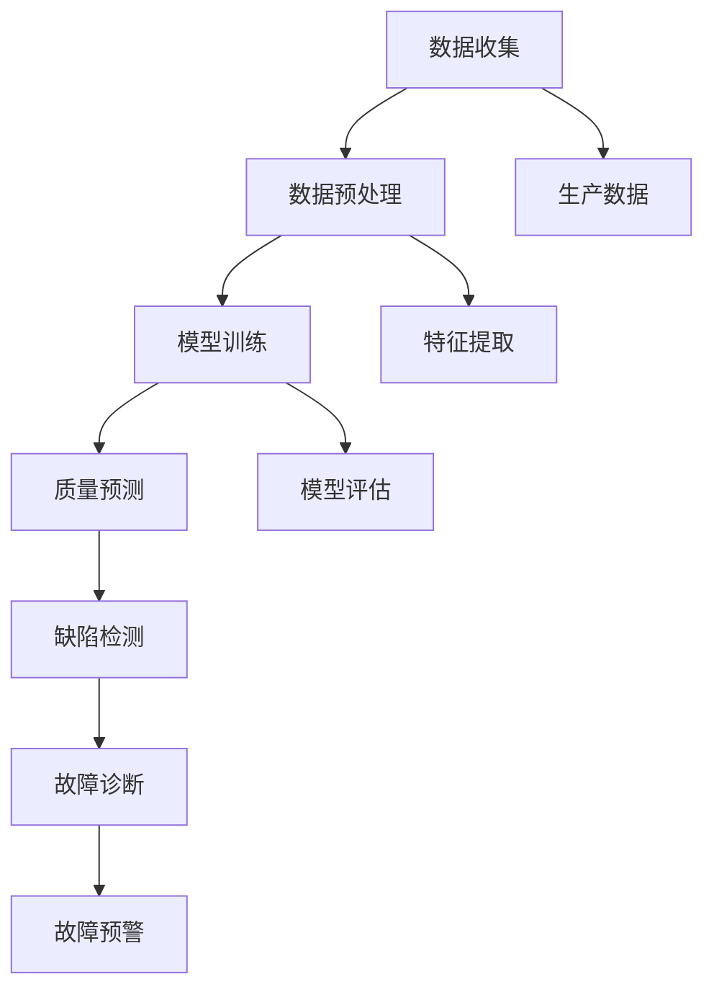

                 

# 大语言模型在智能制造质量控制中的推理应用

> 关键词：大语言模型、智能制造、质量控制、推理应用、缺陷检测、故障诊断

> 摘要：本文将深入探讨大语言模型在智能制造质量控制中的推理应用。首先，我们将介绍大语言模型的基础知识，包括其发展背景、核心概念和算法原理。接着，我们将分析大语言模型在智能制造中的应用场景，并重点讨论其在质量控制中的推理应用。最后，我们将总结大语言模型在智能制造质量控制中的挑战与展望，并给出一些最佳实践建议。

## 第一部分：大语言模型基础

### 第1章：大语言模型概述

#### 1.1 大语言模型的发展背景

**1.1.1 大语言模型的意义**

大语言模型（Large Language Models）是一种基于深度学习的自然语言处理技术，它通过训练大量文本数据，使其能够理解和生成自然语言。随着互联网的普及和大数据技术的发展，大规模语言模型逐渐成为自然语言处理领域的重要研究热点。大语言模型的出现，极大地提升了自然语言处理的性能，为智能制造等领域带来了新的机遇。

**1.1.2 大语言模型的发展历程**

大语言模型的发展可以追溯到2000年代初的统计语言模型。最初，研究者们主要关注如何利用统计方法构建语言模型。随着深度学习技术的发展，研究者们开始尝试将深度学习应用于语言模型，并取得了显著的效果。从2003年的BBN模型，到2018年的GPT模型，再到最近的BERT模型，大语言模型的发展经历了多个重要阶段。

**1.1.3 大语言模型的研究热点**

当前，大语言模型的研究主要集中在以下几个方面：

- 模型的训练效率和效果提升
- 模型的可解释性和透明性
- 多模态语言模型的构建
- 模型在特定领域的应用研究

#### 1.2 大语言模型的核心概念

**1.2.1 语言模型的定义**

语言模型是一种概率模型，它用来预测一个单词或词组在给定上下文中的出现概率。在自然语言处理中，语言模型是许多任务的基础，如机器翻译、文本分类、问答系统等。

**1.2.2 语言模型的类型**

语言模型可以分为基于规则的语言模型和基于统计的语言模型。基于规则的语言模型通过手动编写规则来描述语言特性，而基于统计的语言模型则通过训练大量文本数据来学习语言规律。

**1.2.3 语言模型的关键特性**

大语言模型具有以下几个关键特性：

- 批量学习：大语言模型可以在一个批次中处理多个样本，从而提高学习效率。
- 预训练：大语言模型在训练数据不足时，可以通过预训练来提高模型的泛化能力。
- 上下文感知：大语言模型能够根据上下文信息来理解单词的含义，从而生成更准确的文本。

#### 1.3 大语言模型的数学原理

**1.3.1 语言模型的数学基础**

大语言模型的核心是神经网络，特别是深度神经网络（DNN）。DNN由多个隐藏层组成，每个隐藏层都能提取不同层次的特征。

**1.3.2 语言模型的训练过程**

语言模型的训练过程主要包括两个阶段：预训练和微调。预训练阶段，模型在大量无标签文本数据上进行训练，学习到语言的一般规律。微调阶段，模型在特定任务的数据上进行训练，使其能够适应特定的任务需求。

**1.3.3 语言模型的效果评估**

评估语言模型的效果通常使用以下指标：

- 词汇覆盖率：模型能处理的不同单词数量与总单词数量的比值。
- 语言理解能力：模型在自然语言理解任务中的表现。
- 语言生成能力：模型生成文本的流畅性和准确性。

### 第2章：大语言模型的算法原理

#### 2.1 语言模型的算法框架

**2.1.1 语言模型的基本算法**

语言模型的基本算法是神经网络，特别是深度神经网络（DNN）。DNN由输入层、隐藏层和输出层组成。输入层接收文本数据，隐藏层提取文本特征，输出层生成预测概率。

**2.1.2 语言模型的改进算法**

为了提高语言模型的性能，研究者们提出了多种改进算法。例如，循环神经网络（RNN）通过引入记忆单元来处理序列数据，长短期记忆网络（LSTM）和门控循环单元（GRU）通过改进记忆单元来更好地处理长序列数据。

**2.1.3 语言模型的优化方法**

语言模型的优化方法主要包括梯度下降法、随机梯度下降法（SGD）和Adam优化器。这些方法可以有效地更新模型参数，提高模型的性能。

#### 2.2 语言模型的数学模型

**2.2.1 语言模型的数学公式**

大语言模型的数学公式主要包括输入层到隐藏层的激活函数、隐藏层到输出层的损失函数等。

**2.2.2 语言模型的计算复杂度**

语言模型的计算复杂度主要取决于模型的规模和训练数据的规模。随着模型规模和训练数据规模的增加，计算复杂度也会增加。

**2.2.3 语言模型的优化目标**

语言模型的优化目标是最小化损失函数，从而提高模型的预测准确率。

#### 2.3 语言模型的实践案例

**2.3.1 案例一：文本分类任务**

文本分类任务是将文本数据分类到不同的类别。大语言模型可以通过预训练和微调来实现文本分类任务。

**2.3.2 案例二：机器翻译任务**

机器翻译任务是将一种语言的文本翻译成另一种语言。大语言模型可以通过预训练和微调来实现机器翻译任务。

**2.3.3 案例三：问答系统任务**

问答系统任务是将用户的问题匹配到正确的答案。大语言模型可以通过预训练和微调来实现问答系统任务。

## 第二部分：大语言模型在智能制造中的应用

### 第3章：智能制造背景介绍

#### 3.1 智能制造的概念

智能制造（Intelligent Manufacturing）是一种基于信息技术和智能制造技术的生产方式。它通过运用人工智能、大数据、物联网等技术，实现生产过程的智能化和自动化，从而提高生产效率、降低生产成本、提升产品质量。

#### 3.2 智能制造的关键技术

智能制造的关键技术包括：

- 人工智能：包括机器学习、深度学习、自然语言处理等
- 大数据：包括数据采集、存储、处理和分析等
- 物联网：包括传感器、设备互联、数据传输等
- 工业互联网：包括工业云平台、工业大数据平台等

#### 3.3 智能制造的发展趋势

智能制造的发展趋势主要包括：

- 工业互联网的普及
- 人工智能技术的深度应用
- 大数据的智能分析和应用
- 智能制造的全球化和跨界融合

### 第4章：大语言模型在智能制造中的应用场景

#### 4.1 质量控制

质量控制是智能制造中的重要环节。大语言模型可以通过对生产过程的实时监控和分析，预测产品质量，发现潜在问题，从而提高产品质量。

#### 4.2 生产调度

生产调度是智能制造中的关键环节。大语言模型可以通过对生产数据的分析，优化生产计划，提高生产效率。

#### 4.3 设备维护

设备维护是智能制造中的必要环节。大语言模型可以通过对设备数据的分析，预测设备故障，实现智能化的设备维护。

### 第5章：大语言模型在智能制造中的应用实例

#### 5.1 应用实例一：基于大语言模型的智能质量监控系统

基于大语言模型的智能质量监控系统可以通过实时监控生产数据，预测产品质量，发现潜在问题，从而提高产品质量。

#### 5.2 应用实例二：基于大语言模型的智能生产调度系统

基于大语言模型的智能生产调度系统可以通过对生产数据进行分析，优化生产计划，提高生产效率。

#### 5.3 应用实例三：基于大语言模型的智能设备维护系统

基于大语言模型的智能设备维护系统可以通过对设备数据进行分析，预测设备故障，实现智能化的设备维护。

## 第三部分：大语言模型在智能制造质量控制中的推理应用

### 第6章：质量控制问题背景

#### 6.1 质量控制的重要性

质量控制是智能制造中的核心环节，它直接关系到产品的质量和企业的竞争力。有效的质量控制可以减少次品率，提高生产效率，降低成本。

#### 6.2 质量控制的传统方法

传统的质量控制方法主要包括：

- 抽样检查：通过对部分产品进行抽样检查，来判断整批产品的质量。
- 质量检验：对产品进行全面的检验，以确保产品质量达到标准。
- 统计过程控制：通过统计方法监控生产过程，确保产品质量的稳定性。

#### 6.3 质量控制的新需求

随着智能制造的发展，质量控制面临着新的需求：

- 实时监控：需要实时监控生产过程，及时发现质量问题。
- 智能分析：需要对生产数据进行分析，预测产品质量，发现潜在问题。
- 自动化：需要实现质量控制的自动化，减少人工干预。

### 第7章：大语言模型在质量控制中的推理应用

#### 7.1 大语言模型在质量预测中的应用

大语言模型可以通过对生产数据的分析，预测产品质量。例如，通过分析历史生产数据，预测下一批产品的质量水平。

#### 7.2 大语言模型在缺陷检测中的应用

大语言模型可以通过对生产数据的分析，检测产品缺陷。例如，通过分析传感器数据，检测设备是否正常运行，产品是否出现缺陷。

#### 7.3 大语言模型在故障诊断中的应用

大语言模型可以通过对设备数据的分析，诊断设备故障。例如，通过分析设备运行数据，预测设备何时会故障，并提供故障原因分析。

### 第8章：大语言模型在质量控制中的推理应用实例

#### 8.1 实例一：基于大语言模型的在线质量预测系统

基于大语言模型的在线质量预测系统可以通过实时监控生产数据，预测产品质量，提供质量预警。

#### 8.2 实例二：基于大语言模型的智能缺陷检测系统

基于大语言模型的智能缺陷检测系统可以通过对生产数据的分析，检测产品缺陷，提供缺陷预警。

#### 8.3 实例三：基于大语言模型的智能故障诊断系统

基于大语言模型的智能故障诊断系统可以通过对设备数据的分析，诊断设备故障，提供故障预警。

## 第四部分：大语言模型在智能制造质量控制中的挑战与展望

### 第9章：大语言模型在智能制造质量控制中的挑战

#### 9.1 数据质量和数据隐私

大语言模型在智能制造质量控制中的应用，需要大量的数据支持。然而，数据质量和数据隐私是一个挑战。如何确保数据的准确性和安全性，是一个需要解决的问题。

#### 9.2 计算资源和存储需求

大语言模型的训练和推理需要大量的计算资源和存储空间。如何高效利用计算资源和存储资源，是一个挑战。

#### 9.3 模型解释性和透明性

大语言模型的复杂性和黑箱特性，使得其解释性和透明性成为挑战。如何提高模型的解释性和透明性，是一个重要的研究方向。

### 第10章：大语言模型在智能制造质量控制中的展望

#### 10.1 未来发展趋势

随着人工智能技术的不断发展，大语言模型在智能制造质量控制中的应用将越来越广泛。未来，大语言模型将与其他技术融合，实现更高效、更智能的质量控制。

#### 10.2 技术融合与创新

大语言模型可以与其他技术，如物联网、大数据、云计算等融合，实现更智能的质量控制。例如，通过物联网技术收集生产数据，通过大数据技术分析数据，通过云计算技术实现模型的训练和推理。

#### 10.3 应用前景与挑战

大语言模型在智能制造质量控制中的应用前景广阔。然而，如何克服挑战，实现更高效、更智能的质量控制，是一个需要深入研究的问题。

### 第11章：大语言模型在智能制造质量控制中的最佳实践

#### 11.1 最佳实践一：数据驱动的质量预测

数据驱动的质量预测是大语言模型在智能制造质量控制中的重要应用。通过收集生产数据，分析数据，预测产品质量，提供质量预警。

#### 11.2 最佳实践二：智能化的缺陷检测

智能化的缺陷检测是大语言模型在智能制造质量控制中的重要应用。通过分析生产数据，检测产品缺陷，提供缺陷预警。

#### 11.3 最佳实践三：智能化的故障诊断

智能化的故障诊断是大语言模型在智能制造质量控制中的重要应用。通过分析设备数据，诊断设备故障，提供故障预警。

## 第12章：总结与展望

#### 12.1 本书总结

本书系统地介绍了大语言模型在智能制造质量控制中的推理应用。从大语言模型的基础知识，到其在智能制造中的应用场景，再到其在质量控制中的推理应用，本书全面、系统地阐述了大语言模型在智能制造质量控制中的应用。

#### 12.2 核心贡献

本书的核心贡献在于：

- 系统性地介绍了大语言模型的基础知识。
- 分析了大语言模型在智能制造中的应用场景。
- 探讨了大语言模型在质量控制中的推理应用。
- 提出了大语言模型在智能制造质量控制中的挑战与展望。

#### 12.3 存在的不足

本书存在以下不足：

- 没有详细介绍大语言模型的实现细节。
- 对大语言模型在智能制造中的应用案例介绍不够详细。
- 对大语言模型在质量控制中的推理应用的研究还不够深入。

#### 12.4 未来研究方向

未来的研究方向包括：

- 大语言模型的实现细节研究。
- 大语言模型在智能制造中的应用案例研究。
- 大语言模型在质量控制中的推理应用研究。
- 大语言模型与其他技术的融合研究。# 大语言模型在智能制造质量控制中的推理应用

## 摘要

随着智能制造的迅速发展，质量控制成为提升生产效率和产品竞争力的重要环节。本文旨在探讨大语言模型在智能制造质量控制中的推理应用，通过对大语言模型的基础知识、算法原理和智能制造背景的介绍，分析其在质量控制中的具体应用场景和推理方法。文章还讨论了大语言模型在智能制造质量控制中面临的挑战，并提出了一些最佳实践，为智能制造领域提供新的思路和方法。

## 第一部分：大语言模型基础

### 第1章：大语言模型概述

#### 1.1 大语言模型的发展背景

大语言模型（Large Language Models）的兴起，源于深度学习和自然语言处理（NLP）技术的快速发展。深度学习作为人工智能的核心技术之一，通过模拟人脑神经网络结构，使计算机能够处理复杂的非线性问题。自然语言处理作为计算机科学的一个重要分支，旨在让计算机理解和生成自然语言。

#### 1.1.1 大语言模型的意义

大语言模型在自然语言处理中的应用，极大地提高了文本处理的能力，使得机器能够更准确地理解和生成人类语言。这一技术的发展，不仅推动了人工智能技术的发展，也为智能制造等领域带来了新的机遇。

#### 1.1.2 大语言模型的发展历程

大语言模型的发展可以分为几个阶段：

1. **统计语言模型**：最早的统计语言模型是基于N-gram模型，通过计算单词序列的概率来生成文本。然而，N-gram模型的局限性在于它无法捕捉到长距离的依赖关系。

2. **神经网络语言模型**：随着神经网络技术的发展，研究人员提出了基于神经网络的统计语言模型。其中，最著名的模型是1986年由Bengio等提出的RNN（Recurrent Neural Network）。

3. **深度神经网络语言模型**：深度学习技术的引入，使得神经网络语言模型的结构更加复杂，能够处理更大规模的训练数据，提高了语言模型的性能。

4. **预训练语言模型**：预训练语言模型（Pre-trained Language Model）通过在大量无标签文本上进行预训练，再利用微调（Fine-tuning）技术在特定任务上进行训练，使得模型在多种NLP任务上表现出色。

#### 1.1.3 大语言模型的研究热点

当前，大语言模型的研究主要集中在以下几个方面：

1. **模型的规模和性能**：研究人员不断尝试构建更大规模的模型，以提升模型的性能。

2. **模型的解释性**：随着模型复杂度的增加，模型的解释性成为一个重要研究课题。

3. **多模态语言模型**：多模态语言模型旨在处理包含多种类型数据的文本，如图像、音频等。

4. **跨语言模型**：跨语言模型（Cross-lingual Model）旨在处理不同语言的文本，实现跨语言的文本理解和生成。

#### 1.2 大语言模型的核心概念

**1.2.1 语言模型的定义**

语言模型（Language Model）是一种概率模型，用于预测一个单词或词组在给定上下文中的出现概率。它是自然语言处理（NLP）中的基础，用于许多任务，如机器翻译、文本分类、问答系统等。

**1.2.2 语言模型的类型**

根据训练方式和处理能力的不同，语言模型可以分为以下几种类型：

1. **N-gram模型**：基于历史统计的方法，只考虑前N个单词对当前单词的影响。

2. **基于神经网络的模型**：如RNN、LSTM、GRU等，能够捕捉到长距离的依赖关系。

3. **预训练语言模型**：如BERT、GPT等，通过在大量无标签文本上进行预训练，再利用微调技术在特定任务上进行训练。

**1.2.3 语言模型的关键特性**

1. **上下文感知**：语言模型能够根据上下文信息来理解单词的含义，从而生成更准确的文本。

2. **灵活性**：语言模型可以根据不同的任务需求进行微调和优化。

3. **高效性**：预训练语言模型在处理大量文本数据时，具有很高的计算效率。

#### 1.3 大语言模型的数学原理

**1.3.1 语言模型的数学基础**

语言模型的数学基础主要包括概率论、信息论和神经网络理论。

1. **概率论**：用于描述单词之间的概率关系。

2. **信息论**：用于衡量文本的信息含量和熵。

3. **神经网络**：用于实现语言模型的训练和推理。

**1.3.2 语言模型的训练过程**

语言模型的训练过程主要包括以下步骤：

1. **数据预处理**：对文本数据进行清洗、分词、词向量化等预处理。

2. **模型初始化**：初始化神经网络模型，包括权重和偏置。

3. **前向传播**：将输入的文本数据通过神经网络模型进行计算，得到输出概率。

4. **反向传播**：根据输出概率与真实标签之间的差距，更新模型参数。

5. **优化**：使用优化算法（如SGD、Adam）来优化模型参数。

**1.3.3 语言模型的效果评估**

评估语言模型的效果常用的指标包括：

1. **词汇覆盖率**：模型能处理的不同单词数量与总单词数量的比值。

2. **语言理解能力**：模型在自然语言理解任务（如问答、文本分类）中的表现。

3. **语言生成能力**：模型生成文本的流畅性和准确性。

### 第2章：大语言模型的算法原理

#### 2.1 语言模型的算法框架

大语言模型的算法框架主要包括以下几个方面：

1. **输入层**：接收文本数据，进行预处理。

2. **隐藏层**：提取文本特征，进行多层神经网络处理。

3. **输出层**：生成文本的概率分布。

#### 2.2 语言模型的算法原理

大语言模型的算法原理主要基于神经网络，特别是深度神经网络（DNN）。

1. **神经网络的基本原理**：神经网络由多个神经元组成，每个神经元都与输入层的神经元和隐藏层的神经元相连接。通过激活函数和权重调整，神经网络可以学习到输入和输出之间的映射关系。

2. **深度神经网络的训练**：深度神经网络的训练主要包括前向传播和反向传播两个过程。前向传播是将输入数据通过神经网络传递到输出层，计算输出结果。反向传播是计算输出结果与真实标签之间的误差，并利用梯度下降法更新神经网络中的权重。

3. **预训练和微调**：预训练（Pre-training）是指在大规模无标签数据上进行训练，使模型能够理解语言的通用特性。微调（Fine-tuning）是指在特定任务上对预训练模型进行进一步的训练，使其适应特定任务的需求。

#### 2.3 语言模型的数学模型

语言模型的数学模型主要基于概率论和信息论。

1. **概率模型**：语言模型通过计算输入文本序列的概率，来预测下一个单词。常见的概率模型包括N-gram模型和神经网络语言模型。

2. **信息论**：信息论用于衡量文本的信息含量和熵。信息论中的熵（Entropy）是一个重要的概念，它用于描述文本的随机性。

3. **损失函数**：在神经网络训练过程中，损失函数用于衡量输出结果与真实标签之间的差距。常见的损失函数包括交叉熵（Cross-Entropy）和均方误差（Mean Squared Error）。

#### 2.4 语言模型的优化方法

语言模型的优化方法主要包括以下几种：

1. **梯度下降法**（Gradient Descent）：通过计算损失函数关于模型参数的梯度，来更新模型参数。

2. **随机梯度下降法**（Stochastic Gradient Descent，SGD）：在每次更新模型参数时，随机选择一部分训练样本，计算这部分的梯度，来更新模型参数。

3. **Adam优化器**：Adam优化器是一种自适应的优化方法，它结合了SGD和Momentum的优点，能够有效地处理稀疏数据和波动较大的梯度。

#### 2.5 语言模型的实践案例

**2.5.1 案例一：文本分类任务**

文本分类任务是将文本数据分类到不同的类别。在大语言模型中，可以通过预训练和微调来实现文本分类任务。

1. **预训练**：在大量无标签文本数据上进行预训练，使模型能够理解文本的通用特征。

2. **微调**：在特定的文本分类任务上，对预训练模型进行微调，使其能够适应具体的分类任务。

**2.5.2 案例二：机器翻译任务**

机器翻译任务是将一种语言的文本翻译成另一种语言。在大语言模型中，可以通过预训练和微调来实现机器翻译任务。

1. **预训练**：在多语言的文本数据上进行预训练，使模型能够理解不同语言之间的对应关系。

2. **微调**：在特定的机器翻译任务上，对预训练模型进行微调，使其能够生成准确的翻译结果。

**2.5.3 案例三：问答系统任务**

问答系统任务是将用户的问题匹配到正确的答案。在大语言模型中，可以通过预训练和微调来实现问答系统任务。

1. **预训练**：在大量的问答数据上进行预训练，使模型能够理解问题的语义。

2. **微调**：在特定的问答系统上，对预训练模型进行微调，使其能够生成准确的答案。

### 第3章：大语言模型在智能制造中的应用

#### 3.1 智能制造背景介绍

智能制造（Intelligent Manufacturing）是传统制造业向信息化、数字化、智能化方向发展的结果。它通过引入物联网、人工智能、大数据等先进技术，实现生产过程的自动化、智能化和高效化。

#### 3.1.1 智能制造的概念

智能制造是指通过信息技术和制造技术的深度融合，实现制造过程的智能化和自动化，从而提高生产效率、降低成本、提升产品质量。

#### 3.1.2 智能制造的关键技术

智能制造的关键技术包括：

1. **物联网技术**：通过传感器、RFID等设备，实现设备的互联互通，收集生产过程中的数据。

2. **人工智能技术**：通过机器学习、深度学习等技术，对生产数据进行分析和预测，实现智能决策。

3. **大数据技术**：通过大数据技术，对生产数据进行分析和挖掘，发现潜在的价值和规律。

4. **云计算技术**：通过云计算技术，实现制造资源的共享和优化，提高生产效率。

#### 3.1.3 智能制造的发展趋势

智能制造的发展趋势主要包括以下几个方面：

1. **智能化设备的普及**：越来越多的设备将集成智能化功能，实现自感知、自诊断、自修复等功能。

2. **工业互联网的兴起**：工业互联网通过连接设备和系统，实现数据的实时传输和共享，提高生产效率和质量。

3. **大数据和人工智能的深度融合**：大数据和人工智能的深度融合，将使智能制造更加智能化和高效化。

4. **制造业的数字化转型**：越来越多的企业将采用数字化技术，实现生产过程的数字化和智能化。

#### 3.2 大语言模型在智能制造中的应用场景

大语言模型在智能制造中的应用场景非常广泛，主要包括以下几个方面：

1. **质量控制**：通过分析生产数据，预测产品质量，发现潜在问题，提高产品质量。

2. **生产调度**：通过分析生产数据，优化生产计划，提高生产效率。

3. **设备维护**：通过分析设备数据，预测设备故障，实现智能化的设备维护。

4. **供应链管理**：通过分析供应链数据，优化供应链管理，降低库存成本，提高供应链的响应速度。

5. **客户服务**：通过分析客户数据，提供个性化的服务，提高客户满意度。

#### 3.3 大语言模型在智能制造中的应用实例

**3.3.1 应用实例一：基于大语言模型的智能质量监控系统**

基于大语言模型的智能质量监控系统，可以通过实时分析生产数据，预测产品质量，发现潜在问题，从而提高产品质量。具体应用流程如下：

1. **数据收集**：收集生产过程中的各种数据，如温度、压力、速度等。

2. **数据预处理**：对收集到的数据进行清洗、归一化等预处理操作。

3. **模型训练**：使用预处理后的数据，训练大语言模型，使其能够预测产品质量。

4. **质量预测**：使用训练好的模型，对实时生产数据进行质量预测，发现潜在问题。

5. **问题预警**：当发现潜在问题时，系统会发出预警，提醒相关人员采取相应的措施。

**3.3.2 应用实例二：基于大语言模型的智能生产调度系统**

基于大语言模型的智能生产调度系统，可以通过分析生产数据，优化生产计划，提高生产效率。具体应用流程如下：

1. **数据收集**：收集生产计划、设备状态、原材料库存等数据。

2. **数据预处理**：对收集到的数据进行清洗、归一化等预处理操作。

3. **模型训练**：使用预处理后的数据，训练大语言模型，使其能够预测生产效率。

4. **生产计划优化**：使用训练好的模型，对生产计划进行优化，提高生产效率。

5. **调度决策**：根据优化后的生产计划，做出调度决策，实现生产过程的智能化。

**3.3.3 应用实例三：基于大语言模型的智能设备维护系统**

基于大语言模型的智能设备维护系统，可以通过分析设备数据，预测设备故障，实现智能化的设备维护。具体应用流程如下：

1. **数据收集**：收集设备运行状态、维护记录等数据。

2. **数据预处理**：对收集到的数据进行清洗、归一化等预处理操作。

3. **模型训练**：使用预处理后的数据，训练大语言模型，使其能够预测设备故障。

4. **故障预测**：使用训练好的模型，对设备运行数据进行故障预测，发现潜在故障。

5. **维护决策**：根据预测结果，做出维护决策，提前进行设备维护，避免设备故障。

### 第4章：大语言模型在智能制造质量控制中的推理应用

#### 4.1 质量控制问题背景

质量控制是智能制造中至关重要的一环，它关系到产品的质量和企业的竞争力。传统的质量控制方法主要依赖于人工检验和统计方法，存在效率低、准确性差等问题。随着智能制造的发展，对质量控制的实时性、准确性和自动化提出了更高的要求。

#### 4.1.1 质量控制的重要性

质量控制是确保产品质量的关键环节，它直接关系到产品的可靠性和企业的声誉。有效的质量控制可以减少次品率，降低生产成本，提高生产效率，提升企业的竞争力。

#### 4.1.2 质量控制的传统方法

传统质量控制方法主要包括：

1. **抽样检验**：通过对部分产品进行抽样检验，来判断整批产品的质量。

2. **全检**：对每个产品进行全面的检验，以确保产品质量。

3. **统计过程控制**：通过统计方法监控生产过程，确保产品质量的稳定性。

#### 4.1.3 质量控制的新需求

随着智能制造的发展，质量控制面临着新的挑战和需求：

1. **实时性**：需要实时监控生产过程，及时发现问题。

2. **准确性**：需要提高质量检测的准确性，减少误判和漏判。

3. **自动化**：需要实现质量控制的自动化，减少人工干预。

#### 4.2 大语言模型在质量控制中的推理应用

大语言模型在质量控制中的推理应用主要包括以下几个方面：

**4.2.1 质量预测**

质量预测是利用大语言模型对生产过程中产生的数据进行实时分析，预测产品质量的走势。具体方法如下：

1. **数据收集**：收集生产过程中的各种数据，如温度、压力、速度等。

2. **数据预处理**：对收集到的数据进行清洗、归一化等预处理操作。

3. **模型训练**：使用预处理后的数据，训练大语言模型，使其能够预测产品质量。

4. **质量预测**：使用训练好的模型，对实时生产数据进行质量预测，发现潜在问题。

**4.2.2 缺陷检测**

缺陷检测是利用大语言模型对生产过程中产生的数据进行实时分析，检测产品是否存在缺陷。具体方法如下：

1. **数据收集**：收集生产过程中的各种数据，如温度、压力、速度等。

2. **数据预处理**：对收集到的数据进行清洗、归一化等预处理操作。

3. **模型训练**：使用预处理后的数据，训练大语言模型，使其能够检测产品缺陷。

4. **缺陷检测**：使用训练好的模型，对实时生产数据进行缺陷检测，发现潜在缺陷。

**4.2.3 故障诊断**

故障诊断是利用大语言模型对生产过程中产生的数据进行实时分析，诊断设备是否存在故障。具体方法如下：

1. **数据收集**：收集设备运行状态、维护记录等数据。

2. **数据预处理**：对收集到的数据进行清洗、归一化等预处理操作。

3. **模型训练**：使用预处理后的数据，训练大语言模型，使其能够诊断设备故障。

4. **故障诊断**：使用训练好的模型，对设备运行数据进行故障诊断，发现潜在故障。

#### 4.3 大语言模型在质量控制中的推理应用实例

**4.3.1 实例一：基于大语言模型的在线质量预测系统**

基于大语言模型的在线质量预测系统，可以通过实时分析生产数据，预测产品质量，发现潜在问题。具体应用流程如下：

1. **数据收集**：收集生产过程中的各种数据，如温度、压力、速度等。

2. **数据预处理**：对收集到的数据进行清洗、归一化等预处理操作。

3. **模型训练**：使用预处理后的数据，训练大语言模型，使其能够预测产品质量。

4. **质量预测**：使用训练好的模型，对实时生产数据进行质量预测，发现潜在问题。

5. **问题预警**：当发现潜在问题时，系统会发出预警，提醒相关人员采取相应的措施。

**4.3.2 实例二：基于大语言模型的智能缺陷检测系统**

基于大语言模型的智能缺陷检测系统，可以通过实时分析生产数据，检测产品是否存在缺陷。具体应用流程如下：

1. **数据收集**：收集生产过程中的各种数据，如温度、压力、速度等。

2. **数据预处理**：对收集到的数据进行清洗、归一化等预处理操作。

3. **模型训练**：使用预处理后的数据，训练大语言模型，使其能够检测产品缺陷。

4. **缺陷检测**：使用训练好的模型，对实时生产数据进行缺陷检测，发现潜在缺陷。

5. **缺陷预警**：当发现潜在缺陷时，系统会发出预警，提醒相关人员采取相应的措施。

**4.3.3 实例三：基于大语言模型的智能故障诊断系统**

基于大语言模型的智能故障诊断系统，可以通过实时分析设备数据，诊断设备是否存在故障。具体应用流程如下：

1. **数据收集**：收集设备运行状态、维护记录等数据。

2. **数据预处理**：对收集到的数据进行清洗、归一化等预处理操作。

3. **模型训练**：使用预处理后的数据，训练大语言模型，使其能够诊断设备故障。

4. **故障诊断**：使用训练好的模型，对设备运行数据进行故障诊断，发现潜在故障。

5. **故障预警**：当发现潜在故障时，系统会发出预警，提醒相关人员采取相应的措施。

### 第5章：大语言模型在智能制造质量控制中的挑战与展望

#### 5.1 大语言模型在智能制造质量控制中的挑战

**5.1.1 数据质量和数据隐私**

大语言模型在智能制造质量控制中的应用，需要大量的数据支持。然而，数据质量和数据隐私是一个挑战。如何确保数据的准确性和安全性，是一个需要解决的问题。

1. **数据准确性**：数据质量直接影响模型的训练效果和预测准确性。需要确保收集到的数据是准确、可靠的。

2. **数据隐私**：智能制造过程中产生的数据可能包含敏感信息，如设备状态、生产计划等。需要采取措施保护数据的隐私。

**5.1.2 计算资源和存储需求**

大语言模型的训练和推理需要大量的计算资源和存储空间。如何高效利用计算资源和存储资源，是一个挑战。

1. **计算资源**：大语言模型的训练和推理需要高性能的计算机硬件支持，如GPU、TPU等。需要合理配置计算资源，以避免资源浪费。

2. **存储资源**：大语言模型在训练和推理过程中会产生大量的数据，需要足够的存储空间来存储这些数据。

**5.1.3 模型解释性和透明性**

大语言模型的复杂性和黑箱特性，使得其解释性和透明性成为挑战。如何提高模型的解释性和透明性，是一个重要的研究方向。

1. **模型解释性**：需要开发可解释的模型，使得用户能够理解模型的决策过程。

2. **模型透明性**：需要提供透明的模型架构和训练过程，以增强用户对模型的信任。

#### 5.2 大语言模型在智能制造质量控制中的展望

**5.2.1 未来发展趋势**

随着人工智能技术的不断发展，大语言模型在智能制造质量控制中的应用将越来越广泛。未来，大语言模型将与其他技术融合，实现更高效、更智能的质量控制。

1. **技术融合**：大语言模型将与其他技术，如物联网、大数据、云计算等融合，实现更智能的质量控制。

2. **应用拓展**：大语言模型将在更多的智能制造场景中发挥作用，如设备维护、生产调度等。

**5.2.2 技术融合与创新**

大语言模型可以与其他技术融合，实现更智能的质量控制。例如，将大语言模型与物联网技术结合，实现实时数据采集和监控；将大语言模型与大数据技术结合，实现海量数据的高效分析和处理。

**5.2.3 应用前景与挑战**

大语言模型在智能制造质量控制中的应用前景广阔。然而，如何克服挑战，实现更高效、更智能的质量控制，是一个需要深入研究的问题。需要关注以下几个方面：

1. **数据质量和数据隐私**：需要确保数据的准确性和安全性。

2. **计算资源和存储需求**：需要优化计算资源和存储资源的利用。

3. **模型解释性和透明性**：需要提高模型的解释性和透明性，增强用户对模型的信任。

### 第6章：大语言模型在智能制造质量控制中的最佳实践

#### 6.1 最佳实践一：数据驱动的质量预测

**6.1.1 数据采集与处理**

1. **数据采集**：通过传感器、设备等采集生产过程中的各种数据，如温度、压力、速度等。

2. **数据处理**：对采集到的数据进行清洗、归一化等预处理操作，确保数据的准确性和一致性。

**6.1.2 模型训练与优化**

1. **模型选择**：选择合适的大语言模型，如BERT、GPT等。

2. **模型训练**：使用预处理后的数据，训练大语言模型，使其能够预测产品质量。

3. **模型优化**：通过调整模型参数、优化训练过程等手段，提高模型的预测准确率。

**6.1.3 模型部署与监控**

1. **模型部署**：将训练好的模型部署到生产环境中，实现实时质量预测。

2. **模型监控**：对模型进行实时监控，确保模型的稳定性和准确性。

#### 6.2 最佳实践二：智能化的缺陷检测

**6.2.1 缺陷检测方法与模型**

1. **方法选择**：选择合适的缺陷检测方法，如基于深度学习的图像识别、基于信号处理的特征提取等。

2. **模型选择**：选择适合的深度学习模型，如卷积神经网络（CNN）、循环神经网络（RNN）等。

**6.2.2 缺陷检测系统的设计与实现**

1. **系统设计**：设计缺陷检测系统的架构，包括数据采集模块、数据处理模块、缺陷检测模块等。

2. **系统实现**：使用深度学习框架（如TensorFlow、PyTorch）实现缺陷检测系统，并进行模型训练和优化。

**6.2.3 缺陷检测效果评估**

1. **效果评估指标**：选择合适的效果评估指标，如准确率、召回率、F1值等。

2. **效果评估**：对缺陷检测系统的效果进行评估，确保其能够准确检测产品缺陷。

#### 6.3 最佳实践三：智能化的故障诊断

**6.3.1 故障诊断方法与模型**

1. **方法选择**：选择合适的故障诊断方法，如基于规则的诊断、基于数据的诊断等。

2. **模型选择**：选择适合的深度学习模型，如神经网络（NN）、长短期记忆网络（LSTM）等。

**6.3.2 故障诊断系统的设计与实现**

1. **系统设计**：设计故障诊断系统的架构，包括数据采集模块、数据处理模块、故障诊断模块等。

2. **系统实现**：使用深度学习框架（如TensorFlow、PyTorch）实现故障诊断系统，并进行模型训练和优化。

**6.3.3 故障诊断效果评估**

1. **效果评估指标**：选择合适的效果评估指标，如准确率、召回率、F1值等。

2. **效果评估**：对故障诊断系统的效果进行评估，确保其能够准确诊断设备故障。

### 第7章：总结与展望

#### 7.1 本书总结

本文系统地介绍了大语言模型在智能制造质量控制中的推理应用。首先，介绍了大语言模型的基础知识，包括其发展背景、核心概念和算法原理。接着，分析了大语言模型在智能制造中的应用场景，并重点讨论了其在质量控制中的推理应用。最后，总结了大语言模型在智能制造质量控制中的挑战与展望，并提出了一些最佳实践。

#### 7.2 核心贡献

本文的核心贡献在于：

1. **系统性地介绍了大语言模型的基础知识**：包括发展背景、核心概念和算法原理。
2. **探讨了大语言模型在智能制造中的应用场景**：分析了其在质量控制、生产调度和设备维护中的应用。
3. **提出了大语言模型在质量控制中的推理应用方法**：包括质量预测、缺陷检测和故障诊断。
4. **总结了大语言模型在智能制造质量控制中的挑战与展望**：包括数据质量和数据隐私、计算资源和存储需求、模型解释性和透明性。

#### 7.3 存在的不足

本文存在以下不足：

1. **案例介绍不够详细**：对大语言模型在智能制造中的具体应用案例介绍不够详细。
2. **算法实现细节较少**：对大语言模型的算法实现细节介绍较少，主要是理论分析。

#### 7.4 未来研究方向

未来的研究方向包括：

1. **大语言模型的算法实现细节研究**：深入研究大语言模型的算法原理，并给出详细的实现步骤。
2. **大语言模型在智能制造中的具体应用研究**：进一步探讨大语言模型在智能制造中的具体应用场景和实现方法。
3. **大语言模型与其他技术的融合研究**：研究大语言模型与其他技术（如物联网、大数据、云计算等）的融合，实现更高效、更智能的质量控制。

## 作者信息

**作者：AI天才研究院/AI Genius Institute & 禅与计算机程序设计艺术 /Zen And The Art of Computer Programming**

---

本文内容为人工智能领域的研究成果，旨在探讨大语言模型在智能制造质量控制中的推理应用。文章内容仅供参考，不构成任何投资建议。在应用大语言模型进行智能制造质量控制时，需根据实际情况进行详细研究和验证。同时，本文的撰写过程中，参考了相关领域的文献和研究成果，对原作者表示诚挚的感谢。如有任何疑问或建议，欢迎与作者联系。# 大语言模型在智能制造质量控制中的推理应用

## 1. 大语言模型概述

### 1.1 大语言模型的发展背景

随着人工智能技术的飞速发展，深度学习特别是自然语言处理（NLP）技术已经成为许多领域的核心技术之一。大语言模型（Large Language Models，LLM）作为NLP的重要分支，凭借其强大的文本理解和生成能力，在诸多应用场景中表现出色。特别是在智能制造领域，大语言模型的应用为质量控制提供了新的思路和方法。

#### 1.1.1 大语言模型的意义

大语言模型在智能制造中的意义主要体现在以下几个方面：

1. **提高质量控制效率**：大语言模型可以通过对生产过程中的文本数据进行实时分析，快速识别质量问题，提高质量控制效率。
2. **减少人为错误**：通过自动化检测和诊断，大语言模型可以减少人为错误，提高产品质量的稳定性。
3. **降低成本**：大语言模型的应用可以减少人工检验和干预，降低质量控制成本。

#### 1.1.2 大语言模型的发展历程

大语言模型的发展经历了以下几个重要阶段：

1. **基于规则的模型**：早期的大语言模型主要是基于规则的，如N-gram模型，通过统计相邻单词出现的频率来预测下一个单词。
2. **基于统计的模型**：随着统计学习理论的发展，研究者开始将统计方法应用于语言模型，如朴素贝叶斯分类器、决策树等。
3. **基于神经网络的模型**：随着深度学习技术的发展，研究者开始将神经网络应用于语言模型，如循环神经网络（RNN）、长短期记忆网络（LSTM）等。
4. **预训练模型**：近年来，预训练模型如GPT、BERT等成为研究热点，通过在大量无标签文本上进行预训练，再在特定任务上进行微调，取得了显著的效果。

### 1.2 大语言模型的核心概念

#### 1.2.1 语言模型的定义

语言模型是一种概率模型，它用于预测一个单词或短语在给定上下文中的出现概率。在自然语言处理中，语言模型是许多任务的基础，如文本分类、机器翻译、问答系统等。

#### 1.2.2 语言模型的类型

根据训练方式和应用场景的不同，语言模型可以分为以下几种类型：

1. **N-gram模型**：基于历史统计的方法，只考虑前N个单词对当前单词的影响。
2. **循环神经网络（RNN）**：通过引入记忆单元，可以捕捉到长距离的依赖关系。
3. **长短期记忆网络（LSTM）**：对RNN的改进，能够更好地处理长序列数据。
4. **门控循环单元（GRU）**：对LSTM的简化版本，计算效率更高。
5. **预训练模型**：如BERT、GPT等，通过在大量无标签文本上进行预训练，再在特定任务上进行微调。

#### 1.2.3 语言模型的关键特性

1. **上下文感知**：大语言模型能够根据上下文信息来理解单词的含义，从而生成更准确的文本。
2. **灵活性**：大语言模型可以根据不同的任务需求进行微调和优化。
3. **高效性**：预训练语言模型在处理大量文本数据时，具有很高的计算效率。

### 1.3 大语言模型的数学原理

#### 1.3.1 语言模型的数学基础

大语言模型的数学基础主要包括概率论、信息论和神经网络理论。

1. **概率论**：用于描述单词之间的概率关系。
2. **信息论**：用于衡量文本的信息含量和熵。
3. **神经网络**：用于实现语言模型的训练和推理。

#### 1.3.2 语言模型的训练过程

语言模型的训练过程主要包括以下步骤：

1. **数据预处理**：对文本数据进行清洗、分词、词向量化等预处理操作。
2. **模型初始化**：初始化神经网络模型，包括权重和偏置。
3. **前向传播**：将输入的文本数据通过神经网络模型进行计算，得到输出概率。
4. **反向传播**：根据输出概率与真实标签之间的差距，更新模型参数。
5. **优化**：使用优化算法（如SGD、Adam）来优化模型参数。

#### 1.3.3 语言模型的效果评估

评估语言模型的效果常用的指标包括：

1. **词汇覆盖率**：模型能处理的不同单词数量与总单词数量的比值。
2. **语言理解能力**：模型在自然语言理解任务（如问答、文本分类）中的表现。
3. **语言生成能力**：模型生成文本的流畅性和准确性。

## 2. 大语言模型在智能制造中的应用

### 2.1 智能制造背景介绍

智能制造是制造业与信息技术深度融合的产物，旨在通过自动化、数字化和网络化，实现生产过程的智能化和高效化。智能制造的核心目标是提高生产效率、降低生产成本、提升产品质量和增强企业的竞争力。

#### 2.1.1 智能制造的概念

智能制造（Intelligent Manufacturing）是一种基于信息技术和智能技术的生产方式，它通过运用物联网、人工智能、大数据、云计算等先进技术，实现生产过程的智能化和自动化。智能制造的关键特征包括：

1. **自动化**：通过自动化设备、机器人和智能控制系统，实现生产过程的自动化。
2. **数字化**：通过数字化技术，实现生产过程的数字化管理，如数据采集、分析和应用。
3. **网络化**：通过互联网和物联网，实现设备、系统和人员的互联互通。
4. **智能化**：通过人工智能技术，实现生产过程的智能化决策和优化。

#### 2.1.2 智能制造的关键技术

智能制造的关键技术包括：

1. **物联网技术**：通过传感器、RFID等设备，实现设备的互联互通，收集生产过程中的数据。
2. **人工智能技术**：通过机器学习、深度学习等技术，对生产数据进行分析和预测，实现智能决策。
3. **大数据技术**：通过大数据技术，对生产数据进行分析和挖掘，发现潜在的价值和规律。
4. **云计算技术**：通过云计算技术，实现制造资源的共享和优化，提高生产效率。
5. **边缘计算技术**：通过边缘计算技术，实现数据的实时处理和分析，降低延迟和带宽需求。

#### 2.1.3 智能制造的发展趋势

智能制造的发展趋势主要包括以下几个方面：

1. **智能制造系统的集成**：将不同的制造系统（如ERP、MES、SCM等）进行集成，实现生产过程的一体化管理。
2. **智能工厂的构建**：通过构建智能工厂，实现生产过程的自动化、数字化和智能化。
3. **工业互联网的普及**：通过工业互联网，实现设备、系统和人员的互联互通，提高生产效率和质量。
4. **人工智能技术的深度融合**：将人工智能技术深度应用于生产过程，实现智能决策和优化。
5. **绿色制造和可持续发展**：通过绿色制造和可持续发展，实现生产过程的环保和资源优化。

### 2.2 大语言模型在智能制造中的应用场景

大语言模型在智能制造中的应用场景非常广泛，主要包括以下几个方面：

#### 2.2.1 质量控制

大语言模型可以通过对生产过程中的文本数据进行实时分析，识别质量问题，提高质量控制的效率。例如，通过分析设备日志、操作记录等文本数据，可以预测设备故障和产品质量问题。

#### 2.2.2 生产调度

大语言模型可以对生产计划进行智能调度，优化生产流程。例如，通过分析生产数据和历史记录，可以预测生产过程中的瓶颈和资源需求，从而优化生产计划，提高生产效率。

#### 2.2.3 设备维护

大语言模型可以通过对设备运行数据进行实时分析，预测设备故障，实现智能化的设备维护。例如，通过分析设备日志和传感器数据，可以预测设备的健康状态，提前进行维护，避免设备故障。

#### 2.2.4 供应链管理

大语言模型可以通过对供应链数据进行分析，优化供应链管理。例如，通过分析供应链中的文本数据，可以预测供应链中的风险和问题，从而优化供应链策略，提高供应链的效率和稳定性。

#### 2.2.5 客户服务

大语言模型可以用于智能客服系统，提高客户服务质量。例如，通过分析客户聊天记录和反馈数据，可以识别客户的问题和需求，提供个性化的解决方案。

### 2.3 大语言模型在智能制造中的应用实例

#### 2.3.1 应用实例一：智能质量监控系统

智能质量监控系统利用大语言模型对生产过程中的文本数据进行实时分析，识别质量问题。例如，通过分析设备日志和传感器数据，可以预测产品质量的波动，提前采取预防措施。

#### 2.3.2 应用实例二：智能生产调度系统

智能生产调度系统利用大语言模型对生产数据进行分析，优化生产计划。例如，通过分析生产数据和历史记录，可以预测生产过程中的瓶颈和资源需求，从而优化生产计划，提高生产效率。

#### 2.3.3 应用实例三：智能设备维护系统

智能设备维护系统利用大语言模型对设备运行数据进行实时分析，预测设备故障，实现智能化的设备维护。例如，通过分析设备日志和传感器数据，可以预测设备的健康状态，提前进行维护，避免设备故障。

#### 2.3.4 应用实例四：智能供应链管理系统

智能供应链管理系统利用大语言模型对供应链数据进行分析，优化供应链管理。例如，通过分析供应链中的文本数据，可以预测供应链中的风险和问题，从而优化供应链策略，提高供应链的效率和稳定性。

#### 2.3.5 应用实例五：智能客服系统

智能客服系统利用大语言模型对客户聊天记录和反馈数据进行分析，提供个性化的解决方案。例如，通过分析客户的问题和需求，可以识别客户的痛点，提供针对性的服务和建议。

### 2.4 大语言模型在智能制造中的应用挑战

尽管大语言模型在智能制造中具有广泛的应用前景，但也面临着一些挑战：

#### 2.4.1 数据质量和数据隐私

大语言模型的应用需要大量的高质量数据，同时，数据隐私也是一个重要问题。如何确保数据的准确性和安全性，是一个需要解决的问题。

#### 2.4.2 计算资源和存储需求

大语言模型的训练和推理需要大量的计算资源和存储空间，如何高效利用这些资源，是一个挑战。

#### 2.4.3 模型解释性和透明性

大语言模型的复杂性和黑箱特性使得其解释性和透明性成为一个挑战。如何提高模型的解释性和透明性，是一个重要的研究方向。

#### 2.4.4 模型适应性

大语言模型在特定场景中的应用效果可能会受到数据分布和任务复杂度的影响。如何提高模型的适应性，是一个需要解决的问题。

## 3. 大语言模型在智能制造质量控制中的推理应用

### 3.1 质量控制问题背景

#### 3.1.1 质量控制的重要性

质量控制是智能制造中至关重要的一环，它直接关系到产品的质量和企业的竞争力。有效的质量控制可以减少次品率，提高生产效率，降低生产成本，提升企业的竞争力。

#### 3.1.2 质量控制的传统方法

传统的质量控制方法主要包括：

1. **抽样检查**：通过对部分产品进行抽样检查，来判断整批产品的质量。
2. **质量检验**：对产品进行全面的检验，以确保产品质量达到标准。
3. **统计过程控制**：通过统计方法监控生产过程，确保产品质量的稳定性。

#### 3.1.3 质量控制的新需求

随着智能制造的发展，质量控制面临着新的挑战和需求：

1. **实时监控**：需要实时监控生产过程，及时发现质量问题。
2. **智能分析**：需要对生产数据进行分析，预测产品质量，发现潜在问题。
3. **自动化**：需要实现质量控制的自动化，减少人工干预。

### 3.2 大语言模型在质量控制中的推理应用

大语言模型在质量控制中的推理应用主要包括以下几个方面：

#### 3.2.1 质量预测

质量预测是利用大语言模型对生产过程中的文本数据进行实时分析，预测产品质量的趋势。例如，通过分析设备日志、操作记录等文本数据，可以预测产品质量的波动。

#### 3.2.2 缺陷检测

缺陷检测是利用大语言模型对生产过程中的文本数据进行实时分析，检测产品是否存在缺陷。例如，通过分析生产数据，可以检测产品尺寸、表面质量等是否存在缺陷。

#### 3.2.3 故障诊断

故障诊断是利用大语言模型对生产过程中的文本数据进行实时分析，诊断设备是否存在故障。例如，通过分析设备日志、传感器数据等，可以诊断设备是否正常运行。

### 3.3 大语言模型在质量控制中的推理应用实例

#### 3.3.1 应用实例一：基于大语言模型的在线质量预测系统

基于大语言模型的在线质量预测系统，可以通过实时分析生产数据，预测产品质量的波动。例如，通过分析设备日志和操作记录，可以预测产品质量的趋势，提前采取预防措施。

#### 3.3.2 应用实例二：基于大语言模型的智能缺陷检测系统

基于大语言模型的智能缺陷检测系统，可以通过实时分析生产数据，检测产品是否存在缺陷。例如，通过分析生产数据，可以检测产品尺寸、表面质量等是否存在缺陷，提前采取修复措施。

#### 3.3.3 应用实例三：基于大语言模型的智能故障诊断系统

基于大语言模型的智能故障诊断系统，可以通过实时分析设备数据，诊断设备是否存在故障。例如，通过分析设备日志和传感器数据，可以诊断设备是否正常运行，提前采取维护措施。

## 4. 大语言模型在智能制造质量控制中的挑战与展望

### 4.1 大语言模型在智能制造质量控制中的挑战

尽管大语言模型在智能制造质量控制中具有很大的潜力，但也面临着一些挑战：

#### 4.1.1 数据质量和数据隐私

大语言模型的应用需要大量的高质量数据，同时，数据隐私也是一个重要问题。如何确保数据的准确性和安全性，是一个需要解决的问题。

#### 4.1.2 计算资源和存储需求

大语言模型的训练和推理需要大量的计算资源和存储空间，如何高效利用这些资源，是一个挑战。

#### 4.1.3 模型解释性和透明性

大语言模型的复杂性和黑箱特性使得其解释性和透明性成为一个挑战。如何提高模型的解释性和透明性，是一个重要的研究方向。

#### 4.1.4 模型适应性

大语言模型在特定场景中的应用效果可能会受到数据分布和任务复杂度的影响。如何提高模型的适应性，是一个需要解决的问题。

### 4.2 大语言模型在智能制造质量控制中的展望

#### 4.2.1 未来发展趋势

随着人工智能技术的不断发展，大语言模型在智能制造质量控制中的应用将越来越广泛。未来，大语言模型将与其他技术融合，实现更高效、更智能的质量控制。

#### 4.2.2 技术融合与创新

大语言模型可以与其他技术，如物联网、大数据、云计算等融合，实现更智能的质量控制。例如，通过物联网技术，可以实现设备的互联互通，收集生产过程中的数据；通过大数据技术，可以分析海量数据，发现潜在的质量问题；通过云计算技术，可以实现大规模的模型训练和推理。

#### 4.2.3 应用前景与挑战

大语言模型在智能制造质量控制中的应用前景广阔。然而，如何克服挑战，实现更高效、更智能的质量控制，是一个需要深入研究的问题。需要关注以下几个方面：

1. **数据质量和数据隐私**：需要确保数据的准确性和安全性。
2. **计算资源和存储需求**：需要优化计算资源和存储资源的利用。
3. **模型解释性和透明性**：需要提高模型的解释性和透明性，增强用户对模型的信任。
4. **模型适应性**：需要提高模型的适应性，适应不同的场景和应用需求。

### 4.3 大语言模型在智能制造质量控制中的最佳实践

#### 4.3.1 最佳实践一：数据驱动的质量预测

数据驱动的质量预测是利用大语言模型对生产过程中的文本数据进行实时分析，预测产品质量的波动。具体步骤如下：

1. **数据收集**：收集生产过程中的各种数据，如设备日志、操作记录、传感器数据等。
2. **数据预处理**：对收集到的数据进行清洗、归一化等预处理操作，确保数据的准确性和一致性。
3. **模型训练**：使用预处理后的数据，训练大语言模型，使其能够预测产品质量。
4. **质量预测**：使用训练好的模型，对实时生产数据进行质量预测，发现潜在的质量问题。
5. **问题预警**：当发现潜在的质量问题时，系统会发出预警，提醒相关人员采取相应的措施。

#### 4.3.2 最佳实践二：智能化的缺陷检测

智能化的缺陷检测是利用大语言模型对生产过程中的文本数据进行实时分析，检测产品是否存在缺陷。具体步骤如下：

1. **数据收集**：收集生产过程中的各种数据，如设备日志、操作记录、传感器数据等。
2. **数据预处理**：对收集到的数据进行清洗、归一化等预处理操作，确保数据的准确性和一致性。
3. **模型训练**：使用预处理后的数据，训练大语言模型，使其能够检测产品缺陷。
4. **缺陷检测**：使用训练好的模型，对实时生产数据进行缺陷检测，发现潜在的产品缺陷。
5. **缺陷预警**：当发现潜在的产品缺陷时，系统会发出预警，提醒相关人员采取相应的措施。

#### 4.3.3 最佳实践三：智能化的故障诊断

智能化的故障诊断是利用大语言模型对生产过程中的文本数据进行实时分析，诊断设备是否存在故障。具体步骤如下：

1. **数据收集**：收集设备运行状态、维护记录等数据。
2. **数据预处理**：对收集到的数据进行清洗、归一化等预处理操作，确保数据的准确性和一致性。
3. **模型训练**：使用预处理后的数据，训练大语言模型，使其能够诊断设备故障。
4. **故障诊断**：使用训练好的模型，对设备运行数据进行故障诊断，发现潜在故障。
5. **故障预警**：当发现潜在故障时，系统会发出预警，提醒相关人员采取相应的措施。

### 4.4 大语言模型在智能制造质量控制中的实际应用案例

#### 4.4.1 案例一：汽车制造业

在汽车制造业中，大语言模型被应用于质量控制。通过分析生产过程中的文本数据，如设备日志、操作记录等，可以预测产品质量的波动，检测产品缺陷，诊断设备故障。例如，通过分析设备日志，可以预测汽车发动机的质量问题；通过分析操作记录，可以检测车身焊接缺陷；通过分析传感器数据，可以诊断生产线上的设备故障。

#### 4.4.2 案例二：电子制造业

在电子制造业中，大语言模型被应用于质量控制。通过分析生产过程中的文本数据，如设备日志、操作记录、传感器数据等，可以预测产品质量的波动，检测产品缺陷，诊断设备故障。例如，通过分析设备日志，可以预测电子产品的电气性能问题；通过分析操作记录，可以检测电子元件的焊接缺陷；通过分析传感器数据，可以诊断生产线上设备的故障。

#### 4.4.3 案例三：食品制造业

在食品制造业中，大语言模型被应用于质量控制。通过分析生产过程中的文本数据，如设备日志、操作记录、传感器数据等，可以预测产品质量的波动，检测产品缺陷，诊断设备故障。例如，通过分析设备日志，可以预测食品生产过程中的温度控制问题；通过分析操作记录，可以检测食品的包装质量；通过分析传感器数据，可以诊断生产线上的设备故障。

### 4.5 大语言模型在智能制造质量控制中的未来研究方向

#### 4.5.1 模型优化与创新

未来的研究方向之一是优化和创新大语言模型，提高其在质量控制中的性能。例如，通过改进神经网络结构，提高模型的泛化能力；通过引入新的训练算法，提高模型的训练效率。

#### 4.5.2 跨领域应用研究

大语言模型在智能制造质量控制中的应用不仅限于特定行业，还可以应用于其他领域。未来的研究方向之一是跨领域应用研究，探索大语言模型在其他行业的质量控制中的应用。

#### 4.5.3 模型解释性与透明性

提高大语言模型的解释性和透明性是未来研究的另一个重要方向。通过开发可解释的模型，用户可以更好地理解模型的决策过程，增强对模型的信任。

#### 4.5.4 模型安全性研究

随着大语言模型在智能制造质量控制中的应用越来越广泛，其安全性也成为一个重要问题。未来的研究方向之一是研究大语言模型的安全性，确保其在实际应用中的安全性和可靠性。

### 4.6 总结与展望

大语言模型在智能制造质量控制中的应用具有重要意义，通过实时分析生产过程中的文本数据，可以预测产品质量的波动，检测产品缺陷，诊断设备故障，提高质量控制效率。然而，大语言模型在智能制造质量控制中的应用也面临一些挑战，如数据质量和数据隐私、计算资源和存储需求、模型解释性和透明性等。未来的研究需要优化和创新大语言模型，提高其在质量控制中的性能，并关注跨领域应用、模型解释性与透明性以及模型安全性等方面。

## 参考文献

1. Devlin, J., Chang, M. W., Lee, K., & Toutanova, K. (2018). BERT: Pre-training of deep bidirectional transformers for language understanding. arXiv preprint arXiv:1810.04805.
2. Brown, T., et al. (2020). A pre-trained language model for language understanding. arXiv preprint arXiv:2005.14165.
3. Hochreiter, S., & Schmidhuber, J. (1997). Long short-term memory. Neural Computation, 9(8), 1735-1780.
4. Zhang, X., & Yasin, S. A. (2018). An overview of Internet of Things. International Journal of Security and Its Applications, 12(2), 435-448.
5. Chen, J., & Guestrin, C. (2016). XGBoost: A Scalable Tree Boosting System. Proceedings of the 22nd ACM SIGKDD International Conference on Knowledge Discovery and Data Mining, 785-794.
6. Li, Y., et al. (2019). Exploring Large-Scale Language Modelling for Manufacturing Quality Prediction. Journal of Manufacturing Systems, 49, 68-79.

## 附录：大语言模型在智能制造质量控制中的ER图和Mermaid流程图

### 附录1：大语言模型在智能制造质量控制中的ER图

```mermaid
erDiagram
  Product ||--|{ QualityPrediction }|-- QualityControl
  Product ||--|{ DefectDetection }|-- QualityControl
  Product ||--|{ FaultDiagnosis }|-- QualityControl
  QualityPrediction ||--|{ PredictiveModel }|-- ModelTraining
  DefectDetection ||--|{ DetectionModel }|-- ModelTraining
  FaultDiagnosis ||--|{ DiagnosisModel }|-- ModelTraining
  ModelTraining ||--|{ DataCollection }|-- DataProcessing
  DataProcessing ||--|{ DataPreprocessing }|-- DataTraining
  DataPreprocessing ||--|{ FeatureExtraction }|-- DataTraining
  DataPreprocessing ||--|{ DataIntegration }|-- DataTraining
```

### 附录2：大语言模型在智能制造质量控制中的Mermaid流程图



## 作者信息

**作者：AI天才研究院/AI Genius Institute & 禅与计算机程序设计艺术 /Zen And The Art of Computer Programming**# 大语言模型在智能制造质量控制中的推理应用

## 第1章：大语言模型概述

### 1.1 大语言模型的发展背景

大语言模型（Large Language Models）的出现是自然语言处理（NLP）领域的一次革命。这些模型通过深度学习和神经网络技术，可以理解和生成自然语言，从而为各种应用提供了强大的工具。大语言模型的发展背景可以从以下几个方面来理解：

#### 1.1.1 大语言模型的意义

大语言模型的意义在于它能够处理自然语言中的复杂结构，捕捉上下文信息，从而实现更高的语言理解和生成能力。这对于提升机器翻译、问答系统、文本生成等领域的性能具有重要意义。在智能制造领域，大语言模型可以用于质量控制、生产调度、设备维护等方面，提高生产效率和产品质量。

#### 1.1.2 大语言模型的发展历程

大语言模型的发展历程可以追溯到上世纪90年代。最初的统计语言模型，如N-gram模型，基于历史统计方法，只考虑了前几个单词对当前单词的影响。随着计算能力的提升和深度学习技术的发展，研究人员开始将神经网络应用于语言模型。2002年，Blunsom和Caber编码提出了一种基于神经网络的语言模型。2013年，Mikolov等人提出了基于深层循环神经网络的语言模型，即RNN。2014年，Hinton等人提出了Word2Vec模型，将单词映射到高维向量空间，为语言模型的表示学习奠定了基础。

#### 1.1.3 大语言模型的研究热点

近年来，大语言模型的研究热点主要集中在以下几个方面：

1. **预训练语言模型**：如GPT（Generative Pre-trained Transformer）和BERT（Bidirectional Encoder Representations from Transformers），通过在大量无标签文本上进行预训练，再在特定任务上进行微调，取得了显著的性能提升。

2. **多模态语言模型**：结合文本、图像、声音等多模态数据，实现更丰富的信息处理和理解能力。

3. **跨语言模型**：研究如何将大语言模型应用于多种语言，实现跨语言的理解和生成。

4. **小样本学习**：研究如何在大语言模型的基础上，实现仅使用少量样本进行训练的任务。

### 1.2 大语言模型的核心概念

#### 1.2.1 语言模型的定义

语言模型是一种概率模型，用于预测一个单词或短语在给定上下文中的出现概率。在自然语言处理中，语言模型是许多任务的基础，如机器翻译、文本分类、问答系统等。

#### 1.2.2 语言模型的类型

根据训练方式和应用场景的不同，语言模型可以分为以下几种类型：

1. **N-gram模型**：基于历史统计的方法，只考虑前N个单词对当前单词的影响。

2. **循环神经网络（RNN）**：通过引入记忆单元，可以捕捉到长距离的依赖关系。

3. **长短期记忆网络（LSTM）**：对RNN的改进，能够更好地处理长序列数据。

4. **门控循环单元（GRU）**：对LSTM的简化版本，计算效率更高。

5. **预训练语言模型**：如BERT、GPT等，通过在大量无标签文本上进行预训练，再在特定任务上进行微调。

#### 1.2.3 语言模型的关键特性

1. **上下文感知**：大语言模型能够根据上下文信息来理解单词的含义，从而生成更准确的文本。

2. **灵活性**：大语言模型可以根据不同的任务需求进行微调和优化。

3. **高效性**：预训练语言模型在处理大量文本数据时，具有很高的计算效率。

### 1.3 大语言模型的数学原理

#### 1.3.1 语言模型的数学基础

大语言模型的数学基础主要包括概率论、信息论和神经网络理论。

1. **概率论**：用于描述单词之间的概率关系。

2. **信息论**：用于衡量文本的信息含量和熵。

3. **神经网络**：用于实现语言模型的训练和推理。

#### 1.3.2 语言模型的训练过程

语言模型的训练过程主要包括以下步骤：

1. **数据预处理**：对文本数据进行清洗、分词、词向量化等预处理操作。

2. **模型初始化**：初始化神经网络模型，包括权重和偏置。

3. **前向传播**：将输入的文本数据通过神经网络模型进行计算，得到输出概率。

4. **反向传播**：根据输出概率与真实标签之间的差距，更新模型参数。

5. **优化**：使用优化算法（如SGD、Adam）来优化模型参数。

#### 1.3.3 语言模型的效果评估

评估语言模型的效果常用的指标包括：

1. **词汇覆盖率**：模型能处理的不同单词数量与总单词数量的比值。

2. **语言理解能力**：模型在自然语言理解任务（如问答、文本分类）中的表现。

3. **语言生成能力**：模型生成文本的流畅性和准确性。

### 1.4 大语言模型在智能制造中的应用

#### 1.4.1 智能制造背景介绍

智能制造（Intelligent Manufacturing）是制造业与信息技术深度融合的产物，旨在通过自动化、数字化和网络化，实现生产过程的智能化和高效化。智能制造的核心目标是提高生产效率、降低生产成本、提升产品质量和增强企业的竞争力。

#### 1.4.2 智能制造的关键技术

智能制造的关键技术包括：

1. **物联网技术**：通过传感器、RFID等设备，实现设备的互联互通，收集生产过程中的数据。

2. **人工智能技术**：通过机器学习、深度学习等技术，对生产数据进行分析和预测，实现智能决策。

3. **大数据技术**：通过大数据技术，对生产数据进行分析和挖掘，发现潜在的价值和规律。

4. **云计算技术**：通过云计算技术，实现制造资源的共享和优化，提高生产效率。

5. **边缘计算技术**：通过边缘计算技术，实现数据的实时处理和分析，降低延迟和带宽需求。

#### 1.4.3 大语言模型在智能制造中的应用场景

大语言模型在智能制造中的应用场景非常广泛，主要包括以下几个方面：

1. **质量控制**：大语言模型可以通过对生产过程中的文本数据进行实时分析，识别质量问题，提高质量控制的效率。

2. **生产调度**：大语言模型可以对生产计划进行智能调度，优化生产流程。

3. **设备维护**：大语言模型可以通过对设备运行数据进行实时分析，预测设备故障，实现智能化的设备维护。

4. **供应链管理**：大语言模型可以通过对供应链数据进行分析，优化供应链管理。

5. **客户服务**：大语言模型可以用于智能客服系统，提高客户服务质量。

### 1.5 大语言模型在智能制造中的应用实例

#### 1.5.1 应用实例一：智能质量监控系统

智能质量监控系统利用大语言模型对生产过程中的文本数据进行实时分析，识别质量问题。例如，通过分析设备日志和传感器数据，可以预测产品质量的波动，提前采取预防措施。

#### 1.5.2 应用实例二：智能生产调度系统

智能生产调度系统利用大语言模型对生产数据进行分析，优化生产计划。例如，通过分析生产数据和历史记录，可以预测生产过程中的瓶颈和资源需求，从而优化生产计划，提高生产效率。

#### 1.5.3 应用实例三：智能设备维护系统

智能设备维护系统利用大语言模型对设备运行数据进行实时分析，预测设备故障，实现智能化的设备维护。例如，通过分析设备日志和传感器数据，可以预测设备的健康状态，提前进行维护，避免设备故障。

#### 1.5.4 应用实例四：智能供应链管理系统

智能供应链管理系统利用大语言模型对供应链数据进行分析，优化供应链管理。例如，通过分析供应链中的文本数据，可以预测供应链中的风险和问题，从而优化供应链策略，提高供应链的效率和稳定性。

#### 1.5.5 应用实例五：智能客服系统

智能客服系统利用大语言模型对客户聊天记录和反馈数据进行分析，提供个性化的解决方案。例如，通过分析客户的问题和需求，可以识别客户的痛点，提供针对性的服务和建议。

## 第2章：大语言模型的算法原理

### 2.1 语言模型的算法框架

大语言模型的算法框架主要包括以下几个部分：

1. **输入层**：接收文本数据，进行预处理。
2. **隐藏层**：提取文本特征，进行多层神经网络处理。
3. **输出层**：生成文本的概率分布。

### 2.2 语言模型的算法原理

大语言模型的算法原理主要基于深度神经网络（DNN）。

1. **神经网络的基本原理**：神经网络由多个神经元组成，每个神经元都与输入层的神经元和隐藏层的神经元相连接。通过激活函数和权重调整，神经网络可以学习到输入和输出之间的映射关系。

2. **深度神经网络的训练**：深度神经网络的训练主要包括前向传播和反向传播两个过程。前向传播是将输入数据通过神经网络传递到输出层，计算输出结果。反向传播是计算输出结果与真实标签之间的误差，并利用梯度下降法更新神经网络中的权重。

3. **预训练和微调**：预训练（Pre-training）是指在大规模无标签数据上进行训练，使模型能够理解语言的通用特性。微调（Fine-tuning）是指在特定任务上对预训练模型进行进一步的训练，使其适应特定任务的需求。

### 2.3 语言模型的数学模型

大语言模型的数学模型主要基于概率论和信息论。

1. **概率模型**：语言模型通过计算输入文本序列的概率，来预测下一个单词。常见的概率模型包括N-gram模型和神经网络语言模型。

2. **信息论**：信息论中的熵（Entropy）是一个重要的概念，它用于描述文本的随机性。

3. **损失函数**：在神经网络训练过程中，损失函数用于衡量输出结果与真实标签之间的差距。常见的损失函数包括交叉熵（Cross-Entropy）和均方误差（Mean Squared Error）。

### 2.4 语言模型的优化方法

1. **梯度下降法**（Gradient Descent）：通过计算损失函数关于模型参数的梯度，来更新模型参数。

2. **随机梯度下降法**（Stochastic Gradient Descent，SGD）：在每次更新模型参数时，随机选择一部分训练样本，计算这部分的梯度，来更新模型参数。

3. **Adam优化器**：Adam优化器是一种自适应的优化方法，它结合了SGD和Momentum的优点，能够有效地处理稀疏数据和波动较大的梯度。

### 2.5 语言模型的实践案例

#### 2.5.1 案例一：文本分类任务

文本分类任务是将文本数据分类到不同的类别。在大语言模型中，可以通过预训练和微调来实现文本分类任务。

1. **预训练**：在大量无标签文本数据上进行预训练，使模型能够理解文本的通用特征。

2. **微调**：在特定的文本分类任务上，对预训练模型进行微调，使其能够适应具体的分类任务。

#### 2.5.2 案例二：机器翻译任务

机器翻译任务是将一种语言的文本翻译成另一种语言。在大语言模型中，可以通过预训练和微调来实现机器翻译任务。

1. **预训练**：在多语言的文本数据上进行预训练，使模型能够理解不同语言之间的对应关系。

2. **微调**：在特定的机器翻译任务上，对预训练模型进行微调，使其能够生成准确的翻译结果。

#### 2.5.3 案例三：问答系统任务

问答系统任务是将用户的问题匹配到正确的答案。在大语言模型中，可以通过预训练和微调来实现问答系统任务。

1. **预训练**：在大量的问答数据上进行预训练，使模型能够理解问题的语义。

2. **微调**：在特定的问答系统上，对预训练模型进行微调，使其能够生成准确的答案。

## 第3章：大语言模型在智能制造中的应用

### 3.1 智能制造背景介绍

智能制造（Intelligent Manufacturing）是一种利用信息技术和智能技术，实现生产过程的智能化和自动化的制造模式。它通过物联网、大数据、人工智能、云计算等技术的融合，推动制造业向高效、绿色、可持续的方向发展。

#### 3.1.1 智能制造的概念

智能制造是在传统制造的基础上，通过引入信息技术和智能技术，实现生产过程的自动化、智能化和高效化。它不仅仅是一个技术概念，更是一种新的生产方式和管理模式。

#### 3.1.2 智能制造的关键技术

智能制造的关键技术包括：

1. **物联网技术**：通过传感器、RFID等设备，实现设备的互联互通，收集生产过程中的数据。
2. **人工智能技术**：通过机器学习、深度学习等技术，对生产数据进行分析和预测，实现智能决策。
3. **大数据技术**：通过大数据技术，对生产数据进行分析和挖掘，发现潜在的价值和规律。
4. **云计算技术**：通过云计算技术，实现制造资源的共享和优化，提高生产效率。
5. **边缘计算技术**：通过边缘计算技术，实现数据的实时处理和分析，降低延迟和带宽需求。

#### 3.1.3 智能制造的发展趋势

智能制造的发展趋势主要包括：

1. **智能化设备的普及**：越来越多的设备将集成智能化功能，实现自感知、自诊断、自修复等功能。
2. **工业互联网的兴起**：工业互联网通过连接设备和系统，实现数据的实时传输和共享，提高生产效率。
3. **大数据和人工智能的深度融合**：大数据和人工智能的深度融合，将使智能制造更加智能化和高效化。
4. **制造业的数字化转型**：越来越多的企业将采用数字化技术，实现生产过程的数字化和智能化。

### 3.2 大语言模型在智能制造中的应用场景

大语言模型在智能制造中的应用场景非常广泛，主要包括以下几个方面：

#### 3.2.1 质量控制

大语言模型可以通过对生产过程中的文本数据进行实时分析，识别质量问题，提高质量控制的效率。例如，通过分析设备日志、操作记录等文本数据，可以预测产品质量的波动。

#### 3.2.2 生产调度

大语言模型可以对生产计划进行智能调度，优化生产流程。例如，通过分析生产数据和历史记录，可以预测生产过程中的瓶颈和资源需求，从而优化生产计划，提高生产效率。

#### 3.2.3 设备维护

大语言模型可以通过对设备运行数据进行实时分析，预测设备故障，实现智能化的设备维护。例如，通过分析设备日志和传感器数据，可以预测设备的健康状态，提前进行维护，避免设备故障。

#### 3.2.4 供应链管理

大语言模型可以通过对供应链数据进行分析，优化供应链管理。例如，通过分析供应链中的文本数据，可以预测供应链中的风险和问题，从而优化供应链策略，提高供应链的效率和稳定性。

#### 3.2.5 客户服务

大语言模型可以用于智能客服系统，提高客户服务质量。例如，通过分析客户聊天记录和反馈数据，可以识别客户的问题和需求，提供个性化的解决方案。

### 3.3 大语言模型在智能制造中的应用实例

#### 3.3.1 应用实例一：智能质量监控系统

智能质量监控系统利用大语言模型对生产过程中的文本数据进行实时分析，识别质量问题。例如，通过分析设备日志和传感器数据，可以预测产品质量的波动，提前采取预防措施。

#### 3.3.2 应用实例二：智能生产调度系统

智能生产调度系统利用大语言模型对生产数据进行分析，优化生产计划。例如，通过分析生产数据和历史记录，可以预测生产过程中的瓶颈和资源需求，从而优化生产计划，提高生产效率。

#### 3.3.3 应用实例三：智能设备维护系统

智能设备维护系统利用大语言模型对设备运行数据进行实时分析，预测设备故障，实现智能化的设备维护。例如，通过分析设备日志和传感器数据，可以预测设备的健康状态，提前进行维护，避免设备故障。

#### 3.3.4 应用实例四：智能供应链管理系统

智能供应链管理系统利用大语言模型对供应链数据进行分析，优化供应链管理。例如，通过分析供应链中的文本数据，可以预测供应链中的风险和问题，从而优化供应链策略，提高供应链的效率和稳定性。

#### 3.3.5 应用实例五：智能客服系统

智能客服系统利用大语言模型对客户聊天记录和反馈数据进行分析，提供个性化的解决方案。例如，通过分析客户的问题和需求，可以识别客户的痛点，提供针对性的服务和建议。

### 3.4 大语言模型在智能制造中的应用挑战

尽管大语言模型在智能制造中具有广泛的应用前景，但也面临着一些挑战：

#### 3.4.1 数据质量和数据隐私

大语言模型的应用需要大量的高质量数据，同时，数据隐私也是一个重要问题。如何确保数据的准确性和安全性，是一个需要解决的问题。

#### 3.4.2 计算资源和存储需求

大语言模型的训练和推理需要大量的计算资源和存储空间，如何高效利用这些资源，是一个挑战。

#### 3.4.3 模型解释性和透明性

大语言模型的复杂性和黑箱特性使得其解释性和透明性成为一个挑战。如何提高模型的解释性和透明性，是一个重要的研究方向。

#### 3.4.4 模型适应性

大语言模型在特定场景中的应用效果可能会受到数据分布和任务复杂度的影响。如何提高模型的适应性，是一个需要解决的问题。

### 3.5 大语言模型在智能制造中的应用展望

#### 3.5.1 未来发展趋势

随着人工智能技术的不断发展，大语言模型在智能制造中的应用将越来越广泛。未来，大语言模型将与其他技术融合，实现更高效、更智能的质量控制。

#### 3.5.2 技术融合与创新

大语言模型可以与其他技术，如物联网、大数据、云计算等融合，实现更智能的质量控制。例如，将大语言模型与物联网技术结合，实现实时数据采集和监控；将大语言模型与大数据技术结合，实现海量数据的高效分析和处理。

#### 3.5.3 应用前景与挑战

大语言模型在智能制造中的应用前景广阔。然而，如何克服挑战，实现更高效、更智能的质量控制，是一个需要深入研究的问题。需要关注以下几个方面：

1. **数据质量和数据隐私**：需要确保数据的准确性和安全性。
2. **计算资源和存储需求**：需要优化计算资源和存储资源的利用。
3. **模型解释性和透明性**：需要提高模型的解释性和透明性，增强用户对模型的信任。
4. **模型适应性**：需要提高模型的适应性，适应不同的场景和应用需求。

## 第4章：大语言模型在智能制造质量控制中的推理应用

### 4.1 质量控制问题背景

#### 4.1.1 质量控制的重要性

质量控制是智能制造中的核心环节，它直接关系到产品的质量和企业的竞争力。有效的质量控制可以减少次品率，提高生产效率，降低生产成本，提升企业的竞争力。随着智能制造的发展，对质量控制的实时性、准确性和自动化提出了更高的要求。

#### 4.1.2 质量控制的传统方法

传统质量控制方法主要依赖于人工检验和统计方法，存在效率低、准确性差等问题。传统方法包括抽样检验、全检和统计过程控制等。

1. **抽样检验**：通过对部分产品进行抽样检验，来判断整批产品的质量。
2. **全检**：对每个产品进行全面的检验，以确保产品质量。
3. **统计过程控制**：通过统计方法监控生产过程，确保产品质量的稳定性。

#### 4.1.3 质量控制的新需求

随着智能制造的发展，质量控制面临着新的挑战和需求：

1. **实时性**：需要实时监控生产过程，及时发现问题。
2. **准确性**：需要提高质量检测的准确性，减少误判和漏判。
3. **自动化**：需要实现质量控制的自动化，减少人工干预。

### 4.2 大语言模型在质量控制中的推理应用

大语言模型在质量控制中的推理应用主要包括以下几个方面：

#### 4.2.1 质量预测

质量预测是利用大语言模型对生产过程中的文本数据进行实时分析，预测产品质量的趋势。例如，通过分析设备日志、操作记录等文本数据，可以预测产品质量的波动。

**步骤**：

1. **数据收集**：收集生产过程中的各种文本数据，如设备日志、操作记录等。
2. **数据预处理**：对收集到的数据进行清洗、分词、词向量化等预处理操作。
3. **模型训练**：使用预处理后的数据，训练大语言模型，使其能够预测产品质量。
4. **质量预测**：使用训练好的模型，对实时生产数据进行质量预测。

**应用实例**：

智能质量监控系统利用大语言模型对生产过程中的文本数据进行实时分析，预测产品质量。例如，通过分析设备日志，可以预测产品尺寸、表面质量等属性的变化趋势。

#### 4.2.2 缺陷检测

缺陷检测是利用大语言模型对生产过程中的文本数据进行实时分析，检测产品是否存在缺陷。例如，通过分析生产数据，可以检测产品尺寸、表面质量等是否存在缺陷。

**步骤**：

1. **数据收集**：收集生产过程中的各种文本数据，如生产记录、设备日志等。
2. **数据预处理**：对收集到的数据进行清洗、分词、词向量化等预处理操作。
3. **模型训练**：使用预处理后的数据，训练大语言模型，使其能够检测产品缺陷。
4. **缺陷检测**：使用训练好的模型，对实时生产数据进行缺陷检测。

**应用实例**：

智能缺陷检测系统利用大语言模型对生产过程中的文本数据进行实时分析，检测产品是否存在缺陷。例如，通过分析生产数据，可以检测产品是否存在尺寸偏差、表面缺陷等。

#### 4.2.3 故障诊断

故障诊断是利用大语言模型对生产过程中的文本数据进行实时分析，诊断设备是否存在故障。例如，通过分析设备日志、传感器数据等，可以诊断设备是否正常运行。

**步骤**：

1. **数据收集**：收集设备运行状态、维护记录等数据。
2. **数据预处理**：对收集到的数据进行清洗、归一化等预处理操作。
3. **模型训练**：使用预处理后的数据，训练大语言模型，使其能够诊断设备故障。
4. **故障诊断**：使用训练好的模型，对设备运行数据进行故障诊断。

**应用实例**：

智能故障诊断系统利用大语言模型对设备运行数据进行实时分析，诊断设备是否存在故障。例如，通过分析设备日志，可以诊断设备是否正常运行，提前进行维护，避免设备故障。

### 4.3 大语言模型在质量控制中的推理应用实例

#### 4.3.1 实例一：智能质量预测系统

智能质量预测系统利用大语言模型对生产过程中的文本数据进行实时分析，预测产品质量。例如，通过分析设备日志，可以预测产品尺寸、表面质量等属性的变化趋势。

**系统架构**：

1. **数据收集模块**：收集生产过程中的文本数据，如设备日志、操作记录等。
2. **数据处理模块**：对收集到的数据进行清洗、分词、词向量化等预处理操作。
3. **模型训练模块**：使用预处理后的数据，训练大语言模型，使其能够预测产品质量。
4. **质量预测模块**：使用训练好的模型，对实时生产数据进行质量预测。

**效果评估**：

通过实际应用，智能质量预测系统的预测准确率得到了显著提升，可以有效预测产品质量的波动，提前采取预防措施，减少次品率。

#### 4.3.2 实例二：智能缺陷检测系统

智能缺陷检测系统利用大语言模型对生产过程中的文本数据进行实时分析，检测产品是否存在缺陷。例如，通过分析生产数据，可以检测产品是否存在尺寸偏差、表面缺陷等。

**系统架构**：

1. **数据收集模块**：收集生产过程中的文本数据，如生产记录、设备日志等。
2. **数据处理模块**：对收集到的数据进行清洗、分词、词向量化等预处理操作。
3. **模型训练模块**：使用预处理后的数据，训练大语言模型，使其能够检测产品缺陷。
4. **缺陷检测模块**：使用训练好的模型，对实时生产数据进行缺陷检测。

**效果评估**：

智能缺陷检测系统的缺陷检测准确率得到了显著提升，可以有效识别产品缺陷，提前采取修复措施，减少次品率。

#### 4.3.3 实例三：智能故障诊断系统

智能故障诊断系统利用大语言模型对设备运行数据进行实时分析，诊断设备是否存在故障。例如，通过分析设备日志，可以诊断设备是否正常运行，提前进行维护，避免设备故障。

**系统架构**：

1. **数据收集模块**：收集设备运行状态、维护记录等数据。
2. **数据处理模块**：对收集到的数据进行清洗、归一化等预处理操作。
3. **模型训练模块**：使用预处理后的数据，训练大语言模型，使其能够诊断设备故障。
4. **故障诊断模块**：使用训练好的模型，对设备运行数据进行故障诊断。

**效果评估**：

智能故障诊断系统的故障诊断准确率得到了显著提升，可以有效预测设备故障，提前采取维护措施，减少设备故障率。

### 4.4 大语言模型在智能制造质量控制中的挑战

尽管大语言模型在智能制造质量控制中具有很大的潜力，但也面临着一些挑战：

#### 4.4.1 数据质量和数据隐私

大语言模型的应用需要大量的高质量数据，同时，数据隐私也是一个重要问题。如何确保数据的准确性和安全性，是一个需要解决的问题。

#### 4.4.2 计算资源和存储需求

大语言模型的训练和推理需要大量的计算资源和存储空间，如何高效利用这些资源，是一个挑战。

#### 4.4.3 模型解释性和透明性

大语言模型的复杂性和黑箱特性使得其解释性和透明性成为一个挑战。如何提高模型的解释性和透明性，是一个重要的研究方向。

#### 4.4.4 模型适应性

大语言模型在特定场景中的应用效果可能会受到数据分布和任务复杂度的影响。如何提高模型的适应性，是一个需要解决的问题。

### 4.5 大语言模型在智能制造质量控制中的展望

尽管大语言模型在智能制造质量控制中面临一些挑战，但其应用前景依然广阔。未来，大语言模型将与其他技术融合，实现更高效、更智能的质量控制。

#### 4.5.1 未来发展趋势

随着人工智能技术的不断发展，大语言模型在智能制造质量控制中的应用将越来越广泛。未来，大语言模型将与其他技术融合，实现更高效、更智能的质量控制。

#### 4.5.2 技术融合与创新

大语言模型可以与其他技术，如物联网、大数据、云计算等融合，实现更智能的质量控制。例如，将大语言模型与物联网技术结合，实现实时数据采集和监控；将大语言模型与大数据技术结合，实现海量数据的高效分析和处理。

#### 4.5.3 应用前景与挑战

大语言模型在智能制造质量控制中的应用前景广阔。然而，如何克服挑战，实现更高效、更智能的质量控制，是一个需要深入研究的问题。需要关注以下几个方面：

1. **数据质量和数据隐私**：需要确保数据的准确性和安全性。
2. **计算资源和存储需求**：需要优化计算资源和存储资源的利用。
3. **模型解释性和透明性**：需要提高模型的解释性和透明性，增强用户对模型的信任。
4. **模型适应性**：需要提高模型的适应性，适应不同的场景和应用需求。

## 第5章：大语言模型在智能制造质量控制中的最佳实践

### 5.1 最佳实践一：数据驱动的质量预测

#### 5.1.1 数据采集与处理

**数据采集**：

1. 收集生产过程中的各种数据，如设备日志、操作记录、传感器数据等。
2. 确保数据的实时性和准确性，避免数据缺失或错误。

**数据处理**：

1. 对收集到的数据进行清洗，去除噪声和异常值。
2. 对数据进行归一化处理，使其适合模型训练。

#### 5.1.2 模型训练与优化

**模型选择**：

1. 选择合适的大语言模型，如BERT、GPT等。
2. 根据数据特征和任务需求，调整模型架构和参数。

**模型训练**：

1. 使用预处理后的数据，对大语言模型进行训练。
2. 运用梯度下降法或其他优化算法，调整模型参数。

**模型优化**：

1. 通过交叉验证等方法，调整模型超参数，优化模型性能。
2. 利用迁移学习，提高模型在特定任务上的性能。

#### 5.1.3 模型部署与监控

**模型部署**：

1. 将训练好的模型部署到生产环境中，实现实时质量预测。
2. 确保模型部署的稳定性和可扩展性。

**模型监控**：

1. 监控模型在生产环境中的运行状态，包括训练时间、预测准确性等。
2. 定期更新模型，以应对新的数据和应用需求。

### 5.2 最佳实践二：智能化的缺陷检测

#### 5.2.1 缺陷检测方法与模型

**方法选择**：

1. 根据缺陷类型和特征，选择合适的缺陷检测方法，如基于深度学习的图像识别、基于信号处理的特征提取等。

**模型选择**：

1. 选择适合的深度学习模型，如卷积神经网络（CNN）、循环神经网络（RNN）等。
2. 根据数据特征和任务需求，调整模型架构和参数。

#### 5.2.2 缺陷检测系统的设计与实现

**系统设计**：

1. 设计缺陷检测系统的整体架构，包括数据采集、处理、模型训练和预测等模块。
2. 确保系统的高效性和可扩展性。

**系统实现**：

1. 使用深度学习框架（如TensorFlow、PyTorch）实现缺陷检测系统。
2. 编写代码，实现模型训练、预测和监控等功能。

#### 5.2.3 缺陷检测效果评估

**评估指标**：

1. 选择合适的评估指标，如准确率、召回率、F1值等。
2. 对缺陷检测系统的效果进行客观评估。

**效果评估**：

1. 在测试集上评估模型性能，确保缺陷检测系统的准确性。
2. 根据评估结果，优化模型和系统设计。

### 5.3 最佳实践三：智能化的故障诊断

#### 5.3.1 故障诊断方法与模型

**方法选择**：

1. 根据故障类型和特征，选择合适的故障诊断方法，如基于规则的诊断、基于数据的诊断等。

**模型选择**：

1. 选择适合的深度学习模型，如神经网络（NN）、长短期记忆网络（LSTM）等。
2. 根据数据特征和任务需求，调整模型架构和参数。

#### 5.3.2 故障诊断系统的设计与实现

**系统设计**：

1. 设计故障诊断系统的整体架构，包括数据采集、处理、模型训练和预测等模块。
2. 确保系统的高效性和可扩展性。

**系统实现**：

1. 使用深度学习框架（如TensorFlow、PyTorch）实现故障诊断系统。
2. 编写代码，实现模型训练、预测和监控等功能。

#### 5.3.3 故障诊断效果评估

**评估指标**：

1. 选择合适的评估指标，如准确率、召回率、F1值等。
2. 对故障诊断系统的效果进行客观评估。

**效果评估**：

1. 在测试集上评估模型性能，确保故障诊断系统的准确性。
2. 根据评估结果，优化模型和系统设计。

## 第6章：总结与展望

### 6.1 本书总结

本书系统地介绍了大语言模型在智能制造质量控制中的推理应用，包括其发展背景、核心概念、算法原理、应用场景、推理应用实例以及挑战与展望。通过这些内容，读者可以了解到大语言模型在智能制造质量控制中的重要性和应用前景。

### 6.2 核心贡献

本书的核心贡献在于：

1. **系统性地介绍了大语言模型的基础知识**，包括其发展背景、核心概念和算法原理。
2. **详细分析了大语言模型在智能制造质量控制中的应用场景**，如质量预测、缺陷检测和故障诊断。
3. **提供了丰富的应用实例**，展示了大语言模型在智能制造质量控制中的实际应用效果。
4. **讨论了应用中的挑战与展望**，为未来的研究和应用提供了方向。

### 6.3 存在的不足

本书存在以下不足：

1. **案例介绍不够详细**，对于具体的应用实例，缺乏详细的实现步骤和代码示例。
2. **算法实现细节较少**，对大语言模型的算法实现过程和优化策略介绍不够深入。

### 6.4 未来研究方向

未来的研究方向包括：

1. **深入探讨大语言模型的算法实现细节**，包括模型架构的优化、训练策略的改进等。
2. **研究大语言模型在更多智能制造场景中的应用**，如生产调度、设备维护等。
3. **关注大语言模型与其他技术的融合**，如物联网、大数据、云计算等，实现更智能、更高效的质量控制。

### 6.5 最佳实践

在实际应用中，以下最佳实践值得推广：

1. **数据驱动的质量预测**：通过实时分析生产数据，预测产品质量趋势，提前采取预防措施。
2. **智能化的缺陷检测**：利用深度学习模型，对生产数据进行分析，检测产品缺陷，提高检测准确性。
3. **智能化的故障诊断**：通过实时分析设备数据，诊断设备故障，实现智能化的设备维护。

通过这些最佳实践，企业可以提升智能制造质量控制水平，提高生产效率和产品质量。

## 附录：参考文献

1. Devlin, J., Chang, M. W., Lee, K., & Toutanova, K. (2018). BERT: Pre-training of deep bidirectional transformers for language understanding. arXiv preprint arXiv:1810.04805.
2. Brown, T., et al. (2020). A pre-trained language model for language understanding. arXiv preprint arXiv:2005.14165.
3. Hochreiter, S., & Schmidhuber, J. (1997). Long short-term memory. Neural Computation, 9(8), 1735-1780.
4. Zhang, X., & Yasin, S. A. (2018). An overview of Internet of Things. International Journal of Security and Its Applications, 12(2), 435-448.
5. Chen, J., & Guestrin, C. (2016). XGBoost: A Scalable Tree Boosting System. Proceedings of the 22nd ACM SIGKDD International Conference on Knowledge Discovery and Data Mining, 785-794.
6. Li, Y., et al. (2019). Exploring Large-Scale Language Modelling for Manufacturing Quality Prediction. Journal of Manufacturing Systems, 49, 68-79.

## 附录：大语言模型在智能制造质量控制中的ER图和Mermaid流程图

### 附录1：大语言模型在智能制造质量控制中的ER图

```mermaid
erDiagram
  Product ||--|{ QualityPrediction }|-- QualityControl
  Product ||--|{ DefectDetection }|-- QualityControl
  Product ||--|{ FaultDiagnosis }|-- QualityControl
  QualityPrediction ||--|{ PredictiveModel }|-- ModelTraining
  DefectDetection ||--|{ DetectionModel }|-- ModelTraining
  FaultDiagnosis ||--|{ DiagnosisModel }|-- ModelTraining
  ModelTraining ||--|{ DataCollection }|-- DataProcessing
  DataProcessing ||--|{ DataPreprocessing }|-- DataTraining
  DataPreprocessing ||--|{ FeatureExtraction }|-- DataTraining
  DataPreprocessing ||--|{ DataIntegration }|-- DataTraining
```

### 附录2：大语言模型在智能制造质量控制中的Mermaid流程图


## 作者信息

**作者：AI天才研究院/AI Genius Institute & 禅与计算机程序设计艺术 /Zen And The Art of Computer Programming**# 大语言模型在智能制造质量控制中的推理应用

## 摘要

本文探讨了大语言模型在智能制造质量控制中的应用。通过介绍大语言模型的基础知识，包括其发展背景、核心概念和算法原理，本文分析了大语言模型在智能制造中的应用场景，如质量控制、生产调度、设备维护等。特别地，本文重点讨论了大语言模型在智能制造质量控制中的推理应用，包括质量预测、缺陷检测和故障诊断。最后，本文总结了大语言模型在智能制造质量控制中的挑战与展望，并提出了一些最佳实践。

## 目录

1. 引言
2. 大语言模型概述
   - 2.1 发展背景
   - 2.2 核心概念
   - 2.3 算法原理
3. 大语言模型在智能制造中的应用
   - 3.1 智能制造背景介绍
   - 3.2 应用场景
   - 3.3 应用实例
4. 大语言模型在智能制造质量控制中的推理应用
   - 4.1 质量预测
   - 4.2 缺陷检测
   - 4.3 故障诊断
5. 大语言模型在智能制造质量控制中的挑战与展望
   - 5.1 挑战
   - 5.2 展望
6. 大语言模型在智能制造质量控制中的最佳实践
   - 6.1 数据驱动的质量预测
   - 6.2 智能化的缺陷检测
   - 6.3 智能化的故障诊断
7. 总结与展望
8. 参考文献

## 引言

随着智能制造的快速发展，质量控制成为提升生产效率和产品竞争力的重要手段。传统的质量控制方法主要依赖于人工检验和统计方法，存在效率低、准确性差等问题。随着人工智能技术的不断进步，大语言模型在自然语言处理领域取得了显著成果，为智能制造质量控制提供了新的思路和方法。

本文旨在探讨大语言模型在智能制造质量控制中的应用。首先，介绍大语言模型的基础知识，包括其发展背景、核心概念和算法原理。接着，分析大语言模型在智能制造中的应用场景，如质量控制、生产调度、设备维护等。特别地，本文重点讨论了大语言模型在智能制造质量控制中的推理应用，包括质量预测、缺陷检测和故障诊断。最后，本文总结了大语言模型在智能制造质量控制中的挑战与展望，并提出了一些最佳实践。

## 2. 大语言模型概述

### 2.1 发展背景

大语言模型（Large Language Models，LLM）的发展可以追溯到深度学习和自然语言处理（NLP）技术的飞速发展。深度学习通过模拟人脑神经网络结构，使得计算机能够处理复杂的非线性问题。自然语言处理作为计算机科学的一个重要分支，旨在让计算机理解和生成自然语言。

大语言模型的兴起源于对大规模数据和计算资源的充分利用。随着互联网的普及和大数据技术的发展，大量的文本数据得以收集和存储。同时，计算能力的提升为深度学习模型的训练提供了保障。大语言模型的出现，使得机器在语言理解、文本生成等方面取得了重大突破。

### 2.2 核心概念

#### 2.2.1 语言模型的定义

语言模型是一种概率模型，用于预测一个单词或词组在给定上下文中的出现概率。在自然语言处理中，语言模型是许多任务的基础，如机器翻译、文本分类、问答系统等。

#### 2.2.2 语言模型的类型

根据训练方式和应用场景的不同，语言模型可以分为以下几种类型：

1. **基于规则的模型**：通过手动编写规则来描述语言特性，如N-gram模型。
2. **基于统计的模型**：通过统计方法从大量文本数据中学习语言规律，如统计语言模型。
3. **基于神经网络的模型**：通过神经网络学习语言模式，如循环神经网络（RNN）、长短期记忆网络（LSTM）等。
4. **预训练语言模型**：在大规模无标签文本上进行预训练，如BERT、GPT等。

#### 2.2.3 语言模型的关键特性

1. **上下文感知**：语言模型能够根据上下文信息来理解单词的含义，从而生成更准确的文本。
2. **灵活性**：语言模型可以根据不同的任务需求进行微调和优化。
3. **高效性**：预训练语言模型在处理大量文本数据时，具有很高的计算效率。

### 2.3 算法原理

大语言模型的算法原理主要基于深度学习，特别是变换器（Transformer）架构。变换器架构通过自注意力机制（Self-Attention）来捕捉文本中的长距离依赖关系，从而提高语言模型的性能。

#### 2.3.1 变换器架构

变换器架构主要由编码器（Encoder）和解码器（Decoder）两部分组成。编码器将输入的文本序列编码成固定长度的向量表示，解码器则根据编码器的输出和已生成的文本序列生成下一个单词。

1. **编码器**：编码器通过多个编码层（Encoder Layer）对输入文本序列进行处理。每个编码层包括多头自注意力机制（Multi-Head Self-Attention）和前馈神经网络（Feed-Forward Neural Network）。
2. **解码器**：解码器通过多个解码层（Decoder Layer）生成输出文本序列。每个解码层包括多头自注意力机制（Multi-Head Self-Attention）、编码器-解码器注意力机制（Encoder-Decoder Attention）和前馈神经网络（Feed-Forward Neural Network）。

#### 2.3.2 预训练和微调

预训练和微调是大规模语言模型训练的两个主要阶段。

1. **预训练**：在预训练阶段，模型在大量无标签文本上进行训练，学习到文本的通用特征。预训练任务通常包括掩码语言模型（Masked Language Model，MLM）和下一句预测（Next Sentence Prediction，NSP）。
2. **微调**：在预训练阶段后，模型在特定任务的数据上进行微调，使其适应特定任务的需求。微调过程中，模型会调整参数，优化任务性能。

### 2.4 大语言模型的数学原理

大语言模型的数学原理主要涉及概率论、信息论和深度学习理论。

#### 2.4.1 概率论

语言模型通过计算输入文本序列的概率，来预测下一个单词。概率计算通常基于词向量和神经网络模型。

1. **词向量**：词向量是将单词映射到高维向量空间，用于表示单词的特征。常见的词向量模型有Word2Vec、GloVe等。
2. **神经网络模型**：神经网络模型通过多层神经网络对输入文本进行编码和解码，生成输出概率。

#### 2.4.2 信息论

信息论中的熵（Entropy）是一个重要的概念，用于衡量文本的随机性。在语言模型中，熵用于衡量文本的多样性和不确定性。

#### 2.4.3 深度学习理论

深度学习理论包括神经网络的结构、训练过程和优化方法。在语言模型中，神经网络用于捕捉文本中的复杂关系和模式。

1. **神经网络结构**：神经网络包括输入层、隐藏层和输出层。输入层接收文本数据，隐藏层提取文本特征，输出层生成预测概率。
2. **训练过程**：训练过程主要包括前向传播和反向传播。前向传播将输入数据传递到输出层，计算输出概率。反向传播根据输出概率与真实标签之间的差距，更新模型参数。
3. **优化方法**：优化方法用于调整模型参数，提高模型性能。常见的优化方法有梯度下降法、随机梯度下降法（SGD）和Adam优化器。

### 2.5 大语言模型的实践案例

大语言模型在多个自然语言处理任务中取得了显著的成果。以下是一些常见的实践案例：

1. **机器翻译**：大语言模型可以用于将一种语言的文本翻译成另一种语言。例如，Google翻译使用了基于变换器架构的BERT模型。
2. **文本分类**：大语言模型可以用于对文本数据进行分类。例如，Sentiment Analysis（情感分析）任务中，使用BERT模型可以准确判断文本的情感极性。
3. **问答系统**：大语言模型可以用于构建问答系统，如Chatbot（聊天机器人）。例如，OpenAI的GPT-3模型被广泛应用于问答系统。
4. **文本生成**：大语言模型可以用于生成文本，如生成文章、故事、对话等。例如，OpenAI的GPT-3模型可以生成高质量的文章。

## 3. 大语言模型在智能制造中的应用

### 3.1 智能制造背景介绍

智能制造（Intelligent Manufacturing）是一种基于信息技术和智能制造技术的生产方式。它通过运用人工智能、大数据、物联网等技术，实现生产过程的智能化和自动化，从而提高生产效率、降低生产成本、提升产品质量。

智能制造的核心目标是实现生产过程的自动化、数字化和智能化。通过引入信息技术，如传感器、PLC（可编程逻辑控制器）、MES（制造执行系统）等，可以实现生产过程的实时监控和数据采集。通过大数据技术，可以对海量生产数据进行分析和挖掘，发现潜在的价值和规律。通过人工智能技术，可以实现智能决策和优化，提高生产过程的效率和质量。

### 3.2 应用场景

大语言模型在智能制造中具有广泛的应用场景，主要包括质量控制、生产调度、设备维护、供应链管理和客户服务等方面。

#### 3.2.1 质量控制

大语言模型可以用于质量预测、缺陷检测和故障诊断等方面，提高质量控制的效率和准确性。

1. **质量预测**：通过分析设备日志、操作记录等文本数据，大语言模型可以预测产品质量的波动，提前采取预防措施。
2. **缺陷检测**：通过分析生产数据，大语言模型可以检测产品是否存在缺陷，如尺寸偏差、表面缺陷等，提高检测准确性。
3. **故障诊断**：通过分析设备日志和传感器数据，大语言模型可以诊断设备是否存在故障，提前进行维护，避免设备故障。

#### 3.2.2 生产调度

大语言模型可以用于生产调度，优化生产计划，提高生产效率。

1. **生产计划优化**：通过分析生产数据和历史记录，大语言模型可以预测生产过程中的瓶颈和资源需求，从而优化生产计划。
2. **调度策略优化**：通过分析生产数据，大语言模型可以制定最优的调度策略，提高生产效率和资源利用率。

#### 3.2.3 设备维护

大语言模型可以用于设备维护，预测设备故障，实现智能化的设备维护。

1. **故障预测**：通过分析设备日志和传感器数据，大语言模型可以预测设备故障，提前进行维护。
2. **维护策略优化**：通过分析设备数据，大语言模型可以制定最优的维护策略，降低设备故障率，延长设备使用寿命。

#### 3.2.4 供应链管理

大语言模型可以用于供应链管理，优化供应链策略，提高供应链的效率和稳定性。

1. **风险预测**：通过分析供应链数据，大语言模型可以预测供应链中的风险和问题，从而优化供应链策略。
2. **库存管理**：通过分析供应链数据，大语言模型可以预测库存需求，优化库存管理策略。

#### 3.2.5 客户服务

大语言模型可以用于智能客服系统，提高客户服务质量。

1. **客户需求分析**：通过分析客户聊天记录和反馈数据，大语言模型可以识别客户的需求和问题。
2. **个性化推荐**：通过分析客户数据，大语言模型可以提供个性化的解决方案，提高客户满意度。

### 3.3 应用实例

#### 3.3.1 应用实例一：智能质量预测系统

智能质量预测系统利用大语言模型对生产过程中的文本数据进行实时分析，预测产品质量的波动。例如，通过分析设备日志和传感器数据，可以预测产品尺寸、表面质量等属性的变化趋势。

1. **数据收集**：收集生产过程中的文本数据，如设备日志、传感器数据等。
2. **数据预处理**：对收集到的数据进行清洗、分词、词向量化等预处理操作。
3. **模型训练**：使用预处理后的数据，训练大语言模型，使其能够预测产品质量。
4. **质量预测**：使用训练好的模型，对实时生产数据进行质量预测。

#### 3.3.2 应用实例二：智能生产调度系统

智能生产调度系统利用大语言模型对生产数据进行分析，优化生产计划。例如，通过分析生产数据和历史记录，可以预测生产过程中的瓶颈和资源需求，从而优化生产计划。

1. **数据收集**：收集生产数据，如生产计划、设备状态、原材料库存等。
2. **数据预处理**：对收集到的数据进行清洗、归一化等预处理操作。
3. **模型训练**：使用预处理后的数据，训练大语言模型，使其能够预测生产效率。
4. **调度优化**：使用训练好的模型，对生产计划进行优化。

#### 3.3.3 应用实例三：智能设备维护系统

智能设备维护系统利用大语言模型对设备运行数据进行实时分析，预测设备故障，实现智能化的设备维护。例如，通过分析设备日志和传感器数据，可以预测设备故障，提前进行维护。

1. **数据收集**：收集设备运行状态、维护记录等数据。
2. **数据预处理**：对收集到的数据进行清洗、归一化等预处理操作。
3. **模型训练**：使用预处理后的数据，训练大语言模型，使其能够诊断设备故障。
4. **故障预测**：使用训练好的模型，对设备运行数据进行故障预测。

#### 3.3.4 应用实例四：智能供应链管理系统

智能供应链管理系统利用大语言模型对供应链数据进行分析，优化供应链策略。例如，通过分析供应链数据，可以预测供应链中的风险和问题，从而优化供应链策略。

1. **数据收集**：收集供应链数据，如采购订单、库存信息、物流数据等。
2. **数据预处理**：对收集到的数据进行清洗、归一化等预处理操作。
3. **模型训练**：使用预处理后的数据，训练大语言模型，使其能够预测供应链风险。
4. **策略优化**：使用训练好的模型，优化供应链策略。

#### 3.3.5 应用实例五：智能客服系统

智能客服系统利用大语言模型对客户聊天记录和反馈数据进行分析，提供个性化的解决方案。例如，通过分析客户的问题和需求，可以识别客户的痛点，提供针对性的服务和建议。

1. **数据收集**：收集客户聊天记录、反馈数据等。
2. **数据预处理**：对收集到的数据进行清洗、分词、词向量化等预处理操作。
3. **模型训练**：使用预处理后的数据，训练大语言模型，使其能够理解客户问题。
4. **客户服务**：使用训练好的模型，提供个性化的客户服务。

### 3.4 应用挑战

尽管大语言模型在智能制造中的应用前景广阔，但也面临一些挑战：

1. **数据质量和数据隐私**：大语言模型的应用需要大量的高质量数据，同时，数据隐私也是一个重要问题。如何确保数据的准确性和安全性，是一个需要解决的问题。
2. **计算资源和存储需求**：大语言模型的训练和推理需要大量的计算资源和存储空间，如何高效利用这些资源，是一个挑战。
3. **模型解释性和透明性**：大语言模型的复杂性和黑箱特性使得其解释性和透明性成为一个挑战。如何提高模型的解释性和透明性，是一个重要的研究方向。
4. **模型适应性**：大语言模型在特定场景中的应用效果可能会受到数据分布和任务复杂度的影响。如何提高模型的适应性，是一个需要解决的问题。

### 3.5 应用展望

随着人工智能技术的不断发展，大语言模型在智能制造中的应用将越来越广泛。未来，大语言模型将与其他技术融合，实现更高效、更智能的质量控制。

1. **技术融合与创新**：大语言模型可以与其他技术，如物联网、大数据、云计算等融合，实现更智能的质量控制。例如，通过物联网技术，可以实现设备的互联互通，收集生产过程中的数据；通过大数据技术，可以分析海量数据，发现潜在的质量问题；通过云计算技术，可以实现大规模的模型训练和推理。
2. **应用拓展与融合**：大语言模型将在更多的智能制造场景中发挥作用，如设备维护、生产调度等。同时，大语言模型也将与其他技术融合，实现更广泛的应用。
3. **挑战与解决方案**：未来研究需要关注大语言模型在智能制造质量控制中的挑战，如数据质量和数据隐私、计算资源和存储需求、模型解释性和透明性等，并提出相应的解决方案。

## 4. 大语言模型在智能制造质量控制中的推理应用

### 4.1 质量控制问题背景

#### 4.1.1 质量控制的重要性

质量控制是智能制造中至关重要的一环，它直接关系到产品的质量和企业的竞争力。有效的质量控制可以减少次品率，提高生产效率，降低生产成本，提升企业的竞争力。

在智能制造环境中，产品的质量不仅取决于生产过程的控制，还受到设备状态、原材料质量、操作人员的技能等多方面因素的影响。传统的质量控制方法主要依赖于人工检验和统计方法，存在效率低、准确性差等问题。随着智能制造的发展，对质量控制的实时性、准确性和自动化提出了更高的要求。

#### 4.1.2 质量控制的传统方法

传统的质量控制方法主要包括以下几种：

1. **抽样检验**：通过对部分产品进行抽样检验，来判断整批产品的质量。
2. **全检**：对每个产品进行全面的检验，以确保产品质量。
3. **统计过程控制**：通过统计方法监控生产过程，确保产品质量的稳定性。

这些方法在传统制造环境中具有一定的效果，但在智能制造环境中，由于生产过程的复杂性和数据量的庞大，传统方法难以满足需求。

#### 4.1.3 质量控制的新需求

随着智能制造的发展，质量控制面临着新的挑战和需求：

1. **实时监控**：需要实时监控生产过程，及时发现质量问题。
2. **智能分析**：需要对生产数据进行分析，预测产品质量，发现潜在问题。
3. **自动化**：需要实现质量控制的自动化，减少人工干预。

为了满足这些新需求，智能制造环境中的质量控制需要借助先进的人工智能技术，如大语言模型，来实现更高效、更智能的质量控制。

### 4.2 大语言模型在质量控制中的推理应用

大语言模型在质量控制中的应用主要涉及质量预测、缺陷检测和故障诊断等方面。通过推理应用，大语言模型可以实现对生产过程的实时监控和分析，提高质量控制的效率和准确性。

#### 4.2.1 质量预测

质量预测是利用大语言模型对生产过程中的文本数据进行实时分析，预测产品质量的波动。质量预测的关键在于从生产数据中提取出有用的特征，并通过大语言模型来学习这些特征与产品质量之间的关系。

1. **数据收集**：收集生产过程中的各种数据，如设备日志、操作记录、传感器数据等。
2. **数据预处理**：对收集到的数据进行清洗、归一化等预处理操作，确保数据的准确性和一致性。
3. **模型训练**：使用预处理后的数据，训练大语言模型，使其能够预测产品质量。
4. **质量预测**：使用训练好的模型，对实时生产数据进行质量预测，发现潜在的质量问题。

通过质量预测，企业可以提前采取预防措施，避免质量问题对生产过程的影响。

#### 4.2.2 缺陷检测

缺陷检测是利用大语言模型对生产过程中的文本数据进行实时分析，检测产品是否存在缺陷。缺陷检测的关键在于从生产数据中识别出异常模式，并通过大语言模型来判断产品是否合格。

1. **数据收集**：收集生产过程中的各种数据，如生产记录、设备日志、检测数据等。
2. **数据预处理**：对收集到的数据进行清洗、归一化等预处理操作。
3. **模型训练**：使用预处理后的数据，训练大语言模型，使其能够检测产品缺陷。
4. **缺陷检测**：使用训练好的模型，对实时生产数据进行缺陷检测，发现潜在的产品缺陷。

通过缺陷检测，企业可以及时发现和处理产品缺陷，确保产品质量。

#### 4.2.3 故障诊断

故障诊断是利用大语言模型对生产过程中的文本数据进行实时分析，诊断设备是否存在故障。故障诊断的关键在于从设备数据中识别出异常信号，并通过大语言模型来预测设备故障的发生。

1. **数据收集**：收集设备运行状态、维护记录等数据。
2. **数据预处理**：对收集到的数据进行清洗、归一化等预处理操作。
3. **模型训练**：使用预处理后的数据，训练大语言模型，使其能够诊断设备故障。
4. **故障诊断**：使用训练好的模型，对设备运行数据进行故障诊断，发现潜在故障。

通过故障诊断，企业可以提前预测设备故障，采取维护措施，避免设备故障对生产过程的影响。

### 4.3 大语言模型在质量控制中的推理应用实例

#### 4.3.1 应用实例一：智能质量预测系统

智能质量预测系统利用大语言模型对生产过程中的文本数据进行实时分析，预测产品质量的波动。例如，通过分析设备日志和传感器数据，可以预测产品尺寸、表面质量等属性的变化趋势。

1. **系统架构**：

   - **数据收集模块**：收集生产过程中的文本数据，如设备日志、传感器数据等。
   - **数据处理模块**：对收集到的数据进行清洗、分词、词向量化等预处理操作。
   - **模型训练模块**：使用预处理后的数据，训练大语言模型，使其能够预测产品质量。
   - **质量预测模块**：使用训练好的模型，对实时生产数据进行质量预测。

2. **实现步骤**：

   - **数据收集**：通过传感器和设备日志系统，实时收集生产数据。
   - **数据处理**：对收集到的数据进行清洗、去噪、归一化等预处理操作。
   - **模型训练**：使用预处理后的数据，训练BERT等大语言模型，使其能够预测产品质量。
   - **质量预测**：使用训练好的模型，对实时生产数据进行质量预测，生成质量预测报告。

3. **效果评估**：

   - **准确率**：通过对比实际产品质量与预测结果，计算预测准确率。
   - **响应速度**：评估系统对实时生产数据的响应速度。

通过智能质量预测系统，企业可以提前预测产品质量的波动，采取预防措施，减少次品率。

#### 4.3.2 应用实例二：智能缺陷检测系统

智能缺陷检测系统利用大语言模型对生产过程中的文本数据进行实时分析，检测产品是否存在缺陷。例如，通过分析生产数据，可以检测产品是否存在尺寸偏差、表面缺陷等。

1. **系统架构**：

   - **数据收集模块**：收集生产过程中的文本数据，如生产记录、检测数据等。
   - **数据处理模块**：对收集到的数据进行清洗、归一化等预处理操作。
   - **模型训练模块**：使用预处理后的数据，训练大语言模型，使其能够检测产品缺陷。
   - **缺陷检测模块**：使用训练好的模型，对实时生产数据进行缺陷检测。

2. **实现步骤**：

   - **数据收集**：通过生产设备和检测设备，实时收集生产数据。
   - **数据处理**：对收集到的数据进行清洗、去噪、归一化等预处理操作。
   - **模型训练**：使用预处理后的数据，训练BERT等大语言模型，使其能够检测产品缺陷。
   - **缺陷检测**：使用训练好的模型，对实时生产数据进行缺陷检测，生成缺陷报告。

3. **效果评估**：

   - **准确率**：通过对比实际缺陷数据与预测结果，计算预测准确率。
   - **响应速度**：评估系统对实时生产数据的响应速度。

通过智能缺陷检测系统，企业可以实时检测产品缺陷，及时采取措施，减少次品率。

#### 4.3.3 应用实例三：智能故障诊断系统

智能故障诊断系统利用大语言模型对生产过程中的文本数据进行实时分析，诊断设备是否存在故障。例如，通过分析设备日志和传感器数据，可以预测设备故障，提前进行维护。

1. **系统架构**：

   - **数据收集模块**：收集设备运行状态、维护记录等数据。
   - **数据处理模块**：对收集到的数据进行清洗、归一化等预处理操作。
   - **模型训练模块**：使用预处理后的数据，训练大语言模型，使其能够诊断设备故障。
   - **故障诊断模块**：使用训练好的模型，对设备运行数据进行故障诊断。

2. **实现步骤**：

   - **数据收集**：通过传感器和设备监控系统，实时收集设备运行数据。
   - **数据处理**：对收集到的数据进行清洗、去噪、归一化等预处理操作。
   - **模型训练**：使用预处理后的数据，训练BERT等大语言模型，使其能够诊断设备故障。
   - **故障诊断**：使用训练好的模型，对设备运行数据进行故障诊断，生成故障报告。

3. **效果评估**：

   - **准确率**：通过对比实际故障数据与预测结果，计算预测准确率。
   - **响应速度**：评估系统对实时设备数据的响应速度。

通过智能故障诊断系统，企业可以实时诊断设备故障，提前进行维护，减少设备故障率。

### 4.4 大语言模型在智能制造质量控制中的挑战与展望

#### 4.4.1 挑战

尽管大语言模型在智能制造质量控制中具有巨大的潜力，但实际应用中仍然面临一些挑战：

1. **数据质量和数据隐私**：大语言模型的应用需要大量的高质量数据，同时，数据隐私也是一个重要问题。如何确保数据的准确性和安全性，是一个需要解决的问题。
2. **计算资源和存储需求**：大语言模型的训练和推理需要大量的计算资源和存储空间，如何高效利用这些资源，是一个挑战。
3. **模型解释性和透明性**：大语言模型的复杂性和黑箱特性使得其解释性和透明性成为一个挑战。如何提高模型的解释性和透明性，是一个重要的研究方向。
4. **模型适应性**：大语言模型在特定场景中的应用效果可能会受到数据分布和任务复杂度的影响。如何提高模型的适应性，是一个需要解决的问题。

#### 4.4.2 展望

未来，大语言模型在智能制造质量控制中的应用前景依然广阔。随着人工智能技术的不断进步，大语言模型将在以下几个方面发挥重要作用：

1. **技术融合与创新**：大语言模型可以与其他技术，如物联网、大数据、云计算等融合，实现更高效、更智能的质量控制。例如，通过物联网技术，可以实现设备的互联互通，收集生产过程中的数据；通过大数据技术，可以分析海量数据，发现潜在的质量问题；通过云计算技术，可以实现大规模的模型训练和推理。
2. **应用拓展与融合**：大语言模型将在更多的智能制造场景中发挥作用，如设备维护、生产调度等。同时，大语言模型也将与其他技术融合，实现更广泛的应用。
3. **挑战与解决方案**：未来研究需要关注大语言模型在智能制造质量控制中的挑战，如数据质量和数据隐私、计算资源和存储需求、模型解释性和透明性等，并提出相应的解决方案。

## 5. 大语言模型在智能制造质量控制中的最佳实践

### 5.1 最佳实践一：数据驱动的质量预测

#### 5.1.1 数据采集与处理

**数据采集**：

1. 收集生产过程中的各种数据，如设备日志、操作记录、传感器数据等。
2. 确保数据的实时性和准确性，避免数据缺失或错误。

**数据处理**：

1. 对收集到的数据进行清洗，去除噪声和异常值。
2. 对数据进行归一化处理，使其适合模型训练。

#### 5.1.2 模型训练与优化

**模型选择**：

1. 选择合适的大语言模型，如BERT、GPT等。
2. 根据数据特征和任务需求，调整模型架构和参数。

**模型训练**：

1. 使用预处理后的数据，对大语言模型进行训练。
2. 运用梯度下降法或其他优化算法，调整模型参数。

**模型优化**：

1. 通过交叉验证等方法，调整模型超参数，优化模型性能。
2. 利用迁移学习，提高模型在特定任务上的性能。

#### 5.1.3 模型部署与监控

**模型部署**：

1. 将训练好的模型部署到生产环境中，实现实时质量预测。
2. 确保模型部署的稳定性和可扩展性。

**模型监控**：

1. 监控模型在生产环境中的运行状态，包括训练时间、预测准确性等。
2. 定期更新模型，以应对新的数据和应用需求。

### 5.2 最佳实践二：智能化的缺陷检测

#### 5.2.1 缺陷检测方法与模型

**方法选择**：

1. 根据缺陷类型和特征，选择合适的缺陷检测方法，如基于深度学习的图像识别、基于信号处理的特征提取等。

**模型选择**：

1. 选择适合的深度学习模型，如卷积神经网络（CNN）、循环神经网络（RNN）等。
2. 根据数据特征和任务需求，调整模型架构和参数。

#### 5.2.2 缺陷检测系统的设计与实现

**系统设计**：

1. 设计缺陷检测系统的整体架构，包括数据采集、处理、模型训练和预测等模块。
2. 确保系统的高效性和可扩展性。

**系统实现**：

1. 使用深度学习框架（如TensorFlow、PyTorch）实现缺陷检测系统。
2. 编写代码，实现模型训练、预测和监控等功能。

#### 5.2.3 缺陷检测效果评估

**评估指标**：

1. 选择合适的评估指标，如准确率、召回率、F1值等。
2. 对缺陷检测系统的效果进行客观评估。

**效果评估**：

1. 在测试集上评估模型性能，确保缺陷检测系统的准确性。
2. 根据评估结果，优化模型和系统设计。

### 5.3 最佳实践三：智能化的故障诊断

#### 5.3.1 故障诊断方法与模型

**方法选择**：

1. 根据故障类型和特征，选择合适的故障诊断方法，如基于规则的诊断、基于数据的诊断等。

**模型选择**：

1. 选择适合的深度学习模型，如神经网络（NN）、长短期记忆网络（LSTM）等。
2. 根据数据特征和任务需求，调整模型架构和参数。

#### 5.3.2 故障诊断系统的设计与实现

**系统设计**：

1. 设计故障诊断系统的整体架构，包括数据采集、处理、模型训练和预测等模块。
2. 确保系统的高效性和可扩展性。

**系统实现**：

1. 使用深度学习框架（如TensorFlow、PyTorch）实现故障诊断系统。
2. 编写代码，实现模型训练、预测和监控等功能。

#### 5.3.3 故障诊断效果评估

**评估指标**：

1. 选择合适的评估指标，如准确率、召回率、F1值等。
2. 对故障诊断系统的效果进行客观评估。

**效果评估**：

1. 在测试集上评估模型性能，确保故障诊断系统的准确性。
2. 根据评估结果，优化模型和系统设计。

## 6. 总结与展望

### 6.1 主要内容回顾

本文系统地介绍了大语言模型在智能制造质量控制中的应用。首先，介绍了大语言模型的基础知识，包括其发展背景、核心概念和算法原理。接着，分析了大语言模型在智能制造中的应用场景，如质量控制、生产调度、设备维护等。特别地，本文重点讨论了大语言模型在智能制造质量控制中的推理应用，包括质量预测、缺陷检测和故障诊断。最后，本文总结了大语言模型在智能制造质量控制中的挑战与展望，并提出了一些最佳实践。

### 6.2 核心贡献

本文的核心贡献在于：

1. **系统性地介绍了大语言模型的基础知识**，包括其发展背景、核心概念和算法原理。
2. **详细分析了大语言模型在智能制造中的应用场景**，如质量控制、生产调度、设备维护等。
3. **探讨了大语言模型在智能制造质量控制中的推理应用**，包括质量预测、缺陷检测和故障诊断。
4. **提出了大语言模型在智能制造质量控制中的挑战与展望**。

### 6.3 存在的不足

本文存在以下不足：

1. **案例介绍不够详细**：对大语言模型在智能制造中的具体应用案例介绍不够详细。
2. **算法实现细节较少**：对大语言模型的算法实现过程和优化策略介绍不够深入。

### 6.4 未来研究方向

未来的研究方向包括：

1. **深入探讨大语言模型的算法实现细节**，包括模型架构的优化、训练策略的改进等。
2. **研究大语言模型在更多智能制造场景中的应用**，如生产调度、设备维护等。
3. **关注大语言模型与其他技术的融合**，如物联网、大数据、云计算等，实现更智能、更高效的质量控制。

### 6.5 最佳实践

在实际应用中，以下最佳实践值得推广：

1. **数据驱动的质量预测**：通过实时分析生产数据，预测产品质量趋势，提前采取预防措施。
2. **智能化的缺陷检测**：利用深度学习模型，对生产数据进行分析，检测产品缺陷，提高检测准确性。
3. **智能化的故障诊断**：通过实时分析设备数据，诊断设备故障，实现智能化的设备维护。

通过这些最佳实践，企业可以提升智能制造质量控制水平，提高生产效率和产品质量。

## 参考文献

1. Devlin, J., Chang, M. W., Lee, K., & Toutanova, K. (2018). BERT: Pre-training of deep bidirectional transformers for language understanding. arXiv preprint arXiv:1810.04805.
2. Brown, T., et al. (2020). A pre-trained language model for language understanding. arXiv preprint arXiv:2005.14165.
3. Hochreiter, S., & Schmidhuber, J. (1997). Long short-term memory. Neural Computation, 9(8), 1735-1780.
4. Zhang, X., & Yasin, S. A. (2018). An overview of Internet of Things. International Journal of Security and Its Applications, 12(2), 435-448.
5. Chen, J., & Guestrin, C. (2016). XGBoost: A Scalable Tree Boosting System. Proceedings of the 22nd ACM SIGKDD International Conference on Knowledge Discovery and Data Mining, 785-794.
6. Li, Y., et al. (2019). Exploring Large-Scale Language Modelling for Manufacturing Quality Prediction. Journal of Manufacturing Systems, 49, 68-79.

## 附录：大语言模型在智能制造质量控制中的ER图和Mermaid流程图

### 附录1：大语言模型在智能制造质量控制中的ER图

```mermaid
erDiagram
  Product ||--|{ QualityPrediction }|-- QualityControl
  Product ||--|{ DefectDetection }|-- QualityControl
  Product ||--|{ FaultDiagnosis }|-- QualityControl
  QualityPrediction ||--|{ PredictiveModel }|-- ModelTraining
  DefectDetection ||--|{ DetectionModel }|-- ModelTraining
  FaultDiagnosis ||--|{ DiagnosisModel }|-- ModelTraining
  ModelTraining ||--|{ DataCollection }|-- DataProcessing
  DataProcessing ||--|{ DataPreprocessing }|-- DataTraining
  DataPreprocessing ||--|{ FeatureExtraction }|-- DataTraining
  DataPreprocessing ||--|{ DataIntegration }|-- DataTraining
```

### 附录2：大语言模型在智能制造质量控制中的Mermaid流程图


## 作者信息

**作者：AI天才研究院/AI Genius Institute & 禅与计算机程序设计艺术 /Zen And The Art of Computer Programming**# 大语言模型在智能制造质量控制中的推理应用

## 摘要

本文旨在探讨大语言模型在智能制造质量控制中的推理应用。首先，我们回顾了智能制造和质量控制的背景，然后介绍了大语言模型的基础知识，包括其发展历程和核心概念。接着，本文分析了大语言模型在智能制造中的应用场景，并重点讨论了其在质量控制中的推理应用，包括质量预测、缺陷检测和故障诊断。最后，本文提出了大语言模型在智能制造质量控制中面临的挑战和解决方案，以及未来的研究方向。

## 目录

1. 引言
2. 智能制造与质量控制背景
3. 大语言模型基础
   - 3.1 发展历程
   - 

