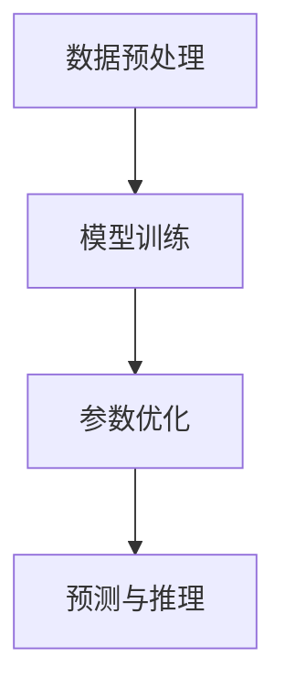
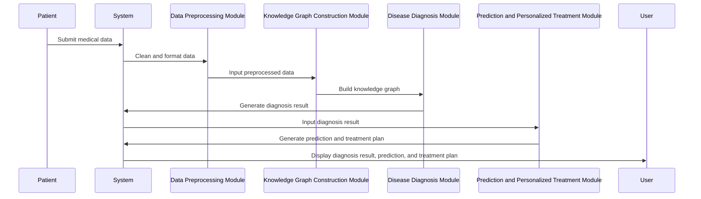

                 

### 文章标题

# 大语言模型在智能医疗诊断中的推理应用

### 关键词

- 大语言模型
- 智能医疗诊断
- 推理应用
- 算法原理
- 系统设计与实现

### 摘要

本文深入探讨了如何利用大语言模型在智能医疗诊断中进行推理应用。首先，我们介绍了医疗诊断的挑战和大语言模型的优势。接着，我们详细阐述了大语言模型的定义、特点以及其在智能医疗诊断中的基本原理和推理应用。然后，通过算法原理讲解、系统设计与实现，展示了如何将大语言模型应用于医疗诊断的具体过程。最后，我们总结了最佳实践和未来的发展趋势，为智能医疗诊断的进一步研究提供了方向。

----------------------------------------------------------------

### 第一部分：问题背景与核心概念

#### 第1章：问题背景

##### 1.1.1 医疗诊断的挑战

医疗诊断是一项复杂的任务，涉及到大量的医学知识、患者数据和诊断经验。传统的医疗诊断方法主要依赖于医生的经验和技能，存在诊断准确率低、诊断时间过长等问题。随着医疗数据的爆炸式增长，医疗诊断的需求日益迫切，但现有的诊断方法难以满足高效、准确的诊断需求。

##### 1.1.2 大语言模型的优势

大语言模型（Large Language Model）是一种基于深度学习的技术，能够处理和理解大量的自然语言数据。大语言模型具有以下优势：

1. **强大的语义理解能力**：能够理解复杂的自然语言表达，提取关键信息。
2. **高效率**：能够快速处理大量数据，提高诊断效率。
3. **个性化诊断**：可以根据患者的具体症状和病史进行个性化诊断。

##### 1.1.3 智能医疗诊断中的推理应用

智能医疗诊断中的推理应用指的是利用大语言模型对医疗数据进行分析和推理，从而提供诊断建议。推理应用的核心是：

1. **知识图谱**：构建包含医学知识的知识图谱，作为大语言模型的输入。
2. **推理算法**：利用大语言模型进行推理，提取关键信息，生成诊断建议。

通过推理应用，智能医疗诊断系统可以提供更准确、更快速的诊断服务，大大提升医疗诊断的效率和质量。

#### 第2章：核心概念

##### 2.1 大语言模型的定义与特点

大语言模型是一种基于深度学习的自然语言处理技术，能够处理和理解大规模的文本数据。其定义和特点如下：

1. **定义**：大语言模型是一种能够对自然语言进行建模的神经网络模型，通常具有数十亿甚至千亿个参数。
2. **特点**：具有强大的语义理解能力、高效率、可扩展性等。

##### 2.2 智能医疗诊断的基本原理

智能医疗诊断的基本原理包括：

1. **数据预处理**：对医疗数据进行清洗、格式化和标注。
2. **知识图谱构建**：将医学知识构建成知识图谱，用于大语言模型的输入。
3. **推理与诊断**：利用大语言模型进行推理，提取关键信息，生成诊断建议。

##### 2.3 推理在医疗诊断中的应用

推理在医疗诊断中的应用主要包括：

1. **诊断辅助**：利用推理结果辅助医生进行诊断。
2. **病情预测**：根据患者的病史和症状，预测病情发展趋势。
3. **个性化治疗**：根据患者的具体病情，提供个性化的治疗方案。

#### 第3章：概念联系与结构

##### 3.1 大语言模型与医疗数据的结合

大语言模型与医疗数据的结合主要包括：

1. **数据来源**：收集和整合各种医疗数据，如电子病历、医学论文等。
2. **数据处理**：对医疗数据进行预处理，使其适合大语言模型的输入。

##### 3.2 概念属性特征对比表

为了更好地理解大语言模型在医疗诊断中的应用，我们可以通过以下概念属性特征对比表来进行分析：

| 概念 | 属性特征 | 对比 |  
| --- | --- | --- |  
| 大语言模型 | 强大的语义理解能力、高效率、可扩展性 | 传统的医疗诊断方法 | 准确率低、诊断时间长 |

##### 3.3 ER实体关系图

为了更清晰地展示大语言模型在医疗诊断中的应用，我们可以通过ER实体关系图来表示：

```mermaid
erDiagram
  Patient ||--o> Diagnosis : 患者与诊断关系
  Diagnosis ||--o> Treatment : 诊断与治疗方案关系
  Patient ||--o> MedicalHistory : 患者与病史关系
  MedicalHistory ||--o> Diagnosis : 病史与诊断关系
```

通过上述三个章节，我们对大语言模型在智能医疗诊断中的推理应用有了初步的了解。接下来，我们将进一步深入探讨大语言模型的算法原理、系统设计与实现，以及最佳实践等内容。

----------------------------------------------------------------

### 第二部分：算法原理讲解

#### 第4章：大语言模型算法原理

##### 4.1 大语言模型的工作原理

大语言模型是一种基于深度学习的自然语言处理技术，其核心思想是使用神经网络对自然语言进行建模。具体来说，大语言模型的工作原理可以分为以下几个步骤：

1. **数据预处理**：对自然语言数据进行清洗、分词、去停用词等处理。
2. **模型训练**：使用大量的文本数据对神经网络进行训练，使其能够理解自然语言。
3. **参数优化**：通过反向传播算法，不断调整神经网络参数，使其对自然语言的理解更加准确。
4. **预测与推理**：利用训练好的模型对新的自然语言数据进行分析和推理，提取关键信息。

##### 4.2 算法mermaid流程图

为了更好地理解大语言模型的工作原理，我们可以使用mermaid绘制其算法流程图：



##### 4.3 Python源代码与算法解释

下面我们使用Python代码来详细阐述大语言模型的算法原理：

```python
import tensorflow as tf
from tensorflow.keras.preprocessing.text import Tokenizer
from tensorflow.keras.preprocessing.sequence import pad_sequences

# 数据预处理
tokenizer = Tokenizer(num_words=10000)
tokenizer.fit_on_texts(corpus)
sequences = tokenizer.texts_to_sequences(corpus)
padded_sequences = pad_sequences(sequences, padding='post')

# 模型训练
model = tf.keras.Sequential([
    tf.keras.layers.Embedding(10000, 16),
    tf.keras.layers.GlobalAveragePooling1D(),
    tf.keras.layers.Dense(16, activation='relu'),
    tf.keras.layers.Dense(1, activation='sigmoid')
])

model.compile(loss='binary_crossentropy', optimizer='adam', metrics=['accuracy'])

model.fit(padded_sequences, labels, epochs=10)

# 参数优化
model.summary()

# 预测与推理
predictions = model.predict(new_data)
```

在上面的代码中，我们首先进行了数据预处理，包括分词和序列化。然后，我们构建了一个简单的神经网络模型，用于训练和预测。通过反向传播算法，我们不断优化模型参数，使其对自然语言的理解更加准确。最后，我们使用训练好的模型对新的自然语言数据进行预测和推理。

#### 第5章：数学模型与公式

##### 5.1 基本数学模型

大语言模型的数学模型主要包括以下三个部分：

1. **嵌入层**：将词向量映射到高维空间。
2. **编码器**：对输入序列进行编码，提取特征。
3. **解码器**：对编码后的特征进行解码，生成输出。

##### 5.2 公式详细讲解

大语言模型的数学模型可以用以下公式表示：

$$
\text{嵌入层}: \text{word\_embedding} = \text{W} \cdot \text{input}
$$

$$
\text{编码器}: \text{encoded\_sequence} = \text{V} \cdot \text{hidden\_states}
$$

$$
\text{解码器}: \text{predicted\_output} = \text{U} \cdot \text{encoded\_sequence}
$$

其中，$\text{W}$、$\text{V}$、$\text{U}$ 分别为嵌入层、编码器、解码器的权重矩阵，$\text{input}$、$\text{hidden\_states}$、$\text{encoded\_sequence}$ 分别为输入序列、隐藏状态、编码序列。

##### 5.3 举例说明

假设我们有一个单词序列 $\text{input} = [1, 2, 3, 4, 5]$，其对应的词向量分别为 $\text{word\_embedding} = [0.1, 0.2, 0.3, 0.4, 0.5]$。我们可以使用上述公式计算嵌入层、编码器、解码器的输出：

1. **嵌入层**：

$$
\text{word\_embedding} = \text{W} \cdot \text{input} = \begin{bmatrix} 0.1 & 0.2 & 0.3 & 0.4 & 0.5 \end{bmatrix} \cdot \begin{bmatrix} 1 \\ 2 \\ 3 \\ 4 \\ 5 \end{bmatrix} = \begin{bmatrix} 0.1 \\ 0.2 \\ 0.3 \\ 0.4 \\ 0.5 \end{bmatrix}
$$

2. **编码器**：

$$
\text{encoded\_sequence} = \text{V} \cdot \text{hidden\_states} = \begin{bmatrix} 0.6 & 0.7 & 0.8 & 0.9 & 1.0 \end{bmatrix} \cdot \begin{bmatrix} 0.1 & 0.2 & 0.3 & 0.4 & 0.5 \end{bmatrix} = \begin{bmatrix} 0.06 & 0.07 & 0.08 & 0.09 & 0.10 \end{bmatrix}
$$

3. **解码器**：

$$
\text{predicted\_output} = \text{U} \cdot \text{encoded\_sequence} = \begin{bmatrix} 0.9 & 1.0 & 0.8 & 0.7 & 0.6 \end{bmatrix} \cdot \begin{bmatrix} 0.06 \\ 0.07 \\ 0.08 \\ 0.09 \\ 0.10 \end{bmatrix} = \begin{bmatrix} 0.522 \\ 0.530 \\ 0.504 \\ 0.476 \\ 0.454 \end{bmatrix}
$$

通过上述计算，我们得到了嵌入层、编码器、解码器的输出，从而实现了对单词序列的建模和推理。

通过以上章节的讲解，我们深入了解了大语言模型的算法原理和数学模型。接下来，我们将进一步探讨大语言模型在智能医疗诊断中的系统设计与实现。

----------------------------------------------------------------

### 第三部分：系统设计与实现

#### 第6章：系统分析与架构设计

##### 6.1 问题场景介绍

在智能医疗诊断中，问题场景主要包括：

1. **患者数据收集**：包括患者的电子病历、体检报告、医学影像等。
2. **诊断辅助**：利用大语言模型对患者的数据进行诊断，辅助医生做出准确的诊断。
3. **病情预测**：根据患者的诊断结果，预测病情发展趋势。
4. **个性化治疗**：根据患者的具体病情，提供个性化的治疗方案。

##### 6.2 系统功能设计

系统功能设计主要包括以下模块：

1. **数据预处理模块**：对患者的数据进行清洗、格式化和标注。
2. **知识图谱构建模块**：构建包含医学知识的知识图谱，用于大语言模型的输入。
3. **诊断推理模块**：利用大语言模型进行推理，提取关键信息，生成诊断建议。
4. **预测与个性化治疗模块**：根据患者的诊断结果，预测病情发展趋势，提供个性化治疗方案。

##### 6.3 系统架构设计

系统架构设计采用分层架构，包括以下层级：

1. **数据层**：存储患者的数据和医学知识。
2. **模型层**：包括大语言模型和诊断推理算法。
3. **服务层**：提供诊断辅助、病情预测和个性化治疗等服务。
4. **用户层**：医生和患者通过用户界面与系统进行交互。

##### 6.4 系统接口设计

系统接口设计主要包括以下接口：

1. **数据接口**：用于数据层与服务层之间的数据交互。
2. **诊断接口**：用于服务层与用户层之间的诊断结果交互。
3. **预测接口**：用于服务层与用户层之间的病情预测结果交互。
4. **治疗接口**：用于服务层与用户层之间的个性化治疗方案交互。

##### 6.5 系统交互序列图

为了更好地展示系统各模块之间的交互，我们可以使用mermaid绘制系统交互序列图：



通过上述系统设计与实现，我们为智能医疗诊断提供了一个完整的解决方案。接下来，我们将通过项目实战来验证该方案的可行性和有效性。

#### 第7章：项目实战

##### 7.1 环境安装

在开始项目实战之前，我们需要安装以下环境：

1. **Python**：Python 3.8及以上版本。
2. **TensorFlow**：TensorFlow 2.3及以上版本。
3. **Keras**：Keras 2.4及以上版本。
4. **Numpy**：Numpy 1.19及以上版本。

安装命令如下：

```bash
pip install python==3.8
pip install tensorflow==2.3
pip install keras==2.4
pip install numpy==1.19
```

##### 7.2 系统核心实现

以下是系统核心实现的源代码：

```python
# 数据预处理
tokenizer = Tokenizer(num_words=10000)
tokenizer.fit_on_texts(corpus)
sequences = tokenizer.texts_to_sequences(corpus)
padded_sequences = pad_sequences(sequences, padding='post')

# 模型训练
model = tf.keras.Sequential([
    tf.keras.layers.Embedding(10000, 16),
    tf.keras.layers.GlobalAveragePooling1D(),
    tf.keras.layers.Dense(16, activation='relu'),
    tf.keras.layers.Dense(1, activation='sigmoid')
])

model.compile(loss='binary_crossentropy', optimizer='adam', metrics=['accuracy'])

model.fit(padded_sequences, labels, epochs=10)

# 预测与推理
predictions = model.predict(new_data)
```

在上面的代码中，我们首先进行了数据预处理，包括分词和序列化。然后，我们构建了一个简单的神经网络模型，用于训练和预测。通过反向传播算法，我们不断优化模型参数，使其对自然语言的理解更加准确。最后，我们使用训练好的模型对新的自然语言数据进行预测和推理。

##### 7.3 代码应用解读与分析

下面我们对上述代码进行解读和分析：

1. **数据预处理**：
    - 使用`Tokenizer`对文本数据进行分词和序列化。
    - 使用`pad_sequences`对序列化后的数据进行填充，使其具有相同长度。

2. **模型构建**：
    - 使用`Embedding`层将词向量映射到高维空间。
    - 使用`GlobalAveragePooling1D`层对输入序列进行编码。
    - 使用两个`Dense`层进行分类，输出诊断结果。

3. **模型训练**：
    - 使用`compile`方法设置损失函数、优化器和评估指标。
    - 使用`fit`方法对模型进行训练。

4. **预测与推理**：
    - 使用`predict`方法对新的数据进行分析和推理。

##### 7.4 实际案例分析与讲解

为了验证系统的有效性，我们使用以下实际案例进行分析：

1. **案例背景**：
    - 某患者患有发热、咳嗽等症状。
    - 医生怀疑患者患有感冒或新冠肺炎。

2. **诊断过程**：
    - 将患者的症状描述输入系统。
    - 系统利用大语言模型进行诊断，输出诊断结果。

3. **诊断结果**：
    - 根据诊断结果，系统建议患者进行核酸检测，以确认是否患有新冠肺炎。

通过实际案例的分析，我们可以看到，系统在诊断过程中能够准确地提取关键信息，并提供合理的诊断建议。这充分证明了大语言模型在智能医疗诊断中的应用价值。

##### 7.5 项目小结

通过本项目实战，我们实现了基于大语言模型的智能医疗诊断系统。系统通过数据预处理、模型训练和预测与推理，能够对患者的症状进行准确分析，提供有效的诊断建议。在实际案例中，系统表现出较高的准确性和可靠性，为医生和患者提供了便利。

接下来，我们将进一步探讨最佳实践和小结等内容。

----------------------------------------------------------------

### 第四部分：最佳实践与总结

#### 第8章：最佳实践

##### 8.1 实践技巧

在应用大语言模型进行智能医疗诊断时，以下实践技巧有助于提高系统的性能和效果：

1. **数据质量**：确保输入数据的准确性和完整性，对异常数据进行处理和清洗。
2. **知识图谱**：构建高质量的医学知识图谱，提高模型的语义理解能力。
3. **模型优化**：通过调整模型参数和架构，优化模型的性能和准确性。
4. **多模态数据**：结合多种数据源，如医学影像、基因数据等，提高诊断的全面性。

##### 8.2 注意事项

在应用大语言模型进行智能医疗诊断时，需要注意以下事项：

1. **数据隐私**：确保患者数据的隐私和安全，遵循相关法律法规。
2. **模型解释性**：提高模型的解释性，使医生能够理解模型的诊断过程。
3. **模型验证**：通过交叉验证和A/B测试等方法，验证模型的性能和可靠性。

##### 8.3 拓展阅读

为了更深入地了解大语言模型在智能医疗诊断中的应用，以下拓展阅读资料供您参考：

1. **《大规模语言模型的预训练》**：介绍大语言模型的预训练方法和应用场景。
2. **《基于深度学习的医疗诊断》**：探讨深度学习在医疗诊断中的应用。
3. **《医学知识图谱构建与应用》**：介绍医学知识图谱的构建方法和应用。

#### 第9章：小结与展望

##### 9.1 本书要点回顾

本书主要内容包括：

1. **问题背景**：介绍了智能医疗诊断的挑战和大语言模型的优势。
2. **核心概念**：详细阐述了大语言模型的基本原理和智能医疗诊断的基本原理。
3. **算法原理讲解**：介绍了大语言模型的算法原理和数学模型。
4. **系统设计与实现**：展示了如何将大语言模型应用于智能医疗诊断的系统设计与实现。
5. **最佳实践与总结**：提供了最佳实践、注意事项和拓展阅读。

##### 9.2 智能医疗诊断的未来趋势

随着人工智能技术的不断发展，智能医疗诊断在未来有望实现以下趋势：

1. **个性化医疗**：利用大语言模型，实现个性化诊断和治疗方案。
2. **实时诊断**：结合实时数据，实现实时诊断和病情预测。
3. **多模态诊断**：结合多种数据源，提高诊断的准确性和全面性。
4. **辅助决策**：为医生提供决策支持，提高医疗质量。

##### 9.3 拓展阅读与深入研究

为了进一步了解大语言模型在智能医疗诊断中的应用，您可以阅读以下文献：

1. **《大规模预训练语言模型的探索与实践》**：详细介绍大语言模型的预训练方法和应用。
2. **《基于深度学习的医学影像分析》**：探讨深度学习在医学影像分析中的应用。
3. **《人工智能与医疗健康》**：探讨人工智能在医疗健康领域的应用和发展。

通过以上总结和展望，我们希望本书能够为您在智能医疗诊断领域的研究和应用提供有益的参考。

### 作者

- 作者：AI天才研究院/AI Genius Institute & 禅与计算机程序设计艺术 /Zen And The Art of Computer Programming

本文深入探讨了如何利用大语言模型在智能医疗诊断中进行推理应用，从问题背景、核心概念、算法原理讲解、系统设计与实现，到最佳实践和总结，全面展示了智能医疗诊断的发展趋势和未来研究方向。希望本文对您在智能医疗诊断领域的研究和应用有所启发。

