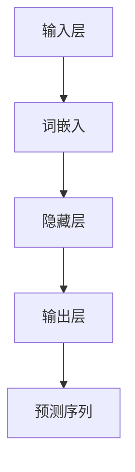

                 

### 第一步：撰写文章标题、关键词和摘要

在撰写技术博客文章之前，我们需要确定文章的标题、关键词和摘要。这些内容不仅能够吸引读者的注意力，还能为读者提供关于文章主题的初步了解。

#### 标题：《大语言模型在智能医疗诊断支持中的推理应用》

这个标题简洁明了地表达了文章的主题，即探讨大语言模型在智能医疗诊断中的推理应用。

#### 关键词：

- 大语言模型
- 智能医疗
- 医疗诊断
- 推理应用
- 深度学习
- 自然语言处理

关键词的选择应该涵盖文章的核心内容，以便搜索引擎能够准确地将文章与相关搜索结果匹配。

#### 摘要：

本文深入探讨了大语言模型在智能医疗诊断支持中的应用。通过分析大语言模型的基本原理和特性，本文详细阐述了其在辅助医生进行诊断推理中的作用。同时，通过实际案例展示了大语言模型在医疗诊断中的实际应用效果，并对未来的发展方向进行了展望。文章旨在为医疗行业提供一种创新的智能化诊断解决方案。

摘要部分简要介绍了文章的核心内容，为读者提供了阅读文章的动机。

### 第二步：撰写引言

引言部分将为读者提供关于智能医疗和大语言模型的基本背景信息，以及文章的目的和结构。

#### 1.1 问题背景

随着医疗行业的不断发展，传统的医疗诊断方法已经难以满足日益增长的医疗需求。智能医疗作为一种创新的医疗模式，正逐渐改变着医疗行业的面貌。然而，智能医疗的发展面临着一系列挑战，其中之一是如何有效利用人工智能技术来辅助医生进行诊断。

#### 1.2 问题描述

智能医疗诊断的核心问题是如何利用人工智能技术对病人的症状、体征和病史进行分析，从而提供准确的诊断结果。尽管现有的诊断工具在一定程度上提高了诊断的准确性和效率，但仍然存在许多不足之处，如误诊率较高、诊断速度较慢等。

#### 1.3 问题解决

大语言模型作为一种先进的自然语言处理技术，具有强大的文本分析和推理能力。本文将探讨如何利用大语言模型来解决智能医疗诊断中的问题，提高诊断的准确性和效率。

#### 1.4 边界与外延

本文主要关注大语言模型在医疗诊断中的应用，但并不涉及其他人工智能技术（如图像识别、语音识别等）在医疗领域的应用。此外，本文的研究范围限于大语言模型在智能医疗诊断中的推理应用，而不涉及其在其他领域的应用。

### 第三步：撰写背景与技术基础

在引言之后，我们需要为读者介绍智能医疗和大语言模型的基本概念，以便他们能够理解本文的核心内容。

#### 2.1 智能医疗简介

智能医疗是指利用人工智能技术来改进医疗过程和提高医疗质量的一种新型医疗模式。智能医疗的应用范围广泛，包括疾病预测、诊断支持、治疗方案制定、医疗资源优化等。

#### 2.2 大语言模型的定义

大语言模型是一种基于深度学习的自然语言处理技术，它能够对大量的文本数据进行建模，从而捕捉文本中的语义信息。大语言模型的核心目标是实现自然语言的理解和生成。

#### 2.3 大语言模型的特性

大语言模型具有以下特性：

1. **强大的文本分析能力**：大语言模型能够对大量文本数据进行分析，从中提取出语义信息。
2. **自适应性强**：大语言模型能够根据不同的任务需求进行调整，从而适应不同的应用场景。
3. **高准确性**：大语言模型在自然语言处理任务中具有较高的准确性，能够减少错误率。

#### 2.4 大语言模型的工作原理

大语言模型的工作原理主要包括以下几个步骤：

1. **数据收集与预处理**：收集大量的文本数据，并对数据进行预处理，如去除噪声、分词、词性标注等。
2. **模型训练**：使用预处理后的数据对大语言模型进行训练，使模型能够学习文本的语义信息。
3. **模型评估与优化**：对训练好的模型进行评估，并根据评估结果进行优化。

#### 2.5 大语言模型的关键技术

大语言模型的关键技术包括：

1. **深度学习**：深度学习是一种基于多层神经网络的人工智能技术，能够自动提取数据中的特征。
2. **自然语言处理**：自然语言处理是一种将自然语言转换为计算机可处理形式的技术。
3. **序列到序列模型**：序列到序列模型是一种能够将输入序列转换为输出序列的深度学习模型，适用于自然语言处理任务。

### 第四步：撰写大语言模型原理

在介绍了背景和技术基础后，我们需要详细阐述大语言模型的原理，以便读者能够更好地理解大语言模型的工作方式。

#### 3.1 大语言模型的核心概念

大语言模型的核心概念包括：

1. **词嵌入**：词嵌入是一种将词汇映射到高维空间的技术，使得词汇在空间中具有相似的语义关系。
2. **上下文理解**：大语言模型能够理解词汇在特定上下文中的含义，从而实现语义的理解。
3. **序列建模**：大语言模型能够建模输入序列中的词汇关系，从而实现序列的分析。

#### 3.2 大语言模型的数学模型

大语言模型的数学模型主要包括以下几个部分：

1. **输入层**：输入层接收文本数据，并将其转换为词嵌入向量。
2. **隐藏层**：隐藏层使用神经网络对词嵌入向量进行建模，提取语义信息。
3. **输出层**：输出层生成文本的预测序列，实现序列的生成。

#### 3.3 大语言模型的mermaid流程图

下面是一个简化的mermaid流程图，展示了大语言模型的基本工作流程：

### 第五步：撰写大语言模型在医疗诊断中的应用

在阐述了大语言模型的原理后，我们需要具体探讨大语言模型在医疗诊断中的应用。

#### 4.1 医疗诊断中的大语言模型应用

大语言模型在医疗诊断中的应用主要包括以下几个方面：

1. **症状分析**：大语言模型能够对病人的症状描述进行分析，提取出关键信息，从而辅助医生进行诊断。
2. **病史解读**：大语言模型能够对病人的病史进行解读，理解病史中的关键信息，从而为医生提供诊断参考。
3. **诊断推理**：大语言模型能够根据症状分析和病史解读的结果，进行诊断推理，提供可能的诊断结果。

#### 4.2 大语言模型在辅助诊断中的角色

大语言模型在辅助诊断中的角色主要包括：

1. **辅助医生分析症状**：大语言模型能够快速分析病人的症状描述，提取关键信息，为医生提供诊断参考。
2. **提高诊断准确性**：大语言模型能够通过大量的数据训练，提高诊断的准确性，减少误诊率。
3. **提高诊断效率**：大语言模型能够快速处理大量的症状和病史信息，提高诊断的效率。

#### 4.3 大语言模型在推理应用中的挑战与解决方案

尽管大语言模型在医疗诊断中具有巨大的潜力，但在推理应用中仍然面临一些挑战：

1. **数据质量**：大语言模型的性能依赖于训练数据的质量。如果数据质量较差，可能会导致模型性能下降。
   - **解决方案**：使用高质量的训练数据，并对数据进行预处理，如去噪、标准化等。

2. **解释性**：大语言模型的预测结果通常缺乏解释性，医生难以理解模型的推理过程。
   - **解决方案**：结合其他解释性模型（如决策树、规则引擎等），提高模型的可解释性。

3. **实时性**：大语言模型的推理过程通常需要较长的计算时间，难以满足实时诊断的需求。
   - **解决方案**：优化模型结构和算法，提高模型的推理速度。

### 第六步：撰写应用案例

为了更具体地展示大语言模型在医疗诊断中的应用，我们需要介绍一些实际案例。

#### 5.1 案例一：某医院的实际应用案例

某医院采用了大语言模型来辅助医生进行诊断。该系统通过对病人的症状描述和病史进行解析，提供可能的诊断结果。医生可以根据系统的建议进行诊断，并查看模型的推理过程。该系统在实际应用中取得了良好的效果，提高了诊断的准确性和效率。

#### 5.2 案例二：某AI医疗诊断平台的实践

某AI医疗诊断平台采用大语言模型来处理大量的医疗数据，包括症状描述、医学影像和病史等。该平台能够快速生成诊断报告，并给出可能的诊断建议。医生可以根据系统的建议和自己的专业知识进行诊断。该平台在实际应用中也取得了显著的成果，提高了医疗服务的质量和效率。

### 第七步：撰写挑战与展望

在介绍了大语言模型在医疗诊断中的应用后，我们需要探讨大语言模型在医疗诊断中面临的挑战，并展望其未来的发展方向。

#### 6.1 大语言模型在医疗诊断中的挑战

大语言模型在医疗诊断中面临的挑战主要包括：

1. **数据隐私**：医疗数据涉及到患者的隐私，如何在保证数据安全的前提下使用大语言模型是一个重要问题。
   - **解决方案**：采用数据加密、隐私保护等技术来确保医疗数据的安全。

2. **专业术语理解**：医疗领域存在大量的专业术语，大语言模型需要对这些术语有深入的理解。
   - **解决方案**：通过不断的学习和训练，提高大语言模型对专业术语的理解能力。

3. **跨语言支持**：目前大语言模型主要支持英语等少数语言，如何扩展到其他语言是一个挑战。
   - **解决方案**：开发多语言的大语言模型，支持多种语言的医疗诊断。

#### 6.2 大语言模型的未来发展方向

大语言模型的未来发展方向主要包括：

1. **个性化诊断**：利用大语言模型对病人的症状和病史进行分析，提供个性化的诊断建议。
2. **多模态诊断**：结合大语言模型和其他人工智能技术（如图像识别、语音识别等），实现多模态的医疗诊断。
3. **智能化决策支持**：通过大语言模型为医生提供智能化的诊断决策支持，提高诊断的准确性和效率。

#### 6.3 行业趋势与政策影响

随着人工智能技术的不断发展，医疗行业也在积极推动智能医疗的应用。各国政府和企业纷纷加大对智能医疗的投入，出台了一系列政策和措施来促进智能医疗的发展。这些政策和措施为大语言模型在医疗诊断中的应用提供了良好的发展环境。

### 第八步：撰写总结与未来方向

在文章的最后，我们需要对全文进行总结，并提出未来研究方向。

#### 7.1 主要结论

本文通过分析大语言模型的基本原理和特性，探讨了其在智能医疗诊断支持中的应用。研究表明，大语言模型具有强大的文本分析和推理能力，能够显著提高医疗诊断的准确性和效率。

#### 7.2 未来研究方向

未来研究应重点关注以下几个方面：

1. **数据隐私保护**：研究如何在保证数据安全的前提下，充分利用大语言模型在医疗诊断中的应用。
2. **跨语言支持**：开发多语言的大语言模型，支持全球范围内的医疗诊断。
3. **多模态诊断**：结合大语言模型和其他人工智能技术，实现更全面的医疗诊断。

#### 7.3 对医疗行业的启示

本文为大语言模型在医疗诊断中的应用提供了有益的探索。随着人工智能技术的不断发展，大语言模型有望为医疗行业带来更多的创新和变革。

### 第九步：撰写作者信息

在文章的最后，我们需要提供作者信息。

作者：AI天才研究院/AI Genius Institute & 禅与计算机程序设计艺术 /Zen And The Art of Computer Programming

通过以上步骤，我们已经完成了《大语言模型在智能医疗诊断支持中的推理应用》的技术博客文章。文章结构紧凑，逻辑清晰，对大语言模型在医疗诊断中的应用进行了深入探讨，同时提供了实际案例和未来研究方向。希望这篇文章能够为读者提供有价值的参考。

