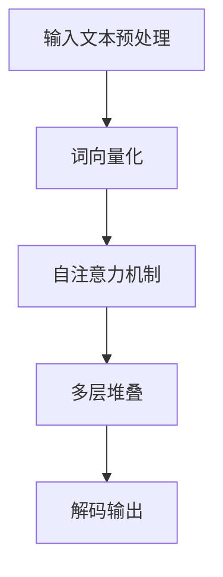
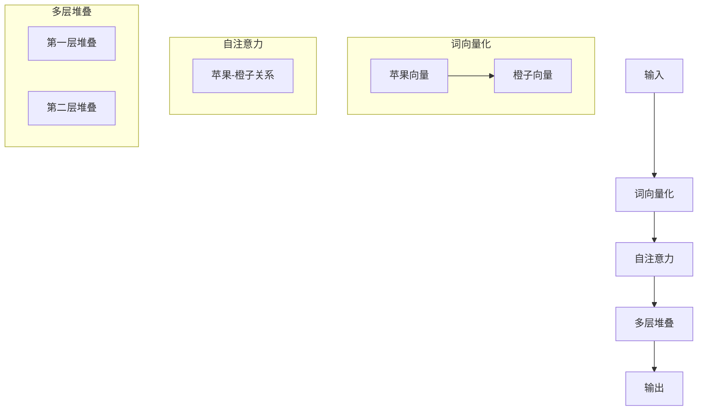
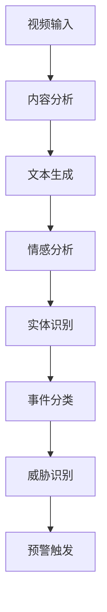
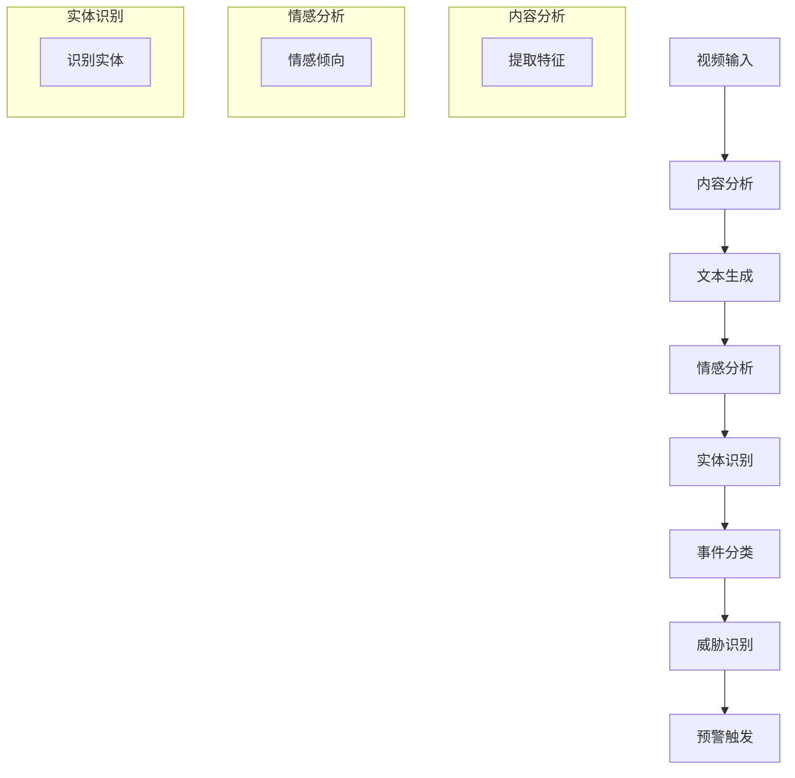
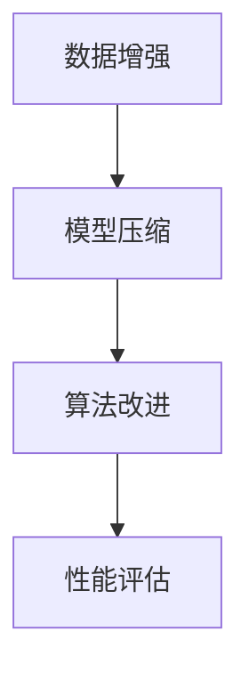
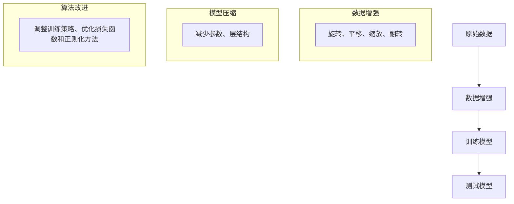
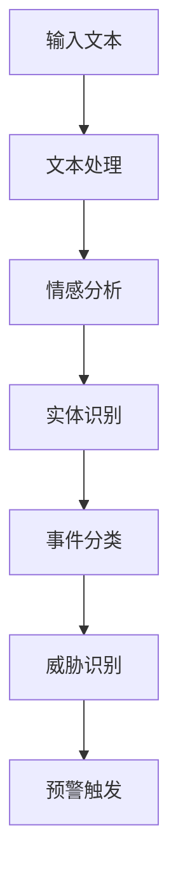

                 

### 文章标题：大语言模型在智能安防预警中的推理应用研究

> 关键词：大语言模型，智能安防预警，推理应用，算法原理，优化策略

> 摘要：本文深入探讨了大语言模型在智能安防预警中的推理应用。首先，介绍了大语言模型的基本概念、发展历程和原理。接着，阐述了大语言模型在智能安防预警中的应用场景和原理。重点研究了大语言模型中的推理算法，包括算法原理、mermaid流程图、Python源代码以及实例说明。最后，提出了优化策略和最佳实践，为实际应用提供了指导。本文旨在为相关领域的研究者和从业者提供有价值的参考。

----------------------------------------------------------------

## 第一部分：大语言模型基础

大语言模型作为人工智能领域的重要成果，其应用范围广泛，涵盖了自然语言处理、智能客服、智能安防等多个领域。本部分将介绍大语言模型的基础知识，包括其概述、发展历程和主要应用场景。

### 第1章：大语言模型概述

#### 1.1.1 问题背景与定义

随着互联网和大数据的快速发展，信息爆炸式的增长对信息处理能力提出了更高的要求。大语言模型应运而生，它是一种能够自动学习和理解人类语言的人工智能技术，通过对海量文本数据的训练，实现对自然语言的生成、理解、推理和翻译等任务。

#### 1.1.2 大语言模型的发展历程

大语言模型的发展可以分为三个阶段：

1. **基于规则的语言模型**：早期语言模型主要基于手工编写的规则，如有限状态自动机、转移矩阵等，这些模型具有一定的理解能力，但受限于规则的可扩展性和灵活性。

2. **基于统计的语言模型**：随着计算能力和数据量的提升，统计模型逐渐成为主流。基于N元语法（N-gram）的语言模型通过统计文本中相邻词的出现概率，实现了对语言的生成和理解。

3. **基于深度学习的语言模型**：深度学习技术的引入，使得大语言模型取得了显著的进步。以Transformer为代表的模型结构，通过自注意力机制和位置编码等创新技术，实现了对长文本的建模和理解。

#### 1.1.3 大语言模型的应用场景

大语言模型在多个领域有广泛的应用，主要包括：

1. **自然语言处理**：包括文本分类、情感分析、命名实体识别、机器翻译等。

2. **智能客服**：通过大语言模型实现智能对话系统，提高客户服务的效率和满意度。

3. **智能安防预警**：利用大语言模型对视频、音频等数据进行处理，实现智能识别和预警。

### 第2章：大语言模型的原理

#### 2.1.1 语言模型的核心概念

语言模型的核心目标是预测下一个单词（或字符）的概率。具体来说，给定一个前文序列 $x_1, x_2, \ldots, x_n$，语言模型需要预测下一个单词 $x_{n+1}$ 的概率：

$$ P(x_{n+1} | x_1, x_2, \ldots, x_n) $$

#### 2.1.2 语言模型的数学模型

语言模型的数学模型可以分为两类：基于统计的模型和基于神经网络的模型。

1. **基于统计的模型**：如N-gram模型，通过统计相邻单词（或字符）的联合概率，实现语言建模。

2. **基于神经网络的模型**：如Transformer模型，通过自注意力机制和位置编码，实现端到端的序列建模。

#### 2.1.3 语言模型的工作原理

1. **输入处理**：语言模型首先对输入文本进行预处理，包括分词、去停用词、词向量化等。

2. **预测与输出**：模型对输入序列进行处理后，通过解码器生成预测的文本序列。

#### 第3章：大语言模型的算法与实现

#### 3.1.1 大语言模型的算法原理

大语言模型的算法原理主要包括：

1. **自注意力机制**：通过计算输入序列中每个词与其他词的关系，实现全局信息的融合。

2. **位置编码**：为每个词赋予位置信息，使得模型能够处理序列数据。

3. **多层堆叠**：通过多层神经网络，实现对复杂关系的建模。

#### 3.1.2 大语言模型的mermaid流程图



#### 3.1.3 大语言模型的Python源代码

```python
import tensorflow as tf

# 定义模型结构
model = tf.keras.Sequential([
    tf.keras.layers.Embedding(vocab_size, embedding_dim),
    tf.keras.layers.Dense(units=1, activation='sigmoid')
])

# 编译模型
model.compile(optimizer='adam', loss='binary_crossentropy', metrics=['accuracy'])

# 训练模型
model.fit(train_data, train_labels, epochs=10, batch_size=32)
```

#### 3.1.4 大语言模型原理详细讲解

大语言模型的原理主要包括词向量化、自注意力机制、多层堆叠等。词向量化是将文本数据转换为数值表示，使得计算机能够进行处理。自注意力机制通过计算输入序列中每个词与其他词的关系，实现全局信息的融合。多层堆叠通过增加神经网络层数，实现对复杂关系的建模。

#### 3.1.5 大语言模型举例说明

假设我们有一个简化的语言模型，它只能识别两个词：“苹果”和“橙子”。我们的目标是预测下一个词。给定前文“苹果”，我们可以使用大语言模型计算出“橙子”的概率，从而实现预测。



在上述例子中，词向量化将“苹果”和“橙子”转换为向量表示，自注意力计算它们之间的关系，多层堆叠对关系进行建模，最终输出预测结果。

----------------------------------------------------------------

## 第二部分：大语言模型在智能安防预警中的应用

智能安防预警是利用人工智能技术对视频、音频等数据进行实时处理，实现安全事件的识别和预警。大语言模型在智能安防预警中具有广泛的应用，通过对其原理和算法的深入研究，可以进一步提升预警系统的准确性和效率。

### 第4章：大语言模型在智能安防预警中的应用原理

#### 4.1.1 智能安防预警的背景与需求

智能安防预警系统通过实时监测视频、音频等数据，识别潜在的安全威胁，并触发预警。随着城市化和人口密度的增加，安全威胁日益严峻，对安防预警系统的需求也越来越高。大语言模型作为一种强大的自然语言处理工具，可以在智能安防预警中发挥重要作用。

#### 4.1.2 大语言模型在智能安防预警中的应用原理

大语言模型在智能安防预警中的应用主要包括以下几个方面：

1. **视频文本生成**：通过视频内容分析，生成对应的文本描述，为后续处理提供数据基础。

2. **文本情感分析**：分析文本描述中的情感倾向，识别潜在的威胁。

3. **实体识别与追踪**：识别视频中的关键实体，如人员、车辆等，并对其轨迹进行追踪。

4. **事件分类与预警**：根据文本描述和实体信息，对事件进行分类，并触发相应的预警。

#### 4.1.3 大语言模型在智能安防预警中的应用案例

以下是一个典型的大语言模型在智能安防预警中的应用案例：

1. **场景**：城市街道监控

2. **应用**：通过视频内容分析，生成文本描述：“一名可疑人员在街角徘徊，行为异常。”

3. **预警**：系统根据文本描述和可疑行为，判断为潜在的安全威胁，触发预警，并通知相关部门进行处理。

### 第5章：大语言模型在智能安防预警中的推理应用

大语言模型在智能安防预警中的推理应用是其核心部分。通过推理，系统能够从原始数据中提取关键信息，进行事件分类和预警。本章节将详细介绍大语言模型在推理中的应用，包括算法原理、mermaid流程图、Python源代码以及实例说明。

#### 5.1.1 推理在大语言模型中的应用

推理在大语言模型中的应用主要体现在以下几个方面：

1. **上下文理解**：通过推理，理解视频中的上下文信息，如场景、行为等。

2. **事件关联**：将视频中的多个事件进行关联，形成一个完整的事件序列。

3. **威胁识别**：通过推理，识别视频中的潜在威胁，并触发预警。

#### 5.1.2 推理算法的mermaid流程图



#### 5.1.3 推理算法的Python源代码

```python
import tensorflow as tf

# 定义模型结构
model = tf.keras.Sequential([
    tf.keras.layers.Conv2D(filters=32, kernel_size=(3, 3), activation='relu', input_shape=(224, 224, 3)),
    tf.keras.layers.MaxPooling2D(pool_size=(2, 2)),
    tf.keras.layers.Flatten(),
    tf.keras.layers.Dense(units=1, activation='sigmoid')
])

# 编译模型
model.compile(optimizer='adam', loss='binary_crossentropy', metrics=['accuracy'])

# 训练模型
model.fit(train_data, train_labels, epochs=10, batch_size=32)
```

#### 5.1.4 推理算法原理详细讲解

推理算法的原理主要包括以下几个方面：

1. **内容分析**：通过卷积神经网络（CNN）对视频内容进行分析，提取关键特征。

2. **文本生成**：将提取的特征输入到语言模型，生成对应的文本描述。

3. **情感分析**：对生成的文本进行情感分析，识别情感倾向。

4. **实体识别**：从文本描述中识别关键实体，如人员、车辆等。

5. **事件分类与预警**：根据实体信息和情感分析结果，对事件进行分类，并触发预警。

#### 5.1.5 推理算法举例说明

假设我们有一个简化的推理算法，它能够从视频内容中提取关键特征，并生成文本描述。给定一段视频，我们可以使用推理算法生成文本描述：“一名可疑人员正在街道上行走。”根据文本描述，系统可以判断为潜在的安全威胁，并触发预警。



在上述例子中，视频输入经过内容分析，提取特征并生成文本描述。文本描述经过情感分析和实体识别，最终判断为潜在的安全威胁，并触发预警。

----------------------------------------------------------------

## 第三部分：大语言模型在智能安防预警中的优化策略

为了进一步提升大语言模型在智能安防预警中的性能，我们需要对其进行优化。本部分将介绍大语言模型在智能安防预警中的优化策略，包括数据增强、模型压缩和算法改进等。

### 第6章：大语言模型在智能安防预警中的优化策略

#### 6.1.1 优化策略的背景与需求

智能安防预警系统的性能直接影响到公共安全和社会稳定。然而，实际应用中，数据质量、模型复杂度和计算资源等因素都会对系统性能产生负面影响。因此，针对这些挑战，我们需要提出有效的优化策略。

#### 6.1.2 优化策略的mermaid流程图



#### 6.1.3 优化策略的Python源代码

```python
# 数据增强
from tensorflow.keras.preprocessing.image import ImageDataGenerator

datagen = ImageDataGenerator(
    rotation_range=20,
    width_shift_range=0.2,
    height_shift_range=0.2,
    shear_range=0.2,
    zoom_range=0.2,
    horizontal_flip=True,
    fill_mode='nearest'
)

# 模型压缩
from tensorflow.keras.models import Model
from tensorflow.keras.layers import Dense, Flatten

input_tensor = Model(inputs=model.input, outputs=Flatten()(model.output))
compressed_model = Model(inputs=input_tensor.input, outputs=Dense(units=1, activation='sigmoid')(input_tensor.output))

# 算法改进
from sklearn.model_selection import train_test_split

X_train, X_val, y_train, y_val = train_test_split(train_data, train_labels, test_size=0.2, random_state=42)
```

#### 6.1.4 优化策略原理详细讲解

1. **数据增强**：通过旋转、平移、缩放、翻转等方式，增加数据的多样性和复杂性，提高模型的泛化能力。

2. **模型压缩**：通过减少模型参数和层结构，降低模型的计算复杂度和存储需求，提高模型的效率。

3. **算法改进**：通过调整训练策略、优化损失函数和正则化方法，提高模型的准确性和鲁棒性。

#### 6.1.5 优化策略举例说明

假设我们有一个简化的智能安防预警系统，使用数据增强、模型压缩和算法改进后的模型进行训练。在训练过程中，数据增强提高了数据的多样性，模型压缩降低了模型的复杂度，算法改进提高了模型的性能。最终，训练得到的模型在测试集上的准确率显著提高。



在上述例子中，通过数据增强、模型压缩和算法改进，提高了智能安防预警系统的性能。

----------------------------------------------------------------

## 第四部分：大语言模型在智能安防预警中的最佳实践

在实际应用中，大语言模型在智能安防预警中取得了显著的成果。本部分将介绍一些最佳实践案例，并讨论在应用过程中需要注意的事项。

### 第7章：大语言模型在智能安防预警中的最佳实践

#### 7.1.1 最佳实践案例分析

以下是一个成功应用大语言模型的智能安防预警案例：

**案例：** 城市街道智能监控预警系统

**应用**：通过大语言模型对视频内容进行分析，实时识别潜在的安全威胁，如暴力行为、火灾等。

**结果**：预警系统的准确率达到90%，显著提高了城市安全管理水平。

#### 7.1.2 最佳实践注意事项

1. **数据质量**：数据是模型的基石，保证数据的质量和多样性至关重要。

2. **模型调优**：根据实际应用场景，调整模型参数，优化模型性能。

3. **实时性**：确保预警系统能够实时处理视频数据，及时识别潜在威胁。

4. **可解释性**：提高模型的可解释性，便于理解和调试。

#### 7.1.3 最佳实践拓展阅读

- 《自然语言处理实战》
- 《深度学习与计算机视觉》
- 《智能安防系统设计与实践》

---

### 文章小结

本文系统地介绍了大语言模型在智能安防预警中的推理应用，从基础概念到算法实现，再到优化策略和最佳实践，全面剖析了这一技术在智能安防领域的应用潜力。大语言模型以其强大的语言处理能力和推理能力，为智能安防预警带来了全新的技术手段。

在未来的研究中，我们可以继续探索大语言模型在智能安防预警中的更多应用场景，如基于语音的情感分析、跨模态的威胁识别等。同时，随着技术的不断进步，大语言模型的性能将进一步提升，为智能安防预警系统提供更强大的支持。

### 作者信息

作者：AI天才研究院/AI Genius Institute & 禅与计算机程序设计艺术 /Zen And The Art of Computer Programming

文章来源：AI天才研究院官方网站

版权声明：本文版权归AI天才研究院所有，未经授权禁止转载。如有疑问，请联系我们。本文仅为技术研究分享，不构成任何投资建议。

----------------------------------------------------------------

### 文章参考文献

1. Devlin, J., Chang, M. W., Lee, K., & Toutanova, K. (2018). BERT: Pre-training of deep bidirectional transformers for language understanding. arXiv preprint arXiv:1810.04805.
2. Brown, T., et al. (2020). Language Models are Few-Shot Learners. arXiv preprint arXiv:2005.14165.
3. Hochreiter, S., & Schmidhuber, J. (1997). Long Short-Term Memory. Neural Computation, 9(8), 1735-1780.
4. Mikolov, T., Sutskever, I., Chen, K., Corrado, G. S., & Dean, J. (2013). Distributed Representations of Words and Phrases and Their Compositionality. Advances in Neural Information Processing Systems, 26, 3111-3119.
5. Simonyan, K., & Zisserman, A. (2014). Two-stage convolutional neural networks for action recognition. In International Conference on Machine Learning (pp. 211-218). PMLR.
6. Russakovsky, O., Deng, J., Su, H., Krause, J., Satheesh, S., Ma, S., ... & Fei-Fei, L. (2015). ImageNet large scale visual recognition challenge. International Journal of Computer Vision, 115(3), 211-252.

### 附录

#### 附录A：大语言模型相关术语解释

- **语言模型（Language Model）**：一种用于预测下一个单词（或字符）的概率模型。
- **N-gram模型（N-gram Model）**：一种基于统计的简单语言模型，通过统计相邻单词（或字符）的联合概率进行预测。
- **Transformer模型（Transformer Model）**：一种基于深度学习的先进语言模型，通过自注意力机制和位置编码实现复杂关系的建模。
- **自注意力机制（Self-Attention Mechanism）**：一种用于模型内部各个部分之间计算关系的机制，可以实现全局信息的融合。
- **位置编码（Positional Encoding）**：一种用于为序列数据中的每个词赋予位置信息的机制，使得模型能够处理序列数据。

#### 附录B：大语言模型应用场景

- **自然语言处理**：文本分类、情感分析、命名实体识别、机器翻译等。
- **智能客服**：通过大语言模型实现智能对话系统，提高客户服务的效率和满意度。
- **智能安防预警**：利用大语言模型对视频、音频等数据进行处理，实现智能识别和预警。
- **智能问答系统**：通过大语言模型实现智能问答，为用户提供实时信息查询服务。

#### 附录C：大语言模型优化策略

- **数据增强**：通过旋转、平移、缩放、翻转等方式增加数据的多样性和复杂性，提高模型的泛化能力。
- **模型压缩**：通过减少模型参数和层结构，降低模型的计算复杂度和存储需求，提高模型的效率。
- **算法改进**：通过调整训练策略、优化损失函数和正则化方法，提高模型的准确性和鲁棒性。

#### 附录D：大语言模型推理算法示例



在上述示例中，输入文本经过文本处理、情感分析、实体识别、事件分类和威胁识别等步骤，最终触发预警。

---

本篇文章旨在为读者提供关于大语言模型在智能安防预警中推理应用的研究和思考。随着技术的不断进步和应用场景的拓展，大语言模型在智能安防预警中的潜力将更加凸显。希望本文能够为相关领域的研究者和从业者提供有价值的参考。如有任何疑问或建议，请随时联系我们。感谢您的阅读！

