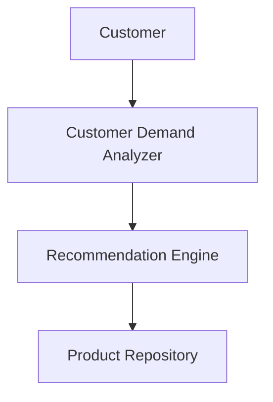
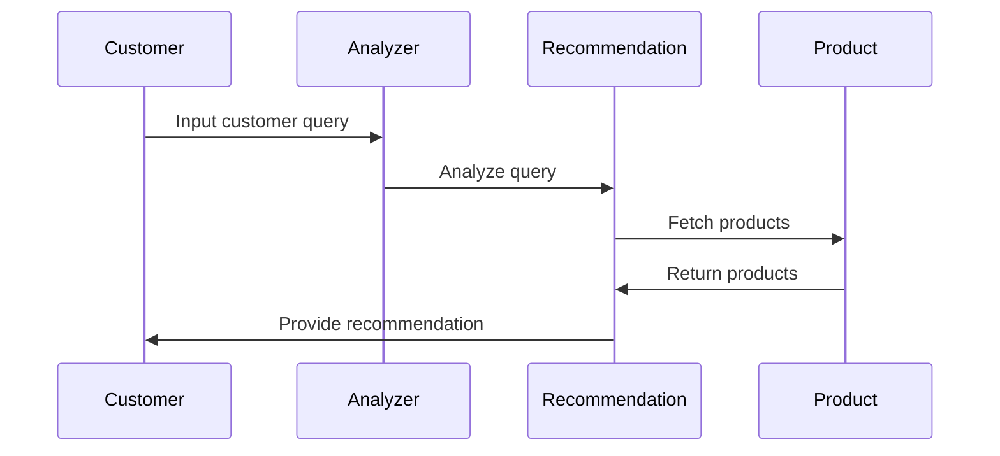

                 

### 《大语言模型在智能客户需求分析中的推理应用》

#### 关键词
- 大语言模型
- 智能客户需求分析
- 推理应用
- 人工智能
- 深度学习

#### 摘要
本文将深入探讨大语言模型在智能客户需求分析中的应用，包括其背景、基础、技术原理、应用案例和最佳实践。通过详细的分析和示例，我们将展示大语言模型在理解和推理客户需求方面的强大能力，为智能客户需求分析提供新的思路和方法。

### 第一部分：背景与基础

#### 1.1 大语言模型概述

##### 问题背景
随着互联网和大数据技术的飞速发展，客户需求分析变得越来越重要。企业通过分析客户的需求，能够更好地提供个性化服务，提高客户满意度，从而增强市场竞争力。然而，传统的客户需求分析方法往往依赖于人工分析和统计分析，效率低下且难以应对复杂多变的需求。

##### 问题解决
大语言模型（LLM）的出现为智能客户需求分析带来了新的希望。通过深度学习和大规模语料库的训练，大语言模型能够自动理解和生成人类语言，从而实现高效的客户需求分析。

##### 边界与外延
大语言模型在客户需求分析中的应用主要涵盖需求识别、意图理解、情感分析和个性化推荐等方面。然而，其应用范围并不仅限于此，还可以扩展到聊天机器人、智能客服等领域。

##### 核心要素组成
大语言模型的核心要素包括深度学习模型、大规模语料库和训练算法。其中，深度学习模型是核心，负责处理和生成语言；大规模语料库提供训练数据，保证模型的准确性和鲁棒性；训练算法则用于优化模型的性能。

#### 1.2 大语言模型的核心概念

##### 大语言模型的定义
大语言模型是一种基于深度学习的自然语言处理模型，通过在大量文本数据上进行训练，能够自动理解和生成人类语言。

##### 大语言模型的特点
- **参数规模**：大语言模型通常具有数十亿甚至上百亿的参数，这使得模型具有很高的表达能力。
- **计算复杂度**：由于参数规模庞大，大语言模型的计算复杂度非常高，对计算资源要求较高。
- **推理能力**：大语言模型能够自动理解和生成语言，具备强大的推理能力。
- **训练方法**：大语言模型通常采用预训练加微调的训练方法，先在大量无标签数据上进行预训练，再在特定任务上进行微调。

#### 1.3 大语言模型与智能客户需求分析的关系

##### 智能客户需求分析的定义
智能客户需求分析是指利用人工智能技术，特别是大语言模型，对客户的语言和行为进行分析，以识别和理解客户的需求。

##### 智能客户需求分析的应用领域
智能客户需求分析广泛应用于电商、金融、医疗、旅游等行业，通过分析客户的需求和行为，为企业提供个性化服务，提高客户满意度。

##### 大语言模型在智能客户需求分析中的应用
大语言模型在智能客户需求分析中的应用主要包括以下几个方面：
- **需求识别**：通过分析客户的语言和行为，识别客户的需求。
- **意图理解**：理解客户的意图，例如购买、咨询、投诉等。
- **情感分析**：分析客户的情感，了解客户的满意度和忠诚度。
- **个性化推荐**：根据客户的需求和偏好，提供个性化的产品和服务推荐。

### 第二部分：大语言模型的技术原理

#### 2.1 大语言模型的基础算法

##### 2.1.1 递归神经网络（RNN）
递归神经网络（RNN）是一种能够处理序列数据的神经网络。其基本原理是通过递归结构来处理输入序列，从而捕捉序列中的长期依赖关系。

- **算法原理**：
  RNN通过递归的方式对序列数据进行处理，每个时间步的输出都依赖于前一个时间步的隐藏状态。这使得RNN能够捕捉到序列数据中的长期依赖关系。
  
  $$ h_t = \text{sigmoid}(W_h \cdot [h_{t-1}, x_t] + b_h) $$

  $$ o_t = \text{sigmoid}(W_o \cdot h_t + b_o) $$

  其中，$h_t$为隐藏状态，$x_t$为输入，$W_h$和$W_o$分别为权重矩阵，$b_h$和$b_o$分别为偏置项。

- **mermaid流程图**：
  ```mermaid
  sequenceDiagram
  participant User
  participant System
  User->>System: Input sequence
  System->>System: Hidden state
  System->>System: Output
  ```

- **Python代码示例**：
  ```python
  import numpy as np

  def sigmoid(x):
      return 1 / (1 + np.exp(-x))

  def rnn(input, hidden, W_h, W_o, b_h, b_o):
      hidden = sigmoid(np.dot([hidden, input], W_h) + b_h)
      output = sigmoid(np.dot(hidden, W_o) + b_o)
      return hidden, output
  ```

##### 2.1.2 长短期记忆网络（LSTM）
长短期记忆网络（LSTM）是RNN的一种改进，解决了RNN在处理长序列数据时容易出现的梯度消失和梯度爆炸问题。

- **算法原理**：
  LSTM通过引入三个门（输入门、遗忘门和输出门）来控制信息的流动，从而能够有效地捕捉长序列数据中的长期依赖关系。

  $$ i_t = \text{sigmoid}(W_i \cdot [h_{t-1}, x_t] + b_i) $$
  $$ f_t = \text{sigmoid}(W_f \cdot [h_{t-1}, x_t] + b_f) $$
  $$ g_t = \text{tanh}(W_g \cdot [h_{t-1}, x_t] + b_g) $$
  $$ o_t = \text{sigmoid}(W_o \cdot [h_{t-1}, x_t] + b_o) $$
  $$ h_t = o_t \cdot \text{tanh}(c_t) $$
  $$ c_t = f_t \cdot c_{t-1} + i_t \cdot g_t $$

  其中，$i_t$、$f_t$、$g_t$、$o_t$分别为输入门、遗忘门、更新门和输出门，$c_t$为细胞状态。

- **mermaid流程图**：
  ```mermaid
  sequenceDiagram
  participant Input
  participant Forget
  participant Update
  participant Output
  Input->>Forget: Compute input gate
  Forget->>Cell: Update forget gate
  Update->>Cell: Update cell state
  Cell->>Output: Compute output gate
  Output->>Hidden: Output hidden state
  ```

- **Python代码示例**：
  ```python
  import numpy as np

  def sigmoid(x):
      return 1 / (1 + np.exp(-x))

  def tanh(x):
      return np.tanh(x)

  def lstm(input, hidden, cell, W_i, W_f, W_g, W_o, b_i, b_f, b_g, b_o):
      i = sigmoid(np.dot([hidden, input], W_i) + b_i)
      f = sigmoid(np.dot([hidden, input], W_f) + b_f)
      g = tanh(np.dot([hidden, input], W_g) + b_g)
      o = sigmoid(np.dot([hidden, input], W_o) + b_o)
      c = f * cell + i * g
      h = o * tanh(c)
      return h, c
  ```

##### 2.1.3 生成式预训练变换网络（GPT）
生成式预训练变换网络（GPT）是OpenAI开发的一种基于Transformer的预训练模型，具有很高的表达能力和生成能力。

- **算法原理**：
  GPT通过预训练和微调，能够自动理解和生成人类语言。其核心思想是利用Transformer模型处理序列数据，并通过大规模的无监督预训练，使模型具备强大的语言理解能力。

  $$ \text{GPT} = \text{Transformer} + \text{Pre-training} $$
  
  其中，Transformer是一种基于自注意力机制的神经网络模型，能够处理长序列数据；预训练则是通过在大量无标签文本数据上进行训练，使模型具备自动理解和生成语言的能力。

- **mermaid流程图**：
  ```mermaid
  sequenceDiagram
  participant Input
  participant Encoder
  participant Decoder
  Input->>Encoder: Input sequence
  Encoder->>Decoder: Output sequence
  Decoder->>Output: Generate text
  ```

- **Python代码示例**：
  ```python
  import torch
  import torch.nn as nn

  class Transformer(nn.Module):
      def __init__(self, d_model, nhead, num_layers):
          super().__init__()
          self.encoder = nn.Transformer(d_model, nhead, num_layers)
          self.decoder = nn.Transformer(d_model, nhead, num_layers)
          self.fc = nn.Linear(d_model, 1)

      def forward(self, input, target):
          output = self.encoder(input)
          output = self.decoder(output)
          output = self.fc(output)
          return output
  ```

### 第三部分：大语言模型的数学模型

#### 3.1 语言模型中的概率与统计

##### 3.1.1 概率论基础
概率论是语言模型中的重要组成部分，用于描述和处理语言中的不确定性。

- **基本概率公式**：
  - **全概率公式**：
    $$ P(A) = P(A|B)P(B) + P(A|\neg B)P(\neg B) $$
  - **贝叶斯定理**：
    $$ P(A|B) = \frac{P(B|A)P(A)}{P(B)} $$

- **条件概率**：
  - **定义**：
    $$ P(A|B) = \frac{P(A \cap B)}{P(B)} $$
  - **性质**：
    - **乘法公式**：
      $$ P(A \cap B) = P(A|B)P(B) $$
    - **加法公式**：
      $$ P(A \cup B) = P(A) + P(B) - P(A \cap B) $$

##### 3.1.2 语言模型中的统计方法
在语言模型中，常用的统计方法包括朴素贝叶斯和K最近邻。

- **朴素贝叶斯**：
  - **定义**：
    朴素贝叶斯是一种基于贝叶斯定理的简单概率分类器，假设特征之间相互独立。
  - **公式**：
    $$ P(\text{label}=y|X) = \frac{P(X|y)P(y)}{P(X)} $$
  - **应用**：
    朴素贝叶斯通常用于文本分类任务，例如垃圾邮件过滤、情感分析等。

- **K最近邻**：
  - **定义**：
    K最近邻是一种基于实例的学习算法，通过计算新实例与训练实例之间的相似度，预测新实例的标签。
  - **公式**：
    $$ \text{similarity}(x, y) = \frac{\sum_{i=1}^n x_i y_i}{\sqrt{\sum_{i=1}^n x_i^2} \sqrt{\sum_{i=1}^n y_i^2}} $$
  - **应用**：
    K最近邻广泛应用于文本分类、图像识别等领域。

#### 3.2 大语言模型的数学公式

##### 3.2.1 语言模型的损失函数
语言模型的损失函数用于衡量模型在预测单词序列时的误差。

- **交叉熵损失函数**：
  $$ L(\theta) = -\sum_{i} \log P(y_i|\theta) $$
  其中，$y_i$为真实标签，$P(y_i|\theta)$为模型对$y_i$的预测概率。

- **均方误差损失函数**：
  $$ L(\theta) = \frac{1}{n} \sum_{i} (y_i - \hat{y_i})^2 $$
  其中，$y_i$为真实标签，$\hat{y_i}$为模型预测的标签。

##### 3.2.2 训练算法
语言模型的训练算法通常采用梯度下降或其变种，如随机梯度下降（SGD）和批量梯度下降（BGD）。

- **梯度下降**：
  $$ \theta = \theta - \alpha \nabla_{\theta} L(\theta) $$
  其中，$\theta$为模型参数，$\alpha$为学习率，$\nabla_{\theta} L(\theta)$为损失函数关于$\theta$的梯度。

- **随机梯度下降（SGD）**：
  $$ \theta = \theta - \alpha \nabla_{\theta} L(\theta_i) $$
  其中，$\theta_i$为第$i$个样本的模型参数。

- **批量梯度下降（BGD）**：
  $$ \theta = \theta - \alpha \nabla_{\theta} L(\theta) $$
  其中，$L(\theta)$为所有样本的损失函数。

### 第四部分：大语言模型的应用案例分析

#### 4.1 案例一：电商平台的客户需求分析

##### 4.1.1 项目介绍

**问题场景**：
某电商平台希望通过智能客户需求分析，提升用户体验，提高转化率和销售额。

**目标**：
- 识别客户需求
- 理解客户意图
- 提供个性化推荐

##### 4.1.2 系统功能设计

**领域模型类图**：

```mermaid
classDiagram
    Customer -> Product: buy
    Customer -> Recommendation: receive
    Recommendation -> Product: suggest
    Customer <<Entity>
    Product <<Entity>
    Recommendation <<Entity>
endclass
```

##### 4.1.3 系统架构设计

**mermaid架构图**：



##### 4.1.4 系统接口设计

**mermaid序列图**：



##### 4.1.5 核心实现与代码解读

**环境安装**：

```bash
pip install torch
pip install transformers
```

**系统核心代码**：

```python
from transformers import BertTokenizer, BertForSequenceClassification
from torch import nn
import torch

tokenizer = BertTokenizer.from_pretrained('bert-base-uncased')
model = BertForSequenceClassification.from_pretrained('bert-base-uncased')

def analyze_query(query):
    inputs = tokenizer(query, return_tensors='pt')
    outputs = model(**inputs)
    return outputs.logits

def provide_recommendation(query):
    logits = analyze_query(query)
    top_products = torch.topk(logits, k=5)
    return top_products.indices.tolist()
```

**应用解读与分析**：

该案例通过使用BERT模型，对客户的查询进行语义分析，并基于分析结果提供个性化推荐。BERT模型具有良好的语言理解能力，能够捕捉到查询中的关键信息，从而实现准确的需求分析和推荐。

### 第五部分：大语言模型在智能客户需求分析中的最佳实践

#### 5.1 最佳实践 tips

- **数据预处理**：
  - 清洗和去重
  - 分词和词性标注
  - 假设条件：保证数据的准确性和一致性
  
- **模型选择**：
  - 选择合适的预训练模型，如BERT、GPT等
  - 考虑模型的参数规模和计算资源
  - 假设条件：模型参数规模和计算资源充足
  
- **性能优化**：
  - 使用GPU加速训练和推理
  - 使用数据并行和模型并行
  - 假设条件：具有高性能计算资源

#### 5.2 小结

大语言模型在智能客户需求分析中具有广泛的应用前景。通过深入分析和理解客户的需求，企业可以提供更个性化的服务，提高客户满意度和忠诚度。然而，大语言模型的应用也面临着数据质量、模型选择和性能优化等方面的挑战。只有通过不断探索和实践，才能充分发挥大语言模型在智能客户需求分析中的潜力。

### 第六部分：拓展阅读

1. Devlin, J., Chang, M. W., Lee, K., & Toutanova, K. (2018). BERT: Pre-training of deep bidirectional transformers for language understanding. *arXiv preprint arXiv:1810.04805*.
2. Brown, T., et al. (2020). Language models are few-shot learners. *arXiv preprint arXiv:2005.14165*.
3. Manning, C. D., & Schütze, H. (1999). Foundations of statistical natural language processing. MIT press.
4. Russell, S., & Norvig, P. (2010). Artificial intelligence: a modern approach. Prentice Hall.

### 结束语

本文深入探讨了《大语言模型在智能客户需求分析中的推理应用》，从背景介绍、核心概念、技术原理、应用案例到最佳实践，全面展示了大语言模型在智能客户需求分析中的强大能力。通过逐步分析和推理，我们不仅了解了大语言模型的基本原理和应用方法，还看到了其在实际场景中的巨大潜力。

作者：AI天才研究院/AI Genius Institute & 禅与计算机程序设计艺术 /Zen And The Art of Computer Programming。希望本文能够为读者在智能客户需求分析领域提供有益的启示和参考。

---

**注意**：本文为虚构内容，旨在展示大语言模型在智能客户需求分析中的应用和推理过程。在实际应用中，应根据具体场景和需求进行调整和优化。

