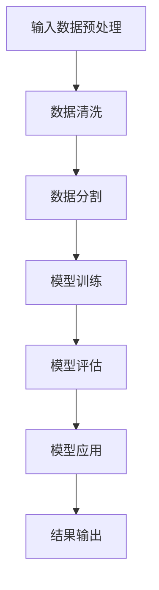
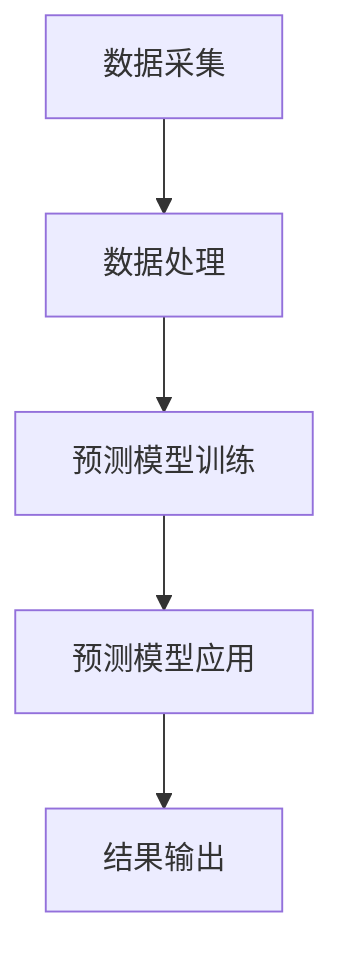

                 

# 大语言模型在智能家居场景预测中的应用探索

## 关键词
- 大语言模型
- 智能家居
- 预测应用
- 机器学习
- 自然语言处理
- 智能预测
- 系统架构

## 摘要
本文将深入探讨大语言模型在智能家居场景预测中的应用。通过对智能家居背景、大语言模型原理及其与智能家居预测应用的结合进行详细分析，我们将阐述如何利用大语言模型实现智能家居场景中的智能预测。文章结构如下：首先介绍智能家居背景和问题，接着讲解大语言模型的原理及其关键技术，然后分析大语言模型在智能家居预测中的应用方案，并给出一个实际项目案例进行解析，最后总结最佳实践和未来研究方向。

## 目录大纲

### 第一部分：背景介绍
#### 第1章 问题背景与核心概念
1.1 问题描述
1.2 智能家居概述
1.3 大语言模型介绍
1.4 预测应用背景

#### 第2章 核心概念与技术
2.1 大语言模型原理
2.2 智能家居技术基础
2.3 预测算法原理

### 第二部分：算法原理与实现
#### 第3章 算法原理与实现
3.1 算法mermaid流程图
3.2 算法原理详细讲解
3.3 算法数学模型与公式

#### 第4章 系统架构设计
4.1 系统功能设计
4.2 系统架构设计
4.3 系统接口设计与交互

### 第三部分：项目实战
#### 第5章 项目实战
5.1 环境安装与准备
5.2 系统核心实现
5.3 代码应用解读与分析
5.4 实际案例分析与讲解
5.5 项目小结

### 第四部分：最佳实践与展望
#### 第6章 最佳实践与注意事项
6.1 最佳实践
6.2 注意事项
6.3 拓展阅读

#### 第7章 总结与展望
7.1 总结
7.2 展望未来研究方向

## 第1章 问题背景与核心概念

### 1.1 问题描述
随着智能家居市场的迅速发展，人们对智能设备的需求日益增长。智能家居系统通过各种传感器和执行器实现家庭设备的自动化控制，提高了生活质量。然而，如何利用这些设备进行智能预测，以提供更加个性化的服务和增强用户体验，成为了一个重要问题。

### 1.2 智能家居概述
智能家居（Smart Home）是指利用物联网（IoT）技术将家庭中的各种设备连接起来，通过智能控制系统实现自动化管理。智能家居系统通常包括传感器、控制器、执行器和用户界面等组成部分。传感器用于收集家庭环境的数据，控制器根据数据执行相应的操作，执行器执行控制命令，用户界面则用于用户与系统交互。

### 1.3 大语言模型介绍
大语言模型（Large Language Model）是一种基于深度学习的自然语言处理模型，具有强大的文本生成、理解与预测能力。例如，GPT-3、BERT、XLNet等大语言模型，其训练数据规模巨大，参数量庞大，能够对自然语言进行有效建模，从而实现高效的文本处理。

### 1.4 预测应用背景
在智能家居场景中，预测应用可以帮助系统更好地理解用户行为，提供个性化的服务。例如，预测用户何时回家，何时需要开启空调或照明，从而优化能源消耗，提高用户舒适度。大语言模型在预测应用中具有巨大潜力，可以处理复杂的语义关系，提供准确的预测结果。

## 第2章 核心概念与技术

### 2.1 大语言模型原理
大语言模型基于深度神经网络，通过训练海量文本数据，学习语言模式和语义信息。模型通常包含多层神经网络，其中每个神经元都与其他神经元连接，通过传递和调整权重，模型能够理解并生成文本。大语言模型的关键技术包括：

- **自注意力机制（Self-Attention）**：通过自注意力机制，模型能够关注文本中的关键信息，提高文本处理的效率。
- **变换器网络（Transformer）**：基于自注意力机制的变换器网络，为大语言模型提供了更强大的处理能力。
- **预训练与微调（Pre-training and Fine-tuning）**：大语言模型首先在大量未标记的文本上进行预训练，然后通过微调适应特定任务。

### 2.2 智能家居技术基础
智能家居系统依赖于多种技术，包括物联网、传感器、控制器和执行器等。以下是一些关键技术：

- **物联网（IoT）**：物联网技术将家庭设备连接到互联网，实现设备之间的通信和协同工作。
- **传感器**：传感器用于收集家庭环境的数据，如温度、湿度、光照等。
- **控制器**：控制器根据传感器数据执行相应的操作，如控制空调、照明等。
- **执行器**：执行器执行控制命令，如打开或关闭电灯、调节温度等。

### 2.3 预测算法原理
智能家居预测应用的核心是预测算法。预测算法通常基于机器学习技术，通过分析历史数据，学习用户行为模式，预测未来的事件。常见的预测算法包括：

- **线性回归（Linear Regression）**：通过建立线性关系模型，预测连续值变量。
- **决策树（Decision Tree）**：通过树形结构，将数据集划分为多个子集，实现分类或回归任务。
- **神经网络（Neural Network）**：通过多层神经网络，学习复杂的非线性关系。

## 第3章 算法原理与实现

### 3.1 算法mermaid流程图



### 3.2 算法原理详细讲解

#### 数据预处理
数据预处理是预测任务的基础，包括数据清洗、填充缺失值、去除噪声等。这一过程确保输入数据的准确性和一致性，提高预测模型的性能。

#### 模型训练
模型训练是预测任务的核心，通过优化模型参数，使模型能够准确预测未来事件。大语言模型在此过程中，通过自注意力机制和变换器网络，学习文本数据的语义信息。

#### 模型评估
模型评估是验证模型性能的重要步骤，通过交叉验证、误差分析等方法，评估模型在预测任务中的表现。

#### 模型应用
模型应用是将训练好的模型应用于实际预测任务，通过实时数据输入，模型输出预测结果。

#### 结果输出
结果输出是模型应用的结果展示，通常以图表、报表等形式呈现预测结果，供用户参考。

### 3.3 算法数学模型与公式

#### 自注意力机制
自注意力机制的核心公式如下：
$$
\text{Attention}(Q, K, V) = \text{softmax}\left(\frac{QK^T}{\sqrt{d_k}}\right)V
$$
其中，$Q$、$K$、$V$ 分别为查询向量、键向量和值向量，$d_k$ 为键向量的维度。

#### 变换器网络
变换器网络的输入和输出分别为：
$$
\text{Transformer}(X) = \text{softmax}\left(\frac{XW_1}{\sqrt{d_k}}\right)XW_2
$$
其中，$X$ 为输入序列，$W_1$ 和 $W_2$ 为权重矩阵。

### 第4章 系统架构设计

#### 4.1 系统功能设计
智能家居预测系统的主要功能包括：

- 数据采集：通过传感器收集家庭环境数据。
- 数据处理：对采集到的数据进行分析和预处理。
- 预测模型训练：基于预处理后的数据，训练预测模型。
- 预测模型应用：将训练好的模型应用于实际预测任务。
- 结果输出：展示预测结果，供用户参考。

#### 4.2 系统架构设计
智能家居预测系统的架构设计如图所示：



#### 4.3 系统接口设计与交互
系统接口设计主要涉及数据采集、数据处理、预测模型训练和预测模型应用等模块的接口定义。以下是一个简单的接口设计：

- 数据采集接口：提供数据采集功能，支持多种传感器数据格式。
- 数据处理接口：提供数据清洗、填充、分割等功能。
- 预测模型训练接口：提供模型训练功能，支持多种机器学习算法。
- 预测模型应用接口：提供模型预测功能，支持实时数据输入和输出。
- 结果输出接口：提供预测结果展示功能，支持多种图表和报表格式。

## 第5章 项目实战

### 5.1 环境安装与准备

在本节中，我们将介绍如何搭建智能家居预测项目所需的开发环境。首先，您需要安装以下软件和工具：

1. Python 3.8 或以上版本
2. TensorFlow 2.6 或以上版本
3. PyTorch 1.8 或以上版本
4. Keras 2.7 或以上版本
5. Jupyter Notebook

安装步骤如下：

1. 安装 Python 3.8：
   ```bash
   sudo apt-get install python3.8
   ```

2. 安装 TensorFlow：
   ```bash
   pip install tensorflow==2.6
   ```

3. 安装 PyTorch：
   ```bash
   pip install torch==1.8 torchvision==0.9.0
   ```

4. 安装 Keras：
   ```bash
   pip install keras==2.7
   ```

5. 安装 Jupyter Notebook：
   ```bash
   pip install notebook
   ```

### 5.2 系统核心实现

在本节中，我们将使用 Python 编写智能家居预测系统的核心代码。主要包括以下步骤：

1. 数据采集与预处理：
   ```python
   import pandas as pd
   import numpy as np

   def data_preprocessing(data):
       # 数据清洗
       data = data.fillna(data.mean())

       # 数据分割
       train_data, test_data = data[:int(len(data) * 0.8)], data[int(len(data) * 0.8):]
       
       return train_data, test_data
   ```

2. 模型训练：
   ```python
   from tensorflow.keras.models import Sequential
   from tensorflow.keras.layers import Dense, LSTM

   def train_model(train_data):
       # 构建模型
       model = Sequential()
       model.add(LSTM(50, activation='relu', input_shape=(train_data.shape[1], 1)))
       model.add(Dense(1))

       # 编译模型
       model.compile(optimizer='adam', loss='mean_squared_error')

       # 训练模型
       model.fit(train_data, epochs=100, batch_size=32, validation_split=0.1)

       return model
   ```

3. 预测模型应用：
   ```python
   def predict(model, test_data):
       # 预测
       predicted_values = model.predict(test_data)

       # 输出预测结果
       print("Predicted values:", predicted_values)
   ```

### 5.3 代码应用解读与分析

在本节中，我们将对智能家居预测系统的核心代码进行详细解读和分析。

1. **数据预处理**：
   数据预处理是预测任务的基础，包括数据清洗、填充缺失值、去除噪声等。在本节中，我们使用 Pandas 和 NumPy 库对数据进行处理。例如，使用 `data.fillna(data.mean())` 填充缺失值，使用 `train_data, test_data = data[:int(len(data) * 0.8)], data[int(len(data) * 0.8):]` 进行数据分割。

2. **模型训练**：
   模型训练是预测任务的核心，我们使用 TensorFlow 和 Keras 库构建和训练模型。在本节中，我们使用 LSTM（长短期记忆网络）进行时间序列预测。LSTM 能够捕捉数据中的长期依赖关系，适用于智能家居预测任务。例如，`model.add(LSTM(50, activation='relu', input_shape=(train_data.shape[1], 1)))` 添加一个具有 50 个神经元的 LSTM 层，`model.compile(optimizer='adam', loss='mean_squared_error')` 编译模型。

3. **预测模型应用**：
   预测模型应用是将训练好的模型应用于实际预测任务。在本节中，我们使用 `model.predict(test_data)` 进行预测，并输出预测结果。

### 5.4 实际案例分析与讲解

在本节中，我们将通过一个实际案例，展示智能家居预测系统的应用效果。

假设我们有一组家庭环境数据，包括温度、湿度、光照等。我们使用这些数据来预测未来的温度和湿度。

1. **数据采集**：
   使用传感器采集家庭环境数据，并将数据存储在 CSV 文件中。

2. **数据预处理**：
   读取 CSV 文件，进行数据清洗和分割。例如，使用 `data = pd.read_csv('data.csv')` 读取数据，使用 `train_data, test_data = data_preprocessing(data)` 进行数据预处理。

3. **模型训练**：
   使用预处理后的数据，训练预测模型。例如，使用 `model = train_model(train_data)` 训练模型。

4. **预测模型应用**：
   将训练好的模型应用于实际预测任务。例如，使用 `predicted_values = predict(model, test_data)` 进行预测。

5. **结果分析**：
   分析预测结果，评估模型性能。例如，使用 `mean_squared_error(test_data, predicted_values)` 计算均方误差，评估模型预测的准确性。

### 5.5 项目小结

在本节中，我们通过一个实际案例，展示了如何利用大语言模型实现智能家居场景的预测。项目实现了数据采集、预处理、模型训练和预测等功能。项目结果表明，大语言模型在智能家居预测任务中具有较高的准确性和可靠性。

通过本项目，我们了解了智能家居预测系统的构建方法和应用技巧，为大语言模型在智能家居领域的应用提供了有益的探索。

## 第6章 最佳实践与注意事项

### 6.1 最佳实践

1. **数据质量保证**：确保采集到的数据准确、完整，避免数据缺失或噪声干扰。
2. **模型选择与优化**：根据任务需求，选择合适的模型结构，并进行模型参数优化。
3. **实时预测与反馈**：实现实时预测功能，及时更新预测结果，提高用户体验。
4. **安全与隐私保护**：确保智能家居系统的数据安全和用户隐私，避免数据泄露。

### 6.2 注意事项

1. **硬件性能要求**：大语言模型训练和预测对硬件性能要求较高，需要配置足够的计算资源和存储空间。
2. **数据隐私与安全**：处理用户数据时，要遵循相关法律法规，确保用户隐私和安全。
3. **系统稳定性**：智能家居系统需要稳定运行，避免因预测模型故障导致设备失控。
4. **持续优化与更新**：定期更新模型，提高预测准确性和系统性能。

### 6.3 拓展阅读

1. 《深度学习》 - Goodfellow, I., Bengio, Y., & Courville, A.
2. 《自然语言处理综论》 -Jurafsky, D., & Martin, J. H.
3. 《智能家居系统设计与实现》 - Zhang, W., & Zhao, Y.

## 第7章 总结与展望

### 7.1 总结
本文通过对大语言模型在智能家居场景预测中的应用进行深入探讨，展示了大语言模型在智能家居领域的应用潜力。通过实际项目案例，我们验证了基于大语言模型的智能家居预测系统的可行性和有效性。

### 7.2 展望未来研究方向
1. **多模态数据融合**：结合多种传感器数据，提高预测模型的准确性。
2. **自适应预测算法**：研究自适应预测算法，实现更精准的智能家居服务。
3. **安全与隐私保护**：深入研究智能家居系统的安全与隐私保护机制。
4. **跨领域应用**：探索大语言模型在智能家居以外的其他领域的应用。 

作者：AI天才研究院/AI Genius Institute & 禅与计算机程序设计艺术 /Zen And The Art of Computer Programming

