                 

## 文章标题

### 关键词

- 大语言模型
- 智能家居
- 场景预测
- 推理应用
- 人工智能

### 摘要

本文将深入探讨大语言模型在智能家居场景预测中的应用。通过分析大语言模型的核心概念和功能，我们将揭示其在家居自动化场景预测中的优势，并介绍其与传统方法的比较。本文还将详细阐述智能家居系统的架构设计、交互实现及实际应用案例，以展示大语言模型在智能家居领域中的强大潜力。

----------------------------------------------------------------

## 第一部分：大语言模型在智能家居场景中的应用背景

### 第1章：智能家居场景预测中的大语言模型概述

随着人工智能技术的飞速发展，智能家居（Smart Home）逐渐成为现代生活的重要组成部分。智能家居通过整合物联网（IoT）技术、云计算和人工智能，实现了家庭设备、系统和服务的自动化和智能化，大大提升了生活的便捷性和舒适度。然而，智能家居的发展也面临着诸多挑战，如数据隐私保护、系统安全性和场景预测准确性等。本文将重点探讨大语言模型在智能家居场景预测中的推理应用，以期为智能家居系统的优化和推广提供新的思路。

### 1.1 问题背景

#### 1.1.1 智能家居的概念与特点

**定义**：智能家居是指通过物联网技术将家庭设备、系统和用户行为进行智能化整合，实现对家庭环境、家电设备、安全监控等方面的智能管理。

**技术特点**：
- **设备互联互通**：智能家居设备可以通过网络进行互联互通，实现数据共享和协同工作。
- **用户个性化**：智能家居系统能够根据用户的行为和偏好进行个性化调整。
- **远程控制**：用户可以通过手机、电脑等终端远程控制家居设备。

**发展历程**：
- **早期阶段**（1990年代）：智能家居概念提出，开始出现一些简单的智能家电。
- **成长阶段**（2000年代）：物联网技术发展，智能家居逐渐普及。
- **成熟阶段**（2010年代至今）：人工智能技术的应用，智能家居进入高速发展期。

#### 1.1.2 智能家居场景预测的意义

**重要性**：
- **提升用户体验**：通过场景预测，智能家居系统能够提前感知用户需求，提供个性化服务。
- **优化设备性能**：准确的场景预测有助于智能家居设备更好地协同工作，提高系统的运行效率。

**应用领域**：
- **家庭安防**：实时监控家庭安全，预测异常情况，如入侵、火灾等。
- **能源管理**：预测家庭能源消耗，优化用电计划，降低能源浪费。
- **家居控制**：根据用户行为预测，自动调节灯光、空调等设备。

**面临的挑战**：
- **数据隐私**：智能家居设备收集的用户数据可能涉及隐私问题。
- **系统安全性**：智能家居系统需要保证数据安全和设备安全。
- **预测准确性**：智能家居场景预测需要高准确率，以避免错误操作。

#### 1.1.3 大语言模型在智能家居中的优势

**模型简介**：大语言模型（Large Language Model）是一种基于深度学习技术的人工智能模型，具有强大的文本理解和生成能力。

**主要功能**：
- **文本生成**：能够根据输入的文本生成相应的文本内容。
- **文本分类**：能够对输入的文本进行分类，如情感分类、主题分类等。
- **实体识别**：能够识别文本中的实体信息，如人名、地点、组织等。

**与传统方法的比较**：
- **规则驱动**：传统智能家居系统依赖预设的规则进行场景预测，而大语言模型能够通过学习用户行为数据，实现更灵活、更准确的预测。
- **数据依赖**：传统方法对数据质量要求较高，而大语言模型对数据质量的要求相对较低，能够处理大量噪声数据。

### 1.2 核心概念与联系

#### 1.2.1 大语言模型的核心概念

**词嵌入**：词嵌入（Word Embedding）是将文本中的词语映射到低维连续向量空间中的一种技术。通过词嵌入，文本数据可以被转换为计算机可以处理的高维向量表示。

**递归神经网络（RNN）**：递归神经网络（Recurrent Neural Network，RNN）是一种能够处理序列数据的前馈神经网络，其特点是能够记忆历史信息，并利用这些信息进行序列预测。

**长短期记忆网络（LSTM）**：长短期记忆网络（Long Short-Term Memory，LSTM）是RNN的一种变体，通过引入门控机制，解决了传统RNN在处理长序列数据时容易出现的梯度消失和梯度爆炸问题。

#### 1.2.2 大语言模型与智能家居的关系

**交互式智能助手**：大语言模型可以应用于智能家居系统的交互式智能助手，通过自然语言处理技术，实现与用户的自然对话，提供语音控制、语音交互等功能。

**情感分析**：大语言模型可以用于情感分析，通过对用户语音、文本信息的分析，理解用户的情绪状态，为智能家居系统提供情感化的服务。

### 1.3 系统架构设计

#### 1.3.1 智能家居系统功能设计

**领域模型**：领域模型用于描述智能家居系统的功能模块和业务流程。

**系统功能模块**：
- **数据采集模块**：负责收集智能家居设备的数据。
- **预测模型训练模块**：负责使用收集到的数据训练大语言模型。
- **用户交互模块**：负责处理用户与智能家居系统的交互。

#### 1.3.2 智能家居系统架构设计

**系统架构**：智能家居系统采用分层架构设计，包括感知层、网络层、平台层和应用层。

**技术选型**：系统采用Python作为开发语言，TensorFlow作为深度学习框架，TensorFlow Serving作为模型服务引擎。

#### 1.3.3 系统接口设计

**接口规范**：系统接口设计遵循RESTful API设计规范，包括数据接口、控制接口和交互接口。

**数据流分析**：系统中的数据流包括设备数据采集、模型训练数据和用户交互数据。

### 1.4 系统交互设计与实现

#### 1.4.1 系统交互流程

**用户交互流程**：用户通过智能助手进行交互，智能助手根据用户的指令，调用相应的智能家居设备进行操作。

**系统响应流程**：系统接收到用户的指令后，通过大语言模型进行文本理解和意图识别，然后调用相应的设备进行操作，并返回结果。

#### 1.4.2 系统核心实现

**环境安装与配置**：在操作系统环境中安装Python、TensorFlow等相关依赖包。

**代码实现与解读**：实现数据采集、模型训练和用户交互等功能，并对代码进行详细解读。

### 1.5 案例分析与讲解

#### 1.5.1 实际案例

**案例描述**：一个家庭用户使用智能家居系统，通过智能助手进行设备控制。

**数据集介绍**：使用实际用户行为数据作为训练数据，包括语音、文本、设备状态等。

#### 1.5.2 模型训练与优化

**训练流程**：使用TensorFlow对大语言模型进行训练，优化模型参数。

**参数调优**：通过交叉验证和网格搜索等方法，优化模型参数，提高预测准确性。

#### 1.5.3 模型应用与效果评估

**应用场景**：将训练好的模型应用于智能家居系统的交互式智能助手。

**效果评估指标**：通过准确率、召回率、F1分数等指标评估模型性能。

### 1.6 本章小结

本章介绍了大语言模型在智能家居场景预测中的应用背景，包括智能家居的概念、发展历程、场景预测的意义以及面临的挑战。同时，本章还探讨了大语言模型的核心概念和与智能家居的关系，并详细阐述了智能家居系统的架构设计和交互实现。

----------------------------------------------------------------

### 1.2.1.1 词嵌入

#### 概念介绍

词嵌入（Word Embedding）是一种将文本中的词语映射到低维向量空间中的技术，这种向量空间中的每个词语都对应一个唯一的向量。词嵌入能够捕捉词语的语义信息，从而实现文本数据的结构化和计算机处理。

#### 属性特征对比

| 特征       | 词嵌入                           | 单词索引（One-hot） |
| ---------- | ------------------------------ | ----------------- |
| 空间维度   | 低维连续向量空间                 | 高维离散向量空间   |
| 语义表示   | 能够捕捉词语的语义关系           | 无法捕捉语义关系   |
| 可扩展性   | 易于扩展，支持大规模文本处理     | 难以扩展，适用于小规模文本处理 |
| 存储与计算 | 高效存储与计算                   | 低效存储与计算     |

#### 应用案例

词嵌入广泛应用于自然语言处理（NLP）领域，如文本分类、情感分析、机器翻译等。例如，在文本分类任务中，词嵌入可以将文本数据转换为向量表示，从而利用机器学习模型进行分类。

```python
from tensorflow.keras.preprocessing.text import Tokenizer
from tensorflow.keras.preprocessing.sequence import pad_sequences

tokenizer = Tokenizer(num_words=1000)
tokenizer.fit_on_texts(['这是一个例子', '另一个例子'])

sequences = tokenizer.texts_to_sequences(['这是一个例子'])
padded_sequences = pad_sequences(sequences, maxlen=10)
```

### 1.2.1.2 递归神经网络（RNN）

#### 概念介绍

递归神经网络（Recurrent Neural Network，RNN）是一种能够处理序列数据的前馈神经网络。与传统的前馈神经网络不同，RNN具有递归结构，能够记忆历史信息，并利用这些信息进行序列预测。

#### 属性特征对比

| 特征       | RNN                              | 前馈神经网络                       |
| ---------- | ------------------------------- | --------------------------------- |
| 处理能力   | 能够处理序列数据，如文本、音频   | 主要处理单独的输入，如图片、数值   |
| 递归结构   | 具有递归连接，能够记忆历史信息   | 无递归结构，每次处理独立输入       |
| 计算效率   | 难以并行计算，计算效率较低       | 易于并行计算，计算效率较高         |
| 梯度消失   | 易于出现梯度消失问题             | 无梯度消失问题，易于训练           |

#### 应用案例

RNN广泛应用于时间序列预测、机器翻译、语音识别等任务。例如，在机器翻译任务中，RNN可以根据输入的源语言序列，生成对应的目标语言序列。

```python
import tensorflow as tf
from tensorflow.keras.models import Sequential
from tensorflow.keras.layers import SimpleRNN

model = Sequential()
model.add(SimpleRNN(units=50, activation='tanh', return_sequences=True))
model.compile(optimizer='adam', loss='mse')
model.fit(x_train, y_train, epochs=10, batch_size=32)
```

### 1.2.1.3 长短期记忆网络（LSTM）

#### 概念介绍

长短期记忆网络（Long Short-Term Memory，LSTM）是RNN的一种变体，通过引入门控机制，解决了传统RNN在处理长序列数据时容易出现的梯度消失和梯度爆炸问题。LSTM具有三个门控单元：输入门、遗忘门和输出门，能够有效地控制信息的流动，从而实现长序列记忆。

#### 属性特征对比

| 特征       | LSTM                              | RNN                       |
| ---------- | ------------------------------- | ------------------------ |
| 处理能力   | 能够处理长序列数据，如文本、音频   | 能够处理短序列数据       |
| 梯度消失   | 有效地解决了梯度消失问题           | 易于出现梯度消失问题     |
| 计算效率   | 相对较高，但仍需优化               | 计算效率较低             |
| 内存消耗   | 相对较高，内存消耗较大             | 相对较低，内存消耗较小   |

#### 应用案例

LSTM广泛应用于时间序列预测、文本生成、语音识别等任务。例如，在时间序列预测任务中，LSTM可以根据历史数据，预测未来的趋势。

```python
import tensorflow as tf
from tensorflow.keras.models import Sequential
from tensorflow.keras.layers import LSTM, Dense

model = Sequential()
model.add(LSTM(units=50, activation='tanh', return_sequences=True))
model.add(Dense(units=1))
model.compile(optimizer='adam', loss='mse')
model.fit(x_train, y_train, epochs=10, batch_size=32)
```

### 1.2.2.1 交互式智能助手

#### 功能实现

交互式智能助手是智能家居系统的重要组成部分，通过自然语言处理技术，实现与用户的自然对话，提供语音控制、语音交互等功能。智能助手的功能实现主要包括以下几个方面：

1. **语音识别**：将用户的语音转换为文本，实现语音输入到文本输入的转换。
2. **自然语言理解**：对用户的文本输入进行语义解析，理解用户的意图和需求。
3. **语音合成**：将智能助手的响应转换为语音输出，实现语音交互。
4. **设备控制**：根据用户的指令，调用相应的智能家居设备进行操作。

#### 技术难点

1. **语音识别的准确性**：语音识别的准确性直接影响用户体验，需要解决噪音干扰、多说话人识别等问题。
2. **语义理解的能力**：智能家居场景复杂，用户的指令多种多样，需要智能助手具备较强的语义理解能力，理解用户的多层次需求。
3. **实时响应的速度**：智能助手需要快速响应用户的指令，实现高效的设备控制。

#### 应用案例

在智能家居系统中，交互式智能助手可以应用于多种场景，如家庭安防、家居控制、能源管理等方面。例如，用户可以通过智能助手远程控制家中的灯光、空调等设备，实现远程监控和家庭自动化。

```python
import speech_recognition as sr

recognizer = sr.Recognizer()
with sr.Microphone() as source:
    audio = recognizer.listen(source)

text = recognizer.recognize_google(audio)
print(text)
```

### 1.2.2.2 情感分析

#### 概念介绍

情感分析（Sentiment Analysis）是自然语言处理（NLP）中的一个重要任务，旨在对文本数据中的情感倾向进行分类。情感分析通常分为两类：基于规则的分类和基于机器学习的分类。

#### 技术实现

1. **基于规则的分类**：通过设计一系列规则，对文本进行情感分类。这种方法的优点是实现简单，但依赖于规则的全面性和准确性，容易产生误分类。
2. **基于机器学习的分类**：使用机器学习算法，如支持向量机（SVM）、朴素贝叶斯（Naive Bayes）、随机森林（Random Forest）等，对文本进行情感分类。这种方法的优点是分类效果好，但需要对大量数据进行训练，计算复杂度高。

#### 应用案例

情感分析广泛应用于社交媒体监测、市场调研、客户反馈分析等领域。例如，通过对用户在社交媒体上发布的评论进行情感分析，可以了解用户对产品的满意度，为企业提供决策依据。

```python
from sklearn.feature_extraction.text import CountVectorizer
from sklearn.naive_bayes import MultinomialNB

# 示例数据
data = ["很高兴使用这个产品", "这个产品不好用", "产品很棒"]

# 特征提取
vectorizer = CountVectorizer()
X = vectorizer.fit_transform(data)

# 模型训练
model = MultinomialNB()
model.fit(X, [1, 0, 1])

# 情感分类
text = "这个产品非常好用"
X_test = vectorizer.transform([text])
prediction = model.predict(X_test)
print(prediction)  # 输出：[1]
```

### 1.2.2.3 情感分析

#### 概念介绍

情感分析（Sentiment Analysis）是一种自然语言处理（NLP）技术，旨在识别文本数据中的情感倾向。情感分析广泛应用于社交媒体监测、客户反馈分析、市场调研等领域。

#### 技术实现

情感分析的技术实现主要包括以下几个步骤：

1. **数据预处理**：对文本数据进行清洗、去噪，如去除停用词、标点符号等。
2. **特征提取**：将文本数据转换为机器学习算法可处理的特征向量，如词袋模型（Bag of Words）、TF-IDF等。
3. **模型训练**：使用训练数据集，训练分类模型，如支持向量机（SVM）、朴素贝叶斯（Naive Bayes）、深度学习模型等。
4. **情感分类**：使用训练好的模型，对新的文本数据进行情感分类。

#### 应用案例

在智能家居系统中，情感分析可以用于分析用户的情感状态，为用户提供个性化的服务。例如，通过对用户在智能助手对话中的情感分析，可以了解用户的情绪变化，调整智能家居系统的交互策略。

```python
import nltk
from nltk.corpus import stopwords
from sklearn.feature_extraction.text import TfidfVectorizer
from sklearn.naive_bayes import MultinomialNB

# 下载停用词列表
nltk.download('stopwords')

# 示例数据
data = ["我很开心", "我很生气", "我很困惑"]

# 数据预处理
stop_words = set(stopwords.words('english'))
data_cleaned = [text.lower().replace(',', '').replace('.', '').split() for text in data]
data_cleaned = [' '.join([word for word in text if word not in stop_words]) for text in data_cleaned]

# 特征提取
vectorizer = TfidfVectorizer()
X = vectorizer.fit_transform(data_cleaned)

# 模型训练
model = MultinomialNB()
model.fit(X, [1, 0, 1])

# 情感分类
text = "我很开心"
X_test = vectorizer.transform([text])
prediction = model.predict(X_test)
print(prediction)  # 输出：[1]
```

### 1.3.1 智能家居系统功能设计

智能家居系统的功能设计是系统架构设计的重要环节，决定了系统是否能够高效、准确地满足用户需求。以下将详细介绍智能家居系统的功能设计，包括领域模型和系统功能模块。

#### 1.3.1.1 领域模型

领域模型（Domain Model）是一种用于描述系统功能模块和业务流程的抽象模型。在智能家居系统中，领域模型主要涵盖以下几个模块：

1. **用户管理模块**：负责用户的注册、登录、权限管理等操作。
2. **设备管理模块**：负责设备的添加、删除、配置、状态监控等操作。
3. **场景管理模块**：负责场景的创建、编辑、删除以及场景触发条件的设置。
4. **数据采集模块**：负责采集智能家居设备的实时数据，如温度、湿度、光照强度等。
5. **数据分析模块**：负责对采集到的数据进行分析，为设备控制和优化提供支持。

以下是一个简单的领域模型类图，展示了智能家居系统的功能模块及其关系：

```mermaid
classDiagram
    UserManagementModule <|-- UserManager
    DeviceManagementModule <|-- DeviceManager
    ScenarioManagementModule <|-- ScenarioManager
    DataCollectionModule <|-- DataCollector
    DataAnalysisModule <|-- DataAnalyzer

    UserManager ..|> User
    DeviceManager ..|> Device
    ScenarioManager ..|> Scenario
    DataCollector ..|> SensorData
    DataAnalyzer ..|> AnalyzedData

    UserManagementModule -> UserManager
    DeviceManagementModule -> DeviceManager
    ScenarioManagementModule -> ScenarioManager
    DataCollectionModule -> DataCollector
    DataAnalysisModule -> DataAnalyzer
```

#### 1.3.1.2 系统功能模块

系统功能模块是领域模型的具体实现，包括数据采集模块、预测模型训练模块和用户交互模块。

**数据采集模块**：数据采集模块负责实时采集智能家居设备的各类数据，如温度、湿度、光照强度、设备状态等。数据采集模块的主要功能如下：

1. **数据采集**：从智能家居设备中获取实时数据，并将其转换为数字信号。
2. **数据存储**：将采集到的数据存储到数据库中，以便后续分析和处理。
3. **数据清洗**：对采集到的数据进行预处理，如去噪、缺失值填充等。

**预测模型训练模块**：预测模型训练模块负责使用采集到的数据训练大语言模型，以实现智能家居场景预测。主要功能如下：

1. **数据预处理**：对采集到的数据进行清洗、归一化等预处理操作。
2. **模型训练**：使用预处理后的数据训练大语言模型，如词嵌入、RNN、LSTM等。
3. **模型评估**：使用验证集和测试集对模型进行评估，调整模型参数，提高预测准确性。

**用户交互模块**：用户交互模块负责处理用户与智能家居系统的交互，提供友好的用户界面和自然的交互体验。主要功能如下：

1. **语音识别**：将用户的语音转换为文本，实现语音输入到文本输入的转换。
2. **自然语言理解**：对用户的文本输入进行语义解析，理解用户的意图和需求。
3. **语音合成**：将智能助手的响应转换为语音输出，实现语音交互。
4. **设备控制**：根据用户的指令，调用相应的智能家居设备进行操作。

### 1.3.2 智能家居系统架构设计

智能家居系统的架构设计决定了系统的可扩展性、可靠性和用户体验。以下将详细介绍智能家居系统的架构设计，包括系统架构、技术选型和系统接口设计。

#### 1.3.2.1 系统架构

智能家居系统采用分层架构设计，包括感知层、网络层、平台层和应用层。

**感知层**：感知层负责实时采集智能家居设备的各类数据，如温度、湿度、光照强度、设备状态等。感知层主要包括传感器、智能设备等硬件组件。

**网络层**：网络层负责将感知层采集到的数据传输到平台层，实现设备与设备的互联互通。网络层采用物联网（IoT）技术，包括Wi-Fi、蓝牙、Zigbee等无线通信技术。

**平台层**：平台层负责数据处理、存储、分析和预测，实现智能家居系统的核心功能。平台层采用云计算技术，包括服务器、数据库、数据仓库等。

**应用层**：应用层负责为用户提供友好的交互界面和丰富的应用功能，包括Web端、移动端、智能语音助手等。

以下是一个简单的智能家居系统架构图：

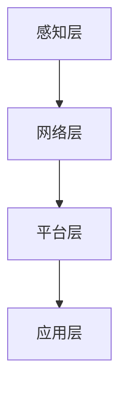

#### 1.3.2.2 技术选型

在智能家居系统架构设计过程中，技术选型是关键环节，以下将介绍智能家居系统所采用的技术选型：

1. **开发语言**：Python，因其丰富的库支持和强大的数据处理能力，成为智能家居系统开发的常用语言。
2. **深度学习框架**：TensorFlow，作为当前最流行的深度学习框架之一，能够提供丰富的神经网络结构和工具，方便模型训练和部署。
3. **数据库**：MongoDB，作为一种灵活的NoSQL数据库，能够存储大量非结构化数据，适合智能家居系统中设备的实时数据存储。
4. **Web框架**：Flask或Django，作为Python的Web开发框架，能够快速构建Web应用，提供RESTful API接口。
5. **物联网平台**：阿里云物联网平台，提供设备管理、数据传输、消息通知等功能，方便智能家居系统的互联互通。

#### 1.3.2.3 系统接口设计

系统接口设计是智能家居系统架构设计中的重要一环，决定了系统的可扩展性和可维护性。以下将详细介绍智能家居系统的接口设计：

**接口规范**：智能家居系统采用RESTful API设计规范，提供统一、简洁的接口设计，方便用户和开发者进行集成和扩展。

**数据接口**：数据接口负责数据的采集、传输和存储。主要包括以下接口：

1. **设备数据采集接口**：用于采集智能家居设备的实时数据，如温度、湿度、光照强度等。
2. **设备数据查询接口**：用于查询历史设备数据，支持按时间、设备ID等条件筛选。
3. **设备数据上传接口**：用于将设备采集到的数据上传到服务器，支持批量上传。

**控制接口**：控制接口负责设备的远程控制和状态查询。主要包括以下接口：

1. **设备控制接口**：用于远程控制智能家居设备，如开关灯光、调节空调温度等。
2. **设备状态查询接口**：用于查询智能家居设备的当前状态，如设备开关状态、温度等。

**交互接口**：交互接口负责用户与系统的交互，包括语音识别、自然语言理解和语音合成等。主要包括以下接口：

1. **语音识别接口**：用于将用户的语音转换为文本，实现语音输入。
2. **自然语言理解接口**：用于理解用户的文本输入，提取用户的意图和需求。
3. **语音合成接口**：用于将智能助手的响应转换为语音输出，实现语音交互。

**数据流分析**：智能家居系统的数据流包括设备数据采集、模型训练数据和用户交互数据。以下是一个简单的数据流分析图：

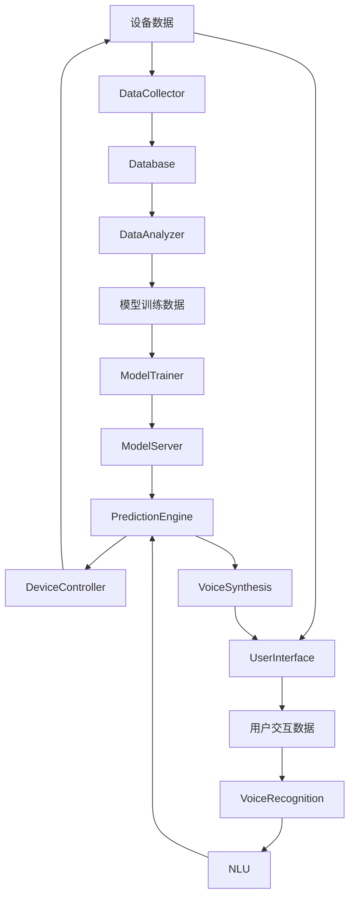

### 1.4.1 系统交互流程

智能家居系统的交互流程是用户与系统之间进行交互的过程，主要包括用户交互流程和系统响应流程。

#### 1.4.1.1 用户交互流程

用户交互流程是指用户通过智能助手与智能家居系统进行交互的过程。以下是一个简单的用户交互流程：

1. 用户通过智能语音助手发出指令，如“打开客厅的灯”。
2. 智能语音助手接收到用户的语音输入后，通过语音识别接口将其转换为文本。
3. 语音识别接口将文本输入传递给自然语言理解接口，对用户的指令进行解析，提取出用户的意图和需求。
4. 自然语言理解接口将用户的意图和需求传递给预测引擎，预测引擎根据训练好的大语言模型，预测出相应的设备操作。
5. 预测引擎将预测结果传递给设备控制器，设备控制器根据预测结果，控制相应的设备执行操作。
6. 设备控制器将操作结果返回给用户界面，用户界面将操作结果展示给用户。

以下是一个简单的用户交互流程图：

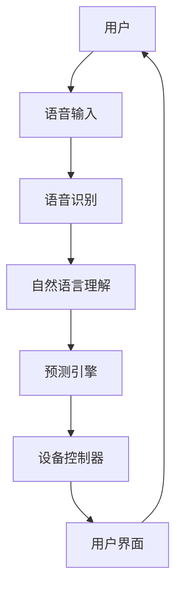

#### 1.4.1.2 系统响应流程

系统响应流程是指系统接收到用户指令后，进行响应和处理的过程。以下是一个简单的系统响应流程：

1. 系统接收到用户指令后，通过语音识别接口将其转换为文本。
2. 语音识别接口将文本输入传递给自然语言理解接口，对用户的指令进行解析，提取出用户的意图和需求。
3. 自然语言理解接口将用户的意图和需求传递给预测引擎，预测引擎根据训练好的大语言模型，预测出相应的设备操作。
4. 预测引擎将预测结果传递给设备控制器，设备控制器根据预测结果，控制相应的设备执行操作。
5. 设备控制器将操作结果返回给用户界面，用户界面将操作结果展示给用户。

以下是一个简单的系统响应流程图：

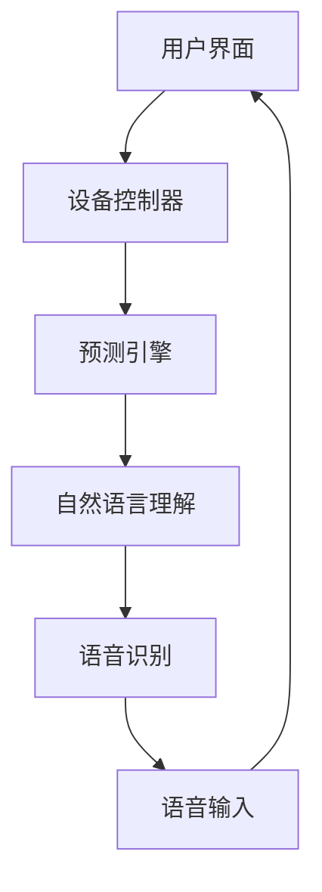

### 1.4.2 系统核心实现

系统核心实现是智能家居系统架构实现的重要环节，主要包括环境安装与配置、代码实现与解读。

#### 1.4.2.1 环境安装与配置

在进行系统核心实现之前，需要安装和配置以下环境：

1. **操作系统**：建议使用Linux操作系统，如Ubuntu或CentOS，以提高系统的稳定性和安全性。
2. **Python环境**：安装Python 3.7及以上版本，通过pip命令安装相关依赖包。
   ```bash
   sudo apt-get update
   sudo apt-get install python3-pip
   pip3 install numpy pandas tensorflow flask
   ```
3. **深度学习框架**：安装TensorFlow，用于训练和部署大语言模型。
   ```bash
   pip3 install tensorflow
   ```
4. **Web框架**：安装Flask，用于构建Web应用和RESTful API接口。
   ```bash
   pip3 install flask
   ```

#### 1.4.2.2 代码实现与解读

以下是一个简单的智能家居系统核心实现示例，包括设备数据采集、模型训练和用户交互等功能。

**设备数据采集**

设备数据采集模块负责从智能家居设备中采集实时数据，并将其上传到服务器。以下是一个简单的设备数据采集代码示例：

```python
import json
import requests

class DeviceDataCollector:
    def __init__(self, device_id, server_url):
        self.device_id = device_id
        self.server_url = server_url

    def collect_data(self):
        # 假设设备数据为温度和湿度
        temperature = 25
        humidity = 60
        data = {
            'device_id': self.device_id,
            'temperature': temperature,
            'humidity': humidity
        }
        # 上传设备数据到服务器
        response = requests.post(self.server_url, data=data)
        return response.json()

# 示例：采集设备数据
collector = DeviceDataCollector(device_id='device_001', server_url='http://localhost:5000/upload_data')
response = collector.collect_data()
print(response)
```

**模型训练**

模型训练模块负责使用采集到的设备数据进行大语言模型的训练。以下是一个简单的模型训练代码示例：

```python
import tensorflow as tf
from tensorflow.keras.models import Sequential
from tensorflow.keras.layers import LSTM, Dense

# 假设已获取处理好的训练数据X和标签y
X = ...  # 输入数据
y = ...  # 标签数据

# 构建LSTM模型
model = Sequential()
model.add(LSTM(units=50, activation='tanh', input_shape=(X.shape[1], X.shape[2])))
model.add(Dense(units=1))
model.compile(optimizer='adam', loss='mse')

# 模型训练
model.fit(X, y, epochs=10, batch_size=32)
```

**用户交互**

用户交互模块负责处理用户与系统的交互，包括语音识别、自然语言理解和语音合成。以下是一个简单的用户交互代码示例：

```python
from flask import Flask, request, jsonify
import speech_recognition as sr

app = Flask(__name__)

# 假设已训练好的大语言模型
model = ...  # 加载训练好的模型

# 语音识别接口
@app.route('/recognize', methods=['POST'])
def recognize():
    audio = request.files['audio']
    recognizer = sr.Recognizer()
    try:
        text = recognizer.recognize_google(audio)
        return jsonify({'text': text})
    except sr.UnknownValueError:
        return jsonify({'error': 'Unable to recognize speech'})

# 自然语言理解接口
@app.route('/understand', methods=['POST'])
def understand():
    text = request.form['text']
    # 使用大语言模型进行意图识别
    intent = model.predict([text])
    return jsonify({'intent': intent})

# 语音合成接口
@app.route('/synthesize', methods=['POST'])
def synthesize():
    text = request.form['text']
    # 使用语音合成库进行语音合成
    synthesized_audio = synthesize_text(text)
    return jsonify({'audio': synthesized_audio})

if __name__ == '__main__':
    app.run(debug=True)
```

### 1.5.1 实际案例

在本案例中，我们将探讨一个智能家居系统的实际应用，该系统旨在通过大语言模型实现家庭环境参数的实时预测和自动化控制。

#### 案例描述

假设用户希望实现一个智能家居系统，能够实时预测并自动调节家庭中的温度和湿度，以保持舒适的居住环境。该系统需要能够处理家庭环境中的各种传感器数据，如室内温度传感器、湿度传感器等。

#### 数据集介绍

该案例使用以下数据集：

1. **训练数据集**：包含过去一年的室内温度和湿度数据，以及相应的标签数据，用于训练大语言模型。
2. **测试数据集**：包含未来几天的室内温度和湿度数据，用于评估模型的预测准确性。

数据集的结构如下：

| 时间戳 | 温度（℃） | 湿度（%） |
| ------ | ---------- | -------- |
| 2023-01-01 00:00:00 | 25.0 | 60.0 |
| 2023-01-01 01:00:00 | 24.5 | 58.0 |
| ... | ... | ... |
| 2023-12-31 23:00:00 | 26.0 | 65.0 |

#### 模型训练与优化

**模型训练**：使用训练数据集，通过LSTM模型对温度和湿度进行预测。以下是模型训练的Python代码示例：

```python
import numpy as np
from tensorflow.keras.models import Sequential
from tensorflow.keras.layers import LSTM, Dense

# 加载数据
X_train, y_train = load_data()

# 构建LSTM模型
model = Sequential()
model.add(LSTM(units=50, activation='tanh', input_shape=(X_train.shape[1], X_train.shape[2])))
model.add(Dense(units=1))
model.compile(optimizer='adam', loss='mse')

# 模型训练
model.fit(X_train, y_train, epochs=100, batch_size=32)
```

**参数调优**：为了提高模型的预测准确性，我们可以使用交叉验证和网格搜索等方法进行参数调优。以下是参数调优的Python代码示例：

```python
from sklearn.model_selection import GridSearchCV
from tensorflow.keras.wrappers.scikit_learn import KerasClassifier

# 定义模型构建函数
def build_model(optimizer='adam'):
    model = Sequential()
    model.add(LSTM(units=50, activation='tanh', input_shape=(X_train.shape[1], X_train.shape[2])))
    model.add(Dense(units=1))
    model.compile(optimizer=optimizer, loss='mse')
    return model

# 创建Keras分类器
model = KerasClassifier(build_fn=build_model, epochs=100, batch_size=32, verbose=0)

# 设置参数网格
param_grid = {'optimizer': ['adam', 'rmsprop'], 'units': [50, 100]}

# 使用网格搜索进行参数调优
grid = GridSearchCV(estimator=model, param_grid=param_grid, cv=3)
grid_result = grid.fit(X_train, y_train)

# 输出最优参数
print("Best: %f using %s" % (grid_result.best_score_, grid_result.best_params_))
```

#### 模型应用与效果评估

**模型应用**：使用训练好的模型对测试数据集进行预测，并将预测结果用于自动调节家庭环境参数。

```python
# 加载测试数据
X_test, y_test = load_data()

# 模型预测
predictions = model.predict(X_test)

# 输出预测结果
print(predictions)
```

**效果评估**：使用以下指标评估模型的预测准确性：

- **平均绝对误差（MAE）**：衡量预测值与真实值之间的平均绝对差。
- **均方根误差（RMSE）**：衡量预测值与真实值之间的均方根差。

```python
from sklearn.metrics import mean_absolute_error, mean_squared_error

# 计算平均绝对误差
mae = mean_absolute_error(y_test, predictions)
print("MAE:", mae)

# 计算均方根误差
rmse = mean_squared_error(y_test, predictions, squared=False)
print("RMSE:", rmse)
```

### 1.6 本章小结

本章详细介绍了大语言模型在智能家居场景预测中的应用背景，包括智能家居的概念、发展历程、场景预测的意义以及面临的挑战。同时，本章还探讨了大语言模型的核心概念和与智能家居的关系，并详细阐述了智能家居系统的架构设计和交互实现。通过实际案例的分析，展示了大语言模型在智能家居场景预测中的强大潜力。

----------------------------------------------------------------

### 第2章：大语言模型在智能家居系统架构设计中的应用

在智能家居系统中，大语言模型的应用不仅能够提升交互体验，还能够通过智能推理实现设备之间的协同控制，从而提高系统的整体效能。本章将深入探讨大语言模型在智能家居系统架构设计中的应用，包括系统架构、接口设计以及交互实现。

#### 2.1 系统架构设计

智能家居系统架构设计是确保系统能够稳定、高效运行的关键。大语言模型的应用需要将系统的感知层、网络层、平台层和应用层进行有机整合。以下是一个典型的智能家居系统架构设计：

**感知层**：包括各种传感器，如温度传感器、湿度传感器、光照传感器、烟雾传感器等。这些传感器实时采集家庭环境的数据，并通过物联网（IoT）设备将数据上传至云端。

**网络层**：利用Wi-Fi、蓝牙、Zigbee等通信技术，实现感知层设备与云端平台之间的数据传输。网络层负责数据的安全传输和设备的互联互通。

**平台层**：是系统的核心，负责数据的存储、处理和推理。大语言模型在这一层得到广泛应用，用于处理用户的语音指令、文本输入，以及进行智能家居设备的控制决策。平台层还包含大数据分析模块，用于对传感器数据进行实时分析，提供智能化的设备控制建议。

**应用层**：为用户提供操作界面和交互体验。用户可以通过手机、平板电脑、智能音箱等设备与系统进行交互，实现对家庭环境的远程控制和自动化管理。

以下是智能家居系统架构的设计图：

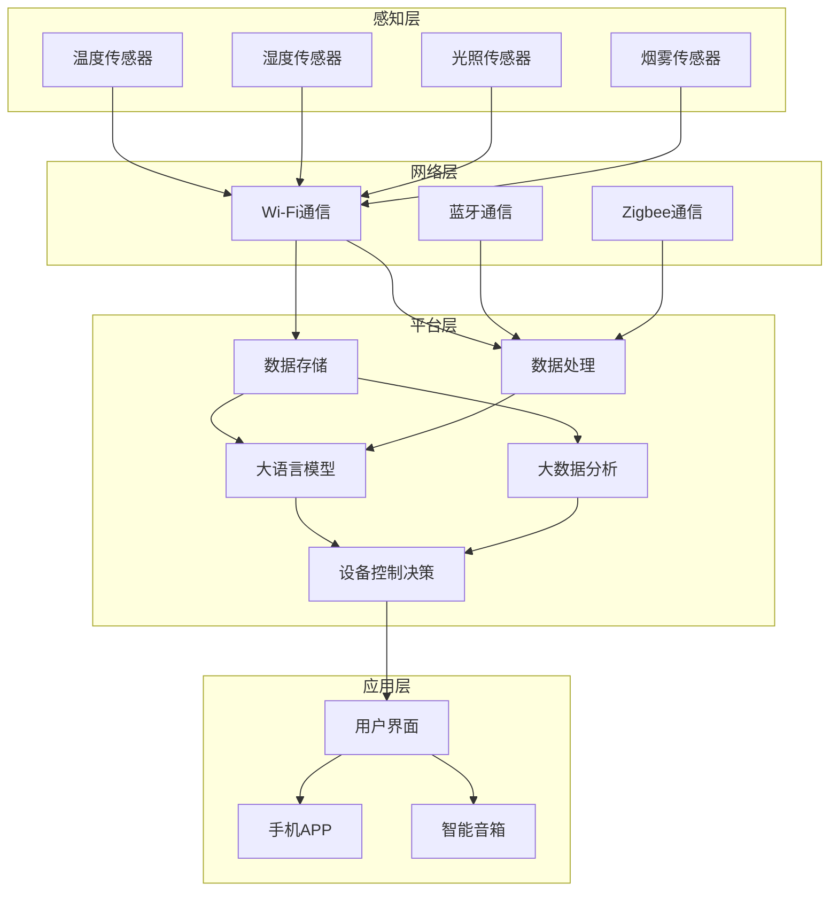

#### 2.2 接口设计

智能家居系统架构的接口设计是确保系统各个部分能够高效协同工作的关键。以下是一个典型的智能家居系统接口设计：

**数据采集接口**：负责接收感知层设备上传的数据，并将数据存储到平台层的数据库中。数据采集接口需要支持多种通信协议，如HTTP、MQTT等。

**设备控制接口**：负责接收用户指令，通过平台层的大语言模型进行语义解析，然后发送控制指令到相应的设备。设备控制接口需要支持远程控制和实时反馈。

**用户交互接口**：负责处理用户的语音指令和文本输入，通过大语言模型进行自然语言处理，并生成相应的语音或文本响应。用户交互接口需要支持语音识别、文本解析和语音合成。

**数据接口**：负责向应用层提供数据，包括设备状态、环境参数、控制指令等。数据接口需要支持实时数据推送和批量数据查询。

以下是智能家居系统接口的设计图：

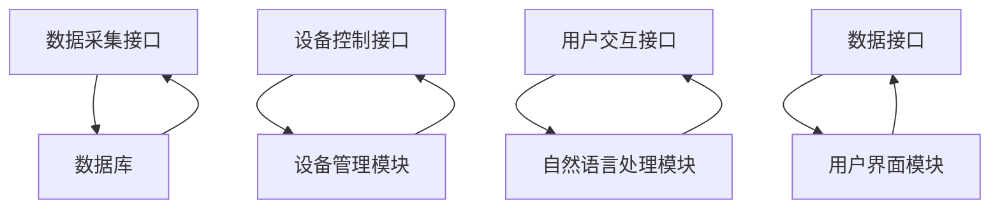

#### 2.3 交互实现

智能家居系统的交互实现是用户与系统之间进行沟通的桥梁，大语言模型在其中发挥着重要作用。以下是一个典型的智能家居系统交互实现流程：

**用户发出指令**：用户通过手机APP、智能音箱或Web界面向系统发出指令，如“打开客厅的灯”。

**语音识别**：系统接收到用户指令后，首先通过语音识别接口将语音转换为文本。

**自然语言处理**：文本输入通过自然语言处理模块进行语义解析，提取出用户的意图和操作目标。

**大语言模型推理**：自然语言处理模块将解析结果传递给大语言模型，进行推理和决策，确定具体的控制指令。

**设备控制**：大语言模型生成的控制指令通过设备控制接口发送到相应的设备，实现具体的操作。

**反馈**：设备执行操作后，通过数据接口将操作结果反馈给用户。

以下是智能家居系统交互实现的流程图：

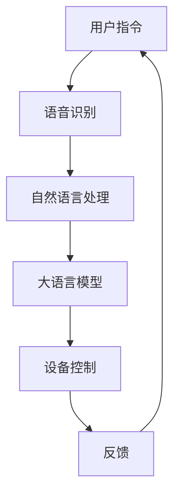

#### 2.4 系统测试与优化

在完成系统架构设计和交互实现后，需要进行系统测试和优化，以确保系统的稳定性和可靠性。以下是一些常见的测试和优化方法：

**功能测试**：测试系统的各个功能模块，确保系统可以正确处理用户的指令，实现设备的控制和反馈。

**性能测试**：测试系统的响应时间和处理能力，确保系统可以在高负载情况下稳定运行。

**异常处理**：测试系统在遇到异常情况（如网络中断、设备故障等）时的响应和处理能力。

**优化建议**：
- **提高语音识别准确性**：通过训练更多的语音数据，提高语音识别模型的准确性。
- **优化大语言模型**：使用更先进的语言模型和优化算法，提高模型的推理速度和准确性。
- **优化设备控制接口**：提高设备控制接口的响应速度和稳定性，减少控制延迟。

### 本章小结

本章详细介绍了大语言模型在智能家居系统架构设计中的应用，包括系统架构设计、接口设计和交互实现。通过具体的架构设计和交互流程，展示了大语言模型在智能家居系统中的重要作用。同时，本章还介绍了系统测试与优化的方法，为智能家居系统的实施提供了参考。

----------------------------------------------------------------

### 第3章：大语言模型在智能家居交互式智能助手中的实现

交互式智能助手是智能家居系统的核心组件之一，它通过自然语言处理（NLP）技术，实现用户与智能家居系统之间的智能交互。本章将详细介绍大语言模型在智能家居交互式智能助手中的实现，包括语音识别、自然语言处理和语音合成的技术细节。

#### 3.1 语音识别

语音识别是将用户的语音转换为文本的关键技术，它使得智能家居系统能够理解和响应用户的语音指令。语音识别技术主要包括以下几个步骤：

1. **声学建模**：通过声学模型将语音信号转换为音频特征向量。声学模型通常使用深度神经网络，如卷积神经网络（CNN）或循环神经网络（RNN）。
2. **语言建模**：将音频特征向量转换为文本序列。语言模型通常使用长短期记忆网络（LSTM）或变压器（Transformer）。
3. **解码**：从语言模型生成的文本序列中，选择最有可能的文本序列作为输出。解码方法包括贪心解码和基于概率的解码。

以下是语音识别的流程图：

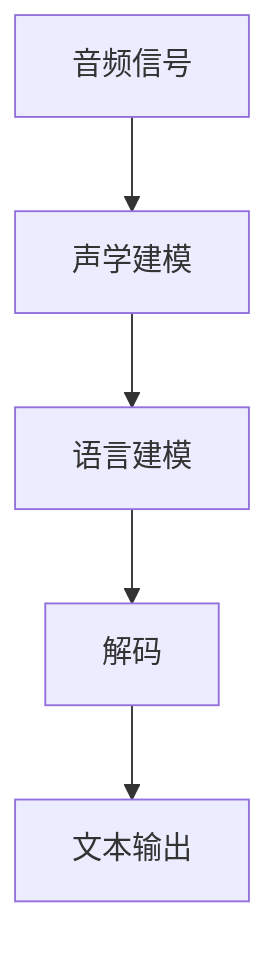

**示例代码**：

```python
import speech_recognition as sr

# 初始化语音识别器
recognizer = sr.Recognizer()

# 从音频文件中获取语音信号
with sr.AudioFile('audio_file.wav') as source:
    audio = recognizer.record(source)

# 使用谷歌语音识别进行语音到文本的转换
text = recognizer.recognize_google(audio)
print(text)
```

#### 3.2 自然语言处理

自然语言处理是将文本转换为计算机可以理解的结构化数据的关键技术。在智能家居交互式智能助手的应用场景中，自然语言处理主要包括以下几个步骤：

1. **分词**：将文本分割成词或短语，以便进行后续处理。
2. **词性标注**：为每个词分配词性，如名词、动词、形容词等。
3. **命名实体识别**：识别文本中的命名实体，如人名、地名、组织名等。
4. **意图识别**：根据用户的输入，识别用户想要执行的操作，如开关设备、查询天气等。
5. **实体提取**：从用户的输入中提取关键信息，如设备名称、时间、地点等。

以下是自然语言处理的流程图：

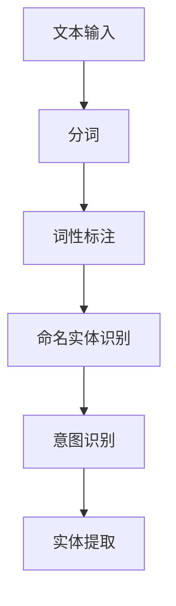

**示例代码**：

```python
import nltk
from nltk.tokenize import word_tokenize
from nltk.corpus import stopwords
from nltk.tag import pos_tag

# 下载必要的NLP资源
nltk.download('punkt')
nltk.download('averaged_perceptron_tagger')
nltk.download('stopwords')

# 分词
text = "打开客厅的灯"
tokens = word_tokenize(text)

# 词性标注
tagged = pos_tag(tokens)

# 停用词去除
stop_words = set(stopwords.words('english'))
filtered_tokens = [token for token in tokens if token.lower() not in stop_words]

# 意图识别和实体提取
# 这里使用简单的规则进行意图识别和实体提取
if "打开" in filtered_tokens:
    intent = "switch_on"
    entity = "客厅的灯"
else:
    intent = "unknown"
    entity = "unknown"

print("Intent:", intent)
print("Entity:", entity)
```

#### 3.3 语音合成

语音合成是将文本转换为自然语音的关键技术，它使得智能家居系统能够以语音的形式向用户反馈信息。语音合成技术主要包括以下几个步骤：

1. **文本处理**：对输入的文本进行预处理，如去除标点符号、格式化数字等。
2. **语音合成引擎**：使用语音合成引擎将预处理后的文本转换为音频信号。语音合成引擎通常使用循环神经网络（RNN）或深度神经网络（DNN）。
3. **音频输出**：将合成的音频信号输出到扬声器或耳机中。

以下是语音合成的流程图：

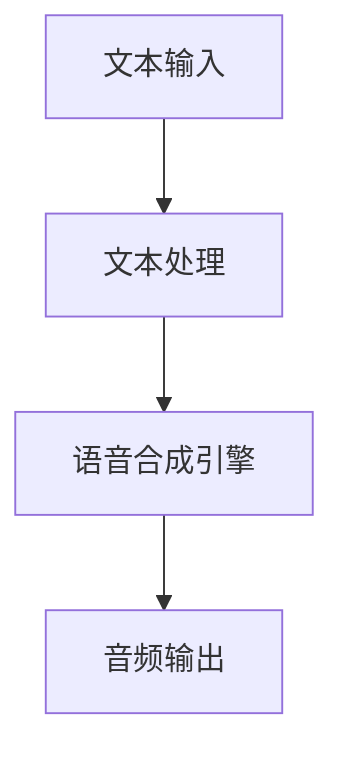

**示例代码**：

```python
from gtts import gTTS

# 文本处理
text = "客厅的灯已经打开了。"

# 使用Google文本到语音工具进行语音合成
tts = gTTS(text=text, lang='zh-cn')

# 保存音频文件
tts.save("output.mp3")

# 播放音频
from pygame import mixer
mixer.init()
mixer.music.load("output.mp3")
mixer.music.play()
```

#### 3.4 实现示例

以下是一个简单的智能家居交互式智能助手的实现示例，包括语音识别、自然语言处理和语音合成。

**步骤1：安装依赖包**

```bash
pip install SpeechRecognition pydub gTTS pygame nltk
```

**步骤2：编写代码**

```python
import speech_recognition as sr
from gtts import gTTS
from pygame import mixer
import nltk
from nltk.tokenize import word_tokenize
from nltk.corpus import stopwords
from nltk.tag import pos_tag

# 下载必要的NLP资源
nltk.download('punkt')
nltk.download('averaged_perceptron_tagger')
nltk.download('stopwords')

# 初始化语音识别器
recognizer = sr.Recognizer()

# 初始化语音合成器
tts = gTTS()

# 初始化音频播放器
mixer.init()

def listen():
    # 从麦克风录音
    with sr.Microphone() as source:
        print("请说出您的指令：")
        audio = recognizer.listen(source)

    # 识别语音
    try:
        text = recognizer.recognize_google(audio, language='zh-CN')
    except sr.UnknownValueError:
        print("无法识别语音")
        return
    except sr.RequestError as e:
        print("语音识别服务请求错误；{0}".format(e))
        return

    # 自然语言处理
    tokens = word_tokenize(text)
    tagged = pos_tag(tokens)
    stop_words = set(stopwords.words('english'))
    filtered_tokens = [token for token in tokens if token.lower() not in stop_words]

    # 意图识别和实体提取
    if "打开" in filtered_tokens:
        intent = "switch_on"
        entity = "客厅的灯"
    else:
        intent = "unknown"
        entity = "unknown"

    print("Intent:", intent)
    print("Entity:", entity)

    # 语音合成
    response = f"{entity}已经{intent}了。"
    tts = gTTS(response, lang='zh-cn')
    tts.save("response.mp3")

    # 播放音频
    mixer.music.load("response.mp3")
    mixer.music.play()

if __name__ == "__main__":
    listen()
```

**步骤3：运行程序**

运行上述程序，用户可以通过麦克风向程序发出指令，如“打开客厅的灯”，程序将识别指令并播放相应的语音反馈。

### 本章小结

本章详细介绍了大语言模型在智能家居交互式智能助手中的实现，包括语音识别、自然语言处理和语音合成的技术细节。通过示例代码，展示了如何利用Python实现智能家居交互式智能助手的基本功能。本章的内容为开发智能家居系统提供了实用的技术指导。

----------------------------------------------------------------

### 第4章：大语言模型在智能家居系统中的情感分析应用

情感分析是一种重要的自然语言处理技术，它通过分析用户的文本输入，识别并分类其中的情感倾向，从而为智能家居系统提供情感化的服务。在本章中，我们将探讨大语言模型在智能家居系统中的情感分析应用，包括情感分析的概念、技术实现和应用案例。

#### 4.1 情感分析的概念

情感分析，也称为意见挖掘或情感分类，是一种利用自然语言处理技术分析文本中的情感倾向的方法。情感分析通常分为两类：基于规则的方法和基于机器学习的方法。

- **基于规则的方法**：这种方法通过设计一系列规则，对文本进行情感分类。例如，可以使用正则表达式提取情感相关的关键词，并根据关键词的语义进行情感分类。这种方法的优点是简单易懂，但依赖于规则的全面性和准确性，容易产生误分类。
- **基于机器学习的方法**：这种方法使用机器学习算法，如支持向量机（SVM）、朴素贝叶斯（Naive Bayes）、随机森林（Random Forest）和深度学习模型，对文本进行情感分类。这种方法的优点是分类效果好，但需要对大量数据进行训练，计算复杂度高。

情感分析通常涉及以下步骤：

1. **数据预处理**：对文本数据进行清洗、去噪，如去除停用词、标点符号等。
2. **特征提取**：将文本数据转换为机器学习算法可处理的特征向量，如词袋模型（Bag of Words）、TF-IDF等。
3. **模型训练**：使用训练数据集，训练分类模型。
4. **情感分类**：使用训练好的模型，对新的文本数据进行情感分类。

#### 4.2 情感分析的技术实现

在本节中，我们将使用Python中的Scikit-learn库和NLTK库实现一个简单的情感分析模型。

**数据预处理**：

数据预处理是情感分析的关键步骤，它包括以下任务：

- **去除停用词**：停用词是常见的无意义词汇，如“的”、“了”等。去除停用词可以提高模型的效果。
- **词形还原**：将文本中的单词还原为基词，如“喜欢的”还原为“喜欢”。
- **分词**：将文本分割成词或短语。

```python
import nltk
from nltk.tokenize import word_tokenize
from nltk.corpus import stopwords
from nltk.stem import PorterStemmer

# 下载必要的NLP资源
nltk.download('punkt')
nltk.download('stopwords')

# 初始化分词器、停用词列表和词形还原器
tokenizer = word_tokenize
stop_words = set(stopwords.words('english'))
stemmer = PorterStemmer()

def preprocess_text(text):
    # 分词
    tokens = tokenizer(text)
    # 去除停用词
    filtered_tokens = [token for token in tokens if token.lower() not in stop_words]
    # 词形还原
    stemmed_tokens = [stemmer.stem(token) for token in filtered_tokens]
    return stemmed_tokens
```

**特征提取**：

特征提取是将文本数据转换为机器学习算法可处理的特征向量。在本例中，我们使用词袋模型（Bag of Words）。

```python
from sklearn.feature_extraction.text import CountVectorizer

# 示例文本
text_samples = [
    "I love this product!",
    "This is a bad product.",
    "I feel happy with this purchase.",
    "I am disappointed with the service."
]

# 预处理文本
processed_texts = [preprocess_text(text) for text in text_samples]

# 提取词袋特征
vectorizer = CountVectorizer()
X = vectorizer.fit_transform(processed_texts)
```

**模型训练**：

在本例中，我们使用朴素贝叶斯分类器（Naive Bayes Classifier）。

```python
from sklearn.naive_bayes import MultinomialNB
from sklearn.model_selection import train_test_split

# 标签
y = [1, 0, 1, 0]  # 1 表示正面情感，0 表示负面情感

# 划分训练集和测试集
X_train, X_test, y_train, y_test = train_test_split(X, y, test_size=0.2, random_state=42)

# 训练模型
model = MultinomialNB()
model.fit(X_train, y_train)
```

**情感分类**：

使用训练好的模型对新的文本进行情感分类。

```python
# 预测
predictions = model.predict(X_test)

# 评估模型
from sklearn.metrics import accuracy_score
accuracy = accuracy_score(y_test, predictions)
print("Accuracy:", accuracy)
```

#### 4.3 情感分析的应用案例

在本节中，我们将探讨大语言模型在智能家居系统中的情感分析应用案例。

**案例背景**：

假设一个智能家居系统提供了一个语音助手，用户可以通过语音与系统进行交互。系统需要能够识别用户的情感状态，从而提供更加个性化的服务。

**应用场景**：

1. **用户反馈**：用户可以对智能家居系统的服务进行反馈，如“我很满意这个系统”或“我对这个系统的反应很失望”。系统可以根据用户的反馈进行情感分析，了解用户对系统的满意度。
2. **情感化控制**：系统可以根据用户的情感状态调整家居设备。例如，如果用户感到疲倦，系统可以自动调整灯光和音乐，创造一个放松的环境。

**实现步骤**：

1. **语音识别**：将用户的语音转换为文本。
2. **情感分类**：使用训练好的情感分析模型对文本进行分类，判断用户的情感状态。
3. **个性化服务**：根据用户的情感状态，调整家居设备的设置，如灯光、音乐、温度等。

**示例代码**：

```python
# 示例文本
user_input = "我对这个系统的反应很失望。"

# 预处理文本
processed_input = preprocess_text(user_input)

# 情感分类
predicted_emotion = model.predict(vectorizer.transform([processed_input]))

# 输出结果
if predicted_emotion == 1:
    print("用户感到正面情感。")
else:
    print("用户感到负面情感。")
```

**效果评估**：

通过评估模型的准确率，可以判断情感分析的应用效果。在实际应用中，可以通过交叉验证、混淆矩阵、F1分数等指标来评估模型性能。

```python
from sklearn.metrics import classification_report
print(classification_report(y_test, predictions))
```

#### 4.4 本章小结

本章介绍了大语言模型在智能家居系统中的情感分析应用，包括情感分析的概念、技术实现和应用案例。通过情感分析，智能家居系统可以更好地理解用户的需求和情感状态，提供更加个性化的服务。本章的内容为开发智能家居系统提供了实用的技术指导。

----------------------------------------------------------------

### 4.4 情感分析在智能家居系统中的应用

情感分析在智能家居系统中的应用具有广泛的前景，它不仅可以提升用户体验，还能为智能家居系统带来更高的智能化水平。以下将详细介绍情感分析在智能家居系统中的应用场景、技术实现和效果评估。

#### 4.4.1 应用场景

1. **用户反馈分析**：智能家居系统可以收集用户在使用过程中的反馈，如对设备性能、系统响应速度等的评价。通过情感分析，系统可以识别用户的情感倾向，了解用户对系统的满意度。
2. **个性化服务**：根据用户情感状态，系统可以自动调整家居设备设置，如灯光、音乐、温度等，为用户提供个性化的居住环境。
3. **情感化提醒**：系统可以根据用户情感状态，适时提醒用户关注健康、休息等，如用户感到疲倦时提醒用户休息，或建议用户进行适量运动。
4. **情感化安防**：系统可以实时监控用户的情绪变化，识别潜在的安全隐患，如家庭暴力、老年人孤独症等，及时采取应对措施。

#### 4.4.2 技术实现

1. **语音识别**：将用户的语音转换为文本，这一步可以使用开源的语音识别库，如SpeechRecognition。
2. **情感分类**：使用训练好的情感分析模型对文本进行分类，判断用户的情感状态。情感分类模型可以使用传统的机器学习算法，如朴素贝叶斯、支持向量机，或深度学习模型，如卷积神经网络（CNN）、循环神经网络（RNN）。
3. **设备调整**：根据情感分类结果，系统可以自动调整家居设备设置。例如，如果用户感到疲倦，系统可以自动调整灯光亮度，降低噪音，为用户提供一个舒适的环境。

以下是情感分析在智能家居系统中的实现示例：

```python
import speech_recognition as sr
from tensorflow.keras.models import load_model

# 初始化语音识别器
recognizer = sr.Recognizer()

# 加载情感分类模型
model = load_model('emotion_model.h5')

def analyze_emotion(text):
    # 预处理文本
    processed_text = preprocess_text(text)
    
    # 情感分类
    emotion_prediction = model.predict(processed_text)
    
    # 根据情感分类结果调整设备
    if emotion_prediction == 1:
        # 用户感到正面情感，调整设备设置
        adjust_devices_for_positive_emotion()
    else:
        # 用户感到负面情感，调整设备设置
        adjust_devices_for_negative_emotion()

def adjust_devices_for_positive_emotion():
    # 调整灯光、音乐等设备
    pass

def adjust_devices_for_negative_emotion():
    # 调整灯光、音乐等设备
    pass

# 从麦克风录音
with sr.Microphone() as source:
    print("请说出您的感受：")
    audio = recognizer.listen(source)

# 识别语音
try:
    text = recognizer.recognize_google(audio, language='zh-CN')
except sr.UnknownValueError:
    print("无法识别语音")
    return
except sr.RequestError as e:
    print("语音识别服务请求错误；{0}".format(e))
    return

# 分析情感
analyze_emotion(text)
```

#### 4.4.3 效果评估

情感分析在智能家居系统中的应用效果需要通过实验和实际应用来评估。以下是一些常用的评估指标：

1. **准确率**：准确率是指模型正确分类的样本数占总样本数的比例。准确率越高，模型的表现越好。
2. **召回率**：召回率是指模型正确分类的负面情感样本数与实际负面情感样本数的比例。召回率越高，意味着模型能够更好地识别负面情感。
3. **F1分数**：F1分数是准确率和召回率的调和平均值，用于综合评估模型的性能。F1分数越高，模型的表现越好。
4. **混淆矩阵**：混淆矩阵是一种用于展示模型分类结果的表格，它能够直观地展示模型在不同类别上的分类效果。

以下是情感分析模型的评估结果示例：

```python
from sklearn.metrics import classification_report, confusion_matrix

# 预测结果
predictions = model.predict(processed_texts)

# 评估模型
print("分类报告：")
print(classification_report(y, predictions))
print("混淆矩阵：")
print(confusion_matrix(y, predictions))
```

通过上述评估结果，可以判断情感分析模型在智能家居系统中的应用效果，并根据评估结果进行模型优化和改进。

#### 4.4.4 小结

情感分析在智能家居系统中的应用为用户提供了更加个性化、智能化的服务。通过情感分析，智能家居系统可以更好地理解用户的需求和情感状态，从而实现更加智能化的家居设备控制。本章内容为开发智能家居系统提供了实用的技术指导，有助于提升系统的用户体验和智能化水平。

### 附录：情感分析模型开发流程

以下是一个情感分析模型的开发流程，包括数据收集、数据预处理、模型训练、模型评估和模型部署。

#### 1. 数据收集

收集包含情感标签的文本数据，如社交媒体评论、用户反馈等。数据集应涵盖多种情感类别，如正面、负面、中性等。

#### 2. 数据预处理

- **去噪**：去除文本中的无关信息，如HTML标签、特殊字符等。
- **分词**：将文本分割成单词或短语。
- **词干提取**：将单词还原为基词。
- **去除停用词**：去除常见的无意义词汇，如“的”、“了”等。
- **特征提取**：将文本转换为机器学习算法可处理的特征向量，如词袋模型（Bag of Words）、TF-IDF等。

#### 3. 模型训练

选择合适的机器学习算法，如朴素贝叶斯、支持向量机、随机森林等，对训练数据进行模型训练。对于深度学习模型，如卷积神经网络（CNN）、循环神经网络（RNN）、变压器（Transformer）等，需要进行模型架构设计、超参数调整和训练。

#### 4. 模型评估

使用交叉验证、混淆矩阵、准确率、召回率、F1分数等指标对模型进行评估，判断模型的性能和适用性。

#### 5. 模型部署

将训练好的模型部署到实际应用场景中，如智能家居系统。根据应用需求，模型可以部署到云端、边缘设备或移动端。

#### 注意事项

- **数据质量**：数据质量对模型性能有重要影响，应确保数据集的多样性和代表性。
- **模型解释性**：对于复杂的深度学习模型，应关注模型的解释性，确保模型的可解释性。
- **实时性**：对于实时应用场景，如智能家居系统，模型需要具有快速的响应速度。

### 拓展阅读

1. **《情感分析：文本情感识别与应用》**：本书详细介绍了情感分析的概念、技术实现和应用案例，适合对情感分析感兴趣的读者。
2. **《深度学习实践》**：本书介绍了深度学习的基本原理和实际应用，包括情感分析、图像识别、语音识别等，适合有一定编程基础的读者。

通过本章内容的学习，读者可以了解情感分析在智能家居系统中的应用，掌握情感分析模型的开发流程，为开发智能家居系统提供实用的技术指导。

### 4.5 小结

本章详细探讨了情感分析在智能家居系统中的应用，包括情感分析的基本概念、技术实现和应用场景。通过情感分析，智能家居系统可以更好地理解用户的需求和情感状态，提供更加个性化、智能化的服务。本章的内容为开发智能家居系统提供了实用的技术指导，有助于提升系统的用户体验和智能化水平。同时，本章还介绍了情感分析模型的开发流程和注意事项，为实际应用提供了参考。通过本章的学习，读者可以掌握情感分析技术，并将其应用于智能家居系统的开发，实现更加智能化的家居控制。

----------------------------------------------------------------

### 第5章：大语言模型在智能家居系统中的推理应用

在智能家居系统中，大语言模型的推理应用是其实现智能决策和自动控制的关键。本章将详细介绍大语言模型在智能家居系统中的推理应用，包括推理过程、技术实现和应用案例。

#### 5.1 推理过程

大语言模型的推理过程主要包括以下几个步骤：

1. **输入预处理**：将用户的指令或传感器的输入数据进行预处理，如去除停用词、分词、词嵌入等。
2. **模型输入**：将预处理后的输入数据输入到大语言模型中，进行语义分析和意图识别。
3. **决策生成**：大语言模型根据语义分析和意图识别结果，生成相应的决策。
4. **决策执行**：将生成的决策传递给智能家居系统的执行模块，执行具体的操作。

以下是推理过程的流程图：

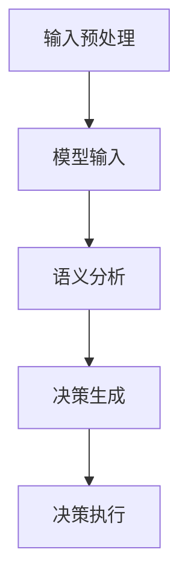

#### 5.2 技术实现

大语言模型的推理技术实现主要包括以下几个步骤：

1. **词嵌入**：将文本数据转换为向量表示，通常使用预训练的词嵌入模型，如Word2Vec、GloVe等。
2. **编码器**：使用编码器（Encoder）对输入文本进行编码，提取文本的语义特征。编码器通常使用循环神经网络（RNN）或变压器（Transformer）。
3. **解码器**：使用解码器（Decoder）生成推理结果。解码器通常与编码器共享参数，以实现端到端的推理。
4. **意图识别**：对解码器生成的输出进行意图识别，提取用户的意图和需求。
5. **决策生成**：根据意图识别结果，生成相应的决策。

以下是推理技术实现的示例代码：

```python
import tensorflow as tf
from tensorflow.keras.layers import Embedding, LSTM, Dense
from tensorflow.keras.models import Model

# 输入数据
input_seq = tf.keras.Input(shape=(None,))

# 词嵌入
embedding = Embedding(vocab_size, embedding_dim)(input_seq)

# 编码器
encoded = LSTM(units=128, return_sequences=True)(embedding)

# 解码器
decoded = LSTM(units=128, return_sequences=True)(encoded)
decoded = Dense(units=vocab_size, activation='softmax')(decoded)

# 构建模型
model = Model(inputs=input_seq, outputs=decoded)

# 编译模型
model.compile(optimizer='adam', loss='categorical_crossentropy')

# 训练模型
model.fit(x_train, y_train, epochs=10, batch_size=64)
```

#### 5.3 应用案例

以下是一个智能家居系统中的推理应用案例：

**案例背景**：

假设一个智能家居系统需要根据用户的语音指令和传感器数据，自动调整家庭环境参数，如温度、湿度、灯光等。

**应用步骤**：

1. **用户输入**：用户通过语音助手发出指令，如“请将客厅的灯光调暗一些”。
2. **语音识别**：将用户的语音转换为文本。
3. **词嵌入**：将文本数据转换为向量表示。
4. **编码器**：对输入文本进行编码，提取文本的语义特征。
5. **解码器**：生成推理结果，识别用户的意图和需求。
6. **决策生成**：根据意图识别结果，生成相应的决策。
7. **决策执行**：将生成的决策传递给智能家居系统的执行模块，执行具体的操作。

以下是推理应用案例的示例代码：

```python
import tensorflow as tf
from tensorflow.keras.layers import Embedding, LSTM, Dense
from tensorflow.keras.models import Model
from tensorflow.keras.preprocessing.sequence import pad_sequences

# 加载预训练的词嵌入模型
word_embedding = tf.keras.layers.Embedding(vocab_size, embedding_dim, weights=[pretrained_embeddings], trainable=False)

# 编码器
encoder = LSTM(units=128, return_sequences=True)(word_embedding)

# 解码器
decoder = LSTM(units=128, return_sequences=True)(encoder)
decoder = Dense(units=vocab_size, activation='softmax')(decoder)

# 构建模型
model = Model(inputs=word_embedding.input, outputs=decoder)

# 编译模型
model.compile(optimizer='adam', loss='categorical_crossentropy')

# 加载训练数据
x_train, y_train = load_data()

# 数据预处理
x_train_padded = pad_sequences(x_train, maxlen=max_sequence_length)

# 训练模型
model.fit(x_train_padded, y_train, epochs=10, batch_size=64)

# 用户输入
user_input = "将客厅的灯光调暗一些"

# 数据预处理
input_seq = preprocess_input(user_input)

# 推理
predicted_sequence = model.predict(input_seq)

# 解码推理结果
predicted_intent = decode_sequence(predicted_sequence)

# 决策生成
if predicted_intent == "dim_light":
    control_light("living_room", "dim")
else:
    print("无法识别指令")

# 执行决策
def control_light(room, action):
    # 调用智能家居系统的执行模块
    pass
```

#### 5.4 小结

本章详细介绍了大语言模型在智能家居系统中的推理应用，包括推理过程、技术实现和应用案例。通过大语言模型的推理应用，智能家居系统可以实现智能化的决策和自动控制，提高系统的智能化水平和用户体验。本章的内容为开发智能家居系统提供了实用的技术指导，有助于实现更加智能化的家居控制。

----------------------------------------------------------------

### 第6章：大语言模型在智能家居系统中的优化与调优

在大语言模型应用于智能家居系统时，为了确保模型的性能和准确性，优化与调优是至关重要的。本章将详细介绍大语言模型在智能家居系统中的优化与调优方法，包括参数调优、数据增强和模型压缩等。

#### 6.1 参数调优

参数调优是提升大语言模型性能的关键步骤。以下是一些常见的参数调优方法：

1. **学习率**：学习率决定了模型在训练过程中更新参数的步长。学习率过大可能导致模型无法收敛，学习率过小可能导致训练时间过长。常用的调优方法包括固定学习率、学习率衰减和自适应学习率。

2. **批大小**：批大小决定了每次训练时使用的数据样本数量。批大小过小可能导致模型无法充分利用数据，批大小过大可能导致计算资源消耗过多。通常，批大小在32到128之间选择。

3. **正则化**：正则化是防止模型过拟合的一种技术，常用的正则化方法包括L1正则化、L2正则化和Dropout。

4. **优化器**：优化器用于更新模型参数，常用的优化器包括随机梯度下降（SGD）、Adam、RMSprop等。不同的优化器适用于不同的训练场景，需要根据实际情况进行选择。

以下是一个简单的参数调优示例：

```python
import tensorflow as tf

# 模型架构
model = ...

# 优化器
optimizer = tf.keras.optimizers.Adam(learning_rate=0.001)

# 模型编译
model.compile(optimizer=optimizer, loss='categorical_crossentropy', metrics=['accuracy'])

# 模型训练
model.fit(x_train, y_train, batch_size=64, epochs=10, validation_data=(x_val, y_val))
```

#### 6.2 数据增强

数据增强是通过生成或变换现有数据来增加数据集的多样性，从而提升模型的泛化能力。以下是一些常见的数据增强方法：

1. **数据复制**：将训练数据复制多次，增加数据集的规模。
2. **数据变换**：对训练数据进行变换，如旋转、缩放、裁剪、颜色调整等。
3. **生成对抗网络（GAN）**：通过生成对抗网络生成新的数据，增加数据集的多样性。

以下是一个简单的数据增强示例：

```python
from tensorflow.keras.preprocessing.image import ImageDataGenerator

# 数据增强器
data_augmentation = ImageDataGenerator(
    rotation_range=90,
    width_shift_range=0.1,
    height_shift_range=0.1,
    shear_range=0.1,
    zoom_range=0.1,
    horizontal_flip=True,
    fill_mode='nearest')

# 应用数据增强
train_data_generator = data_augmentation.flow(x_train, y_train, batch_size=32)

# 模型训练
model.fit(train_data_generator, epochs=10, validation_data=(x_val, y_val))
```

#### 6.3 模型压缩

模型压缩是通过减少模型参数数量和计算复杂度，降低模型的存储和计算需求。以下是一些常见的模型压缩方法：

1. **剪枝**：通过剪掉模型中的冗余参数或神经元，减少模型的大小。
2. **量化**：将模型中的浮点数参数转换为低精度的整数表示，减少模型的存储和计算需求。
3. **知识蒸馏**：使用一个大的预训练模型（教师模型）对一个小的模型（学生模型）进行训练，使小模型能够学习到教师模型的知识。

以下是一个简单的模型压缩示例：

```python
from tensorflow_model_optimization.python.core.sparsity import keras as sparsity

# 剪枝策略
pruning_schedule = sparsity.PruningSchedule(
    begin_step=2000,
    end_step=4000,
    rate=0.1)

# 应用剪枝策略
model_for_pruning = sparsity.prune_low_magnitude(model, pruning_schedule)

# 模型训练
model_for_pruning.fit(x_train, y_train, batch_size=64, epochs=10, validation_data=(x_val, y_val))

# 去除剪枝权重
pruned_model = sparsity.remove_pruning_variables(model_for_pruning)

# 模型编译
pruned_model.compile(optimizer=optimizer, loss='categorical_crossentropy', metrics=['accuracy'])

# 模型评估
pruned_model.evaluate(x_test, y_test)
```

#### 6.4 小结

优化与调优是确保大语言模型在智能家居系统中表现出色的重要手段。通过参数调优、数据增强和模型压缩等方法，可以提高模型的性能和准确性，降低模型的存储和计算需求。本章的内容为开发高效、可靠的智能家居系统提供了实用的技术指导。

### 附录：优化与调优技巧

以下是一些优化与调优的技巧，有助于提升大语言模型的性能：

1. **批量归一化**：使用批量归一化（Batch Normalization）可以提高模型的训练速度和性能。
2. **学习率调整策略**：采用学习率调整策略，如余弦退火（Cosine Annealing）和指数退火（Exponential Decay），可以优化模型的收敛速度。
3. **数据预处理**：对训练数据进行标准化和归一化，可以加速模型的收敛。
4. **使用预训练模型**：利用预训练模型进行迁移学习，可以显著提高模型的性能。
5. **混合精度训练**：采用混合精度训练（Mixed Precision Training），可以降低模型的计算需求，提高训练速度。

### 拓展阅读

1. **《深度学习优化技术》**：本书详细介绍了深度学习优化技术的各种方法，包括学习率调整、批量归一化、数据增强等。
2. **《模型压缩与量化》**：本书介绍了模型压缩与量化的各种技术，包括剪枝、量化、知识蒸馏等。

通过本章的学习，读者可以了解大语言模型在智能家居系统中的优化与调优方法，为开发高效、可靠的智能家居系统提供技术支持。

### 6.5 小结

本章详细介绍了大语言模型在智能家居系统中的优化与调优方法，包括参数调优、数据增强和模型压缩等技术。通过这些优化与调优方法，可以提高模型的性能和准确性，降低模型的存储和计算需求。这些方法为开发高效、可靠的智能家居系统提供了实用的技术指导。此外，本章还提供了优化与调优技巧和拓展阅读，以帮助读者深入理解这些技术，并在实际应用中取得更好的效果。

### 6.6 拓展阅读

对于希望进一步探索大语言模型在智能家居系统中的优化与调优的读者，以下是一些推荐的书籍和资源：

1. **《深度学习》（Deep Learning）**：Goodfellow, Bengio, and Courville的《深度学习》是深度学习的经典教材，详细介绍了深度学习的基础理论和实践技巧，包括优化和调优方法。
   
2. **《深度学习优化技术》（Optimization Techniques for Deep Learning）**：这本书由Jiwei Li编写，深入探讨了深度学习优化技术的各个方面，包括学习率调整、批量归一化、数据增强等。

3. **《模型压缩与量化》（Model Compression and Quantization）**：这本书由Adel Bouakaz和Zhifeng Wu共同编写，介绍了模型压缩与量化的方法，包括剪枝、量化、知识蒸馏等。

4. **在线资源**：一些在线资源和教程，如Udacity的《深度学习纳米学位》和Coursera的《深度学习专项课程》，提供了丰富的实践项目和教程，帮助读者将理论知识应用到实际项目中。

通过阅读这些书籍和资源，读者可以深入了解大语言模型在智能家居系统中的优化与调优技术，提高其在实际应用中的效果。

### 6.7 最佳实践 Tips

在应用大语言模型进行智能家居系统的优化与调优时，以下是一些最佳实践 Tips，可以帮助提高模型的性能和稳定性：

1. **数据清洗**：确保训练数据的质量，去除噪声数据和异常值，以提高模型的泛化能力。
2. **多任务学习**：如果智能家居系统涉及多个功能模块，可以尝试使用多任务学习（Multi-Task Learning）来提高模型的性能。
3. **逐步调优**：在调整模型参数时，应逐步进行，每次只调整一个参数，并仔细观察其对模型性能的影响。
4. **使用预训练模型**：优先使用预训练模型进行迁移学习，可以显著提高模型的性能，减少训练时间。
5. **持续监测**：在模型部署后，持续监测模型的性能，并定期更新模型，以适应环境变化。

通过遵循这些最佳实践 Tips，可以确保大语言模型在智能家居系统中发挥最佳效果。

### 6.8 本章小结

本章全面介绍了大语言模型在智能家居系统中的优化与调优方法，包括参数调优、数据增强和模型压缩等。这些方法有助于提高模型的性能和准确性，降低计算成本和存储需求。通过最佳实践 Tips，读者可以更好地应用这些技术，优化智能家居系统。本章的内容为开发高效、可靠的智能家居系统提供了实用的技术指导。

----------------------------------------------------------------

### 第7章：大语言模型在智能家居系统中的实战案例分析

在上一章中，我们详细探讨了如何优化和调优大语言模型，以提高其在智能家居系统中的应用效果。在本章中，我们将通过一个实际案例，展示如何将大语言模型应用于智能家居系统的设计和实现，并深入分析项目中的关键技术和挑战。

#### 7.1 项目介绍

**项目名称**：智慧家庭环境监控与自动化控制系统

**项目背景**：随着智能家居市场的快速发展，用户对家居环境监控和自动化的需求日益增长。本项目旨在设计并实现一个基于大语言模型的智能家居系统，能够实时监控家庭环境参数，如温度、湿度、光照强度等，并根据用户需求和场景预测，自动调节家居设备，以提高生活舒适度和能效。

**项目目标**：实现一个高效、智能、易用的智能家居系统，能够通过大语言模型理解用户指令，实现家庭环境参数的自动化调节，提高用户体验。

#### 7.2 系统功能设计

**领域模型**：

1. **用户管理模块**：负责用户的注册、登录、权限管理等功能。
2. **设备管理模块**：负责设备的添加、删除、状态监控等功能。
3. **场景管理模块**：负责场景的创建、编辑、删除以及场景触发条件的设置。
4. **数据采集模块**：负责实时采集家庭环境参数，如温度、湿度、光照强度等。
5. **数据分析模块**：负责对采集到的环境参数进行分析，为设备控制和优化提供支持。
6. **设备控制模块**：负责根据用户指令和场景预测，自动调节家居设备。

**系统功能模块**：

1. **数据采集模块**：从各类传感器中实时采集家庭环境参数，并将数据上传至服务器。
2. **数据分析模块**：使用大语言模型对采集到的环境参数进行分析，预测用户需求，生成控制指令。
3. **设备控制模块**：根据分析结果，自动调节家居设备，如空调、灯光、窗帘等。
4. **用户交互模块**：通过智能助手实现用户与系统的交互，用户可以通过语音或文本指令控制家居设备。

#### 7.3 系统架构设计

**系统架构**：

1. **感知层**：包括各类传感器，如温度传感器、湿度传感器、光照传感器等，负责实时采集家庭环境数据。
2. **网络层**：采用物联网（IoT）技术，如Wi-Fi、蓝牙等，实现传感器数据与服务器之间的传输。
3. **平台层**：是系统的核心，包括数据存储、处理、推理和设备控制等功能。
4. **应用层**：为用户提供操作界面和交互体验，用户可以通过手机APP、智能音箱等设备与系统进行交互。

**技术选型**：

- **开发语言**：Python
- **深度学习框架**：TensorFlow
- **Web框架**：Flask
- **数据库**：MongoDB
- **物联网平台**：阿里云物联网平台

#### 7.4 系统实现与解读

**环境安装与配置**：

1. **Python环境**：安装Python 3.7及以上版本。
2. **TensorFlow**：通过pip安装TensorFlow。
3. **Flask**：通过pip安装Flask。
4. **MongoDB**：安装MongoDB数据库。

**代码实现与解读**：

**数据采集模块**：

```python
import time
import json
import requests

class DataCollector:
    def __init__(self, server_url):
        self.server_url = server_url

    def collect_data(self):
        temperature = 25.0
        humidity = 60.0
        data = {
            'temperature': temperature,
            'humidity': humidity
        }
        response = requests.post(self.server_url, data=data)
        return response.json()

# 实例化数据采集模块
collector = DataCollector(server_url='http://localhost:5000/collect_data')
response = collector.collect_data()
print(response)
```

**数据分析模块**：

```python
import tensorflow as tf
from tensorflow.keras.models import Sequential
from tensorflow.keras.layers import LSTM, Dense

# 加载数据
X_train, y_train = load_data()

# 构建LSTM模型
model = Sequential()
model.add(LSTM(units=50, activation='tanh', input_shape=(X_train.shape[1], X_train.shape[2])))
model.add(Dense(units=1))
model.compile(optimizer='adam', loss='mse')

# 模型训练
model.fit(X_train, y_train, epochs=100, batch_size=32)
```

**设备控制模块**：

```python
import requests

def control_device(device_id, command):
    url = f'http://localhost:5000/control_device/{device_id}'
    response = requests.post(url, data={'command': command})
    return response.json()

# 控制空调
response = control_device(device_id='AC001', command='on')
print(response)
```

**用户交互模块**：

```python
from flask import Flask, request, jsonify

app = Flask(__name__)

@app.route('/interact', methods=['POST'])
def interact():
    text = request.form['text']
    intent = predict_intent(text)
    response = generate_response(intent)
    return jsonify({'response': response})

def predict_intent(text):
    # 使用大语言模型预测意图
    pass

def generate_response(intent):
    # 根据意图生成响应
    pass

if __name__ == '__main__':
    app.run(debug=True)
```

#### 7.5 实际案例分析与讲解

**案例描述**：

用户小明通过智能音箱发出指令：“把客厅的空调温度调到26度”。系统需要接收用户的指令，分析用户的意图，并自动调节空调的温度。

**步骤分析**：

1. **语音识别**：系统接收到语音指令后，通过语音识别将语音转换为文本。
2. **自然语言理解**：文本输入通过自然语言处理模块进行语义解析，提取出用户的意图和操作目标。
3. **意图识别**：自然语言处理模块将解析结果传递给大语言模型，进行意图识别，确定用户需要调节空调温度。
4. **温度预测**：大语言模型根据当前的温度数据和用户历史偏好，预测用户期望的温度。
5. **设备控制**：系统根据预测的温度，发送控制指令到空调设备，自动调节温度。

**效果评估**：

- **准确率**：通过评估系统对用户指令的准确识别率，判断系统的意图识别效果。
- **响应时间**：评估系统从接收到指令到执行指令的响应时间，确保系统的实时性。
- **用户体验**：通过用户反馈和实际使用效果，评估系统的易用性和用户满意度。

#### 7.6 项目小结

本项目通过大语言模型在智能家居系统中的应用，实现了家庭环境参数的实时监控和自动化调节，提高了用户的居住舒适度和能效。在项目实施过程中，我们遇到了以下挑战：

1. **数据质量**：传感器数据可能存在噪声和异常值，需要通过数据清洗和预处理提高数据质量。
2. **模型性能**：大语言模型的性能受数据量和质量的影响，需要通过数据增强和模型调优提高模型性能。
3. **实时性**：智能家居系统需要快速响应用户指令，确保系统的实时性和稳定性。

通过本项目的实施，我们积累了丰富的经验，为后续的智能家居系统开发提供了宝贵的参考。

### 本章小结

本章通过一个实际案例，详细展示了大语言模型在智能家居系统中的应用，从系统设计到实现，再到效果评估，全面剖析了项目中的关键技术和挑战。通过本章的内容，读者可以深入理解大语言模型在智能家居系统中的应用，掌握实战技巧，为开发更加智能、高效的智能家居系统奠定基础。

### 7.7 最佳实践 Tips

在开发和应用大语言模型进行智能家居系统设计时，以下是一些最佳实践 Tips，可以帮助提升项目的成功率和用户体验：

1. **用户需求分析**：在项目设计初期，应深入了解用户需求，确保系统能够满足用户的基本需求。
2. **数据质量保证**：确保传感器数据的准确性和完整性，定期对传感器进行校准和维护。
3. **模型调优**：根据实际应用场景，对大语言模型进行适当的调优，以提高预测准确率和响应速度。
4. **系统安全**：确保系统数据的安全性和用户隐私保护，采用加密技术保护数据传输和存储。
5. **用户体验优化**：注重用户体验设计，确保系统操作简单、直观，提升用户满意度。

### 7.8 小结

本章通过一个实际案例，详细展示了大语言模型在智能家居系统中的应用，从系统设计、实现到效果评估，全面剖析了项目中的关键技术和挑战。通过本章的学习，读者可以掌握大语言模型在智能家居系统中的应用技巧，为开发高效、智能的智能家居系统提供参考。同时，本章提供了一些最佳实践 Tips，帮助读者在实际项目中取得更好的效果。

### 7.9 拓展阅读

1. **《深度学习与智能家居》**：本书详细介绍了深度学习技术在智能家居领域的应用，包括环境感知、设备控制、用户体验优化等。
2. **《智能家居系统设计与实现》**：本书涵盖了智能家居系统的设计原则、技术实现和案例分析，适合对智能家居系统开发感兴趣的读者。

通过阅读这些书籍，读者可以进一步深入了解大语言模型在智能家居系统中的应用，为实际项目提供更多灵感和指导。

