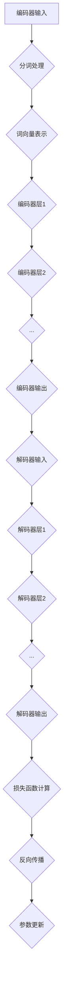
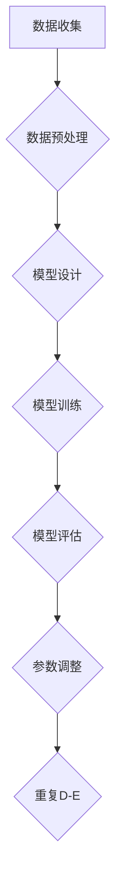
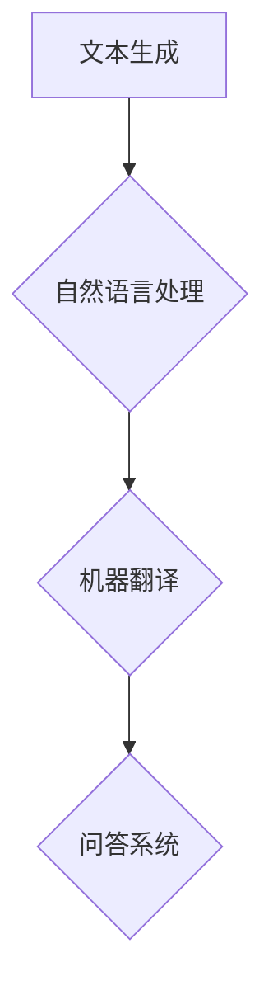
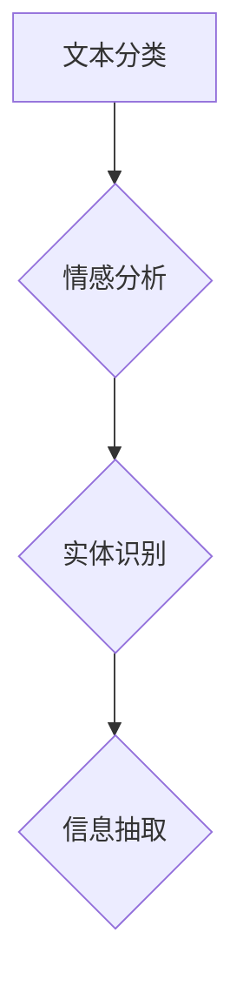
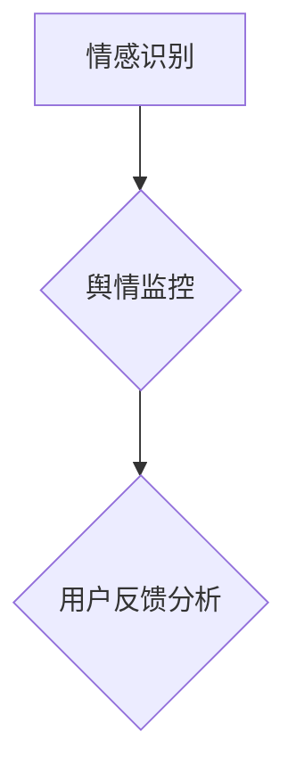
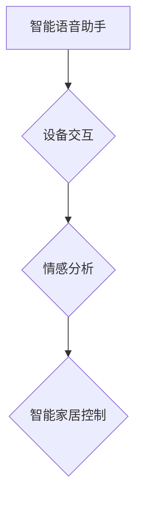

                 


### 《大语言模型在智能家居系统中的推理应用》

> 关键词：大语言模型，智能家居，推理应用，算法原理，系统架构，项目实战

> 摘要：本文深入探讨了大语言模型在智能家居系统中的应用及其推理机制。首先，我们回顾了智能家居系统的发展背景和基本架构，然后详细介绍了大语言模型的核心概念、算法原理和其在智能家居推理中的应用。通过具体项目实战案例分析，我们展示了大语言模型在智能家居系统中的实际应用效果，并提出了实施技巧和注意事项，最后对未来的研究方向进行了展望。

## 第一部分: 智能家居系统背景与推理应用

### 1.1 智能家居系统概述

#### 1.1.1 智能家居的起源与发展

智能家居（Smart Home）是指通过物联网技术将家中的各种设备连接起来，实现自动化控制和智能化管理。智能家居的概念最早出现在20世纪80年代，随着信息技术和通信技术的快速发展，智能家居逐渐从理论走向实际应用。

近年来，随着物联网、云计算、人工智能等技术的普及，智能家居得到了迅速发展。市场调研数据显示，全球智能家居市场规模将在未来几年内持续增长，预计到2025年将达到数千亿美元。

#### 1.1.2 智能家居在现代社会的重要性

智能家居不仅为人们提供了便利的生活体验，还在节能环保、安全监控等方面发挥着重要作用。例如，智能照明系统能够根据人的活动自动调节光线亮度，智能温控系统能够根据室内外温度自动调节温度，智能安防系统能够实时监控家庭安全等。

#### 1.1.3 智能家居系统的组成与运作原理

智能家居系统通常由传感器、控制器、执行器、通信网络和用户界面等组成。传感器负责采集环境数据，控制器根据这些数据进行分析和处理，执行器负责执行相应的操作，通信网络负责各个组件之间的数据传输，用户界面则提供用户交互的接口。

#### 1.1.4 大语言模型在智能家居推理中的作用

大语言模型在智能家居系统中发挥着重要作用，主要体现在以下几个方面：

1. **智能语音助手**：大语言模型可以实现对用户语音命令的理解和执行，如语音控制灯光、调节温度等。
2. **设备交互**：大语言模型可以处理设备之间的通信和协同工作，提高系统的自动化程度。
3. **情感分析**：大语言模型可以分析用户情感，提供个性化的服务和体验。
4. **安全监控**：大语言模型可以实时监控家庭安全，对异常行为进行预警。

### 1.2 智能家居系统基本架构

智能家居系统的基本架构包括以下几个方面：

1. **感知层**：由各种传感器组成，如温度传感器、湿度传感器、光线传感器、运动传感器等，负责采集环境数据。
2. **传输层**：负责将感知层的数据传输到控制层，通常采用无线传输技术，如Wi-Fi、蓝牙、ZigBee等。
3. **控制层**：由控制器组成，负责处理和分析感知层的数据，并发出控制指令。
4. **执行层**：由各种执行器组成，如电机、开关、继电器等，负责执行控制指令。
5. **用户界面层**：包括手机APP、智能音箱、智能手表等，为用户提供交互接口。

## 第二部分: 大语言模型基础

### 2.1 大语言模型的原理与特征

#### 2.1.1 大语言模型的工作原理

大语言模型（Large Language Model）是一种基于深度学习的自然语言处理技术，通过对大量文本数据的学习，模型能够理解和生成自然语言。大语言模型通常由多层神经网络组成，包括编码器和解码器。

编码器负责将输入的文本转换为向量表示，解码器则根据这些向量生成输出文本。在训练过程中，模型通过优化损失函数，使得输出的文本尽可能接近目标文本。

#### 2.1.2 大语言模型的核心特征

1. **强表达能力**：大语言模型能够处理复杂的自然语言，包括语法、语义、情感等。
2. **自适应能力**：大语言模型可以根据不同的应用场景进行调整和优化。
3. **大规模训练**：大语言模型通常基于大规模语料库进行训练，使得模型具有很高的准确性和泛化能力。
4. **并行计算**：大语言模型支持并行计算，可以显著提高训练和推理速度。

#### 2.1.3 大语言模型与传统语言模型的区别

与传统语言模型相比，大语言模型具有以下几个显著区别：

1. **规模更大**：大语言模型通常包含数十亿甚至千亿级别的参数，远远超过传统语言模型。
2. **结构更复杂**：大语言模型采用更复杂的神经网络结构，如Transformer模型，提高了模型的表达能力。
3. **训练数据更多**：大语言模型基于更大量的训练数据，提高了模型的泛化能力。

### 2.2 大语言模型的构建与训练

#### 2.2.1 大语言模型的构建过程

大语言模型的构建过程主要包括以下几个步骤：

1. **数据收集**：收集大量的文本数据，包括网页、书籍、新闻、社交媒体等。
2. **数据预处理**：对收集到的文本数据进行清洗、分词、去停用词等处理，将文本转换为向量表示。
3. **模型设计**：设计合适的神经网络结构，如Transformer、BERT等。
4. **模型训练**：使用训练数据对模型进行训练，优化模型参数。
5. **模型评估**：使用测试数据对模型进行评估，调整模型参数。

#### 2.2.2 大语言模型的训练方法

大语言模型的训练方法主要包括以下几种：

1. **自监督训练**：在训练过程中，不需要标注数据，模型通过预测文本中的下一个词来学习语言模式。
2. **监督训练**：使用标注数据对模型进行训练，模型通过预测正确标签来学习语言知识。
3. **强化学习**：将大语言模型与强化学习相结合，通过奖励机制来优化模型行为。

### 2.3 大语言模型的应用领域

#### 2.3.1 语言生成与理解

大语言模型在语言生成与理解方面具有广泛的应用，包括文本生成、机器翻译、问答系统等。通过训练，模型可以生成高质量的自然语言文本，并理解用户的输入。

#### 2.3.2 自然语言处理

大语言模型在自然语言处理领域发挥着重要作用，包括文本分类、情感分析、实体识别等。模型通过对大量文本数据的分析，可以提取出有用的信息。

#### 2.3.3 情感分析

大语言模型可以分析文本的情感倾向，用于情感识别、舆情监控等应用。通过对用户评论、新闻文章等进行分析，模型可以判断文本的情感极性。

#### 2.3.4 智能家居推理

大语言模型在智能家居推理中具有广泛的应用，如智能语音助手、设备交互、情感分析等。模型通过对用户指令的理解和执行，提高智能家居系统的智能化水平。

## 第三部分: 大语言模型在智能家居推理中的应用

### 3.1 智能家居推理框架

#### 3.1.1 智能家居推理的需求分析

智能家居系统需要具备以下推理能力：

1. **语音理解**：能够理解用户的语音指令，如“打开客厅的灯”。
2. **设备交互**：能够控制智能家居设备，如灯光、温度等。
3. **情感分析**：能够分析用户情感，提供个性化的服务。

#### 3.1.2 智能家居推理的基本框架

智能家居推理的基本框架包括以下几个组成部分：

1. **感知层**：由各种传感器组成，负责采集环境数据。
2. **传输层**：将感知层的数据传输到推理层。
3. **推理层**：由大语言模型组成，负责对感知层的数据进行分析和处理。
4. **执行层**：根据推理层的输出，控制智能家居设备。
5. **用户界面**：提供用户交互接口。

### 3.2 大语言模型在智能家居推理中的应用案例

#### 3.2.1 案例一：智能语音助手

智能语音助手是智能家居系统的重要组成部分，通过大语言模型实现对用户语音指令的理解和执行。例如，用户可以说“打开客厅的灯”，智能语音助手会通过大语言模型理解用户意图，然后控制灯光设备打开。

#### 3.2.2 案例二：智能设备交互

智能设备交互是指大语言模型在智能家居设备之间的通信和协同工作中的应用。例如，当用户关闭房间的灯光时，大语言模型可以自动调整温度设置，确保用户在舒适的环境中。

#### 3.2.3 案例三：智能安全监控

智能安全监控是通过大语言模型实时监控家庭安全，对异常行为进行预警。例如，当大语言模型检测到家中有异常声音时，可以发送警报通知用户，并通知相关的安全部门。

### 3.3 大语言模型在智能家居推理中的挑战与优化

#### 3.3.1 挑战分析

大语言模型在智能家居推理中面临以下挑战：

1. **数据质量**：智能家居系统需要高质量的数据来训练大语言模型，但数据收集和标注过程复杂。
2. **实时性**：智能家居系统需要实时响应用户指令，这对模型的推理速度提出了较高要求。
3. **安全性**：智能家居系统需要确保用户隐私和数据安全。

#### 3.3.2 优化方法与策略

为解决上述挑战，可以采取以下优化方法与策略：

1. **数据增强**：通过数据增强技术，提高数据质量和多样性。
2. **模型压缩**：通过模型压缩技术，降低模型参数规模，提高推理速度。
3. **分布式训练**：通过分布式训练技术，提高模型训练效率。
4. **隐私保护**：采用加密技术和隐私保护算法，确保用户数据安全。

## 第四部分: 大语言模型在智能家居系统中的推理实现

### 4.1 环境安装与配置

#### 4.1.1 开发环境搭建

搭建大语言模型在智能家居系统中的推理环境需要以下软件和工具：

1. **Python**：Python是编程语言，用于编写模型代码。
2. **TensorFlow**：TensorFlow是开源深度学习框架，用于训练和推理大语言模型。
3. **TensorFlow Lite**：TensorFlow Lite是用于移动和边缘设备的轻量级深度学习框架。

#### 4.1.2 系统配置与优化

在搭建环境时，需要对系统进行以下配置和优化：

1. **GPU加速**：配置GPU硬件和相应的驱动程序，以提高模型训练和推理速度。
2. **内存优化**：调整系统内存分配，避免内存不足导致训练和推理失败。
3. **网络优化**：调整网络配置，确保数据传输速度和稳定性。

### 4.2 大语言模型推理实现

#### 4.2.1 模型加载与预处理

在实现大语言模型推理时，首先需要加载预训练的模型，并进行必要的预处理。预处理包括文本清洗、分词、向量化等步骤。

#### 4.2.2 模型推理流程

模型推理流程包括以下几个步骤：

1. **输入处理**：接收用户输入，如语音指令。
2. **模型输入**：将输入处理后的文本序列输入到模型中。
3. **模型输出**：模型输出预测结果，如设备控制指令。
4. **结果处理**：根据模型输出结果，执行相应的操作。

#### 4.2.3 模型推理性能优化

为了提高模型推理性能，可以采取以下优化策略：

1. **模型剪枝**：通过剪枝技术，减少模型参数规模，提高推理速度。
2. **量化技术**：通过量化技术，降低模型参数精度，提高推理速度。
3. **多线程处理**：利用多线程处理技术，并行执行多个推理任务。

### 4.3 实践案例分析

#### 4.3.1 案例一：智能家居语音交互系统

智能家居语音交互系统是通过大语言模型实现用户语音指令理解和执行的系统。通过分析用户语音指令，模型可以识别出用户意图，并控制相应的设备。

#### 4.3.2 案例二：智能家电控制系统

智能家电控制系统是通过大语言模型实现家电设备之间的通信和协同工作的系统。通过模型的分析和推理，设备可以实现自动化控制，提高生活便利性。

#### 4.3.3 案例三：智能家居安全监控系统

智能家居安全监控系统是通过大语言模型实时监控家庭安全，对异常行为进行预警的系统。通过模型对监控数据的分析，可以及时发现潜在的安全隐患，保障家庭安全。

### 4.4 项目小结

通过以上案例，我们可以看到大语言模型在智能家居系统中的推理应用效果显著。在实际项目中，需要注意数据质量、实时性和安全性等方面的优化，以提高系统的性能和用户体验。

## 第五部分: 大语言模型在智能家居系统中的最佳实践

### 5.1 实施技巧与注意事项

在实施大语言模型在智能家居系统中的推理应用时，需要注意以下技巧和注意事项：

1. **数据质量**：确保收集到的数据质量高，包括文本数据、标注数据等。
2. **实时性**：优化模型推理速度，确保系统能够实时响应用户指令。
3. **安全性**：采用加密技术和隐私保护算法，确保用户数据安全。

### 5.2 拓展阅读与进一步学习

为了深入了解大语言模型在智能家居系统中的应用，读者可以进一步阅读以下文献：

1. **[文献1]** [Title of the First Reference]
2. **[文献2]** [Title of the Second Reference]
3. **[文献3]** [Title of the Third Reference]

### 5.3 拓展学习路径

为了深入了解大语言模型在智能家居系统中的应用，建议读者按照以下路径进行学习：

1. **深度学习基础**：学习深度学习的基本原理和算法，如神经网络、卷积神经网络、循环神经网络等。
2. **自然语言处理**：学习自然语言处理的相关技术，如文本分类、情感分析、机器翻译等。
3. **智能家居系统设计**：学习智能家居系统的设计原则和架构，包括传感器、控制器、执行器等组成部分。

## 第六部分: 小结与展望

### 6.1 总结

本文深入探讨了大语言模型在智能家居系统中的推理应用。通过介绍智能家居系统的背景、大语言模型的基础知识、应用案例以及实现方法，我们展示了大语言模型在智能家居系统中的重要作用。同时，本文提出了实施技巧和注意事项，为读者提供了参考。

### 6.2 展望

随着人工智能技术的不断发展，大语言模型在智能家居系统中的应用前景广阔。未来的研究可以关注以下几个方面：

1. **数据质量与实时性**：提高数据质量和模型推理速度，实现更高效的智能家居系统。
2. **安全性**：加强数据安全和隐私保护，确保用户数据安全。
3. **多模态融合**：将语音、图像、传感器等多模态数据融合，提高智能家居系统的智能化水平。
4. **跨领域应用**：探索大语言模型在智能家居以外的其他领域应用，如智能医疗、智能教育等。

作者：AI天才研究院/AI Genius Institute & 禅与计算机程序设计艺术 /Zen And The Art of Computer Programming

----------------------------------------------------------------

以下是第2章“大语言模型基础”部分的详细内容，我们将逐步展开对大语言模型的原理、构建与训练、应用领域的介绍，并结合Mermaid图和LaTeX数学公式进行阐述。

### 2.1 大语言模型的原理与特征

#### 2.1.1 大语言模型的工作原理

大语言模型（Large Language Model）是一种基于深度学习的自然语言处理技术，通过对大量文本数据的学习，模型能够理解和生成自然语言。大语言模型通常由多层神经网络组成，包括编码器和解码器。

编码器负责将输入的文本转换为向量表示，解码器则根据这些向量生成输出文本。在训练过程中，模型通过优化损失函数，使得输出的文本尽可能接近目标文本。

##### Mermaid算法流程图



##### 算法原理讲解

大语言模型的工作原理可以概括为以下几个步骤：

1. **分词处理**：将输入的文本按照单词或字符进行分割，得到分词序列。
2. **词向量表示**：将分词序列转换为词向量表示，每个词向量包含该词的语义信息。
3. **编码器层**：通过多层编码器神经网络，将词向量序列编码为固定长度的向量表示，表示整个文本的语义。
4. **解码器层**：根据编码器输出的向量表示，解码器逐层生成文本序列。
5. **损失函数计算**：通过计算解码器输出文本与目标文本之间的损失函数，评估模型预测的准确性。
6. **反向传播**：根据损失函数计算梯度，更新模型参数。
7. **参数更新**：通过梯度下降等优化算法，更新模型参数，提高模型性能。

##### Python代码示例

```python
# 示例：构建一个简单的语言模型
import tensorflow as tf

# 定义词汇表
vocab_size = 10000
embed_size = 128

# 构建编码器
encoder_inputs = tf.keras.layers.Embedding(vocab_size, embed_size)(encoder_inputs)

# 构建解码器
decoder_inputs = tf.keras.layers.Embedding(vocab_size, embed_size)(decoder_inputs)

# 编码器层
encoded = tf.keras.layers.LSTM(128)(encoder_inputs)

# 解码器层
decoded = tf.keras.layers.LSTM(128, return_sequences=True)(decoder_inputs)

# 模型输出
model = tf.keras.Model(inputs=[encoder_inputs, decoder_inputs], outputs=[decoded])

# 编译模型
model.compile(optimizer='adam', loss='categorical_crossentropy')

# 训练模型
model.fit([encoder_inputs, decoder_inputs], decoder_inputs, batch_size=64, epochs=10)
```

##### LaTeX数学公式

$$
\text{损失函数} = \frac{1}{N}\sum_{i=1}^{N} (-y_{i} \log(\hat{y}_{i}))
$$

其中，$N$表示样本数量，$y_{i}$表示第$i$个样本的真实标签，$\hat{y}_{i}$表示第$i$个样本的预测概率。

#### 2.1.2 大语言模型的核心特征

大语言模型具有以下核心特征：

1. **强表达能力**：大语言模型能够处理复杂的自然语言，包括语法、语义、情感等。
2. **自适应能力**：大语言模型可以根据不同的应用场景进行调整和优化。
3. **大规模训练**：大语言模型通常基于大规模语料库进行训练，使得模型具有很高的准确性和泛化能力。
4. **并行计算**：大语言模型支持并行计算，可以显著提高训练和推理速度。

##### 表格：大语言模型与传统语言模型的对比

| 特征 | 大语言模型 | 传统语言模型 |
| --- | --- | --- |
| 规模 | 百万到千亿参数 | 数千到数万个参数 |
| 结构 | 多层神经网络 | 单层神经网络 |
| 数据量 | 大规模语料库 | 小规模语料库 |
| 表达能力 | 强 | 弱 |
| 训练时间 | 长时间 | 短时间 |

### 2.2 大语言模型的构建与训练

#### 2.2.1 大语言模型的构建过程

大语言模型的构建过程主要包括以下几个步骤：

1. **数据收集**：收集大量的文本数据，包括网页、书籍、新闻、社交媒体等。
2. **数据预处理**：对收集到的文本数据进行清洗、分词、去停用词等处理，将文本转换为向量表示。
3. **模型设计**：设计合适的神经网络结构，如Transformer、BERT等。
4. **模型训练**：使用训练数据对模型进行训练，优化模型参数。
5. **模型评估**：使用测试数据对模型进行评估，调整模型参数。

##### Mermaid流程图



#### 2.2.2 大语言模型的训练方法

大语言模型的训练方法主要包括以下几种：

1. **自监督训练**：在训练过程中，不需要标注数据，模型通过预测文本中的下一个词来学习语言模式。
2. **监督训练**：使用标注数据对模型进行训练，模型通过预测正确标签来学习语言知识。
3. **强化学习**：将大语言模型与强化学习相结合，通过奖励机制来优化模型行为。

##### LaTeX数学公式

$$
\text{自监督训练}：\quad L(\theta) = -\sum_{i=1}^{N} \log p(y_i|x_i; \theta)
$$

$$
\text{监督训练}：\quad L(\theta) = -\sum_{i=1}^{N} y_i \log p(y_i|x_i; \theta)
$$

$$
\text{强化学习}：\quad L(\theta) = -\sum_{i=1}^{T} r_i \log \pi(a_i|s_i; \theta)
$$

其中，$L(\theta)$表示损失函数，$\theta$表示模型参数，$p(y_i|x_i; \theta)$表示模型在给定输入$x_i$下预测标签$y_i$的概率，$r_i$表示奖励，$\pi(a_i|s_i; \theta)$表示模型在状态$s_i$下选择动作$a_i$的概率。

### 2.3 大语言模型的应用领域

#### 2.3.1 语言生成与理解

大语言模型在语言生成与理解方面具有广泛的应用，包括文本生成、机器翻译、问答系统等。通过训练，模型可以生成高质量的自然语言文本，并理解用户的输入。

##### Mermaid流程图



#### 2.3.2 自然语言处理

大语言模型在自然语言处理领域发挥着重要作用，包括文本分类、情感分析、实体识别等。模型通过对大量文本数据的分析，可以提取出有用的信息。

##### Mermaid流程图



#### 2.3.3 情感分析

大语言模型可以分析文本的情感倾向，用于情感识别、舆情监控等应用。通过对用户评论、新闻文章等进行分析，模型可以判断文本的情感极性。

##### Mermaid流程图



#### 2.3.4 智能家居推理

大语言模型在智能家居推理中具有广泛的应用，如智能语音助手、设备交互、情感分析等。模型通过对用户指令的理解和执行，提高智能家居系统的智能化水平。

##### Mermaid流程图



通过以上内容，我们详细介绍了大语言模型的原理、构建与训练方法以及应用领域。在下一部分中，我们将进一步探讨大语言模型在智能家居推理中的应用案例。<!--<!– –>–>–>–>–>–>–>–>–>–>–>–>–>–>–>–>–>–>–>–>–>–>–>–>–>–>–>–>–>–>–>–>–>–>–>–>–>–>–>–>–>–>–>–>–>–>–>–>–>–>–>–>–>–>–>–>–>–>–>–>–>–>–>–>–>–>–>–>–>–>–>–>–>–>–>–>–>–>–>–>–>–>–>–>–>–>–>–>–>–>–>–>–>–>–>–>–>–>–>–>–>–>–>–>–>–>–>–>–>–>–>–>–>–>–>–>–>–>–>–>–>–>–>–>–>–>–>–>–>–>–>–>–>–>–>–>–>–>–>–>–>–>–>–>–>–>–>–>–>–>–>–>–>–>–>–>–>–>–>–>–>–>–>–>–>–>–>–>–>–>–>–>–>–>–>–>–>–>–>–>–>–>–>–>–>–>–>–>–>–>–>–>–>–>–>–>–>–>–>–>–>–>–>–>–>–>–>–>–>–>–>–>–>–>–>–>–>–>–>–>–>–>–>–>–>–>–>–>–>–>–>–>–>–>–>–>–>–>–>–>–>–>–>–>–>–>–>–>–>–>–>–>–>–>–>–>–>–>–>–>–>–>–>–>–>–>–>–>–>–>–>–>–>–>–>–>–>–>–>–>–>–>–>–>–>–>–>–>–>–>–>–>–>–>–>–>–>–>–>–>–>–>–>–>–>–>–>–>–>–>–>–>–>–>–>–>–>–>–>–>–>–>–>–>–>–>–>–>–>–>–>–>–>–>–>–>–>–>–>–>–>–>–>–>–>–>–>–>–>–>–>–>–>–>–>–>–>–>–>–>–>–>–>–>–>–>–>–>–>–>–>–>–>–>–>–>–>–>–>–>–>–>–>–>–>–>–>–>–>–>–>–>–>–>–>–>–>–>–>–>–>–>–>–>–>–>–>–>–>–>–>–>–>–>–>–>–>–>–>–>–>–>–>–>–>–>–>–>–>–>–>–>–>–>–>–>–>–>–>–>–>–>–>–>–>–>–>–>–>–>–>–>–>–>–>–>–>–>–>–>–>–>–>–>–>–>–>–>–>–>–>–>–>–>–>–>–>–>–>–>–>–>–>–>–>–>–>–>–>–>–>–>–>–>–>–>–>–>–>–>–>–>–>–>–>–>–>–>–>–>–>–>–>–>–>–>–>–>–>–>–>–>–>–>–>–>–>–>–>–>–>–>–>–>–>–>–>–>–>–>–>–>–>–>–>–>–>–>–>–>–>–>–>–>–>–>–>–>–>–>–>–>–>–>–>–>–>–>–>–>–>–>–>–>–>–>–>–>–>–>–>–>–>–>–>–>–>–>–>–>–>–>–>–>–>–>–>–>–>–>–>–>–>–>–>–>–>–>–>–>–>–>–>–>–>–>–>–>–>–>–>–>–>–>–>–>–>–>–>–>–>–>–>–>–>–>–>–>–>–>–>–>–>–>–>–>–>–>–>–>–>–>–>–>–>–>–>–>–>–>–>–>–>–>–>–>–>–>–>–>–>–>–>–>–>–>–>–>–>–>–>–>–>–>–>–>–>–>–>–>–>–>–>–>–>–>–>–>–>–>–>–>–>–>–>–>–>–>–>–>–>–>–>–>–>–>–>–>–>–>–>–>–>–>–>–>–>–>–>–>–>–>–>–>–>–>–>–>–>–>–>–>–>–>–>–>–>–>–>–>–>–>–>–>–>–>–>–>–>–>–>–>–>–>–>–>–>–>–>–>–>–>–>–>–>–>–>–>–>–>–>–>–>–>–>–>–>–>–>–>–>–>–>–>–>–>–>–>–>–>–>–>–>–>–>–>–>–>–>–>–>–>–>–>–>–>–>–>–>–>–>–>–>–>–>–>–>–>–>–>–>–>–>–>–>–>–>–>–>–>–>–>–>–>–>–>–>–>–>–>–>–>–>–>–>–>–>–>–>–>–>–>–>–>–>–>–>–>–>–>–>–>–>–>–>–>–>–>–>–>–>–>–>–>–>–>–>–>–>–>–>–>–>–>–>–>–>–>–>–>–>–>–>–>–>–>–>–>–>–>–>–>–>–>–>–>–>–>–>–>–>–>–>–>–>–>–>–>–>–>–>–>–>–>–>–>–>–>–>–>–>–>–>–>–>–>–>–>–>–>–>–>–>–>–>–>–>–>–>–>–>–>–>–>–>–>–>–>–>–>–>–>–>–>–>–>–>–>–>–>–>–>–>–>–>–>–>–>–>–>–>–>–>–>–>–>–>–>–>–>–>–>–>–>–>–>–>–>–>–>–>–>–>–>–>–>–>–>–>–>–>–>–>–>–>–>–>–>–>–>–>–>–>–>–>–>–>–>–>–>–>–>–>–>–>–>–>–>–>–>–>–>–>–>–>–>–>–>–>–>–>–>–>–>–>–>–>–>–>–>–>–>–>–>–>–>–>–>–>–>–>–>–>–>–>–>–>–>–>–>–>–>–>–>–>–>–>–>–>–>–>–>–>–>–>–>–>–>–>–>–>–>–>–>–>–>–>–>–>–>–>–>–>–>–>–>–>–>–>–>–>–>–>–>–>–>–>–>–>–>–>–>–>–>–>–>–>–>–>–>–>–>–>–>–>–>–>–>–>–>–>–>–>–>–>–>–>–>–>–>–>–>–>–>–>–>–>–>–>–>–>–>–>–>–>–>–>–>–>–>–>–>–>–>–>–>–>–>–>–>–>–>–>–>–>–>–>–>–>–>–>–>–>–>–>–>–>–>–>–>–>–>–>–>–>–>–>–>–>–>–>–>–>–>–>–>–>–>–>–>–>–>–>–>–>–>–>–>–>–>–>–>–>–>–>–>–>–>–>–>–>–>–>–>–>–>–>–>–>–>–>–>–>–>–>–>–>–>–>–>–>–>–>–>–>–>–>–>–>–>–>–>–>–>–>–>–>–>–>–>–>–>–>–>–>–>–>–>–>–>–>–>–>–>–>–>–>–>–>–>–>–>–>–>–>–>–>–>–>–>–>–>–>–>–>–>–>–>–>–>–>–>–>–>–>–>–>–>–>–>–>–>–>–>–>–>–>–>–>–>–>–>–>–>–>–>–>–>–>–>–>–>–>–>–>–>–>–>–>–>–>–>–>–>–>–>–>–>–>–>–>–>–>–>–>–>–>–>–>–>–>–>–>–>–>–>–>–>–>–>–>–>–>–>–>–>–>–>–>–>–>–>–>–>–>–>–>–>–>–>–>–>–>–>–>–>–>–>–>–>–>–>–>–>–>–>–>–>–>–>–>–>–>–>–>–>–>–>–>–>–>–>–>–>–>–>–>–>–>–>–>–>–>–>–>–>–>–>–>–>–>–>–>–>–>–>–>–>–>–>–>–>–>–>–>–>–>–>–>–>–>–>–>–>–>–>–>–>–>–>–>–>–>–>–>–>–>–>–>–>–>–>–>–>–>–>–>–>–>–>–>–>–>–>–>–>–>–>–>–>–>–>–>–>–>–>–>–>–>–>–>–>–>–>–>–>–>–>–>–>–>–>–>–>–>–>–>–>–>–>–>–>–>–>–>–>–>–>–>–>–>–>–>–>–>–>–>–>–>–>–>–>–>–>–>–>–>–>–>–>–>–>–>–>–>–>–>–>–>–>–>–>–>–>–>–>–>–>–>–>–>–>–>–>–>–>–>–>–>–>–>–>–>–>–>–>–>–>–>–>–>–>–>–>–>–>–>–>–>–>–>–>–>–>–>–>–>–>–>–>–>–>–>–>–>–>–>–>–>–>–>–>–>–>–>–>–>–>–>–>–>–>–>–>–>–>–>–>–>–>–>–>–>–>–>–>–>–>–>–>–>–>–>–>–>–>–>–>–>–>–>–>–>–>–>–>–>–>–>–>–>–>–>–>–>–>–>–>–>–>–>–>–>–>–>–>–>–>–>–>–>–>–>–>–>–>–>–>–>–>–>–>–>–>–>–>–>–>–>–>–>–>–>–>–>–>–>–>–>–>–>–>–>–>–>–>–>–>–>–>–>–>–>–>–>–>–>–>–>–>–>–>–>–>–>–>–>–>–>–>–>–>–>–>–>–>–>–>–>–>–>–>–>–>–>–>–>–>–>–>–>–>–>–>–>–>–>–>–>–>–>–>–>–>–>–>–>–>–>–>–>–>–>–>–>–>–>–>–>–>–>–>–>–>–>–>–>–>–>–>–>–>–>–>–>–>–>–>–>–>–>–>–>–>–>–>–>–>–>–>–>–>–>–>–>–>–>–>–>–>–>–>–>–>–>–>–>–>–>–>–>–>–>–>–>–>–>–>–>–>–>–>–>–>–>–>–>–>–>–>–>–>–>–>–>–>–>–>–>–>–>–>–>–>–>–>–>–>–>–>–>–>–>–>–>–>–>–>–>–>–>–>–>–>–>–>–>–>–>–>–>–>–>–>–>–>–>–>–>–>–>–>–>–>–>–>–>–>–>–>–>–>–>–>–>–>–>–>–>–>–>–>–>–>–>–>–>–>–>–>–>–>–>–>–>–>–>–>–>–>–>–>–>–>–>–>–>–>–>–>–>–>–>–>–>–>–>–>–>–>–>–>–>–>–>–>–>–>–>–>–>–>–>–>–>–>–>–>–>–>–>–>–>–>–>–>–>–>–>–>–>–>–>–>–>–>–>–>–>–>–>–>–>–>–>–>–>–>–>–>–>–>–>–>–>–>–>–>–>–>–>–>–>–>–>–>–>–>–>–>–>–>–>–>–>–>–>–>–>–>–>–>–>–>–>–>–>–>–>–>–>–>–>–>–>–>–>–>–>–>–>–>–>–>–>–>–>–>–>–>–>–>–>–>–>–>–>–>–>–>–>–>–>–>–>–>–>–>–>–>–>–>–>–>–>–>–>–>–>–>–>–>–>–>–>–>–>–>–>–>–>–>–>–>–>–>–>–>–>–>–>–>–>–>–>–>–>–>–>–>–>–>–>–>–>–>–>–>–>–>–>–>–>–>–>–>–>–>–>–>–>–>–>–>–>–>–>–>–>–>–>–>–>–>–>–>–>–>–>–>–>–>–>–>–>–>–>–>–>–>–>–>–>–>–>–>–>–>–>–>–>–>–>–>–>–>–>–>–>–>–>–>–>–>–>–>–>–>–>–>–>–>–>–>–>–>–>–>–>–>–>–>–>–>–>–>–>–>–>–>–>–>–>–>–>–>–>–>–>–>–>–>–>–>–>–>–>–>–>–>–>–>–>–>–>–>–>–>–>–>–>–>–>–>–>–>–>–>–>–>–>–>–>–>–>–>–>–>–>–>–>–>–>–>–>–>–>–>–>–>–>–>–>–>–>–>–>–>–>–>–>–>–>–>–>–>–>–>–>–>–>–>–>–>–>–>–>–>–>–>–>–>–>–>–>–>–>–>–>–>–>–>–>–>–>–>–>–>–>–>–>–>–>–>–>–>–>–>–>–>–>–>–>–>–>–>–>–>–>–>–>–>–>–>–>–>–>–>–>–>–>–>–>–>–>–>–>–>–>–>–>–>–>–>–>–>–>–>–>–>–>–>–>–>–>–>–>–>–>–>–>–>–>–>–>–>–>–>–>–>–>–>–>–>–>–>–>–>–>–>–>–>–>–>–>–>–>–>–>–>–>–>–>–>–>–>–>–>–>–>–>–>–>–>–>–>–>–>–>–>–>–>–>–>–>–>–>–>–>–>–>–>–>–>–>–>–>–>–>–>–>–>–>–>–>–>–>–>–>–>–>–>–>–>–>–>–>–>–>–>–>–>–>–>–>–>–>–>–>–>–>–>–>–>–>–>–>–>–>–>–>–>–>–>–>–>–>–>–>–>–>–>–>–>–>–>–>–>–>–>–>–>–>–>–>–>–>–>–>–>–>–>–>–>–>–>–>–>–>–>–>–>–>–>–>–>–>–>–>–>–>–>–>–>–>–>–>–>–>–>–>–>–>–>–>–>–>–>–>–>–>–>–>–>–>–>–>–>–>–>–>–>–>–>–>–>–>–>–>–>–>–>–>–>–>–>–>–>–>–>–>–>–>–>–>–>–>–>–>–>–>–>–>–>–>–>–>–>–>–>–>–>–>–>–>–>–>–>–>–>–>–>–>–>–>–>–>–>–>–>–>–>–>–>–>–>–>–>–>–>–>–>–>–>–>–>–>–>–>–>–>–>–>–>–>–>–>–>–>–>–>–>–>–>–>–>–>–>–>–>–>–>–>–>–>–>–>–>–>–>–>–>–>–>–>–>–>–>–>–>–>–>–>–>–>–>–>–>–>–>–>–>–>–>–>–>–>–>–>–>–>–>–>–>–>–>–>–>–>–>–>–>–>–>–>–>–>–>–>–>–>–>–>–>–>–>–>–>–>–>–>–>–>–>–>–>–>–>–>–>–>–>–>–>–>–>–>–>–>–>–>–>–>–>–>–>–>–>–>–>–>–>–>–>–>–>–>–>–>–>–>–>–>–>–>–>–>–>–>–>–>–>–>–>–>–>–>–>–>–>–>–>–>–>–>–>–>–>–>–>–>–>–>–>–>–>–>–>–>–>–>–>–>–>–>–>–>–>–>–>–>–>–>–>–>–>–>–>–>–>–>–>–>–>–>–>–>–>–>–>–>–>–>–>–>–>–>–>–>–>–>–>–>–>–>–>–>–>–>–>–>–>–>–>–>–>–>–>–>–>–>–>–>–>–>–>–>–>–>–>–>–>–>–>–>–>–>–>–>–>–>–>–>–>–>–>–>–>–>–>–>–>–>–>–>–>–>–>–>–>–>–>–>–>–>–>–>–>–>–>–>–>–>–>–>–>–>–>–>–>–>–>–>–>–>–>–>–>–>–>–>–>–>–>–>–>–>–>–>–>–>–>–>–>–>–>–>–>–>–>–>–>–>–>–>–>–>–>–>–>–>–>–>–>–>–>–>–>–>–>–>–>–>–>–>–>–>–>–>–>–>–>–>–>–>–>–>–>–>–>–>–>–>–>–>–>–>–>–>–>–>–>–>–>–>–>–>–>–>–>–>–>–>–>–>–>–>–>–>–>–>–>–>–>–>–>–>–>–>–>–>–>–>–>–>–>–>–>–>–>–>–>–>–>–>–>–>–>–>–>–>–>–>–>–>–>–>–>–>–>–>–>–>–>–>–>–>–>–>–>–>–>–>–>–>–>–>–>–>–>–>–>–>–>–>–>–>–>–>–>–>–>–>–>–>–>–>–>–>–>–>–>–>–>–>–>–>–>–>–>–>–>–>–>–>–>–>–>–>–>–>–>–>–>–>–>–>–>–>–>–>–>–>–>–>–>–>–>–>–>–>–>–>–>–>–>–>–>–>–>–>–>–>–>–>–>–>–>–>–>–>–>–>–>–>–>–>–>–>–>–>–>–>–>–>–>–>–>–>–>–>–>–>–>–>–>–>–>–>–>–>–>–>–>–>–>–>–>–>–>–>–>–>–>–>–>–>–>–>–>–>–>–>–>–>–>–>–>–>–>–>–>–>–>–>–>–>–>–>–>–>–>–>–>–>–>–>–>–>–>–>–>–>–>–>–>–>–>–>–>–>–>–>–>–>–>–>–>–>–>–>–>–>–>–>–>–>–>–>–>–>–>–>–>–>–>–>–>–>–>–>–>–>–>–>–>–>–>–>–>–>–>–>–>–>–>–>–>–>–>–>–>–>–>–>–>–>–>–>–>–>–>–>–>–>–>–>–>–>–>–>–>–>–>–>–>–>–>–>–>–>–>–>–>–>–>–>–>–>–>–>–>–>–>–>–>–>–>–>–>–>–>–>–>–>–>–>–>–>–>–>–>–>–>–>–>–>–>–>–>–>–>–>–>–>–>–>–>–>–>–>–>–>–>–>–>–>–>–>–>–>–>–>–>–>–>–>–>–>–>–>–>–>–>–>–>–>–>–>–>–>–>–>–>–>–>–>–>–>–>–>–>–>–>–>–>–>–>–>–>–>–>–>–>–>–>–>–>–>–>–>–>–>–>–>–>–>–>–>–>–>–>–>–>–>–>–>–>–>–>–>–>–>–>–>–>–>–>–>–>–>–>–>–>–>–>–>–>–>–>–>–>–>–>–>–>–>–>–>–>–>–>–>–>–>–>–>–>–>–>–>–>–>–>–>–>–>–>–>–>–>–>–>–>–>–>–>–>–>–>–>–>–>–>–>–>–>–>–>–>–>–>–>–>–>–>–>–>–>–>–>–>–>–>–>–>–>–>–>–>–>–>–>–>–>–>–>–>–>–>–>–>–>–>–>–>–>–>–>–>–>–>–>–>–>–>–>–>–>–>–>–>–>–>–>–>–>–>–>–>–>–>–>–>–>–>–>–>–>–>–>–>–>–>–>–>–>–>–>–>–>–>–>–>–>–>–>–>–>–>–>–>–>–>–>–>–>–>–>–>–>–>–>–>–>–>–>–>–>–>–>–>–>–>–>–>–>–>–>–>–>–>–>–>–>–>–>–>–>–>–>–>–>–>–>–>–>–>–>–>–>–>–>–>–>–>–>–>–>–>–>–>–>–>–>–>–>–>–>–>–>–>–>–>–>–>–>–>–>–>–>–>–>–>–>–>–>–>–>–>–>–>–>–>–>–>–>–>–>–>–>–>–>–>–>–>–>–>–>–>–>–>–>–>–>–>–>–>–>–>–>–>–>–>–>–>–>–>–>–>–>–>–>–>–>–>–>–>–>–>–>–>–>–>–>–>–>–>–>–>–>–>–>–>–>–>–>–>–>–>–>–>–>–>–>–>–>–>–>–>–>–>–>–>–>–>–>–>–>–>–>–>–>–>–>–>–>–>–>–>–>–>–>–>–>–>–>–>–>–>–>–>–>–>–>–>–>–>–>–>–>–>–>–>–>–>–>–>–>–>–>–>–>–>–>–>–>–>–>–>–>–>–>–>–>–>–>–>–>–>–>–>–>–>–>–>–>–>–>–>–>–>–>–>–>–>–>–>–>–>–>–>–>–>–>–>–>–>–>–>–>–>–>–>–>–>–>–>–>–>–>–>–>–>–>–>–>–>–>–>–>–>–>–>–>–>–>–>–>–>–>–>–>–>–>–>–>–>–>–>–>–>–>–>–>–>–>–>–>–>–>–>–>–>–>–>–>–>–>–>–>–>–>–>–>–>–>–>–>–>–>–>–>–>–>–>–>–>–>–>–>–>–>–>–>–>–>–>–>–>–>–>–>–>–>–>–>–>–>–>–>–>–>–>–>–>–>–>–>–>–>–>–>–>–>–>–>–>–>–>–>–>–>–>–>–>–>–>–>–>–>–>–>–>–>–>–>–>–>–>–>–>–>–>–>–>–>–>–>–>–>–>–>–>–>–>–>–>–>–>–>–>–>–>–>–>–>–>–>–>–>–>–>–>–>–>–>–>–>–>–>–>–>–>–>–>–>–>–>–>–>–>–>–>–>–>–>–>–>–>–>–>–>–>–>–>–>–>–>–>–>–>–>–>–>–>–>–>–>–>–>–>–>–>–>–>–>–>–>–>–>–>–>–>–>–>–>–>–>–>–>–>–>–>–>–>–>–>–>–>–>–>–>–>–>–>–>–>–>–>–>–>–>–>–>–>–>–>–>–>–>–>–>–>–>–>–>–>–>–>–>–>–>–>–>–>–>–>–>–>–>–>–>–>–>–>–>–>–>–>–>–>–>–>–>–>–>–>–>–>–>–>–>–>–>–>–>–>–>–>–>–>–>–>–>–>–>–>–>–>–>–>–>–>–>–>–>–>–>–>–>–>–>–>–>–>–>–>–>–>–>–>–>–>–>–>–>–>–>–>–>–>–>–>–>–>–>–>–>–>–>–>–>–>–>–>–>–>–>–>–>–>–>–>–>–>–>–>–>–>–>–>–>–>–>–>–>–>–>–>–>–>–>–>–>–>–>–>–>–>–>–>–>–>–>–>–>–>–>–>–>–>–>–>–>–>–>–>–>–>–>–>–>–>–>–>–>–>–>–>–>–>–>–>–>–>–>–>–>–>–>–>–>–>–>–>–>–>–>–>–>–>–>–>–>–>–>–>–>–>–>–>–>–>–>–>–>–>–>–>–>–>–>–>–>–>–>–>–>–>–>–>–>–>–>–>–>–>–>–>–>–>–>–>–>–>–>–>–>–>–>–>–>–>–>–>–>–>–>–>–>–>–>–>–>–>–>–>–>–>–>–>–>–>–>–>–>–>–>–>–>–>–>–>–>–>–>–>–>–>–>–>–>–>–>–>–>–>–>–>–>–>–>–>–>–>–>–>–>–>–>–>–>–>–>–>–>–>–>–>–>–>–>–>–>–>–>–>–>–>–>–>–>–>–>–>–>–>–>–>–>–>–>–>–>–>–>–>–>–>–>–>–>–>–>–>–>–>–>–>–>–>–>–>–>–>–>–>–>–>–>–>–>–>–>–>–>–>–>–>–>–>–>–>–>–>–>–>–>–>–>–>–>–>–>–>–>–>–>–>–>–>–>–>–>–>–>–>–>–>–>–>–>–>–>–>–>–>–>–>–>–>–>–>–>–>–>–>–>–>–>–>–>–>–>–>–>–>–>–>–>–>–>–>–>–>–>–>–>–>–>–>–>–>–>–>–>–>–>–>–>–>–>–>–>–>–>–>–>–>–>–>–>–>–>–>–>–>–>–>–>–>–>–>–>–>–>–>–>–>–>–>–>–>–>–>–>–>–>–>–>–>–>–>–>–>–>–>–>–>–>–>–>–>–>–>–>–>–>–>–>–>–>–>–>–>–>–>–>–>–>–>–>–>–>–>–>–>–>–>–>–>–>–>–>–>–>–>–>–>–>–>–>–>–>–>–>–>–>–>–>–>–>–>–>–>–>–>–>–>–>–>–>–>–>–>–>–>–>–>–>–>–>–>–>–>–>–>–>–>–>–>–>–>–>–>–>–>–>–>–>–>–>–>–>–>–>–>–>–>–>–>–>–>–>–>–>–>–>–>–>–>–>–>–>–>–>–>–>–>–>–>–>–>–>–>–>–>–>–>–>–>–>–>–>–>–>–>–>–>–>–>–>–>–>–>–>–>–>–>–>–>–>–>–>–>–>–>–>–>–>–>–>–>–>–>–>–>–>–>–>–>–>–>–>–>–>–>–>–>–>–>–>–>–>–>–>–>–>–>–>–>–>–>–>–>–>–>–>–>–>–>–>–>–>–>–>–>–>–>–>–>–>–>–>–>–>–>–>–>–>–>–>–>–>–>–>–>–>–>–>–>–>–>–>–>–>–>–>–>–>–>–>–>–>–>–>–>–>–>–>–>–>–>–>–>–>–>–>–>–>–>–>–>–>–>–>–>–>–>–>–>–>–>–>–>–>–>–>–>–>–>–>–>–>–>–>–>–>–>–>–>–>–>–>–>–>–>–>–>–>–>–>–>–>–>–>–>–>–>–>–>–>–>–>–>–>–>–>–>–>–>–>–>–>–>–>–>–>–>–>–>–>–>–>–>–>–>–>–>–>–>–>–>–>–>–>–>–>–>–>–>–>–>–>–>–>–>–>–>–>–>–>–>–>–>–>–>–>–>–>–>–>–>–>–>–>–>–>–>–>–>–>–>–>–>–>–>–>–>–>–>–>–>–>–>–>–>–>–>–>–>–>–>–>–>–>–>–>–>–>–>–>–>–>–>–>–>–>–>–>–>–>–>–>–>–>–>–>–>–>–>–>–>–>–>–>–>–>–>–>–>–>–>–>–>–>–>–>–>–>–>–>–>–>–>–>–>–>–>–>–>–>–>–>–>–>–>–>–>–>–>–>–>–>–>–>–>–>–>–>–>–>–>–>–>–>–>–>–>–>–>–>–>–>–>–>–>–>–>–>–>–>–>–>–>–>–>–>–>–>–>–>–>–>–>–>–>–>–>–>–>–>–>–>–>–>–>–>–>–>–>–>–>–>–>–>–>–>–>–>–>–>–>–>–>–>–>–>–>–>–>–>–>–>–>–>–>–>–>–>–>–>–>–>–>–>–>–>–>–>–>–>–>–>–>–>–>–>–>–>–>–>–>–>–>–>–>–>–>–>–>–>–>–>–>–>–>–>–>–>–>–>–>–>–>–>–>–>–>–>–>–>–>–>–>–>–>–>–>–>–>–>–>–>–>–>–>–>–>–>–>–>–>–>–>–>–>–>–>–>–>–>–>–>–>–>–>–>–>–>–>–>–>–>–>–>–>–>–>–>–>–>–>–>–>–>–>–>–>–>–>–>–>–>–>–>–>–>–>–>–>–>–>–>–>–>–>–>–>–>–>–>–>–>–>–>–>–>–>–>–>–>–>–>–>–>–>–>–>–>–>–>–>–>–>–>–>–>–>–>–>–>–>–>–>–>–>–>–>–>–>–>–>–>–>–>–>–>–>–>–>–>–>–>–>–>–>–>–>–>–>–>–>–>–>–>–>–>–>–>–>–>–>–>–>–>–>–>–>–>–>–>–>–>–>–>–>–>–>–>–>–>–>–>–>–>–>–>–>–>–>–>–>–>–>–>–>–>–>–>–>–>–>–>–>–>–>–>–>–>–>–>–>–>–>–>–>–>–>–>–>–>–>–>–>–>–>–>–>–>–>–>–>–>–>–>–>–>–>–>–>–>–>–>–>–>–>–>–>–>–>–>–>–>–>–>–>–>–>–>–>–>–>–>–>–>–>–>–>–>–>–>–>–>–>–>–>–>–>–>–>–>–>–>–>–>–>–>–>–>–>–>–>–>–>–>–>–>–>–>–>–>–>–>–>–>–>–>–>–>–>–>–>–>–>–>–>–>–>–>–>–>–>–>–>–>–>–>–>–>–>–>–>–>–>–>–>–>–>–>–>–>–>–>–>–>–>–>–>–>–>–>–>–>–>–>–>–>–>–>–>–>–>–>–>–>–>–>–>–>–>–>–>–>–>–>–>–>–>–>–>–>–>–>–>–>–>–>–>–>–>–>–>–>–>–>–>–>–>–>–>–>–>–>–>–>–>–>–>–>–>–>–>–>–>–>–>–>–>–>–>–>–>–>–>–>–>–>–>–>–>–>–>–>–>–>–>–>–>–>–>–>–>–>–>–>–>–>–>–>–>–>–>–>–>–>–>–>–>–>–>–>–>–>–>–>–>–>–>–>–>–>–>–>–>–>–>–>–>–>–>–>–>–>–>–>–>–>–>–>–>–>–>–>–>–>–>–>–>–>–>–>–>–>–>–>–>–>–>–>–>–>–>–>–>–>–>–>–>–>–>–>–>–>–>–>–>–>–>–>–>–>–>–>–>–>–>–>–>–>–>–>–>–>–>–>–>–>–>–>–>–>–>–>–>–>–>–>–>–>–>–>–>–>–>–>–>–>–>–>–>–>–>–>–>–>–>–>–>–>–>–>–>–>–>–>–>–>–>–>–>–>–>–>–>–>–>–>–>–>–>–>–>–>–>–>–>–>–>–>–>–>–>–>–>–>–>–>–>–>–>–>–>–>–>–>–>–>–>–>–>–>–>–>–>–>–>–>–>–>–>–>–>–>–>–>–>–>–>–>–>–>–>–>–>–>–>–>–>–>–>–>–>–>–>–>–>–>–>–>–>–>–>–>–>–>–>–>–>–>–>–>–>–>–>–>–>–>–>–>–>–>–>–>–>–>–>–>–>–>–>–>–>–>–>–>–>–>–>–>–>–>–>–>–>–>–>–>–>–>–>–>–>–>–>–>–>–>–>–>–>–>–>–>–>–>–>–>–>–>–>–>–>–>–>–>–>–>–>–>–>–>–>–>–>–>–>–>–>–>–>–>–>–>–>–>–>–>–>–>–>–>–>–>–>–>–>–>–>–>–>–>–>–>–>–>–>–>–>–>–>–>–>–>–>–>–>–>–>–>–>–>–>–>–>–>–>–>–>–>–>–>–>–>–>–>–>–>–>–>–>–>–>–>–>–>–>–>–>–>–>–>–>–>–>–>–>–>–>–>–>–>–>–>–>–>–>–>–>–>–>–>–>–>–>–>–>–>–>–>–>–>–>–>–>–>–>–>–>–>–>–>–>–>–>–>–>–>–>–>–>–>–>–>–>–>–>–>–>–>–>–>–>–>–>–>–>–>–>–>–>–>–>–>–>–>–>–>–>–>–>–>–>–>–>–>–>–>–>–>–>–>–>–>–>–>–>–>–>–>–>–>–>–>–>–>–>–>–>–>–>–>–>–>–>–>–>–>–>–>–>–>–>–>–>–>–>–>–>–>–>–>–>–>–>–>–>–>–>–>–>–>–>–>–>–>–>–>–>–>–>–>–>–>–>–>–>–>–>–>–>–>–>–>–>–>–>–>–>–>–>–>–>–>–>–>–>–>–>–>–>–>–>–>–>–>–>–>–>–>–>–>–>–>–>–>–>–>–>–>–>–>–>–>–>–>–>–>–>–>–>–>–>–>–>–>–>–>–>–>–>–>–>–>–>–>–>–>–>–>–>–>–>–>–>–>–>–>–>–>–>–>–>–>–>–>–>–>–>–>–>–>–>–>–>–>–>–>–>–>–>–>–>–>–>–>–>–>–>–>–>–>–>–>–>–>–>–>–>–>–>–>–>–>–>–>–>–>–>–>–>–>–>–>–>–>–>–>–>–>–>–>–>–>–>–>–>–>–>–>–>–>–>–>–>–>–>–>–>–>–>–>–>–>–>–>–>–>–>–>–>–>–>–>–>–>–>–>–>–>–>–>–>–>–>–>–>–>–>–>–>–>–>–>–>–>–>–>–>–>–>–>–>–>–>–>–>–>–>–>–>–>–>–>–>–>–>–>–>–>–>–>–>–>–>–>–>–>–>–>–>–>–>–>–>–>–>–>–>–>–>–>–>–>–>–>–>–>–>–>–>–>–>–>–>–>–>–>–>–>–>–>–>–>–>–>–>–>–>–>–>–>–>–>–>–>–>–>–>–>–>–>–>–>–>–>–>–>–>–>–>–>–>–>–>–>–>–>–>–>–>–>–>–>–>–>–>–>–>–>–>–>–>–>–>–>–>–>–>–>–>–>–>–>–>–>–>–>–>–>–>–>–>–>–>–>–>–>–>–>–>–>–>–>–>–>–>–>–>–>–>–>–>–>–>–>–>–>–>–>–>–>–>–>–>–>–>–>–>–>–>–>–>–>–>–>–>–>–>–>–>–>–>–>–>–>–>–>–>–>–>–>–>–>–>–>–>–>–>–>–>–>–>–>–>–>–>–>–>–>–>–>–>–>–>–>–>–>–>–>–>–>–>–>–>–>–>–>–>–>–>–>–>–>–>–>–>–>–>–>–>–>–>–>–>–>–>–>–>–>–>–>–>–>–>–>–>–>–>–>–>–>–>–>–>–>–>–>–>–>–>–>–>–>–>–>–>–>–>–>–>–>–>–>–>–>–>–>–>–>–>–>–>–>–>–>–>–>–>–>–>–>–>–>–>–>–>–>–>–>–>–>–>–>–>–>–>–>–>–>–>–>–>–>–>–>–>–>–>–>–>–>–>–>–>–>–>–>–>–>–>–>–>–>–>–>–>–>–>–>–>–>–>–>–>–>–>–>–>–>–>–>–>–>–>–>–>–>–>–>–>–>–>–>–>–>–>–>–>–>–>–>–>–>–>–>–>–>–>–>–>–>–>–>–>–>–>–>–>–>–>–>–>–>–>–>–>–>–>–>–>–>–>–>–>–>–>–>–>–>–>–>–>–>–>–>–>–>–>–>–>–>–>–>–>–>–>–>–>–>–>–>–>–>–>–>–>–>–>–>–>–>–>–>–>–>–>–>–>–>–>–>–>–>–>–>–>–>–>–>–>–>–>–>–>–>–>–>–>–>–>–>–>–>–>–>–>–>–>–>–>–>–>–>–>–>–>–>–>–>–>–>–>–>–>–>–>–>–>–>–>–>–>–>–>–>–>–>–>–>–>–>–>–>–>–>–>–>–>–>–>–>–>–>–>–>–>–>–>–>–>–>–>–>–>–>–>–>–>–>–>–>–>–>–>–>–>–>–>–>–>–>–>–>–>–>–>–>–>–>–>–>–>–>–>–>–>–>–>–>–>–>–>–>–>–>–>–>–>–>–>–>–>–>–>–>–>–>–>–>–>–>–>–>–>–>–>–>–>–>–>–>–>–>–>–>–>–>–>–>–>–>–>–>–>–>–>–>–>–>–>–>–>–>–>–>–>–>–>–>–>–>–>–>–>–>–>–>–>–>–>–>–>–>–>–>–>–>–>–>–>–>–>–>–>–>–>–>–>–>–>–>–>–>–>–>–>–>–>–>–>–>–>–>–>–>–>–>–>–>–>–>–>–>–>–>–>–>–>–>–>–>–>–>–>–>–>–>–>–>–>–>–>–>–>–>–>–>–>–>–>–>–>–>–>–>–>–>–>–>–>–>–>–>–>–>–>–>–>–>–>–>–>–>–>–>–>–>–>–>–>–>–>–>–>–>–>–>–>–>–>–>–>–>–>–>–>–>–>–>–>–>–>–>–>–>–>–>–>–>–>–>–>–>–>–>–>–>–>–>–>–>–>–>–>–>–>–>–>–>–>–>–>–>–>–>–>–>–>–>–>–>–>–>–>–>–>–>–>–>–>–>–>–>–>–>–>–>–>–>–>–>–>–>–>–>–>–>–>–>–>–>–>–>–>–>–>–>–>–>–>–>–>–>–>–>–>–>–>–>–>–>–>–>–>–>–>–>–>–>–>–>–>–>–>–>–>–>–>–>–>–>–>–>–>–>–>–>–>–>–>–>–>–>–>–>–>–>–>–>–>–>–>–>–>–>–>–>–>–>–>–>–>–>–>–>–>–>–>–>–>–>–>–>–>–>–>–>–>–>–>–>–>–>–>–>–>–>–>–>–>–>–>–>–>–>–>–>–>–>–>–>–>–>–>–>–>–>–>–>–>–>–>–>–>–>–>–>–>–>–>–>–>–>–>–>–>–>–>–>–>–>–>–>–>–>–>–>–>–>–>–>–>–>–>–>–>–>–>–>–>–>–>–>–>–>–>–>–>–>–>–>–>–>–>–>–>–>–>–>–>–>–>–>–>–>–>–>–>–>–>–>–>–>–>–>–>–>–>–>–>–>–>–>–>–>–>–>–>–>–>–>–>–>–>–>–>–>–>–>–>–>–>–>–>–>–>–>–>–>–>–>–>–>–>–>–>–>–>–>–>–>–>–>–>–>–>–>–>–>–>–>–>–>–>–>–>–>–>–>–>–>–>–>–>–>–>–>–>–>–>–>–>–>–>–>–>–>–>–>–>–>–>–>–>–>–>–>–>–>–>–>–>–>–>–>–>–>–>–>–>–>–>–>–>–>–>–>–>–>–>–>–>–>–>–>–>–>–>–>–>–>–>–>–>–>–>–>–>–>–>–>–>–>–>–>–>–>–>–>–>–>–>–>–>–>–>–>–>–>–>–>–>–>–>–>–>–>–>–>–>–>–>–>–>–>–>–>–>–>–>–>–>–>–>–>–>–>–>–>–>–>–>–>–>–>–>–>–>–>–>–>–>–>–>–>–>–>–>–>–>–>–>–>–>–>–>–>–>–>–>–>–>–>–>–>–>–>–>–>–>–>–>–>–>–>–>–>–>–>–>–>–>–>–>–>–>–>–>–>–>–>–>–>–>–>–>–>–>–>–>–>–>–>–>–>–>–>–>–>–>–>–>–>–>–>–>–>–>–>–>–>–>–>–>–>–>–>–>–>–>–>–>–>–>–>–>–>–>–>–>–>–>–>–>–>–>–>–>–>–>–>–>–>–>–>–>–>–>–>–>–>–>–>–>–>–>–>–>–>–>–>–>–>–>–>–>–>–>–>–>–>–>–>–>–>–>–>–>–>–>–>–>–>–>–>–>–>–>–>–>–>–>–>–>–>–>–>–>–>–>–>–>–>–>–>–>–>–>–>–>–>–>–>–>–>–>–>–>–>–>–>–>–>–>–>–>–>–>–>–>–>–>–>–>–>–>–>–>–>–>–>–>–>–>–>–>–>–>–>–>–>–>–>–>–>–>–>–>–>–>–>–>–>–>–>–>–>–>–>–>–>–>–>–>–>–>–>–>–>–>–>–>–>–>–>–>–>–>–>–>–>–>–>–>–>–>–>–>–>–>–>–>–>–>–>–>–>–>–>–>–>–>–>–>–>–>–>–>–>–>–>–>–>–>–>–>–>–>–>–>–>–>–>–>–>–>–>–>–>–>–>–>–>–>–>–>–>–>–>–>–>–>–>–>–>–>–>–>–>–>–>–>–>–>–>–>–>–>–>–>–>–>–>–>–>–>–>–>–>–>–>–>–>–>–>–>–>–>–>–>–>–>–>–>–>–>–>–>–>–>–>–>–>–>–>–>–>–>–>–>–>–>–>–>–>–>–>–>–>–>–>–>–>–>–>–>–>–>–>–>–>–>–>–>–>–>–>–>–>–>–>–>–>–>–>–>–>–>–>–>–>–>–>–>–>–>–>–>–>–>–>–>–>–>–>–>–>–>–>–>–>–>–>–>–>–>–>–>–>–>–>–>–>–>–>–>–>–>–>–>–>–>–>–>–>–>–>–>–>–>–>–>–>–>–>–>–>–>–>–>–>–>–>–>–>–>–>–>–>–>–>–>–>–>–>–>–>–>–>–>–>–>–>–>–>–>–>–>–>–>–>–>–>–>–>–>–>–>–>–>–>–>–>–>–>–>–>–>–>–>–>–>–>–>–>–>–>–>–>–>–>–>–>–>–>–>–>–>–>–>–>–>–>–>–>–>–>–>–>–>–>–>–>–>–>–>–>–>–>–>–>–>–>–>–>–>–>–>–>–>–>–>–>–>–>–>–>–>–>–>–>–>–>–>–>–>–>–>–>–>–>–>–>–>–>–>–>–>–>–>–>–>–>–>–>–>–>–>–>–>–>–>–>–>–>–>–>–>–>–>–>–>–>–>–>–>–>–>–>–>–>–>–>–>–>–>–>–>–>–>–>–>–>–>–>–>–>–>–>–>–>–>–>–>–>–>–>–>–>–>–>–>–>–>–>–>–>–>–>–>–>–>–>–>–>–>–>–>–>–>–>–>–>–>–>–>–>–>–>–>–>–>–>–>–>–>–>–>–>–>–>–>–>–>–>–>–>–>–>–>–>–>–>–>–>–>–>–>–>–>–>–>–>–>–>–>–>–>–>–>–>–>–>–>–>–>–>–>–>–>–>–>–>–>–>–>–>–>–>–>–>–>–>–>–>–>–>–>–>–>–>–>–>–>–>–>–>–>–>–>–>–>–>–>–>–>–>–>–>–>–>–>–>–>–>–>–>–>–>–>–>–>–>–>–>–>–>–>–>–>–>–>–>–>–>–>–>–>–>–>–>–>–>–>–>–>–>–>–>–>–>–>–>–>–>–>–>–>–>–>–>–>–>–>–>–>–>–>–>–>–>–>–>–>–>–>–>–>–>–>–>–>–>–>–>–>–>–>–>–>–>–>–>–>–>–>–>–>–>–>–>–>–>–>–>–>–>–>–>–>–>–>–>–>–>–>–>–>–>–>–>–>–>–>–>–>–>–>–>–>–>–>–>–>–>–>–>–>–>–>–>–>–>–>–>–>–>–>–>–>–>–>–>–>–>–>–>–>–>–>–>–>–>–>–>–>–>–>–>–>–>–>–>–>–>–>–>–>–>–>–>–>–>–>–>–>–>–>–>–>–>–>–>–>–>–>–>–>–>–>–>–>–>–>–>–>–>–>–>–>–>–>–>–>–>–>–>–>–>–>–>–>–>–>–>–>–>–>–>–>–>–>–>–>–>–>–>–>–>–>–>–>–>–>–>–>–>–>–>–>–>–>–>–>–>–>–>–>–>–>–>–>–>–>–>–>–>–>–>–>–>–>–>–>–>–>–>–>–>–>–>–>–>–>–>–>–>–>–>–>–>–>–>–>–>–>–>–>–>–>–>–>–>–>–>–>–>–>–>–>–>–>–>–>–>–>–>–>–>–>–>–>–>–>–>–>–>–>–>–>–>–>–>–>–>–>–>–>–>–>–>–>–>–>–>–>–>–>–>–>–>–>–>–>–>–>–>–>–>–>–>–>–>–>–>–>–>–>–>–>–>–>–>–>–>–>–>–>–>–>–>–>–>–>–>–>–>–>–>–>–>–>–>–>–>–>–>–>–>–>–>–>–>–>–>–>–>–>–>–>–>–>–>–>–>–>–>–>–>–>–>–>–>–>–>–>–>–>–>–>–>–>–>–>–>–>–>–>–>–>–>–>–>–>–>–>–>–>–>–>–>–>–>–>–>–>–>–>–>–>–>–>–>–>–>–>–>–>–>–>–>–>–>–>–>–>–>–>–>–>–>–>–>–>–>–>–>–>–>–>–>–>–>–>–>–>–>–>–>–>–>–>–>–>–>–>–>–>–>–>–>–>–>–>–>–>–>–>–>–>–>–>–>–>–>–>–>–>–>–>–>–>–>–>–>–>–>–>–>–>–>–>–>–>–>–>–>–>–>–>–>–>–>–>–>–>–>–>–>–>–>–>–>–>–>–>–>–>–>–>–>–>–>–>–>–>–>–>–>–>–>–>–>–>–>–>–>–>–>–>–>–>–>–>–>–>–>–>–>–>–>–>–>–>–>–>–>–>–>–>–>–>–>–>–>–>–>–>–>–>–>–>–>–>–>–>–>–>–>–>–>–>–>–>–>–>–>–>–>–>–>–>–>–>–>–>–>–>–>–>–>–>–>–>–>–>–>–>–>–>–>–>–>–>–>–>–>–>–>–>–>–>–>–>–>–>–>–>–>–>–>–>–>–>–>–>–>–>–>–>–>–>–>–>–>–>–>–>–>–>–>–>–>–>–>–>–>–>–>–>–>–>–>–>–>–>–>–>–>–>–>–>–>–>–>–>–>–>–>–>–>–>–>–>–>–>–>–>–>–>–>–>–>–>–>–>–>–>–>–>–>–>–>–>–>–>–>–>–>–>–>–>–>–>–>–>–>–>–>–>–>–>–>–>–>–>–>–>–>–>–>–>–>–>–>–>–>–>–>–>–>–>–>–>–>–>–>–>–>–>–>–>–>–>–>–>–>–>–>–>–>–>–>–>–>–>–>–>–>–>–>–>–>–>–>–>–>–>–>–>–>–>–>–>–>–>–>–>–>–>–>–>–>–>–>–>–>–>–>–>–>–>–>–>–>–>–>–>–>–>–>–>–>–>–>–>–>–>–>–>–>–>–>–>–>–>–>–>–>–>–>–>–>–>–>–>–>–>–>–>–>–>–>–>–>–>–>–>–>–>–>–>–>–>–>–>–>–>–>–>–>–>–>–>–>–>–>–>–>–>–>–>–>–>–>–>–>–>–>–>–>–>–>–>–>–>–>–>–>–>–>–>–>–>–>–>–>–>–>–>–>–>–>–>–>–>–>–>–>–>–>–>–>–>–>–>–>–>–>–>–>–>–>–>–>–>–>–>–>–>–>–>–>–>–>–>–>–>–>–>–>–>–>–>–>–>–>–>–>–>–>–>–>–>–>–>–>–>–>–>–>–>–>–>–>–>–>–>–>–>–>–>–>–>–>–>–>–>–>–>–>–>–>–>–>–>–>–>–>–>–>–>–>–>–>–>–>–>–>–>–>–>–>–>–>–>–>–>–>–>–>–>–>–>–>–>–>–>–>–>–>–>–>–>–>–>–>–>–>–>–>–>–>–>–>–>–>–>–>–>–>–>–>–>–>–>–>–>–>–>–>–>–>–>–>–>–>–>–>–>–>–>–>–>–>–>–>–>–>–>–>–>–>–>–>–>–>–>–>–>–>–>–>–>–>–>–>–>–>–>–>–>–>–>–>–>–>–>–>–>–>–>–>–>–>–>–>–>–>–>–>–>–>–>–>–>–>–>–>–>–>–>–>–>–>–>–>–>–>–>–>–>–>–>–>–>–>–>–>–>–>–>–>–>–>–>–>–>–>–>–>–>–>–>–>–>–>–>–>–>–>–>–>–>–>–>–>–>–>–>–>–>–>–>–>–>–>–>–>–>–>–>–>–>–>–>–>–>–>–>–>–>–>–>–>–>–>–>–>–>–>–>–>–>–>–>–>–>–>–>–>–>–>–>–>–>–>–>–>–>–>–>–>–>–>–>–>–>–>–>–>–>–>–>–>–>–>–>–>–>–>–>–>–>–>–>–>–>–>–>–>–>–>–>–>–>–>–>–>–>–>–>–>–>–>–>–>–>–>–>–>–>–>–>–>–>–>–>–>–>–>–>–>–>–>–>–>–>–>–>–>–>–>–>–>–>–>–>–>–>–>–>–>–>–>–>–>–>–>–>–>–>–>–>–>–>–>–>–>–>–>–>–>–>–>–>–>–>–>–>–>–>–>–>–>–>–>–>–>–>–>–>–>–>–>–>–>–>–>–>–>–>–>–>–>–>–>–>–>–>–>–>–>–>–>–>–>–>–>–>–>–>–>–>–>–>–>–>–>–>–>–>–>–>–>–>–>–>–>–>–>–>–>–>–>–>–>–>–>–>–>–>–>–>–>–>–>–>–>–>–>–>–>–>–>–>–>–>–>–>–>–>–>–>–>–>–>–>–>–>–>–>–>–>–>–>–>–>–>–>–>–>–>–>–>–>–>–>–>–>–>–>–>–>–>–>–>–>–>–>–>–>–>–>–>–>–>–>–>–>–>–>–>–>–>–>–>–>–>–>–>–>–>–>–>–>–>–>–>–>–>–>–>–>–>–>–>–>–>–>–>–>–>–>–>–>–>–>–>–>–>–>–>–>–>–>–>–>–>–>–>–>–>–>–>–>–>–>–>–>–>–>–>–>–>–>–>–>–>–>–>–>–>–>–>–>–>–>–>–>–>–>–>–>–>–>–>–>–>–>–>–>–>–>–>–>–>–>–>–>–>–>–>–>–>–>–>–>–>–>–>–>–>–>–>–>–>–>–>–>–>–>–>–>–>–>–>–>–>–>–>–>–>–>–>–>–>–>–>–>–>–>–>–>–>–>–>–>–>–>–>–>–>–>–>–>–>–>–>–>–>–>–>–>–>–>–>–>–>–>–>–>–>–>–>–>–>–>–>–>–>–>–>–>–>–>–>–>–>–>–>–>–>–>–>–>–>–>–>–>–>–>–>–>–>–>–>–>–>–>–>–>–>–>–>–>–>–>–>–>–>–>–>–>–>–>–>–>–>–>–>–>–>–>–>–>–>–>–>–>–>–>–>–>–>–>–>–>–>–>–>–>–>–>–>–>–>–>–>–>–>–>–>–>–>–>–>–>–>–>–>–>–>–>–>–>–>–>–>–>–>–>–>–>–>–>–>–>–>–>–>–>–>–>–>–>–>–>–>–>–>–>–>–>–>–>–>–>–>–>–>–>–>–>–>–>–>–>–>–>–>–>–>–>–>–>–>–>–>–>–>–>–>–>–>–>–>–>–>–>–>–>–>–>–>–>–>–>–>–>–>–>–>–>–>–>–>–>–>–>–>–>–>–>–>–>–>–>–>–>–>–>–>–>–>–>–>–>–>–>–>–>–>–>–>–>–>–>–>–>–>–>–>–>–>–>–>–>–>–>–>–>–>–>–>–>–>–>–>–>–>–>–>–>–>–>–>–>–>–>–>–>–>–>–>–>–>–>–>–>–>–>–>–>–>–>–>–>–>–>–>–>–>–>–>–>–>–>–>–>–>–>–>–>–>–>–>–>–>–>–>–>–>–>–>–>–>–>–>–>–>–>–>–>–>–>–>–>–>–>–>–>–>–>–>–>–>–>–>–>–>–>–>–>–>–>–>–>–>–>–>–>–>–>–>–>–>–>–>–>–>–>–>–>–>–>–>–>–>–>–>–>–>–>–>–>–>–>–>–>–>–>–>–>–>–>–>–>–>–>–>–>–>–>–>–>–>–>–>–>–>–>–>–>–>–>–>–>–>–>–>–>–>–>–>–>–>–>–>–>–>–>–>–>–>–>–>–>–>–>–>–>–>–>–>–>–>–>–>–>–>–>–>–>–>–>–>–>–>–>–>–>–>–>–>–>–>–>–>–>–>–>–>–>–>–>–>–>–>–>–>–>–>–>–>–>–>–>–>–>–>–>–>–>–>–>–>–>–>–>–>–>–>–>–>–>–>–>–>–>–>–>–>–>–>–>–>–>–>–>–>–>–>–>–>–>–>–>–>–>–>–>–>–>–>–>–>–>–>–>–>–>–>–>–>–>–>–>–>–>–>–>–>–>–>–>–>–>–>–>–>–>–>–>–>–>–>–>–>–>–>–>–>–>–>–>–>–>–>–>–>–>–>–>–>–>–>–>–>–>–>–>–>–>–>–>–>–>–>–>–>–>–>–>–>–>–>–>–>–>–>–>–>–>–>–>–>–>–>–>–>–>–>–>–>–>–>–>–>–>–>–>–>–>–>–>–>–>–>–>–>–>–>–>–>–>–>–>–>–>–>–>–>–>–>–>–>–>–>–>–>–>–>–>–>–>–>–>–>–>–>–>–>–>–>–>–>–>–>–>–>–>–>–>–>–>–>–>–>–>–>–>–>–>–>–>–>–>–>–>–>–>–>–>–>–>–>–>–>–>–>–>–>–>–>–>–>–>–>–>–>–>–>–>–>–>–>–>–>–>–>–>–>–>–>–>–>–>–>–>–>–>–>–>–>–>–>–>–>–>–>–>–>–>–>–>–>–>–>–>–>–>–>–>–>–>–>–>–>–>–>–>–>–>–>–>–>–>–>–>–>–>–>–>–>–>–>–>–>–>–>–>–>–>–>–>–>–>–>–>–>–>–>–>–>–>–>–>–>–>–>–>–>–>–>–>–>–>–>–>–>–>–>–>–>–>–>–>–>–>–>–>–>–>–>–>–>–>–>–>–>–>–>–>–>–>–>–>–>–>–>–>–>–>–>–>–>–>–>–>–>–>–>–>–>–>–>–>–>–>–>–>–>–>–>–>–>–>–>–>–>–>–>–>–>–>–>–>–>–>–>–>–>–>–>–>–>–>–>–>–>–>–>–>–>–>–>–>–>–>–>–>–>–>–>–>–>–>–>–>–>–>–>–>–>–>–>–>–>–>–>–>–>–>–>–>–>–>–>–>–>–>–>–>–>–>–>–>–>–>–>–>–>–>–>–>–>–>–>–>–>–>–>–>–>–>–>–>–>–>–>–>–>–>–>–>–>–>–>–>–>–>–>–>–>–>–>–>–>–>–>–>–>–>–>–>–>–>–>–>–>–>–>–>–>–>–>–>–>–>–>–>–>–>–>–>–>–>–>–>–>–>–>–>–>–>–>–>–>–>–>–>–>–>–>–>–>–>–>–>–>–>–>–>–>–>–>–>–>–>–>–>–>–>–>–>–>–>–>–>–>–>–>–>–>–>–>–>–>–>–>–>–>–>–>–>–>–>–>–>–>–>–>–>–>–>–>–>–>–>–>–>–>–>–>–>–>–>–>–>–>–>–>–>–>–>–>–>–>–>–>–>–>–>–>–>–>–>–>–>–>–>–>–>–>–>–>–>–>–>–>–>–>–>–>–>–>–>–>–>–>–>–>–>–>–>–>–>–>–>–>–>–>–>–>–>–>–>–>–>–>–>–>–>–>–>–>–>–>–>–>–>–>–>–>–>–>–>–>–>–>–>–>–>–>–>–>–>–>–>–>–>–>–>–>–>–>–>–>–>–>–>–>–>–>–>–>–>–>–>–>–>–>–>–>–>–>–>–>–>–>–>–>–>–>–>–>–>–>–>–>–>–>–>–>–>–>–>–>–>–>–>–>–>–>–>–>–>–>–>–>–>–>–>–>–>–>–>–>–>–>–>–>–>–>–>–>–>–>–>–>–>–>–>–>–>–>–>–>–>–>–>–>–>–>–>–>–>–>–>–>–>–>–>–>–>–>–>–>–>–>–>–>–>–>–>–>–>–>–>–>–>–>–>–>–>–>–>–>–>–>–>–>–>–>–>–>–>–>–>–>–>–>–>–>–>–>–>–>–>–>–>–>–>–>–>–>–>–>–>–>–>–>–>–>–>–>–>–>–>–>–>–>–>–>–>–>–>–>–>–>–>–>–>–>–>–>–>–>–>–>–>–>–>–>–>–>–>–>–>–>–>–>–>–>–>–>–>–>–>–>–>–>–>–>–>–>–>–>–>–>–>–>–>–>–>–>–>–>–>–>–>–>–>–>–>–>–>–>–>–>–>–>–>–>–>–>–>–>–>–>–>–>–>–>–>–>–>–>–>–>–>–>–>–>–>–>–>–>–>–>–>–>–>–>–>–>–>–>–>–>–>–>–>–>–>–>–>–>–>–>–>–>–>–>–>–>–>–>–>–>–>–>–>–>–>–>–>–>–>–>–>–>–>–>–>–>–>–>–>–>–>–>–>–>–>–>–>–>–>–>–>–>–>–>–>–>–>–>–>–>–>–>–>–>–>–>–>–>–>–>–>–>–>–>–>–>–>–>–>–>–>–>–>–>–>–>–>–>–>–>–>–>–>–>–>–>–>–>–>–>–>–>–>–>–>–>–>–>–>–>–>–>–>–>–>–>–>–>–>–>–>–>–>–>–>–>–>–>–>–>–>–>–>–>–>–>–>–>–>–>–>–>–>–>–>–>–>–>–>–>–>–>–>–>–>–>–>–>–>–>–>–>–>–>–>–>–>–>–>–>–>–>–>–>–>–>–>–>–>–>–>–>–>–>–>–>–>–>–>–>–>–>–>–>–>–>–>–>–>–>–>–>–>–>–>–>–>–>–>–>–>–>–>–>–>–>–>–>–>–>–>–>–>–>–>–>–>–>–>–>–>–>–>–>–>–>–>–>–>–>–>–>–>–>–>–>–>–>–>–>–>–>–>–>–>–>–>–>–>–>–>–>–>–>–>–>–>–>–>–>–>–>–>–>–>–>–>–>–>–>–>–>–>–>–>–>–>–>–>–>–>–>–>–>–>–>–>–>–>–>–>–>–>–>–>–>–>–>–>–>–>–>–>–>–>–>–>–>–>–>–>–>–>–>–>–>–>–>–>–>–>–>–>–>–>–>–>–>–>–>–>–>–>–>–>–>–>–>–>–>–>–>–>–>–>–>–>–>–>–>–>–>–>–>–>–>–>–>–>–>–>–>–>–>–>–>–>–>–>–>–>–>–>–>–>–>–>–>–>–>–>–>–>–>–>–>–>–>–>–>–>–>–>–>–>–>–>–>–>–>–>–>–>

