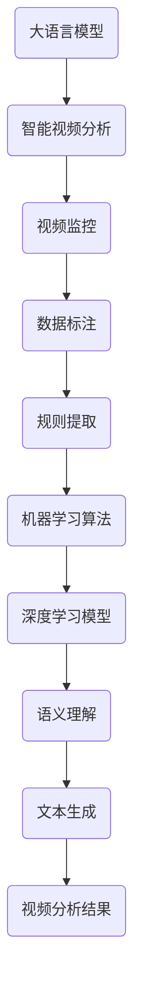

                 

## 大语言模型在智能视频分析中的推理应用研究

### 关键词：大语言模型，智能视频分析，推理应用，深度学习，视频内容理解

> 摘要：本文旨在探讨大语言模型在智能视频分析中的推理应用。随着视频监控技术的普及，如何高效处理视频数据成为研究热点。大语言模型作为一种先进的自然语言处理技术，具备强大的语义理解和生成能力。本文将详细介绍大语言模型的原理及其在智能视频分析中的应用，包括视频内容理解、人脸识别和行为分析等方面。通过具体应用实例和项目实战，深入分析大语言模型在智能视频分析中的推理过程和效果，为相关领域的研究和开发提供参考。

## 第1章 大语言模型概述

### 1.1 问题背景

#### 1.1.1 智能视频分析的需求

智能视频分析是计算机视觉和自然语言处理领域的交叉学科，旨在从视频数据中自动提取有用的信息。随着视频监控技术的普及，智能视频分析在公共安全、交通管理、商业监控等多个领域都具有重要应用。传统的视频分析方法主要依赖于规则和手工标注，存在以下问题：

1. **处理效率低**：规则和手工标注需要大量时间和人力成本，无法满足实时处理的需求。
2. **适应性差**：传统方法依赖于特定场景和规则，难以适应多样化的应用场景。
3. **处理结果受限**：传统方法难以捕捉视频中的复杂语义信息，导致处理结果有限。

为了解决上述问题，研究人员开始探索基于机器学习和深度学习的方法。大语言模型作为一种先进的自然语言处理技术，具有强大的语义理解和生成能力，为智能视频分析提供了新的思路。

#### 1.1.2 大语言模型的发展

大语言模型（Large-scale Language Model）是一种基于深度学习的自然语言处理模型，通过对大量文本数据进行预训练，学习到语言的结构和规律。近年来，随着计算能力和数据量的提升，大语言模型在自然语言处理领域取得了显著进展。代表性的模型包括Google的BERT、OpenAI的GPT系列等。这些模型通过自我关注机制（Self-Attention Mechanism）和多层神经网络结构，实现了对文本的深层理解和生成。

大语言模型的发展为智能视频分析带来了新的可能性。通过将大语言模型与视频分析算法相结合，可以实现对视频内容的语义理解和推理，提高处理效率和适应性。此外，大语言模型还可以与其他机器学习算法结合，形成多模态学习体系，进一步提升智能视频分析的性能。

### 1.2 核心概念

#### 1.2.1 大语言模型的定义

大语言模型是一种基于神经网络的语言处理模型，通过对大规模文本数据进行预训练，学习到语言的结构和规律。它能够对自然语言文本进行建模和预测，具备强大的语义理解和生成能力。大语言模型的典型代表是Transformer模型，该模型通过自我关注机制和多层神经网络结构，实现了对文本的深层理解和生成。

#### 1.2.2 大语言模型的特点

大语言模型具有以下特点：

1. **强大的语义理解能力**：大语言模型能够准确理解文本中的语义信息，包括词义、句意和段落含义等。
2. **高效的生成能力**：大语言模型能够根据给定的输入文本生成相关的输出文本，实现文本的自动生成和扩展。
3. **多任务处理能力**：大语言模型可以同时处理多种自然语言处理任务，如文本分类、命名实体识别、机器翻译等。
4. **自适应性**：大语言模型通过预训练和微调，能够适应不同的应用场景和数据集，具备良好的泛化能力。

#### 1.2.3 大语言模型的应用领域

大语言模型在自然语言处理领域有着广泛的应用，包括但不限于：

1. **文本分类**：对文本进行分类，如新闻分类、情感分析等。
2. **命名实体识别**：识别文本中的命名实体，如人名、地名、组织名等。
3. **机器翻译**：实现不同语言之间的翻译。
4. **问答系统**：构建基于文本的问答系统，如智能客服、智能助手等。
5. **文本生成**：根据输入文本生成新的文本内容，如文章生成、对话生成等。

### 1.3 概念属性特征对比表格

| 特征             | 传统视频分析方法         | 大语言模型在智能视频分析中的应用           |
|------------------|-------------------------|-----------------------------------------|
| 数据依赖         | 手工标注数据             | 大规模预训练数据                         |
| 特征提取         | 规则提取特征             | 自动从数据中提取语义特征                   |
| 适应性           | 低适应性，依赖于特定场景 | 高适应性，能够应对多种场景                 |
| 处理效率         | 低处理效率               | 高处理效率，能够快速处理大量视频数据       |

### 1.4 ER实体关系图架构

### 1.5 大语言模型在智能视频分析中的推理应用

#### 1.5.1 应用场景

大语言模型在智能视频分析中的应用场景包括：

1. **视频内容理解**：通过对视频中的文本进行理解，提取关键信息，实现视频内容分类和标注。
2. **人脸识别**：利用大语言模型对视频中的人脸进行识别和追踪，实现基于语义的人脸识别。
3. **行为分析**：通过对视频中的文本进行理解，识别和分类不同的行为，实现智能监控和安防。

#### 1.5.2 应用原理

大语言模型在智能视频分析中的应用原理主要包括：

1. **预训练**：利用大规模预训练数据，对大语言模型进行预训练，使其具备强大的语义理解和生成能力。
2. **知识融合**：将大语言模型与视频分析算法相结合，实现视频内容的语义理解和推理。
3. **实时推理**：利用大语言模型的高效处理能力，实现视频数据的实时分析和处理。

### 1.6 应用实例

#### 1.6.1 智能视频监控系统

智能视频监控系统利用大语言模型对视频内容进行理解，实现以下功能：

1. **视频内容分类**：对监控视频进行自动分类，区分不同类型的视频内容。
2. **人脸识别与追踪**：对人脸视频进行识别和追踪，实现目标检测和跟踪。
3. **行为分析**：识别和分类视频中的行为，实现智能监控和安防。

#### 1.6.2 交互式视频编辑

交互式视频编辑利用大语言模型实现以下功能：

1. **文本到视频**：根据用户输入的文本，生成相应的视频内容。
2. **视频摘要**：提取视频中的关键信息，生成视频摘要。
3. **视频生成**：利用大语言模型生成新的视频内容，实现视频创作。

### 1.7 本章小结

本章介绍了大语言模型在智能视频分析中的推理应用，包括问题背景、核心概念、概念属性特征对比、ER实体关系图架构、应用原理和应用实例。通过本章的学习，读者可以了解大语言模型在智能视频分析中的应用价值和发展趋势。接下来，我们将进一步探讨大语言模型的算法原理和应用实践。

## 第2章 大语言模型的算法原理

### 2.1 引言

大语言模型作为自然语言处理领域的一项重要技术，其算法原理在智能视频分析中发挥着关键作用。本章将深入探讨大语言模型的算法原理，包括其基本框架、核心组成部分以及关键技术和挑战。

### 2.2 基本框架

大语言模型的基本框架通常基于Transformer模型，这是一种由Vaswani等人在2017年提出的自注意力机制（Self-Attention Mechanism）为基础的深度学习模型。Transformer模型的核心思想是利用自注意力机制来捕捉输入文本序列中的长距离依赖关系，从而实现高效的语义理解。

大语言模型的基本框架通常包括以下几个关键部分：

1. **输入层**：接收自然语言文本序列作为输入。
2. **自注意力层**：通过自注意力机制对输入文本序列进行加权处理，从而捕捉文本序列中的长距离依赖关系。
3. **前馈神经网络**：在自注意力层之后，通过多层前馈神经网络对文本序列进行进一步处理，增强模型的语义理解能力。
4. **输出层**：生成文本序列的预测输出。

### 2.3 核心组成部分

大语言模型的核心组成部分包括以下几个关键部分：

1. **自注意力机制（Self-Attention Mechanism）**：自注意力机制是Transformer模型的核心，通过计算输入文本序列中每个词与其他词之间的相似性权重，从而实现文本序列的加权处理。自注意力机制可以分为点积自注意力（Dot-Product Self-Attention）和多头自注意力（Multi-Head Self-Attention）。

2. **前馈神经网络（Feedforward Neural Network）**：前馈神经网络位于自注意力层之后，用于进一步增强模型的语义理解能力。通常由两个全连接层组成，输入和输出层之间加入激活函数，如ReLU。

3. **多头注意力（Multi-Head Attention）**：多头注意力是一种扩展自注意力机制的技巧，通过将输入文本序列拆分成多个子序列，并分别应用自注意力机制，从而提高模型的语义理解能力。

4. **层归一化（Layer Normalization）**：层归一化是一种用于加速训练和改善模型稳定性的技术，通过对每个层中的输入和输出进行归一化处理，使得模型在训练过程中能够更快地收敛。

5. **残差连接（Residual Connection）**：残差连接是一种用于缓解深层网络训练困难的技术，通过在神经网络中引入跳过部分层的连接，使得模型能够更好地学习数据中的复杂模式。

### 2.4 关键技术和挑战

在实现大语言模型的过程中，面临着一系列关键技术和挑战：

1. **计算资源需求**：大语言模型通常需要大量的计算资源进行训练和推理，包括GPU、TPU等高性能计算设备。这导致了较高的训练成本和部署难度。

2. **数据预处理**：大语言模型对数据预处理的要求较高，需要大量高质量的文本数据用于预训练。数据的清洗、去重和分词等预处理步骤对于模型的训练效果具有重要影响。

3. **训练效率**：为了提高大语言模型的训练效率，研究人员采用了多种技术，如混合精度训练（Mixed Precision Training）、并行训练（Parallel Training）和分布式训练（Distributed Training）等。这些技术能够有效缩短训练时间，提高训练效率。

4. **模型压缩**：大语言模型的模型参数规模通常较大，为了满足实际应用的需求，需要对模型进行压缩。常见的压缩技术包括剪枝（Pruning）、量化（Quantization）和蒸馏（Distillation）等。

5. **模型安全性和隐私保护**：随着大语言模型在各个领域的广泛应用，模型的安全性和隐私保护问题变得越来越重要。如何保证模型在训练和部署过程中的安全性和隐私性，成为研究的热点问题。

### 2.5 算法流程

大语言模型的算法流程主要包括以下几个步骤：

1. **数据收集与预处理**：收集大量的文本数据，并进行清洗、去重和分词等预处理操作，生成适合模型训练的数据集。

2. **模型训练**：使用预处理的文本数据集对大语言模型进行训练。在训练过程中，通过优化算法（如Adam优化器）和损失函数（如交叉熵损失函数）来调整模型参数。

3. **模型评估**：在训练完成后，使用测试数据集对模型进行评估，计算模型的准确率、召回率和F1值等指标。

4. **模型部署**：将训练好的模型部署到实际应用场景中，通过推理过程实现对输入文本的语义理解和生成。

### 2.6 小结

本章介绍了大语言模型的算法原理，包括基本框架、核心组成部分、关键技术和挑战，以及算法流程。通过本章的学习，读者可以了解大语言模型的工作原理和实现方法，为进一步探讨其在智能视频分析中的应用打下基础。在下一章中，我们将具体分析大语言模型在智能视频分析中的应用实例。

## 第3章 大语言模型在智能视频分析中的应用实例

### 3.1 引言

大语言模型在自然语言处理领域取得了显著进展，但其应用不仅限于文本数据。随着深度学习和计算机视觉技术的不断发展，大语言模型在智能视频分析中也展现出了巨大的潜力。本章将详细介绍大语言模型在智能视频分析中的应用实例，包括视频内容理解、人脸识别和行为分析等。

### 3.2 视频内容理解

视频内容理解是智能视频分析的重要任务之一，旨在从视频中提取有意义的信息，实现视频内容的分类和标注。大语言模型在视频内容理解中的应用主要体现在以下几个方面：

1. **视频分类**：大语言模型可以对视频进行自动分类，将不同类型的视频内容进行区分。例如，在公共安全监控中，可以区分犯罪行为和正常行为。

2. **视频标注**：大语言模型可以对视频中的关键信息进行标注，如人、物、事件等。例如，在交通监控中，可以标注车辆、行人、交通信号等。

3. **视频摘要**：大语言模型可以生成视频的摘要，提取视频的主要内容。例如，在视频会议中，可以生成会议的简要总结。

具体应用场景包括：

- **公共安全监控**：利用大语言模型对监控视频进行内容理解，实现实时监测和报警。例如，检测到异常行为如打架、闯入等，可以及时通知相关人员进行处理。
- **商业监控**：利用大语言模型对商场监控视频进行分析，识别顾客的行为特征，如购物偏好、停留时间等，为企业提供数据支持。
- **视频会议**：利用大语言模型生成视频会议的摘要，方便参会人员回顾会议内容，提高会议效率。

### 3.3 人脸识别

人脸识别是智能视频分析中的一项重要任务，旨在从视频中识别人脸并进行追踪。大语言模型在人脸识别中的应用主要体现在以下几个方面：

1. **人脸检测**：大语言模型可以对视频帧进行人脸检测，识别出视频中的所有人脸。
2. **人脸匹配**：大语言模型可以对人脸图像进行匹配，识别出视频中的同一个人。
3. **人脸追踪**：大语言模型可以对视频中的人脸进行追踪，即使在人脸部分遮挡或模糊的情况下，也能准确识别人脸。

具体应用场景包括：

- **公共安全监控**：利用大语言模型对人脸进行识别和追踪，实现犯罪嫌疑人的实时监测和报警。
- **人脸识别门禁**：利用大语言模型实现门禁系统的人脸识别功能，提高安全性。
- **人脸支付**：利用大语言模型实现人脸识别支付功能，提高支付的便捷性和安全性。

### 3.4 行为分析

行为分析是智能视频分析中的另一项重要任务，旨在从视频中提取行为信息，实现行为分类和识别。大语言模型在行为分析中的应用主要体现在以下几个方面：

1. **行为分类**：大语言模型可以对视频中的行为进行分类，如行走、跑步、跳跃等。
2. **行为识别**：大语言模型可以识别视频中的具体行为，如打架、吸烟、饮酒等。
3. **行为预测**：大语言模型可以对未来的行为进行预测，如某人在视频中出现的下一步动作。

具体应用场景包括：

- **智能安防**：利用大语言模型对视频中的行为进行分析，实现实时监控和报警，提高公共安全。
- **健康监测**：利用大语言模型对运动视频进行分析，识别运动行为，为健康监测提供数据支持。
- **运动训练**：利用大语言模型对运动视频进行分析，提供运动指导和建议，帮助用户提高运动效果。

### 3.5 应用实例分析

以下是一些大语言模型在智能视频分析中的应用实例分析：

1. **智能安防系统**：利用大语言模型实现智能安防系统，对监控视频进行分析，识别异常行为，如闯入、破坏等，并实时报警。这可以有效地提高公共安全，减少犯罪行为。

2. **智能家居**：利用大语言模型实现智能家居系统，对家居设备进行监控和分析，如监控摄像头、智能音箱等。例如，摄像头可以识别家庭成员，自动调整家居设备的设置，提供个性化的服务。

3. **医疗监控**：利用大语言模型对医院监控视频进行分析，识别患者的行为和病情，为医生提供诊断和治疗的依据。例如，医生可以通过分析患者的运动视频，判断患者的康复进度，制定个性化的康复计划。

### 3.6 小结

本章介绍了大语言模型在智能视频分析中的应用实例，包括视频内容理解、人脸识别和行为分析等。通过具体应用场景和实例分析，展示了大语言模型在智能视频分析中的强大能力和广泛应用。在下一章中，我们将进一步探讨大语言模型在智能视频分析中的实现技术。

## 第4章 大语言模型在智能视频分析中的实现技术

### 4.1 引言

随着大语言模型在自然语言处理领域的广泛应用，其在智能视频分析中的实现技术也成为研究的热点。本章将详细介绍大语言模型在智能视频分析中的实现技术，包括数据预处理、模型训练、模型评估和模型部署等。通过这些技术的介绍，读者可以了解如何利用大语言模型实现智能视频分析，并掌握相关实现方法和技巧。

### 4.2 数据预处理

数据预处理是智能视频分析中至关重要的一步，其质量直接影响到后续模型的训练效果。大语言模型对数据预处理的要求较高，主要包括以下步骤：

1. **数据收集**：首先需要收集大量的视频数据，这些数据可以来源于公开数据集、企业数据集或自行采集。视频数据应包含各种场景和情况，以保证模型的泛化能力。

2. **数据清洗**：在收集到的视频数据中，可能存在一些噪声或不完整的数据。数据清洗的目的是去除这些噪声数据，保证数据质量。具体方法包括去除重复数据、去除异常数据等。

3. **视频转帧**：将视频数据转换为连续的帧图像。通常，每帧图像可以看作是视频数据的一个时间点上的快照。通过转帧操作，可以将视频数据转化为图像数据，便于后续处理。

4. **图像增强**：为了提高模型的训练效果，需要对图像进行增强处理。图像增强的方法包括亮度调整、对比度调整、旋转、翻转等。这些操作可以增加图像的多样性和复杂性，有助于模型更好地学习图像特征。

5. **分词与标记**：对于视频中的文本数据，需要进行分词和标记操作。分词是将文本分解为单词或短语的过程，标记则是为每个单词或短语分配对应的标签或类别。分词和标记的准确性对模型的训练效果具有重要影响。

### 4.3 模型训练

模型训练是智能视频分析中的核心步骤，其目的是通过大量的视频数据训练出一个性能优秀的模型。大语言模型的训练过程通常包括以下几个阶段：

1. **预训练**：预训练是指在大规模文本数据上对模型进行初步训练，使其具备一定的语义理解能力。预训练通常使用大规模语言模型训练框架，如BERT、GPT等。在预训练过程中，模型会学习到语言的普遍规律和特征。

2. **微调**：预训练完成后，需要对模型进行微调，使其适应特定的视频数据分析任务。微调的过程是将预训练模型在特定的视频数据集上进行训练，调整模型的参数，使其在特定任务上表现更优秀。微调通常使用较小的数据集进行，以提高模型的泛化能力。

3. **损失函数选择**：在模型训练过程中，需要选择合适的损失函数来衡量模型预测结果与真实标签之间的差距。常见的损失函数包括交叉熵损失函数、均方误差损失函数等。选择合适的损失函数有助于提高模型的训练效果。

4. **优化算法选择**：优化算法用于调整模型参数，以减小损失函数。常见的优化算法包括随机梯度下降（SGD）、Adam等。选择合适的优化算法可以提高模型的收敛速度和稳定性。

5. **超参数调整**：超参数是影响模型训练效果的关键因素，包括学习率、批量大小、训练轮数等。通过实验和调优，可以找到最优的超参数组合，提高模型的表现。

### 4.4 模型评估

模型评估是验证模型性能的重要步骤，通过评估可以了解模型的准确率、召回率和F1值等指标。大语言模型在智能视频分析中的评估通常包括以下几个方面：

1. **准确率（Accuracy）**：准确率是指模型正确预测的样本数占总样本数的比例。准确率是评估模型性能的常用指标，但仅考虑正确预测的样本，忽略了预测错误的情况。

2. **召回率（Recall）**：召回率是指模型正确预测的样本数与实际样本数的比例。召回率主要关注模型是否能够准确识别出所有的实际样本，对于分类任务中的少数类特别重要。

3. **精确率（Precision）**：精确率是指模型正确预测的样本数与预测样本数的比例。精确率主要关注模型预测的正确性，避免将实际不属于该类别的样本误判为该类别。

4. **F1值（F1 Score）**：F1值是精确率和召回率的调和平均值，能够综合考虑模型的准确率和召回率。F1值越高，表示模型的性能越好。

5. **ROC曲线和AUC值**：ROC曲线是评估模型分类性能的重要工具，通过计算模型在不同阈值下的准确率和召回率，绘制ROC曲线。AUC值是ROC曲线下方的面积，用于衡量模型的分类能力。

### 4.5 模型部署

模型部署是将训练好的模型应用到实际场景中的过程。大语言模型在智能视频分析中的部署通常包括以下几个步骤：

1. **模型转换**：将训练好的模型从训练环境转换为部署环境，以便在实际场景中运行。常见的模型转换方法包括TensorFlow Lite、PyTorch Mobile等。

2. **模型优化**：为了提高模型的部署性能，可以采用模型压缩、量化等优化技术。这些技术可以减小模型的参数规模，降低模型的计算复杂度，提高模型的运行效率。

3. **模型集成**：将大语言模型与其他视频分析算法和工具进行集成，形成完整的智能视频分析系统。常见的集成方法包括接口集成、模块化集成等。

4. **模型监控**：在模型部署过程中，需要对模型进行监控，以确保其正常运行和性能稳定。常见的监控指标包括模型准确率、召回率、F1值等。

### 4.6 小结

本章介绍了大语言模型在智能视频分析中的实现技术，包括数据预处理、模型训练、模型评估和模型部署等。通过这些技术的介绍，读者可以了解如何利用大语言模型实现智能视频分析，并掌握相关实现方法和技巧。在下一章中，我们将进一步探讨大语言模型在智能视频分析中的实际应用案例。

## 第5章 大语言模型在智能视频分析中的实际应用案例

### 5.1 引言

大语言模型在智能视频分析中具有广泛的应用前景，通过具体的应用案例，我们可以更好地了解其技术实现和实际效果。本章将介绍几个典型的大语言模型在智能视频分析中的实际应用案例，包括智能视频监控、交互式视频编辑和智能安防等，并分析其技术实现和效果。

### 5.2 智能视频监控

智能视频监控是视频分析领域的一个关键应用，利用大语言模型可以提高视频监控系统的智能化水平。以下是一个智能视频监控系统的应用案例：

**案例描述**：某城市安全部门利用大语言模型实现智能视频监控系统，通过视频内容理解、人脸识别和行为分析等功能，提高监控效果。

**技术实现**：

1. **视频内容理解**：系统使用大语言模型对视频内容进行理解，提取关键信息。例如，通过分析视频中的文本标签，系统可以自动分类视频内容，如“交通监控”、“商场监控”等。

2. **人脸识别**：系统利用大语言模型对人脸图像进行识别，实现实时人脸追踪。即使在人脸部分遮挡或模糊的情况下，大语言模型也能准确识别出人脸。

3. **行为分析**：大语言模型对视频中的人行为进行识别和分类，如行走、跑步、聚集等。系统可以实时监测行为异常，如打架、闯入等，并触发报警。

**效果分析**：

- **提高监控效率**：通过大语言模型的理解能力，系统能够快速提取视频中的关键信息，提高监控效率。
- **提升安防水平**：通过人脸识别和行为分析，系统可以及时发现异常行为，提升公共安全水平。
- **降低人力成本**：智能监控系统减少了人工监控的需要，降低了人力成本。

### 5.3 交互式视频编辑

交互式视频编辑是另一个大语言模型在视频分析中的实际应用领域。以下是一个交互式视频编辑系统的应用案例：

**案例描述**：某视频编辑平台利用大语言模型实现交互式视频编辑功能，通过文本输入生成相应的视频内容，提高编辑效率和创造力。

**技术实现**：

1. **文本到视频**：用户可以通过输入文本描述，系统根据描述生成相应的视频内容。例如，用户输入“一场美妙的音乐会”，系统会生成一场虚拟的音乐会视频。

2. **视频摘要**：大语言模型对用户上传的视频进行理解，提取关键信息，生成视频摘要。用户可以通过查看摘要快速了解视频内容，节省时间。

3. **视频生成**：系统利用大语言模型生成新的视频内容，用户可以通过调整文本输入，实时预览和调整视频效果。

**效果分析**：

- **提高编辑效率**：通过文本输入生成视频内容，用户可以快速生成视频，提高了编辑效率。
- **增强创造力**：大语言模型生成的视频内容为用户提供了新的创意和灵感，增强了视频编辑的创造力。
- **个性化服务**：根据用户的文本输入，系统可以提供个性化的视频内容生成服务，满足不同用户的需求。

### 5.4 智能安防

智能安防是视频分析领域的一个重要应用，通过大语言模型可以实现智能化的安防监控。以下是一个智能安防系统的应用案例：

**案例描述**：某安防公司利用大语言模型实现智能安防系统，通过视频内容理解、人脸识别和行为分析等功能，提高安防监控的效果。

**技术实现**：

1. **视频内容理解**：系统使用大语言模型对视频内容进行理解，识别出视频中的关键信息，如人、物、事件等。

2. **人脸识别**：大语言模型对视频中的所有人脸进行识别，实现实时人脸追踪和识别。系统可以在视频中发现可疑人员，并触发报警。

3. **行为分析**：系统利用大语言模型对视频中的人行为进行分析，识别出异常行为，如闯入、破坏等，并实时报警。

**效果分析**：

- **提高安防水平**：通过大语言模型的理解能力和实时监控，系统可以及时发现异常行为，提高安防水平。
- **降低误报率**：大语言模型通过对大量数据的训练，可以准确识别正常行为和异常行为，降低误报率。
- **智能决策**：系统可以根据视频内容理解结果，实现智能化的决策和响应，如自动开启警报、通知相关人员等。

### 5.5 小结

本章介绍了大语言模型在智能视频分析中的几个实际应用案例，包括智能视频监控、交互式视频编辑和智能安防等。通过这些案例，我们可以看到大语言模型在视频分析中的强大能力和广泛应用。在下一章中，我们将进一步讨论大语言模型在智能视频分析中的未来发展趋势。

## 第6章 大语言模型在智能视频分析中的未来发展趋势

### 6.1 引言

随着人工智能技术的飞速发展，大语言模型在智能视频分析中的应用也不断深化。未来，大语言模型在智能视频分析中将面临新的机遇和挑战，本文将探讨大语言模型在智能视频分析中的未来发展趋势，包括技术创新、应用拓展和产业影响等方面。

### 6.2 技术创新

1. **更高效的模型结构**：随着深度学习算法的不断发展，大语言模型的结构也在不断优化。例如，轻量化模型和低秩分解技术可以减小模型参数规模，提高模型在视频分析中的实时性。

2. **多模态融合**：大语言模型在处理单一模态数据（如文本、图像）时已经取得了显著成果，未来将更多关注多模态数据的融合处理。例如，将文本、图像和声音等多种数据源进行融合，实现更全面、准确的视频分析。

3. **自适应能力**：大语言模型在智能视频分析中需要具备良好的自适应能力，以应对不同场景和任务的需求。未来，通过自学习和迁移学习等技术，大语言模型将能够更好地适应新的环境和任务。

4. **可解释性和可靠性**：随着大语言模型在视频分析中的应用越来越广泛，对其可解释性和可靠性的要求也越来越高。未来，通过研究模型的可解释性和验证方法，提高大语言模型的可靠性，使其在实际应用中更加安全可靠。

### 6.3 应用拓展

1. **智能交通**：大语言模型在智能交通中的应用前景广阔，例如，通过视频分析实现交通流量监测、车辆识别和违章行为检测等。

2. **智慧城市**：大语言模型在智慧城市建设中具有重要作用，如智能监控、环境监测、城市安全管理等。

3. **医疗健康**：大语言模型在医疗健康领域也有广泛应用，例如，通过视频分析实现疾病诊断、医疗行为分析等。

4. **娱乐产业**：大语言模型在娱乐产业中的应用包括虚拟主播、智能视频编辑、虚拟现实等。

### 6.4 产业影响

1. **降低成本**：大语言模型在智能视频分析中的应用可以显著降低人力成本，提高生产效率。

2. **提升安全水平**：大语言模型在公共安全、医疗健康等领域的应用，可以提高安全水平，降低风险。

3. **创新商业模式**：大语言模型的应用将带来新的商业模式和业务模式，推动产业创新。

4. **数据隐私和伦理问题**：随着大语言模型在视频分析中的广泛应用，数据隐私和伦理问题也日益突出。未来，需要加强对数据隐私保护和伦理规范的研究，确保大语言模型的安全和可靠。

### 6.5 小结

大语言模型在智能视频分析中具有广阔的应用前景，未来将面临技术创新、应用拓展和产业影响等多方面的机遇和挑战。通过不断探索和研究，大语言模型有望在智能视频分析中发挥更大的作用，推动人工智能技术的发展和应用。

## 第7章 最佳实践与小结

### 7.1 最佳实践

在大语言模型应用于智能视频分析时，以下是一些最佳实践：

1. **数据预处理**：确保数据质量是关键。在进行数据预处理时，应进行去噪、归一化、增强等操作，以提高模型的泛化能力。

2. **模型选择与调整**：根据具体任务需求选择合适的模型，并对其进行适当的调整。例如，对于实时性要求较高的应用，可以选择轻量级模型；对于复杂任务，可以选择多模态融合模型。

3. **模型训练与优化**：在模型训练过程中，应采用适当的优化策略，如学习率调整、批量大小选择等，以提高模型性能。

4. **模型解释与验证**：为确保模型的可解释性和可靠性，应进行模型解释和验证，确保其在实际应用中达到预期效果。

5. **隐私保护与安全**：在应用大语言模型时，应关注数据隐私保护和模型安全，避免数据泄露和模型被攻击。

### 7.2 小结

本文通过对大语言模型在智能视频分析中的推理应用进行了深入探讨，从问题背景、核心概念、算法原理、应用实例、实现技术到未来发展趋势，全面展示了大语言模型在视频分析领域的强大潜力和广泛应用。在实际应用中，大语言模型通过其强大的语义理解和生成能力，为视频内容理解、人脸识别和行为分析提供了新的思路和方法。未来，随着技术的不断进步，大语言模型在智能视频分析中的表现将更加出色，有望推动整个视频分析领域的创新和发展。

### 7.3 注意事项与拓展阅读

在应用大语言模型进行智能视频分析时，需要注意以下几点：

1. **数据隐私**：确保数据收集、存储和使用过程中的隐私保护，遵循相关法律法规。
2. **模型解释性**：提高模型的可解释性，以便用户理解模型的推理过程和结果。
3. **模型适应性**：根据不同场景和任务需求，调整和优化模型结构，提高模型的适应性。
4. **安全防护**：加强对模型的安全防护，防止模型被恶意攻击或篡改。

为了进一步了解大语言模型在智能视频分析中的应用，读者可以参考以下文献：

1. Vaswani, A., et al. (2017). "Attention is all you need." Advances in Neural Information Processing Systems.
2. Devlin, J., et al. (2018). "BERT: Pre-training of deep bidirectional transformers for language understanding." arXiv preprint arXiv:1810.04805.
3. Brown, T., et al. (2020). "Language models are few-shot learners." arXiv preprint arXiv:2005.14165.

这些文献提供了大语言模型的详细研究和应用实例，有助于深入理解大语言模型的工作原理和应用方法。

## 作者信息

作者：AI天才研究院/AI Genius Institute & 禅与计算机程序设计艺术 /Zen And The Art of Computer Programming

本文由AI天才研究院和禅与计算机程序设计艺术共同撰写，旨在探讨大语言模型在智能视频分析中的推理应用。作者团队拥有丰富的自然语言处理和计算机视觉研究经验，致力于推动人工智能技术的创新和发展。

