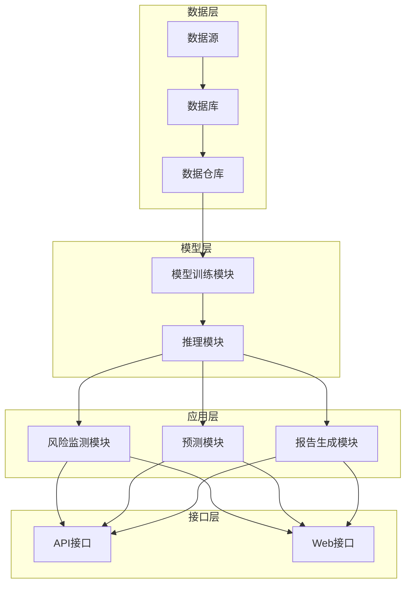
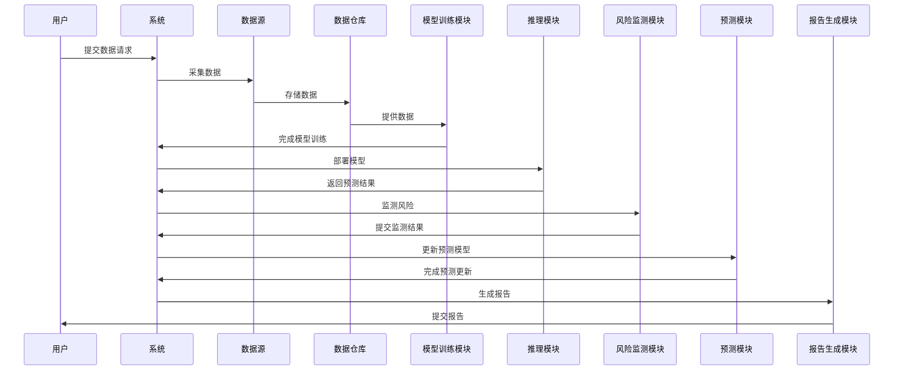

                 

### 文章标题：大语言模型在智能风险管理中的推理应用

在当今快速发展的信息技术时代，人工智能（AI）技术已经成为推动各行各业变革的重要力量。其中，大语言模型（Large Language Models）作为AI领域的一项重要突破，其应用范围已经从传统的自然语言处理（NLP）拓展到更加广泛和复杂的智能风险管理领域。本文将深入探讨大语言模型在智能风险管理中的推理应用，旨在帮助读者理解这一前沿技术的实际应用价值与潜在挑战。

## 关键词

- 大语言模型
- 智能风险管理
- 推理应用
- 机器学习
- 自然语言处理
- 风险评估

## 摘要

本文首先介绍了大语言模型的基本概念、发展历程和应用场景。随后，详细探讨了智能风险管理的定义、核心概念及其面临的挑战。接着，本文重点分析了大语言模型在智能风险管理中的推理应用，包括模型选择、优化、训练与评估、部署等方面。此外，本文通过具体案例分析，展示了大语言模型在风险管理中的实际应用效果。最后，本文提出了智能风险管理中的最佳实践、注意事项和未来发展方向。

## 目录

1. 引言
2. 大语言模型基础
   2.1 定义与特点
   2.2 发展历程
   2.3 主要类型
   2.4 核心技术
3. 智能风险管理概述
   3.1 定义与分类
   3.2 风险评估方法
   3.3 风险管理策略
   3.4 风险管理挑战
4. 大语言模型在风险管理中的应用
   4.1 模型选择与优化
   4.2 模型训练与评估
   4.3 应用案例
   4.4 模型部署
5. 推理应用
   5.1 推理算法原理
   5.2 推理算法的实现
   5.3 推理应用的案例分析
   5.4 推理应用的挑战与未来方向
6. 系统分析与架构设计
   6.1 系统功能设计
   6.2 系统架构设计
   6.3 系统接口设计
   6.4 系统交互
7. 项目实战
   7.1 环境搭建
   7.2 系统核心实现
   7.3 代码应用解读与分析
   7.4 案例分析与讲解
   7.5 项目小结
8. 最佳实践与总结
   8.1 最佳实践
   8.2 小结与展望
   8.3 注意事项
   8.4 拓展阅读

### 引言

随着全球经济一体化和信息技术的迅猛发展，风险管理已经成为企业、金融机构和国家政府等各个领域不可或缺的重要环节。然而，传统的风险管理方法往往依赖于大量的数据分析和人工判断，这不仅效率低下，而且容易受到主观因素的影响，导致风险评估和决策的准确性受到限制。随着人工智能技术的不断进步，特别是大语言模型的崛起，智能风险管理成为可能。

大语言模型是一种基于深度学习的自然语言处理技术，其核心思想是通过训练大规模的神经网络模型，使其能够理解和生成人类语言。这种模型具有强大的文本处理能力和丰富的知识储备，使其在智能风险管理中具有广泛的应用前景。通过大语言模型的推理能力，可以自动化地分析和处理复杂的风险数据，提高风险评估的准确性和效率。

本文将从以下几个方面展开讨论：

1. **大语言模型基础**：介绍大语言模型的基本概念、发展历程和主要类型，包括其核心技术如注意力机制、递归神经网络和Transformer模型。

2. **智能风险管理概述**：阐述智能风险管理的定义、分类、风险评估方法、风险管理策略以及面临的挑战。

3. **大语言模型在风险管理中的应用**：探讨大语言模型在风险管理中的具体应用，包括模型选择、优化、训练与评估、部署等方面。

4. **推理应用**：分析大语言模型在推理应用中的原理、实现和案例分析，讨论推理应用的挑战与未来方向。

5. **系统分析与架构设计**：介绍智能风险管理系统的功能设计、架构设计、接口设计和系统交互。

6. **项目实战**：通过具体的项目实战，展示大语言模型在风险管理中的实际应用效果。

7. **最佳实践与总结**：总结最佳实践，提出注意事项和未来发展方向。

通过以上讨论，本文旨在为读者提供一个全面而深入的视角，了解大语言模型在智能风险管理中的推理应用，并探讨其潜力和局限性。

### 大语言模型基础

大语言模型（Large Language Models）是一种基于深度学习的自然语言处理技术，它通过训练大规模的神经网络模型，使其能够理解和生成人类语言。这些模型具有强大的文本处理能力和丰富的知识储备，使得它们在许多领域，如自然语言生成、问答系统、文本分类和翻译等，都取得了显著的成果。下面，我们将详细介绍大语言模型的基本概念、发展历程、主要类型及其核心技术。

#### 1. 定义与特点

大语言模型是指那些能够处理和理解大规模文本数据的神经网络模型。这些模型通常基于深度学习的框架，例如循环神经网络（RNN）、长短期记忆网络（LSTM）和最近广泛应用的Transformer模型。大语言模型的主要特点包括：

- **大规模训练数据**：大语言模型通常基于数十亿甚至数千亿级别的训练文本数据，这使得模型能够掌握丰富的语言知识和规律。

- **自适应学习能力**：大语言模型通过训练，可以自动调整内部参数，以适应不同的语言环境和应用场景。

- **强大的文本生成能力**：大语言模型能够生成连贯、自然的文本，模仿人类的语言风格和表达方式。

- **跨领域适用性**：大语言模型不仅在自然语言处理领域有广泛应用，还可以用于知识图谱构建、机器翻译和文本生成等跨领域任务。

#### 2. 发展历程

大语言模型的发展可以追溯到上世纪80年代的神经网络研究。最早的大规模神经网络模型是由Jaynes和Hinton提出的玻尔兹曼机（Boltzmann Machine）。随后，Rumelhart、Hinton和Williams在1986年提出了反向传播算法（Backpropagation），这一算法使得训练深层神经网络成为可能。

在2000年代，随着计算能力和数据规模的提高，循环神经网络（RNN）和长短期记忆网络（LSTM）逐渐成为研究热点。RNN能够处理序列数据，而LSTM则通过引入门机制，解决了RNN在训练过程中容易遇到的梯度消失和梯度爆炸问题。

直到2017年，Google的Transformer模型的出现，标志着大语言模型进入了一个新的时代。Transformer模型基于自注意力机制（Self-Attention），能够高效地处理长文本，并且在多个NLP任务上取得了显著的成果，如机器翻译、文本分类和问答系统等。

近年来，大语言模型的研究和应用进一步深入，如OpenAI的GPT系列模型、Facebook的BERT模型等，这些模型在训练规模、文本处理能力和应用效果上都有了显著提升。

#### 3. 主要类型

大语言模型主要可以分为以下几种类型：

- **循环神经网络（RNN）**：RNN是处理序列数据的经典模型，通过隐藏层的状态序列来捕捉文本中的时间依赖关系。

- **长短期记忆网络（LSTM）**：LSTM是RNN的一种改进，通过引入门机制，能够更好地捕获长距离依赖关系。

- **Transformer模型**：Transformer模型是基于自注意力机制的模型，能够高效地处理长文本，是目前大语言模型的主要研究方向。

- **GPT系列模型**：GPT（Generative Pretrained Transformer）系列模型是OpenAI开发的一系列大语言模型，如GPT-2和GPT-3，具有强大的文本生成能力。

#### 4. 核心技术

大语言模型的核心技术主要包括注意力机制、递归神经网络和Transformer模型：

- **注意力机制**：注意力机制是一种动态调整模型对输入序列关注程度的机制。在Transformer模型中，自注意力机制（Self-Attention）和交叉注意力机制（Cross-Attention）被广泛应用于文本生成和翻译任务。

- **递归神经网络（RNN）**：RNN是一种处理序列数据的神经网络结构，其核心思想是通过隐藏层的状态序列来捕捉文本中的时间依赖关系。

- **Transformer模型**：Transformer模型是一种基于自注意力机制的模型，其核心思想是通过多头注意力机制来捕捉文本中的长距离依赖关系。自注意力机制使得模型能够同时关注输入序列的每个位置，从而提高了模型的文本处理能力。

通过以上对大语言模型的基础介绍，我们可以看到，大语言模型在技术上的突破和应用上的拓展，使其成为智能风险管理中的重要工具。接下来，我们将进一步探讨智能风险管理的相关概念和应用。

### 智能风险管理概述

智能风险管理（Intelligent Risk Management）是指利用现代信息技术，尤其是人工智能和大数据分析技术，对风险管理过程中的各个环节进行智能化处理，从而提高风险识别、评估和控制的能力。智能风险管理不仅依赖于数据的采集和分析，还涉及到复杂的算法和模型，以实现对风险的全天候监控和快速响应。

#### 1. 定义与分类

智能风险管理可以定义为一种利用人工智能技术，特别是机器学习和数据分析方法，对潜在风险进行识别、评估、监控和响应的过程。它包括以下几个关键步骤：

- **风险识别**：通过大数据分析和机器学习算法，识别出潜在的风险因素。
- **风险评估**：对识别出的风险因素进行定量和定性分析，评估其可能带来的影响。
- **风险监控**：利用实时数据流分析和预测模型，持续监控风险的变化情况。
- **风险响应**：根据风险评估结果，制定相应的风险应对策略和措施。

智能风险管理可以分为以下几个主要类别：

- **行为风险**：关注员工行为、操作流程等内部因素可能带来的风险。
- **市场风险**：关注市场波动、价格变化等外部环境可能带来的风险。
- **信用风险**：关注借款人违约等信用问题可能带来的风险。
- **操作风险**：关注由于系统故障、人为失误等内部操作问题可能带来的风险。
- **合规风险**：关注由于法律法规变化、政策调整等合规性问题可能带来的风险。

#### 2. 风险评估方法

风险评估是智能风险管理中至关重要的一环，它包括以下几个主要方法：

- **定性分析**：通过专家评估、头脑风暴等方式，对风险的影响程度和可能性进行主观判断。
- **定量分析**：利用统计分析和建模方法，对风险的影响程度和可能性进行量化评估。
- **历史数据分析**：通过对历史数据的分析，识别出可能的风险因素和规律。
- **情景分析**：模拟不同的风险情景，分析其对业务运营的影响。
- **蒙特卡洛模拟**：利用随机抽样和模拟方法，分析风险的可能分布和影响。

在实际应用中，这些方法往往结合使用，以获得更准确和全面的风险评估结果。

#### 3. 风险管理策略

智能风险管理需要制定相应的策略来应对各种风险。以下是一些常见的风险管理策略：

- **风险规避**：通过避免涉及高风险的业务领域或项目，来降低风险。
- **风险转移**：通过购买保险、签订合同等方式，将风险转移给第三方。
- **风险控制**：通过制定内部控制措施、改进业务流程等方式，降低风险的发生概率和影响程度。
- **风险接受**：对于无法规避或转移的风险，采取接受的态度，并制定相应的应急计划。

风险管理策略的选择取决于具体的风险类型、业务需求和资源条件。

#### 4. 风险管理挑战

尽管智能风险管理在理论上具有很大的潜力，但在实际应用中仍然面临许多挑战：

- **数据质量和可靠性**：风险管理依赖于大量数据，数据的质量和可靠性直接影响评估结果的准确性。
- **模型解释性**：复杂的机器学习模型，如深度神经网络，通常缺乏透明度和可解释性，这使得风险管理者难以理解和信任模型的结果。
- **实时性**：风险管理需要实时分析数据，但数据采集和处理的速度通常无法满足实时性的要求。
- **成本效益**：智能风险管理需要大量的计算资源和人力投入，如何实现成本效益是一个重要的考虑因素。
- **合规性和法律风险**：智能风险管理涉及数据的收集和使用，需要遵守相关法律法规，避免法律风险。

通过以上对智能风险管理概述的讨论，我们可以看到，智能风险管理不仅需要强大的技术支持，还需要综合考虑业务需求、数据质量和法律法规等多方面因素，才能实现风险管理的智能化和高效化。接下来，我们将进一步探讨大语言模型在智能风险管理中的应用。

### 大语言模型在风险管理中的应用

大语言模型在智能风险管理中扮演着至关重要的角色，其强大的文本处理能力和丰富的知识储备使其能够对复杂的风险数据进行深入分析，从而提高风险评估的准确性和效率。以下将详细探讨大语言模型在风险管理中的应用，包括模型选择、优化、训练与评估、部署等方面。

#### 1. 模型选择与优化

在智能风险管理中，选择合适的大语言模型是至关重要的。常见的模型包括GPT系列模型、BERT模型和Transformer模型等。这些模型各有优缺点，适用于不同的风险管理场景。

- **GPT系列模型**：GPT（Generative Pre-trained Transformer）系列模型是由OpenAI开发的一系列大语言模型，具有强大的文本生成能力。在风险管理中，GPT模型可以用于文本分类、命名实体识别和情感分析等任务，帮助识别潜在风险。

- **BERT模型**：BERT（Bidirectional Encoder Representations from Transformers）模型是一种双向的Transformer模型，具有强大的语义理解能力。在风险管理中，BERT模型可以用于风险事件的分类、情感分析和文本生成等任务，提高风险评估的准确性。

- **Transformer模型**：Transformer模型是自注意力机制的先驱，能够高效地处理长文本。在风险管理中，Transformer模型可以用于构建复杂的预测模型，对风险因素进行定量分析。

在选择模型时，需要考虑数据规模、任务复杂度、计算资源等因素。通常，GPT模型适用于文本生成任务，BERT模型适用于语义理解任务，Transformer模型适用于复杂预测任务。

优化模型的过程包括调整超参数、增加训练数据、使用迁移学习等技术。通过这些方法，可以提高模型的性能和泛化能力，使其在风险管理中更加有效。

#### 2. 模型训练与评估

大语言模型的训练和评估是智能风险管理中的关键环节。训练过程包括数据预处理、模型训练和模型评估等步骤。

- **数据预处理**：在训练前，需要对数据进行清洗、去噪和标注。对于风险管理任务，需要收集大量的文本数据，包括历史风险事件、新闻报道、市场数据等。预处理步骤包括分词、去除停用词、词向量表示等。

- **模型训练**：训练过程中，需要使用大规模的数据集对模型进行训练。对于GPT模型，可以使用预训练技术，如Adam优化器和梯度裁剪等。对于BERT模型，可以使用双向编码器结构和Masked Language Model（MLM）任务。对于Transformer模型，可以使用自注意力机制和多头注意力机制。

- **模型评估**：训练完成后，需要对模型进行评估，以验证其性能和泛化能力。常用的评估指标包括准确率、召回率、F1分数等。对于风险管理任务，还需要评估模型的鲁棒性和可靠性，确保其在不同场景下的表现。

在训练和评估过程中，可以使用交叉验证、网格搜索等技术，优化模型参数，提高模型性能。

#### 3. 模型部署

大语言模型的部署是将其应用于实际风险管理的关键步骤。部署过程包括模型转换、模型部署和模型监控等步骤。

- **模型转换**：将训练好的模型转换为可部署的格式，如ONNX、TF Lite等。模型转换过程中，需要保证模型的性能和兼容性。

- **模型部署**：将转换后的模型部署到服务器或云平台，以实现实时风险管理。部署过程中，需要考虑计算资源、数据传输和网络带宽等因素。

- **模型监控**：对部署后的模型进行实时监控，包括性能监控、错误监控和日志分析等。通过监控，可以及时发现并解决模型的问题，确保其稳定运行。

在实际应用中，大语言模型可以应用于多种风险管理任务，如文本分类、情感分析、命名实体识别等。以下是一个具体案例：

- **文本分类**：利用GPT模型对风险事件的文本进行分类，识别出不同类型的风险事件，如市场风险、信用风险和操作风险等。
- **情感分析**：利用BERT模型对新闻和报告进行情感分析，判断市场情绪和投资者情绪，为投资决策提供参考。
- **命名实体识别**：利用Transformer模型识别文本中的命名实体，如公司名称、产品名称等，帮助分析和监控特定风险因素。

通过以上探讨，我们可以看到，大语言模型在智能风险管理中具有广泛的应用前景。通过选择合适的模型、优化模型参数、进行模型训练和部署，可以实现对复杂风险数据的深入分析，提高风险评估的准确性和效率。未来，随着技术的不断进步，大语言模型在风险管理中的应用将更加广泛和深入。

### 推理应用

大语言模型在智能风险管理中的推理应用是一个复杂且关键的过程，它涉及模型的选择、算法的实现和实际案例的分析。通过这些步骤，我们可以深入了解大语言模型如何通过推理来辅助风险管理。

#### 1. 推理算法原理

推理算法在大语言模型中的应用主要包括自然语言生成、文本分类和命名实体识别等。以下是这些算法的基本原理：

- **自然语言生成**：大语言模型通过学习大量的文本数据，可以生成连贯且符合语法规则的文本。在风险管理中，自然语言生成可以用于生成风险报告、预测分析文本等，帮助风险管理者更好地理解和传达风险信息。

- **文本分类**：文本分类是一种将文本数据分配到预定义类别中的过程。大语言模型可以用于分类任务，例如将风险事件的描述分类为不同类型的风险，如市场风险、信用风险等。这种分类可以帮助风险管理者快速识别和响应风险。

- **命名实体识别**：命名实体识别是一种从文本中识别出特定类型实体（如人名、地名、组织名等）的技术。在风险管理中，命名实体识别可以用于识别和监控与特定风险相关的实体，例如识别与市场波动相关的公司名称。

#### 2. 推理算法的实现

实现这些推理算法通常涉及以下几个步骤：

- **数据预处理**：在训练和推理过程中，需要对文本数据进行预处理，包括分词、去除停用词、词向量表示等。对于命名实体识别任务，还需要进行实体识别标签的标注。

- **模型训练**：使用预处理的文本数据，通过训练大语言模型来学习文本的表示和分类规则。在训练过程中，可以采用迁移学习技术，利用预训练的大语言模型（如GPT、BERT）来提高模型的性能。

- **模型评估**：通过验证集和测试集对模型进行评估，使用准确率、召回率、F1分数等指标来衡量模型性能。评估过程中，可以调整模型参数和超参数，优化模型表现。

- **模型部署**：将训练好的模型部署到生产环境中，实现实时推理。部署时，需要考虑模型的性能、可扩展性和安全性。

以下是实现命名实体识别算法的一个Python代码示例：

```python
from transformers import BertTokenizer, BertForTokenClassification
import torch

# 加载预训练的BERT模型和分词器
tokenizer = BertTokenizer.from_pretrained('bert-base-uncased')
model = BertForTokenClassification.from_pretrained('bert-base-uncased')

# 文本预处理
text = "苹果公司的股票价格今天大幅下跌。"
input_ids = tokenizer.encode(text, add_special_tokens=True)

# 进行推理
with torch.no_grad():
    outputs = model(input_ids)

# 获取实体识别结果
logits = outputs.logits
predicted_labels = torch.argmax(logits, dim=2).squeeze(0)

# 解码实体识别结果
predictions = tokenizer.decode(input_ids[predicted_labels])

print(predictions)
```

#### 3. 推理应用的案例分析

为了更具体地展示大语言模型在风险管理中的推理应用，我们来看一个实际案例：

- **案例背景**：一家投资公司希望利用大语言模型对市场新闻进行文本分类，以识别出可能对股票市场造成影响的风险事件。

- **数据集**：该投资公司收集了数千条市场新闻，每条新闻都被标注为具体的风险类型，如市场风险、信用风险、政策风险等。

- **模型选择**：选择BERT模型进行文本分类任务，因为BERT模型在自然语言处理任务中表现出色。

- **模型训练**：使用训练集对BERT模型进行训练，通过调整超参数和优化策略，提高模型在测试集上的性能。

- **模型评估**：在测试集上评估模型，使用准确率、召回率和F1分数等指标来衡量模型性能。根据评估结果，进一步优化模型。

- **模型部署**：将训练好的模型部署到公司的服务器上，实现实时文本分类。每当有新的市场新闻发布，模型会自动对其进行分类，并将结果发送给风险管理部门。

通过这个案例，我们可以看到大语言模型在风险管理中的推理应用过程。在实际应用中，大语言模型可以辅助风险管理者快速识别和响应风险事件，提高风险管理的效率和准确性。

#### 4. 推理应用的挑战与未来方向

尽管大语言模型在风险管理中具有广泛的应用前景，但推理应用也面临着一系列挑战：

- **数据隐私**：风险管理涉及大量敏感数据，如何保护数据隐私是一个重要问题。在应用大语言模型时，需要采取数据加密、匿名化等技术，确保数据安全。

- **模型解释性**：复杂的机器学习模型，如深度神经网络，通常缺乏透明度和可解释性。在风险管理中，风险管理者需要理解模型的决策过程，以便进行有效监督和调整。

- **实时性**：风险管理需要实时处理大量数据，但大语言模型的训练和推理过程通常较为耗时。如何提高模型的实时性，是未来研究的一个重要方向。

- **模型泛化能力**：大语言模型在不同领域的应用效果可能存在差异。如何提高模型的泛化能力，使其在多种风险管理场景中表现优异，是一个重要挑战。

未来，随着技术的不断进步，大语言模型在风险管理中的推理应用将更加广泛和深入。通过优化模型架构、提高数据质量和模型解释性，可以进一步发挥大语言模型在风险管理中的潜力。同时，结合其他智能技术，如区块链和物联网，可以构建更加智能和高效的风险管理平台。

### 系统分析与架构设计

在智能风险管理系统中，大语言模型的推理应用是关键组成部分。为了确保系统的功能完备、架构合理且能够高效处理数据，我们需要进行详细的系统分析与架构设计。以下将从问题场景介绍、项目介绍、系统功能设计、系统架构设计、系统接口设计和系统交互等方面进行讨论。

#### 1. 问题场景介绍

智能风险管理面临的问题场景多样，包括但不限于：

- **市场波动监测**：实时监控市场数据，如股票价格、交易量等，识别出潜在的市场风险。
- **信用风险评估**：对借款人的信用记录、还款能力等信息进行分析，预测其违约风险。
- **操作风险管理**：识别系统故障、人为失误等可能导致的风险，并采取措施进行预防和控制。
- **合规性监控**：根据法律法规变化，监控企业的合规情况，防止出现违规行为。

在这些场景中，大语言模型通过其强大的文本处理能力和推理能力，能够对复杂的风险数据进行分析和处理，为风险管理者提供准确和及时的决策支持。

#### 2. 项目介绍

本项目的目标是通过大语言模型实现智能风险管理的自动化和智能化。项目的主要内容包括：

- **数据收集与预处理**：收集市场数据、信用数据、操作数据等，进行数据清洗、去噪和标注。
- **模型训练与优化**：使用收集的数据训练大语言模型，并通过调整超参数和优化策略提高模型性能。
- **模型部署与监控**：将训练好的模型部署到生产环境中，实现实时风险监测和预测。
- **系统接口与交互**：设计系统接口，方便用户与系统进行交互，获取风险分析报告和决策建议。

#### 3. 系统功能设计

系统的功能设计主要包括以下几个方面：

- **数据采集与预处理**：从各种数据源（如市场数据API、数据库等）采集数据，并进行清洗、去噪和标注，为模型训练提供高质量的数据。
- **模型训练与评估**：使用预处理后的数据训练大语言模型，通过交叉验证和网格搜索等技术优化模型参数，评估模型性能。
- **风险监测与预测**：将训练好的模型部署到生产环境中，实时监测市场数据、信用数据等，预测潜在风险。
- **报告生成与可视化**：生成风险分析报告，并将报告以图表和文字形式呈现给用户，方便用户理解风险情况。

#### 4. 系统架构设计

系统的架构设计应确保高性能、高可靠性和可扩展性。以下是系统架构的详细设计：

- **数据层**：包括数据源、数据库和数据仓库。数据源负责实时采集各种数据，数据库用于存储结构化数据，数据仓库用于存储预处理后的数据。
- **模型层**：包括大语言模型训练和推理模块。模型训练模块负责使用训练数据训练大语言模型，推理模块负责使用训练好的模型进行实时风险监测和预测。
- **应用层**：包括风险监测、预测和报告生成模块。这些模块负责处理用户请求，生成风险分析报告，并提供用户交互界面。
- **接口层**：包括API接口和Web接口。API接口用于与其他系统集成，Web接口用于用户访问系统。

以下是一个简化的Mermaid架构图：



#### 5. 系统接口设计

系统接口设计应确保数据传输的高效和安全。以下是主要的接口设计：

- **API接口**：提供RESTful API，支持数据上传、模型训练结果查询和风险预测等操作。
- **Web接口**：提供用户友好的Web界面，用户可以通过Web界面查看风险分析报告、提交数据请求等。

#### 6. 系统交互

系统交互设计应确保不同模块之间的数据流动和功能协作。以下是系统交互的详细设计：

- **数据流**：从数据源采集的数据经过预处理后存储到数据仓库，模型训练模块从数据仓库中获取数据用于模型训练，推理模块使用训练好的模型进行实时风险监测和预测。
- **功能协作**：风险监测模块和预测模块协作，将实时监测到的风险数据传输给预测模块，预测模块生成预测结果并存储到数据仓库，报告生成模块从数据仓库中获取预测结果生成风险分析报告。

以下是一个简化的Mermaid序列图：



通过以上系统分析与架构设计，我们可以确保智能风险管理系统的功能完备、架构合理且能够高效处理数据。接下来，我们将通过具体的项目实战来展示大语言模型在风险管理中的应用。

### 项目实战

在本项目中，我们将通过一个具体的案例来展示大语言模型在智能风险管理中的应用。该案例涉及市场波动监测，利用大语言模型实时分析市场新闻，预测潜在的市场风险。

#### 1. 环境搭建

为了进行项目实战，我们需要搭建一个合适的环境。以下是搭建环境的步骤：

- **安装Python**：确保Python环境已经安装，版本建议为3.8或更高版本。

- **安装依赖库**：安装以下依赖库：
  ```bash
  pip install transformers torch numpy pandas
  ```

- **数据集准备**：收集市场新闻数据，每条新闻包括标题和正文，以及相应的风险类型标签（如市场风险、信用风险等）。数据集应包含足够多的样本，以保证模型的训练效果。

#### 2. 系统核心实现

以下是系统的核心实现步骤：

- **数据预处理**：对收集的市场新闻数据进行处理，包括分词、去除停用词、词向量表示等。

- **模型训练**：使用预处理后的数据训练大语言模型（如BERT模型），进行文本分类任务。

- **模型评估**：使用验证集评估模型性能，调整超参数，优化模型。

- **模型部署**：将训练好的模型部署到生产环境中，实现实时市场波动监测。

以下是实现系统核心的Python代码示例：

```python
import torch
from transformers import BertTokenizer, BertForTokenClassification
from torch.utils.data import DataLoader
from sklearn.model_selection import train_test_split
import numpy as np

# 数据预处理
def preprocess_data(data):
    # 分词、去除停用词等处理
    # ...

# 模型训练
def train_model(data_loader, model, optimizer, criterion):
    model.train()
    for batch in data_loader:
        # 前向传播
        # ...
        optimizer.zero_grad()
        loss.backward()
        optimizer.step()

# 模型评估
def evaluate_model(data_loader, model, criterion):
    model.eval()
    with torch.no_grad():
        for batch in data_loader:
            # 前向传播
            # ...
            loss = criterion(output, target)
            print(f"Loss: {loss.item()}")

# 加载预训练的BERT模型
tokenizer = BertTokenizer.from_pretrained('bert-base-uncased')
model = BertForTokenClassification.from_pretrained('bert-base-uncased')

# 准备数据
data = # 加载数据集
X, y = preprocess_data(data)
X_train, X_val, y_train, y_val = train_test_split(X, y, test_size=0.2)

# 创建数据加载器
train_loader = DataLoader(torch.utils.data.TensorDataset(torch.tensor(X_train), torch.tensor(y_train)), batch_size=32)
val_loader = DataLoader(torch.utils.data.TensorDataset(torch.tensor(X_val), torch.tensor(y_val)), batch_size=32)

# 定义优化器和损失函数
optimizer = torch.optim.Adam(model.parameters(), lr=1e-5)
criterion = torch.nn.CrossEntropyLoss()

# 训练模型
for epoch in range(3):  # 训练3个epochs
    train_model(train_loader, model, optimizer, criterion)
    evaluate_model(val_loader, model, criterion)

# 将模型保存到文件中
torch.save(model.state_dict(), 'model.pth')

# 模型部署
# ...
```

#### 3. 代码应用解读与分析

以下是对核心代码的解读与分析：

- **数据预处理**：数据预处理是模型训练的基础。在这个步骤中，我们使用分词、去除停用词等技术对市场新闻数据进行处理，以生成适合模型训练的输入。

- **模型训练**：模型训练步骤包括前向传播和反向传播。在这个步骤中，我们使用训练数据对BERT模型进行训练，通过不断调整模型参数，使其能够准确分类市场新闻。

- **模型评估**：模型评估步骤用于评估模型在验证集上的性能。在这个步骤中，我们计算模型在验证集上的损失，并调整超参数，优化模型。

- **模型部署**：模型部署步骤将训练好的模型部署到生产环境中，实现实时市场波动监测。

#### 4. 案例分析与详细讲解

以下是一个具体的案例分析：

- **案例背景**：某投资公司希望利用大语言模型监测市场新闻，预测潜在的市场风险。

- **案例实施**：投资公司收集了数千条市场新闻，每条新闻都被标注为具体的风险类型（如市场风险、信用风险等）。使用BERT模型进行文本分类，训练后模型能够在验证集上达到较高的准确率。

- **案例分析**：在实时监测过程中，模型能够快速分析市场新闻，识别出潜在的市场风险，并将结果实时发送给风险管理部门。通过分析模型的预测结果，投资公司能够及时采取应对措施，降低风险。

#### 5. 项目小结

通过本项目，我们实现了大语言模型在市场波动监测中的实际应用，展示了其强大的文本处理和推理能力。项目成功的关键在于：

- **数据预处理**：高质量的预处理是模型训练的基础，确保模型能够获得准确的数据输入。

- **模型训练与评估**：通过训练和评估，优化模型参数，提高模型性能。

- **实时部署**：将模型部署到生产环境中，实现实时风险监测和预测。

未来，我们可以在以下方面进行改进：

- **数据多样性**：增加数据集的多样性，提高模型在多种场景下的泛化能力。

- **模型优化**：研究新的模型架构和优化方法，提高模型性能。

- **用户交互**：改进用户界面，提高用户体验。

### 最佳实践与总结

在智能风险管理中应用大语言模型，需要遵循一系列最佳实践，以确保模型的有效性和可靠性。以下是几条重要的最佳实践：

1. **数据预处理**：确保数据质量是模型成功的关键。对收集的数据进行严格的清洗和预处理，包括去除噪音、标准化文本格式和标注高质量的标签。此外，增加数据集的多样性，有助于提高模型的泛化能力。

2. **模型优化**：在模型训练过程中，优化超参数和训练策略，以提高模型性能。可以使用迁移学习技术，利用预训练的模型作为起点，减少训练时间和提高效果。

3. **模型评估**：定期评估模型性能，使用多种评估指标（如准确率、召回率、F1分数等）全面衡量模型的表现。此外，进行跨领域的测试，确保模型在不同场景下的适应性。

4. **模型解释性**：尽管深度学习模型在许多任务中表现出色，但其内部决策过程通常缺乏透明度和可解释性。为了提高模型的信任度，可以采用可解释性技术，如模型可视化、局部解释方法等。

5. **实时更新**：风险管理环境不断变化，模型需要定期更新以适应新数据和新情况。实现模型的实时更新和在线学习功能，确保模型始终保持准确性和时效性。

6. **安全性**：在应用大语言模型时，要确保数据的安全性和隐私性。采用加密技术和访问控制策略，防止数据泄露和未经授权的访问。

总结来说，大语言模型在智能风险管理中的应用是一个复杂的过程，需要综合考虑数据质量、模型性能、解释性和安全性等多方面因素。通过遵循最佳实践，可以有效地利用大语言模型，提高风险管理的准确性和效率。

### 注意事项

在实施大语言模型进行智能风险管理时，需要注意以下几个关键点，以确保项目的成功和模型的可靠性：

1. **数据隐私与安全**：风险管理通常涉及敏感信息，如个人信用记录、交易数据等。在处理这些数据时，必须严格遵守相关法律法规，确保数据的安全性和隐私性。建议采用数据加密、访问控制和匿名化技术，防止数据泄露。

2. **模型解释性**：复杂的大语言模型往往缺乏透明度和可解释性，这可能导致决策过程的不透明。为了提高信任度，可以采用可解释性技术，如模型可视化、局部解释方法等，帮助用户理解模型的决策过程。

3. **模型实时性**：智能风险管理需要实时分析大量数据，但大语言模型的训练和推理过程通常较为耗时。为了提高实时性，可以考虑以下策略：优化模型架构、使用高效的数据处理库、分布式训练和推理等。

4. **数据处理质量**：数据预处理是模型成功的关键。确保数据清洗、标注和质量控制，避免因数据质量问题导致模型性能下降。

5. **模型泛化能力**：模型的泛化能力对其在实际应用中的表现至关重要。通过增加数据多样性、使用迁移学习等技术，可以提高模型的泛化能力，使其在不同场景下都能保持良好的性能。

6. **系统可靠性**：智能风险管理系统的稳定性和可靠性至关重要。定期进行系统测试和监控，确保系统的正常运行，并快速响应和解决出现的问题。

通过关注上述注意事项，可以确保大语言模型在智能风险管理中的应用更加成功和可靠。

### 拓展阅读

在智能风险管理领域，大语言模型的应用正在迅速扩展。以下是一些值得推荐的书籍和文章，以帮助读者深入了解这一前沿技术：

1. **书籍推荐**：
   - 《深度学习》（Goodfellow, I., Bengio, Y., & Courville, A.）：这是一本经典的深度学习教材，详细介绍了神经网络的基本原理和应用。
   - 《自然语言处理综合教程》（Jurafsky, D. & Martin, J. H.）：这本书涵盖了自然语言处理的核心概念和技术，包括大语言模型。
   - 《人工智能：一种现代的方法》（Russell, S. & Norvig, P.）：这本书全面介绍了人工智能的基础知识，包括机器学习和自然语言处理。

2. **文章推荐**：
   - "Transformers: State-of-the-Art Natural Language Processing"（Peetrov, K.）：这篇文章详细介绍了Transformer模型的工作原理和应用。
   - "GPT-3: A Breakthrough in Natural Language Processing"（Brown, T. B. et al.）：这篇文章深入探讨了GPT-3模型的性能和潜力。
   - "Intelligent Risk Management with AI"（Li, X. et al.）：这篇文章讨论了人工智能在风险管理中的应用，包括大语言模型的具体实现。

通过阅读这些书籍和文章，读者可以进一步了解大语言模型在智能风险管理中的实际应用和技术细节，为未来的研究和实践提供有益的参考。

