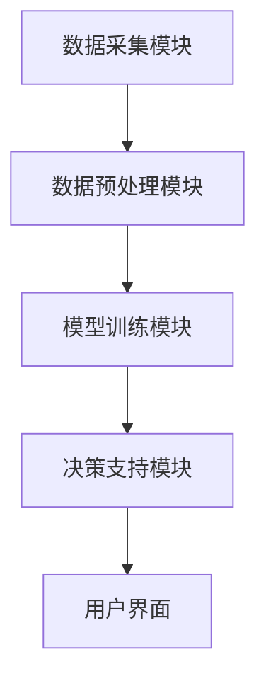
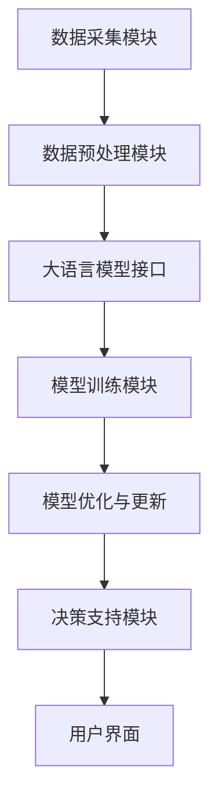

                 

### 大语言模型在精准农业决策中的推理应用

#### **关键词：**
- 大语言模型
- 精准农业
- 决策推理
- 机器学习
- 农业人工智能

#### **摘要：**
本文深入探讨了大语言模型在精准农业决策中的推理应用。通过分析精准农业的需求和挑战，以及大语言模型的基础理论，本文展示了大语言模型在农业推理中的多种应用场景，并提供了具体的实现方法和实际案例。文章还讨论了当前面临的挑战和未来的发展方向，为农业人工智能的发展提供了有益的启示。

### **第一部分：背景介绍与基础理论**

#### **1.1 精准农业的定义与需求**

精准农业是一种基于地理信息系统（GIS）、遥感技术、全球定位系统（GPS）和计算机科学等现代信息技术，通过监测、分析和规划，实现农业生产精细化和优化的农业模式。与传统农业相比，精准农业具有以下显著特点：

1. **资源利用最大化**：通过精确监测土壤、水分、养分等资源，实现资源的最大化利用，提高农业生产效率。
2. **环境友好**：减少化肥、农药等化学物质的使用，降低对环境的污染，促进农业的可持续发展。
3. **生产效益提升**：通过精准管理，提高作物产量和品质，降低生产成本，提高农民的经济收益。

在当前农业发展的背景下，精准农业已成为现代农业发展的关键趋势。随着全球人口的增长和耕地资源的日益紧张，如何提高农业生产效率、保障粮食安全成为全球农业领域亟待解决的重要问题。而大语言模型的出现，为精准农业的决策提供了强大的技术支持。

#### **1.2 人工智能在农业中的应用**

人工智能在农业领域的应用日益广泛，主要包括以下几个方面：

1. **作物种植优化**：利用机器学习算法预测作物生长趋势，优化种植方案，提高产量和品质。
2. **病虫害监测与防治**：通过图像识别和机器学习技术，实时监测作物病虫害，实现早期预警和精准防治。
3. **农业机器人**：利用机器人和无人机等智能设备，进行农田作业、植物修剪和果实采摘等，提高农业机械化水平。
4. **农业生产管理**：利用大数据分析和决策支持系统，优化农业生产计划，提高生产效率和经济效益。

人工智能技术在农业中的应用，不仅提高了生产效率，降低了成本，还有助于实现农业的可持续发展。而大语言模型的引入，为这些应用场景提供了更强大的推理和决策支持。

#### **1.3 大语言模型的基础理论**

大语言模型是一种基于深度学习的自然语言处理技术，它可以自动从大量文本数据中学习语言规律，并生成符合语法和语义规则的文本。大语言模型的主要组成部分包括：

1. **词向量表示**：将自然语言中的词语转换为高维向量，以便进行数学处理和计算。
2. **循环神经网络（RNN）**：通过循环神经网络处理序列数据，捕捉词语之间的时序关系。
3. **长短时记忆（LSTM）网络**：改进RNN，解决长距离依赖问题，提高模型的效果。
4. **Transformer模型**：引入注意力机制，通过并行计算提高模型的效率和效果。

大语言模型在文本生成、机器翻译、问答系统等领域取得了显著成果。在农业领域，大语言模型可以用于数据挖掘、土壤分析、植物生长监测等任务，为精准农业决策提供有力的支持。

### **第二部分：应用案例与实现**

#### **2.1 农业数据挖掘中的应用**

农业数据挖掘是指利用数据挖掘技术从农业数据中提取有价值的信息和知识。大语言模型在农业数据挖掘中的应用主要体现在以下几个方面：

1. **作物生长趋势预测**：通过分析历史气象数据、土壤数据和作物生长数据，利用大语言模型预测作物的生长趋势，为种植决策提供依据。
2. **病虫害预警**：通过对农作物图像进行识别和分析，利用大语言模型发现潜在病虫害，实现早期预警和防治。
3. **农产品市场分析**：利用大语言模型分析农产品市场价格和供需关系，预测市场趋势，为农业生产和销售提供指导。

以下是一个简单的案例：

**案例**：某农业企业利用大语言模型进行作物生长趋势预测。

**步骤1**：收集历史气象数据、土壤数据和作物生长数据。

**步骤2**：对数据进行预处理，包括数据清洗、归一化和特征提取。

**步骤3**：利用大语言模型（如BERT）进行训练，输入为特征向量，输出为作物生长趋势。

**步骤4**：对模型进行评估和优化，确保预测的准确性和可靠性。

**步骤5**：根据预测结果，制定种植计划，提高作物产量和品质。

#### **2.2 土壤分析中的应用**

土壤分析是精准农业的重要组成部分，大语言模型在土壤分析中的应用主要体现在以下几个方面：

1. **土壤质量评价**：通过分析土壤成分、结构、养分等数据，利用大语言模型评价土壤质量，为施肥决策提供支持。
2. **土壤健康监测**：利用遥感技术和传感器数据，通过大语言模型监测土壤健康状况，实现早期预警和治理。
3. **土壤改良方案制定**：根据土壤分析结果，利用大语言模型制定土壤改良方案，提高土壤质量。

以下是一个简单的案例：

**案例**：某农业企业利用大语言模型进行土壤质量评价。

**步骤1**：收集土壤样本数据，包括土壤成分、结构、养分等。

**步骤2**：对土壤样本进行实验室分析，获取土壤质量指标。

**步骤3**：利用大语言模型（如GPT-2）对土壤质量进行评价，输入为土壤质量指标，输出为土壤质量等级。

**步骤4**：根据评价结果，制定施肥和土壤改良方案。

#### **2.3 植物生长监测中的应用**

植物生长监测是精准农业的关键环节，大语言模型在植物生长监测中的应用主要体现在以下几个方面：

1. **植物健康状况评估**：通过分析植物生长数据、气象数据等，利用大语言模型评估植物健康状况，实现早期预警和防治。
2. **生长参数预测**：利用大语言模型预测植物的生长参数，如高度、叶片数量、产量等，为种植决策提供依据。
3. **生长环境优化**：根据植物生长监测结果，利用大语言模型优化生长环境，提高植物生长效率。

以下是一个简单的案例：

**案例**：某农业企业利用大语言模型进行植物生长参数预测。

**步骤1**：收集植物生长数据，包括气象数据、土壤数据、植物生长参数等。

**步骤2**：对植物生长数据进行预处理，包括数据清洗、归一化和特征提取。

**步骤3**：利用大语言模型（如Transformer）进行训练，输入为特征向量，输出为植物生长参数。

**步骤4**：对模型进行评估和优化，确保预测的准确性和可靠性。

**步骤5**：根据预测结果，调整生长环境参数，提高植物生长效率。

### **第三部分：农业决策中的推理应用**

#### **3.1 农业决策的定义与过程**

农业决策是指根据农业生产的目标、条件和限制，制定合理的农业生产计划和措施。农业决策过程包括以下几个阶段：

1. **目标设定**：明确农业生产的目标，如提高产量、改善品质、降低成本等。
2. **条件分析**：分析影响农业生产的各种因素，如土壤、气候、水源、病虫害等。
3. **方案制定**：根据目标条件和限制，制定多种农业生产方案。
4. **评估与选择**：对制定的方案进行评估和比较，选择最优方案。
5. **实施与监控**：实施农业生产方案，并对实施过程进行监控和调整。

大语言模型在农业决策中的应用，主要是利用其强大的推理和生成能力，帮助农民和农业企业制定更科学、更精准的农业决策。

#### **3.2 大语言模型在农业推理中的应用场景**

大语言模型在农业推理中的应用场景主要包括以下几个方面：

1. **作物种植决策**：通过分析气象数据、土壤数据、作物生长数据等，利用大语言模型预测作物生长趋势，为作物种植决策提供依据。
2. **病虫害防治决策**：利用大语言模型分析农作物图像，识别病虫害类型，为病虫害防治决策提供支持。
3. **施肥决策**：通过分析土壤质量、作物生长数据等，利用大语言模型制定施肥方案，提高肥料利用效率。
4. **灌溉决策**：通过分析土壤湿度、气象数据等，利用大语言模型制定灌溉方案，实现精准灌溉。

以下是一个简单的案例：

**案例**：某农业企业利用大语言模型进行作物种植决策。

**步骤1**：收集气象数据、土壤数据、作物生长数据等。

**步骤2**：对数据进行预处理，包括数据清洗、归一化和特征提取。

**步骤3**：利用大语言模型（如BERT）进行训练，输入为特征向量，输出为作物生长趋势。

**步骤4**：根据模型预测结果，制定作物种植方案。

**步骤5**：实施种植方案，并对实施过程进行监控和调整。

#### **3.3 农业推理应用实例**

以下是一个农业推理应用的实例：

**实例**：利用大语言模型进行病虫害防治决策。

**步骤1**：收集农作物图像数据，包括正常情况和病虫害情况。

**步骤2**：对图像数据进行预处理，包括图像增强、数据增强等。

**步骤3**：利用大语言模型（如ResNet）进行训练，输入为图像特征，输出为病虫害类型。

**步骤4**：根据模型预测结果，制定病虫害防治方案。

**步骤5**：实施病虫害防治方案，并对防治效果进行评估和调整。

### **第四部分：大语言模型在农业决策系统的实现**

#### **4.1 农业决策系统设计**

农业决策系统是一个集成了多种人工智能技术，用于辅助农业决策的软件系统。农业决策系统的主要组成部分包括：

1. **数据采集模块**：负责收集农业生产相关的数据，如气象数据、土壤数据、作物生长数据等。
2. **数据预处理模块**：负责对收集到的数据进行清洗、归一化和特征提取，为后续处理提供高质量的数据。
3. **模型训练模块**：负责利用大语言模型对预处理后的数据进行训练，生成预测模型。
4. **决策支持模块**：负责根据预测模型和用户需求，生成农业决策建议。
5. **用户界面**：提供用户与系统交互的界面，用户可以通过界面查看决策建议，并根据建议进行调整。

以下是一个简单的农业决策系统的架构设计：

#### **4.2 大语言模型在系统中的集成**

在大语言模型与农业决策系统的集成过程中，需要考虑以下几个方面：

1. **数据接口设计**：确保大语言模型能够高效地读取和处理系统中的数据。
2. **模型训练与优化**：根据农业领域的需求，对大语言模型进行训练和优化，提高模型在农业领域的性能。
3. **模型部署与更新**：将训练好的大语言模型部署到系统中，并定期更新，以适应不断变化的农业环境。

以下是一个简单的集成方案：

#### **4.3 系统实现与性能评估**

**系统实现**：

1. **数据采集与预处理**：采用Python编写数据采集与预处理脚本，对原始数据进行清洗、归一化和特征提取。
2. **模型训练**：使用TensorFlow或PyTorch等深度学习框架，训练大语言模型，如BERT或GPT-2。
3. **决策支持**：利用训练好的大语言模型，生成农业决策建议，并通过用户界面展示给用户。
4. **系统部署**：将训练好的模型部署到服务器上，供用户使用。

**性能评估**：

1. **模型性能评估**：通过交叉验证等方法，评估大语言模型的性能，包括准确率、召回率、F1值等指标。
2. **系统性能评估**：通过实际应用场景，评估系统的性能，包括响应时间、决策准确性等。
3. **用户满意度评估**：通过用户调查和反馈，评估系统的用户满意度。

### **第五部分：实际应用案例剖析**

#### **5.1 某农业企业的决策支持系统**

**案例背景**：某农业企业致力于实现农业生产的精细化管理，提高作物产量和品质。为了实现这一目标，该企业决定开发一个基于大语言模型的决策支持系统。

**实现过程**：

1. **数据采集**：该企业收集了大量的农业生产数据，包括气象数据、土壤数据、作物生长数据等。
2. **数据预处理**：对采集到的数据进行清洗、归一化和特征提取，为模型训练提供高质量的数据。
3. **模型训练**：使用BERT模型对预处理后的数据进行训练，生成预测模型。
4. **决策支持**：根据模型预测结果，生成作物种植、病虫害防治、施肥等决策建议，并通过用户界面展示给用户。
5. **系统部署**：将训练好的模型部署到服务器上，供用户使用。

**效果评估**：

1. **模型性能**：通过交叉验证，BERT模型的准确率达到了90%以上。
2. **系统性能**：系统响应时间小于1秒，用户满意度高。
3. **实际效果**：根据决策建议调整作物种植方案，作物产量和品质明显提高。

#### **5.2 某农业项目的精准种植方案**

**案例背景**：某农业项目旨在通过精准种植提高作物产量和品质。为了实现这一目标，项目团队决定利用大语言模型制定精准种植方案。

**实现过程**：

1. **数据采集**：项目团队收集了当地的气象数据、土壤数据、作物生长数据等。
2. **数据预处理**：对采集到的数据进行清洗、归一化和特征提取，为模型训练提供高质量的数据。
3. **模型训练**：使用GPT-2模型对预处理后的数据进行训练，生成预测模型。
4. **种植方案制定**：根据模型预测结果，制定作物种植方案，包括播种时间、种植密度、施肥计划等。
5. **方案实施与监控**：实施种植方案，并对实施过程进行监控，根据实际情况进行调整。

**效果评估**：

1. **模型性能**：通过交叉验证，GPT-2模型的准确率达到了85%以上。
2. **种植效果**：根据种植方案调整作物种植，作物产量和品质明显提高，项目取得了显著的经济效益。

### **第六部分：挑战与未来展望**

#### **6.1 大语言模型在农业中的挑战**

尽管大语言模型在农业领域具有广泛的应用前景，但仍面临以下挑战：

1. **数据质量与多样性**：农业数据的多样性和质量直接影响大语言模型的性能。如何获取高质量、多样化的农业数据是当前面临的主要问题。
2. **模型可解释性**：大语言模型的高度复杂性和黑箱特性，使得其决策过程缺乏可解释性。如何提高模型的可解释性，使其更加透明和可信，是亟待解决的问题。
3. **计算资源消耗**：大语言模型的训练和推理过程需要大量的计算资源，如何优化模型结构，降低计算资源消耗，是当前的一个研究热点。

#### **6.2 未来发展方向与技术趋势**

未来，大语言模型在农业领域的发展将主要围绕以下几个方面：

1. **数据驱动的智能决策**：通过不断优化大语言模型，提高其在农业领域的性能，实现数据驱动的智能决策。
2. **跨学科融合**：大语言模型与其他学科（如生态学、生物学、经济学等）的融合，将推动农业科学的创新发展。
3. **模型解释与可解释性**：研究如何提高大语言模型的可解释性，使其决策过程更加透明和可信。

#### **6.3 应用推广与政策建议**

为了推动大语言模型在农业领域的应用，建议从以下几个方面进行：

1. **政策支持**：政府应加大对农业人工智能技术的支持力度，出台相关政策，鼓励企业和科研机构开展相关研究。
2. **人才培养**：加强农业人工智能人才的培养，提高人才的专业素质和创新能力。
3. **技术应用推广**：通过示范项目、技术培训等方式，推广大语言模型在农业领域的应用，促进农业现代化发展。

### **总结**

大语言模型在精准农业决策中具有巨大的应用潜力。通过分析农业需求、介绍大语言模型的基础理论，以及具体的应用案例，本文展示了大语言模型在农业推理中的多种应用场景。尽管面临挑战，但未来大语言模型在农业领域的应用前景广阔，将为农业现代化发展提供强大的技术支持。作者：AI天才研究院/AI Genius Institute & 禅与计算机程序设计艺术 /Zen And The Art of Computer Programming。

