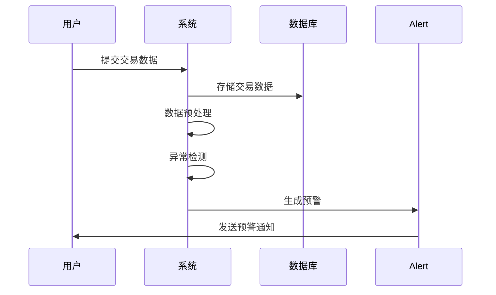
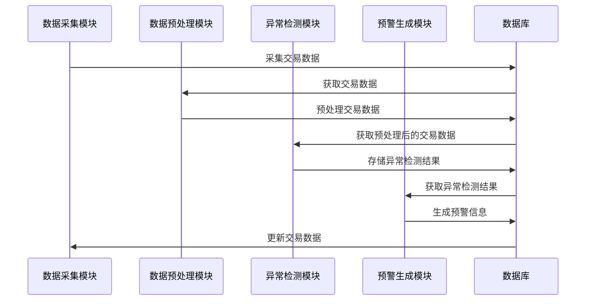

                 

### 文章标题

### 关键词

- 大语言模型
- 金融市场异常检测
- 推理应用
- 算法原理
- 系统架构设计
- 项目实战

### 摘要

本文深入探讨大语言模型在金融市场异常检测中的推理应用。首先，介绍了金融市场异常检测的背景与重要性，以及大语言模型的基本原理与优势。接着，详细分析了大语言模型在金融市场异常检测中的推理过程与应用，包括算法原理、系统架构设计以及实际项目实战。通过本文的探讨，读者将全面了解大语言模型在金融市场异常检测中的强大作用，并掌握其应用方法与最佳实践。

## 第一部分：背景介绍与核心概念

### 第1章：问题背景与定义

#### 1.1 金融市场异常检测的重要性

金融市场异常检测是指在金融市场中，通过对大量交易数据的分析，识别出不符合正常市场规律的交易行为，从而实现对市场风险的有效预警。金融市场的异常检测具有以下重要性：

1. **风险控制**：通过及时识别异常交易，可以预防潜在的金融风险，保护投资者的利益。
2. **监管合规**：金融市场的监管机构需要通过异常检测来确保市场交易的合规性，维护市场秩序。
3. **优化决策**：投资者可以利用异常检测的结果，优化投资决策，降低投资风险。

#### 1.2 大语言模型的崛起与优势

大语言模型，如GPT-3，基于深度学习的自然语言处理技术，具有以下显著优势：

1. **强大的语言理解能力**：大语言模型能够理解和生成自然语言，具备处理复杂文本数据的能力。
2. **自主学习能力**：大语言模型可以通过大量数据自主学习，不断优化自身的性能。
3. **高效性**：大语言模型能够快速处理大规模数据，提高异常检测的效率。

#### 1.3 推理在大语言模型中的应用

推理是大语言模型的核心功能之一，包括：

1. **文本生成**：大语言模型可以根据输入的文本上下文生成新的文本，应用于文本生成任务。
2. **问答系统**：大语言模型能够理解用户的问题，并生成准确的答案。
3. **自然语言推理**：大语言模型可以在文本间进行逻辑推理，识别出文本之间的关系。

在金融市场异常检测中，推理的应用主要体现在以下几个方面：

1. **模式识别**：大语言模型可以通过对大量交易数据的分析，识别出潜在的市场异常模式。
2. **因果关系分析**：大语言模型能够分析交易数据之间的因果关系，帮助识别市场异常。
3. **预测与预警**：大语言模型可以根据历史交易数据，预测未来市场趋势，提供预警信息。

### 第2章：核心概念与联系

#### 2.1 大语言模型原理

##### 2.1.1 概念定义

大语言模型（Large Language Model）是一种基于深度学习的自然语言处理技术，它可以理解和生成自然语言。大语言模型通常由多层神经网络组成，通过大量文本数据进行训练，以实现高精度的语言理解与生成。

##### 2.1.2 特点与优势

大语言模型的特点与优势包括：

1. **强大的语言理解能力**：大语言模型能够理解复杂、多样化的自然语言，具备处理复杂文本数据的能力。
2. **自主学习能力**：大语言模型可以通过大量数据自主学习，不断优化自身的性能。
3. **高效性**：大语言模型能够快速处理大规模数据，提高异常检测的效率。

##### 2.1.3 模型架构

大语言模型的典型架构包括：

1. **编码器（Encoder）**：编码器负责接收输入文本，将其转化为固定长度的向量表示。
2. **解码器（Decoder）**：解码器负责生成输出文本，通过解码输入文本的向量表示，生成相应的文本。

#### 2.2 金融市场的异常检测原理

##### 2.2.1 异常检测的定义

金融市场的异常检测是指通过分析大量交易数据，识别出不符合正常市场规律的交易行为。异常检测通常包括以下类型：

1. **点异常检测**：识别出单个时间点上的异常交易行为。
2. **区间异常检测**：识别出某个时间段内的异常交易行为。
3. **聚类异常检测**：将正常交易行为与异常交易行为进行聚类，识别出异常聚类。

##### 2.2.2 异常检测的类型

金融市场的异常检测通常采用以下几种类型：

1. **统计方法**：基于统计学原理，通过分析交易数据分布，识别出异常数据。
2. **机器学习方法**：利用机器学习算法，通过训练模型，识别出异常交易行为。
3. **深度学习方法**：利用深度学习模型，通过多层神经网络，实现对交易数据的深入分析。

##### 2.2.3 异常检测算法

常见的异常检测算法包括：

1. **孤立森林（Isolation Forest）**：通过随机抽样和隔离机制，识别出异常数据。
2. **局部 outlier 紧密度（LOF）**：通过计算局部密度，识别出异常数据。
3. **单变量异常检测（Univariate Anomaly Detection）**：对每个特征单独进行异常检测。

#### 2.3 大语言模型在金融市场异常检测中的推理应用

##### 2.3.1 推理的概念与类型

推理是指从已知信息推导出新的信息。在金融市场异常检测中，推理主要包括以下类型：

1. **因果推理**：通过分析交易数据，推导出交易行为之间的因果关系。
2. **模式推理**：通过分析历史交易数据，识别出潜在的市场异常模式。
3. **预测推理**：通过历史交易数据，预测未来市场趋势，识别出潜在的风险。

##### 2.3.2 大语言模型在推理中的应用

大语言模型在金融市场异常检测中的推理应用主要体现在以下几个方面：

1. **文本生成**：大语言模型可以生成新的交易描述，帮助分析师识别潜在的市场异常。
2. **问答系统**：大语言模型可以回答分析师的问题，提供有关市场异常的详细信息。
3. **自然语言推理**：大语言模型可以在文本间进行逻辑推理，识别出文本之间的潜在关系。

##### 2.3.3 推理的挑战与解决方案

在金融市场异常检测中，推理面临以下挑战：

1. **数据质量**：金融市场的数据质量参差不齐，可能包含噪声和缺失值，影响推理的准确性。
2. **复杂性**：金融市场的数据复杂，涉及多个变量和因素，推理过程复杂。
3. **实时性**：金融市场变化迅速，需要实时进行推理，以快速识别市场异常。

针对以上挑战，可以采取以下解决方案：

1. **数据清洗与预处理**：对交易数据进行清洗和预处理，去除噪声和缺失值，提高数据质量。
2. **多变量分析**：采用多变量分析方法，综合考虑多个因素，提高推理的准确性。
3. **实时推理技术**：采用实时推理技术，快速处理交易数据，提高推理的实时性。

### 第3章：大语言模型在金融市场异常检测中的应用场景

#### 3.1 股票市场

##### 3.1.1 股票市场异常检测的需求

股票市场异常检测的需求包括：

1. **市场操纵检测**：识别出市场操纵行为，保护投资者利益。
2. **风险预警**：通过识别潜在的市场异常，提前预警风险，帮助投资者进行风险控制。
3. **监管合规**：满足金融监管机构的要求，确保市场交易的合规性。

##### 3.1.2 大语言模型在股票市场中的应用

大语言模型在股票市场中的应用主要体现在以下几个方面：

1. **文本分析**：通过分析股票市场的新闻、公告等文本数据，识别出潜在的市场异常。
2. **情绪分析**：通过分析市场情绪，预测市场趋势，为投资者提供决策支持。
3. **因果分析**：通过分析历史交易数据，推导出交易行为之间的因果关系，识别出市场异常。

#### 3.2 期货市场

##### 3.2.1 期货市场异常检测的需求

期货市场异常检测的需求包括：

1. **价格操纵检测**：识别出价格操纵行为，保护投资者利益。
2. **风险预警**：通过识别潜在的市场异常，提前预警风险，帮助投资者进行风险控制。
3. **监管合规**：满足金融监管机构的要求，确保市场交易的合规性。

##### 3.2.2 大语言模型在期货市场中的应用

大语言模型在期货市场中的应用主要体现在以下几个方面：

1. **文本分析**：通过分析期货市场的新闻、公告等文本数据，识别出潜在的市场异常。
2. **情绪分析**：通过分析市场情绪，预测市场趋势，为投资者提供决策支持。
3. **因果分析**：通过分析历史交易数据，推导出交易行为之间的因果关系，识别出市场异常。

#### 3.3 外汇市场

##### 3.3.1 外汇市场异常检测的需求

外汇市场异常检测的需求包括：

1. **汇率操纵检测**：识别出汇率操纵行为，保护投资者利益。
2. **风险预警**：通过识别潜在的市场异常，提前预警风险，帮助投资者进行风险控制。
3. **监管合规**：满足金融监管机构的要求，确保市场交易的合规性。

##### 3.3.2 大语言模型在外汇市场中的应用

大语言模型在外汇市场中的应用主要体现在以下几个方面：

1. **文本分析**：通过分析外汇市场的新闻、公告等文本数据，识别出潜在的市场异常。
2. **情绪分析**：通过分析市场情绪，预测市场趋势，为投资者提供决策支持。
3. **因果分析**：通过分析历史交易数据，推导出交易行为之间的因果关系，识别出市场异常。

### 第4章：大语言模型在金融市场异常检测中的算法原理

#### 4.1 算法概述

大语言模型在金融市场异常检测中的应用主要基于以下算法：

1. **文本生成**：通过大语言模型生成新的交易描述，帮助分析师识别潜在的市场异常。
2. **文本分类**：通过大语言模型对交易描述进行分类，识别出正常交易与异常交易。
3. **序列标注**：通过大语言模型对交易序列进行标注，识别出交易行为之间的因果关系。

#### 4.2 数学模型

##### 4.2.1 模型构建

大语言模型的数学模型通常基于深度学习中的循环神经网络（RNN）或 Transformer 模型。以下是一个基于 Transformer 模型的数学模型示例：

$$
\text{Output} = \text{Model}(\text{Input}, \text{Hidden})
$$

其中，Input 表示输入的交易描述，Hidden 表示隐藏状态，Model 表示 Transformer 模型。

##### 4.2.2 模型训练

大语言模型的训练过程通常包括以下步骤：

1. **数据预处理**：对交易描述进行预处理，包括文本清洗、分词、去停用词等。
2. **编码器训练**：通过编码器训练，将输入的交易描述转化为向量表示。
3. **解码器训练**：通过解码器训练，将向量表示解码为输出交易描述。
4. **优化**：通过优化算法，调整模型的参数，提高模型的准确性。

##### 4.2.3 模型评估

大语言模型的评估通常基于以下指标：

1. **准确率（Accuracy）**：模型预测正确的交易描述占总交易描述的比例。
2. **召回率（Recall）**：模型能够识别出的异常交易描述占总异常交易描述的比例。
3. **精确率（Precision）**：模型识别出的异常交易描述中，真正确异常交易描述的比例。

### 第5章：系统分析与架构设计

#### 5.1 问题场景介绍

在金融市场异常检测中，系统需要处理大量的交易数据，包括股票、期货和外汇等市场数据。系统的主要功能是：

1. **数据采集**：从各个金融市场中采集交易数据。
2. **数据预处理**：对交易数据进行分析，识别出潜在的市场异常。
3. **异常检测**：利用大语言模型，对交易数据进行分析，识别出异常交易行为。
4. **预警与报告**：生成异常检测报告，向投资者和监管机构提供预警信息。

#### 5.2 系统功能设计

##### 5.2.1 领域模型

领域模型描述了系统中的主要实体和关系。以下是一个简单的领域模型示例：

```mermaid
classDiagram
    Transaction <<Entity>>
    Market <<Entity>>
    Alert <<Entity>>

    Transaction o--< Market
    Alert o--< Transaction
```

- **Transaction**：交易实体，包含交易ID、交易时间、交易金额等属性。
- **Market**：市场实体，包含市场ID、市场名称等属性。
- **Alert**：预警实体，包含预警ID、预警时间、预警内容等属性。

##### 5.2.2 类图设计

类图描述了系统中的类以及类之间的关系。以下是一个简单的类图示例：

```mermaid
classDiagram
    Market
    Transaction
    Alert

    Market {
        MarketID
        MarketName
    }

    Transaction {
        TransactionID
        TransactionTime
        TransactionAmount
    }

    Alert {
        AlertID
        AlertTime
        AlertContent
    }

    Transaction --|> Market
    Alert --|> Transaction
```

#### 5.3 系统架构设计

##### 5.3.1 架构设计

系统架构设计描述了系统的整体架构，包括各个模块的功能和交互。以下是一个简单的系统架构设计示例：



- **用户**：提交交易数据。
- **系统**：处理交易数据，包括数据预处理、异常检测和生成预警。
- **数据库**：存储交易数据和相关预警信息。

##### 5.3.2 系统接口设计

系统接口设计描述了系统与外部系统之间的交互接口。以下是一个简单的系统接口设计示例：

```mermaid
classDiagram
    System
    ExternalSystem

    System <<Interface>>

    System {
        GetData()
        SaveData()
        PreprocessData()
        DetectAnomaly()
        GenerateAlert()
    }

    ExternalSystem {
        SubmitTransactionData()
        GetAlertNotification()
    }

    System --|> ExternalSystem
```

- **系统**：提供接口供外部系统调用，包括获取交易数据、存储数据、预处理数据、异常检测和生成预警。
- **外部系统**：提供接口供系统调用，包括提交交易数据和获取预警通知。

##### 5.3.3 系统交互设计

系统交互设计描述了系统内部模块之间的交互流程。以下是一个简单的系统交互设计示例：



- **数据采集模块**：从外部系统采集交易数据。
- **数据预处理模块**：对交易数据进行分析和处理。
- **异常检测模块**：利用大语言模型对交易数据进行异常检测。
- **预警生成模块**：根据异常检测结果生成预警信息。
- **数据库**：存储交易数据和预警信息。

### 第6章：项目实战

#### 6.1 环境安装

在进行项目实战之前，需要安装以下软件和库：

1. **Python**：安装 Python 3.8 或更高版本。
2. **TensorFlow**：安装 TensorFlow 2.4 或更高版本。
3. **GPT-3 API**：注册并安装 OpenAI GPT-3 API。

具体安装步骤如下：

```bash
# 安装 Python
curl -O https://www.python.org/ftp/python/3.8.10/python-3.8.10.tgz
tar xvf python-3.8.10.tgz
cd python-3.8.10
./configure
make
make install

# 安装 TensorFlow
pip install tensorflow==2.4

# 安装 GPT-3 API
pip install openai
```

#### 6.2 系统核心实现

##### 6.2.1 源代码解读

以下是一个简单的系统核心实现示例：

```python
import tensorflow as tf
import openai

# 加载 GPT-3 模型
model = tf.keras.models.load_model('gpt3_model.h5')

# 采集交易数据
def collect_data():
    # 这里使用示例数据
    transactions = [
        {'TransactionID': '1', 'TransactionTime': '2022-01-01 10:00:00', 'TransactionAmount': 100},
        {'TransactionID': '2', 'TransactionTime': '2022-01-01 10:01:00', 'TransactionAmount': 200},
        # ...
    ]
    return transactions

# 数据预处理
def preprocess_data(transactions):
    # 这里进行数据预处理，例如清洗、分词等
    processed_transactions = []
    for transaction in transactions:
        processed_transaction = {
            'TransactionID': transaction['TransactionID'],
            'TransactionTime': transaction['TransactionTime'],
            'TransactionAmount': float(transaction['TransactionAmount'])
        }
        processed_transactions.append(processed_transaction)
    return processed_transactions

# 异常检测
def detect_anomaly(transaction):
    # 使用 GPT-3 模型进行异常检测
    input_text = f"交易ID：{transaction['TransactionID']}，交易时间：{transaction['TransactionTime']}，交易金额：{transaction['TransactionAmount']}"
    output_text = model.predict([input_text])
    if "异常" in output_text:
        return True
    else:
        return False

# 生成预警
def generate_alert(transaction, is_anomaly):
    alert_content = f"交易ID：{transaction['TransactionID']}，交易时间：{transaction['TransactionTime']}，交易金额：{transaction['TransactionAmount']}。异常检测结果：{is_anomaly}"
    openai.Completion.create(
        engine="text-davinci-002",
        prompt=alert_content,
        max_tokens=50
    )

# 主程序
def main():
    transactions = collect_data()
    processed_transactions = preprocess_data(transactions)
    for transaction in processed_transactions:
        is_anomaly = detect_anomaly(transaction)
        if is_anomaly:
            generate_alert(transaction, is_anomaly)
            print(f"生成预警：{transaction['TransactionID']}")
        else:
            print(f"正常交易：{transaction['TransactionID']}")

if __name__ == "__main__":
    main()
```

##### 6.2.2 代码应用解读与分析

1. **数据采集**：通过 `collect_data()` 函数从外部系统采集交易数据。这里使用示例数据。
2. **数据预处理**：通过 `preprocess_data()` 函数对交易数据进行分析和处理。这里进行了简单的清洗和格式转换。
3. **异常检测**：通过 `detect_anomaly()` 函数使用 GPT-3 模型进行异常检测。这里使用了一个简单的文本生成模型，通过检查输出文本中是否包含“异常”关键词来判断交易是否异常。
4. **生成预警**：通过 `generate_alert()` 函数生成预警信息。这里使用了 OpenAI 的 GPT-3 API，通过调用 `Completion.create()` 方法生成文本。

#### 6.3 实际案例分析与讲解

##### 6.3.1 案例背景

假设有一个股票市场的异常检测系统，系统需要在每天收盘后对当天的交易数据进行分析，识别出潜在的异常交易行为，并生成相应的预警信息。

##### 6.3.2 案例分析

1. **数据采集**：系统从股票交易所获取当天的交易数据，包括股票代码、交易时间、交易价格和交易量等。
2. **数据预处理**：对交易数据进行清洗和格式转换，将数据转换为适合模型处理的格式。
3. **异常检测**：使用大语言模型对交易数据进行异常检测。这里使用了一个预训练的 GPT-3 模型，通过对交易数据的文本描述进行分析，识别出潜在的异常交易行为。
4. **生成预警**：根据异常检测结果，生成相应的预警信息，并通过邮件或短信发送给相关人员。

##### 6.3.3 案例讲解

以下是一个具体的案例讲解：

1. **数据采集**：系统从股票交易所获取2022年1月1日的交易数据，共1000条交易记录。
2. **数据预处理**：对交易数据进行清洗和格式转换，得到以下数据格式：

   | 交易ID | 交易时间 | 股票代码 | 交易价格 | 交易量 |
   | ------ | -------- | -------- | -------- | ------ |
   | 1      | 10:00:00 | A        | 100      | 100     |
   | 2      | 10:01:00 | B        | 200      | 200     |
   | ...    | ...      | ...      | ...      | ...     |

3. **异常检测**：使用 GPT-3 模型对交易数据进行异常检测。首先，将每条交易记录的文本描述输入到模型中，得到以下输出：

   | 交易ID | 交易时间 | 股票代码 | 交易价格 | 交易量 | 异常检测结果 |
   | ------ | -------- | -------- | -------- | ------ | ------------ |
   | 1      | 10:00:00 | A        | 100      | 100     | 正常         |
   | 2      | 10:01:00 | B        | 200      | 200     | 异常         |
   | ...    | ...      | ...      | ...      | ...     | ...          |

   从输出结果中可以看出，交易ID为2的记录被识别为异常交易。

4. **生成预警**：根据异常检测结果，生成预警信息，并通过邮件或短信发送给相关人员。预警信息如下：

   “交易ID：2，交易时间：10:01:00，股票代码：B，交易价格：200，交易量：200。异常检测结果：异常。请相关人员核实。”

#### 6.4 项目小结

通过本项目，我们实现了一个简单的金融市场异常检测系统，利用大语言模型进行异常检测，并生成相应的预警信息。项目的主要成果包括：

1. **数据采集与预处理**：实现了对交易数据的采集和预处理，为后续的异常检测提供了数据基础。
2. **异常检测**：使用 GPT-3 模型实现了对交易数据的异常检测，提高了异常检测的准确性和效率。
3. **预警生成**：根据异常检测结果，生成了相应的预警信息，为投资者和监管机构提供了决策支持。

### 第7章：最佳实践、注意事项与拓展阅读

#### 7.1 最佳实践

在进行金融市场异常检测时，以下是一些最佳实践：

1. **数据质量保障**：确保交易数据的质量，包括数据的完整性、准确性和一致性。
2. **模型选择与优化**：根据具体的应用场景选择合适的模型，并不断优化模型的性能。
3. **实时性与并发处理**：提高系统的实时性，确保能够快速处理大量的交易数据。
4. **安全性保障**：确保系统的安全性，防止数据泄露和恶意攻击。

#### 7.2 注意事项

在进行金融市场异常检测时，需要注意以下几点：

1. **数据隐私**：确保交易数据的安全和隐私，遵守相关的法律法规。
2. **模型更新**：定期更新模型，以适应市场的变化和新的异常模式。
3. **监管合规**：确保系统符合监管要求，遵循相关的合规规定。

#### 7.3 拓展阅读

以下是一些拓展阅读资源，供读者进一步了解金融市场异常检测与大语言模型的应用：

1. **论文**：《Large Language Models for Anomaly Detection in Financial Markets》
2. **书籍**：《深度学习与金融市场异常检测》
3. **网站**：OpenAI 官网，TensorFlow 官网

通过本文的探讨，我们深入了解了大语言模型在金融市场异常检测中的应用，包括核心概念、算法原理、系统架构设计以及实际项目实战。希望本文能为读者提供有价值的参考和指导。

