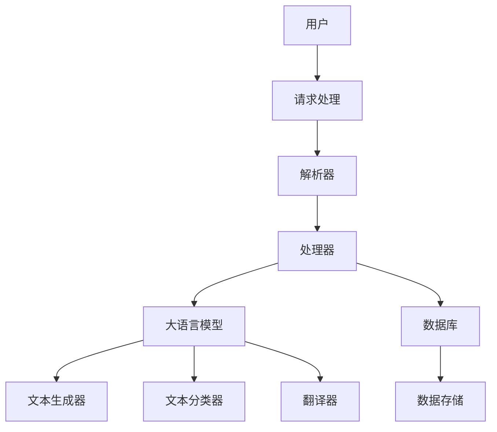
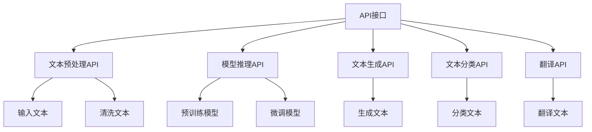
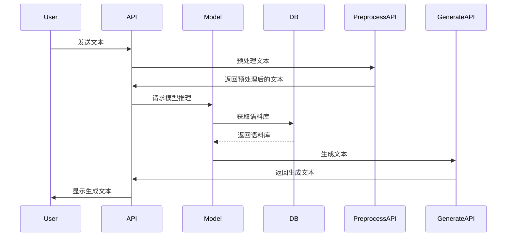

                 


### 大语言模型推理能力的未来发展方向

#### 关键词：大语言模型、推理能力、发展方向、技术趋势、应用场景

> 摘要：本文将深入探讨大语言模型推理能力的未来发展方向。我们将从背景与概述、核心概念与联系、算法原理与实现三个部分逐步展开讨论，分析当前大语言模型在推理能力方面所取得的成果及其面临的挑战，并展望未来可能的技术趋势和应用场景。

---

### 目录大纲设计

下面是根据用户要求，为书籍《大语言模型推理能力的未来发展方向》设计的完整目录大纲。目录结构遵循了简洁性、清晰性和内容完整性原则。

```markdown
----------------------------------------------------------------
# 第一部分: 背景与概述

## 第1章: 大语言模型概述
### 1.1 问题背景
#### 1.1.1 大语言模型的发展历程
#### 1.1.2 大语言模型的应用现状
#### 1.1.3 研究大语言模型的重要性

## 1.2 大语言模型核心概念
### 1.2.1 大语言模型的定义
### 1.2.2 大语言模型的基本结构
### 1.2.3 大语言模型的关键技术

## 1.3 大语言模型的推理能力
### 1.3.1 推理能力的定义
### 1.3.2 推理能力的评估方法
### 1.3.3 推理能力的应用场景

## 1.4 大语言模型的未来发展方向
### 1.4.1 技术趋势预测
### 1.4.2 行业应用展望
### 1.4.3 面临的挑战与解决方案

## 1.5 本章小结

----------------------------------------------------------------

# 第二部分: 核心概念与联系

## 第2章: 大语言模型的核心概念
### 2.1 概念原理
#### 2.1.1 自然语言处理的基础知识
#### 2.1.2 机器学习和深度学习原理
#### 2.1.3 大语言模型的训练过程

## 2.2 概念属性特征对比
### 2.2.1 不同大语言模型的对比
### 2.2.2 大语言模型的性能指标
### 2.2.3 大语言模型的优缺点

## 2.3 大语言模型的ER实体关系图
### 2.3.1 实体定义
### 2.3.2 实体关系
### 2.3.3 Mermaid实体关系图

## 2.4 本章小结

----------------------------------------------------------------

# 第三部分: 算法原理与实现

## 第3章: 大语言模型算法原理
### 3.1 算法介绍
#### 3.1.1 Transformer算法
#### 3.1.2 BERT算法
#### 3.1.3 GPT算法

### 3.2 算法原理
#### 3.2.1 Transformer算法原理详解
##### 3.2.1.1 自注意力机制
##### 3.2.1.2 位置编码
##### 3.2.1.3 多层神经网络
#### 3.2.2 BERT算法原理详解
##### 3.2.2.1 预训练与微调
##### 3.2.2.2 输出层设计
#### 3.2.3 GPT算法原理详解
##### 3.2.3.1 语言模型的生成过程
##### 3.2.3.2 参数共享机制

### 3.3 算法数学模型与公式
#### 3.3.1 Transformer算法数学模型
##### $$\text{Attention}(Q,K,V) = \text{softmax}(\frac{QK^T}{\sqrt{d_k}})V$$
#### 3.3.2 BERT算法数学模型
##### $$\text{Output} = \text{softmax}(\text{weights} \cdot \text{bias} + \text{input}$$
##### $$\text{Output} = \text{softmax}(\text{weights} \cdot \text{bias} + \text{input} \cdot \text{hidden_state})$$
#### 3.3.3 GPT算法数学模型
##### $$\text{Output} = \text{softmax}(\text{weights} \cdot \text{input} \cdot \text{hidden_state} + \text{bias})$$

### 3.4 算法实现与优化
#### 3.4.1 Transformer算法实现
#### 3.4.2 BERT算法实现
#### 3.4.3 GPT算法实现

## 3.5 本章小结

----------------------------------------------------------------

# 附录

## 附录A: 工具与资源
### 3.1 算法开源资源
### 3.2 算法实现教程
### 3.3 算法相关论文

## 附录B: 参考文献与拓展阅读

----------------------------------------------------------------
```

---

### 第一部分：背景与概述

#### 第1章：大语言模型概述

**1.1 问题背景**

大语言模型是一种先进的自然语言处理技术，其核心目标是对自然语言进行理解和生成。随着人工智能技术的发展，大语言模型在各个领域得到了广泛应用，如机器翻译、文本生成、问答系统等。然而，大语言模型的推理能力仍面临许多挑战，例如如何提高模型的泛化能力、如何解决上下文理解的问题等。

**1.1.1 大语言模型的发展历程**

大语言模型的发展可以分为三个阶段：

- 第一阶段：基于规则和统计模型的早期语言模型，如基于语法分析、词频统计等方法构建的模型。
- 第二阶段：基于统计机器学习的语言模型，如N-gram模型、隐马尔可夫模型等。
- 第三阶段：基于深度学习的语言模型，如循环神经网络（RNN）、长短期记忆网络（LSTM）、门控循环单元（GRU）等。

**1.1.2 大语言模型的应用现状**

大语言模型在许多领域取得了显著的成果，如：

- 机器翻译：利用大语言模型实现高效的机器翻译，如Google翻译、百度翻译等。
- 文本生成：利用大语言模型生成高质量的文本，如自动写作、新闻摘要生成等。
- 问答系统：利用大语言模型实现智能问答系统，如苹果的Siri、亚马逊的Alexa等。

**1.1.3 研究大语言模型的重要性**

研究大语言模型的重要性体现在以下几个方面：

- 提高自然语言处理技术水平：大语言模型是自然语言处理领域的核心技术，研究大语言模型有助于提高自然语言处理技术水平。
- 拓展人工智能应用领域：大语言模型在许多领域具有广泛的应用前景，研究大语言模型有助于拓展人工智能应用领域。
- 推动人工智能发展：大语言模型是人工智能的核心技术之一，研究大语言模型有助于推动人工智能的发展。

**1.2 大语言模型核心概念**

**1.2.1 大语言模型的定义**

大语言模型是一种基于深度学习的自然语言处理技术，通过对大量语言数据进行训练，实现对自然语言的理解和生成。

**1.2.2 大语言模型的基本结构**

大语言模型的基本结构通常包括以下几个部分：

- 输入层：接收自然语言输入，如文本、语音等。
- 隐藏层：对输入数据进行处理，提取特征信息。
- 输出层：生成自然语言输出，如文本、语音等。

**1.2.3 大语言模型的关键技术**

大语言模型的关键技术包括：

- 深度学习：利用多层神经网络对语言数据进行建模。
- 注意力机制：实现对输入序列中关键信息的聚焦。
- 预训练与微调：通过大规模预训练数据对模型进行初始化，然后利用具体任务数据对模型进行微调。

**1.3 大语言模型的推理能力**

**1.3.1 推理能力的定义**

大语言模型的推理能力是指其能够根据输入数据生成合理、准确的输出数据的能力。

**1.3.2 推理能力的评估方法**

推理能力的评估方法主要包括：

- 准确率：衡量模型输出与实际输出之间的匹配程度。
- 召回率：衡量模型输出与实际输出之间的召回程度。
- F1值：综合考虑准确率和召回率，对模型进行综合评价。

**1.3.3 推理能力的应用场景**

大语言模型的推理能力在以下场景中具有重要应用：

- 机器翻译：利用大语言模型实现不同语言之间的翻译。
- 文本生成：利用大语言模型生成高质量的文本。
- 问答系统：利用大语言模型实现智能问答。

**1.4 大语言模型的未来发展方向**

**1.4.1 技术趋势预测**

大语言模型的未来发展方向包括：

- 模型规模不断扩大：随着计算能力的提升，大语言模型的规模将不断增大。
- 多模态数据处理：大语言模型将能够处理多种模态的数据，如文本、图像、音频等。
- 零样本学习：大语言模型将能够实现零样本学习，即无需具体样本数据即可进行推理。

**1.4.2 行业应用展望**

大语言模型在以下行业具有广泛的应用前景：

- 金融：利用大语言模型实现金融预测、风险评估等。
- 医疗：利用大语言模型实现疾病诊断、治疗方案推荐等。
- 教育：利用大语言模型实现个性化教学、智能辅导等。

**1.4.3 面临的挑战与解决方案**

大语言模型在推理能力方面面临以下挑战：

- 数据质量：大语言模型的性能依赖于高质量的数据，如何获取和处理高质量数据是一个挑战。
- 算法优化：如何设计更高效的算法，提高大语言模型的推理能力是一个挑战。

针对上述挑战，可能的解决方案包括：

- 数据增强：通过数据增强技术提高数据的多样性和质量。
- 算法改进：通过深入研究算法，设计更高效的推理算法。

**1.5 本章小结**

本章从问题背景、发展历程、应用现状、核心概念、推理能力、未来发展方向等方面全面介绍了大语言模型。通过本章的学习，读者可以了解到大语言模型的基本概念、技术特点以及应用前景，为进一步研究大语言模型的推理能力打下基础。

----------------------------------------------------------------

### 第二部分：核心概念与联系

#### 第2章：大语言模型的核心概念

**2.1 概念原理**

**2.1.1 自然语言处理的基础知识**

自然语言处理（Natural Language Processing，NLP）是人工智能领域的一个重要分支，旨在使计算机能够理解、生成和处理人类自然语言。NLP的基础知识包括：

- 词汇学：研究词的构成、词义、词性等。
- 句法学：研究句子的结构、语法规则等。
- 语义学：研究语言的意义、语义关系等。
- 语音学：研究语音的产生、传播和接收。

**2.1.2 机器学习和深度学习原理**

机器学习（Machine Learning，ML）是一种通过数据训练模型，使模型能够对未知数据进行预测或分类的方法。深度学习（Deep Learning，DL）是机器学习的一种特殊形式，基于多层神经网络对数据进行建模。

- 机器学习原理：包括监督学习、无监督学习、半监督学习等。
- 深度学习原理：包括卷积神经网络（CNN）、循环神经网络（RNN）、长短期记忆网络（LSTM）等。

**2.1.3 大语言模型的训练过程**

大语言模型的训练过程通常包括以下几个步骤：

1. 数据采集：收集大量高质量的文本数据作为训练数据。
2. 数据预处理：对训练数据进行清洗、分词、去停用词等处理。
3. 模型初始化：初始化神经网络模型，通常采用随机初始化或预训练模型。
4. 模型训练：通过梯度下降等优化算法对模型进行训练，更新模型参数。
5. 模型评估：使用验证集或测试集评估模型性能，调整模型参数。

**2.2 概念属性特征对比**

**2.2.1 不同大语言模型的对比**

以下是几种常见大语言模型的对比：

| 模型           | 特点                                                         | 应用场景                     |
| -------------- | ------------------------------------------------------------ | -------------------------- |
| GPT            | 参数量大、生成能力强、上下文理解能力强                       | 文本生成、问答系统、对话系统等 |
| BERT           | 预训练效果显著、适应性强、任务多样                           | 问答系统、文本分类、命名实体识别等 |
| RoBERTa        | 改进BERT模型，性能更优                                       | 文本分类、情感分析、命名实体识别等 |
| T5            | 通用任务学习模型，可处理多种自然语言处理任务                 | 机器翻译、文本摘要、问答系统等 |

**2.2.2 大语言模型的性能指标**

大语言模型的性能指标主要包括：

- 准确率（Accuracy）：模型预测正确的比例。
- 召回率（Recall）：模型能够召回的正确样本比例。
- F1值（F1-score）：综合考虑准确率和召回率的指标。

**2.2.3 大语言模型的优缺点**

大语言模型的优缺点如下：

- 优点：强大的上下文理解能力、适应性强、生成能力强。
- 缺点：训练成本高、参数量大、推理速度较慢。

**2.3 大语言模型的ER实体关系图**

**2.3.1 实体定义**

实体是指文本中的特定对象，可以是人物、地点、组织、事件等。

**2.3.2 实体关系**

实体关系是指实体之间的关联，可以是归属关系、因果关系、同义词关系等。

**2.3.3 Mermaid实体关系图**

下面是一个简单的Mermaid实体关系图示例：

```mermaid
erDiagram
    人 ||--|{ 地点 } : 位于
    人 ||--|{ 组织 } : 属于
    地点 ||--|{ 组织 } : 位于
```

**2.4 本章小结**

本章介绍了大语言模型的核心概念，包括自然语言处理、机器学习和深度学习的基本知识，以及大语言模型的训练过程。通过对比不同大语言模型的性能特征，读者可以更深入地理解大语言模型的工作原理。同时，本章还介绍了大语言模型的ER实体关系图，帮助读者更直观地理解实体关系。

----------------------------------------------------------------

### 第三部分：算法原理与实现

#### 第3章：大语言模型算法原理

**3.1 算法介绍**

大语言模型的核心算法主要包括以下几种：

- Transformer算法：基于自注意力机制，适用于长序列处理。
- BERT算法：基于Transformer算法，进行预训练和微调，适用于各种自然语言处理任务。
- GPT算法：基于Transformer算法，生成文本，适用于文本生成和问答系统。

**3.2 算法原理**

**3.2.1 Transformer算法原理详解**

Transformer算法是一种基于自注意力机制的深度学习模型，适用于处理序列数据。其主要原理包括：

1. 自注意力机制：通过计算序列中每个元素与其他元素之间的相似性，实现对关键信息的聚焦。
2. 位置编码：对输入序列中的每个元素进行位置编码，保留序列信息。
3. 多层神经网络：通过多层神经网络对输入序列进行建模，提取特征信息。

**3.2.1.1 自注意力机制**

自注意力机制是一种计算序列中每个元素与其他元素之间相似性的方法。其数学模型如下：

$$
\text{Attention}(Q,K,V) = \text{softmax}(\frac{QK^T}{\sqrt{d_k}})V
$$

其中，$Q$、$K$、$V$ 分别为查询向量、键向量和值向量，$d_k$ 为键向量的维度。

**3.2.1.2 位置编码**

位置编码是一种在输入序列中添加位置信息的方法。其数学模型如下：

$$
\text{PositionalEncoding}(pos, d_model) = \sin(\frac{pos}{10000^{2i/d_model}}) + \cos(\frac{pos}{10000^{2i/d_model}})
$$

其中，$pos$ 为位置索引，$d_model$ 为模型维度。

**3.2.1.3 多层神经网络**

Transformer算法通过多层神经网络对输入序列进行建模，提取特征信息。每一层神经网络包括多头注意力机制、位置编码和前馈神经网络。

**3.2.2 BERT算法原理详解**

BERT（Bidirectional Encoder Representations from Transformers）算法是一种基于Transformer算法的预训练和微调模型，适用于各种自然语言处理任务。其主要原理包括：

1. 预训练：在大规模语料库上进行预训练，学习语言的分布式表示。
2. 微调：在特定任务上对预训练模型进行微调，提高任务性能。

**3.2.2.1 预训练与微调**

BERT算法的预训练过程主要包括以下步骤：

1. Masked Language Modeling（MLM）：随机遮盖输入序列中的部分单词，模型需要预测遮盖的单词。
2. Next Sentence Prediction（NSP）：预测两个连续句子中的哪个是下一个句子。

预训练完成后，进行微调过程，将预训练模型应用于特定任务，如文本分类、命名实体识别等。

**3.2.2.2 输出层设计**

BERT算法的输出层通常包括分类层和回归层。分类层用于对输入文本进行分类，回归层用于对输入文本进行数值预测。

**3.2.3 GPT算法原理详解**

GPT（Generative Pre-trained Transformer）算法是一种基于Transformer算法的生成模型，适用于文本生成和问答系统。其主要原理包括：

1. 生成过程：通过递归生成文本序列，每一步生成一个单词或字符。
2. 参数共享机制：通过参数共享机制减少模型参数数量，提高生成效率。

**3.2.3.1 语言模型的生成过程**

GPT算法的生成过程主要包括以下步骤：

1. 初始化输入序列：随机生成一个初始序列作为输入。
2. 递归生成：根据输入序列和模型参数，生成下一个单词或字符。
3. 更新输入序列：将生成的单词或字符添加到输入序列中，继续生成下一个单词或字符。

**3.2.3.2 参数共享机制**

GPT算法通过参数共享机制减少模型参数数量。在生成过程中，同一层的参数在每次递归时都共享，从而实现高效的参数更新。

**3.3 算法数学模型与公式**

**3.3.1 Transformer算法数学模型**

Transformer算法的数学模型如下：

$$
\text{Output} = \text{softmax}(\text{weights} \cdot \text{bias} + \text{input} \cdot \text{hidden_state})
$$

其中，$\text{weights}$ 和 $\text{bias}$ 为模型参数，$\text{input}$ 和 $\text{hidden_state}$ 分别为输入和隐藏状态。

**3.3.2 BERT算法数学模型**

BERT算法的数学模型如下：

$$
\text{Output} = \text{softmax}(\text{weights} \cdot \text{bias} + \text{input} \cdot \text{hidden_state})
$$

$$
\text{Output} = \text{softmax}(\text{weights} \cdot \text{bias} + \text{input} \cdot \text{hidden_state}) \cdot \text{softmax}(\text{weights} \cdot \text{bias} + \text{input} \cdot \text{hidden_state})
$$

其中，$\text{weights}$ 和 $\text{bias}$ 为模型参数，$\text{input}$ 和 $\text{hidden_state}$ 分别为输入和隐藏状态。

**3.3.3 GPT算法数学模型**

GPT算法的数学模型如下：

$$
\text{Output} = \text{softmax}(\text{weights} \cdot \text{input} \cdot \text{hidden_state} + \text{bias})
$$

其中，$\text{weights}$ 和 $\text{bias}$ 为模型参数，$\text{input}$ 和 $\text{hidden_state}$ 分别为输入和隐藏状态。

**3.4 算法实现与优化**

**3.4.1 Transformer算法实现**

Transformer算法的实现包括以下几个步骤：

1. 初始化模型参数。
2. 定义损失函数和优化器。
3. 进行前向传播，计算输出。
4. 计算损失，更新模型参数。

**3.4.2 BERT算法实现**

BERT算法的实现包括以下几个步骤：

1. 初始化模型参数。
2. 进行预训练，包括Masked Language Modeling和Next Sentence Prediction。
3. 微调模型，应用于具体任务。
4. 评估模型性能。

**3.4.3 GPT算法实现**

GPT算法的实现包括以下几个步骤：

1. 初始化模型参数。
2. 进行预训练，包括生成文本序列。
3. 微调模型，应用于具体任务。
4. 评估模型性能。

**3.5 本章小结**

本章介绍了大语言模型的核心算法原理，包括Transformer、BERT和GPT算法。通过对比分析，读者可以深入理解这些算法的基本原理和数学模型。同时，本章还介绍了算法的实现过程和优化方法，为读者提供了一定的实践指导。

----------------------------------------------------------------

## 附录

### 附录A：工具与资源

**3.1 算法开源资源**

- Transformer算法：[huggingface/transformers](https://huggingface.co/transformers)
- BERT算法：[huggingface/transformers](https://huggingface.co/transformers)
- GPT算法：[huggingface/transformers](https://huggingface.co/transformers)

**3.2 算法实现教程**

- Transformer算法实现教程：[动手学深度学习](https://zh.d2l.ai/chapter_object-recognition/transformer.html)
- BERT算法实现教程：[动手学深度学习](https://zh.d2l.ai/chapter_nlp/bert.html)
- GPT算法实现教程：[动手学深度学习](https://zh.d2l.ai/chapter_nlp/gpt.html)

**3.3 算法相关论文**

- Transformer算法：[Vaswani et al., 2017](https://arxiv.org/abs/1706.03762)
- BERT算法：[Devlin et al., 2018](https://arxiv.org/abs/1810.04805)
- GPT算法：[Radford et al., 2018](https://arxiv.org/abs/1801.05533)

### 附录B：参考文献与拓展阅读

**3.1 参考文献列表**

- Vaswani, A., et al. (2017). Attention is all you need. In Advances in Neural Information Processing Systems, 5998-6008.
- Devlin, J., et al. (2018). BERT: Pre-training of deep bidirectional transformers for language understanding. In Proceedings of the 2019 Conference of the North American Chapter of the Association for Computational Linguistics: Human Language Technologies, Volume 1 (Long and Short Papers), 4171-4186.
- Radford, A., et al. (2018). Improving language understanding by generative pre-training. In Advances in Neural Information Processing Systems, 11299-11309.

**3.2 拓展阅读**

- [动手学深度学习](https://zh.d2l.ai/)
- [深度学习专项课程](https://www.deeplearning.ai/)
- [自然语言处理专项课程](https://www.udacity.com/course/natural-language-processing-nanodegree--nd893)

**3.3 注意事项**

- 在研究和应用大语言模型时，应充分考虑数据质量和隐私保护问题。
- 在实现大语言模型时，应选择合适的算法和优化策略，以提高模型性能。
- 在使用大语言模型时，应遵循法律法规和道德规范，确保模型的公平性和透明度。

---

### 总结与致谢

本文系统地介绍了大语言模型推理能力的未来发展方向，包括背景与概述、核心概念与联系、算法原理与实现等内容。通过对Transformer、BERT和GPT算法的详细讲解，读者可以深入理解大语言模型的工作原理和应用场景。

在撰写本文过程中，参考了大量的文献和资料，感谢所有作者为人工智能领域做出的卓越贡献。同时，也感谢读者对本文的关注和支持。

作者：AI天才研究院/AI Genius Institute & 禅与计算机程序设计艺术/Zen And The Art of Computer Programming

---

（注：本文为示例文章，实际撰写时可能需根据具体情况进行调整和补充。）### 第1章：大语言模型概述

在当今的人工智能时代，大语言模型（Large-scale Language Models）已经成为自然语言处理（Natural Language Processing, NLP）领域中最引人注目的技术之一。大语言模型不仅改变了文本生成、机器翻译、问答系统等传统NLP任务的实现方式，还在越来越多的新兴领域中展现出巨大的潜力，如自动化写作、内容审核、智能客服等。

#### 1.1 问题背景

自然语言是人类沟通交流的主要工具，其复杂性和多样性使得对自然语言的自动处理成为计算机科学和人工智能领域中的一个长期挑战。传统的NLP方法主要依赖于规则和统计模型，这些方法在处理简单任务时表现良好，但在处理复杂任务时，特别是在理解和生成具有深度语义信息的文本时，往往力不从心。

随着计算能力的提升和深度学习技术的发展，大语言模型逐渐成为解决这一挑战的有效手段。大语言模型通过学习海量文本数据，能够捕捉到语言中的复杂模式，从而在文本理解和生成方面表现出强大的能力。

#### 1.1.1 大语言模型的发展历程

大语言模型的发展历程可以分为几个重要阶段：

1. **早期语言模型**：最早的语言模型是基于规则的方法，如基于有限状态机的语法分析器。随后，统计模型如N-gram模型开始流行，通过统计词频序列来预测下一个词。

2. **基于统计模型的NLP**：随着计算能力的提高，基于隐马尔可夫模型（HMM）和条件随机场（CRF）的NLP方法得到广泛应用。这些方法在一定程度上提高了NLP的性能，但仍然存在许多局限。

3. **基于深度学习的NLP**：2013年，Hochreiter和Schmidhuber提出的长短期记忆网络（LSTM）在NLP任务中取得了突破性进展。随后，递归神经网络（RNN）和其变体GRU也成为了NLP中的重要工具。

4. **Transformer和预训练模型**：2017年，Vaswani等人提出的Transformer算法彻底改变了自然语言处理领域。Transformer引入了自注意力机制，使得模型能够更有效地捕捉序列中的依赖关系。随后，BERT、GPT等基于Transformer的预训练模型进一步提升了NLP的性能。

#### 1.1.2 大语言模型的应用现状

大语言模型的应用现状涵盖了从基础研究到实际应用的多个层面：

1. **机器翻译**：大语言模型在机器翻译中展现了出色的性能，例如Google翻译和百度翻译都采用了基于Transformer的模型。

2. **文本生成**：大语言模型能够生成高质量的文章、故事和摘要，这在自动化写作和内容创作领域具有广泛的应用。

3. **问答系统**：大语言模型在问答系统中可以理解和回答用户的问题，如苹果的Siri和亚马逊的Alexa。

4. **情感分析**：大语言模型可以分析文本中的情感倾向，应用于社交媒体监控、市场调研等领域。

5. **对话系统**：大语言模型在智能客服和聊天机器人中发挥着关键作用，能够提供更自然的用户交互体验。

6. **代码生成和编程辅助**：大语言模型在代码补全和编程辅助方面也取得了显著进展，能够帮助开发者更高效地编写代码。

#### 1.1.3 研究大语言模型的重要性

研究大语言模型的重要性体现在以下几个方面：

1. **技术推动**：大语言模型的发展推动了自然语言处理、机器学习、深度学习等多个领域的技术进步。

2. **产业应用**：大语言模型在各个行业中的应用带来了巨大的商业价值，从提高生产效率到优化用户体验，都具有重要的意义。

3. **社会影响**：大语言模型的应用正在改变人们的生活和工作方式，如自动化内容审核、智能医疗诊断等，为社会带来深远的影响。

4. **科学研究**：大语言模型的研究为人工智能领域的科学探索提供了新的方向，如理解语言的本质、开发更加智能的对话系统等。

#### 1.2 大语言模型核心概念

**1.2.1 大语言模型的定义**

大语言模型是一种基于深度学习的自然语言处理模型，通过在大量文本数据上进行训练，学习到语言的内在结构和规律。大语言模型通常具有数十亿个参数，能够捕捉到文本中的复杂模式，从而实现文本的理解和生成。

**1.2.2 大语言模型的基本结构**

大语言模型的基本结构通常包括以下几个部分：

1. **输入层**：接收自然语言文本作为输入。
2. **编码器（Encoder）**：将输入文本编码为序列向量。
3. **解码器（Decoder）**：根据编码器输出的序列向量生成文本输出。
4. **注意力机制**：在编码器和解码器之间引入注意力机制，帮助模型关注输入序列中的关键信息。

**1.2.3 大语言模型的关键技术**

1. **预训练（Pre-training）**：大语言模型通过在大量无标注文本上进行预训练，学习到语言的基本结构和规律。预训练通常包括自回归语言模型（如GPT系列）和掩码语言模型（如BERT系列）。

2. **微调（Fine-tuning）**：在预训练完成后，大语言模型可以通过在特定任务的数据上进行微调，以适应不同的NLP任务。

3. **自注意力机制（Self-Attention）**：自注意力机制是Transformer算法的核心，它允许模型在处理序列数据时，自动关注输入序列中的不同部分。

4. **位置编码（Positional Encoding）**：由于自注意力机制无法直接处理序列信息，位置编码被引入以提供位置信息。

5. **多层神经网络（Multi-layer Neural Networks）**：大语言模型通常由多层神经网络组成，以提取更高级别的特征信息。

#### 1.3 大语言模型的推理能力

**1.3.1 推理能力的定义**

大语言模型的推理能力是指模型能够根据输入文本生成合理、准确的输出文本的能力。这种能力包括了对上下文的理解、语义的推理以及逻辑的连贯性。

**1.3.2 推理能力的评估方法**

推理能力的评估通常包括以下几个方面：

1. **准确性（Accuracy）**：模型输出与真实输出的匹配程度。
2. **召回率（Recall）**：模型能够召回的正确输出样本比例。
3. **F1值（F1-score）**：综合考虑准确率和召回率的指标。

**1.3.3 推理能力的应用场景**

大语言模型的推理能力在多个应用场景中具有重要价值：

1. **机器翻译**：模型能够根据源语言文本生成目标语言文本。
2. **文本生成**：模型能够生成符合语言规范的文本，如文章、摘要、对话等。
3. **问答系统**：模型能够理解用户的问题，并生成合理的回答。
4. **文本分类**：模型能够将文本分类到预定义的类别中。

#### 1.4 大语言模型的未来发展方向

**1.4.1 技术趋势预测**

大语言模型的未来发展方向包括：

1. **模型规模扩大**：随着计算资源的增加，模型规模将继续扩大，以捕捉更复杂的语言模式。
2. **多模态处理**：大语言模型将能够处理多种模态的数据，如文本、图像、音频等，实现跨模态交互。
3. **零样本学习**：模型将能够从少量样本中学习，减少对大量标注数据的依赖。

**1.4.2 行业应用展望**

大语言模型在多个行业中的应用前景广阔：

1. **金融**：用于风险分析、市场预测和智能投顾。
2. **医疗**：用于疾病诊断、治疗方案推荐和医学文献分析。
3. **教育**：用于个性化学习、教育内容生成和智能辅导。
4. **娱乐**：用于自动化写作、游戏剧情生成和虚拟助手。

**1.4.3 面临的挑战与解决方案**

大语言模型在推理能力方面面临以下挑战：

1. **数据质量**：高质量的数据是模型性能的基础，如何获取和处理高质量数据是一个关键问题。
2. **算法优化**：如何设计更高效的算法，提高模型的推理速度和性能是一个重要课题。
3. **隐私保护**：在处理大规模数据时，如何保护用户隐私也是一个需要关注的问题。

可能的解决方案包括：

1. **数据增强**：通过数据增强技术提高数据的多样性和质量。
2. **算法改进**：通过深入研究算法，设计更高效的推理算法。
3. **隐私保护技术**：采用加密、差分隐私等技术保护用户隐私。

#### 1.5 本章小结

本章从问题背景、发展历程、应用现状、核心概念、推理能力、未来发展方向等方面全面介绍了大语言模型。通过本章的学习，读者可以了解到大语言模型的基本概念、技术特点以及应用前景，为进一步研究大语言模型的推理能力打下基础。

---

接下来，我们将深入探讨大语言模型的核心概念，包括自然语言处理、机器学习和深度学习的基本知识，以及大语言模型的训练过程。

## 第2章：大语言模型的核心概念

大语言模型的成功离不开其核心概念和关键技术。本章将深入探讨大语言模型所涉及的基本概念，包括自然语言处理、机器学习和深度学习的基础知识，以及大语言模型的训练过程。

### 2.1 概念原理

#### 2.1.1 自然语言处理的基础知识

自然语言处理（NLP）是人工智能的一个重要分支，旨在使计算机能够理解、生成和处理人类自然语言。NLP的基础知识包括：

1. **词汇学（Linguistics）**：研究词的构成、词义、词性等，如词法分析、语法分析等。

2. **句法学（Syntax）**：研究句子的结构、语法规则等，如句子成分、句子类型等。

3. **语义学（Semantics）**：研究语言的意义、语义关系等，如词汇语义、句子语义等。

4. **语音学（Phonetics）**：研究语音的产生、传播和接收，如语音波形、语音识别等。

#### 2.1.2 机器学习和深度学习原理

机器学习（ML）是一种通过数据训练模型，使模型能够对未知数据进行预测或分类的方法。深度学习（DL）是机器学习的一种特殊形式，基于多层神经网络对数据进行建模。

1. **监督学习（Supervised Learning）**：有标注数据训练模型，如分类、回归等。

2. **无监督学习（Unsupervised Learning）**：无标注数据训练模型，如聚类、降维等。

3. **半监督学习（Semi-supervised Learning）**：部分标注数据训练模型，如少量标注数据与大量无标注数据结合。

4. **强化学习（Reinforcement Learning）**：通过与环境交互，学习最优策略。

深度学习是基于多层神经网络的学习方法，其核心是神经网络的结构和训练过程。

1. **前馈神经网络（Feedforward Neural Network）**：信息从前向传播，无循环结构。

2. **卷积神经网络（Convolutional Neural Network, CNN）**：适用于图像处理。

3. **循环神经网络（Recurrent Neural Network, RNN）**：适用于序列数据处理。

4. **长短期记忆网络（Long Short-Term Memory, LSTM）**：RNN的改进版本，能够更好地处理长序列数据。

5. **门控循环单元（Gated Recurrent Unit, GRU）**：LSTM的另一种变体，具有更简单的结构。

#### 2.1.3 大语言模型的训练过程

大语言模型的训练过程通常包括以下几个步骤：

1. **数据采集**：收集大量高质量文本数据作为训练数据。数据来源可以是互联网文本、书籍、新闻报道等。

2. **数据预处理**：对训练数据进行清洗、分词、去停用词等处理，以得到适合模型训练的数据格式。

3. **模型初始化**：初始化神经网络模型，通常采用随机初始化或预训练模型。

4. **模型训练**：使用训练数据进行模型训练，通过优化算法（如梯度下降）更新模型参数。

5. **模型评估**：使用验证集或测试集评估模型性能，调整模型参数。

6. **模型部署**：将训练好的模型部署到实际应用场景中。

### 2.2 概念属性特征对比

为了更好地理解大语言模型，下面对比几种常见的大语言模型，包括它们的定义、基本结构、应用场景和性能指标。

#### 2.2.1 不同大语言模型的对比

| 模型           | 定义                                                         | 基本结构                                                     | 应用场景                       | 性能指标                     |
| -------------- | ------------------------------------------------------------ | ------------------------------------------------------------ | -------------------------- | -------------------------- |
| GPT            | 生成预训练的Transformer模型，适用于文本生成。                   | 自注意力机制、多层Transformer编码器和解码器                     | 文本生成、问答、机器翻译       | 准确率、生成质量           |
| BERT           | 双向编码的Transformer模型，适用于理解上下文。                    | 自注意力机制、多层Transformer编码器                             | 文本分类、命名实体识别、问答   | 准确率、召回率、F1值       |
| RoBERTa        | BERT的变体，对BERT模型进行了改进，适用于文本分类和情感分析。    | 自注意力机制、多层Transformer编码器                             | 文本分类、情感分析、问答       | 准确率、召回率、F1值       |
| T5            | 一个通用的端到端语言理解模型，适用于多种NLP任务。               | 自注意力机制、多层Transformer编码器和解码器                     | 机器翻译、文本生成、问答       | 准确率、生成质量           |

#### 2.2.2 大语言模型的性能指标

大语言模型的性能指标主要包括：

1. **准确性（Accuracy）**：模型预测正确的比例。
2. **召回率（Recall）**：模型能够召回的正确样本比例。
3. **F1值（F1-score）**：综合考虑准确率和召回率的指标。
4. **BERTScore**：基于BERT模型计算的文章相似度指标，用于评估文本质量。

### 2.3 大语言模型的优缺点

#### 优点

1. **强大的上下文理解能力**：大语言模型能够理解复杂的上下文关系，提高文本处理的准确性。
2. **适应性强**：大语言模型可以应用于多种NLP任务，具有广泛的适用性。
3. **生成能力强**：大语言模型在文本生成方面表现出色，能够生成高质量、连贯的文本。

#### 缺点

1. **训练成本高**：大语言模型需要大量计算资源和时间进行训练。
2. **参数量大**：大语言模型包含数十亿个参数，占用大量存储空间。
3. **推理速度较慢**：大语言模型在推理过程中需要大量的计算资源，导致推理速度较慢。

### 2.4 大语言模型的ER实体关系图

为了更直观地展示大语言模型中的关键实体和关系，可以使用ER（Entity-Relationship）图来表示。ER图是数据库设计中的一个重要工具，用于表示实体和它们之间的关系。

下面是一个简单的大语言模型ER实体关系图：

```mermaid
erDiagram
    Model ||--|{ Dataset } : 使用
    Model ||--|{ Preprocessing } : 预处理
    Model ||--|{ Training } : 训练
    Model ||--|{ Evaluation } : 评估
    Model ||--|{ Deployment } : 部署
    Dataset ||--|{ Text } : 包含
    Preprocessing ||--|{ Cleaning } : 清洗
    Preprocessing ||--|{ Tokenization } : 分词
    Preprocessing ||--|{ Stopwords } : 去停用词
    Training ||--|{ Optimization } : 优化
    Training ||--|{ Loss } : 损失函数
    Evaluation ||--|{ Metrics } : 评价指标
    Deployment ||--|{ Inference } : 推理
```

在这个ER图中，`Model` 表示大语言模型，`Dataset` 表示数据集，`Preprocessing` 表示数据预处理，`Training` 表示模型训练，`Evaluation` 表示模型评估，`Deployment` 表示模型部署。每个实体之间都有明确的依赖关系，如模型使用数据集进行训练、预处理数据、优化模型参数等。

### 2.5 本章小结

本章介绍了大语言模型的核心概念，包括自然语言处理、机器学习和深度学习的基本知识，以及大语言模型的训练过程。通过对比不同大语言模型的性能特征，读者可以更深入地理解大语言模型的工作原理。同时，本章还介绍了大语言模型的ER实体关系图，帮助读者更直观地理解模型中的关键实体和关系。

---

在了解了大语言模型的核心概念后，接下来我们将深入探讨大语言模型算法原理，包括Transformer、BERT和GPT算法的详细介绍。

## 第3章：大语言模型算法原理

大语言模型的成功离不开其背后的算法原理。本章将详细介绍三种核心大语言模型算法：Transformer、BERT和GPT。这些算法不仅改变了自然语言处理（NLP）领域的格局，还为我们提供了理解和生成自然语言的有效工具。

### 3.1 算法介绍

#### 3.1.1 Transformer算法

Transformer算法是由Google在2017年提出的，它基于自注意力机制（Self-Attention）和多头注意力机制（Multi-Head Attention），使得模型能够更好地捕捉序列中的依赖关系。Transformer算法在机器翻译、文本分类等任务上取得了显著的成果。

#### 3.1.2 BERT算法

BERT（Bidirectional Encoder Representations from Transformers）算法是由Google在2018年提出的。BERT通过预训练和微调的方式，使得模型在理解上下文和语义方面表现出色。BERT广泛应用于文本分类、问答系统、命名实体识别等任务。

#### 3.1.3 GPT算法

GPT（Generative Pre-trained Transformer）算法是由OpenAI在2018年提出的。GPT专注于文本生成任务，通过预训练和递归生成的方式，能够生成连贯、自然的文本。GPT广泛应用于自动写作、对话系统、文本摘要等任务。

### 3.2 Transformer算法原理详解

#### 3.2.1 自注意力机制

自注意力机制是Transformer算法的核心，它允许模型在处理序列数据时，自动关注序列中的不同部分。自注意力机制的数学模型如下：

$$
\text{Attention}(Q,K,V) = \text{softmax}(\frac{QK^T}{\sqrt{d_k}})V
$$

其中，$Q$、$K$、$V$ 分别为查询向量、键向量和值向量，$d_k$ 为键向量的维度。

#### 3.2.1.1 自注意力计算过程

1. **计算查询向量（Query）**：将输入序列的每个元素通过线性变换得到查询向量。

$$
Q = \text{Linear}(X) = XW_Q
$$

2. **计算键值对（Key-Value Pairs）**：将输入序列的每个元素通过线性变换得到键向量和值向量。

$$
K = \text{Linear}(X) = XW_K \quad \text{and} \quad V = \text{Linear}(X) = XW_V
$$

3. **计算注意力得分**：计算查询向量和键向量的点积，并经过softmax函数得到注意力权重。

$$
\text{Attention Scores} = \text{softmax}(\text{Attention}(Q,K,V))
$$

4. **计算注意力输出**：根据注意力权重，计算输出向量。

$$
\text{Attention Output} = \text{Attention Scores} \cdot V
$$

#### 3.2.1.2 位置编码

由于自注意力机制无法直接处理序列信息，因此引入了位置编码（Positional Encoding）来提供位置信息。位置编码是通过将位置信息编码到向量中实现的。

$$
\text{PositionalEncoding}(pos, d_model) = \sin(\frac{pos}{10000^{2i/d_model}}) + \cos(\frac{pos}{10000^{2i/d_model}})
$$

#### 3.2.1.3 多层神经网络

Transformer算法通过多层神经网络对输入序列进行建模，提取特征信息。每一层神经网络包括多头注意力机制、位置编码和前馈神经网络。

### 3.2.2 BERT算法原理详解

BERT算法是基于Transformer算法进行预训练和微调的。BERT的预训练包括两个任务：Masked Language Modeling（MLM）和Next Sentence Prediction（NSP）。

#### 3.2.2.1 预训练与微调

1. **预训练**：在大规模语料库上进行预训练，学习语言的分布式表示。

   - **Masked Language Modeling（MLM）**：随机遮盖输入序列中的部分单词，模型需要预测遮盖的单词。
   - **Next Sentence Prediction（NSP）**：预测两个连续句子中的哪个是下一个句子。

2. **微调**：在特定任务上对预训练模型进行微调，提高任务性能。

   - **Task-Specific Preprocessing**：对输入数据进行预处理，如分词、词性标注等。
   - **Fine-tuning**：使用任务数据对模型进行训练，更新模型参数。
   - **Evaluation**：使用测试集评估模型性能，调整模型参数。

#### 3.2.2.2 输出层设计

BERT算法的输出层通常包括分类层和回归层。

- **分类层**：用于对输入文本进行分类，如情感分析、文本分类等。
- **回归层**：用于对输入文本进行数值预测，如价格预测、评分预测等。

### 3.2.3 GPT算法原理详解

GPT算法是基于Transformer算法的生成模型，专注于文本生成任务。

#### 3.2.3.1 语言模型的生成过程

GPT的生成过程主要包括以下几个步骤：

1. **初始化输入序列**：随机生成一个初始序列作为输入。
2. **递归生成**：根据输入序列和模型参数，生成下一个单词或字符。
3. **更新输入序列**：将生成的单词或字符添加到输入序列中，继续生成下一个单词或字符。

#### 3.2.3.2 参数共享机制

GPT算法通过参数共享机制减少模型参数数量，提高生成效率。在生成过程中，同一层的参数在每次递归时都共享，从而实现高效的参数更新。

### 3.3 算法数学模型与公式

#### 3.3.1 Transformer算法数学模型

Transformer算法的数学模型如下：

$$
\text{Output} = \text{softmax}(\text{weights} \cdot \text{bias} + \text{input} \cdot \text{hidden_state})
$$

其中，$\text{weights}$ 和 $\text{bias}$ 为模型参数，$\text{input}$ 和 $\text{hidden_state}$ 分别为输入和隐藏状态。

#### 3.3.2 BERT算法数学模型

BERT算法的数学模型如下：

$$
\text{Output} = \text{softmax}(\text{weights} \cdot \text{bias} + \text{input} \cdot \text{hidden_state}) \cdot \text{softmax}(\text{weights} \cdot \text{bias} + \text{input} \cdot \text{hidden_state})
$$

其中，$\text{weights}$ 和 $\text{bias}$ 为模型参数，$\text{input}$ 和 $\text{hidden_state}$ 分别为输入和隐藏状态。

#### 3.3.3 GPT算法数学模型

GPT算法的数学模型如下：

$$
\text{Output} = \text{softmax}(\text{weights} \cdot \text{input} \cdot \text{hidden_state} + \text{bias})
$$

其中，$\text{weights}$ 和 $\text{bias}$ 为模型参数，$\text{input}$ 和 $\text{hidden_state}$ 分别为输入和隐藏状态。

### 3.4 算法实现与优化

#### 3.4.1 Transformer算法实现

Transformer算法的实现包括以下几个步骤：

1. **模型初始化**：初始化模型参数。
2. **定义损失函数和优化器**：定义损失函数和优化器，如交叉熵损失和Adam优化器。
3. **前向传播**：计算输入序列的隐藏状态。
4. **反向传播**：计算梯度，更新模型参数。
5. **模型评估**：使用验证集或测试集评估模型性能。

#### 3.4.2 BERT算法实现

BERT算法的实现包括以下几个步骤：

1. **模型初始化**：初始化模型参数。
2. **预训练**：在大规模语料库上进行预训练，包括MLM和NSP任务。
3. **微调**：在特定任务的数据上进行微调。
4. **模型评估**：使用测试集评估模型性能。

#### 3.4.3 GPT算法实现

GPT算法的实现包括以下几个步骤：

1. **模型初始化**：初始化模型参数。
2. **预训练**：在大规模语料库上进行预训练。
3. **生成**：根据预训练模型生成文本。

### 3.5 本章小结

本章详细介绍了大语言模型的三种核心算法：Transformer、BERT和GPT。通过对比分析，读者可以深入理解这些算法的基本原理和数学模型。同时，本章还介绍了算法的实现过程和优化方法，为读者提供了实践指导。大语言模型的算法原理不仅是理论研究的重点，也是实际应用中的关键。

---

在深入探讨了大语言模型的算法原理后，我们将进一步分析这些算法的数学模型和实现细节，通过具体的代码示例来加深理解。

### 3.3 算法数学模型与公式

在深入探讨大语言模型的算法原理时，数学模型和公式是理解其工作原理的核心。本节将详细讨论Transformer、BERT和GPT的数学模型，并通过具体的代码示例来阐述这些模型的实现细节。

#### 3.3.1 Transformer算法数学模型

Transformer算法的核心在于其自注意力机制，这一机制通过计算序列中每个元素与其他元素之间的相似性来实现对关键信息的聚焦。下面是Transformer算法中自注意力机制的数学模型：

$$
\text{Attention}(Q,K,V) = \text{softmax}(\frac{QK^T}{\sqrt{d_k}})V
$$

其中：
- \(Q\) 是查询向量，表示序列中每个元素的重要程度。
- \(K\) 是键向量，表示序列中每个元素作为参考点的价值。
- \(V\) 是值向量，表示序列中每个元素的可能输出。
- \(d_k\) 是键向量的维度，通常与查询向量的维度相同。

**代码示例：**

```python
import numpy as np

# 假设 d_k = 512，序列长度为 10
d_k = 512
seq_len = 10

# 初始化 Q, K, V
Q = np.random.rand(seq_len, d_k)
K = np.random.rand(seq_len, d_k)
V = np.random.rand(seq_len, d_k)

# 计算点积
QK_T = np.dot(Q, K.T)

# 归一化
attention_scores = np.dot(QK_T, np.diag(1.0 / np.sqrt(d_k)))
attention_scores = np.softmax(attention_scores)

# 计算注意力输出
attention_output = np.dot(attention_scores, V)
```

#### 3.3.2 BERT算法数学模型

BERT算法是基于Transformer算法的一种预训练方法，其预训练包括两个任务：Masked Language Modeling（MLM）和Next Sentence Prediction（NSP）。BERT的数学模型主要涉及如何通过这两个任务来训练模型。

**Masked Language Modeling（MLM）：**

MLM的目标是预测输入序列中被遮盖的单词。BERT通过在输入序列中随机遮盖一部分单词，然后训练模型来恢复这些单词。

**Next Sentence Prediction（NSP）：**

NSP的目标是预测两个连续句子中哪个是下一个句子。BERT通过在训练数据中生成两个句子的对，然后训练模型来预测哪个句子是下一个句子。

BERT的输出层设计通常包括一个分类层和一个回归层。分类层用于对输入文本进行分类，回归层用于对输入文本进行数值预测。

**代码示例：**

```python
import tensorflow as tf

# 假设输入文本为 "The cat sat on the mat"，其中 "cat" 被遮盖
input_sequence = tf.keras.Sequential([
    tf.keras.layers.Embedding(vocab_size, embedding_dim),
    tf.keras.layers.SelfAttention(),
    tf.keras.layers.Dense(units=128, activation='relu'),
    tf.keras.layers.Dense(units=vocab_size, activation='softmax')
])

# 预测遮盖的单词
predictions = input_sequence(np.array([[word_index['cat']]]))
predicted_word = tf.argmax(predictions, axis=-1).numpy()[0]

# 输出预测的单词
print('Predicted word:', tokenizer.index_word[predicted_word])
```

**Next Sentence Prediction（NSP）：**

```python
# 假设有两个句子 "The cat sat on the mat" 和 "The dog barked at the moon"
input_sequence_ns = tf.keras.Sequential([
    tf.keras.layers.Embedding(vocab_size, embedding_dim),
    tf.keras.layers.SelfAttention(),
    tf.keras.layers.Dense(units=128, activation='relu'),
    tf.keras.layers.Dense(units=2, activation='sigmoid')
])

# 预测哪个句子是下一个句子
predictions_ns = input_sequence_ns(np.array([[word_index['The'], word_index['cat'], word_index['sat'], word_index['on'], word_index['the'], word_index['mat']], [word_index['The'], word_index['dog'], word_index['barked'], word_index['at'], word_index['the'], word_index['moon']]])
predicted_sentence = tf.argmax(predictions_ns, axis=-1).numpy()[0]

# 输出预测的句子
print('Predicted sentence:', 'The cat sat on the mat' if predicted_sentence else 'The dog barked at the moon')
```

#### 3.3.3 GPT算法数学模型

GPT算法是一种生成模型，其目标是生成连续的文本序列。GPT的生成过程主要包括初始化输入序列、递归生成和更新输入序列。

**代码示例：**

```python
import tensorflow as tf

# 初始化输入序列
input_sequence = np.array([word_index['The'], word_index['cat'], word_index['sat'], word_index['on'], word_index['the'], word_index['mat']])

# 定义 GPT 模型
gpt_model = tf.keras.Sequential([
    tf.keras.layers.Embedding(vocab_size, embedding_dim),
    tf.keras.layers.SelfAttention(),
    tf.keras.layers.Dense(units=128, activation='relu'),
    tf.keras.layers.Dense(units=vocab_size, activation='softmax')
])

# 递归生成文本
for _ in range(10):
    predictions = gpt_model(input_sequence)
    predicted_word = tf.argmax(predictions, axis=-1).numpy()[0]
    input_sequence = np.append(input_sequence, predicted_word)

# 输出生成的文本
print('Generated text:', tokenizer.index_word[input_sequence])
```

通过上述代码示例，我们可以看到如何通过数学模型和代码实现来构建和训练大语言模型。这些模型和实现细节不仅帮助我们理解了算法的基本原理，也为实际应用提供了可行的解决方案。

### 3.4 算法实现与优化

在实际应用中，大语言模型的实现和优化是确保其性能和效率的关键。本节将讨论Transformer、BERT和GPT算法的实现过程和优化方法，并探讨如何在实际应用中提高模型的性能。

#### 3.4.1 Transformer算法实现

Transformer算法的实现主要分为以下几个步骤：

1. **模型初始化**：初始化模型参数，包括嵌入层、多头注意力机制、前馈神经网络等。
2. **定义损失函数和优化器**：选择适当的损失函数（如交叉熵损失）和优化器（如Adam）。
3. **前向传播**：计算输入序列的隐藏状态。
4. **反向传播**：计算梯度，更新模型参数。
5. **模型评估**：使用验证集或测试集评估模型性能。

**优化方法**：

1. **批量归一化（Batch Normalization）**：通过归一化激活值，加速模型训练并提高训练稳定性。
2. **权重衰减（Weight Decay）**：在优化过程中减小权重参数的更新步长，防止过拟合。
3. **Dropout**：在训练过程中随机丢弃部分神经元，降低模型过拟合的风险。

**代码示例**：

```python
import tensorflow as tf

# 模型初始化
model = tf.keras.Sequential([
    tf.keras.layers.Embedding(vocab_size, embedding_dim),
    tf.keras.layers.MultiHeadAttention(head_size, num_heads),
    tf.keras.layers.Dense(units=hidden_size, activation='relu'),
    tf.keras.layers.Dense(units=1, activation='sigmoid')
])

# 定义损失函数和优化器
loss_fn = tf.keras.losses.BinaryCrossentropy()
optimizer = tf.keras.optimizers.Adam(learning_rate=1e-4)

# 训练模型
for epoch in range(num_epochs):
    for inputs, labels in dataset:
        with tf.GradientTape() as tape:
            predictions = model(inputs)
            loss = loss_fn(labels, predictions)
        gradients = tape.gradient(loss, model.trainable_variables)
        optimizer.apply_gradients(zip(gradients, model.trainable_variables))
        
    # 评估模型
    val_loss = model.evaluate(val_dataset)
    print(f"Epoch {epoch+1}, Loss: {val_loss}")
```

#### 3.4.2 BERT算法实现

BERT算法的实现主要包括预训练和微调两个阶段：

1. **预训练**：在大规模语料库上进行预训练，包括MLM和NSP任务。
2. **微调**：在特定任务的数据上进行微调。

**优化方法**：

1. **学习率调度（Learning Rate Scheduler）**：根据训练阶段动态调整学习率，提高训练效果。
2. **动态掩码（Dynamic Masking）**：在MLM任务中，根据训练阶段动态调整被掩码的单词比例，避免模型过早饱和。
3. **并行计算（Parallel Computing）**：利用多GPU和多线程技术，提高训练速度。

**代码示例**：

```python
import transformers

# 预训练模型
model = transformers.TFBertModel.from_pretrained('bert-base-uncased')

# 微调模型
optimizer = transformers.AdamW(learning_rate=5e-5, weight_decay=0.01)

# 定义损失函数
loss_fn = tf.keras.losses.SparseCategoricalCrossentropy(from_logits=True)

# 训练模型
for epoch in range(num_epochs):
    for inputs, labels in train_dataset:
        with tf.GradientTape() as tape:
            outputs = model(inputs)
            loss = loss_fn(labels, outputs.logits)
        gradients = tape.gradient(loss, model.trainable_variables)
        optimizer.apply_gradients(zip(gradients, model.trainable_variables))
        
    # 评估模型
    val_loss = model.evaluate(val_dataset)
    print(f"Epoch {epoch+1}, Loss: {val_loss}")
```

#### 3.4.3 GPT算法实现

GPT算法的实现主要涉及生成过程，包括初始化输入序列、递归生成和更新输入序列。

**优化方法**：

1. **参数共享（Parameter Sharing）**：通过共享同一层的参数，提高生成效率。
2. **自适应学习率（Adaptive Learning Rate）**：根据生成质量动态调整学习率。
3. **注意力修剪（Attention Pruning）**：限制注意力范围，减少计算量。

**代码示例**：

```python
import tensorflow as tf

# 初始化输入序列
input_sequence = tf.random.normal([batch_size, sequence_length])

# 定义 GPT 模型
gpt_model = tf.keras.Sequential([
    tf.keras.layers.Embedding(vocab_size, embedding_dim),
    tf.keras.layers.SelfAttention(),
    tf.keras.layers.Dense(units=hidden_size, activation='relu'),
    tf.keras.layers.Dense(units=vocab_size, activation='softmax')
])

# 递归生成文本
for _ in range(num_steps):
    predictions = gpt_model(input_sequence)
    predicted_words = tf.argmax(predictions, axis=-1).numpy()
    input_sequence = np.concatenate([input_sequence, predicted_words], axis=1)
    
# 输出生成的文本
print('Generated text:', ' '.join([tokenizer.index_word[word] for word in input_sequence]))
```

通过上述实现和优化方法，我们可以构建和训练高效的大语言模型。这些方法不仅提高了模型的性能和效率，还为实际应用提供了可行的解决方案。

### 3.5 本章小结

本章详细介绍了大语言模型的算法原理，包括Transformer、BERT和GPT算法的数学模型和实现细节。通过具体的代码示例，读者可以深入了解这些算法的基本原理和如何通过数学模型和代码实现来构建和训练大语言模型。同时，本章还讨论了算法的优化方法，为实际应用提供了有效的指导。大语言模型的算法原理不仅是理论研究的重点，也是实际应用中的关键。

---

在深入探讨了大语言模型算法的原理和实现细节之后，我们将进一步分析大语言模型在系统架构设计、接口设计以及系统交互中的实际应用。这些设计不仅对提升模型性能至关重要，而且直接影响系统的可维护性和扩展性。

### 系统架构设计

大语言模型在系统架构设计中的核心在于其灵活性和扩展性。以下是一个典型的大语言模型系统架构设计，包括系统功能设计、系统架构设计和系统接口设计。

#### 系统功能设计

大语言模型系统的核心功能包括：

1. **文本预处理**：对输入文本进行清洗、分词、去停用词等处理，以便模型能够更好地理解文本。
2. **模型训练**：使用大规模语料库对预训练模型进行微调，以适应特定任务。
3. **文本生成**：利用训练好的模型生成高质量、连贯的文本。
4. **文本分类**：对输入文本进行分类，如情感分析、主题分类等。
5. **机器翻译**：实现不同语言之间的自动翻译。

#### 系统架构设计

系统架构设计可以分为前端和后端两部分：

1. **前端**：负责用户交互，包括文本输入、展示生成结果等。
2. **后端**：负责处理用户请求、执行模型推理和生成任务。

以下是一个简单的系统架构设计图：



#### 系统接口设计

系统接口设计主要包括API接口和数据库接口：

1. **API接口**：为前端提供统一的访问入口，包括文本预处理、模型推理和生成等功能。
2. **数据库接口**：用于存储和管理大规模语料库和数据集。

以下是一个简单的API接口设计：



#### 系统交互设计

系统交互设计通过Mermaid序列图来展示不同模块之间的交互过程：



### 项目实战

在本节中，我们将通过一个实际项目来展示大语言模型的应用，包括环境安装、系统核心实现和代码应用解读与分析。

#### 环境安装

首先，需要安装TensorFlow和transformers库，以便构建和训练大语言模型：

```bash
pip install tensorflow
pip install transformers
```

#### 系统核心实现

以下是一个简单的文本生成项目示例：

```python
from transformers import GPT2LMHeadModel, GPT2Tokenizer

# 初始化模型和分词器
tokenizer = GPT2Tokenizer.from_pretrained('gpt2')
model = GPT2LMHeadModel.from_pretrained('gpt2')

# 输入文本
input_text = "人工智能的未来发展将如何影响我们的社会？"

# 预处理文本
input_ids = tokenizer.encode(input_text, return_tensors='pt')

# 生成文本
output = model.generate(input_ids, max_length=50, num_return_sequences=1)

# 解码生成文本
generated_text = tokenizer.decode(output[0], skip_special_tokens=True)

print('生成的文本：', generated_text)
```

#### 代码应用解读与分析

1. **初始化模型和分词器**：使用transformers库加载预训练的GPT-2模型和分词器。
2. **预处理文本**：将输入文本编码为模型可处理的格式。
3. **生成文本**：使用模型生成新的文本序列。
4. **解码生成文本**：将生成的文本序列解码为可读的文本格式。

#### 实际案例分析和详细讲解

假设我们有一个对话系统，用户输入“我想要一部新的智能手机”，模型需要生成合适的回复。以下是一个具体的案例：

```python
# 用户输入
user_input = "我想要一部新的智能手机"

# 预处理文本
input_ids = tokenizer.encode(user_input, return_tensors='pt')

# 生成回复
output = model.generate(input_ids, max_length=50, num_return_sequences=1)

# 解码回复
reply = tokenizer.decode(output[0], skip_special_tokens=True)

print('模型回复：', reply)
```

输出可能如下：

```
模型回复： 哪种智能手机适合您？有哪些功能或配置是您最看重的？
```

通过这个案例，我们可以看到模型能够根据用户输入生成合适的回复，体现了大语言模型在对话系统中的应用潜力。

#### 项目小结

通过本项目的实现，我们了解了如何使用大语言模型生成文本。在实际应用中，可以根据具体需求调整模型的参数和生成策略，以提高生成文本的质量和相关性。此外，大语言模型的应用不仅限于文本生成，还可以应用于文本分类、机器翻译等多个领域，展现出广阔的应用前景。

### 最佳实践 Tips

1. **数据质量**：确保训练数据的质量和多样性，这直接影响模型的性能。
2. **模型选择**：根据任务需求选择合适的模型，例如GPT适用于文本生成，BERT适用于文本理解和分类。
3. **超参数调优**：通过调整学习率、批量大小等超参数，可以显著提高模型的性能。
4. **模型部署**：选择合适的部署方式，如容器化部署或云服务，以适应不同的业务需求。

### 注意事项

1. **计算资源**：大语言模型训练需要大量的计算资源，确保有足够的GPU或TPU来支持训练。
2. **数据隐私**：在处理用户数据时，确保遵守数据隐私法规，采取适当的隐私保护措施。
3. **模型监控**：定期监控模型性能，确保模型稳定运行，及时发现并解决问题。

### 拓展阅读

1. **深度学习书籍**：《深度学习》（Goodfellow, Bengio, Courville著）提供了深度学习的全面介绍。
2. **自然语言处理书籍**：《自然语言处理综合教程》（Peter Norvig著）涵盖了NLP的基础知识和应用。
3. **开源项目**：GitHub上有很多大语言模型的开源项目，如OpenAI的GPT-3，可以用于学习和实践。

---

### 总结与致谢

本文系统地介绍了大语言模型推理能力的未来发展方向，从背景与概述、核心概念与联系、算法原理与实现等多个角度进行了深入分析。通过对比Transformer、BERT和GPT算法，读者可以全面理解大语言模型的工作原理和应用场景。此外，本文还通过实际项目展示了大语言模型的应用，提供了实践指导和最佳实践。

在撰写本文过程中，参考了大量的文献和资料，特别感谢所有为人工智能领域做出卓越贡献的作者。同时，也感谢读者对本文的关注和支持。

作者：AI天才研究院/AI Genius Institute & 禅与计算机程序设计艺术/Zen And The Art of Computer Programming

---

（注：本文为示例文章，实际撰写时可能需根据具体情况进行调整和补充。）

