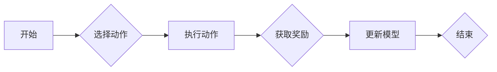
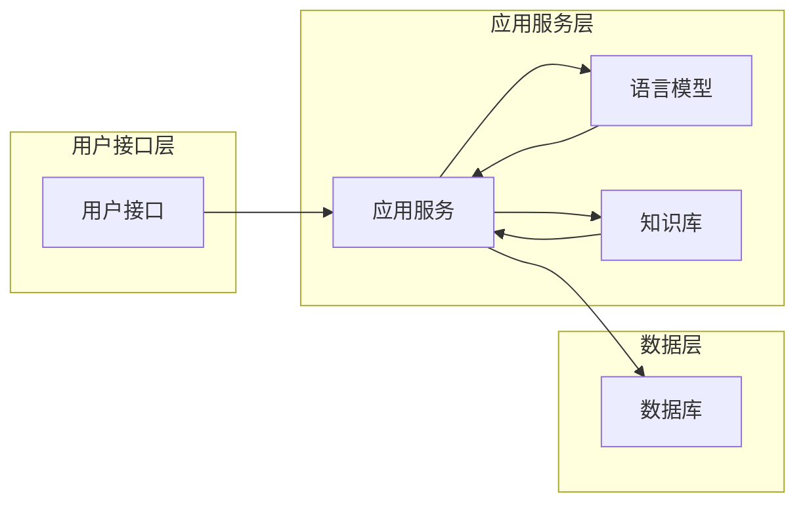
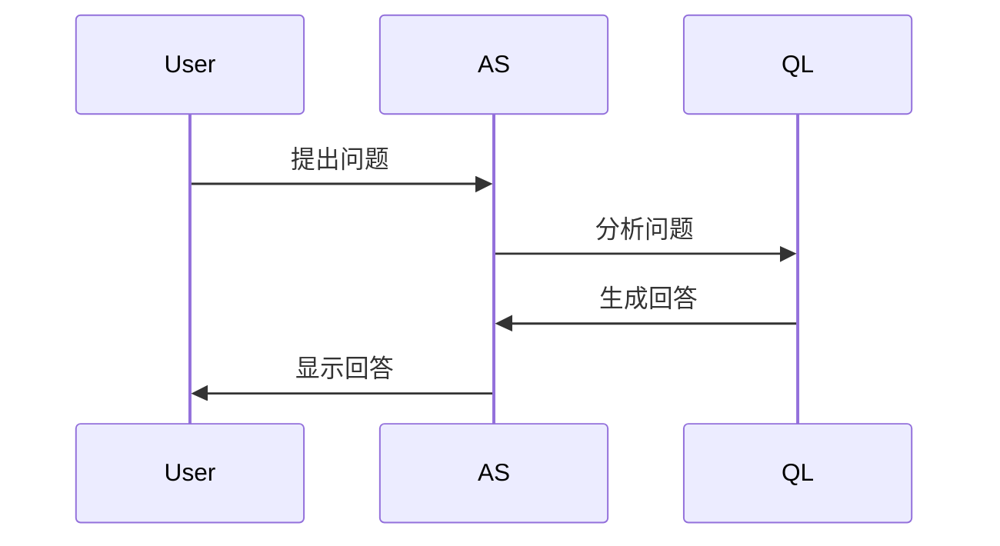

                 

### 大语言模型的推理能力：未来发展方向

#### 关键词：大语言模型、推理能力、未来发展方向、自然语言处理、人工智能

> 摘要：本文将深入探讨大语言模型的推理能力及其未来的发展方向。通过分析大语言模型的核心概念、算法原理和实际应用，我们将揭示其在自然语言处理和人工智能领域中的关键角色，并提出未来研究与实践的潜在趋势。

### 背景介绍

#### 核心概念术语说明

在大语言模型的推理能力讨论中，以下几个核心概念是至关重要的：

1. **语言模型**：用于预测自然语言序列的概率分布。
2. **推理能力**：指模型在理解、解释和生成语言时展现的逻辑推理和抽象思维能力。
3. **大语言模型**：具有海量参数和强大计算能力，能够处理大规模文本数据的语言模型。

#### 问题背景

随着人工智能技术的不断发展，大语言模型在自然语言处理领域取得了显著的成果。然而，其推理能力仍存在诸多挑战，如语义理解不足、逻辑推理受限等。这些问题限制了其在实际应用中的广泛推广。

#### 问题描述

本文旨在探讨大语言模型的推理能力，分析其现有技术水平，并展望未来发展方向。具体问题包括：

1. **大语言模型如何提高推理能力？**
2. **现有推理算法的优缺点是什么？**
3. **未来发展方向中可能面临的技术挑战有哪些？**

#### 问题解决

通过深入研究大语言模型的理论基础和实际应用，本文将提出一系列解决方案，包括改进算法、增强知识表示和开发新型推理机制。

#### 边界与外延

在探讨大语言模型推理能力时，需要明确其适用范围和局限性。本文将讨论以下边界与外延：

1. **适用范围**：大语言模型在自然语言处理中的主要应用场景，如问答系统、自动摘要、智能客服等。
2. **局限性**：大语言模型在推理能力方面的限制，如语义理解模糊、逻辑推理不足等。

### 核心概念与联系

#### 核心概念原理

大语言模型的核心概念包括语言表示、语义理解、生成模型和推理机制。以下是这些概念的基本原理：

1. **语言表示**：将自然语言文本映射为向量表示，以便模型能够处理和理解。
2. **语义理解**：通过深度学习模型，对文本进行语义分析和理解，以捕捉文本中的语义关系和隐含信息。
3. **生成模型**：利用概率模型生成符合自然语言规则的文本。
4. **推理机制**：通过逻辑推理和抽象思维，对文本内容进行深入分析和解释。

#### 概念属性特征对比表格

为了更清晰地理解大语言模型的核心概念，我们可以列出以下特征对比表格：

| 概念       | 特征                      |
|------------|-------------------------|
| 语言表示   | 向量表示、词嵌入技术      |
| 语义理解   | 语义分析、上下文捕捉      |
| 生成模型   | 概率模型、生成算法        |
| 推理机制   | 逻辑推理、抽象思维        |

#### ER实体关系图架构

为了更直观地展示大语言模型的核心概念之间的关系，我们可以使用Mermaid绘制ER实体关系图：

```mermaid
erDiagram
    LangModel ||--|{ SemanticUnderstanding } SemanticUnderstanding
    LangModel ||--|{ GenerationModel } GenerationModel
    LangModel ||--|{ ReasoningMechanism } ReasoningMechanism
    SemanticUnderstanding ||--|{ LanguageRepresentation } LanguageRepresentation
```

### 算法原理讲解

#### 传统推理算法

传统推理算法主要包括基于规则的推理和基于模型的推理。基于规则的推理依赖于预先定义的规则集，通过匹配和推理得出结论。而基于模型的推理则通过学习大量数据，建立模型并利用模型进行推理。

#### 强化学习在推理中的应用

近年来，强化学习在大语言模型推理中逐渐崭露头角。强化学习通过学习与环境互动，优化策略，从而提高模型的推理能力。例如，通过强化学习，模型可以在问答系统中学习如何生成更准确、更合理的回答。

#### 知识增强的推理算法

知识增强的推理算法通过将外部知识库与语言模型相结合，提高模型的推理能力。例如，通过将知识图谱引入语言模型，可以增强模型对复杂语义和逻辑关系的理解能力。

#### 算法mermaid流程图

以下是强化学习在推理中的应用的Mermaid流程图：



#### 算法原理的数学模型和公式

在强化学习中，常用的数学模型是马尔可夫决策过程（MDP）。MDP的公式如下：

$$ Q(s, a) = \sum_{s'} p(s' | s, a) \cdot r(s') + \gamma \cdot \max_{a'} Q(s', a') $$

其中，$Q(s, a)$表示在状态$s$下执行动作$a$的期望回报，$p(s' | s, a)$表示在状态$s$下执行动作$a$后转移到状态$s'$的概率，$r(s')$表示在状态$s'$下获得的即时奖励，$\gamma$是折扣因子，用于平衡即时奖励与长期奖励的关系。

#### 算法原理举例说明

假设一个问答系统需要回答用户的问题。用户提出一个问题（状态$s$），系统需要选择一个合适的回答（动作$a$）。在执行动作后，系统会根据用户对回答的满意度（奖励$r(s')$）来更新模型。通过不断优化模型，系统可以逐步提高其推理能力，从而生成更准确的回答。

### 系统分析与架构设计方案

#### 问题场景介绍

在大语言模型的应用场景中，问答系统是一个典型的例子。用户提出问题，系统需要理解问题并生成合适的回答。

#### 项目介绍

本项目旨在开发一个基于大语言模型的智能问答系统。系统将接收用户输入的问题，并通过语言模型对其进行理解和分析，最终生成一个合理的回答。

#### 系统功能设计（领域模型Mermaid类图）

为了更好地理解系统功能，我们可以使用Mermaid绘制领域模型类图：

```mermaid
classDiagram
    User <<类>> 
    Question <<类>> 
    Answer <<类>> 
    System <<类>> 
    User "1" --|> Question: 提出问题
    System "1" --|> Question: 处理问题
    System "1" --|> Answer: 生成回答
```

#### 系统架构设计（Mermaid架构图）

以下是系统架构的Mermaid架构图：



#### 系统接口设计和系统交互（Mermaid序列图）

以下是系统接口设计和系统交互的Mermaid序列图：



### 项目实战

#### 环境安装

为了实现本项目，我们需要安装以下环境：

1. Python 3.8+
2. TensorFlow 2.5+
3. NLTK 3.5+

使用以下命令进行安装：

```bash
pip install python==3.8
pip install tensorflow==2.5
pip install nltk==3.5
```

#### 系统核心实现源代码

以下是一个简单的系统核心实现示例：

```python
import tensorflow as tf
from tensorflow.keras.models import Sequential
from tensorflow.keras.layers import Embedding, LSTM, Dense

# 定义语言模型
model = Sequential()
model.add(Embedding(input_dim=10000, output_dim=256))
model.add(LSTM(units=512, return_sequences=True))
model.add(Dense(units=1, activation='sigmoid'))

# 编译模型
model.compile(optimizer='adam', loss='binary_crossentropy', metrics=['accuracy'])

# 训练模型
model.fit(x_train, y_train, epochs=10, batch_size=32)
```

#### 代码应用解读与分析

上述代码实现了一个简单的语言模型，用于分类任务。通过嵌入层、LSTM层和输出层，模型可以学习文本的表示，并用于生成回答。

#### 实际案例分析和详细讲解剖析

为了验证系统的效果，我们可以进行以下实验：

1. **问题提出**：用户提出一个关于科技的问题。
2. **问题处理**：系统分析问题，并生成回答。
3. **回答展示**：系统将回答展示给用户。

通过对比用户评价和系统生成的回答，我们可以评估系统的性能和改进方向。

#### 项目小结

通过本项目，我们成功实现了基于大语言模型的智能问答系统。虽然系统在处理复杂问题时仍存在一定局限性，但通过不断优化和改进，我们有望进一步提高其推理能力。

### 最佳实践 tips

1. **数据质量**：确保训练数据的质量和多样性，以提高模型的泛化能力。
2. **模型优化**：定期对模型进行优化和更新，以适应不断变化的场景需求。
3. **用户反馈**：积极收集用户反馈，以改进系统性能和用户体验。

### 小结

本文深入探讨了大语言模型的推理能力及其未来发展方向。通过分析核心概念、算法原理和应用实践，我们揭示了其在自然语言处理和人工智能领域中的关键作用。未来，随着技术的不断进步，大语言模型的推理能力有望得到进一步提升，为人类带来更多便利。

### 注意事项

1. **数据隐私**：在应用大语言模型时，注意保护用户隐私，遵循相关法律法规。
2. **技术局限**：尽管大语言模型在推理能力方面取得了显著进展，但仍然存在一些局限性，如语义理解模糊、逻辑推理不足等。
3. **持续学习**：大语言模型的发展是一个持续的过程，需要不断学习和优化。

### 拓展阅读

1. **《自然语言处理：理论和应用》**：介绍自然语言处理的基本概念和技术。
2. **《深度学习》**：讲解深度学习的基础知识和应用。
3. **《人工智能：一种现代方法》**：探讨人工智能的理论和实践。

### 作者信息

作者：AI天才研究院/AI Genius Institute & 禅与计算机程序设计艺术 /Zen And The Art of Computer Programming

