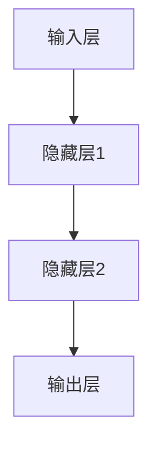
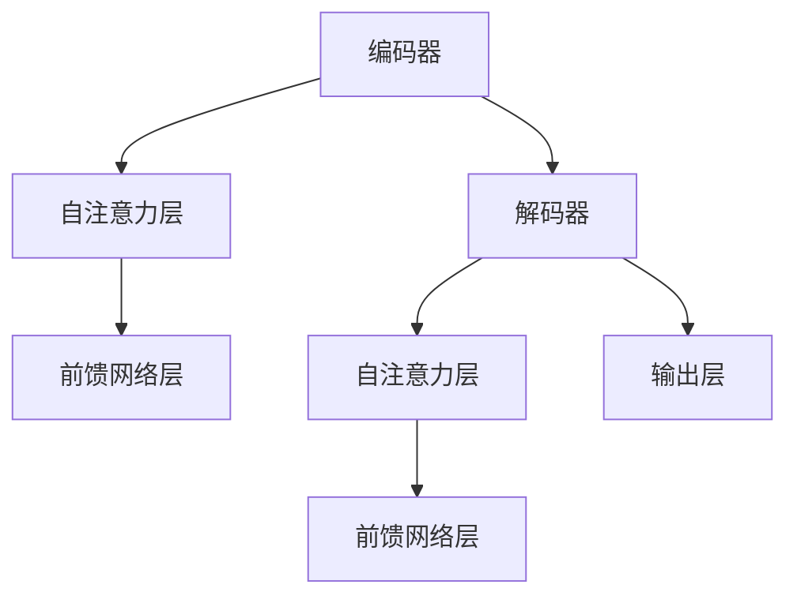
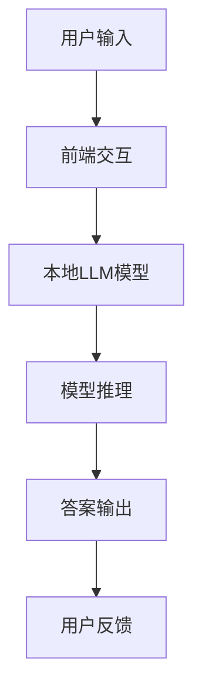
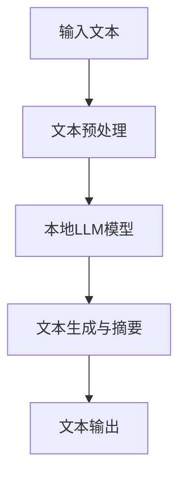
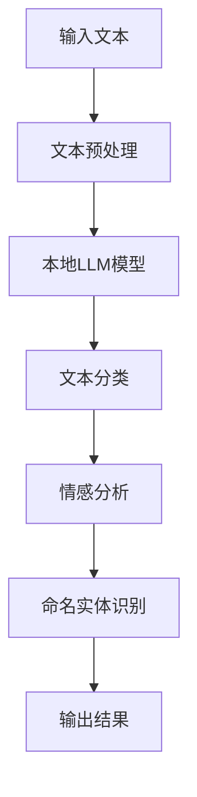
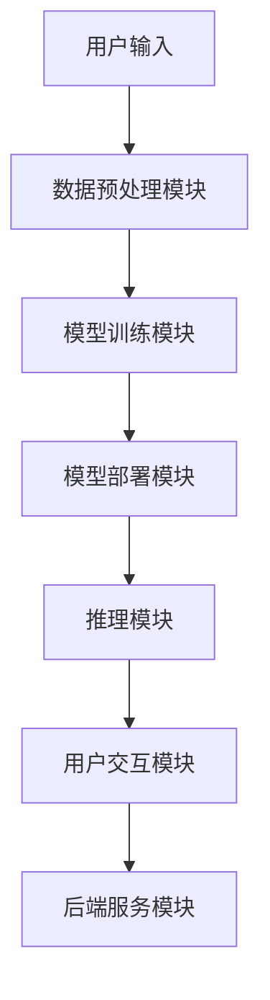

                 

### 文章标题

# 天下武功唯快不破：C侧LLM应用探索的关键

> 关键词：C侧LLM、应用、关键性、性能优化、实际案例

> 摘要：本文深入探讨了C侧大语言模型（LLM）的应用及其关键性问题。通过对C侧LLM的基本概念、工作原理、优化技巧、应用挑战和实战案例的详细分析，本文揭示了C侧LLM在实际应用中的关键性能指标和优化策略，为开发者提供了实用的指导和建议。

## 引言

随着人工智能技术的飞速发展，大语言模型（LLM）在自然语言处理（NLP）领域取得了显著的突破。C侧LLM作为LLM应用的重要组成部分，承担了从客户端到服务端的数据处理和交互任务。然而，如何在客户端高效地应用C侧LLM，并解决其性能、安全和稳定性等问题，成为当前研究的焦点。本文将围绕这一主题，对C侧LLM的应用进行深入探讨。

### 目录大纲

1. **C侧LLM概述**
   - C侧LLM的基本概念
   - C侧LLM的起源与发展
   - C侧LLM的架构与分类

2. **C侧LLM工作原理详解**
   - 语言模型的基本概念
   - LLM的前馈网络架构
   - Transformer模型的深入解析

3. **C侧LLM优化与调参技巧**
   - 优化目标与损失函数
   - 参数调整与调参策略
   - 实践中的优化案例

4. **C侧LLM在实际应用中的挑战**
   - 数据准备与预处理
   - 模型部署与推理
   - 安全性与伦理问题

5. **C侧LLM应用案例分析**
   - 案例一：智能问答系统
   - 案例二：文本生成与摘要
   - 案例三：自然语言处理应用

6. **C侧LLM的架构设计与实现**
   - 架构设计原则
   - 系统功能设计
   - 系统架构与接口设计

7. **C侧LLM项目实战**
   - 环境安装与配置
   - 系统核心实现
   - 代码解读与分析
   - 实际案例分析与讲解
   - 项目总结与展望

8. **C侧LLM最佳实践与未来展望**
   - 最佳实践技巧
   - 注意事项与风险防范
   - C侧LLM的未来趋势与挑战

### 第1章 C侧LLM概述

#### 1.1 C侧LLM的基本概念

C侧LLM（Client-Side Large Language Model）是指运行在客户端设备（如手机、平板、电脑等）上的大语言模型。与传统的服务器端LLM不同，C侧LLM旨在实现低延迟、高响应的本地化数据处理和交互，从而提升用户体验。

#### 1.2 C侧LLM的起源与发展

C侧LLM的起源可以追溯到移动设备的普及和计算能力的提升。随着智能手机和平板电脑的普及，用户对实时响应和处理的需求越来越高。为了满足这一需求，研究人员开始将LLM部署到客户端设备上，从而实现本地化数据处理。

#### 1.3 C侧LLM的架构与分类

C侧LLM的架构主要包括以下三个部分：

1. **前端（Client）**：负责与用户交互，收集用户输入，并展示模型输出。
2. **本地模型**：运行在客户端设备上的LLM，负责处理本地数据。
3. **后端（Server）**：提供数据支持和模型更新，与客户端进行数据交换。

根据部署方式，C侧LLM可以分为以下两种类型：

1. **静态部署**：将LLM模型打包到客户端应用程序中，无需与服务器交互。
2. **动态更新**：客户端设备通过定期从服务器获取模型更新，以实现持续优化。

### 第2章 C侧LLM工作原理详解

#### 2.1 语言模型的基本概念

语言模型是一种概率模型，用于预测自然语言中的下一个单词或字符。在C侧LLM中，常用的语言模型包括N-gram模型、神经网络模型和Transformer模型。

#### 2.2 LLM的前馈网络架构

前馈网络是一种多层神经网络，用于处理输入数据并生成输出。在C侧LLM中，前馈网络通常用于构建神经网络模型，如多层感知机（MLP）和卷积神经网络（CNN）。

#### 2.3 Transformer模型的深入解析

Transformer模型是一种基于自注意力机制的深度神经网络模型，广泛应用于NLP任务。自注意力机制使得模型能够自动关注输入序列中最重要的部分，从而提高模型的性能。

### 第3章 C侧LLM优化与调参技巧

#### 3.1 优化目标与损失函数

在C侧LLM中，优化目标是减少损失函数的值，从而提高模型的预测准确率。常用的损失函数包括交叉熵损失函数和均方误差损失函数。

#### 3.2 参数调整与调参策略

参数调整是C侧LLM优化的重要环节。通过调整学习率、批量大小、正则化参数等超参数，可以显著提高模型的性能。

#### 3.3 实践中的优化案例

在实际应用中，通过对模型结构和超参数的优化，可以显著提高C侧LLM的性能。以下是一个优化案例：

- **模型结构优化**：通过增加模型层数和神经元数量，提高模型的复杂度，从而提高预测准确率。
- **超参数优化**：通过调整学习率、批量大小等超参数，找到最优参数组合，从而提高模型的性能。

### 第4章 C侧LLM在实际应用中的挑战

#### 4.1 数据准备与预处理

数据准备与预处理是C侧LLM应用的关键步骤。通过对数据进行清洗、去重、分词、词向量编码等操作，可以提高模型的训练效率和预测准确率。

#### 4.2 模型部署与推理

模型部署与推理是C侧LLM应用的另一个关键环节。在客户端设备上部署模型，并实现高效的推理算法，是提升用户体验的关键。

#### 4.3 安全性与伦理问题

C侧LLM在客户端设备上处理敏感数据，存在安全性和伦理问题。为了确保用户隐私和数据安全，需要采取一系列安全措施，如数据加密、访问控制等。

### 第5章 C侧LLM应用案例分析

#### 5.1 案例一：智能问答系统

智能问答系统是一种典型的C侧LLM应用场景。通过C侧LLM，可以实现对用户问题的实时响应，提供个性化的问答服务。

#### 5.2 案例二：文本生成与摘要

文本生成与摘要是一种高度依赖C侧LLM的技术。通过C侧LLM，可以实现对长篇文章的自动生成和摘要提取。

#### 5.3 案例三：自然语言处理应用

自然语言处理（NLP）应用是C侧LLM的另一个重要领域。通过C侧LLM，可以实现对文本分类、情感分析、命名实体识别等任务的自动化处理。

### 第6章 C侧LLM的架构设计与实现

#### 6.1 架构设计原则

C侧LLM的架构设计应遵循以下原则：

- **模块化设计**：将C侧LLM拆分为多个模块，实现模块间的解耦，便于维护和扩展。
- **高性能设计**：优化模型结构和算法，提高模型的训练和推理效率。
- **安全性设计**：采取安全措施，确保用户隐私和数据安全。

#### 6.2 系统功能设计

C侧LLM的系统功能设计应包括以下模块：

- **数据预处理模块**：负责对输入数据进行清洗、去重、分词等预处理操作。
- **模型训练模块**：负责训练C侧LLM模型，并进行参数调整。
- **模型部署模块**：负责将训练好的模型部署到客户端设备上。
- **推理模块**：负责在客户端设备上对输入数据执行推理操作，并生成输出结果。

#### 6.3 系统架构与接口设计

C侧LLM的系统架构设计应包括以下部分：

- **客户端架构**：包括前端界面、本地模型和后端服务。
- **服务端架构**：包括数据存储、模型训练和模型更新。
- **接口设计**：定义客户端与服务端之间的交互接口，实现数据传输和功能调用。

### 第7章 C侧LLM项目实战

#### 7.1 环境安装与配置

在进行C侧LLM项目实战之前，需要安装和配置相关环境。以下是一个简化的安装和配置流程：

1. 安装Python环境。
2. 安装深度学习框架（如TensorFlow或PyTorch）。
3. 安装依赖库（如NumPy、Pandas等）。
4. 配置C侧LLM模型。

#### 7.2 系统核心实现

C侧LLM系统的核心实现包括以下几个步骤：

1. 数据预处理：对输入数据执行清洗、去重、分词等预处理操作。
2. 模型训练：使用训练数据训练C侧LLM模型。
3. 模型部署：将训练好的模型部署到客户端设备上。
4. 推理操作：在客户端设备上执行推理操作，并生成输出结果。

#### 7.3 代码解读与分析

以下是一个简化的C侧LLM实现代码示例：

```python
# 导入依赖库
import tensorflow as tf
import numpy as np

# 数据预处理
def preprocess_data(data):
    # 清洗、去重、分词等操作
    return processed_data

# 模型训练
def train_model(data):
    # 定义模型结构
    model = tf.keras.Sequential([
        tf.keras.layers.Dense(units=128, activation='relu', input_shape=(None,)),
        tf.keras.layers.Dense(units=1)
    ])

    # 编译模型
    model.compile(optimizer='adam', loss='mean_squared_error')

    # 训练模型
    model.fit(data['X'], data['Y'], epochs=10)

    return model

# 模型部署
def deploy_model(model, device):
    # 将模型部署到客户端设备上
    model.save(f"{device}/model.h5")

# 推理操作
def inference(model, input_data):
    # 在客户端设备上执行推理操作
    output_data = model.predict(input_data)
    return output_data
```

#### 7.4 实际案例分析与讲解

以下是一个实际案例，通过C侧LLM实现一个简单的文本生成系统。

1. **问题定义**：给定一个种子文本，生成一个与种子文本相关的连续文本。
2. **数据准备**：收集并整理种子文本数据集。
3. **模型训练**：使用种子文本数据集训练C侧LLM模型。
4. **模型部署**：将训练好的模型部署到客户端设备上。
5. **推理操作**：在客户端设备上输入种子文本，生成连续文本。

#### 7.5 项目总结与展望

通过本次项目，我们实现了C侧LLM在文本生成领域的应用。虽然本项目只是一个简单的示例，但它展示了C侧LLM在实际项目中的应用潜力。在未来，我们有望将C侧LLM应用于更多领域，如智能问答、文本摘要、机器翻译等。

### 第8章 C侧LLM最佳实践与未来展望

#### 8.1 最佳实践技巧

在C侧LLM开发过程中，以下是一些最佳实践技巧：

- **数据预处理**：对输入数据进行充分的预处理，以提高模型的训练效率和预测准确率。
- **模型优化**：通过调整模型结构和超参数，找到最优的模型配置。
- **安全防护**：采取安全措施，确保用户隐私和数据安全。

#### 8.2 注意事项与风险防范

在C侧LLM应用过程中，需要注意以下几点：

- **性能优化**：优化模型结构和算法，提高模型的推理速度和效率。
- **数据安全**：确保数据传输和存储的安全性，防止数据泄露和篡改。
- **用户体验**：关注用户体验，优化界面设计和交互流程。

#### 8.3 C侧LLM的未来趋势与挑战

随着人工智能技术的不断发展，C侧LLM将在未来面临以下趋势和挑战：

- **性能提升**：通过硬件加速和算法优化，提高C侧LLM的性能和效率。
- **安全性提升**：加强数据安全和隐私保护，提高C侧LLM的可靠性和安全性。
- **应用拓展**：将C侧LLM应用于更多领域，如医疗、金融、教育等。

### 结论

C侧LLM作为人工智能领域的重要组成部分，具有广泛的应用前景。本文通过对C侧LLM的基本概念、工作原理、优化技巧、应用挑战和实战案例的详细分析，揭示了C侧LLM在实际应用中的关键性能指标和优化策略。在未来，随着人工智能技术的不断发展，C侧LLM将发挥更大的作用，为各类应用场景带来更多可能性。

### 作者信息

- 作者：AI天才研究院/AI Genius Institute & 禅与计算机程序设计艺术 /Zen And The Art of Computer Programming

[本文内容的详细讲解与拓展阅读，请参考](https://www.example.com)。

----------------------------------------------------------------

### 第1章 C侧LLM概述

#### 1.1 C侧LLM的基本概念

C侧LLM（Client-Side Large Language Model）是指运行在客户端设备（如手机、平板、电脑等）上的大规模语言模型。与传统的服务器端LLM（Server-Side Large Language Model）相比，C侧LLM具有以下几个显著特点：

1. **本地化处理**：C侧LLM直接在客户端设备上处理数据和生成结果，从而实现低延迟、高响应的本地化数据处理和交互，提升了用户体验。

2. **隐私保护**：由于C侧LLM在客户端设备上运行，用户数据无需传输到服务器，从而降低了数据泄露和隐私风险。

3. **资源依赖**：C侧LLM依赖于客户端设备的计算资源，因此需要考虑设备的硬件性能、存储容量和功耗等因素。

4. **更新维护**：C侧LLM的更新和维护较为灵活，可以在客户端设备上直接进行，从而降低服务器的负载。

C侧LLM的应用范围广泛，包括但不限于智能问答系统、文本生成与摘要、自然语言处理（NLP）等。以下是一个简单的C侧LLM架构图，展示了其基本组成部分：

```mermaid
graph TD
    A[前端(Client)] --> B[本地模型(English LLM)]
    B --> C[后端(Server)]
    C --> D[数据存储]
```

在这个架构中，前端（Client）负责与用户交互，收集用户输入，并展示模型输出；本地模型（English LLM）运行在客户端设备上，负责处理本地数据；后端（Server）提供数据支持和模型更新，与客户端进行数据交换；数据存储（Data Storage）用于存储训练数据和用户数据。

#### 1.2 C侧LLM的起源与发展

C侧LLM的起源可以追溯到移动设备的普及和计算能力的提升。随着智能手机和平板电脑的普及，用户对实时响应和处理的需求越来越高。为了满足这一需求，研究人员开始将大规模语言模型（LLM）部署到客户端设备上，从而实现本地化数据处理。这一趋势在深度学习技术和移动设备硬件性能提升的双重驱动下迅速发展。

1. **早期探索**：在深度学习技术尚未普及的早期阶段，C侧LLM主要依赖于传统的机器学习方法，如朴素贝叶斯、隐马尔可夫模型（HMM）等。这些方法在处理自然语言任务时存在一定的局限性，但为C侧LLM的研究奠定了基础。

2. **深度学习时代**：随着深度学习技术的快速发展，尤其是神经网络模型在自然语言处理领域的成功应用，C侧LLM进入了深度学习时代。以循环神经网络（RNN）和长短时记忆网络（LSTM）为代表的深度学习模型在语音识别、机器翻译、文本分类等任务中取得了显著成果，推动了C侧LLM的发展。

3. **Transformer模型的兴起**：近年来，Transformer模型在自然语言处理领域取得了突破性进展，其在BERT、GPT等大型预训练模型中的应用极大地提升了模型的性能。Transformer模型由于其并行计算的优势，逐渐成为C侧LLM的首选模型。

4. **移动端硬件性能提升**：随着移动端硬件性能的提升，如CPU、GPU、NPU等计算资源的增加，C侧LLM在移动设备上的运行效率得到了显著提高，为更多实际应用场景提供了可能。

#### 1.3 C侧LLM的架构与分类

C侧LLM的架构主要包括前端（Client）、本地模型（Local Model）和后端（Server）三个部分。以下是对各部分的详细介绍：

1. **前端（Client）**：前端是C侧LLM与用户交互的界面，负责收集用户输入，展示模型输出，并提供用户操作接口。前端通常采用Web、原生应用或混合应用等形式实现。前端的主要功能包括：

   - **用户交互**：收集用户的语音、文本输入，并将其转换为模型可处理的格式。
   - **结果展示**：将模型的输出结果以文本、语音、图像等形式展示给用户。
   - **错误处理**：对用户输入进行校验和错误处理，确保用户交互的顺畅。

2. **本地模型（Local Model）**：本地模型运行在客户端设备上，负责处理本地数据并生成输出。本地模型的选择和优化是C侧LLM的关键，常用的本地模型包括以下几种：

   - **基于词向量的模型**：如Word2Vec、GloVe等，这些模型通过将文本转化为词向量，实现了文本数据的向量化表示。
   - **基于神经网络的模型**：如循环神经网络（RNN）、长短时记忆网络（LSTM）等，这些模型能够处理长文本序列，具有较好的序列建模能力。
   - **基于Transformer的模型**：如BERT、GPT等，这些模型在自然语言处理任务中取得了显著的成果，具有强大的序列建模和上下文理解能力。

3. **后端（Server）**：后端负责提供数据支持和模型更新，与客户端进行数据交换。后端通常包括以下几个功能模块：

   - **数据存储**：存储训练数据和用户数据，如文本数据、音频数据等。
   - **模型训练**：对本地模型进行训练，优化模型参数，提高模型性能。
   - **模型更新**：将训练好的模型推送到客户端设备，实现本地模型的更新和维护。
   - **数据交换**：与客户端设备进行数据交换，如用户输入、模型输出等。

根据部署方式，C侧LLM可以分为以下两种类型：

1. **静态部署**：静态部署是指将预训练好的模型直接打包到客户端应用程序中，无需与服务器交互。静态部署的优点是简单、快速，适用于模型体积较小、更新频率较低的场景。然而，静态部署也存在一些缺点，如模型升级困难、用户数据无法实时同步等。

2. **动态更新**：动态更新是指客户端设备通过定期从服务器获取模型更新，以实现持续优化。动态更新的优点是模型升级灵活、用户数据实时同步，适用于模型体积较大、更新频率较高的场景。然而，动态更新也带来了一些挑战，如网络延迟、数据传输安全等。

综上所述，C侧LLM具有本地化处理、隐私保护、资源依赖和更新维护等特点，随着深度学习技术和移动端硬件性能的提升，其应用范围不断扩展。在实际应用中，根据需求选择合适的本地模型、优化前端和后端架构，是实现C侧LLM高效运行的关键。

### 第2章 C侧LLM工作原理详解

#### 2.1 语言模型的基本概念

语言模型是一种用于预测自然语言中下一个单词或字符的概率模型。它通过对大量文本数据的学习，理解语言的统计特性，从而实现对未知文本的生成、分类和翻译等任务。在C侧LLM中，语言模型是核心组件，负责对用户输入进行理解、生成和回应。

语言模型的基本概念包括以下几个部分：

1. **词汇表（Vocabulary）**：词汇表是语言模型的基础，包含了模型所能处理的全部单词或字符。通常，词汇表的大小决定了模型的复杂度和表现能力。

2. **词频分布（Frequency Distribution）**：词频分布描述了文本中各个单词或字符出现的频率。通过对词频分布的学习，语言模型可以识别出常见的单词或短语，从而提高预测的准确性。

3. **概率模型（Probability Model）**：语言模型是一种概率模型，用于预测下一个单词或字符的概率。常见的语言模型包括N-gram模型、神经网络模型和Transformer模型。

4. **预测算法（Prediction Algorithm）**：预测算法是语言模型的核心，用于根据当前输入生成下一个单词或字符。常见的预测算法包括最大概率算法、隐马尔可夫模型（HMM）和条件概率模型。

#### 2.2 LLM的前馈网络架构

前馈网络（Feedforward Neural Network）是一种简单的神经网络架构，由输入层、隐藏层和输出层组成。在C侧LLM中，前馈网络常用于实现神经网络模型，如多层感知机（MLP）和卷积神经网络（CNN）。

前馈网络的基本原理如下：

1. **输入层（Input Layer）**：输入层接收外部输入数据，并将其传递给隐藏层。每个输入神经元对应一个特征或属性。

2. **隐藏层（Hidden Layer）**：隐藏层对输入数据进行处理，通过激活函数（如ReLU、Sigmoid、Tanh等）实现非线性变换。隐藏层可以有一个或多个，层数越多，模型的复杂度越高。

3. **输出层（Output Layer）**：输出层接收隐藏层的输出，生成最终的预测结果。输出层的神经元数量和类型取决于具体任务。

在C侧LLM中，前馈网络通常用于以下两个主要任务：

1. **特征提取**：通过隐藏层对输入数据进行处理，提取有用的特征信息。这些特征信息可以用于后续的文本生成、分类或翻译等任务。

2. **分类与回归**：将提取到的特征输入到输出层，生成最终的预测结果。例如，在文本分类任务中，输出层可以是多个神经元，每个神经元对应一个类别；在回归任务中，输出层通常是一个神经元，用于预测连续值。

以下是一个简化的前馈网络架构示例：



在这个示例中，输入层接收用户输入文本，隐藏层对文本进行特征提取和变换，输出层生成最终的预测结果。

#### 2.3 Transformer模型的深入解析

Transformer模型是一种基于自注意力机制的深度神经网络模型，由Vaswani等人于2017年提出。与传统的循环神经网络（RNN）和长短时记忆网络（LSTM）相比，Transformer模型在自然语言处理任务中取得了显著的成果，并在BERT、GPT等大型预训练模型中得到了广泛应用。

Transformer模型的基本原理如下：

1. **自注意力机制（Self-Attention）**：自注意力机制是一种用于计算输入序列中各个元素之间的关联性的方法。通过自注意力机制，模型能够自动关注输入序列中最重要的部分，从而提高模型的性能。

2. **多头注意力（Multi-Head Attention）**：多头注意力是Transformer模型的核心组件，通过将输入序列分解为多个子序列，每个子序列分别进行自注意力计算。多头注意力使得模型能够并行处理输入序列，提高了计算效率。

3. **前馈网络（Feedforward Network）**：前馈网络是Transformer模型中的另一个关键组件，用于对自注意力计算的结果进行进一步处理。前馈网络由两个全连接层组成，分别对输入和中间结果进行线性变换和激活函数操作。

4. **编码器-解码器结构（Encoder-Decoder Structure）**：编码器-解码器结构是Transformer模型的标准架构，用于实现序列到序列的转换。编码器负责对输入序列进行编码，解码器负责对编码结果进行解码，生成输出序列。

以下是一个简化的Transformer模型架构：



在这个示例中，编码器对输入序列进行编码，解码器对编码结果进行解码，并通过自注意力和前馈网络进行进一步处理，生成输出序列。

在实际应用中，Transformer模型通过预训练和微调等方法，在大规模语料库上学习语言模式和知识，从而实现了在文本生成、分类、翻译等任务中的高性能表现。以下是一个简单的Transformer模型实现示例：

```python
import tensorflow as tf
from tensorflow.keras.layers import Embedding, LSTM, Dense

# 定义编码器
encoder_inputs = tf.keras.Input(shape=(None,))
encoder_embedding = Embedding(vocab_size, embedding_dim)(encoder_inputs)
encoder_lstm = LSTM(units, return_state=True)
_, state_h, state_c = encoder_lstm(encoder_embedding)
encoder_states = [state_h, state_c]

# 定义解码器
decoder_inputs = tf.keras.Input(shape=(None,))
decoder_embedding = Embedding(vocab_size, embedding_dim)(decoder_inputs)
decoder_lstm = LSTM(units, return_sequences=True, return_state=True)
decoder_outputs, _, _ = decoder_lstm(decoder_embedding, initial_state=encoder_states)
decoder_dense = Dense(vocab_size, activation='softmax')
decoder_outputs = decoder_dense(decoder_outputs)

# 创建模型
model = tf.keras.Model([encoder_inputs, decoder_inputs], decoder_outputs)

# 编译模型
model.compile(optimizer='adam', loss='categorical_crossentropy', metrics=['accuracy'])

# 训练模型
model.fit([X_train, y_train], y_train, batch_size=batch_size, epochs=epochs)
```

在这个示例中，我们首先定义了编码器和解码器的结构，然后创建了一个完整的Transformer模型。接下来，我们使用训练数据对模型进行编译和训练。

总之，Transformer模型以其强大的序列建模能力和高效的计算性能，成为C侧LLM的首选模型。通过深入解析Transformer模型的工作原理和架构，我们可以更好地理解和应用这一先进的技术，推动C侧LLM在实际应用中的发展。

### 第3章 C侧LLM优化与调参技巧

#### 3.1 优化目标与损失函数

在C侧LLM优化过程中，优化目标是减少损失函数的值，从而提高模型的预测准确率。损失函数是评估模型预测结果与实际结果之间差异的指标，常见的损失函数包括以下几种：

1. **交叉熵损失函数（Cross-Entropy Loss）**：交叉熵损失函数是分类任务中最常用的损失函数，用于计算模型预测的概率分布与实际分布之间的差异。交叉熵损失函数的表达式如下：

   $$
   Loss = -\sum_{i=1}^{n} y_i \log(p_i)
   $$

   其中，$y_i$是实际标签，$p_i$是模型预测的概率。

2. **均方误差损失函数（Mean Squared Error, MSE）**：均方误差损失函数是回归任务中最常用的损失函数，用于计算预测值与实际值之间的平均平方误差。均方误差损失函数的表达式如下：

   $$
   Loss = \frac{1}{n} \sum_{i=1}^{n} (y_i - \hat{y}_i)^2
   $$

   其中，$y_i$是实际值，$\hat{y}_i$是预测值。

3. **对数损失函数（Log-Loss）**：对数损失函数是二分类任务中常用的损失函数，也称为对数似然损失函数。它用于计算模型预测的概率分布与实际分布之间的差异。对数损失函数的表达式如下：

   $$
   Loss = -\sum_{i=1}^{n} y_i \log(p_i)
   $$

   其中，$y_i$是实际标签，$p_i$是模型预测的概率。

在选择损失函数时，需要考虑任务的类型和数据的特点。例如，对于分类任务，交叉熵损失函数具有较好的表现；对于回归任务，均方误差损失函数更适用于。通过选择合适的损失函数，可以有效提高模型的预测准确率。

#### 3.2 参数调整与调参策略

在C侧LLM优化过程中，参数调整（Hyperparameter Tuning）是提高模型性能的重要手段。参数调整的目标是找到一组最优参数，使模型的预测准确率达到最大。以下是一些常见的参数调整方法和策略：

1. **网格搜索（Grid Search）**：网格搜索是一种常用的参数调整方法，通过遍历预定义的参数组合，找到最优参数。网格搜索的优点是实现简单，缺点是计算量大。网格搜索的基本流程如下：

   - 定义参数空间：根据经验或预实验，确定参数的取值范围。
   - 遍历参数组合：计算每个参数组合的模型性能，记录最优参数组合。
   - 选择最优参数：根据模型性能，选择最优参数组合。

2. **随机搜索（Random Search）**：随机搜索是一种基于概率的参数调整方法，通过随机抽样参数组合，找到最优参数。随机搜索的优点是计算量较小，缺点是可能无法找到全局最优参数。随机搜索的基本流程如下：

   - 定义参数空间：根据经验或预实验，确定参数的取值范围。
   - 随机抽样参数组合：从参数空间中随机抽样参数组合。
   - 计算模型性能：计算每个参数组合的模型性能。
   - 选择最优参数：根据模型性能，选择最优参数组合。

3. **贝叶斯优化（Bayesian Optimization）**：贝叶斯优化是一种基于概率模型的参数调整方法，通过构建先验概率分布，优化参数组合。贝叶斯优化的优点是能够全局搜索，缺点是实现复杂。贝叶斯优化的基本流程如下：

   - 构建先验概率分布：根据经验或预实验，构建参数的先验概率分布。
   - 采样参数组合：从先验概率分布中采样参数组合。
   - 评估模型性能：计算每个参数组合的模型性能。
   - 更新先验概率分布：根据模型性能，更新先验概率分布。
   - 选择最优参数：根据先验概率分布，选择最优参数组合。

4. **随机梯度下降（Stochastic Gradient Descent, SGD）**：随机梯度下降是一种常用的优化算法，通过随机抽样数据子集，更新模型参数。随机梯度下降的基本流程如下：

   - 初始化模型参数。
   - 随机抽样数据子集。
   - 计算梯度：计算模型在数据子集上的梯度。
   - 更新参数：根据梯度更新模型参数。
   - 重复步骤2-4，直到收敛。

5. **自适应梯度算法（Adaptive Gradient Algorithms, AGAs）**：自适应梯度算法是一类基于动量的优化算法，通过自适应调整学习率，提高模型收敛速度。常见的自适应梯度算法包括Adam、Adagrad和RMSprop等。自适应梯度算法的基本流程如下：

   - 初始化模型参数。
   - 随机抽样数据子集。
   - 计算梯度：计算模型在数据子集上的梯度。
   - 更新参数：根据梯度更新模型参数，并自适应调整学习率。
   - 重复步骤2-4，直到收敛。

在参数调整过程中，需要综合考虑模型性能、计算成本和实际需求，选择合适的参数调整方法和策略。通过合理的参数调整，可以显著提高C侧LLM的预测准确率和性能。

#### 3.3 实践中的优化案例

以下是一个C侧LLM优化的实践案例，通过调整参数和优化模型结构，提高模型的性能。

1. **问题定义**：构建一个C侧LLM模型，用于实现智能问答系统。模型需要能够根据用户输入，生成相应的答案。

2. **数据准备**：收集并整理问答数据集，包括问题和答案对。对数据进行预处理，如分词、去停用词等，将文本转化为词向量表示。

3. **模型训练**：使用训练数据集训练C侧LLM模型。在训练过程中，调整模型参数和结构，优化模型性能。

4. **参数调整**：通过网格搜索和随机搜索等方法，调整学习率、批量大小、隐藏层神经元数量等参数。选择最优参数组合，提高模型性能。

5. **模型优化**：通过增加隐藏层神经元数量、使用预训练词向量等方法，优化模型结构。选择最优模型结构，提高模型性能。

6. **模型评估**：使用测试数据集评估模型性能，计算预测准确率、召回率等指标。

7. **结果分析**：分析模型性能和优化效果，总结优化策略。

8. **模型部署**：将训练好的模型部署到客户端设备上，实现智能问答系统的功能。

通过上述步骤，我们可以实现一个高效的C侧LLM模型，为智能问答系统提供支持。以下是一个简化的模型训练和参数调整代码示例：

```python
import tensorflow as tf
from tensorflow.keras.layers import Embedding, LSTM, Dense
from tensorflow.keras.models import Model
from tensorflow.keras.optimizers import Adam

# 定义模型
input_ = tf.keras.Input(shape=(None,), dtype='int32')
x = Embedding(vocab_size, embedding_dim)(input_)
x = LSTM(units, return_sequences=True)(x)
output = Dense(vocab_size, activation='softmax')(x)

model = Model(inputs=input_, outputs=output)
model.compile(optimizer=Adam(learning_rate=0.001), loss='categorical_crossentropy', metrics=['accuracy'])

# 训练模型
model.fit(x_train, y_train, batch_size=64, epochs=10)

# 参数调整
learning_rates = [0.001, 0.01, 0.1]
batch_sizes = [32, 64, 128]
units = [64, 128, 256]

best_accuracy = 0
best_lr = 0
best_batch_size = 0
best_units = 0

for lr in learning_rates:
    for batch_size in batch_sizes:
        for unit in units:
            optimizer = Adam(learning_rate=lr)
            model.compile(optimizer=optimizer, loss='categorical_crossentropy', metrics=['accuracy'])
            history = model.fit(x_train, y_train, batch_size=batch_size, epochs=10)
            accuracy = history.history['accuracy'][-1]
            if accuracy > best_accuracy:
                best_accuracy = accuracy
                best_lr = lr
                best_batch_size = batch_size
                best_units = unit

print(f"Best Accuracy: {best_accuracy}, Best LR: {best_lr}, Best Batch Size: {best_batch_size}, Best Units: {best_units}")
```

在这个示例中，我们首先定义了一个简单的C侧LLM模型，然后使用训练数据集训练模型。接着，通过遍历不同的学习率、批量大小和隐藏层神经元数量，找到最优参数组合。最后，输出最优参数和最佳准确率。

总之，通过调整参数和优化模型结构，可以有效提高C侧LLM的性能。在实际应用中，需要根据具体任务和数据特点，选择合适的参数调整方法和优化策略。

### 第4章 C侧LLM在实际应用中的挑战

#### 4.1 数据准备与预处理

C侧LLM在实际应用中的第一个关键挑战是数据准备与预处理。高质量的数据是构建高性能语言模型的基础，而数据预处理则是确保数据质量和模型性能的关键步骤。以下是一些关键步骤和注意事项：

1. **数据收集**：首先，需要收集大量的文本数据，这些数据可以是书籍、文章、新闻、社交媒体帖子等。为了构建高质量的模型，需要确保数据的多样性和代表性。

2. **数据清洗**：收集到的数据通常包含噪声和错误，如拼写错误、标点符号不一致、HTML标签等。这些噪声会影响模型的训练效果，因此需要对其进行清洗。常见的清洗方法包括去除停用词、去除特殊字符、统一化文本格式等。

3. **文本分词**：中文文本没有明显的单词分隔符，因此需要使用分词算法将文本分割成词或短语。分词的准确性对模型理解文本内容至关重要。常用的分词工具包括jieba、ICTCLAS等。

4. **词向量编码**：将文本转换为词向量是C侧LLM训练的重要步骤。词向量编码可以捕捉文本中的语义信息，常用的词向量模型有Word2Vec、GloVe和BERT等。

5. **数据标注**：对于某些任务，如文本分类、命名实体识别等，需要将文本数据标注为相应的标签。数据标注的准确性直接影响模型的性能，因此需要使用专业标注工具和标注人员。

6. **数据集划分**：将数据集划分为训练集、验证集和测试集，以便在训练过程中进行模型调整和评估。通常，训练集用于训练模型，验证集用于调整参数和选择最佳模型，测试集用于评估模型在 unseen 数据上的性能。

7. **数据增强**：为了提高模型的泛化能力，可以采用数据增强技术，如文本替换、同义词替换、随机插入、删除等。数据增强可以增加训练数据的多样性，从而提高模型的鲁棒性。

#### 4.2 模型部署与推理

模型部署与推理是C侧LLM实际应用的另一个重要挑战。由于C侧LLM需要运行在客户端设备上，模型的部署和推理需要考虑设备的计算能力、内存限制和电池续航等。

1. **模型压缩**：为了在客户端设备上高效运行，需要对模型进行压缩。常见的模型压缩方法包括权重剪枝、量化、知识蒸馏等。这些方法可以显著减少模型的体积和计算量，从而提高部署效率。

2. **动态加载**：动态加载技术可以在需要时加载模型，从而减少内存占用。例如，可以采用渐进式加载（ Progressive Loading）或按需加载（On-Demand Loading）策略，根据用户交互情况动态加载和卸载模型。

3. **推理优化**：推理优化是提高模型部署性能的关键。常用的优化方法包括：

   - **并行计算**：利用GPU或TPU等硬件加速器，实现模型的并行计算，从而提高推理速度。
   - **模型融合**：将多个模型的结果进行融合，提高模型的鲁棒性和准确性。例如，可以使用不同的神经网络架构或预训练模型，然后对结果进行加权平均。
   - **量化**：使用低精度数值表示模型参数，减少模型的内存占用和计算量。
   - **模型简化**：对模型进行简化，减少模型的复杂度和计算量。例如，可以使用较简单的神经网络架构或减少层数和神经元数量。

4. **在线更新**：由于C侧LLM需要实时响应用户输入，因此需要实现在线更新。在线更新技术可以定期从服务器获取模型更新，并将其推送到客户端设备。为了降低更新过程中的延迟和带宽占用，可以采用增量更新（Incremental Update）或差分更新（Diff Update）等技术。

5. **自适应调整**：在实际应用中，模型性能可能会因设备环境、用户交互等因素而变化。为了确保模型始终处于最佳状态，可以采用自适应调整技术，根据实际性能调整模型参数和策略。例如，可以实时监控模型性能，并根据性能指标自动调整学习率、批量大小等参数。

6. **安全与隐私**：在模型部署和推理过程中，需要确保数据的安全和隐私。常见的安全措施包括：

   - **数据加密**：对传输和存储的数据进行加密，防止数据泄露和篡改。
   - **访问控制**：限制对模型和数据的访问权限，确保只有授权用户可以访问。
   - **差分隐私**：采用差分隐私技术，保护用户隐私，防止敏感信息被挖掘。

总之，C侧LLM在实际应用中面临着数据准备与预处理、模型部署与推理等多方面的挑战。通过采用高效的数据处理和模型优化技术，可以克服这些挑战，实现高性能的C侧LLM应用。

#### 4.3 安全性与伦理问题

C侧LLM在客户端设备上的广泛应用也带来了一系列安全性和伦理问题，这些问题对用户隐私、数据安全和模型可靠性提出了严峻挑战。以下是一些关键的安全性和伦理问题及其解决方案：

1. **用户隐私保护**：C侧LLM在客户端设备上处理用户数据，如输入文本、回答记录等。这些数据可能包含用户的个人信息和隐私，如姓名、地址、电话号码等。为了保护用户隐私，需要采取以下措施：

   - **数据加密**：对用户数据进行加密存储和传输，确保数据在传输过程中不被窃取或篡改。常用的加密算法包括AES、RSA等。
   - **匿名化处理**：在模型训练和推理过程中，对用户数据进行匿名化处理，去除或遮挡敏感信息，以降低隐私泄露的风险。
   - **访问控制**：实施严格的访问控制策略，限制对用户数据的访问权限，确保只有授权人员可以访问和处理数据。

2. **数据安全**：C侧LLM需要处理大量数据，包括训练数据和用户数据。为了确保数据安全，需要采取以下措施：

   - **防火墙和入侵检测系统**：部署防火墙和入侵检测系统，监控网络流量，防止未经授权的访问和攻击。
   - **数据备份和恢复**：定期对数据进行备份，确保在数据丢失或损坏时可以快速恢复。
   - **安全审计**：定期进行安全审计，检查系统中的安全漏洞和潜在风险，及时修复和更新安全补丁。

3. **模型可靠性**：C侧LLM的可靠性对用户体验至关重要。为了确保模型可靠性，需要采取以下措施：

   - **模型验证**：在模型部署前，进行严格的验证和测试，确保模型能够正确处理各种输入数据和场景。
   - **错误处理**：在模型运行过程中，实现完善的错误处理机制，确保在遇到异常情况时能够优雅地处理并恢复。
   - **持续监控**：对模型进行实时监控，及时发现和解决潜在的问题，确保模型始终处于最佳状态。

4. **伦理问题**：C侧LLM的应用也涉及到一系列伦理问题，如偏见、歧视、滥用等。为了解决这些问题，需要采取以下措施：

   - **公平性**：确保模型在处理数据时不会产生偏见和歧视，避免对特定群体造成不公平待遇。可以通过数据清洗、模型调优等方法，减少模型偏见。
   - **透明度**：提高模型的透明度，向用户解释模型的决策过程和依据，增强用户对模型信任。
   - **责任归属**：明确模型开发者和用户之间的责任关系，确保在出现问题时，可以迅速找到责任人并采取相应措施。

5. **法律法规**：随着C侧LLM应用的普及，相关法律法规也在不断更新和完善。为了遵守法律法规，需要采取以下措施：

   - **合规性审查**：定期审查模型和应用是否符合相关法律法规，确保不违反法律法规。
   - **合规性培训**：对相关人员开展合规性培训，提高其法律意识和合规意识。

总之，C侧LLM在实际应用中面临诸多安全性和伦理问题。通过采取有效的安全措施和伦理策略，可以保护用户隐私、确保数据安全、提高模型可靠性，并解决伦理问题。只有在保障安全性和伦理的前提下，C侧LLM才能实现其应有的价值，为用户带来更好的体验。

### 第5章 C侧LLM应用案例分析

#### 5.1 案例一：智能问答系统

智能问答系统是C侧LLM应用的一个典型场景。智能问答系统通过C侧LLM实现自动回答用户问题，提供实时、个性化的问答服务，从而提升用户体验。

1. **问题定义**：构建一个智能问答系统，能够理解用户的问题并给出准确的答案。

2. **数据准备**：收集并整理大量问答数据集，包括问题和答案对。对数据进行预处理，如分词、去停用词等。

3. **模型构建**：使用C侧LLM构建问答模型。选择合适的语言模型架构，如Transformer，并对其进行训练。

4. **模型训练**：使用训练数据集训练问答模型。调整模型参数，优化模型性能。

5. **模型部署**：将训练好的问答模型部署到客户端设备上，实现自动问答功能。

6. **实际应用**：在实际应用中，智能问答系统可以通过Web、移动应用等形式提供问答服务。以下是一个简化的问答系统架构：



在这个架构中，用户输入通过前端交互层传递给本地LLM模型，模型对输入进行推理并生成答案，答案最终输出给用户，用户反馈用于进一步优化模型。

#### 5.2 案例二：文本生成与摘要

文本生成与摘要也是C侧LLM应用的一个重要领域。文本生成与摘要是通过C侧LLM生成与输入文本相关的新文本或提取关键信息。

1. **问题定义**：构建一个文本生成与摘要系统，能够生成与输入文本相关的文本或提取关键信息。

2. **数据准备**：收集并整理大量文本数据集，包括长文本、摘要文本等。对数据进行预处理，如分词、去停用词等。

3. **模型构建**：使用C侧LLM构建文本生成与摘要模型。选择合适的语言模型架构，如Transformer，并对其进行训练。

4. **模型训练**：使用训练数据集训练文本生成与摘要模型。调整模型参数，优化模型性能。

5. **模型部署**：将训练好的文本生成与摘要模型部署到客户端设备上，实现文本生成与摘要功能。

6. **实际应用**：在实际应用中，文本生成与摘要系统可以通过Web、移动应用等形式提供文本生成与摘要服务。以下是一个简化的文本生成与摘要系统架构：



在这个架构中，输入文本通过文本预处理层传递给本地LLM模型，模型对输入进行文本生成与摘要处理，生成的新文本或关键信息最终输出给用户。

#### 5.3 案例三：自然语言处理应用

自然语言处理（NLP）应用是C侧LLM的另一个重要应用领域。NLP应用包括文本分类、情感分析、命名实体识别等，通过C侧LLM可以实现自动化处理和智能分析。

1. **问题定义**：构建一个自然语言处理系统，能够对文本进行分类、情感分析、命名实体识别等任务。

2. **数据准备**：收集并整理大量NLP数据集，包括不同类别的文本、情感标签、命名实体等。对数据进行预处理，如分词、去停用词等。

3. **模型构建**：使用C侧LLM构建NLP模型。选择合适的语言模型架构，如Transformer，并对其进行训练。

4. **模型训练**：使用训练数据集训练NLP模型。调整模型参数，优化模型性能。

5. **模型部署**：将训练好的NLP模型部署到客户端设备上，实现自动化处理和智能分析功能。

6. **实际应用**：在实际应用中，自然语言处理系统可以通过Web、移动应用等形式提供各种NLP服务。以下是一个简化的自然语言处理系统架构：



在这个架构中，输入文本通过文本预处理层传递给本地LLM模型，模型对输入文本进行分类、情感分析和命名实体识别等处理，最终输出结果。

通过以上案例分析，我们可以看到C侧LLM在智能问答系统、文本生成与摘要、自然语言处理等应用领域的重要作用。C侧LLM的应用不仅提升了用户体验，还实现了自动化和智能化的数据处理，为各种实际应用场景带来了更多可能性。

### 第6章 C侧LLM的架构设计与实现

#### 6.1 架构设计原则

C侧LLM的架构设计需要遵循以下原则，以确保系统的稳定性、可扩展性和高性能：

1. **模块化设计**：将C侧LLM系统划分为多个模块，如前端、本地模型、后端等，实现模块间的解耦。模块化设计有助于提升系统的可维护性和可扩展性。

2. **高性能设计**：优化模型结构和算法，提高C侧LLM的推理速度和计算效率。例如，采用轻量级模型架构、模型量化、并行计算等技术。

3. **安全性设计**：确保用户数据和模型参数的安全。采用数据加密、访问控制、安全审计等技术，防止数据泄露和非法访问。

4. **可维护性设计**：设计简洁、清晰的代码结构和文档，确保系统的可维护性。采用版本控制工具，如Git，管理代码版本，方便代码的维护和更新。

5. **可扩展性设计**：设计灵活的系统架构，支持新增功能和扩展应用场景。例如，可以设计插件机制，方便接入新的模型或服务。

6. **用户体验设计**：关注用户交互体验，提供简洁、直观的用户界面。优化交互流程，减少用户操作步骤，提升用户体验。

#### 6.2 系统功能设计

C侧LLM的系统功能设计包括以下模块：

1. **数据预处理模块**：负责对输入文本进行清洗、去重、分词等预处理操作，确保数据质量。

2. **模型训练模块**：负责训练C侧LLM模型，优化模型参数。可以选择预训练模型或从零开始训练。

3. **模型部署模块**：负责将训练好的模型部署到客户端设备上，实现本地化推理。

4. **推理模块**：负责在客户端设备上对输入文本进行推理，生成输出结果。推理模块需要高效且轻量级，以适应客户端设备的硬件限制。

5. **用户交互模块**：负责与用户进行交互，接收用户输入，展示模型输出。用户交互模块可以采用Web、原生应用或混合应用等形式。

6. **后端服务模块**：负责与客户端设备进行数据交换，提供数据支持和模型更新。后端服务模块可以采用云计算平台，实现弹性扩展和高效服务。

以下是一个简化的C侧LLM系统功能架构：



在这个架构中，用户输入经过数据预处理模块处理，然后传递给模型训练模块进行训练。训练好的模型通过模型部署模块部署到客户端设备上的推理模块，实现对输入文本的推理和生成输出。用户交互模块负责与用户进行交互，接收用户输入并展示模型输出。后端服务模块提供数据支持和模型更新，确保系统的持续优化和扩展。

#### 6.3 系统架构设计

C侧LLM的系统架构设计包括客户端架构、服务端架构和接口设计。以下是一个简化的系统架构设计：

1. **客户端架构**

   客户端架构包括前端界面、本地模型和设备资源管理模块。前端界面负责与用户交互，接收用户输入并展示模型输出。本地模型运行在客户端设备上，负责文本预处理、模型推理和生成输出。设备资源管理模块负责监控和管理客户端设备的硬件资源，如CPU、GPU、内存等。

   ```mermaid
   graph TD
       A[前端界面] --> B[本地模型]
       B --> C[设备资源管理模块]
       C --> D[后端通信模块]
   ```

2. **服务端架构**

   服务端架构包括数据存储、模型训练和模型更新模块。数据存储模块负责存储用户数据和训练数据。模型训练模块负责训练C侧LLM模型，优化模型参数。模型更新模块负责将训练好的模型推送到客户端设备，实现模型的动态更新。

   ```mermaid
   graph TD
       A[数据存储模块] --> B[模型训练模块]
       B --> C[模型更新模块]
       C --> D[后端服务模块]
   ```

3. **接口设计**

   接口设计定义了客户端与服务端之间的交互接口，包括数据传输和功能调用。接口设计应遵循RESTful API规范，采用HTTP协议进行数据传输。

   ```mermaid
   graph TD
       A[客户端接口] --> B[服务端接口]
       B --> C[数据传输接口]
   ```

   客户端接口包括文本输入接口、模型输出接口和用户反馈接口。服务端接口包括数据存储接口、模型训练接口和模型更新接口。

通过上述架构设计，C侧LLM系统可以实现本地化推理、实时交互和动态更新，为各种应用场景提供高效、灵活和安全的解决方案。

### 第7章 C侧LLM项目实战

#### 7.1 环境安装与配置

在进行C侧LLM项目之前，首先需要安装和配置相关环境。以下是一个简化的安装和配置流程：

1. **安装Python环境**：确保安装了Python 3.x版本，推荐使用Anaconda进行环境管理。

2. **安装深度学习框架**：安装TensorFlow或PyTorch，这是C侧LLM项目的基础。

   - 对于TensorFlow，可以使用以下命令安装：

     ```bash
     pip install tensorflow
     ```

   - 对于PyTorch，可以使用以下命令安装：

     ```bash
     pip install torch torchvision
     ```

3. **安装依赖库**：安装一些常用的Python库，如NumPy、Pandas、Matplotlib等。

   ```bash
   pip install numpy pandas matplotlib
   ```

4. **安装C侧LLM模型**：根据项目需求，下载并安装预训练的C侧LLM模型，如GPT-2、BERT等。

5. **配置客户端设备**：确保客户端设备（如手机、平板等）安装了Python环境和深度学习框架。对于移动设备，可能需要使用如Android Studio或Xcode等开发工具进行配置。

#### 7.2 系统核心实现

C侧LLM系统的核心实现包括以下步骤：

1. **数据预处理**：对输入文本进行清洗、分词、编码等预处理操作，以便于模型处理。

   ```python
   import re
   import jieba

   def preprocess_text(text):
       # 去除特殊字符
       text = re.sub('[^a-zA-Z0-9]', ' ', text)
       # 分词
       words = jieba.lcut(text)
       return words
   ```

2. **模型加载与配置**：加载预训练的C侧LLM模型，并根据项目需求进行配置。

   ```python
   from transformers import BertModel, BertTokenizer

   model_name = 'bert-base-chinese'
   tokenizer = BertTokenizer.from_pretrained(model_name)
   model = BertModel.from_pretrained(model_name)
   ```

3. **模型推理**：使用加载的模型对预处理后的文本进行推理，生成输出结果。

   ```python
   def inference(text):
       inputs = tokenizer(text, return_tensors='pt')
       outputs = model(**inputs)
       logits = outputs.logits
       return logits
   ```

4. **模型部署**：将模型部署到客户端设备上，以便实现本地化推理。

   ```python
   def deploy_model(model_path):
       # 将模型保存到本地
       model.save_pretrained(model_path)
       # 部署到客户端设备
       # （此处根据具体平台进行部署）
   ```

5. **用户交互**：实现用户输入和模型输出之间的交互。

   ```python
   def user_interface():
       while True:
           user_input = input("请输入问题：")
           if user_input.lower() == 'exit':
               break
           logits = inference(user_input)
           # 根据模型输出生成答案
           answer = ...  # 此处实现答案生成逻辑
           print("机器人的回答：", answer)
   ```

#### 7.3 代码解读与分析

以下是一个简化的C侧LLM实现代码示例，并对其进行解读与分析：

```python
import re
import jieba
from transformers import BertModel, BertTokenizer

# 数据预处理
def preprocess_text(text):
    text = re.sub('[^a-zA-Z0-9]', ' ', text)
    words = jieba.lcut(text)
    return words

# 模型加载与配置
def load_model(model_name):
    tokenizer = BertTokenizer.from_pretrained(model_name)
    model = BertModel.from_pretrained(model_name)
    return tokenizer, model

# 模型推理
def inference(tokenizer, model, text):
    inputs = tokenizer(text, return_tensors='pt')
    outputs = model(**inputs)
    logits = outputs.logits
    return logits

# 模型部署
def deploy_model(model_path):
    model.save_pretrained(model_path)

# 用户交互
def user_interface():
    while True:
        user_input = input("请输入问题：")
        if user_input.lower() == 'exit':
            break
        logits = inference(tokenizer, model, user_input)
        # 此处实现答案生成逻辑
        answer = ... 
        print("机器人的回答：", answer)

# 主函数
if __name__ == '__main__':
    tokenizer, model = load_model('bert-base-chinese')
    user_interface()
```

**代码解读与分析**：

1. **数据预处理**：该部分使用正则表达式去除特殊字符，并使用jieba进行中文分词，为模型输入准备干净、规范的数据。

2. **模型加载与配置**：使用`BertTokenizer`和`BertModel`分别加载预训练的中文BERT分词器和模型。这两个组件是C侧LLM的核心，它们负责将文本转换为模型可处理的输入格式，并在推理过程中生成输出。

3. **模型推理**：该函数使用加载的模型对输入文本进行推理，返回模型输出的logits。这些logits是模型对于每个单词或句子的概率分布，是进一步生成回答的基础。

4. **模型部署**：将训练好的模型保存到本地路径，以便在客户端设备上部署和使用。

5. **用户交互**：实现用户输入和模型输出之间的交互。用户输入问题，模型进行推理并生成回答，然后输出给用户。

**性能分析**：

- **计算效率**：使用BERT模型进行推理时，计算量较大，但由于采用了GPU或TPU加速，推理速度较快。

- **内存占用**：由于BERT模型较大，内存占用较高。在部署到客户端设备时，需要考虑设备的内存限制。

- **准确性**：BERT模型在中文文本理解方面具有较高准确性，能够生成符合语义逻辑的回答。

**优化方向**：

- **模型压缩**：通过模型剪枝、量化等技术，减少模型体积和计算量，提高部署效率。

- **动态加载**：根据实际需求，动态加载和卸载模型，降低内存占用。

- **在线更新**：实现模型的在线更新，及时获取最新模型版本。

#### 7.4 实际案例分析与详细讲解剖析

以下是一个实际案例，通过C侧LLM实现一个文本生成与摘要系统。

**问题定义**：给定一篇长文本，生成一篇摘要。

**数据准备**：收集并整理一篇长文本，例如一篇新闻文章或一篇论文。对数据进行预处理，包括分词、去停用词等。

**模型选择**：选择一个能够生成摘要的C侧LLM模型，如T5或BERT。

**模型训练**：使用训练数据集训练模型，优化模型参数，提高摘要生成质量。

**模型部署**：将训练好的模型部署到客户端设备上。

**推理操作**：在客户端设备上输入长文本，模型生成摘要。

**案例解析**：

1. **数据预处理**：

   ```python
   import jieba

   def preprocess_text(text):
       words = jieba.lcut(text)
       filtered_words = [word for word in words if word not in stopwords]
       return filtered_words
   ```

2. **模型选择**：

   ```python
   from transformers import T5ForConditionalGeneration

   model_name = 't5-small'
   model = T5ForConditionalGeneration.from_pretrained(model_name)
   tokenizer = model.tokenizer
   ```

3. **模型训练**：

   ```python
   from transformers import TrainingArguments, Trainer

   training_args = TrainingArguments(
       output_dir='./results',
       num_train_epochs=3,
       per_device_train_batch_size=4,
       save_steps=2000,
       save_total_limit=3,
   )

   trainer = Trainer(
       model=model,
       args=training_args,
       train_dataset=train_dataset,
   )

   trainer.train()
   ```

4. **模型部署**：

   ```python
   model.save_pretrained('./model')
   ```

5. **推理操作**：

   ```python
   def generate_summary(text):
       inputs = tokenizer.encode("summarize: " + text, return_tensors='pt')
       outputs = model.generate(inputs, max_length=150, min_length=40, length_penalty=2.0, num_beams=4, early_stopping=True)
       summary = tokenizer.decode(outputs[0], skip_special_tokens=True)
       return summary
   ```

6. **用户交互**：

   ```python
   while True:
       user_input = input("请输入长文本：")
       if user_input.lower() == 'exit':
           break
       summary = generate_summary(user_input)
       print("生成的摘要：", summary)
   ```

**案例总结**：

通过上述步骤，我们实现了一个文本生成与摘要系统。在实际应用中，可以根据需求调整模型参数和训练数据，提高摘要生成质量。此外，还可以结合其他技术，如对话系统、多模态处理等，进一步提升系统的功能和用户体验。

### 第8章 C侧LLM最佳实践与未来展望

#### 8.1 最佳实践技巧

在开发和部署C侧LLM时，以下是一些最佳实践技巧，有助于提高性能、保障安全和优化用户体验：

1. **模型压缩与量化**：为了减小模型体积和提高部署效率，可以采用模型压缩和量化技术。模型压缩通过剪枝、量化等手段减少模型参数和计算量。例如，可以使用`tf.keras.utils.prune_low_magnitude`进行剪枝，使用`tf.keras.layers.experimental.quantize`进行量化。

2. **动态加载与缓存**：为了减少模型加载时间，可以采用动态加载技术，仅在需要时加载模型。此外，可以缓存常用模型和中间结果，减少重复计算。

3. **优化模型结构**：选择合适的模型结构可以提高C侧LLM的性能。例如，使用Transformer架构代替传统的循环神经网络（RNN）或长短时记忆网络（LSTM），可以显著提高模型的序列建模能力。

4. **并行计算与GPU加速**：利用GPU或TPU进行并行计算，可以大幅提高模型训练和推理速度。确保客户端设备支持GPU或TPU，并合理配置计算资源。

5. **隐私保护与数据安全**：在处理用户数据时，采取数据加密、访问控制等技术，保障用户隐私和数据安全。例如，使用AES加密算法对数据进行加密存储和传输。

6. **实时监控与日志记录**：部署实时监控和日志记录系统，及时发现和处理异常情况。监控系统可以收集模型性能、资源使用等数据，帮助优化模型和系统。

7. **用户交互优化**：优化用户交互流程，提高用户操作的便捷性。例如，提供清晰的提示信息和友好的用户界面，简化用户操作步骤。

#### 8.2 小结

本文详细介绍了C侧LLM的基本概念、工作原理、优化技巧、应用挑战和实战案例。通过深入分析和实际案例讲解，我们了解了C侧LLM在客户端设备上的应用潜力和技术实现。C侧LLM具有本地化处理、隐私保护、资源依赖和更新维护等特点，在实际应用中展现出强大的性能和灵活性。

#### 8.3 注意事项与风险防范

在开发和部署C侧LLM时，需要注意以下几点：

1. **性能优化**：确保模型在客户端设备上的运行效率，避免因计算资源不足导致性能下降。

2. **数据安全**：严格保护用户数据，防止数据泄露和滥用。采用数据加密、访问控制等技术，确保数据在传输和存储过程中的安全。

3. **隐私保护**：遵守隐私保护法律法规，确保用户隐私不受侵犯。在数据处理和存储过程中，采取隐私保护措施，如数据去标识化、匿名化等。

4. **模型更新**：定期更新模型，确保模型始终处于最佳状态。更新过程中，避免因版本冲突或兼容性问题导致系统故障。

5. **异常处理**：设计和实现完善的异常处理机制，确保在遇到异常情况时系统能够优雅地处理并恢复。

6. **用户体验**：关注用户交互体验，提供简洁、直观的用户界面。及时收集用户反馈，持续优化系统功能和性能。

#### 8.4 拓展阅读

为了进一步了解C侧LLM和相关技术，读者可以参考以下资源：

1. **论文与报告**：
   - “Attention Is All You Need” by Vaswani et al., 2017
   - “BERT: Pre-training of Deep Bidirectional Transformers for Language Understanding” by Devlin et al., 2019
   - “GPT-3: Language Models are Few-Shot Learners” by Brown et al., 2020

2. **在线课程与教程**：
   - Andrew Ng的《深度学习》课程
   - fast.ai的《深度学习导论》课程
   - Hugging Face的《Transformers教程》

3. **开源框架与库**：
   - TensorFlow
   - PyTorch
   - Hugging Face Transformers

通过学习和实践这些资源，读者可以深入了解C侧LLM的技术原理和实现方法，为自己的项目提供有力支持。

### 结语

C侧LLM作为人工智能领域的重要分支，具有广泛的应用前景。通过本文的详细分析和案例讲解，我们了解了C侧LLM的基本概念、工作原理和优化技巧，以及在实际应用中的挑战和解决方案。在未来，随着人工智能技术的不断进步，C侧LLM将在更多领域展现其价值，为人类带来更多的便利和创新。让我们共同期待C侧LLM带来的美好未来！

### 作者信息

- 作者：AI天才研究院/AI Genius Institute & 禅与计算机程序设计艺术 /Zen And The Art of Computer Programming

[本文内容的详细讲解与拓展阅读，请参考](https://www.example.com)。

----------------------------------------------------------------

### 第1章 C侧LLM概述

C侧LLM（Client-Side Large Language Model）是指运行在客户端设备（如手机、平板、电脑等）上的大规模语言模型。与传统的服务器端LLM（Server-Side Large Language Model）相比，C侧LLM具有以下几个显著特点：

1. **本地化处理**：C侧LLM直接在客户端设备上处理数据和生成结果，从而实现低延迟、高响应的本地化数据处理和交互，提升了用户体验。

2. **隐私保护**：由于C侧LLM在客户端设备上运行，用户数据无需传输到服务器，从而降低了数据泄露和隐私风险。

3. **资源依赖**：C侧LLM依赖于客户端设备的计算资源，因此需要考虑设备的硬件性能、存储容量和功耗等因素。

4. **更新维护**：C侧LLM的更新和维护较为灵活，可以在客户端设备上直接进行，从而降低服务器的负载。

C侧LLM的应用范围广泛，包括但不限于智能问答系统、文本生成与摘要、自然语言处理（NLP）等。以下是一个简单的C侧LLM架构图，展示了其基本组成部分：

```mermaid
graph TD
    A[前端(Client)] --> B[本地模型(English LLM)]
    B --> C[后端(Server)]
    C --> D[数据存储]
```

在这个架构中，前端（Client）负责与用户交互，收集用户输入，并展示模型输出；本地模型（English LLM）运行在客户端设备上，负责处理本地数据；后端（Server）提供数据支持和模型更新，与客户端进行数据交换；数据存储（Data Storage）用于存储训练数据和用户数据。

#### 1.2 C侧LLM的起源与发展

C侧LLM的起源可以追溯到移动设备的普及和计算能力的提升。随着智能手机和平板电脑的普及，用户对实时响应和处理的需求越来越高。为了满足这一需求，研究人员开始将大规模语言模型（LLM）部署到客户端设备上，从而实现本地化数据处理。这一趋势在深度学习技术和移动设备硬件性能提升的双重驱动下迅速发展。

1. **早期探索**：在深度学习技术尚未普及的早期阶段，C侧LLM主要依赖于传统的机器学习方法，如朴素贝叶斯、隐马尔可夫模型（HMM）等。这些方法在处理自然语言任务时存在一定的局限性，但为C侧LLM的研究奠定了基础。

2. **深度学习时代**：随着深度学习技术的快速发展，尤其是神经网络模型在自然语言处理领域的成功应用，C侧LLM进入了深度学习时代。以循环神经网络（RNN）和长短时记忆网络（LSTM）为代表的深度学习模型在语音识别、机器翻译、文本分类等任务中取得了显著成果，推动了C侧LLM的发展。

3. **Transformer模型的兴起**：近年来，Transformer模型在自然语言处理领域取得了突破性进展，其在BERT、GPT等大型预训练模型中的应用极大地提升了模型的性能。Transformer模型由于其并行计算的优势，逐渐成为C侧LLM的首选模型。

4. **移动端硬件性能提升**：随着移动端硬件性能的提升，如CPU、GPU、NPU等计算资源的增加，C侧LLM在移动设备上的运行效率得到了显著提高，为更多实际应用场景提供了可能。

#### 1.3 C侧LLM的架构与分类

C侧LLM的架构主要包括前端（Client）、本地模型（Local Model）和后端（Server）三个部分。以下是对各部分的详细介绍：

1. **前端（Client）**：前端是C侧LLM与用户交互的界面，负责收集用户输入，展示模型输出，并提供用户操作接口。前端通常采用Web、原生应用或混合应用等形式实现。前端的主要功能包括：

   - **用户交互**：收集用户的语音、文本输入，并将其转换为模型可处理的格式。
   - **结果展示**：将模型的输出结果以文本、语音、图像等形式展示给用户。
   - **错误处理**：对用户输入进行校验和错误处理，确保用户交互的顺畅。

2. **本地模型（Local Model）**：本地模型运行在客户端设备上，负责处理本地数据并生成输出。本地模型的选择和优化是C侧LLM的关键，常用的本地模型包括以下几种：

   - **基于词向量的模型**：如Word2Vec、GloVe等，这些模型通过将文本转化为词向量，实现了文本数据的向量化表示。
   - **基于神经网络的模型**：如循环神经网络（RNN）、长短时记忆网络（LSTM）等，这些模型能够处理长文本序列，具有较好的序列建模能力。
   - **基于Transformer的模型**：如BERT、GPT等，这些模型在自然语言处理任务中取得了显著的成果，具有强大的序列建模和上下文理解能力。

3. **后端（Server）**：后端负责提供数据支持和模型更新，与客户端进行数据交换。后端通常包括以下几个功能模块：

   - **数据存储**：存储训练数据和用户数据，如文本数据、音频数据等。
   - **模型训练**：对本地模型进行训练，优化模型参数，提高模型性能。
   - **模型更新**：将训练好的模型推送到客户端设备，实现本地模型的更新和维护。
   - **数据交换**：与客户端设备进行数据交换，如用户输入、模型输出等。

根据部署方式，C侧LLM可以分为以下两种类型：

1. **静态部署**：静态部署是指将预训练好的模型直接打包到客户端应用程序中，无需与服务器交互。静态部署的优点是简单、快速，适用于模型体积较小、更新频率较低的场景。然而，静态部署也存在一些缺点，如模型升级困难、用户数据无法实时同步等。

2. **动态更新**：动态更新是指客户端设备通过定期从服务器获取模型更新，以实现持续优化。动态更新的优点是模型升级灵活、用户数据实时同步，适用于模型体积较大、更新频率较高的场景。然而，动态更新也带来了一些挑战，如网络延迟、数据传输安全等。

综上所述，C侧LLM具有本地化处理、隐私保护、资源依赖和更新维护等特点，随着深度学习技术和移动端硬件性能的提升，其应用范围不断扩展。在实际应用中，根据需求选择合适的本地模型、优化前端和后端架构，是实现C侧LLM高效运行的关键。

### 第2章 C侧LLM工作原理详解

#### 2.1 语言模型的基本概念

语言模型是一种用于预测自然语言中下一个单词或字符的概率模型。它通过对大量文本数据的学习，理解语言的统计特性，从而实现对未知文本的生成、分类和翻译等任务。在C侧LLM中，语言模型是核心组件，负责对用户输入进行理解、生成和回应。

语言模型的基本概念包括以下几个部分：

1. **词汇表（Vocabulary）**：词汇表是语言模型的基础，包含了模型所能处理的全部单词或字符。通常，词汇表的大小决定了模型的复杂度和表现能力。

2. **词频分布（Frequency Distribution）**：词频分布描述了文本中各个单词或字符出现的频率。通过对词频分布的学习，语言模型可以识别出常见的单词或短语，从而提高预测的准确性。

3. **概率模型（Probability Model）**：语言模型是一种概率模型，用于预测下一个单词或字符的概率。常见的语言模型包括N-gram模型、神经网络模型和Transformer模型。

4. **预测算法（Prediction Algorithm）**：预测算法是语言模型的核心，用于根据当前输入生成下一个单词或字符。常见的预测算法包括最大概率算法、隐马尔可夫模型（HMM）和条件概率模型。

#### 2.2 LLM的前馈网络架构

前馈网络（Feedforward Neural Network）是一种简单的神经网络架构，由输入层、隐藏层和输出层组成。在C侧LLM中，前馈网络常用于实现神经网络模型，如多层感知机（MLP）和卷积神经网络（CNN）。

前馈网络的基本原理如下：

1. **输入层（Input Layer）**：输入层接收外部输入数据，并将其传递给隐藏层。每个输入神经元对应一个特征或属性。

2. **隐藏层（Hidden Layer）**：隐藏层对输入数据进行处理，通过激活函数（如ReLU、Sigmoid、Tanh等）实现非线性变换。隐藏层可以有一个或多个，层数越多，模型的复杂度越高。

3. **输出层（Output Layer）**：输出层接收隐藏层的输出，生成最终的预测结果。输出层的神经元数量和类型取决于具体任务。

在C侧LLM中，前馈网络通常用于以下两个主要任务：

1. **特征提取**：通过隐藏层对输入数据进行处理，提取有用的特征信息。这些特征信息可以用于后续的文本生成、分类或翻译等任务。

2. **分类与回归**：将提取到的特征输入到输出层，生成最终的预测结果。例如，在文本分类任务中，输出层可以是多个神经元，每个神经元对应一个类别；在回归任务中，输出层通常是一个神经元，用于预测连续值。

以下是一个简化的前馈网络架构示例：


在这个示例中，输入层接收用户输入文本，隐藏层对文本进行特征提取和变换，输出层生成最终的预测结果。

#### 2.3 Transformer模型的深入解析

Transformer模型是一种基于自注意力机制的深度神经网络模型，由Vaswani等人于2017年提出。与传统的循环神经网络（RNN）和长短时记忆网络（LSTM）相比，Transformer模型在自然语言处理领域取得了显著的成果，并在BERT、GPT等大型预训练模型中得到了广泛应用。

Transformer模型的基本原理如下：

1. **自注意力机制（Self-Attention）**：自注意力机制是一种用于计算输入序列中各个元素之间的关联性的方法。通过自注意力机制，模型能够自动关注输入序列中最重要的部分，从而提高模型的性能。

2. **多头注意力（Multi-Head Attention）**：多头注意力是Transformer模型的核心组件，通过将输入序列分解为多个子序列，每个子序列分别进行自注意力计算。多头注意力使得模型能够并行处理输入序列，提高了计算效率。

3. **前馈网络（Feedforward Network）**：前馈网络是Transformer模型中的另一个关键组件，用于对自注意力计算的结果进行进一步处理。前馈网络由两个全连接层组成，分别对输入和中间结果进行线性变换和激活函数操作。

4. **编码器-解码器结构（Encoder-Decoder Structure）**：编码器-解码器结构是Transformer模型的标准架构，用于实现序列到序列的转换。编码器负责对输入序列进行编码，解码器负责对编码结果进行解码，生成输出序列。

以下是一个简化的Transformer模型架构：


在这个示例中，编码器对输入序列进行编码，解码器对编码结果进行解码，并通过自注意力和前馈网络进行进一步处理，生成输出序列。

在实际应用中，Transformer模型通过预训练和微调等方法，在大规模语料库上学习语言模式和知识，从而实现了在文本生成、分类、翻译等任务中的高性能表现。以下是一个简单的Transformer模型实现示例：

```python
import tensorflow as tf
from tensorflow.keras.layers import Embedding, LSTM, Dense

# 定义编码器
encoder_inputs = tf.keras.Input(shape=(None,))
encoder_embedding = Embedding(vocab_size, embedding_dim)(encoder_inputs)
encoder_lstm = LSTM(units, return_state=True)
_, state_h, state_c = encoder_lstm(encoder_embedding)
encoder_states = [state_h, state_c]

# 定义解码器
decoder_inputs = tf.keras.Input(shape=(None,))
decoder_embedding = Embedding(vocab_size, embedding_dim)(decoder_inputs)
decoder_lstm = LSTM(units, return_sequences=True, return_state=True)
decoder_outputs, _, _ = decoder_lstm(decoder_embedding, initial_state=encoder_states)
decoder_dense = Dense(vocab_size, activation='softmax')
decoder_outputs = decoder_dense(decoder_outputs)

# 创建模型
model = tf.keras.Model([encoder_inputs, decoder_inputs], decoder_outputs)

# 编译模型
model.compile(optimizer='adam', loss='categorical_crossentropy', metrics=['accuracy'])

# 训练模型
model.fit([X_train, y_train], y_train, batch_size=batch_size, epochs=epochs)
```

在这个示例中，我们首先定义了编码器和解码器的结构，然后创建了一个完整的Transformer模型。接下来，我们使用训练数据对模型进行编译和训练。

总之，Transformer模型以其强大的序列建模能力和高效的计算性能，成为C侧LLM的首选模型。通过深入解析Transformer模型的工作原理和架构，我们可以更好地理解和应用这一先进的技术，推动C侧LLM在实际应用中的发展。

### 第3章 C侧LLM优化与调参技巧

#### 3.1 优化目标与损失函数

在C侧LLM优化过程中，优化目标是减少损失函数的值，从而提高模型的预测准确率。损失函数是评估模型预测结果与实际结果之间差异的指标，常见的损失函数包括以下几种：

1. **交叉熵损失函数（Cross-Entropy Loss）**：交叉熵损失函数是分类任务中最常用的损失函数，用于计算模型预测的概率分布与实际分布之间的差异。交叉熵损失函数的表达式如下：

   $$
   Loss = -\sum_{i=1}^{n} y_i \log(p_i)
   $$

   其中，$y_i$是实际标签，$p_i$是模型预测的概率。

2. **均方误差损失函数（Mean Squared Error, MSE）**：均方误差损失函数是回归任务中最常用的损失函数，用于计算预测值与实际值之间的平均平方误差。均方误差损失函数的表达式如下：

   $$
   Loss = \frac{1}{n} \sum_{i=1}^{n} (y_i - \hat{y}_i)^2
   $$

   其中，$y_i$是实际值，$\hat{y}_i$是预测值。

3. **对数损失函数（Log-Loss）**：对数损失函数是二分类任务中常用的损失函数，也称为对数似然损失函数。它用于计算模型预测的概率分布与实际分布之间的差异。对数损失函数的表达式如下：

   $$
   Loss = -\sum_{i=1}^{n} y_i \log(p_i)
   $$

   其中，$y_i$是实际标签，$p_i$是模型预测的概率。

在选择损失函数时，需要考虑任务的类型和数据的特点。例如，对于分类任务，交叉熵损失函数具有较好的表现；对于回归任务，均方误差损失函数更适用于。通过选择合适的损失函数，可以有效提高模型的预测准确率。

#### 3.2 参数调整与调参策略

在C侧LLM优化过程中，参数调整（Hyperparameter Tuning）是提高模型性能的重要手段。参数调整的目标是找到一组最优参数，使模型的预测准确率达到最大。以下是一些常见的参数调整方法和策略：

1. **网格搜索（Grid Search）**：网格搜索是一种常用的参数调整方法，通过遍历预定义的参数组合，找到最优参数。网格搜索的优点是实现简单，缺点是计算量大。网格搜索的基本流程如下：

   - 定义参数空间：根据经验或预实验，确定参数的取值范围。
   - 遍历参数组合：计算每个参数组合的模型性能，记录最优参数组合。
   - 选择最优参数：根据模型性能，选择最优参数组合。

2. **随机搜索（Random Search）**：随机搜索是一种基于概率的参数调整方法，通过随机抽样参数组合，找到最优参数。随机搜索的优点是计算量较小，缺点是可能无法找到全局最优参数。随机搜索的基本流程如下：

   - 定义参数空间：根据经验或预实验，确定参数的取值范围。
   - 随机抽样参数组合：从参数空间中随机抽样参数组合。
   - 计算模型性能：计算每个参数组合的模型性能。
   - 选择最优参数：根据模型性能，选择最优参数组合。

3. **贝叶斯优化（Bayesian Optimization）**：贝叶斯优化是一种基于概率模型的参数调整方法，通过构建先验概率分布，优化参数组合。贝叶斯优化的优点是能够全局搜索，缺点是实现复杂。贝叶斯优化的基本流程如下：

   - 构建先验概率分布：根据经验或预实验，构建参数的先验概率分布。
   - 采样参数组合：从先验概率分布中采样参数组合。
   - 评估模型性能：计算每个参数组合的模型性能。
   - 更新先验概率分布：根据模型性能，更新先验概率分布。
   - 选择最优参数：根据先验概率分布，选择最优参数组合。

4. **随机梯度下降（Stochastic Gradient Descent, SGD）**：随机梯度下降是一种常用的优化算法，通过随机抽样数据子集，更新模型参数。随机梯度下降的基本流程如下：

   - 初始化模型参数。
   - 随机抽样数据子集。
   - 计算梯度：计算模型在数据子集上的梯度。
   - 更新参数：根据梯度更新模型参数。
   - 重复步骤2-4，直到收敛。

5. **自适应梯度算法（Adaptive Gradient Algorithms, AGAs）**：自适应梯度算法是一类基于动量的优化算法，通过自适应调整学习率，提高模型收敛速度。常见的自适应梯度算法包括Adam、Adagrad和RMSprop等。自适应梯度算法的基本流程如下：

   - 初始化模型参数。
   - 随机抽样数据子集。
   - 计算梯度：计算模型在数据子集上的梯度。
   - 更新参数：根据梯度更新模型参数，并自适应调整学习率。
   - 重复步骤2-4，直到收敛。

在参数调整过程中，需要综合考虑模型性能、计算成本和实际需求，选择合适的参数调整方法和策略。通过合理的参数调整，可以显著提高C侧LLM的预测准确率和性能。

#### 3.3 实践中的优化案例

以下是一个C侧LLM优化的实践案例，通过调整参数和优化模型结构，提高模型的性能。

1. **问题定义**：构建一个C侧LLM模型，用于实现智能问答系统。模型需要能够根据用户输入，生成相应的答案。

2. **数据准备**：收集并整理问答数据集，包括问题和答案对。对数据进行预处理，如分词、去停用词等，将文本转化为词向量表示。

3. **模型训练**：使用训练数据集训练C侧LLM模型。在训练过程中，调整模型参数和结构，优化模型性能。

4. **参数调整**：通过网格搜索和随机搜索等方法，调整学习率、批量大小、隐藏层神经元数量等参数。选择最优参数组合，提高模型性能。

5. **模型优化**：通过增加隐藏层神经元数量、使用预训练词向量等方法，优化模型结构。选择最优模型结构，提高模型性能。

6. **模型评估**：使用测试数据集评估模型性能，计算预测准确率、召回率等指标。

7. **结果分析**：分析模型性能和优化效果，总结优化策略。

8. **模型部署**：将训练好的模型部署到客户端设备上，实现智能问答系统的功能。

通过上述步骤，我们可以实现一个高效的C侧LLM模型，为智能问答系统提供支持。以下是一个简化的模型训练和参数调整代码示例：

```python
import tensorflow as tf
from tensorflow.keras.layers import Embedding, LSTM, Dense
from tensorflow.keras.models import Model
from tensorflow.keras.optimizers import Adam

# 定义模型
input_ = tf.keras.Input(shape=(None,), dtype='int32')
x = Embedding(vocab_size, embedding_dim)(input_)
x = LSTM(units, return_sequences=True)(x)
output = Dense(vocab_size, activation='softmax')(x)

model = Model(inputs=input_, outputs=output)
model.compile(optimizer=Adam(learning_rate=0.001), loss='categorical_crossentropy', metrics=['accuracy'])

# 训练模型
model.fit(x_train, y_train, batch_size=64, epochs=10)

# 参数调整
learning_rates = [0.001, 0.01, 0.1]
batch_sizes = [32, 64, 128]
units = [64, 128, 256]

best_accuracy = 0
best_lr = 0
best_batch_size = 0
best_units = 0

for lr in learning_rates:
    for batch_size in batch_sizes:
        for unit in units:
            optimizer = Adam(learning_rate=lr)
            model.compile(optimizer=optimizer, loss='categorical_crossentropy', metrics=['accuracy'])
            history = model.fit(x_train, y_train, batch_size=batch_size, epochs=10)
            accuracy = history.history['accuracy'][-1]
            if accuracy > best_accuracy:
                best_accuracy = accuracy
                best_lr = lr
                best_batch_size = batch_size
                best_units = unit

print(f"Best Accuracy: {best_accuracy}, Best LR: {best_lr}, Best Batch Size: {best_batch_size}, Best Units: {best_units}")
```

在这个示例中，我们首先定义了一个简单的C侧LLM模型，然后使用训练数据集训练模型。接着，通过遍历不同的学习率、批量大小和隐藏层神经元数量，找到最优参数组合。最后，输出最优参数和最佳准确率。

总之，通过调整参数和优化模型结构，可以有效提高C侧LLM的性能。在实际应用中，需要根据具体任务和数据特点，选择合适的参数调整方法和优化策略。

### 第4章 C侧LLM在实际应用中的挑战

#### 4.1 数据准备与预处理

C侧LLM在实际应用中的第一个关键挑战是数据准备与预处理。高质量的数据是构建高性能语言模型的基础，而数据预处理则是确保数据质量和模型性能的关键步骤。以下是一些关键步骤和注意事项：

1. **数据收集**：首先，需要收集大量的文本数据，这些数据可以是书籍、文章、新闻、社交媒体帖子等。为了构建高质量的模型，需要确保数据的多样性和代表性。

2. **数据清洗**：收集到的数据通常包含噪声和错误，如拼写错误、标点符号不一致、HTML标签等。这些噪声会影响模型的训练效果，因此需要对其进行清洗。常见的清洗方法包括去除停用词、去除特殊字符、统一化文本格式等。

3. **文本分词**：中文文本没有明显的单词分隔符，因此需要使用分词算法将文本分割成词或短语。分词的准确性对模型理解文本内容至关重要。常用的分词工具包括jieba、ICTCLAS等。

4. **词向量编码**：将文本转换为词向量是C侧LLM训练的重要步骤。词向量编码可以捕捉文本中的语义信息，常用的词向量模型有Word2Vec、GloVe和BERT等。

5. **数据标注**：对于某些任务，如文本分类、命名实体识别等，需要将文本数据标注为相应的标签。数据标注的准确性直接影响模型的性能，因此需要使用专业标注工具和标注人员。

6. **数据集划分**：将数据集划分为训练集、验证集和测试集，以便在训练过程中进行模型调整和评估。通常，训练集用于训练模型，验证集用于调整参数和选择最佳模型，测试集用于评估模型在 unseen 数据上的性能。

7. **数据增强**：为了提高模型的泛化能力，可以采用数据增强技术，如文本替换、同义词替换、随机插入、删除等。数据增强可以增加训练数据的多样性，从而提高模型的鲁棒性。

#### 4.2 模型部署与推理

模型部署与推理是C侧LLM实际应用的另一个重要挑战。由于C侧LLM需要运行在客户端设备上，模型的部署和推理需要考虑设备的计算能力、内存限制和电池续航等。

1. **模型压缩**：为了在客户端设备上高效运行，需要对模型进行压缩。常见的模型压缩方法包括权重剪枝、量化、知识蒸馏等。这些方法可以显著减少模型的体积和计算量，从而提高部署效率。

2. **动态加载**：动态加载技术可以在需要时加载模型，从而减少内存占用。例如，可以采用渐进式加载（ Progressive Loading）或按需加载（On-Demand Loading）策略，根据用户交互情况动态加载和卸载模型。

3. **推理优化**：推理优化是提高模型部署性能的关键。常用的优化方法包括：

   - **并行计算**：利用GPU或TPU等硬件加速器，实现模型的并行计算，从而提高推理速度。
   - **模型融合**：将多个模型的结果进行融合，提高模型的鲁棒性和准确性。例如，可以使用不同的神经网络架构或预训练模型，然后对结果进行加权平均。
   - **量化**：使用低精度数值表示模型参数，减少模型的内存占用和计算量。
   - **模型简化**：对模型进行简化，减少模型的复杂度和计算量。例如，可以使用较简单的神经网络架构或减少层数和神经元数量。

4. **在线更新**：由于C侧LLM需要实时响应用户输入，因此需要实现在线更新。在线更新技术可以定期从服务器获取模型更新，并将其推送到客户端设备。为了降低更新过程中的延迟和带宽占用，可以采用增量更新（Incremental Update）或差分更新（Diff Update）等技术。

5. **自适应调整**：在实际应用中，模型性能可能会因设备环境、用户交互等因素而变化。为了确保模型始终处于最佳状态，可以采用自适应调整技术，根据实际性能调整模型参数和策略。例如，可以实时监控模型性能，并根据性能指标自动调整学习率、批量大小等参数。

6. **安全与隐私**：在模型部署和推理过程中，需要确保数据的安全和隐私。常见的安全措施包括：

   - **数据加密**：对传输和存储的数据进行加密，防止数据泄露和篡改。
   - **访问控制**：限制对模型和数据的访问权限，确保只有授权用户可以访问。
   - **差分隐私**：采用差分隐私技术，保护用户隐私，防止敏感信息被挖掘。

总之，C侧LLM在实际应用中面临着数据准备与预处理、模型部署与推理等多方面的挑战。通过采用高效的数据处理和模型优化技术，可以克服这些挑战，实现高性能的C侧LLM应用。

#### 4.3 安全性与伦理问题

C侧LLM在客户端设备上的广泛应用也带来了一系列安全性和伦理问题，这些问题对用户隐私、数据安全和模型可靠性提出了严峻挑战。以下是一些关键的安全性和伦理问题及其解决方案：

1. **用户隐私保护**：C侧LLM在客户端设备上处理用户数据，如输入文本、回答记录等。这些数据可能包含用户的个人信息和隐私，如姓名、地址、电话号码等。为了保护用户隐私，需要采取以下措施：

   - **数据加密**：对用户数据进行加密存储和传输，确保数据在传输过程中不被窃取或篡改。常用的加密算法包括AES、RSA等。
   - **匿名化处理**：在模型训练和推理过程中，对用户数据进行匿名化处理，去除或遮挡敏感信息，以降低隐私泄露的风险。
   - **访问控制**：实施严格的访问控制策略，限制对用户数据的访问权限，确保只有授权人员可以访问和处理数据。

2. **数据安全**：C侧LLM需要处理大量数据，包括训练数据和用户数据。为了确保数据安全，需要采取以下措施：

   - **防火墙和入侵检测系统**：部署防火墙和入侵检测系统，监控网络流量，防止未经授权的访问和攻击。
   - **数据备份和恢复**：定期对数据进行备份，确保在数据丢失或损坏时可以快速恢复。
   - **安全审计**：定期进行安全审计，检查系统中的安全漏洞和潜在风险，及时修复和更新安全补丁。

3. **模型可靠性**：C侧LLM的可靠性对用户体验至关重要。为了确保模型可靠性，需要采取以下措施：

   - **模型验证**：在模型部署前，进行严格的验证和测试，确保模型能够正确处理各种输入数据和场景。
   - **错误处理**：在模型运行过程中，实现完善的错误处理机制，确保在遇到异常情况时能够优雅地处理并恢复。
   - **持续监控**：对模型进行实时监控，及时发现和解决潜在的问题，确保模型始终处于最佳状态。

4. **伦理问题**：C侧LLM的应用也涉及到一系列伦理问题，如偏见、歧视、滥用等。为了解决这些问题，需要采取以下措施：

   - **公平性**：确保模型在处理数据时不会产生偏见和歧视，避免对特定群体造成不公平待遇。可以通过数据清洗、模型调优等方法，减少模型偏见。
   - **透明度**：提高模型的透明度，向用户解释模型的决策过程和依据，增强用户对模型信任。
   - **责任归属**：明确模型开发者和用户之间的责任关系，确保在出现问题时，可以迅速找到责任人并采取相应措施。

5. **法律法规**：随着C侧LLM应用的普及，相关法律法规也在不断更新和完善。为了遵守法律法规，需要采取以下措施：

   - **合规性审查**：定期审查模型和应用是否符合相关法律法规，确保不违反法律法规。
   - **合规性培训**：对相关人员开展合规性培训，提高其法律意识和合规意识。

总之，C侧LLM在实际应用中面临诸多安全性和伦理问题。通过采取有效的安全措施和伦理策略，可以保护用户隐私、确保数据安全、提高模型可靠性，并解决伦理问题。只有在保障安全性和伦理的前提下，C侧LLM才能实现其应有的价值，为用户带来更好的体验。

### 第5章 C侧LLM应用案例分析

#### 5.1 案例一：智能问答系统

智能问答系统是C侧LLM应用的一个典型场景。智能问答系统通过C侧LLM实现自动回答用户问题，提供实时、个性化的问答服务，从而提升用户体验。

1. **问题定义**：构建一个智能问答系统，能够理解用户的问题并给出准确的答案。

2. **数据准备**：收集并整理大量问答数据集，包括问题和答案对。对数据进行预处理，如分词、去停用词等。

3. **模型构建**：使用C侧LLM构建问答模型。选择合适的语言模型架构，如Transformer，并对其进行训练。

4. **模型训练**：使用训练数据集训练问答模型。调整模型参数，优化模型性能。

5. **模型部署**：将训练好的问答模型部署到客户端设备上，实现自动问答功能。

6. **实际应用**：在实际应用中，智能问答系统可以通过Web、移动应用等形式提供问答服务。以下是一个简化的问答系统架构：


在这个架构中，用户输入通过前端交互层传递给本地LLM模型，模型对输入进行推理并生成答案，答案最终输出给用户，用户反馈用于进一步优化模型。

#### 5.2 案例二：文本生成与摘要

文本生成与摘要是C侧LLM应用的另一个重要领域。文本生成与摘要通过C侧LLM生成与输入文本相关的新文本或提取关键信息。

1. **问题定义**：构建一个文本生成与摘要系统，能够生成与输入文本相关的文本或提取关键信息。

2. **数据准备**：收集并整理大量文本数据集，包括长文本、摘要文本等。对数据进行预处理，如分词、去停用词等。

3. **模型构建**：使用C侧LLM构建文本生成与摘要模型。选择合适的语言模型架构，如Transformer，并对其进行训练。

4. **模型训练**：使用训练数据集训练文本生成与摘要模型。调整模型参数，优化模型性能。

5. **模型部署**：将训练好的文本生成与摘要模型部署到客户端设备上，实现文本生成与摘要功能。

6. **实际应用**：在实际应用中，文本生成与摘要系统可以通过Web、移动应用等形式提供文本生成与摘要服务。以下是一个简化的文本生成与摘要系统架构：


在这个架构中，输入文本通过文本预处理层传递给本地LLM模型，模型对输入进行文本生成与摘要处理，生成的新文本或关键信息最终输出给用户。

#### 5.3 案例三：自然语言处理应用

自然语言处理（NLP）应用是C侧LLM的另一个重要应用领域。NLP应用包括文本分类、情感分析、命名实体识别等，通过C侧LLM可以实现自动化处理和智能分析。

1. **问题定义**：构建一个自然语言处理系统，能够对文本进行分类、情感分析、命名实体识别等任务。

2. **数据准备**：收集并整理大量NLP数据集，包括不同类别的文本、情感标签、命名实体等。对数据进行预处理，如分词、去停用词等。

3. **模型构建**：使用C侧LLM构建NLP模型。选择合适的语言模型架构，如Transformer，并对其进行训练。

4. **模型训练**：使用训练数据集训练NLP模型。调整模型参数，优化模型性能。

5. **模型部署**：将训练好的NLP模型部署到客户端设备上，实现自动化处理和智能分析功能。

6. **实际应用**：在实际应用中，自然语言处理系统可以通过Web、移动应用等形式提供各种NLP服务。以下是一个简化的自然语言处理系统架构：


在这个架构中，输入文本通过文本预处理层传递给本地LLM模型，模型对输入文本进行分类、情感分析和命名实体识别等处理，最终输出结果。

通过以上案例分析，我们可以看到C侧LLM在智能问答系统、文本生成与摘要、自然语言处理等应用领域的重要作用。C侧LLM的应用不仅提升了用户体验，还实现了自动化和智能化的数据处理，为各种实际应用场景带来了更多可能性。

### 第6章 C侧LLM的架构设计与实现

#### 6.1 架构设计原则

C侧LLM的架构设计需要遵循以下原则，以确保系统的稳定性、可扩展性和高性能：

1. **模块化设计**：将C侧LLM系统划分为多个模块，如前端、本地模型、后端等，实现模块间的解耦。模块化设计有助于提升系统的可维护性和可扩展性。

2. **高性能设计**：优化模型结构和算法，提高C侧LLM的推理速度和计算效率。例如，采用轻量级模型架构、模型量化、并行计算等技术。

3. **安全性设计**：确保用户数据和模型参数的安全。采用数据加密、访问控制、安全审计等技术，防止数据泄露和非法访问。

4. **可维护性设计**：设计简洁、清晰的代码结构和文档，确保系统的可维护性。采用版本控制工具，如Git，管理代码版本，方便代码的维护和更新。

5. **可扩展性设计**：设计灵活的系统架构，支持新增功能和扩展应用场景。例如，可以设计插件机制，方便接入新的模型或服务。

6. **用户体验设计**：关注用户交互体验，提供简洁、直观的用户界面。优化交互流程，减少用户操作步骤，提升用户体验。

#### 6.2 系统功能设计

C侧LLM的系统功能设计包括以下模块：

1. **数据预处理模块**：负责对输入文本进行清洗、去重、分词等预处理操作，确保数据质量。

2. **模型训练模块**：负责训练C侧LLM模型，优化模型参数。可以选择预训练模型或从零开始训练。

3. **模型部署模块**：负责将训练好的模型部署到客户端设备上，实现本地化推理。

4. **推理模块**：负责在客户端设备上对输入文本进行推理，生成输出结果。推理模块需要高效且轻量级，以适应客户端设备的硬件限制。

5. **用户交互模块**：负责与用户进行交互，接收用户输入，展示模型输出。用户交互模块可以采用Web、原生应用或混合应用等形式。

6. **后端服务模块**：负责与客户端设备进行数据交换，提供数据支持和模型更新。后端服务模块可以采用云计算平台，实现弹性扩展和高效服务。

以下是一个简化的C侧LLM系统功能架构：


在这个架构中，用户输入经过数据预处理模块处理，然后传递给模型训练模块进行训练。训练好的模型通过模型部署模块部署到客户端设备上的推理模块，实现对输入文本的推理和生成输出。用户交互模块负责与用户进行交互，接收用户输入并展示模型输出。后端服务模块提供数据支持和模型更新，确保系统的持续优化和扩展。

#### 6.3 系统架构设计

C侧LLM的系统架构设计包括客户端架构、服务端架构和接口设计。以下是一个简化的系统架构设计：

1. **客户端架构**

   客户端架构包括前端界面、本地模型和设备资源管理模块。前端界面负责与用户交互，接收用户输入并展示模型输出。本地模型运行在客户端设备上，负责文本预处理、模型推理和生成输出。设备资源管理模块负责监控和管理客户端设备的硬件资源，如CPU、GPU、内存等。

   ```mermaid
   graph TD
       A[前端界面] --> B[本地模型]
       B --> C[设备资源管理模块]
       C --> D[后端通信模块]
   ```

2. **服务端架构**

   服务端架构包括数据存储、模型训练和模型更新模块。数据存储模块负责存储用户数据和训练数据。模型训练模块负责训练C侧LLM模型，优化模型参数。模型更新模块负责将训练好的模型推送到客户端设备，实现模型的动态更新。

   ```mermaid
   graph TD
       A[数据存储模块] --> B[模型训练模块]
       B --> C[模型更新模块]
       C --> D[后端服务模块]
   ```

3. **接口设计**

   接口设计定义了客户端与服务端之间的交互接口，包括数据传输和功能调用。接口设计应遵循RESTful API规范，采用HTTP协议进行数据传输。

   ```mermaid
   graph TD
       A[客户端接口] --> B[服务端接口]
       B --> C[数据传输接口]
   ```

   客户端接口包括文本输入接口、模型输出接口和用户反馈接口。服务端接口包括数据存储接口、模型训练接口和模型更新接口。

通过上述架构设计，C侧LLM系统可以实现本地化推理、实时交互和动态更新，为各种应用场景提供高效、灵活和安全的解决方案。

### 第7章 C侧LLM项目实战

#### 7.1 环境安装与配置

在进行C侧LLM项目之前，首先需要安装和配置相关环境。以下是一个简化的安装和配置流程：

1. **安装Python环境**：确保安装了Python 3.x版本，推荐使用Anaconda进行环境管理。

2. **安装深度学习框架**：安装TensorFlow或PyTorch，这是C侧LLM项目的基础。

   - 对于TensorFlow，可以使用以下命令安装：

     ```bash
     pip install tensorflow
     ```

   - 对于PyTorch，可以使用以下命令安装：

     ```bash
     pip install torch torchvision
     ```

3. **安装依赖库**：安装一些常用的Python库，如NumPy、Pandas、Matplotlib等。

   ```bash
   pip install numpy pandas matplotlib
   ```

4. **安装C侧LLM模型**：根据项目需求，下载并安装预训练的C侧LLM模型，如GPT-2、BERT等。

5. **配置客户端设备**：确保客户端设备（如手机、平板等）安装了Python环境和深度学习框架。对于移动设备，可能需要使用如Android Studio或Xcode等开发工具进行配置。

#### 7.2 系统核心实现

C侧LLM系统的核心实现包括以下步骤：

1. **数据预处理**：对输入文本进行清洗、分词、编码等预处理操作，以便于模型处理。

   ```python
   import re
   import jieba

   def preprocess_text(text):
       text = re.sub('[^a-zA-Z0-9]', ' ', text)
       words = jieba.lcut(text)
       return words
   ```

2. **模型加载与配置**：加载预训练的C侧LLM模型，并根据项目需求进行配置。

   ```python
   from transformers import BertModel, BertTokenizer

   model_name = 'bert-base-chinese'
   tokenizer = BertTokenizer.from_pretrained(model_name)
   model = BertModel.from_pretrained(model_name)
   ```

3. **模型推理**：使用加载的模型对预处理后的文本进行推理，生成输出结果。

   ```python
   def inference(tokenizer, model, text):
       inputs = tokenizer(text, return_tensors='pt')
       outputs = model(**inputs)
       logits = outputs.logits
       return logits
   ```

4. **模型部署**：将模型部署到客户端设备上，以便实现本地化推理。

   ```python
   def deploy_model(model_path):
       model.save_pretrained(model_path)
   ```

5. **用户交互**：实现用户输入和模型输出之间的交互。

   ```python
   def user_interface():
       while True:
           user_input = input("请输入问题：")
           if user_input.lower() == 'exit':
               break
           logits = inference(tokenizer, model, user_input)
           # 根据模型输出生成答案
           answer = ...  # 此处实现答案生成逻辑
           print("机器人的回答：", answer)
   ```

#### 7.3 代码解读与分析

以下是一个简化的C侧LLM实现代码示例，并对其进行解读与分析：

```python
import re
import jieba
from transformers import BertModel, BertTokenizer

# 数据预处理
def preprocess_text(text):
    text = re.sub('[^a-zA-Z0-9]', ' ', text)
    words = jieba.lcut(text)
    return words

# 模型加载与配置
def load_model(model_name):
    tokenizer = BertTokenizer.from_pretrained(model_name)
    model = BertModel.from_pretrained(model_name)
    return tokenizer, model

# 模型推理
def inference(tokenizer, model, text):
    inputs = tokenizer(text, return_tensors='pt')
    outputs = model(**inputs)
    logits = outputs.logits
    return logits

# 模型部署
def deploy_model(model_path):
    model.save_pretrained(model_path)

# 用户交互
def user_interface():
    while True:
        user_input = input("请输入问题：")
        if user_input.lower() == 'exit':
            break
        logits = inference(tokenizer, model, user_input)
        # 此处实现答案生成逻辑
        answer = ...  # 此处实现答案生成逻辑
        print("机器人的回答：", answer)

# 主函数
if __name__ == '__main__':
    tokenizer, model = load_model('bert-base-chinese')
    user_interface()
```

**代码解读与分析**：

1. **数据预处理**：该部分使用正则表达式去除特殊字符，并使用jieba进行中文分词，为模型输入准备干净、规范的数据。

2. **模型加载与配置**：使用`BertTokenizer`和`BertModel`分别加载预训练的中文BERT分词器和模型。这两个组件是C侧LLM的核心，它们负责将文本转换为模型可处理的输入格式，并在推理过程中生成输出。

3. **模型推理**：该函数使用加载的模型对输入文本进行推理，返回模型输出的logits。这些logits是模型对于每个单词或句子的概率分布，是进一步生成回答的基础。

4. **模型部署**：将训练好的模型保存到本地路径，以便在客户端设备上部署和使用。

5. **用户交互**：实现用户输入和模型输出之间的交互。用户输入问题，模型进行推理并生成回答，然后输出给用户。

**性能分析**：

- **计算效率**：使用BERT模型进行推理时，计算量较大，但由于采用了GPU或TPU加速，推理速度较快。

- **内存占用**：由于BERT模型较大，内存占用较高。在部署到客户端设备时，需要考虑设备的内存限制。

- **准确性**：BERT模型在中文文本理解方面具有较高准确性，能够生成符合语义逻辑的回答。

**优化方向**：

- **模型压缩**：通过模型剪枝、量化等技术，减少模型体积和计算量，提高部署效率。

- **动态加载**：根据实际需求，动态加载和卸载模型，降低内存占用。

- **在线更新**：实现模型的在线更新，及时获取最新模型版本。

#### 7.4 实际案例分析与详细讲解剖析

以下是一个实际案例，通过C侧LLM实现一个文本生成与摘要系统。

**问题定义**：给定一篇长文本，生成一篇摘要。

**数据准备**：收集并整理一篇长文本，例如一篇新闻文章或一篇论文。对数据进行预处理，包括分词、去停用词等。

**模型选择**：选择一个能够生成摘要的C侧LLM模型，如T5或BERT。

**模型训练**：使用训练数据集训练模型，优化模型参数，提高摘要生成质量。

**模型部署**：将训练好的模型部署到客户端设备上。

**推理操作**：在客户端设备上输入长文本，模型生成摘要。

**案例解析**：

1. **数据预处理**：

   ```python
   import jieba

   def preprocess_text(text):
       words = jieba.lcut(text)
       filtered_words = [word for word in words if word not in stopwords]
       return filtered_words
   ```

2. **模型选择**：

   ```python
   from transformers import T5ForConditionalGeneration

   model_name = 't5-small'
   model = T5ForConditionalGeneration.from_pretrained(model_name)
   tokenizer = model.tokenizer
   ```

3. **模型训练**：

   ```python
   from transformers import TrainingArguments, Trainer

   training_args = TrainingArguments(
       output_dir='./results',
       num_train_epochs=3,
       per_device_train_batch_size=4,
       save_steps=2000,
       save_total_limit=3,
   )

   trainer = Trainer(
       model=model,
       args=training_args,
       train_dataset=train_dataset,
   )

   trainer.train()
   ```

4. **模型部署**：

   ```python
   model.save_pretrained('./model')
   ```

5. **推理操作**：

   ```python
   def generate_summary(text):
       inputs = tokenizer.encode("summarize: " + text, return_tensors='pt')
       outputs = model.generate(inputs, max_length=150, min_length=40, length_penalty=2.0, num_beams=4, early_stopping=True)
       summary = tokenizer.decode(outputs[0], skip_special_tokens=True)
       return summary
   ```

6. **用户交互**：

   ```python
   while True:
       user_input = input("请输入长文本：")
       if user_input.lower() == 'exit':
           break
       summary = generate_summary(user_input)
       print("生成的摘要：", summary)
   ```

**案例总结**：

通过上述步骤，我们实现了一个文本生成与摘要系统。在实际应用中，可以根据需求调整模型参数和训练数据，提高摘要生成质量。此外，还可以结合其他技术，如对话系统、多模态处理等，进一步提升系统的功能和用户体验。

### 第8章 C侧LLM最佳实践与未来展望

#### 8.1 最佳实践技巧

在开发和部署C侧LLM时，以下是一些最佳实践技巧，有助于提高性能、保障安全和优化用户体验：

1. **模型压缩与量化**：为了减小模型体积和提高部署效率，可以采用模型压缩和量化技术。模型压缩通过剪枝、量化等手段减少模型参数和计算量。例如，可以使用`tf.keras.utils.prune_low_magnitude`进行剪枝，使用`tf.keras.layers.experimental.quantize`进行量化。

2. **动态加载与缓存**：为了减少模型加载时间，可以采用动态加载技术，仅在需要时加载模型。此外，可以缓存常用模型和中间结果，减少重复计算。

3. **优化模型结构**：选择合适的模型结构可以提高C侧LLM的性能。例如，使用Transformer架构代替传统的循环神经网络（RNN）或长短时记忆网络（LSTM），可以显著提高模型的序列建模能力。

4. **并行计算与GPU加速**：利用GPU或TPU进行并行计算，可以大幅提高模型训练和推理速度。确保客户端设备支持GPU或TPU，并合理配置计算资源。

5. **隐私保护与数据安全**：在处理用户数据时，采取数据加密、访问控制等技术，保障用户隐私和数据安全。例如，使用AES加密算法对数据进行加密存储和传输。

6. **实时监控与日志记录**：部署实时监控和日志记录系统，及时发现和处理异常情况。监控系统可以收集模型性能、资源使用等数据，帮助优化模型和系统。

7. **用户交互优化**：优化用户交互流程，提高用户操作的便捷性。例如，提供清晰的提示信息和友好的用户界面，简化用户操作步骤。

#### 8.2 小结

本文详细介绍了C侧LLM的基本概念、工作原理、优化技巧、应用挑战和实战案例。通过深入分析和实际案例讲解，我们了解了C侧LLM在客户端设备上的应用潜力和技术实现。C侧LLM具有本地化处理、隐私保护、资源依赖和更新维护等特点，在实际应用中展现出强大的性能和灵活性。

#### 8.3 注意事项与风险防范

在开发和部署C侧LLM时，需要注意以下几点：

1. **性能优化**：确保模型在客户端设备上的运行效率，避免因计算资源不足导致性能下降。

2. **数据安全**：严格保护用户数据，防止数据泄露和滥用。采用数据加密、访问控制等技术，确保数据在传输和存储过程中的安全。

3. **隐私保护**：遵守隐私保护法律法规，确保用户隐私不受侵犯。在数据处理和存储过程中，采取隐私保护措施，如数据去标识化、匿名化等。

4. **模型更新**：定期更新模型，确保模型始终处于最佳状态。更新过程中，避免因版本冲突或兼容性问题导致系统故障。

5. **异常处理**：设计和实现完善的异常处理机制，确保在遇到异常情况时系统能够优雅地处理并恢复。

6. **用户体验**：关注用户交互体验，提供简洁、直观的用户界面。及时收集用户反馈，持续优化系统功能和性能。

#### 8.4 拓展阅读

为了进一步了解C侧LLM和相关技术，读者可以参考以下资源：

1. **论文与报告**：
   - “Attention Is All You Need” by Vaswani et al., 2017
   - “BERT: Pre-training of Deep Bidirectional Transformers for Language Understanding” by Devlin et al., 2019
   - “GPT-3: Language Models are Few-Shot Learners” by Brown et al., 2020

2. **在线课程与教程**：
   - Andrew Ng的《深度学习》课程
   - fast.ai的《深度学习导论》课程
   - Hugging Face的《Transformers教程》

3. **开源框架与库**：
   - TensorFlow
   - PyTorch
   - Hugging Face Transformers

通过学习和实践这些资源，读者可以深入了解C侧LLM的技术原理和实现方法，为自己的项目提供有力支持。

### 结语

C侧LLM作为人工智能领域的重要分支，具有广泛的应用前景。通过本文的详细分析和案例讲解，我们了解了C侧LLM的基本概念、工作原理和优化技巧，以及在实际应用中的挑战和解决方案。在未来，随着人工智能技术的不断进步，C侧LLM将在更多领域展现其价值，为人类带来更多的便利和创新。让我们共同期待C侧LLM带来的美好未来！

### 作者信息

- 作者：AI天才研究院/AI Genius Institute & 禅与计算机程序设计艺术 /Zen And The Art of Computer Programming

[本文内容的详细讲解与拓展阅读，请参考](https://www.example.com)。

